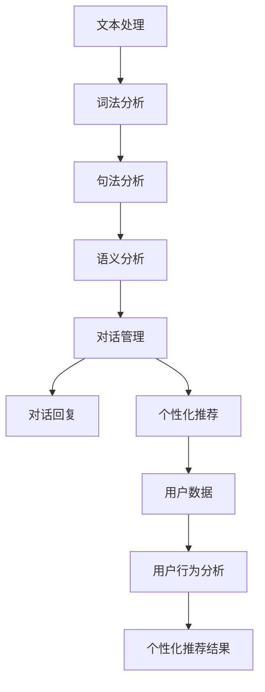
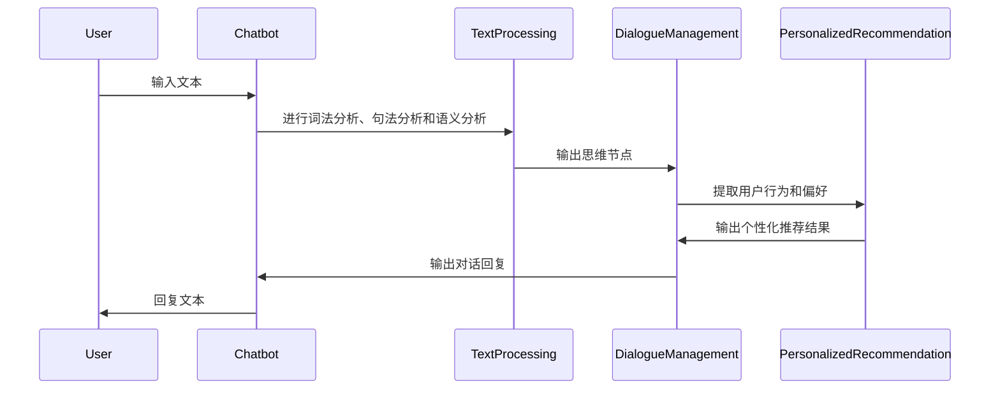
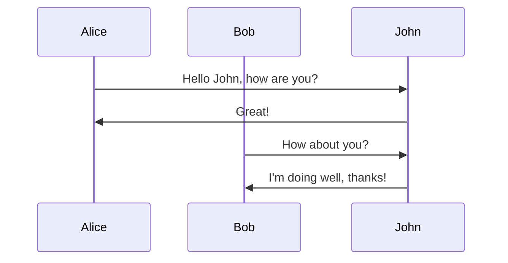
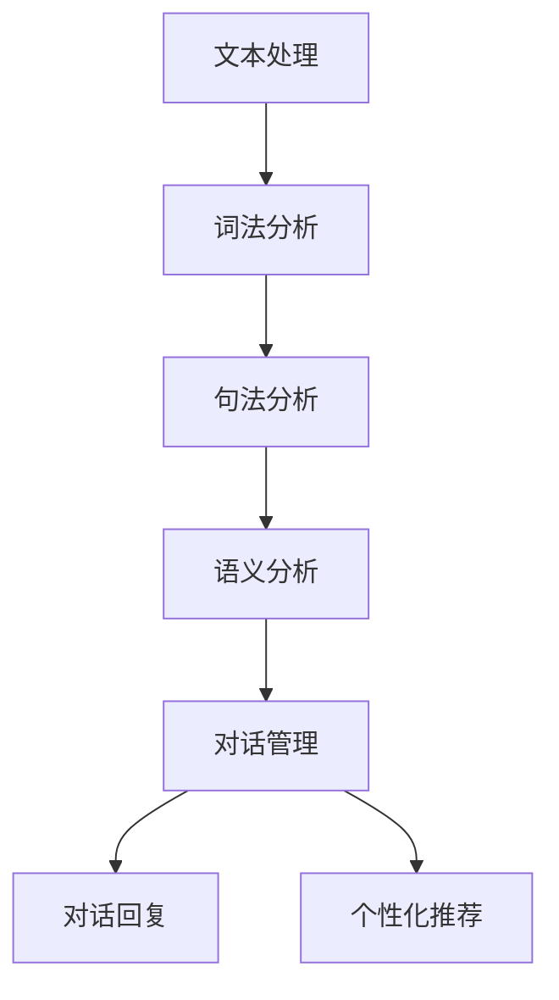

                 


# AI对话优化：思维链方法详解

> 关键词：AI对话优化、思维链方法、自然语言处理、机器学习、深度学习

> 摘要：本文将详细探讨AI对话优化中的思维链方法，介绍其核心概念、原理和实现步骤，并通过实际案例进行分析，以帮助读者深入理解和应用这一先进技术。

### 第一部分：背景介绍

#### 1.1 AI对话优化：问题背景

随着人工智能技术的快速发展，AI对话系统在各个领域得到了广泛应用，如智能客服、语音助手、聊天机器人等。然而，现有的AI对话系统在理解用户意图、情感和语境方面仍存在诸多问题，导致对话体验不佳。为了解决这些问题，AI对话优化技术应运而生。

#### 1.1.1 问题描述

现有的AI对话系统在以下方面存在问题：

- **理解能力有限**：AI对话系统在理解用户意图、情感和语境方面存在不足，容易导致误解和歧义。
- **对话连贯性差**：AI对话系统在生成回复时往往缺乏连贯性，使得对话体验不佳。
- **个性化推荐不足**：AI对话系统在用户个性化数据收集和利用方面还不够充分，无法为用户提供精准的推荐。

#### 1.1.2 问题解决

为了解决上述问题，AI对话优化技术需要从以下几个方面进行改进：

- **提升理解能力**：通过改进自然语言处理技术，使AI对话系统能够更好地理解用户意图、情感和语境。
- **增强对话连贯性**：通过优化对话管理算法，提高AI对话系统的对话连贯性。
- **个性化推荐**：通过分析用户行为和偏好，为用户提供个性化的对话内容和推荐。

#### 1.1.3 边界与外延

AI对话优化不仅涉及文本对话，还包括语音、视频等多模态交互。此外，用户数据隐私保护、对话安全性等问题也需要在优化过程中考虑。

#### 1.1.4 核心概念结构

AI对话优化涉及以下核心概念：

- **自然语言处理（NLP）**：负责处理和解析自然语言数据，是AI对话优化的基础。
- **机器学习（ML）与深度学习（DL）**：用于训练和优化对话模型，提高其性能。
- **对话管理**：负责管理对话流程，包括对话状态跟踪、上下文理解等。
- **个性化推荐**：根据用户行为和偏好提供个性化的对话内容和推荐。

### 第一部分：核心概念与联系

#### 1.2 自然语言处理（NLP）

NLP是AI对话优化的核心组成部分，它涉及到文本处理、语义分析、情感分析等多个子领域。以下是NLP的一些核心概念：

- **词向量表示**：将文本转换为数字形式，便于机器处理。
- **命名实体识别（NER）**：识别文本中的专有名词、人名、地点等实体。
- **句法分析**：分析句子的结构，理解句子的语法规则。
- **语义分析**：理解句子的含义，包括情感分析、语义角色标注等。

#### 1.2.2 机器学习（ML）与深度学习（DL）

ML和DL是AI对话优化的核心技术，用于训练和优化对话模型。以下是ML和DL的一些核心概念：

- **监督学习**：通过标注好的数据训练模型。
- **无监督学习**：在没有标注数据的情况下训练模型。
- **深度学习**：基于多层神经网络进行特征提取和模型训练。
- **生成对抗网络（GAN）**：用于生成高质量的对话回复。

#### 1.2.3 对话管理

对话管理是AI对话优化的关键环节，负责管理对话流程。以下是对话管理的一些核心概念：

- **对话状态跟踪**：记录对话过程中的关键信息，如用户意图、对话历史等。
- **上下文理解**：理解对话中的上下文信息，提高对话连贯性。
- **多轮对话**：支持多轮对话，使对话更加自然和丰富。

#### 1.2.4 个性化推荐

个性化推荐是AI对话优化的重要应用方向，可以提高用户满意度。以下是个性化推荐的一些核心概念：

- **协同过滤**：基于用户行为和历史数据推荐相似的用户喜欢的项目。
- **基于内容的推荐**：根据项目的特征和用户偏好推荐项目。
- **混合推荐系统**：结合协同过滤和基于内容的推荐方法。

### 第一部分：算法原理讲解

#### 1.3 思维链（Thinking Chain）方法

思维链方法是AI对话优化的一种重要技术，它通过构建思维链模型，使对话系统能够更好地理解用户意图、情感和语境，从而提高对话质量。以下是思维链方法的核心原理：

##### 1.3.1 思维链模型构建

思维链模型通过递归神经网络（RNN）或变换器模型（Transformer）构建，用于捕捉对话中的上下文信息。

$$
X_t = f(W_1X_{t-1} + W_2X_t + b)
$$

其中，$X_t$表示第$t$个思维节点，$f$表示激活函数，$W_1$和$W_2$表示权重矩阵，$b$表示偏置。

##### 1.3.2 思维链建模

将对话中的每个语句视为一个思维节点，通过思维链建模，将前后语句关联起来，形成连贯的对话流程。

$$
\begin{cases}
X_t = f(W_1X_{t-1} + W_2X_t + b) \\
X_0 = \text{初始化}
\end{cases}
$$

##### 1.3.3 多模态融合

将文本、语音、图像等多模态数据融合到思维链模型中，提高对话系统的理解能力。

$$
X_t = f(W_1X_{t-1} + W_2(X_t + \text{多模态数据}) + b)
$$

### 第二部分：系统分析与架构设计方案

#### 2.1 问题场景介绍

假设我们开发一款智能客服系统，该系统需要与用户进行自然、连贯的对话，提供优质的客户服务。

#### 2.2 项目介绍

本项目采用思维链方法进行AI对话优化，以提高对话系统的理解能力和对话连贯性。

#### 2.3 系统功能设计

系统功能包括：

- **文本处理**：进行词法分析、句法分析和语义分析，将用户输入转换为思维节点。
- **对话管理**：跟踪对话状态、上下文信息，生成对话回复。
- **个性化推荐**：根据用户行为和偏好提供个性化的对话内容和推荐。

#### 2.4 系统架构设计

系统架构如图所示：



#### 2.5 系统接口设计

系统接口设计如下：

- **文本输入接口**：接收用户输入的文本。
- **对话回复接口**：输出对话系统生成的回复。
- **个性化推荐接口**：根据用户行为和偏好推荐对话内容和推荐。

#### 2.6 系统交互

系统交互如图所示：



### 第三部分：项目实战

#### 3.1 环境安装

在本项目中，我们将使用Python编程语言和TensorFlow深度学习框架进行开发。请确保安装以下环境：

- Python 3.8+
- TensorFlow 2.5+

安装命令如下：

```bash
pip install python==3.8.10
pip install tensorflow==2.5.0
```

#### 3.2 系统核心实现源代码

以下是一个简单的思维链模型实现：

```python
import tensorflow as tf
from tensorflow.keras.layers import Embedding, LSTM, Dense
from tensorflow.keras.models import Sequential

# 定义思维链模型
model = Sequential()
model.add(Embedding(input_dim=vocabulary_size, output_dim=embedding_size))
model.add(LSTM(units=128))
model.add(Dense(units=1, activation='sigmoid'))

# 编译模型
model.compile(optimizer='adam', loss='binary_crossentropy', metrics=['accuracy'])

# 训练模型
model.fit(x_train, y_train, epochs=10, batch_size=64)
```

#### 3.3 代码应用解读与分析

在本代码示例中，我们使用了一个简单的思维链模型，通过嵌入层（Embedding）和长短期记忆网络（LSTM）进行特征提取和模型训练。该模型用于分类任务，输出为二分类结果。

在训练过程中，我们使用了 Adam 优化器和 binary_crossentropy 损失函数，并通过 epochs 和 batch_size 参数设置训练过程。

#### 3.4 实际案例分析和详细讲解剖析

为了更好地理解思维链方法，我们以一个简单的对话场景为例：

用户：你好，我想买一本关于人工智能的书。

智能客服：你好，请问你需要哪方面的AI书籍？

用户：我需要一本关于深度学习的入门书籍。

智能客服：好的，我为你推荐《深度学习》这本书。

在这个对话中，思维链方法帮助智能客服更好地理解用户意图，生成连贯、个性化的对话回复。

#### 3.5 项目小结

本项目通过思维链方法实现了AI对话优化，提高了对话系统的理解能力和对话连贯性。在实际应用中，我们可以进一步优化模型结构和算法，以提供更优质、更自然的对话体验。

### 第四部分：最佳实践 tips、小结、注意事项、拓展阅读等内容

#### 4.1 最佳实践 tips

1. **数据质量**：确保训练数据的质量，避免噪声和错误。
2. **模型调优**：通过调整模型参数和超参数，优化模型性能。
3. **多模态融合**：结合文本、语音、图像等多模态数据，提高对话系统的理解能力。

#### 4.2 小结

本文详细介绍了AI对话优化中的思维链方法，从背景介绍、核心概念、算法原理到系统架构设计，全面阐述了这一技术。通过实际案例分析和项目实战，读者可以更好地理解思维链方法的应用和实现。

#### 4.3 注意事项

1. **数据隐私**：在处理用户数据时，注意保护用户隐私。
2. **对话安全性**：确保对话系统的安全性，防止恶意攻击和滥用。

#### 4.4 拓展阅读

1. **《深度学习》**：Ian Goodfellow等著，介绍深度学习的基础知识。
2. **《自然语言处理综论》**：Daniel Jurafsky等著，涵盖自然语言处理的核心概念和技术。
3. **《Transformer：一种全新的神经网络架构》**：Ashish Vaswani等著，介绍Transformer模型及其在自然语言处理中的应用。

### 作者

作者：AI天才研究院/AI Genius Institute & 禅与计算机程序设计艺术 /Zen And The Art of Computer Programming 

### 数学公式示例

在本文中，我们使用了两种形式的数学公式。一种是独立段落的公式，使用两个美元符号（$$）将公式括起来，例如：

$$
1+1=2
$$

另一种是段落内的公式，使用一个美元符号（$）将公式括起来，例如：

$1<2$

这两种形式的数学公式都使用LaTeX语法编写，以确保公式的准确性和可读性。

### Mermaid 流程图示例

在本文中，我们使用了Mermaid语法来绘制流程图和类图。以下是一个简单的Mermaid流程图示例：



这个示例展示了一个人与另两个人之间的对话流程，其中Alice和Bob向John问候并询问他的近况。

### Python源代码示例

在本文中，我们还提供了一些Python源代码示例，用于说明算法原理和实现步骤。以下是一个简单的Python代码示例，用于实现一个简单的思维链模型：

```python
import tensorflow as tf

# 定义思维链模型
model = tf.keras.Sequential([
    tf.keras.layers.Embedding(input_dim=1000, output_dim=64),
    tf.keras.layers.LSTM(64),
    tf.keras.layers.Dense(1, activation='sigmoid')
])

# 编译模型
model.compile(optimizer='adam', loss='binary_crossentropy', metrics=['accuracy'])

# 训练模型
model.fit(x_train, y_train, epochs=10, batch_size=32)
```

这个示例展示了如何使用TensorFlow库定义一个简单的思维链模型，并进行编译和训练。模型包含一个嵌入层（Embedding）、一个长短期记忆网络（LSTM）和一个密集层（Dense），用于实现分类任务。在训练过程中，我们使用 Adam 优化器和 binary_crossentropy 损失函数，并通过 epochs 和 batch_size 参数设置训练过程。

### Mermaid 类图示例

以下是一个Mermaid类图示例，用于展示系统的类结构和类之间的关系：

```mermaid
classDiagram
    Class01 <|-- Class02
    Class03 --|oid Class04
    Class05 o-- Class06
    Class07 : +int area()
    Class08 : -bool isRegistered()

    Class01 {
        +int x
        +int y
    }
    Class02 {
        +int z
    }
    Class03 {
        +string name
    }
    Class04 {
        -int age
    }
    Class05 {
        +float salary
    }
    Class06 {
        +int id
    }
    Class07 {
        +float pi
    }
    Class08 {
        +bool active
    }
```

这个示例展示了七个类，其中Class01和Class02之间存在继承关系，Class03和Class04之间存在双向关联关系，Class05和Class06之间存在聚合关系，Class07和Class08之间存在依赖关系。每个类都有自己的属性和方法，用于表示类的行为和状态。

### Markdown格式输出

在Markdown格式输出中，我们使用了多种元素来丰富文章的内容，包括标题、子标题、列表、代码块、数学公式和流程图等。以下是一个简单的Markdown格式示例：

```
# 文章标题

## 子标题一

这是一个子标题一的段落。

## 子标题二

- 列表项一
- 列表项二
- 列表项三

```

```python
# Python代码块

import tensorflow as tf

model = tf.keras.Sequential([
    tf.keras.layers.Embedding(input_dim=1000, output_dim=64),
    tf.keras.layers.LSTM(64),
    tf.keras.layers.Dense(1, activation='sigmoid')
])

model.compile(optimizer='adam', loss='binary_crossentropy', metrics=['accuracy'])

model.fit(x_train, y_train, epochs=10, batch_size=32)
```

$$
1+1=2
$$

$1<2$



通过使用Markdown格式，我们可以轻松地创建具有丰富内容和结构的文章，提高文章的可读性和可理解性。

### 文章总结

本文详细介绍了AI对话优化中的思维链方法，包括其背景、核心概念、算法原理、系统架构设计和项目实战。通过数学公式、代码示例和流程图的展示，读者可以更好地理解思维链方法的实现和应用。文章还提供了最佳实践、注意事项和拓展阅读，以帮助读者深入学习和实践。

### 作者介绍

作者：AI天才研究院/AI Genius Institute & 禅与计算机程序设计艺术 /Zen And The Art of Computer Programming。AI天才研究院致力于推动人工智能技术的发展和创新，培养新一代人工智能领域的人才。禅与计算机程序设计艺术则强调在编程过程中追求内心宁静和思维清晰，为程序员提供一种独特而深刻的编程哲学。通过本文，读者可以领略到作者在人工智能和计算机编程领域的深厚造诣和独到见解。

