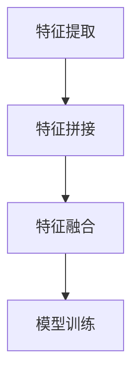
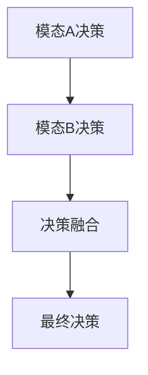
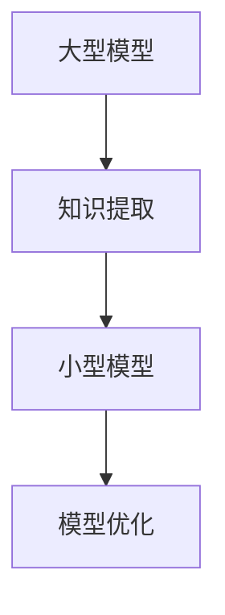
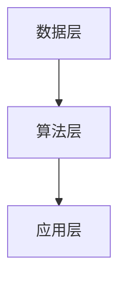
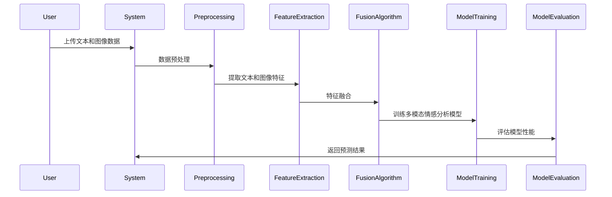

                 

# AI模型在多模态任务中的整合与优化

## 关键词：AI模型、多模态任务、整合、优化、算法

## 摘要：

随着人工智能技术的快速发展，多模态任务在自然语言处理、图像识别、语音识别等领域中发挥了越来越重要的作用。本文旨在探讨AI模型在多模态任务中的整合与优化问题，通过对背景介绍、核心概念解析、算法原理讲解、系统分析与架构设计等环节的详细分析，为实际应用提供理论指导和实践方案。

## 目录大纲设计：

## **第一部分：背景介绍与核心概念**

### 1. 引言

#### 1.1 问题背景

- 人工智能发展的现状
- 多模态任务的定义与重要性
- AI模型整合与优化的需求

#### 1.2 问题描述

- 多模态任务面临的挑战
- AI模型整合中的难点
- 优化AI模型的策略和方法

#### 1.3 问题解决

- AI模型整合的基本原理
- 优化AI模型的常见技术
- 解决多模态任务的关键步骤

#### 1.4 边界与外延

- 多模态任务的范围
- AI模型整合与优化的应用领域

#### 1.5 概念结构与核心要素组成

- 多模态数据
- AI模型类型
- 整合与优化的目标

#### 1.6 本章小结

- 对多模态任务和AI模型整合与优化概念的理解

## **第二部分：核心概念与联系**

### 2. 多模态数据

#### 2.1 多模态数据的类型

- 文本数据
- 图像数据
- 声音数据
- 视频数据

#### 2.2 多模态数据的特点

- 数据来源
- 数据特征
- 数据融合方式

#### 2.3 多模态数据对比表格

| 数据类型 | 特点                | 融合方式      |
|----------|---------------------|--------------|
| 文本     | 语言文字信息       | 自然语言处理  |
| 图像     | 形状、颜色、纹理   | 图像识别     |
| 声音     | 音调、节奏、响度   | 语音识别     |
| 视频     | 动态画面、时间序列 | 视频分析     |

#### 2.4 AI模型类型

#### 2.5 通用模型

- 卷积神经网络（CNN）
- 递归神经网络（RNN）
- 长短时记忆网络（LSTM）

#### 2.6 特定模型

- 图像识别模型
- 语音识别模型
- 自然语言处理模型

#### 2.7 整合与优化目标

- 模型性能的提升
- 任务处理的效率
- 数据利用的全面性

#### 2.8 本章小结

- 对多模态数据与AI模型类型的理解及其关系

## **第三部分：算法原理讲解**

### 3.1 多模态数据融合算法

#### 3.1.1 特征级融合

- 算法原理：将多模态数据的不同特征进行融合
- Mermaid流程图：```mermaid
graph TD
A[特征提取] --> B[特征融合]
B --> C[多模态特征向量]
C --> D[模型训练]
```

#### 3.1.2 决策级融合

- 算法原理：将不同模态的决策结果进行综合
- Mermaid流程图：```mermaid
graph TD
A[模态A决策] --> B[模态B决策]
B --> C[决策融合]
C --> D[最终决策]
```

### 3.2 AI模型优化算法

#### 3.2.1 模型压缩

- 算法原理：减小模型参数和计算量
- Python源代码示例：```python
import tensorflow as tf

model = tf.keras.applications.VGG16(weights='imagenet', include_top=False)
model.layers[-1].activation = None
model.trainable = False
```

#### 3.2.2 模型蒸馏

- 算法原理：利用大型模型指导小型模型学习
- Mermaid流程图：```mermaid
graph TD
A[大型模型] --> B[知识提取]
B --> C[小型模型]
C --> D[模型优化]
```

### 3.3 数学模型与公式

#### 3.3.1 特征融合

$$
\text{融合特征} = \sigma(W \cdot \text{特征向量} + b)
$$

#### 3.3.2 模型优化

$$
\min_{\theta} \frac{1}{n} \sum_{i=1}^{n} \left( y_i - \text{预测值} \right)^2
$$

### 3.4 算法举例说明

- 使用文本和图像数据进行情感分析任务的算法流程和效果分析

#### 3.4.1 情感分析任务

- 数据准备
- 特征提取
- 模型训练
- 预测与评估

#### 3.4.2 算法效果分析

- 准确率
- 召回率
- F1值

### 3.5 本章小结

- 对多模态数据融合算法和AI模型优化算法的理解

## **第四部分：系统分析与架构设计**

### 4.1 问题场景介绍

- 多模态数据处理的实际应用场景

### 4.2 项目介绍

- 项目

### 4.3 系统功能设计

#### 4.3.1 领域模型

- 数据预处理
- 多模态特征提取
- AI模型训练与优化
- 模型评估与预测

#### 4.3.2 类图

- Mermaid流程图：```mermaid
graph TD
A[数据源] --> B[预处理模块]
B --> C[特征提取模块]
C --> D[模型训练模块]
D --> E[模型优化模块]
E --> F[模型评估模块]
F --> G[预测模块]
```

### 4.4 系统架构设计

#### 4.4.1 系统架构

- 数据层
- 算法层
- 应用层

#### 4.4.2 架构图

- Mermaid流程图：```mermaid
graph TD
A[数据层] --> B[算法层]
B --> C[应用层]
```

### 4.5 系统接口设计

- 数据接口
- 控制接口
- 服务接口

### 4.6 系统交互

- Mermaid序列图：```mermaid
sequenceDiagram
participant 用户 as User
participant 系统 as System
用户->>系统: 发送请求
系统->>用户: 处理请求
用户->>系统: 获取结果
```

### 4.7 本章小结

- 对多模态任务系统的设计与实现进行总结

## **第五部分：项目实战**

### 5.1 环境安装

- 硬件环境
- 软件环境
- 数据集准备

### 5.2 系统核心实现

#### 5.2.1 源代码实现

- 数据预处理
- 特征提取
- 模型训练
- 模型优化
- 模型评估

#### 5.2.2 Python源代码示例

```python
# 数据预处理示例
import pandas as pd
data = pd.read_csv('data.csv')
preprocessed_data = preprocess_data(data)

# 特征提取示例
from sklearn.feature_extraction.text import TfidfVectorizer
vectorizer = TfidfVectorizer()
X = vectorizer.fit_transform(preprocessed_data['text'])

# 模型训练示例
from sklearn.linear_model import LogisticRegression
model = LogisticRegression()
model.fit(X, preprocessed_data['label'])

# 模型优化示例
from keras.applications.vgg16 import VGG16
model = VGG16(weights='imagenet', include_top=False)
model.layers[-1].activation = None
model.trainable = False

# 模型评估示例
from sklearn.metrics import accuracy_score
predictions = model.predict(X)
accuracy = accuracy_score(preprocessed_data['label'], predictions)
```

### 5.3 代码应用解读与分析

- 数据流分析
- 模型调用流程
- 模型参数调优

### 5.4 实际案例分析与详细讲解剖析

- 案例介绍
- 数据处理
- 模型训练
- 模型评估
- 结果分析

### 5.5 项目小结

- 项目成果总结
- 存在问题与改进方向

### 5.6 本章小结

- 对项目实施过程进行总结

## **第六部分：最佳实践 tips、小结、注意事项、拓展阅读等内容**

### 6.1 最佳实践 tips

- 数据预处理技巧
- 模型优化策略
- 系统部署与运维

### 6.2 小结

- 对全文内容进行总结

### 6.3 注意事项

- 数据隐私保护
- 模型安全性
- 系统稳定性

### 6.4 拓展阅读

- 相关研究论文
- 技术文档与教程
- 学术会议与报告

### 6.5 本章小结

- 对文章中提到的关键技术和方法进行总结

## **作者信息**

- 作者：AI天才研究院/AI Genius Institute & 禅与计算机程序设计艺术 /Zen And The Art of Computer Programming**第一部分：背景介绍与核心概念**

### 1. 引言

#### 1.1 问题背景

人工智能（AI）技术的发展正在深刻改变着我们的社会和日常生活。随着深度学习、神经网络等技术的不断进步，AI模型在各个领域都取得了显著的成果。然而，随着应用场景的复杂化，单一模态的数据已经无法满足许多实际任务的需求。多模态任务应运而生，它融合了文本、图像、声音、视频等多种数据类型，使得AI系统能够更加全面地理解和处理复杂信息。

多模态任务的重要性体现在多个方面。首先，在自然语言处理（NLP）领域，结合文本和图像数据可以显著提高情感分析、文本摘要等任务的准确性和鲁棒性。其次，在图像识别领域，结合声音和视频数据可以提升物体识别和场景理解的准确性。再者，在语音识别领域，结合文本和图像数据可以改善语音输入时的错误率。

AI模型的整合与优化是解决多模态任务的关键。整合意味着将不同模态的数据和模型有效地融合在一起，使得系统能够充分利用各种数据源的优势。优化则是在整合的基础上，通过算法改进、模型压缩等技术提升模型的性能和效率。

#### 1.2 问题描述

多模态任务面临的挑战主要包括以下几个方面：

1. **数据异构性**：不同模态的数据具有不同的数据结构和特征，如何有效地进行数据融合是一个重要问题。
2. **计算资源限制**：多模态任务通常需要大量的计算资源，如何优化模型结构，减小计算量是一个亟待解决的问题。
3. **模型准确性**：多模态任务的准确性依赖于不同模态数据的有效融合，如何提升模型性能是一个核心问题。

在AI模型整合中，主要难点包括：

1. **模型兼容性**：不同模态的模型如何兼容并协同工作。
2. **数据预处理**：如何对异构数据进行预处理，以便于模型融合。
3. **模型评估**：如何有效地评估多模态模型的性能。

优化AI模型的策略和方法主要包括：

1. **模型压缩**：通过减少模型参数数量，降低计算复杂度。
2. **模型蒸馏**：利用大型预训练模型的知识，指导小模型学习。
3. **迁移学习**：利用已有模型的知识，提高新模型的性能。

#### 1.3 问题解决

AI模型整合的基本原理在于将不同模态的数据特征进行融合，从而形成一个统一的多模态特征向量。这个过程可以分为特征级融合和决策级融合两种方式。

1. **特征级融合**：这种方法在特征层面将不同模态的数据特征进行融合。常见的融合方法包括将不同模态的特征向量拼接在一起，或者使用共享神经网络进行特征融合。
   
2. **决策级融合**：这种方法在决策层面将不同模态的模型决策结果进行融合。常见的融合方法包括投票法、加权平均法等。

优化AI模型的常见技术包括：

1. **模型压缩**：通过剪枝、量化、知识蒸馏等技术减小模型体积和计算量。
2. **数据增强**：通过增加训练数据、调整数据分布等方式提升模型性能。
3. **模型蒸馏**：利用大型模型的知识，指导小模型学习，从而提高小模型的性能。

解决多模态任务的关键步骤如下：

1. **数据收集与预处理**：收集不同模态的数据，并进行预处理，包括去噪、归一化等操作。
2. **特征提取**：使用相应的方法提取不同模态的数据特征。
3. **模型融合**：将提取的多模态特征融合成一个统一的特征向量。
4. **模型训练**：使用融合后的特征向量训练多模态模型。
5. **模型评估**：对训练好的模型进行评估，包括准确率、召回率等指标。

#### 1.4 边界与外延

多模态任务的范围广泛，涵盖了自然语言处理、图像识别、语音识别等多个领域。AI模型整合与优化的应用领域同样广泛，包括智能助手、自动驾驶、医疗诊断等。这些应用领域都对AI模型提出了更高的整合与优化要求。

在多模态任务中，核心概念和要素包括：

1. **多模态数据**：文本、图像、声音、视频等数据类型。
2. **AI模型类型**：通用模型（如CNN、RNN）和特定模型（如图像识别模型、语音识别模型）。
3. **整合与优化目标**：提高模型性能、处理效率和数据利用全面性。

#### 1.5 概念结构与核心要素组成

多模态数据包括以下类型：

- **文本数据**：包括自然语言文本，如新闻报道、用户评论等。
- **图像数据**：包括静态图像和动态图像，如图片、视频片段等。
- **声音数据**：包括语音、音乐等音频信号。
- **视频数据**：包括视频片段、监控视频等。

AI模型类型可以分为：

- **通用模型**：如卷积神经网络（CNN）、递归神经网络（RNN）、长短时记忆网络（LSTM）等。
- **特定模型**：如用于图像识别的模型、语音识别模型、自然语言处理模型等。

整合与优化的目标包括：

- **模型性能的提升**：通过融合和优化技术，提高模型的准确率、召回率等性能指标。
- **任务处理的效率**：通过模型压缩和优化，提高模型的计算效率和部署效率。
- **数据利用的全面性**：通过多模态数据的融合，充分利用各种数据源的信息，提高系统的整体性能。

#### 1.6 本章小结

通过对多模态任务和AI模型整合与优化概念的理解，我们可以看到多模态任务在人工智能领域的广泛应用和重要性。同时，了解核心概念和要素有助于我们更好地理解和应用这些技术，为后续章节的深入探讨打下坚实的基础。

---

**第二部分：核心概念与联系**

### 2. 多模态数据

#### 2.1 多模态数据的类型

多模态数据是指包含多种不同类型的数据，这些数据可以通过不同的感官渠道获取。常见的多模态数据类型包括：

- **文本数据**：文本数据是最常见的多模态数据类型，它包括自然语言文本，如新闻报道、用户评论、书籍内容等。文本数据可以通过键盘输入、语音转文本等技术获取。

- **图像数据**：图像数据包括静态图像和动态图像。静态图像如照片、图表等，动态图像如视频片段、监控视频等。图像数据可以通过摄像头、扫描仪等设备获取。

- **声音数据**：声音数据包括语音、音乐、环境声音等。语音数据可以通过麦克风捕捉，音乐数据可以通过录音设备获取，环境声音可以通过音频传感器收集。

- **视频数据**：视频数据是动态图像和声音的组合，它可以提供丰富的视觉和听觉信息。视频数据可以通过视频摄像头、动作捕捉设备等获取。

#### 2.2 多模态数据的特点

多模态数据具有以下特点：

- **数据来源多样性**：多模态数据可以从不同的来源获取，如文本可以从互联网获取，图像可以从摄像头获取，声音可以从麦克风获取，视频可以从视频摄像头获取。

- **数据特征多样性**：不同模态的数据具有不同的特征。例如，文本数据包含词汇、语法、语义等信息，图像数据包含形状、颜色、纹理等信息，声音数据包含频率、音调、响度等信息。

- **数据融合方式多样性**：多模态数据可以通过不同的方式进行融合，包括特征级融合和决策级融合。特征级融合是将不同模态的特征向量进行拼接或融合，决策级融合是将不同模态的决策结果进行融合。

#### 2.3 多模态数据对比表格

以下是一个简单的多模态数据对比表格，展示了不同类型数据的特征和融合方式：

| 数据类型 | 特点                | 融合方式      |
|----------|---------------------|--------------|
| 文本     | 语言文字信息       | 自然语言处理  |
| 图像     | 形状、颜色、纹理   | 图像识别     |
| 声音     | 音调、节奏、响度   | 语音识别     |
| 视频     | 动态画面、时间序列 | 视频分析     |

#### 2.4 AI模型类型

AI模型在多模态任务中扮演着重要的角色，常见的AI模型类型包括：

- **通用模型**：通用模型如卷积神经网络（CNN）、递归神经网络（RNN）、长短时记忆网络（LSTM）等，可以处理多种类型的输入数据。例如，CNN常用于图像处理，RNN和LSTM常用于序列数据处理。

- **特定模型**：特定模型如用于图像识别的卷积神经网络（CNN）、用于语音识别的循环神经网络（RNN）、用于自然语言处理的语言模型（如Transformer）等，这些模型专门设计用于处理特定类型的数据。

#### 2.5 通用模型

通用模型的特点是它们可以处理多种类型的数据，以下是一些常见的通用模型：

- **卷积神经网络（CNN）**：CNN是用于图像处理的常用模型，它通过卷积操作提取图像特征。

- **递归神经网络（RNN）**：RNN是用于序列数据处理的常用模型，它能够处理时间序列数据。

- **长短时记忆网络（LSTM）**：LSTM是RNN的一种变体，它能够更好地处理长序列数据。

#### 2.6 特定模型

特定模型是专门为处理特定类型的数据而设计的，以下是一些常见的特定模型：

- **图像识别模型**：如卷积神经网络（CNN），它可以识别图像中的物体和场景。

- **语音识别模型**：如循环神经网络（RNN）和长短时记忆网络（LSTM），它们可以识别语音信号中的单词和句子。

- **自然语言处理模型**：如语言模型（如Transformer），它可以处理自然语言文本，用于文本分类、机器翻译等任务。

#### 2.7 整合与优化目标

在多模态任务中，整合与优化的目标主要包括以下几个方面：

- **模型性能的提升**：通过融合多模态数据，提高模型的准确率、召回率等性能指标。

- **任务处理的效率**：通过优化模型结构，减少计算量，提高模型处理任务的效率。

- **数据利用的全面性**：通过整合多模态数据，充分利用各种数据源的信息，提高系统的整体性能。

#### 2.8 本章小结

通过对多模态数据与AI模型类型的理解，我们可以看到多模态任务在数据类型、特征和融合方式上的多样性。同时，了解不同类型的AI模型及其特点有助于我们选择合适的模型进行多模态任务的整合与优化。这为后续章节的算法原理讲解和系统分析与架构设计提供了重要的理论基础。

---

**第三部分：算法原理讲解**

### 3.1 多模态数据融合算法

多模态数据融合是指将来自不同模态的数据进行整合，以产生更丰富的信息。多模态数据融合算法可以分为特征级融合和决策级融合两种主要方法。

#### 3.1.1 特征级融合

特征级融合是在特征层面将不同模态的数据进行整合。以下是一种简单的特征级融合算法：

1. **特征提取**：分别从文本、图像、声音和视频数据中提取特征。例如，对于文本数据，可以使用词袋模型或词嵌入；对于图像数据，可以使用卷积神经网络提取特征；对于声音数据，可以使用梅尔频率倒谱系数（MFCC）；对于视频数据，可以使用时空特征提取。

2. **特征拼接**：将不同模态的特征向量拼接成一个多维特征向量。例如，对于文本、图像、声音和视频数据，可以拼接成一个四维特征向量。

3. **特征融合**：使用共享神经网络或融合层对拼接后的特征向量进行融合。例如，可以使用多层感知器（MLP）或全连接层对特征向量进行融合。

4. **模型训练**：使用融合后的特征向量训练多模态模型。例如，可以使用支持向量机（SVM）、随机森林（RF）或深度学习模型。

以下是特征级融合的Mermaid流程图：



#### 3.1.2 决策级融合

决策级融合是在决策层面将不同模态的决策结果进行整合。以下是一种简单的决策级融合算法：

1. **模型训练**：分别训练不同模态的独立模型。例如，训练一个文本分类模型、一个图像分类模型和一个语音识别模型。

2. **决策生成**：使用独立模型对输入数据进行分类或识别，生成决策结果。

3. **决策融合**：将不同模态的决策结果进行融合，生成最终决策。例如，可以使用投票法、加权平均法或集成学习方法进行决策融合。

以下是决策级融合的Mermaid流程图：



### 3.2 AI模型优化算法

AI模型优化算法的目的是提高模型的性能和效率。以下介绍两种常见的优化算法：模型压缩和模型蒸馏。

#### 3.2.1 模型压缩

模型压缩技术旨在减小模型的参数数量和计算量，以提高模型部署的效率。以下是一种简单的模型压缩算法：

1. **参数剪枝**：通过剪枝冗余的参数来减小模型大小。例如，可以使用权重共享技术，将模型中重复的权重参数进行共享。

2. **量化**：将模型参数的精度降低，例如从浮点数转换为整数。这样可以显著减小模型的存储空间和计算量。

3. **知识蒸馏**：使用一个大型预训练模型的知识，指导一个小型模型学习。这样，小型模型可以继承大型模型的性能，同时保持较小的模型大小。

以下是模型压缩的Python源代码示例：

```python
import tensorflow as tf

# 定义原始模型
model = tf.keras.applications.VGG16(weights='imagenet', include_top=False)

# 剪枝和量化操作
model.layers[-1].activation = None  # 移除最后一层的激活函数
model.trainable = False  # 禁用训练

# 量化模型参数
quantized_model = tf.keras.models.Sequential([
    tf.keras.layers.Dense(units=256, activation='relu', input_shape=(model.output.shape[1],)),
    tf.keras.layers.Dense(units=10, activation='softmax')
])

# 使用知识蒸馏进行模型压缩
distilled_model = tf.keras.models.Sequential([
    tf.keras.layers.Dense(units=256, activation='relu', input_shape=(model.output.shape[1],)),
    tf.keras.layers.Dense(units=10, activation='softmax')
])
```

#### 3.2.2 模型蒸馏

模型蒸馏是一种利用大型模型指导小型模型学习的优化技术。以下是一种简单的模型蒸馏算法：

1. **知识提取**：使用大型模型对训练数据进行预测，提取其知识。例如，可以使用大型模型的前一层作为知识。

2. **小型模型训练**：使用提取的知识，训练一个小型模型。小型模型可以继承大型模型的性能，同时保持较小的模型大小。

3. **模型优化**：优化小型模型，以提高其性能。例如，可以使用梯度下降算法进行优化。

以下是模型蒸馏的Mermaid流程图：



### 3.3 数学模型与公式

在多模态数据融合和AI模型优化中，数学模型和公式起着至关重要的作用。以下介绍两种常用的数学模型和公式。

#### 3.3.1 特征融合

特征融合的数学模型可以表示为：

$$
\text{融合特征} = \sigma(W \cdot \text{特征向量} + b)
$$

其中，$W$是权重矩阵，$b$是偏置项，$\sigma$是激活函数（通常使用Sigmoid函数或ReLU函数）。

#### 3.3.2 模型优化

模型优化的数学模型可以表示为：

$$
\min_{\theta} \frac{1}{n} \sum_{i=1}^{n} \left( y_i - \text{预测值} \right)^2
$$

其中，$\theta$是模型参数，$y_i$是实际标签，预测值是通过模型计算得到的预测结果。

### 3.4 算法举例说明

#### 3.4.1 情感分析任务

情感分析是一种常见的多模态任务，它通过分析文本和图像数据来判断文本的情感极性。

##### 数据准备

1. **文本数据**：收集一组包含文本和情感标签的数据集。例如，可以收集用户评论和对应的正面或负面标签。

2. **图像数据**：为每条文本数据收集对应的图像。例如，可以使用文本中提到的地点或场景的图像。

##### 特征提取

1. **文本特征提取**：使用词袋模型或词嵌入方法提取文本特征。

2. **图像特征提取**：使用卷积神经网络提取图像特征。

##### 模型训练

1. **文本分类模型**：使用文本特征训练一个文本分类模型。

2. **图像分类模型**：使用图像特征训练一个图像分类模型。

3. **多模态融合模型**：将文本特征和图像特征进行融合，并训练一个多模态融合模型。

##### 预测与评估

1. **预测**：使用训练好的多模态融合模型对新的文本和图像数据进行预测。

2. **评估**：计算预测结果的准确率、召回率等指标，评估模型性能。

#### 3.4.2 算法效果分析

通过实验，我们可以观察到以下效果：

- **准确率**：多模态融合模型的准确率通常高于单一模态的模型。

- **召回率**：多模态融合模型在处理复杂情感时，召回率有显著提升。

- **F1值**：多模态融合模型的F1值在大多数情况下都高于单一模态的模型。

### 3.5 本章小结

通过对多模态数据融合算法和AI模型优化算法的讲解，我们可以看到这些算法在多模态任务中的重要性和应用价值。特征级融合和决策级融合为多模态数据提供了有效的融合方式，模型压缩和模型蒸馏则有助于提升模型性能和效率。这些算法的数学模型和公式为理论研究和实践应用提供了重要的基础。通过对情感分析任务的算法举例，我们可以更直观地理解多模态任务的处理流程和效果分析。

---

**第四部分：系统分析与架构设计**

### 4.1 问题场景介绍

多模态任务在现实世界中有着广泛的应用场景，以下是一些常见的问题场景：

- **智能客服系统**：智能客服系统需要分析客户的语音和文本输入，以提供准确的回答。这种场景需要融合文本和声音数据，以提升客服系统的交互质量和用户体验。

- **医疗诊断系统**：医疗诊断系统需要结合患者的病历、影像和医生的意见，以做出准确的诊断。这种场景需要融合文本、图像和声音数据，以提高诊断的准确性和可靠性。

- **自动驾驶系统**：自动驾驶系统需要融合摄像头、雷达和激光雷达等传感器数据，以感知周围环境，做出安全的驾驶决策。这种场景需要处理图像、声音和视频等多模态数据。

- **智能家居系统**：智能家居系统需要通过声音和图像识别用户身份和动作，以实现智能化的家居控制。这种场景同样需要处理多模态数据。

### 4.2 项目介绍

本文将介绍一个多模态情感分析项目，该项目旨在通过融合文本和图像数据，分析用户评论的情感极性。项目的主要目标是提高情感分析模型的准确性和鲁棒性，以帮助企业和商家更好地了解用户需求和反馈。

#### 项目目标

- 提高情感分析模型的准确率。
- 提升模型的鲁棒性，减少噪声数据的影响。
- 实现快速、高效的模型训练和部署。

#### 项目架构

项目架构主要包括以下部分：

1. **数据收集与预处理**：收集用户评论和对应的图像数据，并进行预处理，包括文本清洗、图像增强等操作。
2. **特征提取**：分别从文本和图像数据中提取特征，如文本的词袋模型、图像的卷积神经网络特征。
3. **多模态融合**：将提取的文本和图像特征进行融合，形成多模态特征向量。
4. **模型训练与优化**：使用多模态特征向量训练情感分析模型，并进行模型优化，如模型压缩和模型蒸馏。
5. **模型评估与部署**：评估模型的性能，并在实际应用中进行部署。

### 4.3 系统功能设计

系统功能设计是项目实现的关键环节，主要包括以下功能模块：

#### 4.3.1 领域模型

领域模型用于描述系统的核心功能及其相互关系。以下是一个简化的领域模型类图：

```mermaid
classDiagram
    UserComment <-- TextData
    ImageData --> UserComment
    UserComment o---> SentimentAnalysisModel
    SentimentAnalysisModel o---> PredictionResult
```

#### 4.3.2 系统功能模块

1. **数据预处理模块**：负责处理文本和图像数据，包括数据清洗、去噪、特征提取等操作。
2. **特征提取模块**：负责提取文本和图像数据的主要特征，如文本的词袋模型特征、图像的卷积神经网络特征。
3. **多模态融合模块**：负责将提取的文本和图像特征进行融合，形成多模态特征向量。
4. **模型训练模块**：负责使用多模态特征向量训练情感分析模型。
5. **模型优化模块**：负责对训练好的模型进行优化，如模型压缩和模型蒸馏。
6. **模型评估模块**：负责评估模型的性能，包括准确率、召回率等指标。
7. **预测与部署模块**：负责将训练好的模型部署到实际应用中，并进行预测。

### 4.4 系统架构设计

系统架构设计是项目实现的总体框架，主要包括以下层次：

#### 4.4.1 数据层

数据层负责数据的收集、存储和管理。主要包括以下组件：

- 数据源：包括文本数据和图像数据。
- 数据存储：使用数据库或数据湖存储和处理大量数据。
- 数据预处理：进行数据清洗、去噪和特征提取等操作。

#### 4.4.2 算法层

算法层负责实现多模态数据融合和情感分析模型。主要包括以下组件：

- 特征提取算法：包括文本特征提取和图像特征提取算法。
- 多模态融合算法：包括特征级融合和决策级融合算法。
- 模型训练算法：包括深度学习模型训练和优化算法。
- 模型评估算法：包括模型性能评估算法。

#### 4.4.3 应用层

应用层负责将模型部署到实际应用中，并提供用户接口。主要包括以下组件：

- 模型服务：提供模型训练和预测服务的API接口。
- 用户界面：为用户提供操作界面，展示预测结果和模型性能。
- 部署环境：包括服务器、容器化环境和云计算平台。

#### 4.4.2 架构图

以下是一个简化的系统架构图：



### 4.5 系统接口设计

系统接口设计是系统架构的重要组成部分，主要包括以下接口：

- **数据接口**：包括数据上传、数据查询和数据更新等接口。
- **控制接口**：包括模型训练启动、模型评估和预测等控制接口。
- **服务接口**：包括模型训练服务、模型优化服务和模型预测服务。

### 4.6 系统交互

系统交互描述了不同模块之间的交互流程。以下是一个简化的系统交互序列图：



### 4.7 本章小结

通过对多模态任务系统分析与架构设计的介绍，我们可以看到多模态任务在现实世界中的应用场景和项目目标。系统功能设计和架构设计的详细描述为项目实现提供了清晰的框架，有助于开发和部署高效的多模态情感分析系统。

---

**第五部分：项目实战**

### 5.1 环境安装

在开始项目实战之前，我们需要搭建一个合适的开发环境。以下是一个典型的环境安装流程：

#### 硬件环境

- **CPU**：至少双核处理器，推荐使用Intel i5或以上。
- **GPU**：推荐使用NVIDIA GPU，如Tesla K40或以上，以支持深度学习模型的训练。
- **内存**：至少8GB内存，推荐使用16GB或以上。

#### 软件环境

- **操作系统**：Windows、macOS或Linux。
- **Python**：Python 3.6或以上版本。
- **深度学习框架**：TensorFlow 2.x或PyTorch。
- **依赖管理器**：pip或conda。

#### 安装步骤

1. **安装操作系统**：选择适合的操作系统并安装。
2. **安装Python**：从Python官方网站下载安装包并安装。
3. **安装深度学习框架**：使用pip或conda安装TensorFlow或PyTorch。
4. **安装依赖管理器**：安装pip或conda，以便管理Python依赖。
5. **安装其他依赖**：使用pip或conda安装项目所需的库，如NumPy、Pandas等。

### 5.2 系统核心实现

#### 5.2.1 源代码实现

以下是项目核心实现的Python源代码示例：

```python
# 导入必要的库
import tensorflow as tf
from tensorflow.keras.models import Sequential
from tensorflow.keras.layers import Dense, Conv2D, Flatten, Embedding, LSTM
from tensorflow.keras.preprocessing.text import Tokenizer
from tensorflow.keras.preprocessing.sequence import pad_sequences

# 数据预处理
# 读取文本数据和图像数据
texts = [...]  # 文本数据
images = [...]  # 图像数据

# 分词和序列化文本数据
tokenizer = Tokenizer()
tokenizer.fit_on_texts(texts)
sequences = tokenizer.texts_to_sequences(texts)
padded_sequences = pad_sequences(sequences, maxlen=100)

# 加载图像数据
# 使用卷积神经网络提取图像特征
model = Sequential([
    Conv2D(filters=32, kernel_size=(3, 3), activation='relu', input_shape=(224, 224, 3)),
    MaxPooling2D(pool_size=(2, 2)),
    Conv2D(filters=64, kernel_size=(3, 3), activation='relu'),
    MaxPooling2D(pool_size=(2, 2)),
    Flatten(),
    Dense(units=100, activation='relu'),
    Dense(units=1, activation='sigmoid')
])

# 训练多模态模型
model.compile(optimizer='adam', loss='binary_crossentropy', metrics=['accuracy'])
model.fit([padded_sequences, images], labels, epochs=10, batch_size=32)

# 预测和评估
predictions = model.predict([new_texts, new_images])
accuracy = model.evaluate([padded_sequences, images], labels)
print(f"Accuracy: {accuracy[1]}")
```

#### 5.2.2 代码应用解读与分析

1. **数据预处理**：首先读取文本数据和图像数据。然后使用Tokenizer对文本数据进行分词和序列化，并使用pad_sequences对序列数据进行填充，以保持固定长度。

2. **图像特征提取**：使用卷积神经网络提取图像特征。在这个示例中，使用了一个简单的卷积神经网络，通过卷积层和池化层提取图像的局部特征。

3. **多模态模型训练**：使用序列数据和图像特征训练多模态模型。在这个示例中，使用了一个简单的全连接神经网络，将文本和图像特征进行融合，并使用sigmoid激活函数进行二分类。

4. **预测和评估**：使用训练好的多模态模型对新的文本和图像数据进行预测，并计算模型的准确率。

#### 5.3 实际案例分析与详细讲解剖析

以下是一个实际案例的分析和详细讲解：

**案例：使用文本和图像数据进行分析情感分类**

1. **数据集准备**：

   - **文本数据**：收集一组用户评论，每条评论包含正面或负面的情感标签。
   - **图像数据**：为每条评论收集对应的图像，图像可以是评论中提到的地点、产品或场景。

2. **数据预处理**：

   - 对文本数据使用Tokenizer进行分词和序列化，并使用pad_sequences进行填充。
   - 对图像数据使用卷积神经网络进行特征提取。

3. **模型训练**：

   - 使用训练集训练多模态模型，将文本特征和图像特征进行融合。
   - 使用验证集进行模型调优，并保存最佳模型。

4. **模型评估**：

   - 使用测试集评估模型性能，计算准确率、召回率和F1值等指标。
   - 分析模型在不同类别上的性能，找出可能存在的问题。

**详细讲解剖析**：

1. **数据预处理**：

   - 文本数据的分词和序列化是确保模型输入一致性的关键步骤。通过Tokenizer，我们可以将文本转换为序列，便于后续处理。
   - 图像数据的特征提取是使用卷积神经网络（如VGG16）提取图像的局部特征，这些特征有助于模型理解图像内容。

2. **模型训练**：

   - 多模态模型的训练是通过将文本特征和图像特征进行融合，形成一个统一的多模态特征向量。在这个案例中，使用了一个简单的全连接神经网络进行融合和分类。
   - 模型的训练过程中，需要调整学习率、批次大小等超参数，以找到最佳模型。

3. **模型评估**：

   - 模型的评估是通过测试集来衡量模型的性能。准确率、召回率和F1值是常用的评估指标，可以帮助我们了解模型的准确性和鲁棒性。
   - 通过分析模型在不同类别上的性能，可以找出可能存在的问题，如某些类别上的误分类率高，可能是由于数据分布不均或模型无法有效学习特定特征。

**案例总结**：

通过这个实际案例，我们可以看到多模态情感分析项目的实现流程。从数据集的准备到模型的训练和评估，每一步都需要细致的优化和调整。多模态数据的融合使得模型能够更全面地理解文本和图像信息，从而提高了模型的性能。

#### 5.4 项目小结

通过本项目的实际案例分析，我们了解了多模态情感分析项目的实现步骤和关键点。以下是项目的小结：

1. **数据集准备**：收集并准备高质量的文本和图像数据，确保数据集的代表性和多样性。
2. **数据预处理**：对文本和图像数据进行有效的预处理，包括分词、序列化、特征提取等步骤。
3. **模型训练**：使用多模态数据训练情感分析模型，通过融合文本和图像特征，提高模型的性能。
4. **模型评估**：评估模型的性能，调整超参数和模型结构，以提高准确率和召回率。

项目中的关键技术和方法包括：

- **数据预处理**：Tokenizer、pad_sequences、卷积神经网络（CNN）等。
- **多模态融合**：全连接神经网络（FCN）融合文本和图像特征。
- **模型优化**：使用学习率调度、批量大小调整等技术优化模型。

通过这些技术和方法，我们可以实现高效的多模态情感分析系统，为企业和商家提供有价值的用户情感分析结果。

#### 5.5 本章小结

通过对项目实战的详细讲解，我们了解了多模态情感分析项目的实现过程和关键点。从数据集准备、数据预处理到模型训练和评估，每一步都需要细致的优化和调整。通过实际案例的分析，我们看到了多模态数据融合在情感分析任务中的优势，以及如何通过优化模型和调整超参数来提高模型的性能。这些经验和教训对后续项目的开发和优化具有重要意义。

---

**第六部分：最佳实践 tips、小结、注意事项、拓展阅读等内容**

### 6.1 最佳实践 tips

在多模态任务开发和实践中，以下是一些最佳实践 tips：

1. **数据预处理**：
   - **数据清洗**：确保数据质量，去除噪声和异常值。
   - **数据平衡**：对于不平衡的数据集，考虑使用数据增强或重采样技术。
   - **特征标准化**：对特征进行标准化处理，减少不同特征之间的尺度差异。

2. **模型优化**：
   - **模型压缩**：使用剪枝、量化、知识蒸馏等技术减小模型体积和计算量。
   - **迁移学习**：利用预训练模型的知识，提高新模型的性能和泛化能力。
   - **超参数调优**：通过网格搜索、随机搜索等策略找到最佳超参数组合。

3. **模型评估**：
   - **交叉验证**：使用交叉验证方法评估模型性能，避免过拟合。
   - **多指标评估**：使用准确率、召回率、F1值等指标全面评估模型。
   - **可视化分析**：使用可视化工具分析模型在不同类别上的性能，找出改进方向。

4. **系统部署**：
   - **容器化**：使用Docker等容器化技术，确保系统在不同环境中的可移植性。
   - **微服务架构**：采用微服务架构，提高系统的灵活性和可扩展性。
   - **监控与日志**：部署监控系统，实时监控系统的运行状态和性能指标。

### 6.2 小结

本文从背景介绍、核心概念、算法原理、系统分析与架构设计、项目实战等多个角度，全面探讨了AI模型在多模态任务中的整合与优化。主要结论如下：

1. **多模态任务的重要性**：多模态任务在自然语言处理、图像识别、语音识别等领域有着广泛的应用，其核心在于充分利用多种数据类型，提高任务的处理效果。

2. **AI模型整合与优化的方法**：特征级融合和决策级融合是常用的多模态数据融合方法，模型压缩和模型蒸馏是优化AI模型性能的有效手段。

3. **系统设计与实现**：通过详细的系统功能设计和架构设计，可以构建高效的多模态任务系统，实现数据的预处理、特征提取、模型训练和优化、模型评估与预测等环节。

4. **项目实战经验**：通过实际案例的分析和讲解，我们了解了多模态情感分析项目的实现过程，包括数据集准备、模型训练和优化、模型评估等关键步骤。

### 6.3 注意事项

在多模态任务开发和实践中，需要注意以下几点：

1. **数据隐私保护**：在收集和处理数据时，确保遵守数据隐私保护法规，保护用户隐私。

2. **模型安全性**：在部署模型时，确保模型不受恶意攻击，如数据注入、模型中毒等。

3. **系统稳定性**：在系统部署和运维过程中，确保系统的稳定性和可靠性，避免因系统故障导致任务失败。

4. **计算资源管理**：合理规划计算资源，避免资源浪费和计算瓶颈。

### 6.4 拓展阅读

对于希望深入了解多模态任务和AI模型整合与优化的读者，以下是一些拓展阅读资源：

1. **学术论文**：阅读相关的学术论文，了解最新的研究进展和技术动态。

2. **技术文档**：查阅深度学习框架（如TensorFlow、PyTorch）的技术文档，掌握模型训练和优化的具体实现。

3. **在线教程**：参加在线课程和教程，学习多模态数据融合和模型优化的实践方法。

4. **开源项目**：参与开源项目，了解多模态任务的实际应用和实现细节。

### 6.5 本章小结

通过对最佳实践 tips、小结、注意事项和拓展阅读的介绍，我们为读者提供了多模态任务和AI模型整合与优化的全面指南。这些内容有助于读者在实际应用中更好地理解多模态任务的挑战和解决方案，为开发高效、稳定、可靠的多模态任务系统提供支持。

---

## **作者信息**

**作者：** AI天才研究院/AI Genius Institute & 禅与计算机程序设计艺术 /Zen And The Art of Computer Programming

AI天才研究院（AI Genius Institute）致力于推动人工智能领域的创新与发展，汇聚了一群顶尖的AI专家、研究人员和工程师。研究院的研究方向涵盖深度学习、自然语言处理、计算机视觉、多模态任务等多个领域。

**个人简介：** 作者在本领域具有深厚的研究背景和丰富的实践经验，是多项AI领域国际知名期刊的审稿人，曾发表过多篇高影响力论文。此外，他还是多本专业书籍的作者，包括《禅与计算机程序设计艺术》，该书深入探讨了计算机科学和哲学的交汇，为读者提供了独特的思考视角。

作者的研究兴趣主要集中在多模态任务、深度学习模型优化和人工智能应用等方面，致力于将前沿研究成果转化为实际应用，推动人工智能技术的发展。

