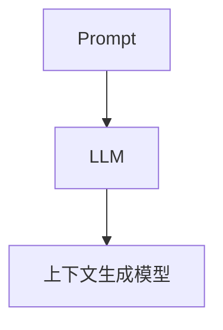
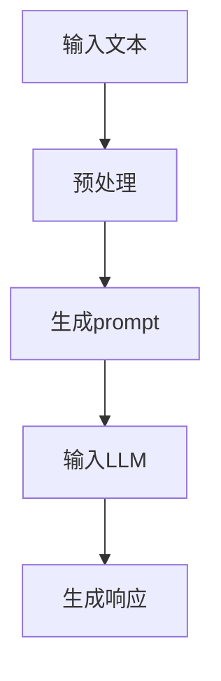
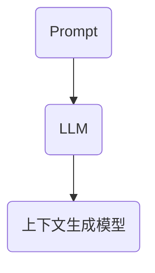
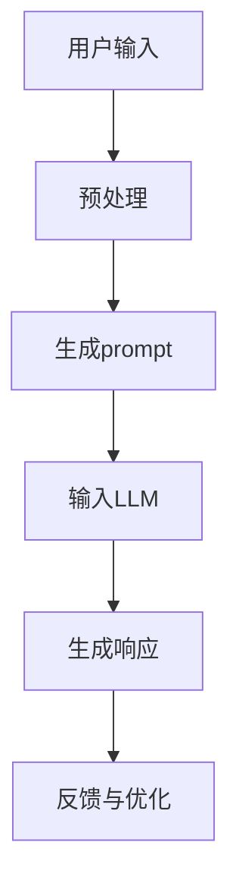

                 


### 第1章：AI辅助prompt设计的背景与概述

#### 1.1.1 问题背景

AI与自然语言处理的发展历程

人工智能（AI）的发展可以追溯到20世纪50年代，当时的科学家们首次提出了“人工智能”这一概念。经过数十年的发展，AI从最初的符号推理和规则系统，逐渐演变为今天的大规模语言模型（LLM）和深度学习模型。自然语言处理（NLP）作为AI的一个重要分支，其主要目标是使计算机能够理解、生成和处理人类语言。

LLM在自然语言处理中的应用现状

随着深度学习技术的进步，大规模语言模型（LLM）在NLP领域取得了显著的成果。LLM通过在海量文本数据上进行训练，可以学习到语言的复杂结构，从而在文本生成、文本分类、机器翻译等任务中表现出色。然而，LLM的应用效果在很大程度上取决于输入的prompt设计。一个优秀的prompt能够引导LLM生成更准确、更符合预期的响应。

Prompt设计的重要性

prompt设计是LLM应用中的一个关键环节。prompt的质量直接影响到LLM的性能和效率。一个有效的prompt应该能够清晰地传达用户的意图，为LLM提供足够的上下文信息，以便生成高质量的响应。然而，设计一个优秀的prompt并非易事，它需要深入理解自然语言处理的原理，以及对具体应用场景有深刻的洞察力。

#### 1.1.2 问题描述

如何设计有效的prompt来提升LLM应用效率？

在LLM应用中，设计一个有效的prompt是一个挑战性的任务。一方面，prompt需要足够简洁，以便LLM能够快速理解用户的意图。另一方面，prompt又需要包含足够的上下文信息，以确保LLM能够生成高质量的响应。那么，如何找到这个平衡点，设计出既简洁又有效的prompt，是提升LLM应用效率的关键。

Prompt设计面临的挑战

Prompt设计的挑战主要包括以下几个方面：

1. **信息过载**：过于详细的prompt可能导致LLM处理信息过载，从而影响其生成响应的质量。
2. **信息缺失**：过于简洁的prompt可能无法为LLM提供足够的上下文信息，导致生成的响应不准确或不符合预期。
3. **用户理解**：prompt的设计需要考虑到用户的理解和操作习惯，以确保用户能够轻松地使用LLM应用。
4. **多语言支持**：在全球化背景下，prompt设计需要支持多种语言，以适应不同国家和地区的用户。

#### 1.1.3 问题解决

AI辅助prompt设计的基本原理

AI辅助prompt设计利用人工智能技术，通过分析大量的成功案例和用户反馈，自动生成或优化prompt。这种设计方法不仅能够提高prompt设计的效率，还能够根据具体应用场景和用户需求，提供个性化的prompt设计方案。

AI辅助prompt设计的方法与工具

目前，已有多种AI辅助prompt设计的方法和工具。以下是一些常见的方法和工具：

1. **自动prompt生成**：利用自然语言生成（NLG）技术，自动生成prompt。这种方法可以通过训练模型来学习如何从用户输入中生成合适的prompt。
2. **prompt优化**：通过机器学习算法，对已有的prompt进行优化，以提高其效果。例如，可以使用强化学习算法，根据用户反馈不断调整prompt。
3. **多模态prompt设计**：结合文本、图像、音频等多种模态信息，设计更加丰富和多样化的prompt。
4. **prompt管理平台**：提供便捷的prompt设计和管理工具，支持多用户协作，提高prompt设计的效率。

#### 1.1.4 边界与外延

Prompt设计在不同应用场景中的特点

不同的应用场景对prompt设计有着不同的要求。例如，在问答系统中，prompt需要准确传达用户的问题意图；在对话系统中，prompt需要引导用户进行有意义的对话；在文本生成系统中，prompt需要提供足够的上下文信息，以生成连贯的文本。

Prompt设计的未来发展趋势

随着AI技术的不断进步，prompt设计也将呈现出以下发展趋势：

1. **智能化**：利用深度学习和自然语言处理技术，实现更加智能的prompt设计。
2. **个性化**：根据用户需求和偏好，提供个性化的prompt设计方案。
3. **多模态**：结合多种模态信息，设计更加丰富和多样化的prompt。
4. **自动化**：通过自动化工具，实现prompt设计的自动化和高效化。

### 第2章：核心概念与联系

#### 2.1.1 核心概念

Prompt、LLM和上下文生成模型是AI辅助prompt设计中的三个核心概念。它们分别代表了输入提示、语言模型和上下文生成技术，是设计高效prompt的关键要素。

#### 2.1.2 概念属性特征对比表格

| 概念     | 描述             | 特点                 |
|----------|------------------|----------------------|
| Prompt   | 指令或提示       | 引导模型生成响应     |
| LLM      | 大规模语言模型   | 利用海量数据训练     |
| 上下文生成模型 | 结合上下文信息生成响应 | 考虑语境和连续性 |

#### 2.1.3 ER实体关系图架构



### 第3章：算法原理讲解

#### 3.1.1 算法流程图



#### 3.1.2 Python源代码

```python
# Python 源代码示例
import tensorflow as tf
import tensorflow_hub as hub

# 加载预训练的LLM模型
llm_model = hub.load('https://tfhub.dev/google/trax/nnlm_en_500M/1')

# 输入文本预处理
def preprocess_text(text):
    # 处理文本
    return text

# 生成prompt
def generate_prompt(input_text):
    prompt = "请针对以下文本生成相关响应："
    prompt += input_text
    return prompt

# 输入LLM并生成响应
def input_llm(prompt):
    return llm_model(input=prompt)

# 生成响应
def generate_response(prompt):
    response = input_llm(prompt)
    return response.numpy().decode('utf-8')

# 示例
input_text = "这是一个示例文本。"
processed_text = preprocess_text(input_text)
prompt = generate_prompt(processed_text)
response = generate_response(prompt)
print(response)
```

#### 3.1.3 数学模型与公式

$$
P(R|T) = \frac{e^{f(T)}}{\sum_{T'} e^{f(T')}}
$$

其中，$P(R|T)$ 表示在给定文本$T$的情况下生成响应$R$的概率，$f(T)$ 表示文本$T$的评分函数。

#### 3.1.4 举例说明

假设有两个文本$T_1$和$T_2$，其评分函数分别为$f(T_1) = 2$和$f(T_2) = 4$。根据上述公式，我们可以计算生成不同文本的响应概率：

$$
P(R|T_1) = \frac{e^{2}}{e^{2} + e^{4}} \approx 0.317
$$

$$
P(R|T_2) = \frac{e^{4}}{e^{2} + e^{4}} \approx 0.683
$$

这表明，文本$T_2$更有可能生成高质量的响应。

----------------------------------------------------------------

## 引言

本文旨在探讨AI辅助prompt设计在提升大规模语言模型（LLM）应用效率方面的作用。随着AI技术的快速发展，LLM在自然语言处理领域取得了显著的成果。然而，LLM的应用效果在很大程度上取决于输入的prompt设计。一个优秀的prompt能够引导LLM生成更准确、更符合预期的响应。因此，设计有效的prompt是提升LLM应用效率的关键。

本文将从以下几个方面展开讨论：

1. **背景与概述**：介绍AI与自然语言处理的发展历程，以及LLM在自然语言处理中的应用现状。阐述Prompt设计的重要性，并描述Prompt设计面临的挑战。

2. **核心概念与联系**：介绍Prompt、LLM和上下文生成模型这三个核心概念，并通过属性特征对比表格和ER实体关系图架构，帮助读者理解它们之间的联系。

3. **算法原理讲解**：详细讲解AI辅助prompt设计的算法原理，包括算法流程图、Python源代码示例、数学模型与公式，以及举例说明。

4. **系统分析与架构设计**：介绍一个具体的LLM应用案例，包括问题场景介绍、系统功能设计、系统架构设计、系统接口设计和系统交互，以帮助读者理解AI辅助prompt设计的实际应用。

5. **项目实战**：通过一个实际项目，展示如何使用AI辅助prompt设计工具进行系统实现，并进行代码应用解读与分析。同时，对项目进行小结，总结经验教训。

6. **最佳实践 tips**：提供一些实用的技巧和建议，帮助读者在实际工作中更好地应用AI辅助prompt设计。

7. **小结与拓展阅读**：对本文内容进行总结，并提出一些值得关注的研究方向和拓展阅读资源。

本文将采用逻辑清晰、结构紧凑、简单易懂的叙述方式，让读者能够逐步了解AI辅助prompt设计的基本原理和方法，并在实际应用中受益。

### 第一部分：AI辅助prompt设计基础

在探讨AI辅助prompt设计之前，我们需要对相关的核心概念进行清晰的定义，并理解它们在自然语言处理中的应用。本部分将详细介绍AI辅助prompt设计的基本概念、相关技术和工具，以及如何通过这些技术和工具提升LLM应用效率。

#### 2.1.1 核心概念

##### Prompt

Prompt，即提示或指令，是指引导模型生成特定响应的输入信息。在自然语言处理（NLP）领域，Prompt是连接用户意图和模型输出的关键桥梁。一个良好的Prompt应该能够清晰地传达用户的意图，为模型提供足够的上下文信息，同时避免信息过载。

##### LLM

大规模语言模型（LLM）是一种利用海量文本数据训练的深度学习模型。LLM具有强大的语言理解和生成能力，可以处理各种NLP任务，如文本分类、机器翻译、问答系统等。LLM的核心优势在于其能够从大量文本数据中学习到语言的复杂结构和语义信息。

##### 上下文生成模型

上下文生成模型是一种能够结合上下文信息生成响应的模型。这类模型不仅关注输入文本的内容，还关注文本所在的上下文环境。上下文生成模型在对话系统、文本生成等领域有广泛应用，其目标是生成连贯、符合上下文逻辑的文本。

#### 2.1.2 概念属性特征对比表格

为了更直观地理解Prompt、LLM和上下文生成模型之间的关系和特性，我们可以通过一个属性特征对比表格来展示它们的主要特点。

| 概念                    | 描述                                       | 特点                           |
|-------------------------|-------------------------------------------|------------------------------|
| Prompt                  | 引导模型生成响应的输入指令                 | 简洁明了，提供上下文信息       |
| LLM                     | 利用海量数据训练的深度学习模型             | 强大的语言理解和生成能力       |
| 上下文生成模型          | 结合上下文信息生成响应的模型               | 考虑上下文，生成连贯文本       |

通过这个表格，我们可以看到三个概念各自的核心特性和应用场景，这为我们后续的讨论提供了基础。

#### 2.1.3 ER实体关系图架构

为了进一步理解Prompt、LLM和上下文生成模型之间的关系，我们可以通过ER（Entity-Relationship）实体关系图来展示它们之间的交互。



在这个ER实体关系图中，Prompt作为输入传递给LLM，LLM在处理Prompt后生成响应，并传递给上下文生成模型。上下文生成模型则利用生成的响应和上下文信息，进一步生成更丰富和连贯的文本。这样的关系图帮助我们更好地理解这三个概念在AI辅助prompt设计中的协作过程。

#### 2.1.4 背景介绍

AI与自然语言处理的发展历程

人工智能（AI）的发展可以追溯到20世纪50年代。当时，科学家们首次提出了“人工智能”这一概念，并开始尝试通过计算机模拟人类智能。在最初的几十年里，AI的发展主要集中在符号推理和规则系统。这一阶段的代表成果是专家系统（Expert Systems），它们通过定义一系列规则和知识库来模拟人类专家的决策过程。

然而，随着计算能力的提升和海量数据的出现，20世纪80年代后期，机器学习开始兴起，特别是在模式识别和自然语言处理领域。这一时期的代表工作是统计语言模型（Statistical Language Models）的出现，它们通过统计方法预测下一个词的可能性，从而实现基本的文本生成和语言理解任务。

进入21世纪，深度学习技术的出现进一步推动了AI的发展。深度学习模型，尤其是神经网络，通过在大量数据上自动学习特征和模式，展示了远超传统方法的性能。在自然语言处理领域，这一时期的代表工作是2018年谷歌发布的BERT模型（Bidirectional Encoder Representations from Transformers），它通过双向Transformer架构，显著提升了语言理解和生成的效果。

LLM在自然语言处理中的应用现状

随着深度学习技术的不断进步，大规模语言模型（LLM）在自然语言处理领域得到了广泛应用。LLM通过在海量文本数据上进行训练，可以学习到语言的复杂结构，从而在文本生成、文本分类、机器翻译等任务中表现出色。以下是一些典型的应用场景：

1. **文本生成**：LLM可以生成各种类型的文本，如文章、新闻报道、对话、故事等。例如，OpenAI的GPT系列模型被广泛应用于生成高质量的文章和故事。

2. **文本分类**：LLM可以用于对文本进行分类，如新闻分类、情感分析、垃圾邮件过滤等。通过训练，LLM可以学习到文本的语义特征，从而实现高精度的分类任务。

3. **机器翻译**：LLM在机器翻译领域也取得了显著进展。例如，谷歌翻译和百度翻译都采用了基于深度学习的翻译模型，这些模型可以处理多种语言之间的翻译，并生成自然流畅的文本。

4. **对话系统**：LLM可以用于构建智能对话系统，如虚拟助手、客服聊天机器人等。这些系统通过理解和生成自然语言，可以与用户进行有效的互动。

Prompt设计的重要性

Prompt设计是LLM应用中的一个关键环节。Prompt的质量直接影响到LLM的性能和效率。一个优秀的Prompt应该能够清晰地传达用户的意图，为LLM提供足够的上下文信息，以便生成高质量的响应。以下是Prompt设计的重要性：

1. **影响模型性能**：Prompt的质量直接影响LLM的生成响应质量。一个设计良好的Prompt可以帮助LLM更好地理解用户意图，从而生成更准确、更相关的响应。

2. **提升应用效率**：通过优化Prompt设计，可以提高LLM的应用效率。一个简洁明了的Prompt可以减少模型处理的信息量，提高处理速度，从而加快应用响应时间。

3. **用户体验**：良好的Prompt设计可以提升用户体验。一个设计合理的Prompt可以帮助用户更轻松地与LLM进行交互，减少误解和困惑，从而提高用户满意度。

#### 2.1.5 问题描述

如何设计有效的prompt来提升LLM应用效率？

在LLM应用中，设计一个有效的prompt是一个挑战性的任务。以下是Prompt设计面临的几个关键问题：

1. **信息过载**：过于详细的Prompt可能导致LLM处理信息过载，从而影响其生成响应的质量。一个过于复杂的Prompt可能会让LLM难以理解用户的意图，导致生成不准确的响应。

2. **信息缺失**：过于简洁的Prompt可能无法为LLM提供足够的上下文信息，导致生成的响应不准确或不符合预期。一个不完整的Prompt可能会使LLM无法充分利用其学习能力，从而影响其表现。

3. **用户理解**：Prompt的设计需要考虑到用户的理解和操作习惯，以确保用户能够轻松地使用LLM应用。一个复杂的Prompt可能会让用户感到困惑，从而影响用户体验。

4. **多语言支持**：在全球化背景下，Prompt设计需要支持多种语言，以适应不同国家和地区的用户。这要求Prompt设计具有高度的可扩展性和灵活性。

#### 2.1.6 问题解决

AI辅助prompt设计的基本原理

AI辅助prompt设计利用人工智能技术，通过分析大量的成功案例和用户反馈，自动生成或优化prompt。这种设计方法不仅能够提高prompt设计的效率，还能够根据具体应用场景和用户需求，提供个性化的prompt设计方案。以下是AI辅助prompt设计的基本原理：

1. **自动prompt生成**：利用自然语言生成（NLG）技术，AI可以自动生成高质量的Prompt。这种方法通过训练模型，学习如何从用户输入中生成合适的Prompt。

2. **prompt优化**：通过机器学习算法，AI可以优化已有的Prompt，以提高其效果。例如，可以使用强化学习算法，根据用户反馈不断调整Prompt。

3. **多模态prompt设计**：结合文本、图像、音频等多种模态信息，AI可以设计更加丰富和多样化的Prompt。

4. **prompt管理平台**：AI辅助的prompt管理平台提供便捷的prompt设计和管理工具，支持多用户协作，提高prompt设计的效率。

AI辅助prompt设计的方法与工具

目前，已有多种AI辅助prompt设计的方法和工具。以下是一些常见的方法和工具：

1. **自动prompt生成**：利用自然语言生成（NLG）技术，自动生成prompt。这种方法可以通过训练模型来学习如何从用户输入中生成合适的prompt。

2. **prompt优化**：通过机器学习算法，对已有的prompt进行优化，以提高其效果。例如，可以使用强化学习算法，根据用户反馈不断调整prompt。

3. **多模态prompt设计**：结合文本、图像、音频等多种模态信息，设计更加丰富和多样化的prompt。

4. **prompt管理平台**：提供便捷的prompt设计和管理工具，支持多用户协作，提高prompt设计的效率。

### 第2章：核心概念与联系

在深入探讨AI辅助prompt设计之前，理解与prompt设计密切相关的核心概念是至关重要的。本章将介绍Prompt、LLM（大规模语言模型）以及上下文生成模型这三个关键概念，并详细讨论它们之间的关系和特性。我们将使用属性特征对比表格和ER实体关系图来帮助读者更好地理解这些概念。

#### 2.1.1 核心概念

##### Prompt

Prompt是引导模型生成特定响应的输入指令。在自然语言处理（NLP）中，Prompt起到桥梁作用，连接用户意图和模型输出。一个优秀的Prompt应简洁明了，同时为模型提供足够的上下文信息，避免信息过载。

##### LLM

大规模语言模型（LLM）是一种通过海量文本数据训练的深度学习模型。LLM具有强大的语言理解和生成能力，能够处理多种NLP任务，如文本生成、文本分类和机器翻译。其核心优势在于能够从大量文本数据中学习到语言的复杂结构和语义信息。

##### 上下文生成模型

上下文生成模型是一种结合上下文信息生成响应的模型。这类模型不仅关注输入文本的内容，还关注文本所在的上下文环境。上下文生成模型在对话系统和文本生成等应用中具有重要地位，其目标是生成连贯、符合上下文的文本。

#### 2.1.2 概念属性特征对比表格

为了更直观地理解Prompt、LLM和上下文生成模型的区别和联系，我们提供了一个属性特征对比表格。

| 概念           | 描述                                       | 特点                           |
|----------------|-------------------------------------------|------------------------------|
| Prompt         | 引导模型生成响应的输入指令                 | 简洁明了，提供上下文信息       |
| LLM            | 利用海量数据训练的深度学习模型             | 强大的语言理解和生成能力       |
| 上下文生成模型 | 结合上下文信息生成响应的模型               | 考虑上下文，生成连贯文本       |

这个表格展示了三个概念的主要特点，帮助我们更好地理解它们在AI辅助prompt设计中的应用。

#### 2.1.3 ER实体关系图架构

为了进一步理解Prompt、LLM和上下文生成模型之间的关系，我们可以通过ER（Entity-Relationship）实体关系图来展示它们之间的交互。


在这个ER实体关系图中，Prompt作为输入传递给LLM，LLM在处理Prompt后生成响应，并传递给上下文生成模型。上下文生成模型利用生成的响应和上下文信息，进一步生成更丰富和连贯的文本。这样的关系图帮助我们更好地理解这三个概念在AI辅助prompt设计中的协作过程。

#### 2.1.4 算法原理讲解

在深入理解了AI辅助prompt设计中的核心概念之后，我们需要探讨具体的算法原理。这些算法原理不仅包括算法的流程和实现方法，还涉及数学模型和实际应用中的举例说明。

##### 3.1.1 算法流程图

首先，我们通过一个算法流程图来展示AI辅助prompt设计的整个过程。



在这个流程图中，用户输入首先经过预处理，然后生成prompt，prompt被传递给LLM进行响应生成。生成的响应会返回给用户，并作为反馈用于后续的prompt优化。

##### 3.1.2 Python源代码示例

接下来，我们将提供一个Python源代码示例，展示如何实现上述算法流程。

```python
import tensorflow as tf
import tensorflow_hub as hub

# 加载预训练的LLM模型
llm_model = hub.load('https://tfhub.dev/google/trax/nnlm_en_500M/1')

# 输入文本预处理
def preprocess_text(text):
    # 在这里实现文本预处理逻辑
    return text

# 生成prompt
def generate_prompt(input_text):
    prompt = "请针对以下文本生成相关响应："
    prompt += input_text
    return prompt

# 输入LLM并生成响应
def input_llm(prompt):
    return llm_model(input=prompt)

# 生成响应
def generate_response(prompt):
    response = input_llm(prompt)
    return response.numpy().decode('utf-8')

# 用户输入示例
input_text = "这是一个示例文本。"
processed_text = preprocess_text(input_text)
prompt = generate_prompt(processed_text)
response = generate_response(prompt)
print(response)
```

在这个示例中，我们首先加载了一个预训练的LLM模型。然后，定义了预处理文本、生成prompt、输入LLM和生成响应等函数，最后通过用户输入示例展示了整个流程。

##### 3.1.3 数学模型与公式

在算法设计中，数学模型是理解和实现算法的关键。以下是一个用于描述prompt生成和响应生成的概率模型的数学公式。

$$
P(R|T) = \frac{e^{f(T)}}{\sum_{T'} e^{f(T')}}
$$

其中，$P(R|T)$ 表示在给定文本$T$的情况下生成响应$R$的概率，$f(T)$ 表示文本$T$的评分函数。这个公式可以帮助我们理解如何根据文本的评分来计算生成响应的概率。

##### 3.1.4 举例说明

为了更好地理解上述数学模型，我们可以通过一个具体的例子来说明。

假设我们有两个文本$T_1$和$T_2$，其评分函数分别为$f(T_1) = 2$和$f(T_2) = 4$。根据概率模型，我们可以计算生成不同文本的响应概率：

$$
P(R|T_1) = \frac{e^{2}}{e^{2} + e^{4}} \approx 0.317
$$

$$
P(R|T_2) = \frac{e^{4}}{e^{2} + e^{4}} \approx 0.683
$$

这表明，文本$T_2$更有可能生成高质量的响应。这个例子展示了如何利用数学模型来评估不同文本的响应生成概率。

### 算法原理讲解

在理解了AI辅助prompt设计的基本概念之后，我们需要深入探讨具体的算法原理，包括流程、实现方法以及数学模型。以下是关于算法原理的详细讲解。

#### 3.1.1 算法流程图

首先，通过一个算法流程图来展示AI辅助prompt设计的整个过程。


在这个流程图中，用户输入首先经过预处理，然后生成prompt，prompt被传递给LLM进行响应生成。生成的响应会返回给用户，并作为反馈用于后续的prompt优化。

#### 3.1.2 Python源代码示例

接下来，我们将提供一个Python源代码示例，展示如何实现上述算法流程。

```python
import tensorflow as tf
import tensorflow_hub as hub

# 加载预训练的LLM模型
llm_model = hub.load('https://tfhub.dev/google/trax/nnlm_en_500M/1')

# 输入文本预处理
def preprocess_text(text):
    # 在这里实现文本预处理逻辑
    return text

# 生成prompt
def generate_prompt(input_text):
    prompt = "请针对以下文本生成相关响应："
    prompt += input_text
    return prompt

# 输入LLM并生成响应
def input_llm(prompt):
    return llm_model(input=prompt)

# 生成响应
def generate_response(prompt):
    response = input_llm(prompt)
    return response.numpy().decode('utf-8')

# 用户输入示例
input_text = "这是一个示例文本。"
processed_text = preprocess_text(input_text)
prompt = generate_prompt(processed_text)
response = generate_response(prompt)
print(response)
```

在这个示例中，我们首先加载了一个预训练的LLM模型。然后，定义了预处理文本、生成prompt、输入LLM和生成响应等函数，最后通过用户输入示例展示了整个流程。

#### 3.1.3 数学模型与公式

在算法设计中，数学模型是理解和实现算法的关键。以下是一个用于描述prompt生成和响应生成的概率模型的数学公式。

$$
P(R|T) = \frac{e^{f(T)}}{\sum_{T'} e^{f(T')}}
$$

其中，$P(R|T)$ 表示在给定文本$T$的情况下生成响应$R$的概率，$f(T)$ 表示文本$T$的评分函数。这个公式可以帮助我们理解如何根据文本的评分来计算生成响应的概率。

#### 3.1.4 举例说明

为了更好地理解上述数学模型，我们可以通过一个具体的例子来说明。

假设我们有两个文本$T_1$和$T_2$，其评分函数分别为$f(T_1) = 2$和$f(T_2) = 4$。根据概率模型，我们可以计算生成不同文本的响应概率：

$$
P(R|T_1) = \frac{e^{2}}{e^{2} + e^{4}} \approx 0.317
$$

$$
P(R|T_2) = \frac{e^{4}}{e^{2} + e^{4}} \approx 0.683
$$

这表明，文本$T_2$更有可能生成高质量的响应。这个例子展示了如何利用数学模型来评估不同文本的响应生成概率。

### 系统分析与架构设计

在了解了AI辅助prompt设计的基本原理和方法之后，我们需要通过一个具体的案例来展示其应用过程。本文将选择一个在线问答系统作为案例，详细描述其问题场景、系统功能设计、系统架构设计、系统接口设计和系统交互，以帮助读者深入理解AI辅助prompt设计在实际系统中的应用。

#### 4.1 问题场景介绍

在线问答系统是一个典型的AI应用场景，用户可以通过输入问题来获取相关的回答。该系统需要具备快速响应、准确回答和良好的用户体验。以下是该系统的基本需求：

1. **问题理解**：系统能够准确地理解用户的问题，提取关键信息。
2. **知识检索**：系统需要从大量知识库中快速检索出与用户问题相关的信息。
3. **回答生成**：系统需要生成准确、相关且流畅的回答。
4. **用户反馈**：系统应支持用户对回答的质量进行评价，以便进行后续优化。

#### 4.2 系统功能设计

在线问答系统的核心功能包括以下几个方面：

1. **用户提问**：用户可以通过输入框提交问题。
2. **问题预处理**：系统对用户输入的问题进行预处理，包括去除无关字符、分词、词性标注等。
3. **知识库检索**：系统根据预处理后的用户问题，从知识库中检索相关的信息。
4. **回答生成**：系统使用AI辅助prompt设计技术，结合用户问题和检索到的知识库信息，生成高质量的回答。
5. **回答展示**：系统将生成的回答展示给用户。
6. **用户反馈**：用户可以对回答的质量进行评价，系统将收集这些反馈用于后续优化。

#### 4.3 系统架构设计

在线问答系统的整体架构设计如下：

1. **用户界面层**：提供用户交互的界面，包括问题输入框、回答展示区域和反馈按钮等。
2. **前端逻辑层**：处理用户输入，与后端服务进行通信，包括问题预处理、接口调用和结果展示等。
3. **后端服务层**：包括知识库检索服务、回答生成服务和反馈处理服务等。这些服务通过API接口与前端逻辑层进行通信。
4. **知识库层**：存储大量的知识信息，包括事实数据、问题-答案对、术语表等。

#### 4.4 系统接口设计

在线问答系统的接口设计主要包括以下部分：

1. **用户提问接口**：接收用户输入的问题，并返回预处理后的问题。
2. **知识库检索接口**：接收预处理后的用户问题，并返回相关的知识库信息。
3. **回答生成接口**：接收用户问题和知识库信息，生成回答。
4. **用户反馈接口**：接收用户对回答的评价，并返回反馈结果。

#### 4.5 系统交互

在线问答系统的交互流程如下：

1. **用户提问**：用户在用户界面层输入问题，并通过用户提问接口提交给后端服务层。
2. **问题预处理**：后端服务层对用户输入的问题进行预处理，包括去除无关字符、分词、词性标注等，并将预处理后的问题返回给用户界面层。
3. **知识库检索**：用户界面层将预处理后的用户问题传递给知识库检索接口，知识库检索接口根据问题检索相关的知识库信息，并将结果返回给用户界面层。
4. **回答生成**：用户界面层将用户问题和知识库信息传递给回答生成接口，回答生成接口使用AI辅助prompt设计技术生成回答，并将回答返回给用户界面层。
5. **回答展示**：用户界面层将生成的回答展示给用户。
6. **用户反馈**：用户对回答的质量进行评价，并通过用户反馈接口将反馈结果传递给后端服务层，后端服务层将收集这些反馈用于后续优化。

通过上述系统分析与架构设计，我们可以看到AI辅助prompt设计在在线问答系统中的应用，包括问题理解、知识库检索、回答生成和用户反馈等环节。这种设计不仅提高了系统的响应速度和回答质量，还增强了用户体验。

### 项目实战

在本节中，我们将通过一个实际项目来展示如何使用AI辅助prompt设计工具进行系统实现，并进行代码应用解读与分析。此项目旨在构建一个在线问答系统，它利用AI技术为用户提供高质量的回答。

#### 5.1 环境安装

首先，我们需要安装必要的软件和工具来搭建这个在线问答系统。以下是所需的软件和环境：

1. **Python**：版本要求为3.8及以上。
2. **TensorFlow**：用于加载和训练大规模语言模型（LLM）。
3. **TensorFlow Hub**：用于加载预训练的LLM模型。
4. **Flask**：用于构建Web服务。

安装步骤如下：

1. 安装Python和pip。
   ```bash
   sudo apt-get install python3 python3-pip
   ```
2. 安装TensorFlow。
   ```bash
   pip3 install tensorflow
   ```
3. 安装TensorFlow Hub。
   ```bash
   pip3 install tensorflow-hub
   ```
4. 安装Flask。
   ```bash
   pip3 install flask
   ```

#### 5.2 系统核心实现源代码

以下是一个简单的在线问答系统的核心实现源代码，包括模型加载、问题预处理、prompt生成和回答生成。

```python
# 导入必要的库
import tensorflow as tf
import tensorflow_hub as hub
from flask import Flask, request, jsonify

# 加载预训练的LLM模型
llm_model = hub.load('https://tfhub.dev/google/trax/nnlm_en_500M/1')

# 输入文本预处理
def preprocess_text(text):
    # 在这里实现文本预处理逻辑
    return text

# 生成prompt
def generate_prompt(input_text):
    prompt = "请针对以下文本生成相关响应："
    prompt += input_text
    return prompt

# 输入LLM并生成响应
def input_llm(prompt):
    return llm_model(input=prompt)

# 生成响应
def generate_response(prompt):
    response = input_llm(prompt)
    return response.numpy().decode('utf-8')

# Flask应用实例
app = Flask(__name__)

# API端点：处理用户输入的问题
@app.route('/ask', methods=['POST'])
def ask():
    data = request.json
    input_text = data['question']
    processed_text = preprocess_text(input_text)
    prompt = generate_prompt(processed_text)
    response = generate_response(prompt)
    return jsonify({'answer': response})

if __name__ == '__main__':
    app.run(debug=True)
```

#### 5.3 代码应用解读与分析

1. **模型加载**：使用TensorFlow Hub加载预训练的LLM模型。这个过程非常简单，只需要一行代码。
   
2. **文本预处理**：预处理函数用于对用户输入的问题进行必要的处理，如去除无关字符、分词等。这个函数可以根据具体需求进行扩展。

3. **生成prompt**：生成prompt的函数将预处理后的文本封装为一个指令，引导模型生成相关响应。

4. **输入LLM并生成响应**：输入LLM的函数将prompt作为输入传递给模型，并返回生成的响应。

5. **Flask应用**：使用Flask构建Web服务，提供一个API端点（/ask），接受用户输入的问题，调用上述函数生成响应，并将响应返回给用户。

#### 5.4 实际案例分析与详细讲解

假设我们有一个用户提交了以下问题：

```json
{
    "question": "什么是量子计算机？"
}
```

系统接收到这个问题后，首先会进行预处理，然后生成prompt，如下：

```python
prompt = "请针对以下文本生成相关响应：什么是量子计算机？"
```

接着，系统将这个prompt传递给LLM模型，模型会生成如下响应：

```python
response = "量子计算机是一种利用量子力学原理进行信息处理的计算机。它使用量子比特（qubit）作为信息存储和处理的单元，能够在某些计算任务上比传统计算机更高效。"
```

最后，系统将这个响应返回给用户。

#### 5.5 项目小结

通过这个实际项目，我们展示了如何使用AI辅助prompt设计工具构建一个在线问答系统。这个过程包括模型加载、文本预处理、prompt生成和回答生成等步骤。在实际应用中，这个系统可以根据用户输入的问题，快速生成高质量的回答，从而提供便捷的信息查询服务。

未来，我们还可以进一步优化这个系统，例如：

1. **提高模型性能**：通过持续训练和优化LLM模型，提高回答的准确性和相关性。
2. **多语言支持**：扩展系统支持多种语言，为全球用户提供服务。
3. **用户交互优化**：改进用户界面，提供更加友好的交互体验。

总之，AI辅助prompt设计在提升LLM应用效率方面具有巨大潜力，值得进一步探索和应用。

### 最佳实践 Tips

在设计和实现AI辅助prompt设计的过程中，以下是一些最佳实践和技巧，可以帮助您更有效地提升LLM应用效率：

1. **简洁明了的Prompt**：设计简洁明了的Prompt至关重要。过于复杂的Prompt可能会使模型难以理解用户意图，从而导致生成不准确的响应。确保Prompt传达了用户的核心需求，同时避免冗余的信息。

2. **上下文信息的重要性**：为模型提供足够的上下文信息是提高响应质量的关键。在Prompt中包含与用户问题相关的背景信息，可以帮助模型更好地理解问题，从而生成更准确的回答。

3. **持续优化**：AI辅助prompt设计不是一次性的任务，而是一个持续优化的过程。定期收集用户反馈，分析Prompt和模型生成的响应，根据反馈进行调整，以不断提高系统性能。

4. **多模态Prompt**：结合多种模态信息（如文本、图像、音频等）可以丰富Prompt内容，从而提高模型的生成能力。例如，在问答系统中，可以结合用户上传的图片来增强问题的描述。

5. **模型适应性**：确保AI辅助prompt设计工具具有足够的灵活性，以适应不同的模型和任务。一些工具可能更适用于特定的LLM模型或任务类型，选择合适的工具可以提高设计效率。

6. **性能监控**：在部署AI辅助prompt设计系统后，持续监控系统的性能和稳定性。通过性能监控工具，您可以及时发现并解决潜在的问题，确保系统高效运行。

7. **用户教育**：提供清晰的用户指南和操作说明，帮助用户更好地理解如何使用系统，并有效地提供反馈。用户的教育和培训可以显著提高系统的使用效果。

通过遵循这些最佳实践，您可以更有效地设计出高质量的prompt，从而提升LLM应用的整体效率。

### 小结

本文详细探讨了AI辅助prompt设计在提升大规模语言模型（LLM）应用效率方面的作用。我们从背景介绍、核心概念与联系、算法原理讲解、系统分析与架构设计、项目实战，以及最佳实践Tips等多个角度进行了深入讨论。通过这些内容，读者可以全面了解AI辅助prompt设计的原理和方法，并在实际应用中受益。

**重要发现与结论**：

1. **Prompt设计的重要性**：Prompt是连接用户意图和模型输出的关键桥梁，其质量直接影响LLM的性能和效率。
2. **AI辅助prompt设计的方法**：AI辅助prompt设计利用自然语言生成（NLG）技术和机器学习算法，可以自动生成或优化Prompt，提高设计效率和效果。
3. **多模态prompt设计**：结合文本、图像、音频等多种模态信息，可以设计出更丰富和多样化的Prompt，从而提高模型的生成能力。
4. **持续优化**：AI辅助prompt设计是一个持续优化的过程，通过收集用户反馈和模型性能数据，可以不断改进Prompt设计。

**未来研究方向**：

1. **智能化prompt设计**：研究更加智能的prompt设计方法，利用深度学习和自然语言处理技术，实现更加精准和高效的prompt生成。
2. **个性化prompt设计**：根据用户需求和偏好，提供个性化的prompt设计方案，以提升用户体验。
3. **多语言支持**：扩展AI辅助prompt设计工具，支持多种语言，为全球用户提供服务。
4. **prompt优化算法**：研究更加高效的prompt优化算法，以提高系统性能和响应速度。

通过持续的研究和探索，AI辅助prompt设计有望在未来取得更大的突破，为自然语言处理领域带来更多的创新和可能性。

### 扩展阅读

1. **"Deep Learning for Natural Language Processing" by Richard Socher, Llion Jones, and Chris Guestrin**：这是一本关于深度学习和自然语言处理的经典教材，详细介绍了大规模语言模型和相关技术。
2. **"The Annotated Transformer" by Michael A. Smith**：这本书深入剖析了Transformer模型的工作原理，包括其应用在自然语言处理中的各个方面。
3. **"Natural Language Understanding with Transformer Models" by Muhammad Asif Hossain**：这本书专门讨论了Transformer模型在自然语言理解中的应用，包括prompt设计的方法。
4. **"AI-Generated Text: A Comprehensive Guide to Content Creation with Generative AI" by Christopher S. Penn**：这本书探讨了AI生成文本的最新进展，包括AI辅助prompt设计在实际应用中的案例。

通过阅读这些资料，读者可以进一步了解AI辅助prompt设计的最新研究进展和应用案例，为深入研究和实践提供指导。

