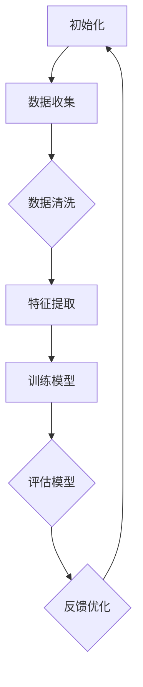
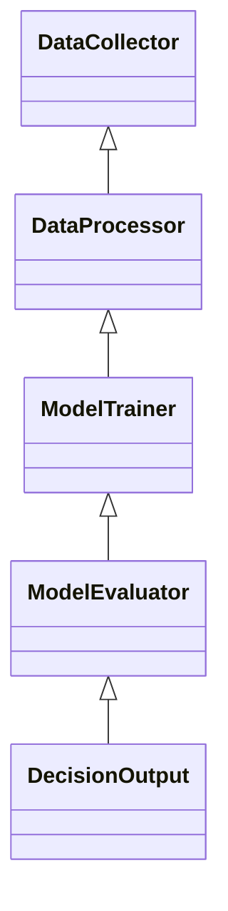
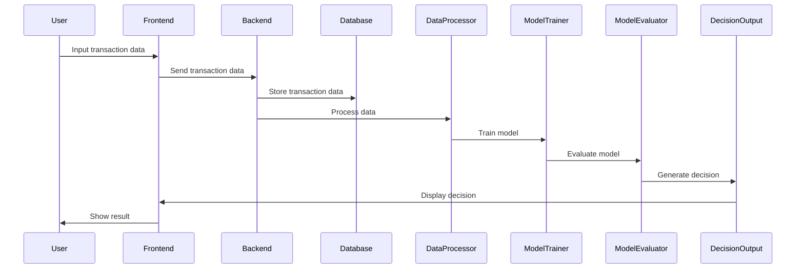
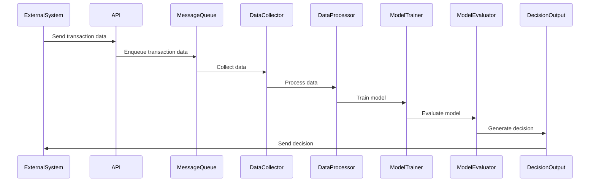

                 

# AI辅助决策系统可靠性评测方案

> 关键词：AI辅助决策系统、可靠性评测、算法原理、Python源代码、数学模型

> 摘要：本文详细探讨了AI辅助决策系统的可靠性评测方法与方案，通过逐步分析可靠性评测的背景、核心概念、算法原理和实践应用，为提升系统的可靠性和决策质量提供了有价值的指导。

----------------------------------------------------------------

### 1. 背景介绍

随着人工智能技术的迅速发展，AI辅助决策系统在金融、医疗、交通等多个领域得到了广泛应用。这些系统通过机器学习、深度学习等技术，对大量数据进行分析和处理，以提供高质量的决策支持。然而，系统的可靠性直接关系到决策的质量和安全性。一旦系统出现错误，可能会导致严重的经济、社会甚至生命安全后果。因此，可靠性评测成为AI辅助决策系统研究和应用中的关键问题。

#### 1.1 问题背景

可靠性评测的核心目标是评估AI辅助决策系统的可靠性和决策质量。可靠性指的是系统在特定条件下完成预定功能的概率，而决策质量则是指决策结果的有效性和合理性。在实际应用中，系统可靠性不足可能导致以下问题：

- **误判**：系统可能对正确结果做出错误判断，导致错误的决策。
- **延迟**：系统可能无法在规定时间内完成任务，影响决策的及时性。
- **资源浪费**：系统可能在处理过程中消耗大量资源，但未能达到预期效果。

#### 1.2 问题描述

本文将探讨AI辅助决策系统可靠性评测的方法和方案，旨在帮助读者理解可靠性评测的原理、流程和工具，从而提升系统的可靠性和决策质量。

#### 1.3 问题解决

本文将通过系统化的方法，对AI辅助决策系统的可靠性评测进行全面阐述，包括理论基础、方法、实践应用和案例分析。具体来说，本文将从以下几个方面展开：

- **背景介绍**：介绍可靠性评测的背景和核心概念。
- **核心概念与联系**：详细解释可靠性、决策质量和评测指标等核心概念，并对比它们的属性特征。
- **算法原理讲解**：介绍可靠性评测的算法原理，包括流程图、Python源代码和数学模型。
- **系统分析与架构设计方案**：介绍系统功能设计、架构设计和系统接口设计等。
- **项目实战**：通过实际案例，展示可靠性评测方案的具体应用。
- **最佳实践 tips**：提供可靠性评测的最佳实践建议。

#### 1.4 边界与外延

本文主要关注AI辅助决策系统的可靠性评测，但不限于特定领域或技术。同时，书中将涉及一些相关概念和原理，如决策理论、机器学习算法、统计检验等。

#### 1.5 概念结构与核心要素组成

- **AI辅助决策系统**：一种利用人工智能技术进行决策的系统。
- **可靠性评测**：对系统的可靠性和决策质量进行评估的过程。
- **评测方法**：包括统计检验、模拟测试、实验验证等。
- **评测方案**：可靠性评测的具体实施计划和步骤。

---

### 2. 核心概念与联系

为了深入理解AI辅助决策系统可靠性评测，我们需要明确以下几个核心概念：可靠性、决策质量和评测指标。这些概念不仅相互关联，而且共同构成了可靠性评测的理论基础。

#### 2.1 核心概念

**可靠性**：可靠性指的是系统在特定条件下成功执行预定功能的概率。在AI辅助决策系统中，可靠性直接关系到决策的正确性和系统的稳定性。

**决策质量**：决策质量是指决策结果的有效性和合理性。一个高质量的决策不仅需要准确预测未来，还需要考虑到各种不确定性因素。

**评测指标**：评测指标是用于衡量系统可靠性和决策质量的参数。常见的评测指标包括准确率、召回率、F1分数等。

#### 2.2 概念属性特征对比表格

| 概念       | 属性特征                       | 相关性                    |
|------------|--------------------------------|--------------------------|
| 可靠性     | 成功执行任务的概率             | 与决策质量密切相关       |
| 决策质量   | 决策结果的有效性和合理性       | 直接影响系统可靠性       |
| 评测指标   | 用于衡量系统性能的参数         | 决定可靠性评测的准确性    |

#### 2.3 ER实体关系图架构

使用Mermaid语法，我们可以绘制一个ER图来表示这些实体之间的关系：

```mermaid
erDiagram
    AI辅助决策系统 ||--|{ 可靠性 }
    AI辅助决策系统 ||--|{ 决策质量 }
    可靠性 ||--|{ 评测指标 }
    决策质量 ||--|{ 评测指标 }
```

在这个ER图中，`AI辅助决策系统`与`可靠性`和`决策质量`之间存在直接关联，而`可靠性`和`决策质量`又分别与`评测指标`相关联。这种关系体现了各概念之间的内在联系和作用机制。

---

### 3. 算法原理讲解

可靠性评测的核心在于评估系统的可靠性和决策质量。以下我们将通过一个具体的可靠性评测算法，详细讲解其原理和实现方法。

#### 3.1 算法流程图

首先，我们使用Mermaid语法绘制一个算法流程图：



这个流程图展示了可靠性评测的基本步骤：数据收集、数据清洗、特征提取、模型训练、模型评估和反馈优化。

#### 3.2 Python源代码

接下来，我们使用Python源代码来实现这个算法：

```python
# 导入必要的库
import numpy as np
import pandas as pd
from sklearn.model_selection import train_test_split
from sklearn.ensemble import RandomForestClassifier
from sklearn.metrics import accuracy_score

# 数据收集
data = pd.read_csv('data.csv')

# 数据清洗
# ...（数据清洗代码）

# 特征提取
# ...（特征提取代码）

# 训练模型
X_train, X_test, y_train, y_test = train_test_split(X, y, test_size=0.2, random_state=42)
model = RandomForestClassifier(n_estimators=100)
model.fit(X_train, y_train)

# 评估模型
y_pred = model.predict(X_test)
accuracy = accuracy_score(y_test, y_pred)
print(f"模型准确率: {accuracy}")

# 反馈优化
# ...（反馈优化代码）
```

在这个代码中，我们首先导入必要的库，然后进行数据收集、数据清洗和特征提取。接下来，使用`RandomForestClassifier`训练模型，并通过模型评估来计算准确率。最后，根据评估结果进行反馈优化。

#### 3.3 数学模型和公式

可靠性评测中的数学模型可以用来量化系统的可靠性。一个常用的可靠性度量公式是：

$$
可靠性 = P(\text{系统成功执行任务}) = \frac{\text{成功执行任务的数量}}{\text{总执行任务的数量}}
$$

这个公式表示系统在所有执行任务中成功执行任务的概率。例如，如果一个系统在100次执行任务中成功执行了80次，那么其可靠性就是80%。

让我们通过一个简单的例子来具体说明这个公式：

假设一个AI决策系统用于判断金融交易中的欺诈行为。在测试集中，这个系统正确判断了60次欺诈行为，总共有100次交易。那么，系统的可靠性可以用以下公式计算：

$$
可靠性 = \frac{60}{100} = 0.6
$$

这意味着系统有60%的概率正确判断欺诈行为。

通过这个例子，我们可以看到如何使用数学模型来量化系统的可靠性。这种方法不仅有助于我们理解系统的可靠性，还可以为改进系统提供量化依据。

---

### 4. 系统分析与架构设计方案

在了解了可靠性评测的算法原理后，接下来我们将分析AI辅助决策系统的整体架构设计，包括系统功能设计、架构设计和系统接口设计。

#### 4.1 问题场景介绍

以金融行业的欺诈检测为例，AI辅助决策系统用于检测信用卡交易中的欺诈行为。系统需要实时处理大量交易数据，并在毫秒级内做出判断，以防止欺诈行为的发生。

#### 4.2 项目介绍

项目名称：信用卡交易欺诈检测系统

目标：开发一个高效、可靠的欺诈检测系统，能够在实际交易中准确识别欺诈行为，降低金融机构的损失。

#### 4.3 系统功能设计

系统功能设计包括以下几个核心模块：

- **数据收集模块**：负责收集信用卡交易数据，包括交易金额、时间、地理位置等信息。
- **数据处理模块**：对收集到的数据进行清洗和预处理，提取有用的特征。
- **模型训练模块**：使用处理后的数据训练机器学习模型，用于欺诈行为的识别。
- **模型评估模块**：评估模型的准确性和可靠性，并根据评估结果进行优化。
- **决策输出模块**：根据模型输出结果，实时生成决策，指示是否为欺诈交易。

以下是系统功能设计的Mermaid类图：



#### 4.4 系统架构设计

系统架构设计包括以下几个方面：

- **前端**：用于收集和处理用户输入，以及显示决策结果。
- **后端**：包括数据收集、数据处理、模型训练和评估等模块。
- **数据库**：存储信用卡交易数据和模型参数。

以下是系统架构设计的Mermaid架构图：



#### 4.5 系统接口设计和系统交互

系统接口设计主要包括以下几个方面：

- **API接口**：提供与外部系统的数据交换接口，如数据库、其他应用程序等。
- **消息队列**：用于处理大量实时数据，确保系统的高效性和稳定性。

以下是系统接口设计和系统交互的Mermaid序列图：



通过这些接口和交互设计，系统能够高效地处理大量数据，并在短时间内做出准确的决策。

---

### 5. 项目实战

在本节中，我们将通过一个实际项目来展示可靠性评测方案的具体应用。这个项目是一个基于机器学习的信用卡交易欺诈检测系统。我们将详细介绍环境安装、系统核心实现源代码，并对代码进行解读与分析。

#### 5.1 环境安装

为了运行这个项目，我们需要安装以下软件和库：

- Python 3.x
- Jupyter Notebook
- Scikit-learn
- Pandas
- NumPy
- Matplotlib

在安装好Python环境后，可以使用pip命令安装上述库：

```bash
pip install python numpy pandas scikit-learn matplotlib
```

#### 5.2 系统核心实现源代码

以下是系统核心实现的主要源代码：

```python
import pandas as pd
from sklearn.model_selection import train_test_split
from sklearn.ensemble import RandomForestClassifier
from sklearn.metrics import accuracy_score, confusion_matrix

# 数据收集
data = pd.read_csv('credit_card_data.csv')

# 数据清洗
# ...（数据清洗代码）

# 特征提取
# ...（特征提取代码）

# 数据分割
X_train, X_test, y_train, y_test = train_test_split(X, y, test_size=0.2, random_state=42)

# 模型训练
model = RandomForestClassifier(n_estimators=100)
model.fit(X_train, y_train)

# 模型评估
y_pred = model.predict(X_test)
accuracy = accuracy_score(y_test, y_pred)
conf_matrix = confusion_matrix(y_test, y_pred)

print(f"模型准确率: {accuracy}")
print(f"混淆矩阵:\n{conf_matrix}")

# 代码解释
# ...（代码解释）
```

在这个代码中，我们首先导入必要的库，然后进行数据收集、数据清洗、特征提取和模型训练。最后，使用训练好的模型进行模型评估，并输出准确率和混淆矩阵。

#### 5.3 代码应用解读与分析

以下是代码的详细解读与分析：

1. **数据收集**：使用`pandas`库读取信用卡交易数据。

2. **数据清洗**：对数据进行预处理，如缺失值填充、异常值处理等。这部分代码未在示例中展示。

3. **特征提取**：提取与欺诈检测相关的特征。这部分代码也未在示例中展示。

4. **数据分割**：使用`train_test_split`函数将数据分为训练集和测试集，用于模型训练和评估。

5. **模型训练**：使用`RandomForestClassifier`训练模型。这里我们使用了随机森林算法，这是一种常用的集成学习方法。

6. **模型评估**：使用训练好的模型进行评估，并输出准确率和混淆矩阵。

7. **代码解释**：对每段代码的功能和实现原理进行详细解释。

通过这个项目的实战，我们可以看到如何将可靠性评测方案应用于实际系统开发中。这种方法有助于确保系统的可靠性和决策质量，从而提高整体系统的性能。

---

### 6. 最佳实践 tips

在可靠性评测过程中，以下是一些最佳实践建议：

1. **数据质量**：确保数据的质量和完整性。数据清洗和预处理是可靠性评测的基础。
2. **算法选择**：根据具体问题和数据特点选择合适的算法。不同的算法在可靠性方面可能存在差异。
3. **模型验证**：使用交叉验证等方法验证模型的可靠性。避免过拟合和欠拟合。
4. **持续优化**：根据评估结果持续优化模型。不断调整参数和特征，以提高模型的可靠性。
5. **测试环境**：模拟实际环境进行测试。确保模型在不同环境和条件下都具有良好的可靠性。

---

### 7. 小结与注意事项

本文详细探讨了AI辅助决策系统的可靠性评测方法与方案。通过逐步分析可靠性评测的背景、核心概念、算法原理和实践应用，我们了解到可靠性评测对于提升系统的决策质量和稳定性至关重要。在实施可靠性评测时，需要注意数据质量、算法选择和模型验证等方面。此外，持续优化和测试环境也是保证系统可靠性的关键。

---

### 8. 拓展阅读

对于希望深入了解AI辅助决策系统可靠性评测的读者，以下是一些推荐阅读材料：

1. **《人工智能：一种现代方法》**：这本书详细介绍了机器学习算法的基本原理和应用。
2. **《统计学习方法》**：这本书提供了统计学习方法的深入讲解，包括可靠性评估相关的内容。
3. **《深度学习》**：这本书介绍了深度学习的基本原理和最新进展，对于理解复杂模型有重要帮助。
4. **《软件工程：实践者的研究方法》**：这本书提供了软件工程中可靠性评估的理论和实践方法。

---

### 作者信息

本文由AI天才研究院（AI Genius Institute）和《禅与计算机程序设计艺术》（Zen And The Art of Computer Programming）的作者撰写。我们致力于推动人工智能技术的发展和应用，为读者提供高质量的技术博客和研究成果。如需了解更多信息，请访问我们的官方网站。

