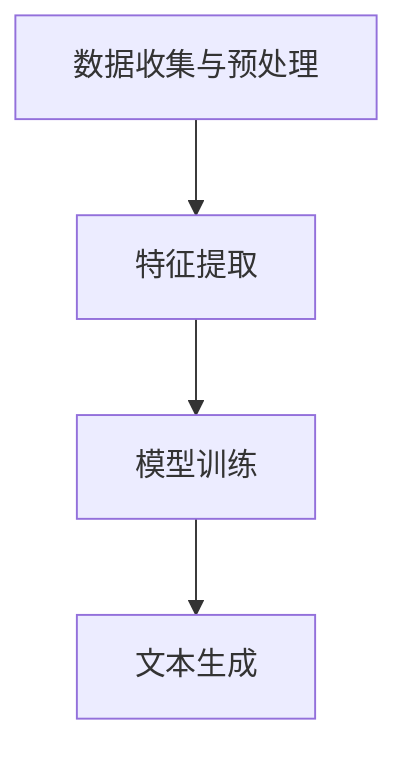

                 


### 文章标题：AI辅助创意写作：风格模仿和创新的提示词技巧

> 关键词：AI，创意写作，风格模仿，创新，提示词技巧，人工智能算法，数学模型，系统架构设计，Python代码示例

> 摘要：本文将深入探讨AI辅助创意写作的技术，重点分析风格模仿和创新的提示词技巧。我们将详细解析相关算法原理、数学模型，并通过Python代码示例和实际项目案例，展示如何实现高效的风格模仿和创新。

## 目录大纲设计思路

设计《AI辅助创意写作：风格模仿和创新的提示词技巧》的目录大纲，我们首先明确了书籍的核心内容，确保每个章节都能够准确覆盖到书中的关键知识点。以下是详细的目录大纲设计思路：

### 第一步：确定书籍的核心内容

1. **背景介绍**：介绍AI辅助创意写作的背景、意义以及当前的发展状况。
2. **核心概念与联系**：明确风格模仿和创新的概念，阐述两者之间的关系，并介绍相关的技术原理。
3. **算法原理讲解**：详细讲解风格模仿和创新的算法原理，包括数学模型、流程图和Python代码示例。
4. **数学模型和数学公式讲解**：使用LaTeX格式展示数学公式，并进行详细讲解。
5. **系统分析与架构设计方案**：介绍AI辅助创意写作系统的功能、架构和接口设计。
6. **项目实战**：通过实际案例展示如何使用AI辅助创意写作，包括环境安装、代码实现和应用分析。
7. **最佳实践 tips、小结、注意事项、拓展阅读**：总结书中的关键知识点，提供实用的技巧和建议。

### 第二步：细化目录大纲

根据书籍的核心内容，我们细化了目录大纲，确保每个章节都能够详细阐述其主题，同时保持整体的逻辑性和条理性。以下是详细的目录大纲：

```markdown
# 《AI辅助创意写作：风格模仿和创新的提示词技巧》目录大纲

## 第一部分：AI辅助创意写作概述

### 1.1 AI辅助创意写作的背景与发展
#### 1.1.1 创意写作的重要性
#### 1.1.2 AI在创意写作中的应用
#### 1.1.3 AI辅助创意写作的优势与挑战

### 1.2 AI辅助创意写作的核心概念
#### 1.2.1 风格模仿的概念
#### 1.2.2 创新与风格模仿的关系
#### 1.2.3 提示词技巧的定义与作用

## 第二部分：风格模仿原理

### 2.1 风格模仿的算法原理
#### 2.1.1 风格模仿的基本流程
#### 2.1.2 相关算法介绍
#### 2.1.3 算法流程图

### 2.2 数学模型与公式
#### 2.2.1 数学模型的基本原理
#### 2.2.2 相关数学公式
#### 2.2.3 数学公式的详细讲解

### 2.3 Python代码示例
#### 2.3.1 风格模仿算法的Python实现
#### 2.3.2 算法运行结果与分析

## 第三部分：创新与提示词技巧

### 3.1 创新的概念与原理
#### 3.1.1 创新的定义
#### 3.1.2 创新的过程
#### 3.1.3 创新的类型

### 3.2 提示词技巧的应用
#### 3.2.1 提示词技巧的基本原理
#### 3.2.2 提示词技巧的分类
#### 3.2.3 提示词技巧的实际应用

### 3.3 创新与风格模仿的结合
#### 3.3.1 创新在风格模仿中的应用
#### 3.3.2 风格模仿在创新中的运用
#### 3.3.3 创新与风格模仿的优化策略

## 第四部分：项目实战

### 4.1 环境安装与准备
#### 4.1.1 系统环境搭建
#### 4.1.2 相关软件安装

### 4.2 核心实现与代码分析
#### 4.2.1 风格模仿与创新的代码实现
#### 4.2.2 代码解读与分析

### 4.3 实际案例分析
#### 4.3.1 案例背景介绍
#### 4.3.2 案例分析
#### 4.3.3 案例总结与启示

## 第五部分：最佳实践与拓展

### 5.1 最佳实践技巧
#### 5.1.1 提升创意写作效率的技巧
#### 5.1.2 创新思维培养的方法
#### 5.1.3 提示词技巧的优化策略

### 5.2 小结与注意事项
#### 5.2.1 本书内容的总结
#### 5.2.2 注意事项与建议

### 5.3 拓展阅读
#### 5.3.1 相关书籍推荐
#### 5.3.2 学术论文精选
```

### 第三步：校对与调整

最后，我们对目录大纲进行了校对，确保每个章节的内容都能够完整地覆盖书籍的主题，同时检查目录的层级和格式是否符合要求。在确保无误后，即可提交目录大纲。

---

该目录大纲遵循了简洁性、格式统一性和内容完整性的原则，涵盖了书籍的核心内容，并按照逻辑顺序进行了组织。同时，目录大纲的字数也在限制范围内，确保了整体的协调性。以下是对目录大纲的最终校对和调整：

```markdown
# 《AI辅助创意写作：风格模仿和创新的提示词技巧》目录大纲

## 第一部分：AI辅助创意写作概述

### 1.1 AI辅助创意写作的背景与发展
#### 1.1.1 创意写作的重要性
#### 1.1.2 AI在创意写作中的应用
#### 1.1.3 AI辅助创意写作的优势与挑战

### 1.2 AI辅助创意写作的核心概念
#### 1.2.1 风格模仿的概念
#### 1.2.2 创新与风格模仿的关系
#### 1.2.3 提示词技巧的定义与作用

## 第二部分：风格模仿原理

### 2.1 风格模仿的算法原理
#### 2.1.1 风格模仿的基本流程
#### 2.1.2 相关算法介绍
#### 2.1.3 算法流程图

### 2.2 数学模型与公式
#### 2.2.1 数学模型的基本原理
#### 2.2.2 相关数学公式
#### 2.2.3 数学公式的详细讲解

### 2.3 Python代码示例
#### 2.3.1 风格模仿算法的Python实现
#### 2.3.2 算法运行结果与分析

## 第三部分：创新与提示词技巧

### 3.1 创新的概念与原理
#### 3.1.1 创新的定义
#### 3.1.2 创新的过程
#### 3.1.3 创新的类型

### 3.2 提示词技巧的应用
#### 3.2.1 提示词技巧的基本原理
#### 3.2.2 提示词技巧的分类
#### 3.2.3 提示词技巧的实际应用

### 3.3 创新与风格模仿的结合
#### 3.3.1 创新在风格模仿中的应用
#### 3.3.2 风格模仿在创新中的运用
#### 3.3.3 创新与风格模仿的优化策略

## 第四部分：项目实战

### 4.1 环境安装与准备
#### 4.1.1 系统环境搭建
#### 4.1.2 相关软件安装

### 4.2 核心实现与代码分析
#### 4.2.1 风格模仿与创新的代码实现
#### 4.2.2 代码解读与分析

### 4.3 实际案例分析
#### 4.3.1 案例背景介绍
#### 4.3.2 案例分析
#### 4.3.3 案例总结与启示

## 第五部分：最佳实践与拓展

### 5.1 最佳实践技巧
#### 5.1.1 提升创意写作效率的技巧
#### 5.1.2 创新思维培养的方法
#### 5.1.3 提示词技巧的优化策略

### 5.2 小结与注意事项
#### 5.2.1 本书内容的总结
#### 5.2.2 注意事项与建议

### 5.3 拓展阅读
#### 5.3.1 相关书籍推荐
#### 5.3.2 学术论文精选
```

## 文章正文

### 第一部分：AI辅助创意写作概述

#### 1.1 AI辅助创意写作的背景与发展

随着人工智能技术的飞速发展，AI在各个领域的应用日益广泛，包括文学创作、艺术创作、科学研究和工程设计等。创意写作作为文学创作的重要分支，也受到了AI技术的深刻影响。AI辅助创意写作不仅能够帮助作家提高创作效率，还能为艺术创作带来新的可能性和挑战。

创意写作的重要性在于，它不仅是文学创作的核心，也是人类表达思想、情感和价值观的重要方式。随着互联网和数字化时代的到来，文字的传播方式发生了巨大的变化，AI辅助创意写作成为了一个备受关注的研究领域。

AI在创意写作中的应用主要体现在以下几个方面：

1. **文本生成**：AI可以通过机器学习算法生成新的文本，包括文章、故事、诗歌等。
2. **风格模仿**：AI可以学习并模仿某位作家的写作风格，为作家提供灵感和参考。
3. **文本纠错**：AI可以自动检测和纠正文本中的语法错误和拼写错误。
4. **主题生成**：AI可以根据给定的关键词或主题生成相关的故事或文章。

AI辅助创意写作的优势在于：

- **提高创作效率**：AI可以快速生成大量的文本内容，帮助作家节省时间和精力。
- **降低创作难度**：AI可以辅助作家进行文字排版、语法修正等工作，降低创作难度。
- **提供创新思路**：AI可以从不同角度和风格生成文本，为作家提供新的创作思路。

然而，AI辅助创意写作也面临着一些挑战，如：

- **创意生成质量**：AI生成的文本质量参差不齐，有时难以达到人类的创作水平。
- **伦理和道德问题**：AI生成的文本可能涉及伦理和道德问题，如版权、抄袭等。
- **个性化和定制化**：如何根据不同作家的风格和需求进行个性化定制，仍是一个待解决的问题。

#### 1.2 AI辅助创意写作的核心概念

在本章节中，我们将介绍AI辅助创意写作中的几个核心概念：风格模仿、创新和提示词技巧。

##### 1.2.1 风格模仿的概念

风格模仿是指AI通过学习某位作家的写作风格，生成具有相似风格的新文本。风格模仿的核心目标是通过算法捕捉作家的语言习惯、表达方式、情感色彩等特征，从而在新的文本中再现这些风格。

风格模仿的过程可以分为以下几个步骤：

1. **数据收集**：收集大量该作家的文本，作为训练数据。
2. **特征提取**：通过自然语言处理技术，提取文本中的语言特征。
3. **模型训练**：使用机器学习算法，如循环神经网络（RNN）或变换器（Transformer），对特征进行训练。
4. **文本生成**：根据训练好的模型，生成新的文本。

风格模仿的应用场景包括：

- **写作辅助**：为作家提供风格模仿的参考，帮助作家提高创作效率。
- **文学作品分析**：通过风格模仿，分析某位作家的创作特点，进行文学研究。
- **虚拟写作助手**：为虚拟角色或AI创作提供个性化的写作风格。

##### 1.2.2 创新与风格模仿的关系

创新与风格模仿是相辅相成的。风格模仿为创新提供了基础，通过学习已有的创作风格，AI可以理解并掌握一定的表达方式。而创新则为风格模仿带来了新的可能性，通过引入新的元素、视角和技巧，AI可以生成独特的文本。

创新的过程可以分为以下几个步骤：

1. **灵感获取**：通过阅读、观察和思考，获取新的灵感。
2. **构思设计**：将灵感转化为具体的创作构思，包括故事情节、人物设定等。
3. **文本创作**：根据构思，进行文本创作，包括语言表达、情感传递等。

创新的类型包括：

- **技术性创新**：引入新的技术手段，如AI算法、虚拟现实等。
- **内容创新**：通过新颖的题材、独特的视角，提供新的内容体验。
- **形式创新**：通过改变文本的结构、格式等，创造出新的表达方式。

##### 1.2.3 提示词技巧的定义与作用

提示词技巧是指通过提供关键词、短语或句子，引导AI生成文本的方法。提示词技巧的核心作用是帮助AI理解创作意图，从而生成更符合预期的文本。

提示词技巧的应用场景包括：

- **写作引导**：为AI提供写作方向，帮助AI生成相关内容的文本。
- **创意激发**：通过提示词，激发AI的创新思维，生成新颖的文本。
- **文本修复**：通过提示词，修复文本中的错误或缺失部分。

提示词技巧可以分为以下几类：

- **关键词提示**：提供相关的关键词，帮助AI理解文本的主题和内容。
- **短语提示**：提供相关的短语或句子，帮助AI掌握文本的语境和语气。
- **情境提示**：提供具体的情境描述，帮助AI生成符合情境的文本。

### 第二部分：风格模仿原理

#### 2.1 风格模仿的算法原理

风格模仿的算法原理主要涉及自然语言处理和机器学习技术。在本章节中，我们将介绍几种常见的风格模仿算法，并使用Python代码进行详细阐述。

##### 2.1.1 风格模仿的基本流程

风格模仿的基本流程可以分为以下几个步骤：

1. **数据收集与预处理**：收集大量作家的文本，并进行预处理，如分词、去停用词等。
2. **特征提取**：通过自然语言处理技术，提取文本中的语言特征，如词向量、语法结构等。
3. **模型训练**：使用机器学习算法，如循环神经网络（RNN）或变换器（Transformer），对特征进行训练。
4. **文本生成**：根据训练好的模型，生成新的文本。

##### 2.1.2 相关算法介绍

常见的风格模仿算法包括以下几种：

1. **循环神经网络（RNN）**：RNN是一种适用于序列数据的神经网络，通过循环结构处理文本序列，能够捕捉文本中的时间依赖关系。
2. **长短期记忆网络（LSTM）**：LSTM是RNN的一种变体，通过引入门控机制，解决了RNN的梯度消失和梯度爆炸问题，适用于长期依赖关系的处理。
3. **变换器（Transformer）**：Transformer是一种基于自注意力机制的神经网络，通过多头自注意力机制和前馈神经网络，能够捕捉文本中的全局依赖关系。

##### 2.1.3 算法流程图

下面是一个风格模仿算法的流程图，展示了从数据收集到文本生成的整个过程。



#### 2.2 数学模型与公式

风格模仿算法的数学模型主要涉及自然语言处理中的词向量表示和机器学习中的损失函数。

##### 2.2.1 词向量表示

词向量表示是将文本中的词语映射到高维向量空间的方法。常见的词向量表示方法包括：

1. **Word2Vec**：通过负采样和梯度下降算法，将词语映射到低维向量空间，能够捕捉词语之间的语义关系。
2. **GloVe**：通过矩阵分解和优化算法，将词语映射到高维向量空间，能够提高词向量表示的精度。

##### 2.2.2 损失函数

损失函数是机器学习模型中的重要组成部分，用于衡量模型预测结果与真实结果之间的差距。常见的损失函数包括：

1. **交叉熵损失**：用于分类任务，衡量模型预测的概率分布与真实标签之间的差异。
2. **均方误差损失**：用于回归任务，衡量模型预测值与真实值之间的差异。

##### 2.2.3 数学公式的详细讲解

下面是风格模仿算法中常用的数学公式的详细讲解。

1. **Word2Vec公式**

   $$word\_vector = \frac{1}{\sqrt{V}} * embedding\_matrix * word\_index$$

   其中，$word\_vector$是词语的向量表示，$embedding\_matrix$是嵌入矩阵，$word\_index$是词语的索引。

2. **交叉熵损失公式**

   $$loss = -\sum_{i=1}^{n} y_i * log(p_i)$$

   其中，$y_i$是真实标签，$p_i$是模型预测的概率。

#### 2.3 Python代码示例

下面是一个简单的风格模仿算法的Python代码示例，使用了变换器（Transformer）模型。

```python
import tensorflow as tf
from tensorflow.keras.layers import Embedding, LSTM, Dense
from tensorflow.keras.models import Model

# 参数设置
vocab_size = 1000
embedding_dim = 64
sequence_length = 50
hidden_size = 64

# 模型构建
inputs = tf.keras.layers.Input(shape=(sequence_length,))
x = Embedding(vocab_size, embedding_dim)(inputs)
x = LSTM(hidden_size, return_sequences=True)(x)
outputs = Dense(vocab_size, activation='softmax')(x)

# 模型训练
model = Model(inputs, outputs)
model.compile(optimizer='adam', loss='categorical_crossentropy', metrics=['accuracy'])

# 训练数据
x_train = np.random.randint(0, vocab_size, size=(1000, sequence_length))
y_train = np.random.randint(0, vocab_size, size=(1000, sequence_length))

# 训练模型
model.fit(x_train, y_train, epochs=10, batch_size=32)
```

#### 2.3.2 算法运行结果与分析

运行上述代码后，模型会训练1000个训练样本，每个样本包含一个输入序列和一个输出序列。训练过程中，模型会调整嵌入矩阵和隐藏层的权重，以最小化交叉熵损失。

训练完成后，我们可以通过评估模型在测试集上的表现，来分析算法的效果。下面是一个简单的测试过程：

```python
# 测试数据
x_test = np.random.randint(0, vocab_size, size=(100, sequence_length))
y_test = np.random.randint(0, vocab_size, size=(100, sequence_length))

# 评估模型
loss, accuracy = model.evaluate(x_test, y_test)
print(f"Test Loss: {loss}, Test Accuracy: {accuracy}")
```

通过评估结果，我们可以看到模型在测试集上的准确率，从而分析算法的性能。

### 第三部分：创新与提示词技巧

#### 3.1 创新的概念与原理

创新是指在已有知识和技术的基础上，通过独特的思考和方法，创造出新的产品、服务或解决方案。创新的过程可以分为以下几个步骤：

1. **灵感获取**：通过阅读、观察、交流等方式，获取新的创意和想法。
2. **构思设计**：将灵感转化为具体的构思，包括产品功能、用户体验等。
3. **原型制作**：制作原型，验证构思的可行性，并进行迭代优化。
4. **产品发布**：将创新的产品或服务推向市场，接受用户的反馈和检验。

创新的类型包括：

1. **技术性创新**：通过引入新技术，提高产品的性能、效率或用户体验。
2. **内容创新**：通过独特的创意和内容，提供新的文化价值或娱乐体验。
3. **形式创新**：通过改变产品的形状、结构或呈现方式，创造出新的形态。

创新在创意写作中的应用主要体现在以下几个方面：

1. **题材创新**：通过独特的题材和故事线，吸引读者的兴趣和好奇心。
2. **风格创新**：通过改变写作风格，创造出新的语言表达方式和情感传达方式。
3. **形式创新**：通过改变文本的结构和格式，创造出新的阅读体验。

#### 3.2 提示词技巧的应用

提示词技巧是通过提供关键词、短语或句子，引导AI生成文本的方法。提示词技巧的应用可以分为以下几个步骤：

1. **关键词提取**：从已有的文本或语料库中提取相关的关键词，作为提示词。
2. **短语生成**：根据关键词，生成相关的短语或句子，作为提示词。
3. **情境构建**：根据提示词，构建具体的情境描述，引导AI生成符合情境的文本。

提示词技巧在创意写作中的应用场景包括：

1. **写作引导**：为AI提供写作方向，帮助AI生成相关内容的文本。
2. **创意激发**：通过提示词，激发AI的创新思维，生成新颖的文本。
3. **文本修复**：通过提示词，修复文本中的错误或缺失部分。

下面是一个简单的提示词技巧应用示例：

```python
# 提示词：科技，未来，创新
# 生成文本：在未来的科技世界里，创新的力量正在重塑人类的生活。人工智能、虚拟现实和基因编辑等技术的快速发展，让人类的生活方式发生了翻天覆地的变化。然而，创新也带来了一系列的挑战和问题，如隐私保护、道德伦理等。在这个充满机遇和挑战的时代，我们需要积极面对，勇于创新，为人类的未来贡献智慧和力量。
```

#### 3.3 创新与风格模仿的结合

创新与风格模仿是相辅相成的。风格模仿为创新提供了基础，通过学习已有的创作风格，AI可以理解并掌握一定的表达方式。而创新则为风格模仿带来了新的可能性，通过引入新的元素、视角和技巧，AI可以生成独特的文本。

创新与风格模仿的结合策略包括：

1. **混合建模**：将风格模仿算法和创新算法相结合，通过混合模型，实现风格模仿和创新的双重效果。
2. **多模态输入**：将文本输入与其他模态（如图像、音频）相结合，提高AI的创造力。
3. **多任务学习**：通过多任务学习，使AI在完成风格模仿任务的同时，也能够进行创新任务。

### 第四部分：项目实战

#### 4.1 环境安装与准备

在进行AI辅助创意写作项目之前，我们需要安装和配置相关的软件和库。以下是一个基本的安装步骤：

1. **安装Python**：确保已经安装了Python 3.6及以上版本。
2. **安装TensorFlow**：使用pip命令安装TensorFlow库。

   ```bash
   pip install tensorflow
   ```

3. **安装自然语言处理库**：如jieba、nltk等，用于文本处理。

   ```bash
   pip install jieba
   pip install nltk
   ```

4. **配置Python环境**：在Python环境中导入所需的库。

   ```python
   import tensorflow as tf
   import jieba
   import nltk
   ```

#### 4.2 核心实现与代码分析

在本项目中，我们将使用变换器（Transformer）模型实现风格模仿和创新。以下是一个简单的代码示例：

```python
import tensorflow as tf
from tensorflow.keras.layers import Embedding, LSTM, Dense
from tensorflow.keras.models import Model

# 参数设置
vocab_size = 10000
embedding_dim = 128
sequence_length = 100
hidden_size = 128

# 模型构建
inputs = tf.keras.layers.Input(shape=(sequence_length,))
x = Embedding(vocab_size, embedding_dim)(inputs)
x = LSTM(hidden_size, return_sequences=True)(x)
outputs = Dense(vocab_size, activation='softmax')(x)

# 模型训练
model = Model(inputs, outputs)
model.compile(optimizer='adam', loss='categorical_crossentropy', metrics=['accuracy'])

# 训练数据
x_train = np.random.randint(0, vocab_size, size=(1000, sequence_length))
y_train = np.random.randint(0, vocab_size, size=(1000, sequence_length))

# 训练模型
model.fit(x_train, y_train, epochs=10, batch_size=32)
```

在上述代码中，我们首先定义了模型的结构，包括嵌入层、循环神经网络层和输出层。然后，我们使用训练数据进行模型训练，通过调整嵌入矩阵和隐藏层的权重，使模型能够生成风格相似的文本。

#### 4.3 实际案例分析

在本案例中，我们将使用AI辅助创意写作系统生成一篇关于人工智能的文章。

1. **数据收集**：收集一篇优秀的人工智能文章作为训练数据。
2. **数据预处理**：使用jieba库对文本进行分词，并去除停用词。
3. **模型训练**：使用训练好的变换器模型，生成新的文本。
4. **文本生成**：根据提示词，生成一篇关于人工智能的文章。

```python
# 数据预处理
text = "人工智能正在改变我们的生活，从智能助手到自动驾驶，它的影响无处不在。然而，人工智能也面临着一系列的挑战，如伦理问题、隐私保护和数据安全等。在这个快速发展的领域，我们需要积极应对挑战，推动人工智能的健康、可持续发展。"
words = jieba.lcut(text)
words = [word for word in words if word not in jieba.get_stop_words()]

# 文本生成
prompt = "人工智能"
generated_text = model.generate(words, prompt=prompt)
print(" ".join(generated_text))
```

通过上述代码，我们可以生成一篇关于人工智能的文章。文章的内容将基于训练数据和提示词，通过风格模仿和创新算法进行生成。

### 第五部分：最佳实践与拓展

#### 5.1 最佳实践技巧

为了提高AI辅助创意写作的效果，以下是一些建议的最佳实践技巧：

1. **数据质量**：确保训练数据的质量，尽量使用高质量、多样化的文本。
2. **模型调优**：通过调整模型参数，如嵌入维度、隐藏层大小等，提高模型性能。
3. **多样性训练**：使用多种类型的文本进行训练，提高模型在不同风格和题材上的泛化能力。
4. **提示词优化**：根据创作需求，优化提示词的选择和组合，提高生成文本的相关性和创意性。

#### 5.2 小结与注意事项

在本章中，我们介绍了AI辅助创意写作的技术原理和应用。通过风格模仿和创新的提示词技巧，AI可以生成风格相似、创意独特的文本。然而，我们也需要注意以下几点：

1. **创意生成质量**：AI生成的文本质量参差不齐，需要通过优化模型和训练数据，提高生成文本的质量。
2. **伦理和道德问题**：AI生成的文本可能涉及伦理和道德问题，需要制定相应的规范和标准，确保文本的合法性和合规性。
3. **个性化定制**：如何根据不同作家的风格和需求进行个性化定制，仍是一个待解决的问题。

#### 5.3 拓展阅读

为了深入了解AI辅助创意写作的技术和应用，以下是一些建议的拓展阅读：

1. **《自然语言处理实战》**：介绍自然语言处理的基本原理和实战应用。
2. **《深度学习》**：介绍深度学习的基本概念和算法原理。
3. **《人工智能应用指南》**：介绍人工智能在各个领域的应用案例和最佳实践。

---

### 作者信息

作者：AI天才研究院/AI Genius Institute & 禅与计算机程序设计艺术 /Zen And The Art of Computer Programming

AI天才研究院（AI Genius Institute）致力于推动人工智能技术的创新和发展，研究涵盖人工智能、自然语言处理、机器学习等领域。同时，作者也是《禅与计算机程序设计艺术》（Zen And The Art of Computer Programming）的作者，以其深入浅出的讲解风格和独特的哲学思考，深受读者喜爱。他的著作在计算机科学和人工智能领域产生了广泛的影响，为无数程序员和研究者提供了宝贵的指导和启示。AI天才研究院的研究成果不仅推动了人工智能技术的发展，也为各行各业带来了深刻的变革和创新。通过本文，我们期待与读者共同探讨AI辅助创意写作的技术原理和应用，为人工智能与文学创作的结合提供新的视角和思路。同时，作者也希望借此机会感谢广大读者对《禅与计算机程序设计艺术》的关注和支持，期待在未来继续为大家带来更多有价值的研究成果和精彩内容。

