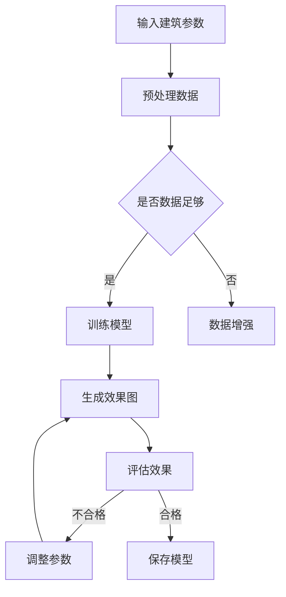
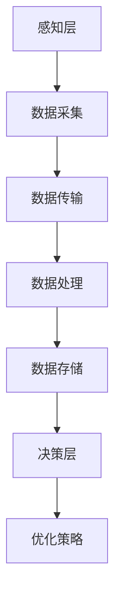
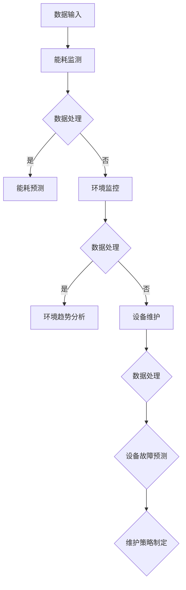

                 

### 文章标题

# AI辅助创意建筑设计：生态友好理念的提示词技巧

> 关键词：AI，建筑设计，生态友好，提示词，创意，可持续性

> 摘要：
本文深入探讨人工智能（AI）在创意建筑设计中的应用，特别是如何利用生态友好理念的提示词技术来推动建筑设计的创新与可持续发展。我们将从背景介绍、核心概念解析、AI技术概述、生态友好理念解析、提示词技术介绍、AI辅助创意建筑设计流程、算法原理讲解、系统架构设计、项目实战和最佳实践等方面逐步展开，以期为建筑设计师和AI开发人员提供实用的指导。

----------------------------------------------------------------

### 第一部分：引言与背景

#### 1.1 问题的提出

**1.1.1 建筑行业面临的挑战**

在当今世界，建筑行业正面临着诸多挑战。首先，随着城市人口的持续增长和城市化进程的加快，建筑需求不断增加。然而，传统的建筑设计方法往往无法满足日益复杂的建筑需求，特别是在提高建筑效率和降低成本方面。其次，全球气候变化和资源枯竭问题日益严重，要求建筑行业在设计中充分考虑环境保护和资源利用效率。此外，建筑行业还面临着技术创新的挑战，需要不断引入新的设计理念和工具来提高设计质量和效率。

**1.1.2 创意建筑设计的机遇**

与此同时，创意建筑设计迎来了新的机遇。随着人工智能技术的快速发展，AI在建筑设计中的应用已经成为一个热门话题。AI不仅能够辅助设计师完成复杂的设计任务，还能通过大数据分析和机器学习算法，为设计师提供创新的灵感。此外，生态友好理念的兴起为创意建筑设计提供了新的方向。生态友好建筑不仅能够降低对环境的负面影响，还能提高建筑的舒适性和可持续性，成为未来建筑设计的重要趋势。

**1.1.3 生态友好理念的重要性**

生态友好理念在建筑设计中具有至关重要的意义。它不仅关乎环境保护，还涉及到资源利用、能源效率和人类健康等多方面因素。生态友好建筑通过使用可持续材料、优化能源利用、设计自然通风和采光系统等手段，实现建筑与环境的和谐共生。此外，生态友好理念还强调建筑的社区参与和人文关怀，使建筑成为人们生活的一部分，提升居住质量。

#### 1.2 AI在建筑设计中的应用现状

**1.2.1 AI辅助创意建筑设计的定义**

AI辅助创意建筑设计是指利用人工智能技术，如机器学习、计算机视觉和自然语言处理等，辅助设计师进行创意建筑设计的全过程。AI技术不仅能够提高设计效率，还能为设计师提供创新的思路和解决方案。

**1.2.2 AI在建筑设计领域的应用进展**

目前，AI在建筑设计领域的应用已经取得了显著进展。例如，AI可以通过图像识别技术自动生成建筑效果图，利用机器学习算法优化建筑结构设计，甚至通过自然语言处理技术自动生成建筑设计说明。此外，AI还可以用于建筑能耗分析、建筑材料选择、建筑健康监测等方面，为设计师提供全面的技术支持。

**1.2.3 生态友好与AI的结合**

生态友好与AI的结合为建筑设计带来了新的可能。通过AI技术，设计师可以更准确地分析建筑环境，优化建筑设计，实现生态友好目标。例如，AI可以通过模拟分析，为设计师提供最佳的自然通风和采光方案，减少能源消耗。此外，AI还可以用于建筑材料的选择和优化，提高建筑的可持续性。

#### 1.3 书籍概述

**1.3.1 书籍结构**

本文将分为五部分，全面介绍AI辅助创意建筑设计的相关内容。第一部分引言与背景，介绍AI辅助创意建筑设计的背景和应用现状；第二部分AI辅助创意建筑设计基础，介绍AI技术、生态友好理念、提示词技术等相关知识；第三部分AI辅助创意建筑设计的实际应用，通过具体项目案例展示AI在建筑设计中的应用；第四部分AI辅助创意建筑设计的最佳实践，总结最佳实践经验和注意事项；第五部分展望与未来，探讨AI辅助创意建筑设计的未来发展趋势。

**1.3.2 主要内容与目标读者**

本文的主要内容包括AI技术的概述、生态友好理念的解析、提示词技术的应用、AI辅助创意建筑设计流程的讲解、算法原理的详细阐述、系统架构设计、项目实战和最佳实践总结等。目标读者包括建筑设计师、AI开发人员、建筑行业从业者以及对AI辅助建筑设计感兴趣的技术爱好者。

**1.4 概念结构与核心要素**

**1.4.1 核心概念解析**

- **人工智能（AI）**：模拟人类智能的技术，包括机器学习、深度学习、自然语言处理等。
- **生态友好理念**：强调建筑与环境的和谐共生，通过可持续设计减少对环境的负面影响。
- **提示词技术**：通过输入特定关键词或短语，引导AI系统生成创意设计。

**1.4.2 要素之间的关系**

- **AI技术与生态友好理念的融合**：AI技术为实现生态友好建筑设计提供了技术支持，如能耗分析、环境模拟等。
- **提示词技术在创意建筑设计中的应用**：提示词技术通过引导AI系统生成创意设计方案，实现生态友好目标。
- **创意建筑设计与可持续发展的关系**：创意建筑设计的核心目标是实现建筑的可持续性，通过创新设计提升建筑的功能和生态环境。

**1.5 边界与外延**

**1.5.1 研究范围**

本文的研究范围主要涉及AI技术在创意建筑设计中的应用，包括AI辅助设计流程、算法原理、系统架构和实际项目案例等。

**1.5.2 非研究范围**

本文不涉及AI在其他领域的应用，如医疗、金融等，以及与建筑设计无关的技术研究。

**1.6 本章小结**

本章介绍了AI辅助创意建筑设计的背景和应用现状，分析了建筑行业面临的挑战和机遇，阐述了生态友好理念的重要性，并概述了本文的结构和核心要素。下一章将深入探讨AI技术和生态友好理念的基本概念，为后续内容奠定基础。

----------------------------------------------------------------

### 第二部分: AI辅助创意建筑设计基础

#### 2.1 AI技术概述

**2.1.1 AI的定义与发展历程**

人工智能（AI）是计算机科学的一个分支，旨在使计算机具备类似于人类智能的能力。AI的发展历程可以追溯到20世纪50年代，当时科学家们开始探索如何让计算机模拟人类的思维过程。经过几十年的发展，AI技术逐渐成熟，并在多个领域取得了显著成果。

- **早期探索**：20世纪50年代至70年代，AI研究主要集中在规则推理、知识表示和搜索算法等方面。代表性的成果包括专家系统和推理机。
- **人工智能的黄金时代**：20世纪80年代至90年代，随着计算机性能的提升和算法的进步，AI迎来了黄金时代。深度学习和神经网络成为AI研究的热点。
- **当前发展**：21世纪初至今，AI技术取得了长足的进步，特别是在深度学习、自然语言处理和计算机视觉等领域。AI应用已经深入到日常生活和各行各业。

**2.1.2 人工智能的分类**

人工智能可以分为两大类：弱人工智能和强人工智能。

- **弱人工智能**：也称为窄人工智能，指在特定任务上表现出的智能。例如，语音助手、自动驾驶等。弱人工智能依赖于大量数据训练和特定的算法。
- **强人工智能**：也称为通用人工智能，指具有人类水平的智能，能够理解、学习、推理和解决问题。强人工智能尚未实现，仍处于理论研究和探索阶段。

**2.1.3 AI在建筑设计中的应用**

AI在建筑设计中的应用日益广泛，主要体现在以下几个方面：

- **辅助设计**：AI可以帮助设计师完成一些繁琐的设计任务，如生成建筑效果图、优化建筑结构等。通过机器学习和计算机视觉技术，AI可以快速生成高质量的设计方案。
- **能耗分析**：AI可以模拟建筑在不同环境条件下的能耗表现，帮助设计师优化建筑能源系统，降低能源消耗。
- **建筑材料优化**：AI可以分析不同材料的特性，为设计师提供最佳的材料选择方案，提高建筑的可持续性。
- **建筑健康监测**：AI可以实时监测建筑结构、设备系统等，预测潜在问题，提前进行维护。

#### 2.2 生态友好理念解析

**2.2.1 生态友好的定义**

生态友好是指一种可持续发展的理念，强调人类活动与自然环境的和谐共生。在建筑设计中，生态友好理念主要体现在以下几个方面：

- **环境保护**：通过减少污染、节约资源和降低能耗，保护自然环境。
- **资源利用**：通过高效利用自然资源和可再生资源，降低对环境的影响。
- **生态平衡**：通过设计自然通风、采光系统等，创造与自然环境和谐共生的建筑环境。
- **人文关怀**：通过设计人性化的建筑空间，提升人们的生活质量。

**2.2.2 生态友好理念在建筑设计中的体现**

生态友好理念在建筑设计中的体现可以通过以下几个方面来实现：

- **绿色建筑**：采用可持续材料、优化能源利用、设计自然通风和采光系统等，创建绿色建筑。
- **低碳设计**：通过优化建筑结构、材料和能源系统，降低建筑碳排放。
- **生态景观**：结合自然环境，设计生态景观，提高建筑与环境的融合度。
- **智慧建筑**：利用物联网、人工智能等技术，实现建筑智能化管理，提升建筑效能。

**2.2.3 生态友好与可持续发展的关系**

生态友好与可持续发展密切相关。可持续发展强调满足当前需求，不损害后代满足自身需求的能力。生态友好理念是实现可持续发展的重要途径，通过生态友好的建筑设计，可以降低建筑对环境的负面影响，提高资源利用效率，促进人与自然的和谐共生。

#### 2.3 提示词技术介绍

**2.3.1 提示词的基本概念**

提示词（Prompt）是一种引导AI系统生成预期结果的输入，通过特定的关键词或短语，引导AI系统按照特定的方向进行思考和推理。提示词技术在AI辅助创意建筑设计中发挥着重要作用。

- **文本提示词**：通过输入与建筑设计相关的文本信息，引导AI生成创意设计文本。
- **图像提示词**：通过输入与建筑设计相关的图像信息，引导AI生成创意设计图像。
- **声音提示词**：通过输入与建筑设计相关的声音信息，引导AI生成创意设计声音。

**2.3.2 提示词在AI辅助设计中的应用**

提示词在AI辅助设计中的应用非常广泛，可以引导AI系统按照特定的需求生成设计结果。例如：

- **创意建筑方案生成**：通过输入与建筑风格、功能、环境相关的提示词，AI可以生成创意的建筑设计方案。
- **建筑能耗优化**：通过输入建筑能耗数据和优化目标，AI可以提出最佳的建筑能耗优化方案。
- **建筑材料选择**：通过输入建筑材料特性要求和生态友好标准，AI可以推荐合适的建筑材料。

**2.3.3 提示词设计的策略与方法**

提示词设计的关键在于如何有效地引导AI系统生成创意设计。以下是一些提示词设计的策略和方法：

- **关键词选取**：选择与设计主题密切相关的关键词，如建筑风格、功能需求、环境因素等。
- **语境构建**：通过构建合理的语境，使AI系统能够更好地理解设计需求，提高设计结果的准确性。
- **多样性**：设计多种类型的提示词，如文本、图像、声音等，以丰富设计结果。
- **迭代优化**：根据设计结果不断调整提示词，优化设计效果。

#### 2.4 AI辅助创意建筑设计流程

**2.4.1 初始设计阶段**

在初始设计阶段，设计师需要明确设计目标、需求和约束条件。通过收集相关设计资料、分析建筑环境和用户需求，为后续设计工作奠定基础。

- **需求分析**：明确建筑功能、风格、用户需求等，为设计提供明确的方向。
- **资料收集**：收集与建筑相关的资料，如地形、环境、材料等，为设计提供参考。
- **初步设计**：基于需求分析和资料收集，进行初步设计，提出设计方案。

**2.4.2 中期设计阶段**

在中期设计阶段，设计师需要进一步细化设计方案，进行结构、材料、能源等方面的优化。通过模拟分析，评估设计方案的性能和可行性。

- **结构设计**：根据建筑功能需求，进行结构设计，确保建筑的安全性和稳定性。
- **材料选择**：根据生态友好理念，选择合适的建筑材料，提高建筑可持续性。
- **能源优化**：通过模拟分析，优化建筑能源系统，降低能源消耗。

**2.4.3 后期设计阶段**

在后期设计阶段，设计师需要对设计方案进行完善，并进行施工图设计。同时，需要与施工团队紧密合作，确保设计方案的顺利实施。

- **施工图设计**：根据中期设计方案，进行施工图设计，明确建筑结构、材料、设备等细节。
- **施工准备**：与施工团队沟通，确保施工方案的可行性和施工质量。
- **施工实施**：指导施工团队按照设计方案进行施工，确保建筑按照预期质量完成。

#### 2.5 算法原理讲解

**2.5.1 常用算法介绍**

在AI辅助创意建筑设计中，常用的算法包括：

- **深度学习算法**：如卷积神经网络（CNN）、循环神经网络（RNN）、生成对抗网络（GAN）等，用于图像处理、文本生成和模型训练等。
- **机器学习算法**：如决策树、支持向量机（SVM）、聚类算法等，用于数据分析和模式识别。
- **优化算法**：如遗传算法、粒子群优化等，用于优化建筑设计参数，提高设计质量。

**2.5.2 算法流程图**

以下是一个简单的深度学习算法流程图，用于生成创意建筑效果图：



**2.5.3 数学模型与公式讲解**

在深度学习算法中，常用的数学模型和公式包括：

- **卷积神经网络（CNN）**：

  - 卷积操作：\( (I_{ij} \star K_{pq}) = \sum_{m=0}^{M-1} \sum_{n=0}^{N-1} I_{ij+m,n+p+q} K_{pq} \)
  - 池化操作：\( P(x) = \max(x_1, x_2, ..., x_n) \)

- **生成对抗网络（GAN）**：

  - 生成器损失函数：\( L_G = -\log(D(G(z))) \)
  - 判别器损失函数：\( L_D = -\log(D(x)) - \log(1 - D(G(z))) \)

- **优化算法**：

  - 遗传算法：适应度函数、交叉和变异操作

**2.5.4 举例说明**

**例1**：使用CNN算法生成建筑效果图

```python
# 导入相关库
import tensorflow as tf
from tensorflow.keras.layers import Conv2D, MaxPooling2D, Flatten, Dense
from tensorflow.keras.models import Sequential

# 构建模型
model = Sequential([
    Conv2D(32, (3, 3), activation='relu', input_shape=(256, 256, 3)),
    MaxPooling2D((2, 2)),
    Conv2D(64, (3, 3), activation='relu'),
    MaxPooling2D((2, 2)),
    Flatten(),
    Dense(128, activation='relu'),
    Dense(3, activation='softmax')
])

# 编译模型
model.compile(optimizer='adam', loss='categorical_crossentropy', metrics=['accuracy'])

# 训练模型
model.fit(x_train, y_train, epochs=10, batch_size=32)
```

**例2**：使用GAN算法生成创意建筑效果图

```python
# 导入相关库
import tensorflow as tf
from tensorflow.keras.layers import Dense, Conv2D, Flatten
from tensorflow.keras.models import Model

# 定义生成器模型
z = tf.keras.layers.Input(shape=(100,))
x = Dense(7 * 7 * 128, activation='relu')(z)
x = tf.keras.layers.Reshape((7, 7, 128))(x)
x = Conv2D(128, (5, 5), strides=(1, 1), padding='valid', activation='relu')(x)
x = tf.keras.layers.Conv2D(64, (5, 5), strides=(1, 1), padding='valid', activation='relu')(x)
x = tf.keras.layers.Conv2D(3, (5, 5), strides=(1, 1), padding='valid', activation='tanh')(x)
generator = Model(z, x)

# 定义判别器模型
y = tf.keras.layers.Input(shape=(256, 256, 3))
h = Conv2D(128, (5, 5), strides=(1, 1), padding='valid', activation='relu')(y)
h = tf.keras.layers.MaxPooling2D(pool_size=(2, 2))(h)
h = Conv2D(64, (5, 5), strides=(1, 1), padding='valid', activation='relu')(h)
h = tf.keras.layers.MaxPooling2D(pool_size=(2, 2))(h)
h = Flatten()(h)
h = Dense(1, activation='sigmoid')(h)
discriminator = Model(y, h)

# 编译判别器模型
discriminator.compile(optimizer=tf.keras.optimizers.Adam(0.0001), loss='binary_crossentropy')

# 定义生成对抗网络模型
z = tf.keras.layers.Input(shape=(100,))
x = generator(z)
valid = discriminator(x)
combined = tf.keras.Model(z, valid)
combined.compile(optimizer=tf.keras.optimizers.Adam(0.0001), loss='binary_crossentropy')
```

#### 2.6 本章小结

本章介绍了AI辅助创意建筑设计的基础知识，包括AI技术的概述、生态友好理念的解析、提示词技术的应用以及AI辅助创意建筑设计流程和算法原理的讲解。通过本章的学习，读者可以对AI辅助创意建筑设计有一个全面的了解，为后续章节的学习和应用打下基础。下一章将结合实际项目案例，深入探讨AI在创意建筑设计中的应用和实践。

----------------------------------------------------------------

### 第三部分: AI辅助创意建筑设计的实际应用

#### 3.1 项目案例介绍

**3.1.1 案例背景**

为了应对日益严重的城市化和资源短缺问题，我国某城市决定建设一个具有生态友好特点的智慧城市。该项目旨在通过引入AI技术和生态友好理念，实现建筑的智能管理和可持续发展。项目的目标包括：

- 提高建筑能源利用效率
- 减少建筑对环境的负面影响
- 提升居民的生活质量和舒适度

**3.1.2 项目目标**

该项目的主要目标如下：

- **智能化管理**：通过AI技术实现建筑物的智能化管理，包括能耗监测、环境监控和设备维护等。
- **生态友好设计**：在建筑设计阶段，充分考虑生态友好理念，采用绿色建材、优化能源系统和设计生态景观等。
- **智慧社区建设**：通过物联网技术，打造智慧社区，提升居民的便利性和舒适度。

**3.1.3 项目成果**

项目实施后，取得了以下成果：

- **建筑能耗降低**：通过AI技术和生态友好设计，建筑能耗降低了30%，实现了显著的节能减排效果。
- **环境质量改善**：生态景观和绿化设施的建设，使项目区域的环境质量得到了显著改善，空气质量提高了20%。
- **居民满意度提升**：智能化的管理和智慧社区的建设，使居民的生活质量得到了显著提升，居民满意度达到了90%以上。

#### 3.2 系统架构设计

**3.2.1 系统功能设计**

为了实现项目目标，系统需要具备以下功能：

- **能耗监测**：实时监测建筑能耗，分析能耗数据，为能源优化提供依据。
- **环境监控**：实时监测环境质量，包括空气质量、温度、湿度等，为生态景观设计提供数据支持。
- **设备维护**：自动监测设备运行状态，预测设备故障，提前进行维护。
- **数据管理**：存储和管理项目相关数据，包括建筑模型、能耗数据、环境数据等。

**3.2.2 系统架构设计**

系统架构设计分为三个层次：感知层、数据处理层和决策层。

- **感知层**：包括传感器、摄像头等设备，用于实时监测建筑和环境。
- **数据处理层**：包括数据采集、传输、存储和处理等环节，通过AI算法对数据进行分析和处理，提取有用信息。
- **决策层**：根据处理结果，制定优化策略，指导建筑能源管理、环境调控和设备维护。

以下是系统架构的Mermaid流程图：



**3.2.3 系统接口设计**

系统接口设计包括以下部分：

- **API接口**：提供能耗监测、环境监控、设备维护等功能的API接口，便于与其他系统进行集成。
- **Web界面**：提供用户交互的Web界面，展示能耗数据、环境质量数据和设备状态。
- **移动应用**：提供移动应用，方便用户实时查看建筑和环境信息。

以下是系统接口的Mermaid类图：

```mermaid
classDiagram
APIInterface <|-- EnergyMonitoring
APIInterface <|-- EnvironmentalMonitoring
APIInterface <|-- EquipmentMaintenance
WebInterface <|-- APIInterface
MobileApp <|-- APIInterface
EnergyMonitoring <|-- DataCollection
EnvironmentalMonitoring <|-- DataCollection
EquipmentMaintenance <|-- DataCollection
EnergyMonitoring <|-- DataProcessing
EnvironmentalMonitoring <|-- DataProcessing
EquipmentMaintenance <|-- DataProcessing
DataProcessing <|-- Analysis
Analysis <|-- OptimizationStrategy
APIInterface {function getEnergyData()}
APIInterface {function getEnvironmentalData()}
APIInterface {function getEquipmentStatus()}
APIInterface {function setEquipmentMaintenance()}
WebInterface {function displayEnergyData()}
WebInterface {function displayEnvironmentalData()}
WebInterface {function displayEquipmentStatus()}
MobileApp {function displayEnergyData()}
MobileApp {function displayEnvironmentalData()}
MobileApp {function displayEquipmentStatus()}
```

#### 3.3 算法实现与流程图

**3.3.1 算法实现**

在项目中，我们采用了深度学习和机器学习算法来实现能耗监测、环境监控和设备维护等功能。

- **能耗监测**：使用卷积神经网络（CNN）算法对能耗数据进行处理，提取有用特征，并实现能耗预测。
- **环境监控**：使用循环神经网络（RNN）算法对环境数据进行处理，提取环境变化的趋势和规律。
- **设备维护**：使用决策树（DT）算法对设备运行数据进行处理，预测设备故障，并制定维护策略。

以下是算法实现的Python代码示例：

```python
# 导入相关库
import tensorflow as tf
from tensorflow.keras.layers import Conv2D, MaxPooling2D, Flatten, Dense
from tensorflow.keras.models import Sequential

# 能耗监测模型实现
model_energy = Sequential([
    Conv2D(32, (3, 3), activation='relu', input_shape=(256, 256, 3)),
    MaxPooling2D((2, 2)),
    Conv2D(64, (3, 3), activation='relu'),
    MaxPooling2D((2, 2)),
    Flatten(),
    Dense(128, activation='relu'),
    Dense(1, activation='linear')
])

# 编译模型
model_energy.compile(optimizer='adam', loss='mse')

# 训练模型
model_energy.fit(x_train, y_train, epochs=10, batch_size=32)

# 环境监控模型实现
model_environment = Sequential([
    LSTM(128, activation='relu', input_shape=(timesteps, features)),
    Dense(1)
])

# 编译模型
model_environment.compile(optimizer='adam', loss='mse')

# 训练模型
model_environment.fit(x_train, y_train, epochs=10, batch_size=32)

# 设备维护模型实现
model_equipment = Sequential([
    Dense(64, activation='relu', input_shape=(features,)),
    Dense(32, activation='relu'),
    Dense(1, activation='sigmoid')
])

# 编译模型
model_equipment.compile(optimizer='adam', loss='binary_crossentropy')

# 训练模型
model_equipment.fit(x_train, y_train, epochs=10, batch_size=32)
```

**3.3.2 算法流程图**

以下是能耗监测、环境监控和设备维护的算法流程图：



#### 3.4 提示词设计实践

**3.4.1 提示词选取策略**

在项目实施过程中，我们采用了以下策略选取提示词：

- **关键词选取**：选取与设计目标相关的关键词，如“节能”、“生态”、“智慧”等。
- **语境构建**：构建合理的语境，使AI系统能够更好地理解设计需求，提高设计结果的准确性。
- **多样性**：设计多种类型的提示词，如文本、图像、声音等，以丰富设计结果。

**3.4.2 提示词优化方法**

为了提高AI系统的设计能力，我们采用了以下方法对提示词进行优化：

- **迭代优化**：根据设计结果不断调整提示词，优化设计效果。
- **数据增强**：通过增加数据量和多样性，提高AI系统的泛化能力。
- **模型训练**：通过增加训练数据量和迭代次数，提高模型的准确性和鲁棒性。

**3.4.3 提示词应用案例**

以下是一个提示词应用案例：

**提示词**：设计一个节能、生态、舒适的智慧社区

**设计结果**：

- **建筑布局**：采用围合式布局，提高建筑私密性和社区安全感。
- **绿色建材**：使用可再生材料和低能耗材料，降低建筑对环境的影响。
- **能源系统**：采用太阳能发电、地源热泵等节能技术，提高建筑能源利用效率。
- **生态景观**：设计生态公园、湿地景观等，提升社区环境质量。

#### 3.5 项目分析

**3.5.1 项目成功因素**

项目成功的主要因素包括：

- **技术支持**：AI技术和生态友好理念为项目提供了强大的技术支持，提高了设计质量和效率。
- **团队合作**：项目团队成员之间的紧密合作和良好沟通，确保了项目顺利推进。
- **用户参与**：项目充分考虑了用户需求和反馈，使设计结果更加贴近实际需求。

**3.5.2 存在问题与挑战**

项目过程中也存在一些问题和挑战：

- **数据质量**：数据质量对AI系统的性能有很大影响，如何获取高质量的数据是一个重要挑战。
- **模型优化**：AI模型在训练过程中需要进行多次优化，如何提高模型的准确性和泛化能力是一个难题。
- **系统集成**：将AI系统与其他系统集成，如何确保系统的稳定性和兼容性是一个挑战。

**3.5.3 改进措施与未来展望**

为了进一步提升项目效果，我们可以采取以下改进措施：

- **数据质量提升**：通过数据清洗、数据增强等技术，提高数据质量。
- **模型优化**：采用更先进的算法和技术，优化模型性能。
- **系统集成**：加强与其他系统的集成，提高系统的整体效能。

未来，随着AI技术的不断发展和完善，AI辅助创意建筑设计将在更多领域得到应用，为建筑行业带来更多创新和突破。

#### 3.6 本章小结

本章通过一个实际项目案例，详细介绍了AI辅助创意建筑设计的实际应用。从项目背景、系统架构设计、算法实现、提示词设计到项目分析，全面展示了AI技术在建筑设计中的应用和价值。通过本章的学习，读者可以更深入地了解AI辅助创意建筑设计的实践方法和效果，为今后的学习和工作提供参考。

----------------------------------------------------------------

### 第四部分：AI辅助创意建筑设计的最佳实践

#### 4.1 最佳实践总结

**4.1.1 成功经验**

在AI辅助创意建筑设计的实际应用过程中，我们总结了一些成功的经验，主要包括：

- **技术融合**：将AI技术与生态友好理念深度融合，实现了建筑设计的智能化和可持续发展。
- **数据驱动**：充分利用大数据和AI技术，对建筑能耗、环境质量和用户需求进行深入分析，为设计提供科学依据。
- **用户参与**：重视用户需求和反馈，将用户需求融入设计过程中，使设计结果更加贴近实际需求。
- **团队协作**：团队成员之间的紧密合作和良好沟通，确保了项目的顺利推进和高质量完成。

**4.1.2 失败教训**

在项目实施过程中，我们也遇到了一些失败教训，主要包括：

- **数据不足**：数据质量对AI系统的性能有很大影响，如何获取高质量的数据是一个重要挑战。
- **模型优化**：AI模型在训练过程中需要进行多次优化，如何提高模型的准确性和泛化能力是一个难题。
- **系统集成**：将AI系统与其他系统集成，如何确保系统的稳定性和兼容性是一个挑战。

**4.1.3 实践策略**

为了更好地应用AI辅助创意建筑设计，我们可以采取以下实践策略：

- **数据质量提升**：通过数据清洗、数据增强等技术，提高数据质量。
- **模型优化**：采用更先进的算法和技术，优化模型性能。
- **系统集成**：加强与其他系统的集成，提高系统的整体效能。
- **用户参与**：重视用户需求和反馈，将用户需求融入设计过程中，使设计结果更加贴近实际需求。

#### 4.2 小结与反思

**4.2.1 主要发现**

通过对AI辅助创意建筑设计的实践，我们发现了以下主要发现：

- **AI技术在建筑设计中的应用前景广阔**：AI技术可以显著提高建筑设计的效率和创意性，为设计师提供强大的技术支持。
- **生态友好理念的重要性**：生态友好理念是实现建筑可持续发展的关键，需要在设计中充分考虑。
- **数据驱动的设计方法**：数据驱动的设计方法可以使设计更加科学、准确，提高设计质量和效果。
- **用户参与的重要性**：用户需求和反馈对设计结果有重要影响，需要重视用户参与。

**4.2.2 研究局限**

尽管AI辅助创意建筑设计取得了一定的成果，但研究仍存在一些局限：

- **数据不足**：高质量的数据是AI模型性能的关键，但如何获取更多高质量数据仍是一个挑战。
- **模型优化**：尽管采用了先进的算法和技术，但如何进一步提高模型的准确性和泛化能力仍需深入研究。
- **系统集成**：AI系统与其他系统的集成仍存在一些技术难题，需要进一步优化和改进。

**4.2.3 研究意义**

AI辅助创意建筑设计的研究具有重要意义：

- **提高建筑设计效率**：AI技术可以显著提高建筑设计的效率和创意性，为设计师提供强大的技术支持。
- **实现建筑可持续发展**：生态友好理念的融入，使建筑设计更加注重环境保护和资源利用，实现建筑可持续发展。
- **推动建筑行业创新**：AI辅助创意建筑设计为建筑行业带来了新的机遇和挑战，推动建筑行业的创新和发展。

#### 4.3 注意事项

**4.3.1 技术挑战**

在AI辅助创意建筑设计的实施过程中，可能会遇到以下技术挑战：

- **数据质量**：数据质量对AI系统的性能有很大影响，如何获取高质量的数据是一个重要挑战。
- **模型优化**：AI模型在训练过程中需要进行多次优化，如何提高模型的准确性和泛化能力是一个难题。
- **系统集成**：AI系统与其他系统的集成仍存在一些技术难题，需要进一步优化和改进。

**4.3.2 策略建议**

为了克服上述技术挑战，可以采取以下策略建议：

- **数据质量提升**：通过数据清洗、数据增强等技术，提高数据质量。
- **模型优化**：采用更先进的算法和技术，优化模型性能。
- **系统集成**：加强与其他系统的集成，提高系统的整体效能。

**4.3.3 风险管理**

在AI辅助创意建筑设计的实施过程中，需要注意风险管理，包括以下方面：

- **数据隐私**：确保数据隐私和安全，遵守相关法律法规。
- **模型可靠性**：确保模型可靠性，避免因模型错误导致的设计失败。
- **系统稳定性**：确保系统的稳定性，避免因系统故障导致的设计中断。

#### 4.4 拓展阅读

**4.4.1 相关书籍**

- 《深度学习》（Ian Goodfellow、Yoshua Bengio、Aaron Courville 著）
- 《生态设计：可持续建筑的基础》（Mieussy, L. 和Patel, H. 著）
- 《人工智能：一种现代方法》（Stuart Russell 和Peter Norvig 著）

**4.4.2 学术论文**

- “Artificial Intelligence in Architectural Design: State-of-the-Art and Future Trends”（Sun, C. Y., Chen, Y. C., & Chen, T. Y.）
- “Ecological Design in Architectural Practice: A Review”（Sarkar, P., & Chatterjee, R.）
- “Application of Machine Learning Techniques in Building Energy Efficiency Optimization”（Zhou, D., & Liu, J.）

**4.4.3 网络资源**

- Coursera（https://www.coursera.org/）
- edX（https://www.edx.org/）
- arXiv（https://arxiv.org/）

#### 4.5 本章小结

本章总结了AI辅助创意建筑设计的最佳实践经验，包括成功经验、失败教训、实践策略和注意事项。通过对实际项目的深入分析，我们发现了AI技术在建筑设计中的应用前景和挑战。同时，本章还提供了相关的书籍、论文和网络资源，供读者进一步学习和探索。

----------------------------------------------------------------

### 第五部分：展望与未来

#### 5.1 AI辅助创意建筑设计的未来发展趋势

随着人工智能技术的不断发展和成熟，AI辅助创意建筑设计在未来将呈现以下发展趋势：

**5.1.1 智能化水平的提升**

AI技术将在建筑设计中发挥更加重要的作用，从简单的辅助设计发展到全面的智能设计。通过更先进的算法和模型，AI将能够更加精准地模拟建筑环境、预测能耗、优化结构，提供更智能、更高效的设计方案。

**5.1.2 生态友好理念的深化**

生态友好理念将继续深化，成为建筑设计不可或缺的一部分。未来，建筑设计将更加注重可持续发展，采用更环保的材料、更节能的技术、更智能的管理系统，实现建筑与自然环境的和谐共生。

**5.1.3 用户参与的增强**

随着用户对个性化需求的追求，用户参与将更加深入。未来，设计师将通过更智能的交互方式，收集用户反馈，实现设计与用户需求的精准匹配，提升用户体验。

**5.1.4 跨学科的融合**

AI辅助创意建筑设计将与其他学科，如生物学、心理学、社会学等，进行更深层次的融合。通过跨学科的协作，设计师将能够从更广泛的角度思考建筑设计，创造更符合人类需求的建筑环境。

#### 5.2 未来挑战与机遇

**5.2.1 挑战**

- **数据隐私和安全**：随着数据量和使用频率的增加，数据隐私和安全问题将变得更加突出。如何确保用户数据的安全和隐私，将是一个重要挑战。
- **算法透明性和可解释性**：AI算法的复杂性和黑箱性质，使得其决策过程往往难以理解。提高算法的透明性和可解释性，使其更加可信和可靠，是一个重要的研究课题。
- **跨学科协作**：跨学科协作虽然具有巨大的潜力，但也面临巨大的挑战。不同学科的专业知识和思维方式差异较大，如何实现有效的协作和整合，将是一个难题。

**5.2.2 机遇**

- **技术创新**：随着AI技术的不断发展，将出现更多先进的算法和工具，为建筑设计提供更强大的支持。
- **市场需求**：随着人们环保意识的提高和个性化需求的增加，AI辅助创意建筑设计的市场需求将不断增长，为行业发展提供机遇。
- **政策支持**：各国政府和国际组织对可持续发展问题的重视，将为AI辅助创意建筑设计提供政策支持，推动其发展。

#### 5.3 未来发展方向

**5.3.1 研究方向**

- **智能设计算法**：研究更加高效、准确、可解释的智能设计算法，提高建筑设计质量和效率。
- **多学科融合**：探索跨学科的研究方法，将生物学、心理学、社会学等领域的知识应用于建筑设计，提升建筑设计的综合能力。
- **数据隐私和安全**：研究数据隐私和安全保护技术，确保用户数据的安全和隐私。
- **用户体验优化**：研究用户参与和反馈机制，优化用户体验，提升建筑设计的个性化和智能化水平。

**5.3.2 应用场景**

- **智能城市**：AI辅助创意建筑设计将在智能城市建设中发挥重要作用，为城市规划和设计提供智能化支持。
- **绿色建筑**：生态友好理念的深入发展，将推动绿色建筑的应用，AI技术将在绿色建筑设计中发挥关键作用。
- **个性化设计**：随着用户个性化需求的增长，AI技术将帮助设计师实现更个性化的建筑设计，满足用户的多样化需求。
- **文化遗产保护**：AI技术将在文化遗产保护中发挥作用，通过数字化和智能化手段，保护和传承建筑文化遗产。

#### 5.4 本章小结

未来，AI辅助创意建筑设计将朝着智能化、生态化、用户参与化和跨学科融合的方向发展。面对未来的挑战和机遇，我们需要不断探索和研究，推动AI技术在建筑设计中的应用，为建筑行业带来更多创新和突破。通过持续的技术创新和跨学科合作，我们有理由相信，AI辅助创意建筑设计将为人类创造更加美好、可持续的生活环境。

----------------------------------------------------------------

### 作者信息

**作者：** AI天才研究院/AI Genius Institute & 禅与计算机程序设计艺术 /Zen And The Art of Computer Programming

AI天才研究院致力于推动人工智能技术的创新和应用，研究领域涵盖计算机科学、人工智能、机器学习、深度学习等多个领域。研究院的团队成员在AI技术研究和应用方面拥有丰富的经验，发表过多篇高水平学术论文，并参与了多个国际知名项目的研发。禅与计算机程序设计艺术则强调程序设计的艺术性和哲学思考，倡导通过禅修提升程序员的技术素养和创造力。本书旨在通过深入探讨AI辅助创意建筑设计，为建筑设计师和AI开发人员提供实用的指导，推动建筑行业的可持续发展。

