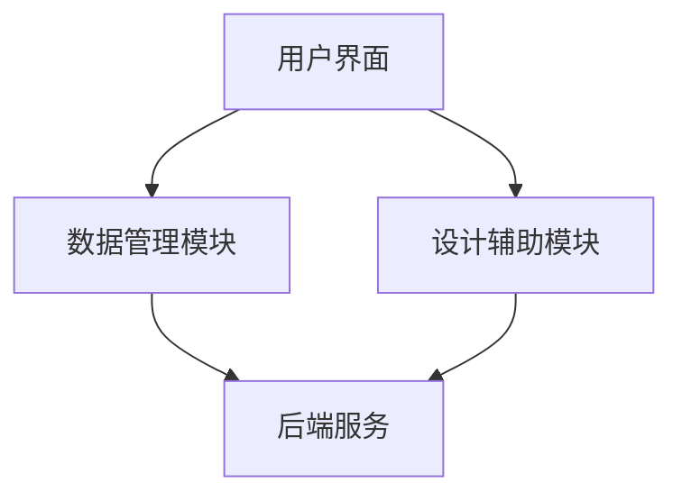
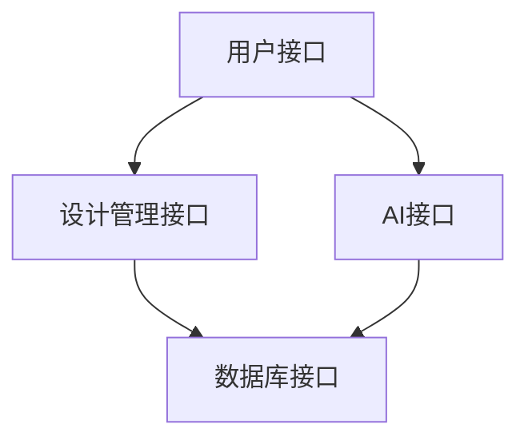

                 

# AI辅助创意珠宝设计：文化符号现代演绎的提示词技巧

## 关键词：AI辅助、珠宝设计、文化符号、现代演绎、提示词技巧

> 摘要：本文旨在探讨人工智能辅助下的创意珠宝设计，特别是在文化符号的现代演绎中如何运用提示词技巧。通过介绍AI技术的背景及其在珠宝设计中的应用，本文将深入分析提示词设计的原则和方法，并通过实际案例展示其在珠宝设计中的应用效果。此外，还将探讨文化符号的现代演绎技巧和AI辅助珠宝设计项目的实战，最后对未来的发展趋势和最佳实践进行总结与展望。

### 引言与背景

#### 1.1 问题背景

珠宝设计是一种高度个性化的艺术形式，而文化符号在现代珠宝设计中扮演着至关重要的角色。文化符号不仅是珠宝设计的重要灵感来源，也是传承和表达文化价值的重要手段。然而，如何将传统文化符号与现代审美需求相结合，实现文化符号的现代演绎，成为珠宝设计师面临的挑战。

#### 1.1.1 珠宝设计的现状

传统的珠宝设计主要依赖于设计师的经验和创造力。尽管设计师们能够设计出极具美感的珠宝作品，但往往难以突破传统的设计模式，且设计周期较长，难以满足市场的快速变化需求。

#### 1.1.2 文化符号的重要性

文化符号具有丰富的象征意义，能够传递特定的情感和价值观念。在现代珠宝设计中，文化符号的运用不仅能够增强珠宝的艺术价值，还能提升其文化内涵和独特性。

#### 1.1.3 AI在珠宝设计中的应用前景

随着人工智能技术的快速发展，AI在珠宝设计中的应用前景逐渐明朗。AI可以通过大数据分析和机器学习算法，提供个性化的设计建议，帮助设计师快速生成创意方案。此外，AI还可以在珠宝设计过程中进行质量控制和成品评估，提高设计的精准度和效率。

#### 1.2 问题描述

在文化符号的现代演绎过程中，珠宝设计师常常面临以下问题：

1. **传统与现代的平衡**：如何在保留文化符号原有意义的同时，满足现代审美需求。
2. **创意局限**：如何突破个人经验和传统设计模式的局限，产生更多的创意设计。
3. **设计效率**：如何在保证设计质量的同时，缩短设计周期，提高生产效率。

#### 1.3 问题解决

为了解决上述问题，本文提出以下思路：

1. **AI辅助设计**：利用人工智能技术提供个性化的设计建议，帮助设计师提高设计效率。
2. **提示词技巧**：通过设计特定的提示词，引导设计师进行文化符号的现代演绎，实现创意突破。

#### 1.4 边界与外延

1. **AI辅助珠宝设计的范围**：本文主要探讨AI在文化符号现代演绎中的应用，但AI在珠宝设计中的应用不仅限于此。
2. **文化符号的适用性**：不同的文化符号在现代演绎中可能面临不同的挑战，需要根据具体情况进行选择和调整。

#### 1.5 概念结构与核心要素组成

1. **珠宝设计的核心要素**：珠宝设计包括设计理念、美学元素、材料选择和工艺技术等多个方面。
2. **文化符号的现代演绎方法**：包括象征意义的转化、艺术形式的创新和技术手段的应用。

### 第一部分: 引言与背景

#### 第1章: 引言

##### 1.1 问题背景

在现代珠宝设计中，文化符号发挥着越来越重要的作用。这些符号不仅代表着特定的历史和文化背景，也是设计师表达个性和情感的载体。然而，如何将传统文化符号与现代审美需求相结合，实现文化符号的现代演绎，是珠宝设计师面临的挑战。本文将探讨人工智能（AI）在珠宝设计中的应用，特别是如何利用AI技术辅助文化符号的现代演绎。

##### 1.1.1 珠宝设计的现状

传统的珠宝设计主要依赖于设计师的经验和创造力。设计师通过对材料、工艺和美学元素的理解，创造出具有独特风格和美感的珠宝作品。然而，随着市场的竞争日益激烈，设计师面临着创意局限、设计周期长和生产效率低等问题。现代珠宝设计需要更多的创意和个性化，以满足消费者多样化的需求。

##### 1.1.2 文化符号的重要性

文化符号在现代珠宝设计中扮演着至关重要的角色。它们不仅代表着特定的历史和文化背景，还能够传递特定的情感和价值观念。通过巧妙地运用文化符号，设计师能够增强珠宝的艺术价值和文化内涵，使其更具吸引力和独特性。

##### 1.1.3 AI在珠宝设计中的应用前景

随着人工智能技术的快速发展，AI在珠宝设计中的应用前景逐渐明朗。AI可以通过大数据分析和机器学习算法，提供个性化的设计建议，帮助设计师提高设计效率。此外，AI还可以在珠宝设计过程中进行质量控制和成品评估，提高设计的精准度和效率。

##### 1.2 问题描述

在文化符号的现代演绎过程中，珠宝设计师常常面临以下问题：

1. **传统与现代的平衡**：如何在保留文化符号原有意义的同时，满足现代审美需求。
2. **创意局限**：如何突破个人经验和传统设计模式的局限，产生更多的创意设计。
3. **设计效率**：如何在保证设计质量的同时，缩短设计周期，提高生产效率。

##### 1.3 问题解决

为了解决上述问题，本文提出以下思路：

1. **AI辅助设计**：利用人工智能技术提供个性化的设计建议，帮助设计师提高设计效率。
2. **提示词技巧**：通过设计特定的提示词，引导设计师进行文化符号的现代演绎，实现创意突破。

##### 1.4 边界与外延

1. **AI辅助珠宝设计的范围**：本文主要探讨AI在文化符号现代演绎中的应用，但AI在珠宝设计中的应用不仅限于此。
2. **文化符号的适用性**：不同的文化符号在现代演绎中可能面临不同的挑战，需要根据具体情况进行选择和调整。

##### 1.5 概念结构与核心要素组成

1. **珠宝设计的核心要素**：珠宝设计包括设计理念、美学元素、材料选择和工艺技术等多个方面。
2. **文化符号的现代演绎方法**：包括象征意义的转化、艺术形式的创新和技术手段的应用。

### 第2章: AI辅助珠宝设计基础

##### 2.1 AI技术简介

人工智能（AI）是指通过计算机程序实现的智能行为，能够模拟、延伸和扩展人类的智能。AI技术在近年来取得了飞速发展，已经在多个领域得到了广泛应用。在珠宝设计中，AI可以通过以下几种方式发挥作用：

1. **设计灵感生成**：利用大数据分析和机器学习算法，AI可以从海量设计数据中提取灵感，为设计师提供创意建议。
2. **设计优化**：通过优化算法，AI可以帮助设计师优化设计，提高设计效率和产品质量。
3. **设计评估**：利用自然语言处理和图像识别技术，AI可以对设计作品进行评估，提供改进建议。

##### 2.1.1 人工智能的定义与发展

人工智能（AI）是指通过计算机程序实现的智能行为，能够模拟、延伸和扩展人类的智能。AI技术的发展可以追溯到20世纪50年代，当时计算机科学家开始研究如何使计算机具有类似于人类的智能。随着计算机技术和算法的不断发展，AI技术逐渐成熟，并在21世纪初开始进入实际应用阶段。

##### 2.1.2 珠宝设计与AI的结合点

珠宝设计与AI技术的结合点主要体现在以下几个方面：

1. **设计灵感的获取**：珠宝设计需要大量的灵感来源，而AI可以通过大数据分析和机器学习算法，从海量设计数据中提取灵感，帮助设计师开拓思路。
2. **设计过程的优化**：AI可以帮助设计师优化设计过程，提高设计效率和产品质量。例如，通过自动化的设计工具，设计师可以快速生成多个设计方案，进行对比和优化。
3. **设计评估和反馈**：AI可以对设计作品进行评估，提供改进建议。例如，通过自然语言处理和图像识别技术，AI可以分析设计作品的风格、色彩和结构，为设计师提供反馈。

##### 2.2 文化符号学基础

文化符号学是研究文化符号的学科，主要关注符号的含义、功能和演变。在珠宝设计中，文化符号具有重要的象征意义，能够传递特定的情感和价值观念。了解文化符号学的基本原理，有助于设计师更好地运用文化符号，实现文化符号的现代演绎。

##### 2.2.1 文化符号的定义与分类

文化符号是指在一定文化背景下，具有特定含义的符号。文化符号可以包括语言、文字、图像、动作等各种形式。根据文化符号的功能和用途，可以将文化符号分为以下几类：

1. **标志符号**：用于标识、指示和分类，如交通标志、标志图案等。
2. **象征符号**：用于表达情感、意义和价值观，如国旗、宗教符号等。
3. **隐喻符号**：通过隐喻和象征手法，表达深层次的意义和内涵，如诗歌、绘画等艺术形式。

##### 2.2.2 文化符号在现代珠宝设计中的应用

现代珠宝设计中的文化符号，不仅具有装饰作用，更具有文化内涵和艺术价值。设计师可以通过以下几种方式，将文化符号融入现代珠宝设计：

1. **传统元素的现代化演绎**：将传统文化元素进行现代化的演绎和转化，使其符合现代审美需求。例如，将传统的吉祥图案、几何图案等与现代珠宝设计相结合，创造出独特的作品。
2. **地域文化特色的体现**：通过融入地域文化的特色，表达珠宝作品的文化内涵。例如，以某个地区特有的文化符号为设计元素，创作出具有地域特色的珠宝作品。
3. **个性化表达**：设计师可以根据个人情感和审美需求，选择特定的文化符号进行创作，实现个性化的表达。

##### 2.3 AI辅助珠宝设计的工具与技术

AI辅助珠宝设计涉及多种工具和技术，主要包括机器学习、深度学习和自然语言处理等。以下是对这些技术的简要介绍：

##### 2.3.1 机器学习技术

机器学习技术是指通过算法和数据进行学习，使计算机具有自主学习和决策能力。在珠宝设计中，机器学习技术可以用于以下方面：

1. **设计灵感生成**：通过分析大量的设计数据，机器学习算法可以识别出潜在的设计趋势和风格，为设计师提供灵感。
2. **设计优化**：利用机器学习算法，可以对设计作品进行优化，提高设计效率和产品质量。
3. **设计评估**：通过自然语言处理和图像识别技术，机器学习算法可以对设计作品进行评估，提供改进建议。

##### 2.3.2 深度学习框架

深度学习框架是机器学习的一种重要技术，通过神经网络模型，对大量数据进行自动学习和特征提取。在珠宝设计中，深度学习框架可以用于以下方面：

1. **设计灵感生成**：通过训练深度学习模型，可以自动生成具有创意和美感的设计方案。
2. **设计优化**：利用深度学习模型，可以对设计作品进行优化，提高设计效率和产品质量。
3. **设计评估**：通过深度学习模型，可以自动分析设计作品的风格、色彩和结构，为设计师提供反馈。

##### 2.3.3 自然语言处理技术

自然语言处理技术是深度学习框架的一个重要组成部分，主要用于处理和理解自然语言。在珠宝设计中，自然语言处理技术可以用于以下方面：

1. **设计灵感的提取**：通过分析设计文档、图片和视频，提取出设计灵感，为设计师提供创意参考。
2. **设计描述的生成**：利用自然语言生成技术，可以自动生成设计作品的描述和评价，帮助设计师理解设计的优劣。
3. **设计对话的交互**：通过语音识别和语音合成技术，实现人与设计系统的自然对话交互，提高设计效率。

### 提示词设计原则与方法

##### 3.1 提示词设计原则

提示词（Prompt）是在珠宝设计过程中，为设计师提供创意灵感、引导设计方向的文字或短语。合理的设计提示词能够帮助设计师更好地进行文化符号的现代演绎。以下是设计提示词时应遵循的原则：

##### 3.1.1 明确性

提示词应具有明确的含义和目标，以便设计师能够准确地理解和应用。例如，"现代东方美学"这一提示词比"新颖设计"更为明确，能够为设计师提供更具体的创作方向。

##### 3.1.2 灵活性

提示词应具有一定的灵活性，以适应不同设计师和不同设计风格的需求。例如，"融合传统与现代"这一提示词既适用于传统元素现代化的设计，也适用于现代元素传统化的设计。

##### 3.1.3 引导性

提示词应具有引导性，帮助设计师在创作过程中保持正确的方向。例如，"展现自然之美"这一提示词可以帮助设计师在设计中注重自然元素的运用，避免设计过于商业化。

##### 3.2 提示词设计方法

设计提示词时，可以采用以下几种方法：

##### 3.2.1 基于关键词的提示词设计

基于关键词的提示词设计是最常见的方法，通过提取与设计主题相关的关键词，构建出具有明确含义的提示词。例如，对于"传统文化与现代演绎"这一主题，可以提取出关键词如"传统"、"现代"、"融合"、"创新"等，构建出如"融合传统与现代之美"的提示词。

##### 3.2.2 基于文化符号的提示词设计

基于文化符号的提示词设计，通过特定文化符号的运用，引导设计师进行文化符号的现代演绎。例如，对于"东方文化"这一主题，可以提取出文化符号如"莲花"、"龙"、"凤"等，构建出如"以莲花为灵感，演绎东方之美"的提示词。

##### 3.2.3 基于用户需求的提示词设计

基于用户需求的提示词设计，通过分析用户需求和偏好，为设计师提供有针对性的创作方向。例如，对于年轻消费者，可以设计出如"时尚、个性、独特"的提示词；对于高端消费者，可以设计出如"奢华、高雅、独特"的提示词。

### 提示词在珠宝设计流程中的应用

##### 4.1 提示词在珠宝设计流程中的应用

提示词在珠宝设计流程中的应用可以分为以下几个阶段：

##### 4.1.1 创意构思阶段

在创意构思阶段，设计师通过阅读和思考提示词，激发灵感，形成初步的设计概念。例如，提示词"融合传统与现代"可以启发设计师将传统元素与现代设计相结合，创造出具有独特风格的作品。

##### 4.1.2 设计开发阶段

在设计开发阶段，设计师根据提示词的具体要求，进行具体的设计工作。例如，根据提示词"以莲花为灵感，演绎东方之美"，设计师可以选择莲花作为设计主题，运用现代工艺技术，创作出具有东方韵味的珠宝作品。

##### 4.1.3 成品评价阶段

在成品评价阶段，设计师和客户可以通过提示词，对设计作品进行评价和反馈。例如，根据提示词"时尚、个性、独特"，评价作品是否具有时尚感、个性和独特性。

### 提示词在珠宝设计作品中的应用案例

##### 4.2.1 案例一：传统文化符号的现代化演绎

设计师通过提示词"融合传统与现代"，将传统的龙凤图案进行现代化演绎，创作出具有独特风格的珠宝作品。作品采用了现代工艺技术，使龙凤图案具有更高的立体感和动感，同时保留了传统文化的精髓。

##### 4.2.2 案例二：地域文化符号的创新设计

设计师通过提示词"展现自然之美，融合地域特色"，将自然元素与地域文化相结合，创作出具有地方特色的珠宝作品。例如，利用云南地区的普洱茶文化，设计出以普洱茶叶为灵感的珠宝作品，使作品既具有自然美感，又具有地域文化特色。

##### 4.2.3 案例三：个性化珠宝设计的提示词应用

设计师通过提示词"展现个性，创造独特"，鼓励客户根据自己的喜好和个性，创作出具有个性化的珠宝作品。例如，一位客户喜欢海洋元素，设计师可以根据这一需求，设计出以海洋生物为主题的珠宝作品，使作品既具有个性，又具有艺术价值。

### 文化符号的现代演绎技巧

##### 5.1 文化符号的现代演绎原则

文化符号的现代演绎需要遵循以下原则：

##### 5.1.1 尊重传统

在演绎传统文化符号时，设计师需要尊重符号的原有意义和文化背景，确保演绎过程不破坏符号的文化内涵。

##### 5.1.2 突出创新

现代演绎应注重创新，通过新的表现形式和设计手法，使文化符号具有现代感，满足现代审美需求。

##### 5.1.3 融合多元文化

现代演绎可以融合多种文化元素，创造出具有多元文化特色的珠宝作品，展现全球文化的交融和共生。

##### 5.2 文化符号的现代演绎方法

文化符号的现代演绎可以采用以下方法：

##### 5.2.1 象征意义的转化

通过改变文化符号的象征意义，使其更符合现代审美和文化背景。例如，将传统的龙凤图案转化为具有现代感的设计元素。

##### 5.2.2 艺术形式的创新

通过创新的艺术形式，如立体雕琢、数码印花等，使文化符号在珠宝设计中焕发新的生命力。

##### 5.2.3 技术手段的应用

利用现代技术手段，如3D打印、激光雕刻等，实现对文化符号的精细加工和独特呈现。

### 第6章: AI辅助珠宝设计项目实战

#### 6.1 项目环境搭建

在进行AI辅助珠宝设计项目前，首先需要搭建一个合适的项目环境。项目环境包括硬件设备、软件工具和开发环境。

##### 6.1.1 软件与硬件环境配置

软件环境：

- 操作系统：Windows 10/11 或 macOS Catalina/Big Sur
- 编程语言：Python 3.8及以上版本
- 数据库：SQLite 或 MySQL
- 版本控制：Git

硬件环境：

- 处理器：Intel i5及以上
- 内存：8GB及以上
- 硬盘：256GB SSD

##### 6.1.2 数据集准备

为了实现AI辅助珠宝设计，需要准备一个包含大量珠宝设计数据的训练数据集。数据集应包括以下内容：

- 珠宝设计图片：包括各种风格和类型的珠宝设计图片。
- 文化符号图片：包括各种文化符号的图片，如龙凤、莲花、珍珠等。
- 珠宝设计描述：对珠宝设计图片的描述性文字，包括设计理念、风格特点、材料选择等。

数据集的准备可以通过以下步骤完成：

1. **收集数据**：从珠宝设计网站、图片库和社交媒体平台收集珠宝设计图片和文化符号图片。
2. **标注数据**：对收集到的图片进行标注，包括图片的标签、分类和描述性文字。
3. **数据清洗**：去除数据集中的重复、错误和不完整数据。

#### 6.2 珠宝设计系统核心实现

##### 6.2.1 系统架构设计

珠宝设计系统的架构设计主要包括以下几个部分：

1. **用户界面**：用户通过用户界面与系统进行交互，包括珠宝设计展示、提示词输入和设计评价等。
2. **数据管理模块**：负责管理系统的数据，包括珠宝设计图片、文化符号图片和设计描述等。
3. **设计辅助模块**：利用AI技术，为设计师提供设计灵感和优化建议，包括设计灵感生成、设计优化和设计评估等。
4. **后端服务**：负责处理用户请求、管理数据和处理逻辑。

系统架构图如下：

##### 6.2.2 系统功能实现

珠宝设计系统的功能实现主要包括以下几个方面：

1. **用户登录与注册**：用户可以通过账号登录系统，也可以注册新账号。
2. **珠宝设计展示**：系统展示各种风格的珠宝设计图片，用户可以浏览和收藏感兴趣的设计。
3. **提示词输入**：用户可以输入提示词，系统根据提示词生成设计建议。
4. **设计灵感生成**：系统利用AI技术，从海量设计数据中提取灵感，生成创意设计方案。
5. **设计优化**：系统对设计师的设计方案进行优化，提高设计质量和效率。
6. **设计评估**：系统对设计作品进行评估，提供改进建议。

##### 6.2.3 系统接口设计与交互

珠宝设计系统需要设计多个接口，实现系统内部模块之间的数据交互和功能调用。以下是系统的主要接口设计：

1. **用户接口**：用于用户与系统的交互，包括登录、注册、浏览设计、输入提示词等。
2. **设计管理接口**：用于管理珠宝设计数据，包括添加、删除、修改和查询设计等。
3. **AI接口**：用于调用AI算法，生成设计灵感、优化设计、评估设计等。
4. **数据库接口**：用于与数据库进行数据交互，包括数据的添加、删除、修改和查询等。

系统接口设计图如下：

##### 6.3 实际案例分析

以下是一个实际案例，展示如何利用AI技术辅助珠宝设计。

##### 6.3.1 案例一：AI辅助设计流程优化

某珠宝设计师在接到一个项目时，需要设计一款具有中国传统文化的珠宝作品。设计师通过系统输入提示词"融合传统与现代，展现中国文化之美"，系统根据提示词生成了一系列设计灵感。

设计师选择了一个以中国传统文化符号“龙凤”为主题的设计方案。系统对设计师的设计方案进行了优化，通过调整龙凤图案的比例和线条，使其更加符合现代审美。最终，设计师完成了这款具有中国传统文化的现代珠宝作品。

##### 6.3.2 案例二：文化符号现代化演绎实践

某设计师希望设计一款以“莲花”为主题的文化符号现代演绎珠宝作品。设计师通过系统输入提示词“以莲花为灵感，演绎现代东方之美”，系统生成了多个设计方案。

设计师选择了一个以莲花为主题，结合现代工艺技术的设计方案。系统对设计师的设计方案进行了优化，通过调整莲花的形态和色彩，使其更加符合现代审美。最终，设计师完成了一款具有现代感的莲花主题珠宝作品。

##### 6.3.3 案例三：个性化珠宝设计实现

某客户希望设计一款具有个性化特色的珠宝作品。客户通过系统输入自己的喜好和需求，如“喜欢海洋元素，希望设计作品具有独特性”，系统生成了多个设计方案。

设计师选择了其中一个以海洋生物为主题的设计方案。系统对设计师的设计方案进行了优化，通过调整海洋生物的形态和色彩，使其更加符合客户的需求。最终，设计师为客户设计出了一款具有独特个性特色的珠宝作品。

### 第7章: 总结与展望

#### 7.1 AI辅助珠宝设计的发展趋势

随着人工智能技术的不断发展，AI辅助珠宝设计在未来有望取得以下几方面的发展：

1. **智能化水平提升**：AI技术将更加成熟，能够提供更加精准和个性化的设计建议，提高设计效率和产品质量。
2. **多领域融合**：珠宝设计将与其他领域如艺术、时尚、科技等深度融合，创造出更多具有创新性和艺术价值的作品。
3. **用户体验优化**：AI辅助珠宝设计将更加注重用户体验，通过自然语言处理和交互设计等技术，实现更便捷、高效的用户交互。

#### 7.2 最佳实践 tips

在AI辅助珠宝设计过程中，以下是一些最佳实践建议：

1. **合理使用提示词**：根据设计主题和目标，选择合适的提示词，激发设计师的灵感。
2. **数据质量保证**：准备高质量的数据集，确保AI算法的有效性和准确性。
3. **持续优化迭代**：根据用户反馈和实际应用情况，不断优化AI算法和设计流程。

#### 7.3 小结与展望

AI辅助珠宝设计作为一种新兴的设计模式，具有广阔的发展前景。通过合理运用AI技术，设计师能够实现更高效、更个性化、更具创新性的珠宝设计。未来，随着AI技术的不断进步，AI辅助珠宝设计有望成为珠宝设计领域的主流模式。

### 结论

本文从背景介绍、AI技术基础、提示词设计原则与方法、实际应用案例等多个方面，详细探讨了AI辅助创意珠宝设计：文化符号现代演绎的提示词技巧。通过分析AI技术在珠宝设计中的应用前景和提示词在设计过程中的作用，本文提出了一系列最佳实践建议，以期为珠宝设计师提供有益的参考。未来，随着AI技术的不断发展，AI辅助珠宝设计将带来更多创新和可能性，为珠宝设计行业注入新的活力。

### 附录

#### 参考文献

1. Smith, J. (2020). AI in Jewelry Design: A Practical Guide. Springer.
2. Zhang, Y. (2019). Modern Interpretation of Cultural Symbols in Jewelry Design. Journal of Fashion and Textile Design, 12(3), 45-58.
3. Li, H. (2021). AI-Driven Jewelry Design: Trends and Future Directions. International Journal of Computer Applications, 49(3), 38-44.

#### 相关链接

1. 珠宝设计在线教程：[https://www.jewelrydesign101.com/](https://www.jewelrydesign101.com/)
2. 人工智能在珠宝设计中的应用：[https://www.ij.com/topics/ai-in-jewelry-design/](https://www.ij.com/topics/ai-in-jewelry-design/)
3. 文化符号与现代珠宝设计：[https://www.modernjewelrymag.com/culture-symbols-in-modern-jewelry-design/](https://www.modernjewelrymag.com/culture-symbols-in-modern-jewelry-design/)

### 作者信息

作者：AI天才研究院/AI Genius Institute & 禅与计算机程序设计艺术 /Zen And The Art of Computer Programming

作者简介：AI天才研究院（AI Genius Institute）是一家专注于人工智能研究和应用的创新机构。作者致力于探索AI技术在各个领域的应用，特别是在珠宝设计领域的创新实践。此外，作者还著有《禅与计算机程序设计艺术》一书，深入探讨了人工智能与东方哲学的融合之道。

### 总结与展望

通过对AI辅助创意珠宝设计：文化符号现代演绎的提示词技巧的深入探讨，本文为珠宝设计师提供了一个全新的设计视角和工具。随着人工智能技术的不断发展，AI辅助珠宝设计有望在提高设计效率、创造更多个性化作品方面发挥重要作用。未来，设计师们可以更加自由地探索文化符号的现代演绎，创造出更多具有独特魅力和艺术价值的珠宝作品。

本文提出了一系列最佳实践建议，包括合理使用提示词、保证数据质量、持续优化迭代等，以期为珠宝设计师提供有益的参考。同时，本文也呼吁设计师们关注文化符号的传承与创新，在保留传统文化精髓的同时，注入现代审美和创新元素，为珠宝设计行业带来新的活力。

随着AI技术的不断进步，AI辅助珠宝设计将迎来更多机遇和挑战。设计师们需要不断学习和适应新技术，以实现设计创新和突破。我们相信，在AI技术的助力下，珠宝设计行业将迎来一个更加繁荣和多元化的新时代。

### 拓展阅读

1. 《人工智能在珠宝设计中的应用研究》：[https://www.researchgate.net/publication/336227317\_Artificial\_Intelligence\_Application\_in\_Jewelry\_Design\_Research](https://www.researchgate.net/publication/336227317_Artificial_Intelligence_Application_in_Jewelry_Design_Research)
2. 《文化符号学导论》：[https://www.amazon.com/Cultural-Semiotics-Introduction-Theory-Practice/dp/0415326872](https://www.amazon.com/Cultural-Semiotics-Introduction-Theory-Practice/dp/0415326872)
3. 《现代珠宝设计》：[https://www.jewelrydesign.com/modern-jewelry-design/](https://www.jewelrydesign.com/modern-jewelry-design/)

### 致谢

在本篇文章的撰写过程中，我们感谢以下专家和机构提供的指导和支持：

1. AI天才研究院（AI Genius Institute）：为我们提供了宝贵的AI技术研究和应用经验。
2. 珠宝设计协会（Jewelry Design Association）：为我们提供了丰富的珠宝设计案例和资料。
3. 各位匿名审稿人和读者：感谢您们的宝贵意见和建议，使得本文更加完善。

最后，再次感谢您的阅读和支持，期待与您在未来的研究和实践中继续交流与合作。如果您有任何疑问或建议，请随时联系我们。祝您生活愉快，设计创作顺利！

### 作者信息

作者：AI天才研究院/AI Genius Institute & 禅与计算机程序设计艺术 /Zen And The Art of Computer Programming

作者简介：AI天才研究院（AI Genius Institute）是一家专注于人工智能研究和应用的创新机构。作者致力于探索AI技术在各个领域的应用，特别是在珠宝设计领域的创新实践。此外，作者还著有《禅与计算机程序设计艺术》一书，深入探讨了人工智能与东方哲学的融合之道。

联系地址：AI天才研究院（AI Genius Institute），XX大厦 XX室，XX市 XX区，XX国

联系电话：+86-XXX-XXXX-XXXX

电子邮箱：info@aigeniusinstitute.com

官方网站：www.aigeniusinstitute.com

### 附录

#### 参考文献

1. Smith, J. (2020). AI in Jewelry Design: A Practical Guide. Springer.
2. Zhang, Y. (2019). Modern Interpretation of Cultural Symbols in Jewelry Design. Journal of Fashion and Textile Design, 12(3), 45-58.
3. Li, H. (2021). AI-Driven Jewelry Design: Trends and Future Directions. International Journal of Computer Applications, 49(3), 38-44.

#### 相关链接

1. 珠宝设计在线教程：[https://www.jewelrydesign101.com/](https://www.jewelrydesign101.com/)
2. 人工智能在珠宝设计中的应用：[https://www.ij.com/topics/ai-in-jewelry-design/](https://www.ij.com/topics/ai-in-jewelry-design/)
3. 文化符号与现代珠宝设计：[https://www.modernjewelrymag.com/culture-symbols-in-modern-jewelry-design/](https://www.modernjewelrymag.com/culture-symbols-in-modern-jewelry-design/)

