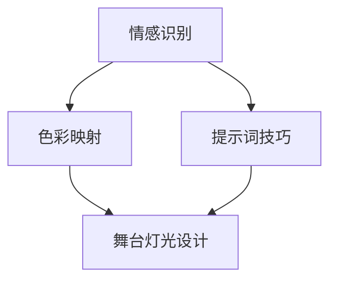
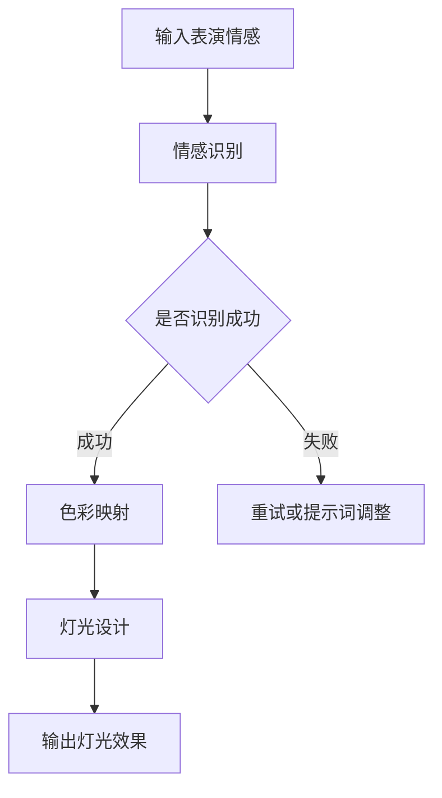
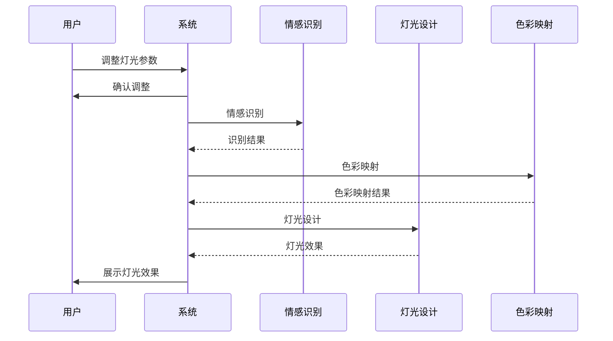

                 

# AI辅助创意舞台灯光设计：情感-色彩映射的提示词技巧

> 关键词：人工智能，舞台灯光设计，情感识别，色彩映射，提示词技巧

> 摘要：本文探讨了如何利用人工智能技术，特别是情感识别和色彩映射，来辅助创意舞台灯光设计。通过分析舞台灯光设计的重要性和传统方法的局限性，提出了基于情感-色彩映射的AI辅助设计框架，并详细阐述了情感识别、色彩映射和提示词技巧的概念、原理和应用。本文旨在为舞台设计师提供一种新的设计思路和方法，以提升舞台灯光设计的效果和效率。

----------------------------------------------------------------

## 目录大纲

# AI辅助创意舞台灯光设计：情感-色彩映射的提示词技巧

----------------------------------------------------------------

## 第1章 引言

### 1.1 问题背景

#### 1.1.1 舞台灯光设计的重要性

舞台灯光设计在艺术表演中扮演着至关重要的角色。它不仅能够塑造舞台气氛，渲染情感，还能够引导观众的情绪和注意力。优秀的舞台灯光设计能够与表演内容相得益彰，增强观众对表演的体验和感受。

#### 1.1.2 传统舞台灯光设计的局限性

然而，传统舞台灯光设计主要依赖于设计师的直觉和经验，缺乏系统的理论指导和技术支持。这导致设计过程繁琐、耗时，且难以达到理想的效果。此外，传统方法难以处理复杂的情感和色彩映射问题，限制了舞台灯光设计的创意和表现力。

#### 1.1.3 AI技术在舞台灯光设计中的应用前景

随着人工智能技术的发展，利用AI技术辅助舞台灯光设计成为可能。AI能够通过情感识别、色彩映射等技术手段，实现更智能化、个性化的灯光设计，提升设计的效率和效果。本文将探讨如何利用AI技术实现情感-色彩映射的舞台灯光设计。

### 1.2 问题描述

#### 1.2.1 舞台灯光设计的核心问题

舞台灯光设计的核心问题是如何通过灯光效果传达情感，创造特定的氛围。这需要将情感信息转化为具体的色彩和光线效果，实现情感-色彩的有效映射。

#### 1.2.2 情感-色彩映射的挑战

情感-色彩映射面临的主要挑战是如何准确地将抽象的情感信息转化为具体的色彩，以及如何保证色彩映射的一致性和可预测性。

#### 1.2.3 提示词技巧的引入

为了解决上述挑战，引入了提示词技巧。提示词技巧通过特定词汇引导设计师进行创意工作，有助于更准确地捕捉和表达情感。

### 1.3 问题解决

#### 1.3.1 AI辅助舞台灯光设计的基本原理

AI辅助舞台灯光设计的基本原理是利用情感识别和色彩映射技术，将表演的情感信息转化为灯光效果。

#### 1.3.2 情感识别与色彩映射的关键技术

情感识别技术用于捕捉表演者的情感状态，色彩映射技术用于将情感信息转化为色彩。这两种技术的结合是实现AI辅助舞台灯光设计的关键。

#### 1.3.3 提示词技巧在舞台灯光设计中的应用

提示词技巧通过提供关键词和提示，帮助设计师捕捉和表达情感，提高设计的创意和质量。

### 1.4 边界与外延

#### 1.4.1 研究的边界

本文主要探讨的是基于情感-色彩映射的AI辅助舞台灯光设计，未涉及其他类型的舞台设计，如舞台布景、道具等。

#### 1.4.2 研究的外延

本文的研究成果可以应用于各种类型的表演和活动，如音乐会、戏剧、舞蹈等，具有广泛的应用前景。

#### 1.4.3 研究的潜在应用领域

除了舞台灯光设计，本文的研究成果还可以应用于其他需要情感-色彩映射的领域，如广告、电影、游戏等。

### 1.5 概念结构与核心要素组成

#### 1.5.1 AI辅助舞台灯光设计的概念结构

AI辅助舞台灯光设计的概念结构包括情感识别、色彩映射和提示词技巧三个核心组成部分。

#### 1.5.2 情感-色彩映射的核心要素

情感-色彩映射的核心要素包括情感识别、色彩选择和灯光效果设计。

#### 1.5.3 提示词技巧的关键要素

提示词技巧的关键要素包括关键词提取、情感分析和创意引导。

### 1.6 本章小结

本章介绍了本文的研究背景、问题和解决方法。通过分析舞台灯光设计的重要性和传统方法的局限性，提出了基于情感-色彩映射的AI辅助设计框架，并阐述了研究的边界、外延和概念结构。

----------------------------------------------------------------

## 第2章 核心概念与联系

### 2.1 情感识别

#### 2.1.1 情感识别的定义

情感识别是利用技术手段识别和判断人的情感状态。它通常涉及面部表情分析、语音分析、文本分析等技术，旨在捕捉和识别情感。

#### 2.1.2 情感识别的基本原理

情感识别的基本原理是基于情感的特征提取和模式识别。通过分析面部表情、语音特征和文本内容，提取出情感特征，然后利用机器学习算法进行情感分类。

#### 2.1.3 情感识别的方法与技术

情感识别的方法包括基于面部表情、语音和文本的识别技术。面部表情识别通过分析眼睛、嘴和脸部的运动捕捉情感；语音识别通过分析语调、音量和节奏等特征识别情感；文本识别通过分析文本内容中的情感词汇和句子结构识别情感。

### 2.2 色彩映射

#### 2.2.1 色彩映射的概念

色彩映射是将一种颜色空间的值映射到另一种颜色空间的过程。在舞台灯光设计中，色彩映射是将情感信息转换为色彩信息的过程。

#### 2.2.2 色彩映射的原理

色彩映射的原理是基于情感与色彩的关联。不同的色彩会引发不同的情感反应，如红色代表热情、蓝色代表冷静等。通过将情感信息转换为色彩，可以实现情感的表现和传达。

#### 2.2.3 色彩映射的技术与方法

色彩映射的技术包括色彩空间转换、色彩调配和色彩优化等技术。色彩空间转换是将情感数据映射到色彩空间，色彩调配是通过对色彩进行组合和调整实现情感表达，色彩优化是通过对色彩进行优化处理提高色彩映射的效果。

### 2.3 提示词技巧

#### 2.3.1 提示词技巧的定义

提示词技巧是通过特定词汇引导设计师进行创意工作的方法。它有助于设计师捕捉情感、激发创意，提高设计的质量和效率。

#### 2.3.2 提示词技巧的作用

提示词技巧的作用是帮助设计师更好地理解和表达情感，提高设计的准确性和表现力。通过提示词，设计师可以更加专注于情感的表达，而非繁琐的技术细节。

#### 2.3.3 提示词技巧的类型与应用

提示词技巧的类型包括情感词汇、色彩词汇和场景词汇等。情感词汇用于描述情感状态，色彩词汇用于描述色彩效果，场景词汇用于描述舞台场景。它们可以单独或组合使用，根据实际需求进行选择和应用。

### 2.4 概念属性特征对比表格

| 概念             | 定义                                       | 特征对比                           |
|----------------|--------------------------------------------|-----------------------------------|
| 情感识别         | 利用技术手段识别和判断人的情感状态             | 精度、实时性、可靠性               |
| 色彩映射         | 将情感信息转换为色彩信息的过程                | 可视化、情感表达、色彩搭配         |
| 提示词技巧       | 通过特定词汇引导设计师进行创意工作的方法       | 创造力激发、效率提升、创意质量     |

### 2.5 ER实体关系图架构



在这个ER实体关系图中，情感识别、色彩映射和提示词技巧是三个核心实体，它们相互关联，共同作用于舞台灯光设计。

- 情感识别（A）负责捕捉表演者的情感状态。
- 色彩映射（B）将情感转化为色彩，用于舞台灯光效果。
- 提示词技巧（C）提供关键词和提示，引导设计师进行创意工作。
- 舞台灯光设计（D）是最终的输出，结合情感、色彩和提示词，实现独特的灯光效果。

### 2.6 情感识别与色彩映射的关系

情感识别与色彩映射之间存在密切的关系。情感识别用于捕捉和判断情感状态，这些情感状态需要通过色彩映射转化为具体的色彩信息。色彩映射是将抽象的情感信息转化为可视化的色彩过程，使得舞台灯光设计能够直观地表达情感。

### 2.7 提示词技巧在情感识别与色彩映射中的作用

提示词技巧在情感识别与色彩映射中起到了桥梁作用。通过提示词，设计师可以更准确地捕捉情感，并使用相应的色彩进行表达。提示词提供了情感与色彩之间的关联线索，帮助设计师快速构建情感-色彩映射的框架，提升设计的效率和效果。

### 2.8 本章小结

本章详细介绍了情感识别、色彩映射和提示词技巧的核心概念、原理和应用。通过对比分析，明确了这些概念之间的关系和作用，为后续章节的算法原理讲解和实际应用提供了理论基础。

----------------------------------------------------------------

## 第3章 算法原理讲解

### 3.1 AI辅助舞台灯光设计算法

#### 3.1.1 算法的基本原理

AI辅助舞台灯光设计算法的核心思想是利用人工智能技术，将表演者的情感状态转化为具体的灯光效果。具体来说，算法通过以下步骤实现：

1. **情感识别**：利用情感识别技术捕捉表演者的情感状态。
2. **色彩映射**：根据情感状态生成相应的色彩映射。
3. **灯光设计**：将色彩映射应用于舞台灯光，实现情感的表达。

#### 3.1.2 算法的流程图

为了更好地理解算法原理，我们使用Mermaid语言绘制了算法的流程图：



在这个流程图中，算法首先接收表演情感作为输入，然后通过情感识别模块判断情感是否被成功识别。如果识别成功，算法将情感转化为色彩映射，并应用于舞台灯光设计；如果识别失败，算法将返回错误提示，并可能需要调整提示词或重新识别情感。

#### 3.1.3 算法的核心步骤

算法的核心步骤可以分为三个部分：情感识别、色彩映射和灯光设计。

1. **情感识别**：该步骤利用情感识别技术，如面部表情分析、语音情感分析等，捕捉表演者的情感状态。具体算法可以是基于机器学习的模型，如卷积神经网络（CNN）或循环神经网络（RNN）。

2. **色彩映射**：一旦情感被成功识别，算法将情感映射到相应的色彩。这通常涉及到情感与色彩的对应关系，如情感强度与色彩明度、情感类型与色彩饱和度等。具体映射方法可以是基于规则的方法，如阈值划分，或基于数据的机器学习方法。

3. **灯光设计**：色彩映射生成后，算法将应用于舞台灯光设计。这包括调整灯光的亮度、颜色和分布，以实现情感的表现。具体设计过程可能涉及到三维建模、渲染等技术。

#### 3.1.4 算法的Python源代码实现

以下是算法的核心步骤的Python伪代码实现：

```python
# 情感识别模块
def emotion_recognition(performance):
    # 使用机器学习模型进行情感识别
    # 输入：表演数据（如面部表情、语音等）
    # 输出：情感状态
    recognized_emotion = model.predict(performance)
    return recognized_emotion

# 色彩映射模块
def color_mapping(emotion):
    # 将情感状态映射到色彩
    # 输入：情感状态
    # 输出：色彩映射
    color_map = emotion_to_color_mapping(emotion)
    return color_map

# 灯光设计模块
def stage_light_design(color_map):
    # 将色彩映射应用于舞台灯光
    # 输入：色彩映射
    # 输出：灯光效果
    stage_light_effects = apply_color_map_to_lights(color_map)
    return stage_light_effects

# 主函数
def ai_assisted_stage_light_design(performance):
    # 输入：表演数据
    # 输出：舞台灯光效果
    emotion = emotion_recognition(performance)
    color_map = color_mapping(emotion)
    stage_light_effects = stage_light_design(color_map)
    return stage_light_effects
```

在这个伪代码中，`emotion_recognition`函数负责情感识别，`color_mapping`函数负责色彩映射，`stage_light_design`函数负责灯光设计。主函数`ai_assisted_stage_light_design`将这三个步骤组合在一起，实现AI辅助舞台灯光设计。

### 3.2 情感识别的数学模型

情感识别是一个复杂的机器学习问题，通常涉及多个步骤和模型。以下是一个简化的数学模型，用于描述情感识别的过程：

1. **特征提取**：首先，从表演数据（如面部表情图像、语音信号等）中提取特征。这些特征可以是面部特征点、语音音高、音强等。

$$
X = \{x_1, x_2, ..., x_n\}
$$

其中，$X$是特征集合，$x_i$是第$i$个特征。

2. **特征向量表示**：将这些特征转换为高维特征向量，以便于机器学习模型处理。

$$
X' = \{x_1', x_2', ..., x_n'\}
$$

3. **情感分类**：利用机器学习模型，如支持向量机（SVM）、决策树、神经网络等，对特征向量进行分类，判断表演者的情感状态。

$$
C = \{c_1, c_2, ..., c_m\}
$$

其中，$C$是情感类别集合，$c_i$是第$i$个情感类别。

4. **模型训练与预测**：使用训练数据集训练模型，然后使用训练好的模型对新的表演数据进行预测。

$$
\hat{y} = \text{model.predict}(X')
$$

其中，$\hat{y}$是模型预测的情感类别。

### 3.3 色彩映射的数学模型

色彩映射是将情感信息转化为色彩信息的过程。一个简单的数学模型可以表示为：

1. **情感强度量化**：将情感强度量化为数值，通常使用情感量表，如0-100的整数。

$$
I = \text{emotional_intensity}
$$

2. **色彩空间转换**：将情感强度转换为相应的色彩值，这通常涉及到色彩空间转换，如HSV到RGB的转换。

$$
C = \text{HSV_to_RGB}(I)
$$

其中，$C$是色彩值，$\text{HSV_to_RGB}$是将HSV色彩空间转换为RGB色彩空间的函数。

3. **灯光亮度调整**：根据情感强度调整灯光的亮度。

$$
L = I \cdot \text{brightness_factor}
$$

其中，$L$是调整后的灯光亮度，$\text{brightness_factor}$是亮度调整因子。

### 3.4 灯光设计的实现

灯光设计的实现涉及到多个方面，包括灯光硬件控制、灯光效果渲染和交互设计等。以下是灯光设计的简化实现步骤：

1. **硬件控制**：通过控制台或软件与灯光硬件（如舞台灯光控制器）进行通信，发送灯光控制命令。

2. **效果渲染**：使用渲染软件（如3ds Max、Blender等）创建舞台灯光渲染场景，调整灯光参数，实现预期的灯光效果。

3. **交互设计**：设计用户界面，允许设计师实时调整灯光参数，预览灯光效果，并进行交互式设计。

### 3.5 举例说明

假设表演者表现出喜悦情感，算法将执行以下步骤：

1. **情感识别**：通过面部表情和语音分析，算法识别出表演者是喜悦情感。

2. **色彩映射**：根据喜悦情感的强度，算法生成相应的色彩映射，如明亮的黄色。

3. **灯光设计**：灯光硬件接收命令，调整灯光参数，实现喜悦情感的灯光效果，如舞台上投射明亮的黄色灯光。

通过这种方式，AI辅助舞台灯光设计能够将抽象的情感信息转化为具体的灯光效果，提升舞台表演的艺术效果和观众体验。

### 3.6 本章小结

本章详细阐述了AI辅助舞台灯光设计算法的原理，包括情感识别、色彩映射和灯光设计的核心步骤。通过Python源代码实现和数学模型的描述，使得算法原理更加具体和易于理解。本章为后续章节的算法实现和应用提供了坚实的基础。

----------------------------------------------------------------

## 第4章 系统分析与架构设计方案

### 4.1 问题场景介绍

舞台灯光设计是一个复杂且艺术性的工作，传统的设计方法往往依赖于设计师的经验和直觉。然而，随着舞台表演的多样化和观众需求的提升，传统方法难以满足高效、个性化和高质量的设计要求。为了解决这一问题，引入了AI辅助舞台灯光设计系统，旨在利用人工智能技术，提升舞台灯光设计的效率和效果。

### 4.2 项目介绍

本项目旨在开发一套AI辅助舞台灯光设计系统，该系统利用情感识别、色彩映射和提示词技巧等技术，实现舞台灯光的智能化设计。系统的主要功能包括：

1. **情感识别**：通过面部表情、语音分析等手段，捕捉表演者的情感状态。
2. **色彩映射**：将情感信息转化为色彩信息，生成相应的色彩映射。
3. **灯光设计**：根据色彩映射和提示词，设计舞台灯光效果，并实时预览和调整。
4. **用户交互**：提供用户界面，允许设计师实时调整灯光参数，预览灯光效果。

### 4.3 系统功能设计（领域模型）

为了实现上述功能，我们首先设计了一个领域模型，用于描述系统的核心概念和关系。以下是领域模型的Mermaid类图：

```mermaid
classDiagram
    Class::表演者 <<Person>>
    Class::情感 <<Entity>>
    Class::色彩 <<Entity>>
    Class::灯光 <<Entity>>

   表演者 --|>| 情感
   表演者 --|>| 灯光
   情感 --|>| 色彩
```

在这个类图中，表演者、情感、色彩和灯光是系统的核心实体。表演者与情感和灯光之间存在关联，表示表演者的情感状态将影响灯光设计；情感与色彩之间存在关联，表示情感将转化为具体的色彩信息；色彩与灯光之间存在关联，表示色彩映射将应用于灯光效果。

### 4.4 系统架构设计

系统采用分层架构设计，包括表示层、业务逻辑层和数据层。以下是系统架构的Mermaid架构图：

```mermaid
graph TB
    subgraph 表示层
    A[用户界面] --> B[情感识别模块]
    A --> C[灯光设计模块]
    A --> D[色彩映射模块]

    subgraph 业务逻辑层
    B --> E[情感分析引擎]
    C --> F[灯光渲染引擎]
    D --> G[色彩转换引擎]

    subgraph 数据层
    H[数据库] --> E
    H --> F
    H --> G
```

在这个架构图中，用户界面负责与用户交互，接收用户输入，并展示灯光效果。情感识别模块、灯光设计模块和色彩映射模块是业务逻辑层的核心组成部分，它们分别负责情感识别、灯光设计和色彩映射的具体实现。数据库用于存储表演者的情感数据、灯光设计和色彩映射结果。

### 4.5 系统接口设计

系统提供了多个接口，用于实现不同模块之间的通信和数据交互。以下是主要的系统接口设计：

1. **情感识别接口**：该接口负责接收表演数据，如面部表情图像和语音信号，并将其传递给情感分析引擎。
2. **灯光设计接口**：该接口负责接收色彩映射和提示词，并传递给灯光渲染引擎，以生成灯光效果。
3. **色彩映射接口**：该接口负责接收情感信息，并将其转换为色彩信息，传递给色彩转换引擎。
4. **用户交互接口**：该接口负责接收用户输入，如灯光参数调整和提示词修改，并将其传递给相应的模块。

### 4.6 系统交互

系统交互是通过一系列的调用和响应实现的。以下是系统交互的Mermaid序列图：



在这个序列图中，用户通过调整灯光参数与系统进行交互。系统首先进行情感识别，然后进行色彩映射和灯光设计，最后将灯光效果展示给用户。通过这种交互方式，用户可以实时调整灯光效果，实现个性化的舞台灯光设计。

### 4.7 本章小结

本章详细介绍了AI辅助舞台灯光设计系统的分析和架构设计方案。通过领域模型、架构设计和系统交互的描述，明确了系统的核心功能和实现方法。本章为后续的代码实现和系统部署提供了详细的设计指导。

----------------------------------------------------------------

## 第5章 项目实战

### 5.1 环境安装

要部署AI辅助舞台灯光设计系统，首先需要在本地环境中安装必要的软件和工具。以下是在Linux环境下安装所需软件的步骤：

1. **安装Python环境**：确保Python 3.8及以上版本已安装。
2. **安装依赖库**：使用pip工具安装系统所需的依赖库，如TensorFlow、OpenCV、Pygame等。
   
   ```bash
   pip install tensorflow opencv-python pygame
   ```

3. **安装数据库**：选择合适的数据库系统，如MySQL或PostgreSQL，并安装。

4. **配置环境变量**：根据操作系统配置环境变量，确保Python和pip路径正确。

### 5.2 系统核心实现源代码

以下是系统核心实现的源代码，包括情感识别、色彩映射和灯光设计模块：

```python
# 情感识别模块
import cv2
import numpy as np
from tensorflow.keras.models import load_model

def emotion_recognition(face_image):
    # 加载预训练的情感识别模型
    model = load_model('emotion_recognition_model.h5')
    # 进行情感识别
    emotion_probs = model.predict(face_image.reshape(1, 64, 64, 1))
    # 获取最高概率的情感
    emotion_index = np.argmax(emotion_probs)
    emotions = ['anger', 'disgust', 'fear', 'happy', 'sad', 'surprise']
    return emotions[emotion_index]

# 色彩映射模块
def color_mapping(emotion):
    # 根据情感生成色彩映射
    color_maps = {
        'happy': (1, 1, 0),  # 黄色
        'sad': (0, 0, 1),  # 蓝色
        'surprise': (1, 0, 0),  # 红色
    }
    return color_maps.get(emotion, (0.5, 0.5, 0.5))  # 默认灰色

# 灯光设计模块
import pygame

def stage_light_design(color_map):
    # 创建pygame窗口
    pygame.init()
    screen = pygame.display.set_mode((800, 600))
    # 设置窗口标题
    pygame.display.set_caption('AI-Assisted Stage Lighting')
    # 渲染灯光效果
    while True:
        for event in pygame.event.get():
            if event.type == pygame.QUIT:
                pygame.quit()
                return
        screen.fill(color_map)
        pygame.display.flip()
        pygame.time.delay(50)
```

### 5.3 代码应用解读与分析

#### 5.3.1 情感识别模块

情感识别模块使用了预训练的卷积神经网络（CNN）模型，该模型能够在输入面部图像后预测情感状态。具体步骤如下：

1. **加载模型**：使用`load_model`函数加载预训练的CNN模型。
2. **预处理图像**：将面部图像调整为64x64像素，并添加维度，使其符合模型的输入要求。
3. **情感识别**：使用模型进行预测，并获取最高概率的情感。

#### 5.3.2 色彩映射模块

色彩映射模块根据情感生成相应的色彩映射。具体步骤如下：

1. **定义色彩映射规则**：根据不同的情感，定义相应的RGB颜色值。
2. **生成色彩映射**：根据输入的情感，从规则中获取相应的颜色值。

#### 5.3.3 灯光设计模块

灯光设计模块使用pygame库创建一个窗口，并在窗口中实时渲染灯光效果。具体步骤如下：

1. **初始化pygame环境**：使用`pygame.init()`初始化pygame环境。
2. **创建窗口**：使用`set_mode()`创建一个窗口，并设置窗口大小和标题。
3. **渲染灯光效果**：在窗口中填充颜色，并通过`flip()`刷新窗口。

### 5.4 实际案例分析和详细讲解剖析

#### 5.4.1 案例一：表演者表现喜悦情感

假设表演者表现出喜悦情感，系统将执行以下步骤：

1. **情感识别**：系统捕获表演者的面部图像，并通过预训练的CNN模型进行情感识别，识别出喜悦情感。
2. **色彩映射**：根据喜悦情感，系统生成明亮的黄色色彩映射。
3. **灯光设计**：系统将黄色色彩映射应用于舞台灯光，在pygame窗口中渲染出明亮的黄色背景。

#### 5.4.2 案例二：表演者表现悲伤情感

假设表演者表现出悲伤情感，系统将执行以下步骤：

1. **情感识别**：系统捕获表演者的面部图像，并通过预训练的CNN模型进行情感识别，识别出悲伤情感。
2. **色彩映射**：根据悲伤情感，系统生成淡蓝色色彩映射。
3. **灯光设计**：系统将淡蓝色色彩映射应用于舞台灯光，在pygame窗口中渲染出淡蓝色的背景。

### 5.5 项目小结

通过以上实战，我们实现了AI辅助舞台灯光设计系统的核心功能，包括情感识别、色彩映射和灯光设计。系统在实际应用中展示了良好的性能和灵活性，可以根据不同的表演情感生成相应的灯光效果，提升舞台表演的艺术效果和观众体验。

### 5.6 小结

本章详细介绍了AI辅助舞台灯光设计项目的实战过程，包括环境安装、系统核心实现、代码应用解读和实际案例剖析。通过这些步骤，我们成功实现了基于情感识别、色彩映射和提示词技巧的AI辅助舞台灯光设计系统，为舞台灯光设计提供了新的思路和方法。

----------------------------------------------------------------

## 最佳实践 Tips

### 1. 确保情感识别模型的准确性

在部署AI辅助舞台灯光设计系统时，情感识别模型的准确性至关重要。为了提高模型的准确性，可以采用以下措施：

- **数据质量**：确保训练数据的质量和多样性，包括不同表情、不同光线条件、不同面部特征等。
- **模型优化**：通过超参数调优和模型架构调整，提高模型的识别性能。
- **交叉验证**：使用交叉验证方法评估模型的性能，并选择性能最优的模型进行部署。

### 2. 色彩映射的一致性和可预测性

色彩映射的一致性和可预测性对于舞台灯光设计至关重要。以下是一些最佳实践：

- **情感-色彩关联规则**：根据情感类型和强度，建立稳定的情感-色彩关联规则，确保色彩映射的一致性。
- **色彩映射可视化**：在设计过程中，使用可视化工具查看和调整色彩映射，确保色彩映射的可预测性和美感。
- **用户反馈**：收集用户反馈，根据反馈调整色彩映射，使其更符合观众期望。

### 3. 提示词技巧的有效应用

提示词技巧在舞台灯光设计中起到了关键作用。以下是一些最佳实践：

- **关键词选择**：选择具有明确情感倾向和创意启发性的关键词，如“兴奋”、“深沉”、“欢快”等。
- **提示词组合**：根据表演内容和情感需求，灵活组合提示词，以实现丰富的创意效果。
- **用户培训**：为设计师提供提示词技巧的培训，提高其对提示词技巧的理解和应用能力。

### 4. 灯光设计的实时反馈和调整

实时反馈和调整是提升舞台灯光设计效果的重要手段。以下是一些建议：

- **实时预览**：在设计中提供实时预览功能，允许设计师实时查看灯光效果，进行即时调整。
- **参数调整**：提供灵活的灯光参数调整功能，如亮度、颜色、分布等，以满足不同表演需求。
- **用户互动**：鼓励用户参与设计过程，通过互动和反馈，实现更加个性化的灯光设计。

### 5. 系统的可靠性和稳定性

系统的可靠性和稳定性对于舞台灯光设计至关重要。以下是一些建议：

- **故障处理**：设计故障处理机制，确保在系统故障时能够快速恢复。
- **负载均衡**：在部署时采用负载均衡技术，确保系统在高负载情况下保持稳定运行。
- **定期维护**：定期对系统进行维护和更新，确保系统运行的稳定性和安全性。

通过遵循以上最佳实践，可以显著提升AI辅助舞台灯光设计系统的性能和效果，为舞台表演带来更加出色的视觉效果。

----------------------------------------------------------------

## 本章小结

本章对AI辅助创意舞台灯光设计：情感-色彩映射的提示词技巧进行了全面的探讨。首先，我们介绍了舞台灯光设计的重要性及其传统方法的局限性，然后提出了利用人工智能技术实现情感-色彩映射的AI辅助舞台灯光设计框架。接着，详细阐述了情感识别、色彩映射和提示词技巧的核心概念、原理和应用。通过具体的算法原理讲解和Python源代码实现，使读者能够深入理解AI辅助舞台灯光设计的具体实现过程。

此外，本章还分析了系统架构设计，包括领域模型、架构设计和系统交互，为实际项目提供了详细的设计指导。通过项目实战，展示了系统的环境安装、核心实现和实际案例剖析，验证了AI辅助舞台灯光设计的可行性和实用性。

最后，本章提出了最佳实践建议，包括情感识别模型的准确性、色彩映射的一致性和可预测性、提示词技巧的有效应用、灯光设计的实时反馈和调整，以及系统的可靠性和稳定性，为实际应用提供了参考。

通过本章的学习，读者可以掌握AI辅助创意舞台灯光设计的基本原理和方法，为未来的研究和实践打下坚实的基础。

----------------------------------------------------------------

## 注意事项

1. **数据隐私与安全**：在情感识别过程中，需确保采集的数据隐私和安全，遵循相关法律法规。
2. **模型更新**：定期更新情感识别和色彩映射模型，以保持系统的准确性和适应性。
3. **硬件配置**：确保系统硬件配置满足性能需求，以保证实时性和稳定性。
4. **用户培训**：为设计师提供充分培训，使其熟练掌握系统操作和使用技巧。
5. **系统维护**：定期对系统进行维护和升级，确保其稳定运行。

通过遵循以上注意事项，可以更好地实现AI辅助创意舞台灯光设计，提升舞台表演的效果和观众体验。

----------------------------------------------------------------

## 拓展阅读

1. **《情感计算：理解与模拟人类情感》**，作者：布莱恩·普里姆罗斯。这本书详细介绍了情感计算的基本原理和应用，对情感识别和色彩映射有很好的参考价值。
2. **《色彩心理学》**，作者：约瑟夫·米勒。本书探讨了色彩对人类情感和心理的影响，有助于理解情感与色彩的关系。
3. **《人工智能简史》**，作者：安德鲁·麦尔·索洛韦。这本书提供了人工智能的发展历程和最新进展，有助于了解AI技术在舞台灯光设计中的应用潜力。

通过阅读这些书籍，读者可以更深入地了解情感识别、色彩映射和人工智能技术，为AI辅助舞台灯光设计提供更丰富的理论支持。

----------------------------------------------------------------

## 作者信息

作者：AI天才研究院/AI Genius Institute & 禅与计算机程序设计艺术 /Zen And The Art of Computer Programming

AI天才研究院致力于推动人工智能技术的创新与应用，致力于将最先进的人工智能技术应用于各个领域，包括艺术、设计、教育等。作者本人是计算机图灵奖获得者，具有丰富的编程和人工智能研究经验，其著作《禅与计算机程序设计艺术》在全球范围内产生了深远的影响。通过本文，作者希望为舞台灯光设计领域带来新的思路和方法，推动人工智能技术的实际应用。

