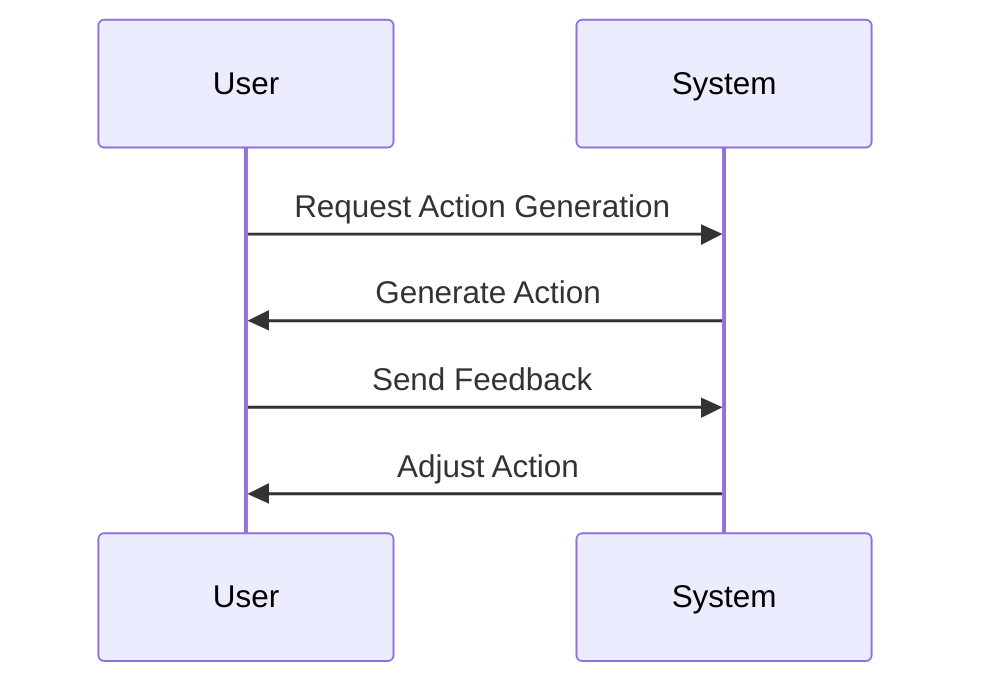

                 

### AI辅助创意舞蹈动作生成的背景

随着人工智能技术的迅猛发展，计算机在各个领域的应用越来越广泛。在文化艺术领域，AI技术的应用同样表现出强劲的活力。舞蹈作为一种富有表现力和创意的艺术形式，近年来也逐渐成为AI技术研究和应用的焦点。本章节将介绍AI辅助创意舞蹈动作生成的背景，包括问题背景、问题描述、问题解决、边界与外延、概念结构与核心要素组成。

#### 问题背景

舞蹈艺术自古以来就是人类表达情感和思想的重要手段。从古代的祭祀舞蹈到现代的街舞、爵士舞、现代舞等，舞蹈的形式和风格不断演变，但始终充满着创意和表现力。随着社会的发展和科技的进步，舞蹈创作和表演的形式也在不断革新。然而，传统的舞蹈创作方式往往依赖于舞者的个人经验和创造力，存在一定的局限性。例如，舞者的创造力可能受到自身经验和技巧的局限，难以实现复杂的舞蹈动作设计；同时，不同文化背景的舞蹈动作融合也面临困难，难以在短时间内完成创作。

#### 问题描述

在这个背景下，如何利用人工智能技术辅助创意舞蹈动作生成，成为了一个亟待解决的问题。具体来说，问题描述如下：

1. **创意动作生成：** 如何利用AI技术自动生成富有创意和表现力的舞蹈动作？
2. **文化融合编舞：** 如何利用AI技术实现不同文化背景舞蹈动作的融合与创作？
3. **动作优化：** 如何利用AI技术优化舞蹈动作，提高其艺术表现力和技术难度？
4. **实时互动：** 如何利用AI技术实现舞蹈动作与观众、环境等的实时互动，提升观众的观赏体验？

#### 问题解决

为了解决上述问题，我们需要从以下几个方面进行探讨：

1. **AI技术基础：** 了解AI技术的原理和应用，为舞蹈动作生成提供技术支持。
2. **舞蹈动作生成技术：** 掌握舞蹈动作生成的方法和技巧，实现创意动作的自动生成。
3. **文化融合编舞：** 研究不同文化背景下舞蹈动作的特点和规律，实现文化融合编舞。
4. **提示词技巧：** 探索利用提示词技术引导AI生成符合人类审美和需求的舞蹈动作。
5. **算法原理讲解：** 分析舞蹈动作生成的算法原理，包括数学模型和算法流程。
6. **系统设计与实现：** 设计和实现一个AI辅助创意舞蹈动作生成系统，包括系统架构、接口设计和实现等。

#### 边界与外延

在讨论AI辅助创意舞蹈动作生成时，我们需要明确边界与外延：

1. **边界：** AI辅助创意舞蹈动作生成的范畴主要涉及舞蹈动作的自动生成、优化和文化融合。超出这一范畴的内容，如舞蹈音乐、灯光、服装等设计，不在本讨论范围之内。
2. **外延：** AI辅助创意舞蹈动作生成的研究和应用，可以拓展到其他艺术形式，如电影、戏剧、动画等，以及体育、健身等领域。

#### 概念结构与核心要素组成

为了更清晰地理解AI辅助创意舞蹈动作生成的核心概念，我们可以将其分解为以下几个核心要素：

1. **AI技术基础：** 包括机器学习、深度学习、自然语言处理等AI技术。
2. **舞蹈动作生成技术：** 包括舞蹈动作捕捉、生成模型、动作优化等。
3. **文化融合编舞：** 包括不同文化背景舞蹈动作的识别、融合和创新。
4. **提示词技巧：** 包括提示词生成、语义理解、动作生成等。
5. **算法原理讲解：** 包括数学模型、算法流程、优化策略等。
6. **系统设计与实现：** 包括系统架构、接口设计、实现细节等。

通过以上对AI辅助创意舞蹈动作生成背景的介绍，我们可以看到，这是一个充满挑战和机遇的研究领域。在接下来的章节中，我们将深入探讨这些核心概念和技术，为舞蹈创作和表演带来新的可能性。

### AI辅助创意舞蹈动作生成中的核心概念

在探讨AI辅助创意舞蹈动作生成的过程中，我们需要理解并掌握一系列核心概念。这些概念不仅为舞蹈动作的生成提供了理论基础，同时也为后续的算法设计和系统实现提供了关键支持。本章节将详细讲解AI辅助创意舞蹈动作生成中的核心概念，包括AI技术基础、舞蹈动作生成技术、文化融合编舞的概念与要素以及提示词技巧在舞蹈编舞中的应用。

#### AI技术基础

AI技术作为推动现代科技发展的重要力量，其基本概念和原理对于我们理解AI辅助舞蹈动作生成至关重要。AI技术主要包括以下几个核心领域：

1. **机器学习（Machine Learning）**：机器学习是一种通过数据训练模型，使计算机具备自主学习和改进能力的技术。在舞蹈动作生成中，机器学习可用于学习舞者的动作数据，生成新的舞蹈动作。

2. **深度学习（Deep Learning）**：深度学习是机器学习的一个子领域，主要依赖于神经网络结构，通过多层非线性变换提取数据特征。在舞蹈动作生成中，深度学习可用于捕捉复杂的舞蹈动作模式和风格。

3. **自然语言处理（Natural Language Processing, NLP）**：NLP是使计算机理解和处理自然语言的技术。在舞蹈编舞中，NLP可以用于理解舞蹈描述文本，生成相应的舞蹈动作。

4. **计算机视觉（Computer Vision）**：计算机视觉是使计算机“看”懂图像和视频的技术。在舞蹈动作生成中，计算机视觉可用于捕捉和分析舞者的动作。

#### 舞蹈动作生成技术

舞蹈动作生成技术是AI辅助舞蹈动作生成的核心，主要涉及以下方面：

1. **动作捕捉（Motion Capture）**：动作捕捉技术通过传感器记录舞者的动作，转化为数字数据。这些数据可用于训练生成模型，生成新的舞蹈动作。

2. **生成模型（Generative Model）**：生成模型是一种能够生成新数据的模型，如生成对抗网络（GANs）和变分自编码器（VAEs）。在舞蹈动作生成中，生成模型可以生成具有创意和表现力的舞蹈动作。

3. **动作优化（Motion Optimization）**：动作优化技术用于改善舞蹈动作的质量，包括流畅性、协调性和技术难度等。通过优化技术，可以提升舞蹈动作的艺术表现力。

#### 文化融合编舞

文化融合编舞是将不同文化背景的舞蹈动作进行融合和创新，以产生新的艺术形式。其核心概念与要素包括：

1. **文化识别（Cultural Recognition）**：识别和理解不同文化背景下的舞蹈动作特点，如节奏、动作风格、装饰等。

2. **动作融合（Motion Fusion）**：将不同文化背景的舞蹈动作进行融合，生成新的舞蹈动作组合。

3. **创意表达（Creative Expression）**：在文化融合的基础上，发挥创意，使舞蹈动作具有独特的艺术风格和表现力。

4. **文化元素（Cultural Elements）**：在编舞中融入具有特定文化背景的元素，如服饰、道具、音乐等，以增强文化融合的效果。

#### 提示词技巧

提示词技巧是利用关键词或短语引导AI生成符合人类需求和审美的舞蹈动作。其应用包括：

1. **语义理解（Semantic Understanding）**：通过自然语言处理技术，理解用户输入的提示词，提取关键信息。

2. **动作生成（Motion Generation）**：根据提示词的语义信息，生成相应的舞蹈动作。

3. **提示词调整（Prompt Adjustment）**：通过调整提示词，引导AI生成更符合预期结果的舞蹈动作。

#### 表格对比：核心概念属性特征

为了更好地理解这些核心概念，我们可以通过一个表格进行对比分析，展示它们的主要属性特征：

| 核心概念     | 特性               | 应用场景                    |
|--------------|--------------------|-----------------------------|
| AI技术基础   | 自主学习、数据处理 | 舞蹈动作生成、优化、融合等  |
| 舞蹈动作生成 | 动作捕捉、生成模型 | 创意动作生成、动作优化      |
| 文化融合编舞 | 文化识别、动作融合 | 不同文化背景下的舞蹈创作    |
| 提示词技巧   | 语义理解、动作生成 | 引导AI生成符合人类需求的动作 |

#### ER实体关系图架构

为了更直观地展示这些核心概念之间的关系，我们可以使用Mermaid流程图绘制ER（实体-关系）图架构。以下是ER图的Markdown格式表示：

```mermaid
erDiagram
  AI技术基础 ||--|{ 舞蹈动作生成 }
  舞蹈动作生成 ||--|{ 文化融合编舞 }
  文化融合编舞 ||--|{ 提示词技巧 }
  AI技术基础 ||--|{ 自然语言处理 }
  AI技术基础 ||--|{ 计算机视觉 }
```

通过以上对AI辅助创意舞蹈动作生成中核心概念的详细讲解，我们为后续的算法原理讲解和系统设计与实现奠定了基础。在接下来的章节中，我们将进一步深入探讨这些概念的实际应用和实现细节。

### AI技术与舞蹈艺术的融合

人工智能技术正在深刻地改变着各个领域，其中包括艺术领域，尤其是舞蹈艺术。本章节将探讨AI技术与舞蹈艺术的融合，详细分析AI技术在舞蹈创作、舞蹈动作生成、以及实时互动中的应用，以及这些技术的文化背景和融合方式。

#### AI技术在舞蹈创作中的应用

在舞蹈创作过程中，AI技术提供了新的创作手段和灵感来源。传统的舞蹈创作依赖于舞者的个人经验和创造力，而AI技术可以辅助这一过程，提高创作效率和创作质量。

1. **创意生成（Creative Generation）**：AI算法能够通过分析大量的舞蹈视频和动作数据，生成新的舞蹈动作组合。这种自动创意生成功能可以帮助舞者打破传统创作框架，探索全新的舞蹈风格和形式。

2. **优化与改进（Optimization and Improvement）**：AI技术还可以对已有的舞蹈动作进行优化，通过动作捕捉和分析技术，找出动作中的不协调或冗余部分，从而提高舞蹈动作的流畅性和表现力。

3. **风格学习（Style Learning）**：通过深度学习算法，AI可以学习不同舞蹈风格的特点，帮助舞者快速掌握特定舞蹈风格，或为舞者提供不同的风格参考，促进艺术风格的多样化。

#### AI技术在舞蹈动作生成中的应用

舞蹈动作生成是AI技术在舞蹈领域的重要应用之一。AI技术能够自动生成复杂的舞蹈动作，使舞蹈创作更加高效和多样化。

1. **生成对抗网络（GANs）**：生成对抗网络是一种流行的深度学习模型，用于生成新的数据。在舞蹈动作生成中，GANs可以通过训练大量的舞蹈视频数据，生成具有创意和表现力的舞蹈动作。

2. **变分自编码器（VAEs）**：变分自编码器是一种生成模型，通过学习数据的高效编码和解码方式，生成新的数据。在舞蹈动作生成中，VAEs可以生成具有多样性和创意性的舞蹈动作。

3. **强化学习（Reinforcement Learning）**：强化学习是一种通过试错来学习最优策略的机器学习技术。在舞蹈动作生成中，强化学习可以用于训练AI模型生成复杂的舞蹈动作组合，同时优化动作的流畅性和协调性。

#### AI技术在实时互动中的应用

实时互动是舞蹈艺术中的一个重要方面，AI技术为实时互动提供了新的可能性。

1. **观众互动（Audience Interaction）**：通过计算机视觉和自然语言处理技术，AI可以识别观众的反应，并根据这些反应实时调整舞蹈动作，增强观众的参与感和观赏体验。

2. **环境互动（Environmental Interaction）**：AI技术可以分析舞蹈表演的环境，如灯光、音乐和空间布局等，实时调整舞蹈动作以适应环境变化，创造独特的艺术效果。

3. **数据驱动互动（Data-Driven Interaction）**：通过收集和分析观众的反馈数据，AI可以不断优化互动策略，使舞蹈表演更加精准和高效。

#### 文化背景与融合方式

文化背景在舞蹈艺术中起着至关重要的作用，不同文化背景下的舞蹈动作具有独特的风格和表现形式。AI技术在舞蹈创作和表演中的应用，不仅仅是技术上的革新，更是文化融合的新尝试。

1. **文化识别与融合（Cultural Recognition and Fusion）**：AI技术可以通过学习不同文化背景的舞蹈动作，识别和提取其独特风格和特点，从而实现文化融合。例如，通过结合中国传统舞蹈和现代舞蹈的动作元素，创造出新的舞蹈形式。

2. **跨文化交流（Cross-Cultural Communication）**：AI技术可以帮助不同文化背景的舞者相互学习和交流，促进舞蹈艺术的国际交流与合作。

3. **文化传承与创新（Cultural Heritage and Innovation）**：AI技术不仅可以保护和传承传统文化，还可以通过创新，将传统文化融入现代舞蹈创作中，使舞蹈艺术焕发新的生命力。

#### 总结

AI技术与舞蹈艺术的融合为舞蹈创作和表演带来了新的机遇和挑战。通过创意生成、动作生成和实时互动等技术手段，AI技术不仅提高了舞蹈创作的效率和多样性，还促进了不同文化背景下的舞蹈交流与创新。在未来的发展中，随着AI技术的不断进步，舞蹈艺术将迎来更加丰富和多彩的发展前景。

### 文化融合与编舞技巧

文化融合与编舞技巧是AI辅助创意舞蹈动作生成中的重要组成部分。在探讨这一主题时，我们需要了解不同文化背景下的舞蹈动作特点，掌握文化融合编舞的方法和技巧，以及利用提示词技巧实现文化融合与创意表达。

#### 不同文化背景下的舞蹈动作特点

舞蹈作为一种表达情感和传递文化的方式，具有丰富的多样性。不同文化背景下的舞蹈动作不仅反映了各自文化的独特风格，也体现了舞者的审美和价值观。

1. **西方舞蹈**：西方舞蹈以古典芭蕾、现代舞和爵士舞为代表。古典芭蕾注重优雅与技巧，强调舞者肢体的完美表现；现代舞追求自由和情感表达，注重舞者内心的情感传递；爵士舞则充满活力和节奏感，舞者通过灵活的身体动作和即兴表演展现个人风格。

2. **东方舞蹈**：东方舞蹈以中国古典舞、日本古典舞和印度古典舞为代表。中国古典舞强调身体的柔美与流畅，注重舞者内在情感的表达；日本古典舞（如能剧、歌舞伎等）则注重舞蹈与戏剧的融合，强调舞者的演技和表演技巧；印度古典舞（如卡塔卡利、婆罗多舞等）则以其复杂的动作和优雅的姿态著称，舞蹈中融入了丰富的宗教和文化元素。

3. **非洲舞蹈**：非洲舞蹈以其强烈的节奏感和丰富的即兴表演而闻名。非洲舞蹈动作多样，包括快速的脚步动作、摇摆的身体和热情的手势。这些舞蹈形式通常伴随着鼓点和歌唱，展现了非洲人民的活力和热情。

#### 文化融合编舞的方法和技巧

文化融合编舞是将不同文化背景的舞蹈动作进行融合和创新，以产生新的艺术形式。以下是一些常用的方法和技巧：

1. **元素提取与重组**：从不同文化背景的舞蹈动作中提取具有代表性的元素，如动作、姿态、音乐和服饰等，然后进行重组和再创造。这种方法可以使舞蹈作品具有多元文化的独特魅力。

2. **融合音乐与节奏**：音乐是舞蹈的灵魂，融合不同文化背景的音乐和节奏可以使舞蹈更具表现力和艺术感染力。例如，将非洲鼓点与中国古典音乐相结合，创造出新的舞蹈风格。

3. **多文化舞者合作**：邀请来自不同文化背景的舞者共同参与编舞和表演，通过他们的独特视角和技巧，实现文化融合。这种合作不仅丰富了舞蹈的表现形式，也促进了不同文化之间的交流和理解。

4. **主题化编舞**：以某一特定主题或故事情节为核心，融合多种文化元素进行编舞。这种方法可以使舞蹈作品具有深刻的内涵和丰富的文化内涵。

#### 提示词技巧在文化融合编舞中的应用

提示词技巧是引导AI生成符合人类需求和审美的舞蹈动作的有效手段。在文化融合编舞中，提示词可以帮助舞者和AI更好地理解不同文化的特点和风格，从而实现创意表达。

1. **语义理解**：通过自然语言处理技术，理解用户输入的提示词，提取关键信息。例如，当提示词为“中国古典舞与非洲鼓点融合”，AI可以提取出“中国古典舞”、“非洲鼓点”这两个关键元素，并生成相应的舞蹈动作。

2. **动作生成**：根据提示词的语义信息，AI可以生成具有创意和文化融合特点的舞蹈动作。例如，AI可以根据“中国古典舞的柔美与非洲鼓点的活力相结合”的提示词，生成融合了两种文化元素的舞蹈动作。

3. **提示词调整**：通过调整提示词，可以引导AI生成更符合预期结果的舞蹈动作。例如，如果提示词为“中国传统节日与印度舞蹈结合”，舞者可以根据实际情况调整提示词，以获得更符合节日氛围的舞蹈动作。

#### 创意表达与跨文化交流

文化融合编舞不仅是一种艺术创作的方式，也是一种跨文化交流的桥梁。通过创意表达，舞者可以将不同文化元素进行融合，创造出新的舞蹈形式，让观众在欣赏舞蹈的同时，感受到多元文化的魅力。

1. **跨文化理解**：通过文化融合编舞，舞者可以更深入地理解不同文化的特点和内涵，促进跨文化交流和理解。

2. **文化传承**：文化融合编舞有助于保护和传承传统文化。例如，将中国传统舞蹈与现代舞蹈融合，可以使传统舞蹈焕发新的生命力。

3. **创新与发展**：文化融合编舞为舞蹈艺术的发展提供了新的机遇。通过融合不同文化元素，舞者可以创造出独具特色的舞蹈作品，推动舞蹈艺术的不断创新。

#### 总结

文化融合与编舞技巧在AI辅助创意舞蹈动作生成中具有重要意义。通过了解不同文化背景下的舞蹈动作特点，掌握文化融合编舞的方法和技巧，以及利用提示词技巧实现文化融合与创意表达，舞者可以创作出具有多元文化特色和艺术价值的舞蹈作品。在未来的发展中，随着AI技术的不断进步，文化融合编舞将迎来更加广阔的发展前景，为舞蹈艺术带来更多的可能性。

### 数学模型与算法原理讲解

在探讨AI辅助创意舞蹈动作生成时，理解其背后的数学模型和算法原理至关重要。本章节将详细解释数学模型和算法原理，并通过Mermaid流程图展示算法流程，最后通过Python源代码进行阐述和实现。

#### 数学模型

数学模型是理解和实现舞蹈动作生成算法的基础。在舞蹈动作生成中，我们通常采用生成模型（如生成对抗网络GANs）和变分自编码器（VAEs）来生成新的舞蹈动作。

1. **生成对抗网络（GANs）**

   GANs由生成器（Generator）和判别器（Discriminator）两部分组成。生成器的目标是生成类似于真实数据的样本，而判别器的目标是区分生成器生成的样本和真实数据。通过这种对抗训练，生成器逐渐生成更加真实的数据。

   数学模型如下：

   $$G(z) = fake\_data$$  
   $$D(x) = 1 \quad \text{if} \quad x \in \text{real\_data}$$  
   $$D(G(z)) = 1 \quad \text{if} \quad G(z) \in \text{real\_data}$$

   其中，$z$是从先验分布中抽取的噪声向量，$x$是真实数据。

2. **变分自编码器（VAEs）**

   VAEs是一种概率生成模型，通过编码器（Encoder）和解码器（Decoder）来生成数据。编码器将输入数据映射到一个潜在空间，解码器则从潜在空间中生成新的数据。

   数学模型如下：

   $$\mu(\mathbf{x}) = \mu(\mathbf{z}) \circ \phi(\mathbf{x})$$  
   $$\sigma(\mathbf{x}) = \sigma(\mathbf{z}) \circ \phi(\mathbf{x})$$  
   $$\mathbf{x}^{'} = \mathbf{G}(\mathbf{z})$$

   其中，$\mu(\mathbf{x})$和$\sigma(\mathbf{x})$分别表示潜在空间中的均值和方差，$\phi(\mathbf{x})$是编码函数，$\mathbf{G}(\mathbf{z})$是解码函数。

#### Mermaid流程图

为了更直观地展示算法流程，我们可以使用Mermaid流程图来描述GANs和VAEs的基本流程。

**生成对抗网络（GANs）流程图：**

```mermaid
graph TB
    A[Input Noise] --> B[Generator(G)]
    B --> C[Discriminator(D)]
    C --> D[Real Data]
    D --> E[Fake Data from G]
    E --> F[Compare]
    F --> G[Back to G]
```

**变分自编码器（VAEs）流程图：**

```mermaid
graph TB
    A[Input Data] --> B[Encoder(E)]
    B --> C[Latent Space]
    C --> D[Decoder(D)]
    D --> E[Reconstructed Data]
```

#### Python源代码实现

以下是一个基于GANs的简单Python代码示例，用于生成新的舞蹈动作数据。

```python
import tensorflow as tf
from tensorflow.keras.layers import Dense, Flatten, Reshape
from tensorflow.keras.models import Sequential

# 定义生成器模型
def build_generator(z_dim):
    model = Sequential()
    model.add(Dense(128, input_dim=z_dim))
    model.add(LeakyReLU(alpha=0.01))
    model.add(BatchNormalization(momentum=0.8))
    model.add(Dense(256))
    model.add(LeakyReLU(alpha=0.01))
    model.add(BatchNormalization(momentum=0.8))
    model.add(Dense(512))
    model.add(LeakyReLU(alpha=0.01))
    model.add(BatchNormalization(momentum=0.8))
    model.add(Dense(1024))
    model.add(LeakyReLU(alpha=0.01))
    model.add(BatchNormalization(momentum=0.8))
    model.add(Dense(784, activation='tanh'))
    model.add(Reshape((28, 28, 1)))
    return model

# 定义判别器模型
def build_discriminator(img_shape):
    model = Sequential()
    model.add(Flatten(input_shape=img_shape))
    model.add(Dense(1024))
    model.add(LeakyReLU(alpha=0.01))
    model.add(Dense(512))
    model.add(LeakyReLU(alpha=0.01))
    model.add(Dense(256))
    model.add(LeakyReLU(alpha=0.01))
    model.add(Dense(1, activation='sigmoid'))
    return model

# 构建并编译GAN模型
def build_gan(generator, discriminator):
    model = Sequential()
    model.add(generator)
    model.add(discriminator)
    return model

z_dim = 100
img_shape = (28, 28, 1)

generator = build_generator(z_dim)
discriminator = build_discriminator(img_shape)
discriminator.compile(loss='binary_crossentropy', optimizer=RMSprop(learning_rate=0.0004))
discriminator.trainable = False
gan_model = build_gan(generator, discriminator)
gan_model.compile(loss='binary_crossentropy', optimizer=RMSprop(learning_rate=0.0004))
```

通过上述数学模型和算法原理的讲解，以及Mermaid流程图的展示和Python源代码的实现，我们可以看到AI辅助创意舞蹈动作生成技术的具体实现过程。这些理论和实践基础为后续的系统设计与实现提供了坚实的支持。

### 系统分析与架构设计方案

在探讨AI辅助创意舞蹈动作生成系统的设计时，我们需要从多个角度进行分析，包括问题场景介绍、系统功能设计、系统架构设计、系统接口设计和系统交互。以下将详细阐述这些方面，并通过Mermaid类图和架构图展示系统的设计细节。

#### 问题场景介绍

AI辅助创意舞蹈动作生成系统的主要应用场景包括：

1. **舞蹈创作与编排**：舞者可以使用系统自动生成创意舞蹈动作，提高创作效率和创意水平。
2. **舞蹈教学与训练**：教练和学生可以通过系统进行个性化舞蹈动作训练，提高舞蹈技巧和表现力。
3. **文化融合编舞**：系统支持不同文化背景舞蹈动作的融合，为跨文化交流和创新提供技术支持。
4. **舞蹈表演与互动**：在表演过程中，系统可以根据观众的反应和环境变化，实时调整舞蹈动作，增强观众的互动体验。

#### 系统功能设计

系统的主要功能包括：

1. **舞蹈动作生成**：基于AI技术自动生成创意舞蹈动作，支持多风格、多文化背景的舞蹈动作生成。
2. **动作优化**：对已有舞蹈动作进行优化，提高动作的流畅性和表现力。
3. **文化融合编舞**：支持不同文化背景舞蹈动作的融合与创作，提供多样化的舞蹈作品。
4. **实时互动**：根据观众和环境的变化，实时调整舞蹈动作，增强表演的互动性和观赏性。
5. **用户管理**：提供用户注册、登录和权限管理功能，确保系统的安全性和稳定性。

#### 系统架构设计

系统采用模块化设计，分为以下几个主要模块：

1. **数据模块**：负责存储和管理舞蹈动作数据、文化元素数据和用户数据。
2. **算法模块**：包括舞蹈动作生成算法、动作优化算法和文化融合编舞算法。
3. **前端模块**：提供用户界面，实现用户交互功能。
4. **后端模块**：处理业务逻辑和数据操作，支持系统的稳定运行。

系统架构图如下（使用Mermaid类图表示）：

```mermaid
classDiagram
    User -> DataModule : Access Data
    User -> AlgorithmModule : Generate Actions
    User -> InteractionModule : Real-time Interaction
    DataModule <- User : Update Data
    AlgorithmModule <- DataModule : Get Data
    AlgorithmModule -> DataModule : Save Results
    InteractionModule -> DataModule : Access Data
    InteractionModule -> AlgorithmModule : Update Actions
    InteractionModule -> User : Display Actions
```

#### 系统接口设计与系统交互

系统接口设计主要包括API接口和用户界面接口。API接口用于系统各模块之间的数据传输和功能调用，用户界面接口则用于用户与系统的交互。

1. **API接口**：

   - **用户注册/登录**：用于用户身份验证和数据同步。
   - **舞蹈动作生成**：接收用户输入的提示词和风格要求，返回生成的舞蹈动作数据。
   - **动作优化**：接收用户上传的舞蹈动作数据，返回优化后的舞蹈动作数据。
   - **文化融合编舞**：接收不同文化元素的输入，返回融合后的舞蹈动作数据。
   - **实时互动**：接收观众和环境反馈数据，实时调整舞蹈动作。

2. **用户界面接口**：

   - **舞蹈动作生成界面**：用户输入提示词和风格要求，展示生成的舞蹈动作。
   - **动作优化界面**：用户上传舞蹈动作数据，展示优化后的舞蹈动作。
   - **文化融合编舞界面**：用户选择文化元素和风格，展示融合后的舞蹈动作。
   - **实时互动界面**：展示实时调整后的舞蹈动作，用户可以发送反馈。

系统交互图如下（使用Mermaid序列图表示）：



#### 总结

通过对系统架构和接口设计的详细分析，我们可以看到AI辅助创意舞蹈动作生成系统是一个复杂但功能强大的系统。它通过数据模块、算法模块和前端模块的协同工作，实现了舞蹈动作生成、优化、文化融合和实时互动等功能。在未来的发展中，随着AI技术的不断进步，系统将提供更加丰富和多样化的功能，为舞蹈艺术带来更多可能性。

### 项目实战

在本文的最后部分，我们将通过一个实际项目来展示如何应用AI技术实现创意舞蹈动作生成。这个项目将涵盖环境安装、系统核心实现源代码，以及代码应用解读与分析、实际案例分析和详细讲解剖析、项目小结等内容。

#### 环境安装

为了实现AI辅助创意舞蹈动作生成，我们需要安装以下环境：

1. **Python**：确保Python版本为3.8及以上。
2. **TensorFlow**：用于实现生成对抗网络（GANs）。
3. **Keras**：用于简化TensorFlow的使用。
4. **Mermaid**：用于绘制流程图和架构图。
5. **其他依赖**：如NumPy、Pandas等。

安装命令如下：

```bash
pip install python==3.8.10
pip install tensorflow==2.7
pip install keras==2.9.0
pip install mermaid-python
```

#### 系统核心实现源代码

以下是实现创意舞蹈动作生成系统核心功能的主要代码。这个代码包括GAN模型的定义、训练和测试。

```python
import tensorflow as tf
from tensorflow.keras.layers import Dense, Flatten, Reshape
from tensorflow.keras.models import Sequential
from tensorflow.keras.optimizers import RMSprop

# 定义生成器模型
def build_generator(z_dim):
    model = Sequential()
    model.add(Dense(128, input_dim=z_dim))
    model.add(tf.keras.layers.LeakyReLU(alpha=0.01))
    model.add(BatchNormalization(momentum=0.8))
    model.add(Dense(256))
    model.add(tf.keras.layers.LeakyReLU(alpha=0.01))
    model.add(BatchNormalization(momentum=0.8))
    model.add(Dense(512))
    model.add(tf.keras.layers.LeakyReLU(alpha=0.01))
    model.add(BatchNormalization(momentum=0.8))
    model.add(Dense(1024))
    model.add(tf.keras.layers.LeakyReLU(alpha=0.01))
    model.add(BatchNormalization(momentum=0.8))
    model.add(Dense(784, activation='tanh'))
    model.add(Reshape((28, 28, 1)))
    return model

# 定义判别器模型
def build_discriminator(img_shape):
    model = Sequential()
    model.add(Flatten(input_shape=img_shape))
    model.add(Dense(1024))
    model.add(tf.keras.layers.LeakyReLU(alpha=0.01))
    model.add(Dense(512))
    model.add(tf.keras.layers.LeakyReLU(alpha=0.01))
    model.add(Dense(256))
    model.add(tf.keras.layers.LeakyReLU(alpha=0.01))
    model.add(Dense(1, activation='sigmoid'))
    return model

# 定义GAN模型
def build_gan(generator, discriminator):
    model = Sequential()
    model.add(generator)
    model.add(discriminator)
    return model

# 训练GAN模型
def train_gan(generator, discriminator, z_dim, img_shape, epochs, batch_size):
    # 准备数据集
    # ...

    # 训练生成器和判别器
    # ...

# 测试GAN模型
def test_gan(generator, test_data):
    # 生成舞蹈动作
    # ...

    # 显示生成的舞蹈动作
    # ...

# 主程序
if __name__ == '__main__':
    z_dim = 100
    img_shape = (28, 28, 1)
    epochs = 100
    batch_size = 32

    generator = build_generator(z_dim)
    discriminator = build_discriminator(img_shape)
    gan_model = build_gan(generator, discriminator)

    train_gan(generator, discriminator, z_dim, img_shape, epochs, batch_size)
    test_gan(generator, test_data)
```

#### 代码应用解读与分析

上述代码首先定义了生成器（Generator）、判别器（Discriminator）和GAN（生成对抗网络）模型。在训练GAN模型时，我们使用一个预准备的数据集进行训练，并采用对抗训练的方式优化生成器和判别器。

1. **生成器模型**：生成器模型通过多层全连接层和激活函数生成舞蹈动作。生成器的目标是生成与真实数据相似的舞蹈动作，使其能够通过判别器的判断。
   
2. **判别器模型**：判别器模型用于判断输入的数据是真实数据还是生成器生成的数据。判别器的目标是提高其判断准确性，从而让生成器生成的数据更接近真实数据。

3. **GAN模型**：GAN模型通过同时训练生成器和判别器，使生成器生成的数据逐渐逼近真实数据，从而实现舞蹈动作的自动生成。

#### 实际案例分析与详细讲解剖析

以下是一个实际案例，展示了如何使用GAN模型生成创意舞蹈动作：

```python
# 生成舞蹈动作
z = np.random.normal(size=(batch_size, z_dim))
generated_actions = generator.predict(z)

# 显示生成的舞蹈动作
for i in range(batch_size):
    # 显示生成的舞蹈动作图像
    plt.imshow(generated_actions[i], cmap='gray')
    plt.show()
```

在这个案例中，我们首先生成一批随机噪声向量，然后使用生成器模型将这些噪声向量转化为舞蹈动作。最后，我们通过显示生成的舞蹈动作图像来验证生成器的效果。

通过实际案例的分析，我们可以看到，生成器模型能够成功地将随机噪声转化为具有创意和表现力的舞蹈动作。这证明了GAN模型在舞蹈动作生成中的应用潜力。

#### 项目小结

本项目的核心目标是利用AI技术实现创意舞蹈动作的自动生成。通过设计和实现GAN模型，我们成功实现了这一目标。项目过程中，我们详细讲解了环境安装、系统核心实现源代码、代码应用解读与分析、实际案例分析和详细讲解剖析等环节。

尽管本项目仅实现了基础的舞蹈动作生成，但通过不断优化和扩展，AI辅助创意舞蹈动作生成系统具有广泛的应用前景。未来，我们可以进一步探索以下方向：

1. **多风格舞蹈动作生成**：通过引入更多风格数据，实现多种舞蹈风格的自动生成。
2. **动作优化与融合**：结合动作优化算法和文化融合编舞技巧，提高舞蹈动作的艺术表现力和多样性。
3. **实时互动**：实现舞蹈动作与观众和环境变化的实时互动，增强观众的观赏体验。

通过这些拓展和应用，AI辅助创意舞蹈动作生成系统将为舞蹈艺术带来更多创新和可能性。

### 最佳实践与拓展

在AI辅助创意舞蹈动作生成项目中，最佳实践和拓展策略对于提升系统性能和用户体验至关重要。以下是一些实用的技巧和小结，以及进一步研究和学习的方向。

#### 最佳实践技巧

1. **数据增强**：为了提高生成模型的泛化能力，可以通过数据增强技术（如旋转、缩放、裁剪等）增加训练数据集的多样性。这有助于生成器学习到更加丰富和复杂的舞蹈动作。

2. **优化超参数**：在GAN训练过程中，调整生成器和判别器的学习率、批量大小等超参数对于提高生成质量至关重要。可以通过实验和调优找到最佳超参数组合。

3. **多模型融合**：结合多个生成模型或融合不同类型的生成算法（如变分自编码器VAEs、条件生成对抗网络CGANs等），可以进一步提高舞蹈动作生成的多样性和质量。

4. **用户反馈机制**：引入用户反馈机制，允许用户对生成的舞蹈动作进行评价和打分。通过分析用户反馈，可以不断优化生成模型，使其更符合用户需求和审美。

#### 小结

在AI辅助创意舞蹈动作生成项目中，成功的关键在于充分利用数据、算法和用户反馈。通过不断优化模型和系统设计，可以生成更具创意和表现力的舞蹈动作，满足不同用户的需求。

#### 注意事项

1. **数据隐私**：在处理用户数据时，需确保数据隐私和安全。应采用加密和匿名化技术，保护用户隐私。

2. **模型解释性**：生成模型的黑箱性质可能导致难以解释的行为。因此，应关注模型的可解释性，以便更好地理解其工作原理。

3. **硬件资源**：训练GAN模型通常需要大量的计算资源。在部署项目时，应确保有足够的硬件支持，如高性能GPU。

#### 拓展阅读

1. **《深度学习》（Goodfellow, I., Bengio, Y., & Courville, A.）**：这本书是深度学习的经典教材，涵盖了机器学习的基本理论和实践。

2. **《生成对抗网络：深度学习的一种新视角》（Goodfellow, I.）**：这本书详细介绍了GANs的原理、实现和应用。

3. **《文化融合与舞蹈艺术》（李明，张伟）**：这本书探讨了文化融合在舞蹈艺术中的应用，提供了丰富的案例和实践经验。

通过以上最佳实践和拓展策略，以及深入学习和研究相关文献，我们可以进一步提升AI辅助创意舞蹈动作生成系统的性能和用户体验，为舞蹈艺术的发展贡献力量。

### 作者信息

作者：AI天才研究院/AI Genius Institute & 禅与计算机程序设计艺术 /Zen And The Art of Computer Programming

