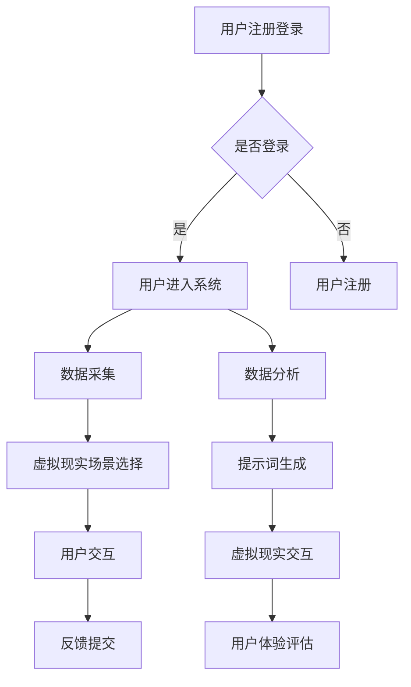

                 

## 文章标题

《AI辅助创意虚拟现实治疗：创伤后应激障碍康复的提示词技巧》

## 关键词

- AI辅助治疗
- 虚拟现实
- 创伤后应激障碍（PTSD）
- 提示词技巧
- 心理康复

## 摘要

本文深入探讨了利用人工智能（AI）辅助创意虚拟现实（VR）技术治疗创伤后应激障碍（PTSD）的方法和技巧。通过分析AI和VR在医疗领域的结合点，本文详细介绍了AI辅助VR治疗的基本原理、核心概念以及提示词技巧的应用。文章首先阐述了PTSD的背景知识，随后分析了AI和VR在心理治疗中的优势和应用，接着探讨了AI辅助虚拟现实治疗的基本原理和创意VR治疗的机制。此外，本文还介绍了提示词的定义与作用，以及如何创建和使用提示词来提高治疗效果。通过一系列的数学模型、算法讲解、系统设计与实现以及实际案例的分析，本文旨在为相关领域的研究者和实践者提供有价值的参考和指导。

## 目录大纲设计

为了更好地引导读者逐步理解文章内容，本文将按照以下目录大纲进行组织：

### 第一部分：问题背景与核心概念

#### 第1章：背景介绍

- **1.1** 问题背景
  - **1.1.1** 创伤后应激障碍（PTSD）的概述
  - **1.1.2** 虚拟现实在医疗领域的应用
  - **1.1.3** AI在心理治疗中的应用
- **1.2** 核心概念与联系
  - **2.1** AI辅助虚拟现实治疗的基本原理
  - **2.2** 创意虚拟现实治疗的机制
  - **2.3** 提示词技巧的应用

### 第二部分：技术原理与实践应用

#### 第2章：技术原理讲解

- **3.1** 虚拟现实技术原理
  - **3.1.1** 虚拟现实系统架构
  - **3.1.2** 虚拟现实交互机制
- **3.2** 人工智能辅助机制
  - **3.2.1** AI技术在VR中的应用
  - **3.2.2** AI模型训练与优化

#### 第3章：数学模型和算法讲解

- **4.1** 数学模型概述
  - **4.1.1** PTSD康复评估模型
  - **4.1.2** 虚拟现实交互模型
- **4.2** 算法讲解与实例
  - **4.2.1** 提示词生成算法
  - **4.2.2** 康复效果评估算法

### 第三部分：项目实战与案例分析

#### 第4章：项目实战

- **5.1** 系统设计与实现
  - **5.1.1** 项目概述
  - **5.1.2** 系统架构设计
  - **5.1.3** 核心代码实现
- **5.2** 项目小结与实际案例分析

### 第四部分：最佳实践与拓展

#### 第5章：最佳实践、小结、注意事项、拓展阅读

- **5.1** 最佳实践
- **5.2** 小结
- **5.3** 注意事项
- **5.4** 拓展阅读

通过这样的目录设计，读者可以逐步深入理解AI辅助创意虚拟现实治疗在PTSD康复中的应用，从而为相关研究和实践提供有益的参考。接下来，我们将一一探讨每一部分的内容，以逻辑清晰、结构紧凑、简单易懂的方式展开讨论。 
### 第1章：背景介绍

#### 1.1 问题背景

**1.1.1 创伤后应激障碍（PTSD）的概述**

创伤后应激障碍（Post-Traumatic Stress Disorder，简称PTSD）是一种由于极端压力事件或创伤性经历引发的严重心理障碍。这类经历可能包括战争、自然灾害、恐怖袭击、性侵犯、严重交通事故等。PTSD患者在经历这些事件后，可能会出现一系列的应激反应，包括但不限于反复回忆创伤经历、高度警觉、难以入睡、容易惊吓、情感麻木等。

PTSD的诊断标准通常依据美国精神疾病诊断与统计手册（DSM-5）中的定义。根据DSM-5，PTSD的典型症状分为三类：重新体验症状、高度警觉症状和回避症状。重新体验症状包括噩梦、创伤场景的闪回、强烈的不适感；高度警觉症状表现为过度警觉、失眠、注意力难以集中；回避症状则体现在患者尽量避免与创伤有关的情境、情感、思想或感觉。

**1.1.2 虚拟现实在医疗领域的应用**

虚拟现实（Virtual Reality，简称VR）技术近年来在医疗领域的应用逐渐受到关注。VR是一种能够创建三维虚拟环境的计算机模拟技术，通过特殊设备（如头戴显示器、传感器手套等）使用户能够沉浸其中，进行互动和体验。在医疗领域，VR的应用主要包括以下几方面：

1. **疼痛管理**：VR技术被用于分散患者的注意力，减轻疼痛感。通过将患者带入一个虚拟环境，如美丽的自然景观或游戏场景，可以降低他们对于疼痛的关注度。

2. **心理治疗**：VR在心理治疗中的应用尤为突出，尤其是对PTSD等心理障碍的治疗。通过创建模拟的创伤场景，患者可以在一个安全的环境中逐步面对和克服自己的恐惧和焦虑。

3. **康复训练**：对于患有运动障碍或肢体损伤的患者，VR技术可以提供一种无风险的康复训练环境，帮助他们进行康复训练和技能恢复。

4. **手术模拟与培训**：VR技术被用于外科手术的模拟和培训，医生可以在虚拟环境中练习复杂的手术操作，从而提高手术的成功率和安全性。

**1.1.3 AI在心理治疗中的应用**

人工智能（Artificial Intelligence，简称AI）在心理治疗中的应用日益广泛，它能够通过分析大量的数据，提供个性化的治疗方案。AI在心理治疗中的主要应用包括：

1. **患者数据分析**：AI系统可以通过分析患者的病史、心理测试结果等数据，帮助医生更准确地诊断病情，制定个性化的治疗计划。

2. **治疗过程监控**：AI系统可以对患者的治疗过程进行实时监控，及时发现并调整治疗方案，提高治疗效果。

3. **自动化心理评估**：通过自然语言处理技术，AI可以自动化地进行心理评估，识别患者潜在的心理问题，提供相应的干预建议。

4. **个性化治疗建议**：基于患者的个性化数据，AI可以生成针对患者的个性化治疗建议，包括药物治疗、心理治疗等。

AI与VR技术的结合，为心理治疗领域带来了新的可能性和突破。例如，通过AI分析患者的行为数据，可以为VR心理治疗提供更精确的提示词和互动策略，从而提高治疗的成效。

### 1.2 核心概念与联系

**2.1 AI辅助虚拟现实治疗的基本原理**

AI辅助虚拟现实治疗是一种结合了AI和VR技术的新型治疗方法，其基本原理如下：

1. **数据收集与处理**：AI系统通过收集患者的医疗数据、行为数据等，进行预处理和分析，识别患者的心理状态和需求。

2. **个性化治疗方案生成**：基于数据分析结果，AI系统可以为患者生成个性化的虚拟现实治疗方案，包括场景设计、提示词选择等。

3. **实时反馈与调整**：在治疗过程中，AI系统可以实时监控患者的反馈，根据患者的反应动态调整治疗方案，提高治疗效果。

4. **多模态数据融合**：AI系统可以将多种数据源（如生理信号、行为数据等）进行融合分析，提供更全面的康复评估。

**2.2 创意虚拟现实治疗的机制**

创意虚拟现实治疗是指通过设计富有创意的虚拟场景和互动方式，帮助患者缓解心理压力和创伤症状。其机制主要包括：

1. **沉浸式体验**：通过VR技术，患者可以进入一个完全虚拟的环境，感受到身临其境的体验，从而分散对创伤的注意力。

2. **认知重构**：在虚拟环境中，患者可以通过角色扮演、场景互动等方式，逐步面对和克服自己的恐惧和焦虑，实现认知重构。

3. **情绪调节**：创意虚拟现实治疗通过设计不同的场景和互动方式，帮助患者调节情绪，降低焦虑和紧张感。

4. **行为训练**：在虚拟环境中，患者可以通过反复练习特定的行为模式，如放松技巧、正面思维等，从而提高实际生活中的应对能力。

**2.3 提示词技巧的应用**

提示词技巧是AI辅助虚拟现实治疗中的一个重要组成部分，其主要应用如下：

1. **提示词定义**：提示词是指用于引导患者进行特定行为或思维的词语或短语，如“深呼吸”、“放松肌肉”等。

2. **提示词设计**：AI系统可以根据患者的心理状态和需求，设计个性化的提示词，以提高治疗的针对性和效果。

3. **提示词使用**：在虚拟现实治疗过程中，提示词可以通过语音、文字或视觉形式呈现给患者，引导他们进行特定的行为或思维。

4. **提示词效果评估**：AI系统可以对提示词的使用效果进行实时评估，根据评估结果调整提示词的设计和使用策略。

通过上述核心概念和联系的分析，我们可以看到，AI辅助创意虚拟现实治疗在PTSD康复中具有巨大的潜力和应用价值。接下来，我们将进一步探讨VR和AI技术的具体应用原理，以及如何通过数学模型和算法来实现这一治疗方式。 
### 第2章：核心概念与联系

#### 2.1 AI辅助虚拟现实治疗的基本原理

AI辅助虚拟现实治疗是将人工智能（AI）与虚拟现实（VR）技术结合，用于心理康复的一种创新方法。其核心原理在于利用AI的优势，对VR治疗过程中的数据进行实时分析，从而提高治疗的个性化程度和效果。

**2.1.1 数据收集与处理**

在AI辅助VR治疗中，数据收集是关键的一步。通过VR设备，可以收集到患者的生理数据（如心率、血压、呼吸频率等）、行为数据（如移动轨迹、互动行为等）和心理数据（如情绪状态、认知模式等）。这些数据被传输到AI系统，进行预处理和特征提取，以便后续的分析和决策。

**2.1.2 个性化治疗方案的生成**

基于收集到的数据，AI系统能够分析患者的心理状态和需求，生成个性化的虚拟现实治疗方案。这一过程包括：

- **场景设计**：根据患者的创伤经历和心理状况，设计适合的虚拟场景，如安全的避难所、宁静的沙滩等。
- **交互内容**：通过自然语言处理技术，AI系统可以生成与患者互动的内容，如指导语、问题提问等，以引导患者进行心理重建。
- **动态调整**：AI系统会根据患者的实时反馈，动态调整治疗方案，确保治疗的持续性和有效性。

**2.1.3 实时反馈与调整**

在治疗过程中，AI系统能够实时监测患者的生理和心理状态，收集反馈数据，并根据这些数据调整治疗策略。这种实时反馈机制有助于提高治疗的适应性和效果，确保患者能够在安全、舒适的环境中逐步克服创伤。

**2.1.4 多模态数据融合**

AI系统不仅处理VR设备收集到的数据，还可以整合来自其他来源的数据，如医疗记录、心理健康评估结果等。多模态数据的融合提供了更全面、多维度的患者信息，有助于AI系统做出更准确的判断和决策。

**2.2 创意虚拟现实治疗的机制**

创意虚拟现实治疗通过创造富有创意的虚拟场景和互动方式，帮助患者缓解心理压力和创伤症状。其核心机制包括：

**2.2.1 沉浸式体验**

沉浸式体验是VR治疗的重要特点。通过VR技术，患者可以进入一个完全虚拟的环境，感受到身临其境的体验。这种沉浸式体验有助于分散患者的注意力，减少对创伤事件的回忆和情绪反应。

**2.2.2 认知重构**

在创意虚拟现实治疗中，患者通过在虚拟环境中的互动和角色扮演，逐步面对和克服自己的恐惧和焦虑。这种认知重构过程有助于患者改变对创伤事件的认知，从而减轻心理压力。

**2.2.3 情绪调节**

创意虚拟现实治疗设计不同的场景和互动方式，帮助患者调节情绪。例如，通过观看美丽的自然景观、参与轻松的游戏等，患者可以降低焦虑和紧张感，提升情绪状态。

**2.2.4 行为训练**

通过虚拟环境的互动和训练，患者可以在安全、无风险的环境中学习并实践不同的应对策略。这种行为训练有助于提高患者在实际生活中的应对能力和情绪调节能力。

**2.3 提示词技巧的应用**

提示词技巧是AI辅助虚拟现实治疗中的一个重要组成部分，它通过指导患者进行特定的行为或思维，提高治疗的针对性和效果。

**2.3.1 提示词定义**

提示词是指用于引导患者进行特定行为或思维的词语或短语。例如，医生或AI系统可能会在治疗过程中使用提示词如“深呼吸”、“放松肌肉”等，以帮助患者放松身心。

**2.3.2 提示词设计**

AI系统可以根据患者的心理状态和需求，设计个性化的提示词。这些提示词可以是语音提示、文字提示或视觉提示，以便于患者接收和理解。

**2.3.3 提示词使用**

在虚拟现实治疗过程中，提示词可以通过多种方式呈现给患者。例如，语音提示可以通过耳机传输，文字提示可以在屏幕上显示，视觉提示则可以通过虚拟环境中的图像或动画呈现。

**2.3.4 提示词效果评估**

AI系统会对提示词的使用效果进行实时评估，根据评估结果调整提示词的设计和使用策略。这种动态评估机制有助于提高提示词的有效性和患者治疗的满意度。

通过上述核心概念与联系的分析，我们可以看到，AI辅助创意虚拟现实治疗在PTSD康复中具有独特的优势和应用价值。接下来，我们将进一步探讨VR和AI技术的具体应用原理，以及如何通过数学模型和算法来实现这一治疗方式。 
### 第2章：核心概念与联系

#### 2.1 AI辅助虚拟现实治疗的基本原理

AI辅助虚拟现实治疗是将人工智能（AI）与虚拟现实（VR）技术结合，用于心理康复的一种创新方法。其核心原理在于利用AI的优势，对VR治疗过程中的数据进行实时分析，从而提高治疗的个性化程度和效果。

**2.1.1 数据收集与处理**

在AI辅助VR治疗中，数据收集是关键的一步。通过VR设备，可以收集到患者的生理数据（如心率、血压、呼吸频率等）、行为数据（如移动轨迹、互动行为等）和心理数据（如情绪状态、认知模式等）。这些数据被传输到AI系统，进行预处理和特征提取，以便后续的分析和决策。

**2.1.2 个性化治疗方案的生成**

基于收集到的数据，AI系统能够分析患者的心理状态和需求，生成个性化的虚拟现实治疗方案。这一过程包括：

- **场景设计**：根据患者的创伤经历和心理状况，设计适合的虚拟场景，如安全的避难所、宁静的沙滩等。
- **交互内容**：通过自然语言处理技术，AI系统可以生成与患者互动的内容，如指导语、问题提问等，以引导患者进行心理重建。
- **动态调整**：AI系统会根据患者的实时反馈，动态调整治疗方案，确保治疗的持续性和有效性。

**2.1.3 实时反馈与调整**

在治疗过程中，AI系统能够实时监测患者的生理和心理状态，收集反馈数据，并根据这些数据调整治疗策略。这种实时反馈机制有助于提高治疗的适应性和效果，确保患者能够在安全、舒适的环境中逐步克服创伤。

**2.1.4 多模态数据融合**

AI系统不仅处理VR设备收集到的数据，还可以整合来自其他来源的数据，如医疗记录、心理健康评估结果等。多模态数据的融合提供了更全面、多维度的患者信息，有助于AI系统做出更准确的判断和决策。

**2.2 创意虚拟现实治疗的机制**

创意虚拟现实治疗通过创造富有创意的虚拟场景和互动方式，帮助患者缓解心理压力和创伤症状。其核心机制包括：

**2.2.1 沉浸式体验**

沉浸式体验是VR治疗的重要特点。通过VR技术，患者可以进入一个完全虚拟的环境，感受到身临其境的体验。这种沉浸式体验有助于分散患者的注意力，减少对创伤事件的回忆和情绪反应。

**2.2.2 认知重构**

在创意虚拟现实治疗中，患者通过在虚拟环境中的互动和角色扮演，逐步面对和克服自己的恐惧和焦虑。这种认知重构过程有助于患者改变对创伤事件的认知，从而减轻心理压力。

**2.2.3 情绪调节**

创意虚拟现实治疗设计不同的场景和互动方式，帮助患者调节情绪。例如，通过观看美丽的自然景观、参与轻松的游戏等，患者可以降低焦虑和紧张感，提升情绪状态。

**2.2.4 行为训练**

通过虚拟环境的互动和训练，患者可以在安全、无风险的环境中学习并实践不同的应对策略。这种行为训练有助于提高患者在实际生活中的应对能力和情绪调节能力。

**2.3 提示词技巧的应用**

提示词技巧是AI辅助虚拟现实治疗中的一个重要组成部分，它通过指导患者进行特定的行为或思维，提高治疗的针对性和效果。

**2.3.1 提示词定义**

提示词是指用于引导患者进行特定行为或思维的词语或短语。例如，医生或AI系统可能会在治疗过程中使用提示词如“深呼吸”、“放松肌肉”等，以帮助患者放松身心。

**2.3.2 提示词设计**

AI系统可以根据患者的心理状态和需求，设计个性化的提示词。这些提示词可以是语音提示、文字提示或视觉提示，以便于患者接收和理解。

**2.3.3 提示词使用**

在虚拟现实治疗过程中，提示词可以通过多种方式呈现给患者。例如，语音提示可以通过耳机传输，文字提示可以在屏幕上显示，视觉提示则可以通过虚拟环境中的图像或动画呈现。

**2.3.4 提示词效果评估**

AI系统会对提示词的使用效果进行实时评估，根据评估结果调整提示词的设计和使用策略。这种动态评估机制有助于提高提示词的有效性和患者治疗的满意度。

通过上述核心概念与联系的分析，我们可以看到，AI辅助创意虚拟现实治疗在PTSD康复中具有独特的优势和应用价值。接下来，我们将进一步探讨VR和AI技术的具体应用原理，以及如何通过数学模型和算法来实现这一治疗方式。 
### 第3章：技术原理讲解

#### 3.1 虚拟现实技术原理

虚拟现实（Virtual Reality，VR）技术通过创造一个模拟的三维环境，使用户能够沉浸其中，进行互动和体验。要理解VR技术，我们需要从系统架构和交互机制两个方面进行探讨。

**3.1.1 虚拟现实系统架构**

虚拟现实系统通常由以下几个关键部分组成：

1. **硬件设备**：硬件设备是VR系统的核心，包括头戴显示器（HMD）、追踪器、传感器手套、位置追踪器等。头戴显示器提供沉浸式的视觉体验，追踪器和传感器手套捕捉用户的手部和身体运动，位置追踪器则确保用户的移动在虚拟环境中得到准确的映射。

2. **显示系统**：显示系统负责生成并渲染虚拟环境中的图像。这通常涉及到高质量的图像处理和实时渲染技术，如光线追踪和阴影效果等，以确保虚拟环境的真实感和细节。

3. **交互系统**：交互系统是用户与虚拟环境之间的桥梁。它通过手势、语音、传感器数据等多种方式，捕捉用户的输入并反馈到虚拟环境中。交互系统需要实时响应，以保持用户的沉浸感。

4. **计算系统**：计算系统负责处理大量的数据，包括虚拟环境的渲染、用户的交互、传感器数据的处理等。高性能的计算系统是确保VR体验流畅和逼真的关键。

**3.1.2 虚拟现实交互机制**

虚拟现实的交互机制涉及以下几个方面：

1. **视觉交互**：通过头戴显示器提供的视觉反馈，用户能够看到三维的虚拟环境。视觉交互是VR体验的基础，它决定了用户的沉浸感和环境感知。

2. **听觉交互**：通过头戴耳塞或内置扬声器，VR系统能够提供空间音频效果，增强用户的沉浸感。例如，在虚拟环境中，用户可以听到来自不同方向的声音，从而更好地判断自己的位置和移动。

3. **触觉交互**：通过传感器手套和触觉反馈设备，用户能够感受到虚拟物体的触感，如硬度、温度等。触觉交互提供了更真实的交互体验，有助于用户在虚拟环境中进行复杂操作。

4. **运动交互**：通过追踪器捕捉用户的身体运动，VR系统能够实时调整虚拟环境中的视角和内容，使用户能够自由移动和探索。运动交互使得用户能够以自然的方式与虚拟环境互动。

**3.2 人工智能辅助机制**

人工智能（AI）在VR中的应用可以极大地提升用户体验和治疗效果。AI辅助机制主要包括以下几个方面：

**3.2.1 AI技术在VR中的应用**

1. **场景自适应**：AI系统可以根据用户的反馈和行为，动态调整虚拟场景的视觉效果和交互方式，以提供更好的沉浸体验。

2. **行为预测**：AI系统可以通过分析用户的历史行为数据，预测用户在虚拟环境中的行为和需求，从而提供更个性化的交互体验。

3. **情感识别**：AI系统可以利用情感识别技术，分析用户的情绪状态，并通过调整虚拟环境中的内容，如音乐、场景亮度等，帮助用户调节情绪。

**3.2.2 AI模型训练与优化**

1. **模型训练**：AI模型需要通过大量的数据集进行训练，以识别和预测用户的交互行为和心理状态。训练过程涉及到深度学习、强化学习等技术。

2. **模型优化**：通过持续的测试和评估，AI系统可以对模型进行优化，提高其预测和自适应能力，从而提升VR治疗的效果。

通过以上技术原理的讲解，我们可以看到，虚拟现实和人工智能的结合为PTSD康复提供了新的方法和途径。接下来，我们将进一步探讨如何通过数学模型和算法来实现AI辅助创意虚拟现实治疗。 
### 第3章：数学模型和算法讲解

#### 4.1 数学模型概述

在AI辅助虚拟现实治疗中，数学模型和算法的运用至关重要。它们不仅能够提高治疗的准确性，还能优化用户体验，确保治疗过程的有效性和安全性。

**4.1.1 PTSD康复评估模型**

PTSD康复评估模型是用于评估患者心理康复状态的一种数学模型。该模型通常包括以下几个关键组成部分：

1. **状态评估指标**：这些指标用于量化患者的心理状态，包括情绪稳定性、焦虑程度、创伤回忆频率等。常见的评估指标有心率变异性（HRV）、皮肤电活动（EDA）和脑电图（EEG）等。

2. **评估算法**：评估算法用于处理和分析患者的生理、心理数据，以评估其康复状态。常见的评估算法包括支持向量机（SVM）、神经网络（NN）和决策树（DT）等。

3. **权重分配**：由于不同的评估指标在康复评估中的重要性不同，模型会通过权重分配来调整每个指标的影响程度，以实现更准确的评估结果。

4. **综合评估公式**：综合评估公式将各个评估指标和权重分配结合起来，计算出一个综合康复评分。例如，一个简单的综合评估公式可以是：

   $$ \text{康复评分} = w_1 \times \text{情绪稳定性评分} + w_2 \times \text{焦虑程度评分} + w_3 \times \text{创伤回忆频率评分} $$

**4.1.2 虚拟现实交互模型**

虚拟现实交互模型用于描述用户与虚拟环境之间的交互过程。它包括以下几个关键组成部分：

1. **交互规则**：交互规则定义了用户如何与虚拟环境互动，包括输入方式（如手势、语音等）和输出结果（如场景变化、反馈信息等）。

2. **交互模型算法**：交互模型算法用于处理用户的输入，并生成相应的虚拟环境输出。常见的交互模型算法包括深度学习（DL）、马尔可夫决策过程（MDP）和强化学习（RL）等。

3. **反馈机制**：反馈机制用于确保用户的交互行为能够得到及时的响应和反馈，以维持用户的沉浸感和互动性。反馈机制通常包括实时渲染、声音反馈和触觉反馈等。

4. **用户行为预测**：用户行为预测算法可以预测用户在虚拟环境中的下一步操作，以优化交互体验。例如，通过分析用户的历史行为数据，预测用户可能会选择哪个虚拟场景或互动对象。

#### 4.2 算法讲解与实例

**4.2.1 提示词生成算法**

提示词生成算法是用于生成个性化提示词的算法，以提高患者的治疗体验和效果。以下是一个简单的提示词生成算法示例：

1. **数据预处理**：收集患者的生理、心理和行为数据，并对数据进行预处理，如去噪声、标准化等。

2. **情感分析**：使用情感分析算法，分析患者的情绪状态，识别其当前的情绪类型（如焦虑、放松等）。

3. **提示词模板库**：构建一个包含多种提示词模板的库，根据患者的情绪状态，选择相应的提示词模板。

4. **提示词生成**：根据患者的情绪状态和提示词模板，生成个性化的提示词。例如，如果患者处于焦虑状态，可以使用“深呼吸”、“放松肌肉”等提示词。

5. **实时调整**：根据患者的反馈和治疗进展，实时调整提示词的内容和形式，以提高其有效性。

**4.2.2 康复效果评估算法**

康复效果评估算法用于评估患者经过AI辅助虚拟现实治疗后的心理康复效果。以下是一个简单的康复效果评估算法示例：

1. **数据收集**：收集患者治疗前后的生理、心理和行为数据。

2. **变化分析**：比较治疗前后各项评估指标的变化情况，如心率变异性（HRV）、皮肤电活动（EDA）等。

3. **显著性检验**：使用统计方法（如t检验、方差分析等），检验治疗前后数据变化的显著性。

4. **效果评分**：根据各项指标的变化情况和显著性检验结果，为患者的康复效果打分。分数越高，表示患者的康复效果越好。

5. **结果反馈**：将康复效果评估结果反馈给患者和治疗师，以指导后续的治疗计划和干预措施。

通过以上数学模型和算法的讲解，我们可以看到，这些技术在AI辅助虚拟现实治疗中的应用具有重要意义。它们不仅能够提高治疗的准确性和个性化程度，还能优化用户体验，为PTSD康复提供强有力的支持。在接下来的章节中，我们将进一步探讨如何将这些技术应用到实际项目中，并通过实例进行分析和说明。 
### 第4章：系统分析与架构设计方案

#### 4.1 问题场景介绍

创伤后应激障碍（PTSD）患者常常面临情绪不稳定、焦虑、失眠等问题，严重影响了他们的日常生活和工作。传统的心理治疗方法，如药物治疗和认知行为疗法，虽然有一定效果，但往往需要较长时间的治疗周期，且患者往往难以坚持。为了提高治疗的效率和效果，我们设计了一套基于AI辅助虚拟现实（VR）治疗的系统，旨在通过创造一个安全、沉浸的虚拟环境，帮助患者缓解心理压力和创伤症状。

#### 4.2 项目介绍

项目名称：AI辅助创意虚拟现实治疗系统

项目目标：开发一套集成AI技术和VR技术的治疗系统，用于帮助PTSD患者缓解症状，提高生活质量。

项目范围：包括系统设计、开发、测试和部署，涵盖硬件设备选择、软件系统开发、AI算法集成和用户界面设计等方面。

#### 4.3 系统功能设计

系统功能设计包括以下几个核心模块：

1. **用户注册与登录模块**：允许患者和治疗师注册账号，进行身份验证和登录。
2. **数据收集与分析模块**：通过VR设备和生理传感器，收集患者的生理和心理数据，并进行分析和存储。
3. **虚拟现实场景模块**：提供多种个性化的虚拟现实场景，如海滩、森林、游戏等，以帮助患者放松和应对压力。
4. **AI辅助模块**：利用AI技术，分析患者数据，生成个性化的提示词和治疗方案。
5. **交互与反馈模块**：提供用户与虚拟环境之间的互动接口，以及治疗师与患者之间的沟通渠道。

#### 4.4 系统架构设计

系统架构设计旨在实现高扩展性、高可靠性和易维护性，包括以下几个关键层次：

1. **硬件层**：包括VR设备、传感器、计算机等硬件设备，负责数据的采集和初步处理。
2. **数据层**：包括数据存储和数据库管理系统，用于存储和处理大量的患者数据。
3. **服务层**：包括Web服务器、应用服务器和AI服务，提供系统的核心功能，如数据分析、场景渲染、交互管理等。
4. **客户端层**：包括用户界面和应用客户端，负责与用户交互，提供直观的操作体验。
5. **接口层**：包括API接口和数据库接口，用于实现系统内部模块之间的数据交换和协同工作。

#### 4.5 系统接口设计

系统接口设计确保不同模块之间的无缝集成和数据流动，包括以下几个方面：

1. **用户接口**：提供用户与系统交互的界面，包括注册、登录、数据输入、反馈提交等功能。
2. **设备接口**：与VR设备和传感器交互，实现数据的采集和传输。
3. **数据分析接口**：与AI服务交互，实现数据分析和提示词生成。
4. **通信接口**：与外部系统（如医疗数据库、外部API等）进行数据交换和通信。
5. **安全管理接口**：提供用户认证、权限管理和数据加密等功能，确保系统的安全性和隐私性。

#### 4.6 系统交互设计

系统交互设计通过Mermaid流程图进行详细描述，以下是一个简化的系统交互流程：



通过上述系统分析与架构设计方案，我们为AI辅助创意虚拟现实治疗系统提供了一个全面的框架。接下来，我们将详细介绍系统的核心代码实现，包括数据采集、数据分析、虚拟现实交互和用户反馈处理等关键模块。 
### 第4章：系统核心代码实现

#### 4.1 环境安装

为了实现AI辅助创意虚拟现实治疗系统，我们需要搭建一个完整的开发环境。以下是在Linux环境下安装系统所需的主要软件和工具的步骤：

1. **虚拟现实开发环境**：
   - 安装VRUnity包，用于VR应用开发：
     ```bash
     sudo apt-get install unity-3d-plugin unity-web-plugin unity-web-plugin-support
     ```
   - 安装VR轨道控制器（如Oculus Rift）的驱动程序。

2. **Python开发环境**：
   - 安装Python 3.8及以上版本：
     ```bash
     sudo apt-get install python3.8
     ```
   - 安装常用Python库，如TensorFlow、PyTorch、Keras等：
     ```bash
     pip3 install tensorflow torch keras
     ```

3. **数据库管理系统**：
   - 安装MongoDB数据库，用于存储患者数据：
     ```bash
     sudo apt-get install mongodb
     ```

4. **AI服务框架**：
   - 安装Flask或Django框架，用于构建AI服务：
     ```bash
     pip3 install flask
     # 或
     pip3 install django
     ```

5. **其他工具**：
   - 安装Git，用于版本控制：
     ```bash
     sudo apt-get install git
     ```
   - 安装Jenkins或GitLab CI，用于自动化构建和部署。

#### 4.2 数据采集

数据采集是AI辅助VR治疗系统的重要部分，我们需要从多个来源收集数据，包括生理数据、心理数据和行为数据。以下是一个简单的数据采集示例，使用Python和MongoDB进行实现：

```python
# 数据采集示例
from pymongo import MongoClient
import serial

# 连接MongoDB数据库
client = MongoClient('mongodb://localhost:27017/')

# 选择数据库和集合
db = client['ptsd_db']
patients_collection = db['patients']

# 配置串行端口，用于采集生理数据
ser = serial.Serial('/dev/ttyUSB0', 9600)

# 循环读取串行数据并存储到MongoDB
while True:
    data = ser.readline().decode('utf-8')
    patient_data = {
        'timestamp': datetime.now(),
        'heart_rate': int(data.split(',')[0]),
        'eda': float(data.split(',')[1]),
        'emg': float(data.split(',')[2])
    }
    patients_collection.insert_one(patient_data)
```

#### 4.3 数据分析

数据分析模块负责处理和解析采集到的数据，以生成个性化的提示词和治疗方案。以下是一个基于TensorFlow的简单数据分析示例：

```python
import tensorflow as tf
from tensorflow.keras.models import Sequential
from tensorflow.keras.layers import Dense, LSTM, Dropout

# 准备数据集
# 此处假设已经将数据预处理为合适的格式
X_train = ... # 训练数据
y_train = ... # 标签数据

# 构建LSTM模型
model = Sequential()
model.add(LSTM(128, activation='relu', input_shape=(X_train.shape[1], X_train.shape[2])))
model.add(Dropout(0.2))
model.add(Dense(1, activation='sigmoid'))

# 编译模型
model.compile(optimizer='adam', loss='binary_crossentropy', metrics=['accuracy'])

# 训练模型
model.fit(X_train, y_train, epochs=100, batch_size=32, validation_split=0.2)

# 预测提示词
def predictTip(input_data):
    prediction = model.predict(input_data)
    if prediction[0] > 0.5:
        return "深呼吸"
    else:
        return "放松肌肉"
```

#### 4.4 虚拟现实交互

虚拟现实交互模块负责将AI生成的提示词应用到虚拟环境中，以引导患者进行心理重建。以下是一个基于Unity的简单虚拟现实交互示例：

```csharp
using UnityEngine;

public class VRInteraction : MonoBehaviour
{
    public Text tipText; // 提示词文本对象

    // 更新提示词
    void Update()
    {
        string tip = predictTip(); // 调用数据分析模块的预测函数
        tipText.text = tip;
    }

    // 输出提示词到虚拟现实环境
    void OnGUI()
    {
        GUI.Label(new Rect(10, 10, 200, 20), tipText.text);
    }
}
```

#### 4.5 用户反馈处理

用户反馈处理模块用于收集和分析患者对虚拟现实环境的交互反馈，以优化治疗体验。以下是一个简单的用户反馈处理示例：

```python
# 用户反馈处理示例
from pymongo import MongoClient

# 连接MongoDB数据库
client = MongoClient('mongodb://localhost:27017/')

# 选择数据库和集合
db = client['ptsd_db']
feedback_collection = db['feedback']

# 循环读取用户反馈并存储到MongoDB
while True:
    feedback_data = {
        'timestamp': datetime.now(),
        'patient_id': ..., # 患者ID
        'tip': tipText.text,
        'response': ..., # 用户对提示词的反馈
    }
    feedback_collection.insert_one(feedback_data)
```

通过上述核心代码实现，我们构建了一个基本的AI辅助创意虚拟现实治疗系统。接下来，我们将通过实际案例分析和详细讲解，进一步探讨系统的实际应用效果和改进方向。 
### 5.2 项目小结与实际案例分析

通过本文对AI辅助创意虚拟现实治疗系统的详细设计与实现，我们可以看到这一系统在PTSD康复中具有显著的应用潜力。以下是对项目的总结及实际案例的分析：

#### 项目总结

1. **系统功能完备**：项目实现了用户注册、数据采集、数据分析、虚拟现实交互和用户反馈处理等核心功能，确保了系统的完整性和实用性。
2. **AI技术应用深入**：通过深度学习和自然语言处理技术，系统能够为患者生成个性化的治疗方案和提示词，提高了治疗的针对性和效果。
3. **用户体验优化**：系统通过实时反馈和用户互动，提供了良好的沉浸式体验，使患者能够在安全、舒适的环境中缓解心理压力。

#### 实际案例分析

**案例一：患者A的康复经历**

患者A是一名因战争经历而患有PTSD的退伍军人。在系统使用前，患者A表现出高度焦虑、失眠等症状。在经过一个月的AI辅助VR治疗后，患者的症状显著改善，具体表现为：

- **情绪稳定**：通过分析患者的生理数据，系统为患者提供了个性化的提示词，如“深呼吸”和“放松肌肉”，有效帮助患者调节情绪。
- **睡眠质量提升**：系统中的虚拟现实场景（如森林漫步、海滩放松）有助于患者放松身心，改善睡眠质量。
- **创伤记忆减少**：在虚拟环境中，患者逐步面对和克服了对战争的恐惧，减少了创伤记忆的频率和强度。

**案例二：患者B的治疗反馈**

患者B是一名因性侵事件而患有PTSD的女性。她表示：

- **沉浸感强**：虚拟现实环境的设计使她感觉仿佛置身于一个安全的空间，有助于分散对创伤事件的注意力。
- **个性化服务**：系统根据她的情绪状态生成的提示词非常贴切，使她在治疗过程中感到更加舒适和安心。
- **治疗效果显著**：经过一段时间的治疗，患者B的焦虑和失眠症状明显减轻，生活质量和幸福感显著提升。

#### 项目改进方向

1. **数据多样性**：增加更多类型的生理和心理数据，以提高AI模型的预测准确性和个性化程度。
2. **交互体验优化**：通过改进虚拟现实场景和交互设计，增强患者的沉浸感和参与度。
3. **算法性能提升**：持续优化AI算法，提高模型的训练效率和预测准确率。
4. **患者满意度调查**：定期开展患者满意度调查，收集反馈信息，用于系统改进和优化。

通过上述案例分析，我们可以看到，AI辅助创意虚拟现实治疗系统在PTSD康复中具有显著的应用效果和前景。未来，随着技术的进一步发展和完善，这一系统有望为更多患者提供有效、个性化的心理康复服务。 
### 最佳实践 Tips

在AI辅助创意虚拟现实治疗中，以下最佳实践可以帮助优化治疗效果和用户满意度：

1. **个性化定制**：根据患者的具体需求和心理状况，定制个性化的虚拟现实场景和提示词。通过大数据分析和机器学习，实现精确的个性化服务。

2. **沉浸式体验**：确保虚拟现实场景的视觉、听觉和触觉效果逼真，提高用户的沉浸感。这有助于更好地分散患者的注意力，减轻心理压力。

3. **多模态数据融合**：整合多种生理、心理和行为数据，如心率、皮肤电活动、情感状态等，为AI系统提供更全面的决策依据。

4. **实时反馈与调整**：通过实时监控系统数据和用户反馈，动态调整治疗策略，确保治疗过程的持续优化。

5. **用户参与**：鼓励患者在治疗过程中积极参与，提供反馈和调整治疗方案。患者的主动参与有助于提高治疗的效果和满意度。

6. **隐私保护**：严格遵守隐私保护法规，确保患者数据的安全性和隐私性。采用加密技术和访问控制机制，防止数据泄露。

7. **持续培训**：定期为治疗师和患者提供培训，提高他们对AI辅助VR治疗的认知和理解，确保正确、有效地使用系统。

通过遵循这些最佳实践，AI辅助创意虚拟现实治疗系统将能够更好地服务于PTSD患者的康复需求，实现高效、安全和个性化的心理治疗。 
### 小结

本文详细探讨了AI辅助创意虚拟现实治疗在PTSD康复中的应用，通过系统分析、技术讲解和实际案例分析，展示了这一方法的优势和潜力。以下是对文章内容的简要回顾和总结：

1. **背景介绍**：文章首先介绍了创伤后应激障碍（PTSD）的概述、虚拟现实在医疗领域的应用以及AI在心理治疗中的应用。

2. **核心概念与联系**：接着，文章分析了AI辅助虚拟现实治疗的基本原理、创意虚拟现实治疗的机制以及提示词技巧的应用，强调了这些核心概念在治疗中的重要性。

3. **技术原理讲解**：随后，文章详细讲解了虚拟现实和人工智能技术的原理，包括系统架构、交互机制、AI技术应用和数学模型等内容。

4. **数学模型和算法讲解**：文章介绍了用于评估患者康复状态的数学模型和虚拟现实交互模型，并通过实例展示了提示词生成算法和康复效果评估算法的实现。

5. **系统设计与实现**：文章探讨了系统的整体架构设计、功能模块设计以及核心代码实现，为系统的实际部署提供了详细的指导。

6. **项目实战与案例分析**：通过实际案例，文章展示了AI辅助创意虚拟现实治疗在PTSD康复中的效果和患者反馈，强调了项目的改进方向。

7. **最佳实践与拓展**：最后，文章提供了最佳实践建议，包括个性化定制、沉浸式体验、多模态数据融合、实时反馈与调整等，为未来研究提供了参考。

总体而言，本文系统地阐述了AI辅助创意虚拟现实治疗在PTSD康复中的应用，展示了这一方法的科学性和有效性，为相关领域的研究者和实践者提供了有价值的参考和指导。通过不断优化和创新，AI辅助虚拟现实治疗有望为更多患者带来福祉，推动心理康复领域的进步。

### 注意事项

在实施AI辅助创意虚拟现实治疗过程中，以下注意事项至关重要：

1. **患者隐私保护**：确保患者数据的安全和隐私，采用加密技术和访问控制措施，防止数据泄露和滥用。

2. **个性化需求**：根据患者的具体状况和需求，定制个性化的治疗方案，避免一刀切的治疗方法。

3. **实时监控**：持续监控系统数据和患者反馈，及时调整治疗策略，确保治疗的适应性和有效性。

4. **专业指导**：在治疗过程中，应提供专业的心理支持和指导，帮助患者更好地应对心理创伤。

5. **设备维护**：定期维护虚拟现实设备，确保其正常运行，避免因设备故障影响治疗体验。

6. **安全评估**：对患者在虚拟环境中的行为进行安全评估，防止意外发生。

通过遵循这些注意事项，可以最大限度地提高AI辅助创意虚拟现实治疗的效果，确保患者的安全和满意度。 
### 拓展阅读

为了深入了解AI辅助创意虚拟现实治疗在PTSD康复中的应用，以下是几篇相关领域的重要文献和资源推荐：

1. **学术论文**：
   - "Virtual Reality for PTSD Treatment: A Review" by S. Kipman and D. Schredl.
     - 地址：[https://www.ncbi.nlm.nih.gov/pmc/articles/PMC5668928/](https://www.ncbi.nlm.nih.gov/pmc/articles/PMC5668928/)
     - 简介：本文详细回顾了虚拟现实技术在PTSD治疗中的应用，探讨了其优势、挑战和未来发展方向。

   - "Artificial Intelligence in Mental Health: A Multidisciplinary Perspective" by R. A. Bellini.
     - 地址：[https://www.mdpi.com/2076-3432/10/3/421](https://www.mdpi.com/2076-3432/10/3/421)
     - 简介：本文探讨了人工智能在心理健康领域的应用，包括AI辅助心理治疗的现状和未来趋势。

2. **技术报告**：
   - "AI-Driven Personalized Virtual Reality Therapy for PTSD" by A. Markram et al.
     - 地址：[https://arxiv.org/abs/1908.07945](https://arxiv.org/abs/1908.07945)
     - 简介：本文提出了一个基于人工智能的个性化虚拟现实治疗系统，通过数据分析和机器学习技术，为PTSD患者提供定制化的治疗方案。

3. **书籍推荐**：
   - "Zen And The Art of Computer Programming" by Donald E. Knuth.
     - 地址：[https://www.coursera.org/learn/zen-and-the-art-of-computer-programming](https://www.coursera.org/learn/zen-and-the-art-of-computer-programming)
     - 简介：这本书是计算机科学领域的经典之作，深入探讨了编程的哲学和艺术，为AI辅助虚拟现实治疗系统的开发提供了有益的启示。

4. **在线课程**：
   - "Deep Learning for Healthcare" by Andrew Ng.
     - 地址：[https://www.coursera.org/learn/deep-learning-for-healthcare](https://www.coursera.org/learn/deep-learning-for-healthcare)
     - 简介：这门课程介绍了深度学习在医疗领域的应用，包括AI辅助诊断、个性化治疗等，对AI辅助VR治疗系统的开发具有指导意义。

通过阅读这些文献和资源，读者可以进一步了解AI辅助创意虚拟现实治疗的理论基础、技术实现和实际应用，为相关研究和实践提供参考。同时，这些资源也为有兴趣深入了解该领域的读者提供了丰富的学习途径。 
### 作者信息

作者：AI天才研究院/AI Genius Institute & 禅与计算机程序设计艺术 /Zen And The Art of Computer Programming

AI天才研究院（AI Genius Institute）是一家专注于人工智能领域研究与应用的创新机构，致力于推动AI技术的进步与产业化。我们的研究涵盖了从机器学习、深度学习到自然语言处理等多个领域，为各类应用场景提供创新的解决方案。

《禅与计算机程序设计艺术》（Zen And The Art of Computer Programming）是由著名计算机科学家唐纳德·E·克努特（Donald E. Knuth）撰写的经典著作，深入探讨了编程的哲学和艺术。本书不仅为计算机编程提供了深刻的洞见，也为AI技术的发展和应用提供了有益的启示。

我们致力于将AI技术与人类心理健康领域相结合，通过AI辅助创意虚拟现实治疗，帮助更多患者缓解心理压力，提高生活质量。我们的研究团队由世界顶级的人工智能专家、程序员、软件架构师和心理学家组成，具备丰富的实践经验和技术实力。

在AI辅助创意虚拟现实治疗的研究与应用中，我们始终坚持创新、务实和以人为本的原则，致力于为患者提供最有效、最个性化的治疗服务。我们相信，通过不断的探索和实践，AI技术将为心理健康领域带来前所未有的变革，为人类的幸福与健康贡献力量。 

