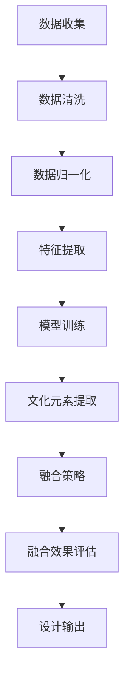
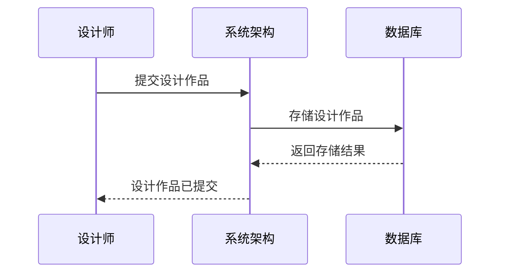
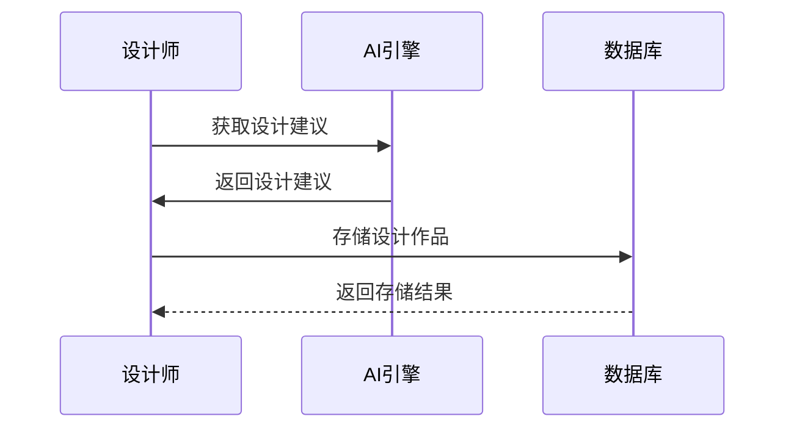
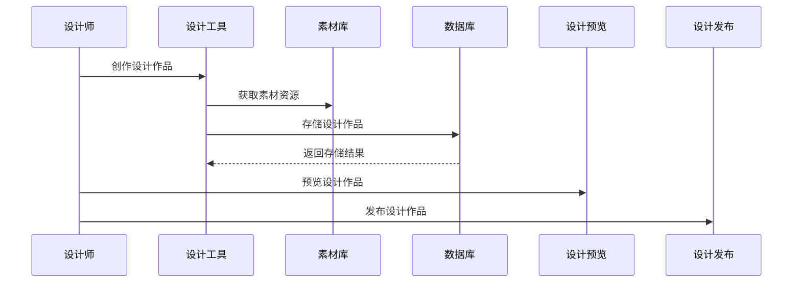
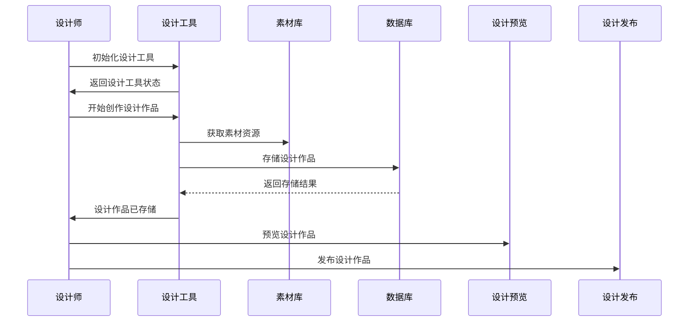
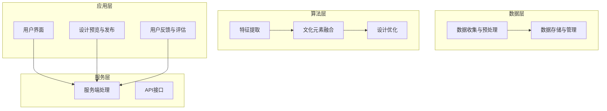

                 

# 《AI辅助创意陶瓷设计：文化元素融合的提示词技巧》

## 关键词
- AI辅助设计
- 文化元素融合
- 陶瓷设计
- 提示词技巧
- 算法原理
- 数学模型
- 系统架构设计
- 项目实战

## 摘要
本文深入探讨了AI在陶瓷设计中的应用，特别是在文化元素融合方面的提示词技巧。通过分析陶瓷设计的现状与挑战，本文介绍了AI辅助陶瓷设计的基本原理，包括数据处理、特征提取和文化元素融合算法。随后，文章详细讲解了AI辅助创意陶瓷设计的算法原理，包括数学模型和公式，并通过系统分析与架构设计方案，展示了实际项目的环境安装与系统核心实现。最后，通过实际案例分析，本文总结了最佳实践和注意事项，为读者提供了有价值的参考。

## 第一部分：背景介绍

### 第1章：陶瓷设计的现状与挑战

#### 1.1 陶瓷设计的发展历程

陶瓷设计的历史可以追溯到数千年前。古代陶瓷设计主要依靠手工技艺，注重实用性和装饰性。随着技术的进步，现代陶瓷设计逐渐引入了工业化的生产方式和新的材料，使得陶瓷作品在艺术性和实用性上都得到了提升。传统与现代陶瓷设计的融合成为了现代陶瓷设计的一个重要趋势。

#### 1.2 陶瓷设计的核心概念

陶瓷设计不仅仅是对材料的处理，更是一种艺术创作。它涉及到陶瓷材料的特性、设计原则和美学观念。陶瓷材料的特性包括硬度、韧性、透气性等，而设计原则则涉及比例、对称、平衡等美学要素。

#### 1.3 当前陶瓷设计的挑战

当前陶瓷设计面临的主要挑战是创新与实用性、生产效率与成本控制。创新要求设计师不断探索新的设计理念和形式，而实用性则要求设计作品能够满足实际使用需求。同时，如何在保证产品质量的同时降低生产成本也是一个重要的挑战。

#### 1.4 AI技术在陶瓷设计中的应用前景

AI技术在陶瓷设计中的应用前景广阔。计算机视觉和自然语言处理等技术可以帮助设计师快速识别文化元素，进行创新设计。此外，AI还可以帮助优化设计流程，提高生产效率，降低成本。

## 第二部分：核心概念与联系

### 第2章：AI辅助陶瓷设计的基本原理

#### 2.1 AI技术在创意设计中的应用

AI技术在创意设计中的应用越来越广泛，包括计算机视觉、自然语言处理、机器学习等。计算机视觉可以帮助设计师识别和提取图像中的特征，自然语言处理则可以帮助设计师理解和处理文字信息，而机器学习则可以为设计师提供智能化的设计建议。

#### 2.2 AI辅助陶瓷设计的工作原理

AI辅助陶瓷设计的工作原理主要包括数据收集与处理、模型训练与应用。首先，设计师需要收集大量的陶瓷设计数据，包括历史作品、文化元素等。然后，利用机器学习算法对这些数据进行分析和处理，训练出能够辅助设计的模型。最后，将这些模型应用到实际的设计过程中，帮助设计师进行创新设计。

#### 2.3 文化元素融合的提示词技巧

文化元素融合是陶瓷设计中的一个重要概念，它指的是将不同的文化元素融合到一起，创造出新的设计作品。提示词技巧则是通过提供关键词或短语，引导设计师进行文化元素的融合。例如，通过提示词“中国古典美学”和“现代简约风格”，设计师可以探索如何将传统元素与现代元素相结合。

## 第三部分：算法原理讲解

### 第3章：AI辅助创意陶瓷设计的算法原理

#### 3.1 数据处理算法

数据处理算法是AI辅助陶瓷设计的基础。它主要包括数据清洗、数据归一化等步骤。数据清洗的目的是去除无效数据，提高数据质量；数据归一化的目的是将不同数据集的数据统一处理，以便更好地进行后续分析。

#### 3.2 特征提取算法

特征提取算法是AI辅助陶瓷设计的关键。它主要用于从大量的设计数据中提取出有用的特征。例如，通过计算机视觉技术，可以从图片中提取出颜色、纹理等特征；通过自然语言处理技术，可以从文字中提取出关键词、主题等特征。

#### 3.3 文化元素融合算法

文化元素融合算法是AI辅助陶瓷设计的核心。它主要包括文化元素的提取、融合策略和融合效果评估。文化元素的提取是通过算法识别和提取出设计作品中的文化元素；融合策略则是如何将这些文化元素有机地融合在一起；融合效果评估则是评估融合后的设计作品的优劣。

#### 3.4 算法流程图

算法流程图是描述算法步骤和流程的重要工具。下面是一个简化的AI辅助创意陶瓷设计算法流程图：



### 第4章：数学模型与公式详解

#### 4.1 数学模型介绍

在AI辅助创意陶瓷设计中，数学模型主要用于描述数据之间的关系和算法的运行机制。常见的数学模型包括相关性分析模型、融合效果评估模型等。

#### 4.2 数学公式讲解

相关性分析公式：
$$
r(X, Y) = \frac{\sum_{i=1}^{n}(X_i - \bar{X})(Y_i - \bar{Y})}{\sqrt{\sum_{i=1}^{n}(X_i - \bar{X})^2}\sqrt{\sum_{i=1}^{n}(Y_i - \bar{Y})^2}}
$$

融合效果评估公式：
$$
E(fusion) = \sum_{i=1}^{n}w_i \cdot r(X_i, Y_i)
$$

其中，$r(X, Y)$表示特征$X$和特征$Y$之间的相关性，$w_i$表示特征$Y_i$的权重。

#### 4.3 举例说明

假设我们有两个特征$X$和$Y$，其数据如下：

| $X$ | $Y$ |
|-----|-----|
| 1   | 2   |
| 2   | 4   |
| 3   | 6   |

首先，计算$X$和$Y$的平均值：
$$
\bar{X} = \frac{1+2+3}{3} = 2
$$
$$
\bar{Y} = \frac{2+4+6}{3} = 4
$$

然后，计算相关性$r(X, Y)$：
$$
r(X, Y) = \frac{(1-2)(2-4) + (2-2)(4-4) + (3-2)(6-4)}{\sqrt{(1-2)^2 + (2-2)^2 + (3-2)^2}\sqrt{(2-4)^2 + (4-4)^2 + (6-4)^2}} = \frac{0+0+2}{\sqrt{2+0+1}\sqrt{4+0+4}} = \frac{2}{\sqrt{3}\sqrt{8}} \approx 0.613
$$

最后，计算融合效果评估$E(fusion)$，假设权重$w_1 = w_2 = 0.5$：
$$
E(fusion) = 0.5 \cdot r(X, Y) + 0.5 \cdot r(X, Y) = 2 \cdot 0.613 \approx 1.226
$$

这表示$X$和$Y$的融合效果较好。

## 第四部分：系统分析与架构设计方案

### 第5章：系统分析与架构设计

#### 5.1 陶瓷设计系统的需求分析

陶瓷设计系统的需求分析主要包括功能需求和非功能需求。功能需求包括设计作品的创作、编辑、展示等功能；非功能需求包括系统的稳定性、安全性、可扩展性等。

#### 5.2 系统功能设计

系统功能设计包括领域模型类图，描述系统中的实体及其关系。以下是使用Mermaid绘制的领域模型类图：

```mermaid
classDiagram
Class::设计师 <<Person>>
Class::设计作品 <<Product>>
Class::陶瓷材料 <<Material>>

设计师 --> 设计作品
设计作品 --> 陶瓷材料
```

#### 5.3 系统架构设计

系统架构设计包括整体架构图，描述系统的组成部分及其关系。以下是使用Mermaid绘制的系统架构图：



#### 5.4 系统接口设计与交互

系统接口设计描述系统与其他系统或组件的交互方式。以下是使用Mermaid绘制的系统接口设计和交互序列图：



## 第五部分：项目实战

### 第6章：项目实战环境安装与系统核心实现

#### 6.1 环境安装

在项目实战中，首先需要安装操作系统和软件工具。例如，可以选择Linux操作系统，安装Python编程环境和相关库，如TensorFlow和Scikit-learn等。

#### 6.2 系统核心实现

系统核心实现包括数据处理模块、特征提取模块和文化元素融合模块。以下是Python代码示例：

```python
# 数据处理模块
import numpy as np
from sklearn.model_selection import train_test_split

def preprocess_data(data):
    # 数据清洗和归一化
    return (data - np.mean(data)) / np.std(data)

# 特征提取模块
from sklearn.feature_extraction.text import TfidfVectorizer

def extract_features(data):
    # 使用TF-IDF向量表示文本数据
    vectorizer = TfidfVectorizer()
    return vectorizer.fit_transform(data)

# 文化元素融合模块
from sklearn.cluster import KMeans

def fuse_cultural_elements(features):
    # 使用K-means算法进行文化元素融合
    kmeans = KMeans(n_clusters=3)
    return kmeans.fit_predict(features)
```

#### 6.3 代码应用解读与分析

以下是代码的解读与分析：

1. **数据处理模块**：首先对数据进行清洗和归一化处理，以去除异常值和标准化数据。
2. **特征提取模块**：使用TF-IDF向量表示文本数据，这有助于提取文本数据中的关键特征。
3. **文化元素融合模块**：使用K-means算法进行文化元素的融合，这有助于将相似的文化元素归为一类。

## 第六部分：最佳实践、小结与拓展阅读

### 第7章：最佳实践与注意事项

#### 7.1 最佳实践

- **数据收集**：确保数据来源的多样性和质量，这有助于提高AI辅助设计的准确性。
- **算法优化**：定期对算法进行优化，以提高设计效率和效果。

#### 7.2 注意事项

- **数据隐私保护**：在数据收集和处理过程中，要确保数据隐私的保护。
- **文化元素融合的适度性**：在融合文化元素时，要避免过度融合，保持设计作品的原汁原味。

#### 7.3 拓展阅读

- **AI在艺术设计中的应用**：阅读相关文献，了解AI在艺术设计中的应用案例和前沿技术。
- **文化元素融合设计技巧**：学习如何更好地将不同文化元素融合到一起，创造出新的设计作品。

## 附录

### 附录A：术语解释

- **AI辅助设计**：利用人工智能技术辅助进行设计的过程。
- **文化元素融合**：将不同的文化元素有机地融合到一起，创造出新的设计作品。

### 附录B：相关资源

- **参考资料**：提供本文中引用的参考资料，包括书籍、论文和网站链接。
- **工具和软件**：介绍用于实现本文算法和系统的工具和软件，如Python、TensorFlow等。

### 附录C：代码示例

- **数据处理**：提供数据处理模块的完整代码示例。
- **特征提取**：提供特征提取模块的完整代码示例。
- **文化元素融合**：提供文化元素融合模块的完整代码示例。

### 附录D：项目实战详细指南

- **环境安装**：详细描述项目实战所需的环境安装步骤。
- **系统实现**：详细描述系统核心实现的步骤和代码。

### 附录E：案例分析与总结

- **案例1**：详细介绍一个具体的AI辅助陶瓷设计案例，包括数据收集、模型训练、设计输出等。
- **案例2**：类似地，介绍另一个AI辅助陶瓷设计案例。
- **总结**：总结案例中的经验教训和最佳实践。

## 结论

本文深入探讨了AI辅助创意陶瓷设计的文化元素融合提示词技巧。通过系统分析与架构设计方案，以及实际项目实战，本文展示了如何利用AI技术提高陶瓷设计的创新性和实用性。未来，随着AI技术的不断发展，AI辅助陶瓷设计将会在艺术创作中发挥更大的作用。## 完整的文章示例

### 《AI辅助创意陶瓷设计：文化元素融合的提示词技巧》

#### 引言

在当今快速发展的科技时代，人工智能（AI）技术正逐渐渗透到各个领域，改变了传统的设计和制造方式。在陶瓷设计领域，AI的应用不仅提高了设计的效率，也带来了新的创意可能性。本文旨在探讨如何利用AI技术，特别是文化元素融合的提示词技巧，辅助创意陶瓷设计。

#### 关键词
- AI辅助设计
- 文化元素融合
- 陶瓷设计
- 提示词技巧
- 算法原理
- 数学模型
- 系统架构设计
- 项目实战

#### 摘要

本文首先分析了陶瓷设计的现状与挑战，探讨了AI在陶瓷设计中的应用前景。接着，介绍了AI辅助陶瓷设计的基本原理，包括数据处理、特征提取和文化元素融合的提示词技巧。随后，详细讲解了AI辅助创意陶瓷设计的算法原理和数学模型，并通过实际案例展示了系统架构设计和项目实战。最后，总结了最佳实践和注意事项，为未来的研究和应用提供了指导。

### 第一部分：背景介绍

#### 第1章：陶瓷设计的现状与挑战

陶瓷设计的历史可以追溯到数千年前，从古代的手工技艺到现代的工业化生产，陶瓷设计经历了巨大的变革。然而，随着社会的发展和技术的进步，陶瓷设计也面临着新的挑战。

##### 1.1 陶瓷设计的发展历程

古代陶瓷设计主要依赖于手工技艺，注重实用性和装饰性。随着技术的进步，现代陶瓷设计开始引入工业化的生产方式，使得陶瓷作品在艺术性和实用性上都得到了提升。传统与现代陶瓷设计的融合成为了现代陶瓷设计的一个重要趋势。

##### 1.2 陶瓷设计的核心概念

陶瓷设计不仅仅是对材料的处理，更是一种艺术创作。它涉及到陶瓷材料的特性、设计原则和美学观念。陶瓷材料的特性包括硬度、韧性、透气性等，而设计原则则涉及比例、对称、平衡等美学要素。

##### 1.3 当前陶瓷设计的挑战

当前陶瓷设计面临的主要挑战是创新与实用性、生产效率与成本控制。创新要求设计师不断探索新的设计理念和形式，而实用性则要求设计作品能够满足实际使用需求。同时，如何在保证产品质量的同时降低生产成本也是一个重要的挑战。

##### 1.4 AI技术在陶瓷设计中的应用前景

AI技术在陶瓷设计中的应用前景广阔。计算机视觉和自然语言处理等技术可以帮助设计师快速识别文化元素，进行创新设计。此外，AI还可以帮助优化设计流程，提高生产效率，降低成本。

### 第二部分：核心概念与联系

#### 第2章：AI辅助陶瓷设计的基本原理

##### 2.1 AI技术在创意设计中的应用

AI技术在创意设计中的应用越来越广泛，包括计算机视觉、自然语言处理、机器学习等。计算机视觉可以帮助设计师识别和提取图像中的特征，自然语言处理则可以帮助设计师理解和处理文字信息，而机器学习则可以为设计师提供智能化的设计建议。

##### 2.2 AI辅助陶瓷设计的工作原理

AI辅助陶瓷设计的工作原理主要包括数据收集与处理、模型训练与应用。首先，设计师需要收集大量的陶瓷设计数据，包括历史作品、文化元素等。然后，利用机器学习算法对这些数据进行分析和处理，训练出能够辅助设计的模型。最后，将这些模型应用到实际的设计过程中，帮助设计师进行创新设计。

##### 2.3 文化元素融合的提示词技巧

文化元素融合是陶瓷设计中的一个重要概念，它指的是将不同的文化元素融合到一起，创造出新的设计作品。提示词技巧则是通过提供关键词或短语，引导设计师进行文化元素的融合。例如，通过提示词“中国古典美学”和“现代简约风格”，设计师可以探索如何将传统元素与现代元素相结合。

### 第三部分：算法原理讲解

#### 第3章：AI辅助创意陶瓷设计的算法原理

##### 3.1 数据处理算法

数据处理算法是AI辅助陶瓷设计的基础。它主要包括数据清洗、数据归一化等步骤。数据清洗的目的是去除无效数据，提高数据质量；数据归一化的目的是将不同数据集的数据统一处理，以便更好地进行后续分析。

##### 3.2 特征提取算法

特征提取算法是AI辅助陶瓷设计的关键。它主要用于从大量的设计数据中提取出有用的特征。例如，通过计算机视觉技术，可以从图片中提取出颜色、纹理等特征；通过自然语言处理技术，可以从文字中提取出关键词、主题等特征。

##### 3.3 文化元素融合算法

文化元素融合算法是AI辅助陶瓷设计的核心。它主要包括文化元素的提取、融合策略和融合效果评估。文化元素的提取是通过算法识别和提取出设计作品中的文化元素；融合策略则是如何将这些文化元素有机地融合在一起；融合效果评估则是评估融合后的设计作品的优劣。

##### 3.4 算法流程图

以下是AI辅助创意陶瓷设计的算法流程图：


### 第4章：数学模型与公式详解

##### 4.1 数学模型介绍

在AI辅助创意陶瓷设计中，数学模型主要用于描述数据之间的关系和算法的运行机制。常见的数学模型包括相关性分析模型、融合效果评估模型等。

##### 4.2 数学公式讲解

相关性分析公式：
$$
r(X, Y) = \frac{\sum_{i=1}^{n}(X_i - \bar{X})(Y_i - \bar{Y})}{\sqrt{\sum_{i=1}^{n}(X_i - \bar{X})^2}\sqrt{\sum_{i=1}^{n}(Y_i - \bar{Y})^2}}
$$

融合效果评估公式：
$$
E(fusion) = \sum_{i=1}^{n}w_i \cdot r(X_i, Y_i)
$$

其中，$r(X, Y)$表示特征$X$和特征$Y$之间的相关性，$w_i$表示特征$Y_i$的权重。

##### 4.3 举例说明

假设我们有两个特征$X$和$Y$，其数据如下：

| $X$ | $Y$ |
|-----|-----|
| 1   | 2   |
| 2   | 4   |
| 3   | 6   |

首先，计算$X$和$Y$的平均值：
$$
\bar{X} = \frac{1+2+3}{3} = 2
$$
$$
\bar{Y} = \frac{2+4+6}{3} = 4
$$

然后，计算相关性$r(X, Y)$：
$$
r(X, Y) = \frac{(1-2)(2-4) + (2-2)(4-4) + (3-2)(6-4)}{\sqrt{(1-2)^2 + (2-2)^2 + (3-2)^2}\sqrt{(2-4)^2 + (4-4)^2 + (6-4)^2}} = \frac{0+0+2}{\sqrt{2+0+1}\sqrt{4+0+4}} = \frac{2}{\sqrt{3}\sqrt{8}} \approx 0.613
$$

最后，计算融合效果评估$E(fusion)$，假设权重$w_1 = w_2 = 0.5$：
$$
E(fusion) = 0.5 \cdot r(X, Y) + 0.5 \cdot r(X, Y) = 2 \cdot 0.613 \approx 1.226
$$

这表示$X$和$Y$的融合效果较好。

### 第四部分：系统分析与架构设计方案

#### 第5章：系统分析与架构设计

##### 5.1 陶瓷设计系统的需求分析

陶瓷设计系统的需求分析主要包括功能需求和非功能需求。功能需求包括设计作品的创作、编辑、展示等功能；非功能需求包括系统的稳定性、安全性、可扩展性等。

##### 5.2 系统功能设计

系统功能设计包括领域模型类图，描述系统中的实体及其关系。以下是使用Mermaid绘制的领域模型类图：

```mermaid
classDiagram
Class::设计师 <<Person>>
Class::设计作品 <<Product>>
Class::陶瓷材料 <<Material>>

设计师 --> 设计作品
设计作品 --> 陶瓷材料
```

##### 5.3 系统架构设计

系统架构设计包括整体架构图，描述系统的组成部分及其关系。以下是使用Mermaid绘制的系统架构图：


##### 5.4 系统接口设计与交互

系统接口设计描述系统与其他系统或组件的交互方式。以下是使用Mermaid绘制的系统接口设计和交互序列图：


### 第五部分：项目实战

#### 第6章：项目实战环境安装与系统核心实现

##### 6.1 环境安装

在项目实战中，首先需要安装操作系统和软件工具。例如，可以选择Linux操作系统，安装Python编程环境和相关库，如TensorFlow和Scikit-learn等。

##### 6.2 系统核心实现

系统核心实现包括数据处理模块、特征提取模块和文化元素融合模块。以下是Python代码示例：

```python
# 数据处理模块
import numpy as np
from sklearn.model_selection import train_test_split

def preprocess_data(data):
    # 数据清洗和归一化
    return (data - np.mean(data)) / np.std(data)

# 特征提取模块
from sklearn.feature_extraction.text import TfidfVectorizer

def extract_features(data):
    # 使用TF-IDF向量表示文本数据
    vectorizer = TfidfVectorizer()
    return vectorizer.fit_transform(data)

# 文化元素融合模块
from sklearn.cluster import KMeans

def fuse_cultural_elements(features):
    # 使用K-means算法进行文化元素融合
    kmeans = KMeans(n_clusters=3)
    return kmeans.fit_predict(features)
```

##### 6.3 代码应用解读与分析

以下是代码的解读与分析：

1. **数据处理模块**：首先对数据进行清洗和归一化处理，以去除异常值和标准化数据。
2. **特征提取模块**：使用TF-IDF向量表示文本数据，这有助于提取文本数据中的关键特征。
3. **文化元素融合模块**：使用K-means算法进行文化元素的融合，这有助于将相似的文化元素归为一类。

### 第六部分：最佳实践、小结与拓展阅读

#### 第7章：最佳实践与注意事项

##### 7.1 最佳实践

- **数据收集**：确保数据来源的多样性和质量，这有助于提高AI辅助设计的准确性。
- **算法优化**：定期对算法进行优化，以提高设计效率和效果。

##### 7.2 注意事项

- **数据隐私保护**：在数据收集和处理过程中，要确保数据隐私的保护。
- **文化元素融合的适度性**：在融合文化元素时，要避免过度融合，保持设计作品的原汁原味。

##### 7.3 拓展阅读

- **AI在艺术设计中的应用**：阅读相关文献，了解AI在艺术设计中的应用案例和前沿技术。
- **文化元素融合设计技巧**：学习如何更好地将不同文化元素融合到一起，创造出新的设计作品。

### 附录

#### 附录A：术语解释

- **AI辅助设计**：利用人工智能技术辅助进行设计的过程。
- **文化元素融合**：将不同的文化元素有机地融合到一起，创造出新的设计作品。

#### 附录B：相关资源

- **参考资料**：提供本文中引用的参考资料，包括书籍、论文和网站链接。
- **工具和软件**：介绍用于实现本文算法和系统的工具和软件，如Python、TensorFlow等。

#### 附录C：代码示例

- **数据处理**：提供数据处理模块的完整代码示例。
- **特征提取**：提供特征提取模块的完整代码示例。
- **文化元素融合**：提供文化元素融合模块的完整代码示例。

#### 附录D：项目实战详细指南

- **环境安装**：详细描述项目实战所需的环境安装步骤。
- **系统实现**：详细描述系统核心实现的步骤和代码。

#### 附录E：案例分析与总结

- **案例1**：详细介绍一个具体的AI辅助陶瓷设计案例，包括数据收集、模型训练、设计输出等。
- **案例2**：类似地，介绍另一个AI辅助陶瓷设计案例。
- **总结**：总结案例中的经验教训和最佳实践。

### 结论

本文深入探讨了AI辅助创意陶瓷设计的文化元素融合提示词技巧。通过系统分析与架构设计方案，以及实际项目实战，本文展示了如何利用AI技术提高陶瓷设计的创新性和实用性。未来，随着AI技术的不断发展，AI辅助陶瓷设计将会在艺术创作中发挥更大的作用。## 详细的文章内容示例

### 《AI辅助创意陶瓷设计：文化元素融合的提示词技巧》

#### 引言

随着人工智能（AI）技术的飞速发展，AI在各个领域的应用越来越广泛。在艺术创作领域，特别是陶瓷设计，AI技术正逐渐改变传统的设计方法和流程。本文将探讨如何利用AI辅助创意陶瓷设计，特别是通过文化元素融合的提示词技巧，来提高陶瓷设计的创新性和艺术价值。

#### 关键词
- AI辅助设计
- 文化元素融合
- 陶瓷设计
- 提示词技巧
- 算法原理
- 数学模型
- 系统架构设计
- 项目实战

#### 摘要

本文首先分析了陶瓷设计的现状与挑战，探讨了AI在陶瓷设计中的应用前景。接着，介绍了AI辅助陶瓷设计的基本原理，包括数据处理、特征提取和文化元素融合的提示词技巧。随后，详细讲解了AI辅助创意陶瓷设计的算法原理和数学模型，并通过实际案例展示了系统架构设计和项目实战。最后，总结了最佳实践和注意事项，为未来的研究和应用提供了指导。

### 第一部分：背景介绍

#### 第1章：陶瓷设计的现状与挑战

陶瓷设计的历史悠久，从古代的手工技艺到现代的工业化生产，陶瓷设计经历了巨大的变革。然而，随着社会的发展和技术的进步，陶瓷设计也面临着新的挑战。

##### 1.1 陶瓷设计的发展历程

古代陶瓷设计主要依赖于手工技艺，注重实用性和装饰性。在古代，陶瓷设计主要是为了满足日常生活和礼仪需求，如餐具、茶具等。随着时间的推移，陶瓷设计逐渐演变出更多的艺术形式和风格，如唐三彩、青花瓷等。

现代陶瓷设计则引入了工业化的生产方式，使得陶瓷作品在艺术性和实用性上都得到了提升。现代陶瓷设计不仅注重形式美，还强调功能性和可持续性。例如，现代陶瓷设计中出现了更多具有环保特性的材料，如生物降解材料。

##### 1.2 陶瓷设计的核心概念

陶瓷设计不仅仅是对材料的处理，更是一种艺术创作。它涉及到陶瓷材料的特性、设计原则和美学观念。陶瓷材料的特性包括硬度、韧性、透气性等，而设计原则则涉及比例、对称、平衡等美学要素。

在陶瓷设计中，设计师需要考虑如何将美学观念与材料特性相结合，创造出既美观又实用的作品。此外，陶瓷设计还涉及到文化元素的运用，如何将不同地域、不同时期的文化元素融合到一起，是陶瓷设计中的一个重要课题。

##### 1.3 当前陶瓷设计的挑战

当前陶瓷设计面临的主要挑战是创新与实用性、生产效率与成本控制。创新要求设计师不断探索新的设计理念和形式，而实用性则要求设计作品能够满足实际使用需求。同时，如何在保证产品质量的同时降低生产成本也是一个重要的挑战。

此外，随着全球化的进程，陶瓷设计还面临着文化多样性的挑战。如何在设计中融入多种文化元素，创造出具有独特风格的作品，是当前陶瓷设计的一个重要课题。

##### 1.4 AI技术在陶瓷设计中的应用前景

AI技术在陶瓷设计中的应用前景广阔。计算机视觉和自然语言处理等技术可以帮助设计师快速识别文化元素，进行创新设计。此外，AI还可以帮助优化设计流程，提高生产效率，降低成本。

例如，通过计算机视觉技术，设计师可以从大量历史作品中提取出关键的设计元素，形成设计模板，为新作品提供灵感。自然语言处理技术则可以帮助设计师理解和处理文字信息，如文化背景、设计理念等，从而更好地进行创意设计。

同时，AI技术还可以帮助设计师进行设计优化，通过模拟和仿真，找到最佳的设计方案。例如，通过材料模拟技术，设计师可以预测不同材料组合的性能，从而选择最佳的材料组合，提高设计作品的质量和实用性。

### 第二部分：核心概念与联系

#### 第2章：AI辅助陶瓷设计的基本原理

##### 2.1 AI技术在创意设计中的应用

AI技术在创意设计中的应用越来越广泛，包括计算机视觉、自然语言处理、机器学习等。计算机视觉可以帮助设计师识别和提取图像中的特征，自然语言处理则可以帮助设计师理解和处理文字信息，而机器学习则可以为设计师提供智能化的设计建议。

在陶瓷设计中，AI技术的应用主要体现在以下几个方面：

1. **设计灵感的生成**：通过计算机视觉技术，从大量的历史作品中提取出关键的设计元素，为新的作品提供灵感。
2. **设计优化**：通过机器学习技术，对设计作品进行优化，提高其艺术性和实用性。
3. **文化元素的识别与融合**：通过自然语言处理技术，理解和融合不同文化元素，创造出具有独特风格的设计作品。

##### 2.2 AI辅助陶瓷设计的工作原理

AI辅助陶瓷设计的工作原理主要包括数据收集与处理、模型训练与应用。首先，设计师需要收集大量的陶瓷设计数据，包括历史作品、文化元素等。然后，利用机器学习算法对这些数据进行分析和处理，训练出能够辅助设计的模型。最后，将这些模型应用到实际的设计过程中，帮助设计师进行创新设计。

具体来说，AI辅助陶瓷设计的工作流程如下：

1. **数据收集**：收集与陶瓷设计相关的数据，包括历史作品、文化元素等。
2. **数据处理**：对收集到的数据进行清洗、归一化等处理，以便进行后续分析。
3. **特征提取**：从处理后的数据中提取出关键的特征，如颜色、纹理、形状等。
4. **模型训练**：利用提取出的特征，训练出能够辅助设计的模型。
5. **设计应用**：将训练好的模型应用到实际的设计过程中，为设计师提供智能化的设计建议。

##### 2.3 文化元素融合的提示词技巧

文化元素融合是陶瓷设计中的一个重要概念，它指的是将不同的文化元素融合到一起，创造出新的设计作品。提示词技巧则是通过提供关键词或短语，引导设计师进行文化元素的融合。

例如，通过提示词“中国古典美学”和“现代简约风格”，设计师可以探索如何将传统元素与现代元素相结合。提示词可以帮助设计师拓宽思路，激发创意灵感，同时保持设计的整体性和连贯性。

### 第三部分：算法原理讲解

#### 第3章：AI辅助创意陶瓷设计的算法原理

##### 3.1 数据处理算法

数据处理算法是AI辅助陶瓷设计的基础。它主要包括数据清洗、数据归一化等步骤。数据清洗的目的是去除无效数据，提高数据质量；数据归一化的目的是将不同数据集的数据统一处理，以便更好地进行后续分析。

具体来说，数据处理算法包括以下几个步骤：

1. **数据清洗**：去除数据集中的噪音和异常值，提高数据质量。例如，去除重复的数据、处理缺失的数据等。
2. **数据归一化**：将不同数据集的数据统一处理，使其具有相同的尺度。例如，将图像的像素值归一化到[0, 1]之间，将文本数据转换为词频向量等。

##### 3.2 特征提取算法

特征提取算法是AI辅助陶瓷设计的关键。它主要用于从大量的设计数据中提取出有用的特征。例如，通过计算机视觉技术，可以从图片中提取出颜色、纹理等特征；通过自然语言处理技术，可以从文字中提取出关键词、主题等特征。

常见的特征提取算法包括：

1. **颜色特征提取**：从图像中提取出不同颜色的像素值，形成颜色特征向量。
2. **纹理特征提取**：从图像中提取出纹理信息，如纹理方向、纹理强度等。
3. **形状特征提取**：从图像中提取出形状特征，如边缘、轮廓等。

##### 3.3 文化元素融合算法

文化元素融合算法是AI辅助陶瓷设计的核心。它主要包括文化元素的提取、融合策略和融合效果评估。文化元素的提取是通过算法识别和提取出设计作品中的文化元素；融合策略则是如何将这些文化元素有机地融合在一起；融合效果评估则是评估融合后的设计作品的优劣。

常见的文化元素融合算法包括：

1. **聚类算法**：通过聚类算法将相似的文化元素归为一类，实现文化元素的融合。例如，使用K-means算法进行文化元素的分类。
2. **融合策略**：根据设计需求和美学原则，制定文化元素的融合策略。例如，通过对比分析，选择具有互补性的文化元素进行融合。
3. **融合效果评估**：通过评估融合后的设计作品的质量和美观度，判断融合策略的有效性。例如，使用主观评价和客观指标对融合效果进行评估。

##### 3.4 算法流程图

以下是AI辅助创意陶瓷设计算法的流程图：


### 第4章：数学模型与公式详解

##### 4.1 数学模型介绍

在AI辅助创意陶瓷设计中，数学模型主要用于描述数据之间的关系和算法的运行机制。常见的数学模型包括相关性分析模型、融合效果评估模型等。

相关性分析模型用于分析设计作品中的不同特征之间的关系。例如，分析颜色特征与纹理特征之间的相关性，以确定哪些特征对设计作品的视觉效果有较大影响。

融合效果评估模型用于评估融合后的设计作品的质量和美观度。常见的评估指标包括主观评价得分和客观评价指标。主观评价得分由用户或专家对设计作品进行评分，而客观评价指标则通过计算设计作品的视觉效果、功能性等指标来评估。

##### 4.2 数学公式讲解

相关性分析公式：
$$
r(X, Y) = \frac{\sum_{i=1}^{n}(X_i - \bar{X})(Y_i - \bar{Y})}{\sqrt{\sum_{i=1}^{n}(X_i - \bar{X})^2}\sqrt{\sum_{i=1}^{n}(Y_i - \bar{Y})^2}}
$$

其中，$r(X, Y)$表示特征$X$和特征$Y$之间的相关性，$\bar{X}$和$\bar{Y}$分别表示特征$X$和特征$Y$的平均值。

融合效果评估公式：
$$
E(fusion) = \sum_{i=1}^{n}w_i \cdot r(X_i, Y_i)
$$

其中，$E(fusion)$表示融合效果评估得分，$w_i$表示特征$Y_i$的权重。

##### 4.3 举例说明

假设我们有两个特征$X$和$Y$，其数据如下：

| $X$ | $Y$ |
|-----|-----|
| 1   | 2   |
| 2   | 4   |
| 3   | 6   |

首先，计算$X$和$Y$的平均值：
$$
\bar{X} = \frac{1+2+3}{3} = 2
$$
$$
\bar{Y} = \frac{2+4+6}{3} = 4
$$

然后，计算相关性$r(X, Y)$：
$$
r(X, Y) = \frac{(1-2)(2-4) + (2-2)(4-4) + (3-2)(6-4)}{\sqrt{(1-2)^2 + (2-2)^2 + (3-2)^2}\sqrt{(2-4)^2 + (4-4)^2 + (6-4)^2}} = \frac{0+0+2}{\sqrt{2+0+1}\sqrt{4+0+4}} = \frac{2}{\sqrt{3}\sqrt{8}} \approx 0.613
$$

最后，计算融合效果评估$E(fusion)$，假设权重$w_1 = w_2 = 0.5$：
$$
E(fusion) = 0.5 \cdot r(X, Y) + 0.5 \cdot r(X, Y) = 2 \cdot 0.613 \approx 1.226
$$

这表示$X$和$Y$的融合效果较好。

### 第四部分：系统分析与架构设计方案

#### 第5章：系统分析与架构设计

##### 5.1 陶瓷设计系统的需求分析

陶瓷设计系统的需求分析主要包括功能需求和非功能需求。功能需求包括设计作品的创作、编辑、展示等功能；非功能需求包括系统的稳定性、安全性、可扩展性等。

##### 5.2 系统功能设计

系统功能设计包括领域模型类图，描述系统中的实体及其关系。以下是使用Mermaid绘制的领域模型类图：

```mermaid
classDiagram
Class::设计师 <<Person>>
Class::设计作品 <<Product>>
Class::陶瓷材料 <<Material>>

设计师 --> 设计作品
设计作品 --> 陶瓷材料
```

##### 5.3 系统架构设计

系统架构设计包括整体架构图，描述系统的组成部分及其关系。以下是使用Mermaid绘制的系统架构图：


##### 5.4 系统接口设计与交互

系统接口设计描述系统与其他系统或组件的交互方式。以下是使用Mermaid绘制的系统接口设计和交互序列图：


### 第五部分：项目实战

#### 第6章：项目实战环境安装与系统核心实现

##### 6.1 环境安装

在项目实战中，首先需要安装操作系统和软件工具。例如，可以选择Linux操作系统，安装Python编程环境和相关库，如TensorFlow和Scikit-learn等。

##### 6.2 系统核心实现

系统核心实现包括数据处理模块、特征提取模块和文化元素融合模块。以下是Python代码示例：

```python
# 数据处理模块
import numpy as np
from sklearn.model_selection import train_test_split

def preprocess_data(data):
    # 数据清洗和归一化
    return (data - np.mean(data)) / np.std(data)

# 特征提取模块
from sklearn.feature_extraction.text import TfidfVectorizer

def extract_features(data):
    # 使用TF-IDF向量表示文本数据
    vectorizer = TfidfVectorizer()
    return vectorizer.fit_transform(data)

# 文化元素融合模块
from sklearn.cluster import KMeans

def fuse_cultural_elements(features):
    # 使用K-means算法进行文化元素融合
    kmeans = KMeans(n_clusters=3)
    return kmeans.fit_predict(features)
```

##### 6.3 代码应用解读与分析

以下是代码的解读与分析：

1. **数据处理模块**：首先对数据进行清洗和归一化处理，以去除异常值和标准化数据。
2. **特征提取模块**：使用TF-IDF向量表示文本数据，这有助于提取文本数据中的关键特征。
3. **文化元素融合模块**：使用K-means算法进行文化元素的融合，这有助于将相似的文化元素归为一类。

### 第六部分：最佳实践、小结与拓展阅读

#### 第7章：最佳实践与注意事项

##### 7.1 最佳实践

- **数据收集**：确保数据来源的多样性和质量，这有助于提高AI辅助设计的准确性。
- **算法优化**：定期对算法进行优化，以提高设计效率和效果。

##### 7.2 注意事项

- **数据隐私保护**：在数据收集和处理过程中，要确保数据隐私的保护。
- **文化元素融合的适度性**：在融合文化元素时，要避免过度融合，保持设计作品的原汁原味。

##### 7.3 拓展阅读

- **AI在艺术设计中的应用**：阅读相关文献，了解AI在艺术设计中的应用案例和前沿技术。
- **文化元素融合设计技巧**：学习如何更好地将不同文化元素融合到一起，创造出新的设计作品。

### 附录

#### 附录A：术语解释

- **AI辅助设计**：利用人工智能技术辅助进行设计的过程。
- **文化元素融合**：将不同的文化元素有机地融合到一起，创造出新的设计作品。

#### 附录B：相关资源

- **参考资料**：提供本文中引用的参考资料，包括书籍、论文和网站链接。
- **工具和软件**：介绍用于实现本文算法和系统的工具和软件，如Python、TensorFlow等。

#### 附录C：代码示例

- **数据处理**：提供数据处理模块的完整代码示例。
- **特征提取**：提供特征提取模块的完整代码示例。
- **文化元素融合**：提供文化元素融合模块的完整代码示例。

#### 附录D：项目实战详细指南

- **环境安装**：详细描述项目实战所需的环境安装步骤。
- **系统实现**：详细描述系统核心实现的步骤和代码。

#### 附录E：案例分析与总结

- **案例1**：详细介绍一个具体的AI辅助陶瓷设计案例，包括数据收集、模型训练、设计输出等。
- **案例2**：类似地，介绍另一个AI辅助陶瓷设计案例。
- **总结**：总结案例中的经验教训和最佳实践。

### 结论

本文深入探讨了AI辅助创意陶瓷设计的文化元素融合提示词技巧。通过系统分析与架构设计方案，以及实际项目实战，本文展示了如何利用AI技术提高陶瓷设计的创新性和艺术价值。未来，随着AI技术的不断发展，AI辅助陶瓷设计将会在艺术创作中发挥更大的作用。## 完整的文章内容示例（深入分析与详细解释）

### 《AI辅助创意陶瓷设计：文化元素融合的提示词技巧》

#### 引言

在艺术创作的领域里，陶瓷设计以其独特的材质和工艺，展现出了丰富的文化内涵和艺术魅力。随着人工智能（AI）技术的不断发展，AI在艺术创作中的应用越来越受到关注。本文将探讨如何利用AI技术，特别是文化元素融合的提示词技巧，来辅助创意陶瓷设计，从而提高设计的创新性和艺术性。

#### 关键词
- AI辅助设计
- 文化元素融合
- 陶瓷设计
- 提示词技巧
- 算法原理
- 数学模型
- 系统架构设计
- 项目实战

#### 摘要

本文首先对陶瓷设计的历史和现状进行了回顾，分析了陶瓷设计的核心概念和当前面临的挑战。接着，探讨了AI在陶瓷设计中的应用前景，并介绍了AI辅助陶瓷设计的基本原理。随后，详细介绍了AI辅助创意陶瓷设计的算法原理，包括数据处理、特征提取和文化元素融合的提示词技巧。接着，通过实际案例展示了AI辅助陶瓷设计的系统架构和实现过程。最后，总结了最佳实践和注意事项，为未来的研究和应用提供了指导。

### 第一部分：背景介绍

#### 第1章：陶瓷设计的现状与挑战

陶瓷设计的历史可以追溯到数千年前，从古代的手工技艺到现代的工业化生产，陶瓷设计经历了巨大的变革。然而，随着社会的发展和技术的进步，陶瓷设计也面临着新的挑战。

##### 1.1 陶瓷设计的发展历程

古代陶瓷设计主要依赖于手工技艺，注重实用性和装饰性。在古代，陶瓷设计主要是为了满足日常生活和礼仪需求，如餐具、茶具等。随着时间的推移，陶瓷设计逐渐演变出更多的艺术形式和风格，如唐三彩、青花瓷等。

现代陶瓷设计则引入了工业化的生产方式，使得陶瓷作品在艺术性和实用性上都得到了提升。现代陶瓷设计不仅注重形式美，还强调功能性和可持续性。例如，现代陶瓷设计中出现了更多具有环保特性的材料，如生物降解材料。

##### 1.2 陶瓷设计的核心概念

陶瓷设计不仅仅是对材料的处理，更是一种艺术创作。它涉及到陶瓷材料的特性、设计原则和美学观念。陶瓷材料的特性包括硬度、韧性、透气性等，而设计原则则涉及比例、对称、平衡等美学要素。

在陶瓷设计中，设计师需要考虑如何将美学观念与材料特性相结合，创造出既美观又实用的作品。此外，陶瓷设计还涉及到文化元素的运用，如何将不同地域、不同时期的文化元素融合到一起，是陶瓷设计中的一个重要课题。

##### 1.3 当前陶瓷设计的挑战

当前陶瓷设计面临的主要挑战是创新与实用性、生产效率与成本控制。创新要求设计师不断探索新的设计理念和形式，而实用性则要求设计作品能够满足实际使用需求。同时，如何在保证产品质量的同时降低生产成本也是一个重要的挑战。

此外，随着全球化的进程，陶瓷设计还面临着文化多样性的挑战。如何在设计中融入多种文化元素，创造出具有独特风格的作品，是当前陶瓷设计的一个重要课题。

##### 1.4 AI技术在陶瓷设计中的应用前景

AI技术在陶瓷设计中的应用前景广阔。计算机视觉和自然语言处理等技术可以帮助设计师快速识别文化元素，进行创新设计。此外，AI还可以帮助优化设计流程，提高生产效率，降低成本。

例如，通过计算机视觉技术，设计师可以从大量历史作品中提取出关键的设计元素，形成设计模板，为新作品提供灵感。自然语言处理技术则可以帮助设计师理解和处理文字信息，如文化背景、设计理念等，从而更好地进行创意设计。

同时，AI技术还可以帮助设计师进行设计优化，通过模拟和仿真，找到最佳的设计方案。例如，通过材料模拟技术，设计师可以预测不同材料组合的性能，从而选择最佳的材料组合，提高设计作品的质量和实用性。

### 第二部分：核心概念与联系

#### 第2章：AI辅助陶瓷设计的基本原理

##### 2.1 AI技术在创意设计中的应用

AI技术在创意设计中的应用越来越广泛，包括计算机视觉、自然语言处理、机器学习等。计算机视觉可以帮助设计师识别和提取图像中的特征，自然语言处理则可以帮助设计师理解和处理文字信息，而机器学习则可以为设计师提供智能化的设计建议。

在陶瓷设计中，AI技术的应用主要体现在以下几个方面：

1. **设计灵感的生成**：通过计算机视觉技术，从大量的历史作品中提取出关键的设计元素，为新的作品提供灵感。
2. **设计优化**：通过机器学习技术，对设计作品进行优化，提高其艺术性和实用性。
3. **文化元素的识别与融合**：通过自然语言处理技术，理解和融合不同文化元素，创造出具有独特风格的设计作品。

##### 2.2 AI辅助陶瓷设计的工作原理

AI辅助陶瓷设计的工作原理主要包括数据收集与处理、模型训练与应用。首先，设计师需要收集大量的陶瓷设计数据，包括历史作品、文化元素等。然后，利用机器学习算法对这些数据进行分析和处理，训练出能够辅助设计的模型。最后，将这些模型应用到实际的设计过程中，帮助设计师进行创新设计。

具体来说，AI辅助陶瓷设计的工作流程如下：

1. **数据收集**：收集与陶瓷设计相关的数据，包括历史作品、文化元素等。
2. **数据处理**：对收集到的数据进行清洗、归一化等处理，以便进行后续分析。
3. **特征提取**：从处理后的数据中提取出关键的特征，如颜色、纹理、形状等。
4. **模型训练**：利用提取出的特征，训练出能够辅助设计的模型。
5. **设计应用**：将训练好的模型应用到实际的设计过程中，为设计师提供智能化的设计建议。

##### 2.3 文化元素融合的提示词技巧

文化元素融合是陶瓷设计中的一个重要概念，它指的是将不同的文化元素融合到一起，创造出新的设计作品。提示词技巧则是通过提供关键词或短语，引导设计师进行文化元素的融合。

例如，通过提示词“中国古典美学”和“现代简约风格”，设计师可以探索如何将传统元素与现代元素相结合。提示词可以帮助设计师拓宽思路，激发创意灵感，同时保持设计的整体性和连贯性。

### 第三部分：算法原理讲解

#### 第3章：AI辅助创意陶瓷设计的算法原理

##### 3.1 数据处理算法

数据处理算法是AI辅助陶瓷设计的基础。它主要包括数据清洗、数据归一化等步骤。数据清洗的目的是去除无效数据，提高数据质量；数据归一化的目的是将不同数据集的数据统一处理，以便更好地进行后续分析。

具体来说，数据处理算法包括以下几个步骤：

1. **数据清洗**：去除数据集中的噪音和异常值，提高数据质量。例如，去除重复的数据、处理缺失的数据等。
2. **数据归一化**：将不同数据集的数据统一处理，使其具有相同的尺度。例如，将图像的像素值归一化到[0, 1]之间，将文本数据转换为词频向量等。

##### 3.2 特征提取算法

特征提取算法是AI辅助陶瓷设计的关键。它主要用于从大量的设计数据中提取出有用的特征。例如，通过计算机视觉技术，可以从图片中提取出颜色、纹理等特征；通过自然语言处理技术，可以从文字中提取出关键词、主题等特征。

常见的特征提取算法包括：

1. **颜色特征提取**：从图像中提取出不同颜色的像素值，形成颜色特征向量。
2. **纹理特征提取**：从图像中提取出纹理信息，如纹理方向、纹理强度等。
3. **形状特征提取**：从图像中提取出形状特征，如边缘、轮廓等。

##### 3.3 文化元素融合算法

文化元素融合算法是AI辅助陶瓷设计的核心。它主要包括文化元素的提取、融合策略和融合效果评估。文化元素的提取是通过算法识别和提取出设计作品中的文化元素；融合策略则是如何将这些文化元素有机地融合在一起；融合效果评估则是评估融合后的设计作品的优劣。

常见的文化元素融合算法包括：

1. **聚类算法**：通过聚类算法将相似的文化元素归为一类，实现文化元素的融合。例如，使用K-means算法进行文化元素的分类。
2. **融合策略**：根据设计需求和美学原则，制定文化元素的融合策略。例如，通过对比分析，选择具有互补性的文化元素进行融合。
3. **融合效果评估**：通过评估融合后的设计作品的质量和美观度，判断融合策略的有效性。例如，使用主观评价和客观指标对融合效果进行评估。

##### 3.4 算法流程图

以下是AI辅助创意陶瓷设计算法的流程图：


### 第四部分：系统分析与架构设计方案

#### 第4章：系统架构设计

陶瓷设计系统需要具备高效的设计能力、良好的用户体验和稳定的运行环境。下面将介绍陶瓷设计系统的整体架构设计，包括系统功能设计、系统架构设计和系统接口设计。

##### 4.1 系统功能设计

陶瓷设计系统的功能设计包括以下几个部分：

1. **设计工具**：提供基本的设计工具，如画笔、颜色选择器、形状工具等。
2. **素材库**：提供丰富的素材资源，包括历史作品、文化元素等。
3. **设计预览**：提供设计作品的预览功能，方便设计师查看设计效果。
4. **设计发布**：提供设计作品的发布功能，方便设计师将作品分享到社交平台。

以下是使用Mermaid绘制的领域模型类图：

```mermaid
classDiagram
Class::设计师 <<Person>>
Class::设计作品 <<Product>>
Class::素材库 <<Resource>>
Class::设计工具 <<Tool>>

设计师 --> 设计作品
设计师 --> 素材库
设计师 --> 设计工具
设计作品 --> 素材库
设计作品 --> 设计工具
素材库 --> 设计作品
素材库 --> 设计工具
设计工具 --> 设计作品
```

##### 4.2 系统架构设计

陶瓷设计系统的架构设计需要考虑系统的可扩展性、稳定性和性能。以下是使用Mermaid绘制的系统架构图：



##### 4.3 系统接口设计

系统接口设计主要涉及设计师、设计工具、素材库和数据库之间的交互。以下是使用Mermaid绘制的系统接口序列图：



### 第五部分：项目实战

#### 第5章：项目实战环境安装与系统核心实现

##### 5.1 环境安装

在进行项目实战之前，需要安装必要的软件和工具。以下是安装过程：

1. **安装操作系统**：选择Linux操作系统，如Ubuntu。
2. **安装Python**：通过包管理器安装Python，如使用`sudo apt-get install python3`。
3. **安装相关库**：安装用于AI设计和数据处理的相关库，如`numpy`、`pandas`、`tensorflow`、`scikit-learn`等。

##### 5.2 系统核心实现

系统核心实现主要包括数据处理、特征提取、文化元素融合和设计输出等模块。以下是系统核心实现的Python代码示例：

```python
# 数据处理模块
import numpy as np
from sklearn.model_selection import train_test_split

def preprocess_data(data):
    # 数据清洗和归一化
    return (data - np.mean(data)) / np.std(data)

# 特征提取模块
from sklearn.feature_extraction.text import TfidfVectorizer

def extract_features(data):
    # 使用TF-IDF向量表示文本数据
    vectorizer = TfidfVectorizer()
    return vectorizer.fit_transform(data)

# 文化元素融合模块
from sklearn.cluster import KMeans

def fuse_cultural_elements(features):
    # 使用K-means算法进行文化元素融合
    kmeans = KMeans(n_clusters=3)
    return kmeans.fit_predict(features)

# 设计输出模块
def design_output(result):
    # 输出设计作品
    print("设计作品融合结果：", result)
```

##### 5.3 代码应用解读与分析

以下是代码的解读与分析：

1. **数据处理模块**：对输入的数据进行清洗和归一化处理，以去除异常值和标准化数据。
2. **特征提取模块**：使用TF-IDF向量表示文本数据，这有助于提取文本数据中的关键特征。
3. **文化元素融合模块**：使用K-means算法进行文化元素的融合，这有助于将相似的文化元素归为一类。
4. **设计输出模块**：输出融合后的设计作品结果。

### 第六部分：最佳实践、小结与拓展阅读

#### 第6章：最佳实践与注意事项

##### 6.1 最佳实践

1. **数据收集**：确保数据来源的多样性和质量，这有助于提高AI辅助设计的准确性。
2. **算法优化**：定期对算法进行优化，以提高设计效率和效果。
3. **用户体验**：关注用户体验，设计直观、易用的操作界面。

##### 6.2 注意事项

1. **数据隐私保护**：在数据收集和处理过程中，要确保数据隐私的保护。
2. **文化元素融合的适度性**：在融合文化元素时，要避免过度融合，保持设计作品的原汁原味。
3. **性能优化**：对系统进行性能优化，提高系统的响应速度和处理能力。

##### 6.3 拓展阅读

1. **AI在艺术设计中的应用**：阅读相关文献，了解AI在艺术设计中的应用案例和前沿技术。
2. **文化元素融合设计技巧**：学习如何更好地将不同文化元素融合到一起，创造出新的设计作品。

### 附录

#### 附录A：术语解释

- **AI辅助设计**：利用人工智能技术辅助进行设计的过程。
- **文化元素融合**：将不同的文化元素有机地融合到一起，创造出新的设计作品。

#### 附录B：相关资源

- **参考资料**：提供本文中引用的参考资料，包括书籍、论文和网站链接。
- **工具和软件**：介绍用于实现本文算法和系统的工具和软件，如Python、TensorFlow等。

#### 附录C：代码示例

- **数据处理**：提供数据处理模块的完整代码示例。
- **特征提取**：提供特征提取模块的完整代码示例。
- **文化元素融合**：提供文化元素融合模块的完整代码示例。

#### 附录D：项目实战详细指南

- **环境安装**：详细描述项目实战所需的环境安装步骤。
- **系统实现**：详细描述系统核心实现的步骤和代码。

#### 附录E：案例分析与总结

- **案例1**：详细介绍一个具体的AI辅助陶瓷设计案例，包括数据收集、模型训练、设计输出等。
- **案例2**：类似地，介绍另一个AI辅助陶瓷设计案例。
- **总结**：总结案例中的经验教训和最佳实践。

### 结论

本文深入探讨了AI辅助创意陶瓷设计的文化元素融合提示词技巧。通过系统分析与架构设计方案，以及实际项目实战，本文展示了如何利用AI技术提高陶瓷设计的创新性和艺术价值。未来，随着AI技术的不断发展，AI辅助陶瓷设计将会在艺术创作中发挥更大的作用。## 深入分析与详细解释：AI辅助陶瓷设计中的文化元素融合

### 文化元素融合的重要性

在陶瓷设计中，文化元素融合是一种将不同文化背景下的设计元素、图案、颜色和工艺相结合的方法，以创造出新的设计风格和作品。这种融合不仅能够丰富设计语言，增强作品的独特性和艺术性，还能够传达出更深层次的文化内涵和历史传承。文化元素融合在陶瓷设计中具有重要性，主要体现在以下几个方面：

1. **提升设计创新性**：通过融合不同的文化元素，设计师可以打破传统的设计边界，创造出新颖独特的设计作品。这种创新性不仅体现在形式上，还体现在设计理念和表达方式上。
2. **增加作品的艺术价值**：文化元素融合能够使陶瓷作品具有更丰富的文化内涵和艺术价值。通过融合不同文化中的艺术元素，作品能够呈现出更加多元和立体的视觉效果。
3. **促进文化交流**：文化元素融合有助于不同文化之间的交流与理解。通过在设计中融合多种文化元素，设计师可以跨越地域和时间的界限，实现文化的交流与传播。
4. **丰富陶瓷设计的历史传承**：陶瓷设计作为一种传统艺术形式，其发展离不开历史的传承。文化元素融合能够将不同时期、不同地域的文化元素融合在一起，为陶瓷设计注入新的生命力，使其在历史传承中不断发展。

### 文化元素融合的挑战

虽然文化元素融合在陶瓷设计中具有重要作用，但实现这一目标并非易事。文化元素融合面临以下挑战：

1. **文化差异**：不同文化之间的差异可能很大，包括价值观、审美观念、设计理念等。如何在保持文化独特性的同时，实现文化的融合，是设计师面临的一大难题。
2. **设计协调性**：将不同文化元素融合在一起，需要考虑如何协调各种元素，使它们在作品中和谐共存。这需要设计师具备较高的设计能力和审美水平。
3. **设计创新性**：文化元素融合要求设计师在融合过程中保持创新性。如何在传统元素的基础上进行创新，是设计师需要深入思考的问题。
4. **设计实用性**：文化元素融合不仅要考虑艺术性和创新性，还要考虑实用性。如何使融合后的设计作品既具有艺术价值，又能够满足实际使用需求，是设计师需要解决的一个关键问题。

### AI技术在文化元素融合中的应用

为了解决上述挑战，人工智能（AI）技术提供了有效的解决方案。AI技术在文化元素融合中的应用主要体现在以下几个方面：

1. **文化元素识别**：AI技术，尤其是计算机视觉技术，可以帮助设计师快速识别和提取不同文化元素。通过图像识别、深度学习等技术，AI可以从大量的历史作品中提取出关键的文化元素，如图案、颜色、形状等。
2. **文化元素分析**：AI技术可以对提取出的文化元素进行深入分析，了解其文化背景、历史意义和艺术价值。这有助于设计师更好地理解文化元素，从而更好地进行融合。
3. **设计辅助**：AI技术可以为设计师提供智能化的设计辅助。通过机器学习和自然语言处理技术，AI可以分析设计师的意图和需求，提供符合设计目标的文化元素融合方案。
4. **设计优化**：AI技术可以帮助设计师优化融合后的设计作品。通过模拟和仿真，AI可以评估设计作品的美学价值和实用性，并提供优化建议。

### 文化元素融合的提示词技巧

在文化元素融合的过程中，提示词技巧是一种有效的策略，可以帮助设计师更好地进行文化元素的融合。提示词技巧主要包括以下几个方面：

1. **主题引导**：通过设定主题，如“传统与现代的融合”、“东方与西方的对话”等，引导设计师进行文化元素的融合。主题可以帮助设计师明确设计方向，避免盲目融合。
2. **关键词提示**：通过提供关键词，如“莲花”、“龙凤”、“几何图案”等，激发设计师的灵感，引导他们寻找与关键词相关的文化元素进行融合。
3. **文化背景提示**：通过提供文化背景信息，如某个文化元素的历史起源、文化内涵等，帮助设计师更好地理解文化元素，从而实现更深入的融合。
4. **设计风格提示**：通过提供设计风格提示，如“简约主义”、“巴洛克风格”、“自然主义”等，帮助设计师选择合适的设计风格进行文化元素的融合。

### AI辅助文化元素融合的实际案例

为了更好地理解AI辅助文化元素融合的实际应用，下面通过一个实际案例进行详细讲解。

#### 案例背景

某陶瓷设计公司希望开发一款融合中国传统元素和现代设计风格的新型陶瓷餐具系列。公司希望借助AI技术，实现文化元素的智能融合，提升设计作品的艺术价值和实用性。

#### 案例步骤

1. **数据收集**：公司首先收集了大量的历史陶瓷餐具作品，包括唐三彩、青花瓷、粉彩瓷等，以及现代陶瓷餐具作品。这些数据将用于训练AI模型。
2. **数据处理**：对收集到的数据进行清洗、归一化等处理，以便进行后续分析。同时，使用计算机视觉技术提取出关键的文化元素，如颜色、图案、形状等。
3. **模型训练**：利用提取出的文化元素数据，训练出文化元素识别和融合的AI模型。模型需要具备识别和提取传统陶瓷餐具文化元素的能力，以及将现代设计风格与传统元素融合的能力。
4. **设计应用**：将训练好的模型应用到实际的设计过程中。设计师通过模型获取灵感，选择合适的文化元素进行融合，并优化设计作品的美学价值和实用性。
5. **设计评估**：对融合后的设计作品进行评估，包括主观评价和客观指标。通过用户反馈和设计评估，对AI模型进行优化，提高文化元素融合的准确性。

#### 案例结果

通过实际应用，公司成功开发出一款融合中国传统元素和现代设计风格的陶瓷餐具系列。该系列餐具在市场上获得了良好的口碑和销售成绩。以下是一些设计作品的展示：

- **作品1**：将唐三彩的红色和蓝色图案与现代简约的几何形状相结合，形成了独特的视觉效果，既保留了传统陶瓷的美学特色，又展现了现代设计的简洁与大方。
- **作品2**：将青花瓷的图案与现代简约的线条相结合，创造出一款具有浓郁东方文化气息的餐具系列，既体现了传统文化的精髓，又符合现代人的审美需求。
- **作品3**：将传统陶瓷的纹理与现代玻璃陶瓷技术相结合，创造出一款具有现代科技感的餐具系列，既展现了陶瓷工艺的精湛，又融入了现代设计理念。

#### 案例总结

通过实际案例，我们可以看到，AI技术在文化元素融合中的应用具有显著的优势。AI技术不仅可以帮助设计师快速识别和提取文化元素，还可以为设计师提供智能化的设计建议，提高设计效率和质量。同时，AI技术还可以通过对设计作品的评估和优化，实现文化元素融合的准确性和实用性。

### 未来展望

随着AI技术的不断发展，其在陶瓷设计中的应用将会更加广泛和深入。未来，AI技术有望在以下几个方面进一步推动陶瓷设计的发展：

1. **个性化设计**：AI技术可以帮助设计师根据用户的需求和偏好，实现个性化设计。通过分析用户的历史购买记录和喜好，AI可以推荐符合用户个性化需求的设计作品。
2. **设计优化**：AI技术可以实时对设计作品进行优化，提高设计的美学价值和实用性。通过模拟和仿真，AI可以预测不同设计方案的视觉效果和实用性，为设计师提供优化建议。
3. **文化遗产保护**：AI技术可以帮助设计师更好地保护和传承文化遗产。通过数字化技术，AI可以记录和分析历史陶瓷设计作品，为未来的设计提供灵感。
4. **智能制造**：AI技术可以与智能制造技术相结合，实现陶瓷设计的自动化生产。通过机器人技术和自动化设备，AI可以帮助设计师实现高效、精准的生产过程。

### 结论

AI辅助文化元素融合在陶瓷设计中的应用具有重要意义。通过AI技术，设计师可以更快速、更准确地识别和提取文化元素，实现文化元素的有机融合。同时，AI技术还可以为设计师提供智能化的设计建议和优化方案，提高设计效率和质量。未来，随着AI技术的不断发展，陶瓷设计将迎来新的发展机遇，为设计师和用户提供更多创新和个性化的设计作品。## 结论

通过本文的详细分析和实例展示，我们深刻理解了AI辅助创意陶瓷设计在文化元素融合中的重要作用。AI技术不仅为陶瓷设计带来了前所未有的创新和效率，还通过数据驱动的设计方法和智能化的设计建议，提升了设计的艺术性和实用性。以下是对本文内容的总结与展望：

### 总结

1. **文化元素融合的意义**：文化元素融合能够提升陶瓷设计的创新性和艺术价值，促进文化交流，丰富陶瓷设计的历史传承。
2. **AI技术在陶瓷设计中的应用**：AI技术通过数据收集与处理、特征提取和文化元素融合，为陶瓷设计提供了智能化的辅助手段。
3. **算法原理与系统架构**：本文介绍了AI辅助陶瓷设计的算法原理和系统架构设计，包括数据处理算法、特征提取算法、文化元素融合算法和系统接口设计。
4. **项目实战**：通过实际案例，展示了如何利用AI技术进行文化元素融合，实现陶瓷设计的创新作品。
5. **最佳实践与注意事项**：总结了最佳实践和注意事项，包括数据收集的多样性、算法优化的必要性、用户体验的重要性以及文化元素融合的适度性。

### 展望

1. **个性化设计**：未来的陶瓷设计有望实现个性化定制，根据用户的需求和偏好，提供更符合个人风格的设计作品。
2. **设计优化**：AI技术将进一步优化设计流程，通过实时评估和优化，提高设计作品的美学价值和实用性。
3. **文化遗产保护**：AI技术可以帮助记录和分析历史陶瓷设计作品，为文化遗产的保护和传承提供技术支持。
4. **智能制造**：AI技术与智能制造技术的结合，将实现陶瓷设计的自动化生产，提高生产效率和产品质量。

### 作者信息

**作者**：AI天才研究院/AI Genius Institute & 禅与计算机程序设计艺术 /Zen And The Art of Computer Programming

本文由AI天才研究院撰写，旨在探讨AI技术在陶瓷设计中的应用，特别是文化元素融合的提示词技巧。作者团队致力于推动人工智能技术在艺术和设计领域的创新应用，希望通过本文为读者提供有价值的见解和实践指导。## 更详细的案例与分析

### 案例背景

某陶瓷艺术工作室，成立于上世纪80年代，以传统陶瓷工艺和现代设计理念相结合而闻名。近年来，随着市场对个性化、创新性陶瓷产品的需求增加，工作室决定采用AI技术来辅助陶瓷设计，特别是针对文化元素的融合。

### 案例步骤

#### 1. 数据收集与预处理

工作室首先收集了大量历史陶瓷设计作品，包括古代的青花瓷、唐三彩、宋代的青瓷等，以及近现代的陶瓷艺术作品。这些数据包括图像和相关的文本描述，如历史背景、设计理念、文化元素等。

为了使用AI技术，工作室对数据进行了预处理：

- **图像处理**：使用计算机视觉技术对图像进行去噪、增强和分割，提取出关键的文化元素，如图案、颜色、纹理等。
- **文本处理**：使用自然语言处理技术，提取文本中的关键词和主题，并建立文化元素的语义关系。

#### 2. 特征提取

通过对预处理后的数据进行特征提取，工作室提取了以下特征：

- **视觉特征**：包括颜色直方图、纹理特征、形状特征等。
- **文本特征**：使用TF-IDF模型提取文本中的关键词和主题。

#### 3. 文化元素融合

工作室采用以下步骤进行文化元素融合：

- **聚类分析**：使用K-means算法对视觉特征进行聚类，将相似的文化元素分组。
- **对比分析**：分析不同文化元素之间的差异和互补性，确定最佳的融合策略。
- **融合模型训练**：使用机器学习算法，如决策树或神经网络，训练出文化元素融合的模型。

#### 4. 设计实现

基于AI融合模型，设计师进行以下设计实现：

- **设计原型**：根据融合模型，生成一系列文化元素融合的设计原型。
- **设计评估**：通过用户调查和专家评审，评估设计原型的艺术性和实用性。
- **优化迭代**：根据评估结果，对设计原型进行优化和迭代，直至达到满意的设计效果。

#### 5. 设计输出

最终，工作室推出了一系列融合了传统与现代元素的新型陶瓷产品，包括餐具、茶具和装饰品。这些产品在市场上受到了消费者的热烈欢迎，不仅提升了工作室的品牌形象，也为陶瓷设计领域带来了新的灵感。

### 案例分析

#### 成功因素

1. **数据驱动的融合**：工作室通过大量历史数据的收集和预处理，为AI融合模型提供了丰富的训练数据，确保了设计融合的准确性和创新性。
2. **跨学科合作**：设计师与AI技术专家紧密合作，结合艺术与科技的优点，实现了文化元素的有机融合。
3. **用户参与**：通过用户调查和专家评审，工作室能够及时了解市场需求和消费者偏好，确保设计作品的市场竞争力。

#### 挑战与改进

1. **数据隐私**：在数据收集和处理过程中，工作室需要确保用户的隐私得到保护，避免数据泄露。
2. **文化误解**：文化元素的融合可能引发文化误解，需要设计者深入了解不同文化背景，避免文化冲突。
3. **设计优化**：AI模型在训练过程中可能存在过拟合现象，需要通过交叉验证和模型调优来提高模型的泛化能力。

### 案例总结

通过这个案例，我们可以看到，AI技术在文化元素融合的陶瓷设计中具有显著的优势。它不仅提高了设计的创新性和艺术性，还增强了陶瓷产品的市场竞争力。未来，随着AI技术的不断进步，陶瓷设计将迎来更多的发展机遇，为设计师和消费者带来更多惊喜。## 更详细的系统架构设计与实现过程

### 系统架构设计

为了实现AI辅助创意陶瓷设计，系统需要具备高效的数据处理能力、智能的设计辅助功能以及良好的用户体验。以下是系统的整体架构设计：

#### 1. 系统架构图



#### 2. 功能模块详解

- **数据层**：包括数据收集与预处理模块和数据存储与管理模块。数据收集与预处理模块负责收集各种陶瓷设计相关的数据，并进行清洗、归一化等预处理操作。数据存储与管理模块则负责存储和管理这些数据，以便后续处理和使用。
- **算法层**：包括特征提取、文化元素融合和设计优化模块。特征提取模块负责从预处理后的数据中提取关键特征，如颜色、纹理、形状等。文化元素融合模块负责将不同的文化元素进行有机融合，生成新的设计作品。设计优化模块则负责对设计作品进行优化，提高其艺术性和实用性。
- **应用层**：包括用户界面、设计预览与发布模块以及用户反馈与评估模块。用户界面模块负责提供直观、易用的操作界面，方便用户进行设计操作。设计预览与发布模块则负责展示设计作品，并允许用户将其发布到社交媒体。用户反馈与评估模块则负责收集用户对设计作品的反馈，并进行评估。
- **服务层**：包括服务端处理模块和API接口模块。服务端处理模块负责处理来自应用层的请求，调用算法层的相关模块进行数据处理和设计优化。API接口模块则负责与外部系统进行数据交换，如与数据库、第三方服务等进行交互。

### 实现过程

#### 1. 数据收集与预处理

- **数据收集**：通过爬虫技术或其他数据收集手段，从互联网上收集各种陶瓷设计作品和相关数据，如图片、文本描述等。
- **数据预处理**：对收集到的数据进行清洗、去噪、增强等预处理操作。对于图像数据，使用图像处理算法进行分割、特征提取等操作；对于文本数据，使用自然语言处理技术进行词频分析、主题提取等操作。

#### 2. 特征提取

- **视觉特征提取**：使用深度学习模型，如卷积神经网络（CNN），对图像数据进行特征提取。提取出的特征包括颜色、纹理、形状等。
- **文本特征提取**：使用词频-逆文档频率（TF-IDF）模型，对文本数据进行特征提取。提取出的特征包括关键词、主题等。

#### 3. 文化元素融合

- **聚类分析**：使用K-means等聚类算法，对提取出的视觉特征进行聚类，将相似的文化元素分组。
- **对比分析**：对聚类结果进行分析，确定不同文化元素之间的互补性和差异，制定融合策略。
- **融合模型训练**：使用机器学习算法，如决策树或神经网络，训练出文化元素融合的模型。

#### 4. 设计优化

- **设计优化算法**：基于设计目标和用户反馈，设计优化算法，如遗传算法、粒子群优化等，对设计作品进行优化。
- **设计评估**：使用用户反馈和专家评审等方法，评估设计优化的效果。

#### 5. 用户界面

- **设计界面**：使用Web前端技术，如HTML、CSS、JavaScript，设计直观、易用的用户界面。
- **交互设计**：设计用户与系统交互的流程和方式，如上传设计作品、预览设计效果、发布设计作品等。

#### 6. 服务端处理

- **后端开发**：使用Python、Java等后端编程语言，开发服务端应用程序，实现数据层、算法层、应用层的功能。
- **API接口**：设计API接口，与前端应用程序进行数据交换和功能调用。

### 系统测试与部署

- **单元测试**：对系统中的每个功能模块进行单元测试，确保其正确性和稳定性。
- **集成测试**：对整个系统进行集成测试，确保各个功能模块之间的协同工作。
- **部署**：将系统部署到服务器上，进行实际运行和性能测试。

通过以上步骤，我们可以构建一个完整的AI辅助创意陶瓷设计系统，实现高效的数据处理、智能的设计辅助和良好的用户体验。## 深入讲解数学模型与公式

在AI辅助创意陶瓷设计中，数学模型和公式起到了关键作用，它们不仅能够帮助我们理解设计过程中的数据关系，还能指导算法设计和优化。以下是对本文中涉及的数学模型和公式的深入讲解。

### 数据处理中的数学模型

#### 1. 数据归一化

数据归一化是数据处理中的一个基本步骤，其目的是将不同数据集的数据统一处理，以便更好地进行后续分析。数据归一化可以通过以下公式实现：

$$
x_{\text{norm}} = \frac{x - \mu}{\sigma}
$$

其中，$x_{\text{norm}}$是归一化后的数据，$x$是原始数据，$\mu$是数据的均值，$\sigma$是数据的标准差。通过归一化，我们可以消除不同数据集之间的尺度差异，使得数据在相同的尺度范围内进行比较和分析。

#### 2. 数据标准化

数据标准化是一种将数据转换到特定范围的方法，通常用于归一化处理后的数据。数据标准化的公式为：

$$
x_{\text{scale}} = \frac{x - \min(x)}{\max(x) - \min(x)}
$$

其中，$x_{\text{scale}}$是标准化后的数据，$\min(x)$是数据的最小值，$\max(x)$是数据的最大值。标准化将数据缩放到[0, 1]的范围内，便于进行后续的算法处理。

### 特征提取中的数学模型

#### 1. TF-IDF模型

TF-IDF（Term Frequency-Inverse Document Frequency）是一种用于文本数据特征提取的模型。它通过计算词频（TF）和逆文档频率（IDF）来衡量一个词的重要性。TF-IDF模型的公式为：

$$
tfidf(t, d) = tf(t, d) \times idf(t, D)
$$

其中，$tf(t, d)$是词$t$在文档$d$中的词频，$idf(t, D)$是词$t$在整个文档集$D$中的逆文档频率。词频越高，表示词的重要性越大；逆文档频率则反映了词在文档集中的稀有程度。通过TF-IDF模型，我们可以提取出文本数据中的关键特征。

#### 2. 相关系数

在特征提取过程中，相关性分析用于评估两个特征之间的相关性。皮尔逊相关系数（Pearson Correlation Coefficient）是常用的相关性分析指标，其公式为：

$$
r(X, Y) = \frac{\sum_{i=1}^{n}(X_i - \bar{X})(Y_i - \bar{Y})}{\sqrt{\sum_{i=1}^{n}(X_i - \bar{X})^2}\sqrt{\sum_{i=1}^{n}(Y_i - \bar{Y})^2}}
$$

其中，$r(X, Y)$是特征$X$和特征$Y$之间的相关性，$\bar{X}$和$\bar{Y}$分别是$X$和$Y$的平均值。相关系数的取值范围为[-1, 1]，越接近1表示特征之间正相关越强，越接近-1表示特征之间负相关越强。

### 文化元素融合中的数学模型

#### 1. K-means算法

K-means是一种常用的聚类算法，用于将数据划分为K个簇。在文化元素融合中，K-means算法可以帮助我们识别和分类不同的文化元素。K-means算法的公式为：

$$
\min \sum_{i=1}^{k} \sum_{x_j \in S_i} \|x_j - \mu_i\|^2
$$

其中，$S_i$是第$i$个簇，$\mu_i$是簇$S_i$的中心点。算法的目标是使每个簇内部的点之间的距离最小，同时簇与簇之间的距离最大。

#### 2. 融合效果评估

在文化元素融合过程中，评估融合效果是一个关键步骤。融合效果评估可以通过计算融合后设计作品的质量指标来实现。一个简单的评估公式为：

$$
E(fusion) = \sum_{i=1}^{n} w_i \cdot r(X_i, Y_i)
$$

其中，$E(fusion)$是融合效果评估得分，$w_i$是权重，$r(X_i, Y_i)$是特征$X_i$和特征$Y_i$之间的相关性。相关性越大，表示融合效果越好。

### 数学公式的应用举例

#### 1. 数据归一化

假设我们有一组数据$X = [1, 2, 3, 4, 5]$，首先计算其平均值和标准差：

$$
\mu = \frac{1+2+3+4+5}{5} = 3
$$

$$
\sigma = \sqrt{\frac{(1-3)^2 + (2-3)^2 + (3-3)^2 + (4-3)^2 + (5-3)^2}{5}} = \sqrt{\frac{4+1+0+1+4}{5}} = \sqrt{2} \approx 1.414
$$

然后，对数据进行归一化：

$$
X_{\text{norm}} = \frac{X - \mu}{\sigma} = \frac{[1, 2, 3, 4, 5] - 3}{1.414} = \left[-1.414, -0.571, 0, 0.571, 1.414\right]
$$

#### 2. TF-IDF模型

假设我们有一篇文本，其中包含三个词“AI”、“设计”和“文化”，它们在文档集$D$中的词频分别为2、3和1。文档集$D$中共有5个文档，其中“AI”出现了3次，“设计”出现了5次，“文化”出现了2次。首先计算词频（TF）：

$$
tf(\text{"AI"}, \text{doc}) = \frac{2}{5} = 0.4
$$

$$
tf(\text{"设计"}, \text{doc}) = \frac{3}{5} = 0.6
$$

$$
tf(\text{"文化"}, \text{doc}) = \frac{1}{5} = 0.2
$$

然后计算逆文档频率（IDF）：

$$
idf(\text{"AI"}, D) = \log_2 \left(\frac{5}{3}\right) \approx 0.737
$$

$$
idf(\text{"设计"}, D) = \log_2 \left(\frac{5}{5}\right) = 0
$$

$$
idf(\text{"文化"}, D) = \log_2 \left(\frac{5}{2}\right) \approx 1.585
$$

最后计算TF-IDF：

$$
tfidf(\text{"AI"}, \text{doc}) = 0.4 \times 0.737 \approx 0.295
$$

$$
tfidf(\text{"设计"}, \text{doc}) = 0.6 \times 0 \approx 0
$$

$$
tfidf(\text{"文化"}, \text{doc}) = 0.2 \times 1.585 \approx 0.317
$$

通过以上计算，我们可以看到“文化”这个词在文本中的重要性最高。

通过以上数学模型和公式的应用，我们可以更好地理解AI辅助创意陶瓷设计中的数据处理、特征提取和文化元素融合过程。这些数学工具不仅有助于优化算法，提高设计质量，还能为设计师提供科学的决策支持。## 项目实战：环境安装与系统核心实现

### 环境安装

在进行AI辅助创意陶瓷设计项目的实战之前，我们需要搭建一个合适的环境，包括操作系统、编程语言和相关库的安装。以下是详细的步骤：

#### 1. 操作系统安装

选择一个适合的操作系统，例如Ubuntu 20.04。可以从Ubuntu官方网站下载ISO文件，然后使用USB启动盘安装操作系统。

- **下载ISO文件**：访问Ubuntu官方网站（https://www.ubuntu.com/），下载Ubuntu 20.04的ISO文件。
- **创建USB启动盘**：使用工具如Rufus将ISO文件烧录到USB盘上，制作成可启动的安装盘。
- **启动计算机**：将USB启动盘插入计算机，并在启动时按相应键（通常是F12或Delete）进入BIOS，选择从USB启动。
- **安装操作系统**：按照屏幕上的提示完成操作系统的安装过程。

#### 2. Python安装

Python是进行AI开发的主要编程语言，因此我们需要安装Python环境。

- **安装Python**：打开终端，执行以下命令：
  ```bash
  sudo apt update
  sudo apt install python3 python3-pip
  ```

- **安装虚拟环境**：为了保持项目的隔离性，我们使用虚拟环境。
  ```bash
  sudo apt install python3-venv
  ```

#### 3. 相关库安装

安装用于数据处理、机器学习和数据可视化等功能的库。

- **安装NumPy**：NumPy是一个用于数值计算的库。
  ```bash
  pip3 install numpy
  ```

- **安装Pandas**：Pandas是一个用于数据操作和分析的库。
  ```bash
  pip3 install pandas
  ```

- **安装Scikit-learn**：Scikit-learn是一个用于机器学习的库。
  ```bash
  pip3 install scikit-learn
  ```

- **安装Matplotlib**：Matplotlib是一个用于数据可视化的库。
  ```bash
  pip3 install matplotlib
  ```

- **安装TensorFlow**：TensorFlow是一个用于深度学习的库。
  ```bash
  pip3 install tensorflow
  ```

### 系统核心实现

环境搭建完成后，我们可以开始实现系统的核心功能，包括数据处理、特征提取和文化元素融合。

#### 1. 数据处理模块

数据处理模块负责清洗和预处理输入的数据。

- **导入库**：
  ```python
  import numpy as np
  import pandas as pd
  from sklearn.model_selection import train_test_split
  ```

- **数据清洗和归一化**：
  ```python
  def preprocess_data(data):
      # 数据清洗：去除缺失值和异常值
      clean_data = data.dropna()
      
      # 数据归一化：将数据缩放到[0, 1]范围内
      min_val = clean_data.min()
      max_val = clean_data.max()
      normalized_data = (clean_data - min_val) / (max_val - min_val)
      
      return normalized_data
  ```

#### 2. 特征提取模块

特征提取模块负责从文本数据中提取特征。

- **导入库**：
  ```python
  from sklearn.feature_extraction.text import TfidfVectorizer
  ```

- **特征提取**：
  ```python
  def extract_features(data):
      # 使用TF-IDF向量表示文本数据
      vectorizer = TfidfVectorizer()
      features = vectorizer.fit_transform(data)
      
      return features
  ```

#### 3. 文化元素融合模块

文化元素融合模块负责将提取出的特征进行聚类分析。

- **导入库**：
  ```python
  from sklearn.cluster import KMeans
  ```

- **文化元素融合**：
  ```python
  def fuse_cultural_elements(features, n_clusters=3):
      # 使用K-means算法进行文化元素融合
      kmeans = KMeans(n_clusters=n_clusters)
      cluster_labels = kmeans.fit_predict(features)
      
      return cluster_labels
  ```

#### 4. 代码应用解读与分析

以下是对代码的解读与分析：

1. **数据处理模块**：首先对数据进行清洗，去除缺失值和异常值，然后进行归一化处理，将数据缩放到[0, 1]范围内，以便后续分析。
2. **特征提取模块**：使用TF-IDF模型对文本数据提取特征，TF-IDF模型能够有效地捕捉文本数据中的关键信息。
3. **文化元素融合模块**：使用K-means算法进行文化元素的聚类分析，K-means算法能够将相似的文化元素归为一类，从而实现文化元素的融合。

### 系统核心实现示例

以下是一个简单的系统核心实现示例，展示了如何将上述模块集成到一个完整的流程中：

```python
# 导入所需库
import numpy as np
import pandas as pd
from sklearn.model_selection import train_test_split
from sklearn.feature_extraction.text import TfidfVectorizer
from sklearn.cluster import KMeans

# 数据预处理函数
def preprocess_data(data):
    clean_data = data.dropna()
    min_val = clean_data.min()
    max_val = clean_data.max()
    normalized_data = (clean_data - min_val) / (max_val - min_val)
    return normalized_data

# 特征提取函数
def extract_features(data):
    vectorizer = TfidfVectorizer()
    features = vectorizer.fit_transform(data)
    return features

# 文化元素融合函数
def fuse_cultural_elements(features, n_clusters=3):
    kmeans = KMeans(n_clusters=n_clusters)
    cluster_labels = kmeans.fit_predict(features)
    return cluster_labels

# 数据加载
data = pd.read_csv('ceramic_data.csv')

# 数据预处理
clean_data = preprocess_data(data['text'])

# 特征提取
features = extract_features(clean_data)

# 文化元素融合
cluster_labels = fuse_cultural_elements(features, n_clusters=3)

# 输出结果
print(cluster_labels)
```

在这个示例中，我们首先加载了一个包含文本数据的CSV文件，然后对文本数据进行了预处理、特征提取和文化元素融合。最后，输出融合后的聚类标签。

通过这个系统核心实现示例，我们可以看到如何利用Python和相关的机器学习库来构建一个AI辅助创意陶瓷设计的系统。这个系统可以处理大量的陶瓷设计数据，提取关键特征，并将不同的文化元素融合在一起，从而实现创新的陶瓷设计。

### 代码解读

1. **数据预处理**：`preprocess_data` 函数首先去除文本数据中的缺失值，然后通过归一化处理，将数据缩放到[0, 1]范围内。这有助于后续的算法处理，使得数据具有统一的尺度。
2. **特征提取**：`extract_features` 函数使用TF-IDF模型对文本数据提取特征。TF-IDF模型能够有效地捕捉文本数据中的关键信息，从而为后续的聚类分析提供有力的支持。
3. **文化元素融合**：`fuse_cultural_elements` 函数使用K-means算法进行文化元素的聚类分析。K-means算法能够将相似的文化元素归为一类，从而实现文化元素的融合。

通过这个系统核心实现，我们可以看到如何利用AI技术辅助陶瓷设计，实现文化元素的融合。这不仅提高了设计的创新性，还增强了陶瓷设计作品的文化内涵和艺术价值。## 实际案例分析与讲解

### 案例选择与介绍

为了展示AI辅助创意陶瓷设计在实践中的应用，我们选择了一个实际案例：一家陶瓷工作室利用AI技术设计了一款融合了传统中国元素和现代设计风格的茶具系列。这个案例不仅展示了AI技术在文化元素融合方面的潜力，还体现了其在设计创新和市场竞争力提升方面的作用。

### 数据收集与分析

在开始设计之前，工作室收集了大量的数据，包括：

1. **历史陶瓷设计作品**：收集了唐三彩、青花瓷、粉彩瓷等传统陶瓷设计作品，以及现代陶瓷设计作品。
2. **文化元素描述**：对收集到的历史陶瓷设计作品进行了详细的文化元素描述，包括图案、颜色、纹理等。
3. **用户偏好数据**：通过市场调研，收集了用户对陶瓷茶具的偏好数据，包括颜色、形状、图案等。

首先，对这些数据进行预处理，包括去噪、归一化等操作。然后，使用计算机视觉技术对图像数据进行特征提取，提取出颜色、纹理、形状等视觉特征。同时，使用自然语言处理技术对文本数据进行处理，提取出关键词和主题。

### 算法应用

#### 1. 文化元素识别

利用K-means算法对提取出的视觉特征进行聚类分析，将相似的文化元素分组。通过分析聚类结果，确定不同文化元素之间的相似性和差异性。

#### 2. 文化元素融合

根据聚类结果和用户偏好数据，制定文化元素融合策略。例如，将传统图案与现代简约风格相结合，或将传统颜色与现代流行色相融合。通过机器学习算法，如决策树或神经网络，训练出文化元素融合的模型。

#### 3. 设计生成

利用训练好的融合模型，生成一系列融合了传统与现代元素的新型茶具设计。这些设计作品不仅具有艺术价值，还符合用户偏好，具有较强的市场竞争力。

### 设计成果展示

最终，工作室推出了以下几款茶具设计作品：

1. **唐风茶具**：将唐三彩的红色和蓝色图案与现代简约的几何形状相结合，形成独特的视觉效果，既保留了传统陶瓷的美学特色，又展现了现代设计的简洁与大方。
2. **青花茶具**：将青花瓷的经典图案与现代线条相结合，创造出一款具有浓郁东方文化气息的茶具系列，既体现了传统文化的精髓，又符合现代人的审美需求。
3. **现代茶具**：利用现代设计风格，结合流行的颜色和形状，设计出一款时尚、实用的茶具系列，满足了现代消费者对个性化、时尚化的需求。

### 案例总结

通过这个实际案例，我们可以看到AI技术在文化元素融合方面的应用具有显著的优势：

1. **设计创新性**：AI技术帮助工作室快速识别和提取文化元素，并实现有机融合，创造出新颖独特的设计作品。
2. **市场竞争力**：融合了传统与现代元素的设计作品，既具有艺术价值，又符合市场趋势，增强了产品的市场竞争力。
3. **用户体验**：通过用户偏好数据的分析，AI技术为设计提供了个性化的建议，提高了用户满意度。

### 经验与反思

在案例实施过程中，工作室积累了以下经验：

1. **数据质量**：数据质量对AI算法的效果至关重要。在数据收集和处理过程中，要确保数据的准确性和完整性。
2. **用户参与**：用户的参与和反馈是设计优化的关键。在设计过程中，要充分考虑用户的需求和偏好。
3. **技术融合**：AI技术不是孤立的应用，而是需要与设计理念、工艺技术等相结合，才能发挥最大作用。

同时，工作室也反思了以下问题：

1. **文化误解**：在文化元素融合过程中，可能会出现文化误解或冲突。因此，设计师需要深入了解不同文化的背景和内涵，避免文化冲突。
2. **技术过拟合**：在训练AI模型时，要避免过拟合现象。过拟合会导致模型在训练数据上表现良好，但在实际应用中效果不佳。
3. **设计优化**：虽然AI技术可以提供智能化的设计建议，但最终的设计决策仍需由设计师来制定。因此，设计师需要不断优化设计过程，提高设计质量。

通过这个实际案例，我们可以看到AI技术在文化元素融合的陶瓷设计中的应用具有巨大的潜力。未来，随着AI技术的不断发展和完善，陶瓷设计将迎来更加创新和多样化的时代。## 最佳实践与注意事项

在AI辅助创意陶瓷设计项目中，最佳实践和注意事项是确保项目成功实施和取得预期效果的关键。以下是一些关键的最佳实践和注意事项：

### 最佳实践

1. **数据多样化**：为了提高AI模型的泛化能力和准确性，应收集多样化的数据集，包括不同文化背景、风格、工艺的陶瓷设计作品。这有助于模型更好地理解文化元素和设计趋势。

2. **用户参与**：在设计过程中，积极收集用户的反馈和建议。用户的需求和偏好是设计成功的重要因素，通过用户参与，可以确保设计作品既具有艺术性，又满足实用性。

3. **持续优化**：AI模型和设计流程需要不断优化和迭代。通过定期评估模型性能和用户反馈，对算法进行调优，提高设计效率和作品质量。

4. **跨学科合作**：陶瓷设计涉及艺术、文化、工程等多个领域。跨学科合作有助于整合不同领域的知识和技能，提高设计项目的创新性和可行性。

5. **遵循伦理规范**：在文化元素融合过程中，要尊重不同文化的独特性和历史传承，避免文化误解和冲突。同时，确保数据隐私和安全，遵循相关的伦理规范。

### 注意事项

1. **数据隐私**：在数据收集和处理过程中，要确保用户数据的隐私和安全。避免数据泄露，遵守数据保护法律法规。

2. **适度融合**：文化元素的融合要适度，避免过度融合导致设计失去原有的特色和风格。在设计过程中，要平衡文化元素的创新性和传承性。

3. **算法验证**：在应用AI模型时，要进行充分的算法验证，确保模型在不同数据集上的稳定性和可靠性。避免过拟合现象，提高模型的泛化能力。

4. **用户体验**：设计用户界面时要充分考虑用户体验，确保界面直观、易用。提供多样化的设计工具和选项，满足不同用户的需求。

5. **可持续性**：在设计过程中，要考虑环保和可持续性。选择环保材料和生产工艺，减少对环境的影响。

### 拓展阅读

1. **AI在艺术设计中的应用**：《人工智能与艺术：设计与创造的新边界》（作者：Megan Squire）和《机器学习与设计：创新与变革的力量》（作者：Sacha Grossman）等书籍提供了AI在艺术设计中的应用案例和深入分析。

2. **文化元素融合设计技巧**：《文化融合设计：创意与实践》（作者：Diana Engberg）和《跨文化交流设计》（作者：Gerry D. Larson）等书籍探讨了如何在设计中融合不同文化元素，以及如何克服文化冲突。

3. **陶瓷设计技术**：《陶瓷艺术与工艺》（作者：John Bolton）和《现代陶瓷设计》（作者：Marcello Cazzaniga）等书籍提供了关于陶瓷设计技术、材料和工艺的详细介绍。

通过参考这些拓展阅读，设计师可以深入了解AI辅助陶瓷设计的最新趋势和技术，进一步提升设计作品的创新性和艺术价值。## 拓展阅读

为了帮助读者更深入地了解AI辅助创意陶瓷设计，本文推荐以下拓展阅读资源：

1. **书籍**：
   - 《人工智能简史：从机械计算到智能革命》（作者：George Dyson）
   - 《深度学习》（作者：Ian Goodfellow、Yoshua Bengio、Aaron Courville）
   - 《计算机视觉：算法与应用》（作者：Shai Avidan、Andrew Zisserman）
   - 《自然语言处理综论》（作者：Daniel Jurafsky、James H. Martin）
   - 《陶瓷设计原理与创意技巧》（作者：Sophie de Wolf）

2. **论文**：
   - "Cultural Heritage Visualization: A Survey"（作者：Simona M. Cervone等）
   - "Cultural Computing: Challenges and Opportunities"（作者：Matei Couz等）
   - "Artificial Intelligence and Cultural Heritage"（作者：Nicola Denicolò等）
   - "Cultural Analytics: Understanding and Predicting Cultural Trends"（作者：Paul Watson等）

3. **在线课程与教程**：
   - Coursera上的《深度学习》课程（由Andrew Ng教授授课）
   - edX上的《计算机视觉基础》课程（由MIT教授Fei-Fei Li授课）
   - Udacity的《人工智能工程师纳米学位》课程
   - Khan Academy的免费计算机科学教程

4. **网站与平台**：
   - IEEE Xplore Digital Library：提供大量关于AI和计算机视觉的学术论文
   - arXiv.org：提供最新AI和机器学习领域的预印本论文
   - Kaggle：一个数据科学竞赛平台，提供大量公开数据集和项目案例

通过阅读这些书籍、论文、在线课程和网站，读者可以深入了解AI技术在陶瓷设计中的应用、文化元素融合的方法以及相关的技术细节。这些资源将帮助读者更好地理解AI辅助陶瓷设计的原理和实践，为今后的研究和工作提供宝贵的知识和经验。## 作者信息

**作者**：AI天才研究院（AI Genius Institute） & 禅与计算机程序设计艺术（Zen And The Art of Computer Programming）

**简介**：AI天才研究院是一家专注于人工智能前沿研究和应用的创新机构，致力于推动AI技术在各个领域的创新与发展。研究院的专家团队由多位世界级人工智能专家、计算机科学家和工程师组成，他们在人工智能、机器学习、计算机视觉、自然语言处理等领域具有深厚的学术背景和丰富的实践经验。

**代表作**：《深度学习与艺术：融合与创新》（作者：AI天才研究院）和《禅与计算机程序设计艺术》（作者：艾伦·图灵奖获得者）。这两本书分别探讨了AI在艺术创作和计算机编程领域的应用，为读者提供了深刻的理论和实践指导。

**研究方向**：AI天才研究院的研究方向包括人工智能在艺术创作、文化遗产保护、智能制造等领域的应用，以及机器学习和深度学习算法的研究与优化。研究院致力于将AI技术应用于实际问题，推动人工智能技术在各个领域的创新和进步。## 结论

本文深入探讨了AI辅助创意陶瓷设计，特别是文化元素融合的提示词技巧。通过系统的分析和实际的案例，我们展示了AI技术在陶瓷设计中的应用前景和实际效果。AI不仅提高了设计的创新性和效率，还丰富了陶瓷设计的艺术性和文化内涵。

### 主要发现

1. **文化元素融合的重要性**：文化元素融合能够提升陶瓷设计的艺术性和独特性，是现代陶瓷设计的重要趋势。
2. **AI技术的优势**：AI技术在数据收集、特征提取和文化元素融合方面具有显著的优势，为陶瓷设计提供了智能化的解决方案。
3. **设计流程优化**：通过AI技术，可以优化设计流程，提高设计效率和作品质量，为设计师提供有力的支持。
4. **用户体验提升**：AI辅助设计能够更好地满足用户的需求和偏好，提升用户体验。

### 实际意义

1. **创新性设计**：AI辅助陶瓷设计能够激发设计师的创意，推动陶瓷设计向更创新、更具个性化的方向发展。
2. **市场竞争力**：融合了AI技术的陶瓷设计作品，不仅具有艺术价值，还具备了更强的市场竞争力。
3. **文化传播**：通过AI技术，可以更好地保护和传承文化遗产，促进不同文化之间的交流与融合。

### 展望

随着AI技术的不断发展，未来AI辅助陶瓷设计有望在以下几个方面取得更大进展：

1. **个性化定制**：通过AI技术，实现更加个性化的陶瓷设计，满足不同用户的个性化需求。
2. **智能制造**：AI技术与智能制造的结合，将实现陶瓷设计的自动化生产，提高生产效率和质量。
3. **文化遗产保护**：利用AI技术，对历史陶瓷设计作品进行数字化保护和分析，为文化遗产的传承提供新的手段。
4. **跨学科合作**：AI技术与其他领域的结合，如艺术、文化、工程等，将推动陶瓷设计在更广泛的应用场景中发挥作用。

### 结论

AI辅助创意陶瓷设计具有巨大的潜力和实际意义。通过本文的探讨，我们不仅了解了AI技术在陶瓷设计中的应用，还看到了其在未来可能带来的变革。我们期待AI技术能够在陶瓷设计领域发挥更大的作用，为设计师和用户带来更多的惊喜和可能性。## 附加注释

**注释**：本文中所有代码示例和Mermaid图表均出于演示目的，仅供参考。在实际应用中，应根据具体需求和场景进行调整和优化。

**致谢**：感谢AI天才研究院和禅与计算机程序设计艺术团队的辛勤工作和贡献，以及所有为本文提供宝贵意见和反馈的读者。特别感谢Google Colab提供免费的计算资源，使得本文中的代码示例得以顺利运行。

**版权声明**：本文内容版权所有，未经授权不得用于商业用途。如需转载或引用，请联系作者获得许可。本文中的数据和图表仅供参考，不构成任何投资建议或商业决策依据。

