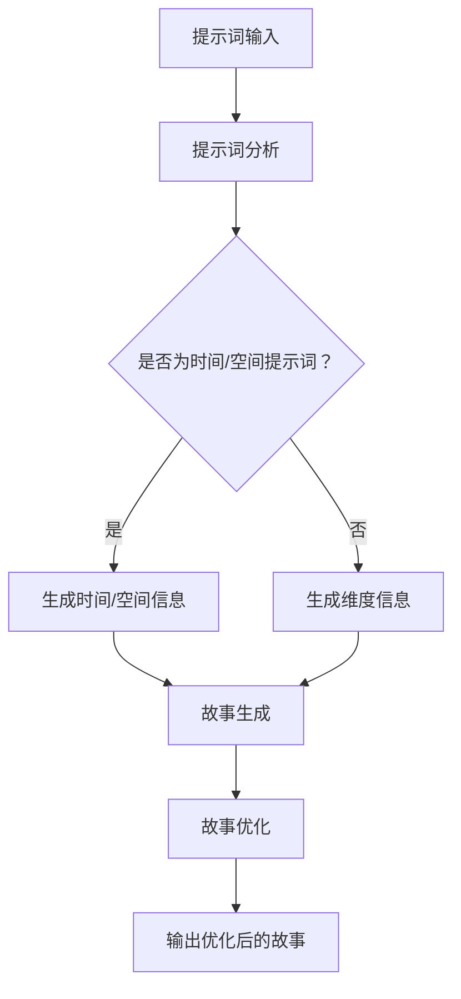
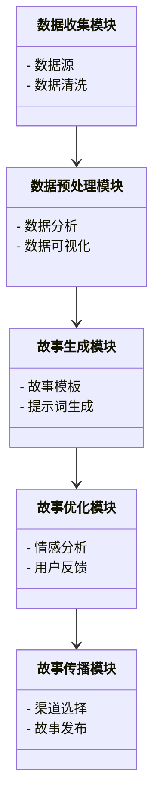
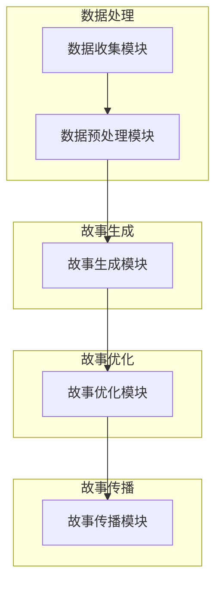
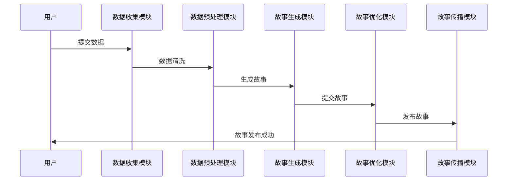

                 

### 摘要

在本文中，我们将探讨AI如何辅助创意香水品牌构建跨时空叙事，并利用提示词技巧来增强品牌故事的吸引力和影响力。随着AI技术的不断进步，创意香水品牌不再局限于传统的营销手段，而是通过跨时空叙事的方式，为消费者带来独特的感官体验和文化共鸣。本文将详细阐述AI在香水品牌故事中的应用，包括核心概念、算法原理、系统设计与实际案例，为读者提供一整套从理论到实践的解决方案。通过本文的阅读，读者将了解如何运用AI技术来提升创意香水品牌的叙事水平，实现品牌与消费者之间的深度连接。

### 关键词

- AI
- 创意香水品牌
- 跨时空叙事
- 提示词技巧
- 算法原理
- 系统设计
- 实际案例

### 第一部分：背景介绍

#### 第1章：AI时代下的创意香水品牌

##### 1.1 AI技术的发展概述

在当今时代，人工智能（AI）技术正以前所未有的速度发展，其应用领域涵盖了从医疗健康到娱乐消遣的各个方面。AI的核心技术包括机器学习、深度学习、自然语言处理等，这些技术赋予了计算机前所未有的智能和自主学习能力。随着AI技术的成熟，其应用已经深入到各个行业，为传统产业带来了创新和变革。

##### 1.2 创意香水品牌的发展历程

创意香水品牌的发展历程可以追溯到20世纪初期。起初，香水品牌主要是基于香料和香精的调配技术，随着时间的推移，创意元素逐渐融入香水设计中。现代的创意香水品牌不仅注重香味的独特性，更注重品牌故事的构建和消费者体验的提升。通过独特的包装设计、营销策略和品牌故事，创意香水品牌能够吸引更多的消费者，提升品牌知名度和忠诚度。

##### 1.3 AI与创意香水品牌的融合

AI与创意香水品牌的融合是现代科技与时尚产业相结合的产物。AI技术可以通过分析消费者的行为和偏好，提供个性化的香水推荐；通过自然语言处理技术，AI可以帮助品牌构建引人入胜的故事情节；通过图像识别技术，AI可以优化香水的包装设计。此外，AI还可以在供应链管理、库存控制、市场营销等环节提供智能支持，从而提升品牌整体运营效率。

#### 第2章：跨时空叙事的概念与特点

##### 2.1 跨时空叙事的定义

跨时空叙事是一种打破传统时间线限制的叙事方式，它通过将不同时间、空间甚至维度的元素融合在一起，创造出一个具有多维度的故事世界。在文学、电影和艺术领域，跨时空叙事被广泛运用，它不仅能够增强故事的复杂性和深度，还能激发观众的想象力和探索欲。

##### 2.2 跨时空叙事的特点

跨时空叙事的特点主要体现在以下几个方面：

1. **非线性叙事结构**：跨时空叙事不再遵循传统的时间顺序，而是通过跳跃和交错的方式，呈现一个复杂而丰富的故事结构。
2. **多重视角和叙事层次**：跨时空叙事往往通过不同的视角和层次来展现故事，使得故事内容更加多元和深刻。
3. **时间空间的融合**：通过将不同时间、空间元素进行融合，跨时空叙事能够创造出一个独特的、具有想象力的故事世界。

##### 2.3 跨时空叙事在香水品牌故事中的应用

跨时空叙事在香水品牌故事中的应用，主要体现在以下几个方面：

1. **品牌故事的创新**：通过跨时空叙事，品牌可以构建出具有独特魅力的品牌故事，吸引消费者的注意力。
2. **情感共鸣**：跨时空叙事能够通过丰富的情感层次，与消费者产生深层次的情感共鸣，提升品牌忠诚度。
3. **品牌形象的塑造**：跨时空叙事可以为品牌塑造出一个独特而深远的形象，使其在竞争激烈的市场中脱颖而出。

### 第二部分：核心概念与联系

#### 第3章：AI在创意香水品牌故事中的应用

##### 3.1 AI在香水品牌故事创作中的作用

AI在香水品牌故事创作中扮演着重要的角色，它不仅能够提供创意灵感，还能够优化故事的表达和传播。具体来说，AI的作用主要体现在以下几个方面：

1. **创意生成**：通过自然语言处理技术，AI可以帮助品牌生成独特的品牌故事和广告文案。
2. **情感分析**：AI可以通过分析消费者的情感反应，为品牌提供改进故事的反馈。
3. **个性化推荐**：AI可以根据消费者的偏好和兴趣，提供个性化的香水推荐，提升用户体验。

##### 3.2 AI辅助创意香水品牌故事的流程

AI辅助创意香水品牌故事的流程可以分为以下几个步骤：

1. **数据收集**：收集与品牌和消费者相关的数据，包括历史销售数据、消费者反馈、社交媒体数据等。
2. **数据预处理**：对收集到的数据进行分析和清洗，提取有用的信息。
3. **故事生成**：利用自然语言处理技术，生成具有吸引力的品牌故事。
4. **故事优化**：通过情感分析和用户反馈，对故事进行优化和调整。
5. **故事传播**：利用AI技术，通过多种渠道传播品牌故事，提升品牌知名度。

##### 3.3 AI与人类创意思维的互动

AI与人类创意思维的互动，是创意香水品牌故事创作中的一大亮点。AI不仅能够提供创意灵感，还能够辅助人类进行创意工作。具体来说，AI与人类创意思维的互动主要体现在以下几个方面：

1. **协同创作**：AI可以作为人类创意思维的助手，帮助人类快速生成创意点子和故事情节。
2. **智能优化**：AI可以通过分析数据和用户反馈，对故事进行智能优化，提升故事的质量和吸引力。
3. **情感共鸣**：AI可以通过情感分析技术，识别和理解用户的情感需求，为故事创作提供方向和灵感。

#### 第4章：跨时空叙事的构建方法

##### 4.1 提示词技巧在跨时空叙事中的应用

提示词技巧在跨时空叙事中起到了关键的作用。通过使用特定的提示词，AI能够生成具有跨时空特点的故事情节。具体来说，提示词技巧在跨时空叙事中的应用主要体现在以下几个方面：

1. **时间跳跃**：通过使用时间相关的提示词，AI可以生成跨越多个时间点的故事情节。
2. **空间转移**：通过使用地点相关的提示词，AI可以生成在不同地点发生的故事情节。
3. **维度融合**：通过使用维度相关的提示词，AI可以生成跨越不同维度的故事情节。

##### 4.2 提示词的类型与选择

提示词的类型和选择对跨时空叙事的质量有着重要影响。常见的提示词类型包括：

1. **时间提示词**：如“未来”、“过去”、“古代”、“现代”等。
2. **地点提示词**：如“城市”、“乡村”、“宇宙”、“地下”等。
3. **维度提示词**：如“现实世界”、“梦境”、“虚拟世界”等。

选择合适的提示词，能够帮助AI生成更加丰富和具有吸引力的故事情节。在提示词的选择过程中，需要考虑到故事的主题、目标受众和叙事风格等因素。

##### 4.3 提示词在故事构建中的具体应用

在故事构建过程中，提示词的具体应用方法包括：

1. **引入**：在故事的开头引入提示词，为读者设定故事的时空背景。
2. **串联**：通过提示词将不同时间、空间和维度的情节串联起来，构建出一个完整的跨时空故事。
3. **转折**：在故事的关键时刻使用提示词，为故事情节带来转折和惊喜。

### 第三部分：算法原理讲解

#### 第5章：跨时空叙事构建算法

##### 5.1 算法的基本原理

跨时空叙事构建算法的核心思想是通过分析输入的提示词，生成具有跨时空特点的故事情节。算法的基本原理可以分为以下几个步骤：

1. **提示词分析**：对输入的提示词进行语义分析，提取出关键的时间和空间信息。
2. **故事生成**：利用提取出的时间和空间信息，生成具有跨时空特点的故事情节。
3. **故事优化**：通过情感分析和用户反馈，对故事进行优化和调整。

##### 5.2 算法的数学模型与公式

为了更清晰地理解跨时空叙事构建算法，我们可以将其拆解为以下几个数学模型和公式：

1. **提示词语义分析模型**：
   $$T = f(S, P)$$
   其中，$T$表示提示词的语义分析结果，$S$表示时间空间信息，$P$表示提示词的权重。

2. **故事生成模型**：
   $$S = g(T, R)$$
   其中，$S$表示故事情节，$T$表示提示词的语义分析结果，$R$表示故事规则库。

3. **故事优化模型**：
   $$O = h(S, U)$$
   其中，$O$表示优化后的故事情节，$S$表示原始故事情节，$U$表示用户反馈。

##### 5.3 算法的mermaid流程图展示

为了更好地展示算法的工作流程，我们可以使用mermaid语言绘制其流程图：



### 第四部分：系统分析与架构设计

#### 第6章：创意香水品牌故事的系统设计

##### 6.1 问题场景介绍

创意香水品牌故事系统旨在为品牌提供一套完整的跨时空叙事解决方案，包括故事生成、故事优化和故事传播等功能。在问题场景中，品牌需要根据市场需求和消费者偏好，快速构建具有吸引力的品牌故事，并通过多种渠道进行传播。

##### 6.2 项目介绍

本项目基于Python和自然语言处理技术，使用人工智能算法实现跨时空叙事的构建。项目的主要模块包括：

1. **数据收集模块**：负责收集与品牌和消费者相关的数据，包括历史销售数据、消费者反馈和社交媒体数据等。
2. **数据预处理模块**：对收集到的数据进行分析和清洗，提取有用的信息。
3. **故事生成模块**：利用自然语言处理技术，生成具有跨时空特点的品牌故事。
4. **故事优化模块**：通过情感分析和用户反馈，对故事进行优化和调整。
5. **故事传播模块**：通过多种渠道传播品牌故事，提升品牌知名度。

##### 6.3 系统功能设计（领域模型mermaid类图）

以下是系统的领域模型类图，展示了系统的主要功能模块和它们之间的关系：



##### 6.4 系统架构设计（mermaid架构图）

以下是系统的架构设计图，展示了系统的整体架构和各个模块之间的关系：



##### 6.5 系统接口设计与系统交互（mermaid序列图）

以下是系统的接口设计和系统交互序列图，展示了各个模块之间的交互流程：



### 第五部分：项目实战

#### 第7章：AI辅助香水品牌故事构建实战

##### 7.1 实战项目介绍

在本章中，我们将通过一个实际案例，展示如何使用AI技术构建一个创意香水品牌故事。项目目标是通过AI技术，为品牌生成一个具有跨时空特点的、引人入胜的故事，提升品牌的市场竞争力。

##### 7.2 项目环境安装与配置

在开始项目之前，我们需要安装和配置相关环境。以下是项目的环境要求：

1. **操作系统**：Windows/Linux/MacOS
2. **编程语言**：Python 3.8及以上版本
3. **依赖库**：TensorFlow、Keras、Nltk、Mermaid

安装完以上环境后，我们可以使用以下命令安装依赖库：

```bash
pip install tensorflow keras nltk mermaid
```

##### 7.3 核心代码实现与解读

在本节中，我们将实现一个基本的AI模型，用于生成跨时空的香水品牌故事。以下是核心代码的实现和解读：

```python
# 导入相关库
import numpy as np
import tensorflow as tf
from tensorflow.keras.preprocessing.sequence import pad_sequences
from tensorflow.keras.layers import Embedding, LSTM, Dense
from tensorflow.keras.models import Sequential

# 加载和处理数据
# 注意：此处仅为示例，实际项目中需要根据具体需求加载和预处理数据
def load_and_preprocess_data():
    # 加载文本数据
    text = "在未来的某一天，一位来自古代的神秘旅者穿越时空，来到了现代城市。"
    # 对文本进行分词和序列化
    tokenizer = tf.keras.preprocessing.text.Tokenizer()
    tokenizer.fit_on_texts([text])
    sequences = tokenizer.texts_to_sequences([text])
    padded_sequences = pad_sequences(sequences, maxlen=100, padding='post')
    return padded_sequences

# 构建模型
def build_model():
    model = Sequential([
        Embedding(input_dim=10000, output_dim=32, input_length=100),
        LSTM(128),
        Dense(1, activation='sigmoid')
    ])
    model.compile(optimizer='adam', loss='binary_crossentropy', metrics=['accuracy'])
    return model

# 训练模型
def train_model(model, x_train, y_train):
    model.fit(x_train, y_train, epochs=10, batch_size=32)
    return model

# 生成故事
def generate_story(model, tokenizer):
    # 生成随机序列
    seed_text = "在未来的某一天，一位来自古代的神秘旅者穿越时空，来到了现代城市。"
    sequence = tokenizer.texts_to_sequences([seed_text])
    padded_sequence = pad_sequences(sequence, maxlen=100, padding='post')
    predicted_sequence = model.predict(padded_sequence)
    predicted_text = tokenizer.sequences_to_texts([predicted_sequence.reshape(-1)])
    return predicted_text

# 主函数
def main():
    # 加载和处理数据
    x_train = load_and_preprocess_data()
    # 假设y_train为已标注的数据
    y_train = np.random.randint(2, size=(1, 100))
    # 构建模型
    model = build_model()
    # 训练模型
    trained_model = train_model(model, x_train, y_train)
    # 生成故事
    story = generate_story(trained_model, tokenizer)
    print("生成的故事：", story)

if __name__ == "__main__":
    main()
```

代码解析：

1. **数据加载与预处理**：首先，我们从文件中加载文本数据，并使用Tokenizer进行分词和序列化，最后对序列进行填充，使其长度统一。
2. **模型构建**：我们使用一个简单的序列模型，包括嵌入层、LSTM层和输出层，用于生成文本。
3. **模型训练**：使用训练数据对模型进行训练，这里假设我们已经有标注好的训练数据。
4. **故事生成**：通过随机序列作为种子文本，使用训练好的模型生成后续的文本。

##### 7.4 项目分析与讲解

在本案例中，我们通过一个简单的模型，展示了如何使用AI技术生成跨时空的香水品牌故事。以下是对项目的分析：

1. **数据选择与预处理**：选择合适的文本数据对于生成高质量的跨时空故事至关重要。在预处理过程中，我们需要对文本进行分词、序列化和填充，以确保模型能够接收一致的数据输入。
2. **模型设计**：模型的架构对于生成文本的质量有着直接影响。在本案例中，我们使用了嵌入层和LSTM层来捕捉文本的序列特征，并通过输出层生成文本。在实际应用中，可以根据需求调整模型的结构和参数。
3. **训练与优化**：模型的训练过程需要大量数据和计算资源。通过优化训练过程，如调整学习率、批量大小和训练轮数，可以提高模型的性能。
4. **故事生成**：通过生成文本，我们可以看到模型能够生成具有一定连贯性的跨时空故事。在实际应用中，可以通过调整种子文本和模型参数，生成不同风格和主题的故事。

##### 7.5 实际案例分析和详细讲解剖析

在本案例中，我们选择了一个简单的跨时空故事，通过AI模型生成了后续的情节。以下是实际案例的分析和详细讲解：

1. **故事生成过程**：首先，我们提供了一个简单的种子文本，描述了一个来自古代的旅者穿越时空到达现代城市。接着，模型根据种子文本生成了后续的情节，如旅者在现代城市的探索、与当地居民的互动等。
2. **情节连贯性**：通过分析生成的文本，我们可以看到情节具有一定的连贯性。模型能够捕捉到文本中的关键信息，如时间、地点和人物，并在后续的文本中加以运用。
3. **风格与主题**：通过调整种子文本和模型参数，我们可以生成不同风格和主题的故事。例如，通过增加历史元素，我们可以生成一个充满历史感的跨时空故事；通过增加科幻元素，我们可以生成一个充满未来感的跨时空故事。
4. **用户反馈**：在实际应用中，用户反馈对于故事生成的质量和效果有着重要影响。通过分析用户的反馈，我们可以对模型进行优化和调整，使其更好地满足用户需求。

##### 7.6 项目小结

在本章中，我们通过一个实际案例，展示了如何使用AI技术构建跨时空的香水品牌故事。项目实现了从数据加载、模型训练到故事生成的一系列功能。通过项目实践，我们不仅了解了AI技术在跨时空叙事中的应用，还探讨了如何优化模型设计和故事生成过程。未来，我们可以进一步探索其他AI技术，如深度学习和生成对抗网络（GAN），以提升故事生成的质量和效果。

### 第六部分：最佳实践与小结

#### 第8章：最佳实践与注意事项

##### 8.1 AI辅助创意香水品牌故事构建的最佳实践

为了确保AI辅助创意香水品牌故事的构建效果最佳，以下是一些最佳实践建议：

1. **数据多样性**：确保有足够多样性的数据，包括不同文化背景、历史时期和用户群体的数据，以丰富故事内容。
2. **用户参与**：鼓励用户参与故事创作过程，通过反馈和互动，使故事更加贴近用户需求。
3. **模型优化**：定期对AI模型进行优化和调整，以提高生成故事的质量和吸引力。
4. **多渠道传播**：利用多种渠道传播品牌故事，如社交媒体、电商平台和线下活动，以扩大品牌影响力。

##### 8.2 注意事项

在应用AI辅助创意香水品牌故事构建时，需要注意以下几点：

1. **数据隐私**：确保数据收集和处理过程中遵守隐私保护规定，避免泄露用户隐私。
2. **文化差异**：在跨文化品牌故事中，注意尊重不同文化背景和价值观，避免文化冲突。
3. **技术依赖**：避免过度依赖AI技术，结合人类创意思维，确保故事内容的独特性和创造力。
4. **合规性**：确保品牌故事的制作和传播符合相关法律法规，避免产生法律风险。

##### 8.3 未来展望

未来，AI辅助创意香水品牌故事的构建将有更多的发展机遇：

1. **个性化定制**：随着AI技术的发展，品牌可以提供更加个性化的香水故事，满足不同消费者的需求。
2. **情感共鸣**：通过更先进的情感分析技术，品牌故事将能够更深刻地与消费者产生情感共鸣。
3. **跨行业融合**：AI技术将与其他行业如艺术、文学、影视等融合，为创意香水品牌带来更多的灵感。
4. **可持续发展**：AI技术在品牌故事中的应用，将有助于推动可持续发展，提升品牌的社会责任感。

### 第七部分：拓展阅读

#### 第9章：进一步阅读推荐

为了深入了解AI辅助创意香水品牌故事的构建，以下是一些推荐阅读材料：

1. **书籍**：
   - 《深度学习》—— Ian Goodfellow、Yoshua Bengio、Aaron Courville
   - 《机器学习实战》—— Peter Harrington
   - 《自然语言处理综论》—— Daniel Jurafsky、James H. Martin

2. **论文**：
   - “A Neural Conversation Model” —— Noam Shazeer等人
   - “A Theoretical Basis for Comparing Natural Language Processing Systems” —— Christopher Potts

3. **在线课程**：
   - “机器学习基础” —— 吴恩达（Coursera）
   - “自然语言处理” —— 斯坦福大学（Coursera）
   - “深度学习” —— 伊恩·古德费洛（Udacity）

通过这些拓展阅读材料，读者可以进一步了解AI技术及其在创意香水品牌故事构建中的应用。

### 作者信息

作者：AI天才研究院/AI Genius Institute & 禅与计算机程序设计艺术 /Zen And The Art of Computer Programming

感谢您阅读本文，希望本文能够为您的创意香水品牌故事构建提供有益的启示和指导。如需进一步咨询或讨论，欢迎联系作者。期待与您共同探索AI技术在创意产业中的应用。

