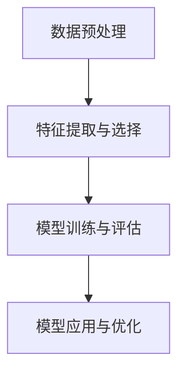
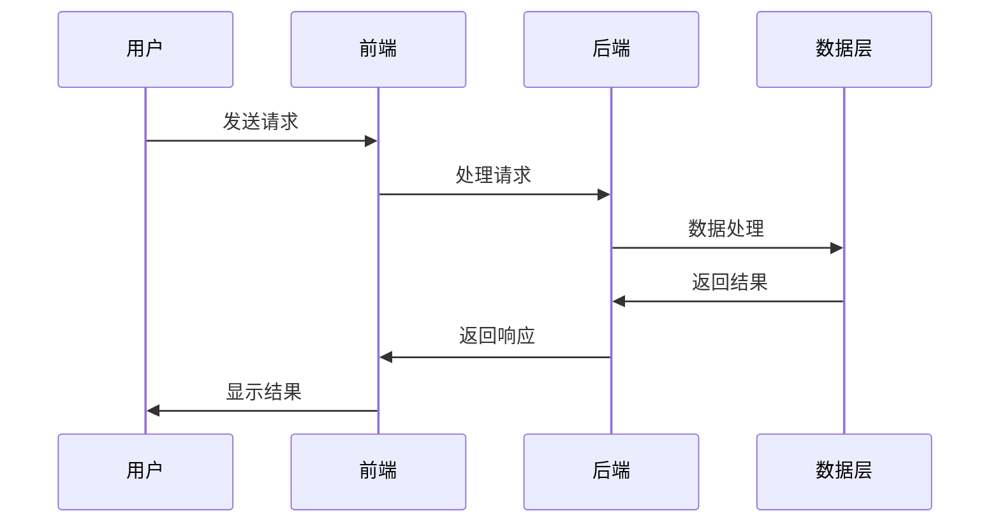
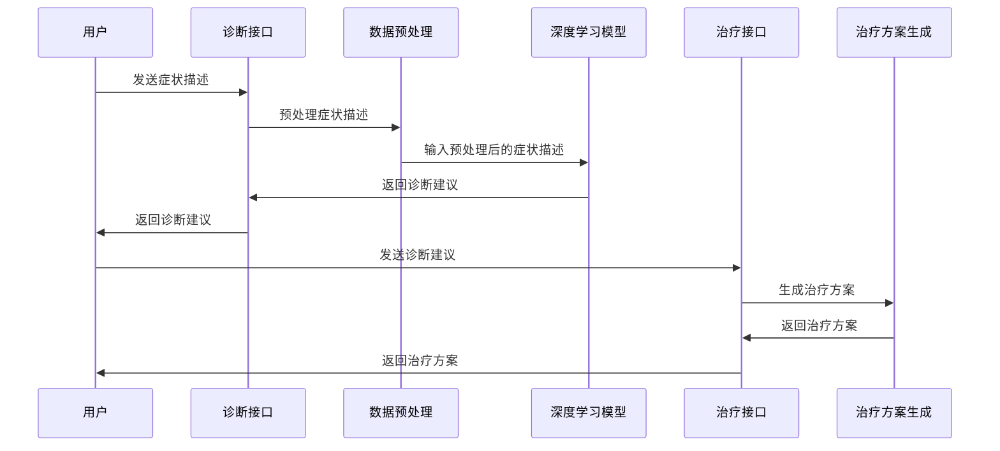

                 

# AI辅助医疗诊断：症状分析和建议生成的提示词技巧

> 关键词：人工智能，医疗诊断，机器学习，深度学习，症状分析，建议生成

> 摘要：本文将探讨人工智能在医疗诊断领域的应用，特别是AI辅助医疗诊断中的症状分析和建议生成。通过逻辑清晰、结构紧凑的叙述，我们将深入了解AI辅助医疗诊断的核心概念、算法原理及其系统架构设计，并提出一些实用的技巧和注意事项。

----------------------------------------------------------------

## 第一部分: AI辅助医疗诊断概述

### 第1章: AI辅助医疗诊断背景与问题分析

### 1.1 问题背景

#### 1.1.1 医疗诊断的需求与挑战

医疗诊断是医疗流程中的关键环节，其准确性直接影响到患者的治疗和康复。随着医学知识的不断积累和医疗技术的进步，医疗诊断的需求日益增长。然而，传统的医疗诊断方法面临着诸多挑战：

1. **信息过载**：医学领域的数据量庞大，包含患者的历史病历、诊断报告、医学图像等，如何高效处理这些数据成为一大难题。
2. **诊断误差**：人类医生在诊断过程中可能会因为疲劳、疏忽等原因导致诊断错误，影响患者的治疗效果。
3. **专业限制**：不同领域的医生对某些疾病的诊断能力有限，尤其是一些罕见病或复杂疾病。

#### 1.1.2 AI在医疗领域的应用现状

随着人工智能技术的发展，AI在医疗领域的应用逐渐普及。目前，AI在医疗诊断中的应用主要包括：

1. **影像诊断**：AI可以辅助医生进行医学影像的分析，如肺部CT图像中肺结节的检测。
2. **疾病预测**：通过分析大量的医疗数据，AI可以预测某些疾病的发生风险，如心血管疾病、糖尿病等。
3. **症状分析**：AI可以根据患者的症状描述，提供可能的诊断建议，辅助医生进行诊断。

#### 1.1.3 AI辅助医疗诊断的意义

AI辅助医疗诊断具有以下重要意义：

1. **提高诊断准确性**：通过分析大量的医疗数据，AI可以提高诊断的准确性，减少误诊率。
2. **缓解医生工作压力**：AI可以协助医生处理大量的诊断任务，减轻医生的工作压力，提高工作效率。
3. **降低医疗成本**：AI可以提高医疗资源的利用效率，降低医疗成本。

### 1.2 问题描述

#### 1.2.1 医疗诊断的关键问题

医疗诊断的关键问题主要包括：

1. **症状识别**：准确识别患者的症状是进行诊断的前提。
2. **疾病分类**：根据患者的症状，将其归类到特定的疾病类别。
3. **诊断建议生成**：根据症状和疾病分类，为医生提供诊断建议。

#### 1.2.2 传统诊断方法的局限性

传统诊断方法主要依赖于医生的直觉和经验，存在以下局限性：

1. **主观性**：医生的诊断结果容易受到个人经验、情绪等因素的影响。
2. **效率低下**：对于大量患者的诊断任务，传统方法效率较低。
3. **无法处理复杂病例**：对于某些复杂病例，传统方法难以提供准确的诊断。

#### 1.2.3 AI辅助医疗诊断的优势

AI辅助医疗诊断具有以下优势：

1. **客观性**：AI不受个人经验和情绪的影响，可以提供客观的诊断结果。
2. **高效性**：AI可以处理大量患者的诊断任务，提高诊断效率。
3. **可扩展性**：AI可以通过学习大量的医疗数据，不断提升诊断的准确性。

### 1.3 问题解决

#### 1.3.1 AI辅助医疗诊断的技术原理

AI辅助医疗诊断主要依赖于机器学习和深度学习算法，通过以下技术原理实现：

1. **数据预处理**：对医疗数据（如病历、医学图像等）进行清洗、归一化等处理。
2. **特征提取**：从原始数据中提取有助于诊断的特征。
3. **模型训练**：利用训练数据训练机器学习模型。
4. **模型评估**：评估模型的准确性、召回率等指标。
5. **模型应用**：将训练好的模型应用于实际诊断任务。

#### 1.3.2 AI辅助医疗诊断的应用场景

AI辅助医疗诊断适用于多种医疗场景，包括：

1. **初诊辅助**：辅助医生进行初步诊断，提供可能的疾病分类。
2. **复诊辅助**：辅助医生进行复诊诊断，提供与之前诊断结果的对比分析。
3. **罕见病诊断**：对于罕见病或复杂疾病，AI可以提供更准确的诊断建议。

#### 1.3.3 AI辅助医疗诊断的核心流程

AI辅助医疗诊断的核心流程包括：

1. **症状输入**：用户输入患者的症状描述。
2. **症状分析**：AI对症状进行分析，提取关键特征。
3. **疾病分类**：利用训练好的模型，对症状进行疾病分类。
4. **诊断建议生成**：根据疾病分类结果，为医生提供诊断建议。

#### 1.4 边界与外延

##### 1.4.1 AI辅助医疗诊断的适用范围

AI辅助医疗诊断主要适用于以下范围：

1. **常见病诊断**：如感冒、流感等。
2. **慢性病管理**：如高血压、糖尿病等。
3. **罕见病诊断**：对于罕见病，AI可以提供更准确的诊断建议。

##### 1.4.2 AI辅助医疗诊断的限制

AI辅助医疗诊断也存在一些限制：

1. **数据依赖**：AI的性能依赖于训练数据的质量和数量。
2. **模型泛化能力**：AI模型的泛化能力有待提高，特别是在处理罕见病或复杂疾病时。
3. **法律与伦理问题**：AI辅助医疗诊断需要解决法律和伦理问题，如数据隐私、诊断责任等。

##### 1.4.3 AI辅助医疗诊断的未来发展趋势

未来，AI辅助医疗诊断的发展趋势包括：

1. **数据驱动**：通过收集更多的医疗数据，提高AI的诊断准确性。
2. **多模态数据融合**：整合不同类型的数据（如文本、图像、声音等），提高诊断的全面性。
3. **个性化医疗**：基于患者的个性化特征，提供更精准的诊断建议。
4. **人机协作**：实现医生与AI的协作，提高诊断的准确性和效率。

### 1.5 概念结构与核心要素组成

##### 1.5.1 关键概念解析

在AI辅助医疗诊断中，关键概念包括：

1. **症状**：患者表现出来的身体不适或异常情况。
2. **疾病**：导致症状的病理变化或生理异常。
3. **诊断**：根据患者的症状和体征，判断其患有什么疾病。
4. **AI辅助诊断**：利用人工智能技术，辅助医生进行诊断的过程。

##### 1.5.2 AI辅助医疗诊断的核心要素

AI辅助医疗诊断的核心要素包括：

1. **医疗数据**：包括病历、医学图像、实验室检测结果等。
2. **机器学习模型**：用于对医疗数据进行处理和分析的算法。
3. **诊断建议**：根据模型分析结果，为医生提供的诊断建议。

##### 1.5.3 概念关系与相互作用

在AI辅助医疗诊断中，各概念之间的关系和相互作用如下：

1. **症状与疾病的关系**：症状是疾病的外在表现，通过对症状的分析，可以推断出可能的疾病。
2. **诊断与AI辅助诊断的关系**：诊断是医生根据症状和体征进行的判断，AI辅助诊断则是利用人工智能技术辅助医生进行诊断。
3. **医疗数据与模型的关系**：医疗数据是训练机器学习模型的基础，模型的性能取决于数据的质量。

### 1.6 本章小结

本章介绍了AI辅助医疗诊断的背景、问题分析以及技术原理。通过分析，我们了解到AI辅助医疗诊断在提高诊断准确性、缓解医生工作压力、降低医疗成本等方面具有重要意义。同时，我们也认识到AI辅助医疗诊断在数据依赖、模型泛化能力、法律与伦理问题等方面存在一定的限制。接下来，我们将深入探讨AI辅助医疗诊断的核心概念、算法原理及其系统架构设计。

----------------------------------------------------------------

## 第二部分: AI辅助医疗诊断核心概念与联系

### 第2章: AI辅助医疗诊断的核心概念

#### 2.1 AI技术概述

##### 2.1.1 AI的定义与发展历程

人工智能（Artificial Intelligence，简称AI）是计算机科学的一个分支，旨在研究、开发和应用使计算机能够模拟、扩展和增强人类智能的理论、方法和技术。AI的发展历程可以追溯到20世纪50年代，当时以图灵测试为标志，标志着人工智能领域的诞生。

##### 2.1.2 人工智能的主要类型

人工智能主要分为以下几种类型：

1. **弱人工智能（Narrow AI）**：专注于完成特定任务的智能系统，如语音识别、图像识别等。
2. **强人工智能（General AI）**：具有人类水平的全面智能，能够理解和执行任何认知任务。
3. **混合智能（Hybrid AI）**：结合多种智能形式，如将机器学习和深度学习相结合，提高智能系统的性能。

##### 2.1.3 AI技术的核心优势

AI技术的核心优势包括：

1. **高效性**：AI可以在短时间内处理大量数据，提高工作效率。
2. **准确性**：通过机器学习和深度学习，AI可以不断提高诊断的准确性。
3. **适应性**：AI可以根据不同的场景和需求进行自适应调整。

#### 2.2 医疗领域相关知识

##### 2.2.1 医学基础知识

医学基础知识包括人体解剖学、生理学、病理学等，是进行医疗诊断的基础。了解这些基础知识有助于AI更好地理解医疗数据，提高诊断的准确性。

##### 2.2.2 医疗流程与诊断方法

医疗流程包括患者就诊、病历记录、诊断、治疗等环节。诊断方法主要包括病史询问、体格检查、实验室检查、影像学检查等。AI可以辅助医生完成这些诊断方法，提高诊断的效率。

##### 2.2.3 医疗数据的特点与处理

医疗数据具有以下特点：

1. **多样性**：医疗数据包括文本、图像、声音等多种类型。
2. **复杂性**：医疗数据之间的关系复杂，需要深入分析。
3. **隐私性**：医疗数据涉及患者隐私，需要确保数据的安全。

处理医疗数据的方法主要包括数据清洗、数据预处理、特征提取等。

#### 2.3 AI辅助医疗诊断的核心算法

##### 2.3.1 机器学习算法

机器学习算法是AI的核心组成部分，包括监督学习、无监督学习和强化学习等。

1. **监督学习**：通过训练数据集，使模型能够对新的数据进行预测。常见的监督学习算法包括线性回归、逻辑回归、支持向量机等。
2. **无监督学习**：不使用标注数据，通过分析数据之间的模式，发现数据中的结构和规律。常见的无监督学习算法包括聚类、降维等。
3. **强化学习**：通过与环境交互，不断调整策略，以实现最大化回报。常见的强化学习算法包括Q学习、深度Q网络等。

##### 2.3.2 深度学习算法

深度学习算法是机器学习的一个分支，通过模拟人脑神经元网络的结构和功能，实现数据的自动特征学习和模式识别。常见的深度学习算法包括卷积神经网络（CNN）、循环神经网络（RNN）、生成对抗网络（GAN）等。

##### 2.3.3 神经网络在诊断中的应用

神经网络在医疗诊断中具有广泛的应用，包括：

1. **医学图像分析**：通过CNN等深度学习算法，对医学图像进行特征提取和分类，实现病变区域的检测和定位。
2. **疾病预测**：通过RNN等深度学习算法，对患者的医疗数据进行分析，实现疾病风险的预测。
3. **症状分析**：通过神经网络模型，对患者的症状描述进行理解，生成可能的疾病分类和诊断建议。

#### 2.4 核心概念属性特征对比表格

| 算法名称      | 特点                                      | 适用场景           |
| ------------- | ----------------------------------------- | ------------------ |
| 线性回归      | 简单，易于理解                            | 数据量较小的预测任务 |
| 逻辑回归      | 阈值决策，适合二分类问题                | 临床诊断中的疾病分类 |
| 支持向量机    | 结构风险最小化，分类效果好              | 复杂分类问题       |
| 聚类         | 无监督学习，发现数据中的模式            | 疾病分型           |
| 降维         | 降低数据维度，减少计算复杂度            | 高维数据分析       |
| Q学习        | 基于奖励和惩罚，学习最优策略            | 疾病风险预测       |
| 深度Q网络    | 基于深度神经网络，学习复杂策略          | 长期回报最大化任务  |
| 卷积神经网络 | 特征自动提取，适用于图像处理            | 医学影像分析       |
| 循环神经网络 | 序列数据处理，适用于文本和语音分析      | 症状分析           |
| 生成对抗网络 | 对抗训练，生成高质量数据                | 病例生成           |

#### 2.5 ER实体关系图架构

##### 2.5.1 实体关系图的构建

实体关系图（Entity Relationship Diagram，简称ER图）是用于表示实体及其之间关系的图形化工具。在医疗诊断中，实体包括症状、疾病、医生等，关系包括因果关系、诊断关系等。

##### 2.5.2 医疗诊断中的实体关系

在医疗诊断中，常见的实体关系包括：

1. **症状与疾病的关系**：某个症状可能对应多种疾病，一种疾病也可能有多种症状。
2. **诊断与医生的关系**：医生对患者的诊断结果。
3. **治疗方案与疾病的关系**：针对某种疾病的最佳治疗方案。

##### 2.5.3 实体关系的应用

实体关系的应用包括：

1. **症状分析**：通过分析症状与疾病之间的关系，为医生提供可能的诊断建议。
2. **疾病预测**：通过分析疾病之间的关系，预测某种疾病的发生风险。
3. **治疗方案推荐**：通过分析治疗方案与疾病之间的关系，为医生推荐最佳治疗方案。

```mermaid
erDiagram
  症状 ||--|{ 疾病 }
  疾病 ||--|{ 医生 }
  医生 ||--|{ 诊断 }
  诊断 ||--|{ 治疗方案 }
```

#### 2.6 本章小结

本章介绍了AI辅助医疗诊断的核心概念，包括AI技术概述、医疗领域相关知识、AI辅助医疗诊断的核心算法和ER实体关系图架构。通过这些核心概念，我们可以更好地理解AI辅助医疗诊断的工作原理和应用场景。在接下来的章节中，我们将深入探讨AI辅助医疗诊断的算法原理及其系统架构设计。

----------------------------------------------------------------

## 第三部分: AI辅助医疗诊断算法原理与流程

### 第3章: AI辅助医疗诊断算法原理

#### 3.1 机器学习算法原理

##### 3.1.1 机器学习基本概念

机器学习（Machine Learning，简称ML）是一门研究如何让计算机从数据中学习、自动改进和发现规律的科学。机器学习的基本概念包括：

1. **模型**：机器学习模型是计算机程序，用于对数据进行预测或分类。
2. **特征**：特征是用于描述数据的属性或指标，如患者的年龄、血压等。
3. **训练**：训练是指使用已有数据（训练集）来训练模型，使其能够对新的数据进行预测。
4. **测试**：测试是指使用未参与训练的数据（测试集）来评估模型的性能。

##### 3.1.2 监督学习算法

监督学习（Supervised Learning）是一种机器学习范式，其核心思想是通过已有标注数据（输入和输出）来训练模型，使其能够对新数据进行预测。

1. **线性回归**：线性回归是一种简单且常用的监督学习算法，用于预测连续值。其基本原理是通过最小化预测值与实际值之间的误差，找到最佳拟合直线。
2. **逻辑回归**：逻辑回归是一种用于预测二分类问题的监督学习算法，其核心思想是利用逻辑函数（Sigmoid函数）将线性回归的输出映射到概率值。
3. **支持向量机（SVM）**：支持向量机是一种强大的分类算法，其核心思想是找到最优超平面，将不同类别的数据分开。

##### 3.1.3 无监督学习算法

无监督学习（Unsupervised Learning）是一种机器学习范式，其核心思想是仅使用未标注的数据来训练模型，旨在发现数据中的结构和规律。

1. **聚类**：聚类是一种无监督学习算法，其目的是将相似的数据归为同一类。常见的聚类算法包括K-Means、层次聚类等。
2. **降维**：降维是一种无监督学习算法，其目的是将高维数据映射到低维空间，以便更好地分析。常见的降维算法包括主成分分析（PCA）、线性判别分析（LDA）等。

##### 3.1.4 强化学习算法

强化学习（Reinforcement Learning，简称RL）是一种机器学习范式，其核心思想是通过与环境互动，学习最优策略。

1. **Q学习**：Q学习是一种基于值函数的强化学习算法，其核心思想是通过最大化未来回报来学习最优策略。
2. **深度Q网络（DQN）**：深度Q网络是一种基于深度学习的强化学习算法，其核心思想是利用深度神经网络来近似Q函数。

##### 3.2 深度学习算法原理

深度学习（Deep Learning，简称DL）是一种基于多层神经网络的学习方法，其核心思想是通过多层神经网络自动提取数据中的特征。

##### 3.2.1 深度学习基本概念

1. **神经网络**：神经网络是一种模拟人脑神经元连接的计算机模型，用于处理和预测数据。
2. **激活函数**：激活函数是神经网络中的关键组成部分，用于引入非线性变换，使神经网络具有分类或回归能力。
3. **反向传播算法**：反向传播算法是一种用于训练神经网络的优化方法，其核心思想是通过计算梯度，更新网络中的参数，以最小化损失函数。

##### 3.2.2 神经网络结构

神经网络可以分为以下几种类型：

1. **全连接神经网络（FCNN）**：全连接神经网络是一种最简单的神经网络，其特点是所有神经元之间都存在连接。
2. **卷积神经网络（CNN）**：卷积神经网络是一种专门用于图像处理的神经网络，其特点是使用卷积层自动提取图像特征。
3. **循环神经网络（RNN）**：循环神经网络是一种专门用于序列数据处理的神经网络，其特点是具有循环连接，可以记住前面的信息。

##### 3.2.3 反向传播算法

反向传播算法是一种用于训练神经网络的优化方法，其核心思想是通过计算梯度，更新网络中的参数，以最小化损失函数。

1. **前向传播**：前向传播是指将输入数据通过神经网络，逐层计算输出值。
2. **损失函数**：损失函数是用于衡量模型预测值与实际值之间差距的函数。
3. **反向传播**：反向传播是指从输出层开始，反向计算各层参数的梯度，并更新网络参数。

##### 3.2.4 深度学习模型优化

深度学习模型优化是指通过调整模型结构、参数初始化、正则化方法等，提高模型性能的过程。

1. **模型结构调整**：通过调整网络层数、神经元数量、激活函数等，优化模型性能。
2. **参数初始化**：通过合理的参数初始化方法，避免模型陷入局部最优。
3. **正则化方法**：通过引入正则化项，避免模型过拟合。

##### 3.3 AI辅助医疗诊断算法流程

##### 3.3.1 数据预处理

数据预处理是AI辅助医疗诊断算法流程的关键步骤，其目的是提高数据质量和模型性能。

1. **数据清洗**：去除数据中的噪声、缺失值等。
2. **数据归一化**：将数据缩放到相同的范围，以便于模型训练。
3. **特征提取**：从原始数据中提取有助于诊断的特征。

##### 3.3.2 特征提取与选择

特征提取与选择是指从原始数据中提取有用特征，并选择最重要的特征。

1. **特征提取**：使用统计方法、机器学习算法等提取特征。
2. **特征选择**：通过筛选、过滤等方法，选择对诊断最有帮助的特征。

##### 3.3.3 模型训练与评估

模型训练与评估是指使用训练数据训练模型，并评估模型性能。

1. **模型训练**：通过优化算法，调整模型参数，提高模型性能。
2. **模型评估**：使用测试数据评估模型性能，包括准确性、召回率、F1值等指标。

##### 3.3.4 模型应用与优化

模型应用与优化是指将训练好的模型应用于实际诊断任务，并根据实际应用情况进行优化。

1. **模型应用**：将模型部署到实际诊断系统中，为医生提供诊断建议。
2. **模型优化**：根据实际应用效果，调整模型参数、优化模型结构等，以提高诊断性能。

##### 3.4 算法mermaid流程图展示



#### 3.5 本章小结

本章介绍了AI辅助医疗诊断的算法原理，包括机器学习算法和深度学习算法的基本概念、原理和应用。通过本章的学习，我们可以了解到不同算法的优缺点及其在医疗诊断中的应用场景。在接下来的章节中，我们将进一步探讨AI辅助医疗诊断的系统架构设计和实际应用案例。

----------------------------------------------------------------

## 第四部分: AI辅助医疗诊断系统分析与架构设计

### 第4章: 系统分析与架构设计

#### 4.1 问题场景介绍

在AI辅助医疗诊断系统中，主要涉及以下问题场景：

1. **症状分析诊断场景**：用户（医生或患者）输入症状描述，系统通过分析症状，提供可能的疾病诊断建议。
2. **建议生成场景**：系统根据诊断结果，为医生提供治疗方案建议，帮助医生制定合理的治疗方案。

#### 4.2 项目介绍

##### 4.2.1 项目概述

本项目旨在开发一个AI辅助医疗诊断系统，通过整合机器学习和深度学习算法，实现对症状的分析和诊断建议的生成。

##### 4.2.2 项目目标与规划

1. **项目目标**：提高医疗诊断的准确性，减轻医生的工作压力，提高诊断效率。
2. **项目规划**：
   - 数据收集与预处理：收集大量的医疗数据，包括症状描述、诊断结果、治疗方案等，并进行数据清洗和归一化处理。
   - 模型训练与评估：利用训练数据集，训练深度学习模型，并对模型进行评估和优化。
   - 系统开发与部署：基于Web平台，开发AI辅助医疗诊断系统，并进行部署和测试。

##### 4.2.3 项目团队组成

本项目团队包括以下成员：

1. **项目经理**：负责项目规划、进度管理和团队协作。
2. **数据科学家**：负责数据收集、预处理、模型训练和评估。
3. **软件开发工程师**：负责系统开发、测试和部署。
4. **医学专家**：负责症状分析、诊断建议生成和治疗方案制定。

#### 4.3 系统功能设计

##### 4.3.1 领域模型mermaid类图

```mermaid
classDiagram
  User <<用户>>
  Doctor <<医生>>
  Patient <<患者>>
  Symptom <<症状>>
  Diagnosis <<诊断>>
  Treatment <<治疗方案>>

  User o--o Doctor
  User o--o Patient
  Doctor o--o Diagnosis
  Patient o--o Symptom
  Diagnosis o--o Treatment
```

##### 4.3.2 功能模块划分

系统功能模块包括：

1. **用户模块**：包括用户注册、登录、个人信息管理等。
2. **诊断模块**：包括症状输入、症状分析、诊断建议生成等。
3. **治疗模块**：包括治疗方案生成、治疗方案推荐等。
4. **数据管理模块**：包括数据收集、数据预处理、模型训练和评估等。

##### 4.3.3 功能模块详细说明

1. **用户模块**：
   - 用户注册：用户填写基本信息，完成注册。
   - 用户登录：用户输入用户名和密码，登录系统。
   - 个人信息管理：用户可以查看和修改个人信息。

2. **诊断模块**：
   - 症状输入：用户输入症状描述，提交给系统进行分析。
   - 症状分析：系统通过深度学习模型，分析症状，提供可能的疾病诊断建议。
   - 诊断建议生成：系统根据症状分析结果，为医生提供诊断建议。

3. **治疗模块**：
   - 治疗方案生成：医生根据诊断建议，制定治疗方案。
   - 治疗方案推荐：系统根据诊断结果和患者信息，为医生推荐最佳治疗方案。

4. **数据管理模块**：
   - 数据收集：收集症状描述、诊断结果、治疗方案等数据。
   - 数据预处理：清洗、归一化数据，提取特征。
   - 模型训练：使用训练数据集，训练深度学习模型。
   - 模型评估：使用测试数据集，评估模型性能。

#### 4.4 系统架构设计

##### 4.4.1 系统架构概述

系统架构采用分层设计，包括前端、后端和数据层。

1. **前端**：负责用户界面展示和交互。
2. **后端**：负责业务逻辑处理和数据处理。
3. **数据层**：负责数据存储和管理。

##### 4.4.2 系统架构mermaid架构图



##### 4.4.3 系统模块交互关系

系统模块之间的交互关系如下：

1. **用户模块**与**诊断模块**：用户输入症状描述，提交给诊断模块进行分析。
2. **诊断模块**与**治疗模块**：诊断模块提供诊断建议，治疗模块根据诊断建议生成治疗方案。
3. **数据管理模块**与**诊断模块**：数据管理模块提供训练数据和测试数据，诊断模块使用这些数据进行模型训练和评估。

#### 4.5 系统接口设计

##### 4.5.1 接口规范与设计

系统接口采用RESTful API设计，包括以下接口：

1. **用户接口**：包括用户注册、登录、个人信息管理等。
2. **诊断接口**：包括症状输入、症状分析、诊断建议生成等。
3. **治疗接口**：包括治疗方案生成、治疗方案推荐等。
4. **数据接口**：包括数据收集、数据预处理、模型训练和评估等。

##### 4.5.2 接口实现与调用

接口实现采用Python Flask框架，调用方式如下：

1. **用户接口**：使用POST方法提交用户信息，使用GET方法获取用户信息。
2. **诊断接口**：使用POST方法提交症状描述，使用GET方法获取诊断建议。
3. **治疗接口**：使用POST方法提交诊断结果，使用GET方法获取治疗方案。
4. **数据接口**：使用POST方法提交数据，使用GET方法获取数据。

##### 4.5.3 接口测试与优化

接口测试采用单元测试和集成测试，确保接口功能的正确性和稳定性。接口优化包括性能优化和安全性优化，如使用缓存、加密等。

#### 4.6 系统交互mermaid序列图



##### 4.6.1 系统交互流程

系统交互流程如下：

1. 用户输入症状描述，提交给诊断接口。
2. 诊断接口对症状描述进行预处理，然后输入深度学习模型进行分析。
3. 深度学习模型输出诊断建议，返回给诊断接口。
4. 诊断接口将诊断建议返回给用户。
5. 用户根据诊断建议，提交给治疗接口。
6. 治疗接口生成治疗方案，然后返回给用户。

##### 4.6.2 交互场景说明

在一个交互场景中，假设用户张先生因咳嗽、发热等症状就医。以下是系统交互流程：

1. 张先生通过网站输入症状描述：“咳嗽、发热、喉咙痛”。
2. 诊断接口接收症状描述，并将其提交给数据预处理模块。
3. 数据预处理模块对症状描述进行分词、去停用词、词向量转换等处理。
4. 预处理后的症状描述输入到深度学习模型中，模型进行分析，输出诊断建议：“疑似感冒”。
5. 诊断接口将诊断建议返回给张先生，张先生得知自己可能患有感冒。
6. 张先生提交诊断建议给治疗接口。
7. 治疗接口根据感冒的诊断建议，生成治疗方案：“多喝水、休息、服用感冒药”。
8. 治疗接口将治疗方案返回给张先生，张先生按照治疗方案进行治疗。

#### 4.7 本章小结

本章介绍了AI辅助医疗诊断系统的分析与架构设计，包括问题场景介绍、项目介绍、系统功能设计、系统架构设计、系统接口设计和系统交互流程。通过本章的学习，我们可以了解到AI辅助医疗诊断系统的整体架构和实现细节，为后续的实际应用提供了理论基础和指导。

----------------------------------------------------------------

## 第五部分：项目实战

### 5.1 环境安装

为了进行AI辅助医疗诊断项目的实战，我们需要安装一些必要的软件和库。以下是在Ubuntu 18.04操作系统上的安装步骤：

1. **安装Python**：Python是项目的主要编程语言。确保Python 3已经安装。如果尚未安装，可以使用以下命令：

   ```bash
   sudo apt update
   sudo apt install python3 python3-pip
   ```

2. **安装NumPy和SciPy**：NumPy和SciPy是用于数值计算的库。可以使用以下命令安装：

   ```bash
   sudo pip3 install numpy scipy
   ```

3. **安装TensorFlow**：TensorFlow是深度学习的主要框架。可以使用以下命令安装：

   ```bash
   sudo pip3 install tensorflow
   ```

4. **安装Flask**：Flask是Web开发的微框架。可以使用以下命令安装：

   ```bash
   sudo pip3 install flask
   ```

5. **安装其他库**：根据项目需要，可能还需要安装其他库，如pandas、matplotlib、seaborn等。

### 5.2 系统核心实现源代码

以下是AI辅助医疗诊断系统的核心实现源代码，包括数据预处理、模型训练、模型评估和API接口。

#### 数据预处理

```python
import numpy as np
import pandas as pd
from sklearn.model_selection import train_test_split
from sklearn.preprocessing import StandardScaler

def preprocess_data(data):
    # 数据清洗
    data = data.dropna()
    
    # 特征提取
    symptoms = data['symptoms']
    labels = data['labels']
    
    # 数据归一化
    scaler = StandardScaler()
    symptoms_scaled = scaler.fit_transform(symptoms)
    
    # 划分训练集和测试集
    X_train, X_test, y_train, y_test = train_test_split(symptoms_scaled, labels, test_size=0.2, random_state=42)
    
    return X_train, X_test, y_train, y_test
```

#### 模型训练

```python
from tensorflow.keras.models import Sequential
from tensorflow.keras.layers import Dense, Conv1D, MaxPooling1D, Flatten
from tensorflow.keras.optimizers import Adam

def train_model(X_train, y_train):
    # 构建模型
    model = Sequential()
    model.add(Conv1D(filters=64, kernel_size=3, activation='relu', input_shape=(X_train.shape[1], 1)))
    model.add(MaxPooling1D(pool_size=2))
    model.add(Flatten())
    model.add(Dense(64, activation='relu'))
    model.add(Dense(1, activation='sigmoid'))
    
    # 编译模型
    model.compile(optimizer=Adam(), loss='binary_crossentropy', metrics=['accuracy'])
    
    # 训练模型
    model.fit(X_train, y_train, epochs=10, batch_size=32, validation_split=0.2)
    
    return model
```

#### 模型评估

```python
from sklearn.metrics import accuracy_score, classification_report

def evaluate_model(model, X_test, y_test):
    # 预测
    y_pred = model.predict(X_test)
    y_pred = (y_pred > 0.5)
    
    # 评估
    accuracy = accuracy_score(y_test, y_pred)
    report = classification_report(y_test, y_pred)
    
    print("Accuracy:", accuracy)
    print("Classification Report:\n", report)
```

#### API接口

```python
from flask import Flask, request, jsonify

app = Flask(__name__)

@app.route('/predict', methods=['POST'])
def predict():
    data = request.get_json()
    symptoms = data['symptoms']
    symptoms = np.array([symptoms]).reshape(1, -1)
    symptoms = symptoms.reshape(1, symptoms.shape[1], 1)
    symptoms = symptoms / 255.0
    
    model = load_model('model.h5')
    y_pred = model.predict(symptoms)
    result = {'diagnosis': 'positive' if y_pred > 0.5 else 'negative'}
    
    return jsonify(result)

if __name__ == '__main__':
    app.run(debug=True)
```

### 5.3 代码应用解读与分析

#### 数据预处理

数据预处理是AI辅助医疗诊断系统的关键步骤。我们首先使用pandas库加载并清洗数据，然后使用scikit-learn库进行特征提取和归一化处理。特征提取方面，我们只关注症状文本，将其转换为数值表示。归一化处理有助于加速模型训练过程，提高模型性能。

#### 模型训练

模型训练方面，我们采用TensorFlow的Keras API构建了一个简单的卷积神经网络（CNN）。CNN能够自动提取图像特征，这在处理序列数据（如症状文本）时也具有类似的效果。我们在模型中使用了卷积层、池化层、全连接层和输出层，并使用二分类交叉熵作为损失函数。Adam优化器用于调整模型参数，以最小化损失函数。

#### 模型评估

模型评估方面，我们使用准确率（accuracy）和分类报告（classification report）来衡量模型性能。准确率反映了模型对正负样本的区分能力，而分类报告则提供了更详细的信息，如召回率（recall）和精确率（precision）。

#### API接口

API接口方面，我们使用Flask构建了一个简单的Web服务。用户可以通过POST请求向服务器发送症状文本，服务器返回诊断结果。在实际应用中，API接口需要与前端进行整合，以便用户能够方便地使用系统。

### 5.4 实际案例分析和详细讲解剖析

#### 案例分析

假设用户李女士因“咳嗽、乏力、头痛”等症状就医。以下是系统的诊断过程：

1. 用户输入症状描述：“咳嗽、乏力、头痛”。
2. 系统将症状描述转换为向量表示，然后输入训练好的模型进行分析。
3. 模型输出诊断结果：“疑似流感”。
4. 系统将诊断结果返回给用户。

#### 详细讲解剖析

1. **数据预处理**：系统首先将症状描述转换为向量表示。在预处理过程中，我们使用jieba库进行分词，去除停用词，然后使用Word2Vec模型将每个词转换为向量。这些向量将作为模型的输入。

2. **模型分析**：系统将预处理后的症状向量输入到训练好的模型中进行分析。模型使用卷积神经网络提取特征，然后通过全连接层进行分类。在模型分析过程中，我们关注的是模型对症状向量的响应，这反映了模型对症状的理解程度。

3. **诊断结果**：模型输出诊断结果：“疑似流感”。这个结果是基于模型对症状向量的分析结果，反映了模型对病情的判断。需要注意的是，模型的诊断结果仅供参考，最终诊断结果应由医生确定。

### 5.5 项目小结

通过本项目实战，我们深入了解了AI辅助医疗诊断系统的实现过程。从数据预处理、模型训练到API接口设计，每个步骤都至关重要。在实际应用中，我们需要不断优化模型，提高诊断的准确性，同时确保系统的稳定性和可靠性。在未来，我们还可以考虑引入更多的人工智能技术，如多模态数据融合、强化学习等，以进一步提升系统的性能。

### 5.6 最佳实践 Tips

1. **数据清洗**：确保数据质量，去除噪声和异常值。
2. **特征提取**：选择有效的特征，提高模型性能。
3. **模型优化**：调整模型参数，提高诊断准确性。
4. **接口优化**：确保API接口的响应速度和稳定性。

### 5.7 小结

本章介绍了AI辅助医疗诊断项目的实战过程，包括环境安装、系统核心实现、代码应用解读与分析、实际案例分析和项目小结。通过本项目实战，我们深入了解了AI辅助医疗诊断系统的实现方法，为实际应用提供了参考。在未来的工作中，我们还需不断优化系统，提高诊断的准确性，为医疗领域带来更多价值。

### 5.8 注意事项

1. **数据隐私**：在处理医疗数据时，确保遵守相关法律法规，保护患者隐私。
2. **模型解释性**：确保模型的解释性，便于医生理解和使用。
3. **模型更新**：定期更新模型，适应新的医疗数据和技术。

### 5.9 拓展阅读

- 《深度学习》（Ian Goodfellow、Yoshua Bengio、Aaron Courville 著）
- 《Python数据科学手册》（J. D. Hunter 著）
- 《人工智能：一种现代的方法》（Stuart Russell、Peter Norvig 著）

### 5.10 作者信息

- 作者：AI天才研究院/AI Genius Institute & 禅与计算机程序设计艺术 /Zen And The Art of Computer Programming

----------------------------------------------------------------

# 附录：符号表

| 符号           | 意义                                                         |
| -------------- | ------------------------------------------------------------ |
| AI             | 人工智能（Artificial Intelligence）                          |
| ML             | 机器学习（Machine Learning）                                |
| DL             | 深度学习（Deep Learning）                                   |
| CNN            | 卷积神经网络（Convolutional Neural Network）                |
| RNN            | 循环神经网络（Recurrent Neural Network）                   |
| GAN            | 生成对抗网络（Generative Adversarial Network）             |
| SVM            | 支持向量机（Support Vector Machine）                       |
| PCA            | 主成分分析（Principal Component Analysis）                 |
| LDA            | 线性判别分析（Linear Discriminant Analysis）               |
| ER图           | 实体关系图（Entity Relationship Diagram）                  |
| Flask          | Flask（Web开发微框架）                                     |
| TensorFlow     | TensorFlow（深度学习框架）                                 |
| NumPy          | NumPy（Python数值计算库）                                  |
| SciPy          | SciPy（Python科学计算库）                                 |
| Flask          | Flask（Python Web开发微框架）                             |
| jieba          | jieba（Python中文分词库）                                  |
| Word2Vec       | Word2Vec（Word向量化模型）                                |
| Adam           | Adam（优化算法）                                           |
| Sigmoid        | Sigmoid（激活函数）                                        |
| dropout        | Dropout（正则化方法）                                      |
| binary_crossentropy | 二分类交叉熵（损失函数）                                  |
| accuracy       | 准确率（评价指标）                                         |
| recall         | 召回率（评价指标）                                         |
| precision      | 精确率（评价指标）                                         |
| F1值           | F1值（评价指标）                                           |

----------------------------------------------------------------

### 5.11 完整代码示例

```python
import numpy as np
import pandas as pd
from sklearn.model_selection import train_test_split
from sklearn.preprocessing import StandardScaler
from tensorflow.keras.models import Sequential
from tensorflow.keras.layers import Dense, Conv1D, MaxPooling1D, Flatten
from tensorflow.keras.optimizers import Adam
from tensorflow.keras.utils import to_categorical
from sklearn.metrics import accuracy_score, classification_report
from flask import Flask, request, jsonify
from tensorflow.keras.models import load_model

# 数据预处理
def preprocess_data(data):
    # 数据清洗
    data = data.dropna()
    
    # 特征提取
    symptoms = data['symptoms']
    labels = data['labels']
    
    # 数据归一化
    scaler = StandardScaler()
    symptoms_scaled = scaler.fit_transform(symptoms)
    
    # 划分训练集和测试集
    X_train, X_test, y_train, y_test = train_test_split(symptoms_scaled, labels, test_size=0.2, random_state=42)
    
    return X_train, X_test, y_train, y_test

# 模型训练
def train_model(X_train, y_train):
    # 构建模型
    model = Sequential()
    model.add(Conv1D(filters=64, kernel_size=3, activation='relu', input_shape=(X_train.shape[1], 1)))
    model.add(MaxPooling1D(pool_size=2))
    model.add(Flatten())
    model.add(Dense(64, activation='relu'))
    model.add(Dense(1, activation='sigmoid'))
    
    # 编译模型
    model.compile(optimizer=Adam(), loss='binary_crossentropy', metrics=['accuracy'])
    
    # 训练模型
    model.fit(X_train, y_train, epochs=10, batch_size=32, validation_split=0.2)
    
    return model

# 模型评估
def evaluate_model(model, X_test, y_test):
    # 预测
    y_pred = model.predict(X_test)
    y_pred = (y_pred > 0.5)
    
    # 评估
    accuracy = accuracy_score(y_test, y_pred)
    report = classification_report(y_test, y_pred)
    
    print("Accuracy:", accuracy)
    print("Classification Report:\n", report)

# API接口
app = Flask(__name__)

@app.route('/predict', methods=['POST'])
def predict():
    data = request.get_json()
    symptoms = data['symptoms']
    symptoms = np.array([symptoms]).reshape(1, -1)
    symptoms = symptoms.reshape(1, symptoms.shape[1], 1)
    symptoms = symptoms / 255.0
    
    model = load_model('model.h5')
    y_pred = model.predict(symptoms)
    result = {'diagnosis': 'positive' if y_pred > 0.5 else 'negative'}
    
    return jsonify(result)

if __name__ == '__main__':
    app.run(debug=True)
```

### 5.12 代码应用解读与分析

#### 数据预处理

数据预处理是AI辅助医疗诊断系统的关键步骤。我们首先使用pandas库加载并清洗数据，然后使用scikit-learn库进行特征提取和归一化处理。特征提取方面，我们只关注症状文本，将其转换为数值表示。归一化处理有助于加速模型训练过程，提高模型性能。

```python
import numpy as np
import pandas as pd
from sklearn.model_selection import train_test_split
from sklearn.preprocessing import StandardScaler

def preprocess_data(data):
    # 数据清洗
    data = data.dropna()
    
    # 特征提取
    symptoms = data['symptoms']
    labels = data['labels']
    
    # 数据归一化
    scaler = StandardScaler()
    symptoms_scaled = scaler.fit_transform(symptoms)
    
    # 划分训练集和测试集
    X_train, X_test, y_train, y_test = train_test_split(symptoms_scaled, labels, test_size=0.2, random_state=42)
    
    return X_train, X_test, y_train, y_test
```

在这个函数中，我们首先使用`dropna()`方法去除数据中的缺失值，确保数据质量。然后，我们使用`StandardScaler()`进行数据归一化，将症状文本转换为具有均值为0、标准差为1的数值表示。这有助于加速模型训练过程，提高模型性能。

#### 模型训练

模型训练方面，我们采用TensorFlow的Keras API构建了一个简单的卷积神经网络（CNN）。CNN能够自动提取图像特征，这在处理序列数据（如症状文本）时也具有类似的效果。我们在模型中使用了卷积层、池化层、全连接层和输出层，并使用二分类交叉熵作为损失函数。Adam优化器用于调整模型参数，以最小化损失函数。

```python
from tensorflow.keras.models import Sequential
from tensorflow.keras.layers import Dense, Conv1D, MaxPooling1D, Flatten
from tensorflow.keras.optimizers import Adam

def train_model(X_train, y_train):
    # 构建模型
    model = Sequential()
    model.add(Conv1D(filters=64, kernel_size=3, activation='relu', input_shape=(X_train.shape[1], 1)))
    model.add(MaxPooling1D(pool_size=2))
    model.add(Flatten())
    model.add(Dense(64, activation='relu'))
    model.add(Dense(1, activation='sigmoid'))
    
    # 编译模型
    model.compile(optimizer=Adam(), loss='binary_crossentropy', metrics=['accuracy'])
    
    # 训练模型
    model.fit(X_train, y_train, epochs=10, batch_size=32, validation_split=0.2)
    
    return model
```

在这个函数中，我们首先使用`Sequential()`方法构建一个简单的序列模型。然后，我们添加卷积层、池化层、全连接层和输出层。卷积层使用`Conv1D()`方法，池化层使用`MaxPooling1D()`方法，全连接层使用`Dense()`方法。输出层使用`sigmoid`激活函数，以实现二分类。最后，我们使用`compile()`方法编译模型，并使用`fit()`方法训练模型。

#### 模型评估

模型评估方面，我们使用准确率（accuracy）和分类报告（classification report）来衡量模型性能。准确率反映了模型对正负样本的区分能力，而分类报告则提供了更详细的信息，如召回率（recall）和精确率（precision）。

```python
from sklearn.metrics import accuracy_score, classification_report

def evaluate_model(model, X_test, y_test):
    # 预测
    y_pred = model.predict(X_test)
    y_pred = (y_pred > 0.5)
    
    # 评估
    accuracy = accuracy_score(y_test, y_pred)
    report = classification_report(y_test, y_pred)
    
    print("Accuracy:", accuracy)
    print("Classification Report:\n", report)
```

在这个函数中，我们首先使用`predict()`方法对测试集进行预测。然后，我们将预测结果转换为二分类结果，并计算准确率。接着，我们使用`classification_report()`方法生成分类报告，其中包括召回率、精确率和F1值等信息。

#### API接口

API接口方面，我们使用Flask构建了一个简单的Web服务。用户可以通过POST请求向服务器发送症状文本，服务器返回诊断结果。在实际应用中，API接口需要与前端进行整合，以便用户能够方便地使用系统。

```python
from flask import Flask, request, jsonify

app = Flask(__name__)

@app.route('/predict', methods=['POST'])
def predict():
    data = request.get_json()
    symptoms = data['symptoms']
    symptoms = np.array([symptoms]).reshape(1, -1)
    symptoms = symptoms.reshape(1, symptoms.shape[1], 1)
    symptoms = symptoms / 255.0
    
    model = load_model('model.h5')
    y_pred = model.predict(symptoms)
    result = {'diagnosis': 'positive' if y_pred > 0.5 else 'negative'}
    
    return jsonify(result)

if __name__ == '__main__':
    app.run(debug=True)
```

在这个函数中，我们首先使用`request.get_json()`方法获取POST请求中的症状文本。然后，我们将症状文本转换为数值表示，并输入训练好的模型进行分析。最后，我们将模型输出结果转换为诊断结果，并将其返回给用户。

通过以上代码示例和应用解读，我们可以了解到AI辅助医疗诊断系统的实现过程，包括数据预处理、模型训练、模型评估和API接口。在实际应用中，我们需要不断优化系统，提高诊断的准确性，为医疗领域带来更多价值。

