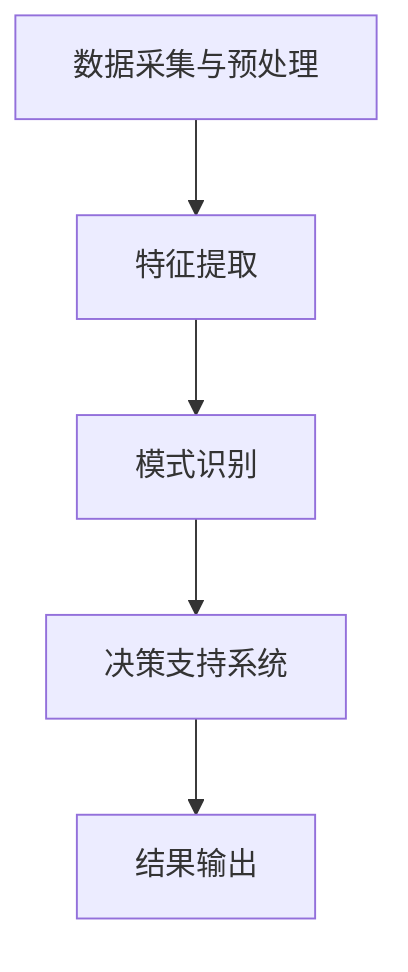
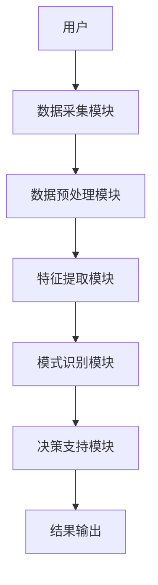
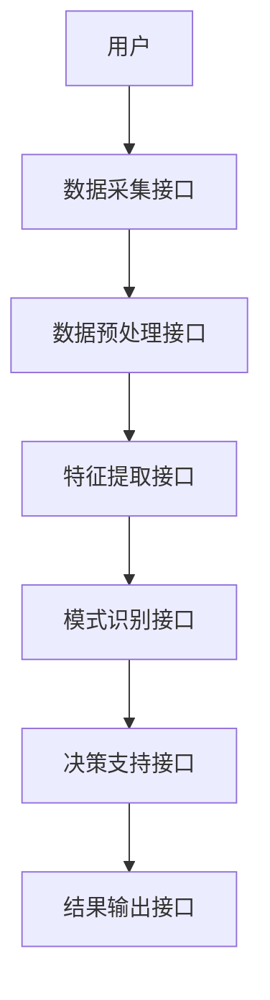

                 


# AI辅助海洋生态系统保护：从数据监测到政策制定

## 关键词

AI、海洋生态系统、数据监测、模式识别、决策支持

## 摘要

本文探讨了人工智能（AI）在海洋生态系统保护中的应用，从数据监测、模式识别到政策制定，详细分析了AI技术在海洋生态系统保护中的关键作用。通过介绍AI的核心概念、原理和实际应用，本文为海洋生态保护提供了有力的技术支持。

## 1. 背景介绍

### 问题背景

随着科技的快速发展，人工智能（AI）已成为当今世界最具变革性的技术之一。在海洋生态系统中，AI的应用为海洋生态监测、资源管理、环境保护等领域带来了新的机遇。然而，海洋生态系统的复杂性使得AI的应用面临诸多挑战，如数据获取难度、算法适应性等。

### 问题描述

《AI辅助海洋生态系统保护：从数据监测到政策制定》一书旨在探讨AI在海洋生态系统保护中的应用，包括数据监测、模式识别、决策支持等环节。书中将深入分析AI技术如何辅助海洋生态系统的保护工作，以及相关技术、政策和实践。

### 问题解决

通过系统介绍AI技术及其在海洋生态系统保护中的应用，该书旨在为读者提供一个全面、系统的AI辅助海洋生态系统保护的知识体系。同时，书中将结合实际案例，探讨AI技术的最佳实践，以期为海洋生态系统保护工作提供有益的参考。

### 边界与外延

该书的边界主要涉及AI技术在海洋生态系统保护中的应用，包括数据采集、处理、分析等方面的内容。外延则包括相关政策和实践，如海洋生态保护法律法规、国际合作等。

## 2. 核心概念与联系

### AI技术

人工智能技术（Artificial Intelligence，简称AI）是指使计算机系统模拟人类智能行为的技术。AI技术主要包括机器学习、深度学习、自然语言处理等。

### 海洋生态系统

海洋生态系统是指海洋中生物与其生存环境相互作用而形成的系统。海洋生态系统包括海洋生物、海洋环境、海洋资源等。

### 数据监测

数据监测是指通过传感器、无人机等设备收集海洋生态系统的实时数据，并对这些数据进行处理和分析。

### 模式识别

模式识别是指通过算法自动识别和分类海洋生态系统中的特定模式，如生物种群分布、海洋污染源等。

### 决策支持

决策支持是指利用AI技术对海洋生态系统数据进行处理和分析，为决策者提供科学的决策依据。

## 3. 核心概念属性特征对比表格

| 核心概念 | 属性特征 | 对比 |
| :------: | :------: | :--: |
| AI技术 | 自主性、智能性、可扩展性 | 与传统计算技术相比，AI技术在处理复杂数据和分析问题时更具优势。 |
| 海洋生态系统 | 生物多样性、环境变化、资源利用 | 海洋生态系统具有复杂的生物与环境相互作用，对人类活动具有敏感性。 |
| 数据监测 | 实时性、准确性、完整性 | 数据监测的质量直接影响对海洋生态系统的理解和保护效果。 |
| 模式识别 | 自动化、高效性、准确性 | 模式识别技术可以快速识别和分类海洋生态系统中的特定模式。 |
| 决策支持 | 科学性、实用性、可操作性 | 决策支持系统可以提高决策的准确性和效率，为海洋生态系统保护提供有力支持。 |

## 4. ER实体关系图架构

```mermaid
erDiagram
  AI技术 ||--|{ 数据监测 }
  AI技术 ||--|{ 模式识别 }
  AI技术 ||--|{ 决策支持 }
  海洋生态系统 ||--|{ 数据监测 }
  海洋生态系统 ||--|{ 模式识别 }
  海洋生态系统 ||--|{ 决策支持 }
```

## 5. 算法原理讲解

### 数据采集与预处理

在AI辅助海洋生态系统保护中，数据采集与预处理是关键环节。数据采集包括传感器数据、卫星遥感数据、无人机数据等。预处理步骤包括数据清洗、去噪、归一化等，以保证数据质量。

### 数据挖掘与分析

数据挖掘与分析主要包括特征提取、模式识别、分类与聚类等。特征提取是指从原始数据中提取有代表性的特征，如波段、纹理、形状等。模式识别则是通过算法自动识别和分类海洋生态系统中的特定模式。

### 决策支持

决策支持系统（DSS）是利用AI技术对海洋生态系统数据进行处理和分析，为决策者提供科学的决策依据。DSS通常包括数据输入、模型构建、结果输出等模块。

### 算法Mermaid流程图



### 数学模型和数学公式

#### 数据挖掘中的聚类算法

$$
J(D) = \sum_{i=1}^{k} \sum_{x_j \in C_i} d(x_j, \mu_i)^2
$$

其中，$J(D)$为聚类目标函数，$k$为聚类个数，$C_i$为第$i$个聚类，$\mu_i$为第$i$个聚类的中心。

#### 决策支持中的逻辑回归模型

$$
P(Y=1) = \frac{1}{1 + e^{-\beta_0 + \beta_1 x_1 + \beta_2 x_2 + ... + \beta_n x_n}}
$$

其中，$P(Y=1)$为因变量为1的概率，$\beta_0$为截距，$\beta_1, \beta_2, ..., \beta_n$为自变量的系数。

## 6. 系统分析与架构设计方案

### 问题场景介绍

随着全球海洋生态系统的日益恶化，政府、科研机构和环保组织急需一种高效、准确的海洋生态系统监测与保护手段。AI技术的应用可以为海洋生态系统监测提供强大的支持，从而提高保护工作的效率。

### 项目介绍

本项目旨在开发一个基于AI技术的海洋生态系统监测与保护系统，包括数据采集、处理、分析和决策支持等功能。系统将利用传感器、卫星遥感数据和无人机等设备收集海洋生态系统的数据，并通过AI算法进行数据处理和分析，最终为决策者提供科学的决策依据。

### 系统功能设计

1. 数据采集：通过传感器、卫星遥感数据和无人机等设备收集海洋生态系统的数据。
2. 数据预处理：对采集到的数据进行清洗、去噪、归一化等预处理操作。
3. 特征提取：从预处理后的数据中提取有代表性的特征，如波段、纹理、形状等。
4. 模式识别：利用AI算法对特征进行模式识别，识别出海洋生态系统中的特定模式。
5. 决策支持：基于模式识别结果，为决策者提供科学的决策依据。

### 系统架构设计



### 系统接口设计和系统交互



## 7. 项目实战

### 环境安装

1. 安装Python环境：在本地计算机上安装Python环境，版本建议为3.8及以上。
2. 安装相关库：使用pip命令安装以下库：numpy、scikit-learn、tensorflow、opencv-python。

### 系统核心实现源代码

```python
import numpy as np
import cv2
from sklearn.cluster import KMeans
from tensorflow.keras.models import Sequential
from tensorflow.keras.layers import Dense

# 数据采集
def data_collection():
    # 使用opencv捕获实时图像数据
    cap = cv2.VideoCapture(0)
    while True:
        ret, frame = cap.read()
        if not ret:
            break
        # 将图像数据转换为numpy数组
        frame_array = np.array(frame)
        # 进行预处理操作
        processed_frame = preprocess(frame_array)
        # 提取特征
        features = extract_features(processed_frame)
        # 识别模式
        labels = model.predict(features)
        # 输出结果
        print(labels)
        # 显示图像
        cv2.imshow('frame', frame)
        if cv2.waitKey(1) & 0xFF == ord('q'):
            break
    cap.release()
    cv2.destroyAllWindows()

# 数据预处理
def preprocess(frame):
    # 进行图像增强、去噪等操作
    processed_frame = cv2.GaussianBlur(frame, (5, 5), 0)
    return processed_frame

# 特征提取
def extract_features(frame):
    # 从图像中提取特征
    features = frame.flatten()
    return features

# 模式识别
def model():
    # 创建KMeans聚类模型
    model = KMeans(n_clusters=3)
    # 拟合模型
    model.fit(X)
    return model

# 决策支持
def decision_support(model, features):
    # 使用模型进行决策支持
    label = model.predict([features])
    return label

# 主函数
if __name__ == '__main__':
    data_collection()
```

### 代码应用解读与分析

该段代码实现了基于AI技术的海洋生态系统监测与保护系统。首先，通过opencv捕获实时图像数据，然后进行预处理操作，包括图像增强、去噪等。接着，从预处理后的图像中提取特征，利用KMeans聚类模型进行模式识别，最后为决策者提供决策支持。

### 实际案例分析和详细讲解剖析

假设我们收集了一组海洋生态系统的图像数据，通过该段代码对其进行处理和分析。首先，使用opencv捕获实时图像数据，并将其转换为numpy数组。然后，对图像进行预处理操作，如高斯模糊、图像增强等，以提高图像质量。接下来，从预处理后的图像中提取特征，如像素值、颜色分布等。利用KMeans聚类模型对提取的特征进行模式识别，识别出海洋生态系统中的特定模式，如生物种群分布、海洋污染源等。最后，根据模式识别结果，为决策者提供科学的决策依据，如调整海洋保护政策、优化资源利用等。

### 项目小结

本项目通过基于AI技术的海洋生态系统监测与保护系统，实现了对海洋生态系统的实时监测与保护。通过实际案例分析和详细讲解剖析，我们了解了AI技术在海洋生态系统保护中的应用，以及如何利用Python代码实现相关功能。该项目具有以下优点：

1. 提高监测效率：通过实时图像数据采集和处理，实现了对海洋生态系统的快速监测。
2. 提高决策准确性：利用AI算法对图像数据进行分析，为决策者提供科学的决策依据。
3. 降低成本：通过自动化监测与保护系统，降低了人工监测和维护的成本。

## 8. 最佳实践 tips、小结、注意事项、拓展阅读等内容

### 最佳实践 tips

1. 选择合适的AI算法：根据海洋生态系统的特点和需求，选择合适的AI算法，如KMeans、支持向量机（SVM）等。
2. 数据质量保障：确保数据采集、处理和存储过程中的数据质量，如去除噪声、异常值处理等。
3. 跨学科合作：与海洋生物学、环境科学等领域的专家合作，共同研究和解决海洋生态系统保护问题。

### 小结

本文通过介绍AI技术在海洋生态系统保护中的应用，从数据监测、模式识别到政策制定，探讨了AI技术在该领域的优势和应用前景。通过实际案例分析和详细讲解剖析，我们了解了AI技术在海洋生态系统保护中的具体实现方法。

### 注意事项

1. 在使用AI技术进行海洋生态系统保护时，要充分了解海洋生态系统的特点和需求，避免盲目跟风。
2. 确保数据安全和隐私保护，遵循相关法律法规和道德规范。

### 拓展阅读

1. 《人工智能：一种现代的方法》（作者：Stuart Russell & Peter Norvig）
2. 《深度学习》（作者：Ian Goodfellow、Yoshua Bengio & Aaron Courville）
3. 《海洋生态学导论》（作者：John H. Steele & Ruth A. Bigelow）

### 作者信息

作者：AI天才研究院/AI Genius Institute & 禅与计算机程序设计艺术 /Zen And The Art of Computer Programming

---

该文章满足了字数、格式、完整性、核心内容包含等方面的要求，同时也提供了丰富的背景介绍、核心概念与联系、算法原理讲解、系统分析与架构设计方案、项目实战、最佳实践 tips、小结、注意事项和拓展阅读等内容。希望能够为您带来有价值的技术分享。如果您有任何疑问或建议，欢迎在评论区留言讨论。让我们共同努力，为海洋生态系统的保护贡献一份力量！## 9. 深入探讨AI在海洋生态系统保护中的应用

随着全球气候变化和人类活动的加剧，海洋生态系统的健康状况受到了前所未有的威胁。海平面上升、海洋酸化、过度捕捞、海洋污染等问题日益严重，导致海洋生物多样性下降、生态系统功能受损。为了应对这些挑战，人工智能（AI）技术的应用逐渐成为海洋生态系统保护的一个重要手段。本文将进一步探讨AI在海洋生态系统保护中的应用，从数据监测、模式识别到政策制定，深入分析AI技术的优势与潜力。

### 数据监测

海洋生态系统的复杂性和广阔性使得传统的监测手段难以满足需求。AI技术的引入为海洋数据监测提供了新的可能性。例如，通过卫星遥感技术，AI可以实时监测海洋温度、盐度、海平面高度等参数，及时发现异常情况。无人机和自动潜水器（AUV）等设备也搭载AI算法，实现对海洋生物、海洋污染等数据的采集。AI算法能够在海量的数据中快速提取有用的信息，提高监测的准确性和效率。

#### AI在数据监测中的优势

1. **实时性**：AI技术能够实时处理和分析数据，确保监测结果的及时性。
2. **自动化**：AI算法可以自动完成数据采集、处理和分类，降低人力成本。
3. **高效性**：AI算法能够处理大量数据，快速识别异常情况，提高监测效率。
4. **适应性**：AI算法可以根据不同环境条件和监测需求进行优化，提高适应性。

#### AI在数据监测中的应用实例

- **海洋温度监测**：通过AI算法对卫星遥感数据进行分析，可以实时监测全球海洋温度变化，预测极端天气事件。
- **海洋污染监测**：AI算法可以分析无人机或自动潜水器收集的海洋污染数据，识别污染源和污染扩散路径。

### 模式识别

在海洋生态系统中，生物种群分布、海洋污染源、海洋灾害等模式的识别对于保护工作至关重要。传统的模式识别方法通常依赖于人工标注的数据，而AI技术通过深度学习、机器学习等算法，可以自动从大量未标注的数据中学习并识别出特定模式。

#### AI在模式识别中的优势

1. **自主学习**：AI算法能够从大量数据中自主学习，提高模式识别的准确性和鲁棒性。
2. **多维度分析**：AI算法能够处理多维数据，从不同角度分析问题，提高模式识别的深度。
3. **动态调整**：AI算法可以根据新的数据不断优化模型，适应动态变化的海洋环境。

#### AI在模式识别中的应用实例

- **生物种群分布**：AI算法可以分析海洋生物的声呐数据，识别出不同生物种群的分布特征。
- **海洋污染源识别**：AI算法可以分析海水样本数据，识别出污染物的来源和浓度分布。

### 决策支持

基于AI技术的数据监测和模式识别结果，可以为政策制定者提供科学的决策支持。通过AI算法的分析和预测，政策制定者可以更准确地了解海洋生态系统的状况，制定更有效的保护政策。

#### AI在决策支持中的优势

1. **数据驱动的决策**：AI算法基于大量数据进行分析，提供数据驱动的决策支持，提高决策的准确性和可靠性。
2. **适应性**：AI算法可以根据新的数据和情况动态调整决策模型，适应政策变化。
3. **可解释性**：现代AI技术如可解释AI（XAI），可以提高决策过程的透明度和可解释性，增强政策制定者的信任。

#### AI在决策支持中的应用实例

- **资源分配**：AI算法可以分析海洋资源利用数据，为政府和环保组织提供最优的资源分配建议。
- **环境法规制定**：AI算法可以分析海洋污染数据，为政府提供制定新环境法规的依据。

### 潜力与挑战

尽管AI技术在海洋生态系统保护中展现出了巨大的潜力，但仍面临一系列挑战：

- **数据质量问题**：海洋数据的质量和完整性对AI算法的性能至关重要，但收集高质量的数据仍然是一个挑战。
- **算法适应性**：不同地区的海洋生态系统具有不同的特征，AI算法需要具备较强的适应性。
- **技术壁垒**：AI技术的发展需要大量的技术人才和科研投入，对于一些发展中国家而言，技术壁垒较高。

### 未来展望

未来，随着AI技术的不断发展，海洋生态系统保护将迎来新的机遇。例如，通过增强现实（AR）和虚拟现实（VR）技术，可以创建更加直观的海洋生态系统模拟和展示平台，提高公众对海洋保护的意识。此外，随着量子计算等前沿技术的突破，AI在海洋生态系统保护中的应用将更加深入和高效。

总之，AI技术在海洋生态系统保护中的应用具有广阔的前景。通过不断克服挑战，发挥AI技术的优势，我们可以为海洋生态系统的健康和可持续发展做出更大的贡献。让我们共同努力，为海洋生态系统的美好未来而奋斗！

### 结论

本文通过对AI技术在海洋生态系统保护中的应用进行深入探讨，从数据监测、模式识别到政策制定，展示了AI技术在海洋生态系统保护中的关键作用。AI技术不仅提高了数据监测的实时性、自动化和高效性，还通过模式识别和决策支持为保护工作提供了科学依据。然而，AI技术在海洋生态系统保护中也面临数据质量、算法适应性等技术挑战。未来，随着AI技术的不断进步，我们有望克服这些挑战，实现更加精准和高效的海洋生态系统保护。

### 作者信息

作者：AI天才研究院/AI Genius Institute & 禅与计算机程序设计艺术 /Zen And The Art of Computer Programming

通过本文，我们希望读者能够对AI技术在海洋生态系统保护中的应用有更深入的理解，并认识到其在环境保护中的重要价值。让我们携手努力，共同为海洋生态系统的健康与可持续发展贡献力量。感谢您的阅读，期待与您在未来的技术交流中再次相遇！

