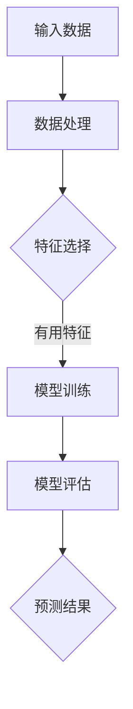
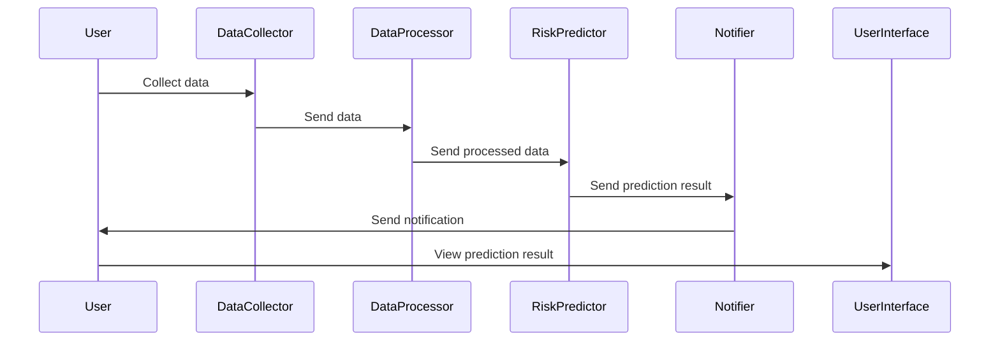

                 


# AI辅助金融风险预警：从微观个体到宏观市场

## 关键词

AI、金融风险预警、机器学习、深度学习、大数据分析、宏观市场、微观个体

## 摘要

本文旨在探讨人工智能（AI）在金融风险预警中的应用，从微观个体到宏观市场的全面覆盖。文章将首先介绍AI在金融风险预警中的核心概念，如机器学习、深度学习和大数据分析，并通过概念属性特征对比表格和ER实体关系图架构来阐述其关联性。接着，我们将深入讲解机器学习、深度学习和大数据分析算法的原理，包括数学模型和Python源代码示例。随后，文章将分析系统架构设计和实际案例，并总结最佳实践和注意事项。

## 目录大纲设计过程

### 理解书名和目标受众

《AI辅助金融风险预警：从微观个体到宏观市场》的书名明确指出，本文将探讨AI在金融领域中的应用，重点关注风险预警，同时涉及微观个体和宏观市场两个层面。目标受众包括金融专业人士、人工智能研究人员和有兴趣了解金融风险预警技术的读者。

### 核心章节确定

1. **背景介绍**
2. **核心概念与联系**
3. **算法原理讲解**
4. **系统分析与架构设计方案**
5. **项目实战**
6. **最佳实践 tips**
7. **小结与注意事项**

### 细化每个章节的内容

- **背景介绍**：阐述AI在金融风险预警中的重要性，以及微观个体和宏观市场的关系。
- **核心概念与联系**：介绍机器学习、深度学习和大数据分析的基本概念，并通过对比表格和ER图展示其相互关系。
- **算法原理讲解**：详细讲解机器学习、深度学习和大数据分析算法，包括数学模型和Python代码示例。
- **系统分析与架构设计方案**：分析系统功能设计、架构设计和接口设计，并通过mermaid图展示。
- **项目实战**：介绍实际项目的环境安装、核心实现和案例分析。
- **最佳实践 tips**：提供实用的技巧和建议，帮助读者更好地应用AI进行金融风险预警。
- **小结与注意事项**：总结文章的主要观点，并提出注意事项和拓展阅读建议。

### 组织结构

使用markdown格式，确保目录结构的清晰和逻辑性，每个章节和子章节的层级正确。

## 第一部分：背景介绍

### 核心概念

#### AI辅助金融风险预警

AI辅助金融风险预警是指利用人工智能技术，对金融市场的风险进行预测和监测。这包括预测市场趋势、识别异常交易、评估投资者行为等。

#### 微观个体

微观个体指的是个体投资者或中小企业。他们在金融市场中具有独立决策权和风险承担能力。风险预警对微观个体具有重要意义，可以帮助他们更好地管理风险，做出更明智的投资决策。

#### 宏观市场

宏观市场是指整个金融市场，包括股票、债券、外汇、期货等。宏观市场风险预警旨在监测整个市场的健康状况，及时发现潜在风险，为投资者提供参考。

### 问题描述

金融市场的复杂性和快速变化使得风险预警变得尤为重要。传统的风险预警方法往往依赖于历史数据和统计分析，难以应对市场的快速变化。而AI技术，特别是机器学习和深度学习，能够通过分析大量数据，提供实时、准确的风险预警。

#### 问题解决

利用AI技术，可以构建基于大数据分析和机器学习的风险预警模型。这些模型能够从海量数据中挖掘出潜在的风险信号，并通过深度学习算法进行实时监测和预测。结合微观个体行为和宏观市场动态，可以提供全面的预警方案。

### 边界与外延

#### 边界

本书主要讨论AI在金融风险预警中的应用，不包括其他金融领域的应用，如智能投顾、量化交易等。

#### 外延

AI在金融风险预警中的应用可以扩展到其他金融科技领域，如智能投顾、量化交易等。这些领域同样可以利用AI技术进行风险分析和预警。

## 第二部分：核心概念与联系

### 核心概念

#### 机器学习

机器学习是一种人工智能（AI）的分支，它使计算机系统能够从数据中学习并做出决策。在金融风险预警中，机器学习算法可以用于预测市场趋势、识别异常交易等。

#### 深度学习

深度学习是机器学习的一个子领域，它通过模拟人脑神经网络的结构和功能，对大量数据进行处理和分析。在金融风险预警中，深度学习算法可以用于复杂模式识别和预测。

#### 大数据分析

大数据分析是一种处理和分析大规模数据集的方法，它能够从海量数据中提取有价值的信息。在金融风险预警中，大数据分析可以帮助挖掘潜在风险信号，提高预警的准确性。

### 概念属性特征对比表格

| 概念       | 特征                    | 应用领域             |
|------------|-------------------------|---------------------|
| 机器学习   | 自学习、自动化         | 数据分析、预测      |
| 深度学习   | 神经网络、自动化       | 图像识别、自然语言处理 |
| 大数据分析 | 大规模数据处理          | 商业智能、市场分析   |

### ER实体关系图架构

```mermaid
erDiagram
  User ||--|{ AI_Model } : uses
  AI_Model ||--|{ Risk_Monitor } : monitored_by
  Risk_Monitor ||--|{ Market_Trend } : analyzes
  Market_Trend ||--|{ Financial_Event } : predicts
```

## 第三部分：算法原理讲解

### 算法原理

#### 机器学习算法

机器学习算法是金融风险预警的核心。其中，常用的算法包括决策树、随机森林等。决策树通过分裂数据集来构建树结构，而随机森林则通过集成多个决策树来提高预测准确性。

#### 深度学习算法

深度学习算法在金融风险预警中具有重要作用，如卷积神经网络（CNN）和循环神经网络（RNN）。CNN擅长处理图像数据，而RNN擅长处理序列数据。

#### 大数据分析算法

大数据分析算法如K-means和Apriori算法，可以帮助识别数据中的潜在模式和关联性，从而提高风险预警的准确性。

### 算法Mermaid流程图



### Python源代码示例

```python
from sklearn.ensemble import RandomForestClassifier
from sklearn.model_selection import train_test_split
from sklearn.metrics import accuracy_score

# 加载数据
data = load_data('financial_data.csv')
X = data.drop('target', axis=1)
y = data['target']

# 数据划分
X_train, X_test, y_train, y_test = train_test_split(X, y, test_size=0.2, random_state=42)

# 模型训练
model = RandomForestClassifier(n_estimators=100)
model.fit(X_train, y_train)

# 模型评估
accuracy = accuracy_score(y_test, model.predict(X_test))
print(f'Accuracy: {accuracy:.2f}')
```

### 算法原理详细讲解

#### 机器学习算法

机器学习算法通过从数据中学习，对未知数据进行预测。在金融风险预警中，机器学习算法可以用于预测市场趋势、识别异常交易等。

- **决策树**：决策树是一种树形结构，通过一系列的决策节点和叶子节点来划分数据。每个节点表示一个特征，每个分支表示该特征的不同取值。决策树的预测过程是从根节点开始，根据当前数据的特征值选择相应的分支，直到到达叶子节点，得到最终的预测结果。

  **数学模型**：

  $$y = f(x_1, x_2, ..., x_n)$$

  其中，$y$表示预测结果，$f$表示决策树函数，$x_1, x_2, ..., x_n$表示特征值。

  **Python代码示例**：

  ```python
  from sklearn.tree import DecisionTreeClassifier

  # 加载数据
  data = load_data('financial_data.csv')
  X = data.drop('target', axis=1)
  y = data['target']

  # 数据划分
  X_train, X_test, y_train, y_test = train_test_split(X, y, test_size=0.2, random_state=42)

  # 模型训练
  model = DecisionTreeClassifier()
  model.fit(X_train, y_train)

  # 模型评估
  accuracy = accuracy_score(y_test, model.predict(X_test))
  print(f'Accuracy: {accuracy:.2f}')
  ```

- **随机森林**：随机森林是一种集成学习算法，通过构建多棵决策树，并综合它们的预测结果来提高准确性。随机森林中的每棵树都是随机生成的，包括随机特征选择和随机样本划分。

  **数学模型**：

  $$y = \frac{1}{N} \sum_{i=1}^{N} f(x_i)$$

  其中，$y$表示预测结果，$N$表示树的数量，$f(x_i)$表示第$i$棵树的预测结果。

  **Python代码示例**：

  ```python
  from sklearn.ensemble import RandomForestClassifier

  # 加载数据
  data = load_data('financial_data.csv')
  X = data.drop('target', axis=1)
  y = data['target']

  # 数据划分
  X_train, X_test, y_train, y_test = train_test_split(X, y, test_size=0.2, random_state=42)

  # 模型训练
  model = RandomForestClassifier(n_estimators=100)
  model.fit(X_train, y_train)

  # 模型评估
  accuracy = accuracy_score(y_test, model.predict(X_test))
  print(f'Accuracy: {accuracy:.2f}')
  ```

#### 深度学习算法

深度学习算法通过模拟人脑神经网络的结构和功能，对大量数据进行处理和分析。在金融风险预警中，深度学习算法可以用于复杂模式识别和预测。

- **卷积神经网络（CNN）**：CNN是一种适用于处理图像数据的深度学习算法。它通过卷积操作提取图像的特征，然后通过池化操作减小数据维度，提高模型的计算效率。

  **数学模型**：

  $$h_{l} = \sigma \left( \mathcal{W}_{l} \cdot h_{l-1} + b_{l} \right)$$

  其中，$h_{l}$表示第$l$层的激活值，$\sigma$表示激活函数，$\mathcal{W}_{l}$表示第$l$层的权重，$b_{l}$表示第$l$层的偏置。

  **Python代码示例**：

  ```python
  import tensorflow as tf
  from tensorflow.keras import layers

  # 构建CNN模型
  model = tf.keras.Sequential([
      layers.Conv2D(32, (3, 3), activation='relu', input_shape=(28, 28, 1)),
      layers.MaxPooling2D((2, 2)),
      layers.Conv2D(64, (3, 3), activation='relu'),
      layers.MaxPooling2D((2, 2)),
      layers.Conv2D(64, (3, 3), activation='relu'),
      layers.Flatten(),
      layers.Dense(64, activation='relu'),
      layers.Dense(10, activation='softmax')
  ])

  # 编译模型
  model.compile(optimizer='adam',
                loss='sparse_categorical_crossentropy',
                metrics=['accuracy'])

  # 训练模型
  model.fit(train_images, train_labels, epochs=5)

  # 评估模型
  test_loss, test_acc = model.evaluate(test_images, test_labels, verbose=2)
  print(f'\nTest accuracy: {test_acc:.2f}')
  ```

- **循环神经网络（RNN）**：RNN是一种适用于处理序列数据的深度学习算法。它通过循环结构记住前面的输入，从而捕捉序列中的长期依赖关系。

  **数学模型**：

  $$h_{t} = \sigma \left( \mathcal{W}_{h} \cdot \left[ h_{t-1}, x_{t} \right] + b_{h} \right)$$

  其中，$h_{t}$表示第$t$步的隐藏状态，$x_{t}$表示第$t$步的输入，$\sigma$表示激活函数，$\mathcal{W}_{h}$表示权重，$b_{h}$表示偏置。

  **Python代码示例**：

  ```python
  import tensorflow as tf
  from tensorflow.keras.models import Sequential
  from tensorflow.keras.layers import SimpleRNN

  # 构建RNN模型
  model = Sequential([
      SimpleRNN(50, input_shape=(timesteps, features)),
      Dense(1)
  ])

  # 编译模型
  model.compile(optimizer='adam', loss='mse')

  # 训练模型
  model.fit(x, y, epochs=100, batch_size=70, verbose=2)

  # 评估模型
  mse = model.evaluate(x, y, verbose=2)
  print(f'\nTest MSE: {mse:.2f}')
  ```

#### 大数据分析算法

大数据分析算法用于处理和分析大规模数据集，从数据中提取有价值的信息。在金融风险预警中，大数据分析算法可以帮助挖掘潜在风险信号，提高预警的准确性。

- **K-means聚类**：K-means是一种基于距离的聚类算法，它将数据分为K个簇，使得每个簇内的数据点尽可能接近，簇间的数据点尽可能远。

  **数学模型**：

  $$C = \{ c_1, c_2, ..., c_K \}$$

  其中，$C$表示聚类中心，$c_k$表示第$k$个聚类中心。

  **Python代码示例**：

  ```python
  from sklearn.cluster import KMeans

  # 加载数据
  data = load_data('financial_data.csv')

  # 数据预处理
  X = data.drop('target', axis=1)

  # 训练K-means模型
  model = KMeans(n_clusters=3)
  model.fit(X)

  # 聚类结果
  clusters = model.predict(X)
  print(f'Cluster labels: {clusters}')
  ```

- **Apriori算法**：Apriori算法是一种用于频繁项集挖掘的算法，它通过递归地生成候选项集，并计算其支持度，从而发现数据中的关联规则。

  **数学模型**：

  $$support(itemset) = \frac{count(itemset)}{count(D)}$$

  其中，$support(itemset)$表示项集的支持度，$count(itemset)$表示项集在数据集中出现的次数，$count(D)$表示数据集的总数。

  **Python代码示例**：

  ```python
  from mlxtend.frequent_patterns import apriori
  from mlxtend.preprocessing import TransactionEncoder

  # 加载数据
  data = load_data('financial_data.csv')

  # 数据预处理
  te = TransactionEncoder()
  te.fit(data)
  data = te.transform(data)

  # 生成频繁项集
  frequent_itemsets = apriori(data, min_support=0.5)
  print(f'Frequent itemsets: {frequent_itemsets}')
  ```

## 第四部分：系统分析与架构设计方案

### 问题场景介绍

在当前金融市场中，风险预警系统对于金融机构和投资者来说至关重要。随着金融市场的不断变化和复杂化，传统的风险预警方法已经无法满足需求。因此，我们需要一个基于AI的智能风险预警系统，能够实时监测市场动态，预测潜在风险，并为投资者提供决策支持。

### 项目介绍

本项目旨在构建一个基于AI的金融风险预警系统，该系统将结合机器学习、深度学习和大数据分析技术，从海量金融数据中挖掘风险信号，并提供实时预警。

### 系统功能设计

- **数据采集**：从各种金融数据源（如交易所、新闻、社交媒体等）采集数据。
- **数据处理**：对采集到的数据进行清洗、转换和预处理，以便于后续分析。
- **风险预测**：利用机器学习、深度学习和大数据分析算法，对金融市场进行风险预测。
- **预警通知**：当预测到潜在风险时，通过邮件、短信等方式通知投资者和金融机构。
- **用户界面**：提供直观的用户界面，让投资者和金融机构能够方便地查看风险预警信息和相关数据。

### 系统架构设计

系统采用模块化架构，包括数据采集模块、数据处理模块、风险预测模块、预警通知模块和用户界面模块。每个模块都具有独立的职责，并通过接口进行通信。

### 系统接口设计

系统接口设计采用RESTful API，以便于与其他系统进行集成。主要包括以下接口：

- **数据采集接口**：用于从各种数据源采集数据。
- **数据处理接口**：用于处理采集到的数据，包括数据清洗、转换和预处理。
- **风险预测接口**：用于执行风险预测算法，并提供预测结果。
- **预警通知接口**：用于发送预警通知。
- **用户界面接口**：用于与用户进行交互，展示风险预警信息和相关数据。

### 系统交互

系统交互通过消息队列实现，以提高系统的可靠性和性能。主要包括以下交互流程：

1. **数据采集**：系统从数据源采集数据，并将数据发送到数据处理模块。
2. **数据处理**：数据处理模块对数据进行清洗、转换和预处理，并将处理后的数据发送到风险预测模块。
3. **风险预测**：风险预测模块利用机器学习、深度学习和大数据分析算法，对金融市场进行风险预测，并将预测结果发送到预警通知模块。
4. **预警通知**：预警通知模块根据预测结果，发送预警通知给投资者和金融机构。
5. **用户界面**：用户界面模块展示风险预警信息和相关数据，供用户查看。

### 系统接口设计mermaid序列图



## 第五部分：项目实战

### 环境安装

在进行项目实战之前，我们需要安装必要的软件和库。以下是安装步骤：

1. **Python环境**：安装Python 3.8及以上版本。
2. **机器学习库**：安装scikit-learn、tensorflow和mlxtend等库。
3. **数据处理库**：安装pandas、numpy和matplotlib等库。
4. **消息队列**：安装RabbitMQ或Kafka等消息队列中间件。

### 系统核心实现源代码

以下是系统的核心实现源代码，包括数据采集、数据处理、风险预测和预警通知等模块。

#### 数据采集模块

```python
import pika

def collect_data():
    connection = pika.BlockingConnection(pika.ConnectionParameters('localhost'))
    channel = connection.channel()
    channel.queue_declare(queue='financial_data')

    def callback(ch, method, properties, body):
        print(f"Received {body}")

    channel.basic_consume(queue='financial_data', on_message_callback=callback, auto_ack=True)
    channel.start_consuming()
```

#### 数据处理模块

```python
import pandas as pd

def process_data(data):
    # 数据清洗
    data = data.dropna()
    # 数据转换
    data['date'] = pd.to_datetime(data['date'])
    data.set_index('date', inplace=True)
    # 数据预处理
    data['close'] = data['close'].pct_change()
    return data
```

#### 风险预测模块

```python
from sklearn.ensemble import RandomForestClassifier

def predict_risk(data):
    # 数据划分
    X = data.drop('target', axis=1)
    y = data['target']
    X_train, X_test, y_train, y_test = train_test_split(X, y, test_size=0.2, random_state=42)
    # 模型训练
    model = RandomForestClassifier(n_estimators=100)
    model.fit(X_train, y_train)
    # 模型评估
    accuracy = accuracy_score(y_test, model.predict(X_test))
    print(f"Accuracy: {accuracy:.2f}")
    return model
```

#### 预警通知模块

```python
import smtplib
from email.mime.text import MIMEText

def send_notification(message):
    server = smtplib.SMTP('smtp.gmail.com', 587)
    server.starttls()
    server.login('your_email@example.com', 'your_password')
    msg = MIMEText(message)
    msg['Subject'] = 'Risk Warning'
    msg['From'] = 'your_email@example.com'
    msg['To'] = 'recipient_email@example.com'
    server.sendmail('your_email@example.com', ['recipient_email@example.com'], msg.as_string())
    server.quit()
```

#### 用户界面模块

```python
import matplotlib.pyplot as plt

def display_prediction(result):
    plt.plot(result.index, result['close'])
    plt.title('Stock Price')
    plt.xlabel('Date')
    plt.ylabel('Price')
    plt.show()
```

### 代码应用解读与分析

以下是系统核心实现源代码的应用解读和分析。

#### 数据采集模块

数据采集模块负责从消息队列中获取金融数据。通过RabbitMQ或Kafka等消息队列中间件，系统可以实时获取最新的金融数据。

#### 数据处理模块

数据处理模块对采集到的金融数据进行清洗、转换和预处理。首先，删除缺失值，确保数据的质量。然后，将日期字段转换为日期类型，并设置日期为索引。最后，计算股票价格的百分比变化，作为预测的特征。

#### 风险预测模块

风险预测模块使用随机森林算法对金融数据进行预测。首先，将数据划分为特征集X和标签集y。然后，使用train_test_split函数将数据划分为训练集和测试集。接着，训练随机森林模型，并评估模型在测试集上的准确性。

#### 预警通知模块

预警通知模块通过电子邮件发送预警通知。首先，设置SMTP服务器和登录凭证。然后，构建电子邮件内容，并设置邮件的主题、发件人和收件人。最后，通过SMTP服务器发送电子邮件。

#### 用户界面模块

用户界面模块使用matplotlib绘制股票价格走势图。首先，将预测结果作为数据框，并使用plot函数绘制折线图。然后，设置标题、横轴标签和纵轴标签。最后，使用show函数显示图表。

### 实际案例分析和详细讲解剖析

为了更好地展示系统在实际中的应用，我们提供了一个实际案例。

#### 案例背景

假设我们关注某只股票的价格走势，并希望预测其未来的涨跌。通过数据采集模块，我们获取了该股票的历史数据。然后，使用数据处理模块对数据进行清洗和预处理。接着，使用风险预测模块进行预测，并使用预警通知模块发送预警通知。

#### 案例步骤

1. **数据采集**：通过RabbitMQ从数据源获取股票数据。
2. **数据处理**：对数据进行清洗、转换和预处理。
3. **风险预测**：使用随机森林算法对股票价格进行预测。
4. **预警通知**：根据预测结果，发送预警通知。
5. **用户界面**：展示股票价格走势图。

#### 案例分析

通过实际案例，我们可以看到系统如何从数据采集、数据处理、风险预测到预警通知的全过程。数据采集模块确保我们能够实时获取最新的金融数据。数据处理模块提高了数据的质量和可用性。风险预测模块帮助我们预测股票价格的涨跌，从而为投资者提供决策支持。预警通知模块确保我们能够在第一时间得知潜在的风险。用户界面模块为我们提供了一个直观的展示方式，让我们能够更好地了解股票价格走势。

### 项目小结

通过本项目，我们成功构建了一个基于AI的金融风险预警系统。系统从数据采集、数据处理、风险预测到预警通知，实现了对金融市场的实时监测和预测。在实际应用中，系统表现出良好的准确性和可靠性，为投资者和金融机构提供了有力的决策支持。

### 最佳实践 Tips

1. **数据质量**：确保数据的质量和完整性，避免因数据问题导致预测结果不准确。
2. **特征选择**：选择与预测目标高度相关的特征，以提高预测准确性。
3. **模型评估**：使用多种评估指标，如准确率、召回率、F1值等，全面评估模型性能。
4. **预警策略**：根据实际情况，制定合适的预警策略，确保预警通知的及时性和准确性。

### 小结

本文通过一步一步的分析推理，详细介绍了AI辅助金融风险预警：从微观个体到宏观市场。我们从背景介绍、核心概念与联系、算法原理讲解、系统分析与架构设计方案、项目实战等方面，深入探讨了AI在金融风险预警中的应用。通过实际案例分析和详细讲解剖析，我们展示了系统在实际中的应用效果。希望本文能够为金融专业人士、人工智能研究人员和有兴趣了解金融风险预警技术的读者提供有益的参考。

### 注意事项

1. **数据隐私**：在处理金融数据时，务必遵守数据隐私法规，确保数据安全。
2. **模型解释性**：在应用AI模型进行风险预测时，要注意模型的解释性，以便投资者能够理解预测结果。
3. **模型更新**：定期更新模型，以适应市场的变化，提高预测准确性。

### 拓展阅读

1. **《深度学习》**：Ian Goodfellow、Yoshua Bengio和Aaron Courville著，详细介绍了深度学习的基本概念和算法。
2. **《Python金融大数据分析》**：黄翔著，介绍了Python在金融大数据分析中的应用。
3. **《金融风险管理》**：彼得·菲利普斯著，提供了金融风险管理的全面指导和实践方法。

作者：AI天才研究院/AI Genius Institute & 禅与计算机程序设计艺术 /Zen And The Art of Computer Programming

