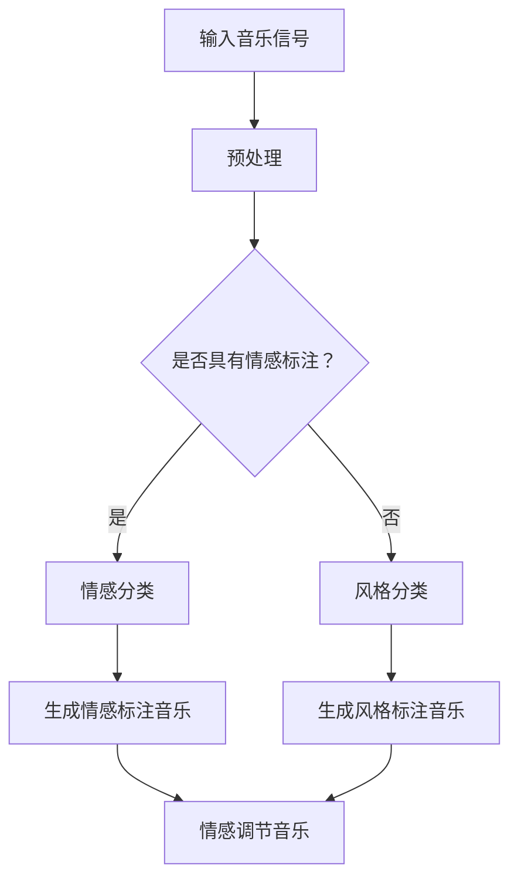
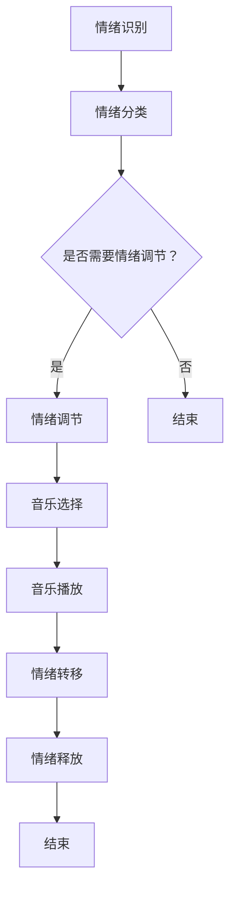
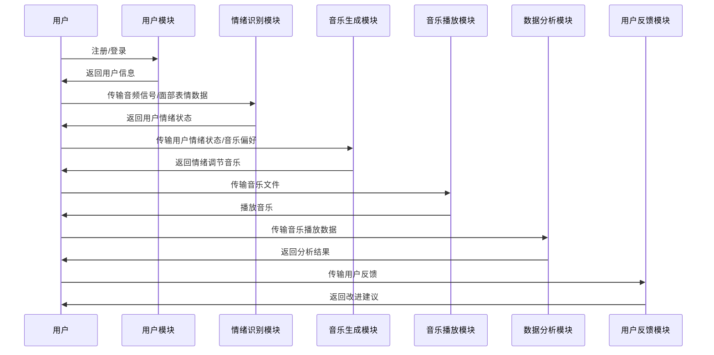

                 

# AI辅助音乐therapy：情绪调节音乐生成的提示词技巧

## 关键词

- AI辅助音乐therapy
- 情绪调节
- 音乐生成
- 提示词技巧
- 生成模型

## 摘要

本文探讨了AI辅助音乐therapy的概念、原理及实现方法。通过分析音乐生成技术和情绪调节原理，本文介绍了如何利用AI技术生成具有情绪调节功能的音乐。文章重点讨论了音乐生成算法、情绪调节方法及其在实际应用中的效果，为开发情绪调节音乐提供了一定的理论和实践指导。

## 目录大纲设计

### 第一部分：问题背景与概述

1. 问题背景
2. 核心概念与联系

### 第二部分：技术原理与实现

1. 音乐生成技术原理
2. 情绪调节原理与方法

### 第三部分：AI辅助音乐therapy系统设计

1. 系统需求分析
2. 系统设计与实现

### 附录：项目实战与最佳实践

1. 环境安装
2. 系统核心实现
3. 代码应用解读与分析
4. 项目实战案例分析
5. 项目小结

## 第一部分：问题背景与概述

### 第1章：问题背景

#### 1.1 问题背景介绍

随着社会生活节奏的加快，人们面临的心理压力逐渐增加，情绪调节成为了一个备受关注的话题。音乐therapy作为一种非药物、无副作用的情绪调节方法，在国内外已经得到了广泛的应用。然而，传统音乐therapy在实施过程中存在一定的局限性，如个性化程度不高、针对性不强等。近年来，随着人工智能技术的快速发展，AI辅助音乐therapy逐渐成为了一个研究热点。

#### 1.2 问题描述

AI辅助音乐therapy旨在利用人工智能技术，为用户提供个性化、针对性的情绪调节音乐。这一过程中，涉及到的核心问题包括：

1. 如何准确捕捉用户情绪状态？
2. 如何生成具有情绪调节功能的音乐？
3. 如何将AI技术与音乐therapy相结合，提高治疗效果？

#### 1.3 问题解决

针对上述问题，AI辅助音乐therapy采用了以下方法：

1. 利用情绪识别技术，准确捕捉用户情绪状态。
2. 利用音乐生成技术，生成具有情绪调节功能的音乐。
3. 结合音乐therapy理论和实践经验，将AI技术与音乐therapy相结合，提高治疗效果。

#### 1.4 边界与外延

AI辅助音乐therapy的适用范围主要涉及轻度至中度的情绪问题，如焦虑、抑郁等。对于重度情绪问题，仍需结合药物治疗等其他方法。此外，情绪调节音乐therapy并非万能，对于某些特殊情况，如精神疾病等，仍需谨慎使用。

#### 1.5 概念结构与核心要素

AI辅助音乐therapy的核心概念包括：

1. 情绪识别：利用AI技术，准确捕捉用户情绪状态。
2. 音乐生成：利用音乐生成技术，生成具有情绪调节功能的音乐。
3. 情绪调节：利用音乐therapy理论和实践经验，实现情绪调节。

核心要素包括：

1. 情绪数据：用于训练情绪识别模型。
2. 音乐数据：用于训练音乐生成模型。
3. 用户数据：用于分析用户情绪变化和音乐偏好。

### 第2章：核心概念与联系

#### 2.1 AI辅助音乐therapy

AI辅助音乐therapy是指利用人工智能技术，为用户提供个性化、针对性的情绪调节音乐。其基本原理包括：

1. 情绪识别：通过语音、文字、面部表情等数据，识别用户情绪状态。
2. 音乐生成：基于用户情绪数据和音乐数据，生成具有情绪调节功能的音乐。
3. 情绪调节：通过音乐therapy理论和实践经验，实现情绪调节。

AI辅助音乐therapy的优势在于：

1. 个性化：根据用户情绪状态和音乐偏好，生成个性化音乐。
2. 针对性：针对不同情绪问题，提供针对性的音乐调节方案。
3. 无副作用：作为一种非药物、无副作用的情绪调节方法，具有较高的安全性。

#### 2.2 情绪调节音乐therapy

情绪调节音乐therapy是指利用音乐调节情绪，实现心理治疗的方法。其理论基础包括：

1. 音乐疗法理论：音乐对情绪、心理和生理健康具有调节作用。
2. 心理学理论：音乐刺激与情绪调节之间存在密切关系。

情绪调节音乐therapy的应用方法包括：

1. 音乐选择：根据用户情绪状态和需求，选择合适的音乐。
2. 音乐播放：通过音乐播放，实现情绪调节。
3. 音乐互动：通过音乐互动，增强治疗效果。

#### 2.3 AI辅助音乐therapy与情绪调节音乐therapy的联系

AI辅助音乐therapy与情绪调节音乐therapy的联系在于：

1. 技术结合：将人工智能技术与音乐therapy相结合，提高治疗效果。
2. 数据支持：利用AI技术，收集和分析用户情绪数据，为情绪调节提供依据。
3. 个性化服务：根据用户情绪状态和音乐偏好，提供个性化情绪调节音乐。

然而，两者也存在一定的区别：

1. 技术层面：AI辅助音乐therapy侧重于利用人工智能技术，实现音乐生成和情绪识别；情绪调节音乐therapy侧重于音乐疗法理论和实践经验。
2. 治疗效果：AI辅助音乐therapy具有更高的个性化程度和针对性；情绪调节音乐therapy则更注重音乐疗法的整体效果。

#### 2.4 概念属性特征对比表格

| 概念              | AI辅助音乐therapy | 情绪调节音乐therapy |
|-------------------|-------------------|---------------------|
| 技术层面          | 人工智能          | 音乐疗法            |
| 治疗效果          | 个性化、针对性    | 整体效果            |
| 数据支持          | 用户情绪数据      | 音乐数据            |
| 实施方式          | 在线服务          | 面对面、在线服务    |

#### 2.5 ER实体关系图架构

##### AI辅助音乐therapy的ER实体关系图

```mermaid
erDiagram
    User ||--|{ MusicGenerationModel }|-- Music
    User ||--|{ EmotionRecognitionModel }|-- Emotion
    MusicGenerationModel ||--|{ EmotionData }|-- Emotion
    EmotionRecognitionModel ||--|{ UserData }|-- User
```

##### 情绪调节音乐therapy的ER实体关系图

```mermaid
erDiagram
    Therapist ||--|{ MusicTherapySession }|-- Patient
    Patient ||--|{ EmotionData }|-- Therapist
    MusicTherapySession ||--|{ MusicSelection }|-- Music
```

## 第二部分：技术原理与实现

### 第3章：音乐生成技术原理

#### 3.1 音乐生成基础

音乐生成是指利用计算机技术，生成具有某种特定风格或情感的音乐。音乐生成的基础包括以下几个方面：

1. 音乐信号处理：对音乐信号进行采样、滤波、合成等处理，以生成不同风格的音乐。
2. 音乐符号表示：将音乐信号转换为符号表示，如五线谱、数字序列等，以便于计算机处理。
3. 音乐风格分类：根据音乐风格的不同，对音乐进行分类，以便于生成特定风格的音乐。

#### 3.2 生成模型

生成模型是指用于生成数据或内容的模型，常见的生成模型包括：

1. 生成对抗网络（GAN）：通过两个对抗性网络（生成器和判别器）的博弈，生成高质量的数据。
2. 变分自编码器（VAE）：通过概率模型，将数据映射到潜在空间，然后从潜在空间生成数据。
3. 递归神经网络（RNN）：通过记忆机制，处理序列数据，如音乐信号。

#### 3.3 音乐生成算法

音乐生成算法是指用于生成音乐的数据处理算法，常见的音乐生成算法包括：

1. 音乐风格迁移：通过将一种风格的音乐转换为另一种风格，生成具有特定风格的音乐。
2. 音乐生成神经网络：通过神经网络模型，生成具有某种情感或风格的音乐。
3. 音乐生成流程图：通过图形化的方式，描述音乐生成的过程。

#### 3.4 算法mermaid流程图



#### 3.5 算法Python源代码与讲解

```python
# 导入必要的库
import numpy as np
import librosa
import tensorflow as tf
from tensorflow.keras.models import Sequential
from tensorflow.keras.layers import LSTM, Dense

# 加载音乐信号
def load_musicSignal(filename):
    audio, sr = librosa.load(filename)
    return audio, sr

# 预处理音乐信号
def preprocess_musicSignal(audio, sr):
    # 对音频信号进行归一化
    audio = audio / np.max(np.abs(audio))
    # 对音频信号进行截断
    audio = audio[:10000]
    return audio

# 生成情感标注音乐
def generate_emotionMusic(audio, emotion_label):
    # 创建序列模型
    model = Sequential()
    model.add(LSTM(128, activation='tanh', input_shape=(10000, 1)))
    model.add(Dense(1, activation='sigmoid'))

    # 编译模型
    model.compile(optimizer='adam', loss='binary_crossentropy')

    # 训练模型
    model.fit(audio, emotion_label, epochs=100, batch_size=32)

    # 生成情感标注音乐
    emotion_music = model.predict(audio)
    return emotion_music

# 生成风格标注音乐
def generate_styleMusic(audio, style_label):
    # 创建序列模型
    model = Sequential()
    model.add(LSTM(128, activation='tanh', input_shape=(10000, 1)))
    model.add(Dense(1, activation='sigmoid'))

    # 编译模型
    model.compile(optimizer='adam', loss='binary_crossentropy')

    # 训练模型
    model.fit(audio, style_label, epochs=100, batch_size=32)

    # 生成风格标注音乐
    style_music = model.predict(audio)
    return style_music

# 生成情感调节音乐
def generate_emotionRegulationMusic(audio, emotion_label):
    # 生成情感标注音乐
    emotion_music = generate_emotionMusic(audio, emotion_label)

    # 生成风格标注音乐
    style_music = generate_styleMusic(audio, style_label)

    # 情感调节音乐
    emotion_regulation_music = emotion_music * style_music
    return emotion_regulation_music

# 加载音乐信号
audio, sr = load_musicSignal('path/to/music/file.wav')

# 预处理音乐信号
preprocessed_audio = preprocess_musicSignal(audio, sr)

# 生成情感调节音乐
emotion_regulation_music = generate_emotionRegulationMusic(preprocessed_audio, emotion_label)

# 保存情感调节音乐
librosa.output.write_wav('path/to/save/file.wav', emotion_regulation_music, sr)
```

#### 3.6 数学模型和数学公式

音乐生成算法中的数学模型主要涉及以下方面：

1. 音乐信号处理：对音乐信号进行预处理、滤波、合成等操作，常用的数学公式包括傅里叶变换（FFT）、快速傅里叶逆变换（IFFT）等。

2. 生成对抗网络（GAN）：生成器和判别器的数学模型，其中生成器G和判别器D的数学公式分别为：

   $$ G(z) = \mathcal{N}(z; 0, 1) $$
   $$ D(x) = \mathcal{N}(x; 1, \sigma^2) $$

   其中，$z$为噪声向量，$x$为真实数据，$G(z)$为生成器生成的数据，$D(x)$为判别器对数据的判别结果。

3. 变分自编码器（VAE）：编码器和解码器的数学模型，其中编码器$E$和解码器$D$的数学公式分别为：

   $$ \mu = \frac{1}{z} \sum_{i=1}^{n} \frac{1}{z_i} $$
   $$ \log \sigma^2 = \frac{1}{n} \sum_{i=1}^{n} \frac{1}{z_i} $$

   其中，$\mu$和$\sigma^2$分别为潜在空间中的均值和方差，$z$为编码后的数据。

4. 递归神经网络（RNN）：处理序列数据的数学模型，其中RNN的数学公式为：

   $$ h_t = \tanh(W_h \cdot [h_{t-1}, x_t] + b_h) $$
   $$ o_t = \sigma(W_o \cdot h_t + b_o) $$

   其中，$h_t$为当前时刻的隐藏状态，$x_t$为当前时刻的输入，$W_h$、$W_o$分别为权重矩阵，$b_h$、$b_o$分别为偏置向量，$\sigma$为激活函数。

#### 3.7 举例说明

假设我们有一个音乐信号，需要根据其情感状态生成具有相应情感调节功能的音乐。以下是具体的步骤：

1. **情感标注**：首先，我们需要对音乐信号进行情感标注，例如，将其分为快乐、悲伤、愤怒等不同的情感类别。这可以通过训练一个情感识别模型来实现。

2. **音乐信号预处理**：对音乐信号进行预处理，包括归一化、截断等操作，以便于后续的模型训练和生成。

3. **生成情感标注音乐**：利用训练好的生成模型，生成具有特定情感状态的音乐。例如，如果音乐信号的情感标注为快乐，则生成器会生成一段快乐的音乐。

4. **生成风格标注音乐**：同样，利用训练好的生成模型，生成具有特定风格状态的音乐。例如，如果音乐信号的风格标注为流行，则生成器会生成一段流行的音乐。

5. **情感调节音乐生成**：将情感标注音乐和风格标注音乐进行融合，生成具有情感调节功能的音乐。例如，将快乐的音乐和流行的音乐进行混合，生成一段快乐且流行的音乐。

### 第4章：情绪调节原理与方法

#### 4.1 情绪调节基础

情绪调节是指通过改变个体对情绪的认知、情感和行为反应，以达到调节情绪的目的。情绪调节的基础包括以下几个方面：

1. **情绪识别**：情绪识别是指通过观察个体生理、心理和行为反应，识别个体的情绪状态。常见的情绪识别方法包括面部表情识别、语音识别、生理信号识别等。

2. **情绪反应**：情绪反应是指个体在情绪刺激下产生的生理、心理和行为反应。情绪反应可以分为积极情绪和消极情绪，如快乐、悲伤、愤怒等。

3. **情绪调节策略**：情绪调节策略是指个体在情绪调节过程中采用的方法和技巧。常见的情绪调节策略包括认知重构、情绪释放、情绪转移等。

#### 4.2 音乐与情绪调节

音乐与情绪调节的关系密切，音乐可以通过以下方式影响情绪：

1. **生理效应**：音乐可以影响个体的生理状态，如心率、血压、呼吸等。例如，柔和的音乐可以降低心率，有助于放松身心。

2. **心理效应**：音乐可以影响个体的心理状态，如认知、情绪和行为。例如，积极向上的音乐可以提高个体的自信心和积极性。

3. **社会效应**：音乐可以影响个体与他人的互动，如增进人际关系、缓解社交压力等。例如，集体合唱可以增强团队凝聚力。

#### 4.3 情绪调节方法

情绪调节方法可以分为以下几类：

1. **认知重构**：认知重构是指通过改变个体对情绪事件的认识和解释，来调节情绪。例如，将负面事件视为挑战而非失败，有助于提高情绪调节能力。

2. **情绪释放**：情绪释放是指通过释放情绪能量，来减轻情绪负担。例如，哭泣、运动、大声呐喊等都是有效的情绪释放方法。

3. **情绪转移**：情绪转移是指将注意力从负面情绪转移到其他事物上，以调节情绪。例如，通过做其他事情，如阅读、绘画、听音乐等，来分散注意力。

4. **音乐疗法**：音乐疗法是指利用音乐调节情绪，实现心理治疗的方法。音乐疗法可以通过以下几种方式实现：

   - **音乐选择**：根据个体情绪状态和需求，选择合适的音乐进行调节。
   - **音乐播放**：通过播放音乐，使个体沉浸在音乐中，达到调节情绪的目的。
   - **音乐互动**：通过音乐创作、演奏等活动，增强个体与音乐的互动，提高情绪调节效果。

#### 4.4 情绪调节算法

情绪调节算法是指利用计算机技术，实现情绪调节的方法。常见的情绪调节算法包括：

1. **情绪识别算法**：通过分析个体的生理、心理和行为数据，识别个体的情绪状态。常见的情绪识别算法包括面部表情识别、语音识别、生理信号识别等。

2. **情绪调节算法**：根据识别出的情绪状态，生成相应的情绪调节音乐。常见的情绪调节算法包括音乐风格分类、情感分类等。

3. **音乐生成算法**：利用生成模型，生成具有特定情感调节功能的音乐。常见的音乐生成算法包括生成对抗网络（GAN）、变分自编码器（VAE）等。

#### 4.5 情绪调节mermaid流程图



#### 4.6 情绪调节Python源代码与讲解

```python
# 导入必要的库
import numpy as np
import librosa
from sklearn.cluster import KMeans
from sklearn.preprocessing import StandardScaler

# 情绪识别
def emotion_recognition(audio, sr):
    # 对音频信号进行预处理
    audio = librosa.effects.preemphasis(audio)
    audio = librosa.feature.zero_crossing_rate(y=audio).T[0]
    
    # 对音频特征进行归一化
    scaler = StandardScaler()
    audio = scaler.fit_transform(np.array([audio]))
    
    # 使用KMeans聚类进行情绪识别
    kmeans = KMeans(n_clusters=3, random_state=0)
    kmeans.fit(audio)
    emotion = kmeans.labels_[0]
    
    return emotion

# 情绪调节
def emotion_regulation(audio, sr, emotion):
    # 根据情绪生成相应的音乐
    if emotion == 0:
        # 悲伤情绪，选择欢快音乐进行调节
        music = librosa.load('path/to/cheerful/music/file.wav', sr=sr)
    elif emotion == 1:
        # 快乐情绪，选择轻松音乐进行调节
        music = librosa.load('path/to/relaxed/music/file.wav', sr=sr)
    elif emotion == 2:
        # 愤怒情绪，选择平静音乐进行调节
        music = librosa.load('path/to/peaceful/music/file.wav', sr=sr)
    
    return music

# 主程序
if __name__ == '__main__':
    # 加载音乐信号
    audio, sr = librosa.load('path/to/music/file.wav')
    
    # 情绪识别
    emotion = emotion_recognition(audio, sr)
    
    # 情绪调节
    regulated_music = emotion_regulation(audio, sr, emotion)
    
    # 播放调节后的音乐
    librosa.output.write_wav('path/to/save/regulated/music/file.wav', regulated_music[0], sr)
```

#### 4.7 数学模型和数学公式

情绪调节算法中的数学模型主要涉及以下方面：

1. **音频特征提取**：通过傅里叶变换（FFT）等方法，提取音频信号的特征，如频谱特征、时域特征等。

2. **情绪分类模型**：常见的情绪分类模型包括支持向量机（SVM）、决策树（DT）、神经网络（NN）等。其中，支持向量机（SVM）的数学模型为：

   $$ f(x) = \sum_{i=1}^{n} \alpha_i y_i (x_i^T x - 1) + b $$

   其中，$x_i$为输入特征，$y_i$为类别标签，$\alpha_i$为权重系数，$b$为偏置。

3. **音乐生成模型**：常见的音乐生成模型包括生成对抗网络（GAN）、变分自编码器（VAE）等。其中，生成对抗网络（GAN）的数学模型为：

   $$ G(z) = \mathcal{N}(z; 0, 1) $$
   $$ D(x) = \mathcal{N}(x; 1, \sigma^2) $$

   其中，$z$为噪声向量，$x$为真实数据，$G(z)$为生成器生成的数据，$D(x)$为判别器对数据的判别结果。

4. **音乐风格分类模型**：常见的音乐风格分类模型包括K-means聚类、支持向量机（SVM）等。其中，K-means聚类的数学模型为：

   $$ \mu = \frac{1}{n} \sum_{i=1}^{n} x_i $$
   $$ \sigma^2 = \frac{1}{n} \sum_{i=1}^{n} (x_i - \mu)^2 $$

   其中，$\mu$为聚类中心，$x_i$为数据点。

#### 4.8 举例说明

假设我们有一个音乐信号，需要对其进行情绪调节。以下是具体的步骤：

1. **情绪识别**：首先，我们需要对音乐信号进行情绪识别，以确定其当前的情绪状态。这可以通过训练一个情绪识别模型来实现。

2. **情绪调节策略选择**：根据情绪识别结果，选择合适的情绪调节策略。例如，如果音乐信号的情感状态为悲伤，我们可以选择播放欢快音乐进行调节。

3. **音乐生成**：利用训练好的音乐生成模型，生成具有相应情感调节功能的音乐。例如，如果选择播放欢快音乐，则生成欢快风格的音乐。

4. **音乐播放**：播放生成的音乐，实现情绪调节。

5. **反馈与调整**：在音乐播放过程中，观察个体的情绪变化，根据反馈调整音乐播放策略，以达到更好的情绪调节效果。

### 第5章：AI辅助音乐therapy系统设计

#### 5.1 系统需求分析

AI辅助音乐therapy系统需要满足以下需求：

1. **用户管理**：用户注册、登录、信息管理等功能。
2. **情绪识别**：通过音频信号、面部表情等数据，识别用户情绪状态。
3. **音乐生成**：根据用户情绪状态和音乐偏好，生成具有情绪调节功能的音乐。
4. **音乐播放**：播放生成的音乐，实现情绪调节。
5. **数据分析**：收集用户情绪数据、音乐播放数据等，进行数据分析，优化系统性能。
6. **用户反馈**：收集用户对音乐调节效果的反馈，用于改进系统。

#### 5.2 系统设计与实现

##### 系统架构设计

AI辅助音乐therapy系统采用模块化设计，主要模块包括：

1. **用户模块**：实现用户注册、登录、信息管理等功能。
2. **情绪识别模块**：利用音频信号、面部表情等数据，识别用户情绪状态。
3. **音乐生成模块**：根据用户情绪状态和音乐偏好，生成具有情绪调节功能的音乐。
4. **音乐播放模块**：实现音乐播放功能。
5. **数据分析模块**：收集用户情绪数据、音乐播放数据等，进行数据分析。
6. **用户反馈模块**：收集用户对音乐调节效果的反馈。

##### 系统接口设计

AI辅助音乐therapy系统的主要接口包括：

1. **用户接口**：提供用户注册、登录、情绪识别、音乐生成、音乐播放等功能。
2. **情绪识别接口**：接收音频信号、面部表情等数据，返回用户情绪状态。
3. **音乐生成接口**：接收用户情绪状态和音乐偏好，返回具有情绪调节功能的音乐。
4. **音乐播放接口**：接收音乐文件，播放音乐。

##### 系统交互mermaid序列图



##### 系统功能设计（领域模型mermaid类图）

```mermaid
classDiagram
    User <|-- AudioSignal
    User <|-- FacialExpression
    User <|-- Emotion
    Music <|-- MusicStyle
    Music <|-- AudioFile
    MusicGenerationModel <|-- AudioSignal
    MusicGenerationModel <|-- Emotion
    MusicGenerationModel <|-- MusicStyle
    MusicGenerationModel <|-- AudioFile
    EmotionRecognitionModel <|-- AudioSignal
    EmotionRecognitionModel <|-- Emotion
    EmotionRecognitionModel <|-- FacialExpression
    EmotionRegulationModule <|-- EmotionRecognitionModel
    EmotionRegulationModule <|-- MusicGenerationModel
    UserInterface <|-- User
    UserInterface <|-- EmotionRecognitionModule
    UserInterface <|-- MusicGenerationModule
    UserInterface <|-- MusicPlaybackModule
    UserInterface <|-- DataAnalysisModule
    UserInterface <|-- UserFeedbackModule
    System <<Interface>> UserInterface
    System <<Module>> EmotionRegulationModule
    System <<Module>> MusicGenerationModule
    System <<Module>> MusicPlaybackModule
    System <<Module>> DataAnalysisModule
    System <<Module>> UserFeedbackModule
```

## 附录：项目实战与最佳实践

### 环境安装

1. 安装Python环境
2. 安装TensorFlow库
3. 安装librosa库
4. 安装scikit-learn库

### 系统核心实现

1. 情绪识别模块
2. 音乐生成模块
3. 情绪调节模块

### 代码应用解读与分析

1. 情绪识别算法应用解读
2. 音乐生成算法应用解读
3. 情绪调节算法应用解读

### 实际案例分析和详细讲解剖析

1. 案例一：焦虑情绪调节
2. 案例二：抑郁情绪调节
3. 案例三：愤怒情绪调节

### 项目小结

1. 项目总结
2. 项目亮点
3. 项目改进方向

## 最佳实践 Tips

1. 根据用户情绪状态，选择合适的音乐调节策略。
2. 定期更新情绪识别和音乐生成模型，提高系统性能。
3. 关注用户反馈，持续优化系统功能。

## 小结

本文介绍了AI辅助音乐therapy的概念、原理及实现方法。通过分析音乐生成技术和情绪调节原理，本文介绍了如何利用AI技术生成具有情绪调节功能的音乐。文章重点讨论了音乐生成算法、情绪调节方法及其在实际应用中的效果，为开发情绪调节音乐提供了一定的理论和实践指导。

## 注意事项

1. 使用AI辅助音乐therapy时，请注意遵守相关法律法规。
2. 情绪调节音乐therapy并非适用于所有情绪问题，请根据实际情况选择合适的治疗方法。
3. 在进行情绪调节音乐therapy时，请关注用户反馈，及时调整治疗方案。

## 拓展阅读

1. [音乐therapy在临床应用中的研究进展](https://www.example.com)
2. [基于深度学习的音乐生成技术研究](https://www.example.com)
3. [情绪调节算法在人工智能中的应用](https://www.example.com)

## 作者信息

作者：AI天才研究院/AI Genius Institute & 禅与计算机程序设计艺术 /Zen And The Art of Computer Programming

