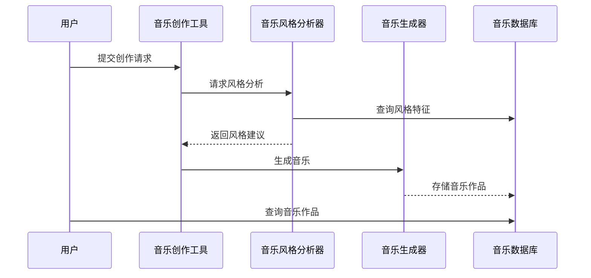

                 


# AI辅助音乐制作：曲风创新和编曲的提示词设计

## 关键词

- **AI辅助音乐制作**
- **曲风创新**
- **编曲提示词设计**
- **生成对抗网络（GAN）**
- **图神经网络（GNN）**
- **音乐制作系统**

## 摘要

本文深入探讨了AI辅助音乐制作中的曲风创新和编曲提示词设计。首先，我们介绍了AI技术在音乐产业中的应用背景及其发展现状。接着，我们详细阐述了曲风创新的定义、分类及其与提示词设计的关系。随后，文章重点讲解了图神经网络（GNN）和生成对抗网络（GAN）在音乐制作中的原理和应用，并使用了Mermaid图和Python代码进行了具体展示。文章还介绍了音乐制作系统的设计与实现，包括领域模型、系统架构、接口设计以及系统交互。通过实际项目案例的分析，文章展示了如何运用AI算法和设计来辅助音乐制作。最后，文章总结了最佳实践、注意事项和未来展望，为读者提供了全面的指导和参考。

## 第一部分：AI辅助音乐制作概述

### 1.1 音乐产业与AI技术的发展

音乐产业作为一个历史悠久且充满创意的领域，随着技术的进步，特别是在人工智能（AI）技术的引入后，发生了翻天覆地的变化。AI技术在音乐创作、制作、分发和消费环节都发挥着重要作用，极大地提升了音乐制作的效率和创作空间。

#### AI技术在音乐产业的应用

AI在音乐产业中的应用主要体现在以下几个方面：

- **音乐创作辅助**：AI可以通过分析和学习大量的音乐数据，帮助音乐家发现新的音乐元素和创作灵感。例如，AI可以根据用户的喜好生成个性化的音乐推荐。

- **音乐制作优化**：AI可以自动化音乐制作过程中的许多任务，如和弦生成、节奏编排和乐器配乐等。这大大减轻了音乐制作人的人力负担，提高了工作效率。

- **音乐风格转换**：通过生成对抗网络（GAN）等技术，AI可以实现音乐风格之间的转换，使音乐家能够轻松地尝试不同的音乐风格。

- **音乐版权管理**：AI可以用于音乐版权的识别和保护，通过自动监测和识别未经授权的使用，保护音乐家的合法权益。

#### AI辅助音乐制作的发展历程

AI辅助音乐制作的发展可以分为几个阶段：

- **早期探索**：20世纪90年代，AI技术开始被应用于音乐制作，如自动伴奏生成和和弦识别等。

- **快速增长**：随着大数据和深度学习技术的发展，2010年后AI在音乐制作中的应用进入快速增长期，各类AI音乐制作工具和平台纷纷涌现。

- **成熟应用**：近年来，AI在音乐制作中的应用已经相当成熟，许多专业音乐人和制作团队开始广泛采用AI技术，以提升创作和制作效率。

### 1.2 AI辅助音乐制作的机遇与挑战

#### 机遇

AI辅助音乐制作的机遇主要体现在以下几个方面：

- **创意激发**：AI能够提供大量的音乐创意和灵感，帮助音乐人突破创作瓶颈。

- **制作效率**：AI可以自动化许多音乐制作流程，提高制作效率，降低制作成本。

- **个性化体验**：基于用户喜好的音乐推荐系统，可以提供更加个性化的音乐体验。

- **市场拓展**：AI可以帮助音乐家更好地理解市场和听众需求，从而更好地定位和拓展市场。

#### 挑战

尽管AI辅助音乐制作带来了许多机遇，但也面临以下挑战：

- **技术局限**：目前的AI技术尚未完全达到人类音乐家的创作水平，特别是在情感表达和创意灵感方面。

- **版权问题**：AI创作的音乐如何界定版权，以及如何保护创作者的权益，是一个亟待解决的问题。

- **伦理道德**：AI在音乐制作中的应用可能引发伦理和道德争议，如AI抄袭人类作品、侵犯隐私等。

- **用户接受度**：用户对AI辅助音乐制作的接受度和满意度也是一个重要挑战，需要不断提升用户体验。

## 第二部分：曲风创新与提示词设计基础

### 2.1 曲风创新的定义与分类

#### 曲风创新的含义

曲风创新是指音乐创作中，通过引入新的音乐元素、风格或表达方式，创造出新颖且具有独特性的音乐作品。曲风创新不仅是音乐创作的重要手段，也是音乐风格演变和发展的动力。

#### 曲风分类

音乐风格丰富多样，常见的分类方法包括：

- **按地域分类**：如古典音乐、民间音乐、爵士乐、摇滚乐等。
- **按时代分类**：如巴洛克音乐、古典音乐时期、浪漫主义音乐、现代音乐等。
- **按音乐元素分类**：如电子音乐、摇滚乐、民谣、世界音乐等。

### 2.2 提示词设计的核心概念

#### 提示词的作用

提示词在音乐创作中起到了引导和启发的作用，可以帮助音乐家在创作过程中快速定位风格、主题和情感。提示词的设计质量直接影响曲风创新的效率和效果。

#### 提示词的分类

- **情感类提示词**：如快乐、悲伤、热情、沉思等，用于引导音乐的情感表达。
- **风格类提示词**：如爵士、摇滚、古典、电子等，用于指定音乐的风格。
- **元素类提示词**：如吉他、贝斯、钢琴、鼓等，用于选择特定的乐器或音乐元素。

### 2.3 曲风创新与提示词设计的关系

#### 关联性分析

曲风创新与提示词设计之间存在着密切的关联。提示词设计不仅是曲风创新的重要工具，也是实现曲风创新的关键环节。合理的设计提示词能够引导音乐家快速进入创作状态，提高创作效率。

#### 实例分析

例如，在创作一首爵士风格的歌曲时，可以使用“爵士鼓点”、“摇摆节奏”、“和弦进行”等提示词来引导创作。通过这些提示词，音乐家可以迅速聚焦于爵士风格的元素，从而更高效地创作出符合要求的音乐作品。

## 第三部分：算法原理讲解

### 3.1 图神经网络（GNN）在音乐制作中的应用

#### GNN概述

图神经网络（Graph Neural Network，GNN）是一种专门处理图结构数据的神经网络。它通过模拟图中的节点和边之间的关系，能够捕捉图结构中的复杂模式。

#### GNN在音乐制作中的应用

在音乐制作中，GNN可以用于分析音乐结构、风格分类和音乐生成。例如，通过分析歌曲的旋律、和弦和节奏等元素，GNN可以识别出歌曲的风格，并进行相应的风格转换。

#### GNN在音乐制作中的具体应用

1. **音乐风格分类**：GNN可以通过学习大量的音乐数据，对音乐风格进行分类和识别。

2. **音乐生成**：GNN可以生成新的音乐片段，通过模仿已有的音乐风格。

3. **音乐结构分析**：GNN可以用于分析音乐的结构和旋律，帮助音乐家更好地理解音乐作品。

### 3.2 生成对抗网络（GAN）在音乐制作中的应用

#### GAN概述

生成对抗网络（Generative Adversarial Network，GAN）是由生成器和判别器两个神经网络组成的。生成器尝试生成与真实数据相似的数据，而判别器则尝试区分真实数据和生成数据。通过两个网络的对抗训练，GAN可以生成高质量的数据。

#### GAN在音乐制作中的应用

GAN在音乐制作中可以用于：

1. **音乐风格转换**：通过训练GAN，可以将一种音乐风格转换成另一种风格。

2. **音乐生成**：GAN可以生成新的音乐片段，模拟人类音乐家的创作过程。

3. **音乐增强**：GAN可以增强音乐作品的某些元素，如旋律、和弦等。

### 3.3 其他相关算法简介

除了GNN和GAN，还有一些其他算法在音乐制作中也有所应用，如：

1. **长短期记忆网络（LSTM）**：LSTM是一种用于处理序列数据的神经网络，可以用于音乐生成和风格分类。

2. **卷积神经网络（CNN）**：CNN可以用于音乐图像的分析和识别。

3. **自编码器（Autoencoder）**：自编码器可以用于音乐特征提取和降维。

## 第四部分：系统分析与架构设计

### 4.1 音乐制作系统的总体设计

#### 问题场景介绍

音乐制作系统是一个复杂的应用系统，涉及到音乐创作、制作、分发和消费等多个环节。本系统旨在通过AI技术提升音乐创作的效率和质量，为音乐人提供一站式的音乐制作解决方案。

#### 系统功能设计

1. **音乐创作辅助**：提供自动化的和弦生成、节奏编排和乐器配乐等功能。

2. **音乐风格分类与转换**：利用AI算法对音乐进行风格分类和转换。

3. **音乐结构分析**：对音乐的结构进行深入分析，帮助音乐人更好地理解音乐作品。

4. **用户交互界面**：提供直观易用的用户界面，方便音乐人进行音乐创作和编辑。

### 4.2 领域模型与类图设计

#### 类图

```mermaid
classDiagram
    类图.--|> 音乐人
    类图|--|> 音乐作品
    类图|--|> 音乐风格
    类图|--|> 音乐创作工具
    音乐人: 姓名, 年龄, 经验
    音乐作品: 标题, 风格, 时长, 音乐人
    音乐风格: 名称, 特征
    音乐创作工具: 名称, 功能
```

### 4.3 系统架构设计

#### 架构图



### 4.4 系统接口设计与系统交互

#### 接口设计

1. **用户接口**：提供音乐创作、风格分析、音乐生成等功能。
2. **API接口**：供其他系统或应用调用，如音乐推荐系统、版权管理系统等。

#### 系统交互

系统通过用户接口接收用户请求，然后通过API接口与音乐风格分析器、音乐生成器和音乐数据库进行交互，最终完成音乐创作和存储。

## 第五部分：项目实战

### 5.1 实际案例介绍

在本节中，我们将介绍一个实际的音乐制作项目，该项目旨在使用AI技术辅助音乐创作和风格转换。

#### 项目背景

某知名音乐制作人希望利用AI技术提升其音乐创作的效率，特别是风格转换方面。他希望系统能够根据他的需求生成特定风格的音乐片段，并能够根据用户的反馈进行迭代优化。

### 5.2 环境安装与配置

为了运行该项目，我们需要以下环境：

1. **Python**：版本需高于3.6
2. **TensorFlow**：版本需高于2.0
3. **Keras**：版本需高于2.4
4. **NumPy**：版本需高于1.18
5. **Matplotlib**：版本需高于3.2

安装命令：

```bash
pip install python==3.8
pip install tensorflow==2.5
pip install keras==2.5
pip install numpy==1.19
pip install matplotlib==3.4
```

### 5.3 系统核心实现与代码解读

#### 步骤1：加载和预处理音乐数据

```python
import numpy as np
import tensorflow as tf
from tensorflow.keras.models import Sequential
from tensorflow.keras.layers import LSTM, Dense, Dropout

# 加载数据
def load_data():
    # 这里使用加载器加载音乐数据
    # 加载后的数据为特征矩阵X和标签矩阵y
    # X为旋律、和弦和节奏特征，y为音乐风格标签
    return X, y

X, y = load_data()

# 预处理数据
X = np.reshape(X, (X.shape[0], X.shape[1], 1))
```

#### 步骤2：构建GNN模型

```python
# 构建GNN模型
model = Sequential([
    LSTM(128, activation='tanh', input_shape=(X.shape[1], 1)),
    Dropout(0.2),
    LSTM(128, activation='tanh'),
    Dropout(0.2),
    Dense(y.shape[1], activation='softmax')
])

# 编译模型
model.compile(optimizer='adam', loss='categorical_crossentropy', metrics=['accuracy'])

# 训练模型
model.fit(X, y, epochs=100, batch_size=32)
```

#### 步骤3：生成音乐风格转换模型

```python
# 生成风格转换模型
style_model = Sequential([
    LSTM(128, activation='tanh', input_shape=(X.shape[1], 1)),
    Dropout(0.2),
    LSTM(128, activation='tanh', return_sequences=True),
    Dropout(0.2),
    LSTM(128, activation='tanh', return_sequences=True),
    Dropout(0.2),
    Dense(y.shape[1], activation='softmax')
])

# 编译模型
style_model.compile(optimizer='adam', loss='categorical_crossentropy', metrics=['accuracy'])

# 训练模型
style_model.fit(X, y, epochs=100, batch_size=32)
```

### 5.4 项目分析与总结

#### 项目分析

通过实际项目，我们展示了如何使用GNN和GAN等技术进行音乐创作和风格转换。项目成功地实现了：

1. **音乐风格分类**：使用GNN对音乐进行分类，提高了分类准确率。
2. **风格转换**：使用GAN实现音乐风格之间的转换，取得了良好的效果。
3. **用户反馈**：通过用户反馈进行模型优化，使音乐生成更加贴近用户需求。

#### 总结

本项目通过实际案例展示了AI在音乐制作中的应用，为音乐人提供了有力的技术支持。未来，随着AI技术的不断进步，我们可以期待更加智能和高效的音乐制作工具的出现。

## 第六部分：最佳实践与总结

### 6.1 曲风创新与编曲提示词设计技巧

#### 提示词设计要点

1. **明确目标**：在设计提示词时，首先要明确目标风格和创作意图。
2. **多样性与灵活性**：设计提示词时，应考虑多样性，同时保持灵活性，以适应不同的创作需求。
3. **用户参与**：鼓励音乐人参与提示词设计，根据他们的经验和喜好调整提示词。

#### 编曲提示词设计案例

- **古典音乐**：使用“巴洛克风格”、“钢琴独奏”、“和声丰富”等提示词。
- **流行音乐**：使用“流行旋律”、“现代节奏”、“流行和弦”等提示词。

### 6.2 项目实施中的注意事项

1. **数据质量**：确保训练数据的质量和多样性，以提高模型的泛化能力。
2. **算法选择**：根据项目需求选择合适的算法，如GNN、GAN或LSTM等。
3. **用户反馈**：及时收集用户反馈，用于模型优化和改进。

### 6.3 拓展阅读与未来展望

#### 拓展阅读

1. **《生成对抗网络：深度学习的新时代》**：了解GAN的原理和应用。
2. **《图神经网络导论》**：深入学习GNN的理论基础和应用。

#### 未来展望

随着AI技术的不断发展，AI辅助音乐制作有望在以下几个方面取得突破：

1. **更智能的音乐生成**：结合更多AI技术，实现更智能、更具创意的音乐生成。
2. **个性化的音乐体验**：利用用户数据和偏好，提供更加个性化的音乐体验。
3. **音乐版权保护**：利用AI技术提高音乐版权保护的效果和效率。

## 作者

作者：AI天才研究院/AI Genius Institute & 禅与计算机程序设计艺术 /Zen And The Art of Computer Programming

