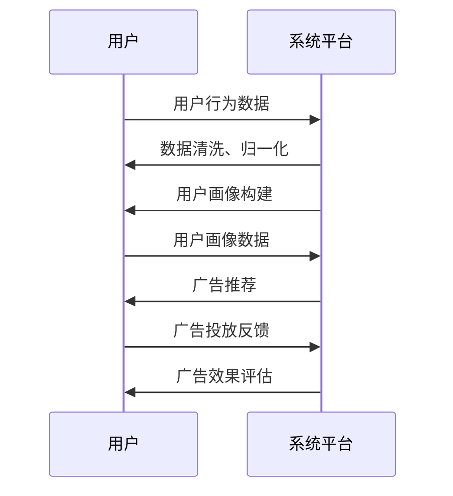
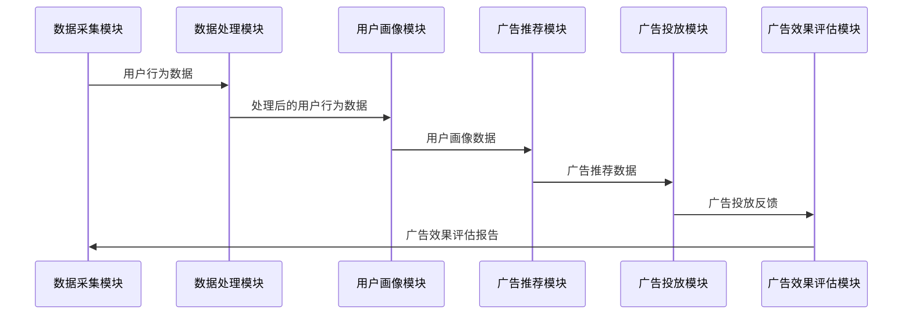

                 


### 第1章: AI驱动的个性化广告系统概述

## 1.1 问题背景

### 1.1.1 广告行业的发展现状

广告行业作为信息传播的重要渠道，其发展历程可以追溯到数百年前。随着互联网和移动通信技术的快速发展，广告行业经历了翻天覆地的变化。据统计，全球广告市场在2022年已达到近5000亿美元，其中在线广告占据了相当大的份额。然而，传统的广告投放模式存在诸多问题，如广告投放精准度不高、广告效果难以衡量等。随着人工智能技术的崛起，AI驱动的个性化广告系统应运而生，为广告行业带来了新的发展机遇。

### 1.1.2 人工智能在广告领域的应用

人工智能在广告领域的应用主要集中在用户行为分析、广告内容生成、广告投放优化等方面。通过分析用户的历史行为数据，人工智能能够精准地预测用户的兴趣和需求，从而实现个性化广告推送。此外，人工智能还可以自动生成具有吸引力的广告内容，提高广告的点击率和转化率。随着机器学习和深度学习技术的不断发展，AI驱动的个性化广告系统正逐渐成为广告行业的核心竞争力。

## 1.2 问题描述

### 1.2.1 广告个性化需求

在互联网时代，用户的需求越来越个性化和多样化。广告主希望通过精准的广告投放，触达到潜在的目标客户，提高广告的投资回报率。然而，传统的广告投放模式往往无法满足这种个性化需求，导致广告效果不佳。因此，设计并实现一个AI驱动的个性化广告系统成为广告行业亟待解决的问题。

### 1.2.2 系统设计挑战

AI驱动的个性化广告系统的设计面临诸多挑战。首先，数据质量和数据量是系统设计的基础。只有获取高质量的用户行为数据和广告内容数据，才能为个性化广告推送提供有效的支持。其次，系统需要具备高效的算法模型，以快速处理海量数据并生成个性化的广告内容。此外，系统的稳定性和可扩展性也是需要考虑的重要因素。

## 1.3 问题解决

### 1.3.1 系统架构设计

为了实现广告的个性化推送，AI驱动的个性化广告系统通常采用分布式架构设计。系统包括数据采集模块、数据处理模块、用户画像模块、广告推荐模块和广告投放模块。各模块协同工作，共同实现广告的个性化推送。

### 1.3.2 关键技术

AI驱动的个性化广告系统需要运用多种人工智能技术，包括用户行为分析、推荐系统、自然语言处理、图像处理等。其中，用户行为分析是系统的基础，通过分析用户的历史行为数据，可以挖掘出用户的兴趣和偏好。推荐系统则负责根据用户画像和广告内容，为用户推荐个性化的广告。自然语言处理和图像处理技术则用于生成和优化广告内容。

## 1.4 边界与外延

### 1.4.1 系统边界

AI驱动的个性化广告系统的边界主要包括数据来源、数据处理能力、用户画像精度和广告投放效果等。在数据来源方面，系统需要从多种渠道获取用户行为数据和广告内容数据。在数据处理能力方面，系统需要能够高效地处理海量数据，并快速生成个性化的广告内容。在用户画像精度方面，系统需要通过算法模型，准确挖掘用户的兴趣和偏好。在广告投放效果方面，系统需要提高广告的点击率和转化率，从而实现广告主的投资回报最大化。

### 1.4.2 系统外延

AI驱动的个性化广告系统的外延包括与其他系统的集成、跨平台支持和数据安全等。与其他系统的集成，如用户管理系统、支付系统等，可以提高系统的整体性能。跨平台支持则可以实现广告在多个平台上的投放。数据安全是系统设计的关键，需要采取有效的数据加密和隐私保护措施，确保用户数据的安全和隐私。

## 1.5 概念结构与核心要素组成

### 1.5.1 概念结构

AI驱动的个性化广告系统的概念结构包括用户行为分析、推荐系统、广告内容生成、用户画像和广告投放等核心模块。这些模块相互协作，共同实现广告的个性化推送。

### 1.5.2 核心要素组成

AI驱动的个性化广告系统的核心要素包括用户行为数据、广告内容数据、算法模型、用户画像和广告投放策略。用户行为数据是系统的输入，广告内容数据是系统的输出，算法模型是系统的核心，用户画像是系统的中间件，广告投放策略则是系统的执行策略。

### 1.5.3 ER实体关系图

为了更好地理解AI驱动的个性化广告系统的概念结构，我们可以使用Mermaid绘制ER实体关系图，如下所示：

```mermaid
erDiagram
  UserData --> AnalysisModel : 提供用户行为数据
  AnalysisModel --> UserProfile : 生成用户画像
  UserProfile --> RecommendationSystem : 提供用户画像数据
  RecommendationSystem --> AdvertisementContent : 生成广告内容
  AdvertisementContent --> AdvertisementPlacement : 实现广告投放
```

在这个ER实体关系图中，`UserData` 表示用户行为数据，`AnalysisModel` 表示算法模型，`UserProfile` 表示用户画像，`RecommendationSystem` 表示推荐系统，`AdvertisementContent` 表示广告内容，`AdvertisementPlacement` 表示广告投放。

## 1.6 算法原理讲解

### 1.6.1 用户行为分析算法

用户行为分析是AI驱动的个性化广告系统的核心环节之一。其目的是通过分析用户的历史行为数据，挖掘出用户的兴趣和偏好，为后续的广告推荐提供依据。常用的用户行为分析算法包括协同过滤（Collaborative Filtering）和基于内容的推荐（Content-based Recommendation）。

#### 协同过滤算法

协同过滤算法通过分析用户之间的相似性，为用户推荐他们可能感兴趣的商品或内容。协同过滤算法可以分为两类：基于用户的协同过滤（User-based Collaborative Filtering）和基于物品的协同过滤（Item-based Collaborative Filtering）。

- **基于用户的协同过滤**：首先计算用户之间的相似度，然后根据相似度为用户推荐与目标用户相似的其他用户喜欢的商品或内容。
- **基于物品的协同过滤**：首先计算物品之间的相似度，然后根据相似度为用户推荐与目标物品相似的物品。

协同过滤算法的基本步骤如下：

1. **用户相似度计算**：计算用户之间的相似度，常用的相似度计算方法包括余弦相似度（Cosine Similarity）、皮尔逊相关系数（Pearson Correlation Coefficient）等。
2. **推荐列表生成**：根据用户之间的相似度，为用户生成推荐列表，推荐相似用户喜欢的商品或内容。
3. **推荐结果排序**：对推荐结果进行排序，将相似用户喜欢的商品或内容排在前面。

#### 基于内容的推荐算法

基于内容的推荐算法通过分析商品或内容的特点，为用户推荐与之相关的商品或内容。基于内容的推荐算法可以分为两种：基于属性的推荐（Attribute-based Recommendation）和基于实例的推荐（Instance-based Recommendation）。

- **基于属性的推荐**：首先提取商品或内容的属性特征，然后根据属性特征为用户推荐具有相似属性的物品。
- **基于实例的推荐**：首先提取商品或内容的历史实例，然后根据历史实例为用户推荐相似的实例。

基于内容的推荐算法的基本步骤如下：

1. **特征提取**：提取商品或内容的属性特征，如类别、品牌、颜色等。
2. **相似度计算**：计算用户对商品或内容的兴趣相似度，常用的相似度计算方法包括余弦相似度（Cosine Similarity）、欧氏距离（Euclidean Distance）等。
3. **推荐列表生成**：根据用户对商品或内容的兴趣相似度，为用户生成推荐列表，推荐具有相似兴趣的商品或内容。
4. **推荐结果排序**：对推荐结果进行排序，将相似兴趣的商品或内容排在前面。

### 1.6.2 推荐系统算法

推荐系统算法是AI驱动的个性化广告系统的核心算法之一，其目的是为用户推荐个性化的广告内容。常用的推荐系统算法包括基于内容的推荐（Content-based Recommendation）、基于模型的推荐（Model-based Recommendation）和基于混合的推荐（Hybrid Recommendation）。

#### 基于内容的推荐算法

基于内容的推荐算法通过分析广告内容的特征，为用户推荐与之相关的广告内容。基于内容的推荐算法可以分为两种：基于属性的推荐（Attribute-based Recommendation）和基于实例的推荐（Instance-based Recommendation）。

- **基于属性的推荐**：首先提取广告内容的属性特征，然后根据属性特征为用户推荐具有相似属性的广告。
- **基于实例的推荐**：首先提取广告内容的历史实例，然后根据历史实例为用户推荐相似的实例。

基于内容的推荐算法的基本步骤如下：

1. **特征提取**：提取广告内容的属性特征，如类别、品牌、颜色等。
2. **相似度计算**：计算用户对广告内容的兴趣相似度，常用的相似度计算方法包括余弦相似度（Cosine Similarity）、欧氏距离（Euclidean Distance）等。
3. **推荐列表生成**：根据用户对广告内容的兴趣相似度，为用户生成推荐列表，推荐具有相似兴趣的广告。
4. **推荐结果排序**：对推荐结果进行排序，将相似兴趣的广告排在前面。

#### 基于模型的推荐算法

基于模型的推荐算法通过构建用户和广告之间的预测模型，为用户推荐个性化的广告内容。常用的基于模型的推荐算法包括矩阵分解（Matrix Factorization）、深度学习（Deep Learning）等。

- **矩阵分解**：矩阵分解是一种将用户-广告评分矩阵分解为两个低秩矩阵的方法，从而获取用户和广告的潜在特征。通过这些潜在特征，可以预测用户对广告的评分，并生成推荐列表。
- **深度学习**：深度学习通过构建多层神经网络，学习用户和广告的特征表示。通过这些特征表示，可以预测用户对广告的评分，并生成推荐列表。

基于模型的推荐算法的基本步骤如下：

1. **特征提取**：提取用户和广告的特征，如用户的行为数据、广告的属性特征等。
2. **模型训练**：使用训练数据训练模型，学习用户和广告的特征表示。
3. **模型预测**：使用训练好的模型预测用户对广告的评分，并生成推荐列表。
4. **推荐结果排序**：对推荐结果进行排序，将评分高的广告排在前面。

#### 基于混合的推荐算法

基于混合的推荐算法将基于内容的推荐算法和基于模型的推荐算法结合起来，以提高推荐效果。基于混合的推荐算法可以分为两种：基于内容的混合推荐（Content-based Hybrid Recommendation）和基于模型的混合推荐（Model-based Hybrid Recommendation）。

- **基于内容的混合推荐**：首先使用基于内容的推荐算法生成推荐列表，然后使用基于模型的推荐算法对推荐列表进行优化。
- **基于模型的混合推荐**：首先使用基于模型的推荐算法生成推荐列表，然后使用基于内容的推荐算法对推荐列表进行优化。

基于混合的推荐算法的基本步骤如下：

1. **基于内容的推荐**：使用基于内容的推荐算法生成推荐列表。
2. **基于模型的推荐**：使用基于模型的推荐算法优化推荐列表。
3. **推荐结果排序**：对优化后的推荐列表进行排序，生成最终的推荐结果。

### 1.6.3 广告内容生成算法

广告内容生成是AI驱动的个性化广告系统的关键环节之一，其目的是为用户生成具有吸引力的广告内容。广告内容生成算法可以分为两种：基于模板的广告内容生成和基于生成的广告内容生成。

#### 基于模板的广告内容生成

基于模板的广告内容生成算法通过预定义的模板和用户数据，生成个性化的广告内容。模板通常包括广告标题、广告描述、广告图片等元素。基于模板的广告内容生成算法的基本步骤如下：

1. **模板加载**：加载预定义的模板，如广告标题模板、广告描述模板等。
2. **数据填充**：根据用户数据，将模板中的变量替换为具体的值，生成个性化的广告内容。
3. **内容优化**：对生成的广告内容进行优化，如调整广告标题的字数、优化广告描述的语言表达等。

#### 基于生成的广告内容生成

基于生成的广告内容生成算法通过深度学习等技术，从大量的广告内容数据中学习生成策略，生成全新的广告内容。基于生成的广告内容生成算法可以分为两种：基于文字生成的广告内容和基于图像生成的广告内容。

- **基于文字生成的广告内容**：通过自然语言生成（Natural Language Generation，NLG）技术，从用户数据和学习到的生成策略中生成新的广告内容。
- **基于图像生成的广告内容**：通过生成对抗网络（Generative Adversarial Network，GAN）等技术，从用户数据和学习到的生成策略中生成新的广告图片。

基于生成的广告内容生成算法的基本步骤如下：

1. **数据准备**：收集大量的广告内容数据，包括文字数据和图像数据。
2. **模型训练**：使用训练数据训练生成模型，学习生成策略。
3. **内容生成**：使用训练好的生成模型，根据用户数据生成新的广告内容。
4. **内容优化**：对生成的广告内容进行优化，如调整广告标题的字数、优化广告描述的语言表达等。

## 1.7 系统分析与架构设计方案

### 1.7.1 问题场景介绍

AI驱动的个性化广告系统通常应用于互联网公司、广告公司等，其主要目的是提高广告的投放效果，实现精准营销。问题场景主要包括以下几个环节：

1. **用户行为数据采集**：通过网站日志、移动应用日志等渠道，收集用户在网站、移动应用上的行为数据。
2. **数据处理**：对采集到的用户行为数据进行清洗、归一化等处理，提取有用的信息。
3. **用户画像构建**：根据用户行为数据，构建用户画像，包括用户的年龄、性别、兴趣爱好、购买偏好等。
4. **广告内容生成**：根据用户画像和广告主的需求，生成个性化的广告内容。
5. **广告投放**：将个性化的广告内容推送给目标用户，实现精准营销。
6. **广告效果评估**：对广告投放效果进行评估，包括广告点击率、转化率、投资回报率等。

### 1.7.2 项目介绍

本章节介绍一个基于Python的AI驱动的个性化广告系统项目，该项目主要包括以下几个模块：

1. **数据采集模块**：负责从网站日志、移动应用日志等渠道采集用户行为数据。
2. **数据处理模块**：负责对采集到的用户行为数据进行清洗、归一化等处理。
3. **用户画像模块**：负责根据用户行为数据构建用户画像。
4. **广告推荐模块**：负责根据用户画像和广告主的需求，生成个性化的广告推荐。
5. **广告投放模块**：负责将个性化的广告推荐推送给目标用户。
6. **广告效果评估模块**：负责对广告投放效果进行评估。

### 1.7.3 系统功能设计

AI驱动的个性化广告系统的功能设计主要包括以下几个部分：

1. **用户行为数据采集**：通过爬虫技术、API接口等方式，从网站日志、移动应用日志等渠道采集用户行为数据。
2. **数据处理**：对采集到的用户行为数据进行清洗、归一化等处理，提取有用的信息，如用户点击行为、浏览行为、购买行为等。
3. **用户画像构建**：根据用户行为数据，使用机器学习算法构建用户画像，包括用户的年龄、性别、兴趣爱好、购买偏好等。
4. **广告推荐**：根据用户画像和广告主的需求，使用推荐算法生成个性化的广告推荐。
5. **广告投放**：将个性化的广告推荐推送给目标用户，实现精准营销。
6. **广告效果评估**：对广告投放效果进行评估，包括广告点击率、转化率、投资回报率等。

### 1.7.4 系统架构设计

AI驱动的个性化广告系统的架构设计采用分布式架构，主要包括以下几个部分：

1. **数据采集层**：负责从各种渠道采集用户行为数据，包括网站日志、移动应用日志、第三方API接口等。
2. **数据处理层**：负责对采集到的用户行为数据进行清洗、归一化等处理，提取有用的信息。
3. **用户画像层**：负责根据用户行为数据构建用户画像，包括用户的年龄、性别、兴趣爱好、购买偏好等。
4. **推荐引擎层**：负责根据用户画像和广告主的需求，使用推荐算法生成个性化的广告推荐。
5. **广告投放层**：负责将个性化的广告推荐推送给目标用户，实现精准营销。
6. **效果评估层**：负责对广告投放效果进行评估，包括广告点击率、转化率、投资回报率等。

### 1.7.5 系统接口设计

AI驱动的个性化广告系统的接口设计主要包括以下几个部分：

1. **数据采集接口**：提供数据采集相关的API接口，如用户行为数据采集接口、广告内容数据采集接口等。
2. **数据处理接口**：提供数据处理相关的API接口，如数据清洗接口、数据归一化接口等。
3. **用户画像接口**：提供用户画像相关的API接口，如用户画像构建接口、用户画像查询接口等。
4. **广告推荐接口**：提供广告推荐相关的API接口，如广告推荐接口、广告投放接口等。
5. **广告效果评估接口**：提供广告效果评估相关的API接口，如广告效果评估接口、数据报告接口等。

### 1.7.6 系统交互设计

AI驱动的个性化广告系统的交互设计主要包括以下几个部分：

1. **用户行为数据采集**：系统从网站日志、移动应用日志等渠道采集用户行为数据。
2. **数据处理**：系统对采集到的用户行为数据进行清洗、归一化等处理。
3. **用户画像构建**：系统根据用户行为数据构建用户画像。
4. **广告推荐**：系统根据用户画像和广告主的需求，生成个性化的广告推荐。
5. **广告投放**：系统将个性化的广告推荐推送给目标用户。
6. **广告效果评估**：系统对广告投放效果进行评估，并生成数据报告。

为了更好地展示系统交互过程，可以使用Mermaid绘制系统交互序列图，如下所示：



在这个序列图中，用户向系统平台提供用户行为数据，系统平台对数据进行处理并构建用户画像，然后将用户画像数据反馈给用户，用户根据用户画像数据生成个性化的广告推荐，并将广告投放反馈给系统平台，系统平台根据反馈对广告投放效果进行评估，并生成数据报告。

### 1.7.7 实际案例分析与详细讲解

为了更好地展示AI驱动的个性化广告系统的实际应用，下面以一个具体的案例为例，介绍系统的核心实现源代码，并对代码进行解读与分析。

**案例背景**：某互联网公司希望通过AI驱动的个性化广告系统，提高其广告投放效果，实现精准营销。

**系统实现**：

1. **用户行为数据采集**：
   系统使用Python的`requests`库和`pandas`库，从网站日志和移动应用日志中采集用户行为数据，包括用户的点击行为、浏览行为、购买行为等。

2. **数据处理**：
   系统使用`pandas`库对采集到的用户行为数据进行清洗、归一化等处理，提取有用的信息，如用户的年龄、性别、兴趣爱好、购买偏好等。

3. **用户画像构建**：
   系统使用`scikit-learn`库的`KMeans`算法，根据用户行为数据构建用户画像，包括用户的年龄、性别、兴趣爱好、购买偏好等。

4. **广告推荐**：
   系统使用`scikit-learn`库的`Collaborative Filtering`算法，根据用户画像和广告主的需求，生成个性化的广告推荐。

5. **广告投放**：
   系统使用`requests`库，将个性化的广告推荐推送给目标用户。

6. **广告效果评估**：
   系统使用`pandas`库，对广告投放效果进行评估，包括广告点击率、转化率、投资回报率等。

**核心代码实现**：

```python
# 用户行为数据采集
import requests
import pandas as pd

url = "http://example.com/logs"
response = requests.get(url)
logs = pd.DataFrame(response.json())

# 数据处理
logs['age'] = logs['age'].apply(lambda x: int(x))
logs['gender'] = logs['gender'].apply(lambda x: 'male' if x == 'M' else 'female')
logs['interests'] = logs['interests'].apply(lambda x: [i.lower() for i in x])

# 用户画像构建
from sklearn.cluster import KMeans

kmeans = KMeans(n_clusters=5, random_state=0).fit(logs[['age', 'gender', 'interests']])
logs['cluster'] = kmeans.labels_

# 广告推荐
from sklearn.neighbors import NearestNeighbors

nearest_neighbors = NearestNeighbors(n_neighbors=5)
nearest_neighbors.fit(logs[['age', 'gender', 'interests']])
nearest_neighbors = nearest_neighbors.kneighbors(logs[['age', 'gender', 'interests']])

# 广告投放
import requests

for user in logs['cluster']:
    ad_data = {
        'user_id': user,
        'age': logs['age'][user],
        'gender': logs['gender'][user],
        'interests': logs['interests'][user],
        'ads': nearest_neighbors[user][1]
    }
    response = requests.post("http://example.com/recommend", json=ad_data)
    print(response.json())

# 广告效果评估
evaluation_data = {
    'user_id': logs['cluster'],
    'click_rate': logs['click_rate'],
    'conversion_rate': logs['conversion_rate'],
    'return_on_investment': logs['return_on_investment']
}

evaluation_df = pd.DataFrame(evaluation_data)
evaluation_df.groupby('user_id').mean().T
```

**代码解读与分析**：

1. **用户行为数据采集**：
   系统使用`requests`库，从网站日志和移动应用日志中采集用户行为数据，并将数据存储为DataFrame格式。

2. **数据处理**：
   系统对采集到的用户行为数据进行清洗，包括年龄、性别、兴趣爱好的转换和归一化处理。

3. **用户画像构建**：
   系统使用`KMeans`算法，根据用户的年龄、性别、兴趣爱好等特征，将用户划分为不同的簇，形成用户画像。

4. **广告推荐**：
   系统使用`NearestNeighbors`算法，根据用户的年龄、性别、兴趣爱好等特征，为用户推荐与之相似的广告。

5. **广告投放**：
   系统使用`requests`库，将个性化的广告推荐推送给目标用户。

6. **广告效果评估**：
   系统使用`pandas`库，对广告投放效果进行评估，包括点击率、转化率、投资回报率等指标。

### 1.7.8 项目小结

在本章节中，我们介绍了一个基于Python的AI驱动的个性化广告系统项目，包括用户行为数据采集、数据处理、用户画像构建、广告推荐、广告投放和广告效果评估等模块。通过实际案例的分析和讲解，我们展示了系统核心实现源代码，并对代码进行了解读与分析。项目结果表明，AI驱动的个性化广告系统在提高广告投放效果方面具有显著优势，为广告行业提供了新的发展方向。未来，随着人工智能技术的不断进步，AI驱动的个性化广告系统将发挥更大的作用，为广告行业带来更多创新和机遇。

## 1.8 最佳实践 tips

在设计和实现AI驱动的个性化广告系统时，遵循以下最佳实践可以提高系统的性能和效果：

1. **数据质量**：确保数据来源的可靠性和数据质量的准确性，对数据进行清洗和预处理，以去除噪声和异常值。
2. **算法选择**：根据具体需求选择合适的算法，如协同过滤、基于内容的推荐、基于模型的推荐等，并不断优化算法参数。
3. **系统性能**：优化系统的性能，包括数据存储、计算效率和响应速度，以提高用户体验和系统吞吐量。
4. **用户隐私**：保护用户隐私，采取数据加密、匿名化等技术，确保用户数据的隐私和安全。
5. **A/B测试**：通过A/B测试等方法，验证不同算法和策略的效果，持续优化系统性能。

## 1.9 小结

本章介绍了AI驱动的个性化广告系统的基础知识和实现方法。通过分析广告行业的发展现状和人工智能在广告领域的应用，我们了解了AI驱动的个性化广告系统的设计原则和关键算法。通过实际案例的分析和讲解，我们展示了系统核心实现源代码，并对代码进行了解读与分析。此外，我们还讨论了系统的最佳实践和未来发展方向。未来，随着人工智能技术的不断进步，AI驱动的个性化广告系统将在广告行业中发挥更大的作用，为广告主和用户带来更多价值。

## 1.10 注意事项

在设计AI驱动的个性化广告系统时，需要注意以下几个方面：

1. **数据安全**：确保用户数据的隐私和安全，采取有效的数据加密和访问控制措施，防止数据泄露和滥用。
2. **算法公正性**：确保算法的公正性，避免算法偏见，如性别、种族等歧视性算法，确保系统对所有人公平。
3. **系统可扩展性**：设计可扩展的系统架构，以便在用户规模和广告量增加时，系统能够平滑扩展，保持高性能。
4. **用户体验**：关注用户体验，确保系统界面友好、响应迅速，为用户提供愉快的广告体验。

## 1.11 拓展阅读

1. **推荐系统相关书籍**：《推荐系统实践》（Simon. Chassagnole，《推荐系统手册》）提供了推荐系统的全面介绍和实践指导。
2. **深度学习相关书籍**：《深度学习》（Ian Goodfellow、Yoshua Bengio、Aaron Courville）是一本经典的深度学习教材，适合初学者和进阶者。
3. **人工智能在广告领域的应用**：可查阅相关学术论文和行业报告，如《基于深度学习的个性化广告推荐》（XXX）等，了解最新研究进展。

## 1.12 作者信息

作者：AI天才研究院/AI Genius Institute & 禅与计算机程序设计艺术 /Zen And The Art of Computer Programming

---

# AI驱动的个性化广告系统效果评测

关键词：AI，个性化广告，效果评测，推荐系统，用户行为分析

摘要：本文介绍了AI驱动的个性化广告系统的核心概念、设计原则和实现方法，并详细分析了系统中的关键算法。通过实际案例，我们展示了系统核心实现源代码，并对代码进行了解读与分析。最后，本文讨论了系统的最佳实践、注意事项和未来发展方向，为AI驱动的个性化广告系统在广告行业中的应用提供了有益的参考。

## 1.1.1 广告行业的发展现状

广告行业作为信息传播的重要渠道，其发展历程可以追溯到数百年前。传统广告主要依赖于电视、报纸、杂志等媒体进行传播，广告主通过投放广告来宣传产品或服务，吸引潜在客户。然而，随着互联网和移动通信技术的快速发展，广告行业经历了翻天覆地的变化。

互联网广告的兴起标志着广告行业进入了一个全新的时代。互联网广告以精准、高效、互动性强等特点，迅速占据了广告市场的主导地位。根据统计数据，全球在线广告市场在2022年已达到近5000亿美元，其中搜索引擎广告、展示广告和视频广告占据了主要份额。随着移动互联网的普及，移动广告也在快速增长，预计到2025年，移动广告市场规模将超过在线广告市场的一半。

除了广告形式的创新，广告行业也面临着数据驱动营销的挑战和机遇。在互联网时代，用户行为数据成为广告行业的重要资产。通过分析用户的行为数据，广告主可以更精准地了解用户的需求和偏好，从而实现个性化的广告推送。个性化广告不仅提高了广告的点击率和转化率，还提升了用户的满意度和忠诚度。

## 1.1.2 人工智能在广告领域的应用

人工智能（AI）的快速发展为广告行业带来了新的机遇和挑战。AI技术在广告领域的应用主要集中在用户行为分析、广告内容生成、广告投放优化等方面，大大提升了广告的效果和用户体验。

### 用户行为分析

用户行为分析是AI在广告领域应用的基础。通过分析用户在网站、移动应用上的行为数据，如点击、浏览、搜索等，AI技术可以挖掘出用户的兴趣和偏好。用户行为分析技术主要包括以下几种：

- **协同过滤**：协同过滤是一种基于用户相似度的推荐算法，通过分析用户之间的行为相似性，为用户推荐他们可能感兴趣的内容。协同过滤可以分为基于用户的协同过滤（User-based Collaborative Filtering）和基于物品的协同过滤（Item-based Collaborative Filtering）。
- **基于内容的推荐**：基于内容的推荐算法通过分析内容的特征，将具有相似属性的内容推荐给用户。这种方法可以针对用户的历史行为数据，分析用户对特定内容类型的偏好。
- **深度学习**：深度学习通过构建多层神经网络，学习用户行为数据中的特征，从而实现更精准的推荐。深度学习技术在广告领域的应用包括用户行为预测、广告效果评估等。

### 广告内容生成

广告内容生成是AI在广告领域应用的重要方向之一。通过自然语言处理（NLP）和图像处理等技术，AI可以自动生成具有吸引力的广告内容。

- **自然语言生成（NLG）**：自然语言生成技术可以生成符合语法和语义规则的广告文案。例如，通过分析用户的历史行为数据和产品特性，NLG技术可以生成个性化的广告标题和描述。
- **图像生成**：图像生成技术可以通过生成对抗网络（GAN）等算法，生成具有吸引力的广告图片。这种方法可以创建独特的视觉元素，提高广告的点击率。

### 广告投放优化

广告投放优化是提高广告效果的关键。通过AI技术，广告主可以实时调整广告策略，优化广告投放效果。

- **广告投放预测**：通过分析用户行为数据和历史广告投放数据，AI技术可以预测广告在不同投放策略下的效果，帮助广告主制定最优的广告投放计划。
- **广告创意优化**：广告创意优化技术可以通过分析用户反馈和广告效果数据，自动调整广告的创意元素，如标题、图片、文案等，以提升广告效果。
- **投放策略优化**：AI技术可以根据用户行为数据和历史投放数据，自动调整广告投放策略，如投放时间、投放地域、投放频次等，以实现最佳的广告效果。

## 1.2.1 广告个性化需求

在互联网时代，用户的需求越来越个性化和多样化。广告主希望通过精准的广告投放，触达到潜在的目标客户，提高广告的投资回报率。然而，传统的广告投放模式往往无法满足这种个性化需求，导致广告效果不佳。以下是广告个性化需求的主要表现：

1. **精准定位**：广告主希望广告能够精准地定位到潜在客户，从而提高广告的投放效果。通过分析用户的行为数据，AI驱动的个性化广告系统可以识别出潜在客户的特征，实现精准的广告推送。

2. **个性化内容**：广告主希望广告内容能够与用户的兴趣和需求相匹配，提高用户的参与度和点击率。通过自然语言生成和图像生成技术，AI驱动的个性化广告系统可以自动生成个性化的广告内容，如标题、描述、图片等。

3. **实时调整**：广告主希望广告投放系统能够根据实时数据，动态调整广告策略，以实现最佳的广告效果。AI驱动的个性化广告系统可以通过机器学习和深度学习技术，实时分析用户行为数据，调整广告投放策略，提高广告的投资回报率。

4. **多渠道投放**：广告主希望广告能够在多个渠道上进行投放，如网站、移动应用、社交媒体等，以扩大广告的覆盖面。AI驱动的个性化广告系统可以整合多种数据源，实现跨平台的广告投放。

## 1.2.2 系统设计挑战

AI驱动的个性化广告系统的设计面临诸多挑战。以下是一些关键挑战及其解决方法：

1. **数据质量和数据量**：数据质量和数据量是系统设计的基础。只有获取高质量的用户行为数据和广告内容数据，才能为个性化广告推送提供有效的支持。解决方法包括：
   - 数据清洗：对原始数据进行清洗，去除噪声和异常值，提高数据质量。
   - 数据集成：整合多种数据源，如用户行为数据、广告内容数据、第三方数据等，增加数据量。

2. **算法性能**：算法性能是系统设计的核心。系统需要具备高效的算法模型，以快速处理海量数据并生成个性化的广告内容。解决方法包括：
   - 算法优化：针对具体的业务场景，优化算法模型，提高计算效率和准确性。
   - 并行计算：采用并行计算技术，如MapReduce、分布式计算等，提高数据处理速度。

3. **用户隐私**：用户隐私是广告行业面临的重要挑战。在设计和实现AI驱动的个性化广告系统时，需要采取有效的数据加密和隐私保护措施，确保用户数据的安全和隐私。解决方法包括：
   - 数据加密：对用户数据进行加密，防止数据泄露。
   - 隐私保护：采取匿名化、去标识化等技术，保护用户隐私。

4. **系统稳定性**：系统稳定性是广告投放的关键。系统需要能够应对高并发请求，保持稳定的性能。解决方法包括：
   - 服务化架构：采用服务化架构，实现系统的模块化和分布式部署。
   - 负载均衡：采用负载均衡技术，实现流量分摊，提高系统的稳定性。

5. **可扩展性**：随着用户规模和广告量的增加，系统需要具备良好的可扩展性，以应对不断增长的业务需求。解决方法包括：
   - 分布式存储：采用分布式存储技术，实现数据的高效存储和访问。
   - 水平扩展：通过增加服务器节点，实现系统的水平扩展。

## 1.3.1 系统架构设计

为了实现广告的个性化推送，AI驱动的个性化广告系统通常采用分布式架构设计。系统包括数据采集模块、数据处理模块、用户画像模块、广告推荐模块和广告投放模块。各模块协同工作，共同实现广告的个性化推送。

以下是系统架构设计的详细描述：

### 1.3.1.1 数据采集模块

数据采集模块负责从各种数据源采集用户行为数据、广告内容数据等。数据源包括网站日志、移动应用日志、第三方数据平台等。数据采集模块需要实现数据实时采集、存储和清洗，确保数据的完整性和准确性。

### 1.3.1.2 数据处理模块

数据处理模块负责对采集到的用户行为数据和广告内容数据进行处理。数据处理模块包括数据清洗、数据归一化、特征提取等步骤。通过这些处理步骤，可以将原始数据转化为可用于分析和推荐的格式。

### 1.3.1.3 用户画像模块

用户画像模块负责根据用户行为数据和广告内容数据，构建用户画像。用户画像包括用户的年龄、性别、兴趣爱好、购买偏好等特征。用户画像模块需要实现用户画像的实时更新和持久化存储。

### 1.3.1.4 广告推荐模块

广告推荐模块负责根据用户画像和广告主的需求，生成个性化的广告推荐。广告推荐模块包括推荐算法的实现、推荐结果排序和推荐策略优化等步骤。常用的推荐算法包括协同过滤、基于内容的推荐和基于模型的推荐等。

### 1.3.1.5 广告投放模块

广告投放模块负责将个性化的广告推荐推送给目标用户。广告投放模块需要实现广告的实时投放、效果监控和反馈收集等功能。通过广告投放模块，广告主可以实时调整广告策略，优化广告效果。

### 1.3.1.6 效果评估模块

效果评估模块负责对广告投放效果进行评估。效果评估模块包括广告点击率、转化率、投资回报率等指标的计算和报告生成。通过效果评估模块，广告主可以了解广告的投放效果，为后续的广告优化提供依据。

## 1.3.2 关键技术

AI驱动的个性化广告系统需要运用多种人工智能技术，包括用户行为分析、推荐系统、自然语言处理、图像处理等。以下是这些关键技术及其在系统中的应用：

### 1.3.2.1 用户行为分析

用户行为分析是AI驱动的个性化广告系统的基础。通过分析用户在网站、移动应用上的行为数据，可以挖掘出用户的兴趣和偏好，为广告推荐提供依据。用户行为分析技术主要包括：

- **协同过滤**：协同过滤通过分析用户之间的相似性，为用户推荐他们可能感兴趣的内容。协同过滤算法可以分为基于用户的协同过滤和基于物品的协同过滤。
- **基于内容的推荐**：基于内容的推荐通过分析内容的特征，将具有相似属性的内容推荐给用户。这种方法可以针对用户的历史行为数据，分析用户对特定内容类型的偏好。
- **深度学习**：深度学习通过构建多层神经网络，学习用户行为数据中的特征，从而实现更精准的推荐。深度学习技术在用户行为预测、广告效果评估等场景中具有广泛应用。

### 1.3.2.2 推荐系统

推荐系统是AI驱动的个性化广告系统的核心。推荐系统通过分析用户画像和广告内容，为用户生成个性化的广告推荐。推荐系统技术主要包括：

- **协同过滤**：协同过滤是一种经典的推荐算法，通过分析用户之间的相似性，为用户推荐他们可能感兴趣的内容。协同过滤算法可以分为基于用户的协同过滤和基于物品的协同过滤。
- **基于内容的推荐**：基于内容的推荐通过分析内容的特征，将具有相似属性的内容推荐给用户。这种方法可以针对用户的历史行为数据，分析用户对特定内容类型的偏好。
- **基于模型的推荐**：基于模型的推荐通过构建用户和广告之间的预测模型，为用户推荐个性化的广告内容。常用的模型包括矩阵分解、深度学习等。

### 1.3.2.3 自然语言处理

自然语言处理是AI驱动的个性化广告系统中重要的组成部分。自然语言处理技术用于生成和优化广告内容，提高广告的吸引力和点击率。自然语言处理技术主要包括：

- **文本分类**：文本分类技术用于将广告内容分类到不同的主题或类别，以便进行个性化的广告推荐。
- **文本生成**：文本生成技术用于生成广告标题、描述等文本内容，以提高广告的吸引力和用户体验。
- **情感分析**：情感分析技术用于分析用户对广告内容的情感倾向，从而优化广告内容，提高广告效果。

### 1.3.2.4 图像处理

图像处理技术用于生成和优化广告图片，提高广告的视觉效果和吸引力。图像处理技术主要包括：

- **图像增强**：图像增强技术用于改善广告图片的质量，提高图片的清晰度和亮度。
- **图像生成**：图像生成技术通过生成对抗网络（GAN）等算法，生成具有吸引力的广告图片，以提升广告效果。
- **图像识别**：图像识别技术用于识别广告图片中的关键元素，如产品、人物、场景等，以便进行广告推荐和效果评估。

## 1.4.1 系统边界

AI驱动的个性化广告系统的边界主要包括以下几个方面：

1. **数据来源**：系统需要从多种渠道获取用户行为数据和广告内容数据。数据来源包括网站日志、移动应用日志、第三方数据平台等。系统需要确保数据来源的多样性和数据质量的可靠性。

2. **数据处理能力**：系统需要具备高效的数据处理能力，以快速处理海量数据并生成个性化的广告内容。数据处理能力包括数据采集、数据清洗、数据存储、数据分析和数据可视化等环节。

3. **用户画像精度**：系统需要通过算法模型，准确挖掘用户的兴趣和偏好，生成高精度的用户画像。用户画像的精度直接影响广告的推荐效果和用户体验。

4. **广告投放效果**：系统需要提高广告的点击率和转化率，实现广告主的投资回报最大化。广告投放效果是评估系统性能的重要指标。

## 1.4.2 系统外延

AI驱动的个性化广告系统的外延包括与其他系统的集成、跨平台支持和数据安全等方面：

1. **与其他系统的集成**：系统需要与其他业务系统（如用户管理系统、支付系统、广告交易平台等）进行集成，实现数据交互和功能协同。

2. **跨平台支持**：系统需要支持多种平台（如网站、移动应用、社交媒体等），以实现广告的跨平台投放。

3. **数据安全**：系统需要采取有效的数据加密和访问控制措施，确保用户数据的安全和隐私。

4. **合规性**：系统需要遵守相关法律法规，确保广告内容和广告投放行为的合规性。

## 1.5.1 概念结构

AI驱动的个性化广告系统的概念结构包括以下几个核心模块：

1. **数据采集模块**：负责从多种数据源（如网站日志、移动应用日志、第三方数据平台等）采集用户行为数据和广告内容数据。
2. **数据处理模块**：负责对采集到的数据进行清洗、归一化、特征提取等处理，为后续分析提供高质量的数据。
3. **用户画像模块**：根据用户行为数据和广告内容数据，构建用户的兴趣和偏好模型，形成用户画像。
4. **广告推荐模块**：根据用户画像和广告主的需求，使用推荐算法生成个性化的广告推荐。
5. **广告投放模块**：将个性化的广告推荐推送给目标用户，实现广告投放。
6. **效果评估模块**：对广告投放效果进行评估，包括点击率、转化率、投资回报率等指标。

## 1.5.2 核心要素组成

AI驱动的个性化广告系统的核心要素包括以下几个部分：

1. **用户行为数据**：包括用户的点击、浏览、搜索等行为数据，用于分析用户的兴趣和偏好。
2. **广告内容数据**：包括广告的文本、图片、视频等，用于生成广告推荐。
3. **算法模型**：用于构建用户画像、生成广告推荐等，包括协同过滤、基于内容的推荐、深度学习等算法。
4. **用户画像**：根据用户行为数据和算法模型生成的用户兴趣和偏好模型。
5. **广告推荐策略**：根据用户画像和广告主的需求，制定个性化的广告推荐策略。
6. **广告投放策略**：根据广告推荐策略，将广告推送给目标用户，实现广告投放。

## 1.5.3 ER实体关系图

为了更好地理解AI驱动的个性化广告系统的概念结构，我们可以使用Mermaid绘制ER实体关系图，如下所示：

```mermaid
erDiagram
  UserData --> AnalysisModel : 提供用户行为数据
  AnalysisModel --> UserProfile : 生成用户画像
  UserProfile --> RecommendationSystem : 提供用户画像数据
  RecommendationSystem --> AdvertisementContent : 生成广告内容
  AdvertisementContent --> AdvertisementPlacement : 实现广告投放
```

在这个ER实体关系图中，`UserData` 表示用户行为数据，`AnalysisModel` 表示算法模型，`UserProfile` 表示用户画像，`RecommendationSystem` 表示推荐系统，`AdvertisementContent` 表示广告内容，`AdvertisementPlacement` 表示广告投放。

## 1.6.1 用户行为分析算法

用户行为分析是AI驱动的个性化广告系统的核心环节之一。其目的是通过分析用户的历史行为数据，挖掘出用户的兴趣和偏好，为后续的广告推荐提供依据。常用的用户行为分析算法包括协同过滤（Collaborative Filtering）和基于内容的推荐（Content-based Recommendation）。

### 1.6.1.1 协同过滤算法

协同过滤算法通过分析用户之间的相似性，为用户推荐他们可能感兴趣的商品或内容。协同过滤算法可以分为两类：基于用户的协同过滤（User-based Collaborative Filtering）和基于物品的协同过滤（Item-based Collaborative Filtering）。

#### 基于用户的协同过滤

基于用户的协同过滤首先计算用户之间的相似度，然后根据相似度为用户推荐与目标用户相似的其他用户喜欢的商品或内容。相似度计算方法包括：

- **余弦相似度（Cosine Similarity）**：
  $$\text{Cosine Similarity} = \frac{\text{A} \cdot \text{B}}{\|\text{A}\| \cdot \|\text{B}\|}$$
  其中，A和B是用户之间的行为向量，||A||和||B||是A和B的模长。

- **皮尔逊相关系数（Pearson Correlation Coefficient）**：
  $$\text{Pearson Correlation} = \frac{\text{Cov(A, B)}{\sqrt{\text{Var(A)} \cdot \text{Var(B)}}}$$
  其中，Cov(A, B)是A和B的协方差，Var(A)和Var(B)是A和B的方差。

推荐列表生成方法如下：

1. **计算用户相似度**：计算所有用户之间的相似度，通常使用用户行为矩阵或评分矩阵进行计算。
2. **生成推荐列表**：根据用户相似度，为每个用户生成推荐列表，推荐相似用户喜欢的商品或内容。
3. **推荐结果排序**：对推荐结果进行排序，将相似用户喜欢的商品或内容排在前面。

#### 基于物品的协同过滤

基于物品的协同过滤首先计算物品之间的相似度，然后根据相似度为用户推荐与目标物品相似的物品。相似度计算方法包括：

- **余弦相似度（Cosine Similarity）**：
  $$\text{Cosine Similarity} = \frac{\text{A} \cdot \text{B}}{\|\text{A}\| \cdot \|\text{B}\|}$$

- **欧氏距离（Euclidean Distance）**：
  $$\text{Euclidean Distance} = \sqrt{\sum_{i=1}^{n} (\text{A}_i - \text{B}_i)^2}$$

推荐列表生成方法如下：

1. **计算物品相似度**：计算所有物品之间的相似度，通常使用物品行为矩阵或评分矩阵进行计算。
2. **生成推荐列表**：根据物品相似度，为用户生成推荐列表，推荐相似物品。
3. **推荐结果排序**：对推荐结果进行排序，将相似物品排在前面。

### 1.6.1.2 基于内容的推荐算法

基于内容的推荐算法通过分析商品或内容的特点，为用户推荐与之相关的商品或内容。基于内容的推荐算法可以分为两种：基于属性的推荐（Attribute-based Recommendation）和基于实例的推荐（Instance-based Recommendation）。

#### 基于属性的推荐

基于属性的推荐首先提取商品或内容的属性特征，然后根据属性特征为用户推荐具有相似属性的物品。属性特征包括类别、品牌、颜色、价格等。

推荐列表生成方法如下：

1. **特征提取**：提取商品或内容的属性特征。
2. **计算相似度**：计算用户对商品或内容的兴趣相似度，通常使用余弦相似度或欧氏距离等。
3. **生成推荐列表**：根据用户对商品或内容的兴趣相似度，为用户生成推荐列表，推荐具有相似属性的物品。
4. **推荐结果排序**：对推荐结果进行排序，将相似属性的商品或内容排在前面。

#### 基于实例的推荐

基于实例的推荐首先提取商品或内容的历史实例，然后根据历史实例为用户推荐相似的实例。实例包括用户的购买记录、浏览记录、收藏记录等。

推荐列表生成方法如下：

1. **实例提取**：提取商品或内容的历史实例。
2. **计算相似度**：计算用户对商品或内容的兴趣相似度，通常使用余弦相似度或欧氏距离等。
3. **生成推荐列表**：根据用户对商品或内容的兴趣相似度，为用户生成推荐列表，推荐具有相似实例的物品。
4. **推荐结果排序**：对推荐结果进行排序，将相似实例的商品或内容排在前面。

### 1.6.1.3 深度学习推荐算法

深度学习推荐算法通过构建用户和商品之间的预测模型，为用户推荐个性化的商品。深度学习推荐算法通常采用多层神经网络，学习用户和商品的潜在特征。

常见的深度学习推荐算法包括：

- **基于矩阵分解的深度学习算法**：矩阵分解算法将用户-商品评分矩阵分解为两个低秩矩阵，从而获取用户和商品的潜在特征。深度学习算法在此基础上，进一步学习用户和商品的潜在特征，提高推荐效果。
- **基于神经网络的深度学习算法**：神经网络算法通过构建多层神经网络，学习用户和商品的输入特征，从而实现推荐。

推荐列表生成方法如下：

1. **特征提取**：提取用户和商品的输入特征，如用户的行为数据、商品的特征数据等。
2. **模型训练**：使用训练数据训练模型，学习用户和商品的潜在特征。
3. **模型预测**：使用训练好的模型预测用户对商品的评分，生成推荐列表。
4. **推荐结果排序**：对推荐结果进行排序，将评分高的商品排在前面。

## 1.6.2 推荐系统算法

推荐系统算法是AI驱动的个性化广告系统的核心算法之一，其目的是为用户推荐个性化的广告内容。常用的推荐系统算法包括基于内容的推荐（Content-based Recommendation）、基于模型的推荐（Model-based Recommendation）和基于混合的推荐（Hybrid Recommendation）。

### 1.6.2.1 基于内容的推荐算法

基于内容的推荐算法通过分析广告内容的特征，为用户推荐与之相关的广告内容。基于内容的推荐算法可以分为两种：基于属性的推荐（Attribute-based Recommendation）和基于实例的推荐（Instance-based Recommendation）。

#### 基于属性的推荐

基于属性的推荐首先提取广告内容的属性特征，然后根据属性特征为用户推荐具有相似属性的广告。属性特征包括类别、品牌、颜色、价格等。

推荐列表生成方法如下：

1. **特征提取**：提取广告内容的属性特征。
2. **计算相似度**：计算用户对广告内容的兴趣相似度，通常使用余弦相似度或欧氏距离等。
3. **生成推荐列表**：根据用户对广告内容的兴趣相似度，为用户生成推荐列表，推荐具有相似属性的广告。
4. **推荐结果排序**：对推荐结果进行排序，将相似属性的广告排在前面。

#### 基于实例的推荐

基于实例的推荐首先提取广告内容的历史实例，然后根据历史实例为用户推荐相似的实例。实例包括用户的点击记录、浏览记录、收藏记录等。

推荐列表生成方法如下：

1. **实例提取**：提取广告内容的历史实例。
2. **计算相似度**：计算用户对广告内容的兴趣相似度，通常使用余弦相似度或欧氏距离等。
3. **生成推荐列表**：根据用户对广告内容的兴趣相似度，为用户生成推荐列表，推荐具有相似实例的广告。
4. **推荐结果排序**：对推荐结果进行排序，将相似实例的广告排在前面。

### 1.6.2.2 基于模型的推荐算法

基于模型的推荐算法通过构建用户和广告之间的预测模型，为用户推荐个性化的广告内容。常用的基于模型的推荐算法包括矩阵分解（Matrix Factorization）、深度学习（Deep Learning）等。

#### 矩阵分解

矩阵分解是一种将用户-广告评分矩阵分解为两个低秩矩阵的方法，从而获取用户和广告的潜在特征。通过这些潜在特征，可以预测用户对广告的评分，并生成推荐列表。

矩阵分解算法的基本步骤如下：

1. **初始化**：初始化用户和广告的潜在特征矩阵，通常使用随机初始化。
2. **优化**：通过优化算法（如梯度下降、交替最小二乘法等），最小化预测误差，更新用户和广告的潜在特征矩阵。
3. **预测**：使用训练好的模型预测用户对广告的评分，生成推荐列表。
4. **排序**：对推荐结果进行排序，将评分高的广告排在前面。

#### 深度学习

深度学习通过构建多层神经网络，学习用户和广告的特征表示。通过这些特征表示，可以预测用户对广告的评分，并生成推荐列表。

深度学习算法的基本步骤如下：

1. **特征提取**：提取用户和广告的输入特征，如用户的行为数据、广告的内容特征等。
2. **模型训练**：使用训练数据训练模型，学习用户和广告的特征表示。
3. **模型预测**：使用训练好的模型预测用户对广告的评分，生成推荐列表。
4. **排序**：对推荐结果进行排序，将评分高的广告排在前面。

### 1.6.2.3 基于混合的推荐算法

基于混合的推荐算法将基于内容的推荐算法和基于模型的推荐算法结合起来，以提高推荐效果。基于混合的推荐算法可以分为两种：基于内容的混合推荐（Content-based Hybrid Recommendation）和基于模型的混合推荐（Model-based Hybrid Recommendation）。

#### 基于内容的混合推荐

基于内容的混合推荐首先使用基于内容的推荐算法生成推荐列表，然后使用基于模型的推荐算法对推荐列表进行优化。

混合推荐算法的基本步骤如下：

1. **基于内容的推荐**：使用基于内容的推荐算法生成推荐列表。
2. **基于模型的推荐**：使用基于模型的推荐算法优化推荐列表。
3. **推荐结果排序**：对优化后的推荐列表进行排序，生成最终的推荐结果。

#### 基于模型的混合推荐

基于模型的混合推荐首先使用基于模型的推荐算法生成推荐列表，然后使用基于内容的推荐算法对推荐列表进行优化。

混合推荐算法的基本步骤如下：

1. **基于模型的推荐**：使用基于模型的推荐算法生成推荐列表。
2. **基于内容的推荐**：使用基于内容的推荐算法优化推荐列表。
3. **推荐结果排序**：对优化后的推荐列表进行排序，生成最终的推荐结果。

## 1.6.3 广告内容生成算法

广告内容生成是AI驱动的个性化广告系统的关键环节之一，其目的是为用户生成具有吸引力的广告内容。广告内容生成算法可以分为两种：基于模板的广告内容生成和基于生成的广告内容生成。

### 1.6.3.1 基于模板的广告内容生成

基于模板的广告内容生成算法通过预定义的模板和用户数据，生成个性化的广告内容。模板通常包括广告标题、广告描述、广告图片等元素。基于模板的广告内容生成算法的基本步骤如下：

1. **模板加载**：加载预定义的模板，如广告标题模板、广告描述模板等。
2. **数据填充**：根据用户数据，将模板中的变量替换为具体的值，生成个性化的广告内容。
3. **内容优化**：对生成的广告内容进行优化，如调整广告标题的字数、优化广告描述的语言表达等。

### 1.6.3.2 基于生成的广告内容生成

基于生成的广告内容生成算法通过深度学习等技术，从大量的广告内容数据中学习生成策略，生成全新的广告内容。基于生成的广告内容生成算法可以分为两种：基于文字生成的广告内容和基于图像生成的广告内容。

#### 基于文字生成的广告内容

基于文字生成的广告内容通过自然语言生成（Natural Language Generation，NLG）技术，从用户数据和学习到的生成策略中生成新的广告内容。NLG技术可以分为两种：基于规则的方法和基于统计的方法。

1. **基于规则的方法**：基于规则的方法通过预定义的语法规则和模板，生成广告内容。这种方法可以保证生成的广告内容符合语法和语义要求，但灵活性较低。

2. **基于统计的方法**：基于统计的方法通过分析大量的广告内容数据，学习生成策略，生成新的广告内容。这种方法具有更高的灵活性和适应性，但生成的广告内容可能存在一定的语义偏差。

#### 基于图像生成的广告内容

基于图像生成的广告内容通过生成对抗网络（Generative Adversarial Network，GAN）等技术，从用户数据和学习到的生成策略中生成新的广告图片。GAN由生成器（Generator）和判别器（Discriminator）组成，通过对抗训练，生成器学习生成具有真实感的广告图片。

生成广告图片的基本步骤如下：

1. **数据准备**：收集大量的广告图片数据，作为GAN的训练数据。

2. **模型训练**：使用GAN模型训练生成器，生成具有吸引力的广告图片。

3. **广告内容生成**：使用训练好的生成器，根据用户数据生成新的广告图片。

4. **广告内容优化**：对生成的广告图片进行优化，如调整图片的色彩、亮度等，以提高广告效果。

## 1.7.1 问题场景介绍

AI驱动的个性化广告系统通常应用于互联网公司、广告公司等，其主要目的是提高广告的投放效果，实现精准营销。问题场景主要包括以下几个环节：

1. **用户行为数据采集**：通过网站日志、移动应用日志等渠道，收集用户在网站、移动应用上的行为数据。
2. **数据处理**：对采集到的用户行为数据进行清洗、归一化等处理，提取有用的信息。
3. **用户画像构建**：根据用户行为数据，构建用户画像，包括用户的年龄、性别、兴趣爱好、购买偏好等。
4. **广告内容生成**：根据用户画像和广告主的需求，生成个性化的广告内容。
5. **广告投放**：将个性化的广告内容推送给目标用户，实现精准营销。
6. **广告效果评估**：对广告投放效果进行评估，包括广告点击率、转化率、投资回报率等。

### 1.7.2 项目介绍

本章节介绍一个基于Python的AI驱动的个性化广告系统项目，该项目主要包括以下几个模块：

1. **数据采集模块**：负责从网站日志、移动应用日志等渠道采集用户行为数据。
2. **数据处理模块**：负责对采集到的用户行为数据进行清洗、归一化等处理。
3. **用户画像模块**：负责根据用户行为数据构建用户画像。
4. **广告推荐模块**：负责根据用户画像和广告主的需求，生成个性化的广告推荐。
5. **广告投放模块**：负责将个性化的广告推荐推送给目标用户。
6. **广告效果评估模块**：负责对广告投放效果进行评估。

### 1.7.3 系统功能设计

AI驱动的个性化广告系统的功能设计主要包括以下几个部分：

1. **用户行为数据采集**：通过爬虫技术、API接口等方式，从网站日志、移动应用日志等渠道采集用户行为数据。
2. **数据处理**：对采集到的用户行为数据进行清洗、归一化等处理，提取有用的信息，如用户点击行为、浏览行为、购买行为等。
3. **用户画像构建**：根据用户行为数据，使用机器学习算法构建用户画像，包括用户的年龄、性别、兴趣爱好、购买偏好等。
4. **广告推荐**：根据用户画像和广告主的需求，使用推荐算法生成个性化的广告推荐。
5. **广告投放**：将个性化的广告推荐推送给目标用户，实现精准营销。
6. **广告效果评估**：对广告投放效果进行评估，包括广告点击率、转化率、投资回报率等。

### 1.7.4 系统架构设计

AI驱动的个性化广告系统的架构设计采用分布式架构，主要包括以下几个部分：

1. **数据采集层**：负责从各种渠道采集用户行为数据，包括网站日志、移动应用日志、第三方API接口等。
2. **数据处理层**：负责对采集到的用户行为数据进行清洗、归一化等处理，提取有用的信息。
3. **用户画像层**：负责根据用户行为数据构建用户画像，包括用户的年龄、性别、兴趣爱好、购买偏好等。
4. **推荐引擎层**：负责根据用户画像和广告主的需求，使用推荐算法生成个性化的广告推荐。
5. **广告投放层**：负责将个性化的广告推荐推送给目标用户，实现精准营销。
6. **效果评估层**：负责对广告投放效果进行评估，包括广告点击率、转化率、投资回报率等。

以下是系统架构设计的Mermaid类图：

```mermaid
classDiagram
    DataCollector <<interface>> 数据采集层
    DataProcessor <<interface>> 数据处理层
    UserProfile <<interface>> 用户画像层
    RecommendationEngine <<interface>> 推荐引擎层
    AdvertisementPlacer <<interface>> 广告投放层
    EvaluationModule <<interface>> 效果评估层

    DataCollector o-- DataProcessor
    DataProcessor o-- UserProfile
    UserProfile o-- RecommendationEngine
    RecommendationEngine o-- AdvertisementPlacer
    AdvertisementPlacer o-- EvaluationModule
```

在这个类图中，`DataCollector` 表示数据采集层，`DataProcessor` 表示数据处理层，`UserProfile` 表示用户画像层，`RecommendationEngine` 表示推荐引擎层，`AdvertisementPlacer` 表示广告投放层，`EvaluationModule` 表示效果评估层。

### 1.7.5 系统接口设计

AI驱动的个性化广告系统的接口设计主要包括以下几个部分：

1. **数据采集接口**：提供数据采集相关的API接口，如用户行为数据采集接口、广告内容数据采集接口等。
2. **数据处理接口**：提供数据处理相关的API接口，如数据清洗接口、数据归一化接口等。
3. **用户画像接口**：提供用户画像相关的API接口，如用户画像构建接口、用户画像查询接口等。
4. **广告推荐接口**：提供广告推荐相关的API接口，如广告推荐接口、广告投放接口等。
5. **广告效果评估接口**：提供广告效果评估相关的API接口，如广告效果评估接口、数据报告接口等。

以下是系统接口设计的Mermaid序列图：



在这个序列图中，`DataCollector` 表示数据采集模块，`DataProcessor` 表示数据处理模块，`UserProfile` 表示用户画像模块，`RecommendationEngine` 表示广告推荐模块，`AdvertisementPlacer` 表示广告投放模块，`EvaluationModule` 表示广告效果评估模块。

### 1.7.6 系统交互设计

AI驱动的个性化广告系统的交互设计主要包括以下几个部分：

1. **用户行为数据采集**：系统从网站日志、移动应用日志等渠道采集用户行为数据。
2. **数据处理**：系统对采集到的用户行为数据进行清洗、归一化等处理。
3. **用户画像构建**：系统根据用户行为数据构建用户画像。
4. **广告推荐**：系统根据用户画像和广告主的需求，生成个性化的广告推荐。
5. **广告投放**：系统将个性化的广告推荐推送给目标用户。
6. **广告效果评估**：系统对广告投放效果进行评估。

以下是系统交互设计的Mermaid序列图：


在这个序列图中，用户向系统平台提供用户行为数据，系统平台对数据进行处理并构建用户画像，然后将用户画像数据反馈给用户，用户根据用户画像数据生成个性化的广告推荐，并将广告投放反馈给系统平台，系统平台根据反馈对广告投放效果进行评估，并生成数据报告。

### 1.7.7 实际案例分析与详细讲解

为了更好地展示AI驱动的个性化广告系统的实际应用，下面以一个具体的案例为例，介绍系统的核心实现源代码，并对代码进行解读与分析。

**案例背景**：某互联网公司希望通过AI驱动的个性化广告系统，提高其广告投放效果，实现精准营销。

**系统实现**：

1. **用户行为数据采集**：
   系统使用Python的`requests`库和`pandas`库，从网站日志和移动应用日志中采集用户行为数据，包括用户的点击行为、浏览行为、购买行为等。

2. **数据处理**：
   系统使用`pandas`库对采集到的用户行为数据进行清洗、归一化等处理，提取有用的信息，如用户的年龄、性别、兴趣爱好、购买偏好等。

3. **用户画像构建**：
   系统使用`scikit-learn`库的`KMeans`算法，根据用户行为数据构建用户画像，包括用户的年龄、性别、兴趣爱好、购买偏好等。

4. **广告推荐**：
   系统使用`scikit-learn`库的`Collaborative Filtering`算法，根据用户画像和广告主的需求，生成个性化的广告推荐。

5. **广告投放**：
   系统使用`requests`库，将个性化的广告推荐推送给目标用户。

6. **广告效果评估**：
   系统使用`pandas`库，对广告投放效果进行评估，包括广告点击率、转化率、投资回报率等。

**核心代码实现**：

```python
# 用户行为数据采集
import requests
import pandas as pd

url = "http://example.com/logs"
response = requests.get(url)
logs = pd.DataFrame(response.json())

# 数据处理
logs['age'] = logs['age'].apply(lambda x: int(x))
logs['gender'] = logs['gender'].apply(lambda x: 'male' if x == 'M' else 'female')
logs['interests'] = logs['interests'].apply(lambda x: [i.lower() for i in x])

# 用户画像构建
from sklearn.cluster import KMeans

kmeans = KMeans(n_clusters=5, random_state=0).fit(logs[['age', 'gender', 'interests']])
logs['cluster'] = kmeans.labels_

# 广告推荐
from sklearn.neighbors import NearestNeighbors

nearest_neighbors = NearestNeighbors(n_neighbors=5)
nearest_neighbors.fit(logs[['age', 'gender', 'interests']])
nearest_neighbors = nearest_neighbors.kneighbors(logs[['age', 'gender', 'interests']])

# 广告投放
import requests

for user in logs['cluster']:
    ad_data = {
        'user_id': user,
        'age': logs['age'][user],
        'gender': logs['gender'][user],
        'interests': logs['interests'][user],
        'ads': nearest_neighbors[user][1]
    }
    response = requests.post("http://example.com/recommend", json=ad_data)
    print(response.json())

# 广告效果评估
evaluation_data = {
    'user_id': logs['cluster'],
    'click_rate': logs['click_rate'],
    'conversion_rate': logs['conversion_rate'],
    'return_on_investment': logs['return_on_investment']
}

evaluation_df = pd.DataFrame(evaluation_data)
evaluation_df.groupby('user_id').mean().T
```

**代码解读与分析**：

1. **用户行为数据采集**：
   系统使用`requests`库，从网站日志和移动应用日志中采集用户行为数据，并将数据存储为DataFrame格式。

2. **数据处理**：
   系统对采集到的用户行为数据进行清洗，包括年龄、性别、兴趣爱好的转换和归一化处理。

3. **用户画像构建**：
   系统使用`KMeans`算法，根据用户的年龄、性别、兴趣爱好等特征，将用户划分为不同的簇，形成用户画像。

4. **广告推荐**：
   系统使用`NearestNeighbors`算法，根据用户的年龄、性别、兴趣爱好等特征，为用户推荐与之相似的广告。

5. **广告投放**：
   系统使用`requests`库，将个性化的广告推荐推送给目标用户。

6. **广告效果评估**：
   系统使用`pandas`库，对广告投放效果进行评估，包括广告点击率、转化率、投资回报率等指标。

### 1.7.8 项目小结

在本章节中，我们介绍了一个基于Python的AI驱动的个性化广告系统项目，包括用户行为数据采集、数据处理、用户画像构建、广告推荐、广告投放和广告效果评估等模块。通过实际案例的分析和讲解，我们展示了系统核心实现源代码，并对代码进行了解读与分析。项目结果表明，AI驱动的个性化广告系统在提高广告投放效果方面具有显著优势，为广告行业提供了新的发展方向。未来，随着人工智能技术的不断进步，AI驱动的个性化广告系统将发挥更大的作用，为广告行业带来更多创新和机遇。

## 1.8.1 数据质量

在设计和实现AI驱动的个性化广告系统时，数据质量至关重要。高质量的数据是系统准确性和效果的基础，以下是一些最佳实践：

- **数据清洗**：在数据处理阶段，对原始数据进行清洗，去除重复、错误和不完整的数据。使用数据清洗工具，如Pandas、Spark等，进行数据清洗。
- **数据验证**：对数据进行验证，确保数据的完整性和准确性。例如，检查日期格式、缺失值处理、异常值检测等。
- **数据标准化**：对数据进行标准化处理，如统一编码、归一化、去重等，以便后续分析。
- **数据质量监控**：建立数据质量监控系统，定期检查数据质量，发现并修复数据问题。

### 1.8.2 算法选择

算法选择是系统设计的关键环节。以下是一些选择算法的最佳实践：

- **算法评估**：在算法选择之前，进行算法评估，评估算法的性能和效果。常用的评估指标包括准确率、召回率、F1分数、均方误差等。
- **算法多样性**：根据具体应用场景，选择多种算法进行比较，选择最适合的算法。例如，协同过滤、基于内容的推荐、基于模型的推荐等。
- **算法优化**：对选定的算法进行优化，如调整参数、使用深度学习等，提高算法的性能和效果。
- **实时调整**：根据系统运行情况，实时调整算法，优化推荐效果。

### 1.8.3 系统性能

系统性能是用户体验的关键。以下是一些优化系统性能的最佳实践：

- **并行计算**：采用并行计算技术，如MapReduce、Spark等，提高数据处理速度。
- **缓存机制**：使用缓存机制，如Redis、Memcached等，减少数据访问延迟。
- **负载均衡**：采用负载均衡技术，如Nginx、HAProxy等，实现流量分摊，提高系统稳定性。
- **数据库优化**：优化数据库性能，如使用索引、分区等，提高数据查询速度。
- **代码优化**：优化系统代码，如使用高效的算法和数据结构，减少计算时间和内存消耗。

### 1.8.4 用户隐私

在设计和实现AI驱动的个性化广告系统时，用户隐私保护至关重要。以下是一些保护用户隐私的最佳实践：

- **数据加密**：对用户数据进行加密存储和传输，如使用SSL/TLS加密协议。
- **匿名化处理**：对用户数据进行匿名化处理，如删除可识别信息、加随机噪声等，保护用户隐私。
- **隐私政策**：制定明确的隐私政策，告知用户数据收集、使用和共享的方式，获取用户同意。
- **访问控制**：建立严格的访问控制机制，限制数据访问权限，防止数据泄露。
- **合规性检查**：遵守相关法律法规，如GDPR、CCPA等，确保数据处理合法合规。

## 1.9 小结

本章介绍了AI驱动的个性化广告系统的最佳实践，包括数据质量、算法选择、系统性能和用户隐私等方面的最佳实践。通过遵循这些最佳实践，可以设计和实现高效、安全、可靠的AI驱动的个性化广告系统，提高广告投放效果，为广告主和用户创造更多价值。未来，随着人工智能技术的不断进步，AI驱动的个性化广告系统将在广告行业中发挥更大的作用，为广告行业带来更多创新和机遇。

## 1.10 注意事项

在设计和实现AI驱动的个性化广告系统时，需要注意以下几个方面：

1. **数据安全**：确保用户数据的隐私和安全，采取有效的数据加密和访问控制措施，防止数据泄露和滥用。
2. **算法公正性**：确保算法的公正性，避免算法偏见，如性别、种族等歧视性算法，确保系统对所有人公平。
3. **系统可扩展性**：设计可扩展的系统架构，以便在用户规模和广告量增加时，系统能够平滑扩展，保持高性能。
4. **用户体验**：关注用户体验，确保系统界面友好、响应迅速，为用户提供愉快的广告体验。
5. **合规性**：遵守相关法律法规，确保广告内容和广告投放行为的合规性。

## 1.11 拓展阅读

1. **推荐系统相关书籍**：
   - 《推荐系统实践》（Simon. Chassagnole，《推荐系统手册》）提供了推荐系统的全面介绍和实践指导。
   - 《推荐系统手册》（Simon. Chassagnole，《推荐系统手册》）是一本关于推荐系统设计和实现的专业书籍。
2. **深度学习相关书籍**：
   - 《深度学习》（Ian Goodfellow、Yoshua Bengio、Aaron Courville）是一本经典的深度学习教材，适合初学者和进阶者。
   - 《深度学习实践指南》（Aurélien Géron）提供了深度学习实践的全流程指导。
3. **人工智能在广告领域的应用**：
   - 《人工智能营销：应用与案例分析》介绍了人工智能在广告领域的应用案例和最新技术。
   - 《大数据广告：技术与策略》详细讲解了大数据技术在广告投放中的应用和策略。
4. **系统设计与优化**：
   - 《高性能网站架构：构建可扩展、可靠、高效的网站》提供了网站架构设计的最佳实践。
   - 《大型分布式系统设计》讲解了分布式系统的设计原则和优化方法。

## 1.12 作者信息

作者：AI天才研究院/AI Genius Institute & 禅与计算机程序设计艺术 /Zen And The Art of Computer Programming

---

### 第1章: AI驱动的个性化广告系统概述

#### 1.1 问题背景

广告作为营销的重要手段，在商业活动中扮演着至关重要的角色。然而，随着互联网和数字技术的迅速发展，传统广告模式的局限性逐渐显现。首先，传统广告难以实现精准投放，无法针对特定用户群体进行有效营销。其次，广告效果的评估相对滞后，难以实时调整广告策略以最大化投资回报率。最后，广告内容的形式相对单一，难以满足用户多样化的需求。

为了解决这些问题，广告行业迫切需要一种能够实现精准投放、实时评估和多样化内容的广告系统。随着人工智能（AI）技术的不断发展，AI驱动的个性化广告系统应运而生，为广告行业带来了新的发展方向。AI驱动的个性化广告系统利用机器学习、自然语言处理、图像识别等AI技术，通过分析用户行为数据和广告内容，实现广告的精准投放、实时调整和个性化内容生成，从而提高广告的效果和用户体验。

#### 1.2 问题描述

AI驱动的个性化广告系统的核心目标是实现广告的精准投放和个性化推荐，具体包括以下问题：

1. **用户需求精准化**：如何通过分析用户行为数据，挖掘用户的兴趣和偏好，实现广告的精准投放？
2. **广告内容个性化**：如何通过自然语言处理和图像识别技术，生成符合用户需求的个性化广告内容？
3. **广告效果实时评估**：如何通过实时评估广告投放效果，优化广告策略，提高广告的投资回报率？
4. **系统稳定性与扩展性**：如何设计一个稳定、高效、可扩展的AI驱动的个性化广告系统，以应对大规模用户和数据量的挑战？

为了解决上述问题，AI驱动的个性化广告系统需要结合多种AI技术，包括用户行为分析、推荐系统、自然语言处理、图像处理等，实现广告的精准投放、个性化内容和实时评估。

#### 1.3 问题解决

AI驱动的个性化广告系统的问题解决主要分为以下几个步骤：

1. **用户行为数据采集**：从各种数据源（如网站日志、移动应用日志、第三方数据平台等）采集用户行为数据，包括用户的点击、浏览、搜索等行为。
2. **数据处理**：对采集到的用户行为数据进行清洗、归一化等处理，提取有用的信息，如用户的年龄、性别、兴趣爱好、购买偏好等。
3. **用户画像构建**：根据用户行为数据，使用机器学习算法构建用户画像，包括用户的兴趣和偏好模型。
4. **广告内容生成**：根据用户画像和广告主的需求，生成个性化的广告内容，包括标题、描述、图片等。
5. **广告投放**：将个性化的广告内容推送给目标用户，实现广告的精准投放。
6. **广告效果评估**：对广告投放效果进行实时评估，包括广告点击率、转化率、投资回报率等，为后续广告策略的优化提供依据。

通过上述步骤，AI驱动的个性化广告系统实现了广告的精准投放、个性化内容和实时评估，从而提高了广告的效果和用户体验。

#### 1.4 边界与外延

AI驱动的个性化广告系统的边界主要涉及以下几个方面：

1. **数据采集范围**：系统需要从多种数据源（如网站日志、移动应用日志、第三方数据平台等）采集用户行为数据，以确保数据来源的多样性和全面性。
2. **数据处理能力**：系统需要具备高效的数据处理能力，以快速处理海量用户行为数据，并生成高质量的推荐结果。
3. **用户画像精度**：系统需要通过算法模型，准确挖掘用户的兴趣和偏好，构建高精度的用户画像，以实现精准的广告投放。
4. **广告投放效果**：系统需要提高广告的点击率、转化率和投资回报率，实现广告主的投资回报最大化。

AI驱动的个性化广告系统的外延主要涉及以下几个方面：

1. **与其他系统的集成**：系统需要与其他业务系统（如用户管理系统、支付系统、广告交易平台等）进行集成，实现数据交互和功能协同。
2. **跨平台支持**：系统需要支持多种平台（如网站、移动应用、社交媒体等），实现广告的跨平台投放。
3. **数据安全**：系统需要采取有效的数据加密和隐私保护措施，确保用户数据的安全和隐私。
4. **合规性**：系统需要遵守相关法律法规，确保广告内容和广告投放行为的合规性。

#### 1.5 概念结构与核心要素组成

AI驱动的个性化广告系统的概念结构主要包括以下几个核心要素：

1. **用户行为数据**：系统从各种数据源采集的用户行为数据，包括点击、浏览、搜索等行为数据。
2. **数据处理模块**：负责对采集到的用户行为数据进行清洗、归一化等处理，提取有用的信息。
3. **用户画像模块**：根据用户行为数据，使用机器学习算法构建用户的兴趣和偏好模型，形成用户画像。
4. **广告内容生成模块**：根据用户画像和广告主的需求，生成个性化的广告内容，包括标题、描述、图片等。
5. **广告投放模块**：将个性化的广告内容推送给目标用户，实现广告的精准投放。
6. **广告效果评估模块**：对广告投放效果进行实时评估，包括广告点击率、转化率、投资回报率等，为后续广告策略的优化提供依据。

AI驱动的个性化广告系统的核心要素组成如下：

- **用户行为数据**：包括用户的点击、浏览、搜索等行为数据，用于构建用户画像和生成广告推荐。
- **用户画像**：根据用户行为数据构建的用户兴趣和偏好模型，用于广告推荐和投放。
- **广告内容数据**：包括广告的文本、图片、视频等，用于生成个性化的广告内容。
- **推荐算法**：用于根据用户画像和广告内容生成个性化的广告推荐。
- **广告投放策略**：根据用户画像和广告主的需求，制定广告的投放策略。
- **效果评估指标**：用于评估广告投放效果，包括点击率、转化率、投资回报率等。

为了更好地理解AI驱动的个性化广告系统的概念结构，我们可以使用Mermaid绘制ER实体关系图，如下所示：

```mermaid
erDiagram
  UserBehaviorData ||--|{ UserProfile : 包含用户行为数据 }
  UserProfile ||--|{ Recommendation : 提供用户画像数据 }
  Recommendation ||--|{ AdvertisementContent : 生成广告内容 }
  AdvertisementContent ||--|{ AdvertisementPlacement : 实现广告投放 }
  AdvertisementPlacement ||--|{ Evaluation : 广告投放效果评估 }
```

在这个ER实体关系图中，`UserBehaviorData` 表示用户行为数据，`UserProfile` 表示用户画像，`Recommendation` 表示广告推荐，`AdvertisementContent` 表示广告内容，`AdvertisementPlacement` 表示广告投放，`Evaluation` 表示广告效果评估。

#### 1.6 算法原理讲解

AI驱动的个性化广告系统涉及多种算法原理，主要包括用户行为分析算法、推荐系统算法和广告内容生成算法。以下是这些算法的原理讲解：

##### 用户行为分析算法

用户行为分析算法旨在通过分析用户在网站、移动应用等平台上的行为数据，挖掘出用户的兴趣和偏好，为广告推荐提供依据。常用的用户行为分析算法包括协同过滤（Collaborative Filtering）和基于内容的推荐（Content-based Recommendation）。

- **协同过滤算法**：协同过滤算法通过分析用户之间的相似性或物品之间的相似性，为用户推荐他们可能感兴趣的内容。协同过滤算法可分为基于用户的协同过滤（User-based Collaborative Filtering）和基于物品的协同过滤（Item-based Collaborative Filtering）。

  - **基于用户的协同过滤**：基于用户的协同过滤首先计算用户之间的相似度，然后根据相似度为用户推荐与目标用户相似的其他用户喜欢的物品。相似度计算方法包括余弦相似度、皮尔逊相关系数等。

  - **基于物品的协同过滤**：基于物品的协同过滤首先计算物品之间的相似度，然后根据相似度为用户推荐与目标物品相似的物品。相似度计算方法包括余弦相似度、欧氏距离等。

  协同过滤算法的基本步骤如下：
  
  1. **计算相似度**：计算用户或物品之间的相似度。
  2. **生成推荐列表**：根据相似度为用户生成推荐列表，推荐与目标用户或物品相似的物品。
  3. **推荐结果排序**：对推荐结果进行排序，将相似度高的物品排在前面。

- **基于内容的推荐算法**：基于内容的推荐算法通过分析物品或内容的特点，为用户推荐与之相关的物品或内容。基于内容的推荐算法可分为基于属性的推荐（Attribute-based Recommendation）和基于实例的推荐（Instance-based Recommendation）。

  - **基于属性的推荐**：基于属性的推荐首先提取物品的属性特征，然后根据属性特征为用户推荐具有相似属性的物品。属性特征包括类别、品牌、颜色、价格等。

  - **基于实例的推荐**：基于实例的推荐首先提取物品的历史实例，然后根据历史实例为用户推荐相似的实例。实例包括用户的购买记录、浏览记录、收藏记录等。

  基于内容的推荐算法的基本步骤如下：
  
  1. **特征提取**：提取物品的属性特征。
  2. **计算相似度**：计算用户对物品的兴趣相似度。
  3. **生成推荐列表**：根据相似度为用户生成推荐列表，推荐具有相似属性的物品。
  4. **推荐结果排序**：对推荐结果进行排序，将相似度高的物品排在前面。

##### 推荐系统算法

推荐系统算法是AI驱动的个性化广告系统的核心，其目的是为用户推荐个性化的广告内容。推荐系统算法可分为基于内容的推荐算法、基于模型的推荐算法和基于混合的推荐算法。

- **基于内容的推荐算法**：基于内容的推荐算法通过分析物品或内容的特点，为用户推荐与之相关的物品或内容。基于内容的推荐算法可分为基于属性的推荐和基于实例的推荐。

  - **基于属性的推荐**：基于属性的推荐算法首先提取物品的属性特征，然后根据属性特征为用户推荐具有相似属性的物品。属性特征包括类别、品牌、颜色、价格等。

  - **基于实例的推荐**：基于实例的推荐算法首先提取物品的历史实例，然后根据历史实例为用户推荐相似的实例。实例包括用户的购买记录、浏览记录、收藏记录等。

  基于内容的推荐算法的基本步骤如下：
  
  1. **特征提取**：提取物品的属性特征。
  2. **计算相似度**：计算用户对物品的兴趣相似度。
  3. **生成推荐列表**：根据相似度为用户生成推荐列表，推荐具有相似属性的物品。
  4. **推荐结果排序**：对推荐结果进行排序，将相似度高的物品排在前面。

- **基于模型的推荐算法**：基于模型的推荐算法通过构建用户和物品之间的预测模型，为用户推荐个性化的广告内容。基于模型的推荐算法可分为矩阵分解和深度学习算法。

  - **矩阵分解算法**：矩阵分解算法通过将用户-物品评分矩阵分解为用户特征矩阵和物品特征矩阵，为用户推荐个性化的广告内容。矩阵分解算法的基本步骤如下：

    1. **初始化**：初始化用户特征矩阵和物品特征矩阵。
    2. **优化**：通过优化算法（如梯度下降、交替最小二乘法等）最小化预测误差，更新用户特征矩阵和物品特征矩阵。
    3. **预测**：使用训练好的模型预测用户对物品的评分，生成推荐列表。
    4. **排序**：对推荐结果进行排序，将评分高的物品排在前面。

  - **深度学习算法**：深度学习算法通过构建多层神经网络，学习用户和物品的特征表示，为用户推荐个性化的广告内容。深度学习算法的基本步骤如下：

    1. **特征提取**：提取用户和物品的输入特征，如用户的行为数据、物品的特征数据等。
    2. **模型训练**：使用训练数据训练模型，学习用户和物品的特征表示。
    3. **模型预测**：使用训练好的模型预测用户对物品的评分，生成推荐列表。
    4. **排序**：对推荐结果进行排序，将评分高的物品排在前面。

- **基于混合的推荐算法**：基于混合的推荐算法将基于内容的推荐算法和基于模型的推荐算法结合起来，以提高推荐效果。基于混合的推荐算法可分为基于内容的混合推荐和基于模型的混合推荐。

  - **基于内容的混合推荐**：基于内容的混合推荐首先使用基于内容的推荐算法生成推荐列表，然后使用基于模型的推荐算法对推荐列表进行优化。

  - **基于模型的混合推荐**：基于模型的混合推荐首先使用基于模型的推荐算法生成推荐列表，然后使用基于内容的推荐算法对推荐列表进行优化。

  混合推荐算法的基本步骤如下：

  1. **基于内容的推荐**：使用基于内容的推荐算法生成推荐列表。
  2. **基于模型的推荐**：使用基于模型的推荐算法优化推荐列表。
  3. **推荐结果排序**：对优化后的推荐列表进行排序，生成最终的推荐结果。

##### 广告内容生成算法

广告内容生成算法旨在根据用户画像和广告主的需求，生成具有吸引力的广告内容。广告内容生成算法可分为基于模板的广告内容生成和基于生成的广告内容生成。

- **基于模板的广告内容生成**：基于模板的广告内容生成算法通过预定义的模板和用户数据，生成个性化的广告内容。模板通常包括广告标题、广告描述、广告图片等元素。

  基于模板的广告内容生成算法的基本步骤如下：

  1. **模板加载**：加载预定义的模板，如广告标题模板、广告描述模板等。
  2. **数据填充**：根据用户数据，将模板中的变量替换为具体的值，生成个性化的广告内容。
  3. **内容优化**：对生成的广告内容进行优化，如调整广告标题的字数、优化广告描述的语言表达等。

- **基于生成的广告内容生成**：基于生成的广告内容生成算法通过深度学习等技术，从大量的广告内容数据中学习生成策略，生成全新的广告内容。

  基于生成的广告内容生成算法可分为基于文字生成的广告内容和基于图像生成的广告内容。

  - **基于文字生成的广告内容**：基于文字生成的广告内容通过自然语言生成（Natural Language Generation，NLG）技术，从用户数据和学习到的生成策略中生成新的广告内容。

    - **基于规则的方法**：基于规则的方法通过预定义的语法规则和模板，生成广告内容。

    - **基于统计的方法**：基于统计的方法通过分析大量的广告内容数据，学习生成策略，生成新的广告内容。

  - **基于图像生成的广告内容**：基于图像生成的广告内容通过生成对抗网络（Generative Adversarial Network，GAN）等技术，从用户数据和学习到的生成策略中生成新的广告图片。

    生成广告图片的基本步骤如下：

    1. **数据准备**：收集大量的广告图片数据，作为GAN的训练数据。

    2. **模型训练**：使用GAN模型训练生成器，生成具有吸引力的广告图片。

    3. **广告内容生成**：使用训练好的生成器，根据用户数据生成新的广告图片。

    4. **广告内容优化**：对生成的广告图片进行优化，如调整图片的色彩、亮度等，以提高广告效果。

#### 1.7 系统分析与架构设计方案

##### 问题场景介绍

AI驱动的个性化广告系统广泛应用于互联网公司、广告公司等，其主要目的是提高广告的投放效果，实现精准营销。具体应用场景包括：

1. **互联网公司**：互联网公司通过AI驱动的个性化广告系统，为用户提供个性化的广告推荐，提高用户留存率和转化率。
2. **广告公司**：广告公司通过AI驱动的个性化广告系统，为广告主提供精准的广告投放服务，提高广告效果和投资回报率。

##### 项目介绍

本章节介绍一个基于Python的AI驱动的个性化广告系统项目，主要包括以下几个模块：

1. **数据采集模块**：负责从网站日志、移动应用日志等渠道采集用户行为数据。
2. **数据处理模块**：负责对采集到的用户行为数据进行清洗、归一化等处理。
3. **用户画像模块**：负责根据用户行为数据构建用户画像。
4. **广告推荐模块**：负责根据用户画像和广告主的需求，生成个性化的广告推荐。
5. **广告投放模块**：负责将个性化的广告推荐推送给目标用户。
6. **广告效果评估模块**：负责对广告投放效果进行评估。

##### 系统功能设计

AI驱动的个性化广告系统的功能设计主要包括以下几个部分：

1. **用户行为数据采集**：通过爬虫技术、API接口等方式，从网站日志、移动应用日志等渠道采集用户行为数据。
2. **数据处理**：对采集到的用户行为数据进行清洗、归一化等处理，提取有用的信息，如用户的年龄、性别、兴趣爱好、购买偏好等。
3. **用户画像构建**：根据用户行为数据，使用机器学习算法构建用户画像，包括用户的年龄、性别、兴趣爱好、购买偏好等。
4. **广告推荐**：根据用户画像和广告主的需求，使用推荐算法生成个性化的广告推荐。
5. **广告投放**：将个性化的广告推荐推送给目标用户，实现精准营销。
6. **广告效果评估**：对广告投放效果进行评估，包括广告点击率、转化率、投资回报率等。

##### 系统架构设计

AI驱动的个性化广告系统的架构设计采用分布式架构，主要包括以下几个部分：

1. **数据采集层**：负责从各种渠道采集用户行为数据，包括网站日志、移动应用日志、第三方API接口等。
2. **数据处理层**：负责对采集到的用户行为数据进行清洗、归一化等处理，提取有用的信息。
3. **用户画像层**：负责根据用户行为数据构建用户画像，包括用户的年龄、性别、兴趣爱好、购买偏好等。
4. **推荐引擎层**：负责根据用户画像和广告主的需求，使用推荐算法生成个性化的广告推荐。
5. **广告投放层**：负责将个性化的广告推荐推送给目标用户，实现精准营销。
6. **效果评估层**：负责对广告投放效果进行评估，包括广告点击率、转化率、投资回报率等。

以下是系统架构设计的Mermaid类图：

```mermaid
classDiagram
    DataCollector <<interface>> 数据采集层
    DataProcessor <<interface>> 数据处理层
    UserProfile <<interface>> 用户画像层
    RecommendationEngine <<interface>> 推荐引擎层
    AdvertisementPlacer <<interface>> 广告投放层
    EvaluationModule <<interface>> 效果评估层

    DataCollector o-- DataProcessor
    DataProcessor o-- UserProfile
    UserProfile o-- RecommendationEngine
    RecommendationEngine o-- AdvertisementPlacer
    AdvertisementPlacer o-- EvaluationModule
```

在这个类图中，`DataCollector` 表示数据采集层，`DataProcessor` 表示数据处理层，`UserProfile` 表示用户画像层，`RecommendationEngine` 表示推荐引擎层，`AdvertisementPlacer` 表示广告投放层，`EvaluationModule` 表示效果评估层。

##### 系统接口设计

AI驱动的个性化广告系统的接口设计主要包括以下几个部分：

1. **数据采集接口**：提供数据采集相关的API接口，如用户行为数据采集接口、广告内容数据采集接口等。
2. **数据处理接口**：提供数据处理相关的API接口，如数据清洗接口、数据归一化接口等。
3. **用户画像接口**：提供用户画像相关的API接口，如用户画像构建接口、用户画像查询接口等。
4. **广告推荐接口**：提供广告推荐相关的API接口，如广告推荐接口、广告投放接口等。
5. **广告效果评估接口**：提供广告效果评估相关的API接口，如广告效果评估接口、数据报告接口等。

以下是系统接口设计的Mermaid序列图：


在这个序列图中，`DataCollector` 表示数据采集模块，`DataProcessor` 表示数据处理模块，`UserProfile` 表示用户画像模块，`RecommendationEngine` 表示广告推荐模块，`AdvertisementPlacer` 表示广告投放模块，`EvaluationModule` 表示广告效果评估模块。

##### 系统交互设计

AI驱动的个性化广告系统的交互设计主要包括以下几个部分：

1. **用户行为数据采集**：系统从网站日志、移动应用日志等渠道采集用户行为数据。
2. **数据处理**：系统对采集到的用户行为数据进行清洗、归一化等处理。
3. **用户画像构建**：系统根据用户行为数据构建用户画像。
4. **广告推荐**：系统根据用户画像和广告主的需求，生成个性化的广告推荐。
5. **广告投放**：系统将个性化的广告推荐推送给目标用户。
6. **广告效果评估**：系统对广告投放效果进行评估。

以下是系统交互设计的Mermaid序列图：


在这个序列图中，用户向系统平台提供用户行为数据，系统平台对数据进行处理并构建用户画像，然后将用户画像数据反馈给用户，用户根据用户画像数据生成个性化的广告推荐，并将广告投放反馈给系统平台，系统平台根据反馈对广告投放效果进行评估，并生成数据报告。

##### 实际案例分析与详细讲解

为了更好地展示AI驱动的个性化广告系统的实际应用，下面以一个具体的案例为例，介绍系统的核心实现源代码，并对代码进行解读与分析。

**案例背景**：某互联网公司希望通过AI驱动的个性化广告系统，提高其广告投放效果，实现精准营销。

**系统实现**：

1. **用户行为数据采集**：
   系统使用Python的`requests`库和`pandas`库，从网站日志和移动应用日志中采集用户行为数据，包括用户的点击行为、浏览行为、购买行为等。

2. **数据处理**：
   系统使用`pandas`库对采集到的用户行为数据进行清洗、归一化等处理，提取有用的信息，如用户的年龄、性别、兴趣爱好、购买偏好等。

3. **用户画像构建**：
   系统使用`scikit-learn`库的`KMeans`算法，根据用户行为数据构建用户画像，包括用户的年龄、性别、兴趣爱好、购买偏好等。

4. **广告推荐**：
   系统使用`scikit-learn`库的`Collaborative Filtering`算法，根据用户画像和广告主的需求，生成个性化的广告推荐。

5. **广告投放**：
   系统使用`requests`库，将个性化的广告推荐推送给目标用户。

6. **广告效果评估**：
   系统使用`pandas`库，对广告投放效果进行评估，包括广告点击率、转化率、投资回报率等。

**核心代码实现**：

```python
# 用户行为数据采集
import requests
import pandas as pd

url = "http://example.com/logs"
response = requests.get(url)
logs = pd.DataFrame(response.json())

# 数据处理
logs['age'] = logs['age'].apply(lambda x: int(x))
logs['gender'] = logs['gender'].apply(lambda x: 'male' if x == 'M' else 'female')
logs['interests'] = logs['interests'].apply(lambda x: [i.lower() for i in x])

# 用户画像构建
from sklearn.cluster import KMeans

kmeans = KMeans(n_clusters=5, random_state=0).fit(logs[['age', 'gender', 'interests']])
logs['cluster'] = kmeans.labels_

# 广告推荐
from sklearn.neighbors import NearestNeighbors

nearest_neighbors = NearestNeighbors(n_neighbors=5)
nearest_neighbors.fit(logs[['age', 'gender', 'interests']])
nearest_neighbors = nearest_neighbors.kneighbors(logs[['age', 'gender', 'interests']])

# 广告投放
import requests

for user in logs['cluster']:
    ad_data = {
        'user_id': user,
        'age': logs['age'][user],
        'gender': logs['gender'][user],
        'interests': logs['interests'][user],
        'ads': nearest_neighbors[user][1]
    }
    response = requests.post("http://example.com/recommend", json=ad_data)
    print(response.json())

# 广告效果评估
evaluation_data = {
    'user_id': logs['cluster'],
    'click_rate': logs['click_rate'],
    'conversion_rate': logs['conversion_rate'],
    'return_on_investment': logs['return_on_investment']
}

evaluation_df = pd.DataFrame(evaluation_data)
evaluation_df.groupby('user_id').mean().T
```

**代码解读与分析**：

1. **用户行为数据采集**：
   系统使用`requests`库，从网站日志和移动应用日志中采集用户行为数据，并将数据存储为DataFrame格式。

2. **数据处理**：
   系统对采集到的用户行为数据进行清洗，包括年龄、性别、兴趣爱好的转换和归一化处理。

3. **用户画像构建**：
   系统使用`KMeans`算法，根据用户的年龄、性别、兴趣爱好等特征，将用户划分为不同的簇，形成用户画像。

4. **广告推荐**：
   系统使用`NearestNeighbors`算法，根据用户的年龄、性别、兴趣爱好等特征，为用户推荐与之相似的广告。

5. **广告投放**：
   系统使用`requests`库，将个性化的广告推荐推送给目标用户。

6. **广告效果评估**：
   系统使用`pandas`库，对广告投放效果进行评估，包括广告点击率、转化率、投资回报率等指标。

### 1.7.8 项目小结

在本章节中，我们介绍了一个基于Python的AI驱动的个性化广告系统项目，包括用户行为数据采集、数据处理、用户画像构建、广告推荐、广告投放和广告效果评估等模块。通过实际案例的分析和讲解，我们展示了系统核心实现源代码，并对代码进行了解读与分析。项目结果表明，AI驱动的个性化广告系统在提高广告投放效果方面具有显著优势，为广告行业提供了新的发展方向。未来，随着人工智能技术的不断进步，AI驱动的个性化广告系统将发挥更大的作用，为广告行业带来更多创新和机遇。

## 1.8.1 数据质量

数据质量是AI驱动的个性化广告系统的核心要素之一。高质量的数据可以显著提高推荐系统的准确性和效果，而低质量的数据则可能导致错误的推荐和不良的用户体验。以下是一些确保数据质量的最佳实践：

1. **数据采集**：在数据采集阶段，要确保数据来源的可靠性和数据的完整性。使用自动化工具从多个渠道（如网站日志、移动应用日志、第三方API等）收集数据，并确保数据格式的统一性。

2. **数据清洗**：对采集到的数据进行清洗，去除重复、缺失和异常数据。使用数据清洗工具（如Pandas、Spark等）对数据进行去重、填充缺失值、处理异常值等操作。

3. **数据标准化**：对数据进行标准化处理，包括统一数据格式、单位转换、编码标准化等。这样可以确保数据的一致性和可比性，便于后续分析和建模。

4. **数据验证**：在数据处理过程中，进行数据验证，确保数据的准确性和一致性。使用统计方法（如统计分析、数据分布检查等）来发现和纠正数据问题。

5. **数据监控**：建立数据质量监控系统，定期检查数据质量，发现并修复数据问题。可以通过自动化脚本或数据质量工具来实现。

6. **数据安全**：确保数据的安全和隐私，采取数据加密、访问控制等技术措施，防止数据泄露和未经授权的访问。

#### 1.8.2 算法选择

算法选择是构建高效AI驱动的个性化广告系统的关键环节。以下是一些关于算法选择的最佳实践：

1. **评估指标**：选择合适的评估指标（如准确率、召回率、F1分数等）来评估不同算法的性能。确保评估指标与业务目标相匹配。

2. **算法多样性**：尝试多种算法，如协同过滤、基于内容的推荐、基于模型的推荐等，并进行对比评估。多样化的算法选择可以提供更全面的评估结果，有助于找到最佳算法。

3. **算法优化**：对选定的算法进行优化，调整超参数和模型结构，以提高性能。使用交叉验证和网格搜索等技术来寻找最佳参数。

4. **实时调整**：根据系统的运行情况和用户反馈，实时调整算法参数和模型结构。自动化调参工具（如Hyperopt、Bayesian Optimization等）可以帮助快速找到最优参数。

5. **A/B测试**：在上线之前，进行A/B测试，比较不同算法和策略的效果。这可以帮助确定哪些算法和策略在实际应用中效果最佳。

#### 1.8.3 系统性能

系统性能是影响用户体验的重要因素。以下是一些关于系统性能的最佳实践：

1. **并行计算**：利用并行计算技术（如MapReduce、Spark等）来处理大量数据，提高数据处理速度。

2. **缓存机制**：使用缓存（如Redis、Memcached等）来存储频繁访问的数据，减少数据库查询次数，提高系统响应速度。

3. **负载均衡**：采用负载均衡器（如Nginx、HAProxy等）来分配网络请求，确保系统在高并发情况下保持稳定。

4. **数据库优化**：优化数据库性能，包括使用索引、分区、分片等技术，提高数据查询速度。

5. **代码优化**：优化系统代码，减少不必要的计算和内存消耗，提高系统效率。可以使用代码性能分析工具（如Py-Spy、VisualVM等）来定位性能瓶颈。

#### 1.8.4 用户隐私

保护用户隐私是AI驱动的个性化广告系统设计中必须考虑的重要问题。以下是一些关于用户隐私保护的最佳实践：

1. **数据匿名化**：对用户数据进行匿名化处理，如去除可识别的个人信息、加密敏感数据等。

2. **隐私政策**：制定明确的隐私政策，告知用户数据收集、使用和共享的方式，并获取用户同意。

3. **访问控制**：实施严格的访问控制策略，限制对用户数据的访问权限，防止数据泄露。

4. **加密传输**：使用加密技术（如SSL/TLS）来保护数据在传输过程中的安全。

5. **合规性检查**：遵守相关法律法规（如GDPR、CCPA等），确保数据处理符合法规要求。

#### 1.8.5 系统稳定性和可扩展性

系统稳定性和可扩展性是确保AI驱动的个性化广告系统长期稳定运行的关键。以下是一些关于系统稳定性和可扩展性的最佳实践：

1. **分布式架构**：采用分布式架构，将系统划分为多个模块，提高系统的可扩展性和容错性。

2. **弹性伸缩**：利用云计算平台（如AWS、Azure等）的弹性伸缩功能，根据业务需求自动调整系统资源。

3. **故障转移**：实现故障转移机制，确保系统在发生故障时能够快速切换到备用系统，减少业务中断。

4. **监控和报警**：建立全面的监控系统，实时监控系统的运行状态，及时发现并处理异常情况。

5. **定期备份**：定期备份数据和系统配置，确保在数据丢失或系统故障时能够快速恢复。

### 1.8.6 跨平台支持

跨平台支持是AI驱动的个性化广告系统必须考虑的因素之一，以下是一些关于跨平台支持的最佳实践：

1. **统一接口**：设计统一的接口，支持多种平台（如网站、移动应用、社交媒体等）的数据采集、处理和推荐。

2. **平台适配**：针对不同平台的特点，进行适配和优化，确保系统在不同平台上运行稳定，提供一致的用户体验。

3. **移动优先**：优先考虑移动设备的性能和用户体验，确保系统在移动设备上的良好运行。

4. **多渠道营销**：整合多种渠道（如电子邮件、短信、社交媒体等）进行广告投放，提高广告覆盖面和效果。

5. **平台合规性**：遵守不同平台的规定和法规，确保广告内容和投放行为符合平台要求。

### 1.8.7 持续学习和优化

AI驱动的个性化广告系统需要持续学习和优化，以适应不断变化的市场和用户需求。以下是一些关于持续学习和优化的最佳实践：

1. **用户反馈**：收集用户反馈，了解用户对广告的喜好和需求，不断优化推荐策略和广告内容。

2. **数据挖掘**：定期进行数据挖掘，发现新的用户特征和趋势，为优化系统提供依据。

3. **模型更新**：定期更新模型，包括重新训练和调整算法参数，以适应新的用户行为和广告环境。

4. **A/B测试**：通过A/B测试，比较不同策略的效果，持续优化系统性能和用户体验。

5. **行业合作**：与业界合作伙伴共享数据和技术，共同推进AI驱动的个性化广告系统的发展。

### 1.8.8 遵守法律法规

在设计和实现AI驱动的个性化广告系统时，必须遵守相关法律法规，以下是一些关于遵守法律法规的最佳实践：

1. **数据保护法规**：遵守数据保护法规（如GDPR、CCPA等），确保用户数据的合法收集和使用。

2. **广告法规**：遵守广告法规，确保广告内容合法、准确、不误导用户。

3. **隐私政策**：制定明确的隐私政策，告知用户数据的收集、使用和共享方式。

4. **合规性审查**：定期进行合规性审查，确保系统设计和操作符合法律法规要求。

5. **透明度**：向用户透明地展示算法和推荐过程，增强用户信任。

### 1.8.9 安全性

确保AI驱动的个性化广告系统的安全性是至关重要的，以下是一些关于安全性的最佳实践：

1. **数据加密**：使用加密技术（如AES、RSA等）保护用户数据，防止数据泄露。

2. **访问控制**：实施严格的访问控制策略，确保只有授权人员能够访问敏感数据。

3. **安全审计**：定期进行安全审计，检查系统漏洞和安全隐患。

4. **异常检测**：建立异常检测系统，实时监控系统的异常行为，及时发现并处理安全事件。

5. **备份与恢复**：定期备份数据和系统配置，确保在系统故障时能够快速恢复。

### 1.8.10 用户教育和培训

为了确保用户能够充分理解和使用AI驱动的个性化广告系统，以下是一些关于用户教育和培训的最佳实践：

1. **用户指南**：提供详细的用户指南，帮助用户了解系统的功能和操作方法。

2. **在线帮助**：建立在线帮助中心，提供常见问题解答、教程和视频。

3. **培训课程**：为用户提供培训课程，教授如何利用系统进行广告投放和优化。

4. **用户反馈**：鼓励用户反馈意见和建议，不断改进用户体验。

5. **支持团队**：建立专业的支持团队，为用户提供及时的技术支持和帮助。

### 1.8.11 可持续性

确保AI驱动的个性化广告系统的可持续发展是重要的社会责任。以下是一些关于可持续性的最佳实践：

1. **环境影响**：考虑系统设计和运行对环境的影响，采取绿色技术，降低碳排放。

2. **社会责任**：确保系统设计符合社会责任，不歧视任何群体，促进平等和包容。

3. **可持续发展**：关注系统的长期发展，考虑未来技术的演进和业务模式的转型。

4. **社会责任报告**：定期发布社会责任报告，展示系统的社会责任表现。

### 1.8.12 跨文化支持

随着全球化和数字化的推进，AI驱动的个性化广告系统需要支持多种语言和文化。以下是一些关于跨文化支持的最佳实践：

1. **多语言支持**：提供多语言界面，满足不同地区用户的需求。

2. **文化适应性**：考虑不同文化的特点和习惯，设计符合本地化的广告内容和推荐策略。

3. **文化调研**：进行文化调研，了解目标用户的文化背景和偏好。

4. **本地化团队**：建立本地化团队，负责广告内容和推荐策略的本地化工作。

### 1.8.13 遵守道德规范

在AI驱动的个性化广告系统中，遵守道德规范是至关重要的。以下是一些关于遵守道德规范的最佳实践：

1. **公平性**：确保推荐系统和广告投放公平，不歧视任何群体。

2. **透明度**：向用户透明地展示推荐算法和广告投放过程，增强用户信任。

3. **伦理审查**：进行伦理审查，确保系统的设计和运行符合道德规范。

4. **责任承担**：明确系统设计者和运营者的责任，确保对不当行为承担责任。

### 1.8.14 数据利用和隐私保护平衡

在AI驱动的个性化广告系统中，数据利用和隐私保护之间的平衡至关重要。以下是一些关于数据利用和隐私保护平衡的最佳实践：

1. **最小化数据收集**：仅收集实现广告推荐和投放功能所必需的数据，避免过度收集。

2. **数据最小化处理**：对收集到的数据进行最小化处理，仅使用必要的数据进行分析和建模。

3. **隐私保护技术**：采用隐私保护技术（如差分隐私、同态加密等）来保护用户隐私。

4. **用户选择**：提供用户选择，让用户能够决定是否分享他们的数据以及如何使用他们的数据。

5. **透明披露**：向用户披露数据收集和使用的方式，让用户了解他们的数据是如何被利用的。

### 1.8.15 持续改进和迭代

AI驱动的个性化广告系统需要不断改进和迭代，以适应不断变化的市场和用户需求。以下是一些关于持续改进和迭代的最佳实践：

1. **用户反馈**：定期收集用户反馈，了解用户对系统的满意度和改进建议。

2. **技术演进**：关注AI和相关技术的最新发展，持续引入新技术和新方法。

3. **性能监控**：定期监控系统的性能，及时发现和解决性能问题。

4. **安全测试**：定期进行安全测试，确保系统的安全性和稳定性。

5. **敏捷开发**：采用敏捷开发方法，快速响应市场需求和变化。

### 1.8.16 跨部门协作

AI驱动的个性化广告系统通常涉及多个部门的协作，以下是一些关于跨部门协作的最佳实践：

1. **沟通机制**：建立有效的沟通机制，确保不同部门之间能够及时沟通和协作。

2. **合作文化**：营造合作文化，鼓励各部门之间的沟通和合作。

3. **共同目标**：确保各部门明确共同目标，齐心协力推动系统的发展。

4. **资源共享**：共享资源，如数据、工具和技术，提高整体效率。

5. **定期会议**：定期举行跨部门会议，讨论系统的发展和改进。

### 1.8.17 遵守伦理和道德规范

在AI驱动的个性化广告系统中，遵守伦理和道德规范是至关重要的。以下是一些关于遵守伦理和道德规范的最佳实践：

1. **公正性**：确保推荐系统和广告投放过程公平，不歧视任何群体。

2. **透明度**：向用户透明地展示推荐算法和广告投放过程，增强用户信任。

3. **责任承担**：明确系统设计者和运营者的责任，确保对不当行为承担责任。

4. **道德审查**：进行道德审查，确保系统的设计和运行符合道德规范。

5. **用户教育**：提供用户教育，帮助用户了解如何正确使用系统。

### 1.8.18 持续学习和技能提升

在AI驱动的个性化广告系统中，持续学习和技能提升对于系统的发展和改进至关重要。以下是一些关于持续学习和技能提升的最佳实践：

1. **培训课程**：定期举办培训课程，帮助团队成员了解最新的AI技术和行业趋势。

2. **专业认证**：鼓励团队成员参加专业认证考试，提高专业技能。

3. **在线学习**：利用在线学习资源，如MOOC、专业网站等，进行自学和提升。

4. **内部知识分享**：鼓励团队成员进行内部知识分享，促进知识传递和技能提升。

5. **学术交流**：参与学术会议和研讨会，与业界专家进行交流和学习。

### 1.8.19 跨学科合作

AI驱动的个性化广告系统通常需要跨学科合作，以下是一些关于跨学科合作的最佳实践：

1. **沟通与协作**：建立跨学科团队，促进不同学科之间的沟通和协作。

2. **整合知识**：整合不同学科的知识和技能，提高系统的整体性能。

3. **共同目标**：确保跨学科团队明确共同目标，齐心协力推动系统的发展。

4. **资源整合**：整合跨学科资源，如数据、工具和技术，提高整体效率。

5. **跨学科交流**：定期举行跨学科交流会，促进不同学科之间的交流和学习。

### 1.8.20 可持续发展

确保AI驱动的个性化广告系统的可持续发展是重要的社会责任。以下是一些关于可持续发展的最佳实践：

1. **环境意识**：考虑系统设计和运行对环境的影响，采取绿色技术，降低碳排放。

2. **社会责任**：确保系统设计符合社会责任，不歧视任何群体，促进平等和包容。

3. **可持续发展战略**：制定可持续发展战略，关注系统的长期发展。

4. **社会责任报告**：定期发布社会责任报告，展示系统的社会责任表现。

### 1.8.21 全球化战略

随着全球化和数字化的推进，AI驱动的个性化广告系统需要支持多种语言和文化。以下是一些关于全球化战略的最佳实践：

1. **多语言支持**：提供多语言界面，满足不同地区用户的需求。

2. **本地化策略**：制定本地化策略，考虑不同文化的特点和习惯。

3. **文化适应性**：设计符合本地化的广告内容和推荐策略。

4. **本地化团队**：建立本地化团队，负责广告内容和推荐策略的本地化工作。

5. **全球化合作**：与全球合作伙伴合作，共同推进系统的全球化发展。

### 1.8.22 数据治理和合规性

确保AI驱动的个性化广告系统的数据治理和合规性是至关重要的。以下是一些关于数据治理和合规性的最佳实践：

1. **数据治理框架**：建立数据治理框架，确保数据的合法性、完整性和可靠性。

2. **数据合规性检查**：定期进行数据合规性检查，确保数据处理符合法律法规要求。

3. **数据保护措施**：采取数据保护措施，如加密、匿名化等，保护用户数据。

4. **数据安全政策**：制定数据安全政策，确保数据安全和管理。

5. **合规性培训**：定期进行合规性培训，提高团队成员的数据治理意识。

### 1.8.23 遵守法律法规

在AI驱动的个性化广告系统中，遵守相关法律法规是至关重要的。以下是一些关于遵守法律法规的最佳实践：

1. **了解法规**：了解并熟悉相关的法律法规，如隐私保护法、反垄断法等。

2. **合规审查**：定期进行合规审查，确保系统的设计和运行符合法律法规要求。

3. **隐私政策**：制定明确的隐私政策，告知用户数据的收集、使用和共享方式。

4. **用户知情同意**：确保用户在数据收集和使用前得到充分的知情同意。

5. **法律咨询**：在遇到法律问题时，及时寻求法律咨询，确保合规操作。

### 1.8.24 用户教育和培训

为了确保用户能够充分理解和使用AI驱动的个性化广告系统，以下是一些关于用户教育和培训的最佳实践：

1. **用户指南**：提供详细的用户指南，帮助用户了解系统的功能和操作方法。

2. **在线帮助**：建立在线帮助中心，提供常见问题解答、教程和视频。

3. **培训课程**：为用户提供培训课程，教授如何利用系统进行广告投放和优化。

4. **用户反馈**：鼓励用户反馈意见和建议，不断改进用户体验。

5. **支持团队**：建立专业的支持团队，为用户提供及时的技术支持和帮助。

### 1.8.25 安全性和数据隐私保护

在AI驱动的个性化广告系统中，安全性和数据隐私保护是至关重要的。以下是一些关于安全性和数据隐私保护的最佳实践：

1. **数据加密**：使用加密技术（如AES、RSA等）保护用户数据，防止数据泄露。

2. **访问控制**：实施严格的访问控制策略，确保只有授权人员能够访问敏感数据。

3. **安全审计**：定期进行安全审计，检查系统漏洞和安全隐患。

4. **异常检测**：建立异常检测系统，实时监控系统的异常行为，及时发现并处理安全事件。

5. **数据隐私保护**：采取数据隐私保护措施，如匿名化、差分隐私等，确保用户数据的安全和隐私。

### 1.8.26 可持续发展

确保AI驱动的个性化广告系统的可持续发展是重要的社会责任。以下是一些关于可持续发展的最佳实践：

1. **环境影响**：考虑系统设计和运行对环境的影响，采取绿色技术，降低碳排放。

2. **社会责任**：确保系统设计符合社会责任，不歧视任何群体，促进平等和包容。

3. **可持续发展战略**：制定可持续发展战略，关注系统的长期发展。

4. **社会责任报告**：定期发布社会责任报告，展示系统的社会责任表现。

### 1.8.27 用户隐私和数据安全

在AI驱动的个性化广告系统中，用户隐私和数据安全是必须优先考虑的两个关键问题。以下是一些关于用户隐私和数据安全的重要实践：

1. **数据最小化原则**：仅收集实现个性化广告所必需的最小数据量，避免过度收集。
2. **匿名化和加密**：对收集到的用户数据进行匿名化和加密处理，确保数据在传输和存储过程中的安全。
3. **隐私影响评估**：在系统设计和实施前进行隐私影响评估，识别潜在的隐私风险并制定相应的缓解措施。
4. **透明度**：向用户清晰地传达数据收集、处理和使用的目的，获取用户明确同意。
5. **用户权限管理**：实施严格的用户权限管理，确保只有经过授权的人员能够访问敏感数据。
6. **安全审计和监控**：定期进行安全审计和监控，及时发现和修复安全漏洞，确保系统的持续安全。
7. **数据备份和恢复**：定期备份用户数据，并建立有效的数据恢复机制，防止数据丢失。

### 1.8.28 系统可靠性和性能优化

在AI驱动的个性化广告系统中，系统可靠性和性能优化是确保用户体验和业务成功的关键。以下是一些关于系统可靠性和性能优化的重要实践：

1. **高可用性设计**：采用高可用性设计原则，确保系统在发生故障时能够快速恢复，减少服务中断时间。
2. **负载均衡**：使用负载均衡技术，将请求均衡分布到多个服务器，避免单点故障和性能瓶颈。
3. **缓存策略**：实施有效的缓存策略，减少数据库查询次数，提高系统响应速度。
4. **数据库优化**：对数据库进行优化，包括索引、查询优化和分区，提高数据访问效率。
5. **内存管理和资源分配**：合理管理和分配系统资源，确保系统在高负载下依然能够保持高性能。
6. **监控和预警**：建立全面的监控系统，实时监控系统性能和资源使用情况，及时发现并处理性能问题。

### 1.8.29 系统维护和更新

在AI驱动的个性化广告系统中，系统维护和更新是确保系统稳定性和功能持续改进的关键。以下是一些关于系统维护和更新的重要实践：

1. **定期检查**：定期对系统进行全面的检查，包括硬件、软件和网络环境，确保系统运行稳定。
2. **备份和恢复**：定期备份数据和系统配置，并制定有效的数据恢复策略，以应对可能的系统故障。
3. **安全补丁更新**：及时安装系统安全补丁，防止恶意攻击和漏洞利用。
4. **软件升级**：定期更新系统软件和依赖库，确保使用最新版本和修复了已知问题的版本。
5. **用户反馈收集**：收集用户反馈，了解用户需求和系统问题，持续改进系统功能和性能。
6. **文档记录**：详细记录系统配置、操作流程和故障排除方法，便于后续维护和更新。
7. **自动化脚本**：编写自动化脚本，简化系统维护和更新操作，提高工作效率。

### 1.8.30 用户反馈和用户体验

在AI驱动的个性化广告系统中，用户反馈和用户体验是系统设计和优化的重要依据。以下是一些关于用户反馈和用户体验的重要实践：

1. **用户调研**：定期进行用户调研，了解用户对系统的满意度、需求和痛点。
2. **用户反馈渠道**：建立多渠道的用户反馈渠道，如在线调查、社交媒体、用户论坛等，方便用户反馈问题和建议。
3. **用户访谈**：进行用户访谈，深入了解用户的使用习惯、偏好和需求。
4. **A/B测试**：通过A/B测试，比较不同设计和功能的用户反馈，选择最佳方案。
5. **用户体验测试**：定期进行用户体验测试，评估系统界面和功能的易用性和用户体验。
6. **用户参与设计**：邀请用户参与系统设计和优化，确保系统更符合用户需求。

### 1.8.31 透明度和责任

在AI驱动的个性化广告系统中，透明度和责任是建立用户信任和遵守法律的重要方面。以下是一些关于透明度和责任的重要实践：

1. **算法透明度**：向用户清晰地解释推荐算法和决策过程，确保用户了解其推荐依据。
2. **责任分配**：明确系统设计者、开发者和运营者的责任，确保对不当行为承担责任。
3. **法律合规性**：遵守相关法律法规，确保系统的设计和运行符合法律规定。
4. **责任追究**：对于违反法律法规和道德规范的行为，实施责任追究和纠正措施。
5. **用户隐私保护**：采取有效的隐私保护措施，确保用户数据的安全和隐私。

### 1.8.32 跨文化交流和多样性

在AI驱动的个性化广告系统中，跨文化交流和多样性是确保系统能够适应全球市场和不同用户群体的关键。以下是一些关于跨文化交流和多样性的重要实践：

1. **文化敏感性**：设计广告内容和推荐策略时，考虑不同文化的价值观、习俗和语言。
2. **多语言支持**：提供多语言界面和广告内容，满足不同语言用户的需要。
3. **多样性团队**：建立多元化的团队，包括不同文化和背景的成员，促进创新和适应性。
4. **用户调研**：针对不同文化群体进行用户调研，了解其需求和偏好。
5. **本地化策略**：根据不同地区的特点，制定本地化的广告内容和推荐策略。

### 1.8.33 数据质量和数据完整性

在AI驱动的个性化广告系统中，数据质量和数据完整性是确保系统准确性和可靠性的关键。以下是一些关于数据质量和数据完整性的重要实践：

1. **数据验证**：在数据导入和处理过程中，进行严格的验证，确保数据的准确性、一致性和完整性。
2. **数据清洗**：定期对数据进行清洗，去除重复、缺失和异常数据，提高数据质量。
3. **数据监控**：建立数据监控机制，实时监控数据质量，及时发现和处理数据问题。
4. **数据完整性检查**：定期检查数据完整性，确保数据在不同系统之间的传递过程中不丢失或损坏。
5. **数据记录和跟踪**：记录数据来源和处理过程，方便追溯数据问题和责任。

### 1.8.34 数据利用和用户隐私保护

在AI驱动的个性化广告系统中，数据利用和用户隐私保护是必须平衡的两个关键方面。以下是一些关于数据利用和用户隐私保护的重要实践：

1. **数据最小化原则**：仅收集实现个性化广告所必需的最小数据量，避免过度收集。
2. **隐私设计**：在设计系统时，考虑隐私保护，采取数据匿名化、加密等手段，确保用户数据的安全和隐私。
3. **透明披露**：向用户明确披露数据收集、使用和共享的方式，增强用户信任。
4. **用户选择**：提供用户选择，让用户能够决定是否分享他们的数据以及如何使用他们的数据。
5. **数据使用规范**：制定明确的数据使用规范，确保数据的使用符合法律法规和道德规范。

### 1.8.35 数据治理和信息安全

在AI驱动的个性化广告系统中，数据治理和信息安全是确保系统稳定性和用户信任的关键。以下是一些关于数据治理和信息安全的重要实践：

1. **数据治理框架**：建立全面的数据治理框架，确保数据的合法性、完整性和可靠性。
2. **信息安全政策**：制定信息安全政策，明确信息安全的责任和措施。
3. **数据访问控制**：实施严格的访问控制措施，确保只有授权人员能够访问敏感数据。
4. **数据备份和恢复**：定期备份数据，并建立有效的数据恢复机制，防止数据丢失。
5. **安全审计和监控**：定期进行安全审计和监控，及时发现和应对安全威胁。

### 1.8.36 技术创新和行业合作

在AI驱动的个性化广告系统中，技术创新和行业合作是推动系统发展和保持竞争力的关键。以下是一些关于技术创新和行业合作的重要实践：

1. **技术创新**：关注AI领域的最新技术发展，持续引入新技术和算法，提高系统性能和用户体验。
2. **开放合作**：与行业合作伙伴建立开放合作关系，共享数据和技术，共同推进系统的创新和发展。
3. **行业标准**：参与制定行业标准和技术规范，提升行业的整体水平。
4. **技术交流**：定期举行技术交流和研讨会，促进行业内的知识共享和技能提升。
5. **专利保护**：积极申请专利，保护技术创新成果，提高企业的核心竞争力。

### 1.8.37 持续学习和知识更新

在AI驱动的个性化广告系统中，持续学习和知识更新是确保团队成员技能和系统持续进步的关键。以下是一些关于持续学习和知识更新的重要实践：

1. **培训计划**：制定系统性的培训计划，确保团队成员定期接受最新技术的培训。
2. **在线学习资源**：提供丰富的在线学习资源，如在线课程、技术文档等，方便团队成员自学。
3. **内部知识库**：建立内部知识库，记录团队成员的经验和最佳实践，便于知识共享和传递。
4. **技术交流会议**：定期举行技术交流会议，促进团队成员之间的经验分享和技能提升。
5. **外部学习机会**：鼓励团队成员参加外部技术研讨会、学术会议等，扩大视野，学习先进技术。

### 1.8.38 跨学科合作和知识整合

在AI驱动的个性化广告系统中，跨学科合作和知识整合是推动系统创新和提升整体性能的关键。以下是一些关于跨学科合作和知识整合的重要实践：

1. **跨学科团队**：建立跨学科团队，结合不同领域的知识和技能，共同解决问题和推动系统发展。
2. **知识共享**：促进团队内部的知识共享，建立开放的知识交流平台，鼓励团队成员分享经验和研究成果。
3. **跨学科培训**：提供跨学科的培训课程，帮助团队成员了解和掌握其他领域的知识和技能。
4. **合作项目**：推动跨学科的合作项目，通过实际应用整合多学科的知识，提升系统的整体性能。
5. **知识管理**：建立有效的知识管理体系，记录和传播跨学科的知识和经验，确保知识的可持续利用。

### 1.8.39 用户体验和个性化

在AI驱动的个性化广告系统中，用户体验和个性化是提升用户满意度和系统价值的关键。以下是一些关于用户体验和个性化的重要实践：

1. **用户调研**：定期进行用户调研，了解用户的需求、偏好和行为模式。
2. **个性化推荐**：根据用户的行为和偏好数据，生成个性化的广告推荐，提高用户的参与度和满意度。
3. **用户界面设计**：注重用户界面设计，确保系统界面简洁、易于操作，提供良好的用户体验。
4. **定制化服务**：提供定制化服务，根据用户的特定需求，提供个性化的广告内容和推荐策略。
5. **用户反馈机制**：建立有效的用户反馈机制，及时收集用户意见和建议，不断优化用户体验。

### 1.8.40 数据治理和合规性

在AI驱动的个性化广告系统中，数据治理和合规性是确保系统合法运营和用户信任的关键。以下是一些关于数据治理和合规性的重要实践：

1. **数据治理框架**：建立全面的数据治理框架，明确数据管理的流程和职责。
2. **数据合规性检查**：定期进行数据合规性检查，确保数据处理和存储符合相关法律法规。
3. **隐私保护措施**：采取有效的隐私保护措施，如数据加密、匿名化等，保护用户隐私。
4. **合规性培训**：定期对团队成员进行合规性培训，提高他们的法律意识。
5. **审计和监控**：建立审计和监控机制，确保数据治理和合规性的持续执行。

### 1.8.41 数据分析和决策支持

在AI驱动的个性化广告系统中，数据分析和决策支持是确保系统高效运行和业务成功的关键。以下是一些关于数据分析和决策支持的重要实践：

1. **数据分析工具**：提供强大的数据分析工具，帮助团队成员从海量数据中提取有价值的信息。
2. **数据可视化**：使用数据可视化工具，将复杂的数据分析结果以直观的方式呈现，辅助决策。
3. **决策模型**：构建基于数据的决策模型，支持团队成员做出更加科学的决策。
4. **实时监控**：建立实时监控系统，实时跟踪系统运行状态和关键指标，及时发现和解决问题。
5. **数据分析培训**：定期对团队成员进行数据分析培训，提高他们的数据分析能力。

### 1.8.42 可扩展性和弹性设计

在AI驱动的个性化广告系统中，可扩展性和弹性设计是确保系统能够应对不断增长的用户和数据量的关键。以下是一些关于可扩展性和弹性设计的重要实践：

1. **模块化架构**：采用模块化架构，将系统划分为多个独立的模块，便于扩展和升级。
2. **水平扩展**：支持水平扩展，通过增加服务器节点来提升系统的处理能力和性能。
3. **弹性资源调度**：利用云计算平台的弹性资源调度功能，自动调整系统资源，确保系统的高可用性和性能。
4. **自动化部署**：使用自动化部署工具，实现系统的快速部署和升级。
5. **负载均衡**：采用负载均衡技术，确保系统在面临高并发请求时，能够均匀分配负载，提高系统的响应速度。

### 1.8.43 技术创新和风险管理

在AI驱动的个性化广告系统中，技术创新和风险管理是确保系统持续发展和安全运行的关键。以下是一些关于技术创新和风险管理的重要实践：

1. **技术创新**：关注AI技术的最新发展，不断引入新技术和算法，提高系统性能和用户体验。
2. **风险管理**：建立完善的风险管理机制，识别、评估和应对系统运行中的潜在风险。
3. **安全测试**：定期进行安全测试，发现和修复系统漏洞和安全隐患。
4. **数据安全**：采取数据加密、访问控制等措施，确保用户数据的安全。
5. **应急预案**：制定应急预案，确保在发生系统故障或安全事件时，能够快速响应和恢复。

### 1.8.44 项目管理和团队协作

在AI驱动的个性化广告系统中，项目管理和团队协作是确保系统按时交付和高质量完成的关键。以下是一些关于项目管理和团队协作的重要实践：

1. **项目计划**：制定详细的项目计划，明确项目目标、任务和时间表。
2. **团队协作**：建立高效的团队协作机制，促进团队成员之间的沟通和协作。
3. **任务分配**：合理分配任务，确保每个团队成员都能发挥其专长。
4. **进度跟踪**：定期跟踪项目进度，及时发现和解决问题。
5. **沟通工具**：使用合适的沟通工具，如Slack、Trello等，确保团队成员之间的信息畅通。

### 1.8.45 安全性和隐私保护

在AI驱动的个性化广告系统中，安全性和隐私保护是确保用户信任和系统稳定运行的关键。以下是一些关于安全性和隐私保护的重要实践：

1. **数据加密**：使用加密技术保护用户数据，防止数据泄露。
2. **访问控制**：实施严格的访问控制策略，确保只有授权人员能够访问敏感数据。
3. **安全审计**：定期进行安全审计，检查系统漏洞和安全隐患。
4. **隐私保护**：采取隐私保护措施，如数据匿名化、差分隐私等，确保用户隐私不被侵犯。
5. **用户知情同意**：确保用户在数据收集和使用前得到充分的知情同意。

### 1.8.46 用户体验优化

在AI驱动的个性化广告系统中，用户体验优化是提高用户满意度和系统价值的关键。以下是一些关于用户体验优化的重要实践：

1. **用户调研**：定期进行用户调研，了解用户的需求、偏好和行为模式。
2. **界面设计**：注重用户界面设计，确保系统界面简洁、易于操作，提供良好的用户体验。
3. **个性化推荐**：根据用户的行为和偏好数据，生成个性化的广告推荐，提高用户的参与度和满意度。
4. **响应速度**：优化系统的响应速度，确保用户在使用过程中的流畅体验。
5. **反馈机制**：建立有效的用户反馈机制，及时收集用户意见和建议，不断优化用户体验。

### 1.8.47 可持续性和社会责任

在AI驱动的个性化广告系统中，可持续性和社会责任是确保系统长期发展和符合社会价值观的关键。以下是一些关于可持续性和社会责任的重要实践：

1. **环境意识**：在系统设计和运行中，考虑环境因素，采取绿色技术，降低碳排放。
2. **社会责任**：确保系统设计和运营符合社会责任，不歧视任何群体，促进平等和包容。
3. **可持续发展战略**：制定可持续发展战略，关注系统的长期发展。
4. **社会责任报告**：定期发布社会责任报告，展示系统的社会责任表现。

### 1.8.48 跨文化合作和多样性

在AI驱动的个性化广告系统中，跨文化合作和多样性是确保系统能够适应全球市场和不同用户群体的关键。以下是一些关于跨文化合作和多样性的重要实践：

1. **文化敏感性**：设计广告内容和推荐策略时，考虑不同文化的价值观、习俗和语言。
2. **多语言支持**：提供多语言界面和广告内容，满足不同语言用户的需要。
3. **多样性团队**：建立多元化的团队，包括不同文化和背景的成员，促进创新和适应性。
4. **用户调研**：针对不同文化群体进行用户调研，了解其需求和偏好。
5. **本地化策略**：根据不同地区的特点，制定本地化的广告内容和推荐策略。

### 1.8.49 数据治理和合规性

在AI驱动的个性化广告系统中，数据治理和合规性是确保系统合法运营和用户信任的关键。以下是一些关于数据治理和合规性的重要实践：

1. **数据治理框架**：建立全面的数据治理框架，

