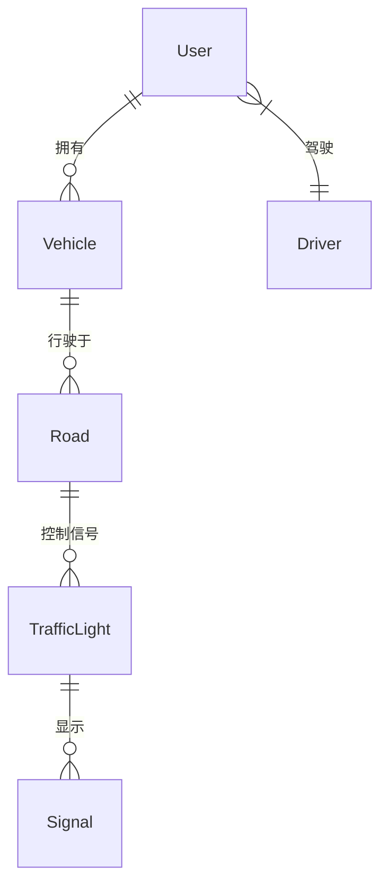

                 


### 《AI驱动的智能交通管理系统效果评测》

#### 关键词：智能交通管理、AI算法、效果评测、系统架构、最佳实践

#### 摘要：
本文旨在深入探讨AI驱动的智能交通管理系统，通过详细的背景介绍、核心概念解释、原理讲解、系统分析与架构设计，以及实战案例剖析，全面评估该系统在提升交通效率、安全和可持续发展方面的效果。文章采用逐步分析的方法，旨在为广大读者提供清晰的技术视角，帮助理解AI技术在交通管理中的潜力和挑战。

### 目录大纲

```markdown
# 第一部分: 背景介绍与核心概念

## 第1章: 问题背景与核心概念

### 1.1 智能交通管理系统概述
- 问题描述
- 问题解决
- 边界与外延

### 1.2 AI在交通管理中的应用
- 核心概念
- 概念属性特征对比表格
- ER实体关系图

### 1.3 AI驱动的智能交通管理
- 概念结构与核心要素组成
- 与传统交通管理的区别

### 1.4 研究方法与评价指标
- 研究方法
- 评价指标

### 1.5 本章小结

## 第二部分: 核心概念与原理讲解

### 第2章: AI核心算法原理

### 2.1 机器学习基础
- 算法原理
- Mermaid流程图

### 2.2 深度学习与神经网络
- 算法原理
- Mermaid流程图

### 2.3 强化学习与决策模型
- 算法原理
- Mermaid流程图

### 第3章: AI驱动的智能交通管理应用

### 3.1 AI在交通流量预测中的应用
- 算法原理
- Mermaid流程图

### 3.2 AI在交通信号控制中的应用
- 算法原理
- Mermaid流程图

### 3.3 AI在交通安全监控中的应用
- 算法原理
- Mermaid流程图

### 第4章: 智能交通管理系统评价标准

### 4.1 评价指标体系构建
- 算法原理
- Mermaid流程图

### 4.2 评价指标计算方法
- 算法原理
- Mermaid流程图

### 第5章: 本章小结

## 第三部分: 系统分析与架构设计

### 第6章: 智能交通管理系统架构设计

### 6.1 系统功能设计
- 领域模型Mermaid类图

### 6.2 系统架构设计
- 系统架构Mermaid架构图

### 6.3 系统接口设计
- 系统接口设计

### 6.4 系统交互
- 系统交互Mermaid序列图

### 第7章: 系统分析与评估方法

### 7.1 系统需求分析
- 需求分析

### 7.2 系统测试与评估
- 测试方法
- 评估指标

### 第8章: 本章小结

## 第四部分: 项目实战与案例分析

### 第9章: AI驱动的智能交通管理系统开发实战

### 9.1 环境安装与配置
- 环境安装
- 配置细节

### 9.2 系统核心实现
- 源代码解读
- 代码应用分析

### 9.3 实际案例剖析
- 案例分析
- 详细讲解

### 9.4 项目总结与反思
- 项目小结
- 经验总结

### 第10章: 最佳实践与注意事项

### 10.1 最佳实践
- 实践技巧

### 10.2 小结与展望
- 注意事项
- 拓展阅读

### 附录
### 附录A: 术语解释
- 术语解释

### 附录B: 参考文献与资料
- 参考文献与资料
```

#### 第1章: 问题背景与核心概念

##### 1.1 智能交通管理系统概述

**问题描述**：

随着城市化进程的加快，交通拥堵、交通事故频发、环境污染等问题日益严重，传统交通管理系统已经难以满足现代社会的需求。智能交通管理系统（Intelligent Transportation Management System, ITMS）应运而生，旨在通过引入人工智能技术，实现交通资源的优化配置，提高交通系统的效率和安全性。

**问题解决**：

智能交通管理系统通过数据采集、处理和分析，结合机器学习、深度学习、强化学习等AI算法，实现交通流量预测、信号控制优化、安全监控等功能。这一系统不仅能够实时响应交通变化，还能够通过自我学习和优化，不断提升交通管理的效率。

**边界与外延**：

智能交通管理系统不仅包括道路基础设施的智能化改造，还涉及车辆、交通参与者、道路设施等多方数据的整合与利用。其边界涵盖了从车辆感知、数据处理到决策执行的整个过程。而外延则延伸到城市交通规划、交通运营管理、公共交通服务等更广泛的领域。

##### 1.2 AI在交通管理中的应用

**核心概念**：

人工智能（AI）在交通管理中的应用主要集中在以下几个方面：

1. **交通流量预测**：通过分析历史数据和实时交通信息，预测未来交通流量，为交通管理提供数据支持。
2. **交通信号控制优化**：根据实时交通状态，动态调整交通信号灯，减少拥堵，提高通行效率。
3. **交通安全监控**：通过视频监控、传感器等技术，实时监控道路状况，预防交通事故。

**概念属性特征对比表格**：

| 特征 | 交通流量预测 | 交通信号控制优化 | 交通安全监控 |
| --- | --- | --- | --- |
| 数据依赖 | 高 | 中 | 中 |
| 实时性要求 | 高 | 高 | 高 |
| 智能化程度 | 高 | 中 | 中 |
| 需要的算法 | 机器学习、深度学习 | 强化学习、规则推理 | 机器学习、计算机视觉 |

**ER实体关系图**：



##### 1.3 AI驱动的智能交通管理

**概念结构与核心要素组成**：

AI驱动的智能交通管理系统由多个核心组成部分构成，包括：

1. **数据采集模块**：负责收集道路状况、车辆信息、天气数据等。
2. **数据处理模块**：对采集到的数据进行预处理、清洗和特征提取。
3. **算法模型模块**：采用机器学习、深度学习等技术，构建预测、优化、监控模型。
4. **决策执行模块**：根据算法模型输出，动态调整交通信号、路线规划等。

**与传统交通管理的区别**：

与传统的交通管理系统相比，AI驱动的智能交通管理具备以下几个显著区别：

1. **自适应性和智能化**：传统系统依赖固定的规则和预设参数，而AI系统可以通过自我学习和优化，动态适应交通状况。
2. **实时性和高效性**：传统系统在应对突发交通事件时往往反应较慢，而AI系统可以实时响应，迅速做出调整。
3. **全面性和协同性**：传统系统往往关注单一方面的优化，而AI系统可以综合考虑交通流量的多个维度，实现全局优化。

##### 1.4 研究方法与评价指标

**研究方法**：

本研究采用多种方法进行评估，包括：

1. **实验研究**：通过构建仿真环境，模拟不同交通状况，评估AI系统的性能。
2. **案例研究**：选取实际应用场景，分析AI系统在实际操作中的效果。
3. **对比研究**：与传统交通管理系统进行对比，评估AI系统的优劣。

**评价指标**：

评价指标体系包括以下几个关键指标：

1. **流量预测准确性**：评估AI系统在预测交通流量方面的准确性。
2. **信号控制效率**：评估AI系统在交通信号控制方面的效率，包括通行时间、延误时间等。
3. **事故预防率**：评估AI系统在预防交通事故方面的效果。
4. **系统稳定性**：评估AI系统在不同交通状况下的稳定性和可靠性。

##### 1.5 本章小结

本章首先介绍了智能交通管理系统的背景和核心概念，探讨了AI技术在交通管理中的应用和优势。接着，我们通过对比表格和ER实体关系图，明确了AI在交通管理中的核心要素和特性。最后，我们提出了研究方法和评价指标，为后续的深入分析奠定了基础。

---

在接下来的章节中，我们将进一步探讨AI核心算法的原理及其在交通管理中的应用，详细分析智能交通管理系统的架构设计，并通过实际案例展示AI技术在交通管理中的效果。让我们一起探索AI驱动的智能交通管理系统的广阔前景。接下来，请继续阅读第2章：AI核心算法原理。在文中，我们将深入探讨机器学习、深度学习和强化学习等核心算法的原理和应用，并通过Mermaid流程图和Python代码，帮助读者更好地理解这些算法的工作机制。敬请期待！

