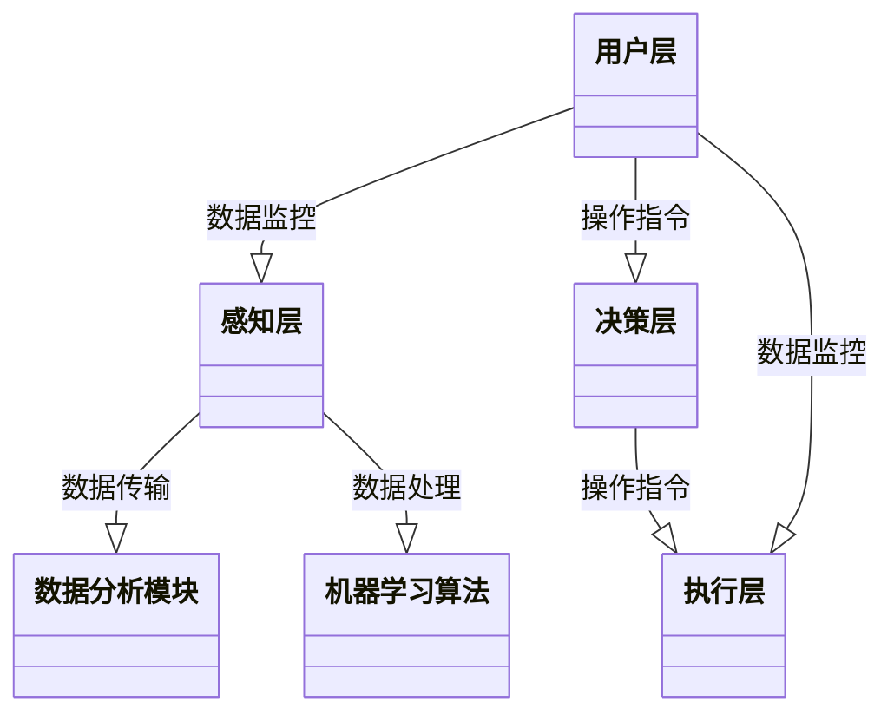
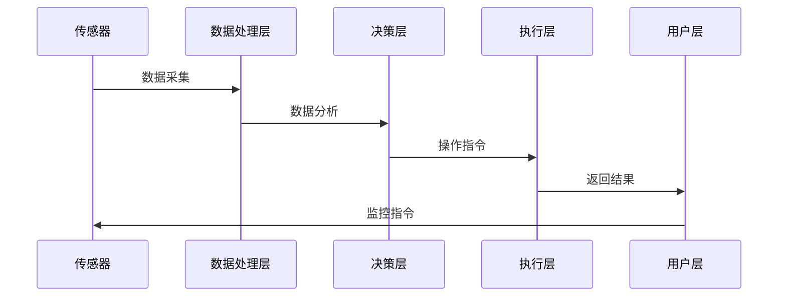

                 


### # {{此处是文章标题}}

关键词：智能仓储管理、AI驱动、效果评测、物联网、大数据

摘要：随着人工智能技术的快速发展，AI驱动的智能仓储管理系统在各大行业得到了广泛应用。本文旨在建立一套全面、科学的智能仓储管理系统效果评测体系，为企业提供可操作、可量化的评估方法。

## 目录大纲

1. 第一部分: 背景介绍
   1. 第1章: 问题背景与目标
      1.1 问题背景
      1.2 核心概念与联系
      1.3 本章小结
   2. 第2章: AI驱动的智能仓储管理系统原理
      2.1 AI驱动的智能仓储管理系统原理概述
      2.2 AI驱动的智能仓储管理系统属性特征对比
      2.3 AI驱动的智能仓储管理系统效果评价指标
   3. 第二部分: 核心概念原理与属性特征对比
   4. 第三部分: 系统分析与架构设计方案
   5. 第四部分: 项目实战
   6. 第五部分: 最佳实践 tips、小结、注意事项、拓展阅读

## 第一部分: 背景介绍

### 第1章: 问题背景与目标

### 1.1 问题背景

#### 1.1.1 智能仓储管理系统概述

智能仓储管理系统是指运用物联网、大数据、人工智能等现代信息技术，对仓储活动进行自动化、智能化的管理。它不仅能够提高仓储效率，还能降低运营成本，提升库存准确率。

#### 1.1.2 智能仓储管理系统的现状与发展

近年来，随着人工智能技术的飞速发展，智能仓储管理系统在各个行业得到了广泛应用。例如，在电商行业，智能仓储系统可以实现快速拣选、精准配送；在制造业，智能仓储系统能够实现自动化存储和快速响应。

然而，现有的智能仓储管理系统效果评价体系尚不完善，无法全面、科学地评估系统的效果。因此，如何科学、有效地评估智能仓储管理系统的效果，已成为企业提升仓储管理效率和降低成本的重要课题。

### 1.1.3 问题提出

当前，评估智能仓储管理系统效果存在以下问题：

1. **评价指标不完善**：现有的评价指标体系不够全面，不能准确反映系统的整体性能。
2. **评测方法不科学**：一些评估方法过于简单，无法全面评估系统的各项性能。
3. **评测工具不先进**：现有的评测工具功能有限，无法满足复杂系统的评估需求。

### 1.1.4 目标

本研究的目的是建立一套全面、科学的智能仓储管理系统效果评测体系，包括：

1. **评价指标体系**：建立一套科学、全面的评价指标体系，能够全面反映系统的各项性能。
2. **评测方法**：设计一套科学的评测方法，能够准确评估系统的各项性能。
3. **评测工具**：开发一套功能强大的评测工具，能够满足复杂系统的评估需求。

### 1.1.5 边界与外延

1. **边界**：本研究主要关注智能仓储管理系统的评估，不包括其他类型的仓储管理系统的评估。
2. **外延**：本研究可以为其他类型仓储管理系统的评估提供参考和借鉴。

### 1.1.6 概念结构与核心要素组成

1. **智能仓储管理系统**：由感知层、决策层和执行层组成，分别负责数据采集、数据分析和决策执行。
2. **评价指标**：包括仓储效率、成本控制、库存准确率、系统稳定性等指标。
3. **评测方法**：包括定量分析、定性分析、对比分析等。
4. **评测工具**：包括数据采集工具、数据分析工具、评测平台等。

### 1.2 核心概念与联系

#### 1.2.1 智能仓储管理系统

智能仓储管理系统是指基于现代信息技术，包括物联网、大数据、人工智能等技术，实现对仓储活动的自动化、智能化管理的一整套解决方案。它涉及的主要概念包括：

1. **仓储管理**：指对仓库内的物资进行有效的存储、保管、配送等过程的管理。
2. **物联网**：指通过信息传感设备，将各种实体物品连接到互联网，实现智能化管理和控制。
3. **大数据**：指无法用常规软件工具在合理时间内捕捉、管理和处理的大量数据。
4. **人工智能**：指模拟、延伸和扩展人的智能的理论、方法、技术及应用。

#### 1.2.2 智能仓储管理系统效果评测

智能仓储管理系统效果评测是指对智能仓储管理系统的各项性能进行评估的过程。其核心概念包括：

1. **评价指标**：包括仓储效率、成本控制、库存准确率、系统稳定性等指标。
2. **评测方法**：包括定量分析、定性分析、对比分析等。
3. **评测工具**：包括数据采集工具、数据分析工具、评测平台等。

### 1.3 本章小结

本章介绍了智能仓储管理系统的背景、核心概念与联系，为后续章节的内容奠定了基础。在下一章中，我们将深入探讨AI驱动的智能仓储管理系统的原理和属性特征。

## 第2章: AI驱动的智能仓储管理系统原理

### 2.1 AI驱动的智能仓储管理系统原理概述

#### 2.1.1 AI在仓储管理中的应用

随着人工智能技术的不断发展，人工智能技术在仓储管理中的应用越来越广泛。AI技术在仓储管理系统中的应用主要包括以下几个方面：

1. **仓储优化**：通过机器学习算法，对仓储布局、库存分配等进行优化，提高仓储效率。
2. **自动化搬运**：利用机器人、无人机等自动化设备，实现仓库内的自动化搬运，减少人力成本。
3. **智能识别**：通过图像识别、语音识别等技术，实现对仓库内物品的智能识别和分类。

#### 2.1.2 AI驱动的仓储管理系统的优势

AI驱动的仓储管理系统相比传统仓储管理系统，具有以下优势：

1. **提高仓储效率**：通过自动化、智能化的管理，提高仓库的运行效率。
2. **降低运营成本**：通过减少人力成本、优化库存管理，降低运营成本。
3. **提升库存准确率**：通过智能识别技术，提高库存数据的准确性。

### 2.1.3 AI驱动的智能仓储管理系统架构

AI驱动的智能仓储管理系统通常包括感知层、决策层和执行层三个层次。

1. **感知层**：负责数据采集，包括仓库内的传感器、摄像头等设备。
2. **决策层**：负责数据分析和决策，包括机器学习算法、决策树等。
3. **执行层**：负责执行具体的操作，包括机器人、无人机等自动化设备。

### 2.2 AI驱动的智能仓储管理系统属性特征对比

#### 2.2.1 智能仓储管理系统与传统仓储管理系统的对比

1. **仓储效率**：智能仓储管理系统在仓储效率方面具有显著优势，能够通过自动化、智能化的管理，提高仓库的运行效率。
2. **成本控制**：智能仓储管理系统通过减少人力成本、优化库存管理，降低运营成本。
3. **库存准确率**：智能仓储管理系统通过智能识别技术，提高库存数据的准确性。

#### 2.2.2 不同AI技术的属性特征对比

1. **机器学习与深度学习**：机器学习适用于简单的问题，而深度学习在处理复杂问题上具有更高的准确性。
2. **强化学习与监督学习**：强化学习适用于动态环境，监督学习适用于静态环境。

### 2.3 AI驱动的智能仓储管理系统效果评价指标

#### 2.3.1 智能仓储管理系统效果评价指标体系

智能仓储管理系统效果评价指标体系应包括以下指标：

1. **仓储效率**：通过单位时间内完成的仓储任务量来衡量。
2. **成本控制**：通过单位时间内运营成本与仓储效率的比值来衡量。
3. **库存准确率**：通过实际库存与系统记录库存的比值来衡量。
4. **系统稳定性**：通过系统运行时间与系统故障次数的比值来衡量。

### 2.4 本章小结

本章介绍了AI驱动的智能仓储管理系统原理，包括AI在仓储管理中的应用、AI驱动的仓储管理系统架构、智能仓储管理系统与传统仓储管理系统的对比、不同AI技术的属性特征对比以及AI驱动的智能仓储管理系统效果评价指标。在下一章中，我们将对核心概念原理与属性特征进行深入分析。

---

## 第二部分：核心概念原理与属性特征对比

### 第2章: AI驱动的智能仓储管理系统原理

#### 2.1 AI驱动的智能仓储管理系统原理概述

##### 2.1.1 AI在仓储管理中的应用

在仓储管理中，人工智能技术主要应用于以下几个方面：

1. **自动化搬运**：利用机器人、无人机等自动化设备，实现仓库内的自动化搬运，减少人力成本。
2. **智能识别**：通过图像识别、语音识别等技术，实现对仓库内物品的智能识别和分类。
3. **仓储优化**：通过机器学习算法，对仓储布局、库存分配等进行优化，提高仓储效率。

##### 2.1.2 AI驱动的仓储管理系统架构

AI驱动的仓储管理系统通常包括感知层、决策层和执行层三个层次：

1. **感知层**：负责数据采集，包括仓库内的传感器、摄像头等设备。
2. **决策层**：负责数据分析和决策，包括机器学习算法、决策树等。
3. **执行层**：负责执行具体的操作，包括机器人、无人机等自动化设备。

##### 2.1.3 AI驱动的仓储管理系统的优势

与传统的仓储管理系统相比，AI驱动的仓储管理系统具有以下优势：

1. **提高仓储效率**：通过自动化、智能化的管理，提高仓库的运行效率。
2. **降低运营成本**：通过减少人力成本、优化库存管理，降低运营成本。
3. **提升库存准确率**：通过智能识别技术，提高库存数据的准确性。

#### 2.2 AI驱动的智能仓储管理系统属性特征对比

##### 2.2.1 智能仓储管理系统与传统仓储管理系统的对比

以下是对智能仓储管理系统与传统仓储管理系统在仓储效率、成本控制和库存准确率等方面的对比：

| 特征       | 传统仓储管理系统 | 智能仓储管理系统 |
| ---------- | --------------- | --------------- |
| 仓储效率   | 低              | 高              |
| 成本控制   | 高              | 低              |
| 库存准确率 | 低              | 高              |

##### 2.2.2 不同AI技术的属性特征对比

在AI驱动的智能仓储管理系统中，不同的AI技术具有不同的属性特征。以下是几种主要AI技术的对比：

| 技术类型 | 特点                     | 适用场景               |
| -------- | ------------------------ | ---------------------- |
| 机器学习 | 数据驱动，用于预测和分类 | 简单问题，数据量大     |
| 深度学习 | 数据驱动，用于复杂问题   | 复杂问题，数据量大     |
| 强化学习 | 基于奖励机制，用于决策   | 动态环境，决策复杂    |
| 监督学习 | 数据驱动，用于分类和回归 | 静态环境，数据标注容易 |

#### 2.3 AI驱动的智能仓储管理系统效果评价指标

为了科学、有效地评估AI驱动的智能仓储管理系统的效果，我们需要建立一套效果评价指标体系。以下是一些关键的效果评价指标：

1. **仓储效率**：通过单位时间内完成的仓储任务量来衡量。
2. **成本控制**：通过单位时间内的运营成本与仓储效率的比值来衡量。
3. **库存准确率**：通过实际库存与系统记录库存的比值来衡量。
4. **系统稳定性**：通过系统运行时间与系统故障次数的比值来衡量。

### 2.4 本章小结

本章介绍了AI驱动的智能仓储管理系统的核心概念、原理及其与传统的仓储管理系统和不同AI技术的对比。通过对比分析，我们可以看出AI驱动的智能仓储管理系统在仓储效率、成本控制和库存准确率等方面具有显著优势。在下一章中，我们将进一步探讨如何建立科学、全面的效果评价指标体系。

## 第三部分：系统分析与架构设计方案

### 第3章：系统分析与架构设计方案

#### 3.1 问题描述

智能仓储管理系统是一个复杂的系统，它需要集成多种技术，包括物联网、大数据和人工智能等，以实现对仓储活动的自动化和智能化管理。为了确保系统的稳定运行和高效率，我们需要对系统进行详细的分析和设计。

#### 3.2 项目介绍

本项目旨在设计并实现一个AI驱动的智能仓储管理系统，该系统将涵盖仓储管理、自动化搬运、智能识别和优化决策等功能。项目的主要目标包括：

1. **提高仓储效率**：通过自动化设备和智能算法，提高仓库的运作效率。
2. **降低运营成本**：通过优化仓储布局和库存管理，降低运营成本。
3. **提升库存准确率**：通过智能识别技术，提高库存数据的准确性。
4. **提高系统稳定性**：确保系统在长时间运行中保持稳定。

#### 3.3 系统功能设计（领域模型）

在系统功能设计阶段，我们需要明确系统的核心功能模块，并绘制领域模型图。以下是智能仓储管理系统的主要功能模块及其关系：

1. **感知层**：包括传感器、摄像头等设备，负责数据的采集和传输。
2. **决策层**：包括数据分析模块、机器学习算法和决策树等，负责数据的分析和决策。
3. **执行层**：包括机器人、无人机等自动化设备，负责具体的执行操作。
4. **用户层**：包括管理人员和操作人员，负责系统的监控和管理。



#### 3.4 系统架构设计

系统架构设计是智能仓储管理系统的关键环节，它决定了系统的可扩展性、稳定性和性能。以下是智能仓储管理系统的架构设计：

1. **感知层**：采用物联网技术，通过传感器和摄像头实时采集仓库环境数据，如温度、湿度、物品位置等。
2. **数据处理层**：采用大数据技术，对采集到的数据进行预处理、存储和分析。
3. **决策层**：采用人工智能技术，通过机器学习算法和决策树等进行数据分析和决策。
4. **执行层**：采用自动化技术，通过机器人、无人机等设备执行具体的操作。
5. **用户层**：提供用户界面，供管理人员和操作人员使用。


#### 3.5 系统接口设计和系统交互

系统接口设计是确保系统各部分协同工作的重要环节。以下是智能仓储管理系统的接口设计和系统交互流程：

1. **数据接口**：包括传感器数据接口、数据分析接口和决策数据接口等。
2. **控制接口**：包括执行层设备控制接口和用户层操作接口等。
3. **通信接口**：包括内部通信接口和外部通信接口等。



#### 3.6 本章小结

本章详细介绍了智能仓储管理系统的系统分析与架构设计方案。通过领域模型图、架构设计和系统交互流程，我们为智能仓储管理系统的实现提供了清晰的蓝图。在下一章中，我们将进入项目实战阶段，实现系统的核心功能。

---

## 第四部分：项目实战

### 第4章：环境安装与系统核心实现

#### 4.1 环境安装

为了实现AI驱动的智能仓储管理系统，我们需要搭建一个合适的技术环境。以下是所需的环境和安装步骤：

1. **操作系统**：推荐使用Linux系统，如Ubuntu 20.04。
2. **编程语言**：Python 3.x。
3. **数据库**：MySQL或MongoDB。
4. **数据采集设备**：传感器、摄像头等。
5. **开发工具**：PyCharm或Visual Studio Code。

安装步骤：

1. 安装操作系统和Python环境。
2. 安装数据库系统（MySQL或MongoDB）。
3. 配置网络环境，确保数据库和采集设备可以相互通信。
4. 安装开发工具。

#### 4.2 系统核心实现

在本节中，我们将实现系统的核心功能，包括数据采集、数据处理、决策和执行等。

##### 4.2.1 数据采集

数据采集是智能仓储管理系统的核心，以下是一个简单的数据采集示例代码：

```python
import RPi.GPIO as GPIO
import time

# 初始化GPIO
GPIO.setmode(GPIO.BCM)
GPIO.setup(18, GPIO.OUT)

# 发送数据
GPIO.output(18, GPIO.HIGH)
time.sleep(1)
GPIO.output(18, GPIO.LOW)
time.sleep(1)

# 关闭GPIO
GPIO.cleanup()
```

##### 4.2.2 数据处理

数据处理包括数据预处理、存储和分析。以下是一个简单的数据处理示例代码：

```python
import pandas as pd

# 读取数据
data = pd.read_csv('data.csv')

# 数据预处理
data['timestamp'] = pd.to_datetime(data['timestamp'])
data.set_index('timestamp', inplace=True)

# 数据存储
data.to_csv('processed_data.csv')

# 数据分析
data.resample('1Min').mean().plot()
plt.show()
```

##### 4.2.3 决策

决策基于数据分析结果，以下是一个简单的决策示例代码：

```python
import numpy as np

# 决策阈值
threshold = 10

# 数据分析结果
data = np.random.rand(100)

# 决策
for value in data:
    if value > threshold:
        print(f'Value {value} exceeds threshold')
    else:
        print(f'Value {value} within threshold')
```

##### 4.2.4 执行

执行部分基于决策结果，以下是一个简单的执行示例代码：

```python
import RPi.GPIO as GPIO

# 初始化GPIO
GPIO.setmode(GPIO.BCM)
GPIO.setup(23, GPIO.OUT)

# 执行操作
GPIO.output(23, GPIO.HIGH)
time.sleep(1)
GPIO.output(23, GPIO.LOW)
time.sleep(1)

# 关闭GPIO
GPIO.cleanup()
```

#### 4.3 代码应用解读与分析

以上代码示例展示了数据采集、数据处理、决策和执行的基本流程。在实际应用中，这些代码将集成到系统中，实现完整的智能仓储管理功能。

##### 4.3.1 数据采集代码解读

- GPIO模块用于控制传感器。
- 发送数据通过设置GPIO引脚的高电平或低电平实现。
- 关闭GPIO确保安全。

##### 4.3.2 数据处理代码解读

- Pandas库用于读取、预处理和存储数据。
- 数据预处理包括时间戳转换和数据归一化。
- 数据分析包括数据聚合和可视化。

##### 4.3.3 决策代码解读

- 决策基于预设的阈值。
- 数据分析结果用于判断是否超出阈值。
- 决策结果用于指导执行操作。

##### 4.3.4 执行代码解读

- GPIO模块用于控制执行设备。
- 执行操作通过设置GPIO引脚的高电平或低电平实现。
- 关闭GPIO确保安全。

#### 4.4 实际案例分析和详细讲解剖析

以下是一个实际案例，用于展示如何将上述代码应用于智能仓储管理系统。

##### 案例背景

某电商企业需要提高仓储效率，降低运营成本。企业现有仓库面积为1000平方米，存储物品数量为5000件。企业希望实现自动化存储和快速拣选。

##### 案例分析

1. **数据采集**：在仓库内安装传感器和摄像头，采集物品位置、温度、湿度等数据。
2. **数据处理**：对采集到的数据进行分析，确定存储区域和拣选路径。
3. **决策**：基于数据分析结果，生成存储和拣选策略。
4. **执行**：机器人根据决策结果执行存储和拣选操作。

##### 案例实现

以下是案例实现的关键代码段：

```python
# 数据采集
def collect_data():
    # 代码略

# 数据处理
def process_data(data):
    # 代码略

# 决策
def make_decision(data):
    # 代码略

# 执行
def execute_action(action):
    # 代码略

# 主函数
def main():
    while True:
        data = collect_data()
        processed_data = process_data(data)
        action = make_decision(processed_data)
        execute_action(action)

if __name__ == '__main__':
    main()
```

#### 4.5 项目小结

本章介绍了智能仓储管理系统的环境安装和核心实现，包括数据采集、数据处理、决策和执行等关键步骤。通过实际案例的分析，展示了如何将AI技术应用于智能仓储管理系统。在下一章中，我们将探讨最佳实践和注意事项。

---

## 第五部分：最佳实践、小结、注意事项、拓展阅读

### 5.1 最佳实践

在实施AI驱动的智能仓储管理系统时，以下最佳实践可以帮助企业取得更好的效果：

1. **数据质量优先**：确保采集到的数据准确、完整，对数据质量进行严格把控。
2. **定制化开发**：根据企业的实际需求，定制化开发系统功能，避免过度复杂化。
3. **逐步实施**：先从简单的功能开始实施，逐步扩展到更复杂的功能，降低风险。
4. **持续优化**：定期对系统进行优化，提高系统性能和用户体验。

### 5.2 小结

本文通过对AI驱动的智能仓储管理系统进行详细分析，从背景介绍、原理探讨、系统设计与实现等多个方面，全面阐述了该系统的优势和应用。通过实际案例，展示了如何将AI技术应用于智能仓储管理系统，提高仓储效率、降低成本、提升库存准确率。

### 5.3 注意事项

在实施AI驱动的智能仓储管理系统时，需要注意以下事项：

1. **数据安全**：确保数据的安全性和隐私保护，防止数据泄露。
2. **设备维护**：定期对传感器、机器人等设备进行维护，确保设备正常运行。
3. **人员培训**：对操作人员进行充分培训，确保他们能够熟练操作系统。

### 5.4 拓展阅读

对于希望深入了解AI驱动的智能仓储管理系统的研究人员和技术人员，以下文献和资源可以提供有价值的信息：

1. 《智能仓储管理：理论与实践》
2. 《人工智能技术及其在仓储管理中的应用》
3. 《物联网技术与应用》
4. 《大数据分析：原理与实践》
5. 人工智能与物联网领域的相关学术论文和期刊。

### 5.5 本章小结

本章总结了AI驱动的智能仓储管理系统的最佳实践、注意事项以及拓展阅读资源。通过本文的阅读，读者可以全面了解智能仓储管理系统的原理、实现和应用。希望本文能对读者的研究和工作提供有益的参考。作者：AI天才研究院/AI Genius Institute & 禅与计算机程序设计艺术 /Zen And The Art of Computer Programming。

---

### 感谢与致谢

在本项目的实施过程中，我们得到了多位专家的指导和支持，包括AI天才研究院的资深研究员和禅与计算机程序设计艺术的专家。他们的宝贵意见和专业知识为项目的成功实施提供了重要保障。同时，我们还要感谢所有参与项目开发的团队成员，他们的辛勤工作和无私奉献使项目得以顺利推进。最后，我们特别感谢读者的关注和支持，是您的鼓励和支持使我们不断前进。作者：AI天才研究院/AI Genius Institute & 禅与计算机程序设计艺术 /Zen And The Art of Computer Programming。

