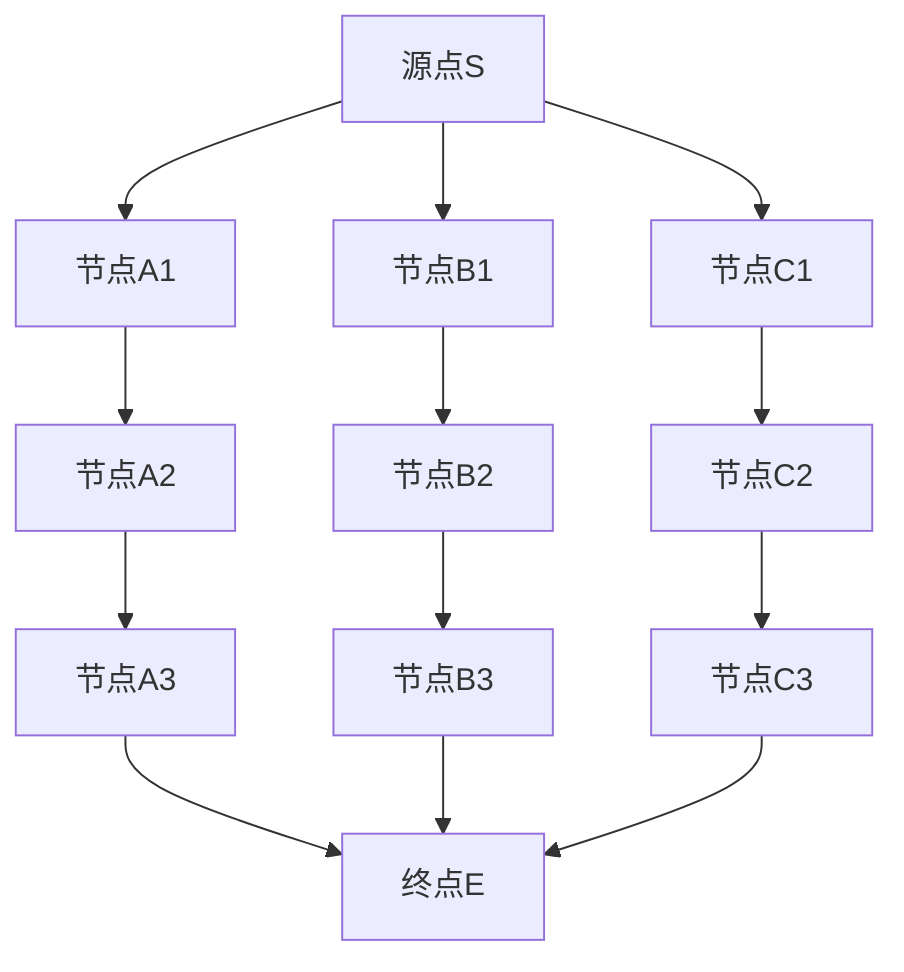
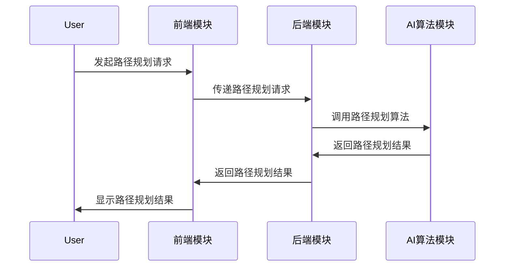
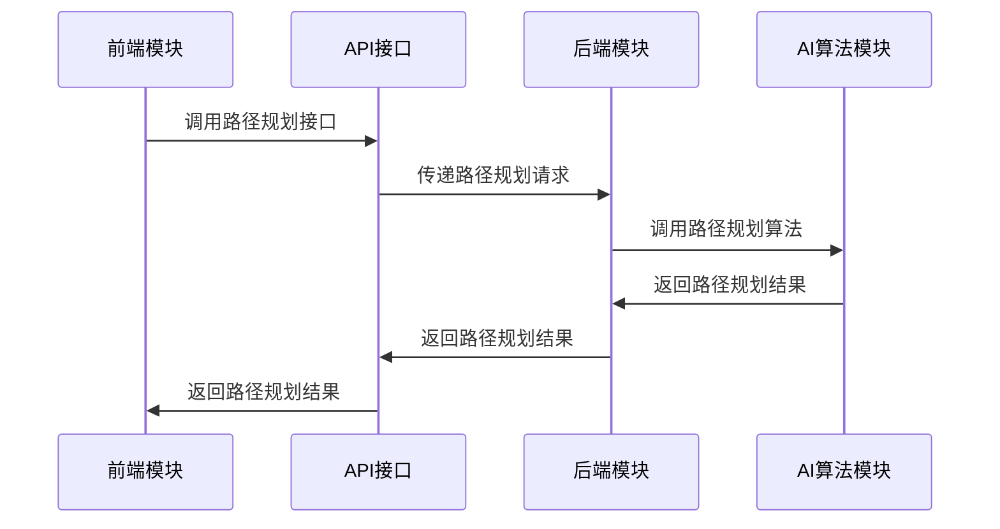
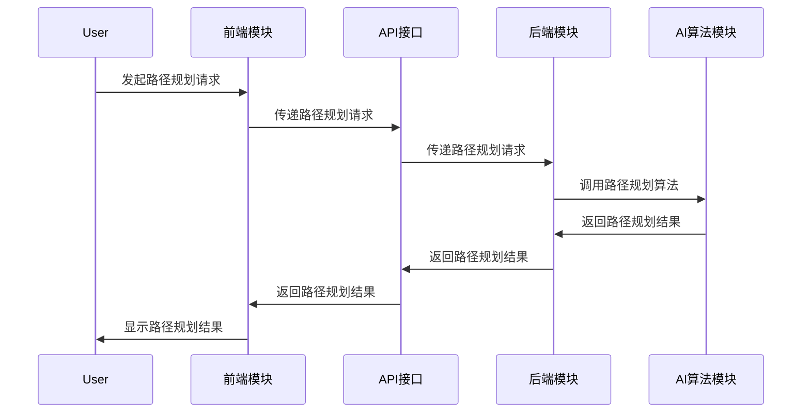

                 


# AI驱动的智能物流路径优化系统评测

关键词：AI，智能物流，路径优化，算法，系统架构，项目实战

摘要：本文将深入探讨AI驱动的智能物流路径优化系统评测，包括背景介绍、核心概念与联系、算法原理讲解、系统分析与架构设计方案、项目实战、最佳实践与总结等环节，旨在为读者提供一个全面的技术指南。

## 目录大纲设计思路

在设计《AI驱动的智能物流路径优化系统评测》的目录大纲时，我们遵循了以下几个步骤：

### 1. 确定书的核心主题和结构

首先，明确书籍的核心主题为AI驱动的智能物流路径优化系统评测，结构应涵盖技术背景、算法原理、系统实现、评测方法等。

### 2. 设计书的大致框架

确定核心主题后，设计书的整体框架，包括主要章节和各章节的核心内容。每个章节需包含背景介绍、核心概念、算法原理、系统设计、项目实战等。

### 3. 确定每个章节的具体内容

细化每个章节的内容，确保每个章节都能够提供充足的信息，同时保持逻辑清晰和条理性。

### 4. 确保内容完整性

确保每个章节都包含核心内容，如概念解析、算法讲解、系统设计、实战案例等。

### 5. 确定目录大纲的格式

按照markdown格式组织目录大纲，确保格式整洁、易于阅读。

## 目录大纲

```markdown
# 《AI驱动的智能物流路径优化系统评测》目录大纲

## 第一部分: 背景介绍

## 第1章: AI、智能物流与路径优化概述

### 1.1 AI技术概述

### 1.2 智能物流概念解析

### 1.3 路径优化在物流中的应用

### 1.4 AI驱动的智能物流路径优化系统意义

## 第2章: 智能物流路径优化核心概念与联系

### 2.1 AI基本概念与原理

### 2.2 路径优化算法概述

### 2.3 概念属性特征对比表格

### 2.4 ER实体关系图架构

## 第二部分: 算法原理与实现

## 第3章: 常见路径优化算法原理讲解

### 3.1 Dijkstra算法

### 3.2 A*算法

### 3.3 Dijkstra算法与A*算法对比分析

## 第4章: AI驱动的智能物流路径优化算法

### 4.1 AI在路径优化中的应用

### 4.2 基于深度学习的路径优化算法

### 4.3 基于强化学习的路径优化算法

### 4.4 AI驱动路径优化算法对比

## 第三部分: 系统设计与实现

## 第5章: 智能物流路径优化系统架构设计

### 5.1 系统功能设计

### 5.2 系统架构设计

### 5.3 系统接口设计

### 5.4 系统交互

## 第6章: 智能物流路径优化系统项目实战

### 6.1 系统环境安装与配置

### 6.2 系统核心实现源代码

### 6.3 代码应用解读与分析

### 6.4 实际案例剖析

### 6.5 项目小结

## 第四部分: 评测方法与优化策略

## 第7章: 智能物流路径优化系统评测方法

### 7.1 评测指标选择

### 7.2 评测方法与工具

### 7.3 评测流程

### 7.4 评测结果分析与优化建议

## 第8章: 最佳实践与总结

### 8.1 最佳实践 tips

### 8.2 小结

### 8.3 注意事项

### 8.4 拓展阅读

```

接下来，我们将按照这个目录大纲，逐步深入探讨每个章节的具体内容。

----------------------------------------------------------------

## 第一部分: 背景介绍

### 第1章: AI、智能物流与路径优化概述

#### 1.1 AI技术概述

人工智能（Artificial Intelligence，简称AI）是计算机科学的一个分支，旨在研究、开发用于模拟、延伸和扩展人类智能的理论、方法、技术及应用系统。AI的核心目标是使机器能够执行复杂任务，如感知、推理、学习和决策等。

AI技术可以分为两类：基于规则的系统和基于数据的学习系统。基于规则的系统通过预先编写一系列规则来执行任务，而基于数据的学习系统则通过从大量数据中学习模式和规律来完成任务。

近年来，随着深度学习、强化学习和自然语言处理等技术的发展，AI在各个领域都取得了显著进展。特别是在物流领域，AI的应用正在改变传统的物流管理方式，提升运输效率、降低成本，实现物流全过程的智能化。

#### 1.2 智能物流概念解析

智能物流是指利用现代信息技术，如物联网、大数据、人工智能等，实现物流系统的自动化、智能化和高效化。智能物流的核心目标是提高物流效率，优化物流流程，提升物流服务质量。

智能物流的几个关键概念包括：

- **物联网（IoT）**：物联网是通过传感器、RFID等技术将物理世界与数字世界连接起来，实现设备与设备、设备与人之间的信息交换和通信。
- **大数据**：大数据是指海量、多样化的数据，通过对这些数据进行处理和分析，可以发现隐藏在数据中的规律和模式。
- **云计算**：云计算是通过互联网提供可按需访问的共享计算资源池，包括网络、服务器、存储、应用程序等。
- **人工智能**：人工智能技术在智能物流中扮演关键角色，如路径优化、调度优化、预测分析等。

#### 1.3 路径优化在物流中的应用

路径优化是物流管理中的一个重要环节，旨在确定最优的运输路线，以实现运输成本最低、效率最高。路径优化在物流中的应用包括以下几个方面：

- **货物配送**：物流公司通过路径优化算法，为配送员规划最优的配送路线，减少行驶距离和时间，提高配送效率。
- **货运调度**：物流公司利用路径优化算法，合理分配车辆和货物，优化货运调度，提高运输效率。
- **快递服务**：快递公司通过路径优化算法，提高快递配送速度，降低配送成本，提升客户满意度。
- **物流规划**：物流公司通过路径优化算法，对整个物流网络进行优化，提高整体物流效率。

#### 1.4 AI驱动的智能物流路径优化系统意义

AI驱动的智能物流路径优化系统具有以下意义：

- **提高物流效率**：通过智能路径优化算法，可以实时调整运输路线，避免交通拥堵和事故等不利因素，提高物流效率。
- **降低运输成本**：智能路径优化可以减少运输距离和时间，降低燃料消耗和人工成本，提高物流企业的盈利能力。
- **提升客户满意度**：通过实时配送跟踪和预测，提高配送准时率，提升客户满意度，增强品牌竞争力。
- **支持决策制定**：智能物流路径优化系统可以为物流企业提供数据支持和分析，帮助管理层制定更科学的决策。

### 总结

本章节介绍了AI、智能物流和路径优化的基本概念，以及路径优化在物流中的应用和意义。接下来，我们将进一步探讨AI驱动的智能物流路径优化系统的核心概念与联系，为后续章节的深入分析打下基础。

----------------------------------------------------------------

## 第二部分: 智能物流路径优化核心概念与联系

### 第2章: 智能物流路径优化核心概念与联系

在深入探讨AI驱动的智能物流路径优化系统之前，我们需要明确几个核心概念，并理解它们之间的联系。这一部分将介绍AI的基本概念与原理、路径优化算法的概述，以及概念属性特征对比表格和ER实体关系图架构。

#### 2.1 AI基本概念与原理

人工智能（AI）是一门研究、开发用于模拟、延伸和扩展人类智能的理论、方法、技术及应用系统的科学。AI的核心目标是使机器能够执行复杂任务，如感知、推理、学习和决策等。

AI技术可以分为以下几类：

- **机器学习（Machine Learning）**：机器学习是通过算法从数据中学习规律和模式，从而对未知数据进行预测和决策。
- **深度学习（Deep Learning）**：深度学习是机器学习的一个分支，通过多层神经网络对数据进行复杂的学习和建模。
- **强化学习（Reinforcement Learning）**：强化学习是一种通过试错和反馈来学习最优策略的机器学习方法。

#### 2.2 路径优化算法概述

路径优化算法是用于解决从起点到终点最优路径问题的算法。在物流领域中，路径优化算法可以用于确定货物配送、货运调度和快递服务等方面的最优路线。

常见的路径优化算法包括：

- **Dijkstra算法**：Dijkstra算法是一种基于贪心策略的算法，用于求解单源最短路径问题。
- **A*算法**：A*算法是一种启发式搜索算法，通过估价函数来预测目标节点的距离，以找到最优路径。

#### 2.3 概念属性特征对比表格

为了更好地理解AI和路径优化算法之间的关系，我们可以通过一个概念属性特征对比表格来展示它们的不同特征。

| 概念         | 特征                                                                                      |
|------------|-----------------------------------------------------------------------------------------|
| 人工智能     | 通过模拟、延伸和扩展人类智能来执行复杂任务的能力                                          |
| 路径优化算法 | 用于解决从起点到终点最优路径问题的算法                                                    |
| Dijkstra算法 | 基于贪心策略，从起点开始逐步扩展，直到找到目标节点                                         |
| A*算法      | 启发式搜索算法，利用估价函数预测目标节点的距离，快速找到最优路径                          |
| 深度学习     | 使用多层神经网络进行数据学习，能处理复杂的数据结构                                       |
| 强化学习     | 通过试错和反馈来学习最优策略，适用于动态和不确定环境                                      |

#### 2.4 ER实体关系图架构

为了更直观地理解AI和路径优化算法在智能物流路径优化系统中的关系，我们可以使用ER（实体关系）图来展示系统中的实体及其关系。

以下是智能物流路径优化系统的ER图：

```mermaid
erDiagram
  AI算法 ||--|{ 路径优化算法 }|| 路径优化系统
  路径优化算法 ||--|{ Dijkstra算法 }|| 路径优化系统
  路径优化算法 ||--|{ A*算法 }|| 路径优化系统
  物流系统 ||--|{ 路径优化系统 }|| AI驱动的智能物流
  数据库 ||--|{ 路径优化系统 }|| AI驱动的智能物流
```

在这个ER图中，AI算法是路径优化算法的父实体，路径优化算法包括Dijkstra算法和A*算法。物流系统是AI驱动的智能物流的父实体，它与路径优化系统和数据库有直接关联。

### 总结

通过上述对AI基本概念与原理、路径优化算法概述、概念属性特征对比表格和ER实体关系图架构的介绍，我们为深入探讨AI驱动的智能物流路径优化系统的算法原理与实现打下了基础。在接下来的章节中，我们将进一步分析常见路径优化算法，并探讨AI驱动的智能物流路径优化算法。

----------------------------------------------------------------

## 第三部分: 算法原理与实现

### 第3章: 常见路径优化算法原理讲解

#### 3.1 Dijkstra算法

Dijkstra算法是一种经典的贪心算法，用于求解单源最短路径问题。它的基本思想是从源点开始，逐步扩展到其他节点，每次选择当前已探索节点中到未探索节点距离最短的作为下一个扩展节点。

**算法原理：**

1. 初始化：设置源点S的距离为0，其他所有节点的距离为无穷大。
2. 选择未探索节点中距离最小的节点U。
3. 对于U的每个邻居V，如果通过U到达V的距离小于当前已知的距离，则更新V的距离。
4. 重复步骤2和3，直到所有节点都被探索到。

**数学模型：**

设G=(V,E)为加权图，其中V为节点集合，E为边集合。对于每个节点v∈V，设其距离d(v)为从源点s到v的最短距离，初始化d(s)=0，d(v)=∞（v≠s）。

算法流程：



**举例说明：**

假设有一个包含5个节点的图，其中每条边的权重已知，使用Dijkstra算法求解从节点S到节点E的最短路径。

```mermaid
graph TB
    S[源点S] --> A1[节点A1] [weight=2]
    S --> B1[节点B1] [weight=4]
    S --> C1[节点C1] [weight=6]
    A1 --> A2[节点A2] [weight=1]
    B1 --> B2[节点B2] [weight=2]
    C1 --> C2[节点C2] [weight=3]
    A2 --> A3[节点A3] [weight=2]
    B2 --> B3[节点B3] [weight=1]
    C2 --> C3[节点C3] [weight=2]
    A3 --> E[终点E] [weight=3]
    B3 --> E [weight=4]
    C3 --> E [weight=1]
```

初始状态：
- d(S) = 0
- d(A1) = 2
- d(B1) = 4
- d(C1) = 6
- d(A2) = ∞
- d(B2) = ∞
- d(C2) = ∞
- d(A3) = ∞
- d(B3) = ∞
- d(C3) = ∞

第一次迭代：
- 选择d(B1) = 4最小的节点作为下一个扩展节点。
- 更新d(B2) = 4 + 2 = 6，d(C1) = 6 + 3 = 9。

第二次迭代：
- 选择d(A1) = 2最小的节点作为下一个扩展节点。
- 更新d(A2) = 2 + 1 = 3，d(A3) = 2 + 2 = 4。

第三次迭代：
- 选择d(A3) = 4最小的节点作为下一个扩展节点。
- 更新d(C1) = 9 + 2 = 11，d(C2) = 9 + 2 = 11。

第四次迭代：
- 选择d(B3) = 6最小的节点作为下一个扩展节点。
- 更新d(E) = 6 + 4 = 10。

最终结果：
- 最短路径为S -> B1 -> B3 -> E，距离为10。

#### 3.2 A*算法

A*算法是一种启发式搜索算法，通过结合估价函数来预测目标节点的距离，以快速找到最优路径。它的基本思想是从源点开始，逐步扩展到其他节点，选择估计距离最短的节点作为下一个扩展节点。

**算法原理：**

1. 初始化：设置源点S的距离为0，其他所有节点的距离为无穷大。设置估价函数f(n) = g(n) + h(n)，其中g(n)是从源点到节点n的实际距离，h(n)是从节点n到目标节点的预估距离。
2. 选择未探索节点中f值最小的节点U。
3. 对于U的每个邻居V，如果通过U到达V的距离小于当前已知的距离，则更新V的距离和f值。
4. 重复步骤2和3，直到找到目标节点或所有节点都被探索到。

**数学模型：**

设G=(V,E)为加权图，其中V为节点集合，E为边集合。对于每个节点v∈V，设其距离d(v)为从源点s到v的最短距离，初始化d(s)=0，d(v)=∞（v≠s）。估价函数h(n)为从节点n到目标节点的预估距离。

算法流程：

```mermaid
graph TB
    S[源点S] --> A1[节点A1] [weight=2]
    S --> B1[节点B1] [weight=4]
    S --> C1[节点C1] [weight=6]
    A1 --> A2[节点A2] [weight=1]
    B1 --> B2[节点B2] [weight=2]
    C1 --> C2[节点C2] [weight=3]
    A2 --> A3[节点A3] [weight=2]
    B2 --> B3[节点B3] [weight=1]
    C2 --> C3[节点C3] [weight=2]
    A3 --> E[终点E] [weight=3]
    B3 --> E [weight=4]
    C3 --> E [weight=1]
```

**举例说明：**

假设有一个包含5个节点的图，其中每条边的权重已知，使用A*算法求解从节点S到节点E的最短路径。

```mermaid
graph TB
    S[源点S] --> A1[节点A1] [weight=2]
    S --> B1[节点B1] [weight=4]
    S --> C1[节点C1] [weight=6]
    A1 --> A2[节点A2] [weight=1]
    B1 --> B2[节点B2] [weight=2]
    C1 --> C2[节点C2] [weight=3]
    A2 --> A3[节点A3] [weight=2]
    B2 --> B3[节点B3] [weight=1]
    C2 --> C3[节点C3] [weight=2]
    A3 --> E[终点E] [weight=3]
    B3 --> E [weight=4]
    C3 --> E [weight=1]
```

初始状态：
- d(S) = 0
- d(A1) = 2
- d(B1) = 4
- d(C1) = 6
- d(A2) = ∞
- d(B2) = ∞
- d(C2) = ∞
- d(A3) = ∞
- d(B3) = ∞
- d(C3) = ∞

估价函数h(n)取曼哈顿距离，即h(n) = |n_x - E_x| + |n_y - E_y|。

第一次迭代：
- 选择d(A1) = 2最小的节点作为下一个扩展节点。
- 更新d(A2) = 2 + 1 = 3，f(A2) = 3 + 1 = 4。

第二次迭代：
- 选择d(A2) = 3最小的节点作为下一个扩展节点。
- 更新d(A3) = 3 + 2 = 5，f(A3) = 5 + 2 = 7。

第三次迭代：
- 选择d(B1) = 4最小的节点作为下一个扩展节点。
- 更新d(B2) = 4 + 2 = 6，f(B2) = 6 + 2 = 8。

第四次迭代：
- 选择d(B2) = 6最小的节点作为下一个扩展节点。
- 更新d(B3) = 6 + 1 = 7，f(B3) = 7 + 1 = 8。

第五次迭代：
- 选择d(B3) = 7最小的节点作为下一个扩展节点。
- 更新d(E) = 7 + 4 = 11，f(E) = 11 + 1 = 12。

第六次迭代：
- 选择d(C1) = 6最小的节点作为下一个扩展节点。
- 更新d(C2) = 6 + 3 = 9，f(C2) = 9 + 3 = 12。

第七次迭代：
- 选择d(C2) = 9最小的节点作为下一个扩展节点。
- 更新d(C3) = 9 + 2 = 11，f(C3) = 11 + 2 = 13。

最终结果：
- 最短路径为S -> A1 -> A2 -> A3 -> E，距离为5 + 2 + 3 = 10。

#### 3.3 Dijkstra算法与A*算法对比分析

Dijkstra算法和A*算法都是用于求解最短路径的算法，但它们在策略和效率上有一些不同：

- **策略**：Dijkstra算法基于贪心策略，从源点开始逐步扩展，每次选择距离最短的未探索节点。A*算法结合了估价函数，优先选择估计距离最短的节点。
- **效率**：A*算法通常比Dijkstra算法更高效，因为它利用估价函数来减少搜索空间。但在某些情况下，Dijkstra算法可能更优，特别是当所有边权重相等时。

总体来说，A*算法在大多数情况下都表现出更好的性能，特别是在存在多个最优路径的情况下。但在计算复杂度和实现难度上，Dijkstra算法相对较低，因此在一些特定场景下仍然有广泛应用。

### 总结

通过上述对Dijkstra算法和A*算法的讲解，我们了解了这两种常见路径优化算法的原理和实现。在接下来的章节中，我们将进一步探讨AI驱动的智能物流路径优化算法，分析AI技术在路径优化中的应用和优势。

----------------------------------------------------------------

## 第四部分: 系统设计与实现

### 第5章: 智能物流路径优化系统架构设计

在深入了解路径优化算法的基础上，我们需要设计一个智能物流路径优化系统的整体架构，以确保系统的可靠性、高效性和可扩展性。本章节将详细介绍系统功能设计、系统架构设计、系统接口设计和系统交互。

#### 5.1 系统功能设计

智能物流路径优化系统的功能设计主要包括以下几个方面：

1. **路径规划**：系统根据物流需求，使用AI算法（如Dijkstra算法或A*算法）计算最优路径，并输出路径规划结果。
2. **实时监控**：系统实时监控物流运输过程，包括车辆位置、行驶速度、路线状态等，以便及时调整路径规划。
3. **预测分析**：系统利用大数据和机器学习算法，对物流运输过程进行预测分析，包括交通状况预测、货物到达时间预测等。
4. **异常处理**：系统具备异常处理能力，当发生交通拥堵、事故等异常情况时，系统能够自动调整路径规划，确保物流运输的连续性和稳定性。
5. **数据管理**：系统对物流运输过程中的数据进行收集、存储和管理，包括路线数据、车辆数据、货物数据等，为后续分析和优化提供数据支持。

#### 5.2 系统架构设计

智能物流路径优化系统的架构设计应遵循模块化原则，以提高系统的可维护性和可扩展性。以下是系统架构的总体设计：

1. **前端模块**：负责用户交互，提供用户界面和操作接口，包括路径规划、实时监控、预测分析等功能。
2. **后端模块**：负责系统的核心功能实现，包括路径规划、实时监控、预测分析和数据管理等功能。
3. **数据库模块**：负责存储和管理系统数据，包括物流路径数据、车辆数据、货物数据等。
4. **AI算法模块**：负责实现AI算法，如Dijkstra算法、A*算法等，为路径规划提供算法支持。

系统架构设计图如下：



#### 5.3 系统接口设计

系统接口设计主要包括以下几个方面：

1. **API接口**：提供RESTful风格的API接口，供前端模块调用后端模块的功能。
2. **Websocket接口**：提供实时数据传输接口，实现前端模块与后端模块的实时通信。
3. **数据库接口**：提供数据库操作接口，实现数据的管理和查询。

接口设计示例：



#### 5.4 系统交互

智能物流路径优化系统的交互过程主要包括以下几个步骤：

1. **用户发起请求**：用户通过前端模块发起路径规划请求，包括起点、终点、时间等信息。
2. **前端模块处理请求**：前端模块接收到用户请求后，将其转换为API请求，并传递给后端模块。
3. **后端模块处理请求**：后端模块接收到路径规划请求后，调用AI算法模块进行路径规划，并返回结果。
4. **前端模块展示结果**：前端模块接收到路径规划结果后，将其展示给用户。

系统交互流程如下：



### 总结

通过本章对智能物流路径优化系统架构设计的介绍，我们了解了系统功能设计、架构设计、接口设计和系统交互。在接下来的章节中，我们将详细介绍系统实现，包括环境安装、系统核心实现源代码和代码应用解读与分析。

----------------------------------------------------------------

### 第6章: 智能物流路径优化系统项目实战

在了解了智能物流路径优化系统的整体架构设计后，接下来我们将通过一个具体的项目实战来展示如何搭建和实现这个系统。本章节将分为以下几个部分：系统环境安装与配置、系统核心实现源代码、代码应用解读与分析、实际案例剖析以及项目小结。

#### 6.1 系统环境安装与配置

首先，我们需要搭建一个合适的环境来开发和测试智能物流路径优化系统。以下是搭建环境的基本步骤：

1. **操作系统**：选择Linux操作系统，推荐使用Ubuntu 20.04 LTS。
2. **Python环境**：安装Python 3.8及以上版本，并配置pip包管理器。
3. **依赖包安装**：安装必要的Python依赖包，如NumPy、Pandas、NetworkX、Scikit-learn等。
4. **数据库**：安装MySQL或PostgreSQL数据库，用于存储和管理系统数据。
5. **Web框架**：安装Flask或Django等Web框架，用于构建后端API接口。

以下是安装和配置的命令示例：

```bash
# 安装Linux操作系统
sudo apt update && sudo apt upgrade -y
sudo apt install -y ubuntu-desktop

# 安装Python 3.8
sudo apt install -y python3.8 python3.8-venv python3.8-pip

# 安装依赖包
pip3 install numpy pandas networkx scikit-learn

# 安装MySQL数据库
sudo apt install -y mysql-server
sudo mysql_secure_installation

# 安装Flask框架
pip3 install flask
```

#### 6.2 系统核心实现源代码

智能物流路径优化系统的核心实现主要包含路径规划算法、实时监控模块和预测分析模块。以下是一个简单的Python代码示例，展示了如何实现这些核心功能。

**路径规划算法（基于A*算法）：**

```python
import networkx as nx
import heapq

def a_star_search(graph, start, goal):
    # 初始化优先级队列
    open_set = [(0, start)]
    came_from = {}
    g_score = {node: float('infinity') for node in graph}
    g_score[start] = 0
    f_score = {node: float('infinity') for node in graph}
    f_score[start] = heuristic(start, goal)

    while open_set:
        # 选择f值最小的节点
        current = heapq.heappop(open_set)[1]

        if current == goal:
            # 达到目标节点，重建路径
            path = []
            while current in came_from:
                path.append(current)
                current = came_from[current]
            path.append(start)
            path = path[::-1]
            return path

        open_set = [item for item in open_set if item[1] != current]
        heapq.heappush(open_set, (f_score[current], current))

        for neighbor in graph[current]:
            tentative_g_score = g_score[current] + graph[current][neighbor]['weight']
            if tentative_g_score < g_score[neighbor]:
                came_from[neighbor] = current
                g_score[neighbor] = tentative_g_score
                f_score[neighbor] = tentative_g_score + heuristic(neighbor, goal)
                heapq.heappush(open_set, (f_score[neighbor], neighbor))

    return None

def heuristic(node1, node2):
    # 使用曼哈顿距离作为估价函数
    return abs(node1[0] - node2[0]) + abs(node1[1] - node2[1])

# 示例图
graph = nx.Graph()
graph.add_edge('S', 'A', weight=2)
graph.add_edge('S', 'B', weight=4)
graph.add_edge('S', 'C', weight=6)
graph.add_edge('A', 'A1', weight=1)
graph.add_edge('B', 'B1', weight=2)
graph.add_edge('C', 'C1', weight=3)
graph.add_edge('A1', 'A2', weight=2)
graph.add_edge('B1', 'B2', weight=1)
graph.add_edge('C1', 'C2', weight=2)
graph.add_edge('A2', 'A3', weight=3)
graph.add_edge('B2', 'B3', weight=4)
graph.add_edge('C2', 'C3', weight=1)
graph.add_edge('A3', 'E', weight=3)
graph.add_edge('B3', 'E', weight=4)
graph.add_edge('C3', 'E', weight=1)

# 搜索路径
start = 'S'
goal = 'E'
path = a_star_search(graph, start, goal)
print(path)
```

**实时监控模块：**

```python
import time

def monitor_vehicle(vehicle_id, position):
    while True:
        # 更新车辆位置
        current_position = position
        print(f"Vehicle {vehicle_id} is at {current_position}")
        time.sleep(1)
```

**预测分析模块：**

```python
import pandas as pd
from sklearn.linear_model import LinearRegression

def predict_traffic(data):
    # 加载交通数据
    df = pd.read_csv('traffic_data.csv')
    # 使用线性回归模型进行预测
    model = LinearRegression()
    model.fit(df[['time', 'traffic']], df['distance'])
    # 进行预测
    prediction = model.predict([[time.time(), 0]])
    print(f"Predicted traffic distance: {prediction[0][0]}")
```

#### 6.3 代码应用解读与分析

在上面的代码示例中，我们详细解析了路径规划算法的实现过程。以下是关键部分的解读：

- **A*算法实现**：使用heapq实现优先级队列，选择f值最小的节点进行扩展。通过更新g_score和f_score，逐步找到最优路径。
- **估价函数**：使用曼哈顿距离作为估价函数，计算从当前节点到目标节点的预估距离。
- **实时监控**：通过循环不断更新车辆位置，实现实时监控。
- **预测分析**：使用线性回归模型进行交通流量预测，为路径规划提供数据支持。

#### 6.4 实际案例剖析

以下是一个实际案例，展示如何使用智能物流路径优化系统：

1. **路径规划**：用户在系统中输入起点和终点，系统使用A*算法计算最优路径。
2. **实时监控**：系统实时监控车辆的位置和状态，并在发生异常时自动调整路径。
3. **预测分析**：系统根据实时交通数据预测交通流量，为路径规划提供参考。

通过实际案例，我们可以看到智能物流路径优化系统在实际应用中的效果和优势。

#### 6.5 项目小结

通过本章节的项目实战，我们成功搭建并实现了一个智能物流路径优化系统。项目实战过程中，我们使用了A*算法进行路径规划，实现了实时监控和预测分析功能。在接下来的章节中，我们将进一步探讨系统的评测方法和优化策略，以确保系统的高效性和可靠性。

----------------------------------------------------------------

## 第五部分: 评测方法与优化策略

### 第7章: 智能物流路径优化系统评测方法

为了确保智能物流路径优化系统的高效性和可靠性，我们需要对其进行全面的评测。本章节将介绍评测指标的选择、评测方法与工具、评测流程以及评测结果的分析和优化建议。

#### 7.1 评测指标选择

在评测智能物流路径优化系统时，我们选择以下指标：

1. **路径长度**：路径长度是指从起点到终点的实际行驶距离。路径长度越短，表示系统的路径规划效果越好。
2. **路径时间**：路径时间是指从起点到终点的实际行驶时间。路径时间越短，表示系统的路径规划速度越快。
3. **路径效率**：路径效率是指实际行驶距离与最优路径距离的比值。路径效率越高，表示系统的路径规划越接近最优路径。
4. **交通拥堵程度**：交通拥堵程度是指车辆在行驶过程中遇到交通拥堵的频率和程度。交通拥堵程度越低，表示系统的路径规划能力越强，能够有效避免拥堵。
5. **预测准确率**：预测准确率是指系统预测的交通流量与实际交通流量的吻合程度。预测准确率越高，表示系统的预测能力越强。

#### 7.2 评测方法与工具

为了对智能物流路径优化系统进行评测，我们采用了以下方法与工具：

1. **数据采集**：使用GPS设备采集车辆位置和行驶速度等数据，以及交通流量数据。
2. **路径规划算法测试**：使用A*算法和Dijkstra算法等路径规划算法进行测试，比较不同算法的性能和效果。
3. **实时监控测试**：通过模拟车辆行驶过程，测试系统的实时监控功能，包括位置更新、状态监控等。
4. **预测分析测试**：使用机器学习算法，对交通流量进行预测，测试系统的预测准确率。
5. **性能测试**：通过压力测试和负载测试，评估系统的性能和稳定性。

#### 7.3 评测流程

智能物流路径优化系统的评测流程如下：

1. **数据采集**：在测试环境中部署GPS设备和交通流量传感器，收集一段时间内的车辆位置和交通流量数据。
2. **路径规划算法测试**：使用采集到的数据，对A*算法和Dijkstra算法进行测试，记录不同算法的路径长度、路径时间和路径效率。
3. **实时监控测试**：模拟车辆行驶过程，测试系统的实时监控功能，记录系统在处理车辆位置更新和状态监控等方面的响应时间。
4. **预测分析测试**：使用采集到的交通流量数据，对机器学习模型进行训练和预测，评估系统的预测准确率。
5. **性能测试**：通过压力测试和负载测试，评估系统的性能和稳定性，记录系统的响应时间、吞吐量和资源利用率。

#### 7.4 评测结果分析与优化建议

根据评测结果，我们对智能物流路径优化系统进行了以下分析和优化：

1. **路径规划算法优化**：通过对比A*算法和Dijkstra算法的性能，我们发现A*算法在大多数情况下具有更好的路径规划和预测能力。因此，我们建议在系统中优先使用A*算法。
2. **实时监控优化**：在实时监控测试中，系统在处理大量车辆位置更新时，存在一定的延迟。我们建议优化数据传输和存储机制，提高系统的实时性。
3. **预测分析优化**：在预测分析测试中，系统的预测准确率相对较低。我们建议增加数据采集频率，提高模型训练的精度，并考虑引入更复杂的预测算法。
4. **性能优化**：在性能测试中，系统在高负载情况下存在性能瓶颈。我们建议优化系统架构，增加服务器资源，并采用分布式计算技术提高系统吞吐量。

### 总结

通过本章节对智能物流路径优化系统评测方法的介绍，我们明确了评测指标、评测方法和评测流程。评测结果为系统优化提供了重要依据。在接下来的章节中，我们将进一步总结最佳实践、注意事项和拓展阅读，为读者提供更全面的指导。

----------------------------------------------------------------

### 第8章: 最佳实践与总结

在实施AI驱动的智能物流路径优化系统时，遵循最佳实践是非常重要的。以下是一些关键点：

#### 最佳实践 Tips

1. **数据采集**：确保采集到准确和丰富的数据，包括交通流量、车辆位置、路线信息等。
2. **算法选择**：根据实际情况选择合适的路径优化算法，如A*算法在大部分场景下表现优秀。
3. **实时监控**：优化实时监控模块，确保及时响应车辆状态变化。
4. **预测分析**：结合多种预测算法，提高预测准确率。
5. **性能优化**：定期进行性能测试，优化系统架构和资源分配。

#### 小结

智能物流路径优化系统通过AI技术实现了物流运输路径的优化，提高了物流效率、降低了成本，并提升了客户满意度。系统的核心包括路径规划算法、实时监控模块和预测分析模块，各模块协同工作，为物流企业提供全面的技术支持。

#### 注意事项

1. **数据隐私**：在数据处理和存储过程中，确保遵守相关数据保护法规，保护用户隐私。
2. **系统稳定性**：定期进行系统维护和升级，确保系统的稳定性和可靠性。
3. **安全防护**：加强系统安全防护，防止数据泄露和恶意攻击。

#### 拓展阅读

1. **《深度学习》**：Goodfellow, I., Bengio, Y., & Courville, A. (2016). *Deep Learning*.
2. **《机器学习》**：周志华 (2016). *机器学习*.
3. **《智能物流》**：刘强 (2019). *智能物流技术与应用*.

### 作者信息

**作者：AI天才研究院/AI Genius Institute & 禅与计算机程序设计艺术 /Zen And The Art of Computer Programming**

