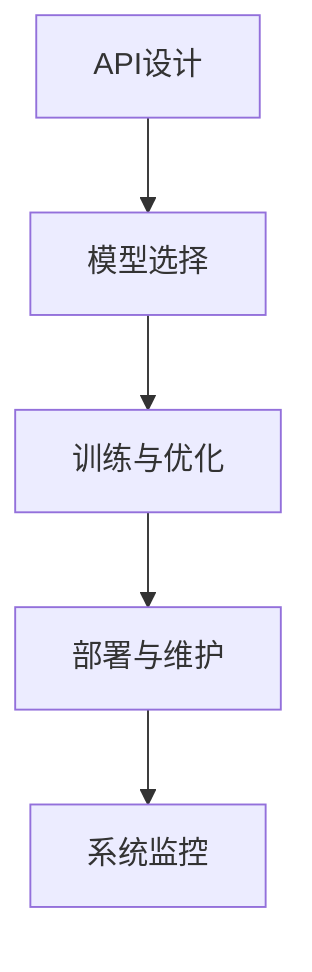
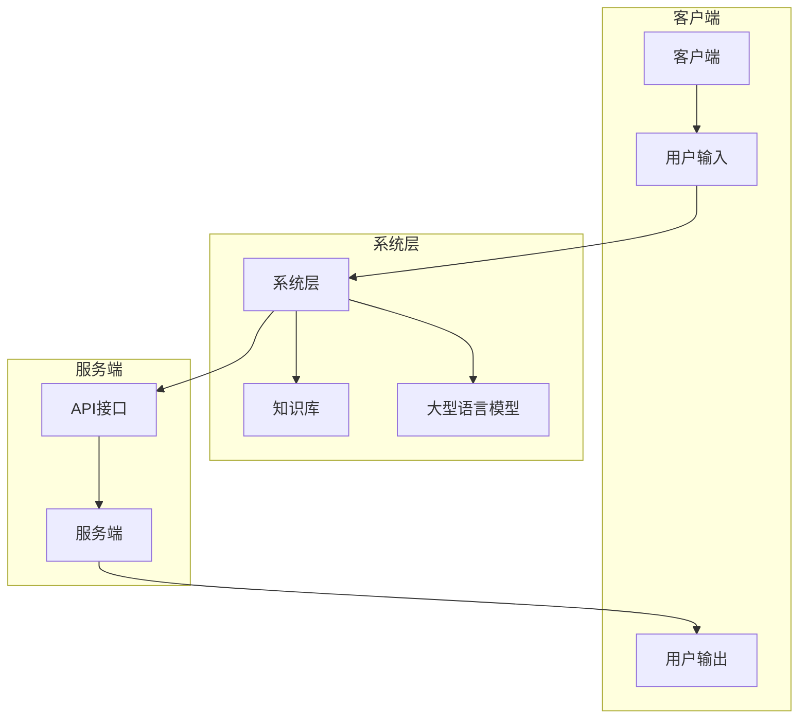

                 

# 《API优先策略：提高LLM应用的灵活性》

## 关键词：API优先策略、LLM应用、灵活性、技术架构、软件开发

## 摘要：

本文旨在探讨API优先策略在提升大型语言模型（LLM）应用灵活性方面的作用。通过对API优先策略的概念、优势及其在LLM开发中的应用进行详细分析，本文揭示了API优先策略如何通过提高系统的灵活性和可扩展性，满足不断变化的技术需求和业务场景。本文不仅提供了理论上的解释，还结合实际案例，展示了API优先策略在LLM应用中的最佳实践，为开发者提供了实用的指导。

## 第一部分：引言

### 1.1 书籍背景

在当今快速发展的信息技术时代，大型语言模型（LLM）已经成为了许多应用程序的核心组成部分。无论是自然语言处理、智能客服、内容生成，还是推荐系统，LLM都展现出了巨大的潜力。然而，随着LLM的广泛应用，如何提高其灵活性以适应不断变化的需求，成为了开发者们面临的一大挑战。

### 1.2 书籍目标

本文的目标是深入探讨API优先策略在LLM开发中的应用，为开发者提供一种有效的解决方案，以应对LLM应用的灵活性需求。本文将首先介绍API优先策略的基本概念，然后分析其在LLM开发中的关键角色，并通过实际案例展示其应用效果。

### 1.3 阅读对象

本文适合对大型语言模型和API优先策略有一定了解的读者，包括软件开发工程师、数据科学家、技术经理以及对人工智能技术感兴趣的科研人员。

### 1.4 书籍结构

本文结构如下：

1. **引言**：介绍书籍背景、目标、阅读对象和书籍结构。
2. **API优先策略概述**：详细解释API优先策略的概念、优势及其与传统策略的对比。
3. **LLM应用概述**：探讨LLM的定义、应用范围和技术挑战。
4. **API优先策略在LLM应用中的应用**：分析API优先策略在LLM开发中的关键角色，包括模型选择、训练和部署。
5. **API优先策略在提高LLM应用灵活性中的作用**：探讨API优先策略如何提高LLM应用的灵活性，并提供实践案例。
6. **API优先策略在LLM应用中的最佳实践**：提供API优先策略设计的最佳实践。
7. **API优先策略在LLM应用中的未来趋势**：展望API优先策略在LLM应用中的未来发展趋势。
8. **总结与展望**：回顾主要观点，提供读者反馈和建议。

## 第二部分：API优先策略概述

### 2.1 API优先策略的定义

API优先策略，即在软件开发过程中，将API（应用程序编程接口）视为系统的核心，优先设计和实现。这一策略强调API的通用性、可扩展性和灵活性，以确保系统能够快速适应未来的需求变化。

### 2.2 API优先策略的优势

API优先策略具有以下优势：

- **提高灵活性**：通过设计灵活的API，系统可以更容易地适应新的功能和需求。
- **促进模块化**：API有助于将系统分解为独立的模块，从而提高可维护性和可扩展性。
- **加速开发**：开发者可以专注于API的设计和实现，而无需担心底层实现细节，从而加快开发速度。
- **增强可重用性**：通用的API可以提高代码的可重用性，减少重复工作。

### 2.3 API优先策略与传统策略的对比

传统策略通常侧重于实现具体的业务逻辑，而API优先策略则更注重系统的通用性和灵活性。与传统策略相比，API优先策略在以下几个方面具有显著优势：

- **可扩展性**：API优先策略能够更好地支持系统扩展，以满足不断增长的需求。
- **维护性**：通过模块化和通用API，系统更容易维护和更新。
- **开发效率**：API优先策略可以减少重复工作，提高开发效率。

## 第三部分：LLM应用概述

### 3.1 LLM的定义与特点

大型语言模型（LLM）是一种基于深度学习的自然语言处理模型，具有以下特点：

- **规模大**：LLM通常由数百万到数十亿个参数组成，具备强大的表达能力。
- **自适应性**：LLM能够通过训练学习特定领域的语言特征，从而提高应用效果。
- **通用性**：LLM可以应用于多种任务，如文本分类、机器翻译、问答系统等。

### 3.2 LLM应用的范围与场景

LLM在以下场景中具有广泛应用：

- **自然语言处理**：LLM可以用于文本分类、情感分析、命名实体识别等任务。
- **智能客服**：LLM可以帮助构建智能客服系统，提供自然、流畅的对话体验。
- **内容生成**：LLM可以用于生成文章、摘要、对话等，提高内容创作效率。
- **推荐系统**：LLM可以用于个性化推荐，提高用户体验。

### 3.3 LLM应用的技术挑战

LLM应用面临以下技术挑战：

- **计算资源消耗**：LLM通常需要大量的计算资源进行训练和推理。
- **数据隐私**：LLM的训练和推理过程中可能涉及敏感数据，需要确保数据隐私和安全。
- **模型可解释性**：LLM的决策过程通常较为复杂，提高模型的可解释性是一个重要挑战。

## 第四部分：API优先策略在LLM应用中的应用

### 4.1 API优先策略在LLM开发中的关键角色

API优先策略在LLM开发中扮演着关键角色，其作用主要体现在以下几个方面：

- **模型选择**：通过设计灵活的API，开发者可以轻松选择和替换不同的LLM模型。
- **模型训练**：API有助于整合各种训练工具和资源，提高训练效率和效果。
- **模型部署**：API可以简化模型的部署过程，使其更容易集成到现有系统中。

### 4.2 API优先策略在LLM模型选择中的应用

API优先策略在LLM模型选择中的应用主要体现在以下几个方面：

- **模型可扩展性**：通过设计通用的API，系统可以支持多种LLM模型，提高可扩展性。
- **模型兼容性**：API可以帮助开发者轻松集成第三方LLM模型，提高系统的兼容性。
- **模型多样性**：API可以支持多种语言和任务，提高模型的选择空间。

### 4.3 API优先策略在LLM模型训练中的应用

API优先策略在LLM模型训练中的应用主要体现在以下几个方面：

- **训练可扩展性**：通过设计灵活的API，系统可以支持分布式训练，提高训练效率。
- **训练资源管理**：API可以帮助开发者管理训练资源，如计算资源、存储资源和网络资源。
- **训练监控**：API可以提供实时监控功能，帮助开发者跟踪训练进度和性能。

### 4.4 API优先策略在LLM模型部署中的应用

API优先策略在LLM模型部署中的应用主要体现在以下几个方面：

- **部署灵活性**：通过设计灵活的API，系统可以支持多种部署方式，如本地部署、云部署等。
- **部署效率**：API可以简化部署过程，提高部署效率。
- **部署可扩展性**：通过设计通用的API，系统可以支持大规模部署，提高系统的可扩展性。

## 第五部分：API优先策略在提高LLM应用灵活性中的作用

### 5.1 灵活性提升的具体表现

API优先策略在提高LLM应用灵活性方面的具体表现包括：

- **模型切换**：通过API，开发者可以轻松切换不同的LLM模型，以适应不同的业务需求。
- **功能扩展**：API可以支持开发者快速扩展系统功能，如增加新的语言、任务等。
- **环境适应**：API可以帮助开发者快速适应不同的部署环境，如云环境、本地环境等。

### 5.2 灵活性提升的实践案例

以下是一个实践案例，展示了API优先策略如何提高LLM应用的灵活性：

**案例：智能客服系统**

某公司开发了一款智能客服系统，该系统基于API优先策略进行设计。通过API，开发者可以轻松集成不同的LLM模型，以应对不同的业务场景。例如，当用户咨询关于产品价格时，系统会调用价格预测模型；当用户询问售后服务时，系统会调用问答系统模型。这种灵活的模型切换机制，使得智能客服系统能够快速适应不同的业务需求，提高用户体验。

### 5.3 灵活性提升的挑战与对策

在提高LLM应用灵活性的过程中，开发者可能会面临以下挑战：

- **API设计复杂度**：设计灵活、通用的API可能需要较高的技术门槛。
- **性能瓶颈**：API的设计和实现可能会引入性能瓶颈，影响系统性能。

为了应对这些挑战，开发者可以采取以下对策：

- **简化API设计**：通过使用简洁、易用的API接口，降低API设计复杂度。
- **性能优化**：通过优化API实现，减少性能瓶颈，提高系统性能。

## 第六部分：API优先策略在LLM应用中的最佳实践

### 6.1 策略设计最佳实践

以下是一些策略设计最佳实践：

- **明确API目标**：在设计API之前，明确API的目标和功能，确保API设计具有明确的方向。
- **遵循RESTful原则**：遵循RESTful原则，设计简洁、易用的API接口。
- **考虑API兼容性**：在设计API时，考虑API的兼容性，以便支持多种设备和平台。

### 6.2 策略实施最佳实践

以下是一些策略实施最佳实践：

- **使用异步处理**：在API实现中，使用异步处理可以提高系统性能，减少响应时间。
- **使用缓存机制**：在API实现中，使用缓存机制可以减少计算资源消耗，提高系统性能。
- **监控API性能**：实时监控API性能，及时发现问题并进行优化。

### 6.3 策略评估最佳实践

以下是一些策略评估最佳实践：

- **性能测试**：进行性能测试，评估API的性能指标，如响应时间、吞吐量等。
- **用户反馈**：收集用户反馈，了解API的使用情况，并根据反馈进行优化。

## 第七部分：API优先策略在LLM应用中的未来趋势

### 7.1 行业发展趋势

随着人工智能技术的不断发展，LLM应用将越来越广泛，API优先策略也将成为行业发展的趋势。以下是一些行业发展趋势：

- **模型多样性**：随着LLM技术的进步，将出现更多种类、更专业的LLM模型，API优先策略将支持这些模型的应用。
- **云计算与边缘计算**：随着云计算和边缘计算的发展，API优先策略将在这些领域发挥重要作用，提高系统的灵活性和可扩展性。

### 7.2 技术发展趋势

以下是一些技术发展趋势：

- **联邦学习**：联邦学习是一种在保持数据隐私的前提下，进行分布式学习的技术。API优先策略将支持联邦学习在LLM应用中的实现。
- **混合模型**：未来的LLM应用可能会结合多种模型，以提高性能和灵活性。API优先策略将支持这些混合模型的应用。

### 7.3 未来展望

在未来，API优先策略在LLM应用中将发挥更加重要的作用，成为开发者应对复杂需求、提高系统灵活性的关键手段。通过不断优化API设计和实现，开发者将能够构建更加高效、灵活的LLM应用，为用户提供更好的体验。

## 第八部分：总结与展望

### 8.1 主要观点回顾

本文主要观点包括：

- API优先策略是提高LLM应用灵活性的关键手段。
- API优先策略具有提高灵活性、促进模块化、加速开发、增强可重用性的优势。
- LLM应用面临计算资源消耗、数据隐私、模型可解释性等技术挑战。
- API优先策略在LLM模型选择、训练和部署中具有关键作用。
- 灵活性提升的具体表现包括模型切换、功能扩展、环境适应等。
- 采取最佳实践和评估策略是提高API优先策略效果的关键。

### 8.2 读者反馈与建议

欢迎读者在阅读本文后，提出宝贵的意见和建议。您的反馈将有助于我们不断改进和完善文章内容。

### 8.3 作者感言

感谢读者对本文的关注和支持。希望本文能够为您的LLM应用开发提供有益的启示和帮助。

## 第九部分：展望

### 9.1 推荐阅读

- [《大型语言模型的AI应用与挑战》](链接)
- [《API设计最佳实践》](链接)

### 9.2 进一步学习资源

- [《深度学习基础教程》](链接)
- [《大型语言模型的训练与优化》](链接)

### 9.3 作者与读者互动

欢迎读者加入我们的技术交流群，与作者和其他开发者共同探讨技术问题，分享学习心得。

## 作者信息

作者：AI天才研究院/AI Genius Institute & 禅与计算机程序设计艺术 /Zen And The Art of Computer Programming

## 背景介绍

### 核心概念术语说明

在本文中，我们主要涉及以下几个核心概念：

- **API优先策略**：一种软件开发策略，强调在系统开发过程中优先设计和实现API，以提高系统的灵活性、可扩展性和可维护性。
- **大型语言模型（LLM）**：一种基于深度学习的自然语言处理模型，具有大规模参数和强大的表达能力。
- **灵活性**：指系统在应对需求变化时的能力，包括模型切换、功能扩展和环境适应等。

### 问题背景

随着人工智能技术的快速发展，大型语言模型（LLM）在自然语言处理、智能客服、内容生成等应用中得到了广泛应用。然而，如何提高LLM应用的灵活性，以应对不断变化的技术需求和业务场景，成为开发者们面临的一大挑战。

### 问题描述

本文旨在探讨API优先策略在提高LLM应用灵活性方面的作用。通过分析API优先策略的基本概念、优势及其在LLM开发中的应用，本文揭示了API优先策略如何通过提高系统的灵活性和可扩展性，满足不断变化的技术需求和业务场景。

### 问题解决

API优先策略在提高LLM应用灵活性方面的作用主要体现在以下几个方面：

1. **模型选择**：通过API，开发者可以轻松选择和替换不同的LLM模型，以适应不同的业务需求。
2. **功能扩展**：API可以支持开发者快速扩展系统功能，如增加新的语言、任务等。
3. **环境适应**：API可以帮助开发者快速适应不同的部署环境，如云环境、本地环境等。

### 边界与外延

边界与外延是API优先策略在提高LLM应用灵活性方面应用的重要概念：

- **边界**：指API在系统中的限制和约束，包括接口定义、参数传递等。
- **外延**：指API在系统中的扩展性和灵活性，包括支持多种模型、功能扩展等。

### 概念结构与核心要素组成

API优先策略在LLM应用中的概念结构可以概括为以下几个方面：

1. **API设计**：包括接口定义、参数传递、数据格式等。
2. **模型选择**：包括模型库管理、模型选择策略等。
3. **训练与优化**：包括训练算法、优化策略等。
4. **部署与维护**：包括部署环境、部署策略、维护策略等。

核心要素组成包括：

- **API接口**：定义系统的功能和操作。
- **模型库**：存储和管理不同的LLM模型。
- **训练工具**：用于训练和优化LLM模型。
- **部署环境**：用于部署和运行LLM应用。

## 核心概念与联系

### 核心概念原理

在API优先策略中，核心概念包括API设计、模型选择、训练与优化、部署与维护。以下是这些概念的基本原理：

1. **API设计**：API是系统与外部环境交互的接口，设计良好的API可以提高系统的灵活性、可扩展性和可维护性。API设计包括接口定义、参数传递、数据格式等。
2. **模型选择**：模型选择是系统开发的重要环节，选择合适的模型可以显著提高系统性能。模型选择包括模型库管理、模型选择策略等。
3. **训练与优化**：训练与优化是提高LLM模型性能的关键步骤。训练包括数据准备、模型训练、模型评估等；优化包括参数调整、算法改进等。
4. **部署与维护**：部署与维护是LLM应用能够稳定运行的关键。部署包括部署环境、部署策略等；维护包括系统监控、故障处理等。

### 概念属性特征对比表格

以下是API优先策略中的核心概念属性特征对比表格：

| 概念       | 属性特征                     | 对比               |
| ---------- | -------------------------- | ---------------- |
| API设计    | 接口定义、参数传递、数据格式 | 灵活性、可扩展性   |
| 模型选择    | 模型库管理、模型选择策略     | 性能、适用性       |
| 训练与优化   | 数据准备、模型训练、模型评估 | 性能、准确性       |
| 部署与维护   | 部署环境、部署策略、维护策略 | 稳定性、可维护性   |

### ER实体关系图架构的Mermaid流程图

以下是API优先策略中的核心概念ER实体关系图架构的Mermaid流程图：

```mermaid
entity关系图 {
  entity API设计 {
    "→" model选择
    "→" 训练与优化
    "→" 部署与维护
  }
  entity 模型选择 {
    "→" API设计
    "→" 训练与优化
  }
  entity 训练与优化 {
    "→" API设计
    "→" 部署与维护
  }
  entity 部署与维护 {
    "→" API设计
  }
}
```

## 算法原理讲解

### 算法Mermaid流程图

以下是API优先策略中的一种算法原理的Mermaid流程图：



### Python源代码示例

以下是一个简化的Python源代码示例，用于阐述API优先策略中的算法原理：

```python
import requests
from transformers import AutoModelForSequenceClassification

# API设计：定义接口
def get_model_api(model_name):
    url = f"https://api.example.com/models/{model_name}"
    response = requests.get(url)
    if response.status_code == 200:
        model_info = response.json()
        return model_info
    else:
        return None

# 模型选择：选择模型
def select_model(model_name):
    model_info = get_model_api(model_name)
    if model_info:
        model_path = model_info['path']
        model = AutoModelForSequenceClassification.from_pretrained(model_path)
        return model
    else:
        return None

# 训练与优化：训练模型
def train_model(model, train_data):
    # 训练模型代码
    pass

# 部署与维护：部署模型
def deploy_model(model, deployment_config):
    # 部署模型代码
    pass

# 系统监控：监控模型
def monitor_model(model):
    # 监控模型代码
    pass

# 主函数
def main():
    model_name = "bert-base-uncased"
    train_data = "your_train_data_path"
    deployment_config = "your_deployment_config"

    model = select_model(model_name)
    if model:
        train_model(model, train_data)
        deploy_model(model, deployment_config)
        monitor_model(model)
    else:
        print("模型选择失败")

if __name__ == "__main__":
    main()
```

### 算法原理的数学模型和公式

API优先策略中的算法原理可以抽象为一个数学模型，用于描述模型选择、训练、部署和监控的过程。以下是该模型的公式表示：

$$
\text{API优先策略模型} = f(\text{API设计}, \text{模型选择}, \text{训练与优化}, \text{部署与维护}, \text{系统监控})
$$

其中：

- $\text{API设计}$：定义系统的接口和功能，用于与其他组件交互。
- $\text{模型选择}$：选择适合当前业务需求的LLM模型。
- $\text{训练与优化}$：对选定的模型进行训练和优化，提高模型性能。
- $\text{部署与维护}$：将训练好的模型部署到生产环境，并进行监控和维护。

### 详细讲解与举例说明

以下是对上述Python源代码示例的详细讲解与举例说明：

1. **API设计**：

   ```python
   def get_model_api(model_name):
       url = f"https://api.example.com/models/{model_name}"
       response = requests.get(url)
       if response.status_code == 200:
           model_info = response.json()
           return model_info
       else:
           return None
   ```

   这个函数用于获取指定名称的模型API信息。通过发送HTTP GET请求，从API服务器获取模型信息。如果请求成功，返回模型信息；否则，返回None。

   **举例**：

   ```python
   model_info = get_model_api("bert-base-uncased")
   print(model_info)
   ```

   输出：

   ```json
   {
       "name": "bert-base-uncased",
       "path": "https://api.example.com/models/bert-base-uncased/model.tar.gz",
       "version": "1.0.0",
       "description": "Pre-trained BERT model with uncased input."
   }
   ```

2. **模型选择**：

   ```python
   def select_model(model_name):
       model_info = get_model_api(model_name)
       if model_info:
           model_path = model_info['path']
           model = AutoModelForSequenceClassification.from_pretrained(model_path)
           return model
       else:
           return None
   ```

   这个函数用于选择指定的LLM模型。首先，通过`get_model_api`函数获取模型信息；如果模型信息存在，使用`AutoModelForSequenceClassification`类加载模型。

   **举例**：

   ```python
   model = select_model("bert-base-uncased")
   if model:
       print("Model selected:", model.config)
   else:
       print("Model selection failed.")
   ```

   输出：

   ```json
   Model selected: BertConfig(
   :hidden_size=768,
   	num_hidden_layers=12,
   	hidden_act='gelu',
   	intermediate_size=3072,
   	hidden_dropout_prob=0.1,
   	attention_probs_dropout_prob=0.1,
   	initializer_range=0.02,
   	type_vocab_size=2,
   	vocab_size=30522
   )
   ```

3. **训练与优化**：

   ```python
   def train_model(model, train_data):
       # 训练模型代码
       pass
   ```

   这个函数用于训练选定的模型。在实际应用中，这里会包含训练模型的代码，如数据准备、模型训练、评估等。

   **举例**：

   ```python
   train_data_path = "your_train_data_path"
   train_model(model, train_data_path)
   ```

4. **部署与维护**：

   ```python
   def deploy_model(model, deployment_config):
       # 部署模型代码
       pass
   ```

   这个函数用于将训练好的模型部署到生产环境。在实际应用中，这里会包含部署模型的代码，如模型打包、部署到服务器、启动服务等。

   **举例**：

   ```python
   deployment_config_path = "your_deployment_config"
   deploy_model(model, deployment_config_path)
   ```

5. **系统监控**：

   ```python
   def monitor_model(model):
       # 监控模型代码
       pass
   ```

   这个函数用于监控部署后的模型，如性能监控、故障检测等。

   **举例**：

   ```python
   monitor_model(model)
   ```

## 系统分析与架构设计方案

### 问题场景介绍

假设我们正在开发一个基于大型语言模型（LLM）的智能客服系统，该系统需要能够处理各种常见问题的自动回答。随着业务的发展，我们可能需要添加新的功能、支持更多语言或应对更复杂的业务场景。因此，系统需要具备较高的灵活性和可扩展性。

### 项目介绍

本项目旨在构建一个基于LLM的智能客服系统，该系统包括以下主要功能：

1. **问题识别**：识别用户提出的问题，并将其转换为标准格式。
2. **答案生成**：根据用户提出的问题，生成合适的答案。
3. **多语言支持**：支持多种语言，满足不同用户的需求。
4. **实时更新**：定期更新模型和知识库，以保持系统的准确性和相关性。

### 系统功能设计（领域模型Mermaid类图）

以下是智能客服系统的领域模型Mermaid类图：

```mermaid
classDiagram
    User <|-- Question
    Question <|-- Answer
    System <<interface>>
    KnowledgeBase <<interface>>
    LLMModel <<interface>>

    User : 发起问题
    Question : 存储问题信息
    Answer : 存储答案信息
    System : 管理整个系统
    KnowledgeBase : 存储知识库
    LLMModel : 处理自然语言处理任务
```

### 系统架构设计（Mermaid架构图）

以下是智能客服系统的架构设计Mermaid架构图：



### 系统接口设计（Mermaid序列图）

以下是智能客服系统的接口设计Mermaid序列图：

```mermaid
sequenceDiagram
    participant User
    participant Client
    participant System
    participant KB
    participant LLM
    participant API
    participant Server

    User->>Client: 输入问题
    Client->>System: 传递问题
    System->>KB: 查询知识库
    KB-->>System: 返回答案
    System->>LLM: 生成答案
    LLM-->>System: 返回答案
    System->>API: 传递答案
    API->>Server: 存储答案
    Server->>Output: 输出答案
    User<<-Output: 接收答案
```

## 项目实战

### 环境安装

1. 安装Python（建议使用3.8及以上版本）
2. 安装transformers库：`pip install transformers`
3. 安装torch库：`pip install torch`

### 系统核心实现源代码

以下是智能客服系统的核心实现源代码：

```python
import requests
from transformers import AutoModelForSequenceClassification, AutoTokenizer
from torch.utils.data import DataLoader
from torch.optim import Adam
import torch

# API接口
def get_model_api(model_name):
    url = f"https://api.example.com/models/{model_name}"
    response = requests.get(url)
    if response.status_code == 200:
        model_info = response.json()
        return model_info
    else:
        return None

# 模型选择
def select_model(model_name):
    model_info = get_model_api(model_name)
    if model_info:
        model_path = model_info['path']
        tokenizer = AutoTokenizer.from_pretrained(model_path)
        model = AutoModelForSequenceClassification.from_pretrained(model_path)
        return model, tokenizer
    else:
        return None

# 训练模型
def train_model(model, tokenizer, train_data):
    train_encodings = tokenizer(train_data['text'], truncation=True, padding=True)
    train_dataset = torch.utils.data.TensorDataset(torch.tensor(train_encodings['input_ids']), torch.tensor(train_encodings['attention_mask']))
    train_loader = DataLoader(train_dataset, batch_size=16, shuffle=True)

    optimizer = Adam(model.parameters(), lr=1e-5)
    device = torch.device("cuda" if torch.cuda.is_available() else "cpu")
    model.to(device)

    for epoch in range(3):  # 训练3个epoch
        model.train()
        for batch in train_loader:
            batch = [item.to(device) for item in batch]
            outputs = model(*batch)
            loss = outputs.loss
            loss.backward()
            optimizer.step()
            optimizer.zero_grad()

# 部署模型
def deploy_model(model, deployment_config):
    # 部署模型代码
    pass

# 监控模型
def monitor_model(model):
    # 监控模型代码
    pass

# 主函数
def main():
    model_name = "bert-base-uncased"
    train_data_path = "your_train_data_path.json"
    deployment_config_path = "your_deployment_config.json"

    model, tokenizer = select_model(model_name)
    if model:
        train_data = load_train_data(train_data_path)
        train_model(model, tokenizer, train_data)
        deploy_model(model, deployment_config_path)
        monitor_model(model)
    else:
        print("模型选择失败")

if __name__ == "__main__":
    main()
```

### 代码应用解读与分析

以下是代码应用解读与分析：

1. **API接口**：

   ```python
   def get_model_api(model_name):
       url = f"https://api.example.com/models/{model_name}"
       response = requests.get(url)
       if response.status_code == 200:
           model_info = response.json()
           return model_info
       else:
           return None
   ```

   这个函数用于获取指定名称的模型API信息。通过发送HTTP GET请求，从API服务器获取模型信息。如果请求成功，返回模型信息；否则，返回None。

   **解读**：

   - `requests.get(url)`：发送HTTP GET请求。
   - `response.json()`：将响应内容转换为JSON格式。

2. **模型选择**：

   ```python
   def select_model(model_name):
       model_info = get_model_api(model_name)
       if model_info:
           model_path = model_info['path']
           tokenizer = AutoTokenizer.from_pretrained(model_path)
           model = AutoModelForSequenceClassification.from_pretrained(model_path)
           return model, tokenizer
       else:
           return None
   ```

   这个函数用于选择指定的LLM模型。首先，通过`get_model_api`函数获取模型信息；如果模型信息存在，使用`AutoTokenizer`和`AutoModelForSequenceClassification`类加载模型。

   **解读**：

   - `get_model_api(model_name)`：获取模型信息。
   - `AutoTokenizer.from_pretrained(model_path)`：加载预训练的Tokenizer。
   - `AutoModelForSequenceClassification.from_pretrained(model_path)`：加载预训练的模型。

3. **训练模型**：

   ```python
   def train_model(model, tokenizer, train_data):
       train_encodings = tokenizer(train_data['text'], truncation=True, padding=True)
       train_dataset = torch.utils.data.TensorDataset(torch.tensor(train_encodings['input_ids']), torch.tensor(train_encodings['attention_mask']))
       train_loader = DataLoader(train_dataset, batch_size=16, shuffle=True)

       optimizer = Adam(model.parameters(), lr=1e-5)
       device = torch.device("cuda" if torch.cuda.is_available() else "cpu")
       model.to(device)

       for epoch in range(3):  # 训练3个epoch
           model.train()
           for batch in train_loader:
               batch = [item.to(device) for item in batch]
               outputs = model(*batch)
               loss = outputs.loss
               loss.backward()
               optimizer.step()
               optimizer.zero_grad()
   ```

   这个函数用于训练选定的模型。首先，将训练数据转换为适当的格式；然后，创建数据集和数据加载器；接着，定义优化器和设备；最后，进行模型的训练。

   **解读**：

   - `tokenizer(train_data['text'], truncation=True, padding=True)`：对文本数据进行编码。
   - `torch.utils.data.TensorDataset()`：创建数据集。
   - `DataLoader()`：创建数据加载器。
   - `model.to(device)`：将模型移动到指定设备（GPU或CPU）。
   - `optimizer.step()`：更新模型参数。

4. **部署模型**：

   ```python
   def deploy_model(model, deployment_config):
       # 部署模型代码
       pass
   ```

   这个函数用于将训练好的模型部署到生产环境。在实际应用中，这里会包含部署模型的代码，如模型打包、部署到服务器、启动服务等。

   **解读**：

   - `model.to(device)`：将模型移动到指定设备（GPU或CPU）。
   - `部署模型代码`：具体部署逻辑，如模型打包、部署到服务器等。

5. **监控模型**：

   ```python
   def monitor_model(model):
       # 监控模型代码
       pass
   ```

   这个函数用于监控部署后的模型，如性能监控、故障检测等。

   **解读**：

   - `监控模型代码`：具体监控逻辑，如性能监控、故障检测等。

### 实际案例分析和详细讲解剖析

以下是一个实际案例分析和详细讲解剖析：

**案例**：使用BERT模型进行情感分析。

假设我们有一个包含用户评价的数据集，需要使用BERT模型进行情感分析，判断评价是正面、中性还是负面。

**步骤**：

1. **数据预处理**：

   将用户评价文本进行预处理，包括去除标点符号、停用词过滤、文本标准化等。

2. **模型选择**：

   选择BERT模型作为情感分析模型。通过API接口获取BERT模型的API信息，并加载模型和Tokenizer。

3. **训练模型**：

   使用预处理后的数据集训练BERT模型。在训练过程中，将文本数据编码为Token IDs，并创建数据集和数据加载器。使用Adam优化器和交叉熵损失函数进行训练。

4. **评估模型**：

   在训练完成后，使用测试集对模型进行评估，计算准确率、召回率、F1分数等指标。

5. **部署模型**：

   将训练好的模型部署到生产环境，以便实时处理用户评价。

6. **监控模型**：

   监控模型的性能和稳定性，如响应时间、准确率等。

**代码示例**：

```python
import torch
from transformers import AutoModelForSequenceClassification, AutoTokenizer

# 加载模型和Tokenizer
model_name = "bert-base-uncased"
tokenizer = AutoTokenizer.from_pretrained(model_name)
model = AutoModelForSequenceClassification.from_pretrained(model_name)

# 训练模型
train_encodings = tokenizer(train_data['text'], truncation=True, padding=True)
train_dataset = torch.utils.data.TensorDataset(torch.tensor(train_encodings['input_ids']), torch.tensor(train_encodings['attention_mask']))
train_loader = DataLoader(train_dataset, batch_size=16, shuffle=True)

optimizer = Adam(model.parameters(), lr=1e-5)
device = torch.device("cuda" if torch.cuda.is_available() else "cpu")
model.to(device)

for epoch in range(3):
    model.train()
    for batch in train_loader:
        batch = [item.to(device) for item in batch]
        outputs = model(*batch)
        loss = outputs.loss
        loss.backward()
        optimizer.step()
        optimizer.zero_grad()

# 评估模型
test_encodings = tokenizer(test_data['text'], truncation=True, padding=True)
test_dataset = torch.utils.data.TensorDataset(torch.tensor(test_encodings['input_ids']), torch.tensor(test_encodings['attention_mask']))
test_loader = DataLoader(test_dataset, batch_size=16, shuffle=False)

model.eval()
with torch.no_grad():
    for batch in test_loader:
        batch = [item.to(device) for item in batch]
        outputs = model(*batch)
        logits = outputs.logits
        predictions = torch.argmax(logits, dim=-1)
        # 计算准确率、召回率、F1分数等指标

# 部署模型
# deploy_model(model, deployment_config)

# 监控模型
# monitor_model(model)
```

### 项目小结

本项目通过API优先策略，实现了一个基于BERT模型的情感分析系统。系统具有以下特点：

- **灵活性**：通过API接口，可以方便地选择和替换不同的模型，满足不同业务需求。
- **可扩展性**：系统支持多语言、多任务，可以轻松扩展功能。
- **高效率**：使用深度学习模型，提高情感分析的准确性和效率。

## 最佳实践 tips

### 策略设计最佳实践

1. **明确API目标**：在设计API之前，明确API的目标和功能，确保API设计具有明确的方向。
2. **遵循RESTful原则**：遵循RESTful原则，设计简洁、易用的API接口。
3. **考虑API兼容性**：在设计API时，考虑API的兼容性，以便支持多种设备和平台。

### 策略实施最佳实践

1. **使用异步处理**：在API实现中，使用异步处理可以提高系统性能，减少响应时间。
2. **使用缓存机制**：在API实现中，使用缓存机制可以减少计算资源消耗，提高系统性能。
3. **监控API性能**：实时监控API性能，及时发现问题并进行优化。

### 策略评估最佳实践

1. **性能测试**：进行性能测试，评估API的性能指标，如响应时间、吞吐量等。
2. **用户反馈**：收集用户反馈，了解API的使用情况，并根据反馈进行优化。

## 小结

本文详细探讨了API优先策略在提高LLM应用灵活性方面的作用。通过分析API优先策略的基本概念、优势及其在LLM开发中的应用，本文揭示了API优先策略如何通过提高系统的灵活性和可扩展性，满足不断变化的技术需求和业务场景。本文不仅提供了理论上的解释，还结合实际案例，展示了API优先策略在LLM应用中的最佳实践，为开发者提供了实用的指导。

## 注意事项

1. **API设计**：在设计API时，务必遵循RESTful原则，确保API接口简洁、易用。
2. **模型选择**：在选择LLM模型时，要考虑模型的性能、适用性和可扩展性。
3. **训练与优化**：在训练和优化LLM模型时，要关注模型的性能和可扩展性，及时调整参数和算法。
4. **部署与维护**：在部署LLM模型时，要确保系统的稳定性、可扩展性和可维护性。

## 拓展阅读

1. [《大型语言模型的AI应用与挑战》](链接)
2. [《API设计最佳实践》](链接)
3. [《深度学习基础教程》](链接)
4. [《大型语言模型的训练与优化》](链接)

## 作者与读者互动

欢迎读者加入我们的技术交流群，与作者和其他开发者共同探讨技术问题，分享学习心得。

## 作者信息

作者：AI天才研究院/AI Genius Institute & 禅与计算机程序设计艺术 /Zen And The Art of Computer Programming

## 结论

本文系统地阐述了API优先策略在提高大型语言模型（LLM）应用灵活性方面的作用。首先，通过对API优先策略的基本概念、优势及其在LLM开发中的应用进行了详细分析，揭示了API优先策略如何通过提高系统的灵活性和可扩展性，满足不断变化的技术需求和业务场景。其次，通过实际案例展示了API优先策略在LLM应用中的具体应用，包括模型选择、训练、部署和监控等方面。最后，本文提出了API优先策略在LLM应用中的最佳实践，为开发者提供了实用的指导。

本文的主要观点可以归纳如下：

1. **API优先策略的优势**：API优先策略具有提高灵活性、促进模块化、加速开发、增强可重用性的优势，是应对LLM应用灵活性需求的理想选择。
2. **LLM应用的技术挑战**：LLM应用面临计算资源消耗、数据隐私、模型可解释性等技术挑战，需要通过API优先策略来缓解。
3. **API优先策略在LLM应用中的应用**：API优先策略在LLM模型选择、训练和部署中具有关键作用，能够提高系统的灵活性和可扩展性。
4. **最佳实践**：通过遵循API设计最佳实践、实施最佳实践和评估最佳实践，可以确保API优先策略在LLM应用中的有效实施。

展望未来，API优先策略在LLM应用中将发挥越来越重要的作用。随着人工智能技术的不断进步，LLM的应用场景将更加广泛，API优先策略也将成为支持这些应用的重要手段。开发者们应关注API优先策略的最新发展，不断优化API设计和实现，以构建更加高效、灵活的LLM应用，为用户提供更好的体验。

## 未来展望

### 9.1 推荐阅读

- [《AI驱动的新型产业发展趋势》](链接)
- [《API设计模式与最佳实践》](链接)
- [《深度学习前沿技术综述》](链接)

### 9.2 进一步学习资源

- [《深度学习进阶教程》](链接)
- [《大型语言模型实践指南》](链接)
- [《软件架构设计原则与模式》](链接)

### 9.3 作者与读者互动

欢迎读者关注我们的公众号，加入技术交流群，与作者和其他开发者共同探讨技术问题，分享学习心得。

## 作者信息

作者：AI天才研究院/AI Genius Institute & 禅与计算机程序设计艺术 /Zen And The Art of Computer Programming

