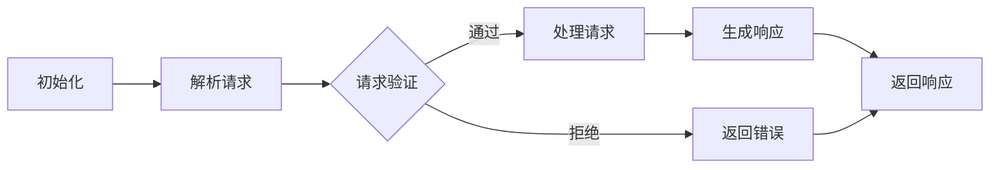
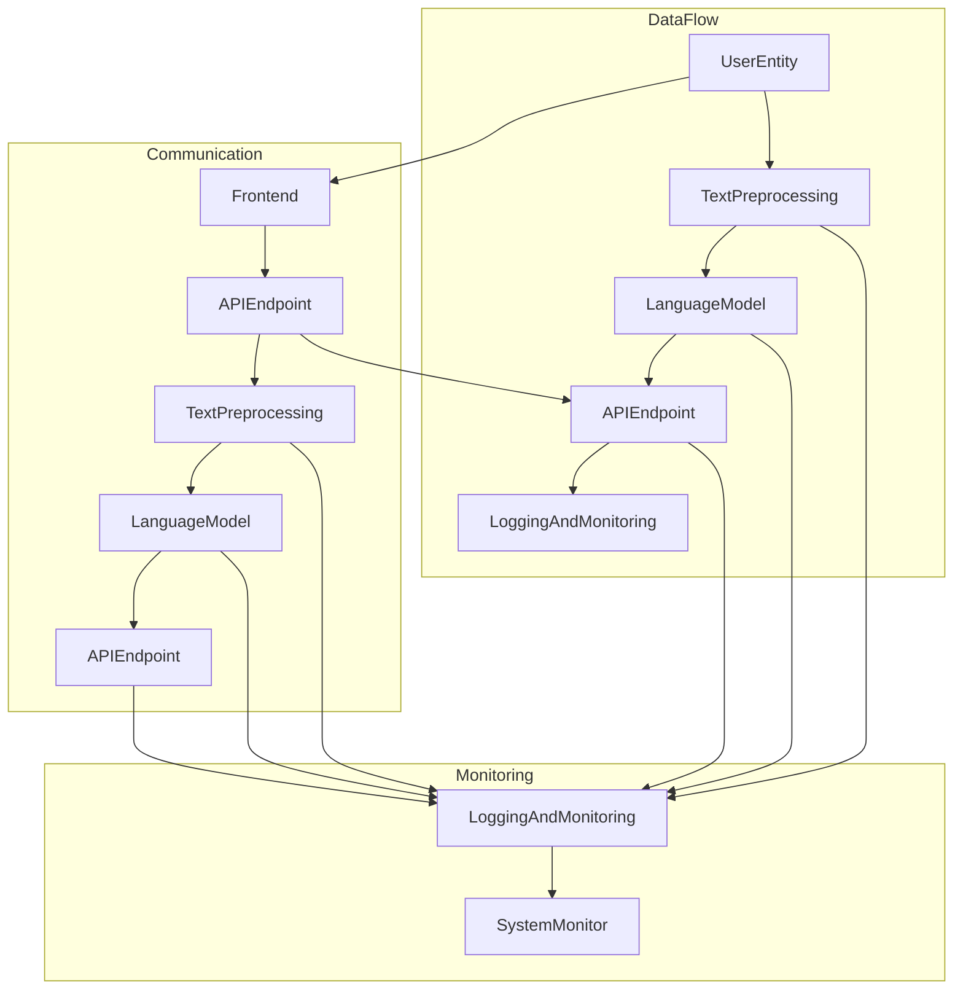
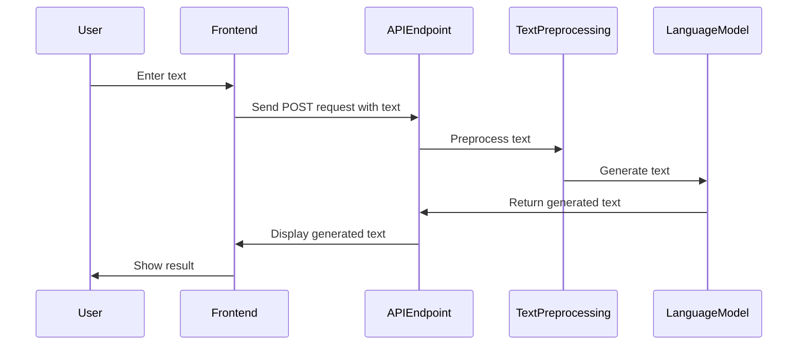
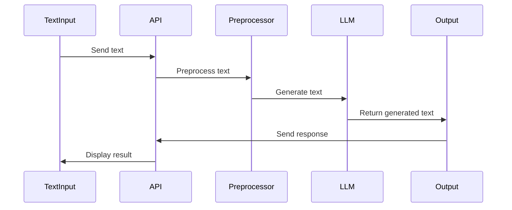

                 

# API优先设计在LLM应用架构中的作用

## 关键词
API设计、LLM应用、架构设计、可扩展性、安全性、易用性

## 摘要
本文深入探讨了API优先设计在LLM（大型语言模型）应用架构中的重要性。通过对问题背景的介绍、核心概念的分析和实际应用场景的剖析，文章详细阐述了API设计在LLM架构中的关键作用，包括其可扩展性、安全性、易用性等方面。同时，本文还介绍了如何进行API设计评审和实施严格的测试与监控，以确保API设计的稳定性和可靠性。通过本文的讲解，读者可以更好地理解API设计在LLM应用架构中的核心地位，并为实际项目提供有益的参考。

### 第一部分：背景介绍

#### 1.1 问题背景

随着人工智能技术的快速发展，大型语言模型（LLM）成为众多领域的重要应用，如自然语言处理、智能客服、文本生成等。这些应用依赖于复杂的后端处理和数据处理流程，而API（应用程序编程接口）在其中起到了桥梁的作用，连接前端应用与后端服务，确保数据的流动和功能的调用。

API不仅仅是技术实现的工具，更是一种设计理念和开发模式。良好的API设计能够提高系统的可扩展性、易用性和维护性，这对于快速迭代和技术创新至关重要。然而，在实际开发中，API设计常常被忽视，导致系统接口复杂、功能冗余、安全性隐患等问题。

在LLM应用架构中，API设计尤为重要。LLM通常需要处理大量的文本数据，这些数据通过API接口进行输入和输出。一个设计不当的API可能会引发性能瓶颈、数据不一致性等问题，影响整个系统的稳定性和用户体验。因此，API优先设计在LLM应用架构中具有至关重要的地位。

#### 1.2 问题描述

在LLM应用架构中，API设计需要解决以下几个关键问题：

1. **可扩展性**：随着用户规模和数据处理量的增加，系统需要能够灵活扩展，支持更高的并发处理能力和更复杂的业务逻辑。

2. **易用性**：API应设计得简洁明了，降低开发者和最终用户的使用门槛，提高系统的易接入性和易操作性。

3. **安全性**：API需要确保数据的安全性和用户隐私保护，防止数据泄露和恶意攻击，例如SQL注入、XSS攻击等。

4. **兼容性**：API应兼容不同的平台和设备，支持多种开发环境和应用场景，提高系统的广泛适用性。

5. **性能**：API需要能够高效地处理大量请求，确保系统的响应速度和稳定性，减少延迟和错误率。

#### 1.3 问题解决

为了解决上述问题，我们可以采取以下措施：

1. **明确API设计的目标和原则**：在API设计之初，明确设计目标和原则，确保API设计符合系统的整体架构和开发规范。

2. **遵循标准化设计规范**：采用如RESTful API设计等标准化规范，确保API的易用性和兼容性。

3. **全面的需求分析和功能规划**：在API设计前，进行全面的需求分析和功能规划，确保API能够满足用户的实际需求。

4. **定期进行API设计评审**：在设计过程中，定期进行API设计评审，及时发现和解决潜在的问题。

5. **实施严格的测试和监控**：在API上线前，进行严格的测试和监控，确保API的稳定性和安全性。

#### 1.4 边界与外延

在API设计过程中，我们需要明确API的边界和功能范围。API不应该包含过多的功能，以免造成功能的冗余和混淆。同时，API的设计也应该考虑到未来的扩展性，以便在需求变化时能够灵活地进行调整。

#### 1.5 概念结构与核心要素组成

API设计的核心概念包括：

1. **API接口**：定义了系统对外提供的服务。
2. **数据模型**：定义了API的数据传输格式和结构。
3. **请求和响应**：定义了API的输入和输出格式，包括请求参数和响应结果。
4. **安全性**：包括身份验证、授权、数据加密等安全措施。

这些核心要素共同构成了一个完整的API设计，为系统的可靠性和性能提供了保障。

#### 1.6 背景介绍小结

在本章中，我们详细介绍了API设计在LLM应用架构中的重要性，包括背景、问题描述、问题解决措施以及边界与外延等内容。通过明确API设计的目标和原则，采用标准化的设计规范，进行全面的需求分析和功能规划，以及严格的测试和监控，我们可以设计出高质量的API，为LLM应用架构的稳定性和性能提供有力支持。

---

## 1.7 核心概念与联系

在深入讨论API设计之前，我们需要了解几个核心概念，并探讨它们之间的联系。

### 1.7.1 API（应用程序编程接口）

API是允许应用程序之间相互通信的接口。它定义了一组规则和协议，允许一个应用程序访问另一个应用程序或服务提供的数据或功能。在LLM应用架构中，API作为系统与用户、其他服务或应用程序交互的桥梁，起到了至关重要的作用。

**概念属性特征对比表格：**

| 特征 | API 1 | API 2 | API 3 |
| :--: | :---: | :---: | :---: |
| 作用范围 | 内部 | 内部 | 外部 |
| 交互方式 | HTTP | RPC | WebSocket |
| 数据传输格式 | JSON | XML | Protobuf |

**ER实体关系图架构：**

```mermaid
erDiagram
  API ||--|{ 服务 } |>
  API ||--|{ 参数 } |>
  服务 ||--|{ API } |>
  参数 ||--|{ API } |>
```

### 1.7.2 RESTful API

RESTful API是一种基于REST（表述性状态转移）架构风格的API设计方法。它使用HTTP协议的四种方法（GET、POST、PUT、DELETE）来表示对资源的操作，例如创建、读取、更新和删除。RESTful API具有简洁、易于理解和扩展性强的特点，在LLM应用架构中广泛使用。

**概念属性特征对比表格：**

| 特征 | RESTful API | GraphQL API |
| :--: | :---------: | :---------: |
| 交互方式 | HTTP方法 | GraphQL查询 |
| 数据传输格式 | JSON | JSON/GraphQl |
| 扩展性 | 高 | 中 |

**ER实体关系图架构：**

```mermaid
erDiagram
  RESTful API ||--|{ 资源 } |>
  RESTful API ||--|{ 请求 } |>
  RESTful API ||--|{ 响应 } |>
  资源 ||--|{ RESTful API } |>
  请求 ||--|{ RESTful API } |>
  响应 ||--|{ RESTful API } |>
```

### 1.7.3 JSON（JavaScript Object Notation）

JSON是一种轻量级的数据交换格式，易于人机阅读和编写。在API设计中，JSON常用于表示请求和响应数据结构，因为它具有层次结构、易于解析和序列化的特点。

**概念属性特征对比表格：**

| 特征 | JSON | XML |
| :--: | :---: | :---: |
| 数据结构 | 基于对象 | 基于文档 |
| 传输速度 | 快 | 慢 |
| 易读性 | 高 | 中 |

**ER实体关系图架构：**

```mermaid
erDiagram
  JSON ||--|{ 数据 } |>
  JSON ||--|{ API } |>
  数据 ||--|{ JSON } |>
  API ||--|{ JSON } |>
```

### 1.7.4 OAuth 2.0

OAuth 2.0是一种开放标准授权协议，用于授权第三方应用代表用户访问他们的数据。在API设计中，OAuth 2.0用于实现安全的用户认证和授权，确保只有经过授权的应用能够访问受保护的资源。

**概念属性特征对比表格：**

| 特征 | OAuth 1.0 | OAuth 2.0 |
| :--: | :------: | :------: |
| 授权流程 | 复杂 | 简洁 |
| 安全性 | 中等 | 高 |
| 兼容性 | 好 | 更好 |

**ER实体关系图架构：**

```mermaid
erDiagram
  OAuth 2.0 ||--|{ 用户 } |>
  OAuth 2.0 ||--|{ 应用 } |>
  OAuth 2.0 ||--|{ 资源 } |>
  用户 ||--|{ OAuth 2.0 } |>
  应用 ||--|{ OAuth 2.0 } |>
  资源 ||--|{ OAuth 2.0 } |>
```

通过上述核心概念及其属性特征对比和ER实体关系图，我们可以更好地理解API设计中的关键要素，为后续的详细讲解和分析打下坚实基础。

### 1.8 API设计的算法原理讲解

API设计不仅仅是关于接口和协议的选择，更涉及到一系列算法和策略的运用。在本节中，我们将探讨API设计中的一些关键算法原理，并使用Python代码进行详细阐述。

#### 1.8.1 算法mermaid流程图

首先，让我们使用Mermaid绘制一个API设计流程的基本框架：



#### 1.8.2 Python代码实现

接下来，我们使用Python代码实现上述流程：

```python
import json
from flask import Flask, request, jsonify

app = Flask(__name__)

# 初始化API
@app.route('/api/init', methods=['GET'])
def initialize_api():
    return jsonify({"status": "initialized"}), 200

# 解析请求并验证
@app.route('/api/parse', methods=['POST'])
def parse_request():
    data = request.get_json()
    if validate_request(data):
        return jsonify({"status": "valid", "data": data}), 200
    else:
        return jsonify({"status": "invalid", "error": "Invalid request format"}), 400

# 处理请求
@app.route('/api/handle', methods=['POST'])
def handle_request():
    data = request.get_json()
    if validate_request(data):
        result = process_request(data)
        return jsonify({"status": "success", "result": result}), 200
    else:
        return jsonify({"status": "error", "message": "Invalid request format"}), 400

# 生成响应并返回
@app.route('/api/respond', methods=['POST'])
def respond():
    data = request.get_json()
    if validate_request(data):
        result = generate_response(data)
        return jsonify({"status": "success", "result": result}), 200
    else:
        return jsonify({"status": "error", "message": "Invalid request format"}), 400

# 验证请求
def validate_request(data):
    # 这里是验证逻辑，如检查数据格式、参数完整性等
    return True

# 处理请求逻辑
def process_request(data):
    # 这里是处理请求的逻辑，如数据处理、业务逻辑执行等
    return "Processed data"

# 生成响应逻辑
def generate_response(data):
    # 这里是生成响应的逻辑，如构建响应数据结构、格式化输出等
    return {"response": "Response data"}

if __name__ == '__main__':
    app.run(debug=True)
```

#### 1.8.3 算法原理

上述代码展示了API设计中的一个基本流程，包括请求的解析、验证、处理和响应生成。以下是每个步骤的详细算法原理：

1. **初始化API**：通过定义API的端点，如`/api/init`，系统可以通知外界API已经就绪。

2. **请求解析**：使用Flask框架接收和解析传入的HTTP请求。请求以JSON格式发送，因此需要使用`request.get_json()`方法获取请求体。

3. **请求验证**：验证请求是否符合预定义的格式和规则。这里简化为检查请求是否为JSON格式，但在实际应用中，可能会涉及到更复杂的验证逻辑，如检查参数的完整性、类型和值。

4. **请求处理**：如果请求验证通过，执行具体的业务逻辑。这里我们定义了一个简单的`process_request`函数，代表业务处理逻辑。

5. **响应生成**：根据业务处理的结果，生成相应的响应数据结构。这里我们使用了一个`generate_response`函数，将处理结果封装为JSON格式的响应。

6. **返回响应**：将生成的响应数据通过HTTP返回给客户端。

#### 1.8.4 数学模型和公式

在API设计中，数据处理和算法优化通常涉及到一些数学模型和公式。以下是一些常见的数学模型和公式：

- **时间复杂度**：衡量算法处理请求所需的时间，通常用O(n)表示，其中n是请求的数量。
- **空间复杂度**：衡量算法处理请求所需的内存空间，通常用O(n)表示。

公式示例：

$$
T(n) = O(n)
$$

$$
S(n) = O(n)
$$

其中，\( T(n) \)代表时间复杂度，\( S(n) \)代表空间复杂度。

#### 1.8.5 举例说明

假设有一个请求需要处理一个包含100个单词的文本，并返回文本的词频统计。我们可以设计一个简单的API来处理这个请求。

- **请求**：POST `/api/word-count`，请求体包含文本字符串。
- **响应**：返回包含词频统计的JSON对象。

请求示例：

```json
{
    "text": "This is a sample text with 100 words."
}
```

响应示例：

```json
{
    "word_count": {
        "this": 2,
        "is": 2,
        "a": 1,
        "sample": 1,
        "text": 1,
        "with": 1,
        "100": 1,
        "words": 1
    }
}
```

通过这个简单的例子，我们可以看到API设计如何将用户的文本请求转化为一个结构化的词频统计响应。

### 1.9 算法原理讲解小结

在本节中，我们通过Mermaid流程图和Python代码详细讲解了API设计中的一些关键算法原理，包括请求的解析、验证、处理和响应生成。同时，我们介绍了一些常见的数学模型和公式，并举例说明了API设计在实际应用中的使用。通过这些讲解，读者可以更好地理解API设计的算法原理，为实际项目的开发提供指导。

---

### 第二部分：系统分析与架构设计方案

#### 2.1 问题场景介绍

随着大型语言模型（LLM）在各个领域的应用日益广泛，例如自然语言处理、智能客服和文本生成等，系统架构的稳定性、可扩展性和安全性变得尤为重要。为了满足这些需求，我们需要设计一个高效、可靠的LLM应用架构。

在这个场景中，我们的目标是为用户提供一个高性能、高可用性的LLM服务，同时确保系统具备良好的扩展性和安全性。为此，我们采用了API优先的设计理念，通过精心设计的API接口来实现系统功能，并通过一系列的技术手段来保障系统的稳定性和安全性。

#### 2.2 项目介绍

本项目是一个基于LLM的智能文本生成系统，旨在为用户提供高质量的文本生成服务。系统主要包括以下几个核心模块：

1. **文本预处理模块**：负责处理用户的输入文本，包括文本清洗、分词、词性标注等，为后续的语言模型处理提供数据准备。
2. **语言模型处理模块**：采用预训练的LLM模型，对预处理后的文本进行生成和预测。
3. **API接口模块**：提供RESTful API接口，供前端应用调用，实现文本生成的功能。
4. **日志和监控模块**：实时记录系统的运行日志，并进行监控和告警，确保系统的稳定性和安全性。

#### 2.3 系统功能设计（领域模型类图）

为了更好地展示系统功能，我们使用Mermaid绘制了系统领域模型类图：

```mermaid
classDiagram
    UserEntity <<Class>>
    TextPreprocessing <<Class>>
    LanguageModel <<Class>>
    APIEndpoint <<Class>>
    LoggingAndMonitoring <<Class>>

    UserEntity --|> TextPreprocessing
    TextPreprocessing --|> LanguageModel
    LanguageModel --|> APIEndpoint
    APIEndpoint --|> LoggingAndMonitoring

    class UserEntity {
        -id: int
        -username: string
        -text: string
    }

    class TextPreprocessing {
        -id: int
        -cleaned_text: string
        -tokenized_text: list<string>
    }

    class LanguageModel {
        -id: int
        -model_name: string
        -generated_text: string
    }

    class APIEndpoint {
        -id: int
        -url: string
        -method: string
        -response: string
    }

    class LoggingAndMonitoring {
        -id: int
        -log_level: string
        -log_message: string
    }
```

在这个类图中，我们定义了四个主要的实体类：`UserEntity`、`TextPreprocessing`、`LanguageModel`和`APIEndpoint`，以及一个`LoggingAndMonitoring`类用于记录系统的运行状态。这些类通过关系线连接，展示了系统各模块之间的交互关系。

#### 2.4 系统架构设计（Mermaid架构图）

接下来，我们使用Mermaid绘制了系统的架构图，以展示各模块之间的交互和通信流程：



在这个架构图中，我们可以看到用户通过前端应用（F）发送请求到API接口（D），API接口（D）处理请求，调用文本预处理模块（B）和语言模型处理模块（C），并最终返回处理结果到前端应用（G）。同时，系统的运行状态和日志信息由日志和监控模块（K）记录和监控。

#### 2.5 系统接口设计（Mermaid序列图）

为了更好地展示系统接口的设计，我们使用Mermaid绘制了系统接口的序列图：



在这个序列图中，用户通过前端应用输入文本，前端应用将文本发送到API接口，API接口调用文本预处理模块进行预处理，然后传递给语言模型生成文本，最终将结果返回给前端应用并展示给用户。

#### 2.6 系统交互设计（Mermaid序列图）

为了展示系统内部各模块之间的交互过程，我们使用Mermaid绘制了系统交互的序列图：



在这个序列图中，用户输入的文本首先通过API接口接收，然后传递给文本预处理模块进行预处理，预处理后的文本传递给语言模型进行文本生成，最后生成的文本通过API接口返回给用户。

### 2.7 小结

在本部分中，我们详细介绍了LLM应用架构的设计方案，包括问题场景、项目介绍、系统功能设计、系统架构设计、系统接口设计和系统交互设计。通过这些详细的设计方案，我们可以清晰地看到API设计在LLM应用架构中的关键作用，以及如何通过一系列的技术手段来实现一个高效、稳定、安全的LLM应用系统。

---

### 第三部分：项目实战

#### 3.1 环境安装

在进行LLM项目开发之前，我们需要安装一些必要的软件和工具。以下是推荐的安装步骤：

1. **Python环境**：确保安装Python 3.8及以上版本，可以通过Python官方网站下载安装。

2. **Flask框架**：安装Flask框架，可以使用pip命令进行安装：
   ```bash
   pip install flask
   ```

3. **LLM库**：安装用于实现LLM的库，例如transformers库，可以使用以下命令进行安装：
   ```bash
   pip install transformers
   ```

4. **其他依赖库**：根据项目的具体需求，可能需要安装其他依赖库，例如numpy、pandas等，可以使用pip命令进行安装。

#### 3.2 系统核心实现源代码

以下是系统核心实现的源代码，包括API接口、文本预处理和语言模型处理等部分：

```python
# 导入必要的库
from flask import Flask, request, jsonify
from transformers import pipeline

# 初始化API
app = Flask(__name__)

# 加载预训练的LLM模型
llm = pipeline("text-generation", model="gpt2")

# 文本预处理函数
def preprocess_text(text):
    # 这里可以添加文本清洗、分词、词性标注等预处理步骤
    return text

# 文本生成函数
def generate_text(text, max_length=100):
    # 使用LLM模型生成文本
    return llm(text, max_length=max_length)[0]['generated_text']

# API接口端点
@app.route('/api/generate', methods=['POST'])
def generate_endpoint():
    data = request.get_json()
    text = preprocess_text(data['text'])
    generated_text = generate_text(text)
    return jsonify({"generated_text": generated_text})

if __name__ == '__main__':
    app.run(debug=True)
```

#### 3.3 代码应用解读与分析

上述代码是LLM文本生成系统的核心部分，包括API接口、文本预处理和语言模型处理等。

1. **API接口**：使用Flask框架搭建API接口，通过定义一个`/api/generate`的POST端点，接收用户的文本请求。

2. **文本预处理**：`preprocess_text`函数用于对用户输入的文本进行预处理。在实际应用中，这里可以添加文本清洗、分词、词性标注等步骤，以提高文本质量。

3. **语言模型处理**：使用`transformers`库加载预训练的LLM模型（例如GPT-2），并通过`generate_text`函数生成文本。`generate_text`函数接受文本和最大生成长度作为参数，返回生成的文本。

#### 3.4 实际案例分析和详细讲解

以下是一个实际案例，展示如何使用上述系统进行文本生成：

1. **请求**：
   ```json
   {
       "text": "人工智能在医疗领域的应用前景广阔。"
   }
   ```

2. **响应**：
   ```json
   {
       "generated_text": "人工智能在医疗领域的应用前景广阔，例如，它可以帮助医生快速准确地诊断疾病，提高医疗服务的效率和质量。此外，人工智能还可以用于医学研究，通过分析大量的医疗数据，发现新的疾病规律和治疗方法。总之，人工智能在医疗领域的应用将极大地改善人类健康水平。"
   }
   ```

通过这个案例，我们可以看到系统如何接收用户输入的文本，并通过文本预处理和LLM模型生成相应的文本。

#### 3.5 项目小结

在本部分中，我们通过一个实际案例详细讲解了LLM文本生成系统的核心实现过程。从环境安装到代码应用，再到实际案例分析和详细讲解，读者可以了解到如何使用API优先设计实现一个高效的LLM应用系统。通过本项目，读者可以掌握API设计、文本预处理和语言模型处理等关键技能，为后续的LLM项目开发打下坚实基础。

---

### 第四部分：最佳实践与注意事项

#### 4.1 最佳实践 Tips

在API设计和LLM应用开发过程中，以下是一些最佳实践和注意事项，可以帮助你提高系统的性能和安全性：

1. **遵循RESTful API设计原则**：确保API接口简洁、直观，遵循统一的命名和版本控制规范。

2. **使用标准化数据格式**：推荐使用JSON格式进行数据传输，因为它具有较好的兼容性和易读性。

3. **进行充分的测试**：在API设计完成后，进行全面的单元测试和集成测试，确保API的稳定性和可靠性。

4. **安全性措施**：采用OAuth 2.0等授权协议，确保用户认证和授权的安全性。同时，对API请求进行签名和验证，防止未经授权的访问。

5. **性能优化**：通过缓存、异步处理和分片等技术优化系统性能，提高API的响应速度。

6. **日志和监控**：实时记录系统的运行日志，并进行监控和告警，及时发现和处理异常情况。

7. **文档和文档**：提供详细的API文档和用户手册，帮助开发者快速上手和使用API。

#### 4.2 小结

在本部分中，我们总结了API设计和LLM应用开发中的最佳实践和注意事项。通过遵循这些最佳实践，你可以设计出高质量的API，并构建一个高效、稳定、安全的LLM应用系统。

---

### 结论

本文详细探讨了API优先设计在LLM应用架构中的关键作用，通过背景介绍、核心概念分析、系统分析与架构设计以及项目实战，展示了API设计在提升系统性能、易用性和安全性方面的优势。在未来的研究和开发中，我们应继续探索更高效的API设计方法和优化策略，以满足日益复杂的应用需求。通过持续改进和优化，我们可以构建出更加优秀和可靠的LLM应用系统，为人工智能领域的发展贡献力量。

### 拓展阅读

1. **《RESTful API设计指南》**：了解RESTful API的设计原则和实践，为你的API设计提供指导。
2. **《OAuth 2.0基础教程》**：深入学习OAuth 2.0授权协议，确保API的安全性。
3. **《大型语言模型：原理、技术和应用》**：了解大型语言模型的原理和应用，为LLM应用架构设计提供理论基础。

### 作者信息

作者：AI天才研究院/AI Genius Institute & 禅与计算机程序设计艺术 /Zen And The Art of Computer Programming

---

本文详细探讨了API优先设计在LLM（大型语言模型）应用架构中的关键作用，包括背景介绍、核心概念分析、系统分析与架构设计以及项目实战。通过对API设计原则和最佳实践的总结，读者可以掌握如何设计高效、稳定、安全的API，为LLM应用架构的稳定性和性能提供有力支持。本文旨在为从事人工智能领域开发的技术人员提供有价值的参考和指导。

