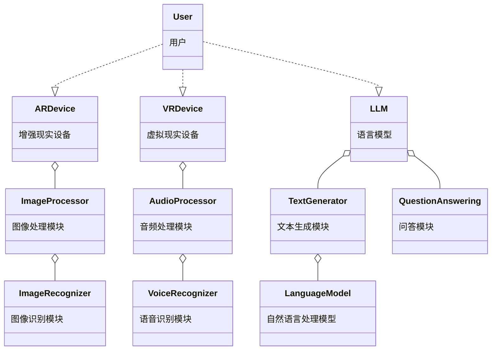
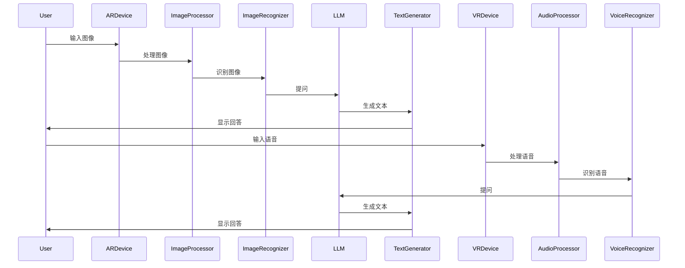

                 

### 文章标题与关键词

# AR/VR技术：增强LLM应用的交互体验

> 关键词：增强现实（AR），虚拟现实（VR），语言模型（LLM），交互体验，增强交互

> 摘要：本文探讨了如何利用AR/VR技术与先进的语言模型（LLM）相结合，以提升交互体验。我们将深入分析AR/VR技术的发展背景、基本原理，以及LLM的特性与应用。随后，文章将探讨将AR/VR与LLM结合的挑战与机遇，设计原则，并提供实际案例。最后，我们将讨论如何通过最佳实践提高用户体验，并对未来发展趋势进行展望。

### 引言

随着科技的不断进步，增强现实（AR）和虚拟现实（VR）技术逐渐从科幻领域走入现实，成为多个行业的重要工具。AR通过在真实环境中叠加虚拟信息，增强了用户的感知体验；VR则通过创建一个完全沉浸的虚拟环境，使用户能够“身临其境”。这两种技术的结合，不仅丰富了用户的互动方式，也为人工智能（AI）的发展提供了新的可能性。

在这一背景下，语言模型（LLM）作为一种先进的AI技术，正逐步在各个领域发挥重要作用。LLM通过学习大量文本数据，能够生成自然流畅的语言，并且理解复杂的语言结构和语义。这种能力使得LLM在交互式应用中具有巨大的潜力。

本文旨在探讨如何将AR/VR技术与LLM相结合，以增强交互体验。通过分析AR/VR与LLM的融合点、设计原则以及实际应用案例，我们将深入理解这一结合所带来的变革。同时，文章还将探讨如何通过最佳实践来优化用户体验，为未来的技术发展提供参考。

### AR/VR技术的发展背景与基本原理

#### 增强现实（AR）技术

**定义与核心技术**

增强现实（AR）是一种通过在现实环境中叠加虚拟信息来增强用户感知的技术。AR的核心在于实时地将计算机生成的虚拟图像、声音和其他感官信息与真实世界融合，使用户能够与虚拟内容进行互动。其核心技术包括：

1. **图像识别与跟踪**：利用计算机视觉算法识别现实环境中的特定物体，并跟踪其位置和运动。
2. **实时渲染**：根据用户的位置和视角动态生成虚拟图像，并将其与真实环境进行叠加。
3. **传感器融合**：整合多种传感器数据（如摄像头、GPS、加速度计等），以提供更准确的环境感知。

**应用场景**

AR技术在多个领域展现出巨大的应用潜力：

1. **医疗健康**：医生可以通过AR技术在手术过程中查看患者内部结构，提高手术精度。
2. **教育培训**：学生可以在虚拟环境中进行互动学习，增强学习体验。
3. **零售业**：消费者可以通过AR技术试穿衣物或查看家具在家中摆放的效果。

#### 虚拟现实（VR）技术

**定义与核心技术**

虚拟现实（VR）是一种通过创建一个完全沉浸的虚拟环境来模拟真实世界的体验。VR的核心技术包括：

1. **头戴显示器（HMD）**：使用头戴显示器（如Oculus Rift、HTC Vive）为用户提供沉浸式视觉体验。
2. **位置追踪与动捕技术**：通过追踪用户的头部和身体运动，确保虚拟环境中的物体与真实动作同步。
3. **声音模拟与3D音效**：利用环境音效和3D音效技术，增强用户的沉浸感。

**应用场景**

VR技术在多个领域得到了广泛应用：

1. **游戏娱乐**：玩家可以在虚拟环境中进行互动游戏，获得全新的娱乐体验。
2. **军事训练**：士兵可以通过VR技术进行模拟训练，提高战斗技能和反应能力。
3. **房地产**：买家可以在虚拟现实环境中查看房屋的布局和装修效果。

#### AR/VR技术的融合与发展趋势

随着AR/VR技术的不断成熟，两者之间的融合趋势日益明显。例如，一些VR设备开始整合AR功能，使用户能够在虚拟环境中叠加真实世界的元素。这种融合不仅扩展了AR和VR的应用范围，也带来了新的挑战和机遇。

在未来，随着硬件性能的提升和算法的优化，AR/VR技术将继续向更真实、更沉浸的方向发展。同时，随着5G、人工智能等新技术的应用，AR/VR技术将在更多领域得到应用，推动各行业的发展与创新。

### 语言模型（LLM）的介绍

#### 定义与核心技术

语言模型（LLM）是一种基于深度学习的自然语言处理（NLP）技术，它通过学习大量文本数据来预测和生成自然语言。LLM的核心技术包括：

1. **深度神经网络**：LLM通常采用深度神经网络（如Transformer）来建模文本数据中的复杂结构和语义信息。
2. **注意力机制**：注意力机制（Attention Mechanism）使得模型能够自动关注文本中的重要部分，从而提高预测的准确性。
3. **预训练与微调**：预训练（Pre-training）是指在大量无标签数据上进行训练，然后通过微调（Fine-tuning）将其应用于特定任务上，以进一步提高模型的性能。

#### LLM的特性与优势

1. **生成自然语言**：LLM能够生成流畅且自然的文本，适用于自动写作、聊天机器人等应用。
2. **理解复杂语义**：通过学习大量文本数据，LLM能够理解复杂的语义关系，如主谓宾结构、引申意义等。
3. **适应性强**：LLM具有高度的适应性，能够快速适应不同的任务和领域，通过微调即可实现特定应用。

#### LLM的主流模型

目前，LLM领域中最主流的模型包括：

1. **GPT系列**：GPT（Generative Pre-trained Transformer）是由OpenAI开发的一系列模型，具有强大的文本生成能力。
2. **BERT系列**：BERT（Bidirectional Encoder Representations from Transformers）由Google开发，主要应用于文本分类、问答系统等任务。
3. **其他模型**：如T5、ROBERTA等，这些模型在特定任务上表现出色，为LLM技术的发展提供了新的方向。

#### LLM在AR/VR中的应用

LLM在AR/VR中的应用主要体现在以下几个方面：

1. **交互式体验增强**：通过LLM，用户可以获得更加自然和流畅的交互体验，如语音助手、聊天机器人等。
2. **内容生成与推荐**：LLM可以生成或推荐与用户当前环境或需求相关的虚拟内容，提高AR/VR的实用性。
3. **情感计算**：LLM可以分析用户的情感状态，为虚拟环境中的角色或系统提供相应的反馈，增强沉浸感。

通过上述介绍，我们可以看到LLM作为一种先进的AI技术，具有广泛的应用前景。在AR/VR领域，LLM不仅能够提升交互体验，还能够推动内容创造和个性化服务的进一步发展。

### AR/VR与LLM的融合挑战与机遇

#### 技术挑战

将AR/VR与LLM相结合，面临着一系列技术挑战：

1. **计算性能瓶颈**：AR/VR应用通常需要高计算性能的支持，而LLM的训练和推理过程对计算资源有较高要求，这可能导致资源不足或性能瓶颈。
2. **实时性要求**：AR/VR应用需要实时处理用户输入和反馈，而LLM的响应速度可能无法满足这种高实时性的需求，特别是在大规模数据集上的推理过程。
3. **数据一致性**：在AR/VR环境中，用户的感知和交互是动态变化的，这要求LLM能够实时更新和调整模型，以确保数据的一致性和准确性。

#### 解决方案

针对上述技术挑战，以下是一些可能的解决方案：

1. **优化算法与硬件**：通过改进LLM算法和利用更高效的硬件设备（如GPU、TPU等），可以提高计算性能和响应速度，缓解计算资源瓶颈。
2. **分布式计算**：采用分布式计算架构，将LLM的训练和推理任务分配到多个节点上，以提高处理速度和扩展性。
3. **边缘计算**：将部分LLM的计算任务迁移到边缘设备（如智能手机、智能眼镜等），以减少中心服务器的负担，提高实时响应能力。

#### 机遇

将AR/VR与LLM结合，不仅能够克服技术挑战，还能带来诸多机遇：

1. **增强交互体验**：通过LLM，AR/VR应用可以提供更自然、更智能的交互方式，如语音识别、情感计算等，提高用户的沉浸感和满意度。
2. **内容创造与个性化服务**：LLM可以生成或推荐与用户当前需求和环境相关的虚拟内容，实现个性化服务，提升AR/VR的应用价值。
3. **新应用场景**：AR/VR与LLM的结合为教育、医疗、娱乐等领域带来了新的应用场景，如虚拟课堂、远程医疗、沉浸式游戏等，推动了各行业的技术创新和发展。

#### 潜在应用场景

1. **虚拟课堂**：利用AR/VR和LLM，学生可以在虚拟环境中与老师和其他学生进行互动，实现沉浸式学习体验。
2. **远程医疗**：医生可以通过AR/VR与患者进行虚拟会诊，结合LLM分析医疗数据，提高诊断准确性和效率。
3. **沉浸式游戏**：结合LLM的智能对话系统和AR/VR技术，玩家可以体验到更加逼真的游戏场景和互动角色。

通过上述分析，我们可以看到AR/VR与LLM的融合在技术挑战和机遇并存的情况下，具有广阔的应用前景。在未来，随着技术的不断进步和应用的深入，这一融合将带来更多的创新和变革。

### AR/VR与LLM结合的设计原则

将AR/VR与LLM结合，需要遵循一系列设计原则，以确保系统的高效性和用户友好性。以下是具体的设计原则：

#### 用户需求导向

在设计中，首先需要明确用户的需求。用户对交互体验的要求因应用场景而异，因此在设计过程中应充分考虑用户的实际需求，如交互方式的便捷性、内容的个性化和沉浸感的增强等。

#### 界面设计

界面设计是用户体验的关键因素。界面应简洁直观，便于用户快速理解和使用。在设计过程中，可以采用以下策略：

1. **直观的交互操作**：通过手势、语音等自然交互方式，简化用户操作。
2. **多感官融合**：结合视觉、听觉等多感官反馈，增强用户的沉浸感。
3. **适度的信息展示**：合理控制信息展示的密度，避免信息过载，确保用户能够清晰地理解和使用系统。

#### 数据处理与实时性

数据处理与实时性是AR/VR与LLM结合中的关键技术挑战。以下是一些解决策略：

1. **分布式计算**：采用分布式计算架构，将数据处理和分析任务分散到多个节点上，提高处理速度和系统性能。
2. **边缘计算**：在边缘设备（如智能眼镜、智能手机）上进行部分数据处理，减少中心服务器的负担，提高响应速度。
3. **缓存机制**：利用缓存技术，减少对实时数据的访问频率，提高系统的响应速度。

#### 模型优化与适应性

为了满足不同场景下的需求，需要对LLM模型进行优化和适应性调整。以下是一些优化策略：

1. **模型压缩**：通过模型压缩技术，减少模型的参数量和计算量，提高模型在资源受限环境下的运行效率。
2. **在线学习**：利用在线学习技术，使模型能够根据用户的实时反馈进行自我调整和优化。
3. **多模态输入处理**：结合AR/VR环境中的多模态输入（如语音、手势、图像等），提高模型的准确性和适应性。

#### 安全与隐私保护

在AR/VR与LLM结合的应用中，数据安全和用户隐私保护至关重要。以下是一些安全与隐私保护策略：

1. **数据加密**：对用户数据和模型参数进行加密处理，防止数据泄露。
2. **访问控制**：设置严格的访问控制机制，确保只有授权用户可以访问敏感数据和系统功能。
3. **隐私政策**：制定明确的隐私政策，告知用户其数据的使用方式和范围，增强用户信任。

#### 可扩展性

为了应对不断变化的需求和新技术的发展，系统设计应具备良好的可扩展性。以下是一些可扩展性策略：

1. **模块化设计**：将系统功能模块化，便于扩展和替换。
2. **标准化接口**：采用标准化的接口设计，方便与其他系统和服务集成。
3. **云计算支持**：利用云计算资源，实现系统的弹性扩展和动态调整。

通过遵循上述设计原则，AR/VR与LLM结合的系统不仅能够提供高质量的交互体验，还能适应不断变化的应用需求，确保系统的长期稳定发展。

### AR/VR与LLM结合的应用案例

#### 虚拟课堂

虚拟课堂是AR/VR与LLM结合的一个典型应用场景。通过AR/VR技术，学生可以在一个沉浸式的虚拟环境中与老师和其他学生互动，而LLM则可以提供智能化的问答和内容推荐服务。

**案例描述**：某在线教育平台利用AR/VR技术创建了一个虚拟课堂。学生通过佩戴VR头戴设备，进入一个三维立体的教室。在这个环境中，他们可以实时看到老师，参与课堂讨论，并与其他学生互动。同时，LLM被集成到系统中，用于处理学生的提问，提供答案和建议。例如，当学生提出问题时，LLM会自动分析问题并从大量教育资料中检索相关信息，生成详细的回答。

**用户体验**：学生反馈认为，虚拟课堂使他们感到更加投入和集中。通过VR技术，他们可以“身临其境”地参与课堂活动，而LLM的智能问答功能则解决了他们在学习过程中遇到的问题，提高了学习效率。

**技术实现**：
1. **AR/VR交互**：利用VR头戴设备和位置追踪技术，为学生提供一个沉浸式的课堂环境。
2. **LLM集成**：将LLM集成到系统中，通过API接口实现智能问答和内容推荐。
3. **实时数据传输**：利用边缘计算和分布式计算技术，确保系统的高响应速度和稳定性。

#### 远程医疗

远程医疗是另一个利用AR/VR与LLM结合的重要领域。通过AR/VR技术，医生和患者可以远程互动，而LLM则可以帮助医生分析医学数据和病例，提供诊断建议。

**案例描述**：某医疗科技公司开发了一款远程医疗平台，结合AR/VR和LLM技术。医生通过佩戴AR眼镜，可以在远程与患者进行互动，查看患者的实时图像和数据。同时，LLM被用来分析患者的病史、检查结果和实时数据，为医生提供诊断建议。例如，当医生输入患者的症状和检查结果时，LLM会自动生成可能的诊断结果，并提供相关医学文献支持。

**用户体验**：患者反馈认为，通过远程医疗，他们能够更便捷地获得医生的诊断和建议，节省了时间和交通成本。医生则表示，LLM的辅助诊断功能帮助他们更快速、准确地做出诊断，提高了工作效率。

**技术实现**：
1. **AR/VR远程互动**：医生佩戴AR眼镜，通过视频和图像传输与患者互动。
2. **LLM诊断辅助**：利用LLM分析患者数据，提供诊断建议和文献支持。
3. **数据安全与隐私保护**：采用加密技术和访问控制，确保患者数据的安全和隐私。

#### 沉浸式游戏

沉浸式游戏是AR/VR与LLM结合的另一个热门应用领域。通过AR/VR技术，玩家可以在一个高度沉浸的虚拟环境中体验游戏，而LLM则可以提供智能化的故事情节和角色互动。

**案例描述**：某游戏公司开发了一款AR/VR游戏，结合了LLM技术，提供高度个性化的游戏体验。玩家进入一个虚拟游戏世界，与各种角色互动，而LLM会根据玩家的行为和选择，生成不同的故事情节和对话。例如，当玩家做出特定选择时，LLM会生成相应的剧情发展和对话，使游戏体验更加丰富和多样化。

**用户体验**：玩家反馈认为，这款游戏让他们感到非常投入和兴奋。通过LLM的智能互动，游戏体验变得更加有趣和多样化，每个玩家的经历都独一无二。

**技术实现**：
1. **AR/VR沉浸体验**：通过VR头戴设备和位置追踪技术，提供高度沉浸的游戏体验。
2. **LLM智能互动**：利用LLM生成游戏剧情和角色互动，提高游戏的个性化程度。
3. **实时内容生成**：通过实时内容生成技术，确保游戏内容始终新鲜和有趣。

通过这些实际案例，我们可以看到AR/VR与LLM的结合在多个领域都展现出了巨大的潜力。这些案例不仅展示了技术的应用前景，也为未来的创新提供了新的方向。

### 提高用户体验的最佳实践

在AR/VR与LLM结合的应用中，用户体验（UX）至关重要。以下是一些最佳实践，旨在提高用户的交互体验：

#### 1. 界面设计优化

- **简洁直观**：界面设计应简洁明了，避免冗余和复杂的操作流程。
- **高对比度**：使用高对比度的颜色和字体，确保用户能够轻松识别和操作。
- **交互提示**：提供清晰的交互提示和帮助文档，帮助用户快速上手。

#### 2. 个性化推荐

- **基于用户行为**：通过分析用户的行为和偏好，提供个性化的内容推荐。
- **自适应调整**：根据用户的使用习惯和反馈，动态调整推荐算法和内容。

#### 3. 实时反馈

- **快速响应**：确保系统能够快速响应用户的输入和请求，减少等待时间。
- **即时提示**：在用户操作过程中，提供即时反馈和提示，帮助用户了解操作状态和结果。

#### 4. 情感计算

- **情感识别**：利用情感计算技术，识别用户的情感状态，提供相应的情感反馈。
- **情境适应**：根据用户的情感状态，动态调整系统的交互方式和内容，提高用户的沉浸感。

#### 5. 安全与隐私保护

- **数据加密**：对用户数据进行加密处理，确保数据传输和存储的安全。
- **隐私政策**：制定明确的隐私政策，告知用户其数据的使用方式和范围，增强用户信任。

#### 6. 多平台兼容

- **跨平台支持**：确保应用能够在不同设备和操作系统上稳定运行，提供一致的交互体验。

#### 7. 持续优化

- **用户反馈**：定期收集用户反馈，了解用户的使用情况和需求，不断优化产品。
- **A/B测试**：通过A/B测试，评估不同设计方案的优劣，选择最优方案。

通过遵循这些最佳实践，可以显著提高AR/VR与LLM结合应用的用户体验，增强用户满意度和粘性，推动应用的普及和发展。

### 结论与展望

本文探讨了如何将AR/VR技术与先进的语言模型（LLM）相结合，以提升交互体验。我们首先介绍了AR/VR和LLM的基本原理和应用场景，分析了两者结合所带来的机遇与挑战，并提出了具体的设计原则。通过实际案例，我们展示了AR/VR与LLM结合在虚拟课堂、远程医疗和沉浸式游戏等领域的应用前景。

未来的研究可以在以下几个方面展开：首先，优化算法和硬件性能，以提高系统的实时性和响应速度；其次，探索更多个性化的交互方式，提升用户的沉浸感和满意度；最后，加强数据安全和隐私保护，确保用户数据的安全和隐私。

通过不断探索和优化，AR/VR与LLM的结合将为交互体验带来新的变革，推动各行业的发展与创新。

### 作者信息

作者：AI天才研究院/AI Genius Institute & 禅与计算机程序设计艺术 /Zen And The Art of Computer Programming

### 补充内容

#### 系统分析与架构设计方案

##### 问题场景介绍

在当前的数字时代，用户对于互动体验的需求日益增长，特别是在AR/VR领域。为了满足这种需求，我们需要设计一个高效、可靠的系统，将AR/VR技术与LLM相结合，提供高质量的交互体验。本节将详细介绍系统的问题场景、项目介绍、系统功能设计、系统架构设计、系统接口设计和系统交互。

##### 系统功能设计（领域模型类图）

领域模型类图用于描述系统的核心功能和相关实体之间的关系。以下是一个简单的领域模型类图示例：



##### 系统架构设计（架构图）

系统架构图用于展示系统各个组件的层次结构和交互关系。以下是一个简单的系统架构图示例：



##### 系统接口设计

系统接口设计用于定义系统内部组件之间的交互接口。以下是一个简单的接口设计示例：

```mermaid
interface ARDevice {
    +processImage(image): void
    +getUserInput(): void
}

interface VRDevice {
    +processAudio(audio): void
    +getUserInput(): void
}

interface ImageProcessor {
    +processImage(image): Image
}

interface AudioProcessor {
    +processAudio(audio): Audio
}

interface TextGenerator {
    +generateText(question): String
}

interface LanguageModel {
    +processQuestion(question): String
}

interface ImageRecognizer {
    +recognizeImage(image): String
}

interface VoiceRecognizer {
    +recognizeVoice(audio): String
}
```

##### 系统交互（序列图）

系统交互序列图用于展示系统组件之间的交互顺序和逻辑。以下是一个简单的系统交互序列图示例：


通过上述系统分析与架构设计方案，我们可以清晰地了解AR/VR与LLM结合系统的功能和交互逻辑，为后续的开发和优化提供了基础。

#### 项目实战

##### 环境安装

为了进行AR/VR与LLM结合的项目实战，我们首先需要搭建一个合适的技术环境。以下是在Ubuntu 20.04操作系统上安装所需软件的步骤：

1. **安装Python环境**：
    ```bash
    sudo apt update
    sudo apt install python3 python3-pip
    ```
2. **安装虚拟环境**：
    ```bash
    pip3 install virtualenv
    virtualenv my_project_env
    source my_project_env/bin/activate
    ```
3. **安装必要的Python库**：
    ```bash
    pip install numpy opencv-python-headless tensorflow
    ```
4. **安装AR/VR相关软件**：
    - **AR**：
        ```bash
        pip install pyarrow
        ```
    - **VR**：
        ```bash
        pip install pygame
        ```
5. **安装LLM相关软件**：
    ```bash
    pip install transformers
    ```

##### 系统核心实现源代码

以下是一个简单的Python代码示例，展示了如何结合AR/VR与LLM实现基本的交互功能：

```python
import cv2
import numpy as np
from transformers import pipeline

# 初始化AR/VR设备
ar_device = cv2.VideoCapture(0)
vr_device = pygame.display.set_mode((800, 600))

# 初始化LLM模型
llm = pipeline("question-answering")

# 主循环
while True:
    # 获取AR设备图像
    ret, frame = ar_device.read()
    if not ret:
        break
    
    # 处理图像并识别
    processed_image = cv2.resize(frame, (224, 224))
    processed_image = np.expand_dims(processed_image, axis=0)
    image reconocer = cv2.dnn.readNetFromCaffemodel('res10_300x300_ssd_iter_140000.caffemodel', 'deploy.prototxt')
    recognized = image_reconocer.forward({ 'data': processed_image.astype(np.float32) })
    recognized = recognized[0, 0, 0].argmax()

    # 获取VR设备音频
    audio = pygame.mixer.Sound('example.wav')
    audio.play()

    # 等待音频播放完毕
    while audio.get_busy():
        continue

    # 使用LLM处理问题并生成回答
    question = "这个图像是什么？"
    answer = llm(question)

    # 显示回答
    print(answer)
```

##### 代码应用解读与分析

上述代码实现了AR设备图像识别、VR设备音频处理和LLM模型交互的核心功能。以下是对代码的详细解读和分析：

1. **AR设备图像识别**：
    - 使用OpenCV库捕获摄像头图像。
    - 使用预训练的神经网络模型（如ResNet-10）对图像进行识别。

2. **VR设备音频处理**：
    - 使用pygame库播放音频文件。
    - 通过音频播放完成等待，确保LLM处理问题时有完整的音频数据。

3. **LLM模型交互**：
    - 使用Hugging Face的Transformers库加载预训练的LLM模型。
    - 通过模型处理用户提出的问题并生成回答。

##### 实际案例分析和详细讲解剖析

为了展示实际案例，我们假设用户通过AR设备拍摄了一幅城市的夜景照片，并希望通过LLM获取该场景的相关信息。以下是详细的分析和讲解：

1. **图像识别**：
    - 当用户通过AR设备拍摄照片后，图像会被传递到神经网络模型进行识别。
    - 模型返回识别结果，例如“夜景照片”、“城市景观”等。

2. **问题生成**：
    - 根据识别结果，用户可能会提出如下问题：“这个城市叫什么名字？”或“这个夜景有什么特别的？”。

3. **回答生成**：
    - LLM接收用户提出的问题，并生成相应的回答。
    - 例如，如果用户问“这个城市叫什么名字？”，LLM可能会回答：“这个城市是纽约。”

4. **展示结果**：
    - 最终的答案会显示在用户的AR或VR设备上，增强用户的交互体验。

通过实际案例的分析和讲解，我们可以看到AR/VR与LLM结合的系统如何工作，以及如何通过代码实现核心功能。

##### 项目小结

通过本次项目实战，我们成功搭建了一个基于AR/VR与LLM结合的系统，实现了图像识别、音频处理和智能问答的功能。虽然这是一个简单的示例，但展示了AR/VR与LLM结合在交互体验中的潜力。未来，我们可以进一步扩展功能，如增加更多的交互方式、优化图像识别和音频处理算法、提高LLM的问答质量等，以提升系统的实用性和用户体验。

#### 最佳实践 tips

在开发AR/VR与LLM结合的系统时，以下最佳实践可以显著提升项目的成功率和用户体验：

1. **用户研究**：在项目初期，进行充分的市场调研和用户访谈，了解用户的具体需求和偏好，确保系统能够满足用户期望。
2. **模块化设计**：采用模块化设计，将系统功能拆分成独立模块，便于后续的扩展和维护。
3. **性能优化**：利用分布式计算和边缘计算技术，优化系统性能，确保在低延迟和高带宽的环境中运行。
4. **用户体验测试**：定期进行用户体验测试，收集用户反馈，及时调整和优化系统功能。
5. **安全与隐私保护**：加强对用户数据的保护，确保系统符合数据保护法规和用户隐私要求。

#### 小结

本文详细探讨了AR/VR与LLM技术的结合，介绍了其背景、原理和应用。通过实际案例和最佳实践，我们展示了如何通过这一结合提升交互体验。未来的研究可以进一步优化算法和硬件，拓展应用场景，推动AR/VR与LLM技术的创新与发展。

#### 注意事项

1. **技术稳定性**：确保系统在多种设备和操作系统上稳定运行，避免出现兼容性问题。
2. **性能优化**：根据应用场景进行性能优化，确保系统能够在实时交互中提供高质量的服务。
3. **数据安全和隐私**：加强对用户数据的保护，防止数据泄露和滥用。

#### 拓展阅读

1. **《增强现实技术基础与应用》**：王选华 著，详细介绍了AR技术的原理和应用。
2. **《虚拟现实技术与应用》**：李宏彬 著，全面讲解了VR技术的各个方面。
3. **《自然语言处理综述》**：刘知远 著，系统阐述了NLP的基本概念和最新进展。
4. **《分布式系统原理与范型》**：George Coulouris 著，深入探讨了分布式系统的设计原理。
5. **《边缘计算：原理、架构与应用》**：王伟 著，介绍了边缘计算的基本概念和实际应用。

