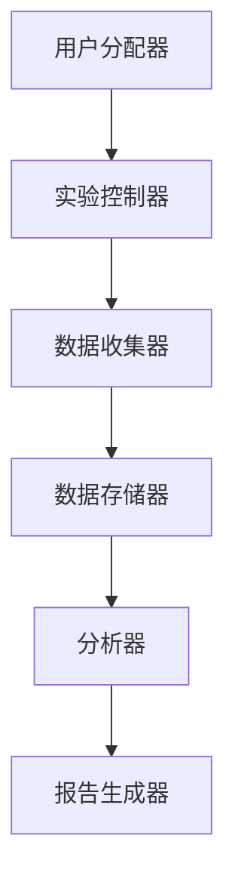

                 

### 《A/B测试框架支持LLM应用的快速验证》

#### 关键词：A/B测试、LLM应用、快速验证、框架设计、优化方法

#### 摘要：
本文旨在探讨A/B测试框架在大型语言模型（LLM）应用中的快速验证方法。首先，文章概述了A/B测试的概念、发展历程和基本流程，以及LLM的应用场景和挑战。接着，详细介绍了A/B测试框架的设计原理和关键组件，并探讨了数据收集、实验设计和结果可视化的优化方法。随后，通过三个实际案例，展示了A/B测试框架在LLM应用中的效果分析和优化策略。最后，文章对A/B测试框架的未来发展趋势进行了展望，并总结了全文的关键点和进一步研究方向。

### 第一部分：A/B测试基础与LLM应用

#### 第1章：A/B测试概述

##### 1.1 A/B测试的概念与重要性

A/B测试，又称拆箱测试，是一种通过对两个或多个版本的同一产品或服务进行对比测试，以评估不同版本对用户行为和业务指标影响的方法。其核心思想是随机将用户分配到不同的实验组，然后对比实验组之间的效果差异，从而得出哪一种版本更优的结论。

A/B测试在互联网行业中被广泛应用，特别是在用户体验优化、功能迭代和产品发布等方面。其重要性体现在以下几个方面：

1. **数据驱动决策**：A/B测试提供了一种基于用户行为数据的决策方法，有助于产品经理和开发团队摆脱主观臆断，更加客观地评估产品改进的效果。
2. **降低风险**：通过A/B测试，可以在产品上线前发现潜在的问题和风险，从而减少上线后的调整成本和用户流失。
3. **优化用户体验**：A/B测试可以帮助团队了解用户偏好和行为模式，从而优化产品功能和界面设计，提高用户满意度和留存率。

##### 1.2 A/B测试的发展历程

A/B测试最早可以追溯到20世纪初期，由统计学家和数学家提出。随着互联网技术的发展，特别是在搜索引擎优化（SEO）和电子商务领域，A/B测试逐渐成为一种重要的数据分析方法。

1. **初期应用**：20世纪80年代，搜索引擎开始采用A/B测试来优化搜索结果排名，从而提高用户点击率和广告收入。
2. **互联网普及**：随着互联网的普及，A/B测试在电子商务、在线广告和社交媒体等领域的应用越来越广泛。许多大型互联网公司，如谷歌、亚马逊和Facebook，都将其作为核心的数据驱动策略。
3. **自动化和工具化**：近年来，随着A/B测试工具和平台的不断发展和成熟，A/B测试的自动化和工具化程度大大提高，使得更多企业能够轻松实施和执行A/B测试。

##### 1.3 A/B测试的流程与方法

A/B测试的流程通常包括以下几个步骤：

1. **定义目标**：明确测试的目标，如提高用户点击率、转化率或留存率等。
2. **设计实验**：设计实验组和控制组，确定实验变量和假设。
3. **分配用户**：将用户随机分配到实验组和控制组，确保分配过程的随机性和公正性。
4. **执行实验**：在实验组和控制组之间进行对比，收集用户行为数据。
5. **分析结果**：使用统计方法分析实验结果，评估实验变量对目标的影响。
6. **决策和优化**：根据分析结果，做出决策，并对产品或服务进行优化。

A/B测试的方法主要包括以下几种：

1. **单变量测试**：仅改变一个变量，如按钮颜色、文字描述等，以评估其对用户行为的影响。
2. **多变量测试**：同时改变多个变量，以评估不同变量之间的交互效果。
3. **滚动测试**：将用户逐渐分配到实验组，持续进行实验，以减少实验周期和样本偏差。
4. **控制组测试**：将一部分用户分配到控制组，作为对照，以验证实验结果的可靠性和有效性。

#### 第2章：LLM应用场景与挑战

##### 2.1 LLM的应用场景

大型语言模型（LLM）是一种具有高度自主学习和理解能力的语言模型，能够处理复杂的自然语言任务。LLM的应用场景广泛，包括但不限于以下几个方面：

1. **自然语言处理**：LLM可以用于文本分类、情感分析、实体识别、问答系统等自然语言处理任务，提高文本处理的准确性和效率。
2. **智能客服**：LLM可以应用于智能客服系统，实现自然语言交互，提供更加人性化、个性化的服务。
3. **内容生成**：LLM可以用于生成文章、新闻、故事等文本内容，提高内容创作效率和多样性。
4. **翻译和本地化**：LLM可以用于翻译和本地化任务，提供高效、准确的语言翻译服务。

##### 2.2 LLM面临的挑战

尽管LLM在许多应用场景中表现出色，但其在实际应用中仍然面临一些挑战：

1. **计算资源需求**：LLM通常需要大量的计算资源，如GPU和TPU，以支持其训练和推理过程。这对企业和研究机构提出了较高的硬件要求。
2. **数据隐私和安全性**：LLM的训练和推理过程中需要处理大量的用户数据，如文本、语音和图像等。如何确保数据的安全性和隐私性成为了一个重要问题。
3. **模型泛化能力**：LLM通常在特定领域或任务上表现优异，但在其他领域或任务上的泛化能力有限。如何提高LLM的泛化能力是一个重要的研究方向。
4. **错误传播和安全性**：LLM在训练和推理过程中可能产生错误，这些错误可能被传播到后续的模型输出中。如何确保LLM输出的正确性和安全性是一个挑战。

##### 2.3 A/B测试在LLM应用中的作用

A/B测试在LLM应用中发挥着重要作用，主要体现在以下几个方面：

1. **模型优化**：通过A/B测试，可以评估不同模型参数和架构对LLM性能的影响，从而优化模型结构和参数。
2. **功能迭代**：通过A/B测试，可以评估不同功能模块对用户行为和业务指标的影响，从而优化产品功能和用户体验。
3. **风险控制**：通过A/B测试，可以在模型上线前发现潜在的问题和风险，从而降低上线后的风险和损失。
4. **数据驱动决策**：通过A/B测试，可以基于用户行为数据做出决策，提高决策的准确性和有效性。

#### 第3章：A/B测试框架设计

##### 3.1 A/B测试框架的基本架构

A/B测试框架通常包括以下几个基本组件：

1. **用户分配器**：负责将用户随机分配到实验组和控制组，确保分配过程的随机性和公正性。
2. **实验控制器**：负责管理和控制实验的执行过程，包括实验的启动、停止和结果收集等。
3. **数据收集器**：负责收集实验过程中的用户行为数据，如点击率、转化率等。
4. **数据存储器**：负责存储和整理实验数据，以便后续的分析和处理。
5. **分析器**：负责使用统计方法对实验结果进行分析，评估实验变量对目标的影响。
6. **报告生成器**：负责生成实验报告，包括实验结果、分析结论和决策建议等。

A/B测试框架的基本架构如下图所示：



##### 3.2 A/B测试框架的关键组件

A/B测试框架的关键组件包括用户分配器、实验控制器、数据收集器、数据存储器、分析器和报告生成器。下面分别介绍这些组件的作用和实现方法：

1. **用户分配器**：
   - **作用**：将用户随机分配到实验组和控制组，确保实验的公正性和随机性。
   - **实现方法**：通常使用随机数生成器和哈希函数来实现用户分配。具体实现方法如下：
     ```python
     import random
     import hashlib

     def assign_user(user_id):
         hash_value = hashlib.sha256(user_id.encode()).hexdigest()
         if int(hash_value, 16) % 2 == 0:
             return "control"
         else:
             return "experiment"
     ```

2. **实验控制器**：
   - **作用**：管理和控制实验的执行过程，包括实验的启动、停止和结果收集等。
   - **实现方法**：通常使用分布式系统架构来实现实验控制器，包括以下组件：
     - **实验调度器**：负责调度实验任务，并将任务分配给不同的实验执行节点。
     - **实验执行节点**：负责执行具体的实验任务，如用户分配、数据收集等。
     - **实验监控器**：负责监控实验的执行状态，包括实验的启动、停止和故障处理等。

3. **数据收集器**：
   - **作用**：收集实验过程中的用户行为数据，如点击率、转化率等。
   - **实现方法**：通常使用日志记录器和数据清洗器来实现数据收集。具体实现方法如下：
     ```python
     import json
     import requests

     def log_event(user_id, event_type, event_data):
         url = "http://data-collector/api/log_event"
         data = {
             "user_id": user_id,
             "event_type": event_type,
             "event_data": event_data
         }
         requests.post(url, json=data)
     ```

4. **数据存储器**：
   - **作用**：存储和整理实验数据，以便后续的分析和处理。
   - **实现方法**：通常使用分布式存储系统和数据库来实现数据存储。具体实现方法如下：
     ```python
     import sqlite3

     def store_data(data):
         conn = sqlite3.connect("data.db")
         cursor = conn.cursor()
         cursor.execute("CREATE TABLE IF NOT EXISTS events (user_id TEXT, event_type TEXT, event_data TEXT)")
         cursor.execute("INSERT INTO events (user_id, event_type, event_data) VALUES (?, ?, ?)", (data["user_id"], data["event_type"], json.dumps(data["event_data"])))
         conn.commit()
         conn.close()
     ```

5. **分析器**：
   - **作用**：使用统计方法对实验结果进行分析，评估实验变量对目标的影响。
   - **实现方法**：通常使用统计分析工具和库来实现数据分析。具体实现方法如下：
     ```python
     import pandas as pd
     import numpy as np
     from scipy import stats

     def analyze_data(data):
         df = pd.DataFrame(data)
         experiment_group = df[df["group"] == "experiment"]
         control_group = df[df["group"] == "control"]

         t_stat, p_value = stats.ttest_ind(experiment_group["target"], control_group["target"])
         return t_stat, p_value
     ```

6. **报告生成器**：
   - **作用**：生成实验报告，包括实验结果、分析结论和决策建议等。
   - **实现方法**：通常使用报告模板和报告生成工具来实现报告生成。具体实现方法如下：
     ```python
     from jinja2 import Environment, Template

     def generate_report(data):
         template_env = Environment()
         template = template_env.from_string("""
         <!DOCTYPE html>
         <html>
         <head>
         <meta charset="UTF-8">
         <title>A/B Test Report</title>
         </head>
         <body>
         <h1>A/B Test Report</h1>
         <p>Target: {{ target }}</p>
         <p>Groups: {{ groups }}</p>
         <p>T-Test Statistic: {{ t_stat }}</p>
         <p>P-Value: {{ p_value }}</p>
         </body>
         </html>
         """)
         report = template.render(target=data["target"], groups=data["groups"], t_stat=data["t_stat"], p_value=data["p_value"])
         with open("report.html", "w") as f:
             f.write(report)
     ```

##### 3.3 A/B测试框架的实现技术

A/B测试框架的实现技术主要包括以下几个方面：

1. **编程语言和框架**：常用的编程语言包括Python、Java和JavaScript等。常用的框架包括Flask、Django和Spring等。
2. **数据库和存储系统**：常用的数据库包括MySQL、PostgreSQL和MongoDB等。常用的存储系统包括HDFS、Cassandra和Redis等。
3. **统计分析工具**：常用的统计分析工具包括Pandas、NumPy、SciPy和Scikit-learn等。
4. **报告生成工具**：常用的报告生成工具包括Jinja2、HTML模板和Markdown等。
5. **分布式系统框架**：常用的分布式系统框架包括Apache Kafka、Apache Spark和Apache Flink等。

#### 总结

本文介绍了A/B测试的基础知识、LLM的应用场景和挑战，以及A/B测试框架的设计原理和关键组件。通过实际案例，展示了A/B测试框架在LLM应用中的效果分析和优化策略。接下来，我们将进一步探讨A/B测试框架的实现和优化方法，以及如何在LLM应用中进行快速验证。

