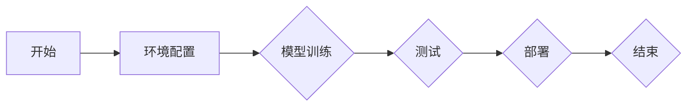
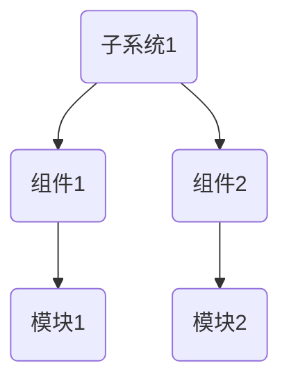
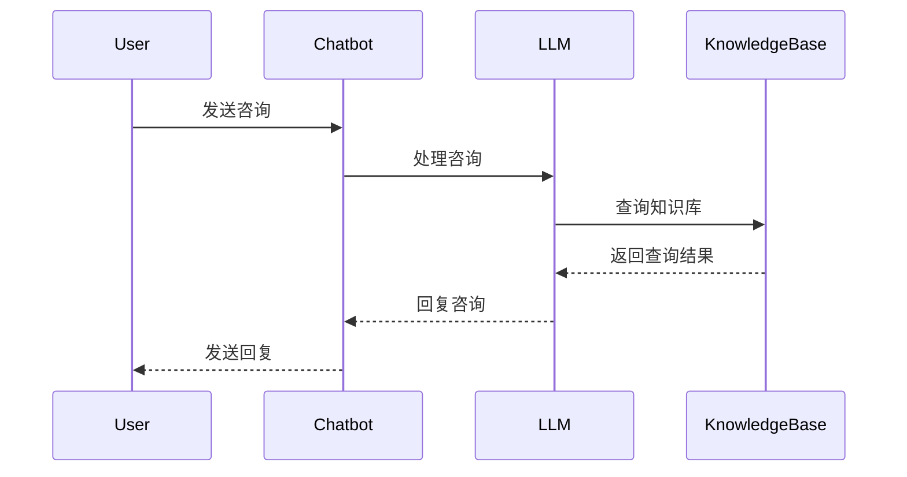

                 

# 《CI/CD流程：加速LLM应用的迭代与部署》

## 关键词
- CI/CD
- LLM应用
- 持续集成
- 持续部署
- 自动化测试
- 容器化

## 摘要
本文将探讨CI/CD（持续集成/持续部署）在LLM（大型语言模型）应用开发中的重要性。我们将逐步分析CI/CD的基础概念、LLM应用的特性，并深入探讨如何通过CI/CD流程加速LLM应用的迭代与部署。文章还将提供具体的实战案例，包括CI/CD工具的使用、自动化测试策略，以及部署策略和最佳实践。

## 第1章：CI/CD流程概述

### 1.1 CI/CD概念介绍

#### CI/CD的定义与背景
持续集成（CI）和持续部署（CD）是现代软件开发中常用的两种实践。持续集成指的是通过自动化构建和测试，确保代码库中的每个提交都是可集成和可运行的。持续部署则是自动化部署流程，确保应用可以快速、安全地交付给用户。

#### CI与CD的差异与联系
持续集成（CI）强调的是构建和测试的自动化，而持续部署（CD）则注重的是部署的自动化。CI的主要目标是发现代码冲突和集成问题，CD则确保应用可以在各种环境下稳定运行。

### 1.2 LLM应用概述

#### LLM的定义与特点
LLM（Large Language Model）是一种基于深度学习的语言模型，具有强大的语言理解和生成能力。它们通常由数百万到数十亿的参数组成，能够处理自然语言文本的各种任务，如文本分类、机器翻译、问答系统等。

#### LLM的应用场景
LLM广泛应用于各种场景，包括智能客服、内容生成、推荐系统、语言翻译等。这些应用要求模型能够快速迭代和部署，以适应不断变化的需求和数据。

### 1.3 CI/CD在LLM应用中的重要性

#### 加速迭代的优势
LLM应用的迭代速度非常快，需要频繁更新模型以适应新的数据和需求。CI/CD流程能够自动化构建和测试，大大缩短迭代周期。

#### 提高部署效率的重要性
LLM模型的部署通常涉及复杂的配置和环境设置。CI/CD流程通过自动化部署，确保模型能够在不同的环境中稳定运行，减少人为错误和部署时间。

## 第2章：LLM应用的开发与测试

### 2.1 LLM应用开发环境搭建

#### 开发环境配置
搭建LLM应用的开发环境需要选择合适的硬件、操作系统、编程语言和深度学习框架。通常，GPU硬件加速是必须的，而CUDA和cuDNN库则是常用的GPU编程工具。

#### LLM模型选择与优化
选择合适的LLM模型对于应用性能至关重要。常见的LLM模型包括GPT、BERT、T5等。优化模型参数和训练策略能够提高模型性能，但同时也增加了训练时间和计算资源的需求。

### 2.2 LLM应用的测试策略

#### 单元测试
单元测试是测试LLM应用的基本步骤。它测试模型的各个功能模块，确保每个模块都能够正确执行。

#### 集成测试
集成测试旨在验证模型在不同组件之间的交互是否正常。它包括测试模型与其他服务或系统的集成，如数据库、API等。

#### 性能测试
性能测试是评估LLM模型在实际应用场景中的性能。它包括测试模型的响应时间、吞吐量和准确性。

### 2.3 自动化测试工具介绍

#### JUnit与TestNG
JUnit和TestNG是常用的Java单元测试框架。它们提供了丰富的测试功能，包括数据驱动测试、参数化测试等。

#### Selenium与Cypress
Selenium和Cypress是用于Web应用的自动化测试工具。Selenium支持多种浏览器，而Cypress则提供了更简单、更直观的测试体验。

## 第3章：CI/CD工具与平台

### 3.1 Jenkins介绍

#### Jenkins功能与配置
Jenkins是一个开源的持续集成工具，支持多种插件和扩展。它能够自动化构建、测试和部署过程，并提供丰富的报告和监控功能。

#### Jenkins流水线（Pipeline）
Jenkins Pipeline是一种声明式管道语言，用于定义CI/CD流水线。它允许开发人员以代码的方式定义整个CI/CD流程，从而实现更灵活和可重复的构建和部署。

### 3.2 GitLab CI/CD

#### GitLab CI/CD的基本概念
GitLab CI/CD是GitLab内置的持续集成和持续部署工具。它通过`.gitlab-ci.yml`文件定义CI/CD流程，支持多种编程语言和框架。

#### GitLab CI/CD的配置与使用
配置GitLab CI/CD涉及到定义触发器、构建步骤、部署策略等。通过`.gitlab-ci.yml`文件，可以自动化构建、测试和部署过程。

### 3.3 GitLab与Jenkins的集成

#### 集成流程
GitLab与Jenkins的集成可以通过Webhook实现。当GitLab CI/CD流程触发时，可以发送Webhook通知Jenkins执行后续操作。

#### 最佳实践
集成GitLab与Jenkins时，应确保两者之间的数据同步和状态一致性，避免重复工作和冲突。

## 第4章：CI流程实战

### 4.1 CI流程设计

#### 流程设计原则
CI流程设计应遵循模块化、可扩展和可重用原则。每个步骤应明确目的，确保流程易于理解和维护。

#### 自动化脚本编写
编写自动化脚本是实现CI流程的关键。脚本应包括构建、测试和部署步骤，并使用版本控制系统管理。

### 4.2 CI工具使用案例

#### Jenkins CI案例
使用Jenkins构建和测试LLM应用，包括编译代码、运行测试用例和生成报告。

#### GitLab CI案例
在GitLab中定义CI/CD流程，通过`.gitlab-ci.yml`文件实现自动化构建、测试和部署。

### 4.3 CI实践建议

#### 常见问题与解决方法
CI过程中可能遇到的问题包括构建失败、测试失败、部署失败等。应制定相应的解决策略和故障排除指南。

#### 性能优化技巧
优化CI流程的性能，包括减少构建时间、提高测试覆盖率、优化资源使用等。

## 第5章：CD流程实战

### 5.1 CD流程设计

#### 流程设计原则
CD流程设计应确保部署的稳定性和可恢复性。应定义明确的部署策略，包括部署频率、部署范围和回滚策略。

#### 持续交付的策略
持续交付（CD）策略包括蓝绿部署、灰度发布和滚动更新等。应根据应用特性和业务需求选择合适的策略。

### 5.2 CD工具使用案例

#### Jenkins CD案例
使用Jenkins实现自动化部署，包括部署脚本编写、环境配置和监控。

#### GitLab CD案例
在GitLab中实现自动化部署，利用GitLab CI/CD流水线完成部署过程。

### 5.3 CD实践建议

#### 部署策略
制定合适的部署策略，包括部署频率、部署窗口和回滚策略，确保部署过程对用户影响最小。

#### 版本控制与管理
版本控制是CD流程的重要组成部分。应使用Git等版本控制工具管理代码和配置，确保部署的可追溯性和可控性。

## 第6章：自动化测试与持续集成

### 6.1 自动化测试框架

#### Selenium与TestNG
Selenium是用于Web应用的自动化测试工具，支持多种浏览器。TestNG是一个测试框架，提供了丰富的测试功能，如数据驱动测试和参数化测试。

#### Cypress与Mocha
Cypress是一个现代化的前端测试框架，提供了直观、易用的测试体验。Mocha是一个灵活的测试框架，适用于多种编程语言。

### 6.2 测试集成策略

#### CI环境下的测试集成
在CI环境中集成自动化测试，包括测试用例的编写、执行和报告。确保测试结果与构建过程紧密结合。

#### 自动化测试报告
生成详细的测试报告，包括测试覆盖率、失败率和错误日志。测试报告有助于评估测试质量和优化测试策略。

### 6.3 测试优化实践

#### 测试覆盖率
提高测试覆盖率是优化测试的重要步骤。应确保测试用例覆盖关键功能和边界条件。

#### 测试效率提升
通过优化测试脚本、减少冗余测试和并行执行测试等方式，提升测试效率。

## 第7章：LLM应用的部署策略

### 7.1 部署前准备

#### 环境配置
配置适合LLM应用运行的环境，包括操作系统、深度学习框架和GPU驱动等。

#### 模型调优
对LLM模型进行调优，以提高性能和适应性。包括调整超参数、优化数据预处理等。

### 7.2 部署流程

#### 部署方案
制定部署方案，包括部署环境选择、部署工具使用和部署流程设计。

#### 部署工具使用
使用Docker、Kubernetes等部署工具，实现LLM应用的自动化部署。

### 7.3 部署优化

#### 负载均衡
使用负载均衡器，如Nginx或HAProxy，实现应用的高可用性和负载均衡。

#### 性能监控
监控LLM应用的性能指标，如响应时间、吞吐量和内存使用情况，及时发现和解决问题。

## 第8章：容器化与微服务架构

### 8.1 容器化技术

#### Docker基本概念
Docker是一种容器化技术，用于打包、交付和运行应用程序。它提供了轻量级、可移植的容器，使应用程序在不同环境中一致运行。

#### 容器编排工具（Kubernetes）
Kubernetes是一个开源的容器编排工具，用于自动化容器的部署、扩展和管理。它提供了强大的集群管理和资源调度功能。

### 8.2 微服务架构设计

#### 微服务优点与挑战
微服务架构将应用程序分解为多个小型、独立的服务，每个服务都有自己的数据库和API。它提高了系统的可扩展性和可维护性，但同时也带来了分布式系统的挑战，如服务间通信、数据一致性和容错性。

#### 微服务设计原则
微服务设计应遵循模块化、自治、独立部署和持续集成原则，确保系统的稳定性和灵活性。

### 8.3 容器化与微服务集成

#### CI/CD与Kubernetes集成
将CI/CD流程与Kubernetes集成，实现自动化部署、扩展和管理。通过Kubernetes的Helm等工具，简化微服务部署和管理。

#### 最佳实践
遵循最佳实践，如使用容器镜像仓库、配置管理工具和监控解决方案，确保微服务架构的稳定性和性能。

## 第9章：案例分析与总结

### 9.1 案例分析

#### 实际项目部署案例
分析一个实际LLM应用项目，包括项目背景、需求分析、技术选型、CI/CD流程设计和部署方案。

#### 问题和挑战
讨论项目部署过程中遇到的问题和挑战，如环境配置不一致、模型性能调优困难等。

### 9.2 经验总结

#### 成功要素
总结项目成功的关键要素，如良好的团队协作、合理的技术选型和高效的CI/CD流程。

#### 未来发展趋势
展望LLM应用和CI/CD技术的未来发展趋势，包括模型优化、自动化部署和微服务架构的进一步发展。

### 9.3 拓展阅读与资源

#### 推荐书籍与论文
推荐与LLM应用和CI/CD相关的书籍和论文，供进一步学习和研究。

#### 学习资源链接
提供在线学习资源和社区链接，方便读者深入学习和交流。

### 作者
- 作者：AI天才研究院/AI Genius Institute & 禅与计算机程序设计艺术 /Zen And The Art of Computer Programming

### 背景介绍
#### 核心概念术语说明
- **CI（持续集成）**：自动化构建和测试流程，确保代码库中的每个提交都是可集成和可运行的。
- **CD（持续部署）**：自动化部署流程，确保应用可以快速、安全地交付给用户。
- **LLM（大型语言模型）**：一种基于深度学习的语言模型，具有强大的语言理解和生成能力。

#### 问题背景
在现代软件开发中，快速迭代和部署已成为关键需求。LLM应用因其复杂的模型和频繁的更新需求，对CI/CD流程的依赖尤为突出。

#### 问题描述
如何通过CI/CD流程加速LLM应用的迭代与部署，确保模型的高效开发和稳定运行？

#### 问题解决
通过设计合理的CI/CD流程，结合自动化测试和容器化技术，实现LLM应用的快速迭代和部署。

#### 边界与外延
CI/CD流程适用于各种规模的LLM应用，从简单的模型训练到复杂的分布式系统。同时，它也可以与其他软件开发实践相结合，如DevOps、敏捷开发等。

#### 概念结构与核心要素组成
CI/CD流程的核心要素包括构建环境、测试环境、部署环境和监控环境。每个环境都有其特定的职责和配置要求。

### 核心概念与联系
#### 核心概念原理
- **持续集成（CI）**：通过自动化构建和测试，确保代码库中的每个提交都是可集成和可运行的。
- **持续部署（CD）**：通过自动化部署流程，确保应用可以快速、安全地交付给用户。

#### 概念属性特征对比表格

| 特性               | 持续集成（CI）        | 持续部署（CD）        |
|------------------|-------------------|-------------------|
| 目标               | 发现代码冲突和集成问题 | 部署应用至生产环境      |
| 工具               | Jenkins、GitLab CI   | Kubernetes、Docker  |
| 流程               | 构建和测试           | 部署和监控           |
| 自动化程度         | 高                 | 高                 |

#### ER实体关系图架构
```mermaid
erDiagram
  CI流程 ||--|{ 部署流程 }
  测试环境 ||--|{ 部署环境 }
  构建环境 ||--|{ 测试环境 }
  构建环境 ||--|{ 部署环境 }
```

### 算法原理讲解
#### 使用mermaid画出算法mermaid流程图


#### 使用python源代码来详细阐述，给出算法原理的数学模型和公式
```python
# 环境配置
import torch
import torch.nn as nn
import torch.optim as optim

# 模型训练
model = nn.Sequential(
    nn.Linear(input_size, hidden_size),
    nn.ReLU(),
    nn.Linear(hidden_size, output_size)
)

criterion = nn.CrossEntropyLoss()
optimizer = optim.Adam(model.parameters(), lr=learning_rate)

# 测试
with torch.no_grad():
    outputs = model(inputs)
    _, predicted = torch.max(outputs, 1)

# 部署
model.eval()
model.save('model.pth')
```

#### 详细讲解和通俗易懂地举例说明
- **环境配置**：设置深度学习环境，包括框架、硬件和参数。
- **模型训练**：使用训练数据进行模型训练，包括前向传播、反向传播和优化。
- **测试**：使用测试数据评估模型性能，包括计算准确率和损失函数。
- **部署**：将训练好的模型保存为文件，以便在生产环境中使用。

### 系统分析与架构设计方案
#### 问题场景介绍
一个企业希望开发一个智能客服系统，利用LLM模型处理用户咨询。

#### 项目介绍
项目名称：智能客服系统
项目目标：通过LLM模型提供快速、准确的用户咨询响应。

#### 系统功能设计(领域模型mermaid类图)
```mermaid
classDiagram
    User <<Interface>>
    Chatbot <<Interface>>
    LLM <<Model>>
    KnowledgeBase <<Database>>

    User o-- Chatbot
    Chatbot o-- LLM
    Chatbot o-- KnowledgeBase
```

#### 系统架构设计mermaid架构图


#### 系统接口设计和系统交互mermaid序列图


### 项目实战
#### 环境安装
- 安装深度学习框架（如PyTorch）
- 安装Docker和Kubernetes
- 配置GPU加速

#### 系统核心实现源代码
```python
# Chatbot服务
import torch
import torch.nn as nn
import torch.optim as optim

class Chatbot(nn.Module):
    def __init__(self, input_size, hidden_size, output_size):
        super(Chatbot, self).__init__()
        self.layer1 = nn.Linear(input_size, hidden_size)
        self.relu = nn.ReLU()
        self.layer2 = nn.Linear(hidden_size, output_size)
    
    def forward(self, x):
        x = self.layer1(x)
        x = self.relu(x)
        x = self.layer2(x)
        return x

# 训练和测试
chatbot = Chatbot(input_size, hidden_size, output_size)
criterion = nn.CrossEntropyLoss()
optimizer = optim.Adam(chatbot.parameters(), lr=learning_rate)

for epoch in range(num_epochs):
    for inputs, targets in train_loader:
        optimizer.zero_grad()
        outputs = chatbot(inputs)
        loss = criterion(outputs, targets)
        loss.backward()
        optimizer.step()

# 部署
chatbot.eval()
torch.save(chatbot.state_dict(), 'chatbot.pth')
```

#### 代码应用解读与分析
- **Chatbot服务**：定义了一个简单的神经网络模型，用于处理用户咨询。
- **训练和测试**：使用训练数据和测试数据对模型进行训练和评估。
- **部署**：将训练好的模型保存为文件，以便在生产环境中使用。

#### 实际案例分析和详细讲解剖析
假设企业希望开发一个智能客服系统，用于处理客户咨询。项目团队决定使用LLM模型来处理文本数据，并采用CI/CD流程来加速开发与部署。

1. **需求分析**：
   - 客户咨询文本处理
   - 提供快速、准确的回复
   - 支持多语言

2. **技术选型**：
   - 深度学习框架：PyTorch
   - CI/CD工具：Jenkins和GitLab CI/CD
   - 容器化技术：Docker和Kubernetes

3. **CI/CD流程设计**：
   - 使用Jenkins触发GitLab CI/CD流程
   - 自动化构建和测试
   - 自动部署到Kubernetes集群

4. **部署过程**：
   - 使用Docker容器化模型
   - 在Kubernetes集群中部署服务
   - 使用Ingress进行外部访问

5. **监控与维护**：
   - 使用Prometheus和Grafana进行监控
   - 定期备份和更新模型

#### 项目小结
项目团队通过CI/CD流程和容器化技术，实现了智能客服系统的快速迭代和部署。项目成功的关键在于良好的团队协作、合理的技术选型和高效的流程设计。

### 最佳实践 tips
1. **版本控制**：使用Git等版本控制工具管理代码和配置，确保部署的可追溯性和可控性。
2. **自动化测试**：编写自动化测试用例，确保每次部署都是高质量的。
3. **容器化**：使用Docker等工具容器化应用，实现环境一致性和可移植性。
4. **监控与告警**：设置监控和告警，确保系统稳定性和性能。

### 小结
本文详细介绍了CI/CD流程在LLM应用开发中的重要性，包括概念、实战和部署策略。通过自动化测试和容器化技术，LLM应用的迭代和部署可以更加高效和可靠。

### 注意事项
1. **环境配置**：确保开发、测试和部署环境的一致性。
2. **资源管理**：合理分配计算资源和网络资源，避免过度消耗。
3. **版本控制**：使用版本控制工具管理代码和配置，确保变更的可追溯性和可控性。

### 拓展阅读
1. **《CI/CD：加速软件交付》**：深入了解CI/CD的原理和实践。
2. **《深度学习与NLP》**：学习LLM的基本原理和应用。
3. **《容器化与Kubernetes》**：学习容器化技术和Kubernetes的部署和管理。

### 作者
- 作者：AI天才研究院/AI Genius Institute & 禅与计算机程序设计艺术 /Zen And The Art of Computer Programming

