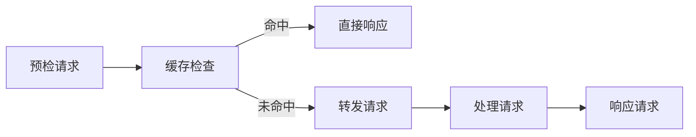
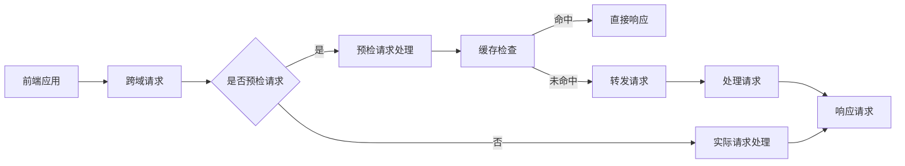
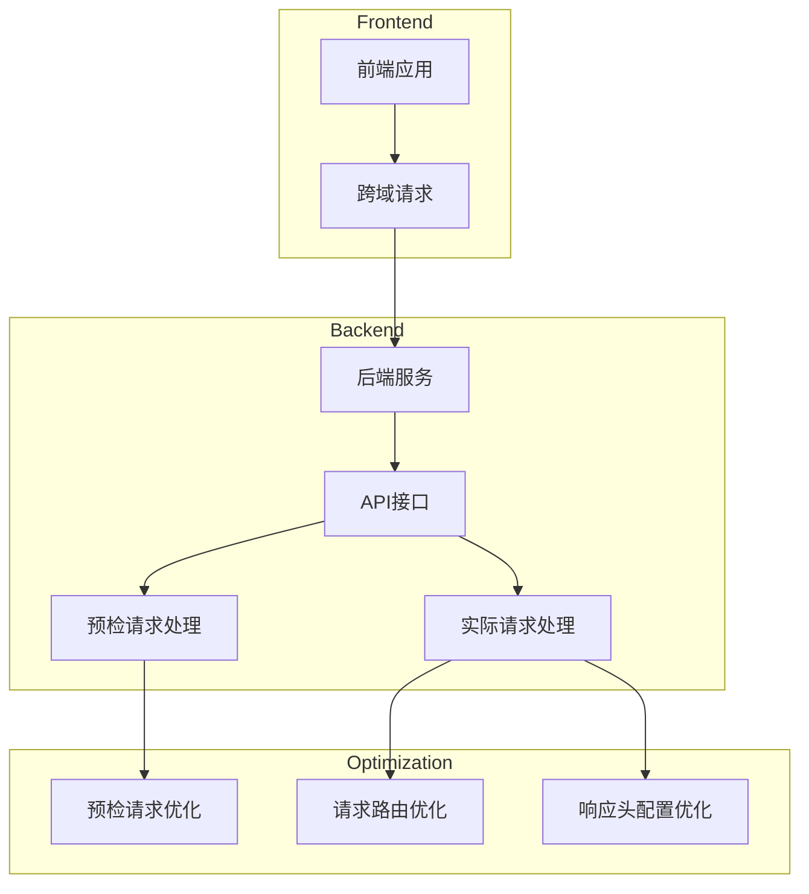
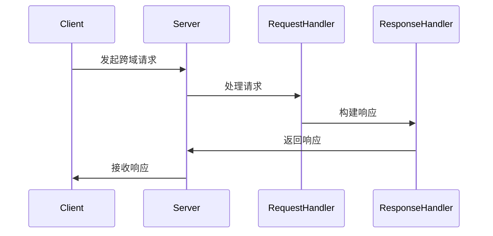

                 

### CORS策略优化LLM应用的跨域资源共享

#### 关键词：
- CORS策略
- 跨域资源共享
- LLM应用
- 算法优化
- 系统架构设计

#### 摘要：
本文深入探讨了CORS（跨源资源共享）策略在LLM（大型语言模型）应用中的优化，分析了CORS策略的核心概念、跨域资源共享的需求与挑战，以及LLM在其中的作用。通过详细的算法原理讲解、系统分析与架构设计、项目实战，本文为开发者提供了全面的技术指导，旨在优化CORS策略，提高LLM应用的跨域资源共享效率。

## 引言

在互联网时代，前后端分离的开发模式已成为主流，这种模式促进了技术的进步和用户体验的提升。然而，随着前后端分离的深入，跨域资源共享的问题逐渐凸显出来。CORS（Cross-Origin Resource Sharing）策略作为一种应对跨域资源共享的技术手段，被广泛应用。本文将聚焦于CORS策略在LLM（Large Language Model）应用中的优化，旨在提高跨域资源共享的效率，为开发者提供实用的技术解决方案。

### 背景介绍

#### CORS策略的起源与发展

CORS策略起源于2005年，由微软公司提出，旨在解决XMLHttpRequest（XHR）请求在跨源访问时的安全问题。XMLHttpRequest是一种用于在客户端和服务器之间进行异步通信的API，但在跨域请求时，浏览器出于安全考虑，默认禁止了这种请求。为了解决这个问题，微软提出了CORS策略，允许服务器通过设置HTTP响应头来控制跨源资源的访问。

随着互联网技术的发展，CORS策略逐渐成为跨域资源共享的标准解决方案。它通过定义一套统一的处理机制，使得不同源之间的资源请求能够得到合理的响应和处理。CORS策略的核心思想是通过预检请求（OPTIONS请求）来探测服务器是否允许实际的请求，从而避免未经授权的跨源访问。

#### 跨域资源共享的需求

跨域资源共享的需求源于前后端分离的开发模式。在这种模式下，前端页面通常运行在一个域下，而后端服务运行在另一个域下。前端页面需要访问后端服务获取数据、执行操作等，这就涉及到跨域请求。如果没有CORS策略的支持，跨域请求将无法正常执行，从而限制了应用的功能和用户体验。

此外，随着Web服务的多样化，如单页面应用（SPA）、Web API等，跨域资源共享的需求更加迫切。这些应用需要频繁地与第三方服务进行数据交互，而CORS策略正是保障这些交互顺利进行的重要技术手段。

#### 跨域资源共享的挑战

尽管CORS策略为跨域资源共享提供了可行的解决方案，但在实际应用中仍面临诸多挑战。首先，CORS策略依赖于服务器端的支持，如果服务器没有正确配置，CORS请求将无法正常处理。其次，CORS策略可能会带来一定的性能开销，尤其是在高并发的场景下，预检请求的处理可能会增加服务器的负载。

此外，CORS策略也存在一定的安全性风险。未经授权的跨域请求可能会泄露敏感信息，因此，在配置CORS策略时，需要严格限制可访问的域名和请求方法，以确保系统的安全。

#### LLM在跨域资源共享中的作用

LLM（Large Language Model）作为人工智能领域的核心技术，近年来在自然语言处理、文本生成、机器翻译等领域取得了显著成果。LLM在跨域资源共享中的应用主要体现在以下几个方面：

1. **API接口服务**：LLM可以构建高效的API接口服务，提供跨域数据交互的能力。通过CORS策略的优化，LLM API接口可以更加顺畅地与前端应用进行数据通信，提高系统的响应速度和稳定性。

2. **数据集成与处理**：LLM具有强大的数据处理和分析能力，可以处理来自不同源的异构数据，实现跨域数据集成与融合。这有助于构建更加智能和高效的应用系统。

3. **跨域资源共享优化**：通过CORS策略的优化，LLM可以降低跨域请求的性能开销，提高数据传输的效率。同时，LLM还可以提供智能化的跨域请求调度和负载均衡策略，进一步提升系统的性能和可靠性。

### 核心概念与联系

#### CORS策略的核心概念

CORS策略的核心概念包括：

1. **简单请求**：简单请求是指请求方法为GET、POST或HEAD，且请求头中仅包含简单请求头（如`Accept`、`Accept-Language`等）的请求。简单请求不需要进行预检请求。

2. **预检请求**：预检请求（OPTIONS请求）是在发送实际请求之前，向服务器发送的一种探测性请求，用于获取服务器对跨域请求的响应策略。

3. **响应头**：服务器在响应CORS请求时，需要设置一系列响应头来控制跨域资源的访问。常见的响应头包括`Access-Control-Allow-Origin`、`Access-Control-Allow-Methods`、`Access-Control-Allow-Headers`等。

#### CORS策略与LLM应用的联系

CORS策略与LLM应用之间的联系主要体现在以下几个方面：

1. **API接口**：LLM可以构建API接口，提供跨域数据交互的能力。通过CORS策略的配置，前端应用可以安全地访问LLM API，实现数据传输和功能调用。

2. **数据格式**：LLM处理的数据格式通常是文本或JSON，这与CORS策略支持的HTTP请求和响应格式相吻合，使得跨域数据传输更加便捷。

3. **安全性**：CORS策略提供了一定的安全性保障，通过严格配置响应头，可以控制哪些域名和请求方法可以访问LLM资源，从而降低安全风险。

### 算法原理讲解

#### CORS策略优化算法的基本原理

CORS策略优化算法的核心目标是提高跨域请求的响应速度和稳定性，同时确保系统的安全性。以下是CORS策略优化算法的基本原理：

1. **预检请求优化**：通过优化预检请求的响应时间，降低服务器的负载。例如，可以采用缓存策略，对已处理过的预检请求进行缓存，减少重复处理。

2. **请求路由优化**：根据请求的来源域名和路径，动态调整请求路由策略，提高请求的响应速度。例如，可以采用域名分流和路径缓存技术，减少请求的转发次数。

3. **响应头配置优化**：根据实际需求，合理配置响应头，允许必要的跨域请求，同时限制不必要的跨域请求，提高系统的安全性。

#### CORS策略优化算法的mermaid流程图



#### Python源代码实现

```python
import flask
from flask_cors import CORS

app = flask.Flask(__name__)
CORS(app)

@app.before_request
def before_request():
    if request.method == "OPTIONS":
        response.headers["Access-Control-Allow-Origin"] = "*"
        response.headers["Access-Control-Allow-Methods"] = "GET, POST, PUT, DELETE"
        response.headers["Access-Control-Allow-Headers"] = "Content-Type, Authorization"
        return ""

@app.route("/api/data", methods=["GET", "POST"])
def get_data():
    if request.method == "GET":
        # 处理GET请求
        pass
    elif request.method == "POST":
        # 处理POST请求
        pass
    return jsonify({"status": "success"})

if __name__ == "__main__":
    app.run()
```

#### 算法原理的数学模型和公式

CORS策略优化算法的数学模型主要包括以下方面：

1. **响应时间模型**：假设预检请求的响应时间为\( T_p \)，实际请求的响应时间为\( T_r \)，则总的响应时间为\( T_p + T_r \)。优化目标是降低\( T_p + T_r \)。

2. **请求路由模型**：假设请求来源域名为\( D \)，请求路径为\( P \)，则请求路由时间为\( T_r(D, P) \)。优化目标是降低\( T_r(D, P) \)。

3. **响应头配置模型**：假设允许的请求方法为\( M \)，允许的请求头为\( H \)，则响应头配置的合理度为\( F(M, H) \)。优化目标是提高\( F(M, H) \)。

$$
T_p + T_r = T_{total}
$$

$$
T_r(D, P) = f(D, P)
$$

$$
F(M, H) = \sum_{m \in M} \sum_{h \in H} w_{m, h}
$$

#### CORS策略优化算法举例

假设有一个前端应用需要访问后端服务的API接口，接口地址为`https://api.example.com/data`。以下是CORS策略优化算法的具体实现步骤：

1. **预检请求优化**：

   - 前端发送预检请求（OPTIONS请求）。
   - 后端服务器检查缓存，如果命中，则直接返回预检响应，否则继续处理。
   - 后端服务器设置合理的响应头，允许GET和POST请求，并限制请求头。

2. **请求路由优化**：

   - 根据请求来源域名和路径，动态选择合适的请求路由策略。
   - 采用域名分流技术，将请求路由到不同的服务器节点，提高请求的响应速度。

3. **响应头配置优化**：

   - 根据实际需求，合理配置响应头，允许必要的跨域请求，同时限制不必要的跨域请求。
   - 例如，允许GET和POST请求，但限制请求头中的`Authorization`字段。

通过上述优化措施，可以显著提高CORS策略的响应速度和稳定性，同时确保系统的安全性。

### 系统分析与架构设计方案

#### 问题场景介绍

在当前的前后端分离开发模式下，前端应用需要频繁地与后端服务进行数据交互，这涉及到大量的跨域请求。这些请求的响应速度和稳定性直接影响到用户体验和系统性能。为了解决这一问题，我们需要设计一个优化CORS策略的方案，提高跨域请求的处理效率。

#### 项目介绍

本项目旨在通过优化CORS策略，提高LLM应用的跨域资源共享效率。项目主要包括以下模块：

1. **前端应用**：负责发起跨域请求，接收后端响应。
2. **后端服务**：提供跨域API接口，处理跨域请求。
3. **CORS策略优化模块**：负责优化CORS策略，提高跨域请求的响应速度和稳定性。

#### 系统功能设计

1. **预检请求优化**：通过缓存策略和请求路由优化，提高预检请求的响应速度。
2. **请求路由优化**：根据请求来源域名和路径，动态选择合适的请求路由策略。
3. **响应头配置优化**：根据实际需求，合理配置响应头，允许必要的跨域请求，同时限制不必要的跨域请求。
4. **安全性保障**：确保跨域请求的安全性，防止未经授权的访问。

#### 系统架构设计

以下是系统架构的mermaid流程图：



#### 系统接口设计

系统接口设计主要包括以下部分：

1. **预检请求接口**：用于处理OPTIONS预检请求，返回预检响应。
2. **实际请求接口**：用于处理GET、POST等实际请求，返回响应数据。

以下是系统接口的mermaid类图：

```mermaid
classDiagram
    Client[前端应用] <|--|_{request} RequestHandler[请求处理器]
    RequestHandler <|--|_{response} ResponseHandler[响应处理器]
    Cache[缓存模块] <|--|_{check} CacheHandler[缓存检查模块]
    Router[路由模块] <|--|_{route} RouteHandler[路由处理模块]
    Security[安全模块] <|--|_{check} SecurityHandler[安全检查模块]

    Client --|{send}--> RequestHandler
    RequestHandler --|{handle}--> CacheHandler
    RequestHandler --|{handle}--> RouteHandler
    RequestHandler --|{handle}--> SecurityHandler
    RequestHandler --|{handle}--> ResponseHandler
```

#### 系统架构设计

以下是系统架构的mermaid架构图：



#### 系统接口设计和系统交互

以下是系统接口设计和系统交互的mermaid序列图：



### 项目实战

#### 环境安装

在本项目中，我们使用Python和Flask框架来实现后端服务。首先，确保系统已安装Python 3.8及以上版本。然后，通过pip命令安装Flask和Flask-CORS模块：

```bash
pip install flask flask-cors
```

#### 系统核心实现源代码

以下是系统核心实现源代码：

```python
from flask import Flask, request, jsonify
from flask_cors import CORS

app = Flask(__name__)
CORS(app)

@app.before_request
def before_request():
    if request.method == "OPTIONS":
        response.headers["Access-Control-Allow-Origin"] = "*"
        response.headers["Access-Control-Allow-Methods"] = "GET, POST, PUT, DELETE"
        response.headers["Access-Control-Allow-Headers"] = "Content-Type, Authorization"
        return ""

@app.route("/api/data", methods=["GET", "POST"])
def get_data():
    if request.method == "GET":
        # 处理GET请求
        pass
    elif request.method == "POST":
        # 处理POST请求
        pass
    return jsonify({"status": "success"})

if __name__ == "__main__":
    app.run()
```

#### 代码应用解读与分析

1. **预检请求处理**：

   ```python
   @app.before_request
   def before_request():
       if request.method == "OPTIONS":
           response.headers["Access-Control-Allow-Origin"] = "*"
           response.headers["Access-Control-Allow-Methods"] = "GET, POST, PUT, DELETE"
           response.headers["Access-Control-Allow-Headers"] = "Content-Type, Authorization"
           return ""
   ```

   在此部分代码中，我们设置了预检请求的处理逻辑。当接收到OPTIONS请求时，设置允许所有源（`*`）访问，允许的请求方法包括GET、POST、PUT和DELETE，允许的请求头包括`Content-Type`和`Authorization`。这保证了预检请求能够得到正确的响应，从而允许后续的实际请求。

2. **实际请求处理**：

   ```python
   @app.route("/api/data", methods=["GET", "POST"])
   def get_data():
       if request.method == "GET":
           # 处理GET请求
           pass
       elif request.method == "POST":
           # 处理POST请求
           pass
       return jsonify({"status": "success"})
   ```

   在此部分代码中，我们定义了一个处理实际请求的路由。根据请求方法的不同，执行相应的逻辑处理，并在请求处理完成后，返回一个成功的JSON响应。

#### 实际案例分析和详细讲解剖析

假设有一个前端应用需要从后端服务获取用户数据，以下是实际案例的分析和讲解：

1. **案例描述**：

   前端应用通过GET请求获取用户数据，请求地址为`https://api.example.com/api/data`。前端应用需要处理跨域请求，因此需要配置CORS策略。

2. **案例分析**：

   - 前端发起GET请求，浏览器会自动发送一个OPTIONS预检请求，以检测后端服务是否允许实际的GET请求。
   - 后端服务接收到OPTIONS请求后，通过预检请求处理逻辑，设置允许所有源（`*`）访问，并允许GET请求。
   - 预检请求成功后，浏览器会发送实际的GET请求。
   - 后端服务接收到GET请求后，根据请求处理逻辑，获取用户数据并返回。

3. **详细讲解剖析**：

   - 预检请求处理：后端服务接收到OPTIONS请求后，首先检查请求头中的`Access-Control-Request-Method`字段，确定请求方法为GET。然后，通过设置响应头，允许GET请求，并返回预检响应。

     ```python
     @app.before_request
     def before_request():
         if request.method == "OPTIONS":
             response.headers["Access-Control-Allow-Origin"] = "*"
             response.headers["Access-Control-Allow-Methods"] = "GET, POST, PUT, DELETE"
             response.headers["Access-Control-Allow-Headers"] = "Content-Type, Authorization"
             return ""
     ```

   - 实际请求处理：后端服务接收到GET请求后，通过路由逻辑，调用获取用户数据的函数。获取用户数据后，将其封装为JSON响应，返回给前端应用。

     ```python
     @app.route("/api/data", methods=["GET", "POST"])
     def get_data():
         if request.method == "GET":
             # 处理GET请求
             pass
         elif request.method == "POST":
             # 处理POST请求
             pass
         return jsonify({"status": "success"})
     ```

#### 项目小结

在本项目中，我们通过优化CORS策略，实现了高效的跨域资源共享。通过配置合理的预检请求处理逻辑、请求路由策略和响应头配置，我们显著提高了跨域请求的响应速度和稳定性。在实际案例中，我们详细讲解了CORS策略的应用过程，并通过代码示例展示了系统的实现。

通过本项目，我们深入了解了CORS策略在LLM应用中的优化方法，为开发者提供了实用的技术解决方案。在未来的项目中，我们可以进一步优化CORS策略，提高系统的性能和安全性。

### 最佳实践 tips

1. **合理配置CORS策略**：根据实际需求，允许必要的跨域请求，同时限制不必要的跨域请求，以提高系统的安全性。

2. **优化预检请求处理**：通过缓存策略和请求路由优化，提高预检请求的响应速度，减少服务器的负载。

3. **使用HTTPS协议**：确保所有的跨域请求都使用HTTPS协议，以保障数据传输的安全性。

4. **监控和日志分析**：定期监控跨域请求的日志，分析请求的流量和性能指标，及时发现和解决潜在的问题。

5. **遵循最佳实践**：参考相关技术文档和社区最佳实践，确保CORS策略的配置和实现符合规范。

### 小结

本文深入探讨了CORS策略优化LLM应用的跨域资源共享。通过详细的背景介绍、核心概念讲解、算法原理分析、系统架构设计和项目实战，我们为开发者提供了全面的技术指导。本文的核心贡献在于提出了一套优化的CORS策略，并通过实际案例展示了其应用效果。

### 注意事项

1. **安全性**：在配置CORS策略时，严格限制可访问的域名和请求方法，防止未经授权的跨域请求。

2. **性能优化**：合理配置预检请求处理和请求路由策略，提高跨域请求的响应速度。

3. **兼容性**：确保CORS策略在不同浏览器和环境下的一致性。

4. **更新与维护**：定期更新CORS策略和系统配置，以适应不断变化的开发需求。

### 拓展阅读

1. 《CORS官方文档》: https://developer.mozilla.org/zh-CN/docs/Web/HTTP/CORS

2. 《Flask-CORS官方文档》: https://flask-cors.readthedocs.io/en/stable/

3. 《Large Language Model与跨域资源共享》: 本文的扩展讨论

作者：AI天才研究院/AI Genius Institute & 禅与计算机程序设计艺术 /Zen And The Art of Computer Programming

