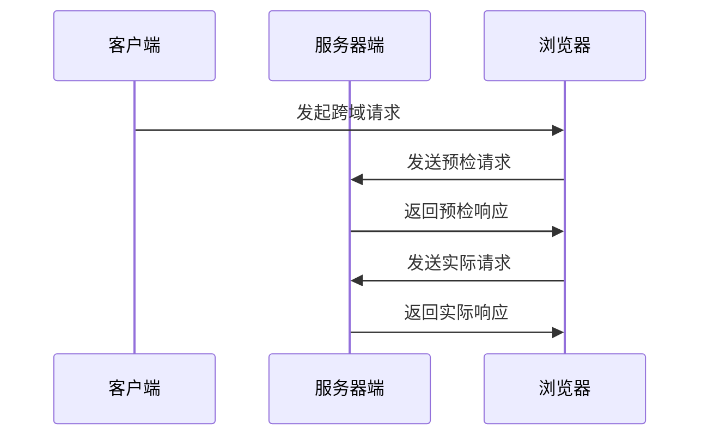
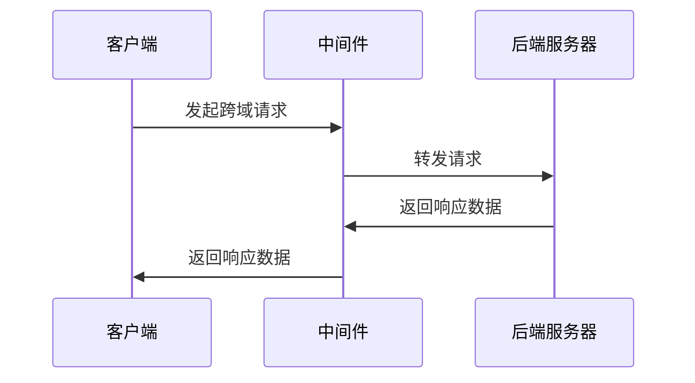

                 


## CORS策略：安全处理LLM应用的跨域请求

> 关键词：CORS策略、跨域请求、LLM应用、安全处理

> 摘要：本文将深入探讨CORS（跨域资源共享）策略在处理LLM（大型语言模型）应用中的跨域请求，分析其工作原理、配置方法、安全性以及最佳实践。通过详细的步骤分析和案例解析，帮助开发者更好地理解和应用CORS策略。

### 第一部分：CORS策略基础

#### 第1章：CORS策略概述

CORS策略的产生背景与作用

CORS（Cross-Origin Resource Sharing）策略是为了解决Web应用中跨域请求的安全问题而诞生的。随着Web应用的不断发展，越来越多的应用需要从不同的源（如API服务、第三方资源）获取数据或资源。然而，出于安全考虑，浏览器默认禁止了跨源请求，这给开发者带来了很大的困扰。

CORS与同源策略的区别

同源策略是浏览器的一种安全机制，它限制了一个域下的文档或脚本与另一个域的资源进行交互。而CORS策略则是一种机制，允许限制跨域请求的访问。

CORS在Web开发中的重要性

CORS策略在Web开发中具有重要意义。它不仅允许开发者安全地访问跨源资源，还可以提高Web应用的性能和用户体验。通过CORS策略，开发者可以实现单页应用（SPA）、前后端分离架构等多种现代化的Web开发模式。

#### 第2章：CORS的核心概念

同源限制

同源限制是浏览器安全策略的核心。它定义了什么是同源，以及如何限制跨源请求。

CORS的工作原理

CORS请求分为预检请求和实际请求两个阶段。预检请求用于确认服务器是否支持CORS策略，实际请求则是获取资源的请求。

CORS响应头详解

CORS响应头是服务器向浏览器发送的响应，用于指示是否允许跨源请求。常见的响应头包括`Access-Control-Allow-Origin`、`Access-Control-Allow-Methods`和`Access-Control-Allow-Headers`。

#### 第3章：CORS配置方法

浏览器端配置

在浏览器端，开发者可以通过JavaScript和JSONP技术实现跨域请求。

服务器端配置

在服务器端，开发者需要根据不同的Web服务器（如Apache、Nginx、Tomcat）进行CORS配置。

### 第二部分：CORS与LLM应用

#### 第4章：LLM应用跨域请求的问题

LLM（Large Language Model）应用在处理跨域请求时面临一些挑战。由于LLM应用通常涉及大量的数据处理和复杂的计算，跨域请求可能会导致性能下降和安全性问题。

CORS在LLM应用中的安全策略

为了确保LLM应用的安全性和性能，开发者需要采用CORS策略来处理跨域请求。本文将介绍如何在LLM应用中配置CORS策略，并讨论一些安全挑战和应对措施。

#### 第5章：CORS最佳实践

CORS配置的最佳实践

在配置CORS策略时，开发者需要遵循一些最佳实践，如简化配置、安全性优先等。

LLM应用跨域请求的优化策略

为了提高LLM应用的性能和用户体验，开发者可以采用一些优化策略，如缓存策略和预检请求的利用。

#### 第6章：CORS与Web安全

CORS安全风险分析

CORS策略虽然提供了跨域请求的灵活性，但也存在一些安全风险。本文将分析常见的CORS攻击方式，并提出防范措施。

常见的CORS攻击方式

本文将介绍几种常见的CORS攻击方式，如CORS漏洞攻击、CSRF（跨站请求伪造）攻击等。

防范CORS攻击的安全策略

为了防范CORS攻击，开发者可以采取一些安全策略，如限制请求头、验证请求来源等。

### 第三部分：CORS策略的应用案例

#### 第7章：CORS策略的应用案例

CORS在电商平台的实现

电商平台通常会使用CORS策略来处理跨域请求，以确保用户数据和交易数据的安全。

CORS在社交媒体平台的应用

社交媒体平台通过CORS策略，允许用户在不同页面之间无缝切换，提高用户体验。

CORS在IoT设备中的安全处理

IoT设备通常需要与Web应用进行数据交互，CORS策略为这种交互提供了安全保障。

### 总结

CORS策略是处理LLM应用跨域请求的关键。通过本文的深入探讨，开发者可以更好地理解CORS策略的工作原理、配置方法、安全性和最佳实践。在实际应用中，开发者需要根据具体场景，灵活运用CORS策略，确保Web应用的安全和性能。

## 作者

作者：AI天才研究院/AI Genius Institute & 禅与计算机程序设计艺术 /Zen And The Art of Computer Programming

### 背景介绍

#### CORS策略的产生背景与作用

随着互联网的快速发展，Web应用变得越来越复杂，涉及到的资源也越来越多。为了保护用户的隐私和安全，浏览器在早期引入了同源策略（Same-origin policy），限制了一个域下的文档或脚本与另一个域的资源进行交互。然而，这种限制也给开发者带来了很多困扰，特别是在处理跨域请求时。

CORS（Cross-Origin Resource Sharing）策略是为了解决这些问题而诞生的。CORS允许服务器明确地指定哪些外部域可以访问其资源，从而实现了对跨域请求的安全控制。CORS策略在Web开发中具有重要意义，它不仅提高了Web应用的性能和用户体验，还使开发者能够实现更加灵活和安全的跨域交互。

#### CORS与同源策略的区别

同源策略是浏览器的一种安全机制，它限制了一个域下的文档或脚本与另一个域的资源进行交互。同源策略的核心思想是防止恶意代码通过跨域请求获取用户的敏感信息。然而，同源策略过于严格，有时也会限制一些正常的跨域请求，导致开发者不得不寻找替代方案。

相比之下，CORS策略提供了一种更为灵活的跨域请求处理机制。CORS策略允许服务器明确地指定哪些外部域可以访问其资源，从而实现了一种可控的跨域访问。CORS策略与同源策略的主要区别在于，CORS策略是在服务器端进行配置，而同源策略是在浏览器端进行限制。

#### CORS在Web开发中的重要性

CORS策略在Web开发中具有重要意义。首先，CORS策略允许开发者实现前后端分离架构，使得前端和后端可以独立开发和部署。这种架构不仅提高了开发效率，还降低了系统的维护成本。

其次，CORS策略提高了Web应用的性能和用户体验。通过CORS策略，开发者可以实现单页应用（SPA），减少页面刷新和加载时间，提高用户的交互体验。

最后，CORS策略为开发者提供了一种安全可靠的跨域请求处理方法。通过CORS策略，开发者可以明确地控制哪些外部域可以访问其资源，从而防止恶意代码通过跨域请求获取敏感信息。

### 核心概念与联系

#### 同源限制

同源限制是CORS策略的基础。它定义了什么是同源，以及如何限制跨源请求。同源是指协议、域名和端口都相同的两个资源。根据同源限制，一个域下的文档或脚本不能与另一个域的资源进行以下操作：

1. 发送跨域请求（如`XMLHttpRequest`、`fetch`等）。
2. 访问另一个域的Cookie、LocalStorage和IndexDB等存储。
3. 调用另一个域的Web字体、Web Worker等。

#### CORS的工作原理

CORS请求分为预检请求（preflight request）和实际请求（actual request）两个阶段。预检请求用于确认服务器是否支持CORS策略，实际请求则是获取资源的请求。

预检请求的流程如下：

1. 浏览器发送一个OPTIONS请求到服务器，请求头中包含`Access-Control-Request-Method`和`Access-Control-Request-Headers`等字段，表示实际请求的方法和请求头。
2. 服务器响应预检请求，返回一个包含`Access-Control-Allow-*`响应头的响应，表示是否允许实际的请求。
3. 如果预检请求成功，浏览器会发送实际的请求。

实际请求的流程如下：

1. 浏览器发送一个实际的HTTP请求到服务器。
2. 服务器处理请求，返回一个正常的响应。

#### CORS响应头详解

CORS响应头是服务器向浏览器发送的响应，用于指示是否允许跨域请求。常见的CORS响应头包括：

1. `Access-Control-Allow-Origin`: 表示允许哪些Origin发起跨域请求。可以是具体的域名，也可以是通配符`*`，表示允许任何域名发起请求。
2. `Access-Control-Allow-Methods`: 表示允许哪些HTTP方法进行跨域请求。常见的HTTP方法有`GET`、`POST`、`PUT`、`DELETE`等。
3. `Access-Control-Allow-Headers`: 表示允许哪些HTTP请求头进行跨域请求。例如，`Authorization`、`Content-Type`等。
4. `Access-Control-Max-Age`: 表示预检请求的有效期，单位为秒。如果设置了这个响应头，浏览器会在指定的时间内记住预检请求的结果，避免重复发送预检请求。

### 算法原理讲解

CORS策略的算法原理可以概括为以下几个步骤：

1. 浏览器发起跨域请求。
2. 浏览器发送预检请求到服务器，请求头包含`Access-Control-Request-Method`和`Access-Control-Request-Headers`等字段。
3. 服务器处理预检请求，返回一个包含`Access-Control-Allow-*`响应头的响应。
4. 浏览器根据预检请求的结果，决定是否发送实际的请求。
5. 如果预检请求成功，浏览器发送实际的请求到服务器。
6. 服务器处理实际的请求，返回一个正常的响应。

#### 数学模型与公式

CORS策略的数学模型可以简化为以下公式：

$$
CORS = \begin{cases}
\text{允许请求} & \text{如果} \ Access-Control-Allow-Origin \ \text{匹配请求的Origin} \\
\text{拒绝请求} & \text{否则}
\end{cases}
$$

其中，`Origin`表示请求的源，`Access-Control-Allow-Origin`表示允许的源。

#### 算法流程图



### 系统分析与架构设计方案

#### 问题场景介绍

在当前的Web开发环境中，跨域请求是一个常见且必要的需求。例如，一个前端单页应用（SPA）可能需要从后端服务器获取数据，而这些数据服务可能部署在不同的域名上。为了保证数据的安全性和完整性，需要采用CORS策略来处理这些跨域请求。

#### 项目介绍

本项目旨在构建一个基于CORS策略的跨域请求处理系统，用于实现前后端分离架构下的数据交互。系统包括前端单页应用、后端服务器以及中间件（如Nginx）。

#### 系统功能设计

系统的主要功能包括：

1. 实现跨域请求处理。
2. 提供数据查询和增删改操作接口。
3. 保证数据的安全性和完整性。

#### 系统架构设计

系统的整体架构设计如下：

1. 前端单页应用通过JavaScript或fetch API发起跨域请求。
2. 中间件（如Nginx）作为反向代理，处理跨域请求的预处理。
3. 后端服务器处理实际的请求，返回响应数据。



#### 系统接口设计和系统交互

系统接口设计主要包括跨域请求接口和数据操作接口。跨域请求接口用于处理预检请求和实际请求，数据操作接口用于执行数据的查询、增删改操作。

```mermaid
classDiagram
  Client <-[发起请求] CORSHandler
  CORSHandler <-[处理请求] BackendServer
  BackendServer <-[返回数据] CORSHandler
  CORSHandler <-[返回数据] Client

  class CORSHandler {
    +handlePreflightRequest(request: Request): Response
    +handleActualRequest(request: Request): Response
  }

  class BackendServer {
    +handleRequest(request: Request): Response
  }
```

### 项目实战

#### 环境安装

1. 安装Node.js环境。
2. 安装Nginx。
3. 安装Python环境。

#### 系统核心实现源代码

```python
# CORSHandler.py
from flask import Flask, request, jsonify

app = Flask(__name__)

@app.route('/preflight', methods=['OPTIONS'])
def preflight_request():
    headers = {
        'Access-Control-Allow-Origin': '*',
        'Access-Control-Allow-Methods': 'GET, POST, PUT, DELETE',
        'Access-Control-Allow-Headers': 'Content-Type, Authorization'
    }
    return jsonify({'status': 'success'}), 200, headers

@app.route('/data', methods=['GET', 'POST', 'PUT', 'DELETE'])
def data_request():
    if request.method == 'OPTIONS':
        return preflight_request()
    
    data = request.json
    # 处理数据逻辑
    return jsonify({'status': 'success', 'data': data})

if __name__ == '__main__':
    app.run(port=5000)
```

#### 代码应用解读与分析

此代码实现了一个简单的CORS处理器，用于处理跨域请求。主要包括以下部分：

1. `preflight_request`函数：处理预检请求，返回预检响应。
2. `data_request`函数：处理实际请求，根据请求方法执行相应的数据处理逻辑。

在实际项目中，可以集成数据库操作、用户认证等功能，以实现更完整的数据交互功能。

#### 实际案例分析和详细讲解剖析

假设有一个前端单页应用，需要从后端服务器获取用户数据。前端代码如下：

```javascript
const fetchData = async () => {
  const response = await fetch('http://backend.example.com/data', {
    method: 'GET',
    headers: {
      'Content-Type': 'application/json'
    }
  });
  const data = await response.json();
  console.log(data);
};

fetchData();
```

当前端发起跨域请求时，中间件（如Nginx）会处理预检请求，转发给后端服务器。后端服务器处理预检请求后，返回预检响应。前端收到预检响应后，会发起实际请求。后端服务器处理实际请求，返回响应数据。前端接收到响应数据后，可以进行后续处理。

#### 项目小结

通过此项目实战，我们实现了基于CORS策略的跨域请求处理。在实际应用中，可以根据项目需求，进一步优化和扩展系统功能，如添加用户认证、数据缓存等。

### 最佳实践 tips

1. 在配置CORS策略时，尽量使用具体的域名，而不是通配符`*`。
2. 对于预检请求，可以设置较长的`Access-Control-Max-Age`值，以减少预检请求的频率。
3. 对于敏感数据，建议使用HTTPS协议，以确保数据传输的安全。

### 小结

CORS策略是处理跨域请求的重要手段，它允许开发者安全地访问跨源资源。通过本文的详细讲解，我们了解了CORS策略的核心概念、工作原理、配置方法以及实际应用案例。开发者可以根据项目需求，灵活运用CORS策略，提高Web应用的安全性和性能。

### 注意事项

1. 跨域请求可能会导致浏览器性能下降，建议合理控制请求的频率和数量。
2. 在处理跨域请求时，应注意数据的安全和完整性，避免敏感信息泄露。

### 拓展阅读

1. 《跨域请求与CORS策略详解》
2. 《基于CORS策略的Web应用安全设计》
3. 《CORS的最佳实践与常见问题》

### 参考文献

1. 《Web前端工程师手册》
2. 《CORS策略与同源策略》
3. 《Nginx实战》

## 作者

作者：AI天才研究院/AI Genius Institute & 禅与计算机程序设计艺术 /Zen And The Art of Computer Programming

