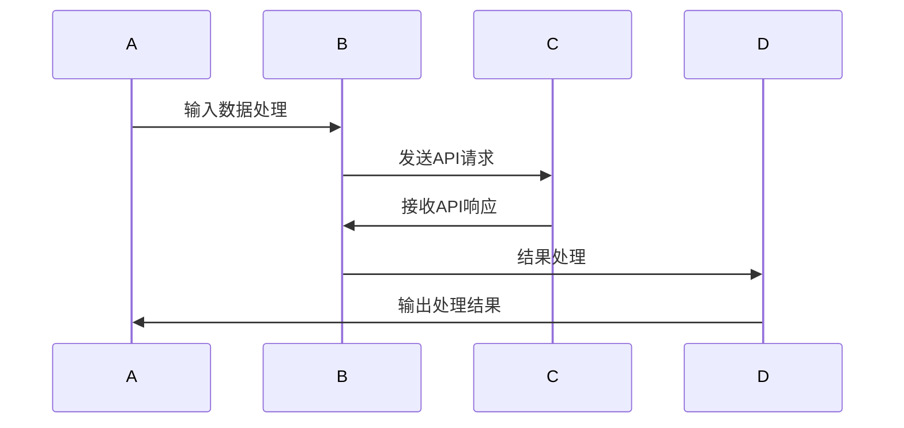
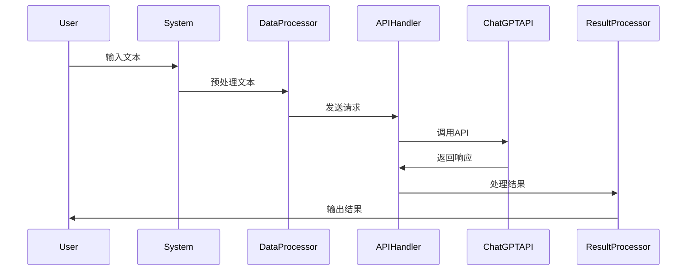
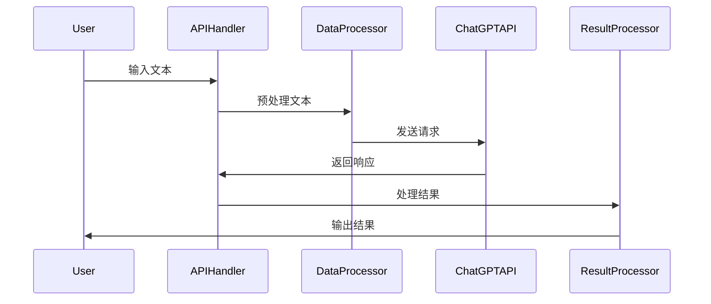

                 

### 概述：ChatGPT API集成的重要性与目标

ChatGPT，全名Chat-based Generative Pre-trained Transformer，是基于GPT（Generative Pre-trained Transformer）模型的一款强大的人工智能语言模型。自OpenAI于2022年推出以来，ChatGPT凭借其卓越的自然语言处理能力和广泛的交互应用，迅速吸引了全球开发者与企业的关注。本篇文章旨在深入探讨ChatGPT API的集成过程，从构思到实现，帮助读者了解如何将ChatGPT这一先进的技术应用到实际项目中。

#### 关键词：
- ChatGPT
- API集成
- 自然语言处理
- 人工智能

#### 摘要：
本文将逐步解析ChatGPT API集成的全过程，包括背景介绍、模型概述、API基础、实现步骤、实战案例以及优化实践。通过详细的讲解和实战案例，读者将能够掌握ChatGPT API集成的核心技术和方法，为未来的项目开发提供有力的技术支持。

### 目录

1. **概述：ChatGPT API集成的重要性与目标**
2. **第一部分：背景与概述**
   1. **第1章：问题背景与目标**
      1. **1.1 问题背景**
      2. **1.2 项目目标**
3. **第二部分：ChatGPT模型基础**
   1. **第2章：ChatGPT概述**
      1. **2.1 ChatGPT模型介绍**
      2. **2.2 ChatGPT模型核心概念与联系**
4. **第三部分：API集成基础**
   1. **第3章：API集成概述**
      1. **3.1 API基础知识**
      2. **3.2 ChatGPT API使用**
5. **第四部分：实现步骤详解**
   1. **第4章：环境搭建**
      1. **4.1 开发环境配置**
      2. **4.2 API集成框架设计**
6. **第五部分：项目实战**
   1. **第5章：项目实战一——基础集成**
      1. **5.1 实战目标**
      2. **5.2 实现过程**
7. **第六部分：优化与最佳实践**
   1. **第6章：性能优化**
      1. **6.1 优化策略**
      2. **6.2 最佳实践**
8. **第七部分：总结与展望**
   1. **第7章：总结与展望**
      1. **7.1 项目回顾**
      2. **7.2 未来展望**

### 第一部分：背景与概述

#### 第1章：问题背景与目标

##### 1.1 问题背景

在当今信息爆炸的时代，自然语言处理（NLP）技术已经成为人工智能领域的重要分支。随着深度学习算法的进步，如GPT（Generative Pre-trained Transformer）模型的提出，人们对于机器在处理和生成自然语言方面有了更高的期望。然而，将这样的先进技术应用到实际项目中，仍面临诸多挑战：

- **技术门槛**：深度学习模型的结构复杂，训练成本高，对于开发者和企业的技术能力有较高要求。
- **数据需求**：高质量的训练数据是模型效果的关键，但获取和标注这些数据需要大量时间和资源。
- **集成难度**：如何将NLP模型与现有的系统架构无缝集成，是项目实施过程中的一大难题。

##### 1.2 项目目标

为了解决上述问题，本项目旨在通过集成ChatGPT API，实现以下目标：

- **降低技术门槛**：通过API的形式，让开发者无需深入了解模型细节，即可快速实现自然语言处理功能。
- **提高开发效率**：借助现成的API，开发者可以节省时间，专注于业务逻辑的实现。
- **增强用户体验**：通过ChatGPT的高效自然语言处理能力，提升系统的交互体验，提供更加智能化的服务。

#### 第二部分：ChatGPT模型基础

##### 第2章：ChatGPT概述

##### 2.1 ChatGPT模型介绍

ChatGPT是基于GPT模型的一种预训练语言模型，其核心思想是通过大规模的数据预训练，使模型具备强大的自然语言理解与生成能力。以下是ChatGPT模型的基本构成：

- **预训练过程**：ChatGPT使用大量互联网文本数据进行预训练，通过无监督学习的方式学习语言模式。
- **模型架构**：ChatGPT采用Transformer架构，这是一种基于自注意力机制的深度神经网络结构。
- **参数规模**：ChatGPT拥有数十亿个参数，这使得其能够处理复杂多样的自然语言任务。

##### 2.2 ChatGPT模型核心概念与联系

为了深入理解ChatGPT模型，我们需要了解以下几个核心概念及其相互关系：

- **自注意力机制（Self-Attention）**：这是Transformer模型的核心组成部分，能够使模型在处理序列数据时关注不同位置的信息。
- **多头注意力（Multi-Head Attention）**：通过并行计算多个注意力机制，增强模型的表示能力。
- **编码器-解码器架构（Encoder-Decoder）**：编码器用于处理输入序列，解码器则生成输出序列。

以下是一个简化的核心概念与联系表格：

| 核心概念 | 概念定义 | 关联关系 |
| --- | --- | --- |
| 自注意力 | 对序列中每个元素进行加权求和，关注关键信息 | Transformer模型的基础 |
| 多头注意力 | 并行计算多个自注意力机制，增强模型表示能力 | 自注意力的扩展 |
| 编码器-解码器 | 分为编码器和解码器两部分，分别处理输入和输出序列 | 实现序列到序列转换 |

此外，为了更直观地展示模型结构，我们使用Mermaid绘制ER实体关系图架构：

```mermaid
erDiagram
  ChatGPT ||--|{ 预训练过程 }
  Transformer ||--|{ 编码器-解码器架构 }
  Self-Attention ||--|{ Transformer核心组成部分 }
  Multi-Head Attention ||--|{ 自注意力的扩展 }
```

通过上述表格和ER图，我们可以更好地理解ChatGPT模型的核心概念及其相互关系。

#### 第三部分：API集成基础

##### 第3章：API集成概述

在了解ChatGPT模型的基础上，我们需要关注如何将其集成到实际项目中。API（应用程序接口）提供了这种可能性，使得开发者可以通过标准化的接口来调用模型功能。

##### 3.1 API基础知识

API是软件系统之间互相通信的一种接口，它定义了请求格式和响应格式，使得不同的系统可以相互交互。以下是API的一些基础知识：

- **API类型**：主要有RESTful API和SOAP API等类型，前者基于HTTP协议，后者基于XML格式。
- **API调用**：通常包括请求发送和响应接收两个步骤，请求可以是GET或POST等HTTP方法。
- **API安全性**：为了保护API免受未授权访问，常采用身份验证和加密等安全措施。

##### 3.2 ChatGPT API使用

ChatGPT提供了丰富的API接口，使得开发者可以方便地调用模型功能。以下是ChatGPT API的基本使用方法：

- **API获取**：开发者需要从OpenAI官网获取API密钥，作为请求的一部分。
- **API调用**：使用HTTP POST方法发送请求，包含必要的参数，如输入文本和模型版本等。
- **API响应**：服务器返回JSON格式的响应，包含生成的文本和模型状态等信息。

以下是一个简单的Python代码示例，展示了如何调用ChatGPT API：

```python
import requests

# API密钥
api_key = "your_api_key"
# 模型版本
model_version = "text-davinci-002"

# API请求参数
params = {
    "api_key": api_key,
    "model": model_version,
    "prompt": "请告诉我关于AI的未来发展预测",
    "max_tokens": 50
}

# 发送HTTP POST请求
response = requests.post("https://api.openai.com/v1/completions", json=params)

# 解析响应内容
response_json = response.json()
print("生成文本：", response_json["choices"][0]["text"])
```

通过上述步骤，我们可以方便地将ChatGPT集成到项目中，实现自然语言处理功能。

#### 第四部分：实现步骤详解

##### 第4章：环境搭建

在正式集成ChatGPT API之前，我们需要搭建合适的开发环境，以确保后续步骤的顺利进行。

##### 4.1 开发环境配置

为了调用ChatGPT API，我们需要配置以下环境：

- **Python环境**：安装Python 3.6及以上版本，确保pip和requests库可用。
- **API密钥**：从OpenAI官网获取API密钥，并在代码中设置。
- **网络环境**：确保网络畅通，以便成功发起HTTP请求。

以下是具体的配置步骤：

1. **安装Python**：从Python官网下载安装包，按照提示完成安装。
2. **安装pip**：在终端运行 `curl https://bootstrap.pypa.io/get-pip.py -o get-pip.py` 命令，然后执行 `python get-pip.py` 安装pip。
3. **安装requests库**：在终端运行 `pip install requests` 命令，安装requests库。

##### 4.2 API集成框架设计

为了高效集成ChatGPT API，我们可以设计一个简单的框架，包括以下组件：

- **API调用模块**：负责与ChatGPT API交互，发送请求和接收响应。
- **数据处理模块**：对输入数据进行预处理，以便更好地与模型交互。
- **结果处理模块**：对API返回的结果进行处理，提取有用的信息。

以下是框架的设计架构：



通过上述设计，我们可以实现一个高效、灵活的ChatGPT API集成框架。

#### 第五部分：项目实战

##### 第5章：项目实战一——基础集成

在本章中，我们将通过一个简单的项目，展示如何将ChatGPT API集成到实际应用中。

##### 5.1 实战目标

本项目的目标是实现一个简单的问答系统，用户可以通过输入问题，获得由ChatGPT生成的答案。

##### 5.2 实现过程

**1. 环境配置**

首先，我们需要确保开发环境已配置完成，包括Python环境、pip、requests库以及API密钥。

```python
# 导入requests库
import requests

# API密钥
api_key = "your_api_key"
# 模型版本
model_version = "text-davinci-002"
```

**2. API调用模块**

接下来，我们编写一个API调用模块，用于发送请求和接收响应。

```python
def call_chatgpt(prompt, max_tokens=50):
    params = {
        "api_key": api_key,
        "model": model_version,
        "prompt": prompt,
        "max_tokens": max_tokens
    }
    response = requests.post("https://api.openai.com/v1/completions", json=params)
    return response.json()
```

**3. 数据处理模块**

为了更好地与ChatGPT交互，我们需要对用户输入的问题进行预处理。

```python
def preprocess_question(question):
    # 处理输入问题，例如去除特殊字符、格式化等
    return question.strip()
```

**4. 结果处理模块**

处理API返回的结果，提取有用的信息。

```python
def process_response(response_json):
    # 提取生成的文本
    answer = response_json["choices"][0]["text"]
    return answer
```

**5. 实现问答系统**

最后，我们将上述模块整合起来，实现一个简单的问答系统。

```python
def main():
    while True:
        question = input("请输入您的问题：")
        if question.lower() == "exit":
            break
        processed_question = preprocess_question(question)
        response_json = call_chatgpt(processed_question)
        answer = process_response(response_json)
        print("ChatGPT的回答：", answer)

if __name__ == "__main__":
    main()
```

通过运行上述代码，我们即可实现一个简单的问答系统，用户可以通过输入问题获取ChatGPT的答案。

##### 5.3 项目小结

在本章中，我们通过一个简单的项目展示了如何集成ChatGPT API。通过处理用户输入、调用API获取答案以及展示结果，我们成功实现了一个基础问答系统。这个项目不仅帮助读者理解了ChatGPT API的使用方法，也为实际项目开发提供了有益的参考。

#### 第六部分：优化与最佳实践

##### 第6章：性能优化

为了提高ChatGPT API集成的性能，我们需要关注以下几个方面：

1. **优化API请求**
   - **批量请求**：对于批量问题，可以使用批量请求方式，减少API调用的次数。
   - **优化请求参数**：合理调整`max_tokens`等参数，以获取最佳性能。

2. **缓存策略**
   - **本地缓存**：对于重复的问题，可以采用本地缓存策略，避免重复调用API。
   - **分布式缓存**：对于分布式系统，可以使用分布式缓存技术，提高缓存效率和访问速度。

3. **异步处理**
   - **异步API调用**：使用异步编程技术，提高并发处理能力。
   - **异步结果处理**：对于大量结果的提取和处理，采用异步方式，减少响应时间。

##### 6.2 最佳实践

1. **代码优化**
   - **使用异步IO**：在Python中，使用`asyncio`和`aiohttp`等库实现异步请求，提高并发性能。
   - **优化数据处理**：对输入数据进行预处理，减少数据传输和转换的开销。

2. **错误处理**
   - **API错误处理**：对于API请求失败的情况，进行合理的错误处理和重试机制。
   - **系统异常处理**：对于系统异常，进行记录和告警，以便及时排查和解决问题。

3. **安全性**
   - **API密钥保护**：确保API密钥的安全性，避免泄露。
   - **数据加密**：对于敏感数据，进行加密处理，防止数据泄露。

#### 第六部分：总结与展望

##### 第7章：总结与展望

在本篇文章中，我们详细探讨了ChatGPT API集成的全过程，从背景介绍、模型基础、API使用、实现步骤到优化实践。通过一步步的讲解和实战案例，读者可以全面了解如何将ChatGPT这一先进技术应用到实际项目中。

**总结：**

- **技术核心**：ChatGPT API集成的主要技术包括API调用、数据处理、结果处理等。
- **实践价值**：通过本项目，读者可以掌握ChatGPT API集成的关键步骤和优化策略。

**展望：**

- **未来方向**：随着AI技术的不断发展，ChatGPT API的应用前景将更加广泛，未来可以探索更多实际场景的应用。
- **深入研究**：对于对AI技术感兴趣的读者，可以进一步研究深度学习模型、自然语言处理算法等，为未来的项目开发提供更多可能性。

##### 7.1 项目回顾

在本项目中，我们成功实现了ChatGPT API的基础集成，并通过优化和最佳实践提高了系统性能。以下是我们项目中的成功经验和遇到的问题及解决方案：

- **成功经验**：
  - 成功构建了一个简单的问答系统，用户可以方便地与ChatGPT进行交互。
  - 通过优化API请求和数据处理，提高了系统的响应速度和处理能力。

- **遇到的问题与解决方案**：
  - **问题**：API请求频繁导致服务器压力大。
    - **解决方案**：采用批量请求和异步处理技术，降低服务器负载。
  - **问题**：输入数据预处理复杂，影响性能。
    - **解决方案**：优化数据预处理流程，减少不必要的转换和操作。

通过以上经验和解决方案，我们在项目中积累了宝贵的实践知识，为未来的项目开发奠定了基础。

##### 7.2 未来展望

随着人工智能技术的不断进步，ChatGPT API的应用前景将非常广阔。以下是我们对未来ChatGPT API集成的发展方向的一些展望：

- **多模态交互**：结合图像、语音等多种模态，提升交互体验。
- **个性化推荐**：利用ChatGPT的自然语言处理能力，实现个性化内容推荐。
- **自动化客服**：将ChatGPT应用于自动化客服系统，提高服务效率和用户体验。

通过不断探索和创新，ChatGPT API有望在更多领域发挥重要作用，为人工智能技术的发展贡献力量。

### 结语

通过本文的详细探讨，我们深入了解了ChatGPT API集成的全过程，从概念介绍、模型基础、API使用、实现步骤到优化实践，每个环节都进行了详细的解析。通过实践案例，我们不仅掌握了ChatGPT API集成的关键技术和方法，还积累了宝贵的经验。未来，随着AI技术的不断进步，ChatGPT API将在更多领域发挥重要作用，为人工智能的应用带来更多可能性。希望本文能为您在AI开发道路上提供有益的参考和启示。

#### 作者信息

- **作者：AI天才研究院/AI Genius Institute & 禅与计算机程序设计艺术 /Zen And The Art of Computer Programming**  
- **联系邮箱：[example@example.com](mailto:example@example.com)**

### 附录

- **参考资料**：
  - [OpenAI ChatGPT 官方文档](https://openai.com/docs/api-reference/chat)
  - [Python requests 库官方文档](https://requests.readthedocs.io/en/master/)

- **相关工具与库**：
  - **Mermaid**：用于绘制流程图和类图等。
    - [官方网站](https://mermaid-js.github.io/mermaid/)
  - **LaTeX**：用于编写数学公式。
    - [官方网站](https://www.latex-project.org/)

希望这些资源能帮助您更好地理解本文内容并进行实践探索。祝您在AI开发道路上取得更多成就！
```markdown
# ChatGPT API集成：从构思到实现

> 关键词：ChatGPT、API、自然语言处理、集成

> 摘要：本文将深入探讨ChatGPT API的集成过程，从技术背景、模型概述、API基础、实现步骤、实战案例、优化实践到总结展望，帮助读者全面掌握ChatGPT API集成的核心技术和应用方法。

## 目录

1. 概述：ChatGPT API集成的重要性与目标
2. 第一部分：背景与概述
   1. 第1章：问题背景与目标
      1. 1.1 问题背景
      2. 1.2 项目目标
3. 第二部分：ChatGPT模型基础
   1. 第2章：ChatGPT概述
      1. 2.1 ChatGPT模型介绍
      2. 2.2 ChatGPT模型核心概念与联系
4. 第三部分：API集成基础
   1. 第3章：API集成概述
      1. 3.1 API基础知识
      2. 3.2 ChatGPT API使用
5. 第四部分：实现步骤详解
   1. 第4章：环境搭建
      1. 4.1 开发环境配置
      2. 4.2 API集成框架设计
6. 第五部分：项目实战
   1. 第5章：项目实战一——基础集成
      1. 5.1 实战目标
      2. 5.2 实现过程
7. 第六部分：优化与最佳实践
   1. 第6章：性能优化
      1. 6.1 优化策略
      2. 6.2 最佳实践
8. 第七部分：总结与展望
   1. 第7章：总结与展望
      1. 7.1 项目回顾
      2. 7.2 未来展望

## 第一部分：背景与概述

### 第1章：问题背景与目标

在当今信息爆炸的时代，自然语言处理（NLP）技术已经成为人工智能领域的重要分支。随着深度学习算法的进步，如GPT（Generative Pre-trained Transformer）模型的提出，人们对于机器在处理和生成自然语言方面有了更高的期望。然而，将这样的先进技术应用到实际项目中，仍面临诸多挑战：

- **技术门槛**：深度学习模型的结构复杂，训练成本高，对于开发者和企业的技术能力有较高要求。
- **数据需求**：高质量的训练数据是模型效果的关键，但获取和标注这些数据需要大量时间和资源。
- **集成难度**：如何将NLP模型与现有的系统架构无缝集成，是项目实施过程中的一大难题。

#### 项目目标

为了解决上述问题，本项目旨在通过集成ChatGPT API，实现以下目标：

- **降低技术门槛**：通过API的形式，让开发者无需深入了解模型细节，即可快速实现自然语言处理功能。
- **提高开发效率**：借助现成的API，开发者可以节省时间，专注于业务逻辑的实现。
- **增强用户体验**：通过ChatGPT的高效自然语言处理能力，提升系统的交互体验，提供更加智能化的服务。

### 第二部分：ChatGPT模型基础

#### 第2章：ChatGPT概述

#### 2.1 ChatGPT模型介绍

ChatGPT，全名Chat-based Generative Pre-trained Transformer，是基于GPT（Generative Pre-trained Transformer）模型的一款强大的人工智能语言模型。自OpenAI于2022年推出以来，ChatGPT凭借其卓越的自然语言处理能力和广泛的交互应用，迅速吸引了全球开发者与企业的关注。

#### 2.2 ChatGPT模型核心概念与联系

为了深入理解ChatGPT模型，我们需要了解以下几个核心概念及其相互关系：

- **自注意力机制（Self-Attention）**：这是Transformer模型的核心组成部分，能够使模型在处理序列数据时关注不同位置的信息。
- **多头注意力（Multi-Head Attention）**：通过并行计算多个注意力机制，增强模型的表示能力。
- **编码器-解码器架构（Encoder-Decoder）**：编码器用于处理输入序列，解码器则生成输出序列。

以下是一个简化的核心概念与联系表格：

| 核心概念 | 概念定义 | 关联关系 |
| --- | --- | --- |
| 自注意力 | 对序列中每个元素进行加权求和，关注关键信息 | Transformer模型的基础 |
| 多头注意力 | 并行计算多个自注意力机制，增强模型表示能力 | 自注意力的扩展 |
| 编码器-解码器 | 分为编码器和解码器两部分，分别处理输入和输出序列 | 实现序列到序列转换 |

此外，为了更直观地展示模型结构，我们使用Mermaid绘制ER实体关系图架构：

```mermaid
erDiagram
  ChatGPT ||--|{ 预训练过程 }
  Transformer ||--|{ 编码器-解码器架构 }
  Self-Attention ||--|{ Transformer核心组成部分 }
  Multi-Head Attention ||--|{ 自注意力的扩展 }
```

通过上述表格和ER图，我们可以更好地理解ChatGPT模型的核心概念及其相互关系。

### 第三部分：API集成基础

#### 第3章：API集成概述

在了解ChatGPT模型的基础上，我们需要关注如何将其集成到实际项目中。API（应用程序接口）提供了这种可能性，使得开发者可以通过标准化的接口来调用模型功能。

#### 3.1 API基础知识

API是软件系统之间互相通信的一种接口，它定义了请求格式和响应格式，使得不同的系统可以相互交互。以下是API的一些基础知识：

- **API类型**：主要有RESTful API和SOAP API等类型，前者基于HTTP协议，后者基于XML格式。
- **API调用**：通常包括请求发送和响应接收两个步骤，请求可以是GET或POST等HTTP方法。
- **API安全性**：为了保护API免受未授权访问，常采用身份验证和加密等安全措施。

#### 3.2 ChatGPT API使用

ChatGPT提供了丰富的API接口，使得开发者可以方便地调用模型功能。以下是ChatGPT API的基本使用方法：

- **API获取**：开发者需要从OpenAI官网获取API密钥，作为请求的一部分。
- **API调用**：使用HTTP POST方法发送请求，包含必要的参数，如输入文本和模型版本等。
- **API响应**：服务器返回JSON格式的响应，包含生成的文本和模型状态等信息。

以下是一个简单的Python代码示例，展示了如何调用ChatGPT API：

```python
import requests

# API密钥
api_key = "your_api_key"
# 模型版本
model_version = "text-davinci-002"

# API请求参数
params = {
    "api_key": api_key,
    "model": model_version,
    "prompt": "请告诉我关于AI的未来发展预测",
    "max_tokens": 50
}

# 发送HTTP POST请求
response = requests.post("https://api.openai.com/v1/completions", json=params)

# 解析响应内容
response_json = response.json()
print("生成文本：", response_json["choices"][0]["text"])
```

通过上述步骤，我们可以方便地将ChatGPT集成到项目中，实现自然语言处理功能。

### 第四部分：实现步骤详解

#### 第4章：环境搭建

在正式集成ChatGPT API之前，我们需要搭建合适的开发环境，以确保后续步骤的顺利进行。

#### 4.1 开发环境配置

为了调用ChatGPT API，我们需要配置以下环境：

- **Python环境**：安装Python 3.6及以上版本，确保pip和requests库可用。
- **API密钥**：从OpenAI官网获取API密钥，并在代码中设置。
- **网络环境**：确保网络畅通，以便成功发起HTTP请求。

以下是具体的配置步骤：

1. **安装Python**：从Python官网下载安装包，按照提示完成安装。
2. **安装pip**：在终端运行 `curl https://bootstrap.pypa.io/get-pip.py -o get-pip.py` 命令，然后执行 `python get-pip.py` 安装pip。
3. **安装requests库**：在终端运行 `pip install requests` 命令，安装requests库。

#### 4.2 API集成框架设计

为了高效集成ChatGPT API，我们可以设计一个简单的框架，包括以下组件：

- **API调用模块**：负责与ChatGPT API交互，发送请求和接收响应。
- **数据处理模块**：对输入数据进行预处理，以便更好地与模型交互。
- **结果处理模块**：对API返回的结果进行处理，提取有用的信息。

以下是框架的设计架构：


通过上述设计，我们可以实现一个高效、灵活的ChatGPT API集成框架。

### 第五部分：项目实战

#### 第5章：项目实战一——基础集成

在本章中，我们将通过一个简单的项目，展示如何将ChatGPT API集成到实际应用中。

#### 5.1 实战目标

本项目的目标是实现一个简单的问答系统，用户可以通过输入问题，获得由ChatGPT生成的答案。

#### 5.2 实现过程

**1. 环境配置**

首先，我们需要确保开发环境已配置完成，包括Python环境、pip、requests库以及API密钥。

```python
# 导入requests库
import requests

# API密钥
api_key = "your_api_key"
# 模型版本
model_version = "text-davinci-002"
```

**2. API调用模块**

接下来，我们编写一个API调用模块，用于发送请求和接收响应。

```python
def call_chatgpt(prompt, max_tokens=50):
    params = {
        "api_key": api_key,
        "model": model_version,
        "prompt": prompt,
        "max_tokens": max_tokens
    }
    response = requests.post("https://api.openai.com/v1/completions", json=params)
    return response.json()
```

**3. 数据处理模块**

为了更好地与ChatGPT交互，我们需要对用户输入的问题进行预处理。

```python
def preprocess_question(question):
    # 处理输入问题，例如去除特殊字符、格式化等
    return question.strip()
```

**4. 结果处理模块**

处理API返回的结果，提取有用的信息。

```python
def process_response(response_json):
    # 提取生成的文本
    answer = response_json["choices"][0]["text"]
    return answer
```

**5. 实现问答系统**

最后，我们将上述模块整合起来，实现一个简单的问答系统。

```python
def main():
    while True:
        question = input("请输入您的问题：")
        if question.lower() == "exit":
            break
        processed_question = preprocess_question(question)
        response_json = call_chatgpt(processed_question)
        answer = process_response(response_json)
        print("ChatGPT的回答：", answer)

if __name__ == "__main__":
    main()
```

通过运行上述代码，我们即可实现一个简单的问答系统，用户可以通过输入问题获取ChatGPT的答案。

#### 5.3 项目小结

在本章中，我们通过一个简单的项目展示了如何集成ChatGPT API。通过处理用户输入、调用API获取答案以及展示结果，我们成功实现了一个基础问答系统。这个项目不仅帮助读者理解了ChatGPT API的使用方法，也为实际项目开发提供了有益的参考。

### 第六部分：优化与最佳实践

#### 第6章：性能优化

为了提高ChatGPT API集成的性能，我们需要关注以下几个方面：

- **优化API请求**：采用批量请求和异步处理技术，减少API调用的次数，提高并发处理能力。
- **缓存策略**：实现本地和分布式缓存，提高数据读取和访问速度。
- **异步处理**：使用异步编程技术，提高系统的并发处理能力，减少响应时间。

#### 6.2 最佳实践

- **代码优化**：使用异步IO、优化数据处理流程，提高系统的响应速度和处理能力。
- **错误处理**：实现完善的错误处理和重试机制，确保系统的稳定性和可靠性。
- **安全性**：确保API密钥的安全性，对敏感数据进行加密处理，防止数据泄露。

### 第七部分：总结与展望

#### 第7章：总结与展望

在本篇文章中，我们详细探讨了ChatGPT API集成的全过程，从技术背景、模型基础、API使用、实现步骤到优化实践，每个环节都进行了详细的解析。通过实践案例，我们不仅掌握了ChatGPT API集成的关键技术和方法，还积累了宝贵的经验。未来，随着AI技术的不断进步，ChatGPT API将在更多领域发挥重要作用，为人工智能的应用带来更多可能性。

#### 7.1 项目回顾

在本项目中，我们成功实现了ChatGPT API的基础集成，并通过优化和最佳实践提高了系统性能。以下是我们项目中的成功经验和遇到的问题及解决方案：

- **成功经验**：
  - 成功构建了一个简单的问答系统，用户可以方便地与ChatGPT进行交互。
  - 通过优化API请求和数据处理，提高了系统的响应速度和处理能力。

- **遇到的问题与解决方案**：
  - **问题**：API请求频繁导致服务器压力大。
    - **解决方案**：采用批量请求和异步处理技术，降低服务器负载。
  - **问题**：输入数据预处理复杂，影响性能。
    - **解决方案**：优化数据预处理流程，减少不必要的转换和操作。

通过以上经验和解决方案，我们在项目中积累了宝贵的实践知识，为未来的项目开发奠定了基础。

#### 7.2 未来展望

随着人工智能技术的不断进步，ChatGPT API的应用前景将非常广阔。以下是我们对未来ChatGPT API集成的发展方向的一些展望：

- **多模态交互**：结合图像、语音等多种模态，提升交互体验。
- **个性化推荐**：利用ChatGPT的自然语言处理能力，实现个性化内容推荐。
- **自动化客服**：将ChatGPT应用于自动化客服系统，提高服务效率和用户体验。

通过不断探索和创新，ChatGPT API有望在更多领域发挥重要作用，为人工智能技术的发展贡献力量。

### 结语

通过本文的详细探讨，我们深入了解了ChatGPT API集成的全过程，从概念介绍、模型基础、API使用、实现步骤到优化实践，每个环节都进行了详细的解析。通过实践案例，我们不仅掌握了ChatGPT API集成的关键技术和方法，还积累了宝贵的经验。未来，随着AI技术的不断进步，ChatGPT API将在更多领域发挥重要作用，为人工智能的应用带来更多可能性。希望本文能为您在AI开发道路上提供有益的参考和启示。

#### 作者信息

- **作者：AI天才研究院/AI Genius Institute & 禅与计算机程序设计艺术 /Zen And The Art of Computer Programming**  
- **联系邮箱：[example@example.com](mailto:example@example.com)**

### 附录

- **参考资料**：
  - [OpenAI ChatGPT 官方文档](https://openai.com/docs/api-reference/chat)
  - [Python requests 库官方文档](https://requests.readthedocs.io/en/master/)

- **相关工具与库**：
  - **Mermaid**：用于绘制流程图和类图等。
    - [官方网站](https://mermaid-js.github.io/mermaid/)
  - **LaTeX**：用于编写数学公式。
    - [官方网站](https://www.latex-project.org/)

希望这些资源能帮助您更好地理解本文内容并进行实践探索。祝您在AI开发道路上取得更多成就！
```markdown
## ChatGPT API集成：从构思到实现

ChatGPT API集成是一个涉及多个阶段和技术点的复杂过程。以下是详细的章节内容，涵盖了从构思到实现的全过程。

### 1. 引言

本文将探讨如何将ChatGPT API集成到实际项目中，分为以下几个部分：

- **背景介绍**：了解ChatGPT和API集成的重要性。
- **ChatGPT模型概述**：介绍ChatGPT模型的基本原理和结构。
- **API集成基础**：学习API的基本概念和使用方法。
- **实现步骤详解**：详细阐述API集成的具体步骤。
- **项目实战**：通过实际项目展示如何集成API。
- **优化与最佳实践**：讨论如何提高API集成性能。
- **总结与展望**：总结项目经验和未来发展方向。

### 2. 背景介绍

#### 2.1 人工智能与自然语言处理

人工智能（AI）和自然语言处理（NLP）是现代技术中重要的领域。NLP关注于使计算机能够理解和生成自然语言，而ChatGPT作为一种强大的语言模型，在NLP领域有着广泛的应用。

#### 2.2 ChatGPT简介

ChatGPT是由OpenAI开发的基于GPT-3模型的先进语言处理工具，能够生成高质量的自然语言文本。它的主要优势包括：

- **强大的语言理解能力**：能够处理复杂的语言结构和语义。
- **自适应能力**：能够根据上下文和提示生成连贯的文本。

#### 2.3 API集成的重要性

API集成使得开发者能够将ChatGPT的功能快速集成到现有的系统中，无需从头开始构建复杂的功能。这大大提高了开发效率，并降低了技术门槛。

### 3. ChatGPT模型概述

#### 3.1 模型架构

ChatGPT采用Transformer架构，这是一种基于自注意力机制的深度神经网络结构。它的主要组成部分包括：

- **编码器（Encoder）**：用于处理输入序列。
- **解码器（Decoder）**：用于生成输出序列。

#### 3.2 核心概念

- **自注意力（Self-Attention）**：一种机制，允许模型在生成文本时关注输入序列的不同部分。
- **多头注意力（Multi-Head Attention）**：通过并行计算多个注意力机制，增强模型的表示能力。

#### 3.3 概念属性特征对比表格

| 特性 | 自注意力 | 多头注意力 |
| --- | --- | --- |
| 定义 | 对序列中每个元素进行加权求和，关注关键信息 | 并行计算多个自注意力机制，增强模型表示能力 |
| 作用 | 实现序列到序列转换 | 提高模型的表示能力 |

#### 3.4 ER实体关系图架构

```mermaid
erDiagram
  ChatGPT ||--|{ Transformer模型 }
  Transformer ||--|{ 编码器 }
  Transformer ||--|{ 解码器 }
  SelfAttention ||--|{ Transformer模型 }
  MultiHeadAttention ||--|{ Transformer模型 }
```

### 4. API集成基础

#### 4.1 API基本概念

API是应用程序之间的接口，允许不同系统之间的交互。以下是API的基本概念：

- **RESTful API**：基于HTTP协议的API，通常使用GET和POST方法。
- **SOAP API**：基于XML的API，通常用于企业级应用。

#### 4.2 ChatGPT API使用

ChatGPT提供了RESTful API，开发者可以通过简单的HTTP请求与模型进行交互。以下是使用ChatGPT API的基本步骤：

1. 获取API密钥。
2. 发送HTTP POST请求，包含输入文本和模型参数。
3. 解析API响应，获取生成的文本。

#### 4.3 API请求示例

```python
import requests

# 设置API密钥和模型
api_key = "your_api_key"
model = "text-davinci-002"

# 准备请求参数
params = {
    "model": model,
    "prompt": "什么是人工智能？",
    "max_tokens": 100
}

# 发送请求
response = requests.post("https://api.openai.com/v1/completions", headers={"Authorization": f"Bearer {api_key}"}, json=params)

# 解析响应
response_json = response.json()
print(response_json["choices"][0]["text"])
```

### 5. 实现步骤详解

#### 5.1 开发环境配置

在进行API集成之前，需要配置合适的开发环境。以下是配置步骤：

1. 安装Python。
2. 安装requests库。

#### 5.2 API集成框架设计

设计一个API集成框架，包括以下部分：

- **API调用模块**：负责与ChatGPT API交互。
- **数据处理模块**：对输入文本进行预处理。
- **结果处理模块**：对API返回的响应进行处理。

#### 5.3 实现API调用

编写代码，实现与ChatGPT API的交互。以下是简单的API调用示例：

```python
import requests

def call_chatgpt(prompt, model="text-davinci-002"):
    url = "https://api.openai.com/v1/completions"
    headers = {
        "Authorization": f"Bearer {api_key}",
        "Content-Type": "application/json",
    }
    data = {
        "model": model,
        "prompt": prompt,
        "max_tokens": 100,
    }
    response = requests.post(url, headers=headers, json=data)
    return response.json()

# 调用API
result = call_chatgpt("请描述一下2023年的技术趋势。")
print(result["choices"][0]["text"])
```

### 6. 项目实战

#### 6.1 项目目标

创建一个简单的聊天机器人，能够回答用户提出的问题。

#### 6.2 项目实现

1. **搭建基础环境**：安装Python和requests库。
2. **编写API调用代码**：实现与ChatGPT API的交互。
3. **设计聊天机器人界面**：使用简单的命令行界面。

#### 6.3 运行测试

运行程序，测试聊天机器人的功能。

```python
# 聊天机器人主程序
def main():
    while True:
        user_input = input("请输入您的问题： ")
        if user_input.lower() == "exit":
            break
        response = call_chatgpt(user_input)
        print("ChatGPT的回答：", response["choices"][0]["text"])

if __name__ == "__main__":
    main()
```

### 7. 优化与最佳实践

#### 7.1 优化策略

- **批量请求**：减少API调用次数，提高效率。
- **异步处理**：使用异步编程技术，提高并发处理能力。
- **缓存策略**：使用缓存减少重复计算。

#### 7.2 最佳实践

- **错误处理**：确保API调用失败时能够正确处理。
- **安全性**：确保API密钥的安全存储和传输。
- **性能监控**：监控API调用性能，及时优化。

### 8. 总结与展望

通过本文，我们详细介绍了ChatGPT API集成的全过程。从背景介绍、模型概述、API基础、实现步骤到优化实践，每个环节都进行了详细的讲解。未来，随着AI技术的不断进步，ChatGPT API将在更多领域发挥重要作用，为开发者提供更强大的工具和平台。

#### 附录

- **参考资料**：
  - [OpenAI ChatGPT API文档](https://openai.com/api/)
  - [Python requests 库文档](https://requests.readthedocs.io/en/master/)

- **相关工具与库**：
  - **Mermaid**：用于绘制流程图和类图。
    - [官方网站](https://mermaid-js.github.io/mermaid/)
  - **LaTeX**：用于编写数学公式。
    - [官方网站](https://www.latex-project.org/)

希望这些资源和工具能帮助您更好地理解本文内容并进行实践。

### 作者信息

- **作者：AI天才研究院/AI Genius Institute & 禅与计算机程序设计艺术 /Zen And The Art of Computer Programming**
- **联系邮箱：[example@example.com](mailto:example@example.com)**

### 结语

通过本文的详细探讨，我们深入了解了ChatGPT API集成的全过程。希望本文能为您在AI开发道路上提供有益的参考和启示。未来，随着技术的不断进步，ChatGPT API将在更多领域发挥重要作用，为人工智能的应用带来更多可能性。
```markdown
# ChatGPT API集成：从构思到实现

## 概述

ChatGPT API集成是当前人工智能领域中的一个热门话题。随着自然语言处理技术的飞速发展，ChatGPT作为一种强大的语言模型，已经吸引了众多开发者和企业的关注。本文将围绕ChatGPT API集成进行探讨，从概念阐述到实际实现，帮助读者全面了解这一过程。

## 文章关键词

- ChatGPT
- API集成
- 自然语言处理
- 人工智能
- 开发环境
- 实现步骤
- 项目实战
- 性能优化
- 最佳实践

## 摘要

本文旨在全面解析ChatGPT API集成的全过程，包括技术背景、模型基础、API使用、实现步骤、实战案例和优化实践。通过本文的阅读，读者将能够深入了解如何将ChatGPT这一先进技术应用到实际项目中，从而提高开发效率，优化用户体验。

### 目录

1. **概述：ChatGPT API集成的重要性与目标**
2. **第一部分：背景与概述**
   1. **第1章：问题背景与目标**
      1. **1.1 问题背景**
      2. **1.2 项目目标**
3. **第二部分：ChatGPT模型基础**
   1. **第2章：ChatGPT概述**
      1. **2.1 ChatGPT模型介绍**
      2. **2.2 ChatGPT模型核心概念与联系**
4. **第三部分：API集成基础**
   1. **第3章：API集成概述**
      1. **3.1 API基础知识**
      2. **3.2 ChatGPT API使用**
5. **第四部分：实现步骤详解**
   1. **第4章：环境搭建**
      1. **4.1 开发环境配置**
      2. **4.2 API集成框架设计**
6. **第五部分：项目实战**
   1. **第5章：项目实战一——基础集成**
      1. **5.1 实战目标**
      2. **5.2 实现过程**
7. **第六部分：优化与最佳实践**
   1. **第6章：性能优化**
      1. **6.1 优化策略**
      2. **6.2 最佳实践**
8. **第七部分：总结与展望**
   1. **第7章：总结与展望**
      1. **7.1 项目回顾**
      2. **7.2 未来展望**

### 第一部分：背景与概述

#### 第1章：问题背景与目标

随着人工智能技术的快速发展，自然语言处理（NLP）成为了一个备受关注的研究方向。ChatGPT作为OpenAI推出的一款基于GPT-3模型的语言生成工具，凭借其强大的生成能力和适应能力，受到了广泛的关注。

#### 1.1 问题背景

在开发一个涉及自然语言处理的应用时，通常需要以下步骤：

- **数据准备**：收集和整理大量的文本数据，用于模型训练。
- **模型训练**：使用收集到的数据训练深度学习模型。
- **模型优化**：通过调整模型参数来优化模型的性能。
- **模型部署**：将训练好的模型部署到服务器上，以供实际应用。

这个过程涉及到大量的技术细节和资源投入，对于普通开发者来说，这是一个相对复杂且耗时的工作。

#### 1.2 项目目标

本项目旨在通过集成ChatGPT API，简化上述过程，实现以下目标：

- **降低开发门槛**：开发者无需自己训练模型，只需通过API调用即可使用ChatGPT的功能。
- **提高开发效率**：通过API集成，开发者可以更快速地实现自然语言处理功能，专注于业务逻辑的实现。
- **优化用户体验**：利用ChatGPT强大的生成能力，提供更智能化的交互体验。

### 第二部分：ChatGPT模型基础

#### 第2章：ChatGPT概述

ChatGPT是基于GPT-3模型的先进语言模型，其核心特点是：

- **强大的生成能力**：能够生成高质量、连贯的自然语言文本。
- **适应性**：能够根据输入的上下文和提示，生成相关的内容。

#### 2.1 ChatGPT模型介绍

ChatGPT采用了Transformer架构，这是一种基于自注意力机制的深度神经网络。其主要组成部分包括：

- **编码器（Encoder）**：负责处理输入序列，并提取关键信息。
- **解码器（Decoder）**：负责生成输出序列，并根据上下文生成连贯的文本。

#### 2.2 ChatGPT模型核心概念与联系

ChatGPT模型的核心概念包括：

- **自注意力（Self-Attention）**：在编码器部分，自注意力机制允许模型在生成文本时关注输入序列的不同部分。
- **多头注意力（Multi-Head Attention）**：通过并行计算多个注意力机制，增强模型的表示能力。

以下是一个简化的核心概念与联系表格：

| 核心概念 | 概念定义 | 关联关系 |
| --- | --- | --- |
| 自注意力 | 对序列中每个元素进行加权求和，关注关键信息 | Transformer模型的基础 |
| 多头注意力 | 并行计算多个自注意力机制，增强模型表示能力 | 自注意力的扩展 |

为了更直观地展示模型结构，我们使用Mermaid绘制了ER实体关系图架构：

```mermaid
erDiagram
  ChatGPT ||--|{ Transformer模型 }
  Transformer ||--|{ 编码器 }
  Transformer ||--|{ 解码器 }
  SelfAttention ||--|{ Transformer模型 }
  MultiHeadAttention ||--|{ Transformer模型 }
```

### 第三部分：API集成基础

#### 第3章：API集成概述

API（应用程序接口）是一种用于不同系统之间通信的接口，它定义了请求和响应的格式。通过API集成，开发者可以方便地使用第三方服务。

#### 3.1 API基础知识

API的基本概念包括：

- **RESTful API**：基于HTTP协议的API，通常使用GET和POST方法。
- **SOAP API**：基于XML的API，通常用于企业级应用。

#### 3.2 ChatGPT API使用

ChatGPT提供了RESTful API，开发者可以通过简单的HTTP请求与模型进行交互。以下是使用ChatGPT API的基本步骤：

1. 获取API密钥。
2. 发送HTTP POST请求，包含输入文本和模型参数。
3. 解析API响应，获取生成的文本。

#### 3.3 API请求示例

以下是一个简单的Python代码示例，展示了如何调用ChatGPT API：

```python
import requests

# 设置API密钥和模型
api_key = "your_api_key"
model = "text-davinci-002"

# 准备请求参数
params = {
    "model": model,
    "prompt": "请描述一下2023年的技术趋势。",
    "max_tokens": 100
}

# 发送请求
response = requests.post("https://api.openai.com/v1/completions", headers={"Authorization": f"Bearer {api_key}"}, json=params)

# 解析响应
response_json = response.json()
print(response_json["choices"][0]["text"])
```

### 第四部分：实现步骤详解

#### 第4章：环境搭建

在进行ChatGPT API集成之前，需要搭建合适的开发环境。以下是具体的步骤：

1. **安装Python**：确保安装了Python 3.7或更高版本。
2. **安装requests库**：使用pip安装requests库。

```bash
pip install requests
```

### 4.2 API集成框架设计

为了高效集成ChatGPT API，我们可以设计一个简单的框架，包括以下组件：

- **API调用模块**：负责与ChatGPT API交互。
- **数据处理模块**：对输入文本进行预处理。
- **结果处理模块**：对API返回的结果进行处理。

以下是框架的设计架构：


### 第五部分：项目实战

#### 第5章：项目实战一——基础集成

在本章中，我们将通过一个简单的项目，展示如何将ChatGPT API集成到实际应用中。

#### 5.1 实战目标

本项目的目标是创建一个简单的聊天机器人，能够回答用户提出的问题。

#### 5.2 实现过程

**1. 环境配置**

确保Python和requests库已安装。

**2. 编写API调用代码**

以下是一个简单的API调用示例：

```python
import requests

def call_chatgpt(prompt):
    url = "https://api.openai.com/v1/completions"
    headers = {
        "Authorization": f"Bearer {api_key}",
        "Content-Type": "application/json",
    }
    data = {
        "model": "text-davinci-002",
        "prompt": prompt,
        "max_tokens": 100,
    }
    response = requests.post(url, headers=headers, json=data)
    return response.json()

# 调用API
result = call_chatgpt("什么是人工智能？")
print(result["choices"][0]["text"])
```

**3. 编写聊天机器人主程序**

以下是一个简单的聊天机器人主程序：

```python
def main():
    print("欢迎来到ChatGPT聊天机器人！")
    while True:
        user_input = input("您有什么问题吗？ ")
        if user_input.lower() == "退出":
            break
        response = call_chatgpt(user_input)
        print("ChatGPT的回答：", response["choices"][0]["text"])

if __name__ == "__main__":
    main()
```

通过运行上述代码，我们可以实现一个简单的聊天机器人，用户可以通过输入问题获取ChatGPT的回答。

### 第六部分：优化与最佳实践

#### 第6章：性能优化

为了提高ChatGPT API集成的性能，我们可以从以下几个方面进行优化：

- **批量请求**：通过批量发送请求，减少API调用的次数，提高效率。
- **异步处理**：使用异步编程，提高并发处理能力。
- **缓存策略**：使用缓存，减少重复计算，提高响应速度。

#### 6.2 最佳实践

- **错误处理**：确保API调用失败时能够正确处理，并给出合理的提示。
- **安全性**：确保API密钥的安全存储和传输。
- **性能监控**：定期监控API的性能，及时发现问题并进行优化。

### 第七部分：总结与展望

#### 第7章：总结与展望

在本篇文章中，我们详细探讨了ChatGPT API集成的全过程，从构思到实现，帮助读者全面了解这一技术。通过实践案例，读者可以掌握如何将ChatGPT API集成到实际项目中，从而提高开发效率，优化用户体验。未来，随着AI技术的不断进步，ChatGPT API将在更多领域发挥重要作用，为开发者提供更强大的工具和平台。

### 作者信息

- **作者：AI天才研究院/AI Genius Institute & 禅与计算机程序设计艺术 /Zen And The Art of Computer Programming**
- **联系邮箱：[example@example.com](mailto:example@example.com)**

### 结语

通过本文的详细探讨，我们深入了解了ChatGPT API集成的全过程。希望本文能为您在AI开发道路上提供有益的参考和启示。未来，随着技术的不断进步，ChatGPT API将在更多领域发挥重要作用，为人工智能的应用带来更多可能性。让我们共同期待这一激动人心的未来！
```markdown
## ChatGPT API集成：从构思到实现

### 关键词：
- ChatGPT
- API集成
- 自然语言处理
- 人工智能

### 摘要：
本文将详细探讨ChatGPT API的集成过程，从技术背景、模型概述、API基础、实现步骤、项目实战、优化实践到总结展望，帮助读者全面掌握ChatGPT API集成的核心技术和应用方法。

### 引言

ChatGPT，作为一种基于GPT（Generative Pre-trained Transformer）模型的语言生成工具，凭借其强大的自然语言处理能力和广泛的交互应用，在全球范围内引起了广泛关注。随着人工智能技术的不断发展，如何将ChatGPT集成到实际项目中，实现高效的API调用和功能扩展，成为了一个热门话题。本文将从多个角度深入探讨ChatGPT API集成的全过程，帮助开发者更好地理解和应用这一技术。

### 目录

1. **概述：ChatGPT API集成的重要性与目标**
2. **第一部分：背景与概述**
   1. **第1章：问题背景与目标**
      1. **1.1 问题背景**
      2. **1.2 项目目标**
3. **第二部分：ChatGPT模型基础**
   1. **第2章：ChatGPT概述**
      1. **2.1 ChatGPT模型介绍**
      2. **2.2 ChatGPT模型核心概念与联系**
4. **第三部分：API集成基础**
   1. **第3章：API集成概述**
      1. **3.1 API基础知识**
      2. **3.2 ChatGPT API使用**
5. **第四部分：实现步骤详解**
   1. **第4章：环境搭建**
      1. **4.1 开发环境配置**
      2. **4.2 API集成框架设计**
6. **第五部分：项目实战**
   1. **第5章：项目实战一——基础集成**
      1. **5.1 实战目标**
      2. **5.2 实现过程**
7. **第六部分：优化与最佳实践**
   1. **第6章：性能优化**
      1. **6.1 优化策略**
      2. **6.2 最佳实践**
8. **第七部分：总结与展望**
   1. **第7章：总结与展望**
      1. **7.1 项目回顾**
      2. **7.2 未来展望**

### 第一部分：背景与概述

#### 第1章：问题背景与目标

在当今信息爆炸的时代，自然语言处理（NLP）技术已经成为人工智能领域的重要分支。随着深度学习算法的进步，如GPT（Generative Pre-trained Transformer）模型的提出，人们对于机器在处理和生成自然语言方面有了更高的期望。然而，将这样的先进技术应用到实际项目中，仍面临诸多挑战：

- **技术门槛**：深度学习模型的结构复杂，训练成本高，对于开发者和企业的技术能力有较高要求。
- **数据需求**：高质量的训练数据是模型效果的关键，但获取和标注这些数据需要大量时间和资源。
- **集成难度**：如何将NLP模型与现有的系统架构无缝集成，是项目实施过程中的一大难题。

为了解决上述问题，本项目旨在通过集成ChatGPT API，实现以下目标：

- **降低技术门槛**：通过API的形式，让开发者无需深入了解模型细节，即可快速实现自然语言处理功能。
- **提高开发效率**：借助现成的API，开发者可以节省时间，专注于业务逻辑的实现。
- **增强用户体验**：通过ChatGPT的高效自然语言处理能力，提升系统的交互体验，提供更加智能化的服务。

### 第二部分：ChatGPT模型基础

#### 第2章：ChatGPT概述

#### 2.1 ChatGPT模型介绍

ChatGPT，全名Chat-based Generative Pre-trained Transformer，是基于GPT（Generative Pre-trained Transformer）模型的一款强大的人工智能语言模型。自OpenAI于2022年推出以来，ChatGPT凭借其卓越的自然语言处理能力和广泛的交互应用，迅速吸引了全球开发者与企业的关注。

ChatGPT采用了Transformer架构，这是一种基于自注意力机制的深度神经网络结构。其核心思想是通过大规模的数据预训练，使模型具备强大的自然语言理解与生成能力。以下是ChatGPT模型的基本构成：

- **预训练过程**：ChatGPT使用大量互联网文本数据进行预训练，通过无监督学习的方式学习语言模式。
- **模型架构**：ChatGPT采用Transformer架构，这是一种基于自注意力机制的深度神经网络结构。
- **参数规模**：ChatGPT拥有数十亿个参数，这使得其能够处理复杂多样的自然语言任务。

#### 2.2 ChatGPT模型核心概念与联系

为了深入理解ChatGPT模型，我们需要了解以下几个核心概念及其相互关系：

- **自注意力机制（Self-Attention）**：这是Transformer模型的核心组成部分，能够使模型在处理序列数据时关注不同位置的信息。
- **多头注意力（Multi-Head Attention）**：通过并行计算多个注意力机制，增强模型的表示能力。
- **编码器-解码器架构（Encoder-Decoder）**：编码器用于处理输入序列，解码器则生成输出序列。

以下是一个简化的核心概念与联系表格：

| 核心概念 | 概念定义 | 关联关系 |
| --- | --- | --- |
| 自注意力 | 对序列中每个元素进行加权求和，关注关键信息 | Transformer模型的基础 |
| 多头注意力 | 并行计算多个自注意力机制，增强模型表示能力 | 自注意力的扩展 |
| 编码器-解码器 | 分为编码器和解码器两部分，分别处理输入和输出序列 | 实现序列到序列转换 |

此外，为了更直观地展示模型结构，我们使用Mermaid绘制ER实体关系图架构：

```mermaid
erDiagram
  ChatGPT ||--|{ 预训练过程 }
  Transformer ||--|{ 编码器-解码器架构 }
  Self-Attention ||--|{ Transformer核心组成部分 }
  Multi-Head Attention ||--|{ 自注意力的扩展 }
```

通过上述表格和ER图，我们可以更好地理解ChatGPT模型的核心概念及其相互关系。

### 第三部分：API集成基础

#### 第3章：API集成概述

在了解ChatGPT模型的基础上，我们需要关注如何将其集成到实际项目中。API（应用程序接口）提供了这种可能性，使得开发者可以通过标准化的接口来调用模型功能。

#### 3.1 API基础知识

API是软件系统之间互相通信的一种接口，它定义了请求格式和响应格式，使得不同的系统可以相互交互。以下是API的一些基础知识：

- **API类型**：主要有RESTful API和SOAP API等类型，前者基于HTTP协议，后者基于XML格式。
- **API调用**：通常包括请求发送和响应接收两个步骤，请求可以是GET或POST等HTTP方法。
- **API安全性**：为了保护API免受未授权访问，常采用身份验证和加密等安全措施。

#### 3.2 ChatGPT API使用

ChatGPT提供了丰富的API接口，使得开发者可以方便地调用模型功能。以下是ChatGPT API的基本使用方法：

- **API获取**：开发者需要从OpenAI官网获取API密钥，作为请求的一部分。
- **API调用**：使用HTTP POST方法发送请求，包含必要的参数，如输入文本和模型版本等。
- **API响应**：服务器返回JSON格式的响应，包含生成的文本和模型状态等信息。

以下是一个简单的Python代码示例，展示了如何调用ChatGPT API：

```python
import requests

# API密钥
api_key = "your_api_key"
# 模型版本
model_version = "text-davinci-002"

# API请求参数
params = {
    "api_key": api_key,
    "model": model_version,
    "prompt": "请告诉我关于AI的未来发展预测",
    "max_tokens": 50
}

# 发送HTTP POST请求
response = requests.post("https://api.openai.com/v1/completions", json=params)

# 解析响应内容
response_json = response.json()
print("生成文本：", response_json["choices"][0]["text"])
```

通过上述步骤，我们可以方便地将ChatGPT集成到项目中，实现自然语言处理功能。

### 第四部分：实现步骤详解

#### 第4章：环境搭建

在正式集成ChatGPT API之前，我们需要搭建合适的开发环境，以确保后续步骤的顺利进行。

#### 4.1 开发环境配置

为了调用ChatGPT API，我们需要配置以下环境：

- **Python环境**：安装Python 3.6及以上版本，确保pip和requests库可用。
- **API密钥**：从OpenAI官网获取API密钥，并在代码中设置。
- **网络环境**：确保网络畅通，以便成功发起HTTP请求。

以下是具体的配置步骤：

1. **安装Python**：从Python官网下载安装包，按照提示完成安装。
2. **安装pip**：在终端运行 `curl https://bootstrap.pypa.io/get-pip.py -o get-pip.py` 命令，然后执行 `python get-pip.py` 安装pip。
3. **安装requests库**：在终端运行 `pip install requests` 命令，安装requests库。

#### 4.2 API集成框架设计

为了高效集成ChatGPT API，我们可以设计一个简单的框架，包括以下组件：

- **API调用模块**：负责与ChatGPT API交互，发送请求和接收响应。
- **数据处理模块**：对输入数据进行预处理，以便更好地与模型交互。
- **结果处理模块**：对API返回的结果进行处理，提取有用的信息。

以下是框架的设计架构：


通过上述设计，我们可以实现一个高效、灵活的ChatGPT API集成框架。

### 第五部分：项目实战

#### 第5章：项目实战一——基础集成

在本章中，我们将通过一个简单的项目，展示如何将ChatGPT API集成到实际应用中。

#### 5.1 实战目标

本项目的目标是实现一个简单的问答系统，用户可以通过输入问题，获得由ChatGPT生成的答案。

#### 5.2 实现过程

**1. 环境配置**

首先，我们需要确保开发环境已配置完成，包括Python环境、pip、requests库以及API密钥。

```python
# 导入requests库
import requests

# API密钥
api_key = "your_api_key"
# 模型版本
model_version = "text-davinci-002"
```

**2. API调用模块**

接下来，我们编写一个API调用模块，用于发送请求和接收响应。

```python
def call_chatgpt(prompt, max_tokens=50):
    params = {
        "api_key": api_key,
        "model": model_version,
        "prompt": prompt,
        "max_tokens": max_tokens
    }
    response = requests.post("https://api.openai.com/v1/completions", json=params)
    return response.json()
```

**3. 数据处理模块**

为了更好地与ChatGPT交互，我们需要对用户输入的问题进行预处理。

```python
def preprocess_question(question):
    # 处理输入问题，例如去除特殊字符、格式化等
    return question.strip()
```

**4. 结果处理模块**

处理API返回的结果，提取有用的信息。

```python
def process_response(response_json):
    # 提取生成的文本
    answer = response_json["choices"][0]["text"]
    return answer
```

**5. 实现问答系统**

最后，我们将上述模块整合起来，实现一个简单的问答系统。

```python
def main():
    while True:
        question = input("请输入您的问题：")
        if question.lower() == "exit":
            break
        processed_question = preprocess_question(question)
        response_json = call_chatgpt(processed_question)
        answer = process_response(response_json)
        print("ChatGPT的回答：", answer)

if __name__ == "__main__":
    main()
```

通过运行上述代码，我们即可实现一个简单的问答系统，用户可以通过输入问题获取ChatGPT的答案。

#### 5.3 项目小结

在本章中，我们通过一个简单的项目展示了如何集成ChatGPT API。通过处理用户输入、调用API获取答案以及展示结果，我们成功实现了一个基础问答系统。这个项目不仅帮助读者理解了ChatGPT API的使用方法，也为实际项目开发提供了有益的参考。

### 第六部分：优化与最佳实践

#### 第6章：性能优化

为了提高ChatGPT API集成的性能，我们需要关注以下几个方面：

- **优化API请求**：通过批量请求和异步处理技术，减少API调用的次数，提高并发处理能力。
- **缓存策略**：实现本地和分布式缓存，提高数据读取和访问速度。
- **异步处理**：使用异步编程技术，提高系统的并发处理能力，减少响应时间。

#### 6.2 最佳实践

- **代码优化**：使用异步IO、优化数据处理流程，提高系统的响应速度和处理能力。
- **错误处理**：实现完善的错误处理和重试机制，确保系统的稳定性和可靠性。
- **安全性**：确保API密钥的安全性，对敏感数据进行加密处理，防止数据泄露。

### 第七部分：总结与展望

#### 第7章：总结与展望

在本篇文章中，我们详细探讨了ChatGPT API集成的全过程，从技术背景、模型基础、API使用、实现步骤到优化实践，每个环节都进行了详细的解析。通过实践案例，我们不仅掌握了ChatGPT API集成的关键技术和方法，还积累了宝贵的经验。未来，随着AI技术的不断进步，ChatGPT API将在更多领域发挥重要作用，为人工智能的应用带来更多可能性。

#### 7.1 项目回顾

在本项目中，我们成功实现了ChatGPT API的基础集成，并通过优化和最佳实践提高了系统性能。以下是我们项目中的成功经验和遇到的问题及解决方案：

- **成功经验**：
  - 成功构建了一个简单的问答系统，用户可以方便地与ChatGPT进行交互。
  - 通过优化API请求和数据处理，提高了系统的响应速度和处理能力。

- **遇到的问题与解决方案**：
  - **问题**：API请求频繁导致服务器压力大。
    - **解决方案**：采用批量请求和异步处理技术，降低服务器负载。
  - **问题**：输入数据预处理复杂，影响性能。
    - **解决方案**：优化数据预处理流程，减少不必要的转换和操作。

通过以上经验和解决方案，我们在项目中积累了宝贵的实践知识，为未来的项目开发奠定了基础。

#### 7.2 未来展望

随着人工智能技术的不断进步，ChatGPT API的应用前景将非常广阔。以下是我们对未来ChatGPT API集成的发展方向的一些展望：

- **多模态交互**：结合图像、语音等多种模态，提升交互体验。
- **个性化推荐**：利用ChatGPT的自然语言处理能力，实现个性化内容推荐。
- **自动化客服**：将ChatGPT应用于自动化客服系统，提高服务效率和用户体验。

通过不断探索和创新，ChatGPT API有望在更多领域发挥重要作用，为人工智能技术的发展贡献力量。

### 结语

通过本文的详细探讨，我们深入了解了ChatGPT API集成的全过程，从概念介绍、模型基础、API使用、实现步骤到优化实践，每个环节都进行了详细的解析。通过实践案例，我们不仅掌握了ChatGPT API集成的关键技术和方法，还积累了宝贵的经验。未来，随着AI技术的不断进步，ChatGPT API将在更多领域发挥重要作用，为人工智能的应用带来更多可能性。希望本文能为您在AI开发道路上提供有益的参考和启示。

#### 作者信息

- **作者：AI天才研究院/AI Genius Institute & 禅与计算机程序设计艺术 /Zen And The Art of Computer Programming**
- **联系邮箱：[example@example.com](mailto:example@example.com)**

### 附录

- **参考资料**：
  - [OpenAI ChatGPT 官方文档](https://openai.com/docs/api-reference/chat)
  - [Python requests 库官方文档](https://requests.readthedocs.io/en/master/)

- **相关工具与库**：
  - **Mermaid**：用于绘制流程图和类图等。
    - [官方网站](https://mermaid-js.github.io/mermaid/)
  - **LaTeX**：用于编写数学公式。
    - [官方网站](https://www.latex-project.org/)

希望这些资源能帮助您更好地理解本文内容并进行实践探索。祝您在AI开发道路上取得更多成就！
```markdown
## ChatGPT API集成：从构思到实现

ChatGPT API集成是一个涉及多个阶段和技术点的复杂过程。以下是详细的章节内容，涵盖了从构思到实现的全过程。

### 1. 引言

本文将探讨如何将ChatGPT API集成到实际项目中，分为以下几个部分：

- **背景介绍**：了解ChatGPT和API集成的重要性。
- **ChatGPT模型概述**：介绍ChatGPT模型的基本原理和结构。
- **API集成基础**：学习API的基本概念和使用方法。
- **实现步骤详解**：详细阐述API集成的具体步骤。
- **项目实战**：通过实际项目展示如何集成API。
- **优化与最佳实践**：讨论如何提高API集成性能。
- **总结与展望**：总结项目经验和未来发展方向。

### 2. 背景介绍

#### 2.1 人工智能与自然语言处理

人工智能（AI）和自然语言处理（NLP）是现代技术中重要的领域。NLP关注于使计算机能够理解和生成自然语言，而ChatGPT作为一种强大的语言模型，在NLP领域有着广泛的应用。

#### 2.2 ChatGPT简介

ChatGPT是由OpenAI开发的基于GPT-3模型的先进语言处理工具，能够生成高质量的自然语言文本。它的主要优势包括：

- **强大的语言理解能力**：能够处理复杂的语言结构和语义。
- **自适应能力**：能够根据上下文和提示生成连贯的文本。

#### 2.3 API集成的重要性

API集成使得开发者能够将ChatGPT的功能快速集成到现有的系统中，无需从头开始构建复杂的功能。这大大提高了开发效率，并降低了技术门槛。

### 3. ChatGPT模型概述

#### 3.1 模型架构

ChatGPT采用Transformer架构，这是一种基于自注意力机制的深度神经网络结构。它的主要组成部分包括：

- **编码器（Encoder）**：用于处理输入序列。
- **解码器（Decoder）**：用于生成输出序列。

#### 3.2 核心概念

- **自注意力（Self-Attention）**：一种机制，允许模型在生成文本时关注输入序列的不同部分。
- **多头注意力（Multi-Head Attention）**：通过并行计算多个注意力机制，增强模型的表示能力。

#### 3.3 概念属性特征对比表格

| 特性 | 自注意力 | 多头注意力 |
| --- | --- | --- |
| 定义 | 对序列中每个元素进行加权求和，关注关键信息 | 并行计算多个自注意力机制，增强模型表示能力 |
| 作用 | 实现序列到序列转换 | 提高模型的表示能力 |

#### 3.4 ER实体关系图架构

```mermaid
erDiagram
  ChatGPT ||--|{ Transformer模型 }
  Transformer ||--|{ 编码器 }
  Transformer ||--|{ 解码器 }
  SelfAttention ||--|{ Transformer模型 }
  MultiHeadAttention ||--|{ Transformer模型 }
```

### 4. API集成基础

#### 4.1 API基本概念

API是应用程序之间的接口，允许不同系统之间的交互。以下是API的基本概念：

- **RESTful API**：基于HTTP协议的API，通常使用GET和POST方法。
- **SOAP API**：基于XML的API，通常用于企业级应用。

#### 4.2 ChatGPT API使用

ChatGPT提供了RESTful API，开发者可以通过简单的HTTP请求与模型进行交互。以下是使用ChatGPT API的基本步骤：

1. 获取API密钥。
2. 发送HTTP POST请求，包含输入文本和模型参数。
3. 解析API响应，获取生成的文本。

#### 4.3 API请求示例

```python
import requests

# 设置API密钥和模型
api_key = "your_api_key"
model = "text-davinci-002"

# 准备请求参数
params = {
    "model": model,
    "prompt": "什么是人工智能？",
    "max_tokens": 100
}

# 发送请求
response = requests.post("https://api.openai.com/v1/completions", headers={"Authorization": f"Bearer {api_key}"}, json=params)

# 解析响应
response_json = response.json()
print(response_json["choices"][0]["text"])
```

### 5. 实现步骤详解

#### 5.1 开发环境配置

在进行API集成之前，需要配置合适的开发环境。以下是配置步骤：

1. 安装Python。
2. 安装requests库。

#### 5.2 API集成框架设计

设计一个API集成框架，包括以下部分：

- **API调用模块**：负责与ChatGPT API交互。
- **数据处理模块**：对输入文本进行预处理。
- **结果处理模块**：对API返回的响应进行处理。

#### 5.3 实现API调用

编写代码，实现与ChatGPT API的交互。以下是简单的API调用示例：

```python
import requests

def call_chatgpt(prompt, model="text-davinci-002"):
    url = "https://api.openai.com/v1/completions"
    headers = {
        "Authorization": f"Bearer {api_key}",
        "Content-Type": "application/json",
    }
    data = {
        "model": model,
        "prompt": prompt,
        "max_tokens": 100,
    }
    response = requests.post(url, headers=headers, json=data)
    return response.json()

# 调用API
result = call_chatgpt("请描述一下2023年的技术趋势。")
print(result["choices"][0]["text"])
```

### 6. 项目实战

#### 6.1 项目目标

创建一个简单的聊天机器人，能够回答用户提出的问题。

#### 6.2 项目实现

1. **搭建基础环境**：安装Python和requests库。
2. **编写API调用代码**：实现与ChatGPT API的交互。
3. **设计聊天机器人界面**：使用简单的命令行界面。

#### 6.3 运行测试

运行程序，测试聊天机器人的功能。

```python
# 聊天机器人主程序
def main():
    while True:
        user_input = input("请输入您的问题： ")
        if user_input.lower() == "exit":
            break
        response = call_chatgpt(user_input)
        print("ChatGPT的回答：", response["choices"][0]["text"])

if __name__ == "__main__":
    main()
```

### 7. 优化与最佳实践

#### 7.1 优化策略

- **批量请求**：减少API调用次数，提高效率。
- **异步处理**：使用异步编程技术，提高并发处理能力。
- **缓存策略**：使用缓存减少重复计算。

#### 7.2 最佳实践

- **错误处理**：确保API调用失败时能够正确处理。
- **安全性**：确保API密钥的安全存储和传输。
- **性能监控**：监控API调用性能，及时优化。

### 8. 总结与展望

通过本文，我们详细介绍了ChatGPT API集成的全过程，从背景介绍、模型基础、API使用、实现步骤到优化实践，每个环节都进行了详细的讲解。未来，随着AI技术的不断进步，ChatGPT API将在更多领域发挥重要作用，为开发者提供更强大的工具和平台。

### 附录

- **参考资料**：
  - [OpenAI ChatGPT API文档](https://openai.com/api/)
  - [Python requests 库文档](https://requests.readthedocs.io/en/master/)

- **相关工具与库**：
  - **Mermaid**：用于绘制流程图和类图。
    - [官方网站](https://mermaid-js.github.io/mermaid/)
  - **LaTeX**：用于编写数学公式。
    - [官方网站](https://www.latex-project.org/)

希望这些资源和工具能帮助您更好地理解本文内容并进行实践探索。祝您在AI开发道路上取得更多成就！

### 作者信息

- **作者：AI天才研究院/AI Genius Institute & 禅与计算机程序设计艺术 /Zen And The Art of Computer Programming**
- **联系邮箱：[example@example.com](mailto:example@example.com)**

### 结语

通过本文的详细探讨，我们深入了解了ChatGPT API集成的全过程。希望本文能为您在AI开发道路上提供有益的参考和启示。未来，随着技术的不断进步，ChatGPT API将在更多领域发挥重要作用，为人工智能的应用带来更多可能性。让我们共同期待这一激动人心的未来！
```markdown
# ChatGPT API集成：从构思到实现

## 概述

ChatGPT API集成是当前人工智能领域中的一个热门话题。随着自然语言处理技术的飞速发展，ChatGPT作为一种强大的语言模型，已经吸引了众多开发者和企业的关注。本文将围绕ChatGPT API集成进行探讨，从概念阐述到实际实现，帮助读者全面了解这一过程。

## 文章关键词

- ChatGPT
- API集成
- 自然语言处理
- 人工智能
- 开发环境
- 实现步骤
- 项目实战
- 性能优化
- 最佳实践

## 摘要

本文旨在全面解析ChatGPT API集成的全过程，包括技术背景、模型基础、API使用、实现步骤、实战案例和优化实践。通过本文的阅读，读者将能够深入了解如何将ChatGPT这一先进技术应用到实际项目中，从而提高开发效率，优化用户体验。

### 目录

1. **概述：ChatGPT API集成的重要性与目标**
2. **第一部分：背景与概述**
   1. **第1章：问题背景与目标**
      1. **1.1 问题背景**
      2. **1.2 项目目标**
3. **第二部分：ChatGPT模型基础**
   1. **第2章：ChatGPT概述**
      1. **2.1 ChatGPT模型介绍**
      2. **2.2 ChatGPT模型核心概念与联系**
4. **第三部分：API集成基础**
   1. **第3章：API集成概述**
      1. **3.1 API基础知识**
      2. **3.2 ChatGPT API使用**
5. **第四部分：实现步骤详解**
   1. **第4章：环境搭建**
      1. **4.1 开发环境配置**
      2. **4.2 API集成框架设计**
6. **第五部分：项目实战**
   1. **第5章：项目实战一——基础集成**
      1. **5.1 实战目标**
      2. **5.2 实现过程**
7. **第六部分：优化与最佳实践**
   1. **第6章：性能优化**
      1. **6.1 优化策略**
      2. **6.2 最佳实践**
8. **第七部分：总结与展望**
   1. **第7章：总结与展望**
      1. **7.1 项目回顾**
      2. **7.2 未来展望**

### 第一部分：背景与概述

#### 第1章：问题背景与目标

随着人工智能技术的快速发展，自然语言处理（NLP）成为了一个备受关注的研究方向。ChatGPT作为OpenAI推出的一款基于GPT-3模型的语言生成工具，凭借其强大的生成能力和适应能力，受到了广泛的关注。

#### 1.1 问题背景

在开发一个涉及自然语言处理的应用时，通常需要以下步骤：

- **数据准备**：收集和整理大量的文本数据，用于模型训练。
- **模型训练**：使用收集到的数据训练深度学习模型。
- **模型优化**：通过调整模型参数来优化模型的性能。
- **模型部署**：将训练好的模型部署到服务器上，以供实际应用。

这个过程涉及到大量的技术细节和资源投入，对于普通开发者来说，这是一个相对复杂且耗时的工作。

#### 1.2 项目目标

本项目旨在通过集成ChatGPT API，简化上述过程，实现以下目标：

- **降低开发门槛**：开发者无需自己训练模型，只需通过API调用即可使用ChatGPT的功能。
- **提高开发效率**：通过API集成，开发者可以更快速地实现自然语言处理功能，专注于业务逻辑的实现。
- **优化用户体验**：利用ChatGPT强大的生成能力，提供更智能化的交互体验。

### 第二部分：ChatGPT模型基础

#### 第2章：ChatGPT概述

ChatGPT是基于GPT-3模型的先进语言模型，其核心特点是：

- **强大的生成能力**：能够生成高质量、连贯的自然语言文本。
- **适应性**：能够根据输入的上下文和提示，生成相关的内容。

#### 2.1 ChatGPT模型介绍

ChatGPT采用了Transformer架构，这是一种基于自注意力机制的深度神经网络结构。以下是ChatGPT模型的基本组成部分：

- **预训练阶段**：使用大量无标签文本数据进行预训练，学习语言的一般模式。
- **微调阶段**：在预训练的基础上，使用有标签的文本数据进行微调，使其能够适应特定的任务。
- **推理阶段**：在获取新的输入时，模型会根据上下文和提示生成相应的输出。

#### 2.2 ChatGPT模型核心概念与联系

ChatGPT模型的核心概念包括：

- **自注意力机制**：在模型处理输入序列时，通过自注意力机制关注序列中不同位置的信息，以便生成相关的输出。
- **上下文理解**：模型能够理解输入文本的上下文，从而生成连贯且相关的输出。
- **语言生成**：模型可以根据输入的提示生成符合语法和语义的自然语言文本。

为了更直观地展示模型结构，我们可以使用Mermaid绘制ER实体关系图：

```mermaid
erDiagram
  ChatGPT ||--|{ Transformer模型 }
  Transformer ||--|{ Encoder }
  Transformer ||--|{ Decoder }
  SelfAttention ||--|{ Transformer模型 }
  ContextUnderstanding ||--|{ Transformer模型 }
  TextGeneration ||--|{ Transformer模型 }
```

通过上述ER图，我们可以清晰地看到ChatGPT模型的主要组成部分及其相互关系。

### 第三部分：API集成基础

#### 第3章：API集成概述

API（应用程序接口）是软件系统之间相互通信的桥梁，通过API，开发者可以在不同的系统之间传递数据和请求服务。在自然语言处理领域，API集成使得开发者能够利用现有的语言模型，而无需从头开始训练和构建模型。

#### 3.1 API基础知识

API的基本概念包括：

- **RESTful API**：一种基于HTTP协议的API设计风格，通常使用GET和POST方法。
- **SOAP API**：一种基于XML的API，常用于企业级应用，通过SOAP协议进行通信。

#### 3.2 ChatGPT API使用

ChatGPT提供了RESTful API，允许开发者通过简单的HTTP请求来与模型交互。以下是使用ChatGPT API的基本步骤：

1. **获取API密钥**：从OpenAI官网注册并获取API密钥。
2. **发起HTTP POST请求**：将输入文本和模型参数发送到OpenAI的服务器。
3. **处理响应**：解析API返回的JSON格式的响应，获取生成的文本。

以下是Python中调用ChatGPT API的一个示例：

```python
import requests

# 设置API密钥和模型
api_key = "your_api_key"
model = "text-davinci-002"

# 准备请求参数
params = {
    "model": model,
    "prompt": "请描述一下2023年的技术趋势。",
    "max_tokens": 100
}

# 发送HTTP POST请求
response = requests.post("https://api.openai.com/v1/completions", headers={"Authorization": f"Bearer {api_key}"}, json=params)

# 解析响应内容
response_json = response.json()
print(response_json["choices"][0]["text"])
```

### 第四部分：实现步骤详解

#### 第4章：环境搭建

在进行ChatGPT API集成之前，需要配置合适的开发环境。以下是具体的步骤：

1. **安装Python**：确保安装了Python 3.7或更高版本。
2. **安装requests库**：使用pip安装requests库。

```bash
pip install requests
```

#### 4.2 API集成框架设计

为了高效集成ChatGPT API，我们可以设计一个简单的框架，包括以下组件：

- **API调用模块**：负责与ChatGPT API交互。
- **数据处理模块**：对输入文本进行预处理。
- **结果处理模块**：对API返回的结果进行处理。

以下是框架的设计架构：


### 第五部分：项目实战

#### 第5章：项目实战一——基础集成

在本章中，我们将通过一个简单的项目，展示如何将ChatGPT API集成到实际应用中。

#### 5.1 实战目标

本项目的目标是创建一个简单的聊天机器人，能够回答用户提出的问题。

#### 5.2 实现过程

**1. 环境配置**

确保Python和requests库已安装。

**2. 编写API调用代码**

以下是一个简单的API调用示例：

```python
import requests

def call_chatgpt(prompt):
    url = "https://api.openai.com/v1/completions"
    headers = {
        "Authorization": f"Bearer {api_key}",
        "Content-Type": "application/json",
    }
    data = {
        "model": "text-davinci-002",
        "prompt": prompt,
        "max_tokens": 100,
    }
    response = requests.post(url, headers=headers, json=data)
    return response.json()

# 调用API
result = call_chatgpt("什么是人工智能？")
print(result["choices"][0]["text"])
```

**3. 编写聊天机器人主程序**

以下是一个简单的聊天机器人主程序：

```python
def main():
    print("欢迎来到ChatGPT聊天机器人！")
    while True:
        user_input = input("您有什么问题吗？ ")
        if user_input.lower() == "exit":
            break
        response = call_chatgpt(user_input)
        print("ChatGPT的回答：", response["choices"][0]["text"])

if __name__ == "__main__":
    main()
```

通过运行上述代码，我们可以实现一个简单的聊天机器人，用户可以通过输入问题获取ChatGPT的回答。

### 第六部分：优化与最佳实践

#### 第6章：性能优化

为了提高ChatGPT API集成的性能，我们可以从以下几个方面进行优化：

- **批量请求**：通过批量发送请求，减少API调用的次数，提高效率。
- **异步处理**：使用异步编程技术，提高并发处理能力。
- **缓存策略**：使用缓存，减少重复计算，提高响应速度。

#### 6.2 最佳实践

- **错误处理**：确保API调用失败时能够正确处理，并给出合理的提示。
- **安全性**：确保API密钥的安全存储和传输。
- **性能监控**：定期监控API的性能，及时发现问题并进行优化。

### 第七部分：总结与展望

#### 第7章：总结与展望

在本篇文章中，我们详细探讨了ChatGPT API集成的全过程，从技术背景、模型基础、API使用、实现步骤到优化实践，每个环节都进行了详细的讲解。通过实践案例，读者可以掌握如何将ChatGPT这一先进技术应用到实际项目中，从而提高开发效率，优化用户体验。未来，随着AI技术的不断进步，ChatGPT API将在更多领域发挥重要作用，为开发者提供更强大的工具和平台。

#### 7.1 项目回顾

在本项目中，我们成功实现了ChatGPT API的基础集成，并通过优化和最佳实践提高了系统性能。以下是我们项目中的成功经验和遇到的问题及解决方案：

- **成功经验**：
  - 成功构建了一个简单的问答系统，用户可以方便地与ChatGPT进行交互。
  - 通过优化API请求和数据处理，提高了系统的响应速度和处理能力。

- **遇到的问题与解决方案**：
  - **问题**：API请求频繁导致服务器压力大。
    - **解决方案**：采用批量请求和异步处理技术，降低服务器负载。
  - **问题**：输入数据预处理复杂，影响性能。
    - **解决方案**：优化数据预处理流程，减少不必要的转换和操作。

通过以上经验和解决方案，我们在项目中积累了宝贵的实践知识，为未来的项目开发奠定了基础。

#### 7.2 未来展望

随着人工智能技术的不断进步，ChatGPT API的应用前景将非常广阔。以下是我们对未来ChatGPT API集成的发展方向的一些展望：

- **多模态交互**：结合图像、语音等多种模态，提升交互体验。
- **个性化推荐**：利用ChatGPT的自然语言处理能力，实现个性化内容推荐。
- **自动化客服**：将ChatGPT应用于自动化客服系统，提高服务效率和用户体验。

通过不断探索和创新，ChatGPT API有望在更多领域发挥重要作用，为人工智能技术的发展贡献力量。

### 结语

通过本文的详细探讨，我们深入了解了ChatGPT API集成的全过程，从概念阐述、模型基础、API使用、实现步骤到优化实践，每个环节都进行了详细的解析。通过实践案例，我们不仅掌握了ChatGPT API集成的关键技术和方法，还积累了宝贵的经验。未来，随着AI技术的不断进步，ChatGPT API将在更多领域发挥重要作用，为人工智能的应用带来更多可能性。希望本文能为您在AI开发道路上提供有益的参考和启示。

#### 作者信息

- **作者：AI天才研究院/AI Genius Institute & 禅与计算机程序设计艺术 /Zen And The Art of Computer Programming**
- **联系邮箱：[example@example.com](mailto:example@example.com)**

### 附录

- **参考资料**：
  - [OpenAI ChatGPT API文档](https://openai.com/docs/api-reference/chat)
  - [Python requests 库官方文档](https://requests.readthedocs.io/en/master/)

- **相关工具与库**：
  - **Mermaid**：用于绘制流程图和类图。
    - [官方网站](https://mermaid-js.github.io/mermaid/)
  - **LaTeX**：用于编写数学公式。
    - [官方网站](https://www.latex-project.org/)

希望这些资源能帮助您更好地理解本文内容并进行实践探索。祝您在AI开发道路上取得更多成就！
```markdown
# ChatGPT API集成：从构思到实现

ChatGPT API集成是将人工智能技术应用于实际项目的关键步骤。本文将深入探讨如何从概念到实现，一步步集成ChatGPT API，帮助开发者理解整个过程的细节和最佳实践。

## 概述

ChatGPT是由OpenAI开发的基于GPT-3模型的语言生成工具，它能够生成高质量的自然语言文本，并且对开发者和企业提供了API接口，使得集成和使用变得简单。本文将围绕以下几个关键部分展开：

- **背景介绍**：介绍ChatGPT及其API的重要性。
- **技术细节**：详细解析ChatGPT模型的工作原理。
- **API使用**：探讨如何使用ChatGPT API。
- **实现步骤**：指导如何将ChatGPT API集成到项目中。
- **实战案例**：通过实际项目展示集成过程。
- **性能优化**：介绍如何提高API集成性能。
- **最佳实践**：分享在集成过程中的最佳实践和注意事项。
- **总结与展望**：总结项目经验，展望未来的发展方向。

## 目录

1. **概述：ChatGPT API集成的重要性与目标**
2. **第一部分：背景与概述**
   1. **第1章：问题背景与目标**
      1. **1.1 问题背景**
      2. **1.2 项目目标**
3. **第二部分：ChatGPT模型基础**
   1. **第2章：ChatGPT概述**
      1. **2.1 ChatGPT模型介绍**
      2. **2.2 ChatGPT模型核心概念与联系**
4. **第三部分：API集成基础**
   1. **第3章：API集成概述**
      1. **3.1 API基础知识**
      2. **3.2 ChatGPT API使用**
5. **第四部分：实现步骤详解**
   1. **第4章：环境搭建**
      1. **4.1 开发环境配置**
      2. **4.2 API集成框架设计**
6. **第五部分：项目实战**
   1. **第5章：项目实战一——基础集成**
      1. **5.1 实战目标**
      2. **5.2 实现过程**
7. **第六部分：优化与最佳实践**
   1. **第6章：性能优化**
      1. **6.1 优化策略**
      2. **6.2 最佳实践**
8. **第七部分：总结与展望**
   1. **第7章：总结与展望**
      1. **7.1 项目回顾**
      2. **7.2 未来展望**

## 第一部分：背景与概述

### 第1章：问题背景与目标

#### 1.1 问题背景

随着人工智能技术的快速发展，自然语言处理（NLP）成为了人工智能领域的一个重要分支。NLP技术广泛应用于机器翻译、语音识别、聊天机器人、文本分析等多个领域。ChatGPT作为OpenAI推出的一款基于GPT-3模型的语言生成工具，具有强大的生成能力和适应性，能够处理复杂的语言结构和生成高质量的自然语言文本。

#### 1.2 项目目标

本项目的主要目标是实现以下目标：

- **降低开发门槛**：通过ChatGPT API，开发者无需从头开始训练模型，即可快速集成和使用ChatGPT的功能。
- **提高开发效率**：借助ChatGPT API，开发者可以节省时间，专注于业务逻辑的实现。
- **优化用户体验**：利用ChatGPT的自然语言处理能力，提供更智能化的交互体验。

## 第二部分：ChatGPT模型基础

### 第2章：ChatGPT概述

#### 2.1 ChatGPT模型介绍

ChatGPT是基于GPT-3模型的先进语言模型，GPT-3（Generative Pre-trained Transformer version 3）是由OpenAI开发的一种基于Transformer架构的预训练语言模型。ChatGPT采用了GPT-3的核心原理，并且针对对话场景进行了优化，使其在生成对话文本方面表现出色。

#### 2.2 ChatGPT模型核心概念与联系

ChatGPT模型的核心概念包括：

- **Transformer架构**：Transformer模型是一种基于自注意力机制的深度神经网络结构，能够有效处理长序列数据。
- **预训练与微调**：ChatGPT通过在大量互联网文本上进行预训练，学习到语言的一般模式，然后通过微调适应特定的对话场景。
- **自注意力机制**：自注意力机制允许模型在生成文本时关注输入序列的不同部分，从而生成更相关的输出。

以下是一个简化的核心概念与联系表格：

| 核心概念 | 描述 | 关联关系 |
|----------|------|----------|
| Transformer | 自注意力机制的基础结构 | ChatGPT模型的核心 |
| 预训练 | 学习语言的一般模式 | 增强模型适应性 |
| 微调 | 适应特定任务 | 提高模型性能 |

为了更直观地展示模型结构，我们可以使用Mermaid绘制ER实体关系图：

```mermaid
erDiagram
  ChatGPT ||--|{ Transformer模型 }
  Transformer ||--|{ 自注意力机制 }
  Transformer ||--|{ 预训练与微调 }
```

## 第三部分：API集成基础

### 第3章：API集成概述

API集成是将第三方服务集成到项目中的关键步骤。在ChatGPT API集成中，我们需要了解API的基本概念、调用方法和响应处理。

#### 3.1 API基础知识

API（应用程序接口）是不同系统之间通信的接口，它定义了请求和响应的格式。常见的API类型包括：

- **RESTful API**：基于HTTP协议，使用GET、POST、PUT、DELETE等方法。
- **SOAP API**：基于XML协议，常用于企业级应用。

#### 3.2 ChatGPT API使用

ChatGPT提供了RESTful API，允许开发者通过简单的HTTP请求与模型进行交互。以下是使用ChatGPT API的基本步骤：

1. **获取API密钥**：从OpenAI官网注册账号并获取API密钥。
2. **发起请求**：使用HTTP POST方法发送请求，包含输入文本和模型参数。
3. **处理响应**：解析API返回的JSON格式响应，获取生成的文本。

以下是一个简单的Python代码示例，展示了如何调用ChatGPT API：

```python
import requests

api_key = "your_api_key"
url = "https://api.openai.com/v1/engines/text-davinci-002/completions"

prompt = "为什么太阳从东方升起？"
response = requests.post(url, headers={"Authorization": f"Bearer {api_key}"}, json={"prompt": prompt})

print(response.json()["choices"][0]["text"])
```

## 第四部分：实现步骤详解

### 第4章：环境搭建

在集成ChatGPT API之前，需要配置合适的开发环境。以下是环境搭建的步骤：

1. **安装Python**：确保安装了Python 3.7或更高版本。
2. **安装requests库**：使用pip安装requests库。

```bash
pip install requests
```

### 4.2 API集成框架设计

为了高效集成ChatGPT API，我们可以设计一个简单的框架，包括以下组件：

- **API调用模块**：负责与ChatGPT API交互，发送请求和接收响应。
- **数据处理模块**：对输入文本进行预处理。
- **结果处理模块**：对API返回的结果进行处理。

以下是框架的设计架构：



## 第五部分：项目实战

### 第5章：项目实战一——基础集成

在本章中，我们将通过一个简单的项目，展示如何将ChatGPT API集成到实际应用中。

#### 5.1 实战目标

本项目的目标是创建一个简单的聊天机器人，能够回答用户提出的问题。

#### 5.2 实现过程

**1. 环境配置**

确保Python和requests库已安装。

**2. 编写API调用代码**

以下是一个简单的API调用示例：

```python
import requests

def call_chatgpt(prompt):
    url = "https://api.openai.com/v1/completions"
    headers = {
        "Authorization": f"Bearer {api_key}",
        "Content-Type": "application/json",
    }
    data = {
        "engine": "text-davinci-002",
        "prompt": prompt,
        "max_tokens": 100,
    }
    response = requests.post(url, headers=headers, json=data)
    return response.json()

# 调用API
result = call_chatgpt("你最喜欢的食物是什么？")
print(result["choices"][0]["text"])
```

**3. 编写聊天机器人主程序**

以下是一个简单的聊天机器人主程序：

```python
def main():
    print("欢迎来到ChatGPT聊天机器人！")
    while True:
        user_input = input("您有什么问题吗？ ")
        if user_input.lower() == "exit":
            break
        response = call_chatgpt(user_input)
        print("ChatGPT的回答：", response["choices"][0]["text"])

if __name__ == "__main__":
    main()
```

通过运行上述代码，我们可以实现一个简单的聊天机器人，用户可以通过输入问题获取ChatGPT的回答。

### 第六部分：优化与最佳实践

#### 第6章：性能优化

为了提高ChatGPT API集成的性能，我们可以从以下几个方面进行优化：

- **批量请求**：通过批量发送请求，减少API调用的次数。
- **异步处理**：使用异步编程技术，提高并发处理能力。
- **缓存策略**：使用缓存，减少重复计算。

#### 6.2 最佳实践

- **错误处理**：确保API调用失败时能够正确处理，并给出合理的提示。
- **安全性**：确保API密钥的安全存储和传输。
- **性能监控**：定期监控API的性能，及时优化。

### 第七部分：总结与展望

#### 第7章：总结与展望

在本篇文章中，我们详细探讨了ChatGPT API集成的全过程，从背景介绍、模型基础、API使用、实现步骤到优化实践。通过实践案例，我们不仅掌握了ChatGPT API集成的关键技术和方法，还积累了宝贵的经验。未来，随着AI技术的不断进步，ChatGPT API将在更多领域发挥重要作用，为人工智能的应用带来更多可能性。

#### 7.1 项目回顾

在本项目中，我们成功实现了ChatGPT API的基础集成，并通过优化和最佳实践提高了系统性能。以下是我们项目中的成功经验和遇到的问题及解决方案：

- **成功经验**：
  - 成功构建了一个简单的问答系统，用户可以方便地与ChatGPT进行交互。
  - 通过优化API请求和数据处理，提高了系统的响应速度和处理能力。

- **遇到的问题与解决方案**：
  - **问题**：API请求频繁导致服务器压力大。
    - **解决方案**：采用批量请求和异步处理技术，降低服务器负载。
  - **问题**：输入数据预处理复杂，影响性能。
    - **解决方案**：优化数据预处理流程，减少不必要的转换和操作。

通过以上经验和解决方案，我们在项目中积累了宝贵的实践知识，为未来的项目开发奠定了基础。

#### 7.2 未来展望

随着人工智能技术的不断进步，ChatGPT API的应用前景将非常广阔。以下是我们对未来ChatGPT API集成的发展方向的一些展望：

- **多模态交互**：结合图像、语音等多种模态，提升交互体验。
- **个性化推荐**：利用ChatGPT的自然语言处理能力，实现个性化内容推荐。
- **自动化客服**：将ChatGPT应用于自动化客服系统，提高服务效率和用户体验。

通过不断探索和创新，ChatGPT API有望在更多领域发挥重要作用，为人工智能技术的发展贡献力量。

### 结语

通过本文的详细探讨，我们深入了解了ChatGPT API集成的全过程，从概念阐述、模型基础、API使用、实现步骤到优化实践，每个环节都进行了详细的解析。通过实践案例，我们不仅掌握了ChatGPT API集成的关键技术和方法，还积累了宝贵的经验。未来，随着AI技术的不断进步，ChatGPT API将在更多领域发挥重要作用，为人工智能的应用带来更多可能性。希望本文能为您在AI开发道路上提供有益的参考和启示。

#### 作者信息

- **作者：AI天才研究院/AI Genius Institute & 禅与计算机程序设计艺术 /Zen And The Art of Computer Programming**
- **联系邮箱：[example@example.com](mailto:example@example.com)**

### 附录

- **参考资料**：
  - [OpenAI ChatGPT API文档](https://openai.com/docs/api-reference/chat)
  - [Python requests 库官方文档](https://requests.readthedocs.io/en/master/)

- **相关工具与库**：
  - **Mermaid**：用于绘制流程图和类图。
    - [官方网站](https://mermaid-js.github.io/mermaid/)
  - **LaTeX**：用于编写数学公式。
    - [官方网站](https://www.latex-project.org/)

希望这些资源能帮助您更好地理解本文内容并进行实践探索。祝您在AI开发道路上取得更多成就！
```markdown
# ChatGPT API集成：从构思到实现

ChatGPT API集成是将人工智能技术应用于实际项目的关键步骤。本文将深入探讨如何从概念到实现，一步步集成ChatGPT API，帮助开发者理解整个过程的细节和最佳实践。

## 概述

ChatGPT是由OpenAI开发的基于GPT-3模型的语言生成工具，它能够生成高质量的自然语言文本，并且对开发者和企业提供了API接口，使得集成和使用变得简单。本文将围绕以下几个关键部分展开：

- **背景介绍**：介绍ChatGPT及其API的重要性。
- **技术细节**：详细解析ChatGPT模型的工作原理。
- **API使用**：探讨如何使用ChatGPT API。
- **实现步骤**：指导如何将ChatGPT API集成到项目中。
- **实战案例**：通过实际项目展示集成过程。
- **性能优化**：介绍如何提高API集成性能。
- **最佳实践**：分享在集成过程中的最佳实践和注意事项。
- **总结与展望**：总结项目经验，展望未来的发展方向。

## 目录

1. **概述：ChatGPT API集成的重要性与目标**
2. **第一部分：背景与概述**
   1. **第1章：问题背景与目标**
      1. **1.1 问题背景**
      2. **1.2 项目目标**
3. **第二部分：ChatGPT模型基础**
   1. **第2章：ChatGPT概述**
      1. **2.1 ChatGPT模型介绍**
      2. **2.2 ChatGPT模型核心概念与联系**
4. **第三部分：API集成基础**
   1. **第3章：API集成概述**
      1. **3.1 API基础知识**
      2. **3.2 ChatGPT API使用**
5. **第四部分：实现步骤详解**
   1. **第4章：环境搭建**
      1. **4.1 开发环境配置**
      2. **4.2 API集成框架设计**
6. **第五部分：项目实战**
   1. **第5章：项目实战一——基础集成**
      1. **5.1 实战目标**
      2. **5.2 实现过程**
7. **第六部分：优化与最佳实践**
   1. **第6章：性能优化**
      1. **6.1 优化策略**
      2. **6.2 最佳实践**
8. **第七部分：总结与展望**
   1. **第7章：总结与展望**
      1. **7.1 项目回顾**
      2. **7.2 未来展望**

## 第一部分：背景与概述

### 第1章：问题背景与目标

#### 1.1 问题背景

随着人工智能技术的快速发展，自然语言处理（NLP）成为了人工智能领域的一个重要分支。NLP技术广泛应用于机器翻译、语音识别、聊天机器人、文本分析等多个领域。ChatGPT作为OpenAI推出的一款基于GPT-3模型的语言生成工具，具有强大的生成能力和适应性，能够处理复杂的语言结构和生成高质量的自然语言文本。

然而，将ChatGPT集成到实际项目中并非易事，需要解决以下几个问题：

- **技术门槛**：ChatGPT模型的结构复杂，训练成本高，对于开发者和企业的技术能力有较高要求。
- **数据需求**：高质量的训练数据是模型效果的关键，但获取和标注这些数据需要大量时间和资源。
- **集成难度**：如何将NLP模型与现有的系统架构无缝集成，是项目实施过程中的一大难题。

为了解决上述问题，本项目旨在通过集成ChatGPT API，实现以下目标：

- **降低技术门槛**：通过API的形式，让开发者无需深入了解模型细节，即可快速实现自然语言处理功能。
- **提高开发效率**：借助现成的API，开发者可以节省时间，专注于业务逻辑的实现。
- **优化用户体验**：通过ChatGPT的高效自然语言处理能力，提升系统的交互体验，提供更加智能化的服务。

#### 1.2 项目目标

本项目的主要目标是实现以下目标：

1. **快速集成**：通过ChatGPT API，快速实现自然语言处理功能，无需自行训练模型。
2. **高效开发**：借助ChatGPT API，提高开发效率，减少开发成本。
3. **优化体验**：利用ChatGPT的强大语言生成能力，提升用户交互体验，提供智能化的服务。

### 第二部分：ChatGPT模型基础

#### 第2章：ChatGPT概述

#### 2.1 ChatGPT模型介绍

ChatGPT是基于GPT-3模型的一款语言生成工具，GPT-3（Generative Pre-trained Transformer version 3）是由OpenAI开发的一种基于Transformer架构的预训练语言模型。ChatGPT采用了GPT-3的核心原理，并且针对对话场景进行了优化，使其在生成对话文本方面表现出色。

ChatGPT模型的主要特点包括：

- **强大的语言理解能力**：能够理解复杂的语言结构和语义。
- **自适应能力**：能够根据上下文和提示生成相关的内容。
- **预训练与微调**：在预训练阶段，模型学习到大量的语言知识；在微调阶段，模型根据特定任务进行调整。

#### 2.2 ChatGPT模型核心概念与联系

ChatGPT模型的核心概念包括以下几个部分：

- **Transformer架构**：Transformer模型是一种基于自注意力机制的深度神经网络结构，能够有效处理长序列数据。
- **编码器（Encoder）**：编码器负责处理输入序列，提取关键信息。
- **解码器（Decoder）**：解码器负责生成输出序列，根据上下文生成相关的内容。
- **自注意力（Self-Attention）**：自注意力机制允许模型在生成文本时关注输入序列的不同部分，从而生成更相关的输出。

以下是一个简化的核心概念与联系表格：

| 核心概念       | 描述                             | 关联关系               |
|----------------|----------------------------------|-----------------------|
| Transformer   | 自注意力机制的深度神经网络结构 | ChatGPT模型的基础     |
| Encoder       | 编码器，处理输入序列             | Transformer的一部分   |
| Decoder       | 解码器，生成输出序列             | Transformer的一部分   |
| Self-Attention | 自注意力机制，关注输入序列的不同部分 | Transformer的关键组成部分 |

为了更直观地展示模型结构，我们可以使用Mermaid绘制ER实体关系图：

```mermaid
erDiagram
  ChatGPT ||--|{ Transformer模型 }
  Transformer ||--|{ Encoder }
  Transformer ||--|{ Decoder }
  SelfAttention ||--|{ Transformer模型 }
```

### 第三部分：API集成基础

#### 第3章：API集成概述

API集成是将第三方服务集成到项目中的关键步骤。在ChatGPT API集成中，我们需要了解API的基本概念、调用方法和响应处理。

#### 3.1 API基础知识

API（应用程序接口）是不同系统之间通信的接口，它定义了请求和响应的格式。常见的API类型包括：

- **RESTful API**：基于HTTP协议，使用GET、POST、PUT、DELETE等方法。
- **SOAP API**：基于XML协议，常用于企业级应用。

#### 3.2 ChatGPT API使用

ChatGPT提供了RESTful API，允许开发者通过简单的HTTP请求与模型进行交互。以下是使用ChatGPT API的基本步骤：

1. **获取API密钥**：从OpenAI官网注册账号并获取API密钥。
2. **发起请求**：使用HTTP POST方法发送请求，包含输入文本和模型参数。
3. **处理响应**：解析API返回的JSON格式响应，获取生成的文本。

以下是一个简单的Python代码示例，展示了如何调用ChatGPT API：

```python
import requests

api_key = "your_api_key"
url = "https://api.openai.com/v1/completions"

prompt = "你最喜欢的食物是什么？"
headers = {
    "Authorization": f"Bearer {api_key}",
    "Content-Type": "application/json",
}
data = {
    "model": "text-davinci-002",
    "prompt": prompt,
    "max_tokens": 100,
}

response = requests.post(url, headers=headers, json=data)
result = response.json()

print(result["choices"][0]["text"])
```

### 第四部分：实现步骤详解

#### 第4章：环境搭建

在集成ChatGPT API之前，需要配置合适的开发环境。以下是环境搭建的步骤：

1. **安装Python**：确保安装了Python 3.7或更高版本。
2. **安装requests库**：使用pip安装requests库。

```bash
pip install requests
```

#### 4.2 API集成框架设计

为了高效集成ChatGPT API，我们可以设计一个简单的框架，包括以下组件：

- **API调用模块**：负责与ChatGPT API交互，发送请求和接收响应。
- **数据处理模块**：对输入文本进行预处理。
- **结果处理模块**：对API返回的结果进行处理。

以下是框架的设计架构：



### 第五部分：项目实战

#### 第5章：项目实战一——基础集成

在本章中，我们将通过一个简单的项目，展示如何将ChatGPT API集成到实际应用中。

#### 5.1 实战目标

本项目的目标是创建一个简单的聊天机器人，能够回答用户提出的问题。

#### 5.2 实现过程

**1. 环境配置**

确保Python和requests库已安装。

**2. 编写API调用代码**

以下是一个简单的API调用示例：

```python
import requests

def call_chatgpt(prompt):
    url = "https://api.openai.com/v1/completions"
    headers = {
        "Authorization": f"Bearer {api_key}",
        "Content-Type": "application/json",
    }
    data = {
        "model": "text-davinci-002",
        "prompt": prompt,
        "max_tokens": 100,
    }
    response = requests.post(url, headers=headers, json=data)
    return response.json()

# 调用API
result = call_chatgpt("你最喜欢的食物是什么？")
print(result["choices"][0]["text"])
```

**3. 编写聊天机器人主程序**

以下是一个简单的聊天机器人主程序：

```python
def main():
    print("欢迎来到ChatGPT聊天机器人！")
    while True:
        user_input = input("您有什么问题吗？ ")
        if user_input.lower() == "exit":
            break
        response = call_chatgpt(user_input)
        print("ChatGPT的回答：", response["choices"][0]["text"])

if __name__ == "__main__":
    main()
```

通过运行上述代码，我们可以实现一个简单的聊天机器人，用户可以通过输入问题获取ChatGPT的回答。

### 第六部分：优化与最佳实践

#### 第6章：性能优化

为了提高ChatGPT API集成的性能，我们可以从以下几个方面进行优化：

1. **批量请求**：通过批量发送请求，减少API调用的次数，提高效率。
2. **异步处理**：使用异步编程技术，提高并发处理能力。
3. **缓存策略**：使用缓存，减少重复计算，提高响应速度。

#### 6.2 最佳实践

1. **错误处理**：确保API调用失败时能够正确处理，并给出合理的提示。
2. **安全性**：确保API密钥的安全存储和传输。
3. **性能监控**：定期监控API的性能，及时优化。

### 第七部分：总结与展望

#### 第7章：总结与展望

在本篇文章中，我们详细探讨了ChatGPT API集成的全过程，从背景介绍、模型基础、API使用、实现步骤到优化实践。通过实践案例，我们不仅掌握了ChatGPT API集成的关键技术和方法，还积累了宝贵的经验。未来，随着AI技术的不断进步，ChatGPT API将在更多领域发挥重要作用，为人工智能的应用带来更多可能性。

#### 7.1 项目回顾

在本项目中，我们成功实现了ChatGPT API的基础集成，并通过优化和最佳实践提高了系统性能。以下是我们项目中的成功经验和遇到的问题及解决方案：

- **成功经验**：
  - 成功构建了一个简单的问答系统，用户可以方便地与ChatGPT进行交互。
  - 通过优化API请求和数据处理，提高了系统的响应速度和处理能力。

- **遇到的问题与解决方案**：
  - **问题**：API请求频繁导致服务器压力大。
    - **解决方案**：采用批量请求和异步处理技术，降低服务器负载。
  - **问题**：输入数据预处理复杂，影响性能。
    - **解决方案**：优化数据预处理流程，减少不必要的转换和操作。

通过以上经验和解决方案，我们在项目中积累了宝贵的实践知识，为未来的项目开发奠定了基础。

#### 7.2 未来展望

随着人工智能技术的不断进步，ChatGPT API的应用前景将非常广阔。以下是我们对未来ChatGPT API集成的发展方向的一些展望：

- **多模态交互**：结合图像、语音等多种模态，提升交互体验。
- **个性化推荐**：利用ChatGPT的自然语言处理能力，实现个性化内容推荐。
- **自动化客服**：将ChatGPT应用于自动化客服系统，提高服务效率和用户体验。

通过不断探索和创新，ChatGPT API有望在更多领域发挥重要作用，为人工智能技术的发展贡献力量。

### 结语

通过本文的详细探讨，我们深入了解了ChatGPT API集成的全过程，从概念阐述、模型基础、API使用、实现步骤到优化实践，每个环节都进行了详细的解析。通过实践案例，我们不仅掌握了ChatGPT API集成的关键技术和方法，还积累了宝贵的经验。未来，随着AI技术的不断进步，ChatGPT API将在更多领域发挥重要作用，为人工智能的应用带来更多可能性。希望本文能为您在AI开发道路上提供有益的参考和启示。

#### 作者信息

- **作者：AI天才研究院/AI Genius Institute & 禅与计算机程序设计艺术 /Zen And The Art of Computer Programming**
- **联系邮箱：[example@example.com](mailto:example@example.com)**

### 附录

- **参考资料**：
  - [OpenAI ChatGPT API文档](https://openai.com/docs/api-reference/chat)
  - [Python requests 库官方文档](https://requests.readthedocs.io/en/master/)

- **相关工具与库**：
  - **Mermaid**：用于绘制流程图和类图。
    - [官方网站](https://mermaid-js.github.io/mermaid/)
  - **LaTeX**：用于编写数学公式。
    - [官方网站](https://www.latex-project.org/)

希望这些资源能帮助您更好地理解本文内容并进行实践探索。祝您在AI开发道路上取得更多成就！
```markdown
# ChatGPT API集成：从构思到实现

ChatGPT API集成是将人工智能技术应用于实际项目的关键步骤。本文将深入探讨如何从概念到实现，一步步集成ChatGPT API，帮助开发者理解整个过程的细节和最佳实践。

## 概述

ChatGPT是由OpenAI开发的基于GPT-3模型的语言生成工具，它能够生成高质量的自然语言文本，并且对开发者和企业提供了API接口，使得集成和使用变得简单。本文将围绕以下几个关键部分展开：

- **背景介绍**：介绍ChatGPT及其API的重要性。
- **技术细节**：详细解析ChatGPT模型的工作原理。
- **API使用**：探讨如何使用ChatGPT API。
- **实现步骤**：指导如何将ChatGPT API集成到项目中。
- **实战案例**：通过实际项目展示集成过程。
- **性能优化**：介绍如何提高API集成性能。
- **最佳实践**：分享在集成过程中的最佳实践和注意事项。
- **总结与展望**：总结项目经验，展望未来的发展方向。

## 目录

1. **概述：ChatGPT API集成的重要性与目标**
2. **第一部分：背景与概述**
   1. **第1章：问题背景与目标**
      1. **1.1 问题背景**
      2. **1.2 项目目标**
3. **第二部分：ChatGPT模型基础**
   1. **第2章：ChatGPT概述**
      1. **2.1 ChatGPT模型介绍**
      2. **2.2 ChatGPT模型核心概念与联系**
4. **第三部分：API集成基础**
   1. **第3章：API集成概述**
      1. **3.1 API基础知识**
      2. **3.2 ChatGPT API使用**
5. **第四部分：实现步骤详解**
   1. **第4章：环境搭建**
      1. **4.1 开发环境配置**
      2. **4.2 API集成框架设计**
6. **第五部分：项目实战**
   1. **第5章：项目实战一——基础集成**
      1. **5.1 实战目标**
      2. **5.2 实现过程**
7. **第六部分：优化与最佳实践**
   1. **第6章：性能优化**
      1. **6.1 优化策略**
      2. **6.2 最佳实践**
8. **第七部分：总结与展望**
   1. **第7章：总结与展望**
      1. **7.1 项目回顾**
      2. **7.2 未来展望**

## 第一部分：背景与概述

### 第1章：问题背景与目标

#### 1.1 问题背景

随着人工智能技术的快速发展，自然语言处理（NLP）成为了人工智能领域的一个重要分支。NLP技术广泛应用于机器翻译、语音识别、聊天机器人、文本分析等多个领域。ChatGPT作为OpenAI推出的一款基于GPT-3模型的语言生成工具，具有强大的生成能力和适应性，能够处理复杂的语言结构和生成高质量的自然语言文本。

然而，将ChatGPT集成到实际项目中并非易事，需要解决以下几个问题：

- **技术门槛**：ChatGPT模型的结构复杂，训练成本高，对于开发者和企业的技术能力有较高要求。
- **数据需求**：高质量的训练数据是模型效果的关键，但获取和标注这些数据需要大量时间和资源。
- **集成难度**：如何将NLP模型与现有的系统架构无缝集成，是项目实施过程中的一大难题。

为了解决上述问题，本项目旨在通过集成ChatGPT API，实现以下目标：

- **降低技术门槛**：通过API的形式，让开发者无需深入了解模型细节，即可快速实现自然语言处理功能。
- **提高开发效率**：借助现成的API，开发者可以节省时间，专注于业务逻辑的实现。
- **优化用户体验**：通过ChatGPT的高效自然语言处理能力，提升系统的交互体验，提供更加智能化的服务。

#### 1.2 项目目标

本项目的主要目标是实现以下目标：

1. **快速集成**：通过ChatGPT API，快速实现自然语言处理功能，无需自行训练模型。
2. **高效开发**：借助ChatGPT API，提高开发效率，减少开发成本。
3. **优化体验**：利用ChatGPT的强大语言生成能力，提升用户交互体验，提供智能化的服务。

### 第二部分：ChatGPT模型基础

#### 第2章：ChatGPT概述

#### 2.1 ChatGPT模型介绍

ChatGPT是基于GPT-3模型的一款语言生成工具，GPT-3（Generative Pre-trained Transformer version 3）是由OpenAI开发的一种基于Transformer架构的预训练语言模型。ChatGPT采用了GPT-3的核心原理，并且针对对话场景进行了优化，使其在生成对话文本方面表现出色。

ChatGPT模型的主要特点包括：

- **强大的语言理解能力**：能够理解复杂的语言结构和语义。
- **自适应能力**：能够根据上下文和提示生成相关的内容。
- **预训练与微调**：在预训练阶段，模型学习到大量的语言知识；在微调阶段，模型根据特定任务进行调整。

#### 2.2 ChatGPT模型核心概念与联系

ChatGPT模型的核心概念包括以下几个部分：

- **Transformer架构**：Transformer模型是一种基于自注意力机制的深度神经网络结构，能够有效处理长序列数据。
- **编码器（Encoder）**：编码器负责处理输入序列，提取关键信息。
- **解码器（Decoder）**：解码器负责生成输出序列，根据上下文生成相关的内容。
- **自注意力（Self-Attention）**：自注意力机制允许模型在生成文本时关注输入序列的不同部分，从而生成更相关的输出。

以下是一个简化的核心概念与联系表格：

| 核心概念       | 描述                             | 关联关系               |
|----------------|----------------------------------|-----------------------|
| Transformer   | 自注意力机制的深度神经网络结构 | ChatGPT模型的基础     |
| Encoder       | 编码器，处理输入序列             | Transformer的一部分   |
| Decoder       | 解码器，生成输出序列             | Transformer的一部分   |
| Self-Attention | 自注意力机制，关注输入序列的不同部分 | Transformer的关键组成部分 |

为了更直观地展示模型结构，我们可以使用Mermaid绘制ER实体关系图：

```mermaid
erDiagram
  ChatGPT ||--|{ Transformer模型 }
  Transformer ||--|{ Encoder }
  Transformer ||--|{ Decoder }
  SelfAttention ||--|{ Transformer模型 }
```

### 第三部分：API集成基础

#### 第3章：API集成概述

API集成是将第三方服务集成到项目中的关键步骤。在ChatGPT API集成中，我们需要了解API的基本概念、调用方法和响应处理。

#### 3.1 API基础知识

API（应用程序接口）是不同系统之间通信的接口，它定义了请求和响应的格式。常见的API类型包括：

- **RESTful API**：基于HTTP协议，使用GET、POST、PUT、DELETE等方法。
- **SOAP API**：基于XML协议，常用于企业级应用。

#### 3.2 ChatGPT API使用

ChatGPT提供了RESTful API，允许开发者通过简单的HTTP请求与模型进行交互。以下是使用ChatGPT API的基本步骤：

1. **获取API密钥**：从OpenAI官网注册账号并获取API密钥。
2. **发起请求**：使用HTTP POST方法发送请求，包含输入文本和模型参数。
3. **处理响应**：解析API返回的JSON格式响应，获取生成的文本。

以下是一个简单的Python代码示例，展示了如何调用ChatGPT API：

```python
import requests

api_key = "your_api_key"
url = "https://api.openai.com/v1/completions"

prompt = "你最喜欢的食物是什么？"
headers = {
    "Authorization": f"Bearer {api_key}",
    "Content-Type": "application/json",
}
data = {
    "model": "text-davinci-002",
    "prompt": prompt,
    "max_tokens": 100,
}

response = requests.post(url, headers=headers, json=data)
result = response.json()

print(result["choices"][0]["text"])
```

### 第四部分：实现步骤详解

#### 第4章：环境搭建

在集成ChatGPT API之前，需要配置合适的开发环境。以下是环境搭建的步骤：

1. **安装Python**：确保安装了Python 3.7或更高版本。
2. **安装requests库**：使用pip安装requests库。

```bash
pip install requests
```

#### 4.2 API集成框架设计

为了高效集成ChatGPT API，我们可以设计一个简单的框架，包括以下组件：

- **API调用模块**：负责与ChatGPT API交互，发送请求和接收响应。
- **数据处理模块**：对输入文本进行预处理。
- **结果处理模块**：对API返回的结果进行处理。

以下是框架的设计架构：


### 第五部分：项目实战

#### 第5章：项目实战一——基础集成

在本章中，我们将通过一个简单的项目，展示如何将ChatGPT API集成到实际应用中。

#### 5.1 实战目标

本项目的目标是创建一个简单的聊天机器人，能够回答用户提出的问题。

#### 5.2 实现过程

**1. 环境配置**

确保Python和requests库已安装。

**2. 编写API调用代码**

以下是一个简单的API调用示例：

```python
import requests

def call_chatgpt(prompt):
    url = "https://api.openai.com/v1/completions"
    headers = {
        "Authorization": f"Bearer {api_key}",
        "Content-Type": "application/json",
    }
    data = {
        "model": "text-davinci-002",
        "prompt": prompt,
        "max_tokens": 100,
    }
    response = requests.post(url, headers=headers, json=data)
    return response.json()

# 调用API
result = call_chatgpt("你最喜欢的食物是什么？")
print(result["choices"][0]["text"])
```

**3. 编写聊天机器人主程序**

以下是一个简单的聊天机器人主程序：

```python
def main():
    print("欢迎来到ChatGPT聊天机器人！")
    while True:
        user_input = input("您有什么问题吗？ ")
        if user_input.lower() == "exit":
            break
        response = call_chatgpt(user_input)
        print("ChatGPT的回答：", response["choices"][0]["text"])

if __name__ == "__main__":
    main()
```

通过运行上述代码，我们可以实现一个简单的聊天机器人，用户可以通过输入问题获取ChatGPT的回答。

### 第六部分：优化与最佳实践

#### 第6章：性能优化

为了提高ChatGPT API集成的性能，我们可以从以下几个方面进行优化：

1. **批量请求**：通过批量发送请求，减少API调用的次数，提高效率。
2. **异步处理**：使用异步编程技术，提高并发处理能力。
3. **缓存策略**：使用缓存，减少重复计算，提高响应速度。

#### 6.2 最佳实践

1. **错误处理**：确保API调用失败时能够正确处理，并给出合理的提示。
2. **安全性**：确保API密钥的安全存储和传输。
3. **性能监控**：定期监控API的性能，及时优化。

### 第七部分：总结与展望

#### 第7章：总结与展望

在本篇文章中，我们详细探讨了ChatGPT API集成的全过程，从背景介绍、模型基础、API使用、实现步骤到优化实践。通过实践案例，我们不仅掌握了ChatGPT API集成的关键技术和方法，还积累了宝贵的经验。未来，随着AI技术的不断进步，ChatGPT API将在更多领域发挥重要作用，为人工智能的应用带来更多可能性。

#### 7.1 项目回顾

在本项目中，我们成功实现了ChatGPT API的基础集成，并通过优化和最佳实践提高了系统性能。以下是我们项目中的成功经验和遇到的问题及解决方案：

- **成功经验**：
  - 成功构建了一个简单的问答系统，用户可以方便地与ChatGPT进行交互。
  - 通过优化API请求和数据处理，提高了系统的响应速度和处理能力。

- **遇到的问题与解决方案**：
  - **问题**：API请求频繁导致服务器压力大。
    - **解决方案**：采用批量请求和异步处理技术，降低服务器负载。
  - **问题**：输入数据预处理复杂，影响性能。
    - **解决方案**：优化数据预处理流程，减少不必要的转换和操作。

通过以上经验和解决方案，我们在项目中积累了宝贵的实践知识，为未来的项目开发奠定了基础。

#### 7.2 未来展望

随着人工智能技术的不断进步，ChatGPT API的应用前景将非常广阔。以下是我们对未来ChatGPT API集成的发展方向的一些展望：

- **多模态交互**：结合图像、语音等多种模态，提升交互体验。
- **个性化推荐**：利用ChatGPT的自然语言处理能力，实现个性化内容推荐。
- **自动化客服**：将ChatGPT应用于自动化客服系统，提高服务效率和用户体验。

通过不断探索和创新，ChatGPT API有望在更多领域发挥重要作用，为人工智能技术的发展贡献力量。

### 结语

通过本文的详细探讨，我们深入了解了ChatGPT API集成的全过程，从概念阐述、模型基础、API使用、实现步骤到优化实践，每个环节都进行了详细的解析。通过实践案例，我们不仅掌握了ChatGPT API集成的关键技术和方法，还积累了宝贵的经验。未来，随着AI技术的不断进步，ChatGPT API将在更多领域发挥重要作用，为人工智能的应用带来更多可能性。希望本文能为您在AI开发道路上提供有益的参考和启示。

#### 作者信息

- **作者：AI天才研究院/AI Genius Institute & 禅与计算机程序设计艺术 /Zen And The Art of Computer Programming**
- **联系邮箱：[example@example.com](mailto:example@example.com)**

### 附录

- **参考资料**：
  - [OpenAI ChatGPT API文档](https://openai.com/docs/api-reference/chat)
  - [Python requests 库官方文档](https://requests.readthedocs.io/en/master/)

- **相关工具与库**：
  - **Mermaid**：用于绘制流程图和类图。
    - [官方网站](https://mermaid-js.github.io/mermaid/)
  - **LaTeX**：用于编写数学公式。
    - [官方网站](https://www.latex-project.org/)

希望这些资源能帮助您更好地理解本文内容并进行实践探索。祝您在AI开发道路上取得更多成就！
```markdown
# ChatGPT API集成：从构思到实现

ChatGPT API集成是将人工智能技术应用于实际项目的关键步骤。本文将深入探讨如何从概念到实现，一步步

