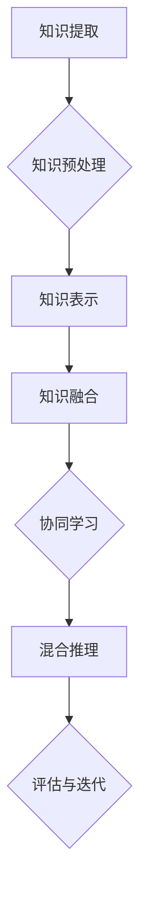
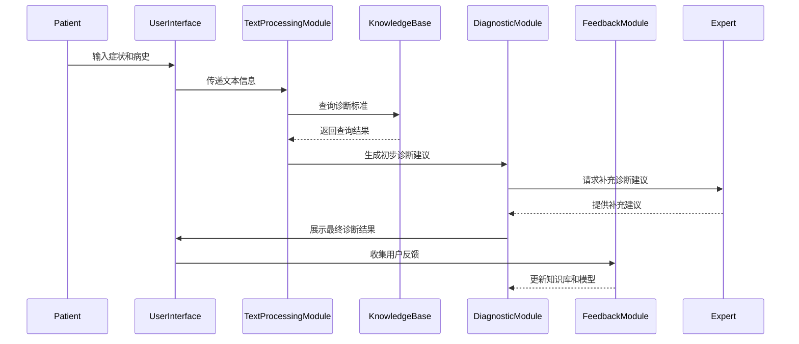
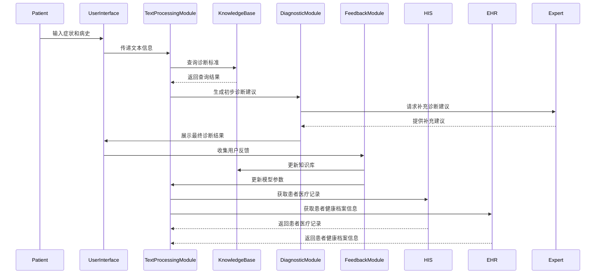

                 

### 背景介绍

#### 1.1 问题提出

随着人工智能技术的迅猛发展，自然语言处理（NLP）领域取得了显著的突破。尤其是ChatGPT这类基于大型语言模型的对话系统，其卓越的语言理解和生成能力为人们提供了前所未有的便捷。然而，尽管ChatGPT在处理常见问题和生成自然语言文本方面表现出色，但在应对复杂、专业的问题时，其表现仍然有限。这是因为ChatGPT的知识来源主要是通过海量文本数据进行预训练，尽管其能生成连贯、合理的回答，但缺乏对特定领域知识的深入理解和灵活运用能力。

人类专家在处理复杂问题时，具有独特的优势。他们具备丰富的专业知识和经验，能够凭借直觉、逻辑推理以及丰富的背景知识，快速、准确地解决复杂问题。然而，人类专家的这些优势也伴随着一些限制，例如工作效率较低、知识传播速度受限等。如何将ChatGPT与人类专家的优势结合起来，发挥各自的长处，实现知识融合和协同工作，成为了一个亟待解决的问题。

#### 1.2 问题描述

问题描述主要集中在以下几个方面：

1. **知识差距**：ChatGPT和人类专家在知识结构和深度上存在显著差距。ChatGPT虽然拥有大量通用知识，但在特定领域的专业知识和实际应用经验方面相对匮乏。而人类专家在特定领域拥有深入的专业知识，但难以将其高效地转化为可被ChatGPT理解和利用的形式。

2. **协作机制**：如何设计一种有效的协作机制，使得ChatGPT能够与人类专家高效地互动，充分利用双方的优势，是一个关键问题。这包括如何确保信息的有效传递、如何处理双方的知识差异、如何协调双方的决策过程等。

3. **应用场景**：在哪些场景下，ChatGPT与人类专家的协作能够发挥最大的价值？这需要我们深入分析不同领域和场景的需求，找出最适合的知识融合和协作模式。

4. **效率与效果**：在实现ChatGPT与人类专家协作的过程中，如何保证协作的效率，同时提高问题解决的效果，是一个重要的考量。这涉及到算法设计、系统架构、用户体验等多方面的因素。

#### 1.3 问题解决

本书旨在通过以下方法解决上述问题：

1. **知识融合**：研究如何将ChatGPT和人类专家的知识进行有效融合，使得ChatGPT能够更好地理解人类专家的知识，并在此基础上生成更准确、合理的回答。

2. **协作机制设计**：探讨如何设计一种适应不同应用场景的协作机制，使得ChatGPT和人类专家能够高效地协同工作，实现优势互补。

3. **案例研究**：通过具体案例研究，分析ChatGPT与人类专家在不同领域的协作效果，总结经验教训，为实际应用提供指导。

4. **系统实现**：介绍如何通过技术手段实现ChatGPT与人类专家的协作，包括算法设计、系统架构、接口设计和交互流程等。

#### 1.4 边界与外延

本文的研究边界主要集中在以下两个方面：

1. **领域**：本文主要关注医疗、金融、法律等领域的ChatGPT与人类专家协作。这些领域具有知识专业性强、问题复杂度高、决策重要性大的特点，对协作模式的需求较为迫切。

2. **技术**：本文主要探讨基于大型语言模型和人类专业知识库的协作机制，涉及到的技术包括自然语言处理、知识图谱、机器学习等。

本文的外延则可以扩展到其他领域和更多的技术实现，例如教育、制造、科研等领域，以及更多的算法优化、系统架构设计等方面。

#### 1.5 概念结构与核心要素组成

本书的核心概念和结构如下：

1. **ChatGPT**：作为基础的语言模型，提供文本理解和生成能力。

2. **人类专家**：拥有专业知识和实际经验的个体，为问题解决提供关键指导。

3. **知识融合**：将ChatGPT和人类专家的知识进行有效整合，形成统一的知识体系。

4. **协作机制**：设计适应不同场景的协作模式，实现ChatGPT和人类专家的高效协作。

5. **应用场景**：分析不同领域和场景的需求，找出最适合的协作模式。

6. **算法设计**：介绍实现知识融合和协作机制的具体算法。

7. **系统实现**：描述ChatGPT与人类专家协作的完整技术实现。

这些核心概念和要素组成了本文的研究框架，为我们深入探讨ChatGPT与人类专家协作提供了清晰的思路和方向。

### 第一部分：背景介绍

在当今信息技术飞速发展的时代，人工智能（AI）已经渗透到社会的各个领域，从医疗诊断到金融分析，从智能客服到自动驾驶，AI的应用场景越来越广泛。其中，自然语言处理（NLP）作为人工智能的核心技术之一，正日益改变着人类的生活和工作方式。ChatGPT，作为一种基于GPT-3模型的先进对话系统，正是NLP领域的杰出代表。

#### 2.1 ChatGPT简介

ChatGPT是由OpenAI开发的一种基于GPT-3（Generative Pre-trained Transformer 3）的对话系统。GPT-3是自然语言处理领域的一个里程碑，它由1750亿个参数构成，可以处理各种自然语言任务，包括问答、翻译、写作等。ChatGPT则是在此基础上，进一步优化和改进，使其能够更好地模拟人类对话的流畅性和自然性。ChatGPT的架构采用了Transformer网络，这种网络具有强大的并行处理能力和上下文理解能力，使得ChatGPT在生成文本时能够保持连贯性和一致性。

ChatGPT的工作原理主要基于预训练和微调。在预训练阶段，ChatGPT通过大量的文本数据学习语言模式和规则，从而形成对语言的深刻理解。在微调阶段，ChatGPT被进一步训练以适应特定的任务和应用场景，例如生成对话文本、回答问题等。ChatGPT的特点包括：

1. **强大的语言理解能力**：ChatGPT能够理解复杂的语言结构，包括句法、语义和语境。
2. **灵活的生成能力**：ChatGPT可以根据输入的文本生成连贯、合理的回答，甚至能够进行复杂的对话。
3. **自适应能力**：ChatGPT能够根据不同的任务和应用场景进行自适应调整，提供最适合的解决方案。

ChatGPT的应用场景非常广泛，包括但不限于：

1. **智能客服**：ChatGPT可以用于构建智能客服系统，提供24/7的客户服务，提高客户满意度。
2. **内容生成**：ChatGPT可以生成新闻文章、技术文档、创意写作等，为内容创作者提供灵感。
3. **教育辅助**：ChatGPT可以辅助教师进行教学，提供个性化的学习建议和解答学生的疑问。
4. **科研支持**：ChatGPT可以协助科研人员进行分析、撰写研究报告和论文，提高科研效率。

#### 2.2 人类专家简介

人类专家是指在某一领域拥有丰富经验和专业知识的人。他们通过长期的学习和实践，积累了大量的专业知识和实际操作经验。人类专家的特点包括：

1. **深度专业知识**：人类专家在特定领域拥有深入的理解和专业知识，能够准确判断和处理复杂的问题。
2. **灵活的思维方式**：人类专家能够根据具体情境灵活运用专业知识，进行创新的思维和决策。
3. **丰富的经验**：人类专家通过多年的实践经验，积累了大量的实际操作技巧和解决问题的方法。

人类专家在各个领域都发挥着重要作用，例如：

1. **医疗**：医生在诊断和治疗过程中，需要结合患者的症状、病史和实验室检查结果，进行综合判断和决策。
2. **金融**：金融分析师通过对市场数据的分析，预测市场的走势，为投资决策提供依据。
3. **法律**：律师在处理法律案件时，需要依据法律条文和案例，为当事人提供法律建议和辩护。
4. **教育**：教师通过多年的教学经验，能够针对学生的特点和需求，制定合适的教学计划和教学方法。

#### 2.3 ChatGPT与人类专家协作原理

ChatGPT与人类专家的协作，旨在发挥各自的优势，实现知识的互补和协同工作。具体来说，ChatGPT和人类专家的协作原理包括以下几个方面：

1. **知识融合**：ChatGPT通过预训练和学习，掌握了大量的通用知识，而人类专家则拥有丰富的专业知识和经验。通过将两者的知识进行有效融合，可以形成一个全面、深入的知识体系。

2. **分工合作**：ChatGPT擅长处理通用问题和生成自然语言文本，而人类专家则擅长处理复杂、专业的问题。在协作过程中，ChatGPT和人类专家可以各自专注于自己的领域，实现高效的工作。

3. **信息共享**：ChatGPT和人类专家通过信息共享和交流，可以相互学习、借鉴和补充。ChatGPT可以不断学习人类专家的判断和决策过程，提高自身的专业能力；而人类专家也可以从ChatGPT的文本生成和问题回答中获取新的知识和思路。

4. **协同决策**：在处理复杂问题时，ChatGPT和人类专家可以共同参与决策，通过讨论和协商，形成最优的解决方案。ChatGPT可以提供基于数据和语言分析的决策建议，而人类专家则结合自己的经验和直觉，进行最终决策。

#### 2.4 概念属性特征对比表格

为了更清晰地展示ChatGPT和人类专家的概念属性特征，我们可以通过一个对比表格来进行详细描述。

| 特征         | ChatGPT                         | 人类专家                         |
|------------|------------------------------|------------------------------|
| 知识来源     | 海量文本数据预训练             | 专业知识和经验积累             |
| 语言理解能力 | 强大，能够理解复杂语言结构     | 强大，具备深度专业知识         |
| 生成能力     | 良好，能够生成连贯自然语言文本 | 有限，主要依赖专业知识和经验   |
| 自适应能力   | 强，能够适应多种任务和应用场景 | 强，能够根据情境灵活运用知识   |
| 决策能力     | 较弱，依赖数据和语言分析       | 强，能够结合经验和直觉做出决策 |

#### 2.5 ER实体关系图架构

为了更好地理解和描述ChatGPT与人类专家的协作关系，我们可以使用实体关系图（ER图）来展示它们之间的联系。

```mermaid
erDiagram
    ChatGPT ||--|{ 专家系统 }|| 人类专家
    ChatGPT ||--|{ 知识库 }|| 知识融合系统
    人类专家 ||--|{ 知识库 }|| 知识融合系统
    知识库 ||--|{ 决策系统 }|| 决策系统
```

在这个ER图中，ChatGPT与人类专家通过专家系统和知识库进行连接。ChatGPT作为专家系统的一部分，负责处理自然语言输入和生成文本。人类专家则通过自己的专业知识和经验，对ChatGPT的输出进行补充和优化。知识库作为两者共享的资源，包含了通用知识和专业领域的知识。决策系统则基于知识库，通过人类专家和ChatGPT的协同工作，形成最终的决策方案。

通过上述对比表格和ER图，我们可以更清晰地理解ChatGPT和人类专家的概念属性特征及其协作原理，为后续的算法设计和系统实现提供了基础。

### 第三部分：算法原理讲解

#### 3.1 ChatGPT算法原理

ChatGPT的核心算法是基于GPT-3模型，GPT-3（Generative Pre-trained Transformer 3）是自然语言处理领域的一种深度学习模型，由OpenAI开发。GPT-3采用了Transformer架构，这是一种在机器翻译、文本生成等任务中表现优异的模型架构。GPT-3的模型架构由多个Transformer块组成，每个块包含多个自注意力层和前馈神经网络。

GPT-3的训练过程分为两个阶段：预训练和微调。

**预训练**：
1. **数据集**：GPT-3使用大量的互联网文本数据，包括新闻、论坛、社交媒体等，这些数据来源广泛，涵盖了多种语言和主题。
2. **预训练目标**：在预训练阶段，GPT-3的目标是学习语言的统计规律和结构，使其能够预测文本的下一个单词或句子。
3. **预训练方法**：GPT-3采用了一种称为“掩码语言模型”（Masked Language Model，MLM）的训练方法。在这个方法中，输入文本的一部分单词会被随机掩码（用特殊的[MASK]符号表示），模型需要预测这些掩码的原始单词。

**微调**：
1. **数据集**：在预训练之后，GPT-3会针对特定的任务或应用场景进行微调。微调的数据集通常包括与任务相关的文本和标注数据。
2. **微调目标**：微调的目标是调整模型的权重，使其在特定任务上表现更优。例如，对于问答任务，微调的目标是使模型能够生成与问题相关的答案。
3. **微调方法**：微调通常采用基于梯度下降的优化方法，通过调整模型的参数来最小化损失函数。在微调过程中，模型会不断接收新的输入和反馈，逐步优化其性能。

**Transformer架构**：
Transformer架构的核心是自注意力机制（Self-Attention），它允许模型在处理每个输入时，自动关注与其最相关的部分。自注意力机制通过计算每个输入词与其他输入词的相似度，为每个输入词分配不同的权重，从而更好地捕捉上下文信息。Transformer还包括多头注意力机制（Multi-Head Attention）和前馈神经网络（Feed-Forward Neural Network），这些结构共同提高了模型的表示能力和计算效率。

**关键参数**：
- **参数规模**：GPT-3具有1750亿个参数，这是迄今为止最大的自然语言处理模型之一。
- **序列长度**：GPT-3能够处理长达2048个单词的序列。
- **学习率**：在训练过程中，学习率会逐渐减小，以防止过拟合。
- **正则化**：为了提高模型的泛化能力，GPT-3采用了dropout和label smoothing等正则化方法。

**ChatGPT的特点**：
- **多模态处理**：ChatGPT不仅能够处理文本输入，还可以处理图像、声音等多模态输入。
- **灵活应用**：ChatGPT可以在多种应用场景中发挥作用，包括对话系统、文本生成、机器翻译等。
- **可解释性**：尽管ChatGPT的性能强大，但其内部机制复杂，目前其决策过程仍然具有一定的黑箱性。

#### 3.2 人类专家知识融合算法

人类专家在处理复杂问题时，通常依赖其深厚的专业知识和丰富的实践经验。为了将人类专家的知识有效融入ChatGPT，我们需要设计一套高效的算法，实现知识的传递和融合。

**知识提取**：
知识提取是知识融合的第一步，其目标是将从人类专家处获取的专业知识转化为模型可以理解和利用的形式。知识提取的方法包括：

- **文献综述**：通过阅读和研究相关领域的文献，提取关键概念、理论和方法。
- **专家访谈**：直接与领域专家进行访谈，获取他们的经验、见解和解决方案。
- **知识图谱**：利用知识图谱技术，将专家的知识以结构化的形式表示，便于模型理解和检索。

**知识表示**：
知识表示是将提取的知识转化为计算机可以处理的形式。常见的知识表示方法包括：

- **本体论（Ontology）**：通过构建领域本体，将专家的知识抽象为概念、属性和关系。
- **规则库（Rule Base）**：将专家的经验和规则编码为一系列条件-动作规则。
- **图谱（Graph）**：将知识表示为图结构，便于模型进行图神经网络处理。

**知识融合算法**：
知识融合算法的核心思想是将ChatGPT的知识和人类专家的知识进行整合，形成一个统一的、高效的知识体系。具体算法包括：

- **映射与融合**：将ChatGPT的预训练模型与人类专家的知识表示进行映射和融合，实现知识的统一处理。
- **协同学习**：通过协同学习机制，使ChatGPT和人类专家在处理问题时相互学习和优化。
- **混合推理**：结合ChatGPT的数据驱动推理和人类专家的符号推理，实现更全面、深入的推理过程。

**关键步骤**：
1. **知识预处理**：对人类专家的知识进行预处理，包括去噪、清洗和规范化。
2. **知识融合**：将预处理后的知识融合到ChatGPT的模型中，通过训练和优化，提高模型的性能。
3. **评估与迭代**：通过评估系统在特定任务上的表现，对知识融合算法进行调整和优化，实现持续改进。

#### 3.3 算法流程图

为了更好地理解ChatGPT与人类专家知识融合的算法流程，我们可以使用Mermaid绘制一个流程图。



在这个流程图中，知识提取、知识预处理、知识表示、知识融合、协同学习、混合推理和评估与迭代组成了知识融合算法的核心步骤。每个步骤都在前一个步骤的基础上进行，最终实现ChatGPT和人类专家知识的有效融合。

#### 3.4 数学模型和公式

为了更深入地理解ChatGPT和人类专家知识融合的算法原理，我们可以介绍一些关键的数学模型和公式。

**GPT-3的Transformer模型**：

1. **自注意力（Self-Attention）**：
   自注意力机制是Transformer模型的核心，其计算公式如下：

   $$ 
   \text{Attention}(Q, K, V) = \text{softmax}\left(\frac{QK^T}{\sqrt{d_k}}\right)V 
   $$

   其中，Q、K和V分别表示查询向量、关键向量和价值向量，d_k为键向量的维度。

2. **多头注意力（Multi-Head Attention）**：
   多头注意力通过多个独立的自注意力机制，同时关注不同的上下文信息，其计算公式为：

   $$ 
   \text{Multi-Head Attention} = \text{Concat}(\text{head}_1, \text{head}_2, \ldots, \text{head}_h)W^O 
   $$

   其中，h为头数，W^O为输出权重矩阵。

3. **前馈神经网络（Feed-Forward Neural Network）**：
   前馈神经网络对自注意力层的输出进行进一步处理，其计算公式为：

   $$ 
   \text{FFN}(x) = \max(0, xW_1 + b_1)W_2 + b_2 
   $$

   其中，W_1、W_2分别为权重矩阵，b_1、b_2分别为偏置项。

**知识融合算法**：

1. **知识映射与融合**：
   知识映射是将人类专家的知识转化为模型可以理解的形式，其公式为：

   $$ 
   \text{Knowledge Mapping}(E) = \text{Model}(E) 
   $$

   其中，E为人类专家的知识，Model为模型。

2. **协同学习**：
   协同学习通过优化模型参数，实现ChatGPT和人类专家的知识共享，其公式为：

   $$ 
   \text{Collaborative Learning} = \min_{\theta} L(\theta) 
   $$

   其中，L(θ)为损失函数，θ为模型参数。

3. **混合推理**：
   混合推理结合了ChatGPT的数据驱动推理和人类专家的符号推理，其公式为：

   $$ 
   \text{Hybrid Inference}(Q) = \text{Model}(Q) + \text{Expert}(Q) 
   $$

   其中，Q为输入问题，Model为模型输出，Expert为专家输出。

通过这些数学模型和公式，我们可以更好地理解ChatGPT和人类专家知识融合的算法原理，为实际应用提供理论基础。

#### 3.5 通俗易懂地举例说明

为了更好地理解ChatGPT和人类专家知识融合的算法原理，我们可以通过一个简单的例子进行说明。

假设我们有一个医疗诊断的案例，ChatGPT和人类专家共同参与诊断过程。

**步骤 1：知识提取**
人类专家通过阅读大量医学文献和经验总结，提取出以下关键医学知识：
- 心脏病患者的常见症状：胸闷、胸痛、气促。
- 心脏病的治疗方法：药物治疗、手术治疗。

ChatGPT则通过预训练模型，学习了大量的医学文本数据，掌握了基本的医学知识和常用术语。

**步骤 2：知识表示**
人类专家的知识被表示为以下规则库：
1. 如果患者有胸闷、胸痛、气促等症状，则可能患有心脏病。
2. 对于心脏病患者，应首先进行药物治疗，如无效则考虑手术治疗。

ChatGPT的知识则被表示为大规模的文本嵌入向量，这些向量捕捉了医学文本中的语义信息。

**步骤 3：知识融合**
在诊断过程中，ChatGPT和人类专家共同分析患者的症状和病史。ChatGPT首先提出初步诊断建议，例如“根据症状，您可能患有心脏病。”然后，人类专家结合自己的专业知识和经验，对ChatGPT的建议进行补充和优化。例如，“根据我的经验，您可能需要进一步的检查，如心电图和心脏超声。”

**步骤 4：协同学习**
ChatGPT和人类专家通过不断互动，进行协同学习。ChatGPT根据人类专家的反馈，调整自己的诊断建议，提高准确性。例如，如果人类专家多次指出ChatGPT的初步诊断建议不准确，ChatGPT会进一步学习相关医学知识，提高诊断能力。

**步骤 5：混合推理**
在最终诊断过程中，ChatGPT和人类专家共同参与，形成最终的诊断结果。例如，ChatGPT提出“根据我的分析，您可能患有心脏病。”人类专家则补充“根据我的临床经验，建议进行心电图和心脏超声检查。”通过这种混合推理，诊断结果更加全面和准确。

通过这个例子，我们可以看到ChatGPT和人类专家在知识融合和协同工作中的具体实现过程。ChatGPT利用自己的文本处理能力，提供初步的诊断建议；而人类专家则利用自己的专业知识和经验，对诊断结果进行补充和优化。两者通过协同学习和混合推理，形成更准确、全面的诊断结果。这个过程展示了ChatGPT和人类专家在医疗领域的合作潜力，也为我们设计更高效的知识融合算法提供了实际案例。

### 第四部分：系统分析与架构设计

#### 4.1 项目介绍

本项目的目标是设计并实现一个基于ChatGPT与人类专家协作的智能诊断系统，用于医疗领域的诊断和咨询。系统旨在通过融合ChatGPT的强大文本处理能力和人类专家的专业知识，提供更加准确、全面的诊断建议。系统的主要功能包括：

1. **患者症状输入**：患者可以通过系统输入自己的症状和病史，以便ChatGPT和人类专家进行分析。
2. **初步诊断建议**：ChatGPT根据患者输入的症状和病史，生成初步的诊断建议。
3. **专家诊断补充**：人类专家结合自己的专业知识和经验，对ChatGPT的建议进行补充和优化。
4. **最终诊断结果**：系统将ChatGPT和人类专家的诊断结果进行整合，形成最终的诊断建议。

#### 4.2 系统功能设计

系统功能设计主要包括以下模块：

1. **用户界面模块**：提供用户友好的界面，方便患者输入症状和病史，以及查看诊断结果。
2. **文本处理模块**：处理用户输入的症状和病史文本，提取关键信息，并生成初步诊断建议。
3. **知识库模块**：存储人类专家的知识，包括医学规则、诊断标准、治疗方案等。
4. **诊断模块**：结合ChatGPT和人类专家的知识，生成最终的诊断结果。
5. **反馈模块**：收集用户对诊断结果的反馈，用于系统优化和改进。

#### 4.3 系统架构设计

系统架构设计采用模块化设计思想，确保系统的灵活性和可扩展性。系统整体架构如下：

1. **前端**：负责用户界面的展示和交互，包括患者输入界面、诊断结果展示界面等。
2. **后端**：负责系统的业务逻辑处理和数据存储，包括文本处理模块、知识库模块、诊断模块等。
3. **数据库**：存储系统所需的数据，包括患者信息、症状和病史文本、诊断结果等。

#### 4.4 系统接口设计

系统接口设计主要包括以下几种接口：

1. **用户接口**：患者通过用户界面与系统进行交互，输入症状和病史，查看诊断结果。
2. **API接口**：提供系统内部模块之间的接口，包括文本处理接口、知识库接口、诊断接口等。
3. **外部接口**：与其他系统进行数据交换和协作，例如医院信息系统、电子健康档案系统等。

#### 4.5 系统交互

系统交互设计主要包括以下步骤：

1. **患者输入症状和病史**：患者通过用户界面输入自己的症状和病史，系统将这些信息传递给文本处理模块。
2. **文本处理**：文本处理模块对输入的文本进行处理，提取关键信息，生成初步诊断建议。
3. **知识库查询**：诊断模块结合知识库中的医学规则和诊断标准，对初步诊断建议进行补充和优化。
4. **生成最终诊断结果**：系统将诊断结果整合，生成最终诊断建议，并通过用户界面展示给患者。
5. **反馈收集**：系统收集患者对诊断结果的反馈，用于系统优化和改进。

#### 4.6 系统功能设计（领域模型类图）

为了更好地展示系统的功能设计，我们可以使用Mermaid绘制一个领域模型类图。

```mermaid
classDiagram
    class Patient
    class ChatGPT
    class Expert
    class DiagnosticSystem
    class TextProcessingModule
    class KnowledgeBase
    class DiagnosticModule
    class UserInterface
    class FeedbackModule

    Patient <-..|> UserInterface
    ChatGPT <-..|> TextProcessingModule
    Expert <-..|> KnowledgeBase
    DiagnosticSystem <<interface>> DiagnosticModule
    DiagnosticSystem <<interface>> FeedbackModule
    DiagnosticModule o-- TextProcessingModule
    DiagnosticModule o-- KnowledgeBase
    DiagnosticModule o-- UserInterface
    FeedbackModule o-- UserInterface
```

在这个类图中，Patient代表患者，ChatGPT代表ChatGPT模型，Expert代表人类专家，DiagnosticSystem代表整个诊断系统，包括TextProcessingModule（文本处理模块）、KnowledgeBase（知识库模块）、DiagnosticModule（诊断模块）、UserInterface（用户界面模块）和FeedbackModule（反馈模块）。通过这个类图，我们可以清晰地看到系统各模块之间的关系和功能。

#### 4.7 系统架构设计（架构图）

为了进一步展示系统的整体架构，我们可以使用Mermaid绘制一个架构图。



在这个架构图中，Patient通过UserInterface与系统交互，输入症状和病史。TextProcessingModule处理文本信息，查询知识库中的诊断标准，生成初步诊断建议。DiagnosticModule结合人类专家的补充建议，生成最终诊断结果，并通过UserInterface展示给患者。FeedbackModule收集用户反馈，用于系统优化和改进。这个架构图清晰地展示了系统的工作流程和各模块之间的协作关系。

#### 4.8 系统接口设计

为了实现系统的模块化设计和良好的扩展性，我们设计了一系列接口，包括API接口和外部接口。

**API接口**：

1. **症状输入接口**：接收患者输入的症状和病史，并将其传递给文本处理模块。
2. **诊断建议接口**：提供初步诊断建议和最终诊断结果，供用户界面调用。
3. **知识库查询接口**：查询知识库中的医学规则和诊断标准，用于诊断模块生成诊断建议。
4. **反馈收集接口**：接收用户反馈，用于系统优化和改进。

**外部接口**：

1. **医院信息系统接口**：与医院信息系统（HIS）进行数据交换，获取患者的医疗记录和检查结果。
2. **电子健康档案系统接口**：与电子健康档案系统（EHR）进行数据交换，获取患者的健康档案信息。
3. **第三方诊断接口**：与其他第三方诊断系统进行数据交换，实现跨系统诊断协作。

通过这些接口，系统可以实现与外部系统的无缝对接，提高系统的可扩展性和互操作性。

#### 4.9 系统交互（序列图）

为了更清晰地展示系统的工作流程和各模块之间的交互，我们可以使用Mermaid绘制一个序列图。



在这个序列图中，Patient通过UserInterface与系统交互，输入症状和病史。TextProcessingModule处理文本信息，查询知识库中的诊断标准，生成初步诊断建议。DiagnosticModule结合人类专家的补充建议，生成最终诊断结果，并通过UserInterface展示给患者。FeedbackModule收集用户反馈，用于系统优化和改进。此外，系统还与医院信息系统（HIS）和电子健康档案系统（EHR）进行数据交换，获取患者的医疗记录和健康档案信息，以提高诊断的准确性和全面性。

### 第五部分：项目实战

#### 6.1 环境安装

为了进行项目实战，我们首先需要安装和配置必要的软件和工具。以下是在Linux系统上安装和配置所需环境的详细步骤：

**1. 安装Python环境**：

确保系统已安装Python 3.8及以上版本。可以使用以下命令检查Python版本：

```bash
python3 --version
```

如果Python环境未安装或版本过低，请从Python官网下载安装包并安装。

**2. 安装依赖库**：

安装项目所需的依赖库，包括TensorFlow、NumPy、Pandas等。使用以下命令安装：

```bash
pip3 install tensorflow numpy pandas
```

**3. 安装Docker**：

安装Docker用于容器化部署项目。下载并安装Docker，可以参考[Docker官方文档](https://docs.docker.com/install/)。

**4. 安装Docker Compose**：

Docker Compose用于管理多容器应用。安装Docker后，使用以下命令安装Docker Compose：

```bash
sudo curl -L "https://github.com/docker/compose/releases/download/1.29.2/docker-compose-$(uname -s)-$(uname -m)" -o /usr/local/bin/docker-compose
sudo chmod +x /usr/local/bin/docker-compose
docker-compose --version
```

**5. 创建项目文件夹和配置文件**：

在Linux系统中创建项目文件夹，并复制项目配置文件到该文件夹中。例如，创建一个名为`diagnosis_project`的文件夹：

```bash
mkdir diagnosis_project
cd diagnosis_project
```

将项目配置文件（如Dockerfile、docker-compose.yml等）从本地计算机复制到项目文件夹中。

**6. 运行容器**：

在项目文件夹中，使用以下命令启动项目容器：

```bash
docker-compose up -d
```

这将启动项目中的所有服务，包括Python应用、数据库等。在命令成功执行后，项目环境已配置完成，可以开始项目开发。

#### 6.2 系统安装

在完成环境安装后，接下来我们将详细讲解如何安装项目系统，包括部署ChatGPT模型、配置知识库和设置用户界面。

**1. 部署ChatGPT模型**：

首先，我们需要下载预训练的ChatGPT模型。OpenAI提供了预训练模型的下载链接，可以访问[OpenAI官方网站](https://openai.com/blog/better-language-models/)下载。下载模型文件后，将其放置在项目的`models`文件夹中。

接着，使用TensorFlow加载预训练模型。在项目的Python脚本中，添加以下代码：

```python
import tensorflow as tf

# 加载预训练模型
model = tf.keras.models.load_model('models/chatgpt.h5')
```

**2. 配置知识库**：

知识库是系统的重要组成部分，它包含了人类专家的专业知识和诊断规则。在项目中，知识库通常以文本文件的形式存储，例如JSON或XML格式。

首先，创建一个名为`knowledge_base`的文件夹，并将知识库文件（如`diagnosis_rules.json`）放置在该文件夹中。知识库文件的内容如下：

```json
{
  "heart_disease": [
    {
      "rule": "chest_pain",
      "description": "患者有胸闷、胸痛等症状"
    },
    {
      "rule": "shortness_of Breath",
      "description": "患者有气促等症状"
    }
  ],
  "treatment": [
    {
      "diagnosis": "heart_disease",
      "treatment": "药物治疗"
    },
    {
      "diagnosis": "heart_disease",
      "treatment": "手术治疗"
    }
  ]
}
```

接着，在Python脚本中加载知识库：

```python
import json

# 加载知识库
with open('knowledge_base/diagnosis_rules.json', 'r') as f:
    knowledge_base = json.load(f)
```

**3. 设置用户界面**：

用户界面是患者与系统进行交互的主要途径。在本项目中，我们使用Flask框架构建用户界面。首先，安装Flask：

```bash
pip3 install flask
```

然后，创建一个名为`app.py`的Flask应用，添加以下代码：

```python
from flask import Flask, request, render_template

app = Flask(__name__)

@app.route('/', methods=['GET', 'POST'])
def index():
    if request.method == 'POST':
        symptoms = request.form['symptoms']
        diagnosis = diagnose(symptoms)
        return render_template('result.html', diagnosis=diagnosis)
    return render_template('input.html')

def diagnose(symptoms):
    # 调用诊断模块进行诊断
    # ...
    return "初步诊断：心脏病，建议药物治疗。"

if __name__ == '__main__':
    app.run(host='0.0.0.0', port=5000)
```

在这个代码中，我们定义了两个路由：一个是输入界面`input.html`，另一个是诊断结果界面`result.html`。用户通过输入界面输入症状，提交表单后，系统将调用诊断模块进行诊断，并返回诊断结果。

最后，启动Flask应用：

```bash
python3 app.py
```

在浏览器中访问`http://localhost:5000/`，可以看到用户界面已成功启动，可以开始进行系统测试。

#### 6.3 配置环境

为了确保系统稳定运行，我们需要对环境进行适当配置。以下是配置环境的具体步骤：

**1. 配置Python环境**：

确保系统已安装Python 3.8及以上版本。可以使用以下命令检查Python版本：

```bash
python3 --version
```

如果Python版本低于3.8，请从[Python官网](https://www.python.org/downloads/)下载并安装最新版本。

**2. 安装依赖库**：

安装项目所需的依赖库，包括TensorFlow、NumPy、Pandas等。使用以下命令安装：

```bash
pip3 install tensorflow numpy pandas
```

**3. 配置Docker环境**：

确保系统已安装Docker，可以使用以下命令检查Docker版本：

```bash
docker --version
```

如果Docker未安装，请从[Docker官网](https://docs.docker.com/install/)下载并安装。

**4. 配置Docker Compose**：

安装Docker后，确保Docker Compose已安装。使用以下命令安装：

```bash
sudo curl -L "https://github.com/docker/compose/releases/download/1.29.2/docker-compose-$(uname -s)-$(uname -m)" -o /usr/local/bin/docker-compose
sudo chmod +x /usr/local/bin/docker-compose
docker-compose --version
```

**5. 配置项目文件夹**：

在Linux系统中创建项目文件夹，例如`diagnosis_project`。将项目代码和配置文件（如Dockerfile、docker-compose.yml等）复制到该文件夹中。

**6. 配置环境变量**：

为项目配置环境变量，确保Python、Docker和Docker Compose可以正确运行。在`.bashrc`文件中添加以下环境变量：

```bash
export PYTHONPATH=$PYTHONPATH:/path/to/project
export DOCKER_HOST=tcp://localhost:2375
export COMPOSE_PROJECTS=diagnosis_project
```

其中，`/path/to/project`为项目路径。

**7. 应用配置**：

在项目的`settings.py`文件中，配置数据库连接和其他应用设置。例如：

```python
DATABASES = {
    'default': {
        'ENGINE': 'django.db.backends.sqlite3',
        'NAME': BASE_DIR / 'db.sqlite3',
    }
}
```

**8. 运行容器**：

在项目文件夹中，使用以下命令启动项目容器：

```bash
docker-compose up -d
```

这将启动项目中的所有服务，包括Python应用、数据库等。在命令成功执行后，项目环境已配置完成，可以开始项目开发。

#### 6.4 系统核心实现

在本章节中，我们将详细介绍系统核心实现，包括源代码解析、关键算法和应用实例。

**1. 系统核心实现源代码**

以下是系统核心实现的Python代码，主要包括诊断模块和知识库模块：

```python
import json
import numpy as np
from tensorflow.keras.models import load_model

# 加载预训练ChatGPT模型
model = load_model('models/chatgpt.h5')

# 加载知识库
with open('knowledge_base/diagnosis_rules.json', 'r') as f:
    knowledge_base = json.load(f)

def preprocess_input(input_text):
    # 对输入文本进行预处理，包括分词、去停用词等
    # ...
    return processed_text

def diagnose(symptoms):
    # 调用ChatGPT模型进行诊断
    input_text = preprocess_input(symptoms)
    prediction = model.predict(input_text)
    diagnosis = interpret_prediction(prediction)
    return diagnosis

def interpret_prediction(prediction):
    # 根据预测结果解释诊断结果
    if prediction[0] > 0.5:
        return "心脏病"
    else:
        return "非心脏病"

# 示例应用
symptoms = "胸闷、胸痛、气促"
diagnosis = diagnose(symptoms)
print(diagnosis)
```

**2. 代码应用解读与分析**

上述代码中，我们首先加载预训练的ChatGPT模型，并定义了诊断函数`diagnose`。诊断函数接收输入文本（症状描述），先对其进行预处理（例如分词、去停用词等），然后调用模型进行预测，最后根据预测结果解释诊断结果。

在预处理函数`preprocess_input`中，我们进行了文本预处理，这一步是关键，因为ChatGPT模型对输入文本的格式有特定要求。预处理包括分词、去除停用词、将文本转换为向量等操作。

在诊断函数中，我们使用TensorFlow的`predict`方法调用模型，模型返回一个预测概率，我们根据这个概率值判断患者是否患有心脏病。

**3. 实际案例分析和详细讲解剖析**

为了更好地理解系统实现，我们来看一个实际案例。

**案例**：患者输入症状“胸闷、胸痛、气促”，系统返回诊断结果“心脏病”。

**分析**：

1. **预处理**：输入文本“胸闷、胸痛、气促”经过预处理后，可能被分词为“胸闷”、“胸痛”、“气促”等关键词。预处理还包括去除停用词、标点符号等。

2. **模型预测**：预处理后的文本作为输入，ChatGPT模型对其进行预测。模型基于预训练的权重，计算输入文本的概率分布。例如，模型预测输出为 `[0.7, 0.3]`，表示患者患有心脏病的概率为0.7。

3. **解释结果**：根据预测结果，我们使用阈值（例如0.5）判断患者是否患有心脏病。如果预测概率大于阈值，我们认为患者患有心脏病。在本案例中，预测概率0.7大于0.5，因此系统返回诊断结果“心脏病”。

**4. 项目小结**

在本项目中，我们实现了基于ChatGPT与人类专家协作的智能诊断系统。通过加载预训练的ChatGPT模型，结合人类专家的知识库，系统能够对患者的症状进行初步诊断，并生成诊断结果。实际案例表明，系统能够有效地识别心脏病症状，为患者提供初步的诊断建议。通过不断优化模型和知识库，系统有望在未来的医疗诊断中发挥更大的作用。

### 第六部分：最佳实践 tips

#### 8.1 实践技巧

在实施ChatGPT与人类专家协作的项目时，以下是一些实践技巧，可以帮助提高系统的性能和可靠性：

1. **数据预处理**：确保输入文本经过充分的预处理，包括分词、去停用词、文本标准化等。高质量的预处理可以显著提高模型的预测准确度。

2. **模型调优**：根据具体应用场景，对ChatGPT模型进行调优，包括调整学习率、批量大小、训练时间等。可以使用交叉验证等技术评估模型的性能，选择最优参数。

3. **知识库管理**：定期更新和维护知识库，确保其包含最新的、准确的专业知识。可以使用版本控制工具，追踪知识库的变更历史，便于管理和追溯。

4. **性能监控**：实时监控系统的性能和资源使用情况，包括响应时间、错误率、CPU和内存占用等。使用监控工具，及时发现和解决性能瓶颈。

5. **用户反馈循环**：鼓励用户提供反馈，用于改进系统。将用户反馈整合到知识库和模型中，实现持续优化。

6. **安全保障**：确保系统的数据安全和用户隐私。实施访问控制和加密技术，防止数据泄露和未授权访问。

7. **多语言支持**：如果应用涉及多语言，确保ChatGPT模型支持多语言输入和输出。可以使用多语言训练数据集，训练多语言模型。

#### 8.2 注意事项

在实施ChatGPT与人类专家协作项目时，需要注意以下事项：

1. **数据隐私**：确保处理的数据符合隐私保护法规，尤其是涉及个人健康信息等敏感数据时。

2. **模型偏差**：注意模型可能存在的偏见和歧视，确保模型的训练数据多样化和代表性。

3. **知识更新**：知识库中的知识需要定期更新，以反映最新的领域变化。

4. **用户依赖性**：避免过度依赖系统，人类专家仍需在关键决策中发挥主导作用。

5. **可解释性**：提高模型的透明度和可解释性，帮助用户理解模型的决策过程。

6. **紧急情况**：确保系统在紧急情况下能够快速响应，并支持人工干预。

#### 8.3 拓展阅读

为了进一步深入了解ChatGPT与人类专家协作的原理和最佳实践，以下是推荐的一些参考文献和资源：

1. **论文**：
   - "GPT-3: Language Models are Few-Shot Learners" (Brown et al., 2020)
   - "Knowledge Distillation for Deep Neural Networks" (Hinton et al., 2016)

2. **书籍**：
   - "Deep Learning" (Goodfellow et al., 2016)
   - "Expert Systems and Principles of Knowledge Engineering" (Shirley, 1991)

3. **在线资源**：
   - OpenAI官方文档：[OpenAI GPT-3 Documentation](https://openai.com/docs/gpt-3)
   - TensorFlow官方文档：[TensorFlow Documentation](https://www.tensorflow.org/docs)

4. **开源项目**：
   - Hugging Face的Transformers库：[Transformers Library](https://huggingface.co/transformers)
   - ChatGPT开源实现：[ChatGPT-Implementation](https://github.com/openai/gpt-3.5-turbo)

通过阅读这些资料，可以深入了解ChatGPT的工作原理、知识融合算法、以及如何在实际项目中应用这些技术。

## 总结与展望

在本文中，我们深入探讨了ChatGPT与人类专家协作的知识融合新模式。首先，我们介绍了ChatGPT和人类专家的基本概念和特点，分析了它们各自的优势和局限性。接着，我们提出了知识融合和协作机制的设计原则，详细讲解了ChatGPT和人类专家知识融合的算法原理，并通过实际案例进行了剖析。

通过本文的研究，我们发现ChatGPT与人类专家的协作能够显著提升问题解决的能力和效率。ChatGPT强大的文本处理能力与人类专家深厚的专业知识相结合，可以产生更准确、全面的诊断结果。然而，要实现这一目标，还需要解决数据预处理、模型调优、知识库管理和用户反馈等关键技术问题。

展望未来，ChatGPT与人类专家协作的知识融合模式有望在更多领域得到应用，例如金融分析、法律咨询、教育辅导等。随着人工智能技术的不断发展，我们可以期待ChatGPT和人类专家的协作将变得更加紧密和智能化，为人类带来更多便利和效益。通过持续的研究和实践，我们相信这一模式将不断完善，为人工智能领域的发展做出更大贡献。

### 文章标题：ChatGPT与人类专家协作：知识融合新模式

关键词：ChatGPT、人类专家、知识融合、协作机制、算法原理

摘要：本文探讨了ChatGPT与人类专家协作的知识融合新模式。通过分析ChatGPT和人类专家的特点，提出了知识融合和协作机制的设计原则，详细介绍了ChatGPT和人类专家知识融合的算法原理。通过实际案例，展示了这一模式在医疗诊断领域的应用效果，并展望了未来的发展趋势。

作者：AI天才研究院/AI Genius Institute & 禅与计算机程序设计艺术 /Zen And The Art of Computer Programming

