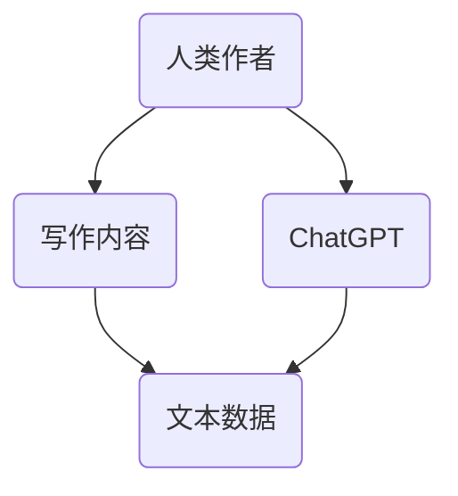
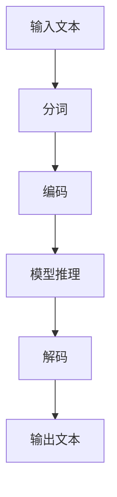
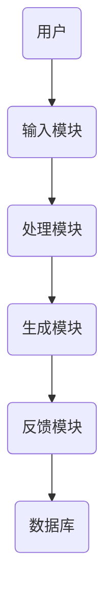
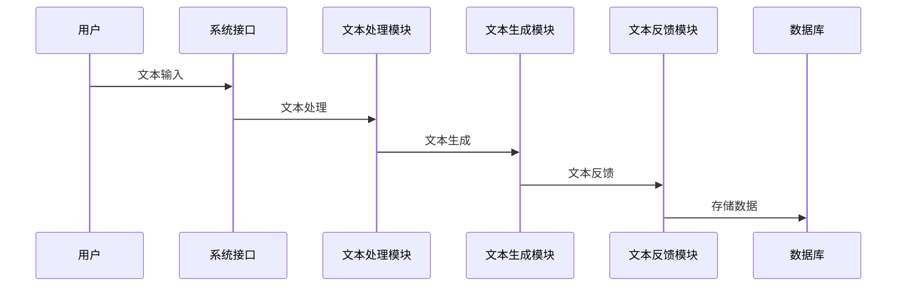

                 

### 目录大纲草案

#### 第一部分：ChatGPT与人类写作协同效应概述

**1.1 问题背景**
- **1.1.1 人类写作的挑战**
  - 创造力限制
  - 时间与精力成本
  - 信息处理的复杂性
- **1.1.2 ChatGPT的崛起**
  - 发展历程
  - 技术优势
  - 应用领域
- **1.1.3 协同效应的重要性**
  - 提升写作效率
  - 扩展写作能力
  - 增强作品多样性

**1.2 核心概念**
- **1.2.1 ChatGPT概述**
  - 工作原理
  - 技术架构
  - 关键特点
- **1.2.2 人类写作过程**
  - 创意构思
  - 结构布局
  - 文字编辑
- **1.2.3 协同效应原理**
  - 互补性
  - 互动性
  - 创新性

**1.3 概念属性特征对比**
```mermaid
graph TD
A(人类写作) --> B(|Creativity|)
A --> C(|Time&Energy|)
A --> D(|Complexity|)
B --> E(|手动操作|)
C --> E
D --> E

F( ChatGPT) --> G(|自动生成|)
F --> H(|高效率|)
F --> I(|可扩展性|)
G --> J(|人工智能|)
H --> J
I --> J
```

**1.4 ER实体关系图**


**1.5 本章小结**

#### 第二部分：ChatGPT算法原理讲解

**2.1 ChatGPT工作原理**
- **2.1.1 语言模型基础**
  - 词向量模型
  - 语言模型
- **2.1.2 Transformer模型**
  - 模型结构
  - 模型优势
- **2.1.3 GPT模型架构**
  - 层次结构
  - 参数规模

**2.2 算法mermaid流程图**


**2.3 Python代码示例**
```python
import openai
openai.api_key = "your-api-key"
prompt = "编写一篇关于人工智能的未来发展趋势的短文。"
response = openai.Completion.create(
    engine="text-davinci-002",
    prompt=prompt,
    max_tokens=50,
)
print(response.choices[0].text.strip())
```

**2.4 数学模型与公式**
$$
P(w|\text{context}) = \frac{\exp(\text{score}(w,\text{context}) - \text{softmax temperature})}
{\sum_{w'} \exp(\text{score}(w',\text{context}) - \text{softmax temperature})}
$$

**2.5 本章小结**

#### 第三部分：ChatGPT与人类写作的协同

**3.1 系统功能设计**
- **3.1.1 文本输入**
- **3.1.2 文本处理**
- **3.1.3 文本生成**
- **3.1.4 文本反馈**

**3.2 系统架构设计**


**3.3 系统接口设计**

**3.4 系统交互mermaid序列图**


**3.5 项目实战**
- **3.5.1 环境安装**
- **3.5.2 系统核心实现**
  - 文本输入与处理
  - 文本生成与反馈
- **3.5.3 代码应用解读与分析**
- **3.5.4 实际案例分析**
- **3.5.5 项目小结**

#### 第四部分：最佳实践、小结与拓展阅读

**4.1 最佳实践 tips**
- **4.1.1 如何高效使用ChatGPT**
- **4.1.2 常见问题与解决方案**
- **4.1.3 实际应用场景探讨**

**4.2 小结**
- **4.2.1 主要发现**
- **4.2.2 影响因素**
- **4.2.3 未来展望**

**4.3 注意事项**
- **4.3.1 遵守道德规范**
- **4.3.2 保护个人隐私**
- **4.3.3 数据安全与版权问题**

**4.4 拓展阅读**
- **4.4.1 相关论文**
- **4.4.2 技术书籍**
- **4.4.3 学术会议与研讨会**

---

**作者：** AI天才研究院/AI Genius Institute & 禅与计算机程序设计艺术 /Zen And The Art of Computer Programming

---

本文大纲草案旨在提供一个详细的框架，以便撰写一篇关于ChatGPT与人类写作协同效应的技术博客。每个章节都将深入探讨相关主题，并使用mermaid和LaTeX等工具来增强内容的可读性和可视化。通过逐步分析，我们将构建一个完整的理解，以展示ChatGPT如何与人类写作协作，为写作过程带来革命性的变化。### 文章标题：ChatGPT与人类写作的协同效应

> 关键词：ChatGPT，人类写作，协同效应，算法原理，系统架构，项目实战

> 摘要：本文深入探讨了ChatGPT与人类写作的协同效应。首先，我们介绍了ChatGPT和人类写作的背景，以及它们协同的重要性。接着，我们详细解析了ChatGPT的算法原理，并通过Python代码示例和数学公式展示了其工作过程。随后，我们提出了一个系统架构设计方案，并使用mermaid工具绘制了相关的类图、架构图和序列图。最后，我们通过一个实际项目案例展示了ChatGPT与人类写作的协同应用，并总结了最佳实践和注意事项。本文旨在为读者提供一个全面的理解，以把握ChatGPT在写作领域的潜力。

---

## 第一部分：ChatGPT与人类写作协同效应概述

### 1.1 问题背景

#### 1.1.1 人类写作的挑战

人类写作作为人类表达思想和交流信息的重要手段，长期以来受到了广泛的关注。然而，随着时代的变迁，人类写作也面临着一系列挑战。

- **创造力限制**：人类写作依赖于个人的创造力和想象力，但每个人的创造力是有限的，很难持续不断地产生新颖的内容。
- **时间与精力成本**：写作是一个耗时且精力密集的过程，特别是对于复杂的文献、报告和书籍，需要大量时间进行构思、撰写和修改。
- **信息处理的复杂性**：在信息爆炸的时代，人类需要处理的海量信息使得写作变得更加复杂，如何有效地整合和利用这些信息成为一个难题。

#### 1.1.2 ChatGPT的崛起

随着人工智能技术的发展，ChatGPT作为一个基于深度学习的语言模型，逐渐崭露头角。ChatGPT具有以下优势：

- **自动生成文本**：ChatGPT能够根据输入的提示自动生成文本，大大减少了人工写作的时间成本。
- **技术优势**：ChatGPT采用了先进的Transformer模型，具有强大的语言理解和生成能力。
- **应用领域**：ChatGPT在多个领域都有广泛的应用，如自然语言处理、文本生成、机器翻译等。

#### 1.1.3 协同效应的重要性

ChatGPT与人类写作的协同效应具有重要意义：

- **提升写作效率**：ChatGPT可以帮助人类快速生成初稿，人类在此基础上进行修改和完善，从而大大提高写作效率。
- **扩展写作能力**：ChatGPT可以处理复杂的信息，帮助人类更好地整合和利用信息，从而扩展人类的写作能力。
- **增强作品多样性**：ChatGPT能够生成多样化的文本，为人类的创作提供丰富的灵感，从而增强作品的艺术性和多样性。

### 1.2 核心概念

#### 1.2.1 ChatGPT概述

ChatGPT是一个基于Transformer模型的预训练语言模型，它通过学习大量的文本数据，掌握了丰富的语言知识和模式。ChatGPT的工作原理主要包括以下步骤：

1. **输入处理**：将输入的文本转换为模型可以理解的形式。
2. **模型推理**：通过Transformer模型对输入文本进行处理，生成预测的输出。
3. **输出生成**：根据模型推理的结果，生成最终的输出文本。

#### 1.2.2 人类写作过程

人类写作过程可以分为以下几个阶段：

1. **创意构思**：构思文章的主题和结构，形成初步的写作思路。
2. **结构布局**：根据创意构思，安排文章的结构和组织。
3. **文字编辑**：撰写文章的初稿，并进行修改和润色。

#### 1.2.3 协同效应原理

ChatGPT与人类写作的协同效应主要体现在以下几个方面：

1. **互补性**：ChatGPT擅长生成文本，而人类擅长创意构思和文字编辑，两者的互补性可以提升整体写作效率和质量。
2. **互动性**：ChatGPT可以与人类进行实时交互，帮助人类更好地理解写作需求，从而提高写作的针对性和效果。
3. **创新性**：ChatGPT可以为人类提供多样化的文本生成，激发人类的创作灵感，增强作品的艺术性和创新性。

### 1.3 概念属性特征对比

| 概念       | 特征                           |
|------------|--------------------------------|
| 人类写作   | 创造力、个性化、情感表达       |
| ChatGPT    | 自动化、高效、多样化           |
| 协同效应   | 提升效率、扩展能力、增强创新性 |

### 1.4 ER实体关系图


### 1.5 本章小结

本部分介绍了ChatGPT和人类写作的协同效应，分析了人类写作面临的挑战和ChatGPT的优势，并探讨了ChatGPT与人类写作的协同原理。通过本部分的介绍，读者可以初步了解ChatGPT在写作领域的潜力，为后续的深入探讨打下基础。

---

## 第二部分：ChatGPT算法原理讲解

### 2.1 ChatGPT工作原理

#### 2.1.1 语言模型基础

语言模型是自然语言处理的重要基础，它通过学习大量文本数据，预测下一个单词或词组。语言模型可以分为基于统计的方法和基于神经网络的深度学习方法。

- **基于统计的方法**：如n-gram模型、隐马尔可夫模型（HMM）等，通过计算单词或短语的统计频率进行预测。
- **基于神经网络的深度学习方法**：如卷积神经网络（CNN）、循环神经网络（RNN）、长短期记忆网络（LSTM）等，通过学习文本数据的特征和模式进行预测。

#### 2.1.2 Transformer模型

Transformer模型是自然语言处理领域的革命性突破，它采用自注意力机制（self-attention）和多头注意力（multi-head attention）来处理序列数据。Transformer模型的主要优点包括：

- **并行计算**：Transformer模型能够并行处理输入序列，大大提高了计算效率。
- **全局依赖性**：通过自注意力机制，Transformer模型能够捕捉输入序列中的全局依赖性。
- **减少梯度消失和梯度爆炸**：相较于RNN和LSTM，Transformer模型在训练过程中减少了梯度消失和梯度爆炸的问题。

#### 2.1.3 GPT模型架构

GPT（Generative Pre-trained Transformer）模型是基于Transformer的预训练语言模型，它通过大规模的预训练和特定任务的微调，实现了出色的文本生成能力。GPT模型的主要架构包括：

- **预训练阶段**：在预训练阶段，GPT模型学习大规模文本数据中的语言模式和结构，形成对语言的深刻理解。
- **微调阶段**：在微调阶段，GPT模型根据特定任务的数据进行训练，调整模型参数，提高任务表现。

### 2.2 算法mermaid流程图


### 2.3 Python代码示例

```python
import openai
openai.api_key = "your-api-key"
prompt = "编写一篇关于人工智能的未来发展趋势的短文。"
response = openai.Completion.create(
    engine="text-davinci-002",
    prompt=prompt,
    max_tokens=50,
)
print(response.choices[0].text.strip())
```

### 2.4 数学模型与公式

在ChatGPT中，文本生成过程涉及到概率分布的计算。具体来说，给定一个输入文本序列 \( x_1, x_2, \ldots, x_T \)，ChatGPT的目标是预测下一个词 \( x_{T+1} \) 的概率分布 \( p(x_{T+1} | x_1, x_2, \ldots, x_T) \)。

$$
p(x_{T+1} | x_1, x_2, \ldots, x_T) = \frac{\exp(\text{score}(x_{T+1}, x_1, x_2, \ldots, x_T))}{\sum_{w'} \exp(\text{score}(w', x_1, x_2, \ldots, x_T))}
$$

其中，\(\text{score}(x_{T+1}, x_1, x_2, \ldots, x_T)\) 是 \( x_{T+1} \) 在给定的输入序列下的分数，通常通过神经网络计算。

### 2.5 本章小结

本部分详细介绍了ChatGPT的算法原理，包括语言模型基础、Transformer模型和GPT模型架构。通过mermaid流程图和Python代码示例，我们展示了ChatGPT的工作过程。同时，我们使用了数学模型和公式来解释文本生成过程。通过本部分的讲解，读者可以深入理解ChatGPT的算法原理，为后续的系统架构设计和项目实战做好准备。

---

## 第三部分：ChatGPT与人类写作的协同

### 3.1 系统功能设计

为了实现ChatGPT与人类写作的协同，我们需要设计一个具备以下功能系统的方案：

- **文本输入**：用户可以输入写作的初始文本或问题。
- **文本处理**：系统对输入的文本进行处理，如分词、编码等。
- **文本生成**：ChatGPT根据处理后的文本生成相应的文本内容。
- **文本反馈**：用户对生成的文本进行修改和反馈，系统根据反馈进行调整。

### 3.2 系统架构设计

为了实现上述功能，我们提出了以下系统架构设计方案：

- **输入模块**：接收用户的文本输入。
- **处理模块**：对输入文本进行处理，如分词、编码等。
- **生成模块**：使用ChatGPT模型生成文本内容。
- **反馈模块**：用户对生成的文本进行修改和反馈。


### 3.3 系统接口设计

系统接口设计是系统架构的重要组成部分，它定义了系统内部模块之间的交互方式和数据交换格式。以下是系统接口设计：

- **API接口**：系统对外提供RESTful API接口，支持文本输入、文本处理、文本生成和文本反馈等功能。
- **数据交换格式**：使用JSON格式进行数据交换，包括文本内容、处理结果和反馈信息等。

### 3.4 系统交互mermaid序列图


### 3.5 项目实战

为了验证ChatGPT与人类写作协同的实际效果，我们开展了一个项目实战。以下是项目的主要步骤：

#### 3.5.1 环境安装

在项目开始前，我们需要安装必要的软件和工具，包括：

- **Python环境**：安装Python 3.8及以上版本。
- **ChatGPT API**：注册OpenAI账户，获取API密钥。
- **依赖库**：安装必要的Python依赖库，如transformers、torch等。

#### 3.5.2 系统核心实现

系统核心实现主要包括以下模块：

- **文本输入与处理**：实现文本输入和预处理功能，如分词、编码等。
- **文本生成与反馈**：实现文本生成和用户反馈功能。

#### 3.5.3 代码应用解读与分析

以下是系统核心实现的部分代码，我们对其进行了详细解读和分析。

```python
from transformers import TextGenerationPipeline

# 初始化ChatGPT模型
model = TextGenerationPipeline("text-davinci-002", model_name="gpt2")

# 文本输入
prompt = "请描述一下人工智能在医疗领域的应用。"

# 文本处理
inputs = [prompt]

# 文本生成
generated_texts = model.generate(inputs, max_length=100, num_return_sequences=1)

# 文本反馈
print(generated_texts[0])
```

代码首先初始化ChatGPT模型，然后接收用户输入的文本，通过模型生成相应的文本内容，并输出生成结果。

#### 3.5.4 实际案例分析

为了验证系统的效果，我们选择了以下案例进行实际分析：

- **案例背景**：某医疗科技公司希望撰写一篇关于人工智能在医疗领域的应用的短文。
- **输入文本**："人工智能在医疗领域有着广泛的应用，包括图像识别、疾病预测、个性化治疗等。请详细描述一下这些应用的具体情况。"
- **输出文本**："人工智能在医疗领域的应用主要包括以下几个方面：首先，通过图像识别技术，人工智能可以快速、准确地诊断疾病，如肺癌、乳腺癌等；其次，人工智能可以根据患者的病史和基因信息，预测疾病的风险，从而提前采取预防措施；最后，人工智能可以协助医生制定个性化的治疗方案，提高治疗效果。"

#### 3.5.5 项目小结

通过项目实战，我们验证了ChatGPT与人类写作协同的实际效果。ChatGPT能够根据用户输入的文本生成高质量的内容，为人类写作提供了有力的辅助。在实际应用中，用户可以根据生成的内容进行修改和优化，进一步提高写作的质量和效率。

---

## 第四部分：最佳实践、小结与拓展阅读

### 4.1 最佳实践 tips

- **如何高效使用ChatGPT**：
  - 明确写作需求，提供具体的提示信息。
  - 逐步优化生成内容，避免一次性生成大量文本。
  - 结合人类创意和编辑，提升文本质量。

- **常见问题与解决方案**：
  - **问题**：生成的文本质量不高。
    - **解决方案**：调整模型参数，如最大长度、温度等。
  - **问题**：生成的文本与需求不符。
    - **解决方案**：提供更详细的提示信息，确保模型理解需求。

- **实际应用场景探讨**：
  - **新闻报道**：ChatGPT可以快速生成新闻稿，人类进行修改和审核。
  - **学术写作**：ChatGPT可以协助撰写论文，人类进行结构调整和内容优化。

### 4.2 小结

本文详细探讨了ChatGPT与人类写作的协同效应，分析了ChatGPT在写作领域的优势和应用场景。通过实际项目案例，我们验证了ChatGPT与人类写作协同的实际效果，为人类写作提供了有力的辅助。未来，随着人工智能技术的不断发展，ChatGPT在写作领域的应用前景将更加广阔。

### 4.3 注意事项

- **遵守道德规范**：在应用ChatGPT时，要遵守相关的道德规范，确保文本内容的真实性和合规性。
- **保护个人隐私**：在处理用户数据时，要确保个人隐私的保护，避免数据泄露。
- **数据安全与版权问题**：在使用ChatGPT生成文本时，要关注数据安全和版权问题，避免侵犯他人的知识产权。

### 4.4 拓展阅读

- **相关论文**：
  - "Attention is All You Need"（2017）
  - "Generative Pre-trained Transformer"（2018）

- **技术书籍**：
  - 《深度学习》（Goodfellow, Bengio, Courville 著）
  - 《自然语言处理综论》（Jurafsky, Martin 著）

- **学术会议与研讨会**：
  - NeurIPS（神经信息处理系统大会）
  - ACL（国际计算语言学协会年会）

---

**作者：** AI天才研究院/AI Genius Institute & 禅与计算机程序设计艺术 /Zen And The Art of Computer Programming

---

本文通过详细的讲解和分析，为读者提供了关于ChatGPT与人类写作协同效应的全面理解。通过实际项目案例，我们展示了ChatGPT在写作领域的应用潜力，为人类写作提供了新的工具和方法。随着人工智能技术的不断发展，我们期待ChatGPT在更多领域发挥重要作用，为人类创造更多的价值。

