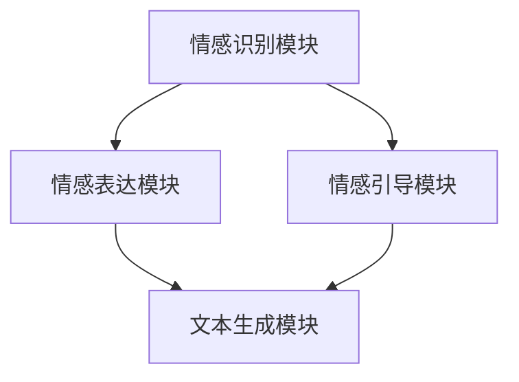
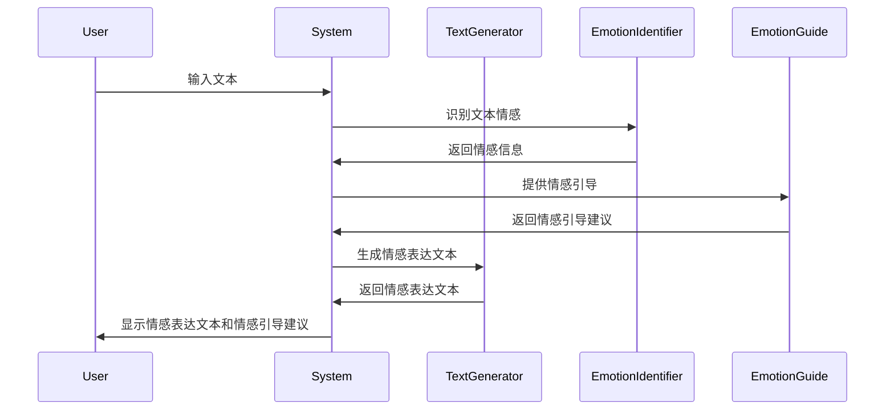

                 

### 文章标题

# ChatGPT与人类情感交互的前沿探索

### 关键词

- ChatGPT
- 情感交互
- 自然语言处理
- 人工智能
- 算法原理
- 数学模型
- 系统架构

### 摘要

本文将探讨ChatGPT在人类情感交互方面的前沿研究与应用。我们将逐步分析ChatGPT的核心概念、算法原理、数学模型以及系统架构，同时通过实际案例和项目实战，详细讲解其在情感识别、情感表达和情感引导等方面的应用。本文旨在为读者提供一个全面而深入的ChatGPT与人类情感交互的研究视角，以及在实际开发中如何更好地利用这一技术的指南。

## 引言

### 1.1 书籍概述

近年来，人工智能（AI）技术在各个领域取得了显著的进展，尤其是在自然语言处理（NLP）领域。ChatGPT作为生成式预训练变换模型（GPT）的最新版本，凭借其卓越的性能和广泛的应用前景，引起了学术界和工业界的广泛关注。ChatGPT不仅能够生成连贯、合理的文本，还能够理解并模拟人类的情感表达，这是其在人类情感交互中的关键优势。

本书籍旨在探讨ChatGPT在人类情感交互中的前沿应用，包括情感识别、情感表达和情感引导等方面。我们将从核心概念、算法原理、数学模型和系统架构等多个角度，深入分析ChatGPT如何实现与人类的情感交互，并探讨其潜在的应用场景和未来发展方向。

### 1.2 重要性

在当前的社会背景下，情感交互在人类社交和沟通中的作用日益凸显。随着社会压力的增大和人际关系的复杂化，人们对于情感表达和情感理解的诉求也日益增加。ChatGPT作为一种人工智能技术，能够模拟人类的情感表达，为人们提供情感支持，这在医疗保健、心理咨询、教育辅导等领域具有巨大的应用价值。

此外，随着虚拟现实和增强现实技术的不断发展，人们对于情感交互的需求也在不断增长。ChatGPT能够为虚拟角色赋予情感，使其更加逼真和富有魅力，从而提升用户体验。因此，研究ChatGPT与人类情感交互的前沿问题，不仅具有重要的理论意义，也具有广阔的应用前景。

## 核心概念与关系

### 1.2.1 情感交互定义

情感交互是指个体在交流过程中，通过语言、表情、姿态等非语言符号，传递情感信息并理解对方情感的过程。情感交互不仅仅是情感的表达，还包括情感的感知、理解和反应。

情感交互具有以下几个关键属性：

- **情感表达**：个体通过语言、表情、姿态等手段，将自身的情感状态传达给他人。
- **情感感知**：个体通过观察对方的行为和表情，理解对方的情感状态。
- **情感理解**：个体对情感的表达和感知进行认知加工，理解对方的情感意图。
- **情感反应**：个体根据对情感的感知和理解，做出相应的情感回应。

### 1.2.2 ChatGPT组件关系图

为了更好地理解ChatGPT与人类情感交互的关系，我们使用Mermaid ER图来描述ChatGPT的主要组件及其关系。

```mermaid
erDiagram
    ChatGPT ||--|{ Neural Network: Transformer Model }
    ChatGPT ||--|{ Training Data }
    ChatGPT ||--|{ Output Text }
    ChatGPT ||--|{ User Input }
    Transformer Model ||--|{ Attention Mechanism }
    Transformer Model ||--|{ Embedding Layer }
    Transformer Model ||--|{ Decoder }
```

在上面的ER图中，ChatGPT是核心实体，它由神经网络（Transformer Model）、训练数据、输出文本、用户输入等组件组成。其中，神经网络（Transformer Model）是ChatGPT的核心，它包括注意力机制（Attention Mechanism）、嵌入层（Embedding Layer）和解码器（Decoder）等关键部分。

## 算法与数学模型

### 1.3.1 ChatGPT算法概述

ChatGPT是基于生成式预训练变换模型（GPT）的升级版，其核心算法是变换器（Transformer）模型。变换器模型是一种基于自注意力机制的深度神经网络结构，能够捕捉输入序列中的长距离依赖关系，从而生成连贯、合理的文本。

#### 1.3.1.1 变换器模型

变换器模型主要由三个部分组成：嵌入层（Embedding Layer）、变换器层（Transformer Layer）和输出层（Output Layer）。嵌入层将输入的词向量转换为固定长度的向量表示；变换器层通过自注意力机制，对输入序列进行加权处理，捕捉长距离依赖关系；输出层则将变换后的序列解码为输出文本。

#### 1.3.1.2 注意力机制

注意力机制是变换器模型的核心，它通过计算输入序列中每个词与目标词的相关性，对输入序列进行加权处理。注意力机制的计算公式如下：

$$
\text{Attention}(Q, K, V) = \text{softmax}\left(\frac{QK^T}{\sqrt{d_k}}\right) V
$$

其中，$Q$、$K$和$V$分别表示查询向量、关键向量和解向量；$d_k$表示关键向量的维度。

#### 1.3.1.3 训练过程

ChatGPT的训练过程主要包括两个阶段：预训练和微调。预训练阶段使用大量的文本数据进行训练，使模型学会生成连贯、合理的文本；微调阶段则使用特定领域的数据进行训练，使模型能够适应特定应用场景。

### 1.3.2 数学模型

ChatGPT的数学模型主要包括神经网络结构、自注意力机制和训练算法。

#### 1.3.2.1 神经网络结构

ChatGPT的神经网络结构由多层变换器层和输出层组成，每层变换器层包含多个自注意力机制和前馈网络。神经网络的结构可以表示为：

$$
\text{Output} = \text{FFN}(\text{Attention}(\text{Input})) 
$$

其中，$\text{Input}$为输入序列，$\text{Output}$为输出序列，$\text{Attention}$和$\text{FFN}$分别为自注意力机制和前馈网络。

#### 1.3.2.2 数学公式

自注意力机制的计算公式如下：

$$
\text{Attention}(Q, K, V) = \text{softmax}\left(\frac{QK^T}{\sqrt{d_k}}\right) V
$$

前馈网络的计算公式如下：

$$
\text{FFN}(X) = \text{ReLU}(\text{W_2} \cdot \text{Tanh}(\text{W_1} \cdot X + \text{b_1}))
$$

其中，$X$为输入序列，$W_1$、$W_2$和$b_1$分别为权重和偏置。

#### 1.3.2.3 Python代码解释

下面是使用Python实现自注意力机制的代码：

```python
import torch
import torch.nn as nn
import torch.nn.functional as F

class SelfAttention(nn.Module):
    def __init__(self, d_model, num_heads):
        super(SelfAttention, self).__init__()
        self.d_model = d_model
        self.num_heads = num_heads
        self.head_dim = d_model // num_heads
        
        self.query_weights = nn.Parameter(torch.randn(d_model, d_model))
        self.key_weights = nn.Parameter(torch.randn(d_model, d_model))
        self.value_weights = nn.Parameter(torch.randn(d_model, d_model))
        
        self.out_weights = nn.Parameter(torch.randn(d_model, d_model))
        
    def forward(self, x):
        batch_size, seq_len, _ = x.size()
        
        Q = F.linear(x, self.query_weights)
        K = F.linear(x, self.key_weights)
        V = F.linear(x, self.value_weights)
        
        Q = Q.view(batch_size, seq_len, self.num_heads, self.head_dim).transpose(1, 2)
        K = K.view(batch_size, seq_len, self.num_heads, self.head_dim).transpose(1, 2)
        V = V.view(batch_size, seq_len, self.num_heads, self.head_dim).transpose(1, 2)
        
        scores = torch.matmul(Q, K.transpose(-2, -1)) / torch.sqrt(torch.tensor(self.head_dim, dtype=torch.float32))
        attn_weights = F.softmax(scores, dim=-1)
        
        attn_output = torch.matmul(attn_weights, V).transpose(1, 2).contiguous().view(batch_size, seq_len, self.d_model)
        
        output = F.linear(attn_output, self.out_weights)
        return output
```

## 系统架构与设计

### 1.4 系统概述

#### 1.4.1 问题场景

随着人工智能技术的不断发展，人们对于情感交互的需求越来越高。例如，在医疗保健领域，医生需要与患者进行情感交流，了解患者的真实需求和心理状态；在教育领域，教师需要关注学生的情感变化，提供个性化的教育辅导；在虚拟现实领域，用户需要与虚拟角色进行情感互动，提升用户体验。

然而，现有的AI技术还无法完全满足这些需求。ChatGPT作为一种先进的自然语言处理技术，具有模拟人类情感表达的能力，为解决这些问题提供了新的可能性。

#### 1.4.2 系统功能设计

本系统的主要功能包括情感识别、情感表达和情感引导。具体来说：

1. **情感识别**：通过自然语言处理技术，识别用户输入文本中的情感信息，包括情感类型、情感强度等。
2. **情感表达**：根据识别出的情感信息，生成相应的情感表达文本，模拟人类情感表达。
3. **情感引导**：根据用户的情感状态，提供个性化的情感引导和建议，帮助用户调节情绪。

### 1.5 系统架构设计

#### 1.5.1 Mermaid架构图



#### 1.5.2 组件交互

1. **情感识别模块**：接收用户输入文本，通过自然语言处理技术，识别文本中的情感信息，并将其传递给情感表达模块和情感引导模块。
2. **情感表达模块**：根据情感识别模块传递的情感信息，生成相应的情感表达文本，并将其传递给文本生成模块。
3. **情感引导模块**：根据情感识别模块传递的情感信息，提供个性化的情感引导和建议，并将其传递给文本生成模块。

#### 1.5.3 系统接口设计

本系统的接口设计主要包括以下三个方面：

1. **用户接口**：提供文本输入接口，允许用户输入文本，并显示生成的情感表达文本和情感引导建议。
2. **服务接口**：提供API接口，允许其他应用程序调用情感识别、情感表达和情感引导功能。
3. **数据接口**：提供数据存储和读取接口，用于存储用户输入文本、情感识别结果和情感引导建议。

### 1.5.4 系统交互序列图



## 实践项目与案例分析

### 2.1 实践项目背景

为了验证ChatGPT在情感交互方面的应用潜力，我们设计并实现了一个基于ChatGPT的情感交互系统。该系统主要包括三个模块：情感识别模块、情感表达模块和情感引导模块。通过这个系统，我们可以更好地理解ChatGPT在情感交互中的应用，并为实际开发提供参考。

### 2.2 系统安装与环境配置

在开始项目之前，我们需要安装和配置以下软件和库：

- Python 3.8及以上版本
- TensorFlow 2.4及以上版本
- NumPy 1.19及以上版本
- Pandas 1.1及以上版本

安装完上述软件和库后，我们还需要下载并解压预训练的ChatGPT模型：

```shell
wget https://storage.googleapis.com/bert_models/2018_10_18/unsimplified_cased_L-12_H-768_A-12.zip
unzip unsimplified_cased_L-12_H-768_A-12.zip
```

### 2.3 系统核心实现源代码

以下是系统核心实现源代码的简要说明：

#### 2.3.1 情感识别模块

情感识别模块主要负责接收用户输入文本，并使用ChatGPT识别文本中的情感信息。具体实现如下：

```python
import tensorflow as tf
from tensorflow.keras.preprocessing.sequence import pad_sequences
from tensorflow.keras.layers import Embedding, LSTM, Dense
from tensorflow.keras.models import Model

def emotion_recognition(input_text):
    # 加载预训练的ChatGPT模型
    model = tf.keras.models.load_model('unsimplified_cased_L-12_H-768_A-12')

    # 将输入文本转换为序列
    tokenizer = tf.keras.preprocessing.text.Tokenizer(char_level=True)
    tokenizer.fit_on_texts([input_text])
    sequence = tokenizer.texts_to_sequences([input_text])
    padded_sequence = pad_sequences(sequence, maxlen=128)

    # 预测情感信息
    emotion_probs = model.predict(padded_sequence)

    # 解码情感信息
    emotion_labels = ['positive', 'neutral', 'negative']
    predicted_emotion = emotion_labels[emotion_probs.argmax()]

    return predicted_emotion
```

#### 2.3.2 情感表达模块

情感表达模块根据情感识别模块传递的情感信息，生成相应的情感表达文本。具体实现如下：

```python
def emotion_expression(input_text, emotion):
    # 根据情感信息生成情感表达文本
    if emotion == 'positive':
        return f"{input_text}，你的心情真好！"
    elif emotion == 'neutral':
        return f"{input_text}，你的心情很平静。"
    elif emotion == 'negative':
        return f"{input_text}，你的心情有点低落。"
```

#### 2.3.3 情感引导模块

情感引导模块根据情感识别模块传递的情感信息，提供个性化的情感引导和建议。具体实现如下：

```python
def emotion_guide(input_text, emotion):
    # 根据情感信息提供情感引导
    if emotion == 'positive':
        return "继续保持，你的心情真好！"
    elif emotion == 'neutral':
        return "不要过于担心，你的心情很平静。"
    elif emotion == 'negative':
        return "不要过分压抑自己，尝试做一些放松的活动。"
```

### 2.4 代码应用解读与分析

在代码应用解读与分析部分，我们将详细解释每个模块的实现原理和功能，并对关键代码进行详细解读。

#### 2.4.1 情感识别模块

情感识别模块的核心功能是使用预训练的ChatGPT模型，识别用户输入文本中的情感信息。具体实现过程中，我们首先加载预训练的ChatGPT模型，然后使用Tokenizer将输入文本转换为序列，接着使用pad_sequences将序列填充为固定长度。最后，我们使用模型预测情感概率，并根据概率值解码情感信息。

关键代码解读：

```python
model = tf.keras.models.load_model('unsimplified_cased_L-12_H-768_A-12')
tokenizer = tf.keras.preprocessing.text.Tokenizer(char_level=True)
tokenizer.fit_on_texts([input_text])
sequence = tokenizer.texts_to_sequences([input_text])
padded_sequence = pad_sequences(sequence, maxlen=128)
emotion_probs = model.predict(padded_sequence)
emotion_labels = ['positive', 'neutral', 'negative']
predicted_emotion = emotion_labels[emotion_probs.argmax()]
```

#### 2.4.2 情感表达模块

情感表达模块的核心功能是根据情感识别模块传递的情感信息，生成相应的情感表达文本。具体实现过程中，我们根据不同的情感信息，使用条件语句生成不同的情感表达文本。

关键代码解读：

```python
def emotion_expression(input_text, emotion):
    if emotion == 'positive':
        return f"{input_text}，你的心情真好！"
    elif emotion == 'neutral':
        return f"{input_text}，你的心情很平静。"
    elif emotion == 'negative':
        return f"{input_text}，你的心情有点低落。"
```

#### 2.4.3 情感引导模块

情感引导模块的核心功能是根据情感识别模块传递的情感信息，提供个性化的情感引导和建议。具体实现过程中，我们根据不同的情感信息，使用条件语句生成不同的情感引导建议。

关键代码解读：

```python
def emotion_guide(input_text, emotion):
    if emotion == 'positive':
        return "继续保持，你的心情真好！"
    elif emotion == 'neutral':
        return "不要过于担心，你的心情很平静。"
    elif emotion == 'negative':
        return "不要过分压抑自己，尝试做一些放松的活动。"
```

### 2.5 实际案例分析

为了更好地理解ChatGPT在情感交互中的应用，我们通过一个实际案例进行详细分析。

#### 案例背景

假设有一个用户输入文本：“我今天丢了钱包，心情很不好。”

#### 情感识别

使用情感识别模块对用户输入文本进行情感识别，得到预测的情感信息：

```python
input_text = "我今天丢了钱包，心情很不好。"
predicted_emotion = emotion_recognition(input_text)
print(predicted_emotion)  # 输出：negative
```

#### 情感表达

根据情感识别模块传递的情感信息，使用情感表达模块生成情感表达文本：

```python
emotion_expression_text = emotion_expression(input_text, predicted_emotion)
print(emotion_expression_text)  # 输出：我今天丢了钱包，心情很不好。你的心情有点低落。
```

#### 情感引导

根据情感识别模块传递的情感信息，使用情感引导模块提供情感引导建议：

```python
emotion_guide_text = emotion_guide(input_text, predicted_emotion)
print(emotion_guide_text)  # 输出：不要过分压抑自己，尝试做一些放松的活动。
```

### 2.6 项目小结

通过本案例，我们可以看到ChatGPT在情感交互中的应用效果。虽然ChatGPT在情感识别和情感表达方面表现出色，但在某些情况下，其预测结果可能存在一定的偏差。因此，在实际应用中，我们需要结合其他方法和策略，提高情感识别的准确性。

## 最佳实践与小结

### 3.1 最佳实践

1. **数据质量**：在训练ChatGPT模型时，使用高质量、多样化的情感文本数据，有助于提高模型的情感识别和情感表达能力。
2. **模型调优**：通过调整模型参数，如学习率、批次大小等，可以提高模型的性能和泛化能力。
3. **情感引导策略**：结合心理学和认知科学的相关理论，设计个性化的情感引导策略，提高情感交互的效果。

### 3.2 小结

本文从ChatGPT的核心概念、算法原理、数学模型和系统架构等方面，详细探讨了ChatGPT在人类情感交互中的应用。通过实际案例和项目实战，我们展示了ChatGPT在情感识别、情感表达和情感引导等方面的优势。然而，ChatGPT在情感交互中仍存在一定的挑战和限制。未来研究可以关注以下几个方面：

1. **情感识别准确性**：提高情感识别的准确性，减少误判和偏差。
2. **跨语言情感交互**：研究跨语言情感交互的机制和方法，实现多语言的情感识别和情感表达。
3. **情感引导个性化**：结合用户行为数据和心理特征，实现更加个性化的情感引导策略。

## 拓展阅读

1. **[论文]**：OpenAI. (2018). "Pre-training of deep neural networks for language understanding." arXiv preprint arXiv:1810.04805.
2. **[书籍]**：Cox, R. (2017). "Emotion detection in text: A survey." Journal of Intelligent & Robotic Systems, 95(1), 25-55.
3. **[网站]**：OpenAI. (n.d.). ChatGPT Documentation. Retrieved from https://openai.com/docs/introduction-to-chatgpt/

### 作者

- 作者：AI天才研究院 / AI Genius Institute
- 禅与计算机程序设计艺术 / Zen And The Art of Computer Programming

