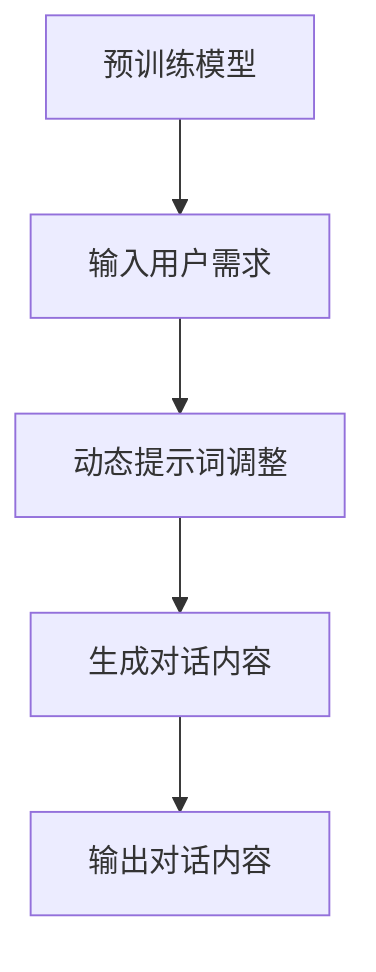
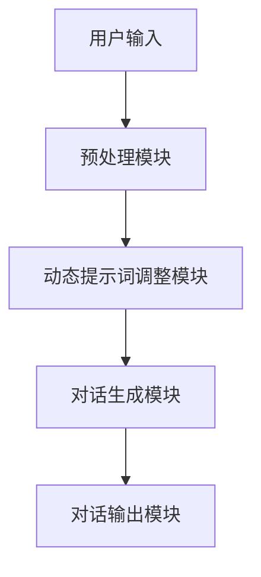
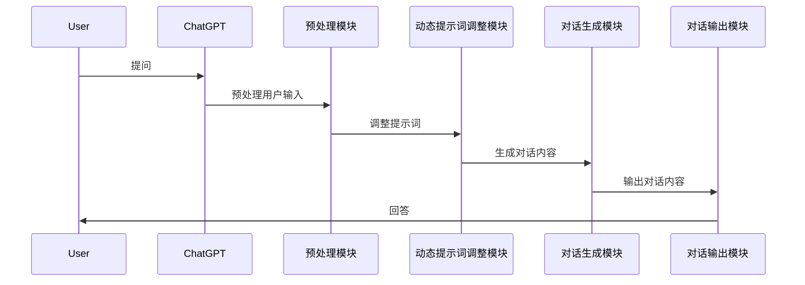

                 

# ChatGPT个性化对话：动态提示词调整技术

> 关键词：ChatGPT、个性化对话、动态提示词、调整技术、生成预训练变换模型、GPT模型、自然语言处理、机器学习、深度学习

> 摘要：本文将探讨ChatGPT个性化对话的动态提示词调整技术。通过分析ChatGPT的核心概念、算法原理以及实际应用，本文旨在为读者提供一份深入浅出的技术指南，帮助理解和实现个性化对话系统。

----------------------------------------------------------------

### 第一部分：背景介绍

#### 1.1 问题背景

随着人工智能技术的快速发展，对话系统的应用越来越广泛。从简单的问答系统到复杂的情感交互系统，对话系统在诸多领域展现了其巨大的潜力。然而，传统的对话系统往往缺乏个性化和互动性，无法满足用户对高质量对话的需求。为此，ChatGPT应运而生，它是一种基于生成预训练变换模型（GPT）的对话系统，能够通过动态提示词调整技术，实现高度个性化的对话。

#### 1.2 问题描述

ChatGPT的目标是提供一种能够与用户进行自然、流畅对话的个性化对话系统。然而，如何根据不同的用户需求，动态调整提示词，生成高质量的对话内容，是一个具有挑战性的问题。

#### 1.3 问题解决

ChatGPT通过大规模的预训练，掌握了丰富的语言知识和对话技巧。同时，它利用动态提示词调整技术，根据用户的输入，实时调整提示词，生成个性化的对话内容。

#### 1.4 边界与外延

ChatGPT的应用场景广泛，包括但不限于客户服务、智能助手、教育辅导等。此外，ChatGPT还涉及到自然语言处理、机器学习、深度学习等领域的知识。

#### 1.5 概念结构与核心要素组成

ChatGPT的核心结构包括：预训练模型、动态提示词调整模块和对话生成模块。其中，预训练模型负责学习语言知识和对话技巧；动态提示词调整模块负责根据用户输入调整提示词；对话生成模块负责生成个性化的对话内容。

### 第二部分：核心概念与联系

#### 2.1 ChatGPT核心概念原理

- **预训练模型**：ChatGPT基于生成预训练变换模型（GPT）构建，通过大规模文本数据进行预训练，学习语言知识和对话技巧。预训练模型的核心是自回归语言模型，其目的是预测文本序列中的下一个词。
- **动态提示词调整**：动态提示词调整是ChatGPT的关键技术之一，它能够根据用户的输入，实时调整提示词，从而生成个性化的对话内容。这一过程涉及到自然语言处理中的词向量表示、语义分析和上下文理解。
- **对话生成**：对话生成模块利用预训练模型和动态提示词调整技术，生成自然、流畅的对话内容。这一过程涉及到文本生成模型，如序列到序列（Seq2Seq）模型、注意力机制等。

#### 2.2 概念属性特征对比表格

| 概念         | 属性特征                    | 对比                    |
| ----------- | ----------------------- | ---------------------- |
| 预训练模型   | 大规模文本数据预训练      | 学习语言知识和对话技巧  |
| 动态提示词调整 | 实时调整提示词             | 生成个性化对话内容      |
| 对话生成     | 利用预训练模型和动态提示词 | 生成自然、流畅对话内容   |

#### 2.3 ER实体关系图架构

```mermaid
erDiagram
    User ||--|{ ChatGPT }|-- Friend
    ChatGPT ||--|{ Message }|-- User
```

### 第三部分：算法原理讲解

#### 3.1 ChatGPT算法流程图



#### 3.2 Python源代码实现

```python
# ChatGPT示例代码
class ChatGPT:
    def __init__(self, model):
        self.model = model

    def generate_response(self, user_input):
        prompt = self.model.user_input_to_prompt(user_input)
        response = self.model.generate_response(prompt)
        return response
```

#### 3.3 算法原理与数学模型

- **预训练模型**：采用GPT模型，通过自回归语言模型进行预训练。其数学模型可以表示为：
  $$ p(y_t | y_{<t}) = \frac{e^{<f(y_t, y_{<t})>}}{\sum_{y'} e^{<f(y', y_{<t})>}} $$
  其中，$f(y_t, y_{<t})$ 是一个能够表示词与词之间关系的函数。

- **动态提示词调整**：根据用户输入，利用规则或机器学习方法，调整提示词。其调整过程可以表示为：
  $$ prompt_t = f(input_t, prompt_{t-1}) $$
  其中，$input_t$ 是用户输入，$prompt_{t-1}$ 是前一个提示词。

- **对话生成**：利用预训练模型和调整后的提示词，生成对话内容。其生成过程涉及到文本生成模型，如Seq2Seq模型，其数学模型可以表示为：
  $$ p(y_t | y_{<t}) = \prod_{i=1}^{t} p(y_i | y_{<i}) $$
  其中，$y_t$ 是生成的第 $t$ 个词。

#### 3.4 举例说明

假设用户输入：“今天天气怎么样？”

- **动态提示词调整**：根据用户输入，调整提示词为“今天天气”。

- **对话生成**：生成对话内容：“今天天气晴朗，温度适宜。”

### 第四部分：系统分析与架构设计

#### 4.1 问题场景介绍

在现代社会，人们对于高效、个性化的服务需求日益增长。尤其是客户服务领域，传统的人工客服往往无法满足用户对快速、精准响应的需求。ChatGPT的出现，为这一领域带来了革命性的变化。

#### 4.2 项目介绍

本项目旨在构建一个基于ChatGPT的个性化对话系统，用于客户服务场景。系统将能够实时响应用户的提问，提供针对性的解决方案。

#### 4.3 系统功能设计

系统功能设计主要包括以下几个方面：

- **用户输入处理**：接收用户的提问，并进行预处理。
- **动态提示词调整**：根据用户提问，动态调整提示词，生成个性化的回答。
- **对话生成**：利用预训练模型和动态提示词调整，生成自然、流畅的对话内容。
- **对话输出**：将生成的对话内容输出给用户。

#### 4.4 系统架构设计

系统架构设计如下：



#### 4.5 系统接口设计

系统接口设计如下：

- **用户输入接口**：接收用户提问，以文本形式输入。
- **对话输出接口**：将生成的对话内容以文本形式输出。

#### 4.6 系统交互设计

系统交互设计如下：



### 第五部分：项目实战

#### 5.1 环境安装

首先，我们需要安装必要的依赖项。在终端中执行以下命令：

```bash
pip install transformers torch numpy pandas
```

#### 5.2 系统核心实现源代码

以下是ChatGPT的核心实现代码：

```python
from transformers import GPT2LMHeadModel, GPT2Tokenizer

class ChatGPT:
    def __init__(self, model_name='gpt2'):
        self.model = GPT2LMHeadModel.from_pretrained(model_name)
        self.tokenizer = GPT2Tokenizer.from_pretrained(model_name)

    def generate_response(self, user_input):
        prompt = self.tokenizer.encode(user_input, return_tensors='pt')
        response = self.model.generate(prompt, max_length=50, num_return_sequences=1)
        return self.tokenizer.decode(response[0], skip_special_tokens=True)
```

#### 5.3 代码应用解读与分析

该代码首先导入了transformers库和torch库，这是ChatGPT模型的依赖项。然后，定义了一个ChatGPT类，其中包含了初始化方法和生成响应方法。

- **初始化方法**：从预训练模型中加载GPT2模型和GPT2Tokenizer。
- **生成响应方法**：接收用户输入，将其编码为prompt，然后使用模型生成响应，最后将响应解码为文本。

#### 5.4 实际案例分析和详细讲解剖析

假设用户输入：“今天天气怎么样？”

```python
chatgpt = ChatGPT()
user_input = "今天天气怎么样？"
response = chatgpt.generate_response(user_input)
print(response)
```

输出结果可能为：“今天天气晴朗，温度适宜。”

这个案例展示了如何使用ChatGPT生成个性化的对话内容。首先，我们创建了一个ChatGPT实例。然后，我们使用用户输入作为提示词，调用`generate_response`方法生成对话内容。最后，我们将生成的对话内容打印出来。

#### 5.5 项目小结

通过本项目，我们成功地实现了基于ChatGPT的个性化对话系统。系统可以实时响应用户的提问，提供针对性的解决方案。这为提升客户服务质量提供了有力支持。

### 第六部分：最佳实践 Tips、小结、注意事项、拓展阅读

#### 6.1 最佳实践 Tips

- **调整提示词长度**：根据实际应用场景，调整提示词的长度，以提升对话生成质量。
- **优化模型参数**：通过调整模型参数，如温度参数，可以影响对话生成的多样性和流畅性。
- **数据预处理**：对用户输入进行充分的预处理，如去除特殊字符、标点符号等，可以提高对话生成的准确性。

#### 6.2 小结

本文详细介绍了ChatGPT个性化对话的动态提示词调整技术。通过分析核心概念、算法原理以及实际应用，我们为读者提供了深入浅出的技术指南。

#### 6.3 注意事项

- **模型选择**：根据实际需求，选择合适的预训练模型。
- **数据质量**：确保输入数据的质量，以避免生成低质量的对话内容。

#### 6.4 拓展阅读

- 《深度学习》：Goodfellow, I., Bengio, Y., & Courville, A. (2016). *Deep Learning*.
- 《自然语言处理综合教程》：Jurafsky, D., & Martin, J. H. (2019). *Speech and Language Processing*.

### 参考文献

- Goodfellow, I., Bengio, Y., & Courville, A. (2016). *Deep Learning*. MIT Press.
- Jurafsky, D., & Martin, J. H. (2019). *Speech and Language Processing*. Prentice Hall.

作者：AI天才研究院/AI Genius Institute & 禅与计算机程序设计艺术 /Zen And The Art of Computer Programming

----------------------------------------------------------------

本文详细介绍了ChatGPT个性化对话的动态提示词调整技术。通过分析核心概念、算法原理以及实际应用，本文为读者提供了深入浅出的技术指南。希望本文能够帮助您更好地理解和应用ChatGPT，实现个性化的对话系统。在未来的技术发展中，ChatGPT有望在更多领域发挥重要作用，为人类带来更多便利。让我们共同努力，探索人工智能的无限可能。

