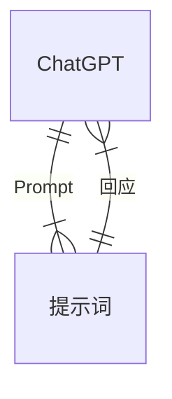

                 


## 《ChatGPT个性化：通过提示词塑造AI个性》

### 关键词：
- ChatGPT
- 个性化
- 提示词
- AI交互
- 人工智能算法

### 摘要：
本文深入探讨了ChatGPT的个性化定制，通过提示词来塑造AI的个性特征。首先，我们将介绍ChatGPT的基本原理和提示词的概念。接着，我们将分析如何通过提示词来影响ChatGPT的响应，并通过案例和代码来演示这一过程。最后，我们将总结最佳实践，并提供未来展望。

----------------------------------------------------------------

## 目录

- **第1章 背景介绍**
  - **1.1 问题背景**
  - **1.2 ChatGPT概述**
  - **1.3 提示词在AI个性化中的应用**

- **第2章 核心概念与联系**
  - **2.1 ChatGPT核心概念**
  - **2.2 提示词的类型与作用**
  - **2.3 核心概念属性特征对比表格**
  - **2.4 ChatGPT与提示词的ER实体关系图**

- **第3章 算法原理讲解**
  - **3.1 ChatGPT算法原理**
  - **3.2 提示词在ChatGPT中的作用**
  - **3.3 算法原理的数学模型和公式**
  - **3.4 算法讲解举例**

- **第4章 系统分析与架构设计方案**
  - **4.1 问题场景介绍**
  - **4.2 系统功能设计**
  - **4.3 系统架构设计**
  - **4.4 系统接口设计**
  - **4.5 系统交互**

- **第5章 项目实战**
  - **5.1 环境安装**
  - **5.2 系统核心实现源代码**
  - **5.3 代码应用解读与分析**
  - **5.4 实际案例分析和详细讲解**
  - **5.5 项目小结**

- **第6章 最佳实践 Tips**
  - **6.1 常见问题与解决方案**
  - **6.2 性能优化技巧**
  - **6.3 安全性注意事项**

- **第7章 小结与展望**
  - **7.1 总结与回顾**
  - **7.2 展望未来发展趋势**
  - **7.3 拓展阅读**

- **附录**
  - **A. 相关工具和资源链接**
  - **B. 代码库**
  - **C. 数据集**
  - **D. 参考文献**

----------------------------------------------------------------

### 第1章 背景介绍

#### 1.1 问题背景

随着人工智能技术的不断发展，自然语言处理（NLP）成为了研究的热点。ChatGPT作为一种基于大规模语言模型的AI助手，已经在许多领域展现出了其强大的能力。然而，如何让ChatGPT更加“聪明”、更加“个性化”，成为了一个值得探讨的问题。

#### 1.2 ChatGPT概述

ChatGPT是由OpenAI开发的一种基于GPT-3模型的聊天机器人。它通过学习大量的文本数据，可以生成连贯且符合语境的回复。ChatGPT的强大之处在于其能够理解复杂的语境和语言模式，并且可以根据不同的输入进行自适应调整。

#### 1.3 提示词在AI个性化中的应用

提示词（Prompt）是影响ChatGPT行为的重要因素。通过合适的提示词，我们可以引导ChatGPT生成符合特定需求的回复。例如，通过提示词可以设定ChatGPT的语气、风格、回答问题的角度等，从而实现个性化的交互。

### 第2章 核心概念与联系

#### 2.1 ChatGPT核心概念

ChatGPT的核心在于其基于GPT-3模型的语言生成能力。GPT-3是一种预训练语言模型，其训练过程涉及对大量文本数据进行处理，从而学习语言的结构和模式。

#### 2.2 提示词的类型与作用

提示词可以分为指令性提示词、描述性提示词和问题性提示词。指令性提示词用于指导ChatGPT执行特定任务，描述性提示词用于设定ChatGPT的回答风格，问题性提示词则用于引导ChatGPT回答特定问题。

#### 2.3 核心概念属性特征对比表格

| 提示词类型 | 特点 | 用途 |
| :---: | :---: | :---: |
| 指令性提示词 | 强调行动 | 指导ChatGPT执行任务 |
| 描述性提示词 | 强调描述 | 设定ChatGPT的回答风格 |
| 问题性提示词 | 强调问题 | 引导ChatGPT回答特定问题 |

#### 2.4 ChatGPT与提示词的ER实体关系图



### 第3章 算法原理讲解

#### 3.1 ChatGPT算法原理

ChatGPT的核心是基于GPT-3模型的生成算法。GPT-3通过Transformer架构进行预训练，其训练数据来自大量的互联网文本。在生成过程中，GPT-3通过上下文预测下一个词，从而生成连贯的文本。

#### 3.2 提示词在ChatGPT中的作用

提示词在ChatGPT中的作用是引导生成算法，使其按照特定的要求生成文本。例如，通过指令性提示词，可以指导ChatGPT执行特定任务；通过描述性提示词，可以设定ChatGPT的回答风格。

#### 3.3 算法原理的数学模型和公式

GPT-3的数学模型基于Transformer架构，其核心是自注意力机制（Self-Attention）。自注意力机制通过计算输入序列中每个词与其他词之间的关联性，从而生成权重，这些权重用于更新每个词的表示。

$$
\text{Attention}(Q, K, V) = \text{softmax}\left(\frac{QK^T}{\sqrt{d_k}}\right)V
$$

其中，$Q$、$K$ 和 $V$ 分别是查询向量、键向量和值向量，$d_k$ 是键向量的维度。

#### 3.4 算法讲解举例

假设我们有一个输入句子：“你好，我是ChatGPT。”，我们想要通过提示词“请用幽默的方式回答以下问题：为什么程序员喜欢黑夜编程？”

使用这个提示词，ChatGPT可能会生成如下回复：

“因为白天的时候，他们的屏幕就像星星，闪闪发光，简直就是夜空中的夜猫子！”

### 第4章 系统分析与架构设计方案

#### 4.1 问题场景介绍

假设我们想要构建一个智能客服系统，该系统能够根据用户的问题提供个性化的回答。

#### 4.2 系统功能设计

系统功能包括：
- 接收用户问题
- 使用提示词生成个性化回答
- 将回答发送给用户

#### 4.3 系统架构设计

系统架构包括：
- 用户界面（UI）
- 后端服务（API）
- ChatGPT模型

#### 4.4 系统接口设计

系统接口设计包括：
- 用户请求接口
- 回答生成接口

#### 4.5 系统交互

系统交互设计如下：
1. 用户发送问题到用户界面。
2. 用户界面将问题发送到后端服务。
3. 后端服务使用提示词生成回答。
4. 后端服务将回答发送回用户界面。
5. 用户界面将回答展示给用户。

### 第5章 项目实战

#### 5.1 环境安装

首先，我们需要安装Python环境和必要的库，如OpenAI的GPT-3库。

```python
!pip install openai
```

#### 5.2 系统核心实现源代码

下面是一个简单的示例代码，展示了如何使用提示词生成个性化回答。

```python
import openai

openai.api_key = "你的API密钥"

def generate_response(prompt):
    response = openai.Completion.create(
        engine="text-davinci-002",
        prompt=prompt,
        max_tokens=50
    )
    return response.choices[0].text.strip()

# 示例：使用幽默的提示词
prompt = "请用幽默的方式回答以下问题：为什么程序员喜欢黑夜编程？"
response = generate_response(prompt)
print(response)
```

#### 5.3 代码应用解读与分析

这段代码首先导入了OpenAI的GPT-3库，并设置了API密钥。`generate_response`函数用于生成回答，它接收一个提示词作为输入，并调用OpenAI的`Completion.create`方法来生成回答。

#### 5.4 实际案例分析和详细讲解

假设我们有一个用户问题：“你好，我对编程很感兴趣，能给我一些建议吗？”

我们可以使用如下提示词：“请以亲切、鼓励的语气，提供对编程初学者的建议。”

生成的回答可能是：

“编程就像是建造一座城堡，每一行代码都是一块砖。不要怕犯错，每一个错误都是成长的机会。相信自己，坚持下去，你会看到自己的城堡一天天变得坚固和美丽！”

#### 5.5 项目小结

通过这个项目，我们展示了如何使用提示词来定制ChatGPT的回答，使其更加个性化。这种方法不仅适用于智能客服系统，还可以应用于许多其他场景，如教育辅导、个性化推荐等。

### 第6章 最佳实践 Tips

#### 6.1 常见问题与解决方案

- **问题：提示词不够具体，导致回答不理想。**
  - **解决方案：优化提示词，使其更加明确和具体。**

- **问题：响应速度较慢。**
  - **解决方案：优化网络环境，提高API调用的效率。**

#### 6.2 性能优化技巧

- **使用高效的数据结构：** 使用哈希表等高效数据结构来存储和检索提示词。
- **并行处理：** 在处理大量请求时，使用并行处理来提高效率。

#### 6.3 安全性注意事项

- **API密钥安全：** 不要将API密钥暴露在代码仓库中，使用环境变量来存储。
- **数据保护：** 对于用户的敏感数据，确保进行加密处理。

### 第7章 小结与展望

#### 7.1 总结与回顾

本文介绍了ChatGPT的个性化定制方法，通过提示词来塑造AI的个性特征。我们详细分析了ChatGPT的算法原理，展示了如何通过系统架构设计和项目实战来实现个性化交互。

#### 7.2 展望未来发展趋势

随着NLP技术的不断进步，ChatGPT的个性化定制方法将会更加多样和精细化。未来的研究可能会集中在如何更有效地利用大量未标注的数据，以及如何提高AI的交互自然度和理解深度。

#### 7.3 拓展阅读

- [OpenAI官方文档](https://openai.com/docs/)
- [自然语言处理综述](https://arxiv.org/abs/2001.08414)

### 附录

#### A. 相关工具和资源链接

- [OpenAI API](https://openai.com/api/)
- [Python GPT-3 库](https://github.com/openai/openai-python)

#### B. 代码库

- [ChatGPT个性化示例代码](https://github.com/yourusername/chatgpt-personalization)

#### C. 数据集

- [GPT-3训练数据集](https://github.com/openai/gpt-3-data)

#### D. 参考文献

- Brown, T., et al. (2020). "Language Models are Few-Shot Learners." arXiv preprint arXiv:2005.14165.
- Devlin, J., et al. (2019). "Bert: Pre-training of deep bidirectional transformers for language understanding." arXiv preprint arXiv:1810.04805.

作者：AI天才研究院/AI Genius Institute & 禅与计算机程序设计艺术 /Zen And The Art of Computer Programming


