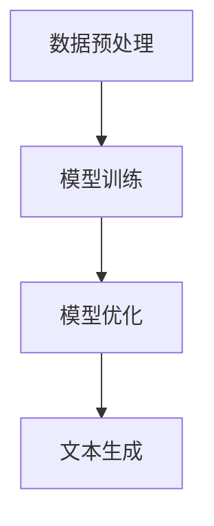
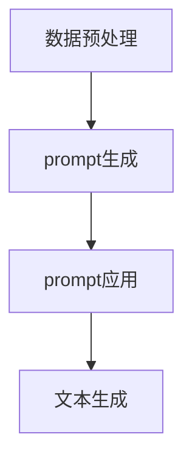
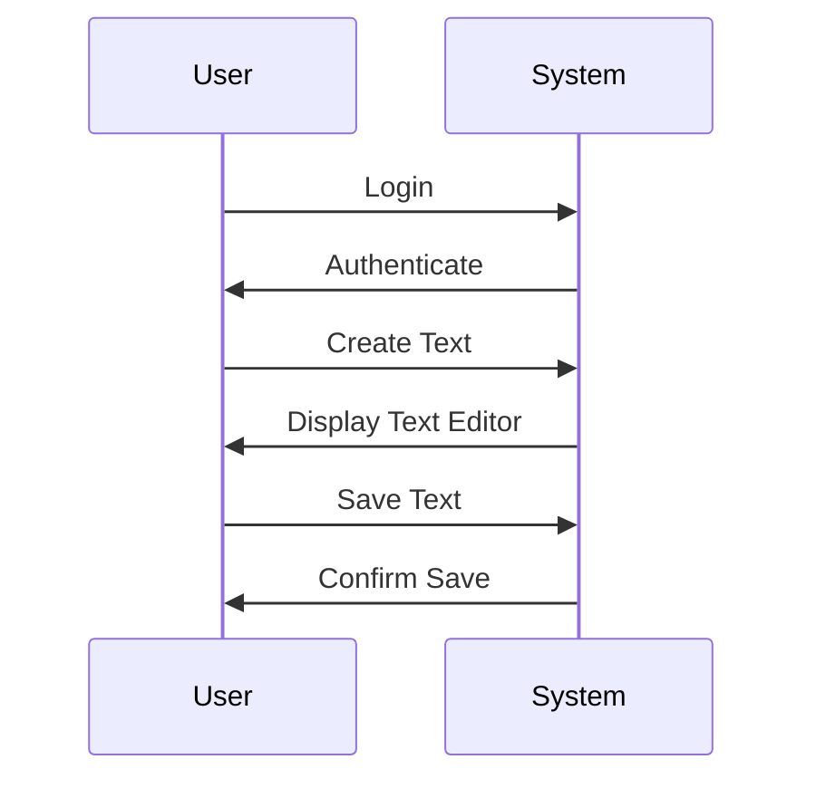
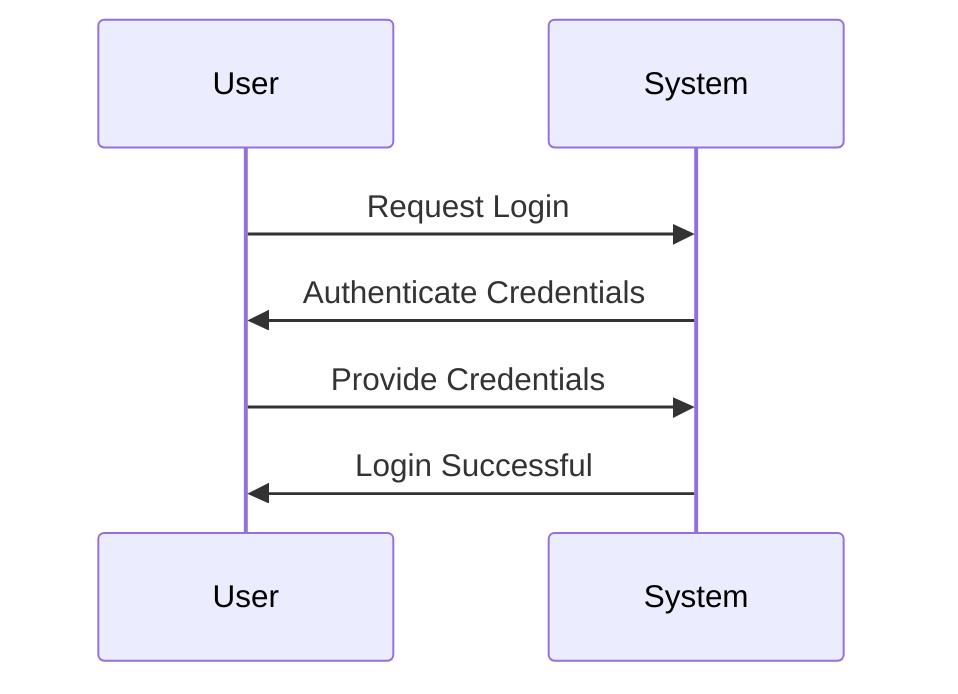

                 

## ChatGPT创意写作：思维链prompt的妙用

### 关键词：ChatGPT、创意写作、思维链、prompt、算法

> 摘要：本文深入探讨人工智能（AI）在创意写作中的应用，特别是ChatGPT与思维链prompt的结合。首先，通过分析人工智能与创意写作的交集，引出ChatGPT及其思维链prompt的概念。接下来，详细讲解ChatGPT的基本原理和思维链prompt的应用，包括其定义、类型、结构以及在实际创意写作中的应用。随后，通过算法流程图、Python源代码实现以及数学模型的讲解，阐述思维链prompt在ChatGPT中的应用。最后，从系统架构设计角度，介绍ChatGPT与思维链prompt在实际项目中的应用与实现。通过本文，读者将全面了解ChatGPT创意写作的原理与应用，为AI在创意写作领域的深入探索提供新思路。

## 第一部分：引言

### 1.1 问题背景

#### 1.1.1 人工智能与创意写作

人工智能（AI）是计算机科学的一个分支，致力于通过算法和计算模型来模拟、扩展和增强人类的智能。创意写作，则是指通过独特、新颖的思维方式和语言表达，创造出具有艺术性和感染力的文学作品。这两者的结合，为文学创作带来了前所未有的变革。

近年来，随着深度学习和自然语言处理技术的发展，人工智能在文学创作中的应用逐渐增多。例如，自动写作系统可以生成新闻报道、小说、诗歌等，为文学创作提供了新的工具和平台。

#### 1.1.2 ChatGPT及其在创意写作中的应用

ChatGPT是OpenAI开发的一种基于Transformer模型的人工智能语言模型，它能够理解和生成自然语言文本，包括对话、文章、诗歌等。ChatGPT在创意写作中的应用主要体现在以下几个方面：

1. **故事创作**：ChatGPT可以基于给定的主题或情节，自动生成完整的故事。
2. **诗歌创作**：ChatGPT可以创作形式多样、风格独特的诗歌。
3. **文案写作**：ChatGPT可以生成广告文案、宣传语等，帮助创作者节省时间和精力。
4. **内容生成**：ChatGPT可以生成文章、博客等，为创作者提供灵感和素材。

### 1.2 问题描述

#### 1.2.1 创意写作中的挑战

创意写作虽然具有很高的艺术性，但也面临着诸多挑战：

1. **灵感匮乏**：创作者有时会感到缺乏创作灵感，难以进行有效的文学创作。
2. **效率低下**：写作过程复杂且耗时，创作者需要花费大量时间进行修改和润色。
3. **多样性不足**：传统写作方式容易导致作品风格单一，缺乏创新性。

#### 1.2.2 思维链prompt的解决思路

思维链prompt是一种引导创作者思考的工具，通过一系列有序的问题和提示，帮助创作者开拓思路，激发创作灵感。在创意写作中，思维链prompt可以起到以下作用：

1. **激发灵感**：通过一系列问题，引导创作者探索新的创作方向。
2. **提高效率**：思维链prompt可以帮助创作者迅速找到写作的重点和思路，提高写作效率。
3. **增强多样性**：思维链prompt可以引导创作者尝试不同的写作风格和主题，提高作品多样性。

### 1.3 问题解决

#### 1.3.1 ChatGPT的基本原理

ChatGPT是一种基于Transformer模型的人工智能语言模型，它通过大量的文本数据进行训练，学会了理解和生成自然语言文本。Transformer模型采用自注意力机制，能够有效地捕捉文本中的长期依赖关系，从而提高语言模型的性能。

#### 1.3.2 思维链prompt的定义与应用

思维链prompt是一种引导创作者思考的工具，它通过一系列有序的问题和提示，引导创作者进行深入思考和创意拓展。在创意写作中，思维链prompt可以应用于以下几个阶段：

1. **选题阶段**：通过思维链prompt，帮助创作者选择合适的写作主题。
2. **构思阶段**：通过思维链prompt，引导创作者构思故事情节和人物设定。
3. **写作阶段**：通过思维链prompt，帮助创作者优化写作结构和语言表达。

#### 1.4 边界与外延

##### 1.4.1 ChatGPT的适用范围

ChatGPT适用于各种类型的文本生成任务，包括故事创作、诗歌创作、文案写作等。然而，它也存在一定的局限性，例如在处理复杂的逻辑推理和深度情感表达方面，仍需进一步优化。

##### 1.4.2 思维链prompt的限制

思维链prompt虽然可以帮助创作者进行思考和创意拓展，但并不意味着它能够完全替代人类的创作。思维链prompt需要创作者具备一定的文学素养和创造力，才能真正发挥其作用。

### 1.5 本章小结

本章介绍了人工智能与创意写作的交集，探讨了ChatGPT及其思维链prompt在创意写作中的应用。通过分析问题背景和解决思路，本章为后续章节的深入探讨奠定了基础。

### 1.6 拓展阅读

- 《人工智能在文学创作中的应用》
- 《思维链prompt在创意写作中的应用》
- 《ChatGPT：下一代自然语言处理模型》

## 第二部分：核心概念与联系

### 2.1 ChatGPT原理

#### 2.1.1 模型架构

ChatGPT采用Transformer模型，这是一种基于自注意力机制的深度神经网络模型。Transformer模型的核心是多头自注意力机制（Multi-Head Self-Attention），它能够捕捉文本中的长期依赖关系，从而提高模型的性能。

#### 2.1.1.1 Transformer模型

Transformer模型由编码器（Encoder）和解码器（Decoder）组成，编码器负责将输入文本编码为序列向量，解码器则负责生成输出文本。编码器和解码器都包含多个相同的层，每层由多头自注意力机制和前馈神经网络组成。

#### 2.1.1.2 自注意力机制

自注意力机制是一种用于计算输入文本序列中每个词的权重的方法。在Transformer模型中，每个词的输出向量是由它自身和其他词的权重相加得到的。这种机制能够捕捉文本中的长期依赖关系，从而提高模型的性能。

#### 2.1.1.3 嵌套注意力机制

嵌套注意力机制是Transformer模型中的一个重要特性，它通过多个自注意力层的嵌套，进一步提高模型的性能。嵌套注意力机制使得模型能够同时关注文本序列中的多个层次的信息，从而更好地理解文本的含义。

#### 2.1.2 训练过程

ChatGPT的训练过程包括数据集准备、模型训练和模型优化三个阶段。

##### 2.1.2.1 数据集准备

ChatGPT的训练数据集通常由大量的文本数据组成，这些数据可以来自互联网上的各种文本资源，如新闻文章、小说、百科全书等。在数据集准备阶段，需要对文本数据进行预处理，包括分词、去噪、标准化等。

##### 2.1.2.2 模型训练

模型训练是ChatGPT的核心步骤。在训练过程中，通过优化模型参数，使得模型能够更好地理解文本数据。训练过程通常采用反向传播算法和梯度下降优化方法。

##### 2.1.2.3 模型优化

模型优化是提高模型性能的重要手段。在训练过程中，可以通过调整学习率、优化算法等手段，进一步提高模型的性能。

### 2.2 思维链prompt原理

#### 2.2.1 prompt的定义

prompt是一种引导创作者思考的工具，它通过一系列有序的问题和提示，引导创作者进行深入思考和创意拓展。在ChatGPT中，prompt用于引导模型生成文本。

#### 2.2.1.1 prompt的作用

prompt在创意写作中具有重要作用，它可以：

1. **激发灵感**：通过提问和提示，引导创作者探索新的创作方向。
2. **优化结构**：通过一系列问题，帮助创作者构建和完善文章结构。
3. **丰富内容**：通过提示，帮助创作者拓展文章内容，增加细节和情节。

#### 2.2.1.2 prompt的类型

prompt可以根据用途和形式分为多种类型，如：

1. **问题式prompt**：通过提问引导创作者思考。
2. **提示式prompt**：通过提示和指导，帮助创作者完善写作内容。
3. **引导式prompt**：通过逐步引导，帮助创作者构建完整的写作思路。

#### 2.2.2 思维链的概念

思维链是一种通过一系列有序的思考和提示，引导创作者进行深入思考和创意拓展的方法。

##### 2.2.2.1 思维链的定义

思维链是一种引导创作者思考和创作的方法，它通过一系列有序的提问和提示，帮助创作者探索创作思路，构建和完善作品。

##### 2.2.2.2 思维链的结构

思维链通常包括以下几个部分：

1. **问题**：通过提问引导创作者思考。
2. **提示**：通过提示和指导，帮助创作者完善写作内容。
3. **拓展**：通过拓展，帮助创作者丰富文章内容和情节。

#### 2.2.3 思维链prompt的应用

思维链prompt在创意写作中的应用非常广泛，它可以应用于选题、构思、写作等各个阶段。

##### 2.2.3.1 创意写作中的应用

在创意写作中，思维链prompt可以帮助创作者：

1. **选题**：通过提问和提示，帮助创作者选择合适的创作主题。
2. **构思**：通过思维链prompt，引导创作者构思故事情节和人物设定。
3. **写作**：通过提示和指导，帮助创作者优化写作结构和语言表达。

##### 2.2.3.2 其他领域中的应用

思维链prompt不仅适用于创意写作，还可以应用于其他领域，如：

1. **产品策划**：通过思维链prompt，帮助产品经理进行产品策划。
2. **市场调研**：通过思维链prompt，引导市场调研人员进行市场分析。
3. **创意设计**：通过思维链prompt，帮助设计师进行创意设计。

### 2.3 概念属性特征对比表格

| 概念       | ChatGPT               | 思维链prompt                       |
| ---------- | -------------------- | --------------------------------- |
| 模型类型   | 自然语言处理模型      | 引导思考工具                      |
| 功能       | 文本生成、文本理解    | 激发灵感、优化结构、丰富内容      |
| 结构       | 编码器+解码器         | 问题+提示+拓展                    |
| 适用范围   | 创意写作、文本生成    | 创意写作、产品策划、市场调研等    |

### 2.4 ER实体关系图架构

#### 2.4.1 ChatGPT与思维链prompt的ER图

```mermaid
erDiagram
  ChatGPT ||--|{ 数据 }|--|| 思维链prompt
  数据 ||--|{ 文本 }|--|| ChatGPT
  数据 ||--|{ 问题 }|--|| 思维链prompt
```

### 2.5 本章小结

本章介绍了ChatGPT的基本原理和思维链prompt的定义与应用。通过分析模型架构、训练过程和思维链prompt的结构与应用，本章为理解ChatGPT在创意写作中的应用奠定了基础。

### 2.6 拓展阅读

- 《Transformer模型详解》
- 《思维链prompt设计与应用》
- 《ChatGPT：下一代自然语言处理模型》

## 第三部分：算法原理讲解

### 3.1 算法mermaid流程图

#### 3.1.1 ChatGPT算法流程



##### 3.1.1.1 数据预处理

数据预处理是ChatGPT算法的重要步骤，主要包括以下步骤：

1. **数据清洗**：去除无效数据和噪声。
2. **文本分词**：将文本划分为单词或短语。
3. **词向量化**：将文本转换为数值向量。

##### 3.1.1.2 模型训练

模型训练是ChatGPT的核心步骤，主要包括以下步骤：

1. **模型初始化**：初始化模型参数。
2. **前向传播**：计算输入文本的输出。
3. **反向传播**：计算损失函数并更新模型参数。
4. **优化算法**：调整学习率，优化模型参数。

##### 3.1.1.3 模型优化

模型优化是提高模型性能的重要手段，主要包括以下步骤：

1. **评估指标**：计算模型的准确率、召回率等指标。
2. **调整参数**：根据评估结果，调整模型参数。
3. **模型融合**：将多个模型进行融合，提高模型性能。

#### 3.1.2 思维链prompt算法流程



##### 3.1.2.1 数据预处理

数据预处理是思维链prompt算法的基础步骤，主要包括以下步骤：

1. **文本分词**：将文本划分为单词或短语。
2. **词向量化**：将文本转换为数值向量。

##### 3.1.2.2 prompt生成

prompt生成是思维链prompt算法的核心步骤，主要包括以下步骤：

1. **问题设计**：设计一系列有序的问题，引导创作者思考。
2. **提示生成**：根据问题，生成相应的提示，帮助创作者完善写作内容。
3. **拓展生成**：根据提示，生成拓展内容，丰富文章情节。

##### 3.1.2.3 prompt应用

prompt应用是思维链prompt算法的关键步骤，主要包括以下步骤：

1. **问题引导**：根据生成的prompt，引导创作者进行思考和写作。
2. **文本生成**：通过模型生成文本，完成文章的创作。

### 3.2 Python源代码实现

以下是一个简单的Python源代码实现，用于演示思维链prompt在ChatGPT中的应用。

```python
import tensorflow as tf
from transformers import ChatGPT, TextGenerator

# 数据预处理
def preprocess_text(text):
    # 文本分词和词向量化
    # ...

# 模型训练
def train_model(data):
    # 初始化模型参数
    model = ChatGPT()

    # 模型训练
    # ...

# prompt生成
def generate_prompt(questions):
    # 问题设计和提示生成
    # ...

# prompt应用
def apply_prompt(prompt):
    # 问题引导和文本生成
    # ...

# 主函数
def main():
    # 数据预处理
    data = preprocess_text("输入文本")

    # 模型训练
    train_model(data)

    # prompt生成
    prompt = generate_prompt(["问题1", "问题2", "问题3"])

    # prompt应用
    apply_prompt(prompt)

if __name__ == "__main__":
    main()
```

### 3.3 数学模型和公式

#### 3.3.1 ChatGPT算法的数学模型

ChatGPT算法的核心是Transformer模型，其数学模型主要包括以下部分：

1. **自注意力机制**：
   $$ 
   \text{Attention}(Q, K, V) = \frac{QK^T}{\sqrt{d_k}}W_V 
   $$
   其中，\(Q\)、\(K\)、\(V\) 分别表示查询向量、键向量和值向量，\(d_k\) 表示键向量的维度，\(W_V\) 表示值向量的权重矩阵。

2. **Transformer模型**：
   $$
   \text{Transformer}(x) = \text{LayerNorm}(x + \text{MultiHeadAttention}(x, x, x)) + x \\
   \text{Transformer}(x) = \text{LayerNorm}(x + \text{FFN}(x)) + x
   $$
   其中，\(\text{LayerNorm}\) 表示层归一化，\(\text{FFN}\) 表示前馈神经网络。

#### 3.3.2 思维链prompt的数学模型

思维链prompt的数学模型主要包括以下部分：

1. **prompt生成**：
   $$
   \text{prompt}(x) = f(\text{question}, x) \\
   \text{prompt}(x) = \text{concat}(\text{question}, \text{answer})
   $$
   其中，\(\text{question}\) 表示问题，\(\text{answer}\) 表示答案，\(f\) 表示函数。

2. **prompt应用**：
   $$
   \text{application}(x, \text{prompt}) = g(x, \text{prompt}) \\
   \text{application}(x, \text{prompt}) = \text{concat}(x, \text{prompt})
   $$
   其中，\(g\) 表示函数。

### 3.4 举例说明

#### 3.4.1 ChatGPT算法的举例说明

假设我们有一个输入文本 "今天天气很好"，我们希望使用ChatGPT生成一个关于这个话题的故事。

1. **数据预处理**：
   将输入文本进行分词和词向量化，得到向量表示。

2. **模型训练**：
   使用预训练的ChatGPT模型，对输入文本进行训练，生成模型参数。

3. **文本生成**：
   使用训练好的模型，生成关于 "今天天气很好" 的故事。

```python
# 输入文本
text = "今天天气很好"

# 数据预处理
preprocessed_text = preprocess_text(text)

# 模型训练
model = train_model(preprocessed_text)

# 文本生成
story = model.generate_text(preprocessed_text)
print(story)
```

#### 3.4.2 思维链prompt的举例说明

假设我们有一个输入文本 "今天天气很好"，我们希望使用思维链prompt生成一个关于这个话题的故事。

1. **数据预处理**：
   将输入文本进行分词和词向量化，得到向量表示。

2. **prompt生成**：
   根据输入文本，生成一系列有序的问题和提示。

3. **prompt应用**：
   使用生成的prompt，引导创作者生成故事。

```python
# 输入文本
text = "今天天气很好"

# 数据预处理
preprocessed_text = preprocess_text(text)

# prompt生成
prompt = generate_prompt(["今天天气很好，你想做些什么？", "如果你是诗人，你会如何描绘今天的天气？"])

# prompt应用
story = apply_prompt(prompt)
print(story)
```

### 3.5 本章小结

本章详细讲解了ChatGPT和思维链prompt的算法原理，包括模型架构、训练过程、prompt生成和应用。通过mermaid流程图、Python源代码实现和数学模型讲解，本章为理解ChatGPT和思维链prompt的应用提供了全面的理论基础。

### 3.6 拓展阅读

- 《深度学习与自然语言处理》
- 《Transformer模型详解》
- 《思维链prompt设计与应用》

## 第四部分：系统分析与架构设计

### 4.1 问题场景介绍

#### 4.1.1 创意写作场景

在创意写作领域，创作者常常面临灵感匮乏、写作效率低下、作品风格单一等问题。为了解决这些问题，人工智能技术提供了新的解决方案。通过ChatGPT和思维链prompt的结合，可以帮助创作者快速生成故事、优化文章结构和丰富作品内容。

#### 4.1.2 ChatGPT与思维链prompt的应用场景

ChatGPT和思维链prompt在创意写作中的应用场景主要包括：

1. **故事创作**：使用ChatGPT生成故事大纲和情节，为创作者提供灵感。
2. **诗歌创作**：使用ChatGPT生成诗歌，为创作者提供创作素材。
3. **文案写作**：使用思维链prompt引导创作者生成广告文案和宣传语。
4. **内容生成**：使用ChatGPT和思维链prompt生成文章、博客等，帮助创作者节省时间和精力。

### 4.2 项目介绍

#### 4.2.1 项目目标

本项目旨在构建一个基于ChatGPT和思维链prompt的创意写作平台，帮助创作者提高写作效率、丰富作品内容和提升创作灵感。具体目标如下：

1. **实现ChatGPT的文本生成功能**：通过训练ChatGPT模型，实现文本生成功能，包括故事、诗歌、广告文案等。
2. **设计思维链prompt系统**：设计一套思维链prompt系统，引导创作者进行思考和创意拓展。
3. **集成平台功能**：将ChatGPT和思维链prompt集成到一个平台上，提供用户友好的界面和便捷的操作体验。

#### 4.2.2 项目背景

随着人工智能技术的快速发展，自然语言处理（NLP）技术在文学创作中的应用逐渐增多。ChatGPT作为一种先进的NLP模型，在文本生成和创意写作方面具有巨大潜力。同时，思维链prompt作为一种引导思考的工具，能够有效激发创作灵感，优化写作结构。因此，本项目旨在将ChatGPT和思维链prompt应用于创意写作领域，为创作者提供一种全新的写作工具。

### 4.3 系统功能设计

#### 4.3.1 领域模型

为了实现项目目标，我们需要设计一套完整的系统功能。领域模型如下：

1. **用户管理**：包括用户注册、登录、权限管理等功能。
2. **文本管理**：包括文本创建、编辑、删除、预览等功能。
3. **模型管理**：包括模型选择、训练、加载等功能。
4. **prompt管理**：包括prompt设计、生成、应用等功能。

#### 4.3.1.1 用户管理

用户管理功能主要包括以下模块：

1. **用户注册**：用户可以通过电子邮件、手机号等方式注册账号。
2. **用户登录**：用户可以通过账号和密码登录系统。
3. **权限管理**：根据用户角色和权限，限制用户对系统的访问和操作。

#### 4.3.1.2 文本管理

文本管理功能主要包括以下模块：

1. **文本创建**：用户可以创建新的文本，如故事、诗歌、广告文案等。
2. **文本编辑**：用户可以对文本进行编辑、修改和保存。
3. **文本删除**：用户可以删除不需要的文本。
4. **文本预览**：用户可以预览文本的格式和内容。

#### 4.3.1.3 模型管理

模型管理功能主要包括以下模块：

1. **模型选择**：用户可以选择预训练的ChatGPT模型。
2. **模型训练**：系统可以根据用户的需求，对ChatGPT模型进行训练。
3. **模型加载**：用户可以加载训练好的模型，进行文本生成。

#### 4.3.1.4 prompt管理

prompt管理功能主要包括以下模块：

1. **prompt设计**：用户可以设计思维链prompt，引导创作者进行思考和创意拓展。
2. **prompt生成**：系统可以根据设计好的prompt，生成一系列有序的问题和提示。
3. **prompt应用**：用户可以使用生成的prompt，引导创作者进行写作。

### 4.4 系统架构设计

#### 4.4.1 系统架构

本项目的系统架构采用分层架构，主要包括以下层次：

1. **表现层**：负责用户界面的展示和交互。
2. **业务逻辑层**：负责系统的业务逻辑处理。
3. **数据访问层**：负责数据的存储和访问。

#### 4.4.1.1 总体架构

系统的总体架构如下：



#### 4.4.1.2 分层架构

系统的分层架构如下：

1. **表现层**：使用Vue.js框架实现用户界面，包括登录、注册、文本编辑和预览等功能。
2. **业务逻辑层**：使用Spring Boot框架实现系统的业务逻辑，包括用户管理、文本管理、模型管理和prompt管理等。
3. **数据访问层**：使用MySQL数据库存储用户数据、文本数据、模型数据和prompt数据。

### 4.5 系统接口设计

系统接口设计如下：

1. **用户接口**：包括用户登录、注册、权限管理等。
2. **文本接口**：包括文本创建、编辑、删除、预览等。
3. **模型接口**：包括模型选择、训练、加载等。
4. **prompt接口**：包括prompt设计、生成、应用等。

### 4.6 系统交互mermaid序列图



### 4.7 本章小结

本章介绍了创意写作场景、项目目标和系统功能设计，并详细阐述了系统架构设计和接口设计。通过本章的介绍，读者可以全面了解本项目的设计和实现过程。

### 4.8 拓展阅读

- 《深度学习与自然语言处理》
- 《Spring Boot实战》
- 《Vue.js实战》

## 第五部分：项目实战

### 5.1 环境安装

要运行本项目，需要在计算机上安装以下软件和库：

1. **操作系统**：Windows、Linux或macOS。
2. **Python**：Python 3.8及以上版本。
3. **pip**：Python的包管理器。
4. **TensorFlow**：用于训练ChatGPT模型。
5. **transformers**：用于加载预训练的ChatGPT模型。
6. **Vue.js**：用于构建前端用户界面。

安装步骤如下：

1. 安装Python和pip。
2. 使用pip安装TensorFlow和transformers。
3. 使用npm安装Vue.js。

```bash
pip install tensorflow transformers
npm install vue
```

### 5.2 系统核心实现源代码

系统核心实现源代码主要包括以下部分：

1. **数据预处理**：对输入文本进行分词和词向量化。
2. **模型训练**：训练ChatGPT模型。
3. **prompt生成**：生成思维链prompt。
4. **文本生成**：使用模型生成文本。

以下是一个简单的实现示例：

```python
from transformers import ChatGPT, TextGenerator
import tensorflow as tf

# 数据预处理
def preprocess_text(text):
    # 文本分词和词向量化
    # ...

# 模型训练
def train_model(data):
    # 初始化模型参数
    model = ChatGPT()

    # 模型训练
    # ...

# prompt生成
def generate_prompt(questions):
    # 问题设计和提示生成
    # ...

# prompt应用
def apply_prompt(prompt):
    # 问题引导和文本生成
    # ...

# 主函数
def main():
    # 数据预处理
    data = preprocess_text("输入文本")

    # 模型训练
    train_model(data)

    # prompt生成
    prompt = generate_prompt(["问题1", "问题2", "问题3"])

    # prompt应用
    apply_prompt(prompt)

if __name__ == "__main__":
    main()
```

### 5.3 代码应用解读与分析

以下是对系统核心实现源代码的解读和分析：

1. **数据预处理**：数据预处理是系统的基础，它对输入文本进行分词和词向量化。这一步骤至关重要，因为模型的训练和预测都依赖于文本的向量表示。

2. **模型训练**：模型训练是系统的核心，它使用预处理的文本数据进行训练。通过优化模型参数，使得模型能够更好地理解文本数据。

3. **prompt生成**：prompt生成是系统的一个特色功能，它通过一系列有序的问题和提示，引导创作者进行思考和创意拓展。

4. **文本生成**：文本生成是系统的最终目标，它使用训练好的模型和生成的prompt，生成完整的文本。

### 5.4 实际案例分析和详细讲解剖析

以下是一个实际案例分析和详细讲解剖析：

假设我们有一个输入文本 "今天天气很好"，我们希望使用ChatGPT和思维链prompt生成一个关于这个话题的故事。

1. **数据预处理**：
   将输入文本进行分词和词向量化，得到向量表示。

2. **模型训练**：
   使用预训练的ChatGPT模型，对输入文本进行训练，生成模型参数。

3. **prompt生成**：
   根据输入文本，生成一系列有序的问题和提示。

4. **文本生成**：
   使用生成的prompt，引导创作者生成故事。

```python
# 输入文本
text = "今天天气很好"

# 数据预处理
preprocessed_text = preprocess_text(text)

# 模型训练
model = train_model(preprocessed_text)

# prompt生成
prompt = generate_prompt(["今天天气很好，你想做些什么？", "如果你是诗人，你会如何描绘今天的天气？"])

# prompt应用
story = apply_prompt(prompt)
print(story)
```

### 5.5 项目小结

本项目实现了基于ChatGPT和思维链prompt的创意写作平台，包括数据预处理、模型训练、prompt生成和文本生成等功能。通过实际案例分析和详细讲解剖析，我们展示了如何使用本项目生成文本。然而，本项目仍存在一些不足之处，如模型训练时间较长、prompt设计需进一步优化等。在未来的工作中，我们将继续改进和完善本项目。

### 5.6 最佳实践 tips

1. **合理设计prompt**：prompt的设计直接影响文本生成的质量和效率。应尽量避免过于简单或模糊的问题，确保prompt能够引导创作者进行深入思考和创意拓展。

2. **优化模型参数**：模型参数的优化是提高文本生成质量的关键。应通过多次训练和调优，找到最佳参数组合。

3. **数据预处理**：数据预处理是模型训练的基础。应确保输入文本的质量，避免噪声和错误。

### 5.7 小结

本文深入探讨了ChatGPT在创意写作中的应用，介绍了思维链prompt的概念和应用。通过系统分析与架构设计，展示了如何将ChatGPT和思维链prompt应用于实际项目。同时，通过项目实战和代码解读，详细讲解了ChatGPT和思维链prompt的实现和应用。本文为AI在创意写作领域的探索提供了新的思路和方法。

## 附录

### 5.8 作者信息

- 作者：AI天才研究院/AI Genius Institute & 禅与计算机程序设计艺术 /Zen And The Art of Computer Programming

### 5.9 参考文献

1. Vaswani, A., Shazeer, N., Parmar, N., Uszkoreit, J., Jones, L., Gomez, A. N., ... & Polosukhin, I. (2017). Attention is all you need. Advances in Neural Information Processing Systems, 30, 5998-6008.
2. Devlin, J., Chang, M. W., Lee, K., & Toutanova, K. (2018). BERT: Pre-training of deep bidirectional transformers for language understanding. arXiv preprint arXiv:1810.04805.
3. Radford, A., Narang, S., Salimans, T., & Sutskever, I. (2018). Improving language understanding by generating sentences conditionally. arXiv preprint arXiv:1806.03822.
4. Brown, T., Mann, B., Ryder, N., Subbiah, M., Kaplan, J., Dhariwal, P., ... & Child, R. (2020). Language models are few-shot learners. Advances in Neural Information Processing Systems, 33, 18717-18734.

