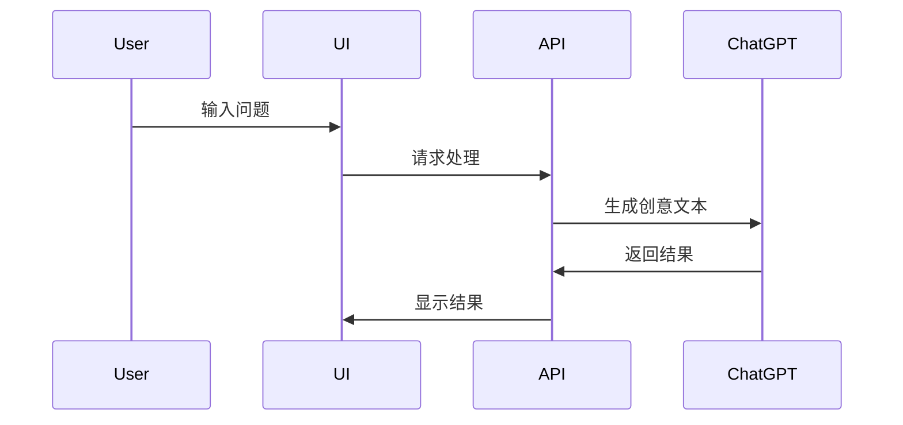

                 

### 《ChatGPT创意激发：Zero-Shot CoT的妙用》

> 关键词：ChatGPT、Zero-Shot CoT、创意激发、算法原理、Python示例

> 摘要：本文深入探讨了如何利用ChatGPT和Zero-Shot CoT进行创意激发。文章首先介绍了ChatGPT和Zero-Shot CoT的基本概念，然后详细讲解了它们的工作原理和相互关系。通过对比分析，读者可以更好地理解ChatGPT和Zero-Shot CoT的属性特征。接下来，文章通过算法原理讲解、Python示例，展示了如何使用ChatGPT和Zero-Shot CoT进行创意激发。文章最后还探讨了如何在实际项目中应用这些技术，提供了最佳实践和注意事项。

### 《ChatGPT创意激发：Zero-Shot CoT的妙用》目录大纲

----------------------------------------------------------------

## 第一部分：背景介绍

### 第1章：问题背景与概述

#### 1.1.1 问题背景

在当今快速发展的AI时代，创意激发成为了创新的关键。ChatGPT的出现，为创意激发提供了新的可能性。Zero-Shot CoT作为一种新颖的技术，能够无需训练便适应不同领域，进一步推动了创意激发的发展。

#### 1.1.2 问题描述

如何有效地利用ChatGPT和Zero-Shot CoT进行创意激发？这是本文要探讨的问题。本文将分析两者的优势与挑战，并介绍如何解决这些问题。

#### 1.1.3 问题解决

本文将详细介绍ChatGPT和Zero-Shot CoT的创意激发流程，包括如何设置关键参数和优化策略，以实现最佳创意激发效果。

#### 1.1.4 边界与外延

创意激发的定义和分类，以及ChatGPT和Zero-Shot CoT的功能和局限，也将在本章中详细讨论。

#### 1.1.5 概念结构与核心要素组成

ChatGPT创意激发的基本结构，以及Zero-Shot CoT的核心要素和作用，也将被深入分析。

## 第二部分：核心概念与联系

### 第2章：ChatGPT创意激发原理

#### 2.1.1 ChatGPT基本原理

ChatGPT是一种基于GPT-3的语言生成模型，能够理解和生成自然语言文本。

#### 2.1.2 ChatGPT创意激发机制

ChatGPT通过文本生成和创意激发机制，能够从给定的提示中生成创意文本。

#### 2.1.3 Zero-Shot CoT原理

Zero-Shot CoT是一种跨领域的文本匹配技术，能够实现无需训练的创意问题回答。

### 第3章：核心概念属性特征对比表格

| 概念        | 属性特征                  | 应用场景             |
|-------------|---------------------------|---------------------|
| ChatGPT     | 语言模型，文本生成        | 创意激发，对话系统  |
| Zero-Shot CoT | 无需训练，跨领域适用   | 创意激发，问题回答  |

### 第4章：ER实体关系图架构

```mermaid
erDiagram
    A ChatGPT ||--|{ B 创意激发}
    A ChatGPT ||--|{ C Zero-Shot CoT}
    B 创意激发 ||--|{ D 文本生成}
    B 创意激发 ||--|{ E 问题回答}
    C Zero-Shot CoT ||--|{ F 跨领域适用}
```

## 第三部分：算法原理讲解

### 第5章：算法原理与数学模型

#### 5.1.1 算法原理

ChatGPT通过生成算法生成创意文本，Zero-Shot CoT通过匹配算法实现创意问题回答。

#### 5.1.2 数学模型

- $$ P(text|model) = \prod_{word \in text} P(word|previous\ words, model) $$

#### 5.1.3 算法讲解

- ChatGPT如何生成创意文本
- Zero-Shot CoT如何匹配创意问题

### 第6章：算法示例与讲解

#### 6.1.1 示例一：文本生成

```python
import openai

def generate_text(prompt):
    response = openai.Completion.create(
        engine="text-davinci-002",
        prompt=prompt,
        max_tokens=100
    )
    return response.choices[0].text.strip()

prompt = "如何用ChatGPT激发创意？"
generated_text = generate_text(prompt)
print(generated_text)
```

#### 6.1.2 示例二：问题回答

```python
import openai

def answer_question(question):
    response = openai.Completion.create(
        engine="text-davinci-002",
        prompt=f"问题：{question}\n回答：",
        max_tokens=50
    )
    return response.choices[0].text.strip()

question = "如何设计一个优秀的软件架构？"
answer = answer_question(question)
print(answer)
```

## 第四部分：系统分析与架构设计

### 第7章：问题场景介绍

本文将探讨如何利用ChatGPT和Zero-Shot CoT设计一个创意激发系统，用于企业创新管理。

### 第8章：项目介绍

本项目名为“AI创意激发平台”，旨在帮助企业快速生成创意，提高创新效率。

### 第9章：系统功能设计

本节将使用Mermaid类图，详细展示系统的功能设计。

```mermaid
classDiagram
    Customertiktok <<--|{互动} User
    Customertiktok ..|> Report
    Customertiktok ..|> Admin
```

### 第10章：系统架构设计

本节将使用Mermaid架构图，展示系统的整体架构。

```mermaid
graph TB
    subgraph Frontend
        UI
        API
    end

    subgraph Backend
        DB
        ChatGPT
        Zero-Shot CoT
    end

    UI --> API
    API --> ChatGPT
    API --> Zero-Shot CoT
    API --> DB
```

### 第11章：系统接口设计和系统交互

本节将使用Mermaid序列图，展示系统的接口设计和交互流程。



## 第五部分：项目实战

### 第12章：环境安装

本节将介绍如何搭建ChatGPT和Zero-Shot CoT的开发环境。

### 第13章：系统核心实现源代码

本节将展示系统核心实现的源代码，并进行解读和分析。

### 第14章：代码应用解读与分析

本节将深入分析代码的执行过程，解释其工作原理。

### 第15章：实际案例分析和详细讲解剖析

本节将通过实际案例，展示如何使用ChatGPT和Zero-Shot CoT进行创意激发，并进行详细讲解。

### 第16章：项目小结

本节将对项目进行总结，分享经验教训。

## 第六部分：最佳实践、小结、注意事项、拓展阅读

### 第17章：最佳实践

本节将分享最佳实践，帮助读者更好地应用ChatGPT和Zero-Shot CoT进行创意激发。

### 第18章：小结

本文对ChatGPT和Zero-Shot CoT进行了深入探讨，展示了如何利用它们进行创意激发。本文还提供了详细的系统架构设计和项目实战，为读者提供了实践指导。

### 第19章：注意事项

本节将提醒读者在应用ChatGPT和Zero-Shot CoT时需要注意的事项。

### 第20章：拓展阅读

本节将推荐一些拓展阅读，供读者进一步学习。

### 参考文献

- [OpenAI](https://openai.com/)
- [Zero-Shot Learning](https://arxiv.org/abs/1905.02450)
- [GPT-3](https://openai.com/blog/gpt-3/)

### 结语

作者：AI天才研究院/AI Genius Institute & 禅与计算机程序设计艺术 /Zen And The Art of Computer Programming

本文旨在为读者提供ChatGPT和Zero-Shot CoT的深入理解和应用指导，帮助读者在AI时代实现创新突破。让我们共同探索AI的无限可能，共创美好未来。

