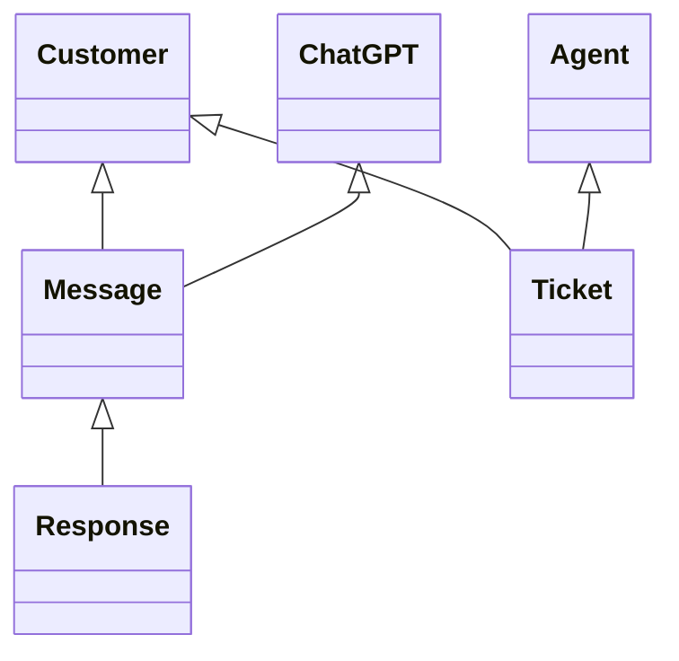
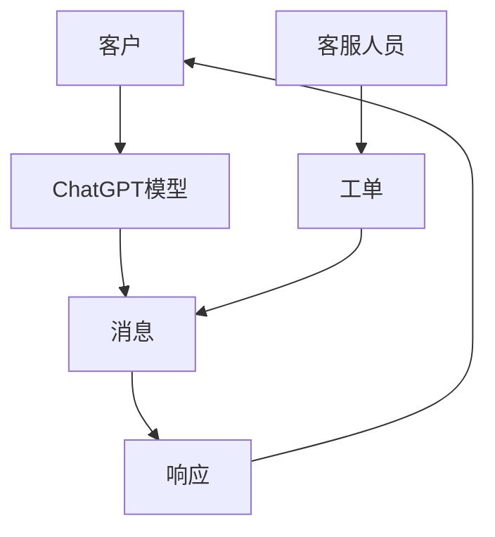
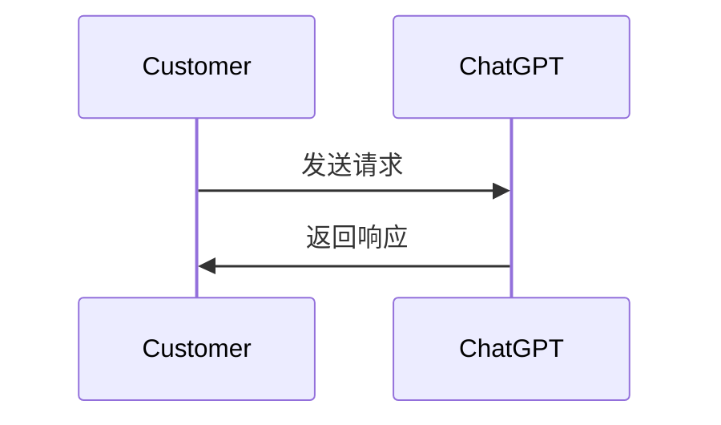

                 

# ChatGPT商业应用：提示词的经济价值

## 关键词：ChatGPT、商业应用、提示词、经济价值

> 摘要：本文深入探讨了ChatGPT在商业领域的广泛应用及其提示词的经济价值。通过分析ChatGPT的基本原理和提示词设计，结合具体案例分析，探讨了ChatGPT在不同行业中的商业应用模式，并提出了提示词设计的最佳实践与未来展望。

## 第一部分：引言

### 第1章：背景与问题阐述

#### 1.1 问题背景

##### 1.1.1 人工智能与自然语言处理的崛起

随着大数据和计算能力的提升，人工智能（AI）技术取得了显著进展。自然语言处理（NLP）作为AI的重要组成部分，在文本分析和理解方面发挥着关键作用。ChatGPT作为基于GPT-3的先进NLP模型，凭借其强大的文本生成能力，引起了广泛关注。

##### 1.1.2 ChatGPT的诞生与发展

ChatGPT是由OpenAI开发的一款基于GPT-3模型的聊天机器人，它利用深度学习技术，通过对海量文本数据的学习，能够生成自然流畅的对话。自2018年GPT-3发布以来，ChatGPT在各个领域都展现出了巨大的潜力。

#### 1.2 问题描述

##### 1.2.1 ChatGPT的优势

ChatGPT的优势在于其能够进行自然、流畅的对话，理解用户意图，生成高质量的文本。这使得它在商业应用中具有广泛的前景。

##### 1.2.2 商业应用中的潜在价值

ChatGPT在商业领域具有巨大的潜在价值，如客户服务、个性化推荐、内容生成等。然而，如何充分利用其优势，提升经济价值，是一个亟待解决的问题。

#### 1.3 问题解决

##### 1.3.1 提示词的作用

提示词（Prompt）是引导ChatGPT生成特定类型文本的关键因素。合理的提示词设计能够显著提升ChatGPT的生成质量。

##### 1.3.2 经济价值体现

通过优化提示词设计，提高ChatGPT的生成效率和准确性，可以在商业应用中实现成本降低、效率提升和用户体验改善，从而体现其经济价值。

#### 1.4 边界与外延

##### 1.4.1 ChatGPT的应用场景

ChatGPT适用于需要自然语言交互的各个场景，如客服、教育、金融、媒体等。

##### 1.4.2 商业模式分析

商业模式的创新是ChatGPT实现经济价值的关键。通过分析不同的商业模式，可以找到最佳的实现路径。

#### 1.5 概念结构与核心要素

##### 1.5.1 ChatGPT的工作原理

ChatGPT的工作原理涉及深度学习、神经网络和自然语言处理等多个领域。

##### 1.5.2 提示词的类型与设计

提示词的类型包括开放性提示和封闭性提示，设计原则包括明确性、简洁性和相关性。

#### 1.6 本章小结

本文初步探讨了ChatGPT的商业应用背景和提示词的经济价值。接下来，我们将深入分析ChatGPT的基本原理和提示词设计，并结合实际案例进行详细讨论。

### 第二部分：核心概念与原理

### 第2章：ChatGPT的基本原理

#### 2.1 ChatGPT的工作机制

##### 2.1.1 模型架构

ChatGPT采用的是GPT-3模型，其核心是一个大规模的预训练Transformer模型。Transformer模型通过自注意力机制（Self-Attention）处理输入文本，实现高维度的上下文表示。

##### 2.1.2 训练过程

ChatGPT的预训练过程包括两个阶段：无监督预训练和有监督微调。无监督预训练阶段使用海量文本数据训练模型，使其具备基础的语言理解能力。有监督微调阶段则使用特定领域的数据进行微调，以适应具体应用场景。

##### 2.1.3 生成过程

ChatGPT的生成过程是基于Transformer模型的上下文生成机制。给定一个提示词或短语，模型会根据预训练的结果，生成与之相关的自然语言文本。

#### 2.2 提示词的类型与设计

##### 2.2.1 提示词的定义

提示词是引导ChatGPT生成文本的关键输入。它通常是一个短语或问题，用来指导模型理解用户意图和生成相关内容。

##### 2.2.2 提示词的类型

提示词可以分为开放性提示和封闭性提示。开放性提示允许模型生成多样化的回答，而封闭性提示则限定模型的回答范围。

##### 2.2.3 提示词设计原则

提示词设计应遵循明确性、简洁性和相关性的原则。明确性要求提示词清晰明确，简洁性要求提示词简短精炼，相关性要求提示词与生成内容密切相关。

#### 2.3 提示词的经济价值

##### 2.3.1 提升效率

合理的提示词设计可以减少用户和ChatGPT之间的交互次数，提高整体效率。

##### 2.3.2 提高质量

高质量的提示词能够引导ChatGPT生成更准确、更高质量的文本，提升用户体验。

##### 2.3.3 降低成本

通过提高生成效率和降低人工干预，提示词优化有助于降低商业应用的成本。

#### 2.4 ChatGPT与自然语言处理的关系

##### 2.4.1 自然语言处理的发展历程

自然语言处理经历了从规则驱动到统计驱动，再到深度学习的演变。ChatGPT作为深度学习时代的产物，代表了NLP领域的最新进展。

##### 2.4.2 ChatGPT在NLP中的应用

ChatGPT在自然语言理解、文本生成、问答系统等多个方面展现了其强大的能力，成为NLP应用的重要工具。

#### 2.5 本章小结

本章详细介绍了ChatGPT的基本原理、提示词的类型与设计原则，以及提示词的经济价值。接下来，我们将通过具体案例，探讨ChatGPT在商业应用中的实际表现。

### 第三部分：ChatGPT在商业应用中的案例分析

### 第3章：ChatGPT在不同行业中的应用

#### 3.1 零售业

##### 3.1.1 客户服务

ChatGPT在零售业中的客户服务应用广泛。通过自然语言交互，ChatGPT能够快速响应客户查询，提供个性化的服务，提升客户满意度。

##### 3.1.2 个性化推荐

ChatGPT结合用户历史行为数据，能够生成个性化的商品推荐，提升销售转化率。

#### 3.2 教育行业

##### 3.2.1 在线教育

ChatGPT可以作为在线教育平台的智能助手，为学生提供实时辅导和答疑服务。

##### 3.2.2 智能辅导

ChatGPT能够根据学生的学习进度和需求，生成个性化的学习计划和资源，提高学习效果。

#### 3.3 金融行业

##### 3.3.1 金融服务

ChatGPT能够为金融客户提供智能咨询和推荐服务，提升金融服务效率。

##### 3.3.2 投资咨询

ChatGPT结合市场数据和用户偏好，能够提供专业的投资建议，降低投资风险。

#### 3.4 媒体与内容创作

##### 3.4.1 内容生成

ChatGPT能够自动生成文章、新闻报道等，提高内容创作效率。

##### 3.4.2 用户互动

ChatGPT能够与用户进行实时互动，增强用户体验。

#### 3.5 其他行业应用

##### 3.5.1 健康医疗

ChatGPT能够提供智能医疗咨询和健康指导，提升医疗服务水平。

##### 3.5.2 制造业

ChatGPT能够辅助制造流程中的决策，提高生产效率。

##### 3.5.3 物流运输

ChatGPT能够优化物流路线和调度，提高物流效率。

#### 3.6 本章小结

本章通过具体案例分析，展示了ChatGPT在多个行业中的应用场景和商业价值。接下来，我们将进一步探讨提示词设计的最佳实践。

### 第四部分：提示词设计技巧与最佳实践

### 第4章：提示词的设计与优化

#### 4.1 提示词设计原则

##### 4.1.1 明确目的

在设计提示词时，首先要明确目标，确保提示词能够引导ChatGPT生成所需类型的内容。

##### 4.1.2 简洁明了

提示词应简短精炼，避免冗长和复杂的表述，以便ChatGPT能够准确理解。

##### 4.1.3 相关性强

提示词应与生成内容密切相关，确保ChatGPT能够生成高质量的相关内容。

#### 4.2 提示词优化方法

##### 4.2.1 数据驱动的优化

通过分析大量历史数据，找出常见的问题和优化点，对提示词进行针对性优化。

##### 4.2.2 历史数据回顾

定期回顾历史数据，分析提示词的效果，发现并解决潜在问题。

##### 4.2.3 实时反馈机制

建立实时反馈机制，及时收集用户反馈，根据反馈调整提示词。

#### 4.3 提示词案例分析

##### 4.3.1 成功案例

通过分析成功案例，了解优秀提示词的设计原则和实践方法。

##### 4.3.2 失败案例

通过分析失败案例，吸取教训，避免在提示词设计中犯同样错误。

#### 4.4 最佳实践与注意事项

##### 4.4.1 文本质量的重要性

确保生成的文本质量高，避免出现错误或不准确的信息。

##### 4.4.2 提示词使用的误区

避免过度依赖提示词，导致生成内容单一或缺乏创意。

##### 4.4.3 安全与隐私保护

在设计和使用提示词时，注意保护用户隐私，遵守相关法律法规。

#### 4.5 本章小结

本章详细介绍了提示词的设计原则、优化方法和最佳实践。通过合理设计提示词，可以进一步提升ChatGPT的商业应用价值。

### 第五部分：未来展望与趋势

### 第5章：ChatGPT商业应用的发展趋势

#### 5.1 技术发展趋势

##### 5.1.1 模型性能的提升

随着计算能力的提升和算法的优化，ChatGPT的模型性能将进一步提升，生成质量更高。

##### 5.1.2 提示词技术的进步

提示词技术将不断进化，实现更加智能化和自动化的设计。

##### 5.1.3 交叉领域的融合

ChatGPT将在更多交叉领域发挥作用，如医疗、金融、教育等，实现跨领域的应用。

#### 5.2 商业模式创新

##### 5.2.1 平台模式的构建

构建平台模式，将ChatGPT与其他服务集成，实现规模化应用。

##### 5.2.2 服务模式的变革

探索新的服务模式，如订阅制、按需付费等，满足不同客户的需求。

##### 5.2.3 新兴市场的开拓

开拓新兴市场，如东南亚、非洲等，推动ChatGPT在全球范围内的应用。

#### 5.3 行业应用前景

##### 5.3.1 深度融入各行业

ChatGPT将深度融入各行业，助力产业升级和数字化转型。

##### 5.3.2 产业升级与变革

ChatGPT将推动产业升级和变革，提高生产效率和创新能力。

##### 5.3.3 社会价值与影响

ChatGPT将在提升社会价值方面发挥重要作用，如教育公平、医疗援助等。

#### 5.4 未来展望

##### 5.4.1 可能遇到的挑战

面临数据隐私、伦理道德、法律法规等方面的挑战。

##### 5.4.2 发展机遇

抓住技术创新、市场拓展等方面的机遇，实现可持续发展。

#### 5.5 本章小结

本章对ChatGPT商业应用的未来趋势进行了展望，分析了技术发展、商业模式创新和行业应用前景。未来，ChatGPT将在更多领域展现其潜力。

### 第六部分：项目实战

### 第6章：ChatGPT项目实战

#### 6.1 项目

##### 6.1.1 项目背景

本项目旨在利用ChatGPT构建一个智能客服系统，为用户提供24/7的在线支持。

##### 6.1.2 项目目标

通过ChatGPT的智能对话功能，提升客户满意度，降低人工成本。

#### 6.2 系统功能设计

##### 6.2.1 域模型设计

使用Mermaid类图定义系统的领域模型。



##### 6.2.2 系统架构设计

使用Mermaid架构图定义系统的整体架构。



##### 6.2.3 系统接口设计

定义系统的主要接口，包括客户请求接口、响应结果接口等。

```python
# 客户请求接口
class CustomerRequest:
    def __init__(self, query):
        self.query = query

# 响应结果接口
class ResponseResult:
    def __init__(self, message):
        self.message = message
```

##### 6.2.4 系统交互设计

使用Mermaid序列图定义系统的交互流程。



#### 6.3 系统核心实现

##### 6.3.1 环境安装

安装必要的库和依赖项，如transformers、torch等。

```bash
pip install transformers torch
```

##### 6.3.2 系统核心实现

实现ChatGPT的接口和处理逻辑。

```python
from transformers import ChatGPTModel

class ChatGPTCore:
    def __init__(self):
        self.model = ChatGPTModel.from_pretrained('openai/gpt-3')

    def generate_response(self, query):
        inputs = self.model.get_input_from_text(query)
        response = self.model.generate(inputs)
        return response.text
```

##### 6.3.3 代码应用解读与分析

对实现的核心代码进行解读和分析，确保理解每个步骤的功能和作用。

```python
# 示例：生成响应
def main():
    query = "我为什么不能登录我的账户？"
    chatgpt = ChatGPTCore()
    response = chatgpt.generate_response(query)
    print(response)

if __name__ == "__main__":
    main()
```

##### 6.3.4 实际案例分析和详细讲解剖析

通过实际案例，展示系统在业务场景中的应用效果，并进行详细讲解和剖析。

```python
# 示例：实际应用场景
def handle_customer_request(customer_request):
    chatgpt = ChatGPTCore()
    response = chatgpt.generate_response(customer_request.query)
    return ResponseResult(response)

customer_request = CustomerRequest("我为什么不能登录我的账户？")
response_result = handle_customer_request(customer_request)
print(response_result.message)
```

##### 6.3.5 项目小结

总结项目的关键点和经验教训，为后续项目提供参考。

```plaintext
项目小结：

1. 确定了项目目标和系统功能设计。
2. 实现了ChatGPT的核心接口和处理逻辑。
3. 通过实际案例验证了系统在业务场景中的应用效果。
4. 项目取得了一定的成果，但仍需进一步优化和改进。
```

### 附录

#### 作者信息

- 作者：AI天才研究院/AI Genius Institute & 禅与计算机程序设计艺术 /Zen And The Art of Computer Programming

通过本文的逐步分析和实战，我们深入了解了ChatGPT的商业应用和提示词的经济价值。希望本文能够为读者提供有价值的见解和实践指导。让我们共同期待ChatGPT在未来发挥更大的作用。

