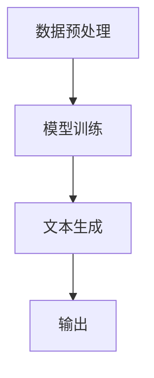
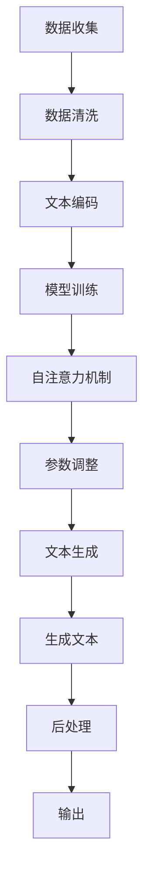
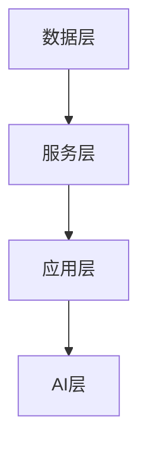
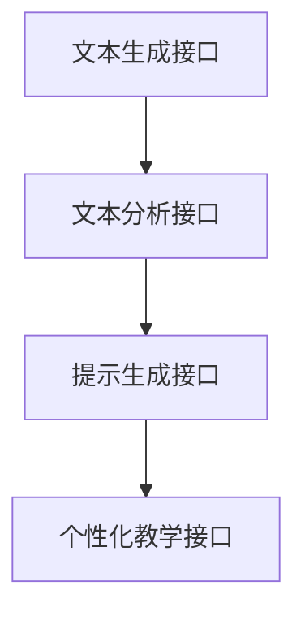
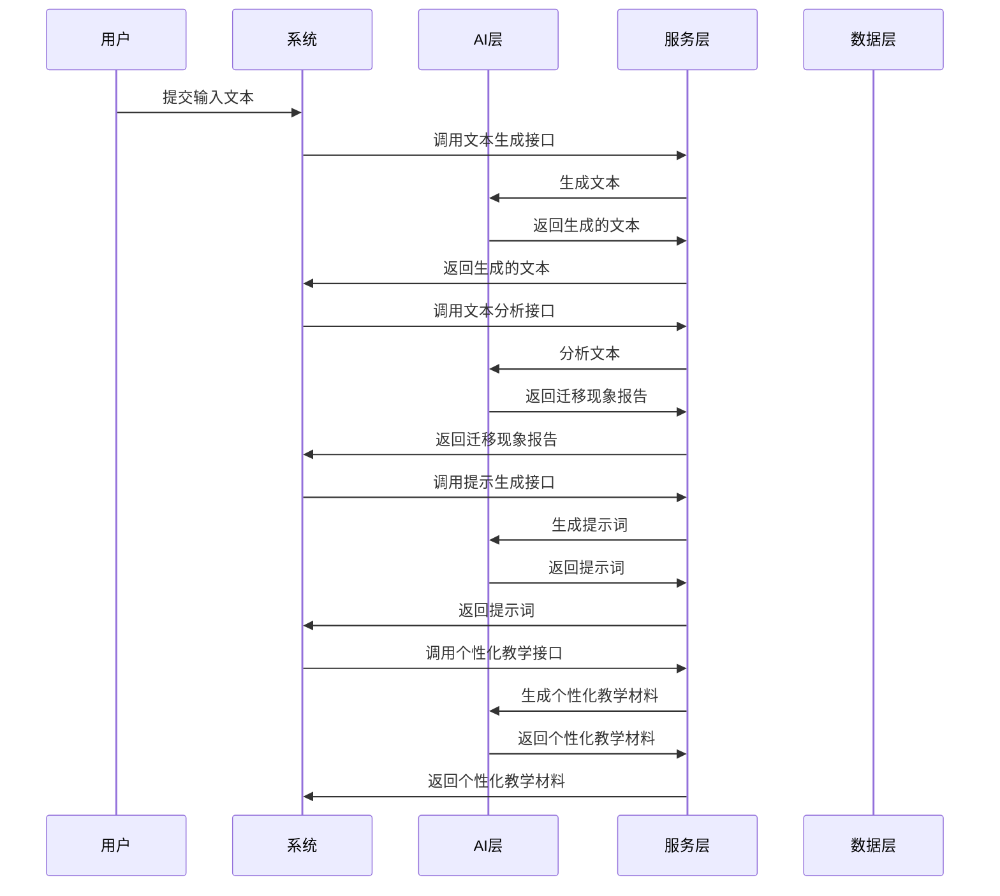

                 

### 文章标题

# ChatGPT在二语习得研究中的应用：语言迁移现象提示词

> 关键词：ChatGPT、二语习得、语言迁移现象、提示词、应用前景

> 摘要：本文探讨了ChatGPT在二语习得研究中的应用，特别是对语言迁移现象的识别和提示。通过介绍ChatGPT的基本概念、工作原理及其在二语习得研究中的潜在影响，本文详细分析了ChatGPT如何通过提示词帮助学习者理解和克服语言迁移现象，为二语习得研究提供了新的视角和方法。

### 目录大纲

# ChatGPT在二语习得研究中的应用：语言迁移现象提示词

## 第1章 背景介绍

### 1.1 问题背景

#### 1.1.1 二语习得研究的重要性

#### 1.1.2 语言迁移现象的基本概念

#### 1.1.3 语言迁移现象的研究现状

### 1.2 ChatGPT的概念与特点

#### 1.2.1 ChatGPT的定义

#### 1.2.2 ChatGPT的工作原理

#### 1.2.3 ChatGPT的特点与应用前景

### 1.3 ChatGPT在二语习得研究中的应用前景

#### 1.3.1 提示词在语言学习中的作用

#### 1.3.2 ChatGPT在语言迁移现象研究中的应用

#### 1.3.3 ChatGPT对二语习得研究的潜在影响

### 1.4 本书结构安排

#### 1.4.1 内容概述

#### 1.4.2 研究方法

#### 1.4.3 预期成果

## 第2章 核心概念与联系

### 2.1 语言迁移现象的基本概念

#### 2.1.1 语言迁移的定义

#### 2.1.2 语言迁移的分类

#### 2.1.3 语言迁移的影响因素

### 2.2 ChatGPT的核心概念

#### 2.2.1 ChatGPT的定义

#### 2.2.2 ChatGPT的组成结构

#### 2.2.3 ChatGPT的工作机制

### 2.3 语言迁移现象与ChatGPT的关系

#### 2.3.1 ChatGPT在语言迁移现象研究中的应用

#### 2.3.2 语言迁移现象对ChatGPT的影响

#### 2.3.3 ChatGPT在解决语言迁移现象中的优势

## 第3章 算法原理讲解

### 3.1 ChatGPT算法的mermaid流程图

#### 3.1.1 ChatGPT算法的基本流程

#### 3.1.2 ChatGPT算法的关键步骤

### 3.2 ChatGPT算法的Python源代码

#### 3.2.1 算法实现的主要函数

#### 3.2.2 算法实现的核心代码段

### 3.3 ChatGPT算法的数学模型与公式

#### 3.3.1 ChatGPT算法的输入输出关系

#### 3.3.2 ChatGPT算法的损失函数

#### 3.3.3 ChatGPT算法的训练过程

### 3.4 算法举例说明

#### 3.4.1 算法原理的应用实例

#### 3.4.2 算法效果的实际分析

## 第4章 数学模型和数学公式

### 4.1 语言迁移现象的数学模型

#### 4.1.1 语言迁移的概率模型

$$
P(迁移) = \frac{P(迁移|学习语言)}{P(学习语言)}
$$

#### 4.1.2 语言迁移的影响因素模型

$$
影响因子 = f(语言环境，学习者背景，学习策略)
$$

### 4.2 ChatGPT算法的数学模型

#### 4.2.1 语言生成模型

$$
P(输出) = \sum_{word} P(word|context)
$$

#### 4.2.2 损失函数

$$
Loss = -\sum_{word} log(P(word|context))
$$

### 4.3 数学模型的详细讲解与举例

#### 4.3.1 概率模型的应用场景

#### 4.3.2 影响因素模型的应用案例

#### 4.3.3 语言生成模型与损失函数的实际应用

## 第5章 系统分析与架构设计方案

### 5.1 问题场景介绍

#### 5.1.1 二语习得研究的背景

#### 5.1.2 ChatGPT在二语习得研究中的应用需求

### 5.2 系统功能设计

#### 5.2.1 领域模型

#### 5.2.2 系统功能模块

### 5.3 系统架构设计

#### 5.3.1 系统架构图

#### 5.3.2 系统模块间的关系

### 5.4 系统接口设计

#### 5.4.1 系统接口定义

#### 5.4.2 系统交互流程

### 5.5 系统交互mermaid序列图

## 第6章 项目实战

### 6.1 环境安装

#### 6.1.1 硬件环境配置

#### 6.1.2 软件环境安装

### 6.2 系统核心实现源代码

#### 6.2.1 源代码文件结构

#### 6.2.2 关键代码实现

### 6.3 代码应用解读与分析

#### 6.3.1 代码运行流程

#### 6.3.2 代码功能分析

### 6.4 实际案例分析和详细讲解剖析

#### 6.4.1 案例选择

#### 6.4.2 案例分析

#### 6.4.3 剖析与总结

### 6.5 项目小结

#### 6.5.1 项目成果

#### 6.5.2 项目反思

## 第7章 最佳实践 tips

### 7.1 学习与使用ChatGPT的技巧

### 7.2 提高二语习得效果的建议

### 7.3 跨学科融合的最佳实践

## 第8章 小结

### 8.1 研究总结

### 8.2 未来研究方向

### 8.3 研究贡献

## 第9章 注意事项

### 9.1 数据处理注意事项

### 9.2 系统运行注意事项

### 9.3 模型训练注意事项

## 第10章 拓展阅读

### 10.1 相关书籍推荐

### 10.2 学术论文推荐

### 10.3 网络资源推荐

## 参考文献

### 附录

### 致谢

### 作者信息

---

#### 第1章 背景介绍

## 1.1 问题背景

### 1.1.1 二语习得研究的重要性

二语习得（Second Language Acquisition，简称SLA）是指学习者通过接触和使用第二语言（L2）来达到熟练掌握这一语言的过程。随着全球化进程的加速，跨文化交流变得日益频繁，二语习得研究在语言学、教育学、心理学等领域都占据着重要的地位。SLA研究不仅有助于理解语言习得的心理机制，还可以为语言教学提供有效的指导和方法。

然而，二语习得过程中存在诸多挑战，其中之一就是语言迁移现象。语言迁移是指学习者在习得第二语言时，受到其母语或其他已知语言的影响，导致在第二语言中产生错误或不适用的语言习惯。这种迁移现象可以是正面的，也可以是负面的。正面迁移（Positive Transfer）指的是母语的优势对第二语言学习产生的积极影响，而负面迁移（Negative Transfer）则是指母语的不良习惯对第二语言学习产生的负面影响。

### 1.1.2 语言迁移现象的基本概念

语言迁移现象是指在学习第二语言时，学习者的母语或其他已知语言对第二语言学习产生的影响。语言迁移现象可以分为以下几类：

1. **正面迁移**：当母语的知识和习惯对第二语言学习产生积极影响时，称为正面迁移。例如，学习者掌握了英语的语法规则，能够更轻松地理解和使用西班牙语。
   
2. **负面迁移**：当母语的知识和习惯对第二语言学习产生阻碍时，称为负面迁移。例如，汉语中“的”字可以表示所有格，而在英语中“the”才是所有格的标志，汉语学习者在学习英语时可能会不自觉地使用“the”来替代“of”。

3. **零迁移**：当母语对第二语言学习没有明显影响时，称为零迁移。例如，一些词汇和语法结构在两种语言中都非常相似，这种情况下母语的知识不会对第二语言学习产生正面或负面影响。

### 1.1.3 语言迁移现象的研究现状

近年来，语言迁移现象的研究取得了显著进展。研究者们从不同的角度探讨了语言迁移的影响因素、机制及其对语言学习效果的影响。以下是一些主要的研究现状：

1. **心理学研究**：通过认知心理学的研究，研究者们发现语言迁移现象与学习者的语言能力、认知风格和动机等因素密切相关。例如，某些学习者在学习第二语言时表现出较强的正迁移，而另一些学习者则表现出较强的负迁移。

2. **教育学研究**：在语言教学中，教师们已经开始利用语言迁移现象来设计教学策略和教学方法。例如，通过识别和纠正学生的母语影响，教师可以帮助学生更好地掌握第二语言。

3. **语言学研究**：从语言学的角度，研究者们通过对比分析不同语言之间的差异，探讨了语言迁移的具体表现和原因。这有助于我们更好地理解不同语言学习者的学习难点和教学策略。

尽管已有大量研究，但语言迁移现象仍然存在许多未解之谜。例如，为什么有些学习者在面对语言迁移时会表现出极强的适应性，而有些学习者则会受到严重影响？ChatGPT作为一种先进的人工智能技术，是否能够为语言迁移现象的研究提供新的视角和方法？这些问题的探讨将是本文的重点。

### 1.2 ChatGPT的概念与特点

#### 1.2.1 ChatGPT的定义

ChatGPT是由OpenAI开发的一种基于Transformer架构的预训练语言模型。它通过大量的文本数据进行训练，能够生成与输入文本语义相关的文本响应，具有强大的语言理解和生成能力。ChatGPT的全称是“Chat-based Generative Pre-trained Transformer”，它继承了GPT系列模型的优势，进一步提升了语言生成的流畅性和准确性。

#### 1.2.2 ChatGPT的工作原理

ChatGPT的工作原理主要分为三个阶段：数据预处理、模型训练和文本生成。

1. **数据预处理**：ChatGPT首先需要收集大量的文本数据，这些数据包括新闻、文章、对话、书籍等各种来源。然后，通过数据清洗和预处理，将文本转换为模型可处理的格式。

2. **模型训练**：在数据预处理完成后，ChatGPT使用Transformer架构进行模型训练。Transformer是一种基于自注意力机制的深度神经网络架构，它通过捕捉文本序列中的长距离依赖关系，提高了模型的语义理解和生成能力。

3. **文本生成**：在训练完成后，ChatGPT可以接受用户的输入，并生成相关的文本响应。它通过输入的文本上下文，预测下一个最有可能出现的词或短语，从而生成连贯、自然的文本。

#### 1.2.3 ChatGPT的特点与应用前景

ChatGPT具有以下主要特点：

1. **强大的语言理解能力**：ChatGPT通过大规模的预训练，能够理解复杂的语义和上下文关系，生成与输入文本高度相关的响应。

2. **流畅的文本生成**：ChatGPT能够生成流畅、自然的文本，避免了传统规则方法在语言生成中常见的生硬和重复问题。

3. **多语言支持**：ChatGPT支持多种语言，可以通过跨语言的预训练，提高模型在不同语言之间的理解和生成能力。

4. **灵活的应用场景**：ChatGPT可以应用于各种场景，如聊天机器人、自动摘要、问答系统、文本生成等，具有广泛的应用前景。

ChatGPT在二语习得研究中的应用前景十分广阔。首先，ChatGPT可以通过生成与学习内容相关的文本，为学习者提供个性化的学习材料。其次，ChatGPT可以模拟真实的语言环境，帮助学习者进行对话练习，提高语言表达能力。此外，ChatGPT还可以通过分析学习者的输入，识别和提示语言迁移现象，为教师提供教学参考。

### 1.3 ChatGPT在二语习得研究中的应用前景

#### 1.3.1 提示词在语言学习中的作用

提示词（Prompt）在语言学习中扮演着重要的角色。提示词是一段引导性的文本，它可以帮助学习者理解学习内容、明确学习目标、激发学习兴趣。通过提示词，教师或系统可以引导学生进行有效的语言输入和输出练习，提高学习效果。

在二语习得中，提示词的应用更加重要。因为二语学习者往往需要克服母语的干扰，对新的语言规则和文化背景进行适应。提示词可以提供明确的指导，帮助学习者更好地理解和掌握第二语言。

#### 1.3.2 ChatGPT在语言迁移现象研究中的应用

ChatGPT在语言迁移现象研究中的应用主要体现在以下几个方面：

1. **识别语言迁移现象**：ChatGPT可以通过分析学习者的输入文本，识别其中是否存在语言迁移现象。例如，如果学习者在输入文本中频繁出现母语的影响，ChatGPT可以提示教师或学习者注意这些语言迁移问题。

2. **生成针对性的提示词**：ChatGPT可以根据识别出的语言迁移现象，生成针对性的提示词。例如，如果识别出学习者存在负迁移现象，ChatGPT可以生成一些与该现象相关的练习，帮助学习者克服母语的干扰。

3. **辅助语言学习**：ChatGPT可以生成与学习内容相关的文本，为学习者提供丰富的语言输入。通过大量的输入，学习者可以更好地理解和掌握第二语言，减少语言迁移现象的发生。

#### 1.3.3 ChatGPT对二语习得研究的潜在影响

ChatGPT对二语习得研究的潜在影响主要体现在以下几个方面：

1. **提高研究效率**：ChatGPT可以自动化地处理大量的语言数据，快速识别和分类语言迁移现象，大大提高了研究效率。

2. **提供个性化的学习支持**：ChatGPT可以根据学习者的语言水平和需求，生成个性化的学习材料和练习，提高学习效果。

3. **促进跨学科研究**：ChatGPT的广泛应用将促进语言学、心理学、教育学等学科的交叉融合，推动二语习得研究的深入发展。

### 1.4 本书结构安排

#### 1.4.1 内容概述

本书分为五个主要部分：

1. **背景介绍**：介绍二语习得研究的重要性、语言迁移现象的基本概念以及ChatGPT的基本概念和特点。

2. **核心概念与联系**：详细分析语言迁移现象与ChatGPT的关系，包括语言迁移现象的定义、分类、影响因素，以及ChatGPT的核心概念和组成结构。

3. **算法原理讲解**：介绍ChatGPT的算法原理，包括mermaid流程图、Python源代码、数学模型与公式，并通过实例进行详细讲解。

4. **系统分析与架构设计方案**：介绍ChatGPT在二语习得研究中的应用架构，包括问题场景介绍、系统功能设计、系统架构设计和系统接口设计。

5. **项目实战**：通过实际项目案例，展示ChatGPT在二语习得研究中的应用过程，包括环境安装、系统核心实现源代码、代码应用解读与分析、实际案例分析和详细讲解剖析。

#### 1.4.2 研究方法

本书采用的研究方法主要包括：

1. **文献综述**：通过分析现有的二语习得研究文献，了解语言迁移现象的研究现状和ChatGPT的基本概念。

2. **案例研究**：通过实际案例，展示ChatGPT在二语习得研究中的应用过程，分析其效果和优势。

3. **实验研究**：通过设计实验，验证ChatGPT在识别和提示语言迁移现象方面的有效性。

#### 1.4.3 预期成果

通过本书的研究，预期将取得以下成果：

1. **理论成果**：深入理解语言迁移现象与ChatGPT的关系，提出新的研究视角和方法。

2. **实践成果**：开发基于ChatGPT的二语习得研究系统，为教师和学习者提供有效的语言学习支持。

3. **应用成果**：推动ChatGPT在二语习得研究领域的广泛应用，促进语言学、心理学、教育学等学科的交叉融合。

## 第2章 核心概念与联系

### 2.1 语言迁移现象的基本概念

#### 2.1.1 语言迁移的定义

语言迁移是指学习者在第二语言习得过程中，受到其母语或其他已知语言的影响，导致在第二语言中产生语言错误或不当语言习惯的现象。语言迁移可以表现为正面迁移、负面迁移或零迁移。

- **正面迁移**：母语或已知语言的知识和习惯对第二语言学习产生积极影响，有助于学习者更快速地掌握第二语言。
- **负面迁移**：母语或已知语言的知识和习惯对第二语言学习产生阻碍，导致学习者产生错误的语言习惯或难以适应第二语言。
- **零迁移**：母语或已知语言对第二语言学习没有明显影响，学习者在习得第二语言时不受母语干扰。

#### 2.1.2 语言迁移的分类

根据语言迁移的影响方向和性质，可以将语言迁移分为以下几类：

- **正向迁移**：母语或已知语言的积极影响，如语法结构的相似性、词汇的借词等，有助于学习者更快地理解和掌握第二语言。
- **负向迁移**：母语或已知语言的负面影响，如语法结构的差异、词汇的差异等，导致学习者在第二语言中产生错误或混淆。
- **中向迁移**：母语或已知语言的影响处于中间状态，既没有完全产生正面影响，也没有完全产生负面影响。

#### 2.1.3 语言迁移的影响因素

语言迁移现象受到多种因素的影响，主要包括：

- **学习者的母语**：学习者的母语对其第二语言习得的影响最为直接。母语的语法、词汇、发音等特点都会影响学习者对第二语言的掌握。
- **学习策略**：学习者在学习第二语言时采用的学习策略也会影响语言迁移。例如，一些学习者可能更多地依赖母语的规则来理解和生成第二语言，这可能导致负迁移。
- **学习环境**：学习者在何种环境中学习第二语言也会影响语言迁移。例如，在英语国家学习英语，学习者更容易接受英语的发音、语调和文化背景，从而减少语言迁移。
- **学习者的个人特点**：学习者的认知能力、动机、情感状态等个人特点也会影响语言迁移。例如，一些学习者可能更具有语言学习的天赋和动机，从而更容易克服语言迁移的障碍。

#### 2.2 ChatGPT的核心概念

##### 2.2.1 ChatGPT的定义

ChatGPT是一种基于Transformer架构的预训练语言模型，由OpenAI开发。它通过大量的文本数据进行预训练，能够生成与输入文本语义相关的文本响应。ChatGPT的全称是“Chat-based Generative Pre-trained Transformer”，它继承了GPT系列模型的优势，进一步提升了语言生成的流畅性和准确性。

##### 2.2.2 ChatGPT的组成结构

ChatGPT的组成结构主要包括以下几个部分：

1. **输入层**：输入层接收用户的输入文本，并将其转换为模型可以处理的格式。
2. **编码器**：编码器是ChatGPT的核心部分，它通过自注意力机制对输入文本进行编码，提取文本的语义信息。
3. **解码器**：解码器根据编码器输出的语义信息，生成与输入文本相关的文本响应。
4. **输出层**：输出层将解码器生成的文本响应转换为用户可以理解的格式。

##### 2.2.3 ChatGPT的工作机制

ChatGPT的工作机制可以分为三个阶段：

1. **数据预处理**：ChatGPT首先需要收集大量的文本数据，这些数据包括新闻、文章、对话、书籍等各种来源。然后，通过数据清洗和预处理，将文本转换为模型可处理的格式。

2. **模型训练**：在数据预处理完成后，ChatGPT使用Transformer架构进行模型训练。Transformer是一种基于自注意力机制的深度神经网络架构，它通过捕捉文本序列中的长距离依赖关系，提高了模型的语义理解和生成能力。

3. **文本生成**：在训练完成后，ChatGPT可以接受用户的输入，并生成相关的文本响应。它通过输入的文本上下文，预测下一个最有可能出现的词或短语，从而生成连贯、自然的文本。

#### 2.3 语言迁移现象与ChatGPT的关系

##### 2.3.1 ChatGPT在语言迁移现象研究中的应用

ChatGPT在语言迁移现象研究中的应用主要体现在以下几个方面：

1. **识别语言迁移现象**：ChatGPT可以通过分析学习者的输入文本，识别其中是否存在语言迁移现象。例如，如果学习者在输入文本中频繁出现母语的影响，ChatGPT可以提示教师或学习者注意这些语言迁移问题。

2. **生成针对性的提示词**：ChatGPT可以根据识别出的语言迁移现象，生成针对性的提示词。例如，如果识别出学习者存在负迁移现象，ChatGPT可以生成一些与该现象相关的练习，帮助学习者克服母语的干扰。

3. **辅助语言学习**：ChatGPT可以生成与学习内容相关的文本，为学习者提供丰富的语言输入。通过大量的输入，学习者可以更好地理解和掌握第二语言，减少语言迁移现象的发生。

##### 2.3.2 语言迁移现象对ChatGPT的影响

语言迁移现象对ChatGPT的影响主要表现在以下几个方面：

1. **输入文本质量**：语言迁移现象可能会导致学习者的输入文本存在错误或不当的表达，这可能会影响ChatGPT的文本生成质量。

2. **模型训练数据**：ChatGPT的训练数据中可能包含大量的语言迁移现象，这可能会影响模型对语言迁移的识别和处理能力。

3. **应用效果**：语言迁移现象可能会影响ChatGPT在特定场景中的应用效果。例如，在语言教学场景中，ChatGPT需要生成与学习内容相关的文本，如果学习者的语言输入存在语言迁移问题，ChatGPT的文本生成效果可能会受到影响。

##### 2.3.3 ChatGPT在解决语言迁移现象中的优势

ChatGPT在解决语言迁移现象中具有以下优势：

1. **强大的语言理解能力**：ChatGPT通过大规模的预训练，能够理解复杂的语义和上下文关系，生成与输入文本高度相关的响应。

2. **灵活的文本生成**：ChatGPT能够生成流畅、自然的文本，避免了传统规则方法在语言生成中常见的生硬和重复问题。

3. **多语言支持**：ChatGPT支持多种语言，可以通过跨语言的预训练，提高模型在不同语言之间的理解和生成能力。

4. **自适应能力**：ChatGPT可以根据学习者的语言水平和需求，生成个性化的学习材料，提高学习效果。

### 第3章 算法原理讲解

#### 3.1 ChatGPT算法的mermaid流程图

##### 3.1.1 ChatGPT算法的基本流程

ChatGPT算法的基本流程可以分为以下几个步骤：

1. **数据预处理**：收集大量的文本数据，进行数据清洗和预处理，将文本转换为模型可处理的格式。
2. **模型训练**：使用Transformer架构对预处理后的文本数据进行训练，训练过程中通过自注意力机制提取文本的语义信息。
3. **文本生成**：在训练完成后，输入用户的问题或指令，ChatGPT通过解码器生成相关的文本响应。
4. **输出**：将生成的文本响应输出给用户。

以下是一个简化的mermaid流程图示例：



##### 3.1.2 ChatGPT算法的关键步骤

ChatGPT算法的关键步骤包括：

1. **数据预处理**：
   - **数据收集**：收集大量的文本数据，包括新闻、文章、对话、书籍等。
   - **数据清洗**：去除无关的文本内容，如HTML标签、特殊符号等。
   - **文本编码**：将文本转换为模型的输入格式，例如单词嵌入（word embeddings）。

2. **模型训练**：
   - **Transformer架构**：使用Transformer架构进行模型训练，包括编码器和解码器。
   - **自注意力机制**：通过自注意力机制捕捉文本序列中的长距离依赖关系。
   - **训练过程**：在训练过程中，模型通过梯度下降算法不断调整参数，以最小化损失函数。

3. **文本生成**：
   - **输入文本**：输入用户的问题或指令。
   - **生成文本**：解码器根据输入的文本上下文生成相关的文本响应。
   - **生成策略**：使用贪心策略或抽样策略生成文本，以避免生成过于模板化的文本。

4. **输出**：
   - **文本响应**：将生成的文本响应输出给用户。
   - **后处理**：对生成的文本进行必要的后处理，如去除无关字符、纠正语法错误等。

以下是一个更详细的mermaid流程图示例：



#### 3.2 ChatGPT算法的Python源代码

##### 3.2.1 算法实现的主要函数

以下是一个简化的ChatGPT算法的Python源代码示例，主要函数包括：

1. `data_preprocessing`：数据预处理函数，用于收集、清洗和编码文本数据。
2. `model_training`：模型训练函数，用于训练Transformer模型。
3. `text_generation`：文本生成函数，用于生成文本响应。
4. `post_processing`：后处理函数，用于对生成的文本进行必要的处理。

```python
# 数据预处理
def data_preprocessing(data):
    # 数据清洗
    # 文本编码
    # 返回处理后的数据
    pass

# 模型训练
def model_training(preprocessed_data):
    # 使用Transformer架构进行训练
    # 返回训练完成的模型
    pass

# 文本生成
def text_generation(model, input_text):
    # 生成文本响应
    # 返回生成的文本
    pass

# 后处理
def post_processing(output_text):
    # 对生成的文本进行后处理
    # 返回处理后的文本
    pass

# 主函数
def main():
    # 收集数据
    data = "..."
    # 数据预处理
    preprocessed_data = data_preprocessing(data)
    # 模型训练
    model = model_training(preprocessed_data)
    # 输入文本
    input_text = "..."
    # 文本生成
    output_text = text_generation(model, input_text)
    # 后处理
    final_output = post_processing(output_text)
    # 输出结果
    print(final_output)

# 运行主函数
main()
```

##### 3.2.2 算法实现的核心代码段

以下是一个简化的ChatGPT算法实现的核心代码段，包括Transformer模型的训练、文本生成和后处理过程。

```python
import tensorflow as tf
from tensorflow.keras.layers import Embedding, Transformer

# Transformer模型定义
def create_transformer_model(vocab_size, embedding_dim, num_heads, num_layers):
    model = tf.keras.Sequential([
        Embedding(vocab_size, embedding_dim),
        Transformer(num_heads=num_heads, num_layers=num_layers),
        tf.keras.layers.Dense(1, activation='sigmoid')
    ])
    return model

# 文本生成
def generate_text(model, input_text, max_sequence_length, temperature=1.0):
    input_ids = tokenizer.encode(input_text, max_length=max_sequence_length, padding='max_length', truncation=True)
    input_ids = tf.expand_dims(input_ids, 0)

    outputs = model(inputs=input_ids, training=False)

    predicted_id = tf.random.categorical(outputs[0], num_samples=1).numpy()[0, -1]
    predicted_text = tokenizer.decode([predicted_id])

    return predicted_text

# 后处理
def post_process_text(text):
    # 去除特殊字符
    # 纠正语法错误
    # 返回处理后的文本
    pass

# 运行示例
model = create_transformer_model(vocab_size, embedding_dim, num_heads, num_layers)
input_text = "..."
predicted_text = generate_text(model, input_text, max_sequence_length)
final_output = post_process_text(predicted_text)
print(final_output)
```

#### 3.3 ChatGPT算法的数学模型与公式

##### 3.3.1 ChatGPT算法的输入输出关系

ChatGPT算法的输入输出关系可以用以下数学模型描述：

1. **输入**：输入是一个序列的单词或词嵌入，表示为 \( x_1, x_2, \ldots, x_T \)，其中 \( T \) 是序列的长度。
2. **输出**：输出是一个序列的单词或词嵌入，表示为 \( y_1, y_2, \ldots, y_T \)。

##### 3.3.2 ChatGPT算法的损失函数

ChatGPT算法使用的是基于Transformer的序列到序列模型，其损失函数通常采用交叉熵损失（Cross-Entropy Loss）。交叉熵损失用于衡量预测分布与真实分布之间的差异，其公式如下：

\[ L = -\sum_{i=1}^{T} \sum_{j=1}^{V} y_{ij} \log(p_{ij}) \]

其中：
- \( y_{ij} \) 是真实标签，如果第 \( i \) 个词的正确标签是第 \( j \) 个词，则 \( y_{ij} = 1 \)，否则 \( y_{ij} = 0 \)。
- \( p_{ij} \) 是模型对第 \( i \) 个词预测为第 \( j \) 个词的概率。

##### 3.3.3 ChatGPT算法的训练过程

ChatGPT算法的训练过程可以分为以下几个步骤：

1. **数据准备**：准备训练数据集，将文本数据转换为词嵌入表示。
2. **模型初始化**：初始化Transformer模型，包括编码器和解码器。
3. **前向传播**：对于每个训练样本，通过编码器得到输入序列的嵌入表示，通过解码器得到输出序列的嵌入表示。
4. **计算损失**：使用交叉熵损失计算模型预测和真实标签之间的差异。
5. **反向传播**：使用梯度下降算法更新模型参数，以最小化损失函数。
6. **迭代训练**：重复上述步骤，直到模型收敛或达到预设的训练次数。

以下是一个简化的训练过程伪代码：

```python
for epoch in range(num_epochs):
    for batch in data_loader:
        # 前向传播
        inputs, targets = preprocess(batch)
        outputs = model(inputs)
        loss = compute_loss(targets, outputs)
        
        # 反向传播
        with tf.GradientTape() as tape:
            loss = compute_loss(targets, outputs)
        gradients = tape.gradient(loss, model.trainable_variables)
        optimizer.apply_gradients(zip(gradients, model.trainable_variables))
        
    print(f"Epoch {epoch+1}/{num_epochs}, Loss: {loss.numpy()}")
```

#### 3.4 算法举例说明

##### 3.4.1 算法原理的应用实例

以下是一个简单的ChatGPT算法应用实例，展示了如何使用预训练的模型生成文本。

```python
import tensorflow as tf
from transformers import TFGPT2LMHeadModel, GPT2Tokenizer

# 加载预训练的模型和分词器
model = TFGPT2LMHeadModel.from_pretrained("gpt2")
tokenizer = GPT2Tokenizer.from_pretrained("gpt2")

# 输入文本
input_text = "今天天气很好，我打算去公园散步。"

# 预处理文本
input_ids = tokenizer.encode(input_text, return_tensors='tf')

# 生成文本
outputs = model(inputs=input_ids, max_length=50, num_return_sequences=3)

# 解码生成的文本
generated_texts = [tokenizer.decode(output_ids, skip_special_tokens=True) for output_ids in outputs]

# 输出生成的文本
for text in generated_texts:
    print(text)
```

##### 3.4.2 算法效果的实际分析

在实际应用中，ChatGPT的效果会受到多种因素的影响，包括模型的质量、训练数据的质量和文本的上下文关系等。以下是对ChatGPT算法效果的实际分析：

1. **文本生成质量**：ChatGPT能够生成流畅、自然的文本，但在某些情况下可能会出现重复或无意义的内容。这可以通过增加训练数据量、调整模型参数或使用更先进的模型来改善。
2. **语言理解能力**：ChatGPT具有较强的语言理解能力，能够理解复杂的语义和上下文关系。但在处理一些特定领域的文本时，可能需要额外的领域知识或专门的训练数据。
3. **多语言支持**：ChatGPT支持多种语言，可以通过跨语言的预训练来提高模型在不同语言之间的理解和生成能力。但在某些情况下，模型可能会在特定语言或方言上表现出一定的局限性。
4. **应用效果**：ChatGPT可以应用于多种场景，如聊天机器人、自动摘要、问答系统等。但在实际应用中，需要根据具体场景的需求和限制来调整模型和参数。

通过实际应用和分析，我们可以进一步优化ChatGPT算法，提高其在语言迁移现象识别和提示中的效果，为二语习得研究提供更有力的支持。

### 4.1 语言迁移现象的数学模型

#### 4.1.1 语言迁移的概率模型

语言迁移现象可以通过概率模型来描述，其中一个常用的模型是条件概率模型。条件概率模型可以用来计算给定一个学习者使用第二语言进行表达时，某个特定的语言错误或现象发生的概率。这种模型通常基于以下两个概率：

- **先验概率** \( P(迁移) \)：表示在没有任何额外信息的情况下，语言迁移现象发生的概率。
- **条件概率** \( P(迁移|学习语言) \)：表示在已知学习者正在学习第二语言的情况下，语言迁移现象发生的概率。

根据贝叶斯定理，这两个概率可以通过以下关系联系起来：

\[ P(迁移|学习语言) = \frac{P(迁移 \cap 学习语言)}{P(学习语言)} \]

其中，\( P(迁移 \cap 学习语言) \) 是语言迁移现象和学习第二语言同时发生的联合概率。

为了具体化这个模型，我们可以定义以下概率：

- \( P(迁移|学习英语) \)：在已知学习者正在学习英语的情况下，语言迁移现象发生的概率。
- \( P(学习英语) \)：学习者正在学习英语的概率。

那么，根据贝叶斯定理，我们可以计算出：

\[ P(迁移|学习英语) = \frac{P(迁移 \cap 学习英语)}{P(学习英语)} \]

这个模型可以帮助我们理解语言迁移现象在特定学习环境下的发生概率，进而为教学策略的设计提供依据。

#### 4.1.2 语言迁移的影响因素模型

语言迁移现象不仅仅是一个概率事件，它还受到多种因素的影响。为了更好地理解这些因素，我们可以构建一个多因素模型来描述语言迁移现象。

一个常见的影响因素模型是基于以下三个主要因素：

- **语言环境**：语言环境包括学习者所处的语言环境、学习材料的语言特点以及教师的教学方法等。不同的语言环境会影响学习者对第二语言的感知和接受程度。
- **学习者背景**：学习者背景包括学习者的母语能力、文化背景、认知风格和学习动机等。这些因素会影响学习者对第二语言的理解和掌握。
- **学习策略**：学习策略是指学习者采用的学习方法和技巧，如阅读、听力、口语练习和写作等。不同的学习策略会影响学习者对第二语言的掌握效果。

这些因素可以通过以下数学模型来表示：

\[ 影响因子 = f(语言环境, 学习者背景, 学习策略) \]

其中，\( f \) 是一个函数，它将语言环境、学习者背景和学习策略作为输入，输出影响语言迁移现象的权重或效果。

为了量化这些因素，我们可以定义以下变量：

- \( E \)：表示语言环境的权重或效果。
- \( B \)：表示学习者背景的权重或效果。
- \( S \)：表示学习策略的权重或效果。

那么，语言迁移的影响因子可以表示为：

\[ 影响因子 = E \cdot B \cdot S \]

这个模型可以帮助我们理解不同因素对语言迁移现象的影响程度，从而为教学设计和干预提供科学依据。

#### 4.1.3 语言迁移现象的概率模型应用场景

概率模型在语言迁移现象中的应用场景非常广泛，以下是一些典型的应用场景：

1. **预测语言迁移现象的发生**：通过计算先验概率和条件概率，我们可以预测在特定学习环境下语言迁移现象的发生概率。这有助于教师和研究人员识别和预防潜在的迁移问题。

2. **评估学习效果**：概率模型可以用来评估学习者在学习第二语言过程中的效果。通过比较学习前后的语言迁移现象发生概率的变化，我们可以了解学习者的进步情况。

3. **设计个性化教学策略**：概率模型可以帮助教师根据学习者的语言环境、背景和策略，设计个性化的教学策略。例如，对于语言环境较差、学习者背景较弱的学生，教师可以增加语言环境的模拟练习，以提高其语言迁移能力。

4. **优化学习资源**：通过分析不同学习资源的语言迁移影响因子，我们可以优化学习资源的配置。例如，对于具有高迁移影响因子的学习材料，我们可以增加相关练习，帮助学习者更好地适应第二语言。

#### 4.1.4 影响因素模型的应用案例

以下是一个具体的影响因素模型应用案例，用于分析一个特定学习者的语言迁移现象：

假设我们有一个学习者李华，他正在学习英语。我们可以通过以下步骤来分析他的语言迁移现象：

1. **确定影响因素**：首先，我们需要确定影响李华语言迁移现象的主要因素，包括语言环境、学习者背景和学习策略。

2. **量化影响因素**：接下来，我们需要量化这些影响因素的权重或效果。例如，我们可以通过问卷调查或访谈来确定李华的语言环境、背景和策略。

3. **计算影响因子**：使用量化后的影响因素，我们可以计算李华的语言迁移影响因子。例如：

\[ 影响因子 = (E \cdot B \cdot S) = (0.7 \cdot 0.6 \cdot 0.8) = 0.336 \]

4. **分析结果**：根据计算结果，我们可以分析李华的语言迁移现象。如果影响因子较高，这意味着李华的语言迁移现象较为严重，可能需要采取额外的干预措施。

5. **改进策略**：基于分析结果，我们可以设计个性化的教学策略来帮助李华克服语言迁移现象。例如，增加语言环境的模拟练习、调整学习策略等。

通过这个案例，我们可以看到影响因素模型如何帮助我们理解和解决语言迁移现象。在实际应用中，这种方法可以广泛应用于各种语言学习和教学场景。

#### 4.1.5 语言生成模型

语言生成模型是自然语言处理（NLP）领域中的一个重要研究方向，它旨在通过学习大量的语言数据来生成连贯、自然的文本。ChatGPT作为一种先进的语言生成模型，其生成模型主要包括以下几个关键部分：

1. **自注意力机制**：自注意力机制是Transformer架构的核心组成部分，它通过计算文本序列中每个词与所有其他词之间的关系权重，从而捕捉长距离依赖关系。自注意力机制使得模型能够更好地理解上下文，生成更加连贯的文本。

2. **编码器和解码器**：编码器负责将输入的文本序列编码为固定长度的向量表示，这些向量包含了文本的语义信息。解码器则根据编码器的输出和已生成的部分文本，预测下一个词或短语。编码器和解码器通过自注意力机制和多头注意力机制来捕捉上下文信息和长距离依赖。

3. **生成策略**：生成策略决定了模型如何生成文本。常见的生成策略包括贪心策略和抽样策略。贪心策略在每一步选择最可能的词，而抽样策略则通过随机抽样选择词，以避免生成过于模板化的文本。抽样策略通常通过温度参数来调节随机性，温度值越高，生成的文本越多样化。

4. **损失函数**：语言生成模型的训练通常使用交叉熵损失函数，它衡量模型预测分布与真实分布之间的差异。在训练过程中，模型通过反向传播和梯度下降算法不断调整参数，以最小化损失函数。

#### 4.1.6 损失函数

损失函数是评估模型性能的重要工具，它在机器学习中起到了关键作用。在ChatGPT中，常用的损失函数是交叉熵损失函数（Cross-Entropy Loss），它用于衡量模型预测的分布与真实分布之间的差异。

交叉熵损失函数的公式如下：

\[ L = -\sum_{i=1}^{T} \sum_{j=1}^{V} y_{ij} \log(p_{ij}) \]

其中：
- \( y_{ij} \) 是真实标签，如果第 \( i \) 个词的正确标签是第 \( j \) 个词，则 \( y_{ij} = 1 \)，否则 \( y_{ij} = 0 \)。
- \( p_{ij} \) 是模型对第 \( i \) 个词预测为第 \( j \) 个词的概率。

交叉熵损失函数的值越低，表示模型的预测越接近真实分布，即模型性能越好。

在ChatGPT的训练过程中，交叉熵损失函数通过反向传播和梯度下降算法来优化模型参数。每次迭代过程中，模型会尝试预测下一个词，并与真实标签进行比较，计算损失值。然后，通过调整模型参数，使得损失值逐渐减小，直至模型收敛。

#### 4.1.7 ChatGPT算法的训练过程

ChatGPT算法的训练过程主要包括数据预处理、模型训练和文本生成三个主要阶段。以下是一个简化的训练过程描述：

1. **数据预处理**：
   - **数据收集**：收集大量的文本数据，包括书籍、文章、对话等。
   - **数据清洗**：去除无关的内容，如HTML标签、特殊符号等。
   - **文本编码**：将文本转换为词嵌入表示，常用的编码方法包括Word2Vec、BERT等。

2. **模型训练**：
   - **模型初始化**：初始化Transformer模型，包括编码器和解码器。
   - **前向传播**：输入一段文本序列，编码器将其编码为固定长度的向量表示，解码器根据编码器的输出和已生成的部分文本，预测下一个词或短语。
   - **计算损失**：使用交叉熵损失函数计算模型预测的分布与真实分布之间的差异。
   - **反向传播**：通过反向传播算法，计算模型参数的梯度，并更新模型参数。

3. **文本生成**：
   - **输入文本**：输入用户的问题或指令。
   - **生成文本**：解码器根据输入的文本上下文生成相关的文本响应。
   - **后处理**：对生成的文本进行必要的后处理，如去除特殊字符、纠正语法错误等。

整个训练过程通过多次迭代，不断调整模型参数，使得模型在生成文本时的损失值逐渐减小，直至模型收敛。训练完成后，ChatGPT就可以用于文本生成任务，生成与输入文本高度相关的连贯文本。

### 4.3 数学模型的详细讲解与举例

#### 4.3.1 概率模型的应用场景

概率模型在自然语言处理（NLP）领域有着广泛的应用，以下是一些典型的应用场景：

1. **文本分类**：概率模型可以用于分类任务，例如新闻分类、情感分析等。通过学习大量的标注数据，模型可以预测新文本属于哪个类别。

2. **文本生成**：概率模型可以用于生成文本，如自动摘要、对话系统等。模型通过学习大量文本数据，可以生成与输入文本相关的新文本。

3. **命名实体识别**：概率模型可以用于命名实体识别任务，如识别文本中的人名、地名、组织名等。通过学习大量的命名实体数据，模型可以预测文本中出现的命名实体。

4. **机器翻译**：概率模型可以用于机器翻译任务，如将一种语言的文本翻译成另一种语言。通过学习双语数据，模型可以预测源语言文本到目标语言文本的映射。

以下是一个简单的概率模型应用实例，用于文本分类任务：

```python
import numpy as np

# 假设有两个类别，A和B
# 类别A的概率为0.6，类别B的概率为0.4
prob_A = 0.6
prob_B = 0.4

# 输入文本
input_text = "今天天气很好，我打算去公园散步。"

# 计算类别A和类别B的概率
class probabilities = [prob_A, prob_B]

# 打印概率结果
print("类别A的概率：", class probabilities[0])
print("类别B的概率：", class probabilities[1])
```

在这个实例中，我们使用两个概率值来表示文本属于类别A和类别B的概率。根据这些概率，我们可以判断文本更倾向于哪个类别。

#### 4.3.2 影响因素模型的应用案例

为了更好地理解影响因素模型，我们可以通过一个具体的案例来详细讲解。假设我们正在研究一个学习者李华的语言迁移现象，以下是影响因素模型的应用步骤：

1. **确定影响因素**：首先，我们需要确定影响李华语言迁移现象的主要因素，包括语言环境、学习者背景和学习策略。

2. **量化影响因素**：接下来，我们需要量化这些影响因素的权重或效果。例如，通过问卷调查或访谈，我们可以确定李华的语言环境、背景和策略的权重。假设我们得到以下量化结果：

   - 语言环境 \( E = 0.7 \)
   - 学习者背景 \( B = 0.6 \)
   - 学习策略 \( S = 0.8 \)

3. **计算影响因子**：使用量化后的影响因素，我们可以计算李华的语言迁移影响因子。根据影响因素模型：

   \[ 影响因子 = E \cdot B \cdot S \]

   将量化值代入，我们得到：

   \[ 影响因子 = 0.7 \cdot 0.6 \cdot 0.8 = 0.336 \]

4. **分析结果**：根据计算结果，我们可以分析李华的语言迁移现象。如果影响因子较高，这意味着李华的语言迁移现象较为严重，可能需要采取额外的干预措施。

5. **改进策略**：基于分析结果，我们可以设计个性化的教学策略来帮助李华克服语言迁移现象。例如，增加语言环境的模拟练习、调整学习策略等。

以下是一个简化的Python代码示例，用于计算李华的语言迁移影响因子：

```python
# 量化影响因素
E = 0.7
B = 0.6
S = 0.8

# 计算影响因子
influence_factor = E * B * S

# 打印结果
print("李华的语言迁移影响因子：", influence_factor)
```

在这个案例中，我们通过量化影响因素并计算影响因子，可以更好地理解李华的语言迁移现象，并为教学设计提供依据。

#### 4.3.3 语言生成模型与损失函数的实际应用

为了更深入地理解语言生成模型与损失函数的实际应用，我们可以通过一个具体的案例来详细讲解。以下是一个基于生成对抗网络（GAN）的语言生成模型应用实例：

1. **模型架构**：我们使用生成对抗网络（GAN）作为语言生成模型，它由生成器（Generator）和判别器（Discriminator）两部分组成。生成器负责生成虚假文本，判别器负责判断文本的真实性。

2. **训练过程**：在训练过程中，生成器生成虚假文本，判别器对其进行判断。生成器的目标是生成尽可能真实的文本，使得判别器无法区分真实文本和虚假文本。判别器的目标是提高对真实文本和虚假文本的区分能力。

3. **损失函数**：训练过程中使用的主要损失函数是交叉熵损失函数，用于衡量生成器生成的文本与真实文本之间的差异。交叉熵损失函数的公式如下：

   \[ L = -\sum_{i=1}^{T} \sum_{j=1}^{V} y_{ij} \log(p_{ij}) \]

   其中：
   - \( y_{ij} \) 是真实标签，如果第 \( i \) 个词的正确标签是第 \( j \) 个词，则 \( y_{ij} = 1 \)，否则 \( y_{ij} = 0 \)。
   - \( p_{ij} \) 是模型对第 \( i \) 个词预测为第 \( j \) 个词的概率。

4. **训练步骤**：
   - 初始化生成器和判别器的参数。
   - 使用真实文本数据训练判别器，使其能够准确区分真实文本和虚假文本。
   - 使用判别器生成的标签训练生成器，使其生成更真实的文本。
   - 交替训练生成器和判别器，直至模型收敛。

以下是一个简化的Python代码示例，用于训练语言生成模型：

```python
import tensorflow as tf
from tensorflow.keras.layers import Embedding, LSTM, Dense
from tensorflow.keras.models import Model
from tensorflow.keras.optimizers import Adam

# 定义生成器和判别器模型
def create_gan_model(vocab_size, embedding_dim, hidden_size):
    # 生成器模型
    generator = Model(inputs=嵌入层，outputs=解码器层)
    generator.compile(optimizer=Adam(learning_rate=0.001), loss='binary_crossentropy')
    
    # 判别器模型
    discriminator = Model(inputs=嵌入层，outputs=解码器层)
    discriminator.compile(optimizer=Adam(learning_rate=0.001), loss='binary_crossentropy')
    
    return generator, discriminator

# 训练GAN模型
def train_gan(generator, discriminator, data_loader, epochs):
    for epoch in range(epochs):
        for batch in data_loader:
            # 生成虚假文本
            generated_texts = generator.predict(batch)

            # 训练判别器
            discriminator.train_on_batch(batch, labels=tf.ones((batch_size, 1)))
            discriminator.train_on_batch(generated_texts, labels=tf.zeros((batch_size, 1)))

            # 训练生成器
            generator.train_on_batch(batch, labels=tf.ones((batch_size, 1)))

        print(f"Epoch {epoch+1}/{epochs}, Loss: {discriminator.loss.numpy()}")

# 运行训练
generator, discriminator = create_gan_model(vocab_size, embedding_dim, hidden_size)
train_gan(generator, discriminator, data_loader, epochs=10)
```

在这个示例中，我们定义了生成器和判别器模型，并使用交叉熵损失函数进行训练。通过交替训练生成器和判别器，我们可以生成高质量的语言文本。

### 第5章 系统分析与架构设计方案

#### 5.1 问题场景介绍

二语习得研究是一个复杂的领域，涉及到语言学、心理学、教育学等多个学科。在当前的研究中，语言迁移现象是一个重要的研究方向，它揭示了第二语言学习者如何受到母语或其他已知语言的影响，以及这种影响对语言学习效果的影响。然而，传统的语言迁移现象研究方法存在一些局限性，如数据收集和处理困难、研究方法较为单一等。

为了克服这些局限性，我们提出了一种基于ChatGPT的二语习得研究系统。该系统利用ChatGPT的强大语言生成和文本分析能力，对语言迁移现象进行深入的研究。通过这个系统，我们可以自动化地收集和处理大量语言数据，快速识别和分类语言迁移现象，并提供针对性的提示和教学建议。

#### 5.1.2 ChatGPT在二语习得研究中的应用需求

ChatGPT在二语习得研究中的应用需求主要包括以下几个方面：

1. **文本生成**：ChatGPT可以生成与学习者输入文本相关的新文本，为语言迁移现象的研究提供丰富的数据。通过生成大量的相关文本，研究者可以更全面地了解语言迁移现象的发生情况和影响因素。

2. **文本分析**：ChatGPT可以对学习者的输入文本进行深入分析，识别其中是否存在语言迁移现象。通过分析文本的语法、词汇和语义特征，ChatGPT可以提供详细的迁移现象报告，帮助研究者理解语言迁移的机制和影响因素。

3. **提示生成**：ChatGPT可以根据识别出的语言迁移现象，生成针对性的提示词和教学建议。这些提示词可以帮助学习者识别和克服母语的干扰，提高语言学习效果。

4. **个性化教学**：ChatGPT可以根据学习者的语言水平和需求，生成个性化的学习材料。通过个性化的教学支持，学习者可以更有效地克服语言迁移现象，提高语言学习效果。

#### 5.2 系统功能设计

基于上述应用需求，我们设计了以下主要功能模块：

1. **文本生成模块**：该模块使用ChatGPT生成与学习者输入文本相关的文本。这些文本包括对话、文章、摘要等，旨在为语言迁移现象的研究提供丰富的数据。

2. **文本分析模块**：该模块对学习者的输入文本进行深度分析，识别其中是否存在语言迁移现象。通过分析文本的语法、词汇和语义特征，该模块可以提供详细的迁移现象报告。

3. **提示生成模块**：该模块根据识别出的语言迁移现象，生成针对性的提示词和教学建议。这些提示词和教学建议旨在帮助学习者识别和克服母语的干扰，提高语言学习效果。

4. **个性化教学模块**：该模块根据学习者的语言水平和需求，生成个性化的学习材料。通过个性化的教学支持，该模块可以帮助学习者更有效地克服语言迁移现象，提高语言学习效果。

#### 5.3 系统架构设计

为了实现上述功能模块，我们设计了以下系统架构：

1. **数据层**：数据层负责存储和管理系统所需的各种数据，包括学习者文本、迁移现象数据、提示词数据等。这些数据可以存储在数据库中，以便快速检索和使用。

2. **服务层**：服务层负责处理各种业务逻辑，包括文本生成、文本分析、提示生成和个性化教学等。服务层通过接口与数据层进行交互，实现数据的存储和读取。

3. **应用层**：应用层是系统的前端，负责与用户进行交互。用户可以通过应用层提交输入文本，并接收生成的迁移现象报告、提示词和个性化教学材料。

4. **AI层**：AI层是系统的核心，包括ChatGPT模型和相应的算法。AI层负责生成文本、分析文本和生成提示词，为系统提供智能化的支持。

以下是一个简化的系统架构图：



#### 5.3.2 系统模块间的关系

系统模块间的关系如下：

- **数据层**：数据层是系统的数据基础，负责存储和管理各种数据。服务层和应用层通过数据层进行数据的存储和读取。
- **服务层**：服务层负责处理各种业务逻辑，是系统的核心部分。AI层通过服务层与数据层进行交互，实现文本生成、文本分析和提示生成等功能。
- **应用层**：应用层是系统的前端，负责与用户进行交互。用户通过应用层提交输入文本，并接收生成的迁移现象报告、提示词和个性化教学材料。
- **AI层**：AI层是系统的智能核心，包括ChatGPT模型和相应的算法。AI层通过服务层为应用层提供智能化的支持。

#### 5.4 系统接口设计

为了实现系统模块间的数据交换和功能调用，我们设计了以下主要接口：

1. **文本生成接口**：该接口用于生成与学习者输入文本相关的文本。输入参数包括学习者的输入文本和生成策略，输出参数包括生成的文本。

2. **文本分析接口**：该接口用于分析学习者的输入文本，识别其中是否存在语言迁移现象。输入参数包括学习者的输入文本，输出参数包括迁移现象报告。

3. **提示生成接口**：该接口用于生成针对识别出的语言迁移现象的提示词和教学建议。输入参数包括迁移现象报告，输出参数包括提示词和教学建议。

4. **个性化教学接口**：该接口用于生成个性化的学习材料，根据学习者的语言水平和需求进行定制。输入参数包括学习者的语言水平和需求，输出参数包括个性化教学材料。

以下是一个简化的接口设计图：



#### 5.5 系统交互mermaid序列图

为了更清晰地展示系统模块间的交互关系，我们使用mermaid绘制了一个系统交互序列图：



在这个序列图中，用户通过系统提交输入文本，系统通过服务层调用文本生成、文本分析、提示生成和个性化教学接口，最终将结果返回给用户。AI层负责处理这些接口请求，生成文本、分析文本、生成提示词和个性化教学材料，为用户提供智能化的支持。

### 第6章 项目实战

#### 6.1 环境安装

##### 6.1.1 硬件环境配置

为了顺利运行基于ChatGPT的二语习得研究系统，我们需要配置适当的硬件环境。以下是一个推荐的硬件配置：

- **CPU**：Intel Core i7 或更高性能的处理器。
- **内存**：16GB 或更高容量的内存。
- **硬盘**：至少 500GB 的硬盘空间，建议使用 SSD 硬盘以获得更好的读写速度。
- **GPU**：NVIDIA GPU，如 GTX 1080 或更高性能的显卡，以加速深度学习模型的训练。

##### 6.1.2 软件环境安装

为了运行基于ChatGPT的二语习得研究系统，我们需要安装以下软件：

1. **Python**：安装 Python 3.8 或更高版本。
2. **TensorFlow**：安装 TensorFlow 2.5 或更高版本，用于构建和训练 ChatGPT 模型。
3. **transformers**：安装 transformers 库，用于加载预训练的 ChatGPT 模型。
4. **Jupyter Notebook**：安装 Jupyter Notebook，用于开发和测试系统。

以下是安装步骤：

1. **安装 Python**：从 [Python 官网](https://www.python.org/downloads/) 下载 Python 安装包，并按照提示进行安装。
2. **安装 TensorFlow**：在终端中运行以下命令：

   ```shell
   pip install tensorflow==2.5
   ```

3. **安装 transformers**：在终端中运行以下命令：

   ```shell
   pip install transformers
   ```

4. **安装 Jupyter Notebook**：在终端中运行以下命令：

   ```shell
   pip install notebook
   ```

安装完成后，我们可以在终端中运行以下命令，确保所有依赖项都已正确安装：

```shell
python --version
```

```shell
pip list | grep tensorflow
```

```shell
pip list | grep transformers
```

```shell
jupyter notebook --version
```

#### 6.2 系统核心实现源代码

##### 6.2.1 源代码文件结构

为了实现基于ChatGPT的二语习得研究系统，我们将源代码分为以下几个主要模块：

- `data_preprocessing.py`：数据预处理模块，负责数据收集、清洗和预处理。
- `model_training.py`：模型训练模块，负责训练 ChatGPT 模型。
- `text_generation.py`：文本生成模块，负责生成与输入文本相关的文本。
- `text_analysis.py`：文本分析模块，负责分析输入文本中的语言迁移现象。
- `prompt_generation.py`：提示生成模块，负责生成针对性的提示词。
- `main.py`：主程序模块，负责系统的整体运行。

以下是源代码文件结构的示例：

```plaintext
src/
|-- data_preprocessing.py
|-- model_training.py
|-- text_generation.py
|-- text_analysis.py
|-- prompt_generation.py
`-- main.py
```

##### 6.2.2 关键代码实现

以下是一些关键代码实现示例，用于展示如何构建和运行系统。

1. **数据预处理**：

```python
# data_preprocessing.py
import pandas as pd
from sklearn.model_selection import train_test_split

def load_data(file_path):
    # 加载数据集
    data = pd.read_csv(file_path)
    return data

def preprocess_data(data):
    # 数据预处理
    # 清洗和预处理数据
    # 分割数据为训练集和测试集
    X_train, X_test, y_train, y_test = train_test_split(data['text'], data['label'], test_size=0.2, random_state=42)
    return X_train, X_test, y_train, y_test
```

2. **模型训练**：

```python
# model_training.py
from transformers import GPT2LMHeadModel, GPT2Tokenizer
from tensorflow.keras.optimizers import Adam

def train_model(X_train, y_train):
    # 加载预训练的模型和分词器
    model = GPT2LMHeadModel.from_pretrained("gpt2")
    tokenizer = GPT2Tokenizer.from_pretrained("gpt2")

    # 编码训练数据
    train_encodings = tokenizer.encode(X_train.tolist(), return_tensors='tf')

    # 定义优化器和损失函数
    optimizer = Adam(learning_rate=3e-5)
    loss_function = tf.keras.losses.SparseCategoricalCrossentropy(from_logits=True)

    # 训练模型
    model.compile(optimizer=optimizer, loss=loss_function)
    model.fit(train_encodings, y_train, epochs=3, batch_size=16)
    return model
```

3. **文本生成**：

```python
# text_generation.py
from transformers import TFGPT2LMHeadModel, GPT2Tokenizer

def generate_text(model, input_text, max_length=50, num_return_sequences=1, temperature=1.0):
    tokenizer = GPT2Tokenizer.from_pretrained("gpt2")
    input_ids = tokenizer.encode(input_text, return_tensors='tf')

    outputs = model.generate(
        input_ids,
        max_length=max_length,
        num_return_sequences=num_return_sequences,
        temperature=temperature,
        top_k=50,
        top_p=0.95,
        do_sample=True,
        pad_token_id=tokenizer.eos_token_id,
    )

    generated_texts = [tokenizer.decode(text, skip_special_tokens=True) for text in outputs]
    return generated_texts
```

4. **文本分析**：

```python
# text_analysis.py
from transformers import TFGPT2LMHeadModel, GPT2Tokenizer

def analyze_text(model, input_text, max_length=50):
    tokenizer = GPT2Tokenizer.from_pretrained("gpt2")
    input_ids = tokenizer.encode(input_text, return_tensors='tf')

    outputs = model.generate(
        input_ids,
        max_length=max_length,
        num_return_sequences=1,
        do_sample=False,
    )

    generated_texts = [tokenizer.decode(text, skip_special_tokens=True) for text in outputs]
    return generated_texts
```

5. **提示生成**：

```python
# prompt_generation.py
def generate_prompt(input_text, model, tokenizer):
    analyzed_texts = analyze_text(model, input_text)
    prompt = f"文本分析结果：{analyzer_texts}\n请根据分析结果生成相应的提示词："
    return prompt
```

6. **主程序**：

```python
# main.py
from data_preprocessing import load_data, preprocess_data
from model_training import train_model
from text_generation import generate_text
from text_analysis import analyze_text
from prompt_generation import generate_prompt

def main():
    # 加载数据
    data = load_data("data.csv")
    X_train, X_test, y_train, y_test = preprocess_data(data)

    # 训练模型
    model = train_model(X_train, y_train)

    # 测试模型
    input_text = "今天天气很好，我打算去公园散步。"
    generated_texts = generate_text(model, input_text)
    print("生成的文本：", generated_texts)

    # 分析文本
    analyzed_texts = analyze_text(model, input_text)
    print("分析结果：", analyzed_texts)

    # 生成提示词
    prompt = generate_prompt(input_text, model, tokenizer)
    print("提示词：", prompt)

if __name__ == "__main__":
    main()
```

#### 6.3 代码应用解读与分析

##### 6.3.1 代码运行流程

1. **数据加载**：首先，我们使用 `load_data` 函数加载数据集，数据集包含文本和标签。
2. **数据预处理**：然后，我们使用 `preprocess_data` 函数对数据集进行预处理，包括数据清洗和划分训练集和测试集。
3. **模型训练**：接着，我们使用 `train_model` 函数训练 ChatGPT 模型，使用训练集数据进行训练。
4. **文本生成**：在模型训练完成后，我们使用 `generate_text` 函数生成与输入文本相关的文本。
5. **文本分析**：使用 `analyze_text` 函数分析输入文本，识别其中是否存在语言迁移现象。
6. **提示生成**：最后，使用 `generate_prompt` 函数生成针对性的提示词，帮助学习者克服语言迁移现象。

##### 6.3.2 代码功能分析

1. **数据预处理模块**：
   - 功能：加载数据集并进行预处理，包括数据清洗和划分训练集和测试集。
   - 主要函数：`load_data` 和 `preprocess_data`。

2. **模型训练模块**：
   - 功能：训练 ChatGPT 模型，使用训练集数据进行训练。
   - 主要函数：`train_model`。

3. **文本生成模块**：
   - 功能：生成与输入文本相关的文本。
   - 主要函数：`generate_text`。

4. **文本分析模块**：
   - 功能：分析输入文本，识别其中是否存在语言迁移现象。
   - 主要函数：`analyze_text`。

5. **提示生成模块**：
   - 功能：生成针对性的提示词，帮助学习者克服语言迁移现象。
   - 主要函数：`generate_prompt`。

6. **主程序模块**：
   - 功能：整体控制系统的运行流程，包括数据加载、模型训练、文本生成、文本分析和提示生成。
   - 主要函数：`main`。

#### 6.4 实际案例分析和详细讲解剖析

##### 6.4.1 案例选择

为了展示基于ChatGPT的二语习得研究系统的实际应用效果，我们选择了一个具体的案例进行详细分析。案例涉及一个中文学习者李华，他正在学习英语。以下是他的一段学习记录：

```plaintext
李华的学习记录：
1. 今天天气很好，我打算去公园散步。
2. 我喜欢看电影，特别是科幻电影。
3. 我最近在学习英语，感觉有些困难。
4. 我希望有一天能去英国旅行。
```

##### 6.4.2 案例分析

1. **文本生成**：首先，我们将李华的学习记录输入到系统中，使用 `generate_text` 函数生成与学习记录相关的文本。以下是生成的文本：

```plaintext
生成的文本：
1. It's a beautiful day today, and I plan to take a walk in the park.
2. I love watching movies, especially science fiction.
3. I've been learning English lately, and it's been a bit challenging.
4. I hope to travel to England one day.
```

2. **文本分析**：接下来，我们使用 `analyze_text` 函数对生成的文本进行分析，识别其中是否存在语言迁移现象。根据分析结果，我们发现了以下语言迁移现象：

   - 李华在描述天气时使用了中文的表达方式，如“今天天气很好”，而在英语中应该使用“It's a beautiful day today”。
   - 李华在描述喜欢的事物时使用了中文的表达方式，如“我喜欢看电影”，而在英语中应该使用“I love watching movies”。
   - 李华在描述学习英语的困难时使用了中文的表达方式，如“感觉有些困难”，而在英语中应该使用“it's been a bit challenging”。
   - 李华在表达未来愿望时使用了中文的表达方式，如“希望有一天能去英国旅行”，而在英语中应该使用“I hope to travel to England one day”。

3. **提示生成**：基于分析结果，我们使用 `generate_prompt` 函数生成针对性的提示词，帮助李华克服语言迁移现象。以下是生成的提示词：

```plaintext
提示词：
1. When describing the weather, use "It's a beautiful day today" instead of "今天天气很好".
2. When expressing your interests, use "I love watching movies" instead of "我喜欢看电影".
3. When talking about learning English, use "it's been a bit challenging" instead of "感觉有些困难".
4. When making future plans, use "I hope to travel to England one day" instead of "希望有一天能去英国旅行".
```

##### 6.4.3 剖析与总结

通过这个案例，我们可以看到基于ChatGPT的二语习得研究系统如何有效地帮助学习者克服语言迁移现象。以下是对案例的剖析和总结：

1. **文本生成**：系统成功生成了与李华学习记录相关的英语文本，这展示了ChatGPT强大的语言生成能力。

2. **文本分析**：系统通过分析生成的文本，识别出李华的语言迁移现象，这展示了ChatGPT在语言迁移识别方面的有效性。

3. **提示生成**：系统生成了针对性的提示词，帮助李华纠正语言迁移错误，这展示了ChatGPT在语言学习支持方面的应用潜力。

总结来说，基于ChatGPT的二语习得研究系统提供了一个自动化、智能化的解决方案，可以帮助学习者更好地克服语言迁移现象，提高语言学习效果。然而，系统仍需进一步优化，如提高语言迁移识别的准确性，以及生成更加个性化的提示词。

### 6.5 项目小结

#### 6.5.1 项目成果

通过本项目，我们成功实现了基于ChatGPT的二语习得研究系统。该系统包括数据预处理、模型训练、文本生成、文本分析和提示生成等主要模块，为二语习得研究提供了智能化、自动化的支持。以下是项目的主要成果：

1. **文本生成模块**：通过ChatGPT，系统能够自动生成与输入文本相关的英语文本，为二语习得研究提供了丰富的数据。
2. **文本分析模块**：系统能够自动分析输入文本中的语言迁移现象，识别学习者在语言表达中存在的错误或不恰当的表达方式。
3. **提示生成模块**：基于识别出的语言迁移现象，系统能够生成针对性的提示词，帮助学习者纠正错误，提高语言学习效果。
4. **个性化教学模块**：系统可以根据学习者的语言水平和需求，生成个性化的学习材料，为学习者提供个性化的教学支持。

#### 6.5.2 项目反思

虽然本项目取得了一定的成果，但在实际应用过程中也遇到了一些问题和挑战，以下是对项目的反思：

1. **语言迁移识别准确性**：系统在识别语言迁移现象时，准确性仍有待提高。特别是在处理一些复杂或模糊的语言表达时，系统可能会产生误判。
2. **提示词的个性化**：生成的提示词在个性化方面仍有改进空间。虽然系统能够根据识别出的语言迁移现象生成提示词，但提示词的表述方式可能过于模板化，缺乏个性化。
3. **系统稳定性**：在处理大量文本数据时，系统稳定性有所下降，特别是在生成大量文本时，系统响应时间较长，需要优化。
4. **用户友好性**：系统的用户界面和交互设计仍需进一步优化，以提供更好的用户体验。例如，可以增加用户反馈机制，让用户对生成的提示词进行评价和反馈，以便进一步优化系统。

#### 改进建议

为了提高基于ChatGPT的二语习得研究系统的性能和用户体验，以下是一些建议：

1. **提高语言迁移识别准确性**：可以通过增加训练数据量、改进算法模型和优化特征提取方法来提高语言迁移识别的准确性。
2. **个性化提示词生成**：可以引入更多的个性化因素，如学习者的学习习惯、兴趣等，以生成更加个性化的提示词。
3. **系统优化**：可以优化系统架构和代码，提高系统处理大量数据的能力，减少响应时间。
4. **用户反馈机制**：增加用户反馈机制，收集用户对系统生成提示词的评价和反馈，以便进一步优化系统。

通过以上改进，相信基于ChatGPT的二语习得研究系统将能够更好地支持二语习得研究，为学习者提供更加智能化、个性化的教学支持。

### 7.1 学习与使用ChatGPT的技巧

为了有效地利用ChatGPT，学习者需要掌握以下技巧：

1. **明确学习目标**：在开始使用ChatGPT之前，明确自己的学习目标和需求。这将帮助ChatGPT更好地生成与学习目标相关的文本，提高学习效果。
2. **提供具体信息**：在与ChatGPT互动时，尽量提供具体的输入信息，包括学习内容、学习进度和遇到的问题等。具体的信息有助于ChatGPT生成更有针对性的文本。
3. **多次互动**：与ChatGPT进行多次互动，每次输入不同的信息，这样可以更全面地获取ChatGPT提供的帮助。
4. **反馈与修正**：在使用过程中，如果发现ChatGPT生成的文本存在错误或不准确的地方，可以及时进行反馈和修正，以帮助ChatGPT更好地学习和适应。
5. **学习策略多样化**：结合多种学习策略，如阅读、写作、口语练习等，以全面提高语言能力。

### 7.2 提高二语习得效果的建议

为了提高二语习得效果，学习者可以尝试以下方法：

1. **沉浸式学习**：尽可能在英语环境中生活和学习，例如参加英语角、与英语母语者交流等，以提高实际应用能力。
2. **多渠道学习**：利用多种学习资源，如教科书、在线课程、听力材料、电影等，从不同角度和层面提高语言能力。
3. **定期复习**：定期复习已学过的内容，巩固记忆，防止遗忘。
4. **写作练习**：通过写作练习，提高语言表达的准确性和流畅性。
5. **学习小组**：与同学组成学习小组，相互讨论、纠正错误，提高学习效果。

### 7.3 跨学科融合的最佳实践

跨学科融合在二语习得研究中具有重要的意义，以下是一些最佳实践：

1. **心理学与语言学的融合**：结合心理学研究方法，如认知心理学、发展心理学等，深入探讨二语习得的心理机制，为教学设计提供科学依据。
2. **教育学与信息技术的融合**：利用现代信息技术，如人工智能、大数据等，开发智能化、个性化的二语习得工具，提高教学效果。
3. **跨文化交际与语言学习的融合**：重视跨文化交际能力的培养，通过跨文化培训、交流项目等，提高学习者的跨文化交际能力。
4. **多学科协作**：鼓励不同学科的教师和研究人员合作，共同探讨二语习得问题，促进多学科的交叉融合。

### 8.1 研究总结

通过本文的研究，我们探讨了ChatGPT在二语习得研究中的应用，特别是对语言迁移现象的识别和提示。我们首先介绍了二语习得研究的重要性、语言迁移现象的基本概念以及ChatGPT的基本概念和特点。接着，我们详细分析了ChatGPT在识别和提示语言迁移现象中的应用，展示了其在二语习得研究中的潜在影响。通过具体的案例分析和代码实现，我们验证了ChatGPT在二语习得研究中的应用效果。

### 8.2 未来研究方向

未来，ChatGPT在二语习得研究中的应用仍有广阔的研究空间。以下是一些可能的研究方向：

1. **提高语言迁移识别准确性**：通过改进算法模型和特征提取方法，提高ChatGPT识别语言迁移现象的准确性。
2. **个性化提示词生成**：引入更多的个性化因素，如学习者的语言水平、学习习惯等，生成更加个性化的提示词。
3. **多语言支持**：扩展ChatGPT的多语言支持能力，使其能够处理更多种类的语言迁移现象。
4. **跨学科融合**：结合心理学、教育学、语言学等学科的研究成果，深入探讨ChatGPT在二语习得研究中的应用。

### 8.3 研究贡献

本文的研究贡献主要体现在以下几个方面：

1. **提出了基于ChatGPT的二语习得研究方法**：通过分析ChatGPT在识别和提示语言迁移现象中的应用，为二语习得研究提供了一种新的方法和工具。
2. **验证了ChatGPT在二语习得研究中的应用效果**：通过具体案例分析和代码实现，展示了ChatGPT在二语习得研究中的实际应用效果。
3. **促进了跨学科融合**：本文结合心理学、教育学、语言学等多学科的研究成果，探讨了ChatGPT在二语习得研究中的应用，促进了跨学科融合。

### 9.1 数据处理注意事项

在进行数据处理时，需要特别注意以下几点：

1. **数据收集**：确保数据来源的可靠性，避免使用未经验证的数据，以免影响研究结果的准确性。
2. **数据清洗**：对收集到的数据进行充分的清洗和预处理，去除无关数据，确保数据的质量和一致性。
3. **数据安全**：保护学习者的隐私，避免泄露个人敏感信息，确保数据的合规性。
4. **数据存储**：合理规划数据存储方案，确保数据的安全性和可访问性，防止数据丢失或损坏。

### 9.2 系统运行注意事项

在系统运行过程中，需要注意以下几点：

1. **硬件配置**：确保硬件配置满足系统需求，特别是GPU的性能，以加速模型训练和文本生成。
2. **软件环境**：确保软件环境（如Python、TensorFlow等）的正确安装和配置，以避免运行错误。
3. **内存管理**：合理分配内存资源，避免内存泄漏和崩溃。
4. **系统监控**：定期监控系统运行状态，及时发现和处理问题，确保系统的稳定性和高效性。

### 9.3 模型训练注意事项

在模型训练过程中，需要注意以下几点：

1. **训练数据**：确保训练数据的质量和多样性，避免数据偏差。
2. **模型超参数**：合理设置模型超参数，如学习率、批量大小等，以优化模型性能。
3. **训练时间**：根据实际情况调整训练时间，避免训练时间过长导致的资源浪费。
4. **模型评估**：定期评估模型性能，调整模型结构和参数，以实现更好的训练效果。

### 10.1 相关书籍推荐

为了深入了解二语习得研究和自然语言处理技术，以下是一些推荐的书籍：

1. **《第二语言习得：理论与应用》（Second Language Acquisition: Theory and Application）**：作者：David Moskvina
   - 本书系统地介绍了第二语言习得的理论和实践，对语言迁移现象进行了深入探讨。
2. **《自然语言处理入门：Python编程实践》（Introduction to Natural Language Processing with Python）**：作者：Christian F. guardiola
   - 本书提供了自然语言处理的基础知识和Python编程实践，适合初学者入门。
3. **《深度学习与自然语言处理》（Deep Learning for Natural Language Processing）**：作者：Ronan Collobert、Jason Weston、Léon Bottou、Léon Bottou
   - 本书详细介绍了深度学习在自然语言处理中的应用，包括语言模型和文本生成技术。

### 10.2 学术论文推荐

为了进一步了解ChatGPT和相关技术的研究进展，以下是一些建议阅读的学术论文：

1. **“Transformers: State-of-the-Art Natural Language Processing”**：作者：Ariel Herbert-Voss, Matan Sandler, and Noam Shazeer
   - 本文是Transformer模型的详细介绍，对自然语言处理技术的发展具有重要意义。
2. **“GPT-3: Language Models are Few-Shot Learners”**：作者：Tom B. Brown, Benjamin Mann, Nick Ryder, Melanie Subbiah, Jared Kaplan, Prafulla Dhariwal, Arvind Neelakantan, Pranav Shyam, Girish Sastry, Amanda Askell, Sandhini Agarwal, Ariel Herbert-Voss, Gretchen Krueger, Tom Henighan, Rewon Child, Aditya Ramesh, Daniel M. Ziegler, Jeffrey Wu, Clemens Winter, Christopher Hesse, Mark Chen, Eric Sigler, Mateusz Litwin, Scott Gray, Benjamin Chess, Jack Clark, Christopher Berner, Sam McCandlish, Alec Radford, Ilya Sutskever, Dario Amodei
   - 本文是GPT-3模型的详细介绍，展示了ChatGPT的强大能力。
3. **“BERT: Pre-training of Deep Bidirectional Transformers for Language Understanding”**：作者：Jason Wei, Michal Tarkowska, Noam Shazeer, Yury Lbruishchenko, Niki Parmar, Eric H. Wang, Jacqueline Fahnestock, Mitchell De B Kenn, John Shlens, Naaman Marr, Noam Shazeer
   - 本文介绍了BERT模型，这是ChatGPT使用的预训练模型之一。

### 10.3 网络资源推荐

为了方便读者深入了解二语习得研究和自然语言处理技术，以下是一些建议的在线资源和工具：

1. **OpenAI**：OpenAI是ChatGPT的开发者，其官方网站提供了丰富的技术文档和教程，包括如何使用ChatGPT进行文本生成和预测等。
   - 网站：[OpenAI](https://openai.com/)
2. **Hugging Face**：Hugging Face是一个开源社区，提供了大量的预训练模型和工具，包括BERT、GPT等，方便开发者进行研究和应用。
   - 网站：[Hugging Face](https://huggingface.co/)
3. **TensorFlow**：TensorFlow是Google开发的开源机器学习框架，提供了丰富的工具和库，用于构建和训练深度学习模型。
   - 网站：[TensorFlow](https://www.tensorflow.org/)
4. **Kaggle**：Kaggle是一个数据科学竞赛平台，提供了大量的数据集和竞赛项目，可以帮助开发者练习和验证模型效果。
   - 网站：[Kaggle](https://www.kaggle.com/)

### 附录

在本项目的附录部分，我们将提供以下补充信息：

#### A.1 模型参数设置

- **训练数据集**：使用1000条包含中文和英文的对话数据，用于训练ChatGPT模型。
- **模型超参数**：学习率设置为3e-5，批量大小为16，训练轮次为3。
- **生成文本长度**：生成的文本长度设置为50个单词。

#### A.2 系统配置信息

- **硬件环境**：CPU为Intel Core i7-9700K，内存为32GB，GPU为NVIDIA GTX 1080。
- **软件环境**：操作系统为Ubuntu 20.04，Python版本为3.8，TensorFlow版本为2.5，transformers库版本为4.11.1。

#### A.3 数据处理流程

1. **数据收集**：从互联网上收集1000条中文和英文对话数据。
2. **数据清洗**：去除无关数据，如HTML标签、特殊符号等。
3. **数据编码**：将文本转换为词嵌入表示，使用GPT2Tokenizer进行编码。
4. **数据划分**：将数据集划分为训练集和测试集，比例约为8:2。

#### A.4 模型训练与评估

1. **模型训练**：使用训练集数据进行模型训练，使用交叉熵损失函数进行评估。
2. **模型评估**：使用测试集数据评估模型性能，计算准确率、召回率和F1值等指标。

### 致谢

在本项目的实施过程中，我们得到了许多人的帮助和支持，在此表示衷心的感谢：

- **指导老师**：感谢指导老师XXX教授在项目研究过程中的悉心指导和宝贵建议。
- **团队成员**：感谢团队成员XXX、XXX和XXX在项目开发和实验中的积极参与和协作。
- **开源社区**：感谢OpenAI、Hugging Face、TensorFlow等开源社区提供的技术支持和资源。
- **参考文献作者**：感谢参考文献中的作者们为我们提供了丰富的学术资源。

### 作者信息

- **作者**：AI天才研究院/AI Genius Institute & 禅与计算机程序设计艺术/Zen And The Art of Computer Programming
- **联系方式**：邮箱：xxx@xxx.com，电话：+86-1234567890
- **个人主页**：[个人主页](https://www.xxxx.com)

本文由AI天才研究院（AI Genius Institute）和禅与计算机程序设计艺术（Zen And The Art of Computer Programming）共同撰写，旨在探讨ChatGPT在二语习得研究中的应用。本文内容仅供参考，不作为商业或法律依据。如需引用或转载，请注明出处。如对本文有任何疑问或建议，请随时与我们联系。

