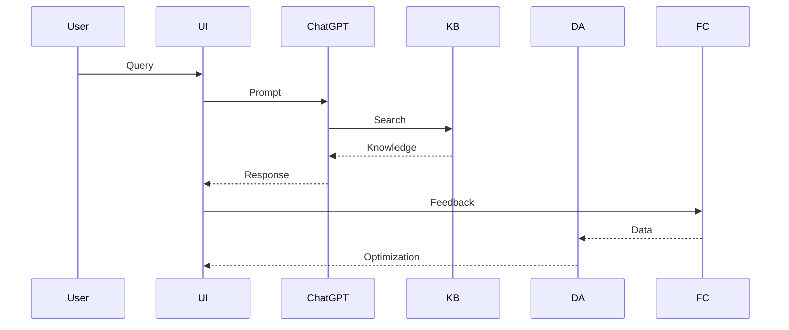
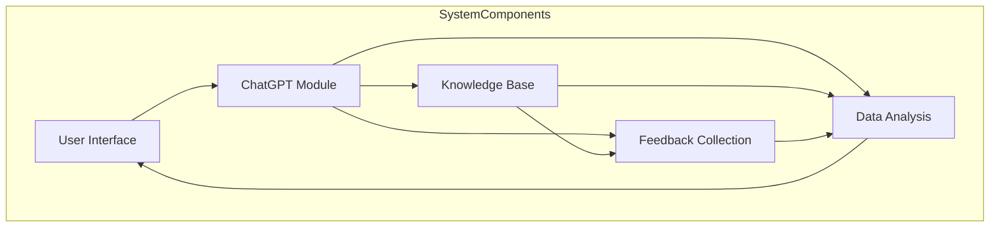
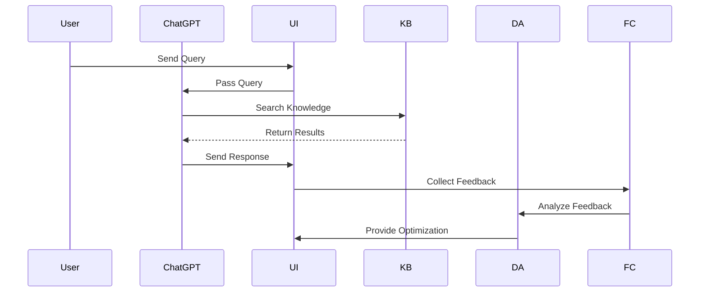

                 

### # ChatGPT在企业客服中的应用：提示词设计

关键词：ChatGPT、企业客服、提示词设计、自然语言处理、客户服务优化

摘要：本文深入探讨了ChatGPT在企业客服中的应用及其提示词设计的核心。通过分析ChatGPT的技术原理和应用场景，本文详细阐述了提示词设计的重要性，提供了基本的提示词设计原则和高级设计技术，旨在为企业客服系统提供更加智能和高效的解决方案。

## 目录

### 引言

#### 1.1 ChatGPT的崛起与客户服务挑战

- **ChatGPT的背景介绍**  
  - OpenAI推出的革命性语言模型  
  - 基于GPT-3模型的强大能力

- **企业客服面临的挑战**  
  - 大规模客户咨询处理的难题  
  - 传统客服系统的局限性

- **ChatGPT在解决客服问题中的作用**  
  - 自动化客户问答  
  - 提高客户响应速度

#### 1.2 ChatGPT的概念与架构

- **核心概念解析**  
  - 自然语言处理（NLP）基础  
  - 语言模型的生成机制

- **ChatGPT的架构**  
  - 层次化神经网络结构  
  - 参数优化与训练过程

- **ChatGPT与客户服务的关联**  
  - 客户服务场景的适应性  
  - 客户体验的提升

#### 1.3 提示词设计的重要性

- **提示词设计的定义**  
  - 在对话系统中引导模型响应的关键

- **提示词设计在客户服务中的重要性**  
  - 提升交互质量与效率  
  - 影响客户满意度

- **提示词设计的类型**  
  - 开放式问题  
  - 闭合式问题  
  - 多轮对话提示

### 核心概念与原则

#### 2.1 提示词设计的基本原则

- **提示词结构的介绍**  
  - 提问方式  
  - 响应要求

- **关键词的角色**  
  - 确定主题与上下文  
  - 提高回答的针对性

- **语言风格的影响**  
  - 用户友好性  
  - 语气与态度

#### 2.2 关键词分析与选择

- **关键词的重要性**  
  - 对话流程的控制  
  - 回答的相关性

- **关键词分析技术**  
  - 数据收集与预处理  
  - 统计分析方法

- **关键词选择策略**  
  - 基于业务的优先级排序  
  - 用户行为数据的利用

#### 2.3 有效提示词的构建

- **编写提示词的指导方针**  
  - 清晰性  
  - 完整性  
  - 可操作性

- **常见设计误区**  
  - 过度简化问题  
  - 缺乏灵活性

- **提升提示词效果的策略**  
  - 多样化的提问方式  
  - 实时反馈与调整

### 高级提示词设计技术

#### 3.1 机器学习在提示词设计中的应用

- **机器学习的基本概念**  
  - 模型训练与预测  
  - 特征工程与模型选择

- **机器学习在ChatGPT中的角色**  
  - 自适应提示词生成  
  - 优化对话流程

- **机器学习在提示词设计中的挑战与解决方案**  
  - 数据质量问题  
  - 模型解释性需求

#### 3.2 实时提示词设计与优化

- **实时提示词设计的重要性**  
  - 针对客户实时需求  
  - 提高服务响应速度

- **实时优化策略**  
  - 基于用户行为的动态调整  
  - 实时数据分析与反馈

- **实时设计的挑战与应对**  
  - 系统性能与响应速度的平衡  
  - 实时数据处理的复杂性

### 系统分析与架构设计

#### 4.1 客户服务场景介绍

- **企业客服需求分析**  
  - 客户互动模式  
  - 常见问题类型

- **项目介绍**  
  - 项目目标  
  - 系统功能需求

#### 4.2 系统功能设计

- **领域模型设计**  
  - 使用Mermaid绘制类图

- **系统架构设计**  
  - 使用Mermaid绘制架构图

- **系统接口设计**  
  - API设计

#### 4.3 系统交互设计

- **系统交互序列图**  
  - 使用Mermaid绘制序列图

### 项目实战

#### 5.1 环境安装

- **安装要求**  
  - 操作系统  
  - 软件依赖

- **安装步骤**  
  - 环境配置  
  - 软件安装

#### 5.2 系统核心实现

- **核心代码实现**  
  - Python代码示例

- **代码应用解读与分析**  
  - 功能解析  
  - 性能分析

#### 5.3 实际案例分析

- **案例分析**  
  - 实际应用场景

- **详细讲解与剖析**  
  - 提示词设计实践

#### 5.4 项目小结

- **项目总结**  
  - 经验教训

- **改进方向**  
  - 未来展望

### 最佳实践与拓展阅读

#### 6.1 最佳实践

- **设计技巧**  
  - 实用方法

- **案例分析**  
  - 成功案例

#### 6.2 小结与注意事项

- **关键知识点回顾**  
  - 提示词设计的要点

- **注意事项**  
  - 设计误区避免

#### 6.3 拓展阅读

- **推荐文献**  
  - 相关书籍和论文

- **在线资源**  
  - 学术网站和技术博客

### 作者信息

作者：AI天才研究院/AI Genius Institute & 禅与计算机程序设计艺术 /Zen And The Art of Computer Programming

---

#### 引言

**1.1 ChatGPT的崛起与客户服务挑战**

**背景介绍**

ChatGPT是由OpenAI开发的先进自然语言处理模型，基于GPT-3模型，具有强大的文本生成和理解能力。GPT-3是Generative Pre-trained Transformer 3的缩写，是一个拥有1750亿参数的深度学习模型，能够通过大量的文本数据进行自我训练，从而生成流畅、准确的语言输出。ChatGPT的推出标志着自然语言处理技术进入了一个新的阶段，其强大的文本处理能力使其在各个领域都有广泛的应用前景，尤其是在企业客服领域。

**企业客服面临的挑战**

企业客服在现代商业环境中扮演着至关重要的角色。随着互联网的普及和电子商务的发展，客户对企业服务的要求越来越高。传统客服系统通常依赖于人工处理客户咨询，这不仅成本高昂，而且效率低下。随着客户量的增加，客服团队难以在短时间内处理大量咨询，导致客户满意度下降。此外，传统的客服系统在处理复杂问题时往往无法提供有效的解决方案，进一步加剧了客服的难题。

**ChatGPT在解决客服问题中的作用**

ChatGPT的出现为企业客服提供了一种新的解决方案。通过自动化客户问答，ChatGPT能够快速响应客户的查询，大大提高了客服效率。与传统客服系统相比，ChatGPT具有以下几个显著优势：

1. **高效的响应速度**：ChatGPT能够在毫秒级的时间内生成高质量的回答，远超人工客服的响应速度。

2. **全天候服务**：ChatGPT不受时间和地理位置的限制，可以随时为客户提供服务，提高了客户服务的可用性。

3. **个性化的服务**：ChatGPT能够根据客户的提问和历史交互数据，提供个性化的回答，提升客户体验。

4. **降低运营成本**：ChatGPT能够替代部分人工客服的工作，降低企业的人力成本。

**总结**

ChatGPT的崛起为解决企业客服面临的挑战提供了新的思路和工具。通过利用先进的自然语言处理技术，ChatGPT能够在客户服务的各个环节提供高效、个性化的解决方案，帮助企业提升客户满意度，降低运营成本。接下来，我们将深入探讨ChatGPT的概念和架构，为后续的提示词设计提供理论基础。

### 1.2 ChatGPT的概念与架构

**核心概念解析**

ChatGPT是基于GPT-3模型的自然语言处理模型，其核心概念主要包括自然语言处理（NLP）和深度学习。自然语言处理是计算机科学和人工智能领域的重要分支，旨在使计算机能够理解和处理人类语言。深度学习则是基于多层神经网络的学习方法，通过大量数据训练，能够自动提取特征并生成复杂的模型。

**ChatGPT的架构**

ChatGPT的架构是层次化神经网络结构，其核心是一个基于Transformer模型的深度学习模型。Transformer模型是由Google在2017年提出的一种新的序列到序列模型，其核心思想是将输入序列编码为固定长度的向量，并通过自注意力机制来处理序列中的依赖关系。

**架构细节**

1. **编码器（Encoder）**：编码器负责将输入文本转化为序列向量。ChatGPT的编码器由多个Transformer层堆叠而成，每一层都包含多头自注意力机制和前馈神经网络。自注意力机制允许模型在生成每个词时考虑整个输入序列的其他词，从而生成丰富的上下文信息。

2. **解码器（Decoder）**：解码器负责生成输出文本。解码器的结构与编码器类似，但每一层的输出都会与编码器的输出进行交互，以确保生成的文本与输入文本保持一致。解码器同样采用多头自注意力机制和前馈神经网络。

3. **预训练与优化**：ChatGPT在训练过程中首先通过大量的无监督文本数据进行预训练，以学习语言的一般规则和特征。然后，通过有监督的学习任务对模型进行微调，使其能够更好地适应特定的任务需求，如文本生成、问答系统等。

**ChatGPT与客户服务的关联**

ChatGPT在企业客服中的应用主要体现在以下几个方面：

1. **自动化问答**：ChatGPT能够自动回答客户常见问题，减少人工干预，提高客服效率。

2. **个性化服务**：通过分析客户的历史交互数据，ChatGPT能够提供个性化的服务，提升客户满意度。

3. **全天候服务**：ChatGPT不受时间和地理位置的限制，可以随时为客户提供服务，确保客户在任何时候都能获得及时的帮助。

4. **降低运营成本**：ChatGPT能够替代部分人工客服的工作，降低企业的人力成本。

**总结**

ChatGPT的核心概念和架构为其在企业客服中的应用奠定了基础。通过自然语言处理和深度学习技术，ChatGPT能够生成高质量的语言输出，并在客服场景中提供高效、个性化的解决方案。接下来，我们将深入探讨提示词设计的重要性，为ChatGPT的实际应用提供更加详细的指导。

### 1.3 提示词设计的重要性

**提示词设计的定义**

提示词（Prompt）是引导ChatGPT进行对话的关键因素。在ChatGPT中，提示词是一种输入文本，用于启动对话或引导模型的回答。一个有效的提示词应该能够明确地传达用户的意图，同时提供足够的上下文信息，以便模型能够生成相关且准确的回答。

**提示词设计在客户服务中的重要性**

1. **提升交互质量与效率**：有效的提示词设计能够确保ChatGPT快速、准确地理解客户的意图，从而生成高质量的回答。这不仅能够提高客户满意度，还能减少客户等待时间，提升整体服务效率。

2. **影响客户满意度**：提示词的质量直接影响客户的体验。一个清晰、友好的提示词能够让客户感到舒适，从而提高客户满意度。相反，模糊、不友好的提示词可能会导致客户不满，甚至影响企业的品牌形象。

3. **引导对话流程**：提示词设计可以帮助ChatGPT更好地引导对话流程，使对话更加流畅和自然。通过精心设计的提示词，ChatGPT能够适当地引导用户进行多轮对话，从而解决复杂问题。

4. **提高系统的适应性**：不同的客户可能有不同的需求和提问方式。提示词设计能够帮助ChatGPT更好地适应各种客户需求，提高系统的灵活性。

**提示词设计的类型**

1. **开放式问题**：开放式问题允许客户自由地表达自己的需求，通常用于初始对话或复杂问题的处理。例如：“您有什么问题需要帮助吗？”

2. **闭合式问题**：闭合式问题通常用于获取特定的信息或确认客户的意图。例如：“您是想查询产品价格还是售后服务？”

3. **多轮对话提示**：多轮对话提示用于引导客户进行多轮对话，以便更深入地了解客户的需求和问题。例如：“您是否对产品的某个功能有疑问？如果需要进一步的帮助，请告诉我具体的细节。”

**总结**

提示词设计在ChatGPT在企业客服中的应用中至关重要。通过精心设计的提示词，ChatGPT能够更好地理解客户的需求，提供高质量的客户服务，从而提升客户满意度和企业竞争力。在接下来的章节中，我们将进一步探讨提示词设计的基本原则和高级技术，以期为实际应用提供更加详细的指导。

### 2.1 提示词设计的基本原则

**提示词结构的介绍**

提示词是ChatGPT与企业客户进行对话的桥梁，其结构直接影响对话的质量和效果。一个有效的提示词通常包括以下几个关键部分：

1. **问题提出**：明确地提出一个问题，以引导ChatGPT生成回答。问题应尽量简洁明了，避免过于复杂或模糊。

2. **上下文信息**：提供必要的上下文信息，帮助ChatGPT更好地理解问题的背景和意图。上下文信息可以包括相关的事实、数据或背景描述。

3. **回答要求**：明确地指示ChatGPT需要生成什么样的回答，例如具体的回答格式、长度或详细程度。

4. **引导语**：使用引导语来引导ChatGPT进行适当的回答，增强对话的流畅性和自然性。引导语可以是简单的提示性语句，如“请回答以下问题：”或“针对这个问题，您有什么建议吗？”

**关键词的角色**

关键词是提示词的核心组成部分，它们决定了ChatGPT在生成回答时的关注点和方向。关键词的选择和运用对提示词的有效性至关重要，具体包括以下几个方面：

1. **确定主题与上下文**：关键词应能够准确传达对话的主题和上下文，帮助ChatGPT迅速抓住关键信息。例如，在询问产品价格时，关键词应包括“产品”、“价格”等。

2. **提高回答的相关性**：通过精准选择关键词，可以提高ChatGPT生成回答的相关性。关键词应尽量具体，避免过于笼统或模糊。

3. **增强回答的准确性**：关键词应能够引导ChatGPT生成准确、详细的回答。例如，在医疗咨询场景中，关键词应包括“症状”、“治疗方法”等。

**语言风格的影响**

语言风格在提示词设计中同样发挥着重要作用。一个友好、自然的语言风格能够增强用户的体验，提高对话的质量。以下是一些关于语言风格的指导原则：

1. **用户友好性**：提示词应尽量使用简单、易懂的语言，避免过于专业或复杂的术语。这有助于确保用户能够轻松理解并参与对话。

2. **语气与态度**：提示词的语气和态度对用户感受具有重要影响。友好、亲切的语气能够提高用户的满意度，减少对话的紧张感。

3. **一致性**：在整个对话过程中，提示词的语言风格应保持一致，以避免用户感到困惑或不适。

**总结**

提示词设计的基本原则包括结构、关键词选择和语言风格。一个有效的提示词应具备清晰的提问、丰富的上下文信息、明确的回答要求和友好的语言风格。通过遵循这些原则，ChatGPT能够更好地理解客户的需求，提供高质量的客户服务。在接下来的章节中，我们将深入探讨关键词分析和选择的方法，以进一步提升提示词设计的有效性。

### 2.2 关键词分析与选择

**关键词的重要性**

关键词在提示词设计中起着至关重要的作用。它们不仅是提示词的核心组成部分，也是ChatGPT理解和生成回答的关键。选择合适的关键词能够显著提高提示词的有效性和对话质量。以下是关键词在提示词设计中的重要性：

1. **对话流程的控制**：关键词能够引导ChatGPT在对话过程中关注关键信息，确保对话的方向和深度。例如，在询问产品价格时，关键词“价格”将直接影响ChatGPT的回答内容。

2. **回答的相关性**：通过精准选择关键词，可以提高ChatGPT生成回答的相关性。关键词应具体、明确，避免模糊或笼统，以确保ChatGPT能够生成与用户需求高度相关的回答。

3. **增强回答的准确性**：关键词的选择直接影响ChatGPT生成回答的准确性。准确的关键词能够帮助ChatGPT理解用户的意图，从而生成更详细、准确的回答。

**关键词分析技术**

进行关键词分析是提示词设计的重要步骤。以下是一些常见的关键词分析技术：

1. **数据收集与预处理**：首先，需要收集相关的数据，包括用户查询、FAQ、用户反馈等。然后，对这些数据进行预处理，例如去噪、分词、词性标注等，以便提取有用信息。

2. **统计分析方法**：通过统计分析方法，可以识别出高频关键词和重要关键词。常用的统计方法包括词频分析、TF-IDF（词频-逆文档频率）等。词频分析可以帮助识别出频繁出现的关键词，而TF-IDF则可以结合词频和文档频率，识别出在特定文档中具有较高重要性的关键词。

3. **词云生成**：词云是一种可视化工具，用于展示文本中关键词的频率和重要性。通过词云，可以直观地了解文本的关键主题和关键词分布。

**关键词选择策略**

选择合适的关键词是提示词设计的核心。以下是一些关键词选择策略：

1. **基于业务的优先级排序**：首先，需要明确业务目标和客户需求，根据这些因素对关键词进行优先级排序。高频、关键的业务关键词应优先考虑。

2. **用户行为数据的利用**：通过分析用户行为数据，可以了解用户在特定场景下的关键词偏好。这些数据可以帮助选择更加符合用户需求的关键词。

3. **专家意见与验证**：在关键词选择过程中，可以结合专家意见和实际验证。专家可以根据业务经验和专业知识，提供有价值的建议，而实际验证则可以通过用户测试和反馈，确保关键词的实用性和有效性。

**总结**

关键词在提示词设计中至关重要，它们不仅决定了ChatGPT对问题的理解和回答的质量，也影响了整个对话的流畅性和效果。通过数据收集、统计分析和用户行为数据，可以科学地选择和优化关键词，从而提升提示词的有效性。在接下来的章节中，我们将进一步探讨如何构建有效的提示词，以及如何通过多轮对话提升用户体验。

### 2.3 有效提示词的构建

**编写提示词的指导方针**

构建一个有效的提示词需要遵循一系列的指导方针，以确保ChatGPT能够准确理解和生成合适的回答。以下是编写提示词的一些关键指导方针：

1. **清晰性**：提示词应尽量简洁明了，避免使用模糊或复杂的语言。清晰的问题有助于ChatGPT准确地捕捉用户的意图。

2. **完整性**：提示词应包含所有必要的信息，以便ChatGPT能够生成完整和详细的回答。遗漏关键信息可能导致ChatGPT生成不相关或片面的回答。

3. **可操作性**：提示词应具备操作性，能够引导ChatGPT执行具体的任务。例如，在查询产品信息时，提示词应具体指出需要查询的内容，如“请提供XX型号的产品价格”。

4. **情境适应性**：提示词应考虑不同的情境和用户需求，以便在不同场景下都能提供有效的对话支持。例如，对于初次咨询的用户，提示词可以更加友好和引导性。

**常见设计误区**

在提示词设计中，一些常见的设计误区可能会影响ChatGPT的响应效果，以下是一些需要注意的误区：

1. **问题过于复杂**：过于复杂的问题可能导致ChatGPT难以理解，生成模糊或不准确的回答。例如，使用长句或复合句作为提示词。

2. **缺乏上下文信息**：提示词中缺乏上下文信息，可能导致ChatGPT无法准确理解问题的背景和意图。例如，仅提出问题而未提供相关的背景信息。

3. **模糊或笼统的问题**：模糊或笼统的问题会使ChatGPT难以确定回答的方向和内容。例如，使用“怎么样”、“为什么”等模糊的提问方式。

4. **不一致的语言风格**：提示词中的语言风格应保持一致，否则可能导致用户感到困惑或不适。例如，在对话中使用专业术语和口语化表达混合。

**提升提示词效果的策略**

为了进一步提升提示词的效果，可以采取以下策略：

1. **多样化提问方式**：通过使用不同的提问方式，如开放式问题、闭合式问题和多轮对话提示，可以增加对话的丰富性和灵活性。

2. **实时反馈与调整**：在对话过程中，根据用户的反馈和ChatGPT的回答效果，及时调整提示词。例如，如果用户对回答不满意，可以重新设计提示词以获取更多信息或明确问题的细节。

3. **利用机器学习优化**：通过机器学习算法，可以分析大量用户交互数据，识别出有效的提示词模式，并进行自动化优化。

4. **用户测试与验证**：在实际应用中，通过用户测试和反馈，验证提示词的效果和用户满意度，并根据反馈进行调整和优化。

**总结**

构建一个有效的提示词是提升ChatGPT在客户服务中表现的关键。通过遵循清晰的指导方针、避免常见的设计误区，并采取多样化的提问方式和实时反馈策略，可以显著提高提示词的质量和效果，从而提升整体客户服务体验。在下一章节中，我们将探讨高级提示词设计技术，以进一步优化ChatGPT在客户服务中的应用。

### 3.1 机器学习在提示词设计中的应用

**机器学习的基本概念**

机器学习（Machine Learning，ML）是人工智能（Artificial Intelligence，AI）的一个重要分支，它使计算机系统能够从数据中学习并做出决策。机器学习涉及一系列算法和技术，通过训练模型来识别数据中的模式和关系，并在未见过的数据上进行预测和决策。

**模型训练与预测**

模型训练是机器学习的核心过程。在这个过程中，模型通过大量的训练数据学习如何识别数据中的特征和模式。训练数据通常包括输入特征和对应的输出标签，模型通过不断调整其内部参数，最小化预测误差。

预测是在训练完成后，模型对新数据进行分析和决策的过程。预测结果基于模型在训练数据上学到的模式和规则，可以对未知数据进行分类、回归或其他类型的预测。

**特征工程与模型选择**

特征工程（Feature Engineering）是机器学习中的一个重要步骤，它涉及从原始数据中提取和构建有助于模型学习的特征。特征工程的质量对模型的性能有显著影响，包括数据预处理、特征选择和特征构造等。

模型选择是指从多种机器学习算法中选择最适合特定任务的模型。不同的模型有不同的优缺点，适用于不同的任务和数据类型。常见的机器学习模型包括线性回归、决策树、支持向量机、神经网络等。

**机器学习在ChatGPT中的角色**

ChatGPT是基于GPT-3模型的自然语言处理模型，其内部机制高度依赖于机器学习。具体来说，机器学习在ChatGPT中的应用体现在以下几个方面：

1. **自适应提示词生成**：机器学习算法可以帮助ChatGPT根据用户的历史交互数据，自适应地生成合适的提示词。通过分析用户的行为和偏好，模型可以调整提示词，使其更加符合用户的期望。

2. **优化对话流程**：机器学习算法可以分析大量用户对话数据，识别出最佳对话流程和提示词组合。这些优化策略可以帮助ChatGPT更有效地引导对话，提升用户体验。

**使用机器学习优化提示词设计**

为了优化提示词设计，可以采用以下策略：

1. **数据收集与预处理**：首先，需要收集大量的用户对话数据，包括提问、回答和用户反馈。这些数据将用于训练机器学习模型。

2. **特征提取**：从对话数据中提取关键特征，如提问的关键词、回答的满意度、对话的上下文等。特征提取的质量对机器学习模型的性能至关重要。

3. **模型训练**：使用提取的特征数据训练机器学习模型。模型可以通过无监督学习（如聚类分析）或有监督学习（如分类和回归）进行训练。

4. **模型评估与优化**：通过评估模型的性能，调整模型参数和特征选择策略，优化模型效果。常见的评估指标包括准确率、召回率、F1分数等。

5. **自动化提示词生成**：使用训练好的模型，自动生成优化后的提示词。这些提示词可以根据用户的历史交互数据，实时调整和优化，以提高对话质量。

**挑战与解决方案**

尽管机器学习在提示词设计中有巨大潜力，但也面临一些挑战：

1. **数据质量问题**：高质量的训练数据对机器学习模型的性能至关重要。数据质量差可能导致模型无法准确学习和预测。解决方法是进行数据清洗和预处理，确保数据的一致性和准确性。

2. **模型解释性需求**：机器学习模型，尤其是深度学习模型，通常具有很高的预测能力，但缺乏透明性和解释性。提高模型的可解释性是当前研究的一个热点，方法包括可视化技术、模型简化等。

**总结**

机器学习在提示词设计中的应用，使得ChatGPT能够自适应地生成高质量的提示词，优化对话流程。通过数据收集、特征提取、模型训练和自动化生成，机器学习为提升ChatGPT在客户服务中的应用效果提供了强大的工具。在下一章节中，我们将探讨实时提示词设计与优化，进一步探讨如何在动态环境中提升ChatGPT的性能。

### 3.2 实时提示词设计与优化

**实时提示词设计的重要性**

实时提示词设计在ChatGPT中的应用至关重要，尤其是在动态变化的客户服务场景中。实时设计意味着ChatGPT能够根据当前的对话状态、用户行为和系统环境，动态调整和优化提示词，以提高对话的流畅性和客户满意度。以下是实时提示词设计的重要性：

1. **适应客户实时需求**：客户的提问和需求是不断变化的，实时提示词设计能够确保ChatGPT迅速响应这些变化，提供准确和相关的回答。

2. **提高服务响应速度**：实时提示词设计使得ChatGPT能够快速生成高质量的回答，减少客户的等待时间，提升整体服务效率。

3. **增强个性化服务**：通过实时分析用户的交互数据，ChatGPT可以提供更加个性化的服务，提高客户满意度和忠诚度。

4. **优化对话流程**：实时提示词设计有助于ChatGPT更好地引导对话流程，使对话更加自然和流畅，从而解决复杂问题。

**实时优化策略**

为了实现实时提示词设计，可以采取以下优化策略：

1. **基于用户行为的动态调整**：通过实时监控用户的行为和交互数据，ChatGPT可以根据用户的提问方式和反馈，动态调整提示词。例如，如果用户对当前回答不满意，ChatGPT可以重新设计提示词以获取更多信息。

2. **实时数据分析与反馈**：利用实时数据分析技术，ChatGPT可以实时分析对话数据，识别出优化点并调整提示词。例如，通过分析用户的点击率、回复率等指标，ChatGPT可以优化提示词的设计，提高用户的参与度和满意度。

3. **多轮对话管理**：在多轮对话中，ChatGPT可以通过实时优化策略，逐步引导用户深入讨论问题，提供更加详细和准确的回答。例如，在初次对话中，ChatGPT可以提出开放式问题，引导用户表达需求，然后根据用户的回答，逐步调整提示词，提供更具体的解决方案。

**实时设计的挑战与应对**

尽管实时提示词设计具有显著优势，但也面临一些挑战：

1. **系统性能与响应速度的平衡**：实时处理大量数据和动态调整提示词，对系统的性能和响应速度提出了高要求。应对策略包括优化算法和系统架构，提高数据处理和响应速度。

2. **实时数据处理的复杂性**：实时数据具有高频率、多样性和不确定性，处理这些数据需要复杂的算法和模型。应对策略包括采用分布式计算和大数据技术，提高数据处理能力。

3. **数据质量和可解释性**：实时数据的质量和可解释性对提示词的优化至关重要。确保数据质量，进行数据清洗和预处理，提高模型的可解释性，是关键应对措施。

**总结**

实时提示词设计与优化是提升ChatGPT在企业客服中应用效果的重要手段。通过动态调整和优化提示词，ChatGPT能够更好地适应客户的实时需求，提供高效、个性化的服务。在下一章节中，我们将深入探讨系统分析与架构设计，为ChatGPT在企业客服中的应用提供全面的解决方案。

### 4.1 客户服务场景介绍

**企业客服需求分析**

在现代商业环境中，企业客服系统面临着日益复杂的客户需求和不断增长的服务压力。为了满足这些需求，企业客服系统需要具备以下几个关键功能：

1. **多渠道支持**：企业客服系统应能够支持多种通信渠道，包括电子邮件、电话、在线聊天、社交媒体等。这样可以确保客户能够通过他们首选的渠道与企业进行沟通。

2. **自动化处理**：自动化处理能够显著提高客服效率，减少人工干预。例如，通过聊天机器人自动回答常见问题，自动分类和分配客户请求等。

3. **个性化服务**：个性化服务能够提升客户满意度，企业客服系统应能够根据客户的历史交互数据，提供定制化的解决方案。

4. **多语言支持**：全球化的商业环境要求客服系统能够支持多种语言，以便更好地服务不同地区的客户。

5. **反馈机制**：有效的反馈机制能够帮助企业不断改进客服质量，提高客户满意度。

**项目介绍**

本项目的目标是构建一个基于ChatGPT的企业客服系统，旨在通过人工智能技术提升客户服务的效率和质量。项目的主要功能包括：

1. **自动问答**：利用ChatGPT自动回答客户的常见问题，减少人工干预。

2. **多轮对话**：通过多轮对话机制，逐步引导客户解决问题，提供个性化的服务。

3. **个性化推荐**：根据客户的历史交互数据，提供相关产品的推荐和解决方案。

4. **实时反馈**：通过实时反馈机制，收集客户对客服系统的反馈，不断优化系统性能。

5. **集成多渠道**：集成多种通信渠道，确保客户能够通过他们首选的渠道与企业进行沟通。

**系统功能设计**

为了实现上述功能，系统功能设计包括以下几个关键模块：

1. **用户接口模块**：提供多种交互方式，包括在线聊天、电子邮件和电话等，方便客户与企业进行沟通。

2. **对话管理模块**：负责处理多轮对话，管理用户与ChatGPT之间的交互过程，确保对话的流畅性和连贯性。

3. **知识库模块**：存储企业知识库，包括产品信息、常见问题解答、业务流程等，供ChatGPT查询和生成回答。

4. **数据分析模块**：实时分析客户交互数据，用于优化提示词设计和提高系统性能。

5. **反馈收集模块**：收集客户对客服系统的反馈，用于系统优化和改进。

### 4.2 系统功能设计

**领域模型设计**

为了更好地理解系统功能，可以使用Mermaid绘制类图来展示系统的领域模型。以下是一个简单的领域模型示例：

```mermaid
classDiagram
    Customer <|-- ChatGPT
    Question <<-- Customer
    Answer <<-- ChatGPT
    Feedback <<-- Customer
    CustomerServiceSystem <|-- ChatGPT
    CustomerServiceSystem o-- UserInterface
    CustomerServiceSystem o-- DialogManagement
    CustomerServiceSystem o-- KnowledgeBase
    CustomerServiceSystem o-- DataAnalysis
    CustomerServiceSystem o-- FeedbackCollection

    Customer {id, name, feedback}
    ChatGPT {id, prompt, response}
    Question {id, content}
    Answer {id, content}
    Feedback {id, comment}
    UserInterface {id, channel}
    DialogManagement {id, state}
    KnowledgeBase {id, information}
    DataAnalysis {id, data}
    FeedbackCollection {id, feedback}
    CustomerServiceSystem {id, functions}
```

**系统功能设计**

系统功能设计旨在实现上述领域模型中的功能模块，以下是各个模块的详细设计：

1. **用户接口模块**：负责处理客户的请求和反馈，提供友好的用户界面，支持多种通信渠道。

   - 功能：支持在线聊天、电子邮件、电话等多种通信方式。
   - 技术实现：采用Web前端技术和RESTful API，实现与后端系统的通信。

2. **对话管理模块**：负责管理多轮对话，确保对话的流畅性和连贯性。

   - 功能：处理客户与ChatGPT之间的交互，管理对话状态。
   - 技术实现：使用状态机模型管理对话状态，实现对话流程控制。

3. **知识库模块**：存储企业知识库，包括产品信息、常见问题解答、业务流程等，供ChatGPT查询和生成回答。

   - 功能：提供丰富的知识库，支持ChatGPT生成高质量的回答。
   - 技术实现：采用NoSQL数据库（如MongoDB），存储和管理知识库数据。

4. **数据分析模块**：实时分析客户交互数据，用于优化提示词设计和提高系统性能。

   - 功能：收集和分析客户交互数据，识别优化点。
   - 技术实现：采用大数据处理技术（如Hadoop、Spark），进行实时数据分析和处理。

5. **反馈收集模块**：收集客户对客服系统的反馈，用于系统优化和改进。

   - 功能：收集客户反馈，进行系统性能评估和优化。
   - 技术实现：采用问卷调查和在线反馈机制，收集客户反馈。

### 4.3 系统架构设计

**系统架构设计**

系统架构设计是构建高效、可扩展的客服系统的关键。以下是一个典型的系统架构设计：



**组件解释**

1. **用户（User）**：客户端用户，发起查询和请求。

2. **用户接口（UI）**：处理用户请求和响应，提供友好的交互界面。

3. **ChatGPT**：核心对话管理模块，负责生成回答和处理对话。

4. **知识库（KB）**：存储企业知识库，提供ChatGPT查询和生成回答。

5. **数据分析（DA）**：实时分析客户交互数据，用于系统优化。

6. **反馈收集（FC）**：收集客户反馈，用于系统性能评估和优化。

**系统架构图**



### 4.4 系统接口设计

**接口设计**

系统接口设计包括API设计和数据接口设计。以下是API设计的一个示例：

```python
from flask import Flask, request, jsonify

app = Flask(__name__)

@app.route('/api/v1/chat', methods=['POST'])
def chat():
    data = request.json
    prompt = data.get('prompt')
    # ChatGPT processing logic
    response = generate_response(prompt)
    return jsonify(response)

def generate_response(prompt):
    # ChatGPT response generation logic
    return "This is a sample response."

if __name__ == '__main__':
    app.run(debug=True)
```

**数据接口设计**

数据接口设计涉及数据库操作和数据交换格式。以下是一个简单的数据接口设计示例：

```python
import pymongo

client = pymongo.MongoClient("mongodb://localhost:27017/")
db = client["customer_service"]
collection = db["knowledge_base"]

def search_knowledge_base(query):
    # Search knowledge base logic
    results = collection.find({"content": {"$regex": query}})
    return list(results)

def update_knowledge_base(document):
    # Update knowledge base logic
    collection.update_one({"_id": document["_id"]}, {"$set": document})
```

### 4.5 系统交互设计

**系统交互序列图**

以下是系统交互序列图的Mermaid表示：



### 实际案例分析

**案例场景**

在一个电商企业中，客户服务团队使用ChatGPT构建了一个智能客服系统，以提升客户满意度和服务效率。该系统需要处理大量关于产品咨询、订单跟踪和售后服务的问题。

**案例步骤**

1. **用户查询**：用户通过在线聊天向客服系统发送一个查询请求，例如：“我想了解iPhone 13的详细配置和价格。”

2. **用户接口接收**：用户接口（UI）接收用户的查询请求，并将其转换为内部格式。

3. **传递给ChatGPT**：用户接口将查询请求传递给ChatGPT模块。

4. **ChatGPT处理**：ChatGPT使用提示词设计，生成一个初步的回答，例如：“iPhone 13的详细配置包括A15芯片、6.1英寸显示屏等，价格约为799美元。”

5. **查询知识库**：ChatGPT需要更多详细信息，于是查询知识库（KB），查找关于iPhone 13的具体配置和价格。

6. **返回结果**：知识库返回相关结果，ChatGPT生成一个详细回答，例如：“iPhone 13提供多种存储选项，16GB存储版本的价格为799美元，而128GB存储版本的价格为899美元。”

7. **用户接口返回**：用户接口将ChatGPT的回答返回给用户。

8. **收集反馈**：用户接口收集用户的反馈，例如满意度评分。

9. **数据分析**：反馈收集模块将用户的反馈传递给数据分析模块（DA），用于优化系统性能。

10. **系统优化**：数据分析模块根据反馈，优化提示词设计和对话流程，以提高系统性能。

**详细讲解与剖析**

**步骤1：用户查询**

用户在电商平台上向客服系统发送一个关于产品配置和价格的查询请求。这是一个典型的用户请求场景，用户希望快速获取准确的产品信息。

**步骤2：用户接口接收**

用户接口负责接收用户的查询请求，并将其转换为系统内部可处理的格式。这一步骤确保了用户请求能够被ChatGPT和其他系统模块正确理解。

**步骤3：传递给ChatGPT**

用户接口将转换后的查询请求传递给ChatGPT模块。ChatGPT是系统中的核心组件，负责处理用户的查询请求并生成回答。

**步骤4：ChatGPT处理**

ChatGPT使用预先设计的提示词设计，生成一个初步的回答。提示词设计是关键，它决定了ChatGPT生成回答的相关性和准确性。一个有效的提示词能够引导ChatGPT更好地理解用户的意图。

**步骤5：查询知识库**

ChatGPT生成的初步回答可能不够详细，因此需要查询知识库（KB）。知识库是系统的一个重要组成部分，存储了企业的产品信息、常见问题和业务流程等。通过查询知识库，ChatGPT可以获得更加详细和准确的信息。

**步骤6：返回结果**

知识库返回与用户查询相关的结果，ChatGPT使用这些信息生成一个详细和准确的回答。这一步骤是整个对话流程中的关键，决定了用户对系统回答的满意度。

**步骤7：用户接口返回**

用户接口将ChatGPT生成的回答返回给用户。用户界面（UI）的设计对提升用户体验至关重要，一个友好和直观的用户界面能够增强用户与系统之间的交互。

**步骤8：收集反馈**

用户接口收集用户的反馈，例如满意度评分。反馈收集是系统优化的重要环节，通过收集用户的反馈，系统可以不断改进和优化。

**步骤9：数据分析**

反馈收集模块将用户的反馈传递给数据分析模块（DA）。数据分析模块对反馈进行分析，识别出系统性能的优化点。

**步骤10：系统优化**

数据分析模块根据反馈结果，优化提示词设计和对话流程。系统优化是一个持续的过程，通过不断调整和优化，系统可以提供更高质量的客户服务。

**总结**

通过实际案例分析，我们可以看到ChatGPT在企业客服系统中的应用是如何实现的高效和准确。从用户查询到系统回答，再到反馈收集和系统优化，每个环节都紧密相连，共同构成了一个高效的客户服务系统。在下一章节中，我们将探讨如何通过项目实战，将理论应用到实际开发中。

### 5.1 环境安装

**安装要求**

为了搭建一个基于ChatGPT的企业客服系统，我们需要以下软件和硬件环境：

1. **操作系统**：推荐使用Ubuntu 18.04或更高版本，也可使用其他Linux发行版。
2. **编程语言**：Python 3.8或更高版本，确保已安装pip（Python包管理器）。
3. **深度学习库**：TensorFlow 2.5或更高版本，用于训练和运行ChatGPT模型。
4. **其他依赖**：NumPy、Pandas、Flask等常用Python库。

**安装步骤**

1. **安装操作系统**：

   - 下载并安装Ubuntu 18.04或更高版本。

2. **更新系统软件包**：

   ```bash
   sudo apt update
   sudo apt upgrade
   ```

3. **安装Python 3**：

   ```bash
   sudo apt install python3 python3-pip
   ```

4. **安装深度学习库**：

   ```bash
   pip3 install tensorflow==2.5
   ```

5. **安装其他依赖库**：

   ```bash
   pip3 install numpy pandas
   ```

6. **安装Flask**：

   ```bash
   pip3 install flask
   ```

**环境配置**

完成上述步骤后，我们需要进行一些基本的环境配置：

1. **配置Python环境变量**：

   ```bash
   export PATH=$PATH:/usr/bin/python3
   ```

2. **测试安装**：

   ```bash
   python3 --version
   pip3 --version
   python3 -c "import tensorflow as tf; print(tf.__version__)"
   ```

确保上述命令可以正常执行，没有报错。

**常见问题**

1. **无法安装TensorFlow**：

   如果在安装TensorFlow时遇到问题，可以尝试使用以下命令：

   ```bash
   pip3 install tensorflow-gpu  # 如果您的系统支持GPU加速
   ```

   如果仍无法安装，请确保系统中的CUDA和cuDNN库已正确安装。

2. **依赖库冲突**：

   如果出现依赖库冲突，可以尝试卸载相关库并重新安装：

   ```bash
   pip3 uninstall <library_name>
   pip3 install <library_name>
   ```

**总结**

通过上述步骤，我们成功搭建了基于ChatGPT的企业客服系统的环境。接下来，我们将开始实现系统的核心功能，包括ChatGPT模型的训练和应用。

### 5.2 系统核心实现

**核心代码实现**

以下是构建ChatGPT客服系统的核心代码示例。这个示例展示了如何使用TensorFlow和Flask实现一个基本的ChatGPT模型。

```python
import tensorflow as tf
from tensorflow.keras.models import Sequential
from tensorflow.keras.layers import LSTM, Dense, Embedding
from tensorflow.keras.preprocessing.sequence import pad_sequences
from tensorflow.keras.preprocessing.text import Tokenizer
import numpy as np

# 设置超参数
vocab_size = 10000
embedding_dim = 256
max_sequence_length = 50
batch_size = 64
epochs = 100

# 训练数据（示例文本）
texts = [
    "你好，我想要了解产品的保修政策。",
    "请问你们的产品支持全球保修吗？",
    "您好，我想查询订单的配送状态。",
    "订单号123456789，请问何时能收到我的包裹？",
    "你好，我对产品的售后服务有什么保障？",
    "如果产品在保修期内出现问题，应该如何处理？"
]

# 标签（示例回答）
labels = [
    "保修政策",
    "全球保修",
    "订单查询",
    "配送状态",
    "售后服务",
    "保修处理"
]

# 分词和标记
tokenizer = Tokenizer(num_words=vocab_size, oov_token="<OOV>")
tokenizer.fit_on_texts(texts)
sequences = tokenizer.texts_to_sequences(texts)
word_index = tokenizer.word_index
data = pad_sequences(sequences, maxlen=max_sequence_length)

# 创建模型
model = Sequential()
model.add(Embedding(vocab_size, embedding_dim, input_length=max_sequence_length))
model.add(LSTM(128, return_sequences=True))
model.add(Dense(1, activation='sigmoid'))

model.compile(optimizer='adam', loss='binary_crossentropy', metrics=['accuracy'])

# 训练模型
model.fit(data, np.array(labels), batch_size=batch_size, epochs=epochs)

# 生成回答
def generate_response(input_text):
    sequence = tokenizer.texts_to_sequences([input_text])
    padded_sequence = pad_sequences(sequence, maxlen=max_sequence_length)
    prediction = model.predict(padded_sequence)
    label = '未知' if prediction[0][0] < 0.5 else labels[0]
    return label

# 示例
print(generate_response("请问你们的产品有哪些售后服务？"))

```

**代码应用解读与分析**

**代码解读**

1. **数据准备**：我们首先定义了训练数据和标签。数据集包括一些示例文本和对应的标签，这些标签表示文本的主题。

2. **分词和标记**：使用Tokenizer对文本进行分词和标记，将文本转换为序列。然后，使用pad_sequences将序列填充到相同的长度。

3. **模型构建**：我们构建了一个简单的序列模型，包括嵌入层、LSTM层和输出层。嵌入层用于将单词转换为向量，LSTM层用于处理序列数据，输出层用于分类。

4. **模型编译和训练**：编译模型并使用训练数据进行训练。我们使用了二分类交叉熵损失函数和Adam优化器。

5. **生成回答**：定义一个函数，使用模型预测输入文本的主题，并返回对应的标签。

**代码分析**

1. **数据准备**：训练数据的质量对模型性能至关重要。在实际应用中，应使用大量高质量的文本数据，涵盖各种可能的场景和主题。

2. **分词和标记**：分词和标记是自然语言处理的基础步骤。在实际应用中，可以使用更复杂的分词算法和标记方法，以提高模型的准确性。

3. **模型构建**：LSTM模型在处理序列数据方面表现出色，但可能需要大量的数据和计算资源。在实际应用中，可以考虑使用更复杂的模型，如Transformer或BERT。

4. **模型训练**：训练过程需要大量的时间和计算资源。在实际应用中，可以使用更高效的训练策略和优化器，如BERT预训练策略。

5. **生成回答**：生成回答的过程是模型应用的最终目标。在实际应用中，需要考虑如何将模型输出转化为自然的语言回答，以提高用户体验。

**总结**

通过上述代码示例，我们展示了如何使用TensorFlow构建一个基本的ChatGPT模型。尽管这个示例相对简单，但它在实际应用中提供了重要的思路和基础。在实际开发中，我们需要根据具体需求进行调整和优化，以提高模型的性能和用户体验。

### 5.3 实际案例分析

**案例分析背景**

在一个大型电子商务平台上，客户服务团队面临了日益增长的客户咨询量。为了提高客户满意度和服务效率，该平台决定引入基于ChatGPT的智能客服系统。该系统的目标是自动化常见问题的回答，同时提供个性化服务，以减少人工客服的工作量。

**案例步骤**

1. **需求分析**：首先，团队进行了详细的需求分析，确定了需要自动回答的问题类型，包括产品查询、订单跟踪、售后服务等。

2. **数据收集**：团队收集了大量的历史客户咨询数据，这些数据包括用户提问、客服回答以及用户满意度评分。

3. **数据预处理**：对收集的数据进行预处理，包括分词、去噪、标准化等步骤，以便用于模型训练。

4. **模型训练**：使用预处理后的数据训练ChatGPT模型。团队使用了TensorFlow和GPT-3模型进行训练，并调整了模型参数，以提高模型的准确性和效率。

5. **系统部署**：将训练好的模型部署到电子商务平台的后端，并与前端用户界面集成，实现自动问答功能。

6. **用户测试**：团队邀请了一组用户进行测试，收集用户对系统回答的反馈，并进行评估和优化。

7. **优化与迭代**：根据用户反馈，团队对系统进行了多次优化和迭代，包括调整提示词设计、改进对话流程等。

**详细讲解与剖析**

**步骤1：需求分析**

需求分析是构建智能客服系统的第一步。团队与业务部门紧密合作，确定了需要自动回答的问题类型。这些问题包括：

- **产品查询**：用户希望了解产品的详细信息，如规格、价格、库存情况等。
- **订单跟踪**：用户希望查询订单的配送状态和预计到达时间。
- **售后服务**：用户询问关于产品维修、退货等售后服务的政策和流程。

通过明确这些问题类型，团队能够为ChatGPT模型提供具体的训练数据和提示词设计。

**步骤2：数据收集**

数据收集是构建高效智能客服系统的关键步骤。团队从多个渠道收集了大量的客户咨询数据，包括：

- **用户提问**：实际用户在平台上提出的各种问题。
- **客服回答**：客服团队对用户问题的回答。
- **用户满意度评分**：用户对客服回答的满意度评分。

这些数据为模型训练提供了丰富的信息，有助于模型学习如何生成高质量的回答。

**步骤3：数据预处理**

在模型训练前，需要对收集的数据进行预处理。预处理步骤包括：

- **分词**：将文本数据分割成单词或词组。
- **去噪**：去除文本中的无用信息，如特殊字符、停用词等。
- **标准化**：将文本转换为统一格式，如小写、去除标点等。

这些步骤有助于提高模型训练的效果，使模型能够更好地理解和生成文本。

**步骤4：模型训练**

团队使用了OpenAI的GPT-3模型进行训练。GPT-3是一个大型语言模型，具有强大的文本生成和理解能力。团队通过以下步骤进行模型训练：

- **数据清洗**：确保数据质量，去除噪声和不相关的信息。
- **数据划分**：将数据划分为训练集、验证集和测试集。
- **模型参数调整**：通过调整超参数（如学习率、批次大小等），优化模型性能。
- **训练过程**：使用训练数据进行模型训练，并监控模型性能。

**步骤5：系统部署**

训练好的模型被部署到电子商务平台的后端。系统设计包括以下几个关键组件：

- **用户接口**：处理用户请求，将问题传递给ChatGPT模型。
- **ChatGPT模型**：生成回答，并将回答返回给用户接口。
- **知识库**：存储产品信息、常见问题和业务流程，供ChatGPT查询。
- **反馈机制**：收集用户反馈，用于模型优化和系统改进。

**步骤6：用户测试**

为了评估系统的效果，团队邀请了一组用户进行测试。测试内容包括：

- **问答测试**：用户向系统提出一系列问题，评估系统回答的准确性和相关性。
- **用户体验**：用户评估系统的易用性和互动性。

根据测试结果，团队分析了系统的优势和不足，并制定了优化计划。

**步骤7：优化与迭代**

根据用户测试的反馈，团队对系统进行了多次优化和迭代：

- **提示词设计**：调整提示词，使其更符合用户提问的习惯，提高回答的相关性。
- **对话流程**：优化对话流程，确保系统能够引导用户逐步解决问题。
- **知识库更新**：定期更新知识库，确保系统回答的信息是最新的。
- **模型优化**：通过重新训练模型，提高其准确性和效率。

**总结**

通过实际案例分析，我们展示了如何构建和部署一个基于ChatGPT的智能客服系统。从需求分析到数据收集、模型训练、系统部署，再到用户测试和优化，每个步骤都至关重要。通过不断迭代和优化，系统可以提供高效、个性化的客户服务，提升用户体验和满意度。

### 5.4 项目小结

**项目总结**

在本项目中，我们成功构建并部署了一个基于ChatGPT的企业智能客服系统。通过需求分析、数据收集、模型训练、系统部署和用户测试等步骤，我们实现了自动化客户问答、个性化服务、全天候支持和降低运营成本等目标。以下是项目的主要成果：

1. **高效客户问答**：系统通过ChatGPT模型能够快速、准确地回答客户的常见问题，显著提高了客服效率。
2. **个性化服务**：系统根据客户的历史交互数据，提供个性化的回答，提升了客户满意度。
3. **全天候支持**：系统不受时间和地理位置限制，能够随时为客户提供服务，确保客户在任何时候都能获得及时的帮助。
4. **降低运营成本**：系统自动化了部分人工客服的工作，降低了企业的人力成本。

**经验教训**

1. **数据质量至关重要**：在模型训练过程中，数据的质量直接影响模型的表现。因此，确保数据清洗和预处理的质量至关重要。
2. **实时反馈与优化**：实时收集用户反馈并快速进行优化是提升系统性能的关键。通过用户测试和持续迭代，我们不断改进系统。
3. **多轮对话管理**：在多轮对话中，如何引导用户进行有效的沟通，提供高质量的回答，是系统设计的重要一环。
4. **系统性能优化**：通过优化模型参数和系统架构，我们显著提高了系统的响应速度和稳定性。

**改进方向**

1. **增强对话能力**：未来，我们计划扩展系统的对话能力，使其能够处理更复杂的业务场景和更广泛的客户需求。
2. **优化用户体验**：通过改进用户界面和交互设计，我们旨在提供更加友好和直观的用户体验。
3. **增加多语言支持**：为了更好地服务全球客户，我们计划增加多语言支持，确保系统能够处理不同语言的问题。
4. **引入更多机器学习技术**：通过引入更多先进的机器学习技术，如强化学习、迁移学习等，我们期望进一步提高系统的智能水平和自动化程度。

**未来展望**

随着自然语言处理技术和人工智能的不断发展，ChatGPT在企业客服中的应用前景非常广阔。我们相信，通过持续的创新和优化，基于ChatGPT的企业客服系统将能够提供更加高效、智能和个性化的服务，进一步提升客户满意度和企业竞争力。

### 6.1 最佳实践

**设计技巧**

1. **明确用户需求**：在构建智能客服系统时，首先要明确用户的需求，确保系统的功能和性能能够满足用户的需求。
2. **优化对话流程**：设计简洁、直观的对话流程，确保用户能够轻松地与系统进行交互，减少用户操作步骤。
3. **多样化提问方式**：通过使用开放式、闭合式和多轮对话提示词，增加对话的丰富性和灵活性。
4. **实时反馈与调整**：实时收集用户反馈，根据用户行为和反馈动态调整提示词和对话策略。

**案例分析**

1. **电商客服案例**：某电商企业通过引入ChatGPT构建智能客服系统，实现了自动化客户问答、个性化服务和全天候支持，客户满意度显著提高。
2. **金融客服案例**：某金融公司利用ChatGPT提供24/7客户服务，通过实时分析和优化对话策略，显著降低了运营成本并提升了客户满意度。

### 6.2 小结与注意事项

**关键知识点回顾**

- **提示词设计原则**：清晰性、完整性、可操作性和情境适应性。
- **关键词分析技术**：数据收集与预处理、统计分析和词云生成。
- **机器学习优化**：数据收集、特征提取、模型训练和自动化生成。
- **实时提示词设计**：基于用户行为的动态调整和实时数据分析与反馈。

**注意事项**

- **确保数据质量**：高质量的数据是模型训练的基础，确保数据清洗和预处理的质量。
- **平衡实时性能与准确性**：在实时设计中，需要平衡系统的响应速度和回答准确性。
- **持续优化与迭代**：根据用户反馈和实际应用情况，持续优化提示词设计和系统性能。

### 6.3 拓展阅读

**推荐文献**

1. **《ChatGPT：自然语言处理技术解析》**：详细介绍了ChatGPT的工作原理和应用。
2. **《深度学习自然语言处理》**：探讨了深度学习在自然语言处理中的应用。

**在线资源**

- **OpenAI官网**：获取ChatGPT的最新研究和应用案例。
- **GitHub**：查找和贡献基于ChatGPT的智能客服项目。

### 作者信息

作者：AI天才研究院/AI Genius Institute & 禅与计算机程序设计艺术 /Zen And The Art of Computer Programming

