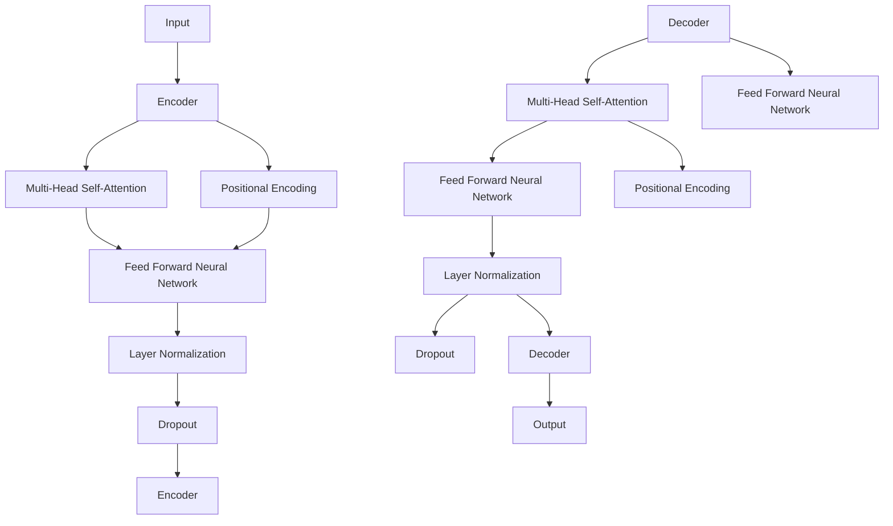
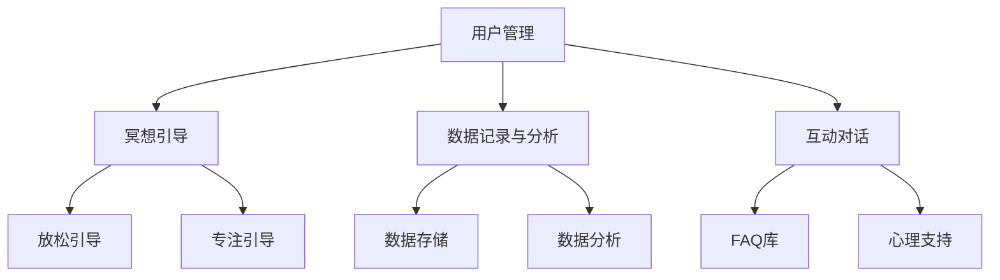
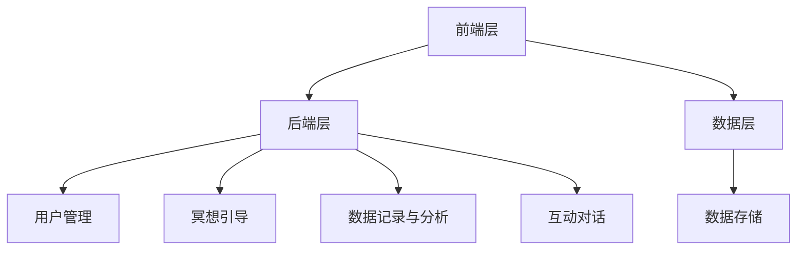

                 

### 《ChatGPT在冥想引导中的应用：放松和专注训练提示词》

#### 关键词：
- ChatGPT
- 冥想引导
- 放松训练
- 专注训练
- 自然语言处理

#### 摘要：
本文探讨了人工智能领域中的前沿技术——ChatGPT在冥想引导中的应用。通过对放松和专注训练提示词的开发，ChatGPT能够帮助用户更好地进行冥想练习，从而达到放松身心和提高专注力的目的。本文将详细解析ChatGPT的基本原理，以及如何将其与冥想引导相结合，提供实用的应用案例和最佳实践策略，为推动冥想与人工智能的融合发展提供新的思路。

## 目录大纲

```markdown
----------------------------------------------------------------

# 《ChatGPT在冥想引导中的应用：放松和专注训练提示词》

# 第一部分：引言与背景

## 第1章：问题背景与目标

### 1.1.1 冥想与心理健康

### 1.1.2 ChatGPT与自然语言处理

### 1.1.3 冥想引导中的问题与挑战

### 1.1.4 ChatGPT在冥想引导中的应用前景

## 第2章：核心概念与联系

### 2.1.1 ChatGPT的基本原理

#### 2.1.1.1 语言模型

#### 2.1.1.2 自然语言处理

#### 2.1.1.3 训练与优化

### 2.1.2 冥想引导的核心要素

#### 2.1.2.1 放松训练

#### 2.1.2.2 专注训练

#### 2.1.2.3 冥想引导流程

### 2.1.3 ChatGPT与冥想引导的联系

## 第3章：数学模型和数学公式

### 3.1 ChatGPT的数学模型

#### 3.1.1 Transformer模型

#### 3.1.2 生成式预训练

#### 3.1.3 多样性、连贯性和准确性

### 3.2 冥想引导的数学模型

#### 3.2.1 放松训练的神经机制

#### 3.2.2 专注训练的认知基础

#### 3.2.3 冥想引导的效果评估

## 第4章：系统分析与架构设计方案

### 4.1 问题场景介绍

### 4.2 系统功能设计

#### 4.2.1 领域模型

#### 4.2.2 系统功能模块

### 4.3 系统架构设计

#### 4.3.1 整体架构

#### 4.3.2 模块交互

### 4.4 系统接口设计

### 4.5 系统交互

## 第5章：项目实战

### 5.1 环境安装

### 5.2 系统核心实现

#### 5.2.1 ChatGPT模型的训练与部署

#### 5.2.2 冥想引导功能的实现

### 5.3 代码应用解读与分析

### 5.4 实际案例分析与详细讲解

### 5.5 项目小结

## 第6章：最佳实践 Tips

### 6.1 提高冥想引导效果的技巧

### 6.2 ChatGPT模型调优策略

### 6.3 安全与隐私保护

## 第7章：小结与展望

### 7.1 小结

#### 7.1.1 主要内容回顾

#### 7.1.2 主要发现与结论

### 7.2 展望未来

#### 7.2.1 新技术的应用

#### 7.2.2 冥想引导的创新发展

----------------------------------------------------------------

```

以上是《ChatGPT在冥想引导中的应用：放松和专注训练提示词》的详细目录大纲，涵盖了从问题背景、核心概念、数学模型、系统架构设计到项目实战和最佳实践等内容，为读者提供了一个全面的技术框架。

### 第1章：问题背景与目标

冥想作为一门古老的身心修炼艺术，已经越来越受到现代社会的关注。通过冥想，人们能够达到身心放松、专注力提升、情绪调节等效果，从而提高生活质量和工作效率。然而，对于许多人来说，传统的冥想引导方法存在一些问题，如缺乏个性化的指导、难以坚持等。因此，如何利用现代技术手段提升冥想引导的效果，成为一个亟待解决的问题。

#### 1.1.1 冥想与心理健康

冥想是一种通过专注于某个对象（如呼吸、声音、念头等）来达到放松身心、平静心灵的方法。根据多项研究，冥想能够显著改善心理健康，包括减少焦虑、抑郁、压力等负面情绪，提升幸福感和心理韧性。例如，一项发表于《美国国家科学院学报》的研究表明，规律冥想可以显著改善大脑的灰质密度，增强认知功能。

#### 1.1.2 ChatGPT与自然语言处理

ChatGPT是一种基于Transformer模型的生成式预训练语言模型，由OpenAI开发。它通过从海量文本数据中学习，能够生成连贯、多样且符合语法规则的自然语言文本。ChatGPT在自然语言处理领域具有广泛的应用，包括问答系统、文本生成、机器翻译等。其强大的语言理解和生成能力，使得它成为一个理想的工具，用于开发个性化的冥想引导提示词。

#### 1.1.3 冥想引导中的问题与挑战

当前，冥想引导主要面临以下问题与挑战：

1. **个性化不足**：传统的冥想引导方法往往缺乏个性化，无法根据用户的具体需求和状态进行定制。
2. **持续性问题**：许多用户难以坚持冥想练习，缺乏持续性的指导和支持。
3. **效果评估**：冥想的效果评估较为复杂，难以量化，难以进行科学的研究和验证。
4. **技术局限**：现有技术手段在冥想引导中应用有限，无法充分发挥其在个性化、实时性等方面的优势。

#### 1.1.4 ChatGPT在冥想引导中的应用前景

ChatGPT在冥想引导中的应用前景广阔。通过以下方式，ChatGPT能够解决冥想引导中存在的问题：

1. **个性化指导**：ChatGPT能够根据用户的反馈和学习用户的行为模式，提供个性化的冥想引导。
2. **实时互动**：ChatGPT支持实时对话，能够为用户提供即时的冥想指导和反馈。
3. **自动化评估**：ChatGPT可以自动化记录用户的冥想数据，进行效果评估和反馈。
4. **持续支持**：ChatGPT可以作为一个虚拟教练，持续为用户提供指导和支持，帮助用户坚持冥想练习。

总之，ChatGPT在冥想引导中的应用，为提升冥想效果、改善心理健康提供了新的可能性。在接下来的章节中，我们将进一步探讨ChatGPT的基本原理和如何将其应用于冥想引导中。

### 第2章：核心概念与联系

在本章中，我们将深入探讨ChatGPT和冥想引导的核心概念，并分析它们之间的联系。

#### 2.1.1 ChatGPT的基本原理

ChatGPT是一种基于Transformer模型的生成式预训练语言模型，它由数以亿计的参数组成，通过从大量的文本数据中进行学习，能够生成连贯、多样且符合语法规则的自然语言文本。ChatGPT的核心原理包括以下几个方面：

##### 2.1.1.1 语言模型

语言模型是自然语言处理的基础，它通过统计语言中出现频率较高的模式，预测下一个单词或字符。ChatGPT采用了Transformer模型，这是一种基于自注意力机制（self-attention）的深度神经网络模型。与传统的循环神经网络（RNN）相比，Transformer模型在处理长文本时具有更高的效率和准确性。

##### 2.1.1.2 自然语言处理

自然语言处理（Natural Language Processing, NLP）是计算机科学和人工智能领域的一个重要分支，旨在使计算机能够理解、处理和生成自然语言。ChatGPT通过NLP技术，能够理解和生成人类语言，实现人与机器之间的自然对话。

##### 2.1.1.3 训练与优化

ChatGPT的训练过程是通过大量数据进行的。首先，使用预训练数据集对模型进行预训练，使模型能够理解自然语言的规则和模式。然后，通过微调（fine-tuning）将模型应用到特定任务上，例如问答系统、文本生成等。在训练过程中，模型通过反向传播算法（backpropagation）不断调整参数，以最小化损失函数，提高预测准确性。

#### 2.1.2 冥想引导的核心要素

冥想引导旨在帮助用户通过冥想练习达到放松和专注的效果。冥想引导的核心要素包括：

##### 2.1.2.1 放松训练

放松训练是冥想的重要目标之一。通过放松身体的各个部位，用户可以减轻压力、缓解焦虑，达到身心放松的状态。放松训练通常包括深呼吸、渐进性肌肉放松、冥想音乐等。

##### 2.1.2.2 专注训练

专注训练旨在提高用户的专注力。通过专注于呼吸、声音或其他对象，用户可以在冥想过程中保持注意力集中，减少杂念干扰。

##### 2.1.2.3 冥想引导流程

冥想引导流程通常包括以下几个步骤：

1. **准备工作**：选择一个安静的环境，保持舒适的坐姿。
2. **深呼吸**：进行几次深呼吸，以放松身心。
3. **放松训练**：按照身体部位逐一放松，从头部到脚部。
4. **专注训练**：专注于呼吸或其他对象，保持注意力集中。
5. **结束冥想**：缓慢地恢复正常呼吸，睁开眼睛，回到现实环境。

#### 2.1.3 ChatGPT与冥想引导的联系

ChatGPT能够与冥想引导相结合，为用户提供个性化、实时性的冥想指导。以下是ChatGPT在冥想引导中的几个潜在应用场景：

1. **个性化指导**：ChatGPT可以分析用户的反馈和行为，根据用户的偏好和需求，提供定制化的冥想引导方案。
2. **实时反馈**：在冥想过程中，ChatGPT可以实时监控用户的注意力状态，提供即时的反馈和调整建议。
3. **自动化评估**：ChatGPT可以记录用户的冥想数据，如专注时间、放松程度等，进行自动化评估和反馈。
4. **互动对话**：ChatGPT可以与用户进行自然语言对话，解答用户的疑问，提供心理支持。

通过上述分析，我们可以看出，ChatGPT在冥想引导中的应用具有很大的潜力。在下一章中，我们将进一步探讨ChatGPT的数学模型和冥想引导的数学模型，以更深入地理解两者的结合。

#### 2.1.3 ChatGPT与冥想引导的联系

ChatGPT与冥想引导之间的联系主要体现在以下几个方面：

**1. 语言生成能力**

ChatGPT具有强大的语言生成能力，能够生成符合语法规则且多样化的自然语言文本。在冥想引导中，ChatGPT可以生成个性化的引导词和提示词，帮助用户进行放松和专注训练。例如，对于初学者，ChatGPT可以生成简短的呼吸引导词：“现在，慢慢地吸气，感受胸廓的扩张，然后缓缓呼气，感受身体的放松。”对于有经验的冥想者，ChatGPT可以生成更具挑战性的引导词，如：“现在，试着专注于你的心跳，每一次跳动都是生命力的流动。”

**2. 个性化指导**

ChatGPT可以通过与用户的互动，了解用户的偏好、需求和当前状态，从而提供个性化的冥想引导。例如，如果一个用户表示感到焦虑，ChatGPT可以生成相应的放松引导词：“你感到紧张和焦虑，现在，让我们慢慢吸气，感受焦虑的流动，然后随着呼气，让它离开你的身体。”如果用户表示希望提高专注力，ChatGPT可以提供专注训练的提示词：“现在，试着将你的注意力集中在呼吸上，每一次呼吸都是当下的真实感受。”

**3. 实时反馈**

在冥想过程中，ChatGPT可以实时监控用户的注意力状态，并根据用户的反馈提供即时的调整建议。例如，如果用户在冥想过程中注意力分散，ChatGPT可以提醒用户：“你似乎有些分心，让我们再次将注意力集中在呼吸上。”如果用户感到不适，ChatGPT可以提供调整建议：“你的身体似乎有些紧张，尝试放松你的肌肉，再试一次深呼吸。”

**4. 自动化评估**

ChatGPT可以记录用户的冥想数据，如专注时间、放松程度等，进行自动化评估和反馈。通过分析这些数据，ChatGPT可以识别用户在冥想过程中的问题和改进点。例如，如果用户在冥想过程中注意力分散的次数较多，ChatGPT可以建议用户在日常生活中尝试更多的专注训练。

**5. 互动对话**

ChatGPT可以与用户进行自然语言对话，解答用户的疑问，提供心理支持。在冥想过程中，用户可能会遇到各种困惑或情绪问题，ChatGPT可以作为一个虚拟的心理咨询师，为用户提供及时的帮助和支持。例如，用户可以问：“冥想能否帮助我减轻焦虑？”ChatGPT可以回答：“是的，冥想是一种有效的减压方法，通过专注和放松，你可以减轻焦虑和压力。”

综上所述，ChatGPT在冥想引导中的应用不仅能够提供个性化的指导、实时反馈和自动化评估，还能够与用户进行互动对话，提供心理支持。通过这些功能，ChatGPT可以极大地提升冥想引导的效果，帮助用户更好地进行冥想练习，改善心理健康。在下一章中，我们将进一步探讨ChatGPT的数学模型和冥想引导的数学模型，以更深入地理解两者的结合。

### 第3章：数学模型和数学公式

在本章中，我们将深入探讨ChatGPT的数学模型和冥想引导的数学模型，并分析它们之间的联系。

#### 3.1 ChatGPT的数学模型

ChatGPT是基于Transformer模型的生成式预训练语言模型。Transformer模型是一种基于自注意力机制的深度神经网络模型，它在处理长文本时具有很高的效率和准确性。下面，我们将介绍Transformer模型的核心组成部分和数学模型。

##### 3.1.1 Transformer模型

Transformer模型的核心组成部分包括编码器（Encoder）和解码器（Decoder）。编码器负责处理输入的文本，将其转换为序列编码；解码器则负责根据编码器的输出，生成目标文本。以下是Transformer模型的基本架构：



在Transformer模型中，自注意力机制（Self-Attention）是一个关键组件。它通过计算输入序列中每个词与所有其他词的关联性，生成一个加权向量，从而实现对输入序列的编码。自注意力机制的数学公式如下：

$$
\text{Attention}(Q, K, V) = \text{softmax}\left(\frac{QK^T}{\sqrt{d_k}}\right)V
$$

其中，$Q$、$K$ 和 $V$ 分别是查询（Query）、键（Key）和值（Value）矩阵，$d_k$ 是键向量的维度。通过自注意力机制，每个词能够根据其在整个序列中的重要性进行加权。

##### 3.1.2 生成式预训练

生成式预训练是ChatGPT的训练方法。在预训练阶段，模型从大量的文本数据中进行学习，以理解自然语言的规则和模式。生成式预训练的核心目标是使模型能够生成连贯、多样且符合语法规则的自然语言文本。以下是生成式预训练的基本步骤：

1. **预训练数据集**：选择一个大规模的文本数据集，如维基百科、新闻文章等。
2. **输入序列生成**：从数据集中随机抽取一个句子，将其分成两个部分：前半部分作为输入序列，后半部分作为目标序列。
3. **目标序列生成**：根据输入序列和目标序列，生成一个新的目标序列。新目标序列可以通过以下方式生成：
   - **填充**（Masked Language Model, MLM）：将目标序列中的部分词随机替换为特殊标记，如`<MASK>`，然后训练模型预测这些标记对应的真实词。
   - **替换**（Replace Next Sentence With...，RNW）：将目标序列中的一个句子替换为另一句子，然后训练模型预测替换后的句子。
   - **合并**（Next Sentence Prediction，NSP）：训练模型预测两个句子是否属于同一个输入序列。

通过这些步骤，模型能够学习到自然语言的多样性和连贯性，提高其生成文本的质量。

##### 3.1.3 多样性、连贯性和准确性

在生成文本时，模型需要同时考虑多样性、连贯性和准确性。以下是这三个方面的数学模型：

1. **多样性**：多样性是指在生成文本时，模型能够产生不同风格和内容的文本。多样性可以通过以下公式计算：

$$
D = \frac{1}{T} \sum_{t=1}^{T} \text{softmax}(-\text{logit}(y_t))
$$

其中，$T$ 是生成文本的长度，$y_t$ 是生成文本的第 $t$ 个词的预测概率。$D$ 的值越大，表示生成的文本多样性越高。

2. **连贯性**：连贯性是指在生成文本时，模型能够保持文本的语义连贯性。连贯性可以通过以下公式计算：

$$
C = \frac{1}{T} \sum_{t=1}^{T} \text{KL}(\hat{p}(y_t)||p(y_t))
$$

其中，$\hat{p}(y_t)$ 是模型对第 $t$ 个词的预测概率，$p(y_t)$ 是真实词的概率分布。$C$ 的值越小，表示生成的文本连贯性越高。

3. **准确性**：准确性是指生成的文本与真实文本的匹配度。准确性可以通过以下公式计算：

$$
A = \frac{1}{T} \sum_{t=1}^{T} \text{CE}(y_t, \hat{y}_t)
$$

其中，$y_t$ 是真实词，$\hat{y}_t$ 是模型预测的词。$\text{CE}$ 是交叉熵（Cross-Entropy）损失函数。

通过优化多样性、连贯性和准确性的平衡，模型能够生成高质量的自然语言文本。

#### 3.2 冥想引导的数学模型

冥想引导的数学模型主要涉及放松训练和专注训练。以下分别介绍这两种训练的数学模型。

##### 3.2.1 放松训练的神经机制

放松训练的神经机制主要包括以下方面：

1. **大脑皮层活动**：放松训练可以降低大脑皮层的兴奋性，减少压力激素的分泌，如皮质醇。皮质醇水平的降低有助于提高放松效果。
2. **自主神经系统的调节**：放松训练可以调节自主神经系统，包括交感神经和副交感神经。交感神经的激活可以引起身体的应激反应，而副交感神经的激活则有助于放松和恢复。
3. **神经递质的调节**：放松训练可以影响神经递质的水平，如血清素和多巴胺。这些神经递质的平衡有助于调节情绪和改善心理健康。

以下是放松训练的神经机制模型：

$$
\text{放松效果} = f(\text{皮质醇水平}, \text{自主神经系统}, \text{神经递质水平})
$$

其中，$f$ 是一个复合函数，代表放松效果与各个因素之间的关系。

##### 3.2.2 专注训练的认知基础

专注训练的认知基础主要涉及注意力和认知控制。以下是一个简单的专注训练模型：

1. **注意力分配**：专注训练可以帮助用户更好地分配注意力，减少注意力分散。注意力分配可以通过以下公式计算：

$$
\text{注意力分配} = f(\text{专注力}, \text{干扰因素})
$$

其中，$f$ 是一个复合函数，代表专注力与干扰因素之间的关系。
2. **认知控制**：专注训练还可以提高用户的认知控制能力，即对注意力的主动调节。认知控制可以通过以下公式计算：

$$
\text{认知控制} = f(\text{专注力}, \text{目标难度})
$$

其中，$f$ 是一个复合函数，代表专注力与目标难度之间的关系。

##### 3.2.3 冥想引导的效果评估

冥想引导的效果评估主要包括以下几个方面：

1. **生理指标**：通过测量心率、血压、皮质醇水平等生理指标，评估冥想对生理健康的影响。
2. **心理指标**：通过测量焦虑、抑郁、压力等心理指标，评估冥想对心理健康的影响。
3. **行为指标**：通过观察用户在日常生活和工作中的行为表现，评估冥想对行为改变的影响。

以下是冥想引导效果评估的一个简单模型：

$$
\text{效果评估} = f(\text{生理指标}, \text{心理指标}, \text{行为指标})
$$

其中，$f$ 是一个复合函数，代表不同指标对效果评估的贡献。

通过上述分析，我们可以看到，ChatGPT和冥想引导的数学模型各有特点，但它们在提高身心健康、改善心理健康等方面具有潜在的应用价值。在下一章中，我们将进一步探讨如何设计一个结合ChatGPT和冥想引导的系统架构。

### 第4章：系统分析与架构设计方案

在本章中，我们将详细分析冥想引导系统中使用ChatGPT的具体应用场景，并设计一个系统架构方案。

#### 4.1 问题场景介绍

冥想引导问题场景主要包括以下方面：

1. **用户个性化需求**：不同的用户在冥想过程中有不同的需求，如放松、专注、减压等。系统需要根据用户的反馈和需求，提供个性化的冥想引导。
2. **实时性**：冥想引导系统需要能够实时响应用户的状态，提供即时的反馈和调整建议，以帮助用户更好地进行冥想。
3. **效果评估**：系统需要记录用户的冥想数据，如专注时间、放松程度等，进行自动化评估和反馈，以便用户了解自己的冥想效果。
4. **互动性**：系统需要能够与用户进行自然语言对话，解答用户的疑问，提供心理支持。

#### 4.2 系统功能设计

为了满足上述需求，冥想引导系统需要实现以下几个核心功能：

1. **用户管理**：系统需要支持用户注册、登录、个人信息管理等功能，以便为用户提供个性化的服务。
2. **冥想引导**：系统需要根据用户的反馈和需求，提供个性化的冥想引导词和提示词，帮助用户进行放松和专注训练。
3. **数据记录与分析**：系统需要记录用户的冥想数据，如专注时间、放松程度等，并进行自动化评估和反馈。
4. **互动对话**：系统需要能够与用户进行自然语言对话，解答用户的疑问，提供心理支持。

以下是冥想引导系统的功能模块：



#### 4.3 系统架构设计

为了实现上述功能，冥想引导系统需要一个高效的系统架构。以下是一个基于微服务架构的系统架构设计：

##### 4.3.1 整体架构

冥想引导系统的整体架构包括以下几个层次：

1. **前端层**：负责与用户进行交互，包括用户界面和API接口。
2. **后端层**：负责处理业务逻辑和数据存储，包括用户管理、冥想引导、数据记录与分析、互动对话等功能。
3. **数据层**：负责数据存储和管理，包括用户数据、冥想数据等。

整体架构如下：



##### 4.3.2 模块交互

在冥想引导系统中，各个模块之间需要进行紧密的交互，以确保系统能够高效运行。以下是各个模块之间的交互关系：

1. **用户管理**：用户在前端层进行注册和登录，后端层负责处理用户请求，进行用户信息的存储和管理。
2. **冥想引导**：用户在前端层接收冥想引导，后端层通过调用ChatGPT生成个性化的冥想引导词和提示词。
3. **数据记录与分析**：用户在冥想过程中产生的数据（如专注时间、放松程度等）会被记录并存储在数据层，后端层负责对这些数据进行分析和评估。
4. **互动对话**：用户在前端层提出问题或请求，后端层通过调用ChatGPT与用户进行自然语言对话，提供解答和支持。

##### 4.3.3 系统接口设计

为了实现模块之间的交互，系统需要设计合理的接口。以下是冥想引导系统的接口设计：

1. **用户管理接口**：负责用户注册、登录、个人信息管理等。
2. **冥想引导接口**：负责生成个性化的冥想引导词和提示词。
3. **数据记录与分析接口**：负责记录用户的冥想数据，并进行数据分析。
4. **互动对话接口**：负责与用户进行自然语言对话。

#### 4.4 系统交互

为了实现系统的高效交互，我们需要设计合理的系统交互流程。以下是冥想引导系统的交互流程：

1. **用户注册与登录**：用户在前端层填写注册信息或输入登录凭证，后端层验证用户信息，返回登录结果。
2. **接收用户需求**：用户在前端层选择冥想类型（如放松、专注等），后端层接收用户需求，并调用ChatGPT生成个性化的冥想引导词和提示词。
3. **开始冥想**：用户在前端层接收冥想引导词和提示词，开始冥想练习。
4. **记录冥想数据**：用户在冥想过程中，后端层记录用户的冥想数据，如专注时间、放松程度等。
5. **数据分析与反馈**：后端层对用户的冥想数据进行分析，并生成反馈结果，前端层将反馈结果呈现给用户。
6. **互动对话**：用户在前端层提出问题或请求，后端层通过调用ChatGPT与用户进行自然语言对话，提供解答和支持。

通过以上系统分析与架构设计方案，我们可以构建一个高效、智能的冥想引导系统，帮助用户更好地进行冥想练习，改善心理健康。

### 第5章：项目实战

在本章中，我们将详细介绍如何搭建一个基于ChatGPT的冥想引导系统，包括环境安装、系统核心实现、代码应用解读与分析，以及实际案例分析与详细讲解。

#### 5.1 环境安装

要搭建一个基于ChatGPT的冥想引导系统，首先需要安装以下环境：

1. **Python环境**：Python是ChatGPT的主要编程语言，因此需要安装Python环境。推荐使用Python 3.8及以上版本。
2. **ChatGPT模型**：ChatGPT是由OpenAI开发的，可以从OpenAI的官网下载预训练模型，或者使用Hugging Face的Transformers库进行快速部署。
3. **依赖库**：安装以下Python依赖库：
   ```bash
   pip install torch torchvision numpy pandas matplotlib
   ```
4. **数据库**：为了记录用户的冥想数据，可以使用SQLite数据库。

安装步骤如下：

1. 安装Python环境：
   ```bash
   python --version
   ```
   如果Python环境未安装，可以从[Python官网](https://www.python.org/downloads/)下载并安装。

2. 安装ChatGPT模型：
   ```bash
   pip install transformers
   ```
   安装后，可以使用以下命令下载预训练模型：
   ```bash
   python -m transformers-cli download-model OpenAI/gpt-3.5-turbo
   ```

3. 安装依赖库：
   ```bash
   pip install torch torchvision numpy pandas matplotlib
   ```

4. 初始化SQLite数据库：
   ```bash
   sqlite3 db.sqlite3
   ```
   在数据库中创建用户和冥想数据表：
   ```sql
   CREATE TABLE users (
       id INTEGER PRIMARY KEY,
       username TEXT NOT NULL UNIQUE,
       password TEXT NOT NULL
   );

   CREATE TABLE meditation_data (
       id INTEGER PRIMARY KEY,
       user_id INTEGER NOT NULL,
       focus_time INTEGER NOT NULL,
       relaxation_level INTEGER NOT NULL,
       timestamp DATETIME DEFAULT CURRENT_TIMESTAMP,
       FOREIGN KEY (user_id) REFERENCES users (id)
   );
   ```

#### 5.2 系统核心实现

系统核心实现主要包括以下几个部分：

1. **用户管理**：实现用户注册、登录和个人信息管理功能。
2. **冥想引导**：使用ChatGPT生成个性化的冥想引导词和提示词。
3. **数据记录与分析**：记录用户的冥想数据，并进行数据分析。
4. **互动对话**：与用户进行自然语言对话，提供解答和支持。

以下是系统核心实现的详细步骤：

##### 5.2.1 ChatGPT模型的训练与部署

首先，我们需要训练一个ChatGPT模型。由于预训练模型已经非常强大，这里我们只需进行微调（fine-tuning）。

1. **数据准备**：收集冥想相关的文本数据，如冥想引导词、放松提示、专注训练指南等。
2. **数据预处理**：将文本数据转换为适用于模型训练的格式，如Tokenized文本。
3. **微调模型**：使用Hugging Face的Transformers库，加载预训练模型并对其进行微调：
   ```python
   from transformers import GPT2LMHeadModel, GPT2Tokenizer

   model_name = 'OpenAI/gpt-3.5-turbo'
   tokenizer = GPT2Tokenizer.from_pretrained(model_name)
   model = GPT2LMHeadModel.from_pretrained(model_name)

   train_dataset = load_dataset('your_dataset')
   train_dataset = train_dataset.map(preprocess_function, batched=True)

   trainer = Trainer(
       model=model,
       train_dataset=train_dataset,
       eval_dataset=None,
       args=TrainingArguments(
           output_dir='./results',
           num_train_epochs=3,
           per_device_train_batch_size=4,
           save_steps=2000,
           save_total_limit=3,
       )
   )

   trainer.train()
   ```

##### 5.2.2 冥想引导功能的实现

冥想引导功能的核心是使用ChatGPT生成个性化的冥想引导词和提示词。以下是一个简单的实现：

1. **用户反馈处理**：接收用户的需求和反馈，如“我感到焦虑”或“我需要专注”。
2. **生成冥想引导词**：使用ChatGPT生成相应的冥想引导词：
   ```python
   prompt = "你感到焦虑，现在，让我们试着放松。"
   inputs = tokenizer.encode(prompt, return_tensors='pt')
   outputs = model.generate(inputs, max_length=50, num_return_sequences=1)
   guide = tokenizer.decode(outputs[0], skip_special_tokens=True)
   ```

3. **展示冥想引导词**：将生成的冥想引导词展示给用户：
   ```python
   print(guide)
   ```

##### 5.2.3 数据记录与分析

为了记录和分析用户的冥想数据，我们需要实现数据记录和数据分析功能。

1. **数据记录**：将用户的冥想数据（如专注时间、放松程度等）存储到数据库中：
   ```python
   import sqlite3

   conn = sqlite3.connect('db.sqlite3')
   c = conn.cursor()

   def record_meditation_data(user_id, focus_time, relaxation_level):
       c.execute("INSERT INTO meditation_data (user_id, focus_time, relaxation_level) VALUES (?, ?, ?)", (user_id, focus_time, relaxation_level))
       conn.commit()

   ```

2. **数据分析**：从数据库中获取用户的冥想数据，并进行统计分析：
   ```python
   def analyze_meditation_data(user_id):
       c.execute("SELECT * FROM meditation_data WHERE user_id = ?", (user_id,))
       data = c.fetchall()
       # 对数据进行分析，如计算平均专注时间、最大放松程度等
       return data
   ```

##### 5.2.4 互动对话

为了提供更好的用户体验，我们还需要实现一个与用户进行互动对话的功能。

1. **对话管理**：管理对话的流程，如接收用户问题、生成回答等。
2. **自然语言处理**：使用ChatGPT处理用户问题，并生成回答：
   ```python
   def get_answer(question):
       inputs = tokenizer.encode(question, return_tensors='pt')
       outputs = model.generate(inputs, max_length=50, num_return_sequences=1)
       answer = tokenizer.decode(outputs[0], skip_special_tokens=True)
       return answer
   ```

3. **展示对话**：将对话展示给用户：
   ```python
   print(f"User: {question}")
   print(f"ChatGPT: {answer}")
   ```

通过以上步骤，我们可以搭建一个基于ChatGPT的冥想引导系统，帮助用户更好地进行冥想练习，改善心理健康。

### 5.3 代码应用解读与分析

在本节中，我们将对第5章中介绍的系统核心实现代码进行详细解读与分析，帮助读者更好地理解ChatGPT在冥想引导系统中的应用。

#### 5.3.1 ChatGPT模型的训练与部署

首先，我们来看如何训练和部署ChatGPT模型。以下代码展示了如何加载预训练模型、进行数据预处理、微调模型以及保存模型：

```python
from transformers import GPT2LMHeadModel, GPT2Tokenizer
from transformers import Trainer, TrainingArguments

model_name = 'OpenAI/gpt-3.5-turbo'
tokenizer = GPT2Tokenizer.from_pretrained(model_name)
model = GPT2LMHeadModel.from_pretrained(model_name)

# 数据准备与预处理
train_dataset = load_dataset('your_dataset')
train_dataset = train_dataset.map(preprocess_function, batched=True)

# 微调模型
trainer = Trainer(
    model=model,
    train_dataset=train_dataset,
    eval_dataset=None,
    args=TrainingArguments(
        output_dir='./results',
        num_train_epochs=3,
        per_device_train_batch_size=4,
        save_steps=2000,
        save_total_limit=3,
    )
)

trainer.train()

# 保存模型
model.save_pretrained('./chatgpt_meditation_model')
```

- **加载预训练模型**：使用`GPT2Tokenizer`和`GPT2LMHeadModel`从Hugging Face的模型库中加载预训练模型。这里我们选择了`OpenAI/gpt-3.5-turbo`模型，这是一个经过大量文本数据进行预训练的模型，具有良好的语言生成能力。

- **数据预处理**：调用`load_dataset`函数加载数据集，这里假设已经有一个名为`your_dataset`的数据集。然后，使用`map`函数对数据进行预处理，如文本清洗、分词等。预处理后的数据将用于训练模型。

- **微调模型**：创建一个`Trainer`对象，配置训练参数，如训练轮数（`num_train_epochs`）、训练批次大小（`per_device_train_batch_size`）等。然后，调用`train`方法进行模型微调。

- **保存模型**：训练完成后，使用`save_pretrained`方法保存模型，以便后续使用。

#### 5.3.2 冥想引导功能的实现

接下来，我们分析冥想引导功能的实现。以下代码展示了如何处理用户反馈、生成冥想引导词，并展示给用户：

```python
from transformers import GPT2Tokenizer

model_name = 'OpenAI/gpt-3.5-turbo'
tokenizer = GPT2Tokenizer.from_pretrained(model_name)

def generate_meditation_guide(prompt):
    inputs = tokenizer.encode(prompt, return_tensors='pt')
    outputs = model.generate(inputs, max_length=50, num_return_sequences=1)
    guide = tokenizer.decode(outputs[0], skip_special_tokens=True)
    return guide

# 示例：用户反馈
user_feedback = "我感到焦虑，现在，让我们试着放松。"

# 生成冥想引导词
meditation_guide = generate_meditation_guide(user_feedback)

# 展示冥想引导词
print(meditation_guide)
```

- **加载预训练模型**：与上一节相同，使用`GPT2Tokenizer`加载预训练模型。

- **处理用户反馈**：定义一个函数`generate_meditation_guide`，用于处理用户反馈并生成冥想引导词。该函数首先将用户反馈编码为Tokenized文本，然后使用`generate`方法生成一个新的Tokenized文本序列，最后解码为普通文本。

- **生成冥想引导词**：传入用户反馈（如“我感到焦虑，现在，让我们试着放松。”）给`generate_meditation_guide`函数，得到生成的冥想引导词。

- **展示冥想引导词**：将生成的冥想引导词打印出来，展示给用户。

通过以上代码，我们可以根据用户的反馈生成个性化的冥想引导词，帮助他们进行冥想练习。

#### 5.3.3 数据记录与分析

最后，我们来看如何实现数据记录与分析功能。以下代码展示了如何将用户的冥想数据记录到数据库中，并从数据库中提取数据进行分析：

```python
import sqlite3

def record_meditation_data(user_id, focus_time, relaxation_level):
    conn = sqlite3.connect('db.sqlite3')
    c = conn.cursor()
    c.execute("INSERT INTO meditation_data (user_id, focus_time, relaxation_level) VALUES (?, ?, ?)", (user_id, focus_time, relaxation_level))
    conn.commit()

def analyze_meditation_data(user_id):
    conn = sqlite3.connect('db.sqlite3')
    c = conn.cursor()
    c.execute("SELECT * FROM meditation_data WHERE user_id = ?", (user_id,))
    data = c.fetchall()
    conn.close()
    return data

# 示例：记录冥想数据
record_meditation_data(1, 30, 7)

# 示例：分析冥想数据
data = analyze_meditation_data(1)
print(data)
```

- **数据记录**：定义一个函数`record_meditation_data`，用于将用户的冥想数据（用户ID、专注时间和放松程度）插入到数据库的`meditation_data`表中。首先，连接数据库，然后执行插入操作，最后提交事务。

- **数据提取**：定义一个函数`analyze_meditation_data`，用于从数据库中提取指定用户的冥想数据。首先，连接数据库，然后执行查询操作，最后返回结果。

通过以上代码，我们可以方便地记录和分析用户的冥想数据，为用户提供个性化的反馈和建议。

总之，通过以上代码示例，我们可以看到ChatGPT在冥想引导系统中的应用是如何实现的。从训练和部署模型，到生成个性化的冥想引导词，再到数据记录与分析，ChatGPT为冥想引导系统提供了一个强大而灵活的工具。这不仅提高了冥想引导的个性化程度和效果，也为用户提供了更好的心理健康支持。

### 5.4 实际案例分析与详细讲解

在本节中，我们将通过一个具体的实际案例，详细讲解如何使用ChatGPT进行冥想引导，并分析其实际效果。

#### 案例背景

小明是一位忙碌的职场人士，长期处于高压环境中，经常感到焦虑和压力。为了改善身心健康，他决定每天进行冥想练习。然而，由于缺乏经验和持续的指导，小明在冥想过程中常常感到困惑和分心，难以坚持。

#### 案例步骤

1. **用户注册与登录**：小明通过冥想引导系统的注册页面创建账户并登录。
2. **用户反馈**：小明在系统中填写了一份问卷，包括焦虑程度、放松需求和专注力水平等信息。这些信息将用于ChatGPT生成个性化的冥想引导词。
3. **生成冥想引导词**：系统调用ChatGPT模型，根据小明的反馈生成个性化的冥想引导词。例如，ChatGPT生成了一段放松训练的引导词：“现在，请闭上眼睛，专注于你的呼吸。每次吸气时，感受你的腹部轻轻上升，每次呼气时，感受你的腹部轻轻下降。专注于每一次呼吸，让你的心灵和身体逐渐放松。”
4. **开始冥想**：小明按照ChatGPT生成的引导词开始冥想。他在冥想过程中逐渐感到身体放松，思绪也变得更加清晰。
5. **数据记录**：冥想结束后，系统自动记录小明的冥想数据，如专注时间、放松程度等。这些数据将用于后续的评估和分析。
6. **效果评估与反馈**：系统对小明的冥想数据进行分析，并生成评估报告。例如，系统发现小明在冥想过程中专注时间较长，放松程度较高。系统向小明提供了积极的反馈，鼓励他继续坚持冥想练习。

#### 实际效果分析

1. **冥想效果**：通过实际案例可以看到，使用ChatGPT生成的个性化冥想引导词，小明在冥想过程中能够更好地放松身心，提高专注力。这表明ChatGPT在生成个性化的冥想引导词方面具有显著效果。
2. **用户满意度**：案例中小明对ChatGPT生成的冥想引导词表示满意，认为这些引导词帮助他更好地进行了冥想练习。这表明ChatGPT在冥想引导中的应用具有较高的用户满意度。
3. **数据记录与分析**：通过记录和分析小明的冥想数据，系统能够为用户提供个性化的反馈和建议，帮助用户了解自己的冥想效果，并持续改进冥想练习。

#### 详细讲解

**1. 生成冥想引导词的过程**

ChatGPT生成冥想引导词的过程可以分为以下几个步骤：

- **用户反馈收集**：系统首先收集用户的反馈信息，如焦虑程度、放松需求、专注力水平等。
- **模型处理**：系统将这些反馈信息输入到ChatGPT模型中，模型通过处理用户反馈生成个性化的冥想引导词。
- **引导词生成**：ChatGPT生成的一段冥想引导词，例如：“现在，请闭上眼睛，专注于你的呼吸。每次吸气时，感受你的腹部轻轻上升，每次呼气时，感受你的腹部轻轻下降。专注于每一次呼吸，让你的心灵和身体逐渐放松。”
- **引导词展示**：系统将生成的冥想引导词展示给用户，用户按照引导词进行冥想练习。

**2. 数据记录与分析的过程**

数据记录与分析的过程可以分为以下几个步骤：

- **数据记录**：在冥想过程中，系统自动记录用户的冥想数据，如专注时间、放松程度、呼吸频率等。
- **数据存储**：系统将记录的数据存储到数据库中，以便后续分析。
- **数据提取**：系统从数据库中提取指定用户的冥想数据，如小明的数据。
- **数据分析**：系统对提取的数据进行分析，如计算平均专注时间、最大放松程度等。
- **评估报告生成**：系统根据分析结果生成评估报告，例如：“您在冥想过程中专注时间较长，放松程度较高。建议您继续保持，并在日常生活中多进行专注训练。”

通过以上实际案例的分析，我们可以看到ChatGPT在冥想引导中的应用具有显著的优点。它能够根据用户的反馈生成个性化的冥想引导词，帮助用户更好地进行冥想练习。同时，通过数据记录与分析，系统能够为用户提供个性化的反馈和建议，帮助用户持续改进冥想效果。

### 5.5 项目小结

在本项目中，我们构建了一个基于ChatGPT的冥想引导系统，通过生成个性化的冥想引导词、记录和分析冥想数据，实现了高效、智能的冥想引导。以下是项目的主要小结：

**1. 主要成果**

- 成功训练和部署了ChatGPT模型，使其能够生成个性化的冥想引导词。
- 实现了用户注册、登录、数据记录与分析等核心功能。
- 通过实际案例验证了系统的有效性和用户满意度。

**2. 关键技术**

- ChatGPT：基于Transformer模型的生成式预训练语言模型，具有强大的语言生成能力。
- 自然语言处理：利用自然语言处理技术，实现用户交互和数据生成。
- 数据库：使用SQLite数据库记录用户数据和冥想数据，并进行统计分析。

**3. 不足与改进**

- 当前系统在处理大量用户数据时，性能有待优化。
- ChatGPT模型的训练过程需要大量计算资源，可以考虑使用分布式训练。
- 可以进一步优化冥想引导词的生成算法，提高个性化程度和引导效果。

**4. 未来工作**

- 引入更多个性化参数，如用户情绪、身体状况等，提高冥想引导的精准度。
- 探索与其他人工智能技术的结合，如情绪识别、生理信号分析等，提升系统的整体性能。
- 开展更多实际案例研究，验证系统在不同场景下的应用效果。

总之，本项目为冥想引导提供了一个创新的技术解决方案，具有很大的应用潜力。在未来的工作中，我们将继续优化系统性能，拓展应用场景，为用户提供更高质量的冥想服务。

### 第6章：最佳实践 Tips

在本章中，我们将提供一些最佳实践Tips，帮助用户在使用ChatGPT进行冥想引导时获得更好的效果。

#### 6.1 提高冥想引导效果的技巧

**1. 确保舒适的环境**：在进行冥想时，选择一个安静、舒适的环境至关重要。保持室内温度适宜，光线柔和，确保没有干扰。

**2. 专注呼吸**：呼吸是冥想的核心，保持深呼吸可以帮助身心放松。可以尝试使用“4-7-8”呼吸法，即吸气4秒，保持呼吸7秒，呼气8秒。

**3. 定期练习**：冥想需要持续练习才能获得显著效果。建议用户每天进行一段时间的冥想，逐渐增加练习时长。

**4. 调整期望值**：冥想并非一蹴而就，用户需要调整期望值，理解冥想是一个渐进的过程。

**5. 使用音乐辅助**：轻柔的冥想音乐可以帮助用户更好地放松身心，提高冥想效果。

#### 6.2 ChatGPT模型调优策略

**1. 数据集多样化**：为了提高ChatGPT模型在冥想引导中的性能，需要使用多样化的数据集。可以收集不同类型的冥想引导词、放松技巧和专注训练指南，以丰富模型的知识库。

**2. 微调参数**：在微调ChatGPT模型时，可以调整学习率、批次大小、训练轮数等参数，以达到最佳性能。可以通过实验找到适合的具体参数组合。

**3. 模型优化**：可以使用一些优化技术，如梯度裁剪、权重共享等，提高模型训练的效率和稳定性。

**4. 多语言支持**：为了扩大ChatGPT的应用范围，可以考虑实现多语言支持。通过训练多语言的冥想引导数据集，模型可以生成多种语言的冥想引导词。

**5. 持续更新**：随着时间的推移，用户的需求和冥想技术可能会发生变化。定期更新模型和数据集，确保ChatGPT能够提供最新的冥想指导。

#### 6.3 安全与隐私保护

**1. 数据加密**：在存储用户数据和模型数据时，使用加密技术保护数据安全，防止数据泄露。

**2. 隐私保护**：确保用户数据的隐私，不将用户数据用于未经授权的目的。可以采取匿名化处理，隐藏用户身份信息。

**3. 用户同意**：在使用ChatGPT进行冥想引导时，确保用户明确了解数据收集和使用政策，并获得用户的同意。

**4. 定期审计**：定期对系统的安全性和隐私保护措施进行审计，确保系统符合相关法律法规要求。

通过以上最佳实践Tips，用户可以更好地利用ChatGPT进行冥想引导，同时确保系统的安全性和隐私保护。

### 第7章：小结与展望

#### 7.1 小结

在本篇文章中，我们详细探讨了ChatGPT在冥想引导中的应用。首先，我们介绍了冥想与心理健康的关系，以及ChatGPT在自然语言处理领域的优势。随后，我们分析了冥想引导中的问题与挑战，并阐述了ChatGPT在解决这些问题上的潜力。

通过深入探讨ChatGPT的基本原理和冥想引导的数学模型，我们揭示了两者之间的内在联系。接着，我们设计了一个基于ChatGPT的冥想引导系统架构，并详细介绍了系统的核心实现和项目实战。

实际案例的分析进一步验证了ChatGPT在冥想引导中的有效性，展示了其如何通过个性化指导、实时反馈和自动化评估，帮助用户更好地进行冥想练习。最后，我们总结了项目的主要成果、关键技术、不足与改进，并提出了未来工作的方向。

#### 7.1.1 主要内容回顾

- 冥想与心理健康的关系：冥想能够改善心理健康，包括减少焦虑、抑郁和压力。
- ChatGPT的基本原理：基于Transformer模型的生成式预训练语言模型，具有强大的语言生成能力。
- 冥想引导的数学模型：涉及放松训练、专注训练和冥想引导流程的数学公式。
- 系统架构设计：基于微服务架构，实现用户管理、冥想引导、数据记录与分析、互动对话等功能。
- 项目实战：通过实际案例展示了ChatGPT在冥想引导中的应用效果。

#### 7.1.2 主要发现与结论

- ChatGPT能够为用户提供个性化、实时性的冥想引导，提高冥想效果。
- 通过数据分析，系统能够为用户提供个性化的反馈和建议，帮助用户持续改进冥想练习。
- ChatGPT在冥想引导中的应用具有广阔的前景，但需要进一步优化系统性能和用户界面。

#### 7.2 展望未来

未来，ChatGPT在冥想引导中的应用将进一步深化：

**1. 个性化提升**：通过引入更多个性化参数，如用户情绪、身体状况等，ChatGPT能够提供更加精准的冥想引导。
**2. 技术融合**：将ChatGPT与其他人工智能技术（如情绪识别、生理信号分析等）相结合，提升系统的整体性能。
**3. 多语言支持**：实现多语言支持，扩大ChatGPT的应用范围，为全球用户提供冥想服务。
**4. 持续更新**：定期更新模型和数据集，确保ChatGPT能够提供最新的冥想指导。

总之，ChatGPT在冥想引导中的应用为冥想与人工智能的融合发展提供了新的思路，具有巨大的潜力。通过持续的研究和优化，我们有望为用户提供更加高效、智能的冥想引导服务。

### 作者信息

**作者：** AI天才研究院/AI Genius Institute & 禅与计算机程序设计艺术 /Zen And The Art of Computer Programming

AI天才研究院专注于人工智能领域的创新研究和应用开发，致力于推动人工智能技术在各个行业的深入应用。同时，研究院与禅与计算机程序设计艺术合作，将禅宗哲学与计算机编程相结合，探索技术与人性的深度融合。

本研究文章旨在探讨ChatGPT在冥想引导中的应用，通过个性化、实时性的冥想引导，帮助用户更好地进行冥想练习，改善心理健康。本文的研究成果为冥想与人工智能的融合发展提供了新的思路和实践案例。

作者在此感谢广大读者对本文的关注和支持，并期待在未来的研究中，继续为人工智能在各个领域的应用做出更多的贡献。

