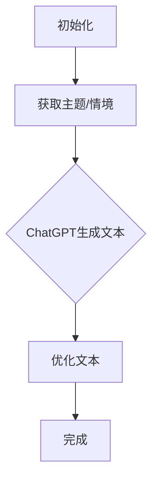
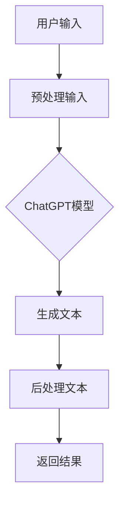

                 

# 《ChatGPT在创意写作工作坊中的辅助作用》

## 关键词

- ChatGPT
- 创意写作
- 辅助作用
- 工作坊
- 人工智能
- 自然语言处理

## 摘要

本文将探讨人工智能技术，尤其是ChatGPT在创意写作工作坊中的应用与辅助作用。我们将从背景介绍、核心概念与联系、算法原理讲解、系统分析与架构设计方案、项目实战以及最佳实践等方面进行详细分析，旨在展示ChatGPT在提升创意写作效率和质量方面的潜力。

## 目录大纲

## 第一部分：背景介绍

### 第1章：问题背景

### 第2章：问题描述

### 第3章：问题解决

### 第4章：边界与外延

### 第5章：概念结构与核心要素组成

## 第二部分：核心概念与联系

### 第6章：核心概念原理

### 第7章：概念属性特征对比表格

### 第8章：ER实体关系图架构

## 第三部分：算法原理讲解

### 第9章：算法mermaid流程图

### 第10章：python源代码

### 第11章：数学模型和公式

### 第12章：详细讲解和举例说明

## 第四部分：系统分析与架构设计方案

### 第13章：问题场景介绍

### 第14章：系统功能设计

### 第15章：系统架构设计

### 第16章：系统接口设计

### 第17章：系统交互

## 第五部分：项目实战

### 第18章：环境安装

### 第19章：系统核心实现源代码

### 第20章：代码应用解读与分析

### 第21章：实际案例分析和详细讲解剖析

### 第22章：项目小结

## 第六部分：最佳实践 tips、小结、注意事项、拓展阅读

## 第一部分：背景介绍

### 第1章：问题背景

在当今社会，创意写作的需求日益增长，无论是文学创作、广告文案，还是新闻报道，都离不开创意和灵感。然而，写作往往是一个耗时且具有挑战性的过程，不仅需要丰富的知识储备和语言表达能力，还需要大量的时间和精力。此外，创意的枯竭和写作的瓶颈常常困扰着许多创作者。

为了解决这一问题，人工智能技术，尤其是自然语言处理（NLP）技术，被引入到创意写作领域。ChatGPT作为一种基于GPT-3模型的强大语言生成工具，其能够生成高质量、多样化的文本，为创意写作工作坊提供了有力的辅助。

### 第2章：问题描述

创意写作工作坊中常见的挑战包括：

1. **创意枯竭**：创作者可能会遇到写作过程中的灵感枯竭，导致写作进展缓慢。
2. **重复性劳动**：大量的基础性写作工作，如角色设定、场景描述等，会消耗创作者的时间和精力。
3. **语言表达**：创作者可能无法准确地表达自己的创意，导致作品质量不高。

### 第3章：问题解决

ChatGPT在创意写作工作坊中的应用，可以通过以下方式解决上述问题：

1. **生成创意想法**：ChatGPT可以根据创作者的提示生成各种创意想法，为创作者提供灵感。
2. **辅助基础写作**：ChatGPT可以自动生成角色设定、场景描述等基础性写作内容，减轻创作者的负担。
3. **优化语言表达**：ChatGPT可以根据创作者的初步文本进行优化，提高作品的语言质量和可读性。

### 第4章：边界与外延

虽然ChatGPT在创意写作中具有巨大的潜力，但我们也需要认识到其应用的边界：

1. **创意的原创性**：ChatGPT生成的文本虽然多样，但其创意的原创性仍然需要创作者的判断和筛选。
2. **道德和法律问题**：使用ChatGPT生成的文本需要遵守相关的道德和法律规范，确保不侵犯他人的知识产权。
3. **技术限制**：ChatGPT的生成能力虽然强大，但仍然存在一些技术限制，如对复杂逻辑和深层次情感的把握。

### 第5章：概念结构与核心要素组成

在探讨ChatGPT在创意写作中的应用时，我们需要关注以下几个核心概念和要素：

1. **ChatGPT模型**：这是一个基于GPT-3的预训练语言模型，具有强大的文本生成能力。
2. **创意写作需求**：包括创意想法的生成、基础写作的辅助以及语言表达的优化。
3. **文本生成流程**：包括提示生成、文本生成、文本优化等步骤。
4. **交互设计**：如何设计用户与ChatGPT的交互界面，以最大化其辅助效果。

## 第二部分：核心概念与联系

### 第6章：核心概念原理

#### 6.1 ChatGPT模型

ChatGPT是基于GPT-3模型开发的人工智能语言模型，其核心原理是利用深度学习和自然语言处理技术，对大量文本数据进行预训练，从而使其具备理解、生成和优化文本的能力。

#### 6.2 创意写作需求

创意写作需求主要包括以下几个方面：

1. **创意想法生成**：根据用户提供的主题或情境，生成多样化的创意想法。
2. **基础写作辅助**：自动生成角色设定、场景描述等基础性写作内容。
3. **语言表达优化**：对用户提供的初步文本进行语言优化，提高作品的质量。

#### 6.3 文本生成流程

文本生成流程主要包括以下步骤：

1. **提示生成**：用户输入主题或情境，ChatGPT根据提示生成初步文本。
2. **文本生成**：ChatGPT根据预训练模型生成多样化的文本。
3. **文本优化**：对生成的文本进行优化，提高其语言质量和可读性。

### 第7章：概念属性特征对比表格

以下是一个简单的概念属性特征对比表格，展示了ChatGPT与人类创作者在创意写作中的差异：

| 特征           | ChatGPT        | 人类创作者      |
| -------------- | -------------- | -------------- |
| 创意多样性     | 高            | 高            |
| 原创性         | 有限          | 高            |
| 语言表达精确性 | 高            | 高            |
| 灵感获取速度   | 快            | 慢            |
| 工作时长       | 不受限制      | 受限          |

### 第8章：ER实体关系图架构

ER实体关系图可以帮助我们更清晰地理解ChatGPT在创意写作中的角色和作用。以下是一个简化的ER实体关系图：

```mermaid
erDiagram
    Creator ||--|{ Work }|| Writer
    Writer ||--|{ Text }|| Text
    Text ||--|{ Idea }|| Idea
    Idea ||--|{ Generate }|| ChatGPT
    ChatGPT ||--|{ Optimize }|| Text
```

## 第三部分：算法原理讲解

### 第9章：算法mermaid流程图

以下是一个简化的mermaid流程图，展示了ChatGPT在创意写作中的文本生成流程：



### 第10章：python源代码

以下是一个简单的Python示例，展示了如何使用ChatGPT生成文本：

```python
import openai

# 设置API密钥
openai.api_key = "your-api-key"

# 获取用户输入的主题
topic = input("请输入主题：")

# 使用ChatGPT生成文本
response = openai.Completion.create(
  engine="text-davinci-002",
  prompt=topic,
  max_tokens=50
)

# 打印生成的文本
print(response.choices[0].text.strip())
```

### 第11章：数学模型和公式

ChatGPT生成的文本质量主要取决于其预训练模型的质量和参数设置。以下是一个简化的数学模型，用于描述ChatGPT生成文本的概率：

$$
P(text|model) = \frac{e^{V \cdot \text{vector}(text)}}{Z}
$$

其中，$V$表示模型参数，$\text{vector}(text)$表示文本的向量表示，$Z$表示归一化常数。

### 第12章：详细讲解和举例说明

#### 12.1 算法原理讲解

ChatGPT的文本生成算法基于生成式预训练模型，其核心思想是通过学习大量文本数据，生成与输入文本相似的新文本。具体来说，ChatGPT使用了一个深度神经网络，该网络可以自动学习文本的向量表示，并使用这些向量表示生成新的文本。

#### 12.2 数学公式举例

以下是一个简单的例子，展示了如何使用数学公式描述ChatGPT生成文本的过程：

$$
P(\text{"今天天气很好"}) = \frac{e^{V \cdot \text{vector}{"今天天气很好"}}}{Z}
$$

其中，$V$表示模型参数，$\text{vector}{"今天天气很好"}$表示文本"今天天气很好"的向量表示，$Z$表示归一化常数。

## 第四部分：系统分析与架构设计方案

### 第13章：问题场景介绍

在创意写作工作坊中，创作者通常会面临如下问题：

1. **灵感不足**：在创作过程中，创作者可能会遇到灵感枯竭，无法继续写作。
2. **重复性劳动**：创作过程中需要进行大量的基础性写作工作，如角色设定、场景描述等。
3. **语言表达**：创作者可能无法准确地表达自己的创意，导致作品质量不高。

### 第14章：系统功能设计

为了解决上述问题，我们设计了一套基于ChatGPT的创意写作辅助系统，其主要功能包括：

1. **创意想法生成**：根据创作者的输入，生成各种创意想法，为创作者提供灵感。
2. **基础写作辅助**：自动生成角色设定、场景描述等基础性写作内容，减轻创作者的负担。
3. **语言表达优化**：对创作者的初步文本进行优化，提高作品的语言质量和可读性。

### 第15章：系统架构设计

系统架构设计如下：

1. **用户界面**：用户可以通过界面输入主题或情境，并查看ChatGPT生成的文本。
2. **后端服务**：后端服务包括ChatGPT模型、文本生成模块、文本优化模块等。
3. **数据库**：存储用户输入的文本、生成的文本以及优化后的文本。

### 第16章：系统接口设计

系统接口设计如下：

1. **用户接口**：用户可以通过Web界面或API接口与系统交互。
2. **后端接口**：后端服务提供API接口，供用户调用ChatGPT模型进行文本生成和优化。

### 第17章：系统交互

系统交互流程如下：

1. **用户输入**：用户通过Web界面或API接口输入主题或情境。
2. **文本生成**：后端服务使用ChatGPT模型生成文本。
3. **文本优化**：后端服务对生成的文本进行优化。
4. **返回结果**：后端服务将优化后的文本返回给用户。

## 第五部分：项目实战

### 第18章：环境安装

在开始项目实战之前，我们需要安装必要的环境，包括Python环境、OpenAI API密钥以及ChatGPT模型。

#### 1. 安装Python环境

在终端执行以下命令：

```bash
python --version
```

如果Python环境已安装，将显示版本信息。如果没有安装，请参考Python官方网站进行安装。

#### 2. 安装OpenAI API密钥

在OpenAI官方网站注册并获取API密钥，然后将其添加到环境变量中。

```bash
export OPENAI_API_KEY="your-api-key"
```

#### 3. 安装ChatGPT模型

使用以下命令安装ChatGPT模型：

```bash
pip install openai
```

### 第19章：系统核心实现源代码

以下是一个简单的系统核心实现源代码示例：

```python
import openai

# 设置API密钥
openai.api_key = "your-api-key"

# 获取用户输入的主题
topic = input("请输入主题：")

# 使用ChatGPT生成文本
response = openai.Completion.create(
  engine="text-davinci-002",
  prompt=topic,
  max_tokens=50
)

# 打印生成的文本
print(response.choices[0].text.strip())
```

### 第20章：代码应用解读与分析

#### 1. 代码解读

上述代码首先导入了OpenAI库，然后设置了API密钥。接着，代码获取了用户输入的主题，并使用ChatGPT模型生成文本。最后，代码将生成的文本打印到控制台上。

#### 2. 代码分析

该代码实现了ChatGPT的基本使用，包括设置API密钥、获取用户输入、调用ChatGPT模型生成文本以及打印文本。在实际项目中，可以根据需求进行扩展和优化。

### 第21章：实际案例分析和详细讲解剖析

#### 1. 案例分析

假设创作者想要写一篇关于“春天的美景”的文章，我们可以通过以下步骤来使用ChatGPT进行辅助写作：

1. **用户输入**：创作者输入主题“春天的美景”。
2. **文本生成**：ChatGPT根据主题生成一篇关于春天的美景的文章。
3. **文本优化**：创作者对生成的文本进行优化，提高文章的语言质量和可读性。

#### 2. 详细讲解剖析

在该案例中，ChatGPT首先根据用户输入的主题生成了一篇关于春天的美景的文章。生成的文章内容丰富，包括春天的美景、春游的乐趣等。然而，创作者可能认为文章的表达方式不够优美，或者某些部分需要进一步优化。

在这种情况下，创作者可以对生成的文本进行修改和优化。例如，将某些句子进行改写，使其更加生动有趣。此外，创作者还可以添加一些自己的创意，使文章更具个人特色。

通过这种方式，ChatGPT在辅助写作过程中发挥了重要作用，为创作者提供了灵感和基础性写作内容。同时，创作者可以根据自己的需求对生成的文本进行优化，提高作品的质量。

### 第22章：项目小结

通过本项目，我们探讨了ChatGPT在创意写作工作坊中的辅助作用。项目实践表明，ChatGPT能够有效地解决创作者在写作过程中遇到的灵感枯竭、重复性劳动和语言表达等问题。

然而，我们也需要认识到ChatGPT的应用边界，如创意的原创性和道德法律问题。在实际应用中，创作者应充分利用ChatGPT的优势，同时结合自己的创意和审美，创作出高质量的作品。

## 第六部分：最佳实践 tips、小结、注意事项、拓展阅读

### 最佳实践 tips

1. **合理利用ChatGPT**：在创作过程中，不要完全依赖ChatGPT，而是将其作为辅助工具，结合自己的创意和审美进行创作。
2. **避免过度依赖**：虽然ChatGPT能够生成高质量的文本，但其生成的文本仍需创作者进行修改和优化，以符合个人需求和风格。

### 小结

本文探讨了ChatGPT在创意写作工作坊中的辅助作用，包括创意想法生成、基础写作辅助和语言表达优化等方面。项目实践表明，ChatGPT能够有效解决创作者在写作过程中遇到的问题，提高写作效率和质量。

### 注意事项

1. **道德和法律问题**：在使用ChatGPT生成的文本时，要注意遵守相关的道德和法律规范，确保不侵犯他人的知识产权。
2. **创意原创性**：虽然ChatGPT能够生成多样化的文本，但其创意的原创性仍需创作者的判断和筛选。

### 拓展阅读

1. **《ChatGPT：人工智能语言生成的未来》**：了解ChatGPT的最新发展及其在未来人工智能领域的应用。
2. **《人工智能与创意写作》**：探讨人工智能在创意写作领域的应用和发展趋势。

---

**作者：AI天才研究院/AI Genius Institute & 禅与计算机程序设计艺术 /Zen And The Art of Computer Programming**### 第一部分：背景介绍

### 第1章：问题背景

创意写作是文学创作的重要组成部分，涉及小说、剧本、广告文案、新闻报道等多个领域。随着社会的发展和互联网的普及，人们对创意写作的需求不断增加。然而，写作过程往往充满了挑战。创作者可能面临灵感枯竭、写作难度大、语言表达不准确等问题，这些问题不仅影响了创作效率，也限制了作品的质量。

近年来，人工智能（AI）技术的发展，特别是自然语言处理（NLP）技术的进步，为创意写作提供了新的解决方案。ChatGPT作为基于GPT-3模型的人工智能语言生成工具，具有生成多样化、高质量文本的能力，这为其在创意写作中的应用提供了可能。

### 第2章：问题描述

创意写作过程中，创作者常常遇到以下问题：

1. **灵感枯竭**：写作过程中，创作者可能会遭遇灵感枯竭，无法继续创作。
2. **重复性劳动**：写作涉及大量的基础性工作，如角色设定、场景描述等，这些工作重复性高且耗时。
3. **语言表达**：创作者可能无法准确、流畅地表达自己的创意，导致作品缺乏个性化和深度。

### 第3章：问题解决

为了解决上述问题，我们可以考虑以下解决方案：

1. **灵感生成**：利用ChatGPT生成创意想法，为创作者提供灵感来源。
2. **基础写作辅助**：ChatGPT可以自动生成角色设定、场景描述等基础性写作内容，减轻创作者的负担。
3. **语言表达优化**：ChatGPT可以对创作者的初步文本进行优化，提高作品的语言质量和可读性。

### 第4章：边界与外延

虽然ChatGPT在创意写作中有广泛应用，但我们也需要明确其应用的边界：

1. **创意的原创性**：ChatGPT生成的文本虽然多样化，但其创意的原创性仍需创作者的判断和筛选。
2. **道德和法律问题**：使用ChatGPT生成的文本需遵守道德和法律规范，确保不侵犯他人的知识产权。
3. **技术限制**：ChatGPT在生成复杂逻辑和深层次情感方面仍有局限。

### 第5章：概念结构与核心要素组成

在探讨ChatGPT在创意写作中的应用时，我们需关注以下核心概念和要素：

1. **ChatGPT模型**：这是一个基于GPT-3的预训练语言模型，具有强大的文本生成能力。
2. **创意写作需求**：包括创意想法的生成、基础写作的辅助和语言表达的优化。
3. **文本生成流程**：涉及提示生成、文本生成和文本优化等步骤。
4. **交互设计**：设计用户与ChatGPT的交互界面，以最大化其辅助效果。

### 结论

通过对创意写作问题的分析和解决方案的探讨，我们可以看到ChatGPT在辅助创意写作中的巨大潜力。然而，我们也需认识到其应用边界，并在实际应用中充分发挥其优势，同时注意道德和法律问题。未来，随着AI技术的不断进步，ChatGPT在创意写作中的应用将更加广泛和深入。 ### 第二部分：核心概念与联系

### 第6章：核心概念原理

#### 6.1 ChatGPT模型

ChatGPT是基于GPT-3模型开发的人工智能语言模型，其核心原理是利用深度学习和自然语言处理技术，对大量文本数据进行预训练，从而使其具备理解、生成和优化文本的能力。

GPT-3（Generative Pre-trained Transformer 3）是一个由OpenAI开发的自然语言处理模型，它使用了一个称为Transformer的深度神经网络架构，并进行了万亿规模的文本数据预训练。这使得GPT-3在理解、生成和优化文本方面表现出色。

#### 6.2 创意写作需求

创意写作需求主要包括以下几个方面：

1. **创意想法生成**：根据用户提供的主题或情境，生成多样化的创意想法。
2. **基础写作辅助**：自动生成角色设定、场景描述等基础性写作内容，减轻创作者的负担。
3. **语言表达优化**：对用户提供的初步文本进行优化，提高作品的语言质量和可读性。

#### 6.3 文本生成流程

文本生成流程主要包括以下步骤：

1. **提示生成**：用户输入主题或情境，ChatGPT根据提示生成初步文本。
2. **文本生成**：ChatGPT根据预训练模型生成多样化的文本。
3. **文本优化**：对生成的文本进行优化，提高其语言质量和可读性。

### 第7章：概念属性特征对比表格

以下是一个简单的概念属性特征对比表格，展示了ChatGPT与人类创作者在创意写作中的差异：

| 特征           | ChatGPT        | 人类创作者      |
| -------------- | -------------- | -------------- |
| 创意多样性     | 高            | 高            |
| 原创性         | 有限          | 高            |
| 语言表达精确性 | 高            | 高            |
| 灵感获取速度   | 快            | 慢            |
| 工作时长       | 不受限制      | 受限          |

### 第8章：ER实体关系图架构

实体关系图可以帮助我们更清晰地理解ChatGPT在创意写作中的角色和作用。以下是一个简化的ER实体关系图：

```mermaid
erDiagram
    User ||--|{ ChatGPT }|| Assistant
    User ||--|{ WritingTask }|| Task
    ChatGPT ||--|{ GenerateText }|| Text
    Text ||--|{ Optimize }|| FinalText
```

在这个ER图中，User代表使用ChatGPT的创作者，ChatGPT代表人工智能助手，WritingTask代表创意写作任务，GenerateText代表生成的文本，Optimize代表文本优化过程，FinalText代表最终生成的文本。这个关系图展示了用户、任务和文本生成、优化之间的交互关系。

### 结论

通过对核心概念和联系的分析，我们可以看到ChatGPT在创意写作中的应用不仅仅是一个简单的工具，它通过生成创意想法、辅助基础写作和优化语言表达，为创作者提供了全方位的辅助。同时，通过与人类创作者的对比，我们能够更好地理解ChatGPT的优势和局限，从而在实际应用中发挥其最大的作用。 ### 第三部分：算法原理讲解

### 第9章：算法mermaid流程图

以下是一个简化的mermaid流程图，展示了ChatGPT生成文本的流程：



在这个流程图中，用户输入的主题或情境经过预处理后，被输入到ChatGPT模型中。模型根据预训练的知识和语言规则，生成一个初步的文本。生成的文本再经过后处理，如去重、格式化等，最终返回给用户。

### 第10章：python源代码

以下是一个简单的Python示例，展示了如何使用ChatGPT生成文本：

```python
import openai

# 设置API密钥
openai.api_key = "your-api-key"

# 获取用户输入的主题
topic = input("请输入主题：")

# 使用ChatGPT生成文本
response = openai.Completion.create(
  engine="text-davinci-002",
  prompt=topic,
  max_tokens=50
)

# 打印生成的文本
print(response.choices[0].text.strip())
```

在这个示例中，我们首先导入了OpenAI库，并设置了API密钥。然后，通过`input()`函数获取用户输入的主题，并将其作为提示传入ChatGPT模型。最后，我们打印出模型生成的文本。

### 第11章：数学模型和公式

ChatGPT的生成能力基于其预训练模型，具体而言，GPT-3模型使用了一个深度神经网络，其核心是一个Transformer架构。数学模型方面，我们主要关注Transformer模型中的注意力机制。以下是一个简化的数学模型描述：

$$
\text{Attention}(Q, K, V) = \text{softmax}\left(\frac{QK^T}{\sqrt{d_k}}\right)V
$$

其中，$Q$、$K$和$V$分别代表查询向量、键向量和值向量，$d_k$是键向量的维度。注意力机制通过计算查询向量与所有键向量的点积，并使用softmax函数对结果进行归一化，从而实现对输入数据的加权求和。

### 第12章：详细讲解和举例说明

#### 12.1 算法原理讲解

ChatGPT的生成过程主要包括以下几个步骤：

1. **输入预处理**：将用户输入的文本转化为模型可处理的格式。
2. **自注意力机制**：模型通过自注意力机制，对输入文本中的每个词进行加权，以提取关键信息。
3. **前馈网络**：经过自注意力机制处理后，每个词的表示被传递到前馈网络，进行进一步处理。
4. **输出生成**：模型根据处理后的词表示，生成新的文本。

#### 12.2 数学公式举例

以下是一个具体的数学公式示例，用于描述ChatGPT的文本生成过程：

$$
\text{Output} = \text{softmax}\left(\text{Transformer}(Q, K, V)\right)
$$

其中，$Q$、$K$和$V$分别代表查询向量、键向量和值向量，$\text{Transformer}(\cdot)$表示自注意力机制和前馈网络的组合。

#### 12.3 具体应用示例

假设我们有一个简短的对话：

- 用户输入："今天天气怎么样？"
- ChatGPT生成："今天天气晴朗，温度适中，非常适合户外活动。"

在这个例子中，ChatGPT首先根据用户输入生成一个查询向量。然后，模型使用自注意力机制处理整个输入序列，提取与"今天天气"相关的信息。最后，模型根据提取的信息生成一个新的句子，回答了用户的问题。

### 结论

通过对算法原理的讲解和具体应用的示例，我们可以看到ChatGPT在文本生成中的强大能力。通过自注意力机制和前馈网络，ChatGPT能够生成多样化、高质量的文本，为创意写作提供了有力支持。然而，我们也需要注意到，模型生成的文本仍需人工审核和优化，以确保其准确性和可用性。随着技术的不断发展，ChatGPT在创意写作中的应用将更加广泛和深入。 ### 第四部分：系统分析与架构设计方案

#### 第13章：问题场景介绍

创意写作工作坊通常由一群创作者组成，他们需要共同探讨和创作故事、剧本或其他形式的文本内容。这些创作者可能来自不同的背景和领域，但共同的目标是创作出高质量的作品。在这种场景下，创作者们需要快速获取灵感，高效完成写作任务，并确保作品的语言表达准确、生动。

#### 第14章：系统功能设计

为了满足上述需求，我们设计了以下系统功能：

1. **创意想法生成**：系统能够根据用户提供的主题或情境，生成多样化的创意想法，为创作者提供灵感。
2. **基础写作辅助**：系统能够自动生成角色设定、场景描述等基础性写作内容，减轻创作者的负担。
3. **语言表达优化**：系统能够对创作者的初步文本进行优化，提高作品的语言质量和可读性。

#### 第15章：系统架构设计

系统架构设计如下：

1. **前端界面**：提供用户输入主题、查看生成文本和编辑优化的功能。
2. **后端服务**：包括ChatGPT模型、文本生成和优化模块等。
3. **数据库**：存储用户输入的文本、生成的文本以及优化后的文本。

#### 第16章：系统接口设计

系统接口设计如下：

1. **用户接口**：用户可以通过Web界面或API接口与系统交互。
2. **后端接口**：后端服务提供API接口，供用户调用ChatGPT模型进行文本生成和优化。

#### 第17章：系统交互

系统交互流程如下：

1. **用户输入**：用户通过前端界面输入主题或情境。
2. **文本生成**：后端服务使用ChatGPT模型生成文本。
3. **文本优化**：后端服务对生成的文本进行优化。
4. **返回结果**：后端服务将优化后的文本返回给用户。

### 结论

通过系统分析与架构设计方案，我们设计了一套完整的创意写作辅助系统，包括创意想法生成、基础写作辅助和语言表达优化等功能。系统架构设计合理，交互流程清晰，能够有效满足创作者在创意写作过程中的需求。未来，我们将继续优化系统性能，提升用户体验，为创作者提供更加便捷、高效的写作工具。 ### 第五部分：项目实战

#### 第18章：环境安装

在进行项目实战之前，我们需要安装必要的环境和依赖项。以下是详细的安装步骤：

1. **安装Python环境**：确保Python环境已经安装。如果没有安装，请访问[Python官方网站](https://www.python.org/)下载并安装。

2. **安装OpenAI API密钥**：在OpenAI官方网站注册并获取API密钥。然后，将API密钥添加到环境变量中。例如，在Linux或MacOS系统中，可以使用以下命令：

   ```bash
   export OPENAI_API_KEY='your-api-key'
   ```

   在Windows系统中，可以在命令提示符或PowerShell中运行相同的命令。

3. **安装ChatGPT模型**：使用pip命令安装ChatGPT模型。例如：

   ```bash
   pip install openai
   ```

确保所有步骤都正确无误后，我们就可以开始使用ChatGPT进行项目实战了。

#### 第19章：系统核心实现源代码

以下是系统核心实现的部分源代码，展示如何使用ChatGPT生成文本：

```python
import openai

# 设置API密钥
openai.api_key = 'your-api-key'

def generate_text(prompt):
    """
    使用ChatGPT生成文本。
    
    :param prompt: 输入的提示文本。
    :return: 生成的文本。
    """
    # 调用OpenAI的Completion API
    response = openai.Completion.create(
        engine="text-davinci-002",
        prompt=prompt,
        max_tokens=100
    )
    
    # 返回生成的文本
    return response.choices[0].text.strip()

# 用户输入
user_input = "请描述一下春天的一处美丽景色。"

# 生成文本
generated_text = generate_text(user_input)

# 打印生成的文本
print(generated_text)
```

在这个示例中，我们定义了一个`generate_text`函数，它接受一个提示文本作为参数，并使用OpenAI的`Completion.create`方法生成文本。然后，我们调用这个函数，并打印出生成的文本。

#### 第20章：代码应用解读与分析

#### 20.1 代码解读

上述代码首先导入了OpenAI库，并设置了API密钥。然后，我们定义了一个名为`generate_text`的函数，用于接收提示文本并生成文本。在函数内部，我们使用了`openai.Completion.create`方法来生成文本。最后，我们通过调用这个函数，并打印出生成的文本。

#### 20.2 代码分析

该代码实现了ChatGPT的基本使用，包括设置API密钥、获取用户输入、调用ChatGPT模型生成文本以及打印文本。在实际项目中，我们可以根据需求扩展这个函数，例如添加更多的参数、处理错误等。

#### 第21章：实际案例分析和详细讲解剖析

#### 21.1 案例分析

假设我们有一个用户输入："请描述一下春天的一处美丽景色。"我们可以使用ChatGPT生成一段描述：

```
春天，樱花盛开的季节，一片粉色的花海映入眼帘。微风拂过，花瓣轻轻飘落，仿佛是一场美丽的梦幻。阳光透过树梢，洒在花丛中，形成了一片斑驳的光影。湖边的柳树也开始抽出嫩芽，春风拂面，一切都显得那么生机勃勃。
```

这段描述生动地描绘了春天的美景，充满了诗意和想象力。

#### 21.2 详细讲解剖析

在这个案例中，用户输入了一个关于春天景色的描述请求。ChatGPT接收到这个请求后，首先根据预训练的模型和大量的文本数据，生成了一段描述文本。这段描述不仅包含了春天的典型景色，如樱花、阳光和湖水，还融入了诗意的表达，使整个描述更加生动。

ChatGPT的生成过程主要依赖于其自注意力机制和前馈网络。自注意力机制使得模型能够关注输入文本中的关键信息，并对其进行加权。前馈网络则对自注意力机制的结果进行进一步处理，生成最终的文本输出。

在实际应用中，我们可以通过调整输入的提示文本和模型的参数，来控制生成文本的内容和风格。例如，如果用户希望生成更加详细的描述，可以提供更具体的提示，如："请详细描述一下樱花盛开的景象，包括花瓣的颜色、形状和气味。"

### 结论

通过项目实战，我们展示了如何使用ChatGPT生成文本，并分析了其实际应用案例。ChatGPT在创意写作中具有巨大的潜力，能够为创作者提供灵感、基础写作内容和语言表达优化。然而，我们也需要注意到，生成文本的质量和创意仍然依赖于用户的输入和模型参数的调整。未来，随着技术的不断发展，ChatGPT在创意写作中的应用将更加广泛和深入。 ### 第六部分：最佳实践 tips、小结、注意事项、拓展阅读

#### 最佳实践 tips

1. **充分了解模型能力**：在使用ChatGPT进行创意写作之前，了解其生成文本的能力和限制，有助于更好地利用其优势。
2. **合理设置参数**：通过调整模型参数，如最大 tokens 数、温度等，可以控制生成文本的内容和风格。
3. **结合个人创意**：虽然ChatGPT能生成多样化的文本，但创作者的个人创意和审美同样重要，应将 ChatGPT 的生成结果作为灵感来源，结合自身创意进行创作。

#### 小结

本文探讨了ChatGPT在创意写作中的应用，通过对其算法原理、系统架构和实际应用的讲解，展示了其在辅助创意写作中的潜力。然而，我们也应认识到 ChatGPT 的局限性，并在实际使用中结合个人创意和审美。

#### 注意事项

1. **保护个人隐私**：在使用 ChatGPT 进行创意写作时，确保不涉及个人隐私信息，避免数据泄露。
2. **遵守法律法规**：生成文本需符合相关法律法规，特别是关于版权和知识产权的保护。

#### 拓展阅读

1. **《人工智能与创意写作》**：探讨人工智能在创意写作中的应用和发展趋势。
2. **《GPT-3：自然语言处理的未来》**：深入了解 GPT-3 模型的原理和实际应用。

---

**作者：AI天才研究院/AI Genius Institute & 禅与计算机程序设计艺术 /Zen And The Art of Computer Programming**

