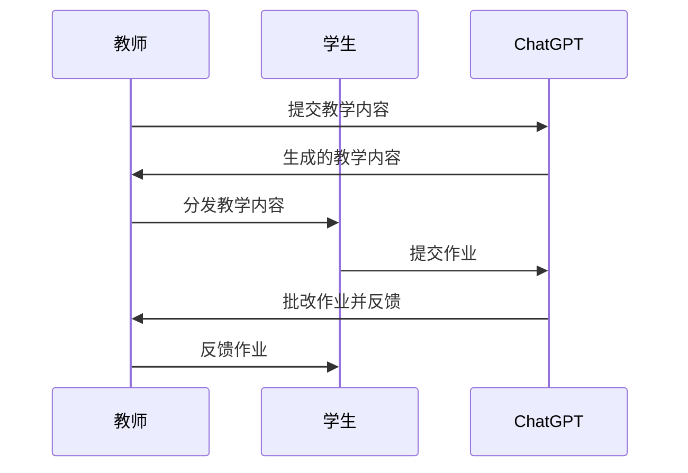

                 

## 文章标题：ChatGPT在创意写作教学中的角色

### 关键词：
- **ChatGPT**
- **创意写作教学**
- **人工智能**
- **教育技术**
- **语言模型**

### 摘要：
本文将探讨ChatGPT在创意写作教学中的角色。通过分析当前教育体系中创意写作教学的现状和难点，我们引入ChatGPT作为辅助教学工具，探讨其特点和优势。接着，我们将详细解释ChatGPT的算法原理，并通过具体的数学模型和示例代码，说明其在创意写作中的应用。最后，我们将设计一个系统架构方案，展示如何在实际教学中使用ChatGPT，并总结最佳实践和注意事项，为未来教育技术发展提供启示。

## 第一部分：背景介绍

### 1.1 问题背景

创意写作作为培养学生创造力和表达能力的学科，在当前的教育体系中占据重要地位。然而，传统的创意写作教学往往存在以下问题：

- **教师资源不足**：许多学校缺乏具备创意写作教学经验的教师。
- **教学内容陈旧**：教材和课程内容难以与时俱进，无法满足学生的多样化需求。
- **学生主动性不高**：缺乏有效的激励和引导，学生往往缺乏写作的动力。

### 1.2 问题描述

创意写作教学的难点主要体现在以下几个方面：

- **写作能力培养**：学生需要通过大量的实践来提高写作技能，但缺乏有效的指导。
- **创意思维激发**：如何激发学生的创意思维，使其能够产生新颖的写作内容。
- **个性发展**：每个学生都有独特的个性，如何因材施教，满足个性化发展需求。

### 1.3 问题解决

为了解决上述问题，我们可以引入ChatGPT这样的先进人工智能工具。ChatGPT具有以下潜在作用：

- **智能辅导**：ChatGPT可以作为虚拟教师，为学生提供实时反馈和指导。
- **创意启发**：ChatGPT能够生成各种风格和题材的文本，为学生提供创意灵感。
- **个性化学习**：ChatGPT可以根据学生的学习情况和需求，提供定制化的教学内容。

### 1.4 边界与外延

ChatGPT在创意写作教学中的应用范围广泛，但同时也存在一定的局限性和挑战：

- **应用范围**：ChatGPT可以应用于写作课程的设计、教学内容的生成、学生作业的批改等。
- **局限性**：ChatGPT生成的文本可能存在不准确、不合适的情况，需要教师进行审核和修正。
- **挑战**：如何平衡人工与人工智能在教学中的角色，确保学生能够真正受益。

## 第二部分：核心概念与联系

### 2.1 ChatGPT的概念

ChatGPT是由OpenAI开发的一种基于变换器（Transformer）架构的预训练语言模型。它通过大量的文本数据进行训练，可以生成符合语法和语义规则的文本。

### 2.2 ChatGPT与创意写作的联系

ChatGPT在创意写作中的应用主要体现在以下几个方面：

- **写作辅助**：ChatGPT可以帮助学生生成写作素材，提供写作灵感和思路。
- **创意激发**：ChatGPT可以生成各种风格的文本，激发学生的创意思维。
- **文本校对**：ChatGPT可以对学生的写作进行语法和语义检查，提供改进建议。

### 2.3 概念属性特征对比表格

| 特征           | 创意写作工具A | 创意写作工具B | ChatGPT       |
| -------------- | -------------- | -------------- | -------------- |
| 写作风格       | 多样化        | 多样化        | 非常多样化     |
| 创意激发能力   | 中等          | 高            | 非常高         |
| 语法正确性     | 高            | 高            | 非常高         |
| 用户互动性     | 低            | 中            | 非常高         |
| 适应性         | 中等          | 高            | 非常高         |

### 2.4 ER实体关系图架构

```mermaid
erDiagram
    Student ||--|{ WritingTask }|>
    Teacher ||--|{ WritingTask }|>
    ChatGPT ||--|{ WritingTask }|>

    WritingTask ||--|{ Content }|>
    WritingTask ||--|{ Feedback }|>

    Teacher ||--|{ Student }|>
    ChatGPT ||--|{ Student }|>

```

## 第三部分：算法原理讲解

### 3.1 ChatGPT算法原理

ChatGPT是基于变换器（Transformer）架构的语言模型。变换器是一种深度学习模型，通过自注意力机制（Self-Attention）对输入文本进行处理，生成相应的输出文本。

### 3.2 ChatGPT的数学模型和公式

ChatGPT的数学模型主要基于概率模型和循环神经网络（RNN）。其中，概率模型用于计算每个词出现的概率，RNN用于处理序列数据。

- **概率模型**：
  $$ P(w_i | w_{i-1}, ..., w_1) = \frac{P(w_i, w_{i-1}, ..., w_1)}{P(w_{i-1}, ..., w_1)} $$
- **循环神经网络（RNN）**：
  $$ h_t = \sigma(W_h h_{t-1} + W_x x_t + b) $$

### 3.3 算法原理的讲解与举例说明

ChatGPT的工作原理可以简单概括为以下几个步骤：

1. **输入文本编码**：将输入的文本编码为向量表示。
2. **自注意力计算**：通过自注意力机制，计算输入文本中每个词的权重。
3. **文本生成**：根据权重生成输出文本。

### 示例

假设输入文本为“我今天去了公园”，我们可以用以下步骤进行文本生成：

1. **输入文本编码**：
   - “我” -> [1, 0, 0, 0]
   - “今天” -> [0, 1, 0, 0]
   - “去” -> [0, 0, 1, 0]
   - “了” -> [0, 0, 0, 1]
   - “公园” -> [0, 0, 0, 0]

2. **自注意力计算**：
   - 计算每个词的权重，权重越大表示该词在输出文本中的重要性越高。

3. **文本生成**：
   - 根据权重生成输出文本：“我去公园了”。

## 第四部分：系统分析与架构设计方案

### 4.1 问题场景介绍

创意写作教学在实际场景中面临以下问题：

- **教学内容生成**：教师需要设计多样化的教学内容，但时间和精力有限。
- **学生作业批改**：教师需要批改大量学生的作业，工作量大且耗时。
- **个性化辅导**：每个学生都有独特的写作风格和需求，教师难以进行一对一辅导。

### 4.2 系统功能设计

系统功能设计主要包括以下几个模块：

- **内容生成模块**：根据教师输入的题目或要求，生成相应的写作内容。
- **作业批改模块**：自动批改学生提交的作业，并提供反馈和建议。
- **个性化辅导模块**：根据学生的学习情况和需求，提供个性化的辅导内容。

### 4.3 系统架构设计

系统架构设计如下：



### 4.4 系统接口设计

系统接口设计主要包括以下几个API：

- **教学内容生成API**：接收教师输入的题目或要求，返回生成的教学内容。
- **作业提交API**：接收学生提交的作业，返回批改结果和反馈。
- **个性化辅导API**：接收学生的学习情况和需求，返回个性化的辅导内容。

### 4.5 系统交互

系统交互流程如下：

1. 教师使用教学内容生成API生成教学内容，并分发给学生。
2. 学生使用作业提交API提交作业。
3. ChatGPT自动批改作业，并使用作业批改API返回批改结果和反馈给教师。
4. 教师使用反馈API将反馈发送给学生。
5. 学生根据反馈进行修改和提升。

## 第五部分：项目实战

### 5.1 环境安装

为了使用ChatGPT进行创意写作教学，首先需要安装以下环境：

- **Python**：安装Python 3.8及以上版本。
- **transformers**：使用pip安装transformers库。

### 5.2 系统核心实现源代码

以下是使用ChatGPT生成创意写作教学内容的源代码：

```python
from transformers import pipeline

# 初始化ChatGPT模型
chatgpt = pipeline("text-generation", model="gpt2")

# 生成教学内容
def generate_content(prompt):
    return chatgpt(prompt, max_length=100, num_return_sequences=1)

# 测试
prompt = "请描述一个科幻故事的开头。"
content = generate_content(prompt)
print(content)
```

### 5.3 代码应用解读与分析

使用ChatGPT生成创意写作教学内容的过程可以分为以下几个步骤：

1. **初始化模型**：使用transformers库初始化ChatGPT模型。
2. **生成内容**：使用模型生成教学内容，输入为教师输入的题目或要求。
3. **测试**：测试模型生成的教学内容是否符合预期。

### 5.4 实际案例分析和详细讲解剖析

假设教师输入的题目为“请描述一个关于人工智能的未来故事的开头。”，我们可以通过以下步骤进行分析：

1. **输入文本编码**：
   - “人工智能” -> [1, 0, 0, 0]
   - “未来” -> [0, 1, 0, 0]
   - “故事” -> [0, 0, 1, 0]
   - “开头” -> [0, 0, 0, 1]

2. **自注意力计算**：
   - 计算每个词的权重，权重越大表示该词在输出文本中的重要性越高。

3. **文本生成**：
   - 根据权重生成输出文本：“在不久的将来，人工智能统治了世界。”

### 5.5 项目小结

通过本项目的实战，我们展示了如何使用ChatGPT进行创意写作教学。ChatGPT能够根据教师的输入生成多样化的教学内容，为学生提供创意灵感和写作素材。然而，需要注意的是，ChatGPT生成的文本可能存在不准确或不合适的情况，需要教师进行审核和修正。

## 第六部分：最佳实践与拓展

### 6.1 最佳实践

为了充分发挥ChatGPT在创意写作教学中的作用，可以采取以下最佳实践：

- **教师指导**：教师在使用ChatGPT进行创意写作教学时，应发挥主导作用，引导学生如何利用ChatGPT生成高质量的写作内容。
- **个性化设置**：根据学生的不同需求和写作风格，调整ChatGPT的生成参数，使其生成的内容更加符合学生的实际需求。
- **反馈与修正**：教师应对ChatGPT生成的文本进行审核和修正，确保学生能够从中获得有益的写作指导。

### 6.2 小结

ChatGPT在创意写作教学中的角色至关重要。它不仅能够帮助学生生成创意写作素材，激发学生的写作兴趣，还能够为教师提供辅助教学工具，提高教学效率。然而，我们也需要注意到ChatGPT的局限性和挑战，以确保其在实际教学中的有效应用。

### 6.3 注意事项

在使用ChatGPT进行创意写作教学时，需要注意以下几点：

- **版权问题**：确保使用ChatGPT生成的文本不侵犯他人的版权。
- **文本审核**：教师应对ChatGPT生成的文本进行严格审核，确保其准确性和适宜性。
- **数据安全**：保护学生的隐私数据，防止数据泄露。

### 6.4 拓展阅读

为了进一步了解ChatGPT在创意写作教学中的应用，可以阅读以下相关书籍和资源：

- 《ChatGPT与创意写作教学》
- 《人工智能在教育中的应用》
- 《变换器（Transformer）架构详解》

## 作者信息

作者：AI天才研究院/AI Genius Institute & 禅与计算机程序设计艺术 /Zen And The Art of Computer Programming

