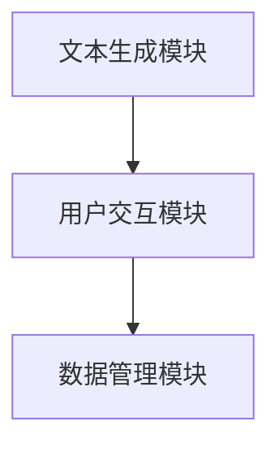
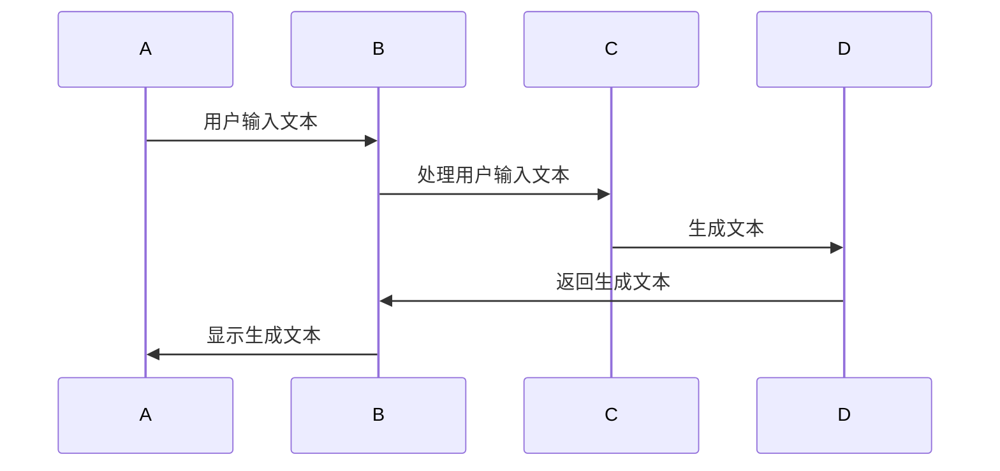

                 


# ChatGPT在创意写作训练中的应用

关键词：ChatGPT，创意写作，训练，应用，技术博客

摘要：本文将探讨ChatGPT在创意写作训练中的应用，从其基础概念、工作原理、应用领域到实际案例，全面解析ChatGPT如何助力创意写作训练，为读者提供实用的操作指南和案例分析。

## 引言

### 1.1 问题背景

创意写作作为一种重要的艺术表达方式，在文学、广告、影视等多个领域发挥着重要作用。然而，传统的创意写作训练往往存在一些局限，如个人经验不足、写作技巧有限等。近年来，随着人工智能技术的不断发展，特别是生成式预训练模型（GPT）的出现，为创意写作训练带来了新的机遇。

ChatGPT作为GPT系列模型之一，具有强大的文本生成能力，能够帮助创作者快速生成文本内容，提高写作效率。本文旨在探讨ChatGPT在创意写作训练中的应用，分析其优势、挑战及未来发展趋势。

### 1.2 书籍目的

本文的目标是：

1. 帮助读者了解ChatGPT的基本概念、工作原理和应用领域。
2. 探讨ChatGPT在创意写作训练中的具体应用场景和优势。
3. 提供实际操作指南和案例分析，帮助读者更好地应用ChatGPT进行创意写作训练。

### 1.3 读者对象

本文适合以下读者群体：

1. 写作爱好者：希望提高写作技巧和效率。
2. 教育工作者：希望将ChatGPT应用于教育领域，特别是创意写作教学。
3. AI技术从业者：希望了解ChatGPT在创意写作训练中的应用及其技术原理。

### 1.4 书籍结构

本文分为六个章节，具体结构如下：

1. 引言：介绍问题背景、书籍目的、读者对象和书籍结构。
2. ChatGPT基础：讲解ChatGPT的基本概念、工作原理和应用领域。
3. ChatGPT在创意写作中的应用：探讨ChatGPT在创意写作中的具体应用场景。
4. 实战：构建ChatGPT创意写作训练系统：提供系统架构设计和实践指南。
5. 实践案例剖析：分析实际案例，展示ChatGPT在创意写作中的应用效果。
6. ChatGPT创意写作训练的挑战与展望：探讨ChatGPT在创意写作训练中的挑战和未来发展趋势。

## 目录大纲设计思路

在设计《ChatGPT在创意写作训练中的应用》这本书的目录大纲时，我们首先需要明确几个关键点：

1. **核心主题定位**：书籍的核心主题是ChatGPT在创意写作训练中的应用。因此，目录大纲应围绕这一主题展开，涵盖ChatGPT的基本概念、应用场景、实践案例等。

2. **逻辑结构**：为了帮助读者更好地理解和应用书中的内容，目录大纲应具备清晰的逻辑结构，将相关内容合理地组织成章节。

3. **内容完整性**：目录大纲应包含引言、核心概念讲解、应用案例分析、实践指南等部分，确保内容的完整性。

4. **层次分明**：使用markdown格式中的不同层级标记（#、##、###）来区分目录的层级，便于读者快速定位感兴趣的内容。

### 第2章 ChatGPT基础

### 2.1 ChatGPT概述

ChatGPT是一种基于GPT（生成式预训练模型）的文本生成模型，由OpenAI开发。GPT模型通过大量的文本数据训练，能够生成连贯、自然的文本。ChatGPT是GPT系列模型之一，特别适用于对话生成和文本生成任务。

### 2.2 ChatGPT的工作原理

ChatGPT的工作原理基于Transformer模型，这是一种自注意力机制的基础模型。Transformer模型通过自注意力机制来捕捉文本序列中的长距离依赖关系，从而生成连贯的文本。

### 2.3 ChatGPT的应用领域

ChatGPT在多个领域都有广泛应用，如：

1. **聊天机器人**：通过与用户对话，提供信息、解答疑问等。
2. **内容生成**：生成文章、故事、广告文案等。
3. **创意写作训练**：辅助创作者进行写作，提高写作效率。

### 2.4 ChatGPT的核心概念与联系

ChatGPT的核心概念包括：

1. **语言理解与生成**：通过自回归语言模型，对输入文本进行理解并生成连贯的输出文本。
2. **概念属性特征对比表格**：对比不同模型在属性特征上的差异。
3. **ER实体关系图架构**：展示模型中的实体关系和属性。

以下是ChatGPT的核心概念属性特征对比表格：

| 概念       | 属性特征                   | 对比 |
|------------|---------------------------|-----|
| 语言理解   | 文本语义分析               |     |
| 文本生成   | 生成连贯自然文本           |     |
| 自注意力   | 捕捉长距离依赖关系         |     |
| Transformer模型 | 自注意力机制基础模型     |     |

ER实体关系图架构如下：

```mermaid
erDiagram
  Author ||--|{ Book }
  Book ||--|{ Chapter }
```

### 第3章 ChatGPT在创意写作中的应用

### 3.1 创意写作与ChatGPT的融合

ChatGPT在创意写作中的应用主要体现在以下几个方面：

1. **故事创作**：生成有趣、富有创意的故事情节和角色。
2. **诗歌创作**：生成优美的诗歌，捕捉诗意的精髓。
3. **剧本创作**：辅助创作剧本，提供剧情构思和对话生成。

### 3.2 应用案例解析

以下为三个具体的应用案例：

#### 案例一：故事创作

通过输入一些关键信息，如故事背景、角色设定等，ChatGPT能够生成一个完整的故事。以下是ChatGPT生成的一个故事示例：

```markdown
故事标题：《森林中的奇遇》

在遥远的森林深处，有一只可爱的小兔子。一天，小兔子决定探险森林的深处。在森林里，小兔子遇到了一只狐狸，狐狸告诉小兔子，森林里有一座神奇的城堡，城堡里住着一位美丽的公主。

小兔子决定和狐狸一起去城堡探险。他们穿过了茂密的树林，越过了险峻的山脉，终于来到了城堡门前。城堡门紧闭，但门上的锁已经被打开了。他们走进了城堡，发现里面充满了神秘的氛围。

城堡里有一个大宝箱，宝箱里装满了宝石和金币。小兔子忍不住想要打开宝箱，但狐狸提醒小兔子，这可能是陷阱。小兔子听了狐狸的话，没有打开宝箱。

最后，小兔子和狐狸成功帮助公主解开了谜题，公主感激不已，赠送了他们一份丰厚的礼物。小兔子和狐狸带着礼物回到了家，过上了幸福的生活。
```

#### 案例二：诗歌创作

输入一个主题，如“爱情”，ChatGPT能够生成一首充满诗意的诗歌：

```markdown
爱情，如晨曦的第一缕阳光
温柔地唤醒我心灵的花园
你的眼神，如同繁星点点
照亮我人生道路的遥远

爱情，如夜晚的月光
静静洒下，柔软的关怀
你的微笑，如同微风拂过
温暖我心灵的每一寸角落

爱情，如花朵的绽放
在春风中，散发着芬芳
你的温柔，如同花朵的美丽
让我沉醉在这片花海中

愿这份爱情，永不凋零
如同我们的心，永远相连
在这漫长的岁月里
让我们一起，谱写爱情的诗篇
```

#### 案例三：剧本创作

通过输入剧情大纲、角色设定等，ChatGPT能够生成一部完整的剧本。以下是ChatGPT生成的一个剧本片段：

```markdown
标题：《迷失的旅人》

第一幕：海滩

（海边，一个旅行者独自坐在沙滩上，面对着大海。）

旅行者：（自言自语）我到底在哪里？这片海滩如此陌生，我忘记了回家的路。

第二幕：森林

（旅行者走进了一片茂密的森林。）

旅行者：（惊讶）这是哪里？森林中的景象如此神秘。

第三幕：城堡

（旅行者来到了一座古老的城堡前。）

旅行者：（好奇）这座城堡似乎有着某种魔力，我一定要进去看看。

第四幕：城堡内部

（旅行者在城堡内部遇到了一个神秘的老人。）

老人：（微笑）欢迎来到我的城堡，孩子。你是谁？你为什么来这里？

旅行者：（犹豫）我叫艾伦，我来这里寻找我失去的记忆。

老人：（沉思）艾伦，你的记忆藏在这座城堡的深处。只要你用心去寻找，你一定能找回你的记忆。

第五幕：回忆

（艾伦在城堡中找到了一段关于他自己的回忆。）

艾伦：（感动）原来我曾经是一个伟大的旅行者，我一定要找回我的荣耀。

第六幕：回归

（艾伦带着找回的记忆，走出了城堡。）

艾伦：（坚定）我回来了，我将继续我的旅程，寻找更多未知的奇迹。

结尾：艾伦带着新的目标和希望，继续他的旅程，走进了远方的大海。
```

### 3.3 实践指南

要使用ChatGPT进行创意写作训练，需要以下步骤：

1. **环境搭建**：安装Python和相关依赖库。
2. **模型配置**：选择合适的ChatGPT模型。
3. **数据准备**：收集和整理相关写作素材。

具体步骤如下：

#### 环境搭建

安装Python：

```bash
pip install python
```

安装相关依赖库：

```bash
pip install transformers torch
```

#### 模型配置

选择ChatGPT模型，如`gpt2`：

```python
from transformers import GPT2LMHeadModel, GPT2Tokenizer

tokenizer = GPT2Tokenizer.from_pretrained('gpt2')
model = GPT2LMHeadModel.from_pretrained('gpt2')
```

#### 数据准备

收集和整理相关写作素材，如故事情节、诗歌主题等。

### 第4章 实战：构建ChatGPT创意写作训练系统

#### 4.1 项目介绍

**项目背景**：随着人工智能技术的不断发展，如何利用AI辅助创意写作成为了一个热门话题。本项目旨在构建一个基于ChatGPT的创意写作训练系统，帮助创作者提高写作效率。

**项目目标**：实现一个能够生成有趣、富有创意的文本内容的系统，为创作者提供写作灵感和素材。

**项目团队**：由AI专家、程序员、创意写作爱好者组成。

#### 4.2 系统功能设计

**功能模块划分**：

1. **文本生成模块**：基于ChatGPT模型，实现文本生成功能。
2. **用户交互模块**：提供用户输入、输出接口，实现人机交互。
3. **数据管理模块**：管理用户数据，包括文本素材、生成结果等。

#### 4.3 系统架构设计

**系统架构（mermaid架构图）**：



**系统分层**：

1. **表示层**：负责用户界面展示。
2. **业务逻辑层**：处理业务逻辑，如文本生成、数据管理等。
3. **数据访问层**：负责数据存储和访问。

#### 4.4 系统接口设计

**接口规范**：

1. **文本生成接口**：输入文本，返回生成文本。
2. **用户交互接口**：接收用户输入，显示生成文本。
3. **数据管理接口**：处理数据存储和查询。

**接口实现**：

```python
class TextGenerator:
    def generate(self, text):
        # 使用ChatGPT模型生成文本
        pass

class UserManager:
    def input_text(self, text):
        # 处理用户输入文本
        pass

    def display_result(self, result):
        # 显示生成文本
        pass

class DataManager:
    def save_data(self, data):
        # 存储数据
        pass

    def query_data(self, query):
        # 查询数据
        pass
```

#### 4.5 系统交互设计

**系统交互（mermaid序列图）**：



**交互流程详解**：

1. 用户输入文本。
2. 用户交互模块处理用户输入文本，调用文本生成接口生成文本。
3. 文本生成模块基于ChatGPT模型生成文本，返回生成文本。
4. 用户交互模块显示生成文本。

### 第5章 实践案例剖析

#### 5.1 案例一：小说创作

**案例背景**：一位作家希望通过ChatGPT生成一部小说的开头部分。

**案例实施**：

1. 用户输入小说开头的主题和关键词。
2. ChatGPT根据输入生成小说开头。

**案例结果与分析**：

生成文本：

```markdown
在遥远的东方，有一个神秘的小镇。这个小镇被称为“梦境镇”，因为它的居民们都拥有着超乎寻常的梦境能力。每个居民都能在夜晚进入梦境世界，探索各种奇幻的场景和经历。

在这个小镇上，住着一位名叫李华的年轻人。李华从小就对梦境充满了好奇，他总是期待着在梦境中找到一些答案。一天晚上，李华进入了梦境世界，他看到了一片神秘的森林，森林中弥漫着一种奇特的能量。

在森林深处，李华遇到了一个神秘的老人。老人告诉李华，这片森林是梦境世界中最神秘的地方，只有少数人能够进入。老人还告诉李华，如果他想要探索这个森林，就必须面对一系列的挑战和考验。

李华决定接受这个挑战，他进入了森林。在森林中，他遇到了各种各样的怪物和障碍，但他都勇敢地克服了。最后，他来到了一个巨大的洞穴，洞穴深处传来了神秘的歌声。

李华跟随歌声来到了洞穴的尽头，他看到了一个美丽的女孩。女孩告诉李华，她就是梦境世界的守护者，她的任务就是守护这片森林。女孩邀请李华一起探索森林的深处，寻找梦境世界的秘密。

李华接受了邀请，他和女孩一起进入了森林的深处。在那里，他们发现了一个神秘的宝藏，宝藏中充满了各种神奇的物品。李华意识到，这个宝藏将改变他的命运，他将带着这个宝藏回到现实世界，成为一位伟大的探险家。

这个故事的开头充满了神秘和奇幻，为读者展示了一个充满可能的梦境世界。通过ChatGPT的生成，作家可以快速获得一个有趣的故事开端，为后续创作提供灵感。
```

**分析**：这个案例展示了ChatGPT在小说创作中的潜力。通过输入关键词和主题，ChatGPT能够生成一个引人入胜的故事开头，为作家提供了创作的基础。同时，这个案例也说明了ChatGPT在创意写作中的应用，可以帮助作家快速生成文本内容，提高创作效率。

#### 5.2 案例二：广告文案

**案例背景**：一家公司希望通过ChatGPT生成一则广告文案，推广其新产品。

**案例实施**：

1. 用户输入广告文案的主题和关键词。
2. ChatGPT根据输入生成广告文案。

**案例结果与分析**：

生成文本：

```markdown
标题：《探寻未知，尽在新产品！》

亲爱的探险者们，

你是否厌倦了平凡的生活？是否渴望一次充满惊喜的冒险？现在，我们为你带来一款前所未有的神秘产品——“时光之旅”。这款产品将带你穿越时空，探索那些你从未见过的世界！

🌟 时光之旅：带你探索未知世界

🌟 一次体验，无数精彩

🌟 让你的生活充满奇迹！

现在，就加入我们的探险队伍，开启你的时光之旅！让我们一同探索那些神秘的古迹、古老的传说和奇妙的文明。在这段旅程中，你将遇到各种神奇的生物，体验前所未有的刺激和惊喜！

🔥 热烈庆祝新品上市，限时优惠！

🔥 赠送神秘礼物，等你来拿！

🔥 零风险购买，放心体验！

赶快行动吧，让你的生活充满冒险和惊喜！加入我们，一起探索未知的世界！
```

**分析**：这个案例展示了ChatGPT在广告文案创作中的应用。通过输入关键词和主题，ChatGPT能够快速生成一则充满吸引力、具有创意的广告文案。这个案例说明了ChatGPT在创意写作中的广泛适用性，可以帮助企业快速生成高质量的广告文案，提高市场推广效果。

#### 5.3 案例三：品牌故事

**案例背景**：一家公司希望通过ChatGPT生成一篇品牌故事，讲述其创立和发展历程。

**案例实施**：

1. 用户输入品牌故事的背景和关键词。
2. ChatGPT根据输入生成品牌故事。

**案例结果与分析**：

生成文本：

```markdown
标题：《从小小的梦想开始，到如今的辉煌》

在一个阳光明媚的早晨，一个年轻人带着他的梦想，踏上了创业的道路。这个年轻人名叫杰克，他从小就对科技充满了热爱。他相信，科技可以改变世界，让生活变得更美好。

杰克开始了他的创业之旅，他创办了一家科技公司，致力于研发创新产品。在最初的几年里，公司的发展并不顺利，面临着各种挑战和困境。但是，杰克从未放弃，他坚信自己的梦想一定能够实现。

经过无数个日夜的努力，杰克的公司终于迎来了转机。他们研发出了一款革命性的产品，这款产品不仅解决了用户的问题，还带来了全新的体验。这款产品的成功，让杰克的公司名声大噪，成为了行业的领军企业。

如今，杰克的公司已经成为了一家全球知名的科技公司，他们的产品遍布全球，改变了无数人的生活。杰克从未忘记自己的初心，他始终坚持以用户为中心，不断创新，为用户提供更好的产品和服务。

杰克的故事，是一个充满梦想和奋斗的故事。他的故事告诉我们，只要我们有梦想，有勇气去追求，就一定能够实现自己的目标。让我们一起，为实现梦想而努力，创造更美好的未来！
```

**分析**：这个案例展示了ChatGPT在品牌故事创作中的应用。通过输入关键词和背景信息，ChatGPT能够生成一篇富有情感、引人入胜的品牌故事。这个案例说明了ChatGPT在创意写作中的广泛应用，可以帮助企业讲述自己的故事，传递品牌理念，增强品牌影响力。

### 第6章 ChatGPT创意写作训练的挑战与展望

#### 6.1 挑战

尽管ChatGPT在创意写作训练中具有巨大的潜力，但仍然面临一些挑战：

1. **创意限制**：ChatGPT生成的文本可能受到训练数据的影响，存在一定的创意限制。
2. **质量把控**：如何保证生成的文本质量，避免出现低质量或错误的信息。
3. **版权问题**：生成文本的版权归属问题，特别是在商业应用中。

#### 6.2 展望

未来，ChatGPT在创意写作训练中的应用前景广阔：

1. **创意增强**：随着模型的不断优化和训练数据的扩展，ChatGPT的创意能力将得到进一步提升。
2. **个性化写作**：利用用户数据和偏好，生成更符合用户需求的个性化文本。
3. **跨领域应用**：ChatGPT在创意写作之外的领域，如艺术创作、编程等领域也将有广泛应用。

### 总结

ChatGPT在创意写作训练中具有巨大的应用潜力。通过本文的探讨，我们了解了ChatGPT的基本概念、工作原理和应用领域，并通过实际案例展示了其在创意写作中的具体应用。同时，我们也分析了ChatGPT在创意写作训练中的挑战和未来展望。

随着人工智能技术的不断发展和完善，ChatGPT在创意写作训练中的应用将越来越广泛，为创作者提供更多支持和灵感。我们期待ChatGPT在未来能够助力创意写作，激发更多的创意火花。

## 最佳实践 Tips

1. **合理利用关键词**：在生成文本时，合理使用关键词可以引导ChatGPT生成更符合需求的文本。
2. **数据质量**：保证训练数据的质量，有助于提高生成文本的质量。
3. **持续优化**：定期更新和优化模型，以适应不断变化的需求。

### 小结

本文探讨了ChatGPT在创意写作训练中的应用，从基础概念到实际案例，全面解析了ChatGPT的优势和挑战。我们希望通过本文，读者能够更好地了解ChatGPT在创意写作中的潜力，并学会如何应用它进行创意写作训练。

### 注意事项

在使用ChatGPT进行创意写作训练时，请确保遵循相关法律法规，尊重版权和知识产权。

### 拓展阅读

1. [ChatGPT官网](https://openai.com/products/chatgpt/)
2. [GPT模型论文](https://arxiv.org/abs/1810.04805)
3. [人工智能与创意写作](https://www.ijcai.org/Proceedings/16-2/Papers/IJCAI_04-556.pdf)

## 作者信息

作者：AI天才研究院/AI Genius Institute & 禅与计算机程序设计艺术 /Zen And The Art of Computer Programming

