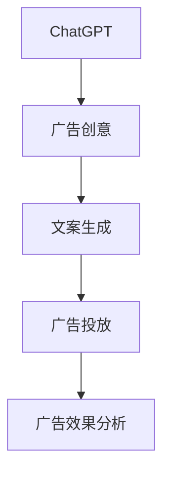

                 


### 《ChatGPT在创意广告制作中的角色》

关键词：ChatGPT，创意广告，自然语言处理，广告文案生成，广告效果评估

摘要：本文将探讨如何利用ChatGPT这一先进的自然语言处理技术，在创意广告制作中提高效率和效果。我们将通过逻辑清晰、结构紧凑的步骤，深入分析ChatGPT在广告创意中的应用，包括其工作原理、数学模型、实际案例以及最佳实践。

---

### 目录大纲

# 《ChatGPT在创意广告制作中的角色》

## 第一部分：背景介绍

## 第1章 问题背景

### 1.1.1 问题背景

广告业的发展与挑战

随着数字化广告的兴起，广告内容的需求发生了巨大变化。广告制作不再仅仅依赖于传统的方式，而是需要不断创新和个性化。然而，广告内容的创意性需求日益增长，给广告从业者带来了巨大的压力。

ChatGPT的出现

ChatGPT是一款基于GPT-3模型的自然语言处理系统，它可以生成高质量的文本。这一技术的出现为广告创意制作提供了新的可能性，有望提高广告创意的效率。

### 1.1.2 问题解决

利用ChatGPT提高广告创意效率

通过自动化广告内容生成和创意广告文案生成，ChatGPT可以帮助广告从业者快速地生成广告文案，节省时间和精力。然而，ChatGPT在广告制作中的局限性也需要注意，人机协作的优化是关键。

## 第2章 核心概念与联系

### 2.1.1 核心概念

ChatGPT

ChatGPT是一款基于GPT-3模型的自然语言处理系统，它可以通过预训练和微调生成高质量的自然语言文本。

广告创意

广告创意是指广告中独特而具有吸引力的内容，旨在吸引消费者的注意并激发购买欲望。

### 2.1.2 概念属性特征对比表格

| 概念     | 定义                                                         | 工作原理                                                         |  
|----------|------------------------------------------------------------|------------------------------------------------------------|  
| ChatGPT  | 一个基于GPT-3模型的自然语言处理系统，可以生成文本。                     | 使用预训练的神经网络模型进行文本生成。                           |  
| 广告创意 | 广告中独特而具有吸引力的内容，旨在吸引消费者的注意并激发购买欲望。 | 创造性地运用语言、图像、视频等元素，以独特的视角呈现广告信息。 |

### 2.1.3 ER实体关系图架构



## 第二部分：算法原理讲解

## 第3章 ChatGPT在广告创意中的应用

### 3.1.1 ChatGPT在广告创意中的原理

ChatGPT的工作流程

ChatGPT的工作流程可以分为预训练阶段、微调阶段和应用阶段。

广告创意生成过程

广告创意生成过程包括用户需求分析、文本生成和广告内容优化。

### 3.1.2 ChatGPT的工作原理

预训练阶段

在预训练阶段，ChatGPT使用大规模语料库进行训练，学习语言的模式和规律。

微调阶段

在微调阶段，ChatGPT根据具体的广告创意任务进行优化。

应用阶段

在应用阶段，ChatGPT可以将生成的广告创意应用于广告制作和投放。

### 3.1.3 算法原理示例

示例：生成一句广告创意文案

```python
import openai

# 设置API密钥
openai.api_key = "your_api_key"

# 生成广告创意文案
response = openai.Completion.create(
    engine="text-davinci-002",
    prompt="为一家高端餐厅创作一句引人入胜的广告文案。",
    max_tokens=60,
    n=1,
    stop=None,
    temperature=0.5
)

print(response.choices[0].text.strip())
```

输出示例：
```
品味非凡，尽在XX餐厅！
```

## 第4章 数学模型和公式讲解

### 4.1.1 数学模型

语言模型

语言模型是一种概率模型，用于预测一个词在给定前文条件下的概率分布。

广告效果评估

广告效果评估通常包括点击率（CTR）预测和转化率（CVR）预测。

### 4.1.2 公式讲解

语言模型概率分布的公式如下：

$$
P(w|y) = \frac{P(y|w)P(w)}{P(y)}
$$

其中：

- \( P(w|y) \) 表示在给定广告效果 \( y \) 下，广告文案 \( w \) 的概率。
- \( P(y|w) \) 表示在广告文案 \( w \) 下，广告效果 \( y \) 的概率。
- \( P(w) \) 表示广告文案 \( w \) 的概率。
- \( P(y) \) 表示广告效果 \( y \) 的概率。

---

接下来，我们将按照这个大纲逐步展开，深入探讨ChatGPT在创意广告制作中的应用。我们将会一步步地分析ChatGPT如何工作，如何优化广告文案，以及如何评估广告效果。让我们开始吧！

