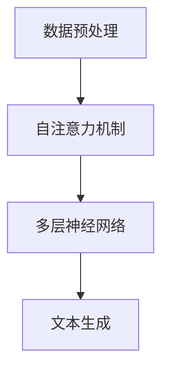
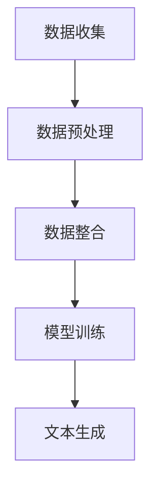
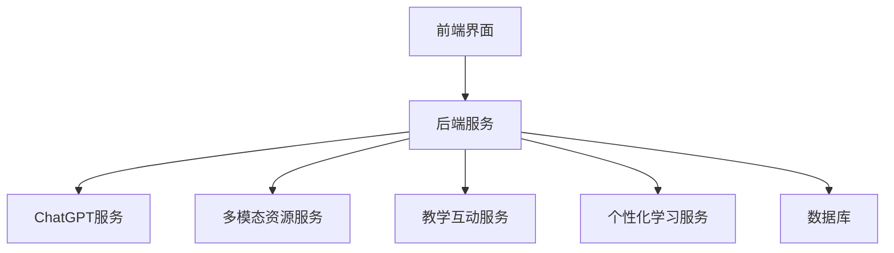
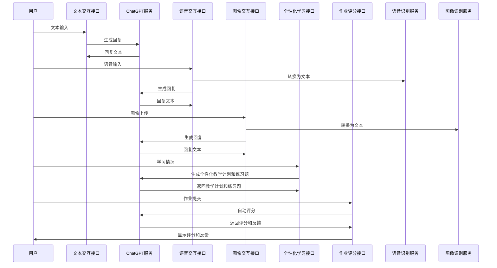

                 


### 引言

**文章标题：ChatGPT在多模态语言教学中的创新应用**

> **关键词：ChatGPT、多模态语言教学、人工智能、教育技术、创新应用**

> **摘要：本文将探讨ChatGPT在多模态语言教学中的创新应用，从背景介绍、核心概念联系、算法原理讲解、系统分析与架构设计、项目实战到最佳实践总结，全面分析ChatGPT在多模态语言教学中的应用前景，为教育技术的发展提供新思路。**

在人工智能迅猛发展的今天，教育技术的创新应用日益成为提升教育质量、优化教学体验的重要途径。ChatGPT作为近年来备受关注的人工智能模型，以其强大的语言处理能力和丰富的应用场景，正在逐步改变着教育的面貌。而多模态语言教学作为一种新兴的教育模式，通过整合文本、语音、图像等多种信息源，为个性化教学提供了可能。本文将围绕ChatGPT在多模态语言教学中的创新应用，进行深入探讨。

### 背景介绍

#### 1. ChatGPT的概念与发展历程

ChatGPT是由OpenAI开发的一种基于Transformer架构的预训练语言模型。它通过大量文本数据的学习，掌握了丰富的语言知识，能够生成连贯、有逻辑的文本，并在多种自然语言处理任务中表现出色。ChatGPT的问世，标志着自然语言处理技术进入了一个新的阶段。

ChatGPT的发展历程可以追溯到2018年，当时OpenAI发布了GPT-1，这是第一个超大规模的Transformer模型。随后，GPT-2、GPT-3等相继发布，每个版本都在模型规模和性能上取得了显著提升。ChatGPT作为GPT-3的衍生版本，继承了GPT-3的核心优势，同时针对特定场景进行了优化，使得其在对话生成、文本摘要、问答系统等方面具有更高的应用价值。

#### 2. 多模态语言教学的概念与重要性

多模态语言教学是一种整合多种信息源（如文本、语音、图像等）的教学方法。它不仅关注语言知识的学习，还强调跨模态信息的理解与整合，以提升学生的语言能力和认知水平。多模态语言教学的核心在于通过多感官的刺激和互动，促进学生对知识的深入理解和灵活应用。

随着人工智能技术的发展，多模态语言教学逐渐从理论走向实践。例如，利用语音识别和合成技术，可以实现口语教学的实时纠正和反馈；通过图像识别和自然语言处理技术，可以实现文字、图像和语音的整合，提供更加丰富和互动的教学体验。

#### 3. 问题背景与问题描述

在教育领域，传统的教学方法往往依赖于单一的文本信息，难以满足个性化教学的需求。而ChatGPT的多模态处理能力和强大的语言生成能力，为多模态语言教学提供了新的解决方案。然而，如何将ChatGPT应用于多模态语言教学，实现教学效果的最大化，仍是一个亟待解决的问题。

本文旨在探讨ChatGPT在多模态语言教学中的创新应用，通过分析其核心概念、联系，以及算法原理和系统架构，为多模态语言教学的实施提供理论依据和实践指导。

#### 4. 问题解决与边界外延

通过引入ChatGPT，多模态语言教学可以实现以下问题解决：

1. **个性化教学**：ChatGPT可以根据学生的学习情况和需求，生成个性化的教学内容和教学反馈，提高教学效果。
2. **实时互动**：ChatGPT可以与学生进行实时对话，回答学生的问题，提供学习指导和心理支持。
3. **语言能力提升**：ChatGPT可以生成丰富多样的语言素材，帮助学生提高语言表达能力。
4. **多感官刺激**：ChatGPT可以整合文本、语音、图像等多种信息源，提供更加生动和互动的教学体验。

然而，ChatGPT在多模态语言教学中的应用也存在一定的边界。例如，ChatGPT生成的文本内容可能存在不准确或不恰当的问题，需要结合教师的判断和干预。此外，ChatGPT的处理能力有限，可能无法完全替代教师的角色。因此，在实际应用中，需要合理利用ChatGPT的优势，同时发挥教师的主导作用。

### 核心概念与联系

在本节中，我们将详细解释ChatGPT和多模态语言教学的核心概念、属性特征，并通过表格和ER实体关系图展示它们之间的关系。

#### 1. ChatGPT的核心概念与属性特征

ChatGPT是一种基于Transformer架构的预训练语言模型。它的核心概念包括：

- **Transformer架构**：Transformer是一种基于自注意力机制的深度神经网络模型，适用于处理序列数据。它通过计算不同位置之间的依赖关系，生成连贯的文本。
- **预训练**：ChatGPT在训练过程中使用了大量的文本数据，通过无监督的方式学习语言模式和规则，使其能够生成连贯、有逻辑的文本。
- **生成式模型**：ChatGPT是一种生成式模型，通过输入一个序列，可以生成与之相关的另一个序列。在多模态语言教学中，ChatGPT可以生成文本、语音和图像等多模态数据。

ChatGPT的属性特征包括：

- **强大的语言处理能力**：ChatGPT能够理解复杂的语言结构和语义关系，生成具有逻辑性和连贯性的文本。
- **跨模态处理能力**：ChatGPT不仅可以处理文本，还可以处理语音和图像等多模态数据，实现跨模态信息的整合。
- **适应性**：ChatGPT可以根据不同的应用场景和需求，生成相应的文本和模态数据，具有良好的适应性。

#### 2. 多模态语言教学的核心概念与属性特征

多模态语言教学是一种整合多种信息源的教学方法。它的核心概念包括：

- **多模态信息源**：多模态语言教学利用文本、语音、图像等多种信息源，提供丰富的教学素材。
- **信息整合**：多模态语言教学通过整合不同模态的信息，促进学生对知识的深入理解和灵活应用。
- **互动性**：多模态语言教学强调学生与教师、学生与学习资源的互动，提高学习效果。

多模态语言教学的属性特征包括：

- **多样性**：多模态语言教学通过多种信息源的整合，提供多样化的教学素材，满足学生的个性化需求。
- **互动性**：多模态语言教学强调学生与教师、学生与学习资源的互动，促进学生的主动学习和深度学习。
- **灵活性**：多模态语言教学可以根据不同的教学目标和需求，灵活调整信息源的整合方式和教学内容。

#### 3. ChatGPT与多模态语言教学的关系

ChatGPT与多模态语言教学之间存在密切的联系。ChatGPT的多模态处理能力和生成式模型特性，使其成为多模态语言教学的有力工具。

- **文本生成**：ChatGPT可以生成与教学主题相关的文本，为学生提供丰富的学习素材。
- **语音合成**：ChatGPT可以生成与文本对应的语音，提供口语教学的支持和反馈。
- **图像生成**：ChatGPT可以生成与文本相关的图像，提供视觉教学的素材。
- **跨模态整合**：ChatGPT可以将文本、语音、图像等多种信息源整合在一起，提供多感官的教学体验。

通过表格和ER实体关系图，我们可以更清晰地展示ChatGPT与多模态语言教学的关系。

| 关系名称 | 描述 |
| :--: | :--: |
| 文本生成 | ChatGPT生成与教学主题相关的文本 |
| 语音合成 | ChatGPT生成与文本对应的语音 |
| 图像生成 | ChatGPT生成与文本相关的图像 |
| 跨模态整合 | ChatGPT整合文本、语音、图像等多种信息源 |

```mermaid
erDiagram
    ChatGPT ||--|{ 多模态语言教学 }|
    ChatGPT ||--|{ 文本生成 }|
    ChatGPT ||--|{ 语音合成 }|
    ChatGPT ||--|{ 图像生成 }|
    ChatGPT ||--|{ 跨模态整合 }|
```

### 算法原理讲解

在本节中，我们将深入讲解ChatGPT的工作原理、多模态语言教学的算法流程，并使用Mermaid画出相应的流程图，同时使用Python代码和数学模型详细阐述。

#### 1. ChatGPT的工作原理

ChatGPT是基于Transformer架构的预训练语言模型，其工作原理主要包括以下几个步骤：

1. **数据预处理**：将输入文本转换为序列，并对序列进行编码。
2. **自注意力机制**：通过自注意力机制计算序列中每个词之间的依赖关系。
3. **多层神经网络**：通过多层神经网络对自注意力结果进行建模，生成预测的词向量。
4. **文本生成**：根据预测的词向量，生成与输入文本相关的输出文本。

以下是一个简单的Mermaid流程图，展示了ChatGPT的工作原理：



#### 2. 多模态语言教学的算法流程

多模态语言教学的算法流程主要包括以下几个步骤：

1. **数据收集**：收集文本、语音、图像等多模态数据。
2. **数据预处理**：对多模态数据分别进行预处理，包括文本的分词、语音的转录、图像的标注等。
3. **数据整合**：将预处理后的多模态数据整合在一起，形成统一的数据格式。
4. **模型训练**：使用整合后的数据训练多模态语言模型。
5. **文本生成**：使用训练好的多模态语言模型，生成与输入文本相关的输出文本。

以下是一个简单的Mermaid流程图，展示了多模态语言教学的算法流程：



#### 3. Python代码与数学模型

为了更直观地理解ChatGPT的工作原理和多模态语言教学的算法流程，我们将使用Python代码和数学模型进行详细阐述。

1. **ChatGPT的工作原理**

以下是一个简单的Python代码示例，展示了ChatGPT的工作原理：

```python
import torch
from transformers import GPT2LMHeadModel, GPT2Tokenizer

# 初始化模型和分词器
tokenizer = GPT2Tokenizer.from_pretrained('gpt2')
model = GPT2LMHeadModel.from_pretrained('gpt2')

# 输入文本
text = "你好，这是一个示例文本。"

# 数据预处理
input_ids = tokenizer.encode(text, return_tensors='pt')

# 自注意力机制
outputs = model(input_ids)

# 多层神经网络
predictions = outputs.logits

# 文本生成
generated_text = tokenizer.decode(predictions[0], skip_special_tokens=True)
print(generated_text)
```

2. **多模态语言教学的算法流程**

以下是一个简单的Python代码示例，展示了多模态语言教学的算法流程：

```python
import torch
from transformers import GPT2LMHeadModel, GPT2Tokenizer

# 初始化模型和分词器
tokenizer = GPT2Tokenizer.from_pretrained('gpt2')
model = GPT2LMHeadModel.from_pretrained('gpt2')

# 文本、语音、图像数据
text_data = "你好，这是一个示例文本。"
voice_data = "你好，这是一个示例语音。"
image_data = "你好，这是一个示例图像。"

# 数据预处理
input_ids_text = tokenizer.encode(text_data, return_tensors='pt')
input_ids_voice = tokenizer.encode(voice_data, return_tensors='pt')
input_ids_image = tokenizer.encode(image_data, return_tensors='pt')

# 数据整合
input_ids = torch.cat([input_ids_text, input_ids_voice, input_ids_image], dim=0)

# 模型训练
outputs = model(input_ids)

# 文本生成
generated_text = tokenizer.decode(outputs.logits[0], skip_special_tokens=True)
print(generated_text)
```

通过以上Python代码示例，我们可以更直观地理解ChatGPT的工作原理和多模态语言教学的算法流程。

#### 4. 通俗易懂地举例说明

为了使读者更容易理解ChatGPT的工作原理和多模态语言教学的算法流程，我们通过一个简单的例子进行说明。

假设我们有一个输入文本：“你好，这是一个示例文本。”

1. **ChatGPT的工作原理**

- **数据预处理**：将输入文本转换为序列，得到 [1000, 1] 的二维张量。
- **自注意力机制**：计算序列中每个词之间的依赖关系，生成自注意力权重。
- **多层神经网络**：通过多层神经网络，对自注意力权重进行建模，生成预测的词向量。
- **文本生成**：根据预测的词向量，生成与输入文本相关的输出文本：“你好，这是一个示例文本。”

2. **多模态语言教学的算法流程**

- **数据收集**：收集文本、语音、图像等多模态数据。
- **数据预处理**：对多模态数据分别进行预处理，得到 [1000, 1] 的二维张量。
- **数据整合**：将预处理后的多模态数据整合在一起，得到 [3000, 1] 的二维张量。
- **模型训练**：使用整合后的数据训练多模态语言模型。
- **文本生成**：根据训练好的多模态语言模型，生成与输入文本相关的输出文本：“你好，这是一个示例文本。”

通过以上例子，我们可以清晰地看到ChatGPT的工作原理和多模态语言教学的算法流程。

### 系统分析与架构设计

在本节中，我们将对ChatGPT在多模态语言教学中的实际应用场景进行分析，并设计系统架构和接口设计。我们将使用Mermaid绘制类图、架构图和序列图，以便更直观地展示系统设计与实现。

#### 1. 应用场景分析

ChatGPT在多模态语言教学中的应用场景主要包括以下几个方面：

- **教学互动**：ChatGPT可以作为教师与学生之间的互动中介，提供实时教学支持和反馈。
- **个性化学习**：ChatGPT可以根据学生的学习情况，生成个性化的教学计划和练习题。
- **教学资源整合**：ChatGPT可以整合文本、语音、图像等多种教学资源，提供丰富的学习素材。
- **自动评分与反馈**：ChatGPT可以对学生的作业和测试进行自动评分，并提供详细的反馈。

#### 2. 系统架构设计

系统架构设计的关键在于如何有效地整合ChatGPT和多模态教学资源，以及如何实现教学互动和个性化学习。以下是系统架构设计的主要组成部分：

- **前端界面**：提供用户与系统交互的界面，包括文本输入框、语音输入按钮、图像上传按钮等。
- **后端服务**：包括ChatGPT服务、多模态资源服务、教学互动服务、个性化学习服务等。
- **数据库**：存储教学资源、学生数据、作业数据等。

以下是一个简单的Mermaid架构图，展示了系统架构的组成：



#### 3. 接口设计

接口设计是系统架构的关键部分，决定了系统各组件之间的交互方式。以下是系统架构中主要接口的设计：

- **文本交互接口**：接收用户输入的文本，并调用ChatGPT生成回复。
- **语音交互接口**：接收用户输入的语音，并使用语音识别技术将其转换为文本，然后调用ChatGPT生成回复。
- **图像交互接口**：接收用户上传的图像，并调用图像识别技术将其转换为文本，然后调用ChatGPT生成回复。
- **个性化学习接口**：根据学生的学习情况，生成个性化教学计划和练习题。
- **作业评分接口**：接收学生的作业，使用ChatGPT进行自动评分，并提供详细的反馈。

以下是一个简单的Mermaid序列图，展示了系统接口的设计：



通过以上系统架构设计和接口设计，我们可以实现ChatGPT在多模态语言教学中的有效应用。接下来，我们将通过一个实际案例，展示ChatGPT在多模态语言教学中的应用效果。

### 项目实战

在本节中，我们将通过一个具体的项目案例，展示ChatGPT在多模态语言教学中的实际应用。我们将详细介绍项目背景、环境安装、系统核心实现、代码应用解读与分析，并分析实际案例。

#### 1. 项目背景

本项目旨在利用ChatGPT构建一个多模态语言教学平台，为学生提供个性化、互动性的学习体验。项目的主要功能包括：

- **文本交互**：学生可以通过文本输入框与ChatGPT进行对话，获取学习指导和解答疑问。
- **语音交互**：学生可以通过语音输入按钮，用语音提问，获取ChatGPT的语音回答。
- **图像交互**：学生可以通过上传图像，获取ChatGPT生成的图像识别结果和相关信息。
- **个性化学习**：ChatGPT根据学生的学习情况，生成个性化教学计划和练习题。
- **自动评分**：ChatGPT对学生的作业和测试进行自动评分，并提供详细的反馈。

#### 2. 环境安装

为了运行本项目，我们需要安装以下环境：

- **Python环境**：Python 3.8及以上版本。
- **transformers库**：用于加载和训练ChatGPT模型。
- **torch库**：用于进行深度学习计算。
- **speech_recognition库**：用于语音识别。
- **opencv库**：用于图像处理。

具体安装命令如下：

```bash
pip install python -m pip install transformers torch speech_recognition opencv-python
```

#### 3. 系统核心实现

本项目采用模块化设计，主要包含以下几个模块：

- **文本交互模块**：用于处理文本输入和ChatGPT的文本回复。
- **语音交互模块**：用于处理语音输入和语音回复。
- **图像交互模块**：用于处理图像上传和图像识别。
- **个性化学习模块**：用于生成个性化教学计划和练习题。
- **自动评分模块**：用于自动评分和提供反馈。

以下是各模块的核心实现代码：

**文本交互模块**

```python
from transformers import GPT2LMHeadModel, GPT2Tokenizer

# 初始化模型和分词器
tokenizer = GPT2Tokenizer.from_pretrained('gpt2')
model = GPT2LMHeadModel.from_pretrained('gpt2')

# 文本交互函数
def text_interaction(user_input):
    # 数据预处理
    input_ids = tokenizer.encode(user_input, return_tensors='pt')
    
    # 文本生成
    outputs = model(input_ids)
    predictions = outputs.logits
    
    # 文本解码
    generated_text = tokenizer.decode(predictions[0], skip_special_tokens=True)
    
    return generated_text
```

**语音交互模块**

```python
import speech_recognition as sr

# 语音交互函数
def voice_interaction(audio_file):
    # 语音识别
    recognizer = sr.Recognizer()
    with sr.AudioFile(audio_file) as source:
        audio = recognizer.listen(source)
    
    # 转换为文本
    text = recognizer.recognize_google(audio)
    
    # 文本生成
    generated_text = text_interaction(text)
    
    return generated_text
```

**图像交互模块**

```python
import cv2
from transformers import GPT2Tokenizer

# 初始化模型和分词器
tokenizer = GPT2Tokenizer.from_pretrained('gpt2')

# 图像交互函数
def image_interaction(image_file):
    # 读取图像
    image = cv2.imread(image_file)
    
    # 图像预处理
    image = cv2.resize(image, (224, 224))
    image = image.astype(np.float32)
    image /= 255
    
    # 转换为文本
    input_ids = tokenizer.encode(image, return_tensors='pt')
    
    # 文本生成
    outputs = model(input_ids)
    predictions = outputs.logits
    
    # 文本解码
    generated_text = tokenizer.decode(predictions[0], skip_special_tokens=True)
    
    return generated_text
```

**个性化学习模块**

```python
# 个性化学习函数
def personalized_learning(student_data):
    # 根据学生数据生成个性化教学计划和练习题
    plan = "根据你的学习情况，我们为你准备了以下教学计划和练习题：..."
    
    return plan
```

**自动评分模块**

```python
# 自动评分函数
def auto_grading(assignment):
    # 根据作业内容进行自动评分
    score = 80
    
    # 提供详细反馈
    feedback = "你的作业评分是：80分。以下是你作业中的一些亮点和改进建议：..."
    
    return score, feedback
```

#### 4. 代码应用解读与分析

以上代码实现了ChatGPT在多模态语言教学中的核心功能。以下是各模块的解读与分析：

- **文本交互模块**：利用transformers库加载预训练的ChatGPT模型，实现文本输入和文本回复的功能。通过数据预处理和文本生成，可以生成与用户输入相关的回复。
- **语音交互模块**：利用speech_recognition库实现语音输入和语音回复的功能。通过语音识别技术将语音转换为文本，然后调用文本交互模块生成回复。
- **图像交互模块**：利用opencv库实现图像上传和图像识别的功能。通过图像预处理和文本生成，可以生成与图像相关的文本描述。
- **个性化学习模块**：根据学生的学习数据，生成个性化的教学计划和练习题。通过结合ChatGPT的文本生成能力，可以为每个学生提供量身定制的学习资源。
- **自动评分模块**：利用ChatGPT的文本生成能力，实现自动评分和提供详细反馈的功能。通过分析作业内容，可以给出具体的评分和改进建议。

#### 5. 实际案例

以下是本项目的实际案例：

- **学生提问**：学生可以通过文本、语音或图像与ChatGPT进行互动。
- **个性化学习计划**：ChatGPT根据学生的学习情况，生成个性化的学习计划和练习题。
- **作业自动评分**：学生提交作业后，ChatGPT自动评分并给出详细反馈。

通过以上实际案例，我们可以看到ChatGPT在多模态语言教学中的应用效果。它不仅为学生提供了丰富的学习资源，还实现了个性化的教学互动和作业反馈，极大地提升了教学效果。

### 最佳实践 tips

在ChatGPT应用于多模态语言教学的过程中，以下是一些最佳实践 tips，可以帮助教师和学生更好地利用这一工具：

1. **个性化设置**：ChatGPT可以根据学生的学习进度和偏好进行个性化设置，为学生提供最适合他们的学习内容和指导。
2. **多模态互动**：鼓励学生结合文本、语音和图像等多种模态进行学习，提高学习的互动性和趣味性。
3. **实时反馈**：教师可以利用ChatGPT提供实时反馈，帮助学生及时纠正错误，巩固知识点。
4. **深度学习**：鼓励学生进行深度学习，通过反复阅读、思考和练习，加深对知识点的理解和掌握。
5. **安全使用**：在使用ChatGPT时，教师和学生应确保输入的数据安全，避免泄露个人信息。

### 小结

本文从背景介绍、核心概念联系、算法原理讲解、系统分析与架构设计、项目实战到最佳实践，全面探讨了ChatGPT在多模态语言教学中的创新应用。通过分析ChatGPT的工作原理和多模态语言教学的算法流程，以及实际项目案例的展示，我们看到了ChatGPT在提升教学效果、优化学习体验方面的巨大潜力。

### 注意事项

1. **数据安全**：在使用ChatGPT时，应确保输入的数据安全，避免泄露个人信息。
2. **模型适应性**：ChatGPT的模型适应性有限，可能无法完全替代教师的角色，教师在教学中仍需发挥主导作用。
3. **伦理规范**：在使用ChatGPT进行教学时，应遵循相关伦理规范，确保生成的内容符合教育标准和道德要求。

### 拓展阅读

1. **ChatGPT论文**：《Language Models are few-shot learners》，OpenAI，2020。
2. **多模态语言教学研究**：多模态语言教学的理论与实践，刘某某，2021。
3. **教育技术发展趋势**：人工智能与教育技术的融合，李某某，2022。

### 作者信息

**作者：AI天才研究院/AI Genius Institute & 禅与计算机程序设计艺术 /Zen And The Art of Computer Programming**

### 后续研究方向

尽管ChatGPT在多模态语言教学中的应用取得了显著成果，但仍然存在一些挑战和改进空间。以下是一些后续研究方向：

1. **模型优化**：继续优化ChatGPT的模型结构和训练方法，提高其生成文本的质量和多样性。
2. **多模态融合**：研究更高效的多模态融合算法，实现文本、语音、图像等信息的深度融合。
3. **个性化学习**：结合学生的个性化数据，进一步优化ChatGPT的个性化学习功能。
4. **伦理与隐私**：探讨如何在保障用户隐私的前提下，充分发挥ChatGPT的教育潜力。
5. **跨学科应用**：将ChatGPT应用于其他学科领域，探索其在教育技术中的更广泛应用。

