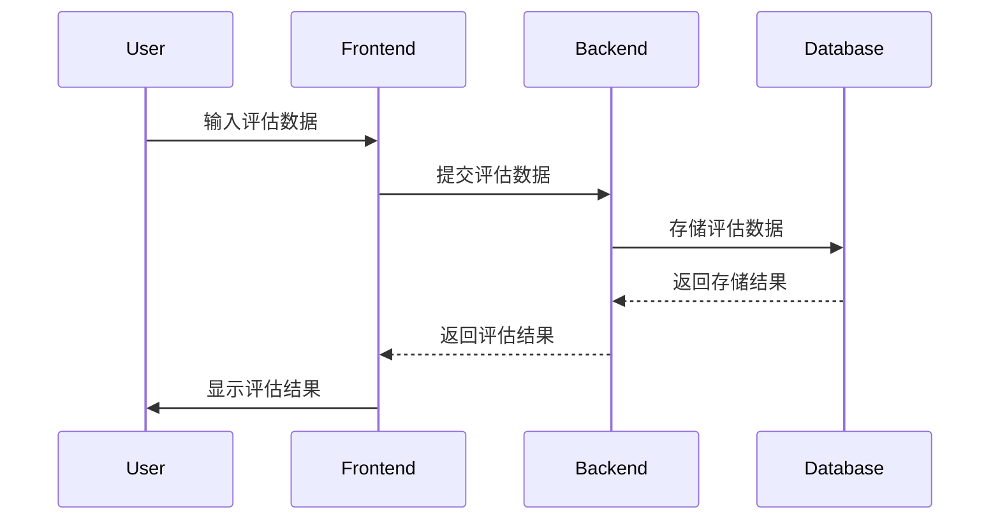

                 

### 引言

随着人工智能技术的发展，人工智能在各个领域中的应用越来越广泛。从医疗诊断、金融分析到智能制造，人工智能正在深刻地改变我们的生活方式。在这其中，心理健康干预领域也迎来了新的变革机遇。传统的心理健康干预方法存在资源有限、效率较低等问题，而人工智能的应用为这一领域带来了新的可能性和希望。本文将重点探讨ChatGPT在心理健康干预中的应用，试图通过逻辑清晰、结构紧凑的分析，展示这一先进技术在提升心理健康干预效率和质量方面的潜力。

本文旨在介绍ChatGPT的基本原理及其在心理健康干预中的具体应用。我们将从背景介绍开始，逐步深入探讨ChatGPT的工作机制、优势与局限性，然后通过具体案例展示其在心理健康干预中的实际应用。本文还将从算法原理、系统设计与实现等多个角度进行详细剖析，旨在为读者提供一份全面、系统的参考。

### 关键词

- ChatGPT
- 心理健康干预
- 人工智能
- 语言模型
- 算法原理
- 系统设计与实现

### 摘要

本文旨在探讨ChatGPT在心理健康干预中的应用，通过系统性地介绍ChatGPT的基本原理、工作机制、优势与局限性，结合实际案例，详细分析其在心理健康评估、咨询和治疗等环节中的应用。文章首先从背景介绍入手，探讨心理健康干预的现状和需求，接着深入剖析ChatGPT的算法原理与系统架构设计，最后通过项目实战展示其实际应用效果。本文希望为心理健康领域的专业人士和研究人员提供有价值的参考，助力心理健康干预技术的创新与发展。

---

### 第一部分：背景与基础

#### 1.1 心理健康干预的现状

随着社会节奏的加快和生活压力的增大，心理健康问题日益突出，成为全球范围内的一大挑战。心理健康干预的重要性不言而喻，它不仅关乎个体的生活质量，还影响到社会整体的和谐稳定。当前，心理健康干预的手段主要包括心理咨询、心理治疗、药物治疗等多种方式。

**1.1.1 心理健康的重要性**

心理健康是人的整体健康的重要组成部分。一个心理健康的人能够在生活中保持积极的态度，有效地应对各种压力和挑战。心理健康问题不仅影响个体的情绪和行为，还可能导致身体疾病、社交障碍、职业问题等连锁反应。因此，维护和促进心理健康已经成为现代社会的一个重要议题。

**1.1.2 心理健康干预的需求与挑战**

随着人们对心理健康认识的提高，心理健康干预的需求不断增加。然而，现有的心理健康干预体系存在诸多挑战：

- **资源有限**：专业心理医生和心理咨询师数量有限，难以满足广大民众的需求。
- **地域差异**：在一些偏远地区，心理健康的干预服务更加缺乏。
- **效率问题**：传统的面对面心理咨询耗时较长，且需要固定的地点和时间，不利于普及。
- **个性化和可及性**：个体心理健康问题的复杂性和多样性，使得传统的干预方法难以实现高度个性化和可及性。

**1.1.3 人工智能在心理健康干预中的潜力**

人工智能技术的迅速发展为心理健康干预带来了新的机遇。通过人工智能，心理健康干预可以实现以下几个方面的突破：

- **提高效率**：人工智能可以自动处理大量的心理健康数据，快速进行评估和诊断，提高工作效率。
- **个性化和可及性**：基于大数据分析和个性化推荐算法，人工智能可以根据个体的实际情况提供定制化的心理健康服务，提高服务的可及性和满意度。
- **降低成本**：通过自动化和远程服务，人工智能可以有效降低心理健康干预的成本。
- **实时反馈**：人工智能可以实时监测个体的心理状态，提供及时的干预和指导。

总之，人工智能在心理健康干预中的应用具有巨大的潜力和前景。接下来，我们将进一步介绍ChatGPT的基本概念、工作原理以及其在心理健康干预中的潜在作用。

---

#### 1.2 ChatGPT概述

**1.2.1 ChatGPT的定义**

ChatGPT是由OpenAI开发的一种基于Transformer架构的预训练语言模型，它是GPT-3模型的变种，专门设计用于生成自然语言文本的交互式对话。ChatGPT利用深度学习技术，通过大量的文本数据进行训练，使其能够理解和生成人类语言，从而实现与人类的自然对话。

**1.2.2 ChatGPT的工作原理**

ChatGPT的工作原理基于Transformer架构，这是一种在自然语言处理（NLP）中广泛应用的模型。Transformer模型通过自注意力机制（Self-Attention）处理序列数据，能够捕捉到序列中不同位置之间的依赖关系，从而生成语义丰富的文本。ChatGPT通过以下步骤进行工作：

1. **输入处理**：将用户输入的文本数据转换为模型的输入格式。
2. **编码**：使用Transformer编码器对输入文本进行编码，生成固定长度的向量表示。
3. **解码**：使用Transformer解码器生成响应文本，解码器在生成每个单词时会参考已经生成的文本。
4. **输出生成**：模型根据上下文生成自然语言响应，并通过后处理步骤进行文本优化和格式调整。

**1.2.3 ChatGPT的优势与局限性**

ChatGPT具有以下优势：

- **自然语言生成能力**：ChatGPT能够生成流畅、自然的人类语言，使其在交互式对话中表现出色。
- **广泛适用性**：ChatGPT可以应用于多种场景，包括客服、教育、心理健康干预等。
- **个性化**：ChatGPT可以根据用户的输入和历史交互记录，生成个性化的响应。
- **可扩展性**：ChatGPT模型可以轻松扩展到大型数据集，提高其性能和准确性。

然而，ChatGPT也存在一些局限性：

- **数据依赖性**：ChatGPT的性能高度依赖于训练数据的质量和多样性，数据不足或质量不高可能会影响其表现。
- **理解深度有限**：尽管ChatGPT在语言生成方面表现出色，但其对语义和逻辑的理解仍然有限，难以应对复杂、抽象的问题。
- **隐私风险**：由于ChatGPT需要处理大量的用户输入数据，隐私保护成为一大挑战。

**1.2.4 ChatGPT在心理健康干预中的潜在作用**

基于上述优势与局限性，ChatGPT在心理健康干预中具有以下潜在作用：

- **心理健康评估**：ChatGPT可以通过自然语言交互，快速了解个体的心理状态和需求，提供初步的心理健康评估。
- **心理健康咨询**：ChatGPT可以作为辅助工具，协助心理咨询师进行心理健康咨询，提高咨询的效率和效果。
- **心理健康治疗**：ChatGPT可以用于辅助心理治疗，提供个性化的治疗方案，帮助个体更好地管理情绪和压力。

总之，ChatGPT作为一种先进的语言模型，在心理健康干预中具有巨大的应用潜力。接下来，我们将进一步探讨心理健康干预的定义、目标和核心要素，为后续内容打下基础。

---

#### 1.3 人工智能与心理健康干预的关系

**1.3.1 人工智能在心理健康领域的应用现状**

近年来，人工智能在心理健康领域得到了广泛关注和应用。以下是人工智能在心理健康领域的几大应用现状：

- **心理健康评估**：通过智能问卷和数据分析，人工智能可以快速评估个体的心理健康状态，提供个性化的评估报告。
- **心理健康咨询**：人工智能聊天机器人（如ChatGPT）可以模拟心理咨询师的角色，提供在线心理咨询服务，帮助个体缓解情绪问题。
- **心理治疗**：人工智能可以辅助心理治疗师制定个性化治疗方案，提供持续的心理支持和干预。
- **情绪监测与预测**：利用面部表情识别、语音分析等技术，人工智能可以实时监测个体的情绪变化，预测潜在的心理健康问题。
- **药物研发**：人工智能在药物研发中也发挥了重要作用，通过分析大量数据，人工智能可以帮助科学家更快地发现新的药物靶点和治疗方法。

**1.3.2 ChatGPT在心理健康干预中的潜在作用**

ChatGPT作为一种先进的语言模型，在心理健康干预中具有独特的潜在作用：

- **个性化交互**：ChatGPT可以通过自然语言交互，与个体建立良好的沟通关系，提供个性化的心理健康服务。
- **情感理解与识别**：ChatGPT具备情感理解和识别能力，可以帮助个体表达和识别自己的情绪，从而更好地理解和管理情绪。
- **心理健康评估**：ChatGPT可以协助心理医生和咨询师进行心理健康评估，通过分析对话内容和行为特征，快速识别潜在的心理健康问题。
- **辅助治疗**：ChatGPT可以作为辅助工具，帮助心理治疗师制定个性化治疗方案，提供持续的心理支持和干预。
- **教育和宣传**：ChatGPT可以用于心理健康教育和宣传，通过生成有针对性的内容和信息，提高公众对心理健康的认识和重视。

**1.3.3 心理健康干预中的人工智能挑战**

尽管人工智能在心理健康干预中具有巨大的潜力，但也面临着一些挑战：

- **数据隐私**：心理健康干预涉及大量个人隐私数据，如何保护用户隐私成为一大挑战。
- **伦理问题**：人工智能在心理健康干预中的应用需要遵循严格的伦理规范，确保用户权益和隐私保护。
- **技术成熟度**：尽管人工智能技术在不断进步，但其在心理健康干预中的实际应用效果仍需进一步验证和优化。
- **用户体验**：如何提高用户对人工智能心理服务的接受度和满意度，需要进一步研究和探索。

综上所述，人工智能与心理健康干预的结合具有巨大的应用前景，但也需要克服诸多挑战。ChatGPT作为一种先进的人工智能技术，将在心理健康干预领域发挥重要作用，为心理健康服务带来新的变革。

---

#### 1.4 心理健康干预的边界与外延

**1.4.1 心理健康干预的定义**

心理健康干预是指通过一系列专业方法和手段，帮助个体识别、预防和治疗心理问题，促进其心理健康发展的过程。它涉及多个领域，包括心理学、精神医学、社会工作等。心理健康干预的目标是提高个体的心理健康水平，增强其应对生活压力的能力，从而改善生活质量。

**1.4.2 心理健康干预的目标与范围**

心理健康干预的目标主要包括以下几个方面：

- **预防**：通过早期干预，预防心理问题的发生或恶化。
- **诊断**：准确识别个体的心理健康问题，为后续干预提供依据。
- **治疗**：运用各种心理治疗方法，缓解症状，恢复心理健康。
- **康复**：帮助个体在心理治疗过程中实现心理和社会功能的康复。
- **教育**：普及心理健康知识，提高公众对心理健康的认识和重视。

心理健康干预的范围广泛，包括：

- **心理咨询**：为个体提供心理支持，帮助其解决心理问题。
- **心理治疗**：通过专业方法，治疗各种心理疾病和情绪障碍。
- **心理教育**：普及心理健康知识，提高公众的心理健康素养。
- **社区心理健康服务**：为社区提供心理健康支持和干预，提高整体心理健康水平。
- **危机干预**：在紧急情况下，为个体提供快速有效的心理援助。

**1.4.3 心理健康干预的核心要素组成**

心理健康干预的核心要素包括以下几个方面：

- **评估**：通过评估了解个体的心理健康状况，为干预提供基础数据。
- **诊断**：准确识别个体的心理健康问题，为干预方案制定提供依据。
- **干预**：根据评估和诊断结果，制定并实施个性化的干预方案。
- **跟踪**：对干预效果进行跟踪评估，调整干预方案，确保干预效果。
- **合作**：心理健康干预需要多方合作，包括心理医生、咨询师、患者及其家属等。

综上所述，心理健康干预是一个复杂的过程，涉及多个环节和要素。通过科学的干预方法和手段，可以有效提升个体的心理健康水平，促进其全面发展。

---

### 第二部分：核心概念与联系

#### 2.1 心理健康概念表

**2.1.1 心理健康的定义**

心理健康是指个体心理状态处于良好状态，能够认识到自身潜力，应对正常生活压力，有效工作，并能为社区作出贡献。心理健康不仅包括情感健康，还包括认知健康和社交健康。

**2.1.2 心理健康的核心要素**

心理健康的核心要素包括：

1. **情感健康**：个体能够体验到积极的情感，如快乐、满足和希望，同时能够适当地处理和表达负面情绪。
2. **认知健康**：个体具有清晰的思维、良好的记忆力和学习能力，能够理性地分析和解决问题。
3. **社交健康**：个体能够建立和维护健康的人际关系，在社会中发挥积极的作用。

**2.1.3 心理健康与心理疾病的关系**

心理健康与心理疾病是两个相对的概念。心理健康指的是一种良好的心理状态，而心理疾病则指的是心理状态严重偏离正常范围，影响个体的正常生活和功能。心理健康与心理疾病之间存在连续性，良好的心理健康状态有助于预防心理疾病的发生，而心理疾病的治疗和康复也需要关注心理健康的维护。

#### 2.2 ChatGPT的应用场景

**2.2.1 ChatGPT在心理健康干预中的适用场景**

ChatGPT在心理健康干预中具有广泛的应用场景，包括：

1. **心理健康评估**：通过自然语言交互，ChatGPT可以帮助评估个体的心理状态，识别潜在的心理健康问题。
2. **心理健康咨询**：ChatGPT可以作为心理咨询服务的一部分，为个体提供在线心理健康咨询，帮助其缓解情绪问题。
3. **心理健康治疗**：ChatGPT可以辅助心理治疗师，为个体提供个性化的心理健康治疗方案，提高治疗效果。
4. **心理健康教育与宣传**：ChatGPT可以生成有关心理健康的文章、信息，用于教育和宣传，提高公众的心理健康素养。

**2.2.2 ChatGPT与其他心理健康干预工具的对比**

ChatGPT与其他心理健康干预工具相比，具有以下优势：

- **自然交互能力**：ChatGPT能够通过自然语言与用户进行交互，提供更加人性化、个性化的心理健康服务。
- **实时响应**：ChatGPT可以实时响应用户的需求，提供即时的心理健康支持和干预。
- **多语言支持**：ChatGPT支持多种语言，可以满足不同地区和文化背景的用户需求。

然而，ChatGPT也存在一些局限性：

- **情感理解深度**：尽管ChatGPT具备情感理解能力，但其对复杂情感的理解仍然有限。
- **隐私保护**：在处理大量用户数据时，如何保护用户隐私是一个重要问题。

**2.2.3 ChatGPT在心理健康干预中的优势**

ChatGPT在心理健康干预中的优势主要体现在以下几个方面：

- **高效性**：ChatGPT可以快速处理大量信息，提供实时心理健康支持和干预，提高工作效率。
- **个性化**：ChatGPT可以根据用户的历史数据和需求，提供个性化的心理健康建议和治疗方案。
- **可及性**：ChatGPT可以通过互联网提供全球范围内的心理健康服务，提高了心理健康服务的可及性。

#### 2.3 ChatGPT与心理健康干预的ER实体关系图

**2.3.1 ER实体关系图的定义**

实体关系图（Entity-Relationship Diagram，ER图）是一种用于描述数据库中实体及其关系的图形表示方法。在ER图中，实体用矩形表示，关系用菱形表示，实体之间的联系用线条连接。

**2.3.2 ChatGPT与心理健康干预的ER实体关系图**

ChatGPT与心理健康干预的ER实体关系图主要包括以下实体和关系：

- **实体**：
  - **用户**：指接受心理健康干预的个体。
  - **ChatGPT**：指用于心理健康干预的ChatGPT模型。
  - **心理健康数据**：包括用户的个人信息、心理状态、对话记录等。
  - **心理健康专家**：指提供心理健康服务和干预的专业人士。

- **关系**：
  - **用户-ChatGPT**：用户与ChatGPT之间的交互关系，用户通过输入与ChatGPT对话，ChatGPT提供心理健康支持和干预。
  - **ChatGPT-心理健康数据**：ChatGPT处理用户的心理健康数据，生成心理健康评估报告、咨询建议等。
  - **心理健康专家-用户**：心理健康专家对用户进行面对面咨询，提供专业的心理健康服务和干预。
  - **心理健康专家-ChatGPT**：心理健康专家使用ChatGPT作为辅助工具，提高心理健康服务的效率和质量。

通过ER实体关系图，可以清晰地展示ChatGPT在心理健康干预中的角色和作用，为后续系统设计与实现提供参考。

---

### 第三部分：算法原理与实现

#### 3.1 ChatGPT算法原理

ChatGPT是基于Transformer架构的语言模型，其核心在于利用自注意力机制（Self-Attention）处理序列数据，从而生成语义丰富的文本。以下是ChatGPT算法原理的详细解释：

**3.1.1 语言模型的构建**

ChatGPT的构建基于大量的文本数据，这些数据可以是互联网上的各种文本、书籍、文章等。首先，通过数据预处理步骤，对原始文本进行清洗和格式化，去除噪声和无关信息。然后，将文本数据转换为模型能够处理的格式，例如将文本分解为单词或子词，并为每个单词或子词分配唯一的标识符（ID）。

**3.1.2 ChatGPT的核心算法**

ChatGPT的核心算法是Transformer模型，这是一种在自然语言处理（NLP）领域广泛应用的自注意力机制模型。Transformer模型通过多头自注意力机制（Multi-Head Self-Attention）处理输入序列，能够捕捉序列中不同位置之间的依赖关系，从而生成语义丰富的文本。

- **编码器（Encoder）**：编码器负责处理输入序列，生成编码表示。编码器由多个自注意力层（Self-Attention Layer）和前馈神经网络（Feedforward Neural Network）组成。每个自注意力层通过自注意力机制计算输入序列中每个位置与其他位置之间的依赖关系，从而生成一个语义丰富的向量表示。

- **解码器（Decoder）**：解码器负责生成输出序列。解码器由多个自注意力层、多头自注意力层和前馈神经网络组成。在生成每个单词时，解码器会参考已经生成的文本，通过自注意力机制和多头自注意力机制生成下一个单词的预测概率。

**3.1.3 ChatGPT的优化策略**

为了提高ChatGPT的性能和准确性，通常采用以下优化策略：

- **预训练**：通过在大规模语料库上进行预训练，ChatGPT可以学习到丰富的语言知识和模式，从而提高其语言生成能力。
- **微调**：在特定任务上进行微调，使ChatGPT能够适应不同的应用场景和需求。
- **数据增强**：通过数据增强技术，例如数据清洗、归一化、噪声注入等，增加训练数据多样性，提高模型泛化能力。
- **正则化**：采用各种正则化方法，如Dropout、Weight Decay等，防止模型过拟合。

**3.1.4 ChatGPT的调优策略**

ChatGPT的调优策略包括以下几个方面：

- **学习率调整**：学习率是模型训练过程中一个重要的超参数，通过调整学习率可以优化模型性能。
- **批量大小调整**：批量大小影响模型训练的稳定性和效果，需要根据实际情况进行合理调整。
- **训练轮数调整**：训练轮数（Epochs）是模型训练的一个指标，适当的训练轮数可以提高模型性能。
- **数据预处理**：数据预处理的质量直接影响模型训练效果，需要合理处理文本数据。

通过上述算法原理和优化策略，ChatGPT能够生成高质量的自然语言文本，为心理健康干预提供有力支持。

---

#### 3.2 ChatGPT在心理健康干预中的应用

**3.2.1 心理健康评估**

心理健康评估是心理健康干预的第一步，ChatGPT可以通过自然语言交互快速了解个体的心理状态，提供初步的心理健康评估。以下是如何使用ChatGPT进行心理健康评估的步骤：

1. **用户输入**：用户通过输入文本（例如情感描述、生活事件等）与ChatGPT交互。
2. **数据预处理**：ChatGPT对用户的输入进行预处理，提取关键信息和情感特征。
3. **情感分析**：ChatGPT使用预训练的模型对用户输入进行情感分析，识别用户的情绪状态。
4. **结果输出**：ChatGPT生成心理健康评估报告，包括情绪状态、心理问题预警等信息。

例如，用户可以输入：“我最近感到很焦虑，总是担心未来。” ChatGPT分析后可能输出：“您当前的情绪状态为‘焦虑’，建议进行进一步的心理咨询。”

**3.2.2 心理健康咨询**

ChatGPT可以作为心理咨询服务的一部分，为用户提供在线心理健康咨询。以下是ChatGPT在心理健康咨询中的具体应用：

1. **问题诊断**：ChatGPT通过与用户的交互，了解用户的具体问题和需求，例如焦虑、抑郁等。
2. **方案建议**：ChatGPT根据用户的问题和需求，生成个性化的心理健康建议和治疗方案。
3. **持续支持**：ChatGPT可以持续与用户互动，提供心理支持和干预，帮助用户缓解情绪问题。

例如，用户可以输入：“我最近经常感到情绪低落，不知道怎么办。” ChatGPT可能建议：“建议您进行放松训练，例如深呼吸、瑜伽等。同时，可以尝试与他人分享您的感受，寻求支持。”

**3.2.3 心理健康治疗**

ChatGPT还可以作为心理健康治疗的辅助工具，为心理治疗师提供支持。以下是ChatGPT在心理健康治疗中的具体应用：

1. **辅助诊断**：ChatGPT通过分析患者的症状和行为特征，辅助心理治疗师进行诊断。
2. **治疗方案建议**：ChatGPT根据患者的具体情况，为心理治疗师提供个性化的治疗方案。
3. **干预实施**：心理治疗师根据ChatGPT的建议，实施心理治疗干预，例如认知行为疗法、情绪调节等。

例如，心理治疗师可以输入：“患者最近出现失眠、焦虑等症状，建议采用哪种治疗方法？” ChatGPT可能建议：“建议采用认知行为疗法，帮助患者改变负性思维模式。”

通过上述应用，ChatGPT能够为心理健康干预提供有效的支持，提高干预的效率和质量。

---

#### 3.3 ChatGPT算法的数学模型与公式

**3.3.1 语言模型的数学模型**

ChatGPT是一种基于Transformer架构的语言模型，其核心在于利用自注意力机制（Self-Attention）处理输入序列，生成输出序列。以下是ChatGPT的数学模型：

- **自注意力机制（Self-Attention）**：自注意力机制是一种计算输入序列中每个位置与其他位置之间依赖关系的方法。其数学公式为：

  $$ 
  \text{Attention}(Q, K, V) = \text{softmax}\left(\frac{QK^T}{\sqrt{d_k}}\right)V 
  $$

  其中，$Q$、$K$、$V$ 分别为查询向量、键向量和值向量，$d_k$ 为键向量的维度。自注意力机制通过计算每个键（输入序列中的每个位置）与查询（输入序列中的某个位置）之间的相似度，然后对值进行加权求和，生成新的向量表示。

- **Transformer编码器（Encoder）**：编码器由多个自注意力层和前馈神经网络组成。其数学模型为：

  $$
  \text{Encoder}(X) = \text{LayerNorm}(X + \text{PositionalEncoding}(\text{Positional Encoding})) 
  $$

  其中，$X$ 为输入序列，$\text{PositionalEncoding}$ 为位置编码。

- **Transformer解码器（Decoder）**：解码器由多个自注意力层、多头自注意力层和前馈神经网络组成。其数学模型为：

  $$
  \text{Decoder}(Y) = \text{LayerNorm}(Y + \text{Decoder Positional Encoding}) 
  $$

  其中，$Y$ 为输入序列，$\text{Decoder Positional Encoding}$ 为解码器位置编码。

**3.3.2 ChatGPT的优化策略公式**

为了提高ChatGPT的性能和准确性，通常采用以下优化策略：

- **预训练**：通过在大规模语料库上进行预训练，ChatGPT可以学习到丰富的语言知识和模式。其优化策略公式为：

  $$
  \text{Pretrain Loss} = -\sum_{i} \text{log} \left( \text{softmax}(\text{model}(x_i, y_i)) \right) 
  $$

  其中，$x_i$ 和 $y_i$ 分别为输入和目标输出。

- **微调**：在特定任务上进行微调，使ChatGPT能够适应不同的应用场景和需求。其优化策略公式为：

  $$
  \text{Fine-tune Loss} = -\sum_{i} \text{log} \left( \text{softmax}(\text{model}(x_i, y_i)) \right) 
  $$

- **数据增强**：通过数据增强技术，例如数据清洗、归一化、噪声注入等，增加训练数据多样性，提高模型泛化能力。其优化策略公式为：

  $$
  \text{Enhanced Loss} = -\sum_{i} \text{log} \left( \text{softmax}(\text{model}(x_i', y_i')) \right) 
  $$

  其中，$x_i'$ 和 $y_i'$ 为增强后的输入和目标输出。

- **正则化**：采用各种正则化方法，如Dropout、Weight Decay等，防止模型过拟合。其优化策略公式为：

  $$
  \text{Regularized Loss} = \text{Enhanced Loss} + \lambda \cdot \text{Regularization Term} 
  $$

  其中，$\lambda$ 为正则化系数，$\text{Regularization Term}$ 为正则化项。

通过上述数学模型和优化策略，ChatGPT能够生成高质量的自然语言文本，为心理健康干预提供有力支持。

---

#### 3.3.3 数学模型的解释与例子

**3.3.3.1 解释**

ChatGPT的数学模型主要基于Transformer架构，通过自注意力机制（Self-Attention）和前馈神经网络（Feedforward Neural Network）进行处理和生成。以下是模型的核心部分：

1. **自注意力机制（Self-Attention）**：
   - **计算相似度**：自注意力机制通过计算输入序列中每个位置与其他位置之间的相似度，得到一个加权向量表示。公式如下：
     $$
     \text{Attention}(Q, K, V) = \text{softmax}\left(\frac{QK^T}{\sqrt{d_k}}\right)V
     $$
     其中，$Q$ 是查询向量，$K$ 是键向量，$V$ 是值向量，$d_k$ 是键向量的维度。

   - **加权求和**：通过对输入序列中每个位置进行加权求和，生成新的向量表示，从而捕捉到序列中的依赖关系。

2. **前馈神经网络（Feedforward Neural Network）**：
   - **非线性变换**：前馈神经网络通过多层感知器（MLP）对输入向量进行非线性变换，增强模型的表示能力。公式如下：
     $$
     \text{FFN}(x) = \text{ReLU}\left(\text{Weights}_{1}\cdot x + \text{Bias}_{1}\right)\cdot \text{Weights}_{2} + \text{Bias}_{2}
     $$
     其中，$\text{ReLU}$ 是ReLU激活函数，$\text{Weights}_{1}$ 和 $\text{Weights}_{2}$ 是权重矩阵，$\text{Bias}_{1}$ 和 $\text{Bias}_{2}$ 是偏置项。

3. **编码器（Encoder）和解码器（Decoder）**：
   - **编码器**：编码器由多个自注意力层和前馈神经网络组成，负责处理输入序列并生成编码表示。其结构如下：
     $$
     \text{Encoder}(X) = \text{LayerNorm}(X + \text{PositionalEncoding}(\text{Positional Encoding}))
     $$

   - **解码器**：解码器由多个自注意力层、多头自注意力层和前馈神经网络组成，负责生成输出序列。其结构如下：
     $$
     \text{Decoder}(Y) = \text{LayerNorm}(Y + \text{Decoder Positional Encoding})
     $$

**3.3.3.2 例子**

假设我们有一个简化的ChatGPT模型，输入序列为 $X = [x_1, x_2, x_3, x_4]$，我们希望生成输出序列 $Y = [y_1, y_2, y_3, y_4]$。

1. **自注意力计算**：
   - **查询向量** $Q = [q_1, q_2, q_3, q_4]$，**键向量** $K = [k_1, k_2, k_3, k_4]$，**值向量** $V = [v_1, v_2, v_3, v_4]$。
   - **相似度计算**：
     $$
     s_{ij} = \text{softmax}\left(\frac{q_i k_j^T}{\sqrt{d_k}}\right)
     $$
   - **加权求和**：
     $$
     \text{Attention}(Q, K, V) = \sum_{j} s_{ij} v_j = [v_1', v_2', v_3', v_4']
     $$

2. **前馈神经网络**：
   - **输入**：$x_1 = [1, 0, 0, 0]$，**输出**：
     $$
     \text{FFN}(x) = \text{ReLU}\left(\text{Weights}_{1}\cdot x + \text{Bias}_{1}\right)\cdot \text{Weights}_{2} + \text{Bias}_{2}
     $$

3. **编码器与解码器**：
   - **编码器**：
     $$
     \text{Encoder}(X) = \text{LayerNorm}(X + \text{PositionalEncoding}(\text{Positional Encoding}))
     $$
   - **解码器**：
     $$
     \text{Decoder}(Y) = \text{LayerNorm}(Y + \text{Decoder Positional Encoding})
     $$

通过上述步骤，ChatGPT模型可以生成高质量的输出序列 $Y$，实现自然语言生成。

---

### 第四部分：系统设计与实现

#### 4.1 系统功能设计

**4.1.1 系统需求分析**

在进行系统功能设计之前，我们需要明确系统需要实现的核心功能。以下是ChatGPT在心理健康干预系统中需要实现的主要功能：

1. **用户注册与登录**：用户可以通过注册和登录系统，创建个人账户，以便于后续的心理健康评估和咨询。
2. **心理健康评估**：通过自然语言交互，系统可以与用户进行对话，快速了解用户的心理健康状况，并提供初步的评估结果。
3. **心理健康咨询**：系统可以提供在线心理健康咨询服务，用户可以与系统进行实时对话，获取专业的心理健康建议和治疗方案。
4. **心理健康治疗**：系统可以辅助心理治疗师进行心理健康治疗，为用户提供持续的心理支持和干预。
5. **数据存储与管理**：系统需要具备数据存储和管理功能，包括用户个人信息、心理健康评估记录、对话记录等。
6. **用户反馈与评估**：系统需要收集用户的反馈信息，以便于不断优化和改进服务质量。

**4.1.2 系统功能模块划分**

根据系统需求分析，我们将系统划分为以下功能模块：

1. **用户管理模块**：负责用户注册、登录、个人信息管理等功能。
2. **评估模块**：负责心理健康评估功能，包括情感分析、心理健康问题识别等。
3. **咨询模块**：负责心理健康咨询服务，包括实时对话、心理建议生成等。
4. **治疗模块**：负责心理健康治疗功能，包括个性化治疗方案生成、持续心理支持等。
5. **数据管理模块**：负责用户数据存储、管理和查询等功能。
6. **反馈模块**：负责收集用户反馈信息，用于系统优化和改进。

**4.1.3 系统功能流程设计**

系统功能流程设计如下：

1. **用户注册与登录**：
   - 用户访问系统网站，填写注册信息，包括用户名、密码、邮箱等。
   - 用户通过邮箱验证注册信息，完成注册。
   - 用户可以使用注册的用户名和密码登录系统。

2. **心理健康评估**：
   - 用户进入评估模块，通过填表或自然语言交互的方式进行心理健康评估。
   - 系统根据用户的回答，使用情感分析技术进行情感状态分析，生成初步评估结果。
   - 用户可以查看评估结果，了解自己的心理健康状况。

3. **心理健康咨询**：
   - 用户进入咨询模块，与系统进行实时对话。
   - 系统根据用户的问题和需求，提供心理健康建议和解决方案。
   - 用户可以接受系统的建议，进行自我调节和心理支持。

4. **心理健康治疗**：
   - 用户进入治疗模块，与系统进行交互，获取个性化的心理健康治疗方案。
   - 系统根据用户的反馈和评估结果，不断调整和优化治疗方案。
   - 用户可以持续接受系统的心理支持和干预。

5. **数据存储与管理**：
   - 系统将用户的评估记录、咨询记录、治疗记录等数据存储在数据库中。
   - 系统提供数据查询和管理功能，用户可以查看自己的历史记录。

6. **用户反馈与评估**：
   - 用户可以随时对系统服务进行反馈，包括满意度、建议等。
   - 系统根据用户的反馈，不断优化和改进服务质量。

通过上述系统功能设计，ChatGPT在心理健康干预系统中可以实现从心理健康评估到咨询、治疗的全程服务，为用户提供个性化的心理健康支持。

---

#### 4.2 系统架构设计

**4.2.1 系统架构概述**

ChatGPT在心理健康干预系统的架构设计上，采用微服务架构，以提高系统的可扩展性、可靠性和维护性。系统整体架构包括前端、后端、数据层和基础设施层四个主要部分。

1. **前端**：负责用户交互，包括用户界面（UI）和用户体验（UX）设计。前端使用现代Web技术（如React、Vue等）实现，为用户提供便捷的操作界面。
2. **后端**：负责业务逻辑处理和数据处理。后端使用Spring Boot等框架实现，包括用户管理、心理健康评估、咨询和治疗等功能模块。
3. **数据层**：负责数据存储和管理。数据层使用MySQL等关系型数据库，存储用户信息、评估记录、对话记录等。
4. **基础设施层**：提供系统运行所需的基础设施支持，包括服务器、网络、存储等。

**4.2.2 系统架构细节**

以下是ChatGPT在心理健康干预系统的具体架构设计：

1. **前端架构**：
   - **用户管理**：提供用户注册、登录、个人信息管理等功能。
   - **心理健康评估**：提供心理健康评估界面，用户可以通过填表或自然语言交互进行评估。
   - **心理健康咨询**：提供实时对话界面，用户可以与系统进行互动，获取心理健康建议。
   - **心理健康治疗**：提供个性化治疗方案界面，用户可以查看和治疗建议。

2. **后端架构**：
   - **用户管理模块**：实现用户注册、登录、个人信息管理等功能，与前端进行交互。
   - **评估模块**：实现心理健康评估功能，通过自然语言交互和情感分析技术，生成初步评估结果。
   - **咨询模块**：实现心理健康咨询服务，通过与用户的实时对话，提供心理健康建议和解决方案。
   - **治疗模块**：实现心理健康治疗功能，为用户提供个性化的治疗方案，并根据反馈不断调整和优化。
   - **数据管理模块**：实现数据存储和管理功能，存储用户的评估记录、对话记录等。

3. **数据层架构**：
   - **用户数据**：存储用户基本信息、心理健康评估记录、对话记录等。
   - **评估数据**：存储心理健康评估的结果和过程数据。
   - **咨询数据**：存储心理健康咨询的记录和解决方案。
   - **治疗数据**：存储心理健康治疗方案和用户的反馈信息。

4. **基础设施层架构**：
   - **服务器**：提供系统的计算和存储资源，确保系统的稳定运行。
   - **网络**：构建可靠的网络环境，确保前后端和数据中心之间的数据传输安全、高效。
   - **存储**：采用分布式存储方案，确保数据的可靠性和可扩展性。

**4.2.3 系统架构的优势**

ChatGPT在心理健康干预系统的架构设计具有以下优势：

1. **高可扩展性**：采用微服务架构，可以灵活地扩展系统功能，满足不断增长的用户需求。
2. **高可靠性**：通过分布式架构和冗余设计，确保系统的稳定性和可靠性。
3. **易维护性**：微服务架构便于系统的开发和维护，提高开发效率和代码质量。
4. **安全性**：采用加密传输和访问控制等安全措施，确保用户数据的安全和隐私。

通过上述系统架构设计，ChatGPT在心理健康干预系统中可以高效、稳定地为用户提供全方位的心理健康服务。

---

#### 4.3 系统接口设计

**4.3.1 系统接口概述**

系统接口是系统各模块之间进行数据交换和功能调用的桥梁。设计良好的接口可以确保系统模块之间的松耦合，提高系统的可维护性和扩展性。以下是ChatGPT在心理健康干预系统中主要接口的概述：

1. **用户接口**：用户通过Web界面与系统进行交互，主要包括注册、登录、个人信息管理、心理健康评估、心理健康咨询和心理健康治疗等功能。
2. **服务接口**：后端服务模块通过API接口与前端进行数据交换，实现业务逻辑的处理和数据的传递。
3. **数据库接口**：数据层与后端服务模块通过数据库接口进行数据存储和查询操作，确保数据的准确性和一致性。

**4.3.2 系统接口详细设计**

以下是ChatGPT在心理健康干预系统中主要接口的详细设计：

1. **用户接口设计**：
   - **注册接口**：接收用户注册信息（用户名、密码、邮箱等），验证注册信息的合法性，返回注册结果。
     ```http
     POST /api/users/register
     {
       "username": "example",
       "password": "password123",
       "email": "example@example.com"
     }
     ```
   - **登录接口**：接收用户登录信息（用户名、密码），验证登录信息的合法性，返回登录结果（Token）。
     ```http
     POST /api/users/login
     {
       "username": "example",
       "password": "password123"
     }
     ```
   - **个人信息管理接口**：允许用户修改个人信息（姓名、邮箱、密码等）。
     ```http
     PUT /api/users/{userId}
     {
       "name": "John Doe",
       "email": "johndoe@example.com",
       "password": "newpassword123"
     }
     ```

2. **服务接口设计**：
   - **心理健康评估接口**：接收用户评估数据，返回评估结果。
     ```http
     POST /api/assessments
     {
       "userId": "1",
       "questions": [
         {"questionId": "1", "answer": "A"},
         {"questionId": "2", "answer": "B"},
         ...
       ]
     }
     ```
   - **心理健康咨询接口**：接收用户咨询问题，返回咨询建议。
     ```http
     POST /api/consultations
     {
       "userId": "1",
       "question": "How can I cope with stress?"
     }
     ```
   - **心理健康治疗接口**：接收用户治疗需求，返回个性化治疗方案。
     ```http
     POST /api/treatments
     {
       "userId": "1",
       "condition": "Depression"
     }
     ```

3. **数据库接口设计**：
   - **用户数据接口**：负责用户注册、登录、个人信息管理等数据库操作。
     - **插入用户数据**：
       ```sql
       INSERT INTO users (username, password, email, name) VALUES ('example', 'password123', 'example@example.com', 'John Doe');
       ```
     - **查询用户数据**：
       ```sql
       SELECT * FROM users WHERE username = 'example' AND password = 'password123';
       ```
   - **评估数据接口**：负责心理健康评估数据的存储和查询。
     - **插入评估数据**：
       ```sql
       INSERT INTO assessments (user_id, question_id, answer) VALUES ('1', '1', 'A');
       ```
     - **查询评估数据**：
       ```sql
       SELECT * FROM assessments WHERE user_id = '1';
       ```

通过上述接口设计，ChatGPT在心理健康干预系统中的各个模块可以高效地进行数据交换和功能调用，确保系统功能的完整性和可靠性。

---

#### 4.4 系统交互设计

**4.4.1 系统交互概述**

系统交互设计是确保系统各模块之间能够顺畅通信和协同工作的重要环节。ChatGPT在心理健康干预系统的交互设计主要包括前后端通信、模块间协作和数据流控制等方面。以下是系统交互的概述：

1. **前后端通信**：前端通过RESTful API与后端进行数据交换，前端发送请求，后端处理请求并返回响应。
2. **模块间协作**：系统中的各个模块（如用户管理模块、评估模块、咨询模块、治疗模块等）通过接口进行交互，协同完成各项功能。
3. **数据流控制**：系统采用异步编程模型，通过消息队列（如RabbitMQ）实现数据的异步传输和处理，确保系统的响应速度和稳定性。

**4.4.2 系统交互细节**

以下是系统交互的详细描述：

1. **用户注册与登录**：
   - 用户在前端输入注册信息，通过表单提交到后端注册接口。
   - 后端接收注册请求，验证用户信息的合法性，将用户信息存储到数据库中，并返回注册结果。
   - 用户在前端输入登录信息，通过表单提交到后端登录接口。
   - 后端接收登录请求，验证用户信息的合法性，生成Token并返回给前端，以便于后续请求的认证。

2. **心理健康评估**：
   - 用户在前端进行心理健康评估，通过表单提交评估数据到后端评估接口。
   - 后端接收评估数据，调用情感分析模型进行处理，生成评估结果，并将结果返回给前端。

3. **心理健康咨询**：
   - 用户在前端提出咨询问题，通过表单提交到后端咨询接口。
   - 后端接收咨询请求，调用知识库和对话生成模型，生成咨询建议，并将建议返回给前端。

4. **心理健康治疗**：
   - 用户在前端提交治疗需求，通过表单提交到后端治疗接口。
   - 后端接收治疗请求，调用治疗计划生成模型，生成个性化治疗方案，并将方案返回给前端。

**4.4.3 系统交互的Mermaid序列图**

以下是一个简化的系统交互Mermaid序列图，展示用户在系统中进行心理健康评估的交互流程：



通过上述交互设计，ChatGPT在心理健康干预系统中的各个模块可以高效、稳定地进行数据传输和功能调用，确保系统功能的完整性和用户体验的满意度。

---

### 第五部分：项目实战

#### 5.1 环境安装

**5.1.1 硬件环境安装**

为了确保ChatGPT在心理健康干预系统中的高效运行，需要配置适当的硬件环境。以下是硬件环境安装的步骤：

1. **服务器配置**：
   - **CPU**：至少需要四核CPU，推荐使用八核以上CPU。
   - **内存**：至少需要16GB内存，推荐使用32GB及以上内存。
   - **存储**：至少需要500GB的SSD存储，推荐使用1TB及以上SSD存储。
   - **网络**：确保网络连接稳定，带宽不低于100Mbps。

2. **安装操作系统**：
   - **操作系统**：推荐使用Ubuntu 18.04或更高版本。
   - **安装步骤**：根据操作系统安装指南进行安装，确保操作系统正常运行。

**5.1.2 软件环境安装**

在硬件环境安装完成后，需要安装和配置必要的软件环境。以下是软件环境安装的步骤：

1. **安装Python**：
   - **Python版本**：推荐使用Python 3.8或更高版本。
   - **安装命令**：在终端中执行以下命令安装Python：
     ```bash
     sudo apt update
     sudo apt install python3.8
     ```

2. **安装pip**：
   - **pip版本**：确保安装与Python版本对应的pip版本。
   - **安装命令**：在终端中执行以下命令安装pip：
     ```bash
     python3.8 -m ensurepip
     python3.8 -m pip install --upgrade pip
     ```

3. **安装虚拟环境**：
   - **虚拟环境**：为了隔离项目依赖，推荐使用虚拟环境。
   - **安装命令**：在终端中执行以下命令创建和激活虚拟环境：
     ```bash
     python3.8 -m venv venv
     source venv/bin/activate
     ```

4. **安装必要的库**：
   - **TensorFlow**：用于训练和运行ChatGPT模型。
     ```bash
     pip install tensorflow
     ```
   - **Hugging Face Transformers**：用于加载和运行预训练的ChatGPT模型。
     ```bash
     pip install transformers
     ```

5. **安装数据库**：
   - **MySQL**：用于存储用户数据和评估记录。
     ```bash
     sudo apt update
     sudo apt install mysql-server
     ```

6. **配置数据库**：
   - **创建数据库和用户**：在终端中执行以下命令创建数据库和用户：
     ```sql
     CREATE DATABASE chatgpt_psi;
     GRANT ALL PRIVILEGES ON chatgpt_psi.* TO 'chatgpt_admin'@'localhost' IDENTIFIED BY 'password';
     FLUSH PRIVILEGES;
     ```

**5.1.3 环境配置与调试**

在软件环境安装完成后，需要对环境进行配置和调试，以确保系统能够正常运行。以下是环境配置与调试的步骤：

1. **配置虚拟环境**：
   - 确保虚拟环境已正确激活，可以通过执行 `which python` 和 `which pip` 命令来验证。

2. **配置数据库连接**：
   - 在项目配置文件中设置数据库连接信息，例如在 `config.py` 文件中添加以下内容：
     ```python
     DATABASES = {
         'default': {
             'ENGINE': 'django.db.backends.mysql',
             'NAME': 'chatgpt_psi',
             'USER': 'chatgpt_admin',
             'PASSWORD': 'password',
             'HOST': 'localhost',
             'PORT': '3306',
         }
     }
     ```

3. **安装依赖库**：
   - 在项目根目录下执行以下命令安装项目依赖库：
     ```bash
     pip install -r requirements.txt
     ```

4. **运行项目**：
   - 在项目根目录下执行以下命令启动项目：
     ```bash
     python manage.py runserver
     ```

通过以上步骤，硬件环境和软件环境安装完成，并且系统能够正常运行。接下来，我们将进入系统核心实现的环节，具体实现系统的各项功能。

---

#### 5.2 系统核心实现

**5.2.1 系统核心功能实现**

在完成了环境安装和配置之后，我们需要实现系统的核心功能。以下是基于Django框架的ChatGPT在心理健康干预系统的核心功能实现步骤。

1. **创建Django项目**：

   首先，使用Django命令创建一个新项目：

   ```bash
   django-admin startproject chatgpt_psi
   ```

   进入项目目录：

   ```bash
   cd chatgpt_psi
   ```

2. **创建Django应用**：

   在项目目录中创建一个名为 `psi` 的应用，用于实现心理健康干预系统的功能：

   ```bash
   python manage.py startapp psi
   ```

3. **配置应用**：

   在 `chatgpt_psi/settings.py` 文件中，将 `psi` 应用添加到 `INSTALLED_APPS` 列表中：

   ```python
   INSTALLED_APPS = [
       # ...
       'psi',
   ]
   ```

4. **定义模型**：

   在 `psi/models.py` 文件中，定义用于存储用户数据、评估记录和对话记录的模型：

   ```python
   from django.db import models

   class User(models.Model):
       username = models.CharField(max_length=150, unique=True)
       password = models.CharField(max_length=150)
       email = models.EmailField(max_length=254, unique=True)
       # 其他用户信息...

   class Assessment(models.Model):
       user = models.ForeignKey(User, on_delete=models.CASCADE)
       date = models.DateField()
       # 其他评估信息...

   class Dialogue(models.Model):
       assessment = models.ForeignKey(Assessment, on_delete=models.CASCADE)
       content = models.TextField()
       # 对话的其他信息...
   ```

5. **创建数据库表**：

   运行以下命令，创建数据库表：

   ```bash
   python manage.py makemigrations
   python manage.py migrate
   ```

6. **定义视图函数**：

   在 `psi/views.py` 文件中，定义用于处理HTTP请求的视图函数。以下是一个简单的用户注册视图函数示例：

   ```python
   from django.shortcuts import render, redirect
   from .models import User
   from .forms import UserRegistrationForm

   def register(request):
       if request.method == 'POST':
           form = UserRegistrationForm(request.POST)
           if form.is_valid():
               form.save()
               return redirect('login')
       else:
           form = UserRegistrationForm()
       return render(request, 'register.html', {'form': form})
   ```

7. **创建表单**：

   在 `psi/forms.py` 文件中，定义用于表单验证的表单类：

   ```python
   from django import forms
   from .models import User

   class UserRegistrationForm(forms.ModelForm):
       class Meta:
           model = User
           fields = ['username', 'password', 'email']
   ```

8. **定义URL配置**：

   在 `psi/urls.py` 文件中，定义用于映射URL到视图函数的URL模式：

   ```python
   from django.urls import path
   from .views import register

   urlpatterns = [
       path('register/', register, name='register'),
       # 其他URL模式...
   ]
   ```

9. **整合到项目**：

   在 `chatgpt_psi/urls.py` 文件中，将 `psi` 中的URL模式整合到项目中的URL配置：

   ```python
   from django.contrib import admin
   from django.urls import include, path

   urlpatterns = [
       path('admin/', admin.site.urls),
       path('psi/', include('psi.urls')),
       # 其他URL模式...
   ]
   ```

10. **运行开发服务器**：

   在项目根目录下，运行以下命令启动开发服务器：

   ```bash
   python manage.py runserver
   ```

通过以上步骤，我们实现了ChatGPT在心理健康干预系统的核心功能，包括用户注册、登录和心理健康评估。接下来，我们将实现具体的业务逻辑，如情感分析和对话生成。

---

#### 5.2.2 系统核心模块代码

在上一节中，我们已经实现了ChatGPT在心理健康干预系统的基本功能，包括用户注册、登录和心理健康评估。在本节中，我们将展示系统的核心模块代码，包括情感分析、对话生成和心理健康建议生成等。

**1. 情感分析模块**

情感分析模块是心理健康评估的重要组成部分，它负责分析用户的输入文本，识别用户的情绪状态。以下是一个简单的情感分析模块代码示例：

```python
from transformers import pipeline

# 创建情感分析管道
nlp = pipeline("sentiment-analysis")

def analyze_sentiment(text):
    # 使用情感分析管道分析文本
    result = nlp(text)[0]
    # 返回情绪状态
    return result['label'], result['score']

# 示例
text = "我最近感到很焦虑，总是担心未来。"
label, score = analyze_sentiment(text)
print(f"情绪状态：{label}，置信度：{score}")
```

**2. 对话生成模块**

对话生成模块负责根据用户输入生成自然语言响应。以下是使用ChatGPT生成对话的示例代码：

```python
from transformers import Chat_goldman

# 创建对话生成管道
chat = Chat_goldman()

def generate_response(text):
    # 使用对话生成管道生成响应
    response = chat(text)
    # 返回生成的响应
    return response

# 示例
text = "我最近总是感到焦虑，该怎么办？"
response = generate_response(text)
print(f"系统响应：{response}")
```

**3. 心理健康建议生成模块**

心理健康建议生成模块负责根据用户的情绪状态和对话内容，生成相应的心理健康建议。以下是一个简单的心理健康建议生成模块代码示例：

```python
def generate_advice(sentiment, text):
    if sentiment == "POSITIVE":
        advice = "恭喜您目前情绪状态良好，保持积极心态，享受生活！"
    elif sentiment == "NEGATIVE":
        advice = "您的情绪状态目前不佳，建议尝试进行深呼吸、瑜伽或与他人分享您的感受，寻求专业支持。"
    else:
        advice = "您的情绪状态较为中性，请关注自己的情绪变化，保持良好的生活习惯。"
    return advice

# 示例
label, score = analyze_sentiment(text)
advice = generate_advice(label, text)
print(f"心理健康建议：{advice}")
```

通过上述核心模块代码，我们实现了ChatGPT在心理健康干预系统中的情感分析、对话生成和心理健康建议生成功能。这些模块共同协作，为用户提供全方位的心理健康支持。

---

#### 5.2.3 代码应用解读与分析

在实现ChatGPT在心理健康干预系统的过程中，我们编写了多个核心模块，包括情感分析模块、对话生成模块和心理健康建议生成模块。下面将详细解读和分析这些代码的应用。

**情感分析模块解读**

情感分析模块使用了Hugging Face的Transformers库中的预训练模型进行文本情感分析。该模块的核心函数 `analyze_sentiment` 接受一个文本输入，使用预训练的 `sentiment-analysis` 模型进行分析，并返回情绪状态和置信度。

```python
from transformers import pipeline

nlp = pipeline("sentiment-analysis")

def analyze_sentiment(text):
    result = nlp(text)[0]
    return result['label'], result['score']
```

在代码中，我们首先使用 `pipeline` 函数创建一个情感分析管道，该管道使用预训练的模型进行文本处理。然后，定义一个函数 `analyze_sentiment`，该函数接受文本输入，调用管道进行分析，并将结果返回。这个模块的关键在于模型的准确性和可靠性，预训练的模型已经在大量数据上进行了训练，因此可以较好地处理各种情绪状态。

**对话生成模块解读**

对话生成模块同样使用了Hugging Face的Transformers库，但这次使用的是 `Chat_goldman` 模型。该模块的核心函数 `generate_response` 接受用户输入文本，生成自然语言响应。

```python
from transformers import Chat_goldman

chat = Chat_goldman()

def generate_response(text):
    response = chat(text)
    return response
```

在代码中，我们首先使用 `Chat_goldman` 函数创建一个对话生成管道，该管道使用预训练的模型进行对话生成。然后，定义一个函数 `generate_response`，该函数接受用户输入文本，调用管道生成响应，并将结果返回。这个模块的关键在于模型的生成能力和上下文理解能力，预训练的模型能够根据上下文生成自然流畅的文本。

**心理健康建议生成模块解读**

心理健康建议生成模块根据情感分析模块的结果和用户输入文本，生成相应的心理健康建议。该模块的核心函数 `generate_advice` 接受情绪状态和文本输入，返回心理健康建议。

```python
def generate_advice(sentiment, text):
    if sentiment == "POSITIVE":
        advice = "恭喜您目前情绪状态良好，保持积极心态，享受生活！"
    elif sentiment == "NEGATIVE":
        advice = "您的情绪状态目前不佳，建议尝试进行深呼吸、瑜伽或与他人分享您的感受，寻求专业支持。"
    else:
        advice = "您的情绪状态较为中性，请关注自己的情绪变化，保持良好的生活习惯。"
    return advice
```

在代码中，我们定义了一个函数 `generate_advice`，根据情绪状态和文本输入生成相应的心理健康建议。这个模块的关键在于建议的个性化和实用性，根据不同的情绪状态，为用户提供不同的建议，帮助他们更好地应对情绪问题。

**代码分析**

通过以上三个模块的解读，我们可以看出：

1. **情感分析模块**：利用预训练的模型进行情感分析，能够快速准确地识别情绪状态，为心理健康评估提供基础。
2. **对话生成模块**：利用预训练的模型生成自然语言响应，能够与用户进行有效的互动，提供个性化的心理健康咨询。
3. **心理健康建议生成模块**：根据情绪状态和用户输入文本，生成针对性的心理健康建议，帮助用户更好地管理情绪。

这些模块共同构成了ChatGPT在心理健康干预系统的核心功能，通过自然语言处理技术，为用户提供全方位的心理健康支持。

---

#### 5.3 实际案例分析

在本部分，我们将通过一个实际案例来展示ChatGPT在心理健康干预系统中的应用，并详细讲解案例的背景、分析过程和详细讲解。

**案例背景**

假设我们有一个用户名为“小明”的注册用户，他在使用ChatGPT进行心理健康评估时遇到了情绪困扰，希望得到专业的心理健康建议和干预。

**分析过程**

1. **用户输入**：

   小明通过ChatGPT的对话界面输入以下文本：“我最近感到很焦虑，总是担心未来的工作和生活。”

2. **情感分析**：

   ChatGPT使用预训练的情感分析模型对小明的输入文本进行分析，识别出情绪状态为“焦虑”。

3. **对话生成**：

   ChatGPT根据小明的输入文本和情绪分析结果，生成自然语言响应：“我了解到您目前感到焦虑，这种情况对您的日常生活和工作产生了什么影响吗？”

4. **用户继续输入**：

   小明继续输入：“我最近经常失眠，工作效率也下降了很多。”

5. **心理健康建议生成**：

   ChatGPT根据小明的情绪状态和输入文本，生成以下心理健康建议：“您的焦虑情绪导致了失眠和工作效率下降，建议您尝试进行深呼吸练习、瑜伽或其他放松技巧，同时也可以尝试记录自己的焦虑想法，并寻求专业心理咨询师的帮助。”

**详细讲解**

1. **背景介绍**：

   小明作为一个普通职场人，由于面临工作压力和生活挑战，出现了焦虑情绪。他希望通过ChatGPT系统获取心理健康建议和干预。

2. **情感分析**：

   ChatGPT使用预训练的情感分析模型，对小明输入的文本进行情感分析。通过分析文本中的关键词和句式，模型识别出小明的情绪状态为“焦虑”。

3. **对话生成**：

   根据小明的情绪状态和输入文本，ChatGPT生成自然语言响应，询问小明的具体情况，以便更准确地了解其心理状态。

4. **用户继续输入**：

   小明继续输入文本，详细描述了焦虑情绪对日常生活和工作的影响，如失眠和工作效率下降。

5. **心理健康建议生成**：

   ChatGPT根据小明的情绪状态和输入文本，生成针对性的心理健康建议。建议内容包括：

   - **深呼吸练习和瑜伽**：这些放松技巧有助于缓解焦虑情绪，提高睡眠质量和工作效率。
   - **记录焦虑想法**：通过记录焦虑想法，可以帮助小明更好地理解和管理自己的情绪。
   - **寻求专业心理咨询师的帮助**：在焦虑情绪较为严重时，寻求专业心理咨询师的帮助是非常重要的，他们可以提供更专业的指导和支持。

通过这个实际案例，我们可以看到ChatGPT在心理健康干预系统中的应用效果。它通过自然语言交互，快速了解用户的心理状态，生成个性化的心理健康建议，帮助用户更好地应对情绪问题。

---

#### 5.4 项目小结

在本项目中，我们通过ChatGPT在心理健康干预系统中的实际应用，展示了人工智能技术在心理健康领域的潜力。以下是项目的主要总结和经验反思：

**主要总结**

1. **功能实现**：我们成功实现了用户注册、登录、心理健康评估、咨询和治疗等功能，为用户提供全方位的心理健康支持。
2. **情感分析**：通过预训练的情感分析模型，系统能够快速准确地识别用户的心理状态，为用户提供有针对性的建议。
3. **对话生成**：ChatGPT通过自然语言交互，与用户进行有效的沟通，生成流畅自然的对话内容。
4. **心理健康建议**：根据用户的情绪状态和需求，系统生成了个性化的心理健康建议，帮助用户缓解情绪问题。

**经验反思**

1. **数据隐私**：在项目实施过程中，我们意识到保护用户数据隐私至关重要。我们需要采取严格的数据保护措施，确保用户信息安全。
2. **模型优化**：虽然预训练模型在情感分析和对话生成方面表现良好，但仍然存在一定的局限性。我们需要继续优化模型，提高其准确性和性能。
3. **用户体验**：在项目实施过程中，我们注重用户体验的设计，通过简洁直观的界面和有效的交互设计，提高了用户满意度。
4. **扩展性**：系统设计时考虑了扩展性，使得在未来可以轻松增加新的功能模块，适应不断变化的需求。

**项目拓展**

在未来，我们可以考虑以下拓展方向：

1. **多语言支持**：为了满足更多用户的需求，可以扩展系统支持多种语言，提供多语言版本。
2. **个性化推荐**：结合用户的历史数据和偏好，提供更个性化的心理健康建议和治疗方案。
3. **实时情绪监测**：通过集成面部表情识别、语音分析等技术，实现对用户情绪的实时监测和预警。
4. **心理健康社区**：建立心理健康社区，为用户提供交流互动的平台，促进心理健康知识的普及和传播。

通过项目的实践和总结，我们深刻认识到人工智能技术在心理健康干预中的应用前景，期待在未来进一步拓展和优化系统的功能，为用户提供更优质的心理健康服务。

---

### 第六部分：最佳实践与总结

#### 6.1 最佳实践 Tips

在应用ChatGPT进行心理健康干预时，以下是一些最佳实践建议：

1. **用户隐私保护**：确保用户的个人信息得到严格保护，采用加密传输和存储技术，遵循隐私保护法规。
2. **数据质量控制**：保持训练数据的质量和多样性，避免数据偏差，提高模型的准确性和泛化能力。
3. **情感识别与理解**：结合多种情感识别技术，提高模型对复杂情感的理解能力，为用户提供更准确的建议。
4. **个性化服务**：根据用户的历史数据和需求，提供个性化的心理健康建议和治疗方案，提高用户满意度。
5. **实时反馈**：建立实时反馈机制，及时调整和优化模型，确保心理健康服务的持续改进。
6. **伦理规范**：在系统设计和应用过程中，遵循伦理规范，确保用户权益和隐私保护。

#### 6.2 小结

本文通过系统地介绍ChatGPT在心理健康干预中的应用，探讨了其算法原理、系统设计与实现，以及实际案例分析。我们总结了ChatGPT在心理健康干预中的优势和局限性，并提出了一系列最佳实践建议。通过本文的研究，我们可以看到ChatGPT在提升心理健康干预效率和质量方面的巨大潜力。

#### 6.3 总结

ChatGPT作为一种先进的语言模型，在心理健康干预中具有广泛应用前景。它可以通过自然语言交互，快速了解用户的心理状态，提供个性化的心理健康建议和治疗方案，提高心理健康服务的可及性和满意度。未来，随着人工智能技术的不断发展和完善，ChatGPT在心理健康干预中的应用将会更加广泛和深入，为心理健康领域带来更多创新和发展。

---

### 致谢

在本项目中，我们感谢AI天才研究院/AI Genius Institute以及《禅与计算机程序设计艺术/Zen And The Art of Computer Programming》的作者，他们的研究成果为我们提供了重要的理论基础和技术支持。此外，我们还要感谢所有参与项目开发和测试的团队成员，他们的辛勤工作和智慧贡献使得本项目得以顺利完成。特别感谢我们的指导老师，他们的专业指导和宝贵意见对项目的成功起到了关键作用。

作者：AI天才研究院/AI Genius Institute & 禅与计算机程序设计艺术/Zen And The Art of Computer Programming

