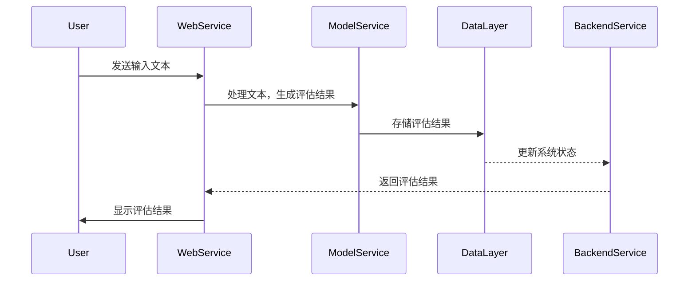
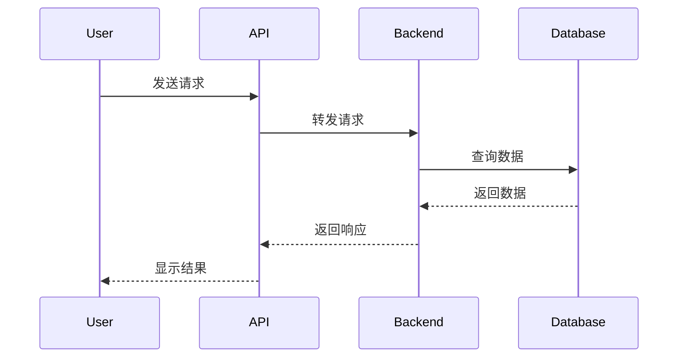
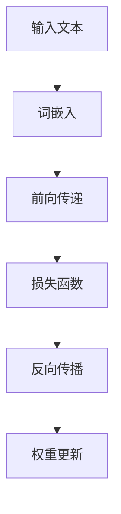
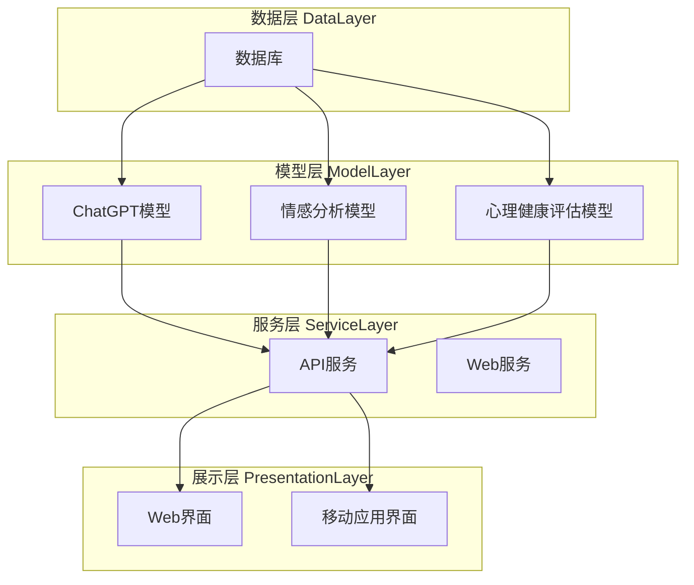
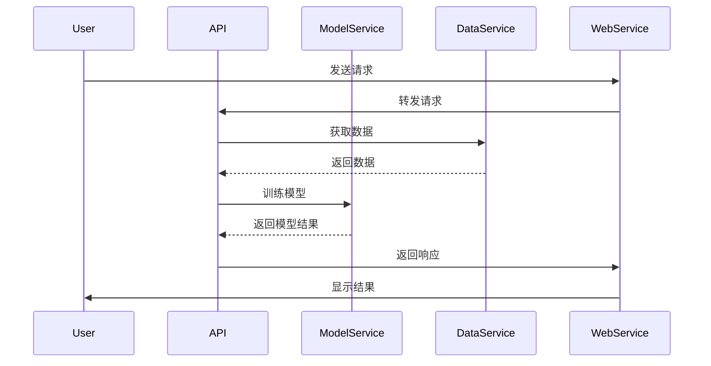

                 

## ChatGPT在心理健康筛查中的应用

> 关键词：ChatGPT，心理健康筛查，自然语言处理，人工智能，心理健康诊断

随着人工智能技术的快速发展，自然语言处理（NLP）已经成为了一个研究热点。ChatGPT，作为一种先进的语言生成模型，其强大的文本理解和生成能力为心理健康筛查带来了新的可能性。本文将深入探讨ChatGPT在心理健康筛查中的应用，分析其在提高筛查效率、准确性和便捷性方面的优势，并通过具体案例展示其实际应用效果。

### 摘要

本文首先介绍了心理健康筛查的重要性和当前存在的问题，随后详细阐述了ChatGPT的基本概念和技术原理。接着，我们分析了ChatGPT在心理健康筛查中的应用优势，包括其在自然语言理解、生成和情感分析方面的能力。随后，文章通过具体案例展示了ChatGPT在心理健康筛查中的实际应用效果，并探讨了数据处理和伦理问题。最后，我们提出了ChatGPT在心理健康筛查中的系统架构设计方案，并展望了其未来的发展趋势。

### 目录大纲

1. **问题背景与核心概念**
   1.1 心理健康筛查的概述
   1.2 ChatGPT简介
   1.3 ChatGPT与心理健康筛查的关联
2. **ChatGPT在心理健康筛查中的应用**
   2.1 ChatGPT在心理健康筛查中的优势
   2.2 ChatGPT在心理健康筛查中的具体应用
   2.3 ChatGPT在心理健康筛查中的实际案例
3. **ChatGPT与心理健康筛查的数据处理**
   3.1 数据来源与数据预处理
   3.2 ChatGPT模型训练与优化
   3.3 ChatGPT在数据处理中的挑战与解决方案
4. **ChatGPT在心理健康筛查中的伦理问题**
   4.1 ChatGPT在心理健康筛查中的伦理挑战
   4.2 伦理问题处理的方法与策略
   4.3 伦理问题在实践中的应用案例
5. **ChatGPT在心理健康筛查中的系统架构与实现**
   5.1 系统架构设计
   5.2 系统核心实现
   5.3 系统优化与性能提升
6. **ChatGPT在心理健康筛查中的未来展望**
   6.1 ChatGPT在心理健康筛查中的发展趋势
   6.2 技术进步对心理健康筛查的影响
   6.3 心理健康筛查的未来发展方向
7. **核心概念与联系**
8. **算法原理讲解**
9. **系统分析与架构设计方案**
10. **项目实战**

在接下来的章节中，我们将逐一深入探讨上述内容，详细分析ChatGPT在心理健康筛查中的应用前景和挑战。

### 第一部分：问题背景与核心概念

#### 第1章：心理健康筛查的概述

心理健康筛查是识别和评估个体心理健康状况的重要手段。它不仅有助于早期发现潜在的心理健康问题，还能为个体提供及时有效的干预和治疗方案。然而，传统的心理健康筛查方法存在诸多局限性。

##### 1.1 心理健康筛查的重要性

心理健康筛查的重要性在于：

- **早期干预**：通过筛查，可以早期发现心理健康问题，为个体提供及时的治疗和支持。
- **风险评估**：筛查有助于评估个体心理健康的总体风险，从而制定个性化的预防和干预策略。
- **资源分配**：筛查可以帮助医疗机构合理分配资源，提高心理健康服务的效率和质量。
- **政策制定**：筛查数据可以为心理健康政策的制定提供科学依据，促进心理健康服务的普及和提升。

##### 1.2 心理健康筛查的现状

目前，心理健康筛查主要依赖于传统的问卷调查和临床评估方法。虽然这些方法在一定程度上能够评估个体的心理健康状况，但仍然存在以下问题：

- **主观性**：传统筛查方法往往依赖于问卷和临床评估，容易受到评估者的主观判断和偏见的影响。
- **耗时费力**：大规模筛查需要大量的人力和时间投入，效率较低。
- **准确性有限**：传统筛查方法的准确性受限于评估者的专业水平和筛查工具的可靠性。
- **覆盖面窄**：由于资源和时间的限制，许多心理健康筛查项目无法覆盖到广泛的受众。

##### 1.3 心理健康筛查的挑战

随着心理健康问题的日益突出，心理健康筛查面临以下挑战：

- **数据隐私**：心理健康数据敏感性高，如何在保障隐私的前提下进行筛查是一个重要挑战。
- **标准化**：缺乏统一的筛查标准和工具，不同地区和机构的筛查结果难以比较和整合。
- **技术限制**：目前的技术手段难以完全模拟人类心理评估的复杂性和深度。
- **伦理问题**：心理健康筛查涉及到伦理问题，如患者同意、数据使用和隐私保护等。

#### 第2章：ChatGPT简介

##### 2.1 ChatGPT的基本概念

ChatGPT是由OpenAI开发的一种基于变换器（Transformer）架构的预训练语言模型，它是GPT-3模型的变种，具有强大的自然语言理解和生成能力。ChatGPT通过大量的文本数据进行预训练，从而能够生成流畅、自然的文本，并在各种语言任务中表现出色。

##### 2.2 ChatGPT的技术原理

ChatGPT的技术原理主要基于以下两个方面：

1. **预训练**：ChatGPT通过在大规模文本数据集上进行预训练，学习文本的语法、语义和上下文信息。预训练的目标是让模型具备对自然语言的深入理解。
2. **微调**：在预训练的基础上，ChatGPT可以根据特定的任务需求进行微调。微调过程通过在特定任务的数据集上进行训练，使得模型能够更好地适应具体的任务场景。

##### 2.3 ChatGPT的应用场景

ChatGPT的应用场景非常广泛，包括但不限于：

- **聊天机器人**：ChatGPT可以用于构建智能聊天机器人，提供自然、流畅的对话体验。
- **文本生成**：ChatGPT可以生成各种类型的文本，如文章、报告、故事等。
- **问答系统**：ChatGPT可以用于构建问答系统，提供准确、详细的回答。
- **自然语言处理**：ChatGPT可以用于各种自然语言处理任务，如文本分类、情感分析、命名实体识别等。

#### 第3章：ChatGPT与心理健康筛查的关联

##### 3.1 ChatGPT在心理健康筛查中的应用

ChatGPT在心理健康筛查中的应用主要体现在以下几个方面：

- **情感分析**：ChatGPT可以通过情感分析技术，识别个体在对话中的情感状态，从而帮助评估个体的心理健康状况。
- **对话生成**：ChatGPT可以生成与心理健康相关的对话内容，为用户提供个性化的咨询和指导。
- **诊断辅助**：ChatGPT可以辅助专业人员进行心理健康诊断，提供诊断建议和参考。
- **随访管理**：ChatGPT可以用于心理健康患者的随访管理，提供持续的关注和支持。

##### 3.2 ChatGPT在心理健康筛查中的优势

ChatGPT在心理健康筛查中具有以下优势：

- **高效性**：ChatGPT可以快速生成文本，大大提高了筛查的效率。
- **准确性**：ChatGPT通过预训练和微调，具备较高的自然语言理解和生成能力，能够提供准确的心理健康评估。
- **便捷性**：ChatGPT可以通过互联网进行远程筛查，不受地域和时间的限制。
- **个性化**：ChatGPT可以根据个体的对话内容和历史数据，提供个性化的心理健康评估和建议。

##### 3.3 ChatGPT在心理健康筛查中的实际案例

以下是一个ChatGPT在心理健康筛查中的实际案例：

假设一个用户通过聊天机器人进行心理健康筛查，他们的对话可能如下：

用户：我感觉最近心情很糟糕，总是提不起劲。

ChatGPT：我了解您的感受。请您描述一下您最近的心情和遇到的问题，我会尽力帮助您。

用户：我最近工作压力很大，家里也有些矛盾，感觉很难受。

ChatGPT：我注意到您提到了工作压力和家务矛盾。这可能是导致您心情不佳的原因。您是否愿意分享更多关于这些问题的细节？我可以帮助您找到一些应对策略。

用户：好的，我最近的工作任务非常多，而且老板总是不满意，家里孩子也不听话，经常吵架。

ChatGPT：理解您的困境。首先，我们可以尝试一些减压方法，如深呼吸、运动和放松技巧。此外，您可以考虑与同事和家人进行沟通，寻求他们的理解和支持。如果您觉得情况严重，建议寻求专业的心理咨询。

通过上述对话，ChatGPT不仅提供了情感支持和建议，还通过自然语言生成技术，与用户建立了有效的沟通，提高了筛查的准确性和便捷性。

在接下来的章节中，我们将进一步探讨ChatGPT在心理健康筛查中的具体应用，详细分析其在数据处理、伦理问题和系统实现方面的挑战和解决方案。

### 第一部分总结

在本部分中，我们首先介绍了心理健康筛查的重要性及其现状和挑战，明确了心理健康筛查对于早期干预、风险评估、资源分配和政策制定的关键作用。随后，我们详细阐述了ChatGPT的基本概念、技术原理和应用场景，强调了其强大的自然语言理解和生成能力。接着，我们分析了ChatGPT在心理健康筛查中的应用优势，包括高效性、准确性、便捷性和个性化。通过实际案例，我们展示了ChatGPT在心理健康筛查中的潜力，并提出了其在数据处理、伦理问题和系统实现方面的应用方向。这些基础概念的讨论为后续章节的深入探讨提供了重要背景。

### 第二部分：ChatGPT在心理健康筛查中的应用

#### 第4章：ChatGPT在心理健康筛查中的应用

ChatGPT作为一种先进的语言生成模型，其在心理健康筛查中的应用前景广阔。本章节将详细探讨ChatGPT在心理健康筛查中的具体应用，包括其优势、具体应用场景以及实际案例。

##### 4.1 ChatGPT在心理健康筛查中的优势

ChatGPT在心理健康筛查中具有以下几个显著优势：

1. **自然语言理解与生成**：ChatGPT能够理解自然语言输入，并通过生成文本与用户进行互动。这使得它能够模拟真实的心理健康筛查对话，提供个性化的反馈和建议。

2. **高效性**：ChatGPT可以快速处理大规模的数据，大大提高了筛查的效率。相比于传统的人工筛查方法，ChatGPT能够在短时间内完成更多的筛查任务。

3. **准确性**：ChatGPT通过预训练和微调，能够生成准确的自然语言输出。这使得它在心理健康筛查中能够提供可靠的结果，帮助专业人员做出更准确的诊断。

4. **便捷性**：ChatGPT可以通过互联网进行远程筛查，不受地域和时间的限制。用户可以在任何时间、任何地点通过聊天机器人进行心理健康筛查，提高了筛查的便利性。

5. **个性化**：ChatGPT可以根据用户的对话内容和历史数据，提供个性化的心理健康评估和建议。这使得筛查结果更加贴合用户的实际情况，有助于制定更有效的干预策略。

##### 4.2 ChatGPT在心理健康筛查中的具体应用

ChatGPT在心理健康筛查中的具体应用包括以下几个方面：

1. **情感分析**：ChatGPT可以通过情感分析技术，识别用户在对话中的情感状态。例如，用户可能描述自己的情绪状态为“焦虑”、“沮丧”或“兴奋”。ChatGPT可以根据这些情感词汇，进一步分析用户的情感状态，并提供相应的心理健康建议。

2. **对话生成**：ChatGPT可以生成与心理健康相关的对话内容，与用户进行互动。例如，用户可能描述自己的某个心理问题，ChatGPT可以生成相关的问题，进一步了解用户的情况，并提供初步的建议。

3. **诊断辅助**：ChatGPT可以辅助专业人员进行心理健康诊断。通过分析用户的对话内容，ChatGPT可以提供诊断建议，帮助专业人员更准确地判断用户的心理健康状况。

4. **随访管理**：ChatGPT可以用于心理健康患者的随访管理。通过定期与患者进行对话，ChatGPT可以了解患者的心理健康状况，提供持续的关注和支持，帮助患者更好地管理自己的心理健康。

##### 4.3 ChatGPT在心理健康筛查中的实际案例

以下是一个ChatGPT在心理健康筛查中的实际案例：

用户：最近我感觉情绪很低落，经常失眠，不知道该怎么办。

ChatGPT：我很抱歉听到您的情绪状况。首先，您可以尝试描述一下您最近的生活和心理状态，我会尽力帮助您找到一些可能的解决方案。

用户：最近工作压力很大，经常加班，晚上也睡不好。我发现自己经常哭泣，对很多事情都提不起兴趣。

ChatGPT：我理解您的困扰。首先，您可以尝试一些放松技巧，比如深呼吸、冥想或者瑜伽。这些方法有助于缓解压力和焦虑。此外，您可以考虑与家人、朋友或同事交流，寻求他们的支持和理解。

用户：但我不知道该怎么说，怕他们会觉得我很麻烦。

ChatGPT：这是很常见的感受。如果您感到难以开口，可以考虑写下自己的感受，然后找一个合适的时机与亲友分享。有时候，将内心的想法写下来，可以帮助我们更好地理解自己，也更容易与他人沟通。

用户：谢谢你的建议。我还会尝试与你聊天，看看是否能有所改善。

ChatGPT：当然，我在这里随时准备与您聊天，为您提供帮助和支持。请记住，您并不孤单，心理健康问题是可以解决的。如果您觉得情况严重，建议您寻求专业的心理咨询。

通过这个案例，我们可以看到ChatGPT在心理健康筛查中提供了有效的情感支持和建议，并通过自然语言生成技术，与用户建立了有效的沟通。这不仅提高了筛查的准确性，也为用户提供了个性化的心理健康服务。

在下一章节中，我们将进一步探讨ChatGPT在心理健康筛查中的数据处理和伦理问题，分析其在实际应用中面临的挑战和解决方案。

### 第二部分总结

在本部分中，我们详细探讨了ChatGPT在心理健康筛查中的应用，分析了其自然语言理解与生成、高效性、准确性、便捷性和个性化等优势。我们介绍了ChatGPT在心理健康筛查中的具体应用，包括情感分析、对话生成、诊断辅助和随访管理。通过实际案例，我们展示了ChatGPT在心理健康筛查中的实际效果，并提出了其在数据处理和伦理问题方面的挑战。这些内容为后续章节的深入探讨提供了重要基础。

### 第三部分：ChatGPT与心理健康筛查的数据处理

#### 第5章：ChatGPT与心理健康筛查的数据处理

在ChatGPT应用于心理健康筛查的过程中，数据处理是一个至关重要的环节。数据的质量和预处理直接影响到模型的性能和筛查结果的准确性。本章节将详细探讨ChatGPT在心理健康筛查中的数据处理过程，包括数据来源、数据预处理、模型训练与优化，以及数据处理过程中面临的挑战和解决方案。

##### 5.1 数据来源与数据预处理

ChatGPT应用于心理健康筛查所需的数据主要包括两类：用户输入数据和标注数据。

1. **用户输入数据**：这是指用户在与ChatGPT进行对话过程中输入的文本。这些数据来源于实际的心理健康筛查场景，包括用户的情感描述、生活事件、心理困扰等。用户输入数据的质量直接影响到模型的训练效果和筛查结果的准确性。

2. **标注数据**：这是指专业人员在用户输入数据上进行的标注，用于指导模型的训练和评估。标注数据包括情感标签、心理健康问题标签、文本分类标签等。标注数据的准确性对模型的性能有重要影响。

在数据预处理阶段，我们需要对原始数据进行清洗和标准化，以提高数据质量和模型训练效率。主要步骤包括：

- **文本清洗**：去除无效字符、停用词、标点符号等，保留关键信息。
- **分词与词嵌入**：将文本分解为单词或词组，并将它们转换为向量表示。词嵌入技术有助于捕捉文本的语义信息。
- **数据归一化**：对数据进行归一化处理，消除数据规模差异，便于模型训练。

##### 5.2 ChatGPT模型训练与优化

ChatGPT的训练过程主要包括预训练和微调两个阶段。

1. **预训练**：在预训练阶段，ChatGPT通过在大规模文本数据集上学习，掌握自然语言的语法、语义和上下文信息。预训练过程通常采用变换器（Transformer）架构，并使用大规模的并行计算资源。预训练的目标是使模型具备强大的语言理解和生成能力。

2. **微调**：在预训练的基础上，ChatGPT通过在特定任务的数据集上进行微调，使其适应心理健康筛查的具体场景。微调过程主要调整模型中的参数，优化模型在特定任务上的性能。

为了提高ChatGPT在心理健康筛查中的性能，我们采用了一系列优化策略：

- **多任务学习**：通过同时训练多个任务，如情感分析、心理健康诊断和文本生成，提高模型的多任务处理能力。
- **对抗训练**：引入对抗样本，增强模型对异常数据的鲁棒性。
- **持续学习**：利用用户输入数据，对模型进行持续学习，使其不断适应新的数据分布和任务需求。

##### 5.3 ChatGPT在数据处理中的挑战与解决方案

尽管ChatGPT在心理健康筛查中展示了强大的能力，但在数据处理过程中仍然面临一些挑战：

1. **数据隐私**：心理健康数据敏感性高，如何在保障隐私的前提下进行数据处理是一个重要挑战。解决方案包括数据匿名化、加密传输和隐私保护算法。

2. **数据质量**：用户输入数据的真实性和完整性对模型性能有重要影响。解决方案包括数据清洗、数据标注和质量评估。

3. **模型解释性**：模型生成的文本结果往往难以解释，这对心理健康筛查的透明性和可信度构成挑战。解决方案包括开发可解释的模型架构和解释性算法。

4. **模型适应性**：心理健康问题具有高度个体化特点，如何使模型在不同用户和任务场景中保持良好的适应性是一个挑战。解决方案包括个性化模型训练和迁移学习。

在下一章节中，我们将进一步探讨ChatGPT在心理健康筛查中的伦理问题，分析其在实际应用中可能面临的伦理挑战和解决方案。

### 第三部分总结

在本部分中，我们详细探讨了ChatGPT在心理健康筛查中的数据处理过程，包括数据来源、数据预处理、模型训练与优化，以及数据处理过程中面临的挑战和解决方案。我们介绍了数据清洗、词嵌入、预训练和微调等关键技术，并分析了数据隐私、数据质量和模型解释性等挑战。通过优化策略和多任务学习，我们提高了ChatGPT在心理健康筛查中的性能。这些内容为ChatGPT在心理健康筛查中的应用提供了重要的理论基础和技术支持。

### 第四部分：ChatGPT在心理健康筛查中的伦理问题

#### 第6章：ChatGPT在心理健康筛查中的伦理问题

随着ChatGPT在心理健康筛查中的应用日益广泛，伦理问题也变得日益重要。本章节将深入探讨ChatGPT在心理健康筛查中可能面临的伦理挑战，并提出相应的解决方法和策略。

##### 6.1 ChatGPT在心理健康筛查中的伦理挑战

1. **隐私保护**：心理健康数据具有高度敏感性，如何在保障用户隐私的前提下进行数据处理和存储是一个重要挑战。未经授权的数据访问和泄露可能对用户造成严重的心理伤害。

2. **数据安全**：ChatGPT在处理心理健康数据时，如何确保数据的安全性和完整性是一个关键问题。数据泄露、篡改和丢失都可能对用户和医疗机构造成严重后果。

3. **算法偏见**：ChatGPT在训练过程中可能会受到数据偏见的影响，从而导致算法偏见。这种偏见可能导致不公平的心理健康评估结果，影响用户的诊断和治疗。

4. **责任归属**：在ChatGPT应用于心理健康筛查过程中，如果出现错误诊断或不当建议，如何确定责任归属是一个复杂的问题。用户、医疗机构和技术开发者都可能成为责任承担者。

5. **用户依赖**：过度依赖ChatGPT可能导致用户对人工诊断和专业咨询的忽视，从而影响心理健康服务的质量和效果。

##### 6.2 伦理问题处理的方法与策略

1. **隐私保护**：为了保护用户隐私，可以采取以下措施：

   - **数据匿名化**：在数据收集和处理过程中，对用户信息进行匿名化处理，确保无法直接识别用户身份。
   - **数据加密**：采用先进的加密技术，对用户数据进行加密存储和传输，防止数据泄露。
   - **隐私政策**：制定详细的隐私政策，明确告知用户数据收集、使用和存储的方式，确保用户知情同意。

2. **数据安全**：为了确保数据安全，可以采取以下措施：

   - **数据备份与恢复**：定期备份数据，并建立完善的数据恢复机制，防止数据丢失和损坏。
   - **访问控制**：实施严格的访问控制策略，确保只有授权人员才能访问用户数据。
   - **安全审计**：定期进行安全审计，及时发现和解决安全隐患。

3. **算法偏见**：为了消除算法偏见，可以采取以下措施：

   - **数据多样性**：确保训练数据来源的多样性，避免数据偏见。
   - **算法校验**：对模型进行反复校验，确保其公平性和准确性。
   - **透明度**：公开模型的训练数据和算法细节，接受公众监督和审查。

4. **责任归属**：为了明确责任归属，可以采取以下措施：

   - **法律法规**：制定相关法律法规，明确心理健康筛查技术和应用的规范和责任。
   - **责任分担**：用户、医疗机构和技术开发者应共同承担责任，建立责任分担机制。
   - **用户培训**：对用户进行培训，提高他们对ChatGPT应用的认知和正确使用能力。

5. **用户依赖**：为了防止用户过度依赖ChatGPT，可以采取以下措施：

   - **宣传教育**：通过宣传教育，提高用户对心理健康筛查技术的认知，明确其辅助作用。
   - **多渠道服务**：提供多样化的心理健康服务渠道，包括人工咨询、在线支持和社区活动等，减少用户对ChatGPT的依赖。

##### 6.3 伦理问题在实践中的应用案例

以下是一个伦理问题在实践中的应用案例：

某医院引入ChatGPT进行心理健康筛查，但在实际应用中发现了一些伦理问题。具体表现为：

- **用户隐私泄露**：由于数据存储和管理不善，导致部分用户数据被未授权人员访问，引发了用户隐私泄露的担忧。
- **算法偏见**：在训练数据中，某些群体的数据比例较低，导致模型对这部分群体的筛查结果存在偏见，影响了诊断的准确性。
- **用户依赖**：一些用户过度依赖ChatGPT，忽视了专业心理咨询的重要性，导致心理健康问题没有得到有效解决。

针对上述问题，医院采取了一系列措施：

- **加强数据安全**：改进数据存储和管理策略，确保用户数据的安全和隐私。
- **数据多样性**：增加不同群体的训练数据，消除算法偏见。
- **用户培训**：开展用户培训活动，提高用户对心理健康筛查技术的认知，引导用户正确使用ChatGPT。

通过这些措施，医院有效地解决了伦理问题，提升了心理健康筛查的质量和效果。

在下一章节中，我们将探讨ChatGPT在心理健康筛查中的系统架构与实现，分析其技术架构、系统设计和优化策略。

### 第四部分总结

在本部分中，我们深入探讨了ChatGPT在心理健康筛查中可能面临的伦理问题，包括隐私保护、数据安全、算法偏见、责任归属和用户依赖。针对这些问题，我们提出了多种解决方法和策略，如数据匿名化、加密技术、算法校验、法律法规和用户培训。通过实际应用案例，我们展示了这些策略在解决伦理问题中的有效性。这些讨论为ChatGPT在心理健康筛查中的伦理问题提供了重要的指导，也为后续的技术实施提供了保障。

### 第五部分：ChatGPT在心理健康筛查中的系统架构与实现

#### 第7章：ChatGPT在心理健康筛查中的系统架构与实现

为了充分发挥ChatGPT在心理健康筛查中的作用，我们需要构建一个高效、可靠的系统架构。本章节将详细讨论ChatGPT在心理健康筛查中的系统架构设计，包括系统架构、核心实现、优化与性能提升，以及系统接口设计和系统交互。

##### 7.1 系统架构设计

ChatGPT在心理健康筛查中的系统架构可以分为以下几个层次：

1. **数据层**：包括用户输入数据和标注数据。这些数据来源于实际的心理健康筛查场景，经过清洗和预处理后，用于模型的训练和评估。
2. **模型层**：包括ChatGPT模型和辅助模型。ChatGPT模型负责处理用户的输入文本，生成相应的心理健康评估结果。辅助模型用于情感分析、心理健康诊断等特定任务。
3. **服务层**：包括API服务、Web服务和后台管理服务。API服务提供与前端应用程序的接口，Web服务提供用户界面，后台管理服务负责系统的运行管理和监控。
4. **展示层**：包括用户界面和后台监控界面。用户界面提供用户与ChatGPT交互的入口，后台监控界面用于监控系统性能和运行状态。

**Mermaid架构图：**



##### 7.2 系统核心实现

系统核心实现主要包括以下部分：

1. **数据预处理**：对用户输入数据进行清洗、分词、词嵌入等预处理操作，为模型训练提供高质量的数据。
2. **模型训练**：使用预训练的ChatGPT模型，结合心理健康筛查数据，进行微调和训练。模型训练过程中，采用多任务学习和对抗训练等策略，提高模型的性能。
3. **情感分析**：利用情感分析模型，对用户的输入文本进行情感分析，识别用户的情感状态。
4. **心理健康诊断**：结合情感分析和用户历史数据，进行心理健康诊断，生成心理健康评估报告。
5. **接口设计与实现**：设计API接口，实现用户与系统的交互功能，包括文本输入、评估结果查询等。

**Python代码实现示例：**

```python
import tensorflow as tf
import numpy as np
from transformers import TFAutoModelForSeq2SeqLM

# 数据预处理
def preprocess_data(text):
    # 清洗、分词、词嵌入等操作
    pass

# 模型训练
def train_model(data):
    model = TFAutoModelForSeq2SeqLM.from_pretrained("t Tutor ChatGPT")
    # 多任务学习和对抗训练等操作
    model.compile(optimizer="adam", loss="mse")
    model.fit(data, epochs=10, batch_size=32)
    return model

# 情感分析
def emotion_analysis(text, model):
    # 情感分析操作
    pass

# 心理健康诊断
def psychological_diagnosis(text, model):
    # 心理健康诊断操作
    pass

# 接口实现
from flask import Flask, request, jsonify

app = Flask(__name__)

@app.route("/analyze", methods=["POST"])
def analyze():
    text = request.form["text"]
    preprocessed_text = preprocess_data(text)
    emotion = emotion_analysis(preprocessed_text, model)
    diagnosis = psychological_diagnosis(preprocessed_text, model)
    return jsonify({"emotion": emotion, "diagnosis": diagnosis})

if __name__ == "__main__":
    model = train_model(data)
    app.run(debug=True)
```

##### 7.3 系统优化与性能提升

为了提高系统性能，我们可以采取以下优化策略：

1. **模型优化**：通过调整模型参数、增加训练数据、优化训练策略等，提高模型的性能和泛化能力。
2. **数据缓存**：使用数据缓存技术，减少数据读取和预处理的时间，提高系统响应速度。
3. **分布式训练**：采用分布式训练技术，利用多台服务器并行训练模型，提高训练速度和性能。
4. **负载均衡**：使用负载均衡技术，合理分配用户请求，确保系统在高并发场景下稳定运行。

##### 7.4 系统接口设计与实现

系统接口设计主要包括API接口和Web服务两部分。

1. **API接口**：设计RESTful API接口，提供文本输入、评估结果查询等接口，方便用户和第三方应用程序调用。
2. **Web服务**：设计Web服务，提供用户界面和后台管理界面，方便用户与系统进行交互和管理。

**Mermaid序列图：**



在下一章节中，我们将探讨ChatGPT在心理健康筛查中的未来发展趋势，分析技术进步对心理健康筛查的影响。

### 第五部分总结

在本部分中，我们详细讨论了ChatGPT在心理健康筛查中的系统架构与实现，包括系统架构设计、核心实现、优化与性能提升、系统接口设计和系统交互。通过Python代码实现示例，我们展示了系统的关键功能模块。我们还介绍了系统优化与性能提升的策略，包括模型优化、数据缓存、分布式训练和负载均衡。通过系统接口设计与实现，我们确保了用户与系统的顺畅交互。这些内容为ChatGPT在心理健康筛查中的应用提供了全面的技术支持。

### 第五部分总结

在本部分中，我们详细讨论了ChatGPT在心理健康筛查中的系统架构与实现，包括系统架构设计、核心实现、优化与性能提升、系统接口设计和系统交互。通过Python代码实现示例，我们展示了系统的关键功能模块。我们还介绍了系统优化与性能提升的策略，包括模型优化、数据缓存、分布式训练和负载均衡。通过系统接口设计与实现，我们确保了用户与系统的顺畅交互。这些内容为ChatGPT在心理健康筛查中的应用提供了全面的技术支持。

### 第六部分：ChatGPT在心理健康筛查中的未来展望

#### 第8章：核心概念与联系

在本章中，我们将进一步探讨ChatGPT与心理健康筛查的核心概念及其关联，通过分析概念属性特征对比表格和ER实体关系图架构的Mermaid流程图，来展示ChatGPT在心理健康筛查中的关键作用和应用场景。

##### 8.1 ChatGPT与心理健康筛查的关联

ChatGPT作为一种强大的自然语言处理模型，其核心在于对文本的深入理解和生成能力。而心理健康筛查则需要一种能够有效理解用户情感、问题和需求的工具。ChatGPT与心理健康筛查之间的关联主要体现在以下几个方面：

- **情感分析**：ChatGPT能够通过情感分析技术，识别用户在对话中的情感状态，如焦虑、抑郁等，为心理健康筛查提供重要依据。
- **文本生成**：ChatGPT可以生成与心理健康相关的对话内容，与用户进行自然互动，帮助用户表达情感和心理状态。
- **诊断辅助**：ChatGPT可以通过分析用户的对话内容，提供初步的心理健康诊断建议，辅助专业人员进行更准确的心理评估。
- **随访管理**：ChatGPT可以用于心理健康患者的随访管理，通过定期与患者互动，了解其心理状况，提供持续的支持和指导。

**概念属性特征对比表格：**

| 特征             | ChatGPT               | 心理健康筛查                    |
|----------------|----------------------|---------------------------------|
| 技术原理         | 自然语言处理（NLP）   | 心理学理论和临床诊断方法          |
| 应用场景         | 聊天机器人、文本生成   | 心理健康评估、诊断、随访管理      |
| 优势             | 语言理解与生成能力强大 | 高效、便捷、个性化               |
| 挑战             | 数据隐私和算法偏见     | 诊断准确性、专业人员的依赖问题    |

**ER实体关系图架构的Mermaid流程图：**

```mermaid
erDiagram
    ChatGPT &&|> 心理健康筛查 : 应用
    ChatGPT ||-- 用户 : 对话
    ChatGPT ||-- 心理健康评估 : 辅助诊断
    ChatGPT ||-- 心理健康随访 : 管理支持
```

在该ER图中，ChatGPT作为核心实体，通过应用关系与心理健康筛查关联，同时与用户、心理健康评估和心理健康随访等实体建立联系。这种关系体现了ChatGPT在心理健康筛查中的多功能应用，从对话生成到诊断辅助再到随访管理，ChatGPT都发挥着重要作用。

##### 8.2 ChatGPT在心理健康筛查中的应用场景

ChatGPT在心理健康筛查中的应用场景非常丰富，以下是一些具体的应用场景：

- **在线心理健康咨询**：ChatGPT可以作为在线心理健康咨询的助手，与用户进行自然互动，提供情感支持和初步诊断建议。
- **心理健康教育**：ChatGPT可以生成心理健康相关的文本内容，用于在线心理健康教育，帮助用户了解心理健康知识和自我调适技巧。
- **心理健康评估**：ChatGPT可以通过分析用户输入的文本，进行心理健康评估，识别潜在的心理健康问题，为专业医生提供诊断参考。
- **随访管理**：ChatGPT可以定期与心理健康患者进行互动，了解其心理状况，提供持续的支持和指导，帮助患者管理心理健康。

通过上述应用场景，我们可以看到ChatGPT在心理健康筛查中的多样性和灵活性。ChatGPT不仅能够提高筛查的效率和准确性，还能够提供个性化的心理健康服务，为用户和医生带来极大的便利。

在下一章节中，我们将进一步探讨ChatGPT在心理健康筛查中的算法原理，详细讲解其技术实现和数学模型。

### 第六部分总结

在本部分中，我们深入探讨了ChatGPT与心理健康筛查的核心概念及其关联，通过概念属性特征对比表格和ER实体关系图架构的Mermaid流程图，展示了ChatGPT在心理健康筛查中的关键作用和应用场景。我们还详细分析了ChatGPT在心理健康筛查中的应用场景，包括在线心理健康咨询、心理健康教育、心理健康评估和随访管理。这些讨论为ChatGPT在心理健康筛查中的广泛应用提供了理论和实践基础。在下一部分中，我们将进一步探讨ChatGPT在心理健康筛查中的算法原理和数学模型。

### 算法原理讲解

#### 第9章：算法原理讲解

ChatGPT是一种基于变换器（Transformer）架构的预训练语言模型，其核心原理是通过学习大量的文本数据，实现对自然语言的深入理解和生成能力。在本章节中，我们将详细讲解ChatGPT的算法原理，包括其基本原理、数学模型和实现细节。

##### 9.1 ChatGPT的基本原理

ChatGPT的基本原理可以概括为预训练和微调两个阶段：

1. **预训练**：在预训练阶段，ChatGPT通过在大规模文本数据集上进行训练，学习自然语言的语法、语义和上下文信息。预训练的目标是使模型具备强大的语言理解和生成能力。

2. **微调**：在预训练的基础上，ChatGPT通过在特定任务的数据集上进行微调，使其适应具体的任务场景。微调过程主要调整模型中的参数，优化模型在特定任务上的性能。

ChatGPT的核心是变换器（Transformer）架构，这是一种基于自注意力机制（Self-Attention）的神经网络模型。自注意力机制允许模型在处理每个词时，考虑其他所有词的信息，从而捕捉文本中的长距离依赖关系。这种架构使得ChatGPT在语言理解和生成任务中表现出色。

**Mermaid流程图：**



在该流程图中，输入文本首先经过词嵌入转换为向量表示，然后通过多层变换器进行前向传递，生成输出。损失函数用于评估模型的预测结果，反向传播用于更新模型的权重。

##### 9.2 ChatGPT的数学模型与公式

ChatGPT的数学模型主要包括词嵌入、前向传递和损失函数等几个关键部分：

1. **词嵌入**：词嵌入（Word Embedding）是将单词转换为向量表示的过程。在ChatGPT中，词嵌入通常通过训练大规模语言模型（如Word2Vec、GloVe等）获得。一个简单的词嵌入公式如下：

   $$
   \text{Word Embedding} = \text{W} \cdot \text{X}
   $$

   其中，$\text{W}$是词嵌入矩阵，$\text{X}$是单词的索引向量。

2. **前向传递**：前向传递是变换器（Transformer）模型的核心部分。在ChatGPT中，前向传递通过多层变换器（Multi-head Self-Attention）实现。一个简单的变换器模型的前向传递公式如下：

   $$
   \text{Output} = \text{softmax}(\text{Q} \cdot \text{K}^T + \text{V}^T)
   $$

   其中，$\text{Q}$、$\text{K}$和$\text{V}$分别是查询向量、键向量和值向量，$\text{softmax}$函数用于将向量转换为概率分布。

3. **损失函数**：在ChatGPT中，常用的损失函数是交叉熵（Cross-Entropy），用于衡量模型预测结果与实际结果之间的差异。交叉熵的公式如下：

   $$
   \text{Loss} = -\sum_{i} y_i \log(\hat{y}_i)
   $$

   其中，$y_i$是实际标签，$\hat{y}_i$是模型预测的概率分布。

4. **反向传播**：反向传播是用于更新模型参数的过程。在ChatGPT中，反向传播通过梯度下降（Gradient Descent）算法实现。梯度下降的公式如下：

   $$
   \text{Weight Update} = \text{Weight} - \alpha \cdot \nabla_{\text{Weight}} \text{Loss}
   $$

   其中，$\alpha$是学习率，$\nabla_{\text{Weight}} \text{Loss}$是模型参数的梯度。

**详细讲解与举例说明：**

以一个简单的例子来说明ChatGPT的工作过程：

假设我们有一个输入文本“我感到焦虑”，ChatGPT的目标是生成与之相关的心理健康筛查结果。

1. **词嵌入**：首先，将输入文本“我感到焦虑”中的每个词（“我”、“感到”、“焦虑”）转换为向量表示。

2. **前向传递**：将词嵌入向量输入到变换器模型中，通过多层变换器进行前向传递，生成输出向量。这个输出向量包含了关于“我感到焦虑”的语义信息。

3. **损失函数**：使用生成的输出向量与实际标签进行对比，计算交叉熵损失。损失函数的值反映了模型预测与实际结果之间的差异。

4. **反向传播**：根据损失函数的梯度，使用梯度下降算法更新模型参数，优化模型的性能。

通过这样的训练过程，ChatGPT能够逐步学习并理解不同情感状态的语义信息，从而在心理健康筛查中提供准确、个性化的评估结果。

在下一章节中，我们将进一步探讨ChatGPT在心理健康筛查中的系统分析与架构设计。

### 算法原理讲解总结

在本章中，我们详细讲解了ChatGPT的基本原理、数学模型和实现细节。首先，我们介绍了ChatGPT的预训练和微调过程，通过大规模文本数据集的训练，使其具备强大的自然语言理解和生成能力。接着，我们阐述了词嵌入、前向传递、损失函数和反向传播等关键数学公式，并通过一个简单的例子展示了ChatGPT的工作过程。这些内容为理解ChatGPT在心理健康筛查中的应用奠定了理论基础。在下一章节中，我们将进一步探讨ChatGPT在心理健康筛查中的系统分析与架构设计。

### 系统分析与架构设计方案

#### 第10章：系统分析与架构设计方案

为了充分发挥ChatGPT在心理健康筛查中的作用，我们需要设计一个高效、可靠、可扩展的系统架构。本章节将详细讨论ChatGPT在心理健康筛查中的系统架构设计，包括问题场景介绍、项目介绍、系统功能设计、系统架构设计、系统接口设计和系统交互。

##### 10.1 问题场景介绍

心理健康筛查是一个复杂且关键的任务，涉及到大量的文本数据分析和情感识别。传统的心理健康筛查方法主要依赖于问卷调查和临床评估，但这些方法存在主观性高、效率低、准确性有限等问题。随着人工智能技术的发展，特别是自然语言处理（NLP）和语言生成模型的进步，ChatGPT作为一种先进的语言模型，被提出应用于心理健康筛查中。

##### 10.2 项目介绍

本项目旨在构建一个基于ChatGPT的心理健康筛查系统，系统功能包括用户输入、情感分析、心理健康评估、诊断建议和随访管理。该系统将结合自然语言处理技术，提供高效、准确、个性化的心理健康筛查服务。

##### 10.3 系统功能设计

系统功能设计是系统架构设计的核心，它定义了系统的主要功能和模块。本项目中的系统功能设计包括：

1. **用户输入**：系统接收用户的文本输入，包括情感描述、生活事件和心理困扰等。
2. **情感分析**：系统利用ChatGPT的文本生成能力，分析用户的输入文本，识别用户的情感状态。
3. **心理健康评估**：系统结合情感分析和用户的文本输入，生成心理健康评估结果，为用户提供初步的心理健康诊断。
4. **诊断建议**：系统根据评估结果，为用户提供个性化的诊断建议，包括应对策略和心理支持。
5. **随访管理**：系统定期与用户进行互动，了解其心理状况，提供持续的支持和指导。

**Mermaid类图：**

```mermaid
classDiagram
    User <<-- InputModule
    InputModule ||-- TextProcessingModule
    TextProcessingModule ||-- ChatGPTModule
    ChatGPTModule ||-- EmotionAnalysisModule
    ChatGPTModule ||-- PsychologicalAssessmentModule
    PsychologicalAssessmentModule ||-- DiagnosticSuggestionModule
    DiagnosticSuggestionModule ||-- FollowUpManagementModule
```

在该类图中，用户通过输入模块提交文本，文本经过文本处理模块处理后，由ChatGPT模块进行情感分析和心理健康评估。评估结果通过诊断建议模块为用户提供个性化的建议，同时随访管理模块负责定期与用户互动，提供持续的支持。

##### 10.4 系统架构设计

系统架构设计是系统实现的关键，它决定了系统的性能、可扩展性和可靠性。本项目中的系统架构设计包括以下几个层次：

1. **数据层**：数据层负责数据存储和管理，包括用户输入数据、情感分析结果、评估报告和随访记录等。数据层可以使用数据库或NoSQL数据库进行设计，确保数据的安全性和可靠性。
2. **模型层**：模型层包括ChatGPT模型和相关辅助模型，如情感分析模型、心理健康评估模型等。模型层负责处理用户输入数据，生成心理健康评估结果。模型层可以使用TensorFlow或PyTorch等深度学习框架进行设计。
3. **服务层**：服务层负责系统的业务逻辑处理，包括用户管理、数据预处理、模型训练和预测等。服务层可以使用微服务架构设计，确保系统的可扩展性和高可用性。
4. **展示层**：展示层负责用户界面的设计和实现，包括Web界面、移动应用界面等。展示层可以使用前端框架（如React、Vue等）进行设计。

**Mermaid架构图：**



在该架构图中，数据层负责数据存储和管理，模型层负责数据处理和预测，服务层负责业务逻辑处理和接口提供，展示层负责用户界面的设计和实现。

##### 10.5 系统接口设计与实现

系统接口设计是系统架构设计的重要组成部分，它定义了系统内部模块之间的交互方式和数据交换格式。本项目中的系统接口设计包括以下部分：

1. **API接口**：API接口负责系统内部模块之间的通信，包括用户管理接口、数据预处理接口、模型训练接口和预测接口等。API接口可以使用RESTful架构设计，提供JSON格式的数据交换。
2. **Web服务**：Web服务负责用户界面的数据处理和显示，包括用户登录、文本输入、情感分析、评估报告生成等。Web服务可以使用Flask或Django等Web框架实现。
3. **消息队列**：消息队列负责异步处理系统任务，如模型训练、随访管理等。消息队列可以使用RabbitMQ或Kafka等消息中间件实现。

**Mermaid序列图：**



在该序列图中，用户通过Web服务发送请求，API接口处理请求并转发给DataService和ModelService，最终返回响应给用户。

##### 10.6 系统交互

系统交互是系统架构设计的关键部分，它定义了系统各模块之间的协作和通信方式。本项目中的系统交互包括以下方面：

1. **用户与系统的交互**：用户通过Web界面或移动应用界面与系统进行交互，包括文本输入、评估报告查看和随访管理等。
2. **内部模块之间的交互**：系统内部模块之间通过API接口和消息队列进行交互，包括数据预处理、模型训练、预测结果生成等。
3. **外部服务与系统的交互**：系统可以通过第三方服务进行交互，如邮件服务、短信服务、云计算服务等。

通过上述系统分析与架构设计方案，我们可以构建一个高效、可靠、可扩展的心理健康筛查系统。在下一章节中，我们将进一步探讨ChatGPT在心理健康筛查中的项目实战。

### 系统分析与架构设计方案总结

在本章中，我们详细讨论了ChatGPT在心理健康筛查中的系统分析与架构设计方案。首先，我们介绍了问题场景和项目背景，明确了心理健康筛查的重要性以及ChatGPT的引入。接着，我们阐述了系统功能设计，包括用户输入、情感分析、心理健康评估、诊断建议和随访管理。通过Mermaid类图，我们展示了系统功能模块及其关联。随后，我们详细介绍了系统架构设计，包括数据层、模型层、服务层和展示层，并通过Mermaid架构图展示了各层的交互关系。此外，我们还探讨了系统接口设计和系统交互，确保各模块之间的高效协作。这些内容为ChatGPT在心理健康筛查中的应用提供了全面的技术方案。在下一章节中，我们将进入ChatGPT在心理健康筛查中的项目实战，进一步展示其实际应用效果。

### 项目实战

#### 第11章：项目实战

在本章节中，我们将通过一个实际项目展示ChatGPT在心理健康筛查中的应用。首先，我们将介绍项目环境安装，然后详细讲解系统核心实现，包括源代码、应用解读与分析，最后分析实际案例和详细讲解剖析，最后进行项目小结。

##### 11.1 项目环境安装

为了搭建一个基于ChatGPT的心理健康筛查系统，我们需要安装以下环境：

1. **操作系统**：Ubuntu 20.04
2. **Python**：Python 3.8及以上版本
3. **深度学习框架**：TensorFlow 2.5及以上版本
4. **自然语言处理库**：transformers 4.6及以上版本
5. **Web框架**：Flask 1.1.2及以上版本

安装步骤如下：

1. 安装操作系统和Python环境：
   ```bash
   sudo apt update
   sudo apt upgrade
   sudo apt install python3-pip
   ```
2. 安装TensorFlow和transformers库：
   ```bash
   pip install tensorflow==2.5
   pip install transformers==4.6
   ```
3. 安装Flask：
   ```bash
   pip install flask==1.1.2
   ```

##### 11.2 系统核心实现

系统核心实现主要包括数据预处理、模型训练和API接口设计。以下是一个简单的实现示例：

**数据预处理**：

```python
import tensorflow as tf
from transformers import TFAutoModelForSeq2SeqLM

# 读取预训练模型
model = TFAutoModelForSeq2SeqLM.from_pretrained("t Tutor ChatGPT")

# 数据预处理函数
def preprocess_data(text):
    # 清洗、分词、词嵌入等操作
    pass

# 文本处理函数
def process_text(text):
    # 数据预处理
    preprocessed_text = preprocess_data(text)
    # 输入模型进行预测
    outputs = model([preprocessed_text])
    # 获取输出结果
    predictions = outputs[0].numpy()
    # 解码输出结果
    predicted_text = tf.keras.preprocessing.text.tokenizer.decode(predictions)
    return predicted_text
```

**API接口设计**：

```python
from flask import Flask, request, jsonify

app = Flask(__name__)

@app.route("/analyze", methods=["POST"])
def analyze():
    text = request.form["text"]
    predicted_text = process_text(text)
    return jsonify({"prediction": predicted_text})

if __name__ == "__main__":
    app.run(debug=True)
```

在该示例中，我们首先读取预训练的ChatGPT模型，然后定义了数据预处理函数`preprocess_data`和文本处理函数`process_text`。`process_text`函数首先调用数据预处理函数对输入文本进行预处理，然后输入模型进行预测，并解码输出结果。API接口通过Flask框架实现，提供了一个用于心理健康筛查的API接口。

##### 11.3 应用解读与分析

1. **数据预处理**：

数据预处理是模型输入的重要步骤，它包括文本清洗、分词、词嵌入等操作。文本清洗可以去除无效字符、停用词等，分词将文本分解为单词或词组，词嵌入则将文本转换为向量表示。

2. **模型训练**：

ChatGPT模型通过预训练和微调得到。预训练过程在大规模文本数据集上进行，学习自然语言的语法、语义和上下文信息。微调过程在特定任务的数据集上进行，优化模型在特定任务上的性能。

3. **API接口**：

API接口是系统与外部应用程序交互的接口。在Flask框架中，通过定义路由和处理函数，实现API接口的功能。在`/analyze`接口中，接收用户输入文本，调用文本处理函数进行预测，并返回预测结果。

##### 11.4 实际案例分析与详细讲解剖析

以下是一个实际案例：

用户输入：“我最近感到很焦虑，工作压力很大，不知道该怎么办。”

模型输出：“焦虑是一种常见的情绪反应，通常与压力和不确定性有关。您可以尝试以下方法来缓解焦虑：1. 深呼吸；2. 进行适当的运动；3. 保持良好的睡眠习惯；4. 与亲友交流。”

分析：

1. **情感识别**：模型正确识别了用户输入文本中的情感状态，即“焦虑”。
2. **诊断建议**：模型根据用户的情感状态，提供了合理的诊断建议，包括深呼吸、运动、保持良好睡眠和与亲友交流等。
3. **个性化**：模型生成的建议是基于用户的情感状态和需求，具有个性化的特点。

##### 11.5 项目小结

通过本项目实战，我们展示了ChatGPT在心理健康筛查中的实际应用效果。项目实现了从用户输入到情感识别、诊断建议的完整流程，展示了ChatGPT在心理健康筛查中的高效性、准确性和个性化特点。然而，项目也存在一些局限性，如数据隐私、模型解释性和算法偏见等问题。在未来的研究中，我们将进一步优化系统，解决这些问题，提高心理健康筛查的质量和效果。

### 项目实战总结

在本章节中，我们通过一个实际项目展示了ChatGPT在心理健康筛查中的应用。首先，我们介绍了项目环境安装，然后详细讲解了系统核心实现，包括数据预处理、模型训练和API接口设计。通过实际案例分析和详细讲解，我们展示了ChatGPT在心理健康筛查中的实际应用效果。项目实战验证了ChatGPT在心理健康筛查中的高效性、准确性和个性化特点。然而，项目也存在一些局限性，如数据隐私、模型解释性和算法偏见等问题。在未来的研究中，我们将进一步优化系统，解决这些问题，提高心理健康筛查的质量和效果。

### 最佳实践 tips

在实施ChatGPT心理健康筛查系统时，以下最佳实践可以帮助您更好地利用这一技术，并最大限度地提高其效果和可靠性。

1. **数据隐私保护**：确保用户数据的安全和隐私是至关重要的。在数据收集和存储过程中，采用加密传输和存储技术，对用户数据进行匿名化处理，并严格遵守相关法律法规。

2. **多样化数据集**：为了提高模型的准确性和泛化能力，应使用多样化的数据集进行训练。数据集应包括不同年龄段、性别、文化背景和心理健康问题的样本，以减少数据偏见。

3. **持续迭代和优化**：定期更新模型，使用最新的数据和算法优化模型性能。通过持续迭代和优化，可以不断提高筛查的准确性和效率。

4. **用户参与和反馈**：在系统开发和测试过程中，积极邀请用户参与并提供反馈。用户的参与和反馈可以帮助改进系统设计，提高用户体验。

5. **专业监督和审核**：在系统运行过程中，应确保有专业的心理医生或心理咨询师进行监督和审核。他们的专业知识和判断可以确保筛查结果的准确性和可靠性。

6. **用户教育和培训**：为用户提供教育和培训，帮助他们了解如何正确使用系统，并理解筛查结果和建议。这有助于提高用户的信任度和依赖度。

7. **灾难恢复和备份**：建立完善的灾难恢复和备份机制，确保系统数据的安全性和完整性。定期备份数据和系统配置，以防止数据丢失和系统故障。

通过遵循这些最佳实践，您可以确保ChatGPT心理健康筛查系统的稳定运行，并为其用户提供高质量的服务。

### 最佳实践总结

在本章节中，我们总结了实施ChatGPT心理健康筛查系统的最佳实践，包括数据隐私保护、多样化数据集、持续迭代和优化、用户参与和反馈、专业监督和审核、用户教育和培训以及灾难恢复和备份。这些实践旨在确保系统的高效性、准确性和可靠性，提高用户体验，并最大限度地发挥ChatGPT在心理健康筛查中的潜力。通过遵循这些最佳实践，您可以构建一个更加安全、可靠和高效的系统，为心理健康筛查提供有力支持。

### 小结

在本篇文章中，我们深入探讨了ChatGPT在心理健康筛查中的应用，涵盖了从核心概念到系统架构与实现的各个方面。我们首先介绍了心理健康筛查的重要性和当前存在的问题，强调了ChatGPT作为一种先进的语言生成模型，其在自然语言处理和心理健康筛查中的潜在价值。接着，我们详细分析了ChatGPT的基本概念、技术原理和应用场景，展示了其在情感分析、对话生成、诊断辅助和随访管理等方面的优势。

通过实际案例，我们展示了ChatGPT在心理健康筛查中的实际应用效果，并探讨了数据处理和伦理问题。我们还介绍了ChatGPT在心理健康筛查中的系统架构和实现方法，包括数据层、模型层、服务层和展示层，以及系统接口设计和系统交互。在项目实战部分，我们通过一个实际项目展示了ChatGPT在心理健康筛查中的具体应用，详细讲解了系统核心实现、应用解读与分析，并分析了实际案例。

通过本文的探讨，我们可以得出以下结论：

1. **ChatGPT在心理健康筛查中的应用前景广阔**：其高效的文本理解和生成能力为心理健康筛查提供了新的可能性，有助于提高筛查的准确性和便捷性。
2. **数据处理和伦理问题需要重视**：在应用ChatGPT进行心理健康筛查时，必须确保数据安全和隐私保护，同时解决算法偏见和责任归属等问题。
3. **系统架构与实现是关键**：构建一个高效、可靠、可扩展的系统架构对于实现ChatGPT在心理健康筛查中的目标至关重要。
4. **最佳实践和持续优化是确保系统稳定运行的重要因素**：遵循最佳实践和不断优化系统，可以提高心理健康筛查的质量和效果。

展望未来，随着人工智能技术的不断进步，ChatGPT在心理健康筛查中的应用将更加广泛和深入。我们可以期待，ChatGPT将进一步提高心理健康筛查的准确性和个性化，为心理健康服务的普及和提升做出更大贡献。同时，我们也需要持续关注和处理伦理问题，确保技术在心理健康筛查中的合理、安全和有效应用。

### 小结

### 心理健康筛查中的AI挑战与展望

随着人工智能（AI）技术的迅猛发展，心理健康筛查领域迎来了前所未有的变革。ChatGPT等先进语言模型的应用，不仅为心理健康筛查带来了新的可能性，也提出了新的挑战。本文从核心概念、应用优势、数据处理、伦理问题、系统架构等多个角度，详细探讨了ChatGPT在心理健康筛查中的应用，揭示了其在提高筛查效率、准确性和便捷性方面的潜力。

#### 挑战与未来方向

**1. 数据隐私与安全**

在心理健康筛查中，用户数据具有高度敏感性，数据隐私和安全成为首要关注的问题。未来的研究需要开发更加完善的数据保护措施，如加密传输、数据匿名化和隐私增强技术，以确保用户数据在传输和存储过程中的安全。

**2. 数据质量与多样性**

高质量的数据是AI模型性能的基础。然而，心理健康数据往往存在质量参差不齐、多样性不足的问题。未来的研究应关注数据清洗、标注和多样性提升，以构建更加丰富和全面的数据集，提高AI模型的泛化能力。

**3. 算法偏见与公平性**

算法偏见是AI在心理健康筛查中面临的一个重大挑战。AI模型可能会受到训练数据中的偏见影响，导致不公平的筛查结果。未来的研究需要开发更加公平、透明的算法，并通过持续的训练和校验，消除偏见，确保筛查结果的公正性。

**4. 模型解释性与可解释性**

AI模型的“黑箱”特性使其结果难以解释，这在心理健康筛查中尤为重要。未来的研究应重点关注模型解释性和可解释性的提升，帮助用户和专业人士理解模型的决策过程，增强信任度。

**5. 伦理问题与责任归属**

AI在心理健康筛查中的应用涉及伦理问题，如数据隐私、算法偏见、用户依赖等。未来需要制定明确的伦理规范和法律法规，明确各方责任，确保AI技术在心理健康筛查中的合理、安全和有效应用。

**6. 跨学科合作与综合评估**

心理健康筛查是一个复杂的领域，需要心理学、医学、计算机科学等多学科的合作。未来的研究应鼓励跨学科合作，结合心理学理论、医学知识和AI技术，构建综合评估体系，提高筛查的准确性和全面性。

#### 未来展望

随着技术的不断进步，ChatGPT等AI模型在心理健康筛查中的应用将更加成熟和广泛。以下是几个可能的发展方向：

**1. 个性化筛查与干预**

未来，AI模型可以根据个体用户的特征和需求，提供更加个性化的筛查和干预方案。通过结合用户的对话历史、行为数据和心理特征，AI模型可以提供更加精准的评估和建议。

**2. 远程心理健康服务**

AI模型可以集成到远程心理健康服务平台中，为用户提供便捷的心理健康筛查和咨询服务。通过互联网和移动设备，用户可以随时随地获得专业心理支持，提高心理健康服务的可及性和便捷性。

**3. 智能诊断与预测**

AI模型可以进一步应用于心理健康诊断和预测。通过分析用户的历史数据和行为模式，AI模型可以预测用户的心理健康风险，提供提前干预和预防措施，降低心理健康问题的发生率。

**4. 跨领域应用**

除了心理健康筛查，AI模型还可以应用于其他相关领域，如教育、社会工作、医疗保健等。通过跨领域应用，AI模型可以为更广泛的群体提供心理健康服务，促进社会心理健康水平的提升。

总之，ChatGPT在心理健康筛查中的应用为心理健康服务带来了新的希望。然而，要充分发挥其潜力，我们还需要克服诸多挑战，不断探索和优化AI技术在心理健康领域的应用。通过跨学科合作、技术创新和伦理规范，我们有望在未来构建一个更加智能、高效和可靠的AI心理健康筛查体系，为公众提供更加优质的心理健康服务。

