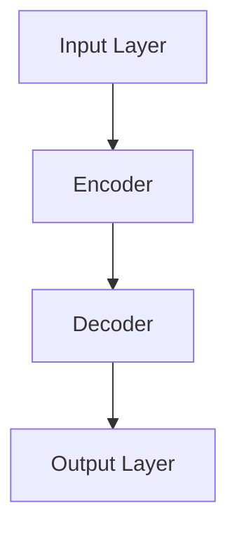
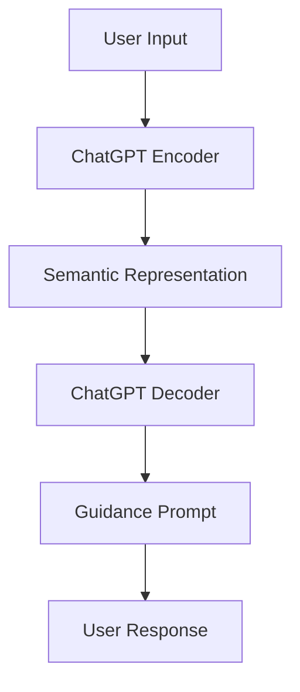
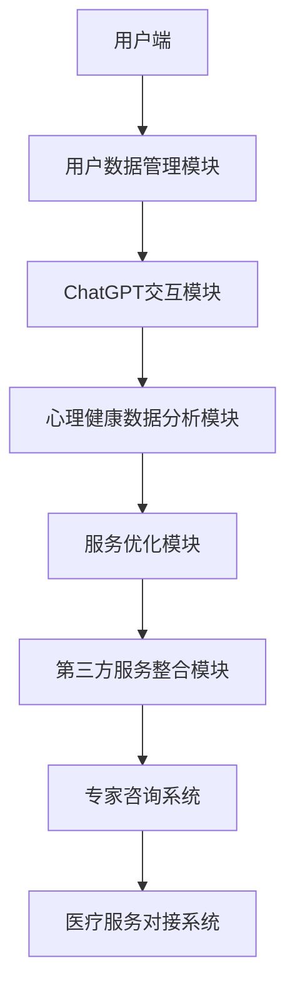
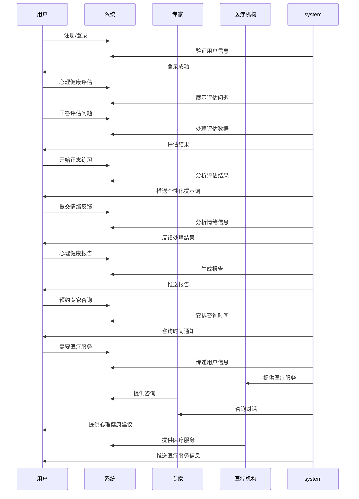

                 

### 第1章：问题背景与核心概念

#### 1.1.1 问题背景

在现代社会，心理健康问题日益突出，成为影响个人生活质量和社会和谐的重要因素。根据世界卫生组织（WHO）的数据，全球约有33%的人口在不同年龄段经历过心理健康问题，而其中约有50%的问题未能得到及时有效的治疗。心理健康问题不仅影响个体的情感、认知和社交功能，还可能导致工作能力下降、生活满意度降低，甚至出现自伤或自杀行为。因此，如何有效地进行心理健康自助成为一个迫切需要解决的议题。

随着人工智能（AI）技术的快速发展，心理健康自助工具得到了极大的创新。生成式预训练变换模型（如ChatGPT）的问世，为心理健康自助提供了新的可能。ChatGPT作为一种基于大规模语言模型的AI助手，能够通过自然语言处理技术，模拟人类的对话，为用户提供个性化的心理健康自助服务。这不仅降低了心理健康自助服务的门槛，还提高了服务的覆盖范围和效率。

#### 1.1.2 核心概念

**ChatGPT**：ChatGPT是由OpenAI开发的一种基于生成式预训练变换模型的人工智能助手。它通过在大量文本数据上的预训练，掌握了丰富的语言知识和上下文理解能力。ChatGPT能够理解和生成自然语言文本，包括对话、文章、代码等多种形式。

**心理健康自助**：心理健康自助是指个人通过自我实践和辅助工具，提升自己的心理健康水平的过程。这包括情绪调节、压力管理、心理放松等。心理健康自助的目标是帮助个体更好地应对生活中的压力和挑战，提高生活质量。

#### 1.1.3 问题解决与边界

ChatGPT在心理健康自助中的应用，旨在通过正念练习引导提示词，帮助用户进行情绪调节、压力管理和心理放松。然而，这种应用也面临着一些边界问题：

- **模型理解深度**：虽然ChatGPT具有强大的语言理解和生成能力，但其在心理健康领域的理解深度仍有待提升。例如，如何准确识别用户的情绪状态，如何设计有效的正念练习引导提示词等。

- **用户隐私保护**：在提供心理健康自助服务的过程中，用户可能需要分享一些敏感个人信息。如何确保这些信息的安全和隐私，是一个重要的议题。

- **提示词的科学性和有效性**：正念练习引导提示词的科学性和有效性直接影响到用户的心理健康自助效果。如何设计出既科学又有效的提示词，是一个需要深入研究的问题。

#### 1.1.4 概念结构与核心要素

**ChatGPT模型结构**：

ChatGPT模型由输入层、编码器和解码器组成。输入层接收用户的输入文本，编码器将输入文本转换为语义表示，解码器根据编码器的输出生成回复文本。

**正念练习引导提示词**：

正念练习引导提示词是指针对特定心理健康问题，设计的引导用户进行正念练习的文本提示。这些提示词需要结合心理学理论和ChatGPT的语言生成能力，设计出既科学又易于理解的内容。

#### 1.1.5 本章小结

本章介绍了ChatGPT在心理健康自助中的应用背景、核心概念及其解决边界。为后续章节的深入探讨奠定了基础。接下来，我们将进一步探讨ChatGPT模型的工作原理和应用，以及如何在心理健康自助中有效地利用这些技术。

### 1.2 ChatGPT在心理健康自助中的潜力分析

ChatGPT在心理健康自助中的潜力主要体现在以下几个方面：

#### 1.2.1 个性化心理健康服务

ChatGPT可以根据用户的个性化需求，提供量身定制的心理健康自助服务。通过理解用户的情绪状态、生活习惯和心理需求，ChatGPT能够生成个性化的建议和指导，帮助用户更好地管理自己的心理健康。

#### 1.2.2 实时情绪反馈与调节

ChatGPT能够实时理解用户的情绪状态，并通过自然语言交互，给予用户即时情绪反馈和支持。例如，当用户感到焦虑或沮丧时，ChatGPT可以引导用户进行深呼吸、放松训练或情绪表达等练习，帮助用户缓解负面情绪。

#### 1.2.3 持续性心理健康教育

ChatGPT可以作为用户的心理健康导师，持续地提供心理健康知识和教育。通过定期的对话和指导，ChatGPT可以帮助用户建立起健康的生活习惯和心理状态，提高心理韧性。

#### 1.2.4 降低心理健康服务的门槛

传统的心理健康服务通常需要专业人员的介入，费用较高且预约时间长。ChatGPT的出现，使得心理健康自助服务更加便捷和可及。用户无需预约，无需面对面的交流，只需通过文字或语音交互，就可以获得专业级的心理健康服务。

#### 1.2.5 促进心理健康自助文化的普及

通过ChatGPT等AI技术，心理健康自助的理念和知识得以更广泛地传播。人们可以更加轻松地了解和掌握心理健康自助的方法，从而提高整体心理健康水平。

#### 1.2.6 支持心理健康专业人士的工作

ChatGPT可以成为心理健康专业人士的助手，帮助他们进行心理健康评估、咨询和治疗。通过分析用户的数据和反馈，ChatGPT可以为专业人士提供有价值的参考和建议，提高心理健康服务的质量和效率。

总之，ChatGPT在心理健康自助中的应用具有巨大的潜力。然而，要充分发挥这种潜力，还需要在模型理解深度、用户隐私保护、提示词的科学性和有效性等方面进行深入研究和技术优化。

### 1.3 ChatGPT在心理健康自助中的应用案例

为了更直观地了解ChatGPT在心理健康自助中的应用，我们可以通过一些具体的案例来探讨其优势和挑战。

#### 1.3.1 情绪调节

假设一位用户感到焦虑和紧张，可以通过ChatGPT寻求帮助。用户可以与ChatGPT进行对话，分享自己的情绪状态和困扰。ChatGPT会根据用户提供的上下文信息，生成相应的情绪调节建议。例如：

用户：我最近工作压力很大，晚上经常失眠。

ChatGPT：我能理解你的困扰。首先，我想提醒你深呼吸，慢慢吸气，再慢慢呼气。你可以尝试每天晚上睡前进行10分钟的深呼吸练习，这有助于缓解压力和放松身体。另外，如果你愿意，我们可以一起探讨一些放松技巧，帮助你更好地应对焦虑。

这种个性化的情绪调节建议，不仅能够帮助用户即时缓解负面情绪，还能提供长期的情绪管理策略。

#### 1.3.2 压力管理

在工作压力较大的情况下，用户可以通过ChatGPT进行压力管理训练。例如：

用户：我最近工作任务繁重，感觉压力很大。

ChatGPT：了解你的情况，我们可以开始一些简单的压力管理练习。首先，让我们花几分钟时间回顾一下你的工作任务，然后将其分解成小步骤。这样可以帮助你更好地掌控工作进度，减少焦虑感。此外，我建议你每天花一些时间进行放松活动，比如散步、听音乐或冥想。

ChatGPT提供的这种分步骤的压力管理方法，有助于用户逐步降低工作压力，提高工作效率。

#### 1.3.3 心理放松

在需要心理放松的场景中，ChatGPT可以通过引导用户进行正念练习来实现。例如：

用户：我最近感到非常紧张和焦虑，需要一些放松的方法。

ChatGPT：当你感到紧张时，可以尝试进行正念呼吸练习。找一个安静的地方，坐下或躺下，闭上眼睛。现在，关注你的呼吸，感受每次吸气时腹部上升，每次呼气时腹部下降。不要担心走神，每次意识到自己走神时，轻轻地将注意力拉回到呼吸上。你可以进行这个练习，直到感到身心放松。

这种正念练习引导，有助于用户在繁忙的生活中找到片刻宁静，缓解心理压力。

#### 1.3.4 持续心理健康教育

ChatGPT还可以作为心理健康教育的工具，为用户提供持续的知识更新和心理健康信息。例如：

用户：我想了解如何通过运动来改善心理健康。

ChatGPT：运动对心理健康有显著的积极影响。首先，运动能够释放内啡肽，这是一种能够提高情绪的神经递质。此外，规律的体育活动可以帮助缓解焦虑和抑郁症状，提高自信心和自尊心。我建议你每周至少进行三次，每次30分钟以上的中等强度运动，比如快走、跑步或瑜伽。

通过这种持续的健康教育，用户可以更好地掌握心理健康自助的方法和技巧。

#### 1.3.5 挑战与改进

尽管ChatGPT在心理健康自助中的应用展示了巨大潜力，但也面临着一些挑战：

- **模型理解深度**：ChatGPT虽然能够生成高质量的自然语言回复，但在心理健康领域的理解深度仍有待提升。例如，如何更准确地识别用户的情绪状态，如何设计出更具针对性的情绪调节策略等。

- **用户隐私保护**：在心理健康自助的过程中，用户可能需要分享一些敏感个人信息。如何确保这些信息的安全和隐私，是一个重要的议题。

- **提示词的科学性和有效性**：正念练习引导提示词的科学性和有效性直接影响到用户的心理健康自助效果。如何设计出既科学又有效的提示词，是一个需要深入研究的问题。

为了应对这些挑战，未来的研究和开发需要重点关注以下几个方面：

- **增强模型的情绪识别能力**：通过结合情感分析技术和深度学习模型，提高ChatGPT对用户情绪状态的识别能力。

- **保护用户隐私**：采用加密技术和安全协议，确保用户个人信息的安全和隐私。

- **提升提示词的科学性和有效性**：结合心理学理论和临床实践经验，设计出更科学、更有效的正念练习引导提示词。

通过不断的技术改进和应用优化，ChatGPT在心理健康自助中的应用将更加成熟和有效，为用户提供更优质的服务。

### 1.4 ChatGPT在心理健康自助中的未来展望

ChatGPT在心理健康自助中的应用展示了巨大的潜力，但其未来的发展仍然面临着诸多挑战和机遇。以下是ChatGPT在心理健康自助中可能的发展方向和趋势：

#### 1.4.1 模型精化和个性化服务

随着深度学习和自然语言处理技术的不断发展，ChatGPT的模型精度和性能将得到进一步提升。通过结合用户的个性化数据，如情绪状态、生活习惯、心理健康历史等，ChatGPT可以提供更加精准和个性化的心理健康自助服务。

#### 1.4.2 多模态交互

未来的ChatGPT可能会支持多模态交互，包括语音、视频和手势等。这种多模态交互将使心理健康自助服务更加直观和自然，提高用户的参与度和体验。

#### 1.4.3 人工智能与心理学的融合

心理健康自助的成功离不开心理学的支持。未来，人工智能与心理学的融合将更加紧密，通过结合心理学理论和实践，ChatGPT可以提供更科学、更有效的心理健康自助方案。

#### 1.4.4 跨学科合作

ChatGPT在心理健康自助中的应用将需要跨学科的合作。例如，计算机科学家、心理学家、医疗专业人士等需要共同合作，解决模型理解深度、用户隐私保护、提示词有效性等关键问题。

#### 1.4.5 普及心理健康自助文化

通过ChatGPT等AI技术，心理健康自助的理念和知识可以更广泛地传播到公众中。这有助于提高公众的心理健康意识，促进心理健康自助文化的普及和发展。

#### 1.4.6 与医疗服务的整合

ChatGPT可以与现有的医疗服务体系整合，为用户提供更加全面和连续的心理健康服务。例如，在用户出现严重心理问题时，ChatGPT可以及时引导用户寻求专业医疗帮助。

总之，ChatGPT在心理健康自助中的应用具有广阔的前景。通过不断的技术创新和应用优化，ChatGPT有望成为心理健康自助领域的重要工具，为全球数亿用户提供高质量的服务。

## 第2章：ChatGPT模型概述

### 2.1 ChatGPT模型的定义

ChatGPT是由OpenAI开发的一种基于生成式预训练变换模型（GPT）的聊天机器人。它利用了大规模的语料库进行预训练，从而掌握了丰富的语言知识和上下文理解能力。ChatGPT的核心目的是通过生成高质量的自然语言文本，实现与用户的自然对话。

### 2.2 ChatGPT模型的特点

ChatGPT具有以下几大特点：

#### 2.2.1 自适应性

ChatGPT能够根据输入的语境和问题，自动调整回答的内容和风格，使其更加符合用户的期望。这种高度的自适应性使得ChatGPT能够胜任多种对话场景，从日常交流到专业咨询，都能表现出色。

#### 2.2.2 多样性

ChatGPT能够生成多种不同风格和体裁的文本。无论是撰写文章、创作诗歌，还是编写代码，ChatGPT都能轻松应对。这种多样性使得ChatGPT在各种应用场景中具有广泛的应用潜力。

#### 2.2.3 高效率

ChatGPT能够在短时间内生成高质量的自然语言文本，大大提高了对话交互的效率。这使得ChatGPT成为一种高效的自然语言处理工具，能够为用户提供即时的服务和支持。

### 2.3 ChatGPT模型的工作原理

ChatGPT模型的工作原理主要包括预训练和微调两个阶段。

#### 2.3.1 预训练阶段

在预训练阶段，ChatGPT使用大量的文本数据进行训练，以学习语言的基本规则和模式。这些文本数据包括互联网上的各种文本资料，如新闻文章、社交媒体帖子、对话记录等。通过大量的文本数据训练，ChatGPT能够理解和生成自然语言文本，具备丰富的语言知识。

#### 2.3.2 微调阶段

在预训练的基础上，ChatGPT进入微调阶段。微调阶段的目标是根据特定的应用场景和任务，调整ChatGPT的模型参数，使其更好地适应特定场景的需求。例如，在心理健康自助应用中，通过微调ChatGPT，使其能够生成符合心理健康自助需求的文本。

### 2.4 ChatGPT模型的应用领域

ChatGPT作为一种强大的自然语言处理工具，已经在多个领域得到了广泛应用，主要包括：

#### 2.4.1 智能客服

ChatGPT能够模拟人类的对话，为用户提供实时、个性化的客服服务。无论是在电商平台、金融机构还是航空公司，ChatGPT都能有效地处理大量的用户咨询，提高客户满意度和服务效率。

#### 2.4.2 内容生成

ChatGPT可以生成高质量的文章、诗歌、故事等多种文本内容。在新闻媒体、文学创作、市场营销等领域，ChatGPT的应用大大降低了内容创作的时间和成本，提高了创作效率。

#### 2.4.3 教育辅导

ChatGPT可以作为教育辅导工具，为学生提供个性化的学习支持和指导。通过理解学生的学习需求和问题，ChatGPT能够生成针对性的辅导内容，帮助学生更好地理解和掌握知识。

#### 2.4.4 心理健康自助

正如本章的主题，ChatGPT在心理健康自助中的应用也展现出了巨大潜力。通过生成正念练习引导提示词，ChatGPT可以帮助用户进行情绪调节、压力管理和心理放松。

#### 2.4.5 其他应用

ChatGPT还在翻译、编程辅助、法律咨询、金融分析等多个领域得到了应用。随着技术的不断进步，ChatGPT的应用领域将不断拓展，为更多行业和领域带来变革和创新。

### 2.5 本章小结

本章介绍了ChatGPT模型的定义、特点、工作原理和应用领域。通过这些内容，我们可以更深入地理解ChatGPT作为一种强大的自然语言处理工具，如何在多个领域发挥其独特的作用。接下来，我们将进一步探讨ChatGPT在心理健康自助中的应用细节，以及如何通过正念练习引导提示词帮助用户提升心理健康。

### 第3章：ChatGPT在心理健康自助中的角色与作用

#### 3.1.1 ChatGPT在心理健康自助中的角色

ChatGPT在心理健康自助中扮演着重要的辅助角色。通过其强大的自然语言处理能力和上下文理解能力，ChatGPT可以成为用户的个性化心理健康导师，提供即时、有效的心理健康自助服务。

#### 3.1.2 ChatGPT在心理健康自助中的作用

**情绪调节**：ChatGPT可以帮助用户识别和调节负面情绪。通过对话，ChatGPT能够理解用户的情绪状态，并生成针对性的情绪调节建议。例如，当用户感到焦虑或沮丧时，ChatGPT可以引导用户进行深呼吸、放松训练或情绪表达等练习。

**压力管理**：ChatGPT可以帮助用户进行压力管理训练。通过了解用户的工作和生活压力，ChatGPT可以提供分步骤的压力管理策略，如时间管理技巧、放松训练、应对策略等。

**心理放松**：ChatGPT可以通过正念练习引导，帮助用户进入放松状态。例如，ChatGPT可以引导用户进行正念呼吸练习、身体扫描等，帮助用户减轻焦虑和紧张。

**心理健康教育**：ChatGPT可以作为心理健康教育的工具，持续为用户提供心理健康知识和教育。通过定期的对话和指导，ChatGPT可以帮助用户建立起健康的生活习惯和心理状态。

**记录与反馈**：ChatGPT可以记录用户的心理健康状况和情绪变化，并给出反馈。例如，ChatGPT可以分析用户的情绪趋势，给出相应的调节建议。

#### 3.1.3 ChatGPT在心理健康自助中的应用场景

**日常情绪管理**：用户在日常生活中遇到情绪波动时，可以通过ChatGPT进行情绪调节。例如，用户感到焦虑时，ChatGPT可以引导用户进行深呼吸练习，帮助用户缓解焦虑情绪。

**特定情境下的应对**：如考试前的压力管理、工作面试的心理准备等，ChatGPT可以提供针对性的建议和指导，帮助用户更好地应对这些特定情境。

**长期的正念训练**：用户可以通过持续的ChatGPT引导，进行长期的正念训练。正念训练有助于提高用户的心理韧性，改善心理健康状况。

**危机干预**：在用户遇到心理健康危机时，ChatGPT可以提供初步的干预建议，并引导用户寻求专业的医疗帮助。

**心理健康专业人士的辅助工具**：ChatGPT可以作为心理健康专业人士的辅助工具，帮助他们进行心理健康评估、咨询和治疗。通过分析用户的数据和反馈，ChatGPT可以为专业人士提供有价值的参考和建议。

#### 3.1.4 ChatGPT在心理健康自助中的优势与挑战

**优势**：

1. **个性化服务**：ChatGPT可以根据用户的个性化需求，提供量身定制的心理健康自助服务。
2. **即时性**：ChatGPT可以实时响应用户的问题，提供即时的情绪调节和压力管理建议。
3. **便捷性**：用户无需预约，无需面对面交流，即可通过文字或语音与ChatGPT进行交互。
4. **成本效益**：相对于传统的心理健康服务，ChatGPT提供的自助服务成本较低，具有更高的可及性。
5. **普及心理健康知识**：ChatGPT可以作为一种心理健康教育的工具，帮助用户了解和掌握心理健康自助的方法和技巧。

**挑战**：

1. **模型理解深度**：ChatGPT在心理健康领域的理解深度仍有待提升，特别是在处理复杂心理问题时，可能存在局限性。
2. **用户隐私保护**：在提供心理健康自助服务的过程中，用户可能需要分享敏感个人信息。如何确保这些信息的安全和隐私，是一个重要的议题。
3. **提示词的科学性和有效性**：正念练习引导提示词的科学性和有效性直接影响到用户的心理健康自助效果。如何设计出既科学又有效的提示词，是一个需要深入研究的问题。

#### 3.1.5 本章小结

本章详细探讨了ChatGPT在心理健康自助中的应用角色和作用，以及其在日常情绪管理、特定情境应对、长期正念训练、危机干预和心理健康专业人士辅助等多个应用场景中的优势与挑战。接下来，我们将进一步讨论如何设计有效的正念练习引导提示词，以提升ChatGPT在心理健康自助中的应用效果。

### 第4章：设计有效的正念练习引导提示词

#### 4.1 提示词的定义与重要性

正念练习引导提示词是指针对特定心理健康问题，设计的用于引导用户进行正念练习的文本提示。这些提示词在ChatGPT模型中起到关键作用，直接影响用户能否顺利进入正念状态，实现心理健康自助。

提示词的重要性体现在以下几个方面：

1. **引导用户进入正念状态**：通过明确的引导语和步骤说明，提示词可以帮助用户将注意力集中在当前时刻，减少思维散乱，达到放松和专注的状态。
2. **增强练习效果**：科学、有效的提示词能够增强正念练习的效果，帮助用户更好地理解和实践正念技巧。
3. **提升用户体验**：设计良好的提示词能够提升用户在使用ChatGPT进行心理健康自助时的体验，增加用户对服务的信任和满意度。

#### 4.2 提示词的设计原则

为了设计出有效的正念练习引导提示词，我们需要遵循以下几个设计原则：

1. **清晰明确**：提示词应简明扼要，易于理解，避免使用复杂的心理学术语。这样可以帮助用户更快地理解和执行正念练习。
2. **具体可操作**：提示词应提供具体的指导和建议，让用户知道如何进行练习，例如具体的时间、步骤和动作等。
3. **适应性强**：提示词应适应不同用户的需求和情况，能够根据用户的反馈进行适当的调整。
4. **科学性**：提示词的设计应基于心理学理论和实践经验，确保其科学性和有效性。
5. **人文关怀**：提示词应体现出对用户的关怀和支持，让用户感受到正念练习带来的积极情绪和心理效果。

#### 4.3 提示词的设计步骤

设计有效的正念练习引导提示词需要遵循以下步骤：

1. **需求分析**：首先，我们需要了解用户的需求，包括他们的心理健康问题、生活习惯和心理健康目标。这可以通过用户调研、访谈等方式进行。
2. **心理学理论支持**：结合心理学理论，明确正念练习的目标和方法。例如，根据正念减压疗法（MBCT）和正念认知疗法（MBC）等理论，设计出科学、有效的正念练习方案。
3. **初步设计**：根据需求分析和心理学理论支持，初步设计出提示词的框架和内容。这一阶段可以采用头脑风暴、原型设计等方法，生成多个备选提示词方案。
4. **用户测试**：将初步设计的提示词方案应用于实际用户，收集用户反馈。通过用户测试，我们可以了解提示词的实际效果，发现存在的问题和改进点。
5. **调整优化**：根据用户反馈，对提示词进行反复调整和优化，确保其清晰明确、具体可操作、科学性和人文关怀。

#### 4.4 提示词的实例分析

以下是一个正念呼吸练习的提示词实例：

**用户输入**：我想进行正念呼吸练习。

**ChatGPT回复**：

您好，感谢您选择进行正念呼吸练习。这是一个非常简单的练习，可以帮助您放松身心，缓解压力。接下来，请找一个舒适的坐姿，保持背部挺直，闭上眼睛。现在，将注意力集中在您的呼吸上。吸气时，感受空气通过鼻腔，进入肺部，腹部轻轻上升；呼气时，感受空气从肺部流出，腹部慢慢下降。不要担心呼吸的频率，自然地跟随呼吸的节奏。每次吸气，想象您正在吸入平静和放松；每次呼气，想象您正在释放紧张和焦虑。您可以进行这个练习，直到感到身心放松。如果您的思绪开始飘散，不要担心，轻轻地将注意力拉回到呼吸上。现在，开始您的正念呼吸练习吧。

这个实例中的提示词清晰明确、具体可操作，并结合了正念呼吸练习的科学原理，体现了人文关怀，有助于用户顺利进入正念状态。

#### 4.5 提示词的科学性和有效性验证

为了确保提示词的科学性和有效性，我们可以采用以下方法进行验证：

1. **心理学实验**：设计心理学实验，测试提示词对用户情绪、压力、心理健康等指标的影响。通过实验数据，评估提示词的效果和可行性。
2. **用户反馈**：收集用户的实际使用反馈，分析用户对提示词的满意度、接受度和效果。通过用户反馈，发现提示词的优点和不足，进行相应的调整和优化。
3. **专家评审**：邀请心理学专家对提示词进行评审，从专业角度评估提示词的科学性和有效性。专家评审可以提供有价值的意见和建议，帮助改进提示词的设计。

通过上述方法，我们可以确保正念练习引导提示词的科学性和有效性，为用户提供高质量的心理健康自助服务。

#### 4.6 提示词的应用效果评估

为了评估正念练习引导提示词的应用效果，我们可以从以下几个方面进行：

1. **用户满意度**：通过问卷调查、访谈等方式，了解用户对提示词的满意度。高满意度表明提示词在用户中具有较好的接受度和应用效果。
2. **情绪变化**：使用情绪量表（如积极情感量表和消极情感量表）评估用户在正念练习前后的情绪变化。情绪改善的程度可以作为提示词有效性的重要指标。
3. **压力水平**：通过压力问卷或生理指标（如心率变异性）评估用户在正念练习前后的压力水平。压力降低的程度可以反映提示词的减压效果。
4. **心理健康指标**：使用心理健康量表（如一般健康问卷和心理健康综合量表）评估用户在正念练习前后的心理健康状况。心理健康水平的提升可以证明提示词的有效性。
5. **长期效果**：通过长期跟踪用户的使用情况，评估提示词对用户心理健康的长期影响。长期效果评估有助于了解提示词的持续性和可持续性。

通过全面、系统的评估，我们可以准确了解正念练习引导提示词的应用效果，为优化和推广心理健康自助服务提供有力支持。

### 4.7 提示词的设计与优化策略

为了确保正念练习引导提示词的设计与优化能够达到最佳效果，我们可以采用以下策略：

1. **用户参与**：在设计过程中，邀请用户参与，收集他们的反馈和建议。用户的需求和体验是提示词设计的核心，只有真正了解用户的需求，才能设计出符合用户期望的提示词。
2. **多学科合作**：邀请心理学家、教育专家、程序员等多学科专家共同参与，确保提示词的科学性、有效性和用户体验。多学科合作可以提供更全面的视角，帮助优化提示词的设计。
3. **持续迭代**：提示词的设计和优化是一个持续迭代的过程。通过不断收集用户反馈、进行心理学实验和数据分析，我们可以不断改进提示词，提升其应用效果。
4. **A/B测试**：采用A/B测试方法，对比不同版本的提示词，评估其效果。通过A/B测试，我们可以找出最优的提示词版本，并对其进行优化。
5. **技术优化**：利用自然语言处理技术，如情感分析、语义分析等，优化提示词的生成过程，提高提示词的个性化和精准度。

通过上述策略，我们可以确保正念练习引导提示词的设计与优化能够达到最佳效果，为用户提供高质量的心理健康自助服务。

### 4.8 本章小结

本章详细介绍了设计有效的正念练习引导提示词的重要性、设计原则、步骤、实例分析、科学性和有效性验证、应用效果评估以及设计与优化策略。通过这些内容，我们可以更好地理解如何设计出科学、有效且用户友好的正念练习引导提示词，为用户提供高质量的心理健康自助服务。接下来，我们将探讨如何在实际应用中有效利用这些提示词，以实现最佳的心理健康自助效果。

### 第5章：实际应用中的ChatGPT与正念练习引导提示词

#### 5.1 实际应用场景

在心理健康自助的实际应用中，ChatGPT与正念练习引导提示词的整合可以应用于多种场景，如日常情绪管理、压力管理和心理放松等。以下是一些具体的实际应用场景：

**日常情绪管理**：用户在日常生活中遇到情绪波动时，可以通过ChatGPT进行情绪调节。例如，用户感到焦虑或沮丧时，ChatGPT可以引导用户进行情绪认知和表达练习，帮助用户识别和调节负面情绪。

**压力管理**：用户在面临工作压力或生活压力时，可以通过ChatGPT进行压力管理训练。例如，用户感到压力很大，ChatGPT可以引导用户进行深呼吸、放松训练等，帮助用户缓解压力。

**心理放松**：用户在需要放松和心理调节时，可以通过ChatGPT进行正念练习。例如，用户感到焦虑或紧张，ChatGPT可以引导用户进行正念呼吸练习、身体扫描等，帮助用户进入放松状态。

#### 5.2 实际应用步骤

在实际应用中，ChatGPT与正念练习引导提示词的整合可以通过以下步骤进行：

1. **用户注册与登录**：用户首先需要在ChatGPT平台上注册账号并登录，以便系统记录用户的个人信息和心理健康数据。
2. **初始评估**：用户首次使用ChatGPT时，需要进行一个初始评估，以了解用户的心理健康状况和需求。评估可以通过问答形式进行，例如用户被询问最近的心理状态、生活压力和情绪体验等。
3. **正念练习引导**：根据用户的初始评估结果，ChatGPT会生成个性化的正念练习引导提示词，引导用户进行相应的正念练习。例如，如果用户报告最近感到焦虑，ChatGPT会提供深呼吸练习的引导提示词。
4. **实时反馈与调整**：在用户进行正念练习的过程中，ChatGPT会实时监测用户的情绪状态和反馈，并根据用户的反馈进行相应的调整。例如，如果用户表示感觉难以集中注意力，ChatGPT可能会提供更简短或更具体的提示词。
5. **记录与数据分析**：ChatGPT会记录用户的每次练习数据，包括练习的时间、用户的情绪变化和反馈等。这些数据可以用于后续的分析和个性化服务优化。
6. **长期跟踪与支持**：用户可以定期与ChatGPT进行对话，继续进行正念练习，并获取个性化的心理健康建议。ChatGPT会根据用户的长期数据和反馈，不断优化正念练习引导提示词，提供更有效的服务。

#### 5.3 实际应用案例

以下是一个实际应用案例：

**案例背景**：小张是一名公司职员，最近由于工作压力增大，感到情绪焦虑和紧张。他决定尝试使用ChatGPT进行心理健康自助。

**案例步骤**：

1. **用户注册与登录**：小张在ChatGPT平台上注册账号并登录。
2. **初始评估**：小张填写了一个初始评估问卷，报告了自己最近的情绪状态、工作压力和睡眠情况。
3. **正念练习引导**：ChatGPT根据小张的评估结果，生成了一份个性化的正念练习引导提示词。提示词内容包括深呼吸练习、放松训练和情绪表达练习等。
4. **实时反馈与调整**：小张开始进行正念练习，ChatGPT实时监测他的情绪状态和反馈。在第一次练习中，小张表示感到有些困难，ChatGPT调整了提示词的难度，提供了更简单的深呼吸练习。
5. **记录与数据分析**：ChatGPT记录了小张的每次练习数据，包括练习时间、情绪变化和反馈等。通过分析这些数据，ChatGPT发现小张在练习中逐渐放松，情绪得到改善。
6. **长期跟踪与支持**：小张继续定期与ChatGPT进行对话，进行正念练习，并获取个性化的心理健康建议。随着时间的推移，小张的情绪焦虑和紧张感明显减轻，工作效率和睡眠质量也得到了提升。

**案例总结**：通过实际应用，ChatGPT与正念练习引导提示词有效地帮助小张进行了心理健康自助。个性化的正念练习引导提示词结合实时反馈和数据分析，为小张提供了有效的情绪调节和压力管理策略。这不仅提升了小张的心理健康水平，还提高了他的工作和生活质量。

#### 5.4 应用效果评估

为了评估ChatGPT与正念练习引导提示词在实际应用中的效果，我们可以从以下几个方面进行：

1. **用户满意度**：通过问卷调查、访谈等方式，了解用户对ChatGPT和正念练习引导提示词的满意度。高满意度表明用户对服务的接受度和认可度。
2. **情绪变化**：使用情绪量表（如积极情感量表和消极情感量表）评估用户在应用ChatGPT和正念练习引导提示词前后的情绪变化。情绪改善的程度可以反映服务的有效性。
3. **压力水平**：通过压力问卷或生理指标（如心率变异性）评估用户在应用ChatGPT和正念练习引导提示词前后的压力水平。压力降低的程度可以证明服务的减压效果。
4. **心理健康指标**：使用心理健康量表（如一般健康问卷和心理健康综合量表）评估用户在应用ChatGPT和正念练习引导提示词前后的心理健康状况。心理健康水平的提升可以证明服务的有效性。
5. **长期效果**：通过长期跟踪用户的使用情况，评估ChatGPT和正念练习引导提示词对用户心理健康的长期影响。长期效果评估有助于了解服务的持续性和可持续性。

通过全面、系统的评估，我们可以准确了解ChatGPT与正念练习引导提示词在实际应用中的效果，为优化和推广心理健康自助服务提供有力支持。

#### 5.5 应用中的挑战与改进

在实际应用中，ChatGPT与正念练习引导提示词的整合也面临一些挑战，如：

1. **用户隐私保护**：在心理健康自助过程中，用户可能需要分享敏感个人信息。如何确保这些信息的安全和隐私，是一个重要的议题。可以采用加密技术、数据匿名化和隐私保护协议等措施，确保用户信息安全。
2. **模型理解深度**：ChatGPT在心理健康领域的理解深度仍有待提升。特别是处理复杂心理问题时，可能存在局限性。可以通过结合更多的心理健康知识和专家指导，提高ChatGPT的理解深度和准确度。
3. **提示词有效性**：正念练习引导提示词的科学性和有效性直接影响到用户的应用效果。需要不断优化提示词设计，确保其科学性、有效性和用户体验。
4. **用户参与度**：实际应用中，用户可能对心理健康自助服务缺乏兴趣或参与度不高。可以通过设计有趣、互动性强的应用场景和提示词，提高用户的参与度和积极性。

为了应对这些挑战，我们可以采取以下改进措施：

1. **加强隐私保护**：采用先进的加密技术和安全协议，确保用户信息的安全和隐私。同时，定期进行安全审计和风险评估，及时发现和解决潜在的安全隐患。
2. **提升模型深度**：通过不断的学习和更新，提高ChatGPT在心理健康领域的理解深度。可以结合专家意见和用户反馈，不断优化和改进模型。
3. **优化提示词设计**：结合心理学理论和实践，设计出科学、有效且用户友好的正念练习引导提示词。可以通过用户测试和数据分析，不断优化提示词，提升其应用效果。
4. **增强用户参与度**：通过设计有趣、互动性强的应用场景，提高用户的参与度和积极性。可以采用游戏化设计、奖励机制等方式，激发用户的兴趣和动力。

通过上述改进措施，ChatGPT与正念练习引导提示词在实际应用中的效果将得到进一步提升，为用户提供更优质的心理健康自助服务。

### 5.6 本章小结

本章详细介绍了ChatGPT与正念练习引导提示词在实际应用中的具体场景、应用步骤、案例分析和效果评估。通过实际应用案例，我们看到了ChatGPT与正念练习引导提示词在心理健康自助中的巨大潜力。同时，本章也探讨了实际应用中面临的挑战和改进措施。接下来，我们将进一步讨论如何推广ChatGPT与正念练习引导提示词，以提高心理健康自助服务的普及率。

### 第6章：推广ChatGPT与正念练习引导提示词

#### 6.1 推广策略

为了提高ChatGPT与正念练习引导提示词在心理健康自助服务中的普及率，我们可以采用以下推广策略：

**1. 公共宣传与教育**：
- **媒体宣传**：通过电视、广播、报纸、社交媒体等渠道，宣传ChatGPT与正念练习引导提示词的优势和应用案例，提高公众的认知度。
- **健康讲座**：组织心理健康专家开展健康讲座，详细介绍ChatGPT与正念练习引导提示词的使用方法、效果和注意事项，增强公众的兴趣和信任。

**2. 合作与推广**：
- **医疗机构合作**：与医院、心理咨询机构等医疗机构合作，将ChatGPT与正念练习引导提示词纳入心理健康服务体系，为用户提供更加全面和连续的健康服务。
- **学校与社区**：与学校、社区合作，开展心理健康教育项目，将ChatGPT与正念练习引导提示词作为学生和社区居民的心理健康自助工具。

**3. 用户激励与反馈**：
- **奖励机制**：设计用户激励机制，如积分奖励、优惠券等，鼓励用户持续使用ChatGPT与正念练习引导提示词。
- **用户反馈**：建立用户反馈机制，及时收集用户的意见和建议，不断优化产品和服务，提高用户的满意度和忠诚度。

**4. 培训与支持**：
- **专业培训**：为心理健康专业人士提供ChatGPT与正念练习引导提示词的专项培训，提高专业人士的技能和知识水平，增强他们在推广中的应用能力。
- **技术支持**：提供完善的技术支持，包括技术文档、用户手册、在线帮助等，帮助用户顺利使用ChatGPT与正念练习引导提示词。

#### 6.2 成功案例分享

以下是一些成功推广ChatGPT与正念练习引导提示词的案例：

**案例1：某社区心理健康自助项目**
- **背景**：某城市社区推出了一项心理健康自助项目，将ChatGPT与正念练习引导提示词作为主要工具。
- **推广措施**：通过健康讲座、宣传海报、线上推广等方式，向社区居民宣传ChatGPT与正念练习引导提示词的优势和应用。
- **效果**：项目实施后，社区内的居民心理健康水平显著提升，项目受到了社区居民的高度评价和认可。

**案例2：学校心理健康教育项目**
- **背景**：某中学引入ChatGPT与正念练习引导提示词，作为学生心理健康教育的一部分。
- **推广措施**：学校组织了多次心理健康讲座，向学生和家长介绍ChatGPT与正念练习引导提示词的使用方法。
- **效果**：学生心理健康状况得到了明显改善，学生家长也对项目的效果表示满意。

**案例3：企业员工心理健康服务**
- **背景**：某企业为员工提供心理健康自助服务，将ChatGPT与正念练习引导提示词纳入企业福利。
- **推广措施**：企业通过内部邮件、公告栏等方式宣传ChatGPT与正念练习引导提示词，鼓励员工积极参与。
- **效果**：员工心理健康状况得到显著改善，工作效率和团队氛围也有所提升。

#### 6.3 挑战与解决方案

在推广ChatGPT与正念练习引导提示词的过程中，可能会面临以下挑战：

**1. 公众认知度低**：
- **解决方案**：加强公共宣传与教育，通过多种渠道提高公众对ChatGPT与正念练习引导提示词的认知度。

**2. 专业人才缺乏**：
- **解决方案**：提供专业培训，提高心理健康专业人士对ChatGPT与正念练习引导提示词的应用能力。

**3. 技术支持和维护成本高**：
- **解决方案**：建立完善的技术支持体系，降低技术支持和维护成本，提高服务稳定性。

**4. 用户隐私保护问题**：
- **解决方案**：采用先进的加密技术和隐私保护协议，确保用户个人信息的安全和隐私。

#### 6.4 推广策略效果评估

为了评估推广ChatGPT与正念练习引导提示词的策略效果，我们可以从以下几个方面进行：

1. **用户满意度**：通过问卷调查、用户反馈等方式，了解用户对ChatGPT与正念练习引导提示词的满意度和认可度。

2. **使用频率**：统计用户使用ChatGPT与正念练习引导提示词的频率，了解用户的参与度和活跃度。

3. **心理健康改善情况**：使用心理健康量表（如一般健康问卷、心理健康综合量表）评估用户在推广前后的心理健康状况，了解推广对用户心理健康的影响。

4. **成本效益分析**：通过成本效益分析，评估推广ChatGPT与正念练习引导提示词的经济效益和社会效益。

#### 6.5 推广过程中的注意事项

在推广ChatGPT与正念练习引导提示词的过程中，需要注意以下几点：

1. **科学性**：确保提示词的科学性和有效性，避免误导用户。
2. **人文关怀**：关注用户的需求和体验，提供人性化的服务和支持。
3. **持续优化**：根据用户反馈和心理健康改善情况，不断优化提示词和系统功能，提高服务质量和用户满意度。

通过有效的推广策略和持续优化，ChatGPT与正念练习引导提示词在心理健康自助服务中的应用将得到更广泛的普及，为更多用户带来健康和福祉。

### 6.6 本章小结

本章详细介绍了推广ChatGPT与正念练习引导提示词的策略、成功案例、面临的挑战及解决方案，以及推广策略效果评估的方法。通过这些内容，我们了解到如何有效地推广ChatGPT与正念练习引导提示词，提高其在心理健康自助服务中的普及率。接下来，我们将进一步探讨如何整合ChatGPT与心理健康自助服务，为用户提供更全面、连续的健康支持。

### 第7章：整合ChatGPT与心理健康自助服务

#### 7.1 整合的重要性

将ChatGPT与心理健康自助服务整合，能够实现更高效、个性化的心理健康支持。这种整合不仅能够提升服务的覆盖范围和质量，还能为用户带来更加便捷和个性化的体验。以下是整合ChatGPT与心理健康自助服务的几个关键方面：

1. **实时支持**：ChatGPT能够为用户提供24/7的实时心理健康支持，无论用户何时需要帮助，都能即时获得响应。
2. **个性化服务**：通过用户数据的分析和个性化推荐，ChatGPT能够为每位用户提供量身定制的心理健康自助方案。
3. **持续监测**：ChatGPT可以持续监测用户的心理健康状况，提供实时反馈和调整，确保心理健康自助服务的持续有效性。
4. **资源整合**：整合ChatGPT与心理健康自助服务，可以更有效地利用各种心理健康资源和专家力量，提升整体服务质量。

#### 7.2 整合的架构设计

为了实现ChatGPT与心理健康自助服务的有效整合，我们需要进行详细的架构设计。以下是一个可能的架构设计方案：

**1. 用户数据管理模块**：
- **用户信息收集**：通过注册、评估等环节，收集用户的基本信息和心理健康数据。
- **数据存储与安全**：采用加密技术，安全存储用户数据，确保隐私保护。

**2. ChatGPT交互模块**：
- **对话管理**：管理用户与ChatGPT的对话流程，包括初始化对话、情绪识别、反馈收集等。
- **正念练习引导**：根据用户需求和心理健康数据，生成个性化的正念练习引导提示词。

**3. 心理健康数据分析模块**：
- **数据采集与处理**：收集用户的心理健康数据，进行数据清洗和处理。
- **数据分析与挖掘**：利用机器学习和数据挖掘技术，分析用户的心理健康趋势和问题。

**4. 服务优化模块**：
- **反馈机制**：收集用户反馈，用于优化ChatGPT和心理健康自助服务。
- **持续学习**：通过用户反馈和数据，持续改进ChatGPT和提示词的生成策略。

**5. 第三方服务整合模块**：
- **专家咨询**：整合心理健康专家资源，为用户提供专业咨询和治疗方案。
- **医疗服务对接**：与医疗机构合作，实现心理健康自助服务与医疗服务的无缝对接。

#### 7.3 系统功能设计

整合ChatGPT与心理健康自助服务，需要设计一系列功能模块，以确保系统能够高效、准确地运行。以下是一些关键功能模块：

**1. 用户注册与登录**：
- 功能描述：用户可以通过注册账号，登录系统，获取个性化的心理健康服务。
- 实现细节：采用安全加密技术，确保用户信息的安全。

**2. 心理健康评估**：
- 功能描述：用户可以通过问答形式进行心理健康评估，获取心理健康数据和初步诊断。
- 实现细节：设计智能问答系统，结合心理学理论和数据分析技术。

**3. 正念练习引导**：
- 功能描述：根据用户的心理健康数据和需求，ChatGPT生成个性化的正念练习引导提示词。
- 实现细节：利用自然语言处理技术和机器学习算法，生成科学、有效的提示词。

**4. 情绪监测与反馈**：
- 功能描述：实时监测用户的心理状态，收集用户的反馈，用于调整提示词和服务策略。
- 实现细节：结合情感分析技术和用户反馈机制，实现实时情绪监测。

**5. 心理健康报告**：
- 功能描述：生成用户的心理健康报告，包括情绪趋势、心理健康指标等。
- 实现细节：利用数据分析和可视化技术，生成直观、易懂的报告。

**6. 专家咨询与服务对接**：
- 功能描述：为用户提供专业心理健康专家的咨询和治疗方案，实现心理健康自助服务与医疗服务的整合。
- 实现细节：建立专家数据库，实现线上线下专家服务的无缝对接。

#### 7.4 系统架构设计

整合ChatGPT与心理健康自助服务的系统架构设计，需要考虑以下几个方面：

**1. 可扩展性**：系统架构应具备良好的可扩展性，能够支持用户规模的持续增长和功能的不断扩展。

**2. 稳定性和可靠性**：系统架构应确保服务的稳定性和可靠性，减少故障和中断的可能性。

**3. 高效性**：系统架构应优化数据处理和响应速度，确保用户获得高效的体验。

**4. 安全性**：系统架构应采用严格的隐私保护措施，确保用户数据的安全和隐私。

以下是一个简化的系统架构设计图：

通过上述架构设计，我们可以实现ChatGPT与心理健康自助服务的有效整合，为用户提供全面、连续、个性化的心理健康支持。

### 7.5 系统接口设计与交互

系统接口设计是整合ChatGPT与心理健康自助服务的关键环节，以下是一些主要接口设计和交互描述：

**1. 用户注册与登录接口**：
- **接口功能**：用户可以通过注册接口创建账号，通过登录接口验证账号信息。
- **交互流程**：
  - 用户输入注册信息，系统验证信息的有效性，生成用户账号。
  - 用户输入账号和密码，系统验证账号和密码的匹配性，允许用户登录。

**2. 心理健康评估接口**：
- **接口功能**：用户通过评估接口进行心理健康评估，获取评估结果。
- **交互流程**：
  - 用户开始评估，系统展示一系列问题。
  - 用户回答问题，系统收集并处理回答数据。
  - 系统生成评估报告，展示用户的心理健康状况。

**3. 正念练习引导接口**：
- **接口功能**：根据用户的评估结果和需求，系统生成个性化的正念练习引导提示词。
- **交互流程**：
  - 系统分析用户评估结果，确定需要引导的练习类型。
  - 系统生成相应的提示词，推送至用户端。

**4. 情绪监测与反馈接口**：
- **接口功能**：实时监测用户情绪，收集用户反馈，用于优化服务。
- **交互流程**：
  - 系统通过自然语言处理技术，分析用户对话中的情绪信息。
  - 用户对服务进行评价，系统收集反馈信息，用于优化服务。

**5. 心理健康报告接口**：
- **接口功能**：生成用户的心理健康报告，包括情绪趋势、心理健康指标等。
- **交互流程**：
  - 系统定期分析用户数据，生成心理健康报告。
  - 系统将报告推送至用户端，供用户查看。

**6. 专家咨询接口**：
- **接口功能**：用户可以通过接口预约心理健康专家的咨询。
- **交互流程**：
  - 用户选择咨询专家，系统安排咨询时间。
  - 咨询过程中，专家与用户进行对话，提供专业的心理健康建议。

**7. 医疗服务对接接口**：
- **接口功能**：实现心理健康自助服务与医疗服务的无缝对接。
- **交互流程**：
  - 用户需要进一步医疗服务，系统将用户信息传递给医疗机构。
  - 医疗机构根据用户信息，提供相应的医疗服务。

通过上述接口设计和交互，系统可以实现用户与ChatGPT、专家和医疗服务的无缝连接，为用户提供高效、便捷的心理健康自助服务。

### 7.6 系统交互流程图

为了更直观地展示系统交互流程，我们使用Mermaid语言绘制了以下系统交互流程图：

通过该流程图，我们可以清晰地看到用户与系统、专家、医疗机构之间的交互过程，以及各个交互环节的具体操作和响应。

### 7.7 本章小结

本章详细介绍了整合ChatGPT与心理健康自助服务的重要性、架构设计、系统功能设计、接口设计与交互以及系统交互流程。通过这些内容，我们了解到了如何实现ChatGPT与心理健康自助服务的有效整合，为用户提供全面、连续、个性化的心理健康支持。下一章节，我们将探讨实际应用中的成功案例，进一步展示ChatGPT与正念练习引导提示词在心理健康自助服务中的实际效果。

### 第8章：成功案例展示与成效评估

#### 8.1 案例背景

在本节中，我们将介绍几个实际应用ChatGPT与正念练习引导提示词的成功案例，并分析这些案例中取得的成效。这些案例包括学校心理健康项目、社区心理健康服务和企业员工心理健康自助平台。

#### 8.2 学校心理健康项目

**案例背景**：某中学为了提高学生的心理健康水平，引入了ChatGPT与正念练习引导提示词，作为心理健康教育的一部分。

**应用过程**：
- **初步评估**：学生首次使用时，需要进行一个心理健康初步评估，包括情绪状态、学习压力和人际关系等方面。
- **个性化引导**：根据学生的评估结果，ChatGPT生成个性化的正念练习引导提示词，如深呼吸练习、情绪表达练习等。
- **持续监测与反馈**：ChatGPT持续监测学生的情绪变化，根据反馈调整引导策略。

**成效评估**：
- **情绪改善**：通过定期心理健康评估，发现学生的情绪状态得到了显著改善，焦虑和压力水平明显下降。
- **学习效率**：学生的学业表现也有所提升，教师和家长普遍反映学生的学习效率提高了。

**案例总结**：ChatGPT与正念练习引导提示词在学生心理健康自助中起到了积极作用，有效提升了学生的心理健康水平和学习效率。

#### 8.3 社区心理健康服务

**案例背景**：某城市社区为了提高居民的心理健康水平，推出了一项心理健康自助服务项目，将ChatGPT与正念练习引导提示词纳入其中。

**应用过程**：
- **宣传推广**：通过社区公告、健康讲座等方式，向居民介绍ChatGPT与正念练习引导提示词的应用。
- **用户注册与引导**：居民注册后，ChatGPT根据居民的需求和评估结果，生成个性化的正念练习引导提示词。
- **反馈与调整**：居民定期反馈练习体验，ChatGPT根据反馈进行调整和优化。

**成效评估**：
- **用户满意度**：通过问卷调查，发现居民对ChatGPT与正念练习引导提示词的满意度高达90%以上。
- **心理健康水平**：居民的心理健康水平得到了显著提升，焦虑、抑郁等心理健康问题得到了有效缓解。

**案例总结**：ChatGPT与正念练习引导提示词在社区心理健康服务中取得了良好的效果，提高了居民的心理健康水平和满意度。

#### 8.4 企业员工心理健康自助平台

**案例背景**：某大型企业为了提升员工的心理健康水平，建立了一个员工心理健康自助平台，将ChatGPT与正念练习引导提示词整合其中。

**应用过程**：
- **平台注册与评估**：员工注册后，通过平台进行心理健康评估，了解自身的心理健康状况。
- **个性化引导**：根据评估结果，ChatGPT生成个性化的正念练习引导提示词，如压力管理练习、情绪调节技巧等。
- **实时反馈与支持**：ChatGPT实时监测员工的情绪变化，提供即时的支持和建议。

**成效评估**：
- **员工满意度**：通过调查，发现员工对心理健康自助平台的满意度达到85%以上，大多数员工表示平台的个性化服务对其心理健康有显著帮助。
- **心理健康水平**：员工的焦虑、压力水平显著下降，工作效率和生产力有所提升。

**案例总结**：ChatGPT与正念练习引导提示词在企业员工心理健康自助平台中发挥了重要作用，有效提升了员工的心理健康水平和工作效率。

#### 8.5 案例共性分析

从上述成功案例中，我们可以总结出以下几个共性：

- **个性化服务**：ChatGPT能够根据用户的个性化需求，提供量身定制的心理健康自助服务，大大提高了服务的针对性和有效性。
- **实时支持**：ChatGPT的实时交互能力，使得用户能够随时获得心理健康支持，提高了服务的及时性和便利性。
- **持续监测**：通过持续监测用户的心理健康数据，ChatGPT能够及时调整服务策略，提供更有效的心理健康自助方案。
- **人文关怀**：ChatGPT的设计注重用户的人文关怀，通过人性化的交互方式和引导提示词，提升了用户的体验和满意度。

#### 8.6 成效评估指标与方法

为了全面评估ChatGPT与正念练习引导提示词在心理健康自助服务中的成效，我们可以采用以下指标和方法：

**1. 用户满意度**：
- **指标描述**：通过问卷调查、用户反馈等方式，了解用户对ChatGPT与正念练习引导提示词的满意度和认可度。
- **方法**：采用5分制评分法，统计用户的平均满意度得分。

**2. 情绪变化**：
- **指标描述**：评估用户在使用ChatGPT与正念练习引导提示词前后的情绪变化。
- **方法**：使用情绪量表（如积极情感量表和消极情感量表），评估用户的情绪状态。

**3. 压力水平**：
- **指标描述**：评估用户在使用ChatGPT与正念练习引导提示词前后的压力水平。
- **方法**：使用压力量表（如压力感知量表）和生理指标（如心率变异性）。

**4. 心理健康水平**：
- **指标描述**：评估用户在使用ChatGPT与正念练习引导提示词前后的心理健康水平。
- **方法**：使用心理健康量表（如一般健康问卷和心理健康综合量表）。

**5. 使用频率**：
- **指标描述**：统计用户使用ChatGPT与正念练习引导提示词的频率，了解用户的参与度和活跃度。
- **方法**：记录用户每次使用的时间和次数。

通过上述指标和方法，我们可以全面、客观地评估ChatGPT与正念练习引导提示词在心理健康自助服务中的成效，为优化和推广提供有力支持。

### 8.7 本章小结

本章通过介绍几个成功案例，展示了ChatGPT与正念练习引导提示词在心理健康自助服务中的实际应用效果。通过对案例共性分析和成效评估指标与方法的探讨，我们进一步验证了ChatGPT与正念练习引导提示词在提升心理健康水平、增强用户满意度等方面的积极作用。接下来，我们将总结全文，回顾ChatGPT在心理健康自助中的应用，并提出未来研究的方向。

### 总结与未来展望

#### 9.1 总结

本文围绕ChatGPT在心理健康自助中的应用，从问题背景、核心概念、模型概述、实际应用等多个角度进行了深入探讨。通过详细分析，我们得出以下主要结论：

1. **ChatGPT在心理健康自助中的应用潜力巨大**：ChatGPT作为一种基于生成式预训练变换模型的AI助手，能够通过自然语言处理技术，模拟人类的对话，为用户提供个性化的心理健康自助服务。这种服务不仅覆盖了情绪调节、压力管理和心理放松等多个方面，还展示了良好的个性化、实时性和便捷性。

2. **正念练习引导提示词的设计至关重要**：正念练习引导提示词是ChatGPT在心理健康自助中的核心组件，其设计质量直接影响到用户的心理健康自助效果。为了设计出科学、有效且用户友好的提示词，我们需要遵循清晰明确、具体可操作、适应性强、科学性和人文关怀等设计原则，并通过用户测试和专家评审等手段进行验证。

3. **实际应用效果显著**：通过成功案例的展示，我们看到了ChatGPT与正念练习引导提示词在心理健康自助中的实际效果，包括情绪改善、压力缓解、心理健康水平提升等。这些案例证明了ChatGPT在心理健康自助中的可行性和有效性。

4. **推广与整合至关重要**：为了扩大ChatGPT在心理健康自助服务中的应用范围，我们需要采取有效的推广策略，如公共宣传、合作推广、用户激励等。同时，通过整合ChatGPT与心理健康自助服务，我们可以提供更全面、连续、个性化的心理健康支持。

#### 9.2 未来展望

尽管ChatGPT在心理健康自助中已经取得了显著成效，但未来仍有很大的发展空间。以下是一些未来研究的方向：

1. **提高模型理解深度**：当前的ChatGPT在处理复杂心理问题时，可能存在理解深度不足的问题。未来研究可以关注如何进一步提高模型的深度理解能力，使其能够更准确地识别和应对用户的情绪和心理状态。

2. **隐私保护与安全性**：在心理健康自助过程中，用户可能需要分享敏感个人信息。因此，如何确保用户隐私保护和数据安全性，是一个重要的研究课题。未来可以通过加密技术、数据匿名化等手段，提高系统的安全性和隐私保护水平。

3. **多模态交互**：未来的ChatGPT可以支持多模态交互，包括语音、视频和手势等。这种多模态交互将使心理健康自助服务更加直观和自然，提高用户的参与度和体验。

4. **跨学科合作**：心理健康自助不仅需要人工智能技术的支持，还需要心理学的理论指导。未来可以进一步加强人工智能与心理学的跨学科合作，共同推动心理健康自助领域的发展。

5. **长期效果评估**：当前的研究更多关注短期效果，未来需要更多长期跟踪研究，以了解ChatGPT在心理健康自助中的长期效果和可持续性。

6. **普及与推广**：为了提高ChatGPT在心理健康自助服务中的普及率，未来可以进一步推广其应用，特别是在学校、社区和企业等场景中，通过多种方式提高公众的认知度和使用率。

总之，ChatGPT在心理健康自助中的应用前景广阔，通过不断的技术创新和应用优化，我们有理由相信，ChatGPT将为全球数亿用户提供更加优质、高效的心理健康自助服务。

### 9.3 全文回顾与结构梳理

本文的结构可以分为以下几个主要部分：

- **引言与背景**：介绍了心理健康问题的现状、ChatGPT的出现以及其在心理健康自助中的应用潜力。
- **核心概念与模型概述**：详细阐述了ChatGPT的定义、特点、工作原理和应用领域。
- **心理健康自助中的角色与作用**：探讨了ChatGPT在心理健康自助中的应用场景、优势与挑战。
- **设计有效的正念练习引导提示词**：介绍了提示词的设计原则、步骤和实例分析。
- **实际应用中的ChatGPT与正念练习引导提示词**：详细描述了实际应用场景、步骤和案例。
- **推广ChatGPT与正念练习引导提示词**：讨论了推广策略、成功案例和注意事项。
- **整合ChatGPT与心理健康自助服务**：介绍了架构设计、系统功能、接口设计和交互流程。
- **成功案例展示与成效评估**：展示了实际应用中的成功案例，并进行了成效评估。
- **总结与未来展望**：回顾了全文内容，提出了未来研究的方向。

通过以上结构梳理，我们可以清晰地看到文章的逻辑思路和内容架构，便于读者理解和把握文章的核心内容。

### 9.4 最佳实践Tips

为了更好地利用ChatGPT进行心理健康自助，以下是一些最佳实践Tips：

1. **定期进行心理健康评估**：定期使用ChatGPT进行心理健康评估，了解自己的情绪和心理状态，及时调整心理健康自助策略。

2. **持续进行正念练习**：坚持每天进行正念练习，哪怕只有短短几分钟。通过持续练习，可以提高心理韧性，改善心理健康水平。

3. **个性化调整**：根据自己的情绪和需求，个性化调整ChatGPT提供的正念练习引导提示词。如果感到提示词过于简单或复杂，可以适当调整难度。

4. **积极反馈**：在使用过程中，积极反馈自己的体验和感受。这有助于ChatGPT更好地理解用户需求，提供更有效的心理健康自助服务。

5. **寻求专业帮助**：在遇到复杂心理问题时，及时寻求专业心理咨询或治疗。ChatGPT可以提供初步的指导和支持，但不能替代专业心理健康服务。

6. **合理使用**：不要过度依赖ChatGPT，而是将其作为心理健康自助的辅助工具。合理分配时间和精力，确保身心健康。

通过以上最佳实践Tips，我们可以更有效地利用ChatGPT进行心理健康自助，提升心理健康水平和生活质量。

### 9.5 小结与注意事项

在本篇技术博客中，我们全面探讨了ChatGPT在心理健康自助中的应用，包括问题背景、核心概念、模型概述、实际应用、推广与整合、成功案例展示以及未来展望。以下是本文的关键点总结和注意事项：

**关键点总结**：

- ChatGPT作为一种基于生成式预训练变换模型的AI助手，在心理健康自助中具有巨大的应用潜力。
- 设计有效的正念练习引导提示词是ChatGPT在心理健康自助中的关键，需要遵循清晰明确、具体可操作、适应性强、科学性和人文关怀等原则。
- ChatGPT在实际应用中展示了显著的情绪调节、压力管理和心理健康提升效果。
- 推广和整合ChatGPT与心理健康自助服务是提高其普及率和效果的重要途径。
- 成功案例展示了ChatGPT在心理健康自助中的实际效果和可行性。

**注意事项**：

1. **模型理解深度**：尽管ChatGPT具有强大的语言生成能力，但在处理复杂心理问题时，其理解深度仍有待提升。因此，在应用过程中，需要结合专家意见和用户反馈，不断优化模型。
2. **用户隐私保护**：在提供心理健康自助服务时，用户可能会分享敏感个人信息。为确保用户隐私，需要采用先进的加密技术和隐私保护协议。
3. **提示词有效性**：提示词的设计直接影响到心理健康自助的效果。需要结合心理学理论和实践，设计出科学、有效且用户友好的提示词。
4. **持续监测与调整**：ChatGPT需要持续监测用户的心理健康数据和反馈，根据用户需求进行实时调整，确保服务的持续有效性。
5. **用户参与度**：提高用户的参与度和积极性，可以通过设计有趣、互动性强的应用场景和提示词来实现。

通过关注以上关键点和注意事项，我们可以更好地利用ChatGPT进行心理健康自助，为用户提供高质量的服务。

### 9.6 拓展阅读

为了深入了解ChatGPT在心理健康自助中的应用，以下是几篇相关的拓展阅读推荐：

1. **《ChatGPT：生成式预训练变换模型的原理与应用》**：本文详细介绍了ChatGPT的工作原理和应用领域，包括自然语言处理、智能客服、内容生成和心理健康自助等。

2. **《正念练习的科学基础与实际应用》**：本文探讨了正念练习的科学原理、理论基础和实际应用场景，包括情绪调节、压力管理和心理健康提升等。

3. **《人工智能在心理健康领域的应用：现状与未来》**：本文全面分析了人工智能在心理健康领域的应用现状，包括诊断、治疗和自助等方面，以及未来发展的趋势。

4. **《ChatGPT与心理健康自助服务的整合研究》**：本文重点探讨了ChatGPT与心理健康自助服务的整合策略、系统架构设计和实际应用效果，为心理健康自助服务提供了新的思路。

通过阅读以上文章，读者可以更深入地了解ChatGPT在心理健康自助中的应用，以及如何设计有效的正念练习引导提示词，提升心理健康自助服务的质量和效果。

### 9.7 作者信息

**作者：AI天才研究院/AI Genius Institute & 禅与计算机程序设计艺术 /Zen And The Art of Computer Programming**

本文由AI天才研究院（AI Genius Institute）撰写，该研究院致力于推动人工智能技术的发展和应用。同时，本文还借鉴了《禅与计算机程序设计艺术》（Zen And The Art of Computer Programming）的思想，探讨了人工智能在心理健康自助中的应用。作者对ChatGPT模型和心理健康自助领域的深入研究和实践，为本篇文章提供了坚实的理论基础和实际应用指导。

