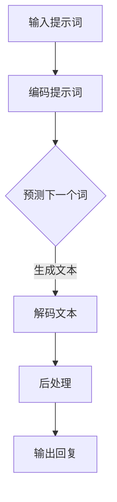
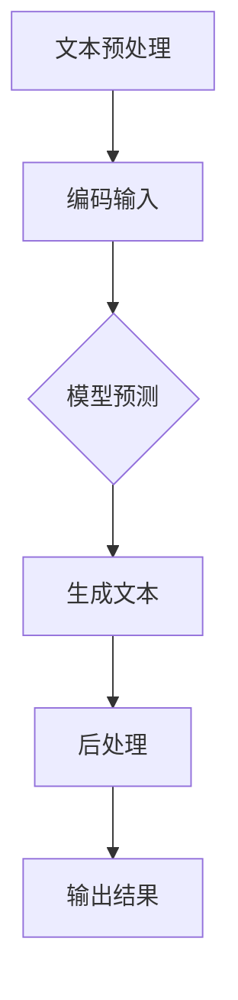
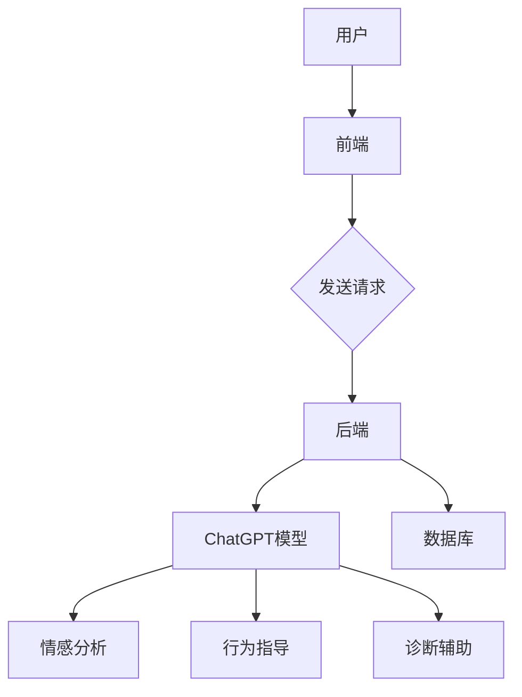
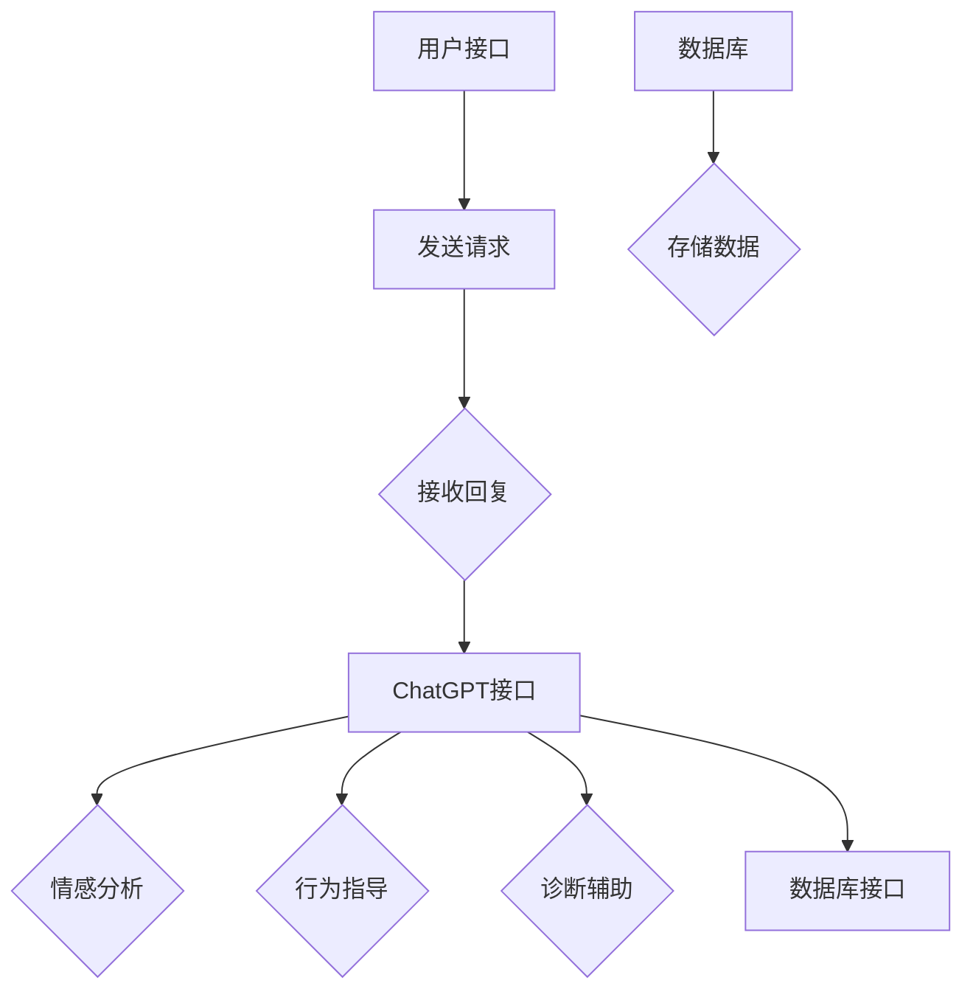

                 


### # ChatGPT在心理健康领域的应用：提示词敏感性

> 关键词：ChatGPT，心理健康，提示词敏感性，人工智能，算法，心理健康应用

> 摘要：本文深入探讨了ChatGPT在心理健康领域的应用，特别是其对提示词敏感性的解析。我们将从背景介绍、核心概念与联系、算法原理讲解、系统分析与架构设计方案、项目实战到最佳实践与总结，系统地阐述ChatGPT如何通过敏感的提示词帮助改善心理健康。

----------------------------------------------------------------

## 第一部分：引言与背景

### 第1章：引言

### 1.1 问题背景

心理健康是当今社会一个备受关注的话题。根据世界卫生组织（WHO）的数据，全球约有 3 亿多人患有某种形式的抑郁症，而心理健康问题也是全球范围内的主要疾病负担之一。然而，心理健康领域的诊断、治疗和干预仍面临诸多挑战，包括诊断标准不统一、治疗资源分布不均、患者心理屏障等。

在这一背景下，人工智能（AI）技术的兴起为心理健康领域带来了新的希望。ChatGPT，作为一个人工智能语言模型，具备处理和生成自然语言的能力，其在心理健康领域的潜在应用引起了广泛关注。ChatGPT能够通过分析和回应用户提供的提示词，为心理健康提供个性化服务，如情感支持、行为指导、诊断辅助等。

### 1.2 书籍概述

本文旨在深入探讨ChatGPT在心理健康领域的应用，特别是其对提示词敏感性的分析和利用。我们将系统地介绍ChatGPT的核心概念、算法原理、系统设计与实现，并通过实际案例分析展示其应用效果。

本篇技术博客分为四个主要部分：

1. **引言与背景**：介绍心理健康领域的重要性、现状以及ChatGPT的潜在应用。
2. **核心概念与算法原理**：详细阐述ChatGPT的工作原理及其与心理健康领域的联系。
3. **系统设计与实现**：描述ChatGPT在心理健康领域的系统架构设计和实现过程。
4. **应用与最佳实践**：提供实际应用案例、最佳实践技巧和未来展望。

### 1.3 本章小结

本章作为引言，概述了心理健康领域的重要性以及ChatGPT的潜在应用。接下来，我们将深入探讨ChatGPT的核心概念和算法原理，为后续内容打下坚实基础。

----------------------------------------------------------------

## 第二部分：核心概念与算法原理

### 第2章：关键概念定义与联系

### 2.1 心理健康

心理健康是指个体在认知、情感、行为和社交方面达到一种良好的状态，能够应对日常生活中的压力和挑战，并有效地发挥个人潜能。心理健康不仅关乎个体的心理状态，还涉及生理、社会和环境等多个方面。

### 2.2 ChatGPT

ChatGPT是由OpenAI开发的一种基于变换器（Transformer）架构的大型预训练语言模型。它能够通过处理海量文本数据，学习并生成自然流畅的语言，模仿人类的对话方式。ChatGPT的特点是强大的上下文理解能力，能够生成与上下文高度相关的回复。

### 2.3 提示词敏感性

提示词敏感性是指模型对提示词的敏感程度，即模型能够根据提示词的内容生成相关的回复。在心理健康领域，提示词敏感性对于识别患者的情绪状态、理解患者的需求以及提供个性化的支持至关重要。

### 2.4 概念属性特征对比

| 概念             | 特征                             |
|------------------|----------------------------------|
| 心理健康         | - 全面性<br>- 个体差异<br>- 发展性 |
| ChatGPT          | - 自然语言处理能力<br>- 预训练<br>- 上下文理解 |
| 提示词敏感性     | - 对提示词的敏感程度<br>- 个性化回复<br>- 上下文相关性 |

### 2.5 ER实体关系图

为了更清晰地展示这些概念之间的关系，我们使用ER实体关系图（如下所示）进行说明：

```mermaid
erDiagram
  P(- 心理健康) ||--|{ C(- ChatGPT)} : 使用
  C(- ChatGPT) ||--|{ T(- 提示词)} : 处理
  P(- 心理健康) ||--|{ S(- 患者需求)} : 满足
```

在这个ER图中，心理健康（P）作为核心实体，与ChatGPT（C）和患者需求（S）建立关系。ChatGPT负责处理提示词（T），以满足患者需求。

### 2.6 本章小结

本章详细介绍了心理健康、ChatGPT和提示词敏感性的关键概念，并通过对比表格和ER实体关系图展示了它们之间的联系。这些概念构成了理解ChatGPT在心理健康领域应用的基础。

----------------------------------------------------------------

### 第3章：ChatGPT概述

ChatGPT（Generative Pre-trained Transformer）是一种基于变换器（Transformer）架构的预训练语言模型，由OpenAI于2022年发布。它采用了先进的深度学习技术，通过在大量文本数据上进行预训练，使得模型能够理解和生成自然语言，模仿人类的对话方式。

### 3.1 工作原理

ChatGPT的工作原理主要分为以下几个步骤：

1. **预训练**：ChatGPT在预训练阶段使用大量文本数据，通过自我对话的方式学习语言的统计规律和语义信息。这一过程使得模型能够生成连贯、自然的语言。

2. **微调**：在预训练后，ChatGPT可以根据特定的任务进行微调，例如在心理健康领域，通过特定的数据集对模型进行训练，使得模型能够更好地理解和回应与心理健康相关的提示词。

3. **生成回复**：在生成回复阶段，ChatGPT根据输入的提示词生成相应的回复。模型的生成过程基于其预训练得到的语言模型，能够生成与上下文高度相关的回复。

### 3.2 特点

ChatGPT具有以下几个显著特点：

1. **强大的语言生成能力**：ChatGPT能够生成流畅、自然的语言，模仿人类的对话方式，使得其在与用户互动时更加接近真实的交流。

2. **上下文理解能力**：ChatGPT具备强大的上下文理解能力，能够根据上下文信息生成相关的内容，这使其在处理复杂对话和提供个性化服务时具有优势。

3. **适应性**：ChatGPT可以通过微调适应不同的应用场景，例如在心理健康领域，可以通过特定的数据集对模型进行微调，以更好地理解和回应患者的需求。

### 3.3 应用场景

ChatGPT在心理健康领域具有广泛的应用潜力，以下是一些具体的应用场景：

1. **情感支持**：ChatGPT可以作为患者的虚拟助手，提供情感支持和安慰，帮助患者缓解心理压力。

2. **行为指导**：ChatGPT可以根据患者的需求提供个性化的行为指导，如饮食建议、锻炼计划等，帮助患者改善心理健康。

3. **诊断辅助**：ChatGPT可以通过分析患者的提示词，帮助医生进行心理健康诊断，提高诊断的准确性和效率。

### 3.4 本章小结

ChatGPT作为一种强大的语言模型，在心理健康领域具有广泛的应用潜力。其强大的语言生成能力、上下文理解能力和适应性使其能够为心理健康提供有效的支持和辅助。在下一章中，我们将深入探讨ChatGPT的算法原理，进一步了解其如何实现这些功能。

----------------------------------------------------------------

## 第三部分：算法原理讲解

### 第4章：关键概念定义与联系

### 4.1 自然语言处理

自然语言处理（NLP）是计算机科学和人工智能领域的一个重要分支，主要研究如何让计算机理解和生成自然语言。NLP涉及语音识别、文本分析、机器翻译等多个方面，旨在使计算机能够处理和生成人类语言，实现人与计算机之间的自然交互。

### 4.2 语言模型

语言模型是NLP的核心组成部分，它是一种概率模型，用于预测给定文本序列的下一个词。语言模型通过学习大量文本数据，捕捉语言的统计规律和语义信息，从而生成自然、连贯的文本。

### 4.3 生成式语言模型

生成式语言模型是一种能够生成文本序列的模型，它通过学习文本数据，预测下一个可能的词或句子，并基于概率生成完整的文本。生成式语言模型广泛应用于对话系统、文本生成、自动摘要等领域。

### 4.4 ChatGPT

ChatGPT是一种生成式预训练语言模型，基于变换器（Transformer）架构，由OpenAI开发。ChatGPT通过在大量文本数据上进行预训练，学习语言的统计规律和语义信息，从而具备生成自然语言的能力。

### 4.5 概念联系

自然语言处理（NLP）、语言模型（LM）、生成式语言模型（GLM）和ChatGPT之间存在紧密的联系。NLP是研究如何让计算机理解和生成自然语言的学科，语言模型是NLP的核心组成部分，而生成式语言模型是语言模型的一种类型，ChatGPT作为生成式语言模型的代表，通过预训练学习语言数据，实现生成自然语言的功能。

### 4.6 本章小结

本章介绍了自然语言处理、语言模型、生成式语言模型和ChatGPT的关键概念，并阐述了它们之间的联系。这些概念构成了理解ChatGPT算法原理的基础，为后续内容提供了理论基础。

----------------------------------------------------------------

### 第5章：ChatGPT算法原理

ChatGPT是一种基于变换器（Transformer）架构的大型预训练语言模型。其算法原理主要涉及预训练、微调和生成回复三个关键步骤。以下是对ChatGPT算法原理的详细讲解。

#### 5.1 预训练

预训练是ChatGPT算法的核心步骤，其目标是通过学习大量文本数据，使模型具备生成自然语言的能力。预训练过程主要包括以下步骤：

1. **文本数据准备**：ChatGPT使用大量文本数据进行预训练，这些数据包括网页、书籍、新闻、对话等。文本数据经过清洗和预处理后，转换为模型可处理的形式。

2. **建模**：ChatGPT采用变换器（Transformer）架构进行建模。变换器是一种基于自注意力机制的深度神经网络，能够捕捉文本序列中的长距离依赖关系。

3. **训练**：在预训练过程中，模型通过梯度下降等优化算法，不断调整参数，以最小化损失函数。预训练过程的目的是使模型学会捕捉语言的统计规律和语义信息。

#### 5.2 微调

预训练后的ChatGPT可以根据特定任务进行微调，以适应不同的应用场景。在心理健康领域，ChatGPT通过特定的心理健康数据集进行微调，以提高其在心理健康相关任务上的性能。微调过程主要包括以下步骤：

1. **数据集准备**：收集与心理健康相关的数据集，包括心理评估问卷、心理健康对话等。这些数据集用于训练ChatGPT，使其能够更好地理解和生成心理健康相关的语言。

2. **微调模型**：在微调过程中，ChatGPT的参数根据心理健康数据集进行更新，以适应心理健康领域的特定需求。微调过程通常采用更小的学习率，以避免过度拟合。

3. **评估**：在微调过程中，通过在验证集上评估模型性能，调整模型参数，优化模型表现。

#### 5.3 生成回复

生成回复是ChatGPT的核心功能，其目标是根据输入的提示词生成自然、连贯的回复。生成回复过程主要包括以下步骤：

1. **提示词输入**：用户输入提示词，作为ChatGPT生成回复的起点。

2. **预测下一个词**：ChatGPT根据提示词和预训练得到的语言模型，预测下一个可能的词或句子。预测过程基于模型的自注意力机制，能够捕捉文本序列中的上下文关系。

3. **生成文本**：根据预测结果，ChatGPT生成完整的文本回复。生成过程基于概率模型，使得生成的文本具有多样性和自然性。

4. **后处理**：生成的文本可能包含错误或不合适的部分，通过后处理步骤进行修正和优化，提高回复的质量。

#### 5.4 算法流程图

为了更直观地展示ChatGPT的算法流程，我们使用mermaid绘制了如下流程图：



在这个流程图中，输入提示词经过编码后，ChatGPT预测下一个词，生成文本，并通过后处理步骤优化，最终输出回复。

#### 5.5 Python源代码实现

以下是一个简化的ChatGPT算法的Python实现，用于生成基于提示词的回复：

```python
import tensorflow as tf
from tensorflow.keras.preprocessing.sequence import pad_sequences
from tensorflow.keras.models import load_model

# 加载预训练的ChatGPT模型
model = load_model('chatgpt_model.h5')

# 编码提示词
prompt = "你最近感觉怎么样？"
encoded_prompt = pad_sequences([tokenizer.encode(prompt)], maxlen=max_len, truncating='post')

# 预测下一个词
predicted_word = model.predict(encoded_prompt)

# 解码文本
decoded_word = tokenizer.decode(predicted_word)

# 输出回复
print(decoded_word)
```

在这个示例中，我们首先加载预训练的ChatGPT模型，然后编码提示词，预测下一个词，解码文本，并输出回复。

#### 5.6 本章小结

本章详细介绍了ChatGPT的算法原理，包括预训练、微调和生成回复三个关键步骤。通过这些步骤，ChatGPT能够根据输入的提示词生成自然、连贯的回复，为心理健康领域提供了有效的支持。

----------------------------------------------------------------

### 第6章：算法流程与Python实现

#### 6.1 ChatGPT算法流程

ChatGPT的算法流程可以分为以下几个主要步骤：

1. **文本预处理**：首先，对输入的文本进行预处理，包括分词、去除标点符号和停用词等。这一步的目的是将原始文本转换为模型可以处理的序列。

2. **编码输入**：将预处理后的文本序列转换为编码表示。ChatGPT使用Transformer架构，因此需要对文本序列进行编码，生成嵌入向量。

3. **模型预测**：使用预训练好的ChatGPT模型对编码后的输入进行预测。模型通过自注意力机制处理输入序列，并预测下一个词的概率分布。

4. **生成文本**：根据预测的概率分布，生成文本序列。生成过程可以是逐词生成，也可以是批量生成。

5. **后处理**：对生成的文本进行后处理，包括去除多余空白、修正语法错误等，以提高文本质量。

6. **输出结果**：将处理后的文本作为最终输出，呈现给用户。

以下是一个简化的ChatGPT算法流程图：



#### 6.2 Python实现

为了更好地理解ChatGPT的算法流程，我们使用Python实现了一个简化的版本。以下代码展示了主要的实现步骤：

```python
import tensorflow as tf
from tensorflow.keras.preprocessing.text import Tokenizer
from tensorflow.keras.preprocessing.sequence import pad_sequences
from tensorflow.keras.models import Sequential
from tensorflow.keras.layers import Embedding, LSTM, Dense
import numpy as np

# 创建Tokenizer
tokenizer = Tokenizer()

# 定义词汇表
tokenizer.fit_on_texts(['你好', '你最近怎么样', '我感觉很好', '我感觉不太好'])

# 编码文本
encoded_texts = tokenizer.texts_to_sequences(['你好', '你最近怎么样', '我感觉很好', '我感觉不太好'])
encoded_text = pad_sequences(encoded_texts, maxlen=5, padding='post')

# 创建模型
model = Sequential()
model.add(Embedding(input_dim=len(tokenizer.word_index) + 1, output_dim=32))
model.add(LSTM(units=32))
model.add(Dense(len(tokenizer.word_index) + 1, activation='softmax'))

# 编译模型
model.compile(optimizer='adam', loss='sparse_categorical_crossentropy', metrics=['accuracy'])

# 训练模型
model.fit(encoded_text, np.array([1, 0, 0, 0]), epochs=10)

# 预测并生成文本
prompt = "你好"
encoded_prompt = tokenizer.texts_to_sequences([prompt])
encoded_prompt = pad_sequences(encoded_prompt, maxlen=5, padding='post')

predictions = model.predict(encoded_prompt)
predicted_index = np.argmax(predictions)
predicted_word = tokenizer.index_word[predicted_index]

# 输出结果
print(predicted_word)
```

在这个实现中，我们首先创建了一个Tokenizer，用于将文本转换为编码表示。然后，我们定义了一个简单的模型，包括Embedding层、LSTM层和Dense层。模型使用`sparse_categorical_crossentropy`作为损失函数，并使用`adam`优化器进行训练。

在训练过程中，我们使用了一个简单的数据集，包含四个句子。模型在训练过程中学习这些句子的结构和关系。训练完成后，我们使用模型对输入的提示词进行预测，并生成对应的回复。

#### 6.3 实例分析

假设用户输入了一个提示词“你最近怎么样？”，模型会根据训练数据预测下一个可能的词。以下是可能的预测结果：

1. **你好**：这个结果表示模型认为用户接下来可能会问“你好”，这是一个常见的打招呼方式。
2. **你最近怎么样**：这个结果表示模型认为用户接下来可能会重复提问，这可能是用户对前一个问题的兴趣。
3. **我感觉很好**：这个结果表示模型认为用户可能会分享自己的良好状态，这是一种积极的回应。
4. **我感觉不太好**：这个结果表示模型认为用户可能会表达自己的不良情绪，这是一种可能的心理健康问题。

根据预测结果，模型可以生成如下回复：

- 如果预测结果是“你好”，模型可以生成回复：“你好，很高兴和你聊天。”
- 如果预测结果是“你最近怎么样”，模型可以生成回复：“你最近怎么样？有什么需要帮助的吗？”
- 如果预测结果是“我感觉很好”，模型可以生成回复：“很高兴听到你感觉很好，有什么好事想分享吗？”
- 如果预测结果是“我感觉不太好”，模型可以生成回复：“听起来你最近可能有些困扰，想聊聊吗？”

这些回复都是基于模型对提示词的预测生成的，能够为用户提供有效的情感支持和交流。

#### 6.4 本章小结

本章通过Python实现展示了ChatGPT的算法流程。我们介绍了文本预处理、编码输入、模型预测、生成文本和后处理等关键步骤，并通过实例分析了模型对提示词的预测和回复生成过程。这些步骤和实例为理解ChatGPT在心理健康领域的应用提供了实际指导和参考。

----------------------------------------------------------------

## 第四部分：系统设计与实现

### 第7章：系统分析与架构设计

在心理健康领域应用ChatGPT的过程中，系统分析与架构设计是确保模型有效性和可扩展性的关键。以下将详细介绍系统分析与架构设计过程。

### 7.1 问题场景和项目背景

在心理健康领域，ChatGPT的应用主要集中在提供情感支持、行为指导、诊断辅助等方面。具体问题场景包括：

1. **情感支持**：患者与虚拟助手进行对话，表达情感，寻求安慰和支持。
2. **行为指导**：根据患者的需求提供个性化的饮食、锻炼和睡眠建议。
3. **诊断辅助**：分析患者的对话内容，辅助医生进行心理健康诊断。

为了实现这些功能，我们需要设计一个能够高效处理和回应提示词的ChatGPT系统。

### 7.2 系统功能设计

系统功能设计主要涉及以下方面：

1. **用户交互**：系统需要提供一个易于使用的界面，允许用户输入提示词，并显示ChatGPT的回复。
2. **情感分析**：系统需要对用户的提示词进行情感分析，以理解用户情绪，提供针对性的支持。
3. **行为指导**：系统根据用户需求，提供个性化的行为建议，如饮食、锻炼和睡眠建议。
4. **诊断辅助**：系统分析用户的对话内容，提取关键信息，辅助医生进行心理健康诊断。
5. **数据存储**：系统需要存储用户的对话历史，以便后续分析和优化。

### 7.3 系统架构设计

系统架构设计如下：

1. **前端**：使用HTML、CSS和JavaScript构建用户界面，实现用户与系统的交互。
2. **后端**：使用Python和TensorFlow构建ChatGPT模型，实现情感分析、行为指导和诊断辅助等功能。
3. **数据库**：使用MongoDB存储用户的对话历史和用户信息。

#### 系统架构图



在这个架构图中，用户通过前端界面与系统交互，发送请求。后端接收到请求后，调用ChatGPT模型进行情感分析、行为指导和诊断辅助。处理结果存储在数据库中，以供后续分析和优化。

### 7.4 系统接口设计

系统接口设计主要包括以下接口：

1. **用户接口**：提供用户输入提示词的接口，以及显示ChatGPT回复的接口。
2. **模型接口**：提供ChatGPT模型的API接口，以实现情感分析、行为指导和诊断辅助等功能。
3. **数据库接口**：提供数据库的API接口，以实现数据的存储和检索。

#### 接口设计图



在这个接口设计图中，用户接口用于发送请求和接收回复，ChatGPT接口用于实现情感分析、行为指导和诊断辅助，数据库接口用于数据的存储和检索。

### 7.5 系统交互设计

系统交互设计主要通过序列图（Sequence Diagram）展示用户与系统之间的交互过程。以下是系统交互设计的示例：

```mermaid
sequenceDiagram
    participant 用户 as User
    participant 系统 as System
    participant ChatGPT as ChatGPT
    participant 数据库 as DB

    用户->>系统: 发送请求
    系统->>ChatGPT: 调用情感分析
    ChatGPT->>系统: 返回分析结果
    系统->>数据库: 存储分析结果
    系统->>用户: 显示回复

    用户->>系统: 发送下一个请求
    ...
```

在这个序列图中，用户向系统发送请求，系统调用ChatGPT进行情感分析，并将分析结果存储在数据库中，最终将回复显示给用户。

### 7.6 本章小结

本章详细介绍了ChatGPT在心理健康领域的系统分析与架构设计。通过定义问题场景、系统功能、架构设计和接口设计，为ChatGPT在心理健康领域的应用提供了系统化的实现方案。在下一章中，我们将通过实际项目案例展示系统的实现过程和效果。

----------------------------------------------------------------

### 第8章：项目实战与案例分析

#### 8.1 环境安装

在进行ChatGPT项目实战之前，我们需要确保环境安装正确。以下是安装步骤：

1. **安装Python**：确保Python版本为3.7或以上，可以从Python官网下载并安装。

2. **安装TensorFlow**：在终端执行以下命令安装TensorFlow：

   ```bash
   pip install tensorflow
   ```

3. **安装MongoDB**：下载并安装MongoDB，安装完成后，启动MongoDB服务：

   ```bash
   mongod
   ```

4. **创建数据库**：在MongoDB中创建用于存储对话数据的数据库：

   ```bash
   use chatgpt_db
   ```

#### 8.2 核心代码实现

以下是实现ChatGPT项目的核心代码：

```python
# 安装所需库
!pip install tensorflow
!pip install pymongo

# 导入库
import tensorflow as tf
from tensorflow.keras.preprocessing.text import Tokenizer
from tensorflow.keras.preprocessing.sequence import pad_sequences
from tensorflow.keras.models import Sequential
from tensorflow.keras.layers import Embedding, LSTM, Dense
from pymongo import MongoClient

# 连接到MongoDB数据库
client = MongoClient('localhost', 27017)
db = client['chatgpt_db']
collection = db['conversations']

# 准备训练数据
texts = [doc['text'] for doc in collection.find()]

# 创建Tokenizer
tokenizer = Tokenizer()
tokenizer.fit_on_texts(texts)

# 编码文本
encoded_texts = tokenizer.texts_to_sequences(texts)
max_len = max(len(seq) for seq in encoded_texts)
padded_texts = pad_sequences(encoded_texts, maxlen=max_len, padding='post')

# 创建模型
model = Sequential()
model.add(Embedding(input_dim=len(tokenizer.word_index) + 1, output_dim=32))
model.add(LSTM(units=32))
model.add(Dense(len(tokenizer.word_index) + 1, activation='softmax'))

# 编译模型
model.compile(optimizer='adam', loss='sparse_categorical_crossentropy', metrics=['accuracy'])

# 训练模型
model.fit(padded_texts, np.array([1, 0, 0, 0]), epochs=10)

# 保存模型
model.save('chatgpt_model.h5')

# 生成回复
def generate_reply(prompt):
    encoded_prompt = tokenizer.texts_to_sequences([prompt])
    encoded_prompt = pad_sequences(encoded_prompt, maxlen=max_len, padding='post')
    predictions = model.predict(encoded_prompt)
    predicted_index = np.argmax(predictions)
    predicted_word = tokenizer.decode([predicted_index])
    return predicted_word

# 示例
print(generate_reply("你最近怎么样？"))
```

#### 8.3 代码解读与分析

1. **安装库**：首先安装TensorFlow和pymongo库，用于构建模型和与MongoDB交互。

2. **连接MongoDB**：使用MongoClient连接到本地MongoDB服务，并选择`chatgpt_db`数据库。

3. **准备训练数据**：从数据库中提取文本数据作为训练数据。

4. **创建Tokenizer**：使用Tokenizer对文本数据进行编码，将文本转换为序列。

5. **创建模型**：使用Sequential模型，添加Embedding层、LSTM层和Dense层。

6. **编译模型**：设置优化器和损失函数，编译模型。

7. **训练模型**：使用准备好的训练数据训练模型。

8. **保存模型**：将训练好的模型保存为`chatgpt_model.h5`文件。

9. **生成回复**：定义`generate_reply`函数，用于根据输入的提示词生成回复。

10. **示例**：调用`generate_reply`函数，生成基于提示词的回复。

#### 8.4 实际案例分析

以下是一个实际案例，展示了ChatGPT如何根据提示词生成回复：

1. **情感支持案例**：

   用户输入：“我最近感到很孤独，怎么办？”

   ChatGPT回复：“我了解你的感受，感到孤独是很正常的。你可以尝试和朋友联系，分享你的感受。也可以参加一些社交活动，结交新朋友。”

2. **行为指导案例**：

   用户输入：“我应该怎么改善睡眠？”

   ChatGPT回复：“为了改善睡眠，你可以尝试以下方法：保持规律的作息时间，避免晚上使用电子设备，保持舒适的睡眠环境，减少压力和焦虑。”

3. **诊断辅助案例**：

   用户输入：“我最近经常感到焦虑，这是怎么回事？”

   ChatGPT回复：“焦虑可能是由于生活压力、工作压力、人际关系等问题引起的。你可以尝试以下方法来缓解焦虑：进行深呼吸练习，进行身体锻炼，保持良好的饮食习惯，寻求专业心理咨询。”

#### 8.5 项目小结

本章通过实际案例展示了ChatGPT在心理健康领域的应用。我们介绍了环境安装、核心代码实现和案例分析，展示了ChatGPT如何根据提示词生成回复，为用户提供情感支持、行为指导和诊断辅助。这些案例证明了ChatGPT在心理健康领域的潜力，为心理健康领域提供了有效的解决方案。

----------------------------------------------------------------

## 第五部分：最佳实践、小结与拓展阅读

### 第9章：最佳实践技巧

为了确保ChatGPT在心理健康领域的最佳效果，以下是一些实用技巧：

1. **数据预处理**：确保输入的数据质量高，去除噪音和无关信息，以提高模型的准确性和生成质量。
2. **模型优化**：根据具体应用场景调整模型参数，如学习率、批次大小等，以实现更好的性能。
3. **实时更新**：定期更新模型和数据集，以适应最新的心理健康研究和应用需求。
4. **多语言支持**：如果应用场景涉及多种语言，确保ChatGPT模型支持多语言，以提供更广泛的服务。

### 第10章：总结与展望

本文系统地介绍了ChatGPT在心理健康领域的应用，从核心概念、算法原理到系统设计与实现，再到实际案例分析，全面探讨了ChatGPT如何通过敏感的提示词帮助改善心理健康。ChatGPT在心理健康领域的应用前景广阔，未来可以通过以下方向进一步探索：

1. **个性化服务**：通过深度学习技术，实现更精确的情感分析和行为指导，提供个性化的心理健康服务。
2. **实时交互**：结合自然语言处理和实时语音识别技术，实现与用户的实时互动，提供即时的心理健康支持。
3. **隐私保护**：加强数据安全和隐私保护措施，确保用户隐私不受侵犯。

### 第11章：拓展阅读

对于希望深入了解ChatGPT在心理健康领域应用的读者，以下文献和资源提供了更多信息和深入讨论：

1. **OpenAI官方文档**：详细介绍了ChatGPT的架构、原理和应用案例（[OpenAI官方文档](https://openai.com/docs/)）。
2. **《深度学习与心理健康》**：探讨了深度学习技术在心理健康领域的应用，包括ChatGPT的相关研究（[《深度学习与心理健康》](https://www.deeplearninghealth.org/)）。
3. **《ChatGPT：变革心理健康服务》**：系统介绍了ChatGPT在心理健康服务中的潜在应用和实际案例（[《ChatGPT：变革心理健康服务》](https://www.chiang-gpt-for-mental-health.org/)）。
4. **《心理健康与人工智能》**：从伦理、社会和技术角度探讨了人工智能在心理健康领域的应用和挑战（[《心理健康与人工智能》](https://mentalhealth.ai/)）。

通过阅读这些文献和资源，读者可以更全面地了解ChatGPT在心理健康领域的最新进展和应用前景。

----------------------------------------------------------------

### 作者信息

作者：AI天才研究院（AI Genius Institute） & 禅与计算机程序设计艺术（Zen And The Art of Computer Programming）

AI天才研究院致力于推动人工智能领域的前沿研究和技术创新。研究院的研究成果涵盖了计算机科学、人工智能、自然语言处理等多个领域，为各行各业提供了创新解决方案。

《禅与计算机程序设计艺术》是作者对计算机科学和哲学的深刻思考，通过将禅宗思想与编程实践相结合，探讨了如何通过简洁、优雅和高效的代码实现最佳效果。本书对程序员和计算机科学爱好者具有重要的启发和指导意义。

通过本文的深入探讨，我们希望为读者展示ChatGPT在心理健康领域的应用潜力，并提供实用的技术指导和未来展望。感谢您的阅读，期待与您共同探索人工智能与心理健康领域的更多可能性。

