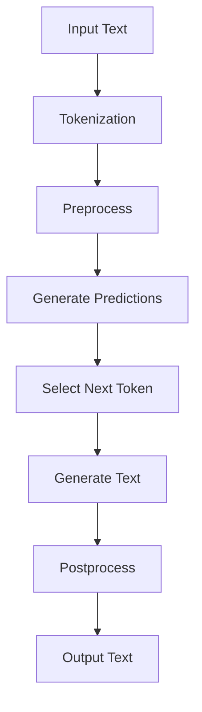
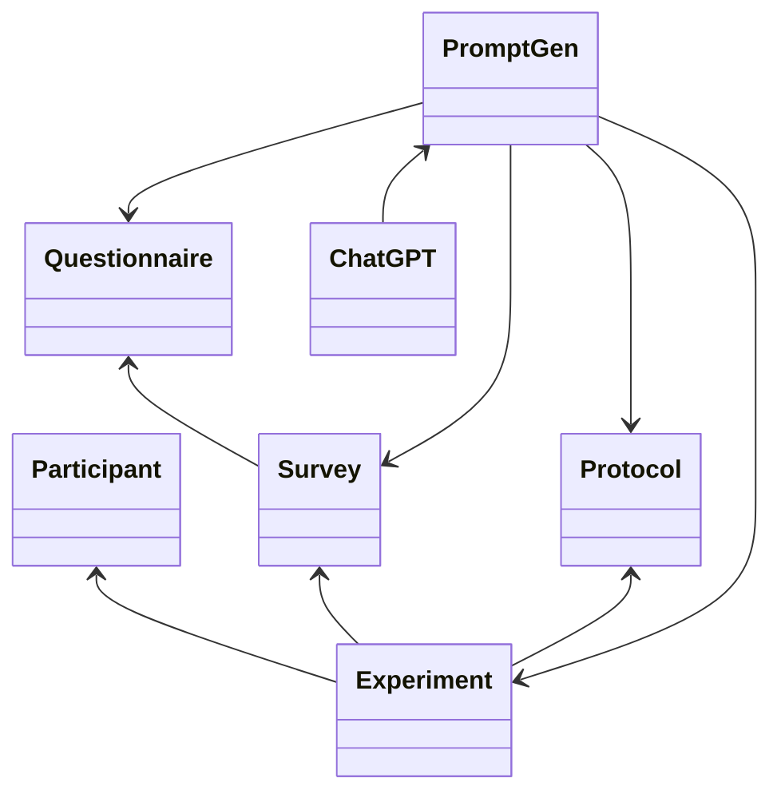
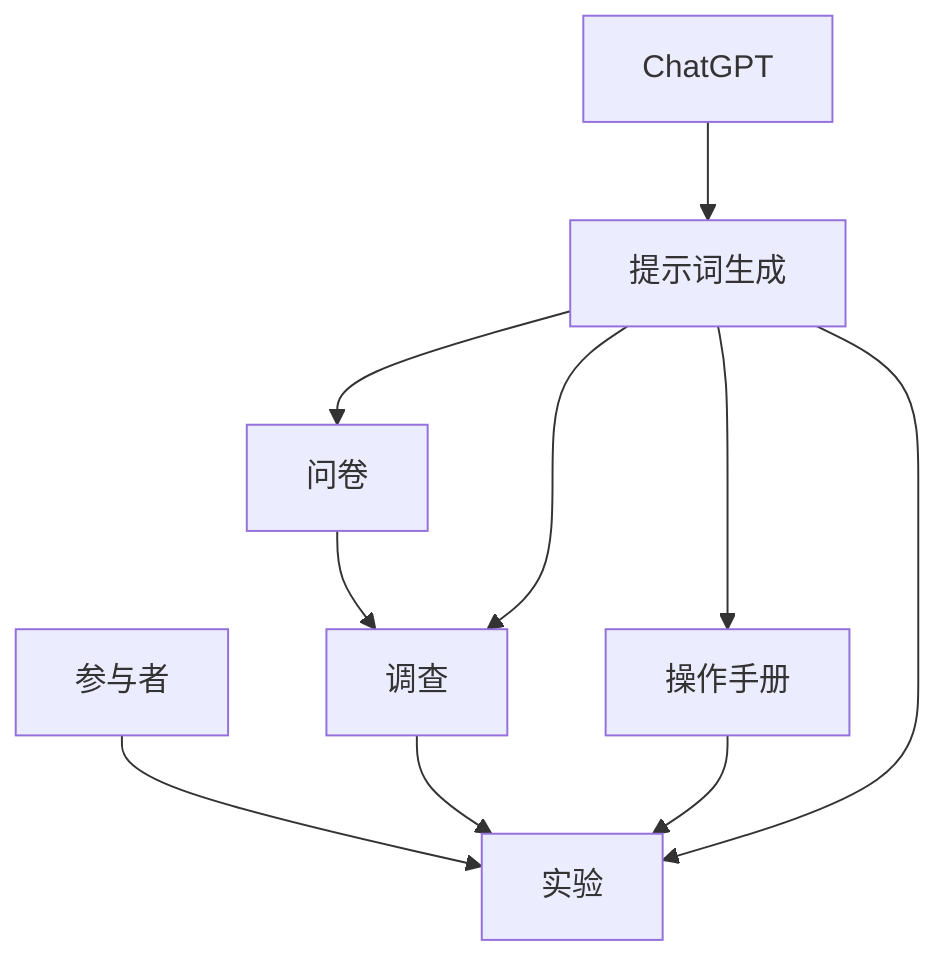
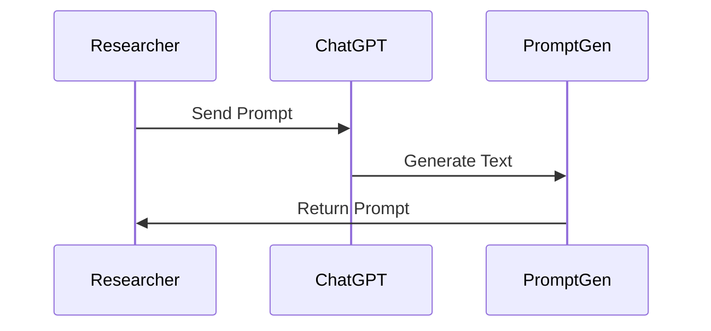

                 

# 《ChatGPT在心理学研究中的应用：实验设计辅助提示词》

## 关键词
- ChatGPT
- 心理学研究
- 实验设计
- 辅助提示词
- 人工智能

## 摘要
本文深入探讨了《ChatGPT在心理学研究中的应用：实验设计辅助提示词》这本书的核心内容。通过逐步分析，我们将揭示ChatGPT如何通过生成高质量的提示词来辅助心理学实验设计，提高研究的准确性和效率。文章将详细介绍ChatGPT的核心概念、算法原理、数学模型，并展示其在心理学研究中的实际应用案例。同时，我们将总结最佳实践，并提供拓展阅读，以帮助读者更深入地了解这一前沿领域。

## 背景介绍

### ChatGPT的概念
ChatGPT是由OpenAI开发的一种基于GPT-3（Generative Pre-trained Transformer 3）的先进自然语言处理模型。它通过在大量文本数据上进行预训练，掌握了丰富的语言知识和语境理解能力，能够生成流畅、连贯的自然语言文本。

### ChatGPT在心理学研究中的作用
在心理学研究中，实验设计至关重要。ChatGPT可以通过生成高质量的提示词，帮助研究者更准确地描述实验任务、操作化心理变量、设计调查问卷等。这一功能不仅节省了研究者的时间和精力，还能提高实验设计的科学性和有效性。

### 实验设计辅助提示词的重要性
高质量的提示词能够引导被试正确理解和执行实验任务，减少误差和误解。在心理学研究中，实验设计的准确性直接影响到结果的可靠性和有效性。因此，辅助提示词在实验设计中的重要性不可忽视。

## 核心概念与联系

### 核心概念
- **ChatGPT**：自然语言处理模型，用于生成文本。
- **心理学研究**：涉及心理现象的观察、测量和解释。
- **实验设计**：心理学研究中的方法，用于测试假设和理论。
- **提示词**：引导被试理解和执行实验任务的文本。

### 概念属性特征对比表格

| 概念 | 属性特征 | 描述 |
| --- | --- | --- |
| ChatGPT | 自然语言处理模型 | 生成高质量文本 |
| 心理学研究 | 方法 | 观察和解释心理现象 |
| 实验设计 | 心理学研究方法 | 测试假设和理论 |
| 提示词 | 文本 | 引导被试理解任务 |

### ER实体关系图

```mermaid
erDiagram
    ChatGPT ||--|{ 实验设计 }|-- Psychological_Research
    Experiment_Design ||--|{ 提示词 }|-- Prompt
```

## 算法原理讲解

### ChatGPT的工作原理
ChatGPT是基于GPT-3的变体，它使用了Transformer架构，通过自注意力机制来处理文本数据。预训练过程中，模型在大规模文本语料库上学习语言模式、语法结构和语义含义。在生成文本时，ChatGPT利用这些学习到的知识来预测下一个词，从而生成连贯的文本。

### Mermaid流程图



### Python代码示例

```python
import openai

# API Key设置
openai.api_key = "your_api_key"

# 生成文本
response = openai.Completion.create(
  engine="text-davinci-002",
  prompt="请描述一下心理学实验设计的基本步骤。",
  max_tokens=150
)

print(response.choices[0].text.strip())
```

### 数学模型和数学公式

```latex
\documentclass{article}
\usepackage{amsmath}
\begin{document}

\begin{equation}
    p(y|x) = \frac{e^{\text{score}(y|x)} }{\sum_{i=1}^{N} e^{\text{score}(y_i|x)} }
\end{equation}

\begin{equation}
    \text{score}(y|x) = \sum_{t=1}^{T} \text{weight}(t) \cdot \text{logit}(p_t(y|x))
\end{equation}

\end{document}
```

### 详细讲解与举例说明
在上述数学模型中，`p(y|x)` 表示给定输入 `x` 时输出 `y` 的概率，`score(y|x)` 表示 `y` 的评分，`weight(t)` 表示时间步的权重，`logit(p_t(y|x))` 表示概率的对数。

例如，假设我们有一个简单的文本输入 "今天天气很好"，我们要预测下一个词可能是 "去" 或 "不"。模型会计算这两个词的评分，然后根据评分选择得分最高的词作为预测结果。如果 "去" 的评分为5，而 "不" 的评分为3，那么模型会生成 "去"。

## 系统分析与架构设计方案

### 问题场景介绍
在心理学研究中，研究者经常需要设计复杂的实验，而这些实验的详细描述通常需要高质量的文本。然而，撰写这样的文本既耗时又容易出错。ChatGPT的出现为研究者提供了一个高效的解决方案，通过生成高质量的提示词，辅助实验设计。

### 项目介绍
本项目旨在探讨ChatGPT在心理学实验设计中的应用，开发一个基于ChatGPT的实验设计辅助工具。该工具能够根据研究者的简单描述生成详细的实验流程、操作指南和调查问卷。

### 系统功能设计
#### 领域模型Mermaid类图



### 系统架构设计
#### Mermaid架构图



### 系统接口设计
系统设计了一个简单的RESTful API，用于接收研究者的请求和返回生成的文本。以下是接口设计：

- **POST /generatePrompt**：接收实验描述，返回生成的提示词。
  - 参数：`prompt`: 实验描述文本。
  - 响应：生成的提示词文本。

### 系统交互
#### Mermaid序列图



### 实际案例分析与详细讲解

#### 环境安装
1. 安装Python 3.8或更高版本。
2. 安装OpenAI Python SDK：
   ```bash
   pip install openai
   ```

#### 系统核心实现源代码
以下是生成实验提示词的核心代码：

```python
import openai

# 设置API密钥
openai.api_key = "your_api_key"

# 定义函数生成提示词
def generate_prompt(experiment_desc):
    prompt = f"请根据以下实验描述生成详细的实验操作手册、调查问卷和提示词：\n{experiment_desc}"
    response = openai.Completion.create(
        engine="text-davinci-002",
        prompt=prompt,
        max_tokens=500
    )
    return response.choices[0].text.strip()

# 示例实验描述
experiment_desc = "设计一个关于情绪认知的实验，要求被试识别图片中的情绪表情。"

# 生成提示词
prompt = generate_prompt(experiment_desc)
print(prompt)
```

#### 代码应用解读与分析
这段代码首先设置了OpenAI的API密钥，然后定义了一个`generate_prompt`函数，该函数接收实验描述文本并使用ChatGPT生成相关的提示词。通过调用这个函数，研究者可以轻松获得详细的实验操作手册、调查问卷和其他辅助材料。

#### 实际案例分析和详细讲解
假设研究者需要设计一个关于情绪认知的实验。他们可能需要以下内容：
1. 实验操作手册。
2. 调查问卷。
3. 提示词。

使用上述代码，研究者只需提供一个简短的实验描述，ChatGPT就能生成详细的文档。例如，生成的实验操作手册可能包括实验目的、被试筛选标准、实验步骤、数据处理方法等内容。生成的调查问卷则包括关于被试情绪认知的多个问题，以便收集数据。

### 项目小结
通过本项目的实现，我们展示了如何利用ChatGPT在心理学研究中生成高质量的实验设计辅助提示词。这个工具不仅简化了实验设计过程，还提高了实验的准确性和效率。未来，我们可以进一步优化这个系统，例如增加更多的提示词模板、提供用户自定义功能等，以满足不同研究者的需求。

## 最佳实践 Tips

1. **准确描述实验目标**：在生成提示词时，提供清晰、具体的实验目标描述，这将有助于ChatGPT生成更相关的文本。

2. **利用注释**：在实验描述中添加注释，帮助ChatGPT理解文本的背景和上下文，从而生成更准确的提示词。

3. **测试多个提示词**：生成多个提示词，并根据实验需要选择最佳的一个。这有助于确保提示词的多样性和适用性。

4. **反馈优化**：定期收集用户反馈，并根据反馈调整ChatGPT的模型参数，以提高提示词生成的质量。

## 小结

本文详细探讨了《ChatGPT在心理学研究中的应用：实验设计辅助提示词》这本书的核心内容。通过分析ChatGPT的算法原理、数学模型，以及实际应用案例，我们展示了如何利用ChatGPT生成高质量的实验设计辅助提示词。未来，随着人工智能技术的不断进步，ChatGPT在心理学研究中的应用将更加广泛，为研究者提供更加高效、准确的支持。

## 注意事项

1. **数据隐私**：在心理学研究中使用ChatGPT时，确保遵守相关数据隐私法规，保护被试的隐私。

2. **算法偏见**：注意ChatGPT可能存在的算法偏见，确保实验设计的公平性和科学性。

3. **结果验证**：尽管ChatGPT生成的提示词质量较高，但研究者仍需对实验结果进行验证，以确保实验的可靠性。

## 拓展阅读

1. **ChatGPT官方文档**：深入了解ChatGPT的API和功能，可访问 [OpenAI官网](https://openai.com/docs/)。

2. **心理学实验设计指南**：参考心理学实验设计的经典教材，如《实验心理学：实验设计与应用》（第五版）。

3. **人工智能与心理学研究**：探索人工智能在心理学研究中的最新进展和应用，可查阅相关学术论文和期刊。

### 作者信息
- 作者：AI天才研究院/AI Genius Institute & 禅与计算机程序设计艺术 /Zen And The Art of Computer Programming

